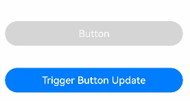
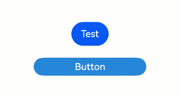

# AttributeUpdater

<!--Kit: ArkUI-->
<!--Subsystem: ArkUI-->
<!--Owner: @sunbees-->
<!--Designer: @sunbees-->
<!--Tester: @khq-->
<!--Adviser: @Brilliantry_Rui-->
<!-- md-trans-meta sourceCommit=d89c4be0c26be57dcac6e3a0bb8b7f968642aa19 translatedAt=2026-07-29T09:27:32.314Z pushedAt=2026-07-31T10:47:41.992Z -->

Sets attributes directly to a component to trigger UI re-renders, without marking them as state variables. This is applicable to scenarios where component attributes need to be dynamically updated without defining state variables, such as dynamically modifying component constructor parameters or avoiding defining state variables for one-time attribute updates.

> **NOTE**
>
> - The initial APIs of this module are supported since API version 12. Updates will be marked with a superscript to indicate their earliest API version.
>
> - The APIs of this module can be used only in the stage model.

## Modules to Import

```ts
import { AttributeUpdater } from '@kit.ArkUI';
```

> **Instructions**
>
> 1. When **AttributeUpdater** is used together with an attribute method, or when methods such as **applyNormalAttribute** are implemented in **AttributeUpdater**, **AttributeUpdater** and the state management update mechanism take effect simultaneously, which can easily cause confusion. Therefore, it is not recommended to use both the attribute method (state management mechanism) and **AttributeUpdater** to set the same attribute on the same component.
>
> 2. When **AttributeUpdater** is used together with an attribute method, the one that is used later takes effect. Specifically:
> If use of **AttributeUpdater** is followed by an attribute method call, the attribute method takes effect under the state management mechanism.
> If use of **AttributeUpdater** follows an attribute method call, it takes effect.
>
> 3. An **AttributeUpdater** object can only be associated with one component at a time; otherwise, the set attributes may only take effect on one component.
>
> 4. You need to ensure the type matching of **T** and **C** in **AttributeUpdater** yourself. For example, if **T** is **ImageAttribute**, **C** should be **ImageInterface**; otherwise, it may cause functionality issues when **updateConstructorParams** is used.
>
> 5. Currently, **updateConstructorParams** supports only the following components: **Button**, **Image**, **Text**, **Span**, **SymbolSpan**, and **ImageSpan**.
>
> 6. **AttributeUpdater** does not support operations related to state management, such as switching between light and dark modes.
>
> 7. When the API of the [AttributeUpdater](#attributeupdatert-c--initializert) object is invoked in the scenario of [ambiguous UI context](../../ui/arkts-global-interface.md#ambiguous-ui-context), you are advised to use the [runScopedTask](./arkts-apis-uicontext-uicontext.md#runscopedtask) API of [UIContext](./arkts-apis-uicontext-uicontext.md) to specify the UI context. For details, see [Executing the Closure Bound to a UI Instance](../../ui/arkts-global-interface.md#executing-the-closure-bound-to-a-ui-instance).

## Initializer\<T>

type Initializer\<T> = () => T

Defines the type of the initialization function for component attributes, which is used to create and return an attribute instance of the component.

**Atomic service API**: This API can be used in atomic services since API version 12.

**System capability**: SystemCapability.ArkUI.ArkUI.Full

**Return value**

| Type    |                Description        |
| -------- | ------------------------- |
|  T       | Attribute instance of the current component.        |

## AttributeUpdater\<T, C = Initializer\<T>>

Represents the implementation class of [AttributeModifier](arkui-ts/ts-universal-attributes-attribute-modifier.md#attributemodifiert). You need to customize a class to inherit **AttributeUpdater**.

**C** indicates the constructor type of the component, for example, **TextInterface** of the **Text** component and **ImageInterface** of the **Image** component. It is required only when **updateConstructorParams** is used.

**Atomic service API**: This API can be used in atomic services since API version 12.

**System capability**: SystemCapability.ArkUI.ArkUI.Full

### applyNormalAttribute

applyNormalAttribute?(instance: T): void

Defines the normal-state attribute update function, which is triggered when **AttributeUpdater** subsequently updates attributes. It is not recommended to use both **AttributeUpdater** and an attribute method to set the same attribute on the same component, as this can easily cause confusion. When **AttributeUpdater** is used together with an attribute method, the one that is used later takes effect.

**Atomic service API**: This API can be used in atomic services since API version 12.

**System capability**: SystemCapability.ArkUI.ArkUI.Full

**Parameters**

| Name| Type  | Mandatory| Description                                                                    |
| ------ | ------ | ---- | ------------------------------------------------------------------------ |
| instance | T | Yes | Attribute class instance of the component. You can call the attribute method of this instance to set or update the normal-state attributes of the component, for example, **ButtonAttribute** of the **Button** component and **TextAttribute** of the **Text** component.|

### initializeModifier

initializeModifier(instance: T): void

Provides the style when **AttributeUpdater** initially sets attributes to a component. It is not recommended to use both **AttributeUpdater** and an attribute method to set the same attribute on the same component, as this can easily cause confusion. When **AttributeUpdater** is used together with an attribute method, the one that is used later takes effect.

**Atomic service API**: This API can be used in atomic services since API version 12.

**System capability**: SystemCapability.ArkUI.ArkUI.Full

**Parameters**

| Name| Type  | Mandatory| Description                                                                    |
| ------ | ------ | ---- | ------------------------------------------------------------------------ |
| instance | T | Yes | Attribute class instance of the component. You can call the attribute method of this instance to initially set the style attribute to the component, such as **ButtonAttribute** of the **Button** component and **TextAttribute** of the **Text** component. |

**Example**

This example shows how to use **initializeModifier** to initialize attribute values.

```ts
// xxx.ets
import { AttributeUpdater } from '@kit.ArkUI';

class MyButtonModifier extends AttributeUpdater<ButtonAttribute> {
  // Triggered when the AttributeUpdater object is used for the first time.
  initializeModifier(instance: ButtonAttribute): void {
    instance.backgroundColor('#ffd5d5d5')
      .labelStyle({ maxLines: 3 })
      .width('80%');
  }

  // Triggered when the AttributeUpdater object is applied or updated.
  applyNormalAttribute(instance: ButtonAttribute): void {
    instance.borderWidth(1);
  }
}

@Entry
@Component
struct Index {
  modifier: MyButtonModifier = new MyButtonModifier();
  @State flushTheButton: string = 'Button';

  build() {
    Row() {
      Column() {
        Button(this.flushTheButton)
          .attributeModifier(this.modifier)
          .onClick(() => {
            // Update component attributes via AttributeUpdater's attribute property.
            // Note: The component must be bound to the AttributeUpdater via its attributeModifier attribute method.
            this.modifier.attribute?.backgroundColor('#ff2787d9').labelStyle({ maxLines: 5 });
          })
          .margin('10%')
        Button('Trigger Button Update')
          .width('80%')
          .labelStyle({ maxLines: 2 })
          .onClick(() => {
            this.flushTheButton = this.flushTheButton + ' Updated';
          })
      }
      .width('100%')
    }
    .height('100%')
  }
}
```



### attribute

get attribute(): T \| undefined

Obtains the attribute class instance corresponding to the component in **AttributeUpdater**. The instance can then be used to directly update attributes. The binding relationship between the component and **AttributeUpdater** must first be established through the component's **attributeModifier** attribute method before the attribute class instance can be obtained. It is not recommended to use both **AttributeUpdater** and an attribute method to set the same attribute on the same component. When **AttributeUpdater** is used together with an attribute method, the one that is used later takes effect.

**Atomic service API**: This API can be used in atomic services since API version 12.

**System capability**: SystemCapability.ArkUI.ArkUI.Full

**Return value**

| Type            | Description                                                        |
| -------------------- | ------------------------------------------------------------ |
| T \| undefined |Returns the attribute class instance of the component in **AttributeUpdater** if it exists; returns **undefined** otherwise.|

**Example**

This example shows how to directly update attributes through **AttributeUpdater**.

```ts
// xxx.ets
import { AttributeUpdater } from '@kit.ArkUI';

class MyButtonModifier extends AttributeUpdater<ButtonAttribute> {
  initializeModifier(instance: ButtonAttribute): void {
    instance.backgroundColor('#ffd5d5d5')
      .width('50%')
      .height(30);
  }
}

@Entry
@Component
struct UpdaterDemo2 {
  modifier: MyButtonModifier = new MyButtonModifier();

  build() {
    Row() {
      Column() {
        Button('Button')
          .attributeModifier(this.modifier)
          .onClick(() => {
            this.modifier.attribute?.backgroundColor('#ff2787d9').width('30%');
          })
      }
      .width('100%')
    }
    .height('100%')
  }
}
```


### Properties

**Atomic service API**: This API can be used in atomic services since API version 12.

**System capability**: SystemCapability.ArkUI.ArkUI.Full

| Name| Type| Read-Only| Optional| Description|
| -------- | -------- | -------- | -------- | -------- |
| updateConstructorParams | [C](#attributeupdatert-c--initializert) | No | No | **C** indicates the constructor type of the component, for example, **TextInterface** of the **Text** component and **ImageInterface** of the **Image** component. The type is used to change the constructor input parameters of the component. The component must first be bound to **AttributeUpdater** through the component's **attributeModifier** attribute method before use. Currently, only the **Button**, **Image**, **Text**, **Span**, **SymbolSpan**, and **ImageSpan** components are supported. Ensure the type matching of **T** and **C** before use; otherwise, it may cause functionality issues. |

**Example**

This example demonstrates how to use **updateConstructorParams**.

```ts
// xxx.ets
import { AttributeUpdater } from '@kit.ArkUI';

class MyTextModifier extends AttributeUpdater<TextAttribute, TextInterface> {
  initializeModifier(instance: TextAttribute): void {
  }
}

@Entry
@Component
struct AttributeDemo3 {
  private modifier: MyTextModifier = new MyTextModifier();

  build() {
    Row() {
      Column() {
        Text('Initialize')
          .attributeModifier(this.modifier)
          .fontSize(14).border({ width: 1 }).textAlign(TextAlign.Center).lineHeight(20)
          .width(200).height(50)
          .backgroundColor('#fff7f7f7')
          .onClick(() => {
            this.modifier.updateConstructorParams('Updated');
          })
      }
      .width('100%')
    }
    .height('100%')
  }
}
```


### onComponentChanged

onComponentChanged(component: T): void

Invoked to notify the application when multiple components are bound to the same custom **AttributeUpdater** object and the bound component changes. Note that one **AttributeUpdater** object can be associated with only one component at a time. Otherwise, the set attributes will take effect on only one component.

**Atomic service API**: This API can be used in atomic services since API version 12.

**System capability**: SystemCapability.ArkUI.ArkUI.Full

**Parameters**

| Name| Type  | Mandatory| Description                                                                    |
| ------ | ------ | ---- | ------------------------------------------------------------------------ |
| component | T | Yes | Attribute class instance of the component. You can call the attribute method of this instance to set the attribute to the component after changing, for example, **ButtonAttribute** of the **Button** component and **TextAttribute** of the **Text** component. |

**Example**

```ts
// xxx.ets
import { AttributeUpdater } from '@kit.ArkUI';

class MyButtonModifier extends AttributeUpdater<ButtonAttribute> {
  initializeModifier(instance: ButtonAttribute): void {
    instance.backgroundColor('#ff2787d9')
      .width('50%')
      .height(30);
  }

  onComponentChanged(component: ButtonAttribute): void {
    component.backgroundColor('#ff519db4')
      .width('50%')
      .height(30);
  }
}

@Entry
@Component
struct UpdaterDemo4 {
  @State btnState: boolean = false;
  modifier: MyButtonModifier = new MyButtonModifier();

  build() {
    Row() {
      Column() {
        Button('Test')
          .onClick(() => {
            this.btnState = !this.btnState;
          }).margin({ bottom: 20 })

        if (this.btnState) {
          Button('Button')
            .attributeModifier(this.modifier)
        } else {
          Button('Button')
            .attributeModifier(this.modifier)
        }
      }
      .width('100%')
    }
    .height('100%')
  }
}
```

