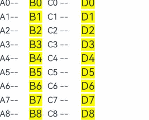
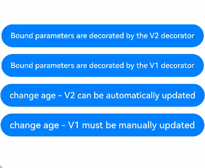
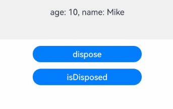

# ComponentContent

<!--Kit: ArkUI-->
<!--Subsystem: ArkUI-->
<!--Owner: @ZhangYu-Home-->
<!--Designer: @ZhangYu-Home-->
<!--Tester: @khq-->
<!--Adviser: @Brilliantry_Rui-->
<!-- md-trans-meta sourceCommit=3941aef1b3f2e81ba6f36ef0d30f9e1a4994e8fa translatedAt=2026-07-29T09:14:02.496Z pushedAt=2026-08-03T01:47:13.808Z -->

You can create an entity encapsulation component in either of the following ways: **ComponentContent** requires manual content updates through the update API, which is mainly suitable for decoupled encapsulation scenarios such as dialog boxes. **ReactiveComponentContent** supports automatic updates of responsive data, complete lifecycle management, and component reuse, making it suitable for high-performance rendering scenarios such as long lists.

**ComponentContent** represents an entity encapsulation of component content, which can be created and transmitted outside of UI components. It allows you to encapsulate and decouple dialog box components. Its underlying implementation uses BuilderNode. For details, see [BuilderNode](js-apis-arkui-builderNode.md).

**ReactiveComponentContent** represents an entity encapsulation of component content, and its objects can be created and transmitted outside of UI components. It supports automatic updates of responsive data, complete lifecycle management, and component reuse, making it suitable for scenarios requiring high-performance rendering such as long lists. Its underlying layer uses **ReactiveBuilderNode**. For specific usage specifications, see [ReactiveBuilderNode](js-apis-arkui-builderNode.md#reactivebuildernode22).

> **NOTE**
> 
> - The initial APIs of this module are supported since API version 12. Newly added APIs will be marked with a superscript to indicate their earliest API version.
>
> - The APIs of this module can be used only in the stage model.
>
> - **ComponentContent** and **ReactiveComponentContent** are not available in DevEco Studio Previewer.
>
> - ComponentContent objects do not support JSON serialization.

## Modules to Import

```ts
import { ComponentContent, ReactiveComponentContent } from '@kit.ArkUI';
```

## ComponentContent

Inherits from [Content](js-apis-arkui-Content.md#content-1).

**Atomic service API**: This API can be used in atomic services since API version 12.

**System capability**: SystemCapability.ArkUI.ArkUI.Full

### constructor

constructor(uiContext: UIContext, builder: WrappedBuilder\<[]>)

A constructor used to create a **ComponentContent** object.

**Atomic service API**: This API can be used in atomic services since API version 12.

**System capability**: SystemCapability.ArkUI.ArkUI.Full

**Parameters**

| Name   | Type                                     | Mandatory| Description                              |
| --------- | ----------------------------------------- | ---- | ---------------------------------- |
| uiContext | [UIContext](./arkts-apis-uicontext-uicontext.md) | Yes  | UI context required for creating a node.|
| builder  | [WrappedBuilder\<[]>](../../ui/state-management/arkts-wrapBuilder.md) | Yes  |   **WrappedBuilder** object that encapsulates a builder function that has no parameters.|

### constructor

constructor(uiContext: UIContext, builder: WrappedBuilder\<[T]>, args: T)

A constructor used to create a **ComponentContent** object.

**Atomic service API**: This API can be used in atomic services since API version 12.

**System capability**: SystemCapability.ArkUI.ArkUI.Full

**Parameters**

| Name   | Type                                     | Mandatory| Description                              |
| --------- | ----------------------------------------- | ---- | ---------------------------------- |
| uiContext | [UIContext](./arkts-apis-uicontext-uicontext.md) | Yes  | UI context required for creating a node.|
| builder  | [WrappedBuilder\<[T]>](../../ui/state-management/arkts-wrapBuilder.md) | Yes  |   **WrappedBuilder** object that encapsulates a builder function that has parameters.|
| args     |     T     |   Yes   |   Arguments of the builder function wrapped by the **WrappedBuilder** object. The type **T** must be consistent with the parameter type specified in `WrappedBuilder<[T]>`. It is used to pass external data to the builder function for building UI content. |

### constructor

  constructor(uiContext: UIContext, builder: WrappedBuilder\<[T]>, args: T, options: BuildOptions)

A constructor used to create a **ComponentContent** object.

**Atomic service API**: This API can be used in atomic services since API version 12.

**System capability**: SystemCapability.ArkUI.ArkUI.Full

**Parameters**

| Name   | Type                                     | Mandatory| Description                              |
| --------- | ----------------------------------------- | ---- | ---------------------------------- |
| uiContext | [UIContext](./arkts-apis-uicontext-uicontext.md) | Yes  | UI context required for creating a node.|
| builder  | [WrappedBuilder\<[T]>](../../ui/state-management/arkts-wrapBuilder.md) | Yes  |   **WrappedBuilder** object that encapsulates a builder function that has parameters.|
| args     |     T     |   Yes   |   Arguments of the builder function encapsulated by the **WrappedBuilder** object. The type **T** must be consistent with the parameter type specified in `WrappedBuilder<[T]>`. It is used to pass external data to the builder function for building UI content. |
| options | [BuildOptions](./js-apis-arkui-builderNode.md#buildoptions12)                                                    |   Yes   |   Build options, which are used to configure the build behavior of **@Builder**. All attributes in **BuildOptions** are optional.                                         |

**Example**

``` ts
import { ComponentContent, NodeContent, typeNode } from '@kit.ArkUI';

interface ParamsInterface {
  text: string;
  func: Function;
}

@Builder
function buildTextWithFunc(func: Function) {
  Text(func())
    .fontSize(20)
    .fontWeight(FontWeight.Bold)
    .margin({ bottom: 36 })
}

@Builder
function buildText(params: ParamsInterface) {
  Column() {
    Text(params.text)
      .fontSize(20)
      .fontWeight(FontWeight.Bold)
      .margin({ bottom: 12 })
    buildTextWithFunc(params.func)
  }
}

@Entry
@Component
struct Index {
  @State message: string = 'HELLO';
  private content: NodeContent = new NodeContent();

  build() {
    Row() {
      Column({ space: 12 }) {
        Button('addComponentContent')
          .onClick(() => {
            let column = typeNode.createNode(this.getUIContext(), 'Column');
            column.initialize();
            column.addComponentContent(new ComponentContent<ParamsInterface>(this.getUIContext(),
              wrapBuilder<[ParamsInterface]>(buildText), {
                text: this.message, func: () => {
                  return 'FUNCTION'
                }
              }, { nestingBuilderSupported: true }));
            this.content.addFrameNode(column);
          })
        ContentSlot(this.content)
      }
      .id('column')
      .width('100%')
      .height('100%')
    }
    .height('100%')
  }
}
```


### update

update(args: T): void

Updates the arguments of the builder function encapsulated by the [WrappedBuilder](../../ui/state-management/arkts-wrapBuilder.md) object, keeping consistent with the parameter type specified in the constructor. This API is suitable for scenarios where component content needs to change dynamically, such as updating dialog box content.

**Atomic service API**: This API can be used in atomic services since API version 12.

**System capability**: SystemCapability.ArkUI.ArkUI.Full

**Parameters**

| Name| Type| Mandatory| Description                                                        |
| ------ | ---- | ---- | ------------------------------------------------------------ |
| args   | T    | Yes  | Arguments used to update the builder function encapsulated by the [WrappedBuilder](../../ui/state-management/arkts-wrapBuilder.md) object. The parameter type must be the same as that passed by the constructor.|

**Example**

```ts
import { ComponentContent } from '@kit.ArkUI';

class Params {
  text: string = '';

  constructor(text: string) {
    this.text = text;
  }
}

@Builder
function buildText(params: Params) {
  Column() {
    Text(params.text)
      .fontSize(50)
      .fontWeight(FontWeight.Bold)
      .margin({ bottom: 36 })
  }.backgroundColor('#FFF0F0F0')
}

@Entry
@Component
struct Index {
  @State message: string = 'hello';

  build() {
    Row() {
      Column() {
        Button('click me')
          .margin({ top: 200 })
          .onClick(() => {
            let uiContext = this.getUIContext();
            let promptAction = uiContext.getPromptAction();
            let contentNode = new ComponentContent(uiContext, wrapBuilder(buildText), new Params(this.message));
            promptAction.openCustomDialog(contentNode);

            setTimeout(() => {
              contentNode.update(new Params('new message'));
            }, 2000); // Automatically update the text in the dialog box after 2 seconds.
          })
      }
      .width('100%')
      .height('100%')
    }
    .height('100%')
  }
}
```


### reuse

reuse(param?: Object): void

Triggers component reuse for custom components in **ComponentContent**. For details about component reuse, see [@Reusable Decorator: Reusing V1 Components](../../ui/state-management/arkts-reusable.md). For the unbinding scenarios of **ComponentContent**, see [Canceling the Reference to the Entity Node](../../ui/arkts-user-defined-arktsNode-builderNode.md#canceling-the-reference-to-the-entity-node). **ComponentContent** transfers reuse events between its internal and external custom components through the reuse and [recycle](#recycle) APIs. For specific usage scenarios, see [Implementing Node Reuse with the BuilderNode reuse and recycle APIs](../../ui/arkts-user-defined-arktsNode-builderNode.md#implementing-node-reuse-with-the-buildernode-reuse-and-recycle-apis). Since API version 26.0.0, custom components in **ComponentContent** support V2 component reuse. For details, see [@Reusable V2 Decorator: Reusing V2 Components](../../ui/state-management/arkts-new-reusableV2.md).

**Atomic service API**: This API can be used in atomic services since API version 12.

**System capability**: SystemCapability.ArkUI.ArkUI.Full

**Parameters**

| Name| Type  | Mandatory| Description                                                                    |
| ------ | ------ | ---- | ------------------------------------------------------------------------ |
| param  | Object | No  | Parameters for **ComponentContent** reuse. This parameter is passed to all top-level custom components within the **ComponentContent** during reuse and must include all required constructor parameters for each component; otherwise, undefined behavior may occur. Calling this method synchronously triggers the [aboutToReuse](../../reference/apis-arkui/arkui-ts/ts-custom-component-lifecycle.md#abouttoreuse10) lifecycle callback of internal custom components, with this parameter as the callback input. The default value is undefined. In this case, the custom component in ComponentContent directly uses the data source during construction.|

### recycle

recycle(): void

- Triggers recycling of custom components under this **ComponentContent**. Component recycling is part of the component reuse mechanism. For details, see [@Reusable Decorator: Reusing V1 Components](../../ui/state-management/arkts-reusable.md).

- **ComponentContent** completes the reuse event transfer between internal and external custom components through **reuse** and **recycle**. For specific usage scenarios, see [Implementing Node Reuse with the BuilderNode reuse and recycle APIs](../../ui/arkts-user-defined-arktsNode-builderNode.md#implementing-node-reuse-with-the-buildernode-reuse-and-recycle-apis). Since API version 26.0.0, custom components in **ComponentContent** support V2 component reuse. For details, see [@ReusableV2 Decorator: Reusing Components](../../ui/state-management/arkts-new-reusableV2.md).

**Atomic service API**: This API can be used in atomic services since API version 12.

**System capability**: SystemCapability.ArkUI.ArkUI.Full

```ts
import { NodeContent, typeNode, ComponentContent } from '@kit.ArkUI';

const TEST_TAG: string = 'Reuse+Recycle';

class MyDataSource {
  private dataArray: string[] = [];
  private listener: DataChangeListener | null = null;

  public totalCount(): number {
    return this.dataArray.length;
  }

  public getData(index: number) {
    return this.dataArray[index];
  }

  public pushData(data: string) {
    this.dataArray.push(data);
  }

  public reloadListener(): void {
    this.listener?.onDataReloaded();
  }

  public registerDataChangeListener(listener: DataChangeListener): void {
    this.listener = listener;
  }

  public unregisterDataChangeListener(): void {
    this.listener = null;
  }
}

class Params {
  item: string = '';

  constructor(item: string) {
    this.item = item;
  }
}

@Builder
function buildNode(param: Params = new Params('hello')) {
  Row() {
    Text(`C${param.item} -- `)
    ReusableChildComponent2({ item: param.item }) // This custom component cannot be correctly reused in the ComponentContent.
  }
}

// The custom component that is reused and recycled will have its state variables updated, and the state variables of the nested custom component ReusableChildComponent3 will also be updated. However, the ComponentContent will block this propagation process.
@Reusable
@Component
struct ReusableChildComponent {
  @Prop item: string = '';
  @Prop switch: string = '';
  private content: NodeContent = new NodeContent();
  private componentContent: ComponentContent<Params> = new ComponentContent<Params>(
    this.getUIContext(),
    wrapBuilder<[Params]>(buildNode),
    new Params(this.item),
    { nestingBuilderSupported: true });

  aboutToAppear() {
    let column = typeNode.createNode(this.getUIContext(), 'Column');
    column.initialize();
    column.addComponentContent(this.componentContent);
    this.content.addFrameNode(column);
  }

  aboutToRecycle(): void {
    console.info(`${TEST_TAG} ReusableChildComponent aboutToRecycle ${this.item}`);

    // When the switch is open, pass the recycle event to the nested custom component, such as ReusableChildComponent2, through the ComponentContent's recycle API to complete recycling.
    if (this.switch === 'open') {
      this.componentContent.recycle();
    }
  }

  aboutToReuse(params: object): void {
    console.info(`${TEST_TAG} ReusableChildComponent aboutToReuse ${JSON.stringify(params)}`);

    // When the switch is open, pass the reuse event to the nested custom component, such as ReusableChildComponent2, through the ComponentContent's reuse API to complete reuse.
    if (this.switch === 'open') {
      this.componentContent.reuse(params);
    }
  }

  build() {
    Row() {
      Text(`A${this.item}--`)
      ReusableChildComponent3({ item: this.item })
      ContentSlot(this.content)
    }
  }
}

@Component
struct ReusableChildComponent2 {
  @Prop item: string = 'false';

  aboutToReuse(params: Record<string, object>) {
    console.info(`${TEST_TAG} ReusableChildComponent2 aboutToReuse ${JSON.stringify(params)}`);
  }

  aboutToRecycle(): void {
    console.info(`${TEST_TAG} ReusableChildComponent2 aboutToRecycle ${this.item}`);
  }

  build() {
    Row() {
      Text(`D${this.item}`)
        .fontSize(20)
        .backgroundColor(Color.Yellow)
        .margin({ left: 10 })
    }.margin({ left: 10, right: 10 })
  }
}

@Component
struct ReusableChildComponent3 {
  @Prop item: string = 'false';

  aboutToReuse(params: Record<string, object>) {
    console.info(`${TEST_TAG} ReusableChildComponent3 aboutToReuse ${JSON.stringify(params)}`);
  }

  aboutToRecycle(): void {
    console.info(`${TEST_TAG} ReusableChildComponent3 aboutToRecycle ${this.item}`);
  }

  build() {
    Row() {
      Text(`B${this.item}`)
        .fontSize(20)
        .backgroundColor(Color.Yellow)
        .margin({ left: 10 })
    }.margin({ left: 10, right: 10 })
  }
}


@Entry
@Component
struct Index {
  @State data: MyDataSource = new MyDataSource();

  aboutToAppear() {
    for (let i = 0; i < 100; i++) {
      this.data.pushData(i.toString());
    }
  }

  build() {
    Column() {
      List({ space: 3 }) {
        LazyForEach(this.data, (item: string) => {
          ListItem() {
            ReusableChildComponent({
              item: item,
              switch: 'open' // Changing open to close can be used to observe the behavior of custom components inside the ComponentContent when reuse and recycle events are not passed through ComponentContent's reuse and recycle APIs.
            })
          }
        }, (item: string) => item)
      }
      .width('100%')
      .height('100%')
    }
  }
}
```



Since API version 26.0.0, custom components in **ComponentContent** support V2 component reuse.

```ts
import { NodeContent, typeNode, ComponentContent } from '@kit.ArkUI';

const TEST_TAG: string = 'Reuse+Recycle';

class MyDataSource {
  private dataArray: string[] = [];
  private listener: DataChangeListener | null = null;

  public totalCount(): number {
    return this.dataArray.length;
  }

  public getData(index: number) {
    return this.dataArray[index];
  }

  public pushData(data: string) {
    this.dataArray.push(data);
  }

  public reloadListener(): void {
    this.listener?.onDataReloaded();
  }

  public registerDataChangeListener(listener: DataChangeListener): void {
    this.listener = listener;
  }

  public unregisterDataChangeListener(): void {
    this.listener = null;
  }
}

class Params {
  item: string = '';

  constructor(item: string) {
    this.item = item;
  }
}

@Builder
function buildNode(param: Params = new Params('hello')) {
  Row() {
    Text(`C${param.item} -- `)
    ReusableChildComponent2({ item: param.item }) // This custom component cannot be correctly reused in the ComponentContent.
  }
}

// The custom component that is reused and recycled will have its state variables updated, and the state variables of the nested custom component ReusableChildComponent3 will also be updated. However, the ComponentContent will block this propagation process.
@ReusableV2
@ComponentV2
struct ReusableChildComponent {
  @Param item: string = '';
  @Param switch: string = '';
  private content: NodeContent = new NodeContent();
  private componentContent: ComponentContent<Params> = new ComponentContent<Params>(
    this.getUIContext(),
    wrapBuilder<[Params]>(buildNode),
    new Params(this.item),
    { nestingBuilderSupported: true });

  aboutToAppear() {
    let column = typeNode.createNode(this.getUIContext(), 'Column');
    column.initialize();
    column.addComponentContent(this.componentContent);
    this.content.addFrameNode(column);
  }

  aboutToRecycle(): void {
    console.info(`${TEST_TAG} ReusableChildComponent aboutToRecycle ${this.item}`);

    // When the switch is open, pass the recycle event to the nested custom component, such as ReusableChildComponent2, through the ComponentContent's recycle API to complete recycling.
    if (this.switch === 'open') {
      this.componentContent.recycle();
    }
  }

  aboutToReuse(): void {
    console.info(`${TEST_TAG} ReusableChildComponent aboutToReuse`);

    // When the switch is open, pass the reuse event to the nested custom component, such as ReusableChildComponent2, through the ComponentContent's reuse API to complete reuse.
    if (this.switch === 'open') {
      this.componentContent.reuse(new Params(this.item));
    }
  }

  build() {
    Row() {
      Text(`A${this.item}--`)
      ReusableChildComponent3({ item: this.item })
      ContentSlot(this.content)
    }
  }
}

@ComponentV2
struct ReusableChildComponent2 {
  @Param item: string = 'false';

  aboutToReuse() {
    console.info(`${TEST_TAG} ReusableChildComponent2 aboutToReuse`);
  }

  aboutToRecycle(): void {
    console.info(`${TEST_TAG} ReusableChildComponent2 aboutToRecycle ${this.item}`);
  }

  build() {
    Row() {
      Text(`D${this.item}`)
        .fontSize(20)
        .backgroundColor(Color.Yellow)
        .margin({ left: 10 })
    }.margin({ left: 10, right: 10 })
  }
}

@ComponentV2
struct ReusableChildComponent3 {
  @Param item: string = 'false';

  aboutToReuse() {
    console.info(`${TEST_TAG} ReusableChildComponent3 aboutToReuse`);
  }

  aboutToRecycle(): void {
    console.info(`${TEST_TAG} ReusableChildComponent3 aboutToRecycle ${this.item}`);
  }

  build() {
    Row() {
      Text(`B${this.item}`)
        .fontSize(20)
        .backgroundColor(Color.Yellow)
        .margin({ left: 10 })
    }.margin({ left: 10, right: 10 })
  }
}


@Entry
@ComponentV2
struct Index {
  @Local data: MyDataSource = new MyDataSource();

  aboutToAppear() {
    for (let i = 0; i < 100; i++) {
      this.data.pushData(i.toString());
    }
  }

  build() {
    Column() {
      List({ space: 3 }) {
        LazyForEach(this.data, (item: string) => {
          ListItem() {
            ReusableChildComponent({
              item: item,
              switch: 'open' // Changing open to close can be used to observe the behavior of custom components inside the ComponentContent when reuse and recycle events are not passed through ComponentContent's reuse and recycle APIs.
            })
          }
        }, (item: string) => item)
      }
      .width('100%')
      .height('100%')
    }
  }
}
```

### dispose

dispose(): void

Immediately releases the reference relationship between this **ComponentContent** object and its [entity node](../../ui/arkts-user-defined-node.md#basic-concepts). For details about the scenarios involving **ComponentContent** unbinding, see [Canceling the Reference to the Entity Node](../../ui/arkts-user-defined-arktsNode-builderNode.md#canceling-the-reference-to-the-entity-node).

> **NOTE**
>
> After the **ComponentContent** object calls **dispose**, the reference relationship with the backend entity node is released. Calling other APIs of this object after the call to **dispose** may cause crashes or return default values. It is recommended to check the node validity through the [isDisposed](#isdisposed20) API before operating it. If the frontend object **ComponentContent** cannot be released, memory leaks may easily occur. You are advised to proactively call **dispose** to release the backend node when the **ComponentContent object** is no longer needed, to reduce the complexity of reference relationships and lower the risk of memory leaks.

**Atomic service API**: This API can be used in atomic services since API version 12.

**System capability**: SystemCapability.ArkUI.ArkUI.Full

**Example**

```ts
import { BusinessError } from '@kit.BasicServicesKit';
import { ComponentContent } from '@kit.ArkUI';

class Params {
  text: string = '';

  constructor(text: string) {
    this.text = text;
  }
}

@Builder
function buildText(params: Params) {
  Column() {
    Text(params.text)
      .fontSize(50)
      .fontWeight(FontWeight.Bold)
      .margin({ bottom: 36 })
  }.backgroundColor('#FFF0F0F0')
}

@Entry
@Component
struct Index {
  @State message: string = 'hello';

  build() {
    Row() {
      Column() {
        Button('click me')
          .onClick(() => {
            let uiContext = this.getUIContext();
            let promptAction = uiContext.getPromptAction();
            let contentNode = new ComponentContent(uiContext, wrapBuilder(buildText), new Params(this.message));
            promptAction.openCustomDialog(contentNode);

            setTimeout(() => {
              promptAction.closeCustomDialog(contentNode)
                .then(() => {
                  console.info('customDialog closed.');
                  if (contentNode !== null) {
                    contentNode.dispose(); // Dispose the contentNode object.
                  }
                }).catch((error: BusinessError) => {
                  let message = error.message;
                  let code = error.code;
                  console.error(`Failed to close customDialog. Code: ${code}, message: ${message}`);
              })
            }, 2000); // Automatically close the dialog box after 2 seconds.
          })
      }
      .width('100%')
      .height('100%')
    }
    .height('100%')
  }
}
```


### updateConfiguration

updateConfiguration(): void

Transfers a system environment change event and triggers full update of a node. This API is suitable for scenarios where the node needs to respond to system configuration changes, such as switching between light and dark modes, language changes, and font size adjustments. For details about system environment changes, see [@ohos.app.ability.Configuration (Environment Variables)](../apis-ability-kit/js-apis-app-ability-configuration.md).

**Atomic service API**: This API can be used in atomic services since API version 12.

**System capability**: SystemCapability.ArkUI.ArkUI.Full

> **NOTE**
>
> The updateConfiguration API is used to notify an object of updating the current system environment change.

**Example**

```ts
import { NodeController, FrameNode, ComponentContent, UIContext, FrameCallback } from '@kit.ArkUI';
import { AbilityConstant, Configuration, EnvironmentCallback, ConfigurationConstant } from '@kit.AbilityKit';

@Builder
function buildText() {
  Column() {
    Text('Hello')
      .fontSize(36)
      .fontWeight(FontWeight.Bold)
  }
  .backgroundColor($r('sys.color.ohos_id_color_background'))
  .width('100%')
  .alignItems(HorizontalAlign.Center)
  .padding(16)
}

const componentContentMap: Array<ComponentContent<Object>> = new Array();

class MyNodeController extends NodeController {
  private rootNode: FrameNode | null = null;

  makeNode(uiContext: UIContext): FrameNode | null {
    return this.rootNode;
  }

  createNode(context: UIContext) {
    this.rootNode = new FrameNode(context);
    let component = new ComponentContent<Object>(context, wrapBuilder(buildText));
    componentContentMap.push(component);
    this.rootNode.addComponentContent(component);
  }

  deleteNode() {
    let node = componentContentMap.pop();
    this.rootNode?.dispose();
    node?.dispose();
  }
}

class MyFrameCallback extends FrameCallback {
  onFrame() {
    updateColorMode();
  }
}

function updateColorMode() {
  componentContentMap.forEach((value) => {
    value.updateConfiguration();
  })
}

@Entry
@Component
struct FrameNodeTypeTest {
  private myNodeController: MyNodeController = new MyNodeController();

  aboutToAppear(): void {
    let environmentCallback: EnvironmentCallback = {
      onMemoryLevel: (level: AbilityConstant.MemoryLevel): void => {
        console.info('onMemoryLevel');
      },
      onConfigurationUpdated: (config: Configuration): void => {
        console.info(`onConfigurationUpdated ${config}`);
        this.getUIContext()?.postFrameCallback(new MyFrameCallback());
      }
    }
    // Register a callback.
    this.getUIContext().getHostContext()?.getApplicationContext().on('environment', environmentCallback);
    // Set the application color mode to follow the system settings.
    this.getUIContext()
      .getHostContext()?.getApplicationContext().setColorMode(ConfigurationConstant.ColorMode.COLOR_MODE_NOT_SET);
    this.myNodeController.createNode(this.getUIContext());
  }

  aboutToDisappear(): void {
    // Remove the reference to the custom node from the map and release the node.
    this.myNodeController.deleteNode();
  }

  build() {
    Column({ space: 16 }) {
      NodeContainer(this.myNodeController);
      Button('Switch to Dark Mode')
        .onClick(() => {
          this.getUIContext()
            .getHostContext()?.getApplicationContext().setColorMode(ConfigurationConstant.ColorMode.COLOR_MODE_DARK);
        })
      Button('Switch to Light Mode')
        .onClick(() => {
          this.getUIContext()
            .getHostContext()?.getApplicationContext().setColorMode(ConfigurationConstant.ColorMode.COLOR_MODE_LIGHT);
        })
    }
  }
}
```


### isDisposed<sup>20+</sup>

isDisposed(): boolean

Checks whether this **ComponentContent** object has released its reference to its backend entity node. Frontend nodes maintain references to corresponding backend entity nodes. After a node calls the **dispose** API to release this reference, subsequent API calls may cause crashes or return default values. This API facilitates validation of node validity prior to operations, thereby mitigating risks in scenarios where calls after disposal are required.

**Atomic service API**: This API can be used in atomic services since API version 20.

**System capability**: SystemCapability.ArkUI.ArkUI.Full

**Return value**

| Type   | Description              |
| ------- | ------------------ |
| boolean | Whether the reference to the backend node is released. The value **true** means that the reference to backend node is released, and **false** means the opposite.|

**Example**

```ts
import { BusinessError } from '@kit.BasicServicesKit';
import { ComponentContent } from '@kit.ArkUI';

class Params {
  text: string = '';

  constructor(text: string) {
    this.text = text;
  }
}

@Builder
function buildText(params: Params) {
  Column() {
    Text(params.text)
      .fontSize(50)
      .fontWeight(FontWeight.Bold)
      .margin({ bottom: 36 })
  }.backgroundColor('#FFF0F0F0')
}

@Entry
@Component
struct Index {
  @State message: string = 'hello';
  @State beforeDispose: string = ''
  @State afterDispose: string = ''

  build() {
    Row() {
      Column() {
        Button('click me')
          .onClick(() => {
            let uiContext = this.getUIContext();
            let promptAction = uiContext.getPromptAction();
            let contentNode = new ComponentContent(uiContext, wrapBuilder(buildText), new Params(this.message));
            promptAction.openCustomDialog(contentNode);

            setTimeout(() => {
              promptAction.closeCustomDialog(contentNode)
                .then(() => {
                  console.info('customDialog closed.');
                  if (contentNode !== null) {
                    this.beforeDispose =
                      contentNode.isDisposed() ? 'before dispose componentContent isDisposed is true' :
                        'before dispose componentContent isDisposed is false';
                    contentNode.dispose(); // Dispose the contentNode object.
                    this.afterDispose = contentNode.isDisposed() ? 'after dispose componentContent isDisposed is true' :
                      'after dispose componentContent isDisposed is false';
                  }
                }).catch((error: BusinessError) => {
                  let message = error.message;
                  let code = error.code;
                  console.error(`Failed to close customDialog. Code: ${code}, message: ${message}`);
                })
            }, 1000); // Automatically close the dialog box 1 second later.
          })
        Text(this.beforeDispose)
          .fontSize(25)
          .margin({ top: 10, bottom: 10 })
        Text(this.afterDispose)
          .fontSize(25)
      }
      .width('100%')
      .height('100%')
    }
    .height('100%')
  }
}
```


### inheritFreezeOptions<sup>20+</sup>

inheritFreezeOptions(enabled: boolean): void

Sets whether the current **ComponentContent** object inherits the freeze policy from its parent component's custom components. The freeze policy controls whether a component pauses state refresh when inactive. When inheritance is disabled (set to **false**), the **ComponentContent** object's freeze policy is set to **false**. This API is suitable for scenarios such as multi-page navigation (**Navigation**) that require freeze management of inactive components.

> **NOTE**
>
> When **inheritFreezeOptions** is set to **true** for ComponentContent and the parent component is a custom component, **BuilderNode**, **ComponentContent**, **ReactiveBuilderNode**, or **ReactiveComponentContent**, the freeze policy of the parent component is inherited. When the child component is a custom component, the freeze policy of ComponentContent is not transferred to the child component.

**Atomic service API**: This API can be used in atomic services since API version 20.

**System capability**: SystemCapability.ArkUI.ArkUI.Full

**Parameters**

| Name| Type  | Mandatory| Description                                                                    |
| ------ | ------ | ---- | ------------------------------------------------------------------------ |
| enabled  | boolean | Yes  | Whether the **ComponentContent** object inherits the freeze policy from its parent component's custom components.<br>**true**: Inherits the freeze policy from its parent component's custom components. **false**: Does not inherit the freeze policy from its parent component's custom components.<br>**Note**: The value **true** takes effect only when the parent component is a custom component, **BuilderNode**, **ComponentContent**, **ReactiveBuilderNode**, or **ReactiveComponentContent**. |

**Example**

```ts
import { ComponentContent, FrameNode, NodeController, UIContext } from '@kit.ArkUI';

class Params {
  count: number = 0;

  constructor(count: number) {
    this.count = count;
  }
}

@Builder
// Builder component
function buildText(params: Params) {

  Column() {
    TextBuilder({ message: params.count })
  }
}

class TextNodeController extends NodeController {
  private rootNode: FrameNode | null = null;
  private contentNode: ComponentContent<Params> | null = null;
  private count: number = 0;

  makeNode(context: UIContext): FrameNode | null {
    this.rootNode = new FrameNode(context);
    this.contentNode =
      new ComponentContent(context, wrapBuilder(buildText), new Params(this.count)); // Create ComponentContent using buildText.
    this.contentNode.inheritFreezeOptions(true); // Configure the ComponentContent object to inherit the freeze policy from its parent component.
    if (this.rootNode !== null) {
      this.rootNode.addComponentContent(this.contentNode); // Add ComponentContent to the tree.
    }
    return this.rootNode;
  }

  update(): void {
    if (this.contentNode !== null) {
      this.count += 1;
      this.contentNode.update(new Params(this.count)); // Update the ComponentContent data, which triggers logs.
    }
  }
}

const textNodeController: TextNodeController = new TextNodeController();

@Entry
@Component
struct MyNavigationTestStack {
  @Provide('pageInfo') pageInfo: NavPathStack = new NavPathStack();
  @State message: number = 0;
  @State logNumber: number = 0;

  @Builder
  PageMap(name: string) {
    if (name === 'pageOne') {
      PageOneStack({ message: this.message, logNumber: this.logNumber })
    } else if (name === 'pageTwo') {
      PageTwoStack({ message: this.message, logNumber: this.logNumber })
    }
  }

  build() {
    Column() {
      Button('update ComponentContent') // Clicking the button updates ComponentContent.
        .onClick(() => {
          textNodeController.update();
        })
      Navigation(this.pageInfo) {
        Column() {
          Button('Next Page', { stateEffect: true, type: ButtonType.Capsule })
            .width('80%')
            .height(40)
            .margin(20)
            .onClick(() => {
              this.pageInfo.pushPath({ name: 'pageOne' }); // Push the navigation destination page specified by name to the navigation stack.
            })
        }
      }.title('NavIndex')
      .navDestination(this.PageMap)
      .mode(NavigationMode.Stack)
    }
  }
}

@Component
struct PageOneStack { // Page 1
  @Consume('pageInfo') pageInfo: NavPathStack;
  @State index: number = 1;
  @Link message: number;
  @Link logNumber: number;

  build() {
    NavDestination() {
      Column() {
        NavigationContentMsgStack({ message: this.message, index: this.index, logNumber: this.logNumber })
        Button('Next Page', { stateEffect: true, type: ButtonType.Capsule }) // Navigate to page 2.
          .width('80%')
          .height(40)
          .margin(20)
          .onClick(() => {
            this.pageInfo.pushPathByName('pageTwo', null);
          })
        Button('Back Page', { stateEffect: true, type: ButtonType.Capsule }) // Return to the home page.
          .width('80%')
          .height(40)
          .margin(20)
          .onClick(() => {
            this.pageInfo.pop();
          })
      }.width('100%').height('100%')
    }.title('pageOne')
    .onBackPressed(() => {
      this.pageInfo.pop();
      return true;
    })
  }
}

@Component
struct PageTwoStack { // Page 2
  @Consume('pageInfo') pageInfo: NavPathStack;
  @State index: number = 2;
  @Link message: number;
  @Link logNumber: number;

  build() {
    NavDestination() {
      Column() {
        NavigationContentMsgStack({ message: this.message, index: this.index, logNumber: this.logNumber })
        Text('BuilderNode is frozen')
          .fontWeight(FontWeight.Bold)
          .margin({ top: 48, bottom: 48 })
        Button('Back Page', { stateEffect: true, type: ButtonType.Capsule }) // Return to page 1.
          .width('80%')
          .height(40)
          .margin(20)
          .onClick(() => {
            this.pageInfo.pop();
          })
      }.width('100%').height('100%')
    }.title('pageTwo')
    .onBackPressed(() => {
      this.pageInfo.pop();
      return true;
    })
  }
}

@Component({ freezeWhenInactive: true })
  // Set the freeze policy to inactive freeze.
struct NavigationContentMsgStack {
  @Link message: number;
  @Link index: number;
  @Link logNumber: number;

  build() {
    Column() {
      if (this.index === 1) {
        NodeContainer(textNodeController)
      }
    }
  }
}

@Component({ freezeWhenInactive: true })
  // Set the freeze policy to inactive freeze.
struct TextBuilder {
  @Prop @Watch('info') message: number = 0;

  info() {
    console.info(`freeze-test TextBuilder message callback ${this.message}`); // Print logs based on the message content change to determine whether the freeze occurs.
  }

  build() {
    Row() {
      Column() {
        Text(`Update count: ${this.message}`)
          .fontWeight(FontWeight.Bold)
          .margin({ top: 48, bottom: 48 })
      }
    }
  }
}
```


## ReactiveComponentContent<sup>22+</sup>

ReactiveComponentContent is inherited from [Content](js-apis-arkui-Content.md#content-1) and is a container component used to dynamically bear and reuse UI content. It uses the @Builder function to build the UI and uses [ReactiveBuilderNode](./js-apis-arkui-builderNode.md#reactivebuildernode22) to generate and manage the component tree. The core value of this component is to provide complete lifecycle management for dynamic content so that it can be integrated into the ArkUI component reuse system. This component is especially suitable for scenarios that require high-performance rendering, such as long lists.

**Atomic service API**: This API can be used in atomic services since API version 22.

**System capability**: SystemCapability.ArkUI.ArkUI.Full

### constructor<sup>22+</sup>

constructor(uiContext: UIContext, builder: WrappedBuilder&lt;T&gt;, config: BuildOptions, ...args: T)

Constructor of ReactiveComponentContent.

**Atomic service API**: This API can be used in atomic services since API version 22.

**System capability**: SystemCapability.ArkUI.ArkUI.Full

**Parameters**

| Name   | Type                                     | Mandatory| Description                              |
| --------- | ----------------------------------------- | ---- | ---------------------------------- |
| uiContext | [UIContext](./arkts-apis-uicontext-uicontext.md) | Yes  | UI context required for creating a node.|
| builder  | [WrappedBuilder\<T>](../../ui/state-management/arkts-wrapBuilder.md) | Yes   | **WrappedBuilder** object that encapsulates a builder function with parameters. |
| config | [BuildOptions](./js-apis-arkui-builderNode.md#buildoptions12)  | Yes   | Build options, used to configure the build behavior of **@Builder**. All attributes in **BuildOptions** are optional.                                        |
| ...args     | T      | No   | Arguments of the builder function encapsulated by the **WrappedBuilder** object, used to transfer external data to the builder function of **WrappedBuilder\<T\>** specified in the constructor. The type **T** must be consistent with the parameter type specified in **WrappedBuilder\<T\>**. Multiple input parameters are supported. The default value is an empty array **[]** when no parameter is passed.|

**Example**

This example demonstrates how to use the **ReactiveComponentContent** constructor to dynamically create UI components containing responsive content, implementing nested calls of builder functions and flexible transfer of function parameters.

``` ts
import { ReactiveComponentContent, NodeContent, typeNode } from '@kit.ArkUI';

@Builder
function buildTextWithFunc(func: Function) {
  Text(func())
    .fontSize(20)
    .fontWeight(FontWeight.Bold)
    .margin({ bottom: 36 })
}

@Builder
function buildText(text: string, func: Function) {
  Column() {
    Text(text)
      .fontSize(20)
      .fontWeight(FontWeight.Bold)
      .margin({ bottom: 12 })
    buildTextWithFunc(func)
  }
}

@Entry
@Component
struct Index {
  @State message: string = 'HELLO';
  private content: NodeContent = new NodeContent();

  build() {
    Row() {
      Column({ space: 12 }) {
        Button('addComponentContent')
          .onClick(() => {
            // Dynamically create a column node.
            let column = typeNode.createNode(this.getUIContext(), 'Column');
            column.initialize();
            // Create a ReactiveComponentContent and add it to the Column node.
            column.addComponentContent(new ReactiveComponentContent<[string, Function]>(this.getUIContext(),
              wrapBuilder<[string, Function]>(buildText), { nestingBuilderSupported: true },
              this.message,
              () => {
                return 'FUNCTION'
              }
            ));
            // Add the built node to the content container.
            this.content.addFrameNode(column);
          })
        ContentSlot(this.content) // Display the dynamically added content.
      }
      .id('column')
      .width('100%')
      .height('100%')
    }
    .height('100%')
  }
}
```


### reuse<sup>22+</sup>

reuse(param?: Object): void

Triggers component reuse for custom components under this **ReactiveComponentContent**. For details about component reuse, see [@Reusable Decorator: Reusing V1 Components](../../ui/state-management/arkts-reusable.md). For details about the scenarios involving **ReactiveComponentContent** unbinding, see [Canceling the Reference to the Entity Node](../../ui/arkts-user-defined-arktsNode-builderNode.md#canceling-the-reference-to-the-entity-node). Since API version 26.0.0, custom components in **ReactiveComponentContent** support V2 component reuse. For details, see [@ReusableV2 Decorator: Reusing Components](../../ui/state-management/arkts-new-reusableV2.md).

**ReactiveComponentContent** transfers reuse events between its internal and external custom components through the reuse and [recycle](#recycle22) APIs. For specific usage scenarios, see [Implementing Node Reuse with the BuilderNode reuse and recycle APIs](../../ui/arkts-user-defined-arktsNode-builderNode.md#implementing-node-reuse-with-the-buildernode-reuse-and-recycle-apis).

**Atomic service API**: This API can be used in atomic services since API version 22.

**System capability**: SystemCapability.ArkUI.ArkUI.Full

**Parameters**

| Name| Type  | Mandatory| Description                                                                    |
| ------ | ------ | ---- | ------------------------------------------------------------------------ |
| param  | Object | No  | Parameter used to reuse [ReactiveComponentContent](#reactivecomponentcontent22). This parameter is directly used for reusing all top-level custom components in **ReactiveComponentContent**. It should contain the content required by the constructor parameters of each custom component. Otherwise, undefined behavior may occur. Calling this method synchronously triggers the [aboutToReuse](../../reference/apis-arkui/arkui-ts/ts-custom-component-lifecycle.md#abouttoreuse10) lifecycle callback of internal custom components, with this parameter as the callback input. The default value is undefined. In this case, the custom component in ReactiveComponentContent directly uses the data source during construction.|

**Example**

For details, see the example in [recycle](#recycle22).

### recycle<sup>22+</sup>

recycle(): void

Recycles the custom component in ReactiveComponentContent. Component recycling is part of the component reuse mechanism. For details, see [@Reusable Decorator: Reusing V1 Components](../../ui/state-management/arkts-reusable.md). Since API version 26.0.0, custom components in **ReactiveComponentContent** support V2 component reuse. For details, see [@ReusableV2 Decorator: Reusing Components](../../ui/state-management/arkts-new-reusableV2.md).

**ReactiveComponentContent** transfers reuse events between its internal and external custom components through the [reuse](#reuse22) and recycle APIs. For specific usage scenarios, see [Implementing Node Reuse with the BuilderNode reuse and recycle APIs](../../ui/arkts-user-defined-arktsNode-builderNode.md#implementing-node-reuse-with-the-buildernode-reuse-and-recycle-apis).

**Atomic service API**: This API can be used in atomic services since API version 22.

**System capability**: SystemCapability.ArkUI.ArkUI.Full

**Example**

A high-performance long list that contains multi-layer component reuse is implemented. ReactiveComponentContent dynamically manages Builder content and automatically reclaims and reuses components when the list scrolls.

```ts
import { NodeContent, typeNode, ReactiveComponentContent } from '@kit.ArkUI';

const TEST_TAG: string = 'Reuse+Recycle';

// Custom data source class, which is used to manage list data.
class MyDataSource {
  private dataArray: string[] = [];
  private listener: DataChangeListener | null = null;

  public totalCount(): number {
    return this.dataArray.length;
  }

  public getData(index: number) {
    return this.dataArray[index];
  }

  public pushData(data: string) {
    this.dataArray.push(data);
  }

  public reloadListener(): void {
    this.listener?.onDataReloaded();
  }

  public registerDataChangeListener(listener: DataChangeListener): void {
    this.listener = listener;
  }

  public unregisterDataChangeListener(): void {
    this.listener = null;
  }
}

@Builder
function buildNode(param: string) {
  Row() {
    Text(`C${param} -- `)
    ReusableChildComponent2({ item: param })
  }
}

@Reusable
@Component
struct ReusableChildComponent {
  @Prop item: string = '';
  @Prop switch: string = '';
  private content: NodeContent = new NodeContent();
  // Create a ReactiveComponentContent instance and encapsulate the builder dynamic content.
  private componentContent: ReactiveComponentContent<[string]> = new ReactiveComponentContent<[string]>(
    this.getUIContext(),
    wrapBuilder<[string]>(buildNode),
    { nestingBuilderSupported: true },
    this.item);

  aboutToAppear() {
    let column = typeNode.createNode(this.getUIContext(), 'Column');
    column.initialize();
    column.addComponentContent(this.componentContent);
    this.content.addFrameNode(column);
  }

  // Recycle the component lifecycle callback.
  aboutToRecycle(): void {
    console.info(`${TEST_TAG} ReusableChildComponent aboutToRecycle ${this.item}`);

    // When the switch is turned on, the recycling of the internal ReactiveComponentContent is triggered.
    if (this.switch === 'open') {
      this.componentContent.recycle();
    }
  }

  // Lifecycle callback during component reuse.
  aboutToReuse(params: object): void {
    console.info(`${TEST_TAG} ReusableChildComponent aboutToReuse ${JSON.stringify(params)}`);

    // When the switch is turned on, the reuse of the internal ReactiveComponentContent is triggered.
    if (this.switch === 'open') {
      this.componentContent.reuse(params);
    }
  }

  build() {
    Row() {
      Text(`A${this.item}--`)
      ReusableChildComponent3({ item: this.item })
      ContentSlot(this.content)
    }
  }
}

@Component
struct ReusableChildComponent2 {
  @Prop item: string = 'false';

  aboutToReuse(params: Record<string, object>) {
    console.info(`${TEST_TAG} ReusableChildComponent2 aboutToReuse ${JSON.stringify(params)}`);
  }

  aboutToRecycle(): void {
    console.info(`${TEST_TAG} ReusableChildComponent2 aboutToRecycle ${this.item}`);
  }

  build() {
    Row() {
      Text(`D${this.item}`)
        .fontSize(20)
        .backgroundColor(Color.Yellow)
        .margin({ left: 10 })
    }.margin({ left: 10, right: 10 })
  }
}

@Component
struct ReusableChildComponent3 {
  @Prop item: string = 'false';

  aboutToReuse(params: Record<string, object>) {
    console.info(`${TEST_TAG} ReusableChildComponent3 aboutToReuse ${JSON.stringify(params)}`);
  }

  aboutToRecycle(): void {
    console.info(`${TEST_TAG} ReusableChildComponent3 aboutToRecycle ${this.item}`);
  }

  build() {
    Row() {
      Text(`B${this.item}`)
        .fontSize(20)
        .backgroundColor(Color.Yellow)
        .margin({ left: 10 })
    }.margin({ left: 10, right: 10 })
  }
}

@Entry
@Component
struct Index {
  @State data: MyDataSource = new MyDataSource();

  aboutToAppear() {
    // Initialize 100 test data records.
    for (let i = 0; i < 100; i++) {
      this.data.pushData(i.toString());
    }
  }

  build() {
    Column() {
      // Use LazyForEach to render a long list and enable component reuse.
      List({ space: 3 }) {
        LazyForEach(this.data, (item: string) => {
          ListItem() {
            ReusableChildComponent({
              item: item,
              switch: 'open'
            })
          }
        }, (item: string) => item)
      }
      .width('100%')
      .height('100%')
    }
  }
}
```


Since API version 26.0.0, custom components in **ReactiveComponentContent** support V2 component reuse.

```ts
import { NodeContent, typeNode, ReactiveComponentContent } from '@kit.ArkUI';

const TEST_TAG: string = 'Reuse+Recycle';

class MyDataSource {
  private dataArray: string[] = [];
  private listener: DataChangeListener | null = null;

  public totalCount(): number {
    return this.dataArray.length;
  }

  public getData(index: number) {
    return this.dataArray[index];
  }

  public pushData(data: string) {
    this.dataArray.push(data);
  }

  public reloadListener(): void {
    this.listener?.onDataReloaded();
  }

  public registerDataChangeListener(listener: DataChangeListener): void {
    this.listener = listener;
  }

  public unregisterDataChangeListener(): void {
    this.listener = null;
  }
}

class Params {
  item: string = '';

  constructor(item: string) {
    this.item = item;
  }
}

@Builder
function buildNode(param: Params = new Params('hello')) {
  Row() {
    Text(`C${param.item} -- `)
    ReusableChildComponent2({ item: param.item }) // This custom component cannot be correctly reused in the ReactiveComponentContent.
  }
}

// The custom component that is reused and recycled will have its state variables updated, and the state variables of the nested custom component ReusableChildComponent3 will also be updated. However, the ReactiveComponentContent will block this propagation process.
@ReusableV2
@ComponentV2
struct ReusableChildComponent {
  @Param item: string = '';
  @Param switch: string = '';
  private content: NodeContent = new NodeContent();
  private componentContent: ReactiveComponentContent<[Params]> = new ReactiveComponentContent<[Params]>(
    this.getUIContext(),
    wrapBuilder<[Params]>(buildNode),
    { nestingBuilderSupported: true },
    new Params(this.item));

  aboutToAppear() {
    let column = typeNode.createNode(this.getUIContext(), 'Column');
    column.initialize();
    column.addComponentContent(this.componentContent);
    this.content.addFrameNode(column);
  }

  aboutToRecycle(): void {
    console.info(`${TEST_TAG} ReusableChildComponent aboutToRecycle ${this.item}`);

    // When the switch is open, pass the recycle event to the nested custom component, such as ReusableChildComponent2, through the ReactiveComponentContent's recycle API to complete recycling.
    if (this.switch === 'open') {
      this.componentContent.recycle();
    }
  }

  aboutToReuse(): void {
    console.info(`${TEST_TAG} ReusableChildComponent aboutToReuse`);

    // When the switch is open, pass the reuse event to the nested custom component, such as ReusableChildComponent2, through the ReactiveComponentContent's reuse API to complete reuse.
    if (this.switch === 'open') {
      this.componentContent.reuse(new Params(this.item));
    }
  }

  build() {
    Row() {
      Text(`A${this.item}--`)
      ReusableChildComponent3({ item: this.item })
      ContentSlot(this.content)
    }
  }
}

@ComponentV2
struct ReusableChildComponent2 {
  @Param item: string = 'false';

  aboutToReuse() {
    console.info(`${TEST_TAG} ReusableChildComponent2 aboutToReuse`);
  }

  aboutToRecycle(): void {
    console.info(`${TEST_TAG} ReusableChildComponent2 aboutToRecycle ${this.item}`);
  }

  build() {
    Row() {
      Text(`D${this.item}`)
        .fontSize(20)
        .backgroundColor(Color.Yellow)
        .margin({ left: 10 })
    }.margin({ left: 10, right: 10 })
  }
}

@ComponentV2
struct ReusableChildComponent3 {
  @Param item: string = 'false';

  aboutToReuse() {
    console.info(`${TEST_TAG} ReusableChildComponent3 aboutToReuse`);
  }

  aboutToRecycle(): void {
    console.info(`${TEST_TAG} ReusableChildComponent3 aboutToRecycle ${this.item}`);
  }

  build() {
    Row() {
      Text(`B${this.item}`)
        .fontSize(20)
        .backgroundColor(Color.Yellow)
        .margin({ left: 10 })
    }.margin({ left: 10, right: 10 })
  }
}


@Entry
@ComponentV2
struct Index {
  @Local data: MyDataSource = new MyDataSource();

  aboutToAppear() {
    for (let i = 0; i < 100; i++) {
      this.data.pushData(i.toString());
    }
  }

  build() {
    Column() {
      List({ space: 3 }) {
        LazyForEach(this.data, (item: string) => {
          ListItem() {
            ReusableChildComponent({
              item: item,
              switch: 'open' // Changing open to close can be used to observe the behavior of custom components inside the ReactiveComponentContent when reuse and recycle events are not passed through ReactiveComponentContent's reuse and recycle APIs.
            })
          }
        }, (item: string) => item)
      }
      .width('100%')
      .height('100%')
    }
  }
}
```

### dispose<sup>22+</sup>

dispose(): void

Immediately releases the reference relationship between this **ReactiveComponentContent** object and its [entity node](../../ui/arkts-user-defined-node.md#basic-concepts). For details about the scenarios involving **ReactiveComponentContent** unbinding, see [Canceling the Reference to the Entity Node](../../ui/arkts-user-defined-arktsNode-builderNode.md#canceling-the-reference-to-the-entity-node).

> **NOTE**
>
> After the **ReactiveComponentContent** object calls the **dispose** API, the reference relationship with the backend entity node is released. Calling other APIs of this object after the call to **dispose** may cause crashes or return default values. It is recommended to check the node validity through the [isDisposed](#isdisposed22) API before operating it. If the frontend **ReactiveComponentContent** object cannot be released, memory leaks may easily occur. You are advised to proactively call **dispose** to release the backend node when the **ReactiveComponentContent** object is no longer needed, to reduce the complexity of reference relationships and lower the risk of memory leaks.

**Atomic service API**: This API can be used in atomic services since API version 22.

**System capability**: SystemCapability.ArkUI.ArkUI.Full

**Example**

The following example shows how to use the **dispose** API to correctly release the **ReactiveComponentContent** object and manage the node lifecycle.

```ts
import {
  ReactiveComponentContent,
  Binding,
  MutableBinding,
  UIContext,
  UIUtils,
  NodeController,
  FrameNode
} from '@kit.ArkUI';

// dispose
@Builder
function buildText(
  msgAge: MutableBinding<number>,
  message: MutableBinding<string>
) {
  Column() {
    Row() {
      Text(`age: ${msgAge.value}, name: ${message.value}`)
    }
  }
  .justifyContent(FlexAlign.Center)
  .alignItems(HorizontalAlign.Center)
  .width('100%')
  .height('100%')
}

interface GeneratedObjectLiteralInterface1 {
  msgAge: number;
  message: string;
}

const params: GeneratedObjectLiteralInterface1 = {
  msgAge: 10,
  message: 'Mike',
};

class MyNodeController extends NodeController {
  private rootNode: FrameNode | null = null;
  private contentNode: ReactiveComponentContent<[Binding<number>, Binding<string>]> | null = null;

  makeNode(context: UIContext): FrameNode | null {
    // Create a FrameNode as the root container.
    this.rootNode = new FrameNode(context);
    // Create ReactiveComponentContent.
    this.contentNode = new ReactiveComponentContent <[Binding<number>, Binding<string>]>(context,
      wrapBuilder<[Binding<number>, Binding<string>]>(buildText),
      {},
      UIUtils.makeBinding<number>(() => params.msgAge, (val: number) => {
        params.msgAge = val;
        console.info('NodeTest1 get', params.msgAge);
      }),
      UIUtils.makeBinding<string>(() => params.message, val => {
        console.info('NodeTest2 set before', params.message);
        params.message = val;
        console.info('NodeTest3 set after', params.message);
      }),
    );
    // Add the reactive content to the root node.
    if (this.rootNode !== null) {
      this.rootNode.addComponentContent(this.contentNode);
    }
    return this.rootNode;
  }

  // Method for releasing resources
  dispose() {
    if (this.contentNode !== null) {
      this.contentNode.dispose(); // Release ReactiveComponentContent resources.
    }
  }
}

@Entry
@Component
struct Index {
  private myNodeController: MyNodeController = new MyNodeController();

  build() {
    Row() {
      Column() {
        // Display the custom node content.
        NodeContainer(this.myNodeController)
          .width('100%')
          .height(100)
          .backgroundColor('#FFF0F0F0')
        // Trigger resource release.
        Button('ReactiveComponentContent dispose')
          .onClick(() => {
            this.myNodeController.dispose(); // Calling dispose to Release Resources
          })
      }
      .width('100%')
      .height('100%')
    }
  }
}
```


### updateConfiguration<sup>22+</sup>

updateConfiguration(): void

Transfers a system environment change event and triggers full update of a node, which is used to notify the object to update the system environment configuration in use. This API is suitable for scenarios where the node needs to respond to system configuration changes, such as switching between light and dark modes, language changes, and font size adjustments. For details about system environment changes, see [@ohos.app.ability.Configuration (Environment Variables)](../apis-ability-kit/js-apis-app-ability-configuration.md).

**Atomic service API**: This API can be used in atomic services since API version 22.

**System capability**: SystemCapability.ArkUI.ArkUI.Full

**Example**

The following example shows how to use the updateConfiguration API to respond to system environment configuration changes and dynamically update the UI node constructed by ReactiveComponentContent.

```ts
import { NodeController, FrameNode, ReactiveComponentContent, UIContext, FrameCallback } from '@kit.ArkUI';
import { AbilityConstant, Configuration, EnvironmentCallback, ConfigurationConstant } from '@kit.AbilityKit';

@Builder
function buildText() {
  Column() {
    Text('Hello')
      .fontSize(20)
      .fontWeight(FontWeight.Bold)
  }
  .backgroundColor ($r ('sys.color.ohos_id_color_background')) // Use the system color resource, which automatically switches between the dark and light modes.
  .width('100%')
  .alignItems(HorizontalAlign.Center)
  .padding(16)
}

const componentContentMap: Array<ReactiveComponentContent<[]>> = new Array();

class MyNodeController extends NodeController {
  private rootNode: FrameNode | null = null;

  makeNode(uiContext: UIContext): FrameNode | null {
    return this.rootNode;
  }

  createNode(context: UIContext) {
    this.rootNode = new FrameNode(context);
    let component = new ReactiveComponentContent<[]>(context, wrapBuilder(buildText), {});
    componentContentMap.push(component);
    this.rootNode.addComponentContent(component);
  }

  deleteNode() {
    let node = componentContentMap.pop();
    this.rootNode?.dispose();
    node?.dispose();
  }
}

class MyFrameCallback extends FrameCallback {
  onFrame() {
    updateColorMode();
  }
}

// Traverse all ReactiveComponentContent instances and call updateConfiguration to notify the system of environment changes.
function updateColorMode() {
  componentContentMap.forEach((value) => {
    // updateConfiguration(): transfers system environment change events and triggers full update of the node.
    // When the system dark/light mode, language, or font size changes, this API is called to notify ReactiveComponentContent of reapplying the latest system configuration.
    value.updateConfiguration();
  })
}

@Entry
@Component
struct FrameNodeTypeTest {
  private myNodeController: MyNodeController = new MyNodeController();

  aboutToAppear(): void {
    let environmentCallback: EnvironmentCallback = {
      onMemoryLevel: (level: AbilityConstant.MemoryLevel): void => {
        console.info('onMemoryLevel');
      },
      onConfigurationUpdated: (config: Configuration): void => {
        console.info(`onConfigurationUpdated ${config}`);
        // When the system configuration is updated, updateConfiguration is triggered through frame callback.
        this.getUIContext()?.postFrameCallback(new MyFrameCallback());
      }
    }
    // Register the callback for listening to system environment changes.
    this.getUIContext().getHostContext()?.getApplicationContext().on('environment', environmentCallback);
    // Set the application color mode to follow the system settings.
    this.getUIContext()
      .getHostContext()?.getApplicationContext().setColorMode(ConfigurationConstant.ColorMode.COLOR_MODE_NOT_SET);
    this.myNodeController.createNode(this.getUIContext());
  }

  aboutToDisappear(): void {
    // Remove the reference from componentContentMap and release the custom node.
    this.myNodeController.deleteNode();
  }

  build() {
    Column({ space: 16 }) {
      NodeContainer(this.myNodeController);
      Button('Switch to Dark Mode')
        .onClick(() => {
          this.getUIContext()
            .getHostContext()?.getApplicationContext().setColorMode(ConfigurationConstant.ColorMode.COLOR_MODE_DARK);
        })
      Button('Switch to Light Mode')
        .onClick(() => {
          this.getUIContext()
            .getHostContext()?.getApplicationContext().setColorMode(ConfigurationConstant.ColorMode.COLOR_MODE_LIGHT);
        })
    }
  }
}
```


### flushState<sup>22+</sup>

flushState(): void

Updates **ReactiveComponentContent**. If the bound parameters used in the builder function encapsulated by the [WrappedBuilder](../../ui/state-management/arkts-wrapBuilder.md) object in **ReactiveComponentContent** are class instances decorated by V1 decorators (such as **@Observed**), you need to manually call this API to update data after the data of this class changes. If the bound parameters are class instances decorated by the V2 decorator (such as **@ObservedV2**), the data can be automatically updated without manual calling.

**Atomic service API**: This API can be used in atomic services since API version 22.

**System capability**: SystemCapability.ArkUI.ArkUI.Full

**Example**

This example demonstrates how to use the flushState API in **ReactiveComponentContent**. By comparing the data update mechanisms of classes decorated by V2 decorators (such as **@ObservedV2**) and classes decorated by V1 decorators (such as **@Observed**), this example illustrates the state update strategies under different responsive approaches.

```ts
import {
  ReactiveComponentContent, NodeContent, Binding, UIUtils, typeNode
} from '@kit.ArkUI';

// Builder function, which is used to build the text component for displaying the age.
@Builder
function buildText(age: Binding<number>) {
  Column() {
    Text(`age: ${age.value}`); // Display the age value.
  }
}

// Class decorated by the V2 decorator, which supports automatic state update.
@ObservedV2
class GeneratedObjectLiteralInterface1 {
  constructor(age: number) {
    this.age = age;
  }

  @Trace age: number = 0; // Use the @Trace decorator to trace attribute changes.
}

// Use a common class (V1 decorator style). You need to manually trigger the update.
class GeneratedObjectLiteralInterface2 {
  constructor(age: number) {
    this.age = age;
  }

  age: number = 0; // Common attribute, no automatic tracking.
}

@Entry
@ComponentV2
struct Index {
  private content: NodeContent = new NodeContent();
  // Data object of the V2 decorator, which can be automatically updated
  params: GeneratedObjectLiteralInterface1 = new GeneratedObjectLiteralInterface1(25);
  // Data object of the V1 decorator, which needs to be manually updated
  params2: GeneratedObjectLiteralInterface2 = new GeneratedObjectLiteralInterface2(25);
  private componentContent: ReactiveComponentContent<[Binding<number>]> | null = null;

  build() {
    Row() {
      Scroll() {
        Column({ space: 12 }) {
          // Create ReactiveComponentContent using the V2 decorator.
          Button('Bound parameters are decorated by the V2 decorator').onClick(
            () => {
              let column = typeNode.createNode(this.getUIContext(), 'Column');
              column.initialize();
              // Create ReactiveComponentContent and use the data binding of the V2 decorator.
              column.addComponentContent(new ReactiveComponentContent<[Binding<number>]>(this.getUIContext(),
                wrapBuilder<[Binding<number>]>(buildText),
                {},
                UIUtils.makeBinding<number>(() => {
                  return this.params.age; // Bind the data of the V2 decorator.
                })));

              this.content.addFrameNode(column);
            })

          // Create ReactiveComponentContent using the V1 decorator.
          Button('Bound parameters are decorated by the V1 decorator').onClick(
            () => {
              let column = typeNode.createNode(this.getUIContext(), 'Column');
              column.initialize();
              // Create ReactiveComponentContent and use the data binding of the V1 decorator.
              this.componentContent =
                new ReactiveComponentContent<[Binding<number>]>(this.getUIContext(),
                  wrapBuilder<[Binding<number>]>(buildText),
                  {},
                  UIUtils.makeBinding<number>(() => {
                    return this.params2.age; // Bind the data of the V1 decorator.
                  })
                );
              column.addComponentContent(this.componentContent);
              this.content.addFrameNode(column);
            })

          // Update the data of the V2 decorator (automatically updated).
          Button('change age - V2 can be automatically updated').onClick(() => {
            this.params.age += 1; // The V2 decorator automatically detects changes and updates the UI.
          })

          // Update the data of the V1 decorator (manual update required).
          Button('change age - V1 must be manually updated').onClick(() => {
            this.params2.age += 1;
            // For the data of the V1 decorator, you need to manually call flushState to trigger UI update.
            this.componentContent?.flushState();
          })

          // Display the dynamically created content.
          ContentSlot(this.content)
        }
        .id('column')
        .width('100%')
      }
      .scrollable(ScrollDirection.Vertical)
      .scrollBar(BarState.On)
      .scrollBarColor(Color.Gray)
      .scrollBarWidth(10)
    }
    .height('100%')
  }
}
```



### inheritFreezeOptions<sup>22+</sup>

inheritFreezeOptions(enabled: boolean): void

Sets whether the current **ReactiveComponentContent** object inherits the freeze policy configured by [ComponentOptions](./arkui-ts/ts-custom-component-parameter.md#componentoptions) from its parent component's custom components. The freeze policy controls whether a component pauses state refresh when inactive. When inheritance is disabled (set to **false**), the **ReactiveComponentContent** object's freeze policy is set to **false**. This API is suitable for scenarios such as multi-page navigation (**Navigation**) that require freeze management of inactive components.

> **NOTE**
>
> When **inheritFreezeOptions** is set to **true** for ReactiveComponentContent and the parent component is a custom component, **BuilderNode**, **ComponentContent**, **ReactiveBuilderNode**, or **ReactiveComponentContent**, the freeze policy of the parent component is inherited. When the child component is a custom component, the freeze policy of **ReactiveComponentContent** is not transferred to the child component.

**Atomic service API**: This API can be used in atomic services since API version 22.

**System capability**: SystemCapability.ArkUI.ArkUI.Full

**Parameters**

| Name| Type  | Mandatory| Description                                                                    |
| ------ | ------ | ---- | ------------------------------------------------------------------------ |
| enabled  | boolean | Yes  | Whether the **ReactiveComponentContent** object inherits the freeze policy from its parent component's custom components.<br>**true**: Inherits the freeze policy from its parent component's custom components. **false**: Does not inherit the freeze policy from its parent component's custom components.<br>**Note:** Only when the parent component is a custom component, **BuilderNode**, **ComponentContent**, **ReactiveBuilderNode**, or **ReactiveComponentContent**, setting the parameter to **true** will inherit the freeze policy from the parent component's custom components. |

**Example**

This example demonstrates how to set the inheritance state of **ReactiveComponentContent** to **true**, inheriting the freeze policy from the parent component's custom components. The component freezes when inactive and unfreezes and updates cached data when switching to the active state.

```ts
import { ReactiveComponentContent, FrameNode, NodeController, Binding, UIUtils, UIContext } from '@kit.ArkUI';

@Builder
// Builder component
function buildText(count: Binding<number>) {

  Column() {
    TextBuilder({ message: count.value })
  }
}

class TextNodeController extends NodeController {
  private rootNode: FrameNode | null = null;
  private contentNode: ReactiveComponentContent<[Binding<number>]> | null = null;
  private count: number = 0;

  makeNode(context: UIContext): FrameNode | null {
    this.rootNode = new FrameNode(context);
    this.contentNode = new ReactiveComponentContent(context, wrapBuilder<[Binding<number>]>(buildText), {},
      UIUtils.makeBinding<number>(() => {
        return this.count;
      }));
    this.contentNode.inheritFreezeOptions(true);
    if (this.rootNode !== null) {
      this.rootNode.addComponentContent(this.contentNode);
    }
    return this.rootNode;
  }

  update(): void {
    if (this.contentNode !== null) {
      this.count += 1;
      this.contentNode.flushState();
    }
  }
}

const textNodeController: TextNodeController = new TextNodeController();

@Entry
@Component
struct MyNavigationTestStack {
  @Provide('pageInfo') pageInfo: NavPathStack = new NavPathStack();
  @State message: number = 0;
  @State logNumber: number = 0;

  @Builder
  PageMap(name: string) {
    if (name === 'pageOne') {
      PageOneStack({ message: this.message, logNumber: this.logNumber })
    } else if (name === 'pageTwo') {
      PageTwoStack({ message: this.message, logNumber: this.logNumber })
    }
  }

  build() {
    Column() {
      Button('update ComponentContent')
        .onClick(() => {
          textNodeController.update();
        })
      Navigation(this.pageInfo) {
        Column() {
          Button('Next Page', { stateEffect: true, type: ButtonType.Capsule })
            .width('80%')
            .height(40)
            .margin(20)
            .onClick(() => {
              this.pageInfo.pushPath({ name: 'pageOne' }); // Push the navigation destination page specified by name to the navigation stack.
            })
        }
      }.title('NavIndex')
      .navDestination(this.PageMap)
      .mode(NavigationMode.Stack)
    }
  }
}

@Component
struct PageOneStack { // Page 1
  @Consume('pageInfo') pageInfo: NavPathStack;
  @State index: number = 1;
  @Link message: number;
  @Link logNumber: number;

  build() {
    NavDestination() {
      Column() {
        NavigationContentMsgStack({ message: this.message, index: this.index, logNumber: this.logNumber })
        Button('Next Page', { stateEffect: true, type: ButtonType.Capsule }) // Navigate to page 2.
          .width('80%')
          .height(40)
          .margin(20)
          .onClick(() => {
            this.pageInfo.pushPathByName('pageTwo', null);
          })
        Button('Back Page', { stateEffect: true, type: ButtonType.Capsule }) // Return to the home page.
          .width('80%')
          .height(40)
          .margin(20)
          .onClick(() => {
            this.pageInfo.pop();
          })
      }.width('100%').height('100%')
    }.title('pageOne')
    .onBackPressed(() => {
      this.pageInfo.pop();
      return true;
    })
  }
}

@Component
struct PageTwoStack { // Page 2
  @Consume('pageInfo') pageInfo: NavPathStack;
  @State index: number = 2;
  @Link message: number;
  @Link logNumber: number;

  build() {
    NavDestination() {
      Column() {
        NavigationContentMsgStack({ message: this.message, index: this.index, logNumber: this.logNumber })
        Text('BuilderNode is frozen')
          .fontWeight(FontWeight.Bold)
          .margin({ top: 48, bottom: 48 })
        Button('Back Page', { stateEffect: true, type: ButtonType.Capsule }) // Return to page 1.
          .width('80%')
          .height(40)
          .margin(20)
          .onClick(() => {
            this.pageInfo.pop();
          })
      }.width('100%').height('100%')
    }.title('pageTwo')
    .onBackPressed(() => {
      this.pageInfo.pop();
      return true;
    })
  }
}

@Component({ freezeWhenInactive: true })
  // Set the freeze policy to inactive freeze.
struct NavigationContentMsgStack {
  @Link message: number;
  @Link index: number;
  @Link logNumber: number;

  build() {
    Column() {
      if (this.index === 1) {
        NodeContainer(textNodeController)
      }
    }
  }
}

@Component({ freezeWhenInactive: true })
  // Set the freeze policy to inactive freeze.
struct TextBuilder {
  @Prop @Watch('info') message: number = 0;

  info() {
    console.info(`freeze-test TextBuilder message callback ${this.message}`); // Print logs based on the message content change to determine whether the freeze occurs.
  }

  build() {
    Row() {
      Column() {
        Text(`Update count: ${this.message}`)
          .fontWeight(FontWeight.Bold)
          .margin({ top: 48, bottom: 48 })
      }
    }
  }
}
```


### isDisposed<sup>22+</sup>

isDisposed(): boolean

Queries whether the current **ReactiveComponentContent** object has released the reference relationship with the backend entity node. Frontend nodes are bound to corresponding backend entity nodes. After a node calls the **dispose** API to release the binding, calling other APIs again may cause crashes or return default values. Due to service requirements, there may be cases where a node is still called after the call to **dispose**. Therefore, this API is provided for you to check the validity of the node before operating it, to avoid potential risks.

**Atomic service API**: This API can be used in atomic services since API version 22.

**System capability**: SystemCapability.ArkUI.ArkUI.Full

**Return value**

| Type   | Description              |
| ------- | ------------------ |
| boolean | Whether the reference to the backend entity node has been released.<br>**true**: The node has released the reference to the backend entity node; **false**: The node has not released the reference to the backend entity node. |

**Example**

This example demonstrates how to use the **isDisposed** API to check whether the **ReactiveComponentContent** object's reference to the backend node is released, providing a complete implementation solution for node status security detection.

```ts
import {
  ReactiveComponentContent,
  Binding,
  MutableBinding,
  UIContext,
  UIUtils,
  NodeController,
  FrameNode
} from '@kit.ArkUI';

@Builder
function buildText(
  msgAge: MutableBinding<number>,
  message: MutableBinding<string>
) {
  Column() {
    Row() {
      Text(`age: ${msgAge.value}, name: ${message.value}`)
        .fontSize(15)
    }
  }
  .justifyContent(FlexAlign.Center)
  .alignItems(HorizontalAlign.Center)
  .width('100%')
  .height('100%')
}

interface GeneratedObjectLiteralInterface1 {
  msgAge: number;
  message: string;
}

const params: GeneratedObjectLiteralInterface1 = {
  msgAge: 10,
  message: 'Mike',
};

class MyNodeController extends NodeController {
  private rootNode: FrameNode | null = null;
  private contentNode: ReactiveComponentContent<[Binding<number>, Binding<string>]> | null = null;

  makeNode(context: UIContext): FrameNode | null {
    this.rootNode = new FrameNode(context);
    this.contentNode = new ReactiveComponentContent <[Binding<number>, Binding<string>]>(context,
      wrapBuilder<[Binding<number>, Binding<string>]>(buildText),
      {},
      UIUtils.makeBinding<number>(() => params.msgAge, (val: number) => {
        params.msgAge = val;
        console.info('NodeTest1 get', params.msgAge);
      }),
      UIUtils.makeBinding<string>(() => params.message, val => {
        console.info('NodeTest2 set before', params.message);
        params.message = val;
        console.info('NodeTest3 set after', params.message);
      }),
    );
    if (this.rootNode !== null) {
      this.rootNode.addComponentContent(this.contentNode);
    }
    return this.rootNode;
  }

  dispose() {
    if (this.contentNode !== null) {
      this.contentNode.dispose();
    }
  }

  // Check whether the current node has been released.
  isDisposed(): string {
    if (this.contentNode !== null) {
      if (this.contentNode.isDisposed()) {
        return 'contentNode isDisposed is true';
      } else {
        return 'contentNode isDisposed is false';
      }
    }
    return 'contentNode is null';
  }
}

@Entry
@Component
struct Index {
  @State text: string = ''
  private myNodeController: MyNodeController = new MyNodeController();

  build() {
    Row() {
      Column({ space: 12 }) {
        NodeContainer(this.myNodeController)
          .width('100%')
          .height(100)
          .backgroundColor('#FFF0F0F0')
        Button('dispose')
          .onClick(() => {
            this.myNodeController.dispose();
            this.text = '';
          })
          .fontSize(15)
          .width(200)
          .height(30)
        Button('isDisposed')
          .onClick(() => {
            this.text = this.myNodeController.isDisposed();
          })
          .width(200)
          .height(30)
          .fontSize(15)
        Text(this.text)
          .fontSize(15)
      }
      .width('100%')
      .height('100%')
    }
  }
}
```

