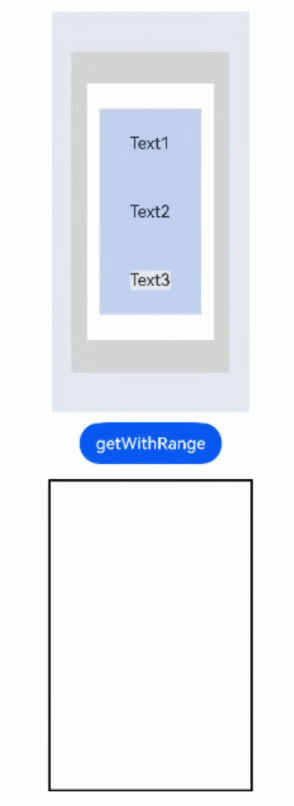

# @ohos.arkui.UIContext (UIContext) (System API)
<!--Kit: ArkUI-->
<!--Subsystem: ArkUI-->
<!--Owner: @xiang-shouxing-->
<!--Designer: @xiang-shouxing-->
<!--Tester: @sally__-->
<!--Adviser: @HelloCrease-->

In the stage model, a window stage or window can use the **loadContent** API to load pages, create a UI instance, and render page content to the associated window. Naturally, UI instances and windows are associated on a one-by-one basis. Some global UI APIs are executed in the context of certain UI instances. When calling these APIs, you must identify the UI context, and consequently UI instance, by tracing the call chain. If these APIs are called on a non-UI page or in some asynchronous callback, the current UI context may fail to be identified, resulting in API execution errors.

> **NOTE**
>
> The initial APIs of this module are supported since API version 10. Newly added APIs will be marked with a superscript to indicate their earliest API version.
>
> You can preview how this component looks on a real device, but not in DevEco Studio Previewer.
>
> This topic describes only system APIs provided by the module. For details about its public APIs, see [@ohos.arkui.UIContext (UIContext)](arkts-apis-uicontext-uicontext.md).

## UIContext

In the following API examples, you must first use [getUIContext()](arkts-apis-window-Window.md#getuicontext10) in **@ohos.window** to obtain a **UIContext** instance, and then call the APIs using the obtained instance. Alternatively, you can obtain a **UIContext** instance through the built-in method [getUIContext()](arkui-ts/ts-custom-component-api.md#getuicontext) of the custom component. In this document, the **UIContext** instance is represented by **uiContext**.

### setDynamicDimming<sup>12+<sup>

setDynamicDimming(id: string, value: number): void

Sets the dynamic dimming degree of the component.


> **NOTE**
>
> Applying other visual effects after this API is called may result in conflicts.

**System capability**: SystemCapability.ArkUI.ArkUI.Full

**Parameters**

| Name| Type| Mandatory| Description|
| ------- | ------- | ------- | ------- |
| id | string | Yes| Component ID.|
| value | number | Yes| Dynamic dimming degree of the component. The value range is [0, 1]. The component is brighter with a larger value.|

**Example**

```ts
@Entry
@Component
struct Index {
  @State
  myCount : number = 100

  build() {
    Column(){
      Image($r('app.media.testImage')).width(500).height(800).id("test")
    }.width("100%").height("100%").onClick(()=>{
      this.getUIContext().setDynamicDimming("test",1)
      this.getUIContext()?.animateTo({duration:5000 },()=>{
        this.getUIContext().setDynamicDimming("test",0)
      })
    })
  }
}
```


### animateToImmediately<sup>12+</sup>

animateToImmediately(param: AnimateParam , event: () => void): void

Implements immediate delivery of an explicit animation through a **UIContext** object. When multiple property animations are loaded at once, you can call this API to immediately execute the transition animation for state changes caused by the specified closure function.

**Atomic service API**: This API can be used in atomic services since API version 12.

**System capability**: SystemCapability.ArkUI.ArkUI.Full

**Parameters**

| Name  | Type                                      | Mandatory  | Description                                   |
| ----- | ---------------------------------------- | ---- | ------------------------------------- |
| param | [AnimateParam](arkui-ts/ts-explicit-animation.md#animateparam) | Yes   | Animation settings.                          |
| event | () => void                               | Yes   | Closure function that displays the animation. The system automatically inserts the transition animation if the state changes in the closure function.|

**Example**

This example shows how to use **animateToImmediately** to implement immediate delivery of an explicit animation through a **UIContext** object.

```ts
// xxx.ets
@Entry
@Component
struct AnimateToImmediatelyExample {
  @State widthSize: number = 250
  @State heightSize: number = 100
  @State opacitySize: number = 0
  private flag: boolean = true
  uiContext: UIContext | null | undefined = this.getUIContext();

  build() {
    Column() {
      Column()
        .width(this.widthSize)
        .height(this.heightSize)
        .backgroundColor(Color.Green)
        .opacity(this.opacitySize)
      Button('change size')
        .margin(30)
        .onClick(() => {
          if (this.flag) {
            this.uiContext?.animateToImmediately({
              delay: 0,
              duration: 1000
            }, () => {
              this.opacitySize = 1
            })
            this.uiContext?.animateTo({
              delay: 1000,
              duration: 1000
            }, () => {
              this.widthSize = 150
              this.heightSize = 60
            })
          } else {
            this.uiContext?.animateToImmediately({
              delay: 0,
              duration: 1000
            }, () => {
              this.widthSize = 250
              this.heightSize = 100
            })
            this.uiContext?.animateTo({
              delay: 1000,
              duration: 1000
            }, () => {
              this.opacitySize = 0
            })
          }
          this.flag = !this.flag
        })
    }.width('100%').margin({ top: 5 })
  }
}
```


### freezeUINode<sup>18+</sup>

freezeUINode(id: string, isFrozen: boolean): void

Sets the frozen state of a component by ID to prevent the component from being marked as dirty and triggering layout update.

**Atomic service API**: This API can be used in atomic services since API version 18.

**System capability**: SystemCapability.ArkUI.ArkUI.Full

**Parameters**

| Name    | Type   | Mandatory  | Description     |
| --- | --- | --- | --- |
| id | string | Yes| ID of the target component.|
| isFrozen | boolean | Yes| Whether to freeze the component.<br>The value **true** means to freeze the component, and **false** means the opposite.<br>Default value: **false**.|

**Error codes**

For details about the error codes, see [Universal Error Codes](../errorcode-universal.md).

| ID| Error Message|
| -------- | -------- |
| 202 | The caller is not a system application. |

```ts
@Entry
@Component
struct Index {
  @State columnWidth1: string = '100%';
  @State currentIndex: number = 0;
  private controller: TabsController = new TabsController();

  build() {
    Column() {
      Tabs({ 
        barPosition: BarPosition.Start, 
        index: this.currentIndex, 
        controller: this.controller 
      }) {
        TabContent() {
          Column()
          .width(this.columnWidth1)
          .height('100%')
          .backgroundColor('#00CB87')
        }
        .tabBar('green')
        .id('tab1')
        .onWillHide(() => {
          // Set the frozen state of the TabContent component whose ID is tab1 to true when the component is hidden.
          this.getUIContext().freezeUINode('tab1', true);
        })
        .onWillShow(() => {
          // Set the frozen state of the tab1 node to false when the TabContent with the id tab1 is displayed.
          this.getUIContext().freezeUINode('tab1', false);
        })

        TabContent() {
          Column()
          .width('100%')
          .height('100%')
          .backgroundColor('#007DFF')
        }
        .tabBar('blue')
        .id('tab2')
        .onWillHide(() => {
          // Set the frozen state of the tab2 node to true when the TabContent with the id tab2 is hidden.
          this.getUIContext().freezeUINode('tab2', true);
        })
        .onWillShow(() => {
          // Set the frozen state of the tab1 node to true when the TabContent with the id tab2 is displayed.
          // Change the width of the Column node in the tab1 node based on the state variable. The frozen state of the tab1 node is true. The marking is terminated when the dirty state is marked to the TabContent, and the layout is not triggered.
          this.getUIContext().freezeUINode('tab1', true);
          this.columnWidth1 = '50%';
          // Configure a delayed task.
          setTimeout(() => {
            // Set the frozen state of the tab1 node to false to trigger the marking and layout again.
            this.getUIContext().freezeUINode('tab1', false);
            // Update the width of the Column node in the tab1 node based on the state variable and set this.columnWidth1 to '20%'.
            this.columnWidth1 = '20%';
          }, 5000)
        })

         TabContent() {
          Column()
          .width('100%')
          .height('100%')
          .backgroundColor('#FFBF00')
        }
        .tabBar('yellow')
        .id('tab3')
        .onWillHide(() => {
          // Set the frozen state of the tab3 node to true when the TabContent with the id tab3 is hidden.
          this.getUIContext().freezeUINode('tab3', true);
        })
        .onWillShow(() => {
          // Set the frozen state of the node to false when the TabContent component whose id is tab3 is displayed.
          this.getUIContext().freezeUINode('tab3', false);
        })

      }
      .vertical(false)
      .barMode(BarMode.Fixed)
      .barWidth(360)
      .barHeight(56)
      .animationDuration(0)
      .onChange((index: number) => {
        this.currentIndex = index;
      })
      .width(360)
      .height(296)
      .margin({ top: 52 })
      .backgroundColor('#F1F3F5')
    }.width('100%')
  }
}
```

### freezeUINode<sup>18+</sup>

freezeUINode(uniqueId: number, isFrozen: boolean): void

You can use uniqueId to set the frozen state of a component to prevent the component from being marked as dirty and triggering layout update.

**Atomic service API**: This API can be used in atomic services since API version 18.

**System capability**: SystemCapability.ArkUI.ArkUI.Full

**Parameters**

| Name    | Type   | Mandatory  | Description     |
| --- | --- | --- | --- |
| uniqueId | number | Yes| Unique ID of the target component.|
| isFrozen | boolean | Yes| Whether to freeze the component.<br>The value **true** means to freeze the component, and **false** means the opposite.<br>Default value: **false**.|

**Error codes**

For details about the error codes, see [Universal Error Codes](../errorcode-universal.md).

| ID| Error Message|
| -------- | -------- |
| 202 | The caller is not a system application. |

```ts
@Entry
@Component
struct Index {
  @State columnWidth1: string = '100%';
  @State currentIndex: number = 0;
  private controller: TabsController = new TabsController();

  build() {
    Column() {
      Tabs({ 
        barPosition: BarPosition.Start, 
        index: this.currentIndex, 
        controller: this.controller 
      }) {
        TabContent() {
          Column()
          .width(this.columnWidth1)
          .height('100%')
          .backgroundColor('#00CB87')
        }
        .tabBar('green')
        .id('tab1')
        .onWillHide(() => {
          // Query the unique ID of the node using the ID.
          const node = this.getUIContext().getFrameNodeById('tab1');
          const uniqueId = node?.getUniqueId();
          // When the TabContent whose ID is tab1 is hidden, set the frozen state of the node to true using the unique ID.
          this.getUIContext().freezeUINode(uniqueId, true);
        })
        .onWillShow(() => {
          // Query the unique ID of the node using the ID.
          const node = this.getUIContext().getFrameNodeById('tab1');
          const uniqueId = node?.getUniqueId();
          // When the TabContent whose ID is tab1 is displayed, set the frozen state of the node to false using the unique ID.
          this.getUIContext().freezeUINode(uniqueId, false)
        })

        TabContent() {
          Column()
          .width('100%')
          .height('100%')
          .backgroundColor('#007DFF')
        }
        .tabBar('blue')
        .id('tab2')
        .onWillHide(() => {
          // Query the unique ID of the node using the ID.
          const node = this.getUIContext().getFrameNodeById('tab2');
          const uniqueId = node?.getUniqueId();
          // Set the frozen state of the node to true through uniqueId when the TabContent whose id is tab2 is hidden.
          this.getUIContext().freezeUINode(uniqueId, true);
        })
        .onWillShow(() => {
          // Query the uniqueId of the corresponding node by id.
          const node = this.getUIContext().getFrameNodeById('tab1');
          const uniqueId = node?.getUniqueId();
          // Set the frozen state of the node whose id is tab1 to true through uniqueId when the TabContent whose id is tab2 is displayed.
          // Change the width of the internal Column node of the node whose id is tab1 through the state variable. The frozen state of the node whose id is tab1 is true. The dirty marking is terminated when the TabContent is dirty, and the layout is not triggered from the node.
          this.getUIContext().freezeUINode(uniqueId, true);
          this.columnWidth1 = '50%';

          // Set a delayed task.
          setTimeout(() => {
            // Set the frozen state of the node whose id is tab1 to false to trigger the marking and layout again.
            this.getUIContext().freezeUINode(uniqueId, false);
            this.columnWidth1 = '20%';
          }, 5000)
        })

         TabContent() {
          Column()
          .width('100%')
          .height('100%')
          .backgroundColor('#FFBF00')
        }
        .tabBar('yellow')
        .id('tab3')
        .onWillHide(() => {
          // Query the uniqueId of the corresponding node by id.
          const node = this.getUIContext().getFrameNodeById('tab3');
          const uniqueId = node?.getUniqueId();
          // Set the frozen state of the node to true through uniqueId when the TabContent whose id is tab3 is hidden.
          this.getUIContext().freezeUINode(uniqueId, true);
        })
        .onWillShow(() => {
          // Query the uniqueId of the node using the ID.
          const node = this.getUIContext().getFrameNodeById('tab3');
          const uniqueId = node?.getUniqueId();
          // When the TabContent of tab3 is displayed, set the frozen state of the node to false using uniqueId.
          this.getUIContext().freezeUINode(uniqueId, false);
        })

      }
      .vertical(false)
      .barMode(BarMode.Fixed)
      .barWidth(360)
      .barHeight(56)
      .animationDuration(0)
      .onChange((index: number) => {
        this.currentIndex = index;
      })
      .width(360)
      .height(296)
      .margin({ top: 52 })
      .backgroundColor('#F1F3F5')
    }.width('100%')
  }
}
```

### setKeyboardAppearanceConfig<sup>20+</sup>

setKeyboardAppearanceConfig(uniqueId: number, config: KeyboardAppearanceConfig): void

Sets the keyboard style, including the blur effect and glow effect. The blur effect takes effect only in immersive mode. For details about the immersive mode, see [KeyboardAppearance](../apis-arkui/arkui-ts/ts-text-common.md#keyboardappearance15). The glow effect depends on the blur effect. If the glow effect needs to be enabled, the blur effect must be enabled at the same time. The final display effect depends on the input method processing.

**System API**: This is a system API.

**System capability**: SystemCapability.ArkUI.ArkUI.Full

**Parameters**

| Name    | Type   | Mandatory  | Description     |
| --- | --- | --- | --- |
| uniqueId | number | Yes| Unique ID of the component node. The value must be greater than or equal to 0.|
| config | [KeyboardAppearanceConfig](../apis-arkui/arkui-ts/ts-text-common-sys.md#keyboardappearanceconfig20) | Yes| Keyboard style configuration parameter.|

**Error codes**

For details about the error codes, see [Universal Error Codes](../errorcode-universal.md).

| ID| Error Message|
| -------- | -------- |
| 202 | The caller is not a system application. |

The following figure shows how to set the keyboard style for the input box and search box components.

```ts
@Entry
@Component
struct IMEGradient {
  textInputController: TextInputController = new TextInputController();
  searchController: SearchController = new SearchController();

  build() {
    Column() {
      TextInput({ controller: this.textInputController})
        .margin(10)
        .border({ width: 1 })
        .onWillAttachIME((client) => {
          this.getUIContext().setKeyboardAppearanceConfig(client.nodeId,
            {
              gradientMode: KeyboardGradientMode.LINEAR_GRADIENT,
              fluidLightMode: KeyboardFluidLightMode.BACKGROUND_FLUID_LIGHT
            })
        })
        .keyboardAppearance(KeyboardAppearance.IMMERSIVE)

      Search({ controller: this.searchController })
        .margin(10)
        .border({ width: 1 })
        .onWillAttachIME((client) => {
          this.getUIContext().setKeyboardAppearanceConfig(client.nodeId,
            {
              gradientMode: KeyboardGradientMode.LINEAR_GRADIENT,
              fluidLightMode: KeyboardFluidLightMode.BACKGROUND_FLUID_LIGHT
            })
        })
        .keyboardAppearance(KeyboardAppearance.IMMERSIVE)
    }.width('100%').height('100%').justifyContent(FlexAlign.Center)
  }
}
```

## ComponentSnapshot<sup>12+</sup>

The following APIs must be called after the [getComponentSnapshot()](arkts-apis-uicontext-uicontext.md#getcomponentsnapshot12) method in UIContext is used to obtain the ComponentSnapshot object.

Transformation properties such as scaling, translation, and rotation only apply to the child components of the target component. Applying these transformation properties directly to the target component itself has no effect; the snapshot will still display the component as it appears before any transformations are applied.

### getWithRange<sup>20+</sup>
getWithRange(start: NodeIdentity, end: NodeIdentity, isStartRect: boolean, options?: componentSnapshot.SnapshotOptions): Promise<image.PixelMap>;

Obtains the screenshot of the components within the range by passing the IDs of the two components and returns the result using a promise.

> **NOTE**
>
> The components corresponding to start and end must be in the same component tree, and the component corresponding to start must be the ancestor component of the component corresponding to end.

**Atomic service API**: This API can be used in atomic services since API version 20.

**System capability**: SystemCapability.ArkUI.ArkUI.Full

**Parameters**

| Name | Type    | Mandatory  | Description                                      |
| ---- | ------ | ---- | ------- |
| start   | [NodeIdentity](arkts-apis-uicontext-t.md#nodeidentity20) | Yes   | ID of the component at the start of the range.|
| end   | [NodeIdentity](arkts-apis-uicontext-t.md#nodeidentity20) | Yes   | ID of the component at the end of the range.|
| isStartRect   | boolean | Yes   | Whether the range is based on the bounding rectangle of the start component.<br>true indicates that the bounding rectangle of the start component is used, and false indicates that the bounding rectangle of the end component is used.<br>Default value: **true**.|
| options       | [componentSnapshot.SnapshotOptions](js-apis-arkui-componentSnapshot.md#snapshotoptions12)            | No   | Custom parameters related to screenshots. The region parameter is not supported.|

**Return value**

| Type                           | Description      |
| -------- | -------- |
| image.[PixelMap](../apis-image-kit/arkts-apis-image-PixelMap.md) | Promise used to return the result.|

**Error codes**

For details about the error codes, see [Universal Error Codes](../errorcode-universal.md) and [Snapshot Error Codes](errorcode-snapshot.md).

| ID | Error Message               |
| ------ | ------- |
| 202     | The caller is not a system application. |
| 100001 | Invalid ID. |

**Example**

```ts
import { image } from '@kit.ImageKit';

@Entry
@Component
struct SnapshotExample {
  @State pixmap: image.PixelMap | undefined = undefined
  build() {
    Column() {
      Row() {
        Row() {
          Row() {
            Column() {
              Text('Text1').id('text1')
              Text('Text2').id('text2')
              Row() {
                Text('Text3').id('text3')
              }.id('root5').backgroundColor('#E4E8F0')
            }.width('80%').height('80%').justifyContent(FlexAlign.SpaceAround).backgroundColor('#C1D1F0').id('root4')
          }.width('80%').height('80%').justifyContent(FlexAlign.Center).backgroundColor('#FFEEF0').id('root3')
          .backgroundBlurStyle(BlurStyle.Thin, { colorMode: ThemeColorMode.LIGHT })
        }.width('80%').height('80%').justifyContent(FlexAlign.Center).backgroundColor('#D5D5D5').id('root2')
      }.width('50%').height('50%').justifyContent(FlexAlign.Center).backgroundColor('#E4E8F0').id('root1')
      Row() {
        Button("getWithRange")
          .onClick(() => {
            this.getUIContext().getComponentSnapshot().getWithRange('root2', 'root4', true)
              .then((pixmap: image.PixelMap) => {
                this.pixmap = pixmap
              }).catch((err:Error) => {
              console.error("error: " + err)
            })
          }).margin(10)
      }.justifyContent(FlexAlign.SpaceAround)
      Row() {
        Image(this.pixmap).width(200).height(300).border({ color: Color.Black, width: 2 }).margin(5)
      }.justifyContent(FlexAlign.SpaceAround)
    }
    .id('root')
    .width('100%')
    .height('100%')
    .alignItems(HorizontalAlign.Center)
  }
}
```


