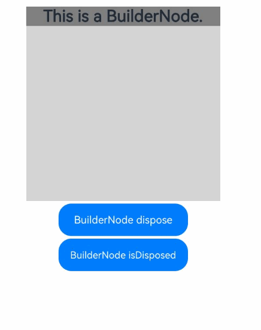
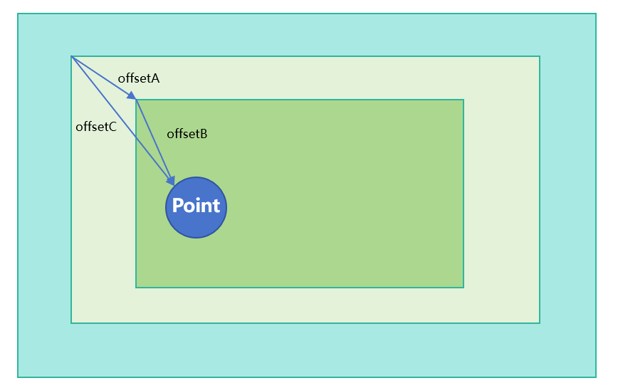
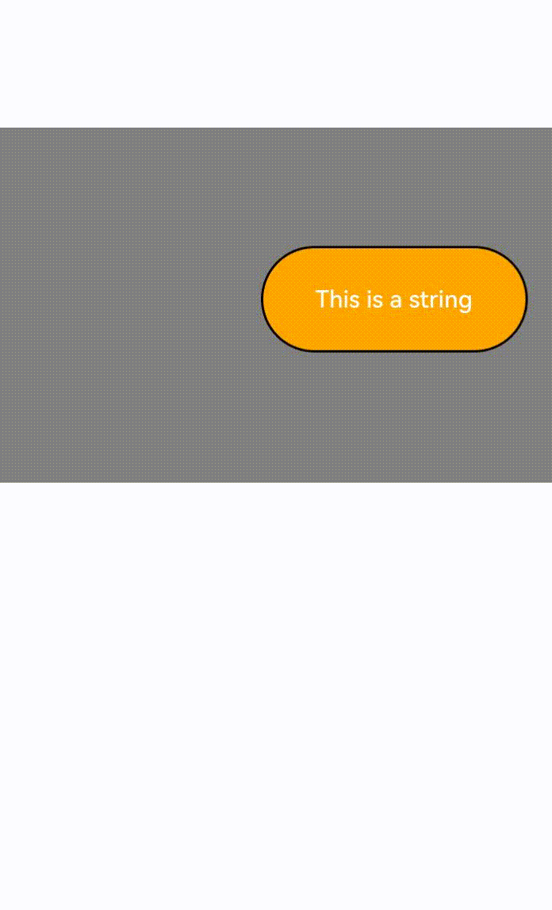
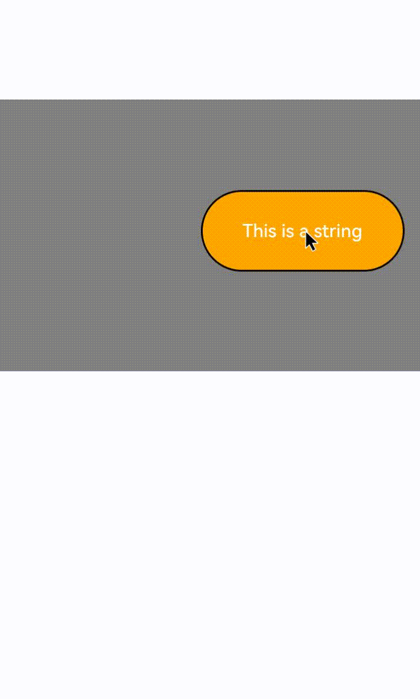
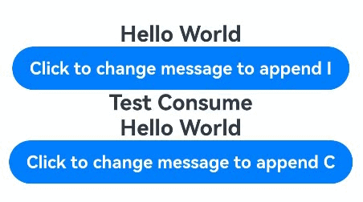

# BuilderNode
<!--Kit: ArkUI-->
<!--Subsystem: ArkUI-->
<!--Owner: @xiang-shouxing-->
<!--Designer: @xiang-shouxing-->
<!--Tester: @sally__-->
<!--Adviser: @HelloCrease-->

<!--Kit: ArkUI-->
<!--Subsystem: ArkUI-->
<!--Owner: @xiang-shouxing-->
<!--Designer: @xiang-shouxing-->
<!--Tester: @sally__-->

The **BuilderNode** module provides APIs for a BuilderNode – a custom node that can be used to mount built-in components. A BuilderNode can be used only as a leaf node. For details, see [BuilderNode Development](../../ui/arkts-user-defined-arktsNode-builderNode.md). For best practices, see [Dynamic Component Creation: Dynamically Adding, Updating, and Deleting Components](https://developer.huawei.com/consumer/en/doc/best-practices/bpta-ui-dynamic-operations#section153921947151012).

> **NOTE**
>
> The initial APIs of this module are supported since API version 11. Newly added APIs will be marked with a superscript to indicate their earliest API version.
>
> If the root node of the passed Builder is a syntax node ([Ifelse](../../ui/rendering-control/arkts-rendering-control-ifelse.md)/[foreach](../../ui/rendering-control/arkts-rendering-control-foreach.md)/[lazyforeach](../../ui/rendering-control/arkts-rendering-control-lazyforeach.md)/[ContentSlot](../../ui/rendering-control/arkts-rendering-control-contentslot.md)...), [Span](./arkui-ts/ts-basic-components-span.md), [ContainerSpan](./arkui-ts/ts-basic-components-containerspan.md), [SymbolSpan](./arkui-ts/ts-basic-components-symbolSpan.md), or custom component, an additional [FrameNode](./js-apis-arkui-frameNode.md) is generated, which is displayed as BuilderProxyNode in the node tree. This will change the tree structure and affect the transfer process of some tests. For details, see [BuilderProxyNode in BuilderNode Causes Changes in the Tree Structure](../../ui/arkts-user-defined-arktsNode-builderNode.md#builderproxynode-in-buildernode-causes-changes-in-the-tree-structure).
>
> If you encounter display issues when reusing a BuilderNode across pages, see [Cross-Page Reuse Considerations](../../ui/arkts-user-defined-arktsNode-builderNode.md#cross-page-reuse-considerations) for guidance.
>
> **BuilderNode** is not available in DevEco Studio Previewer.
>
> Custom components under a BuilderNode can use the [@Prop](../../ui/state-management/arkts-prop.md) decorator. The [@Link](../../ui/state-management/arkts-link.md) decorator cannot be used to synchronize data and states across BuilderNode boundaries.
>
> If a BuilderNode contains custom components as child nodes, these custom components cannot use the [@Reusable](../../ui/state-management/arkts-reusable.md) decorator. For details, see [Using the @Reusable Decorator with BuilderNode Child Components](../../ui/arkts-user-defined-arktsNode-builderNode.md#using-the-reusable-decorator-with-buildernode-child-components).
>
> Since API version 12, custom components can receive [LocalStorage](../../ui/state-management/arkts-localstorage.md) instances. You can use LocalStorage related decorators such as [@LocalStorageProp](../../ui/state-management/arkts-localstorage.md#localstorageprop) and [@LocalStorageLink](../../ui/state-management/arkts-localstorage.md#localstoragelink) by [passing LocalStorage instances](../../ui/state-management/arkts-localstorage.md#providing-a-custom-component-with-access-to-a-localstorage-instance).
>
> Since API version 20, when configured with [BuildOptions](#buildoptions12), custom components within a BuilderNode can access the host page's [@Provide](../../ui/state-management/arkts-provide-and-consume.md) data through their [@Consume](../../ui/state-management/arkts-provide-and-consume.md) decorated attributes.
>
> The behavior of other decorators is undefined. Avoid using those decorators.
>
> [Repeat](../../ui/rendering-control/arkts-new-rendering-control-repeat.md) can be used only in custom components.

## Modules to Import

```ts
import { BuilderNode, RenderOptions, NodeRenderType } from "@kit.ArkUI";
```

## NodeRenderType

Enumerates the node rendering types.

**Atomic service API**: This API can be used in atomic services since API version 12.

**System capability**: SystemCapability.ArkUI.ArkUI.Full

| Name               | Value | Description                        |
| ------------------- | --- | ---------------------------- |
| RENDER_TYPE_DISPLAY | 0   | The node is displayed on the screen.|
| RENDER_TYPE_TEXTURE | 1   | The node is exported as a texture.  |

> **NOTE**
>
> Currently, the **RENDER_TYPE_TEXTURE** type takes effect only for the [XComponentNode](./js-apis-arkui-xcomponentNode.md) and the [BuilderNode](#buildernode-1) holding a component tree whose root node is a custom component.
>
> Currently, the following custom components can export textures as the root node in the case of [BuilderNode](#buildernode-1): [Badge](arkui-ts/ts-container-badge.md), [Blank](arkui-ts/ts-basic-components-blank.md), [Button](arkui-ts/ts-basic-components-button.md), [CanvasGradient](arkui-ts/ts-components-canvas-canvasgradient.md), [CanvasPattern](arkui-ts/ts-components-canvas-canvaspattern.md), [CanvasRenderingContext2D](arkui-ts/ts-canvasrenderingcontext2d.md), [Canvas](arkui-ts/ts-components-canvas-canvas.md), [CheckboxGroup](arkui-ts/ts-basic-components-checkboxgroup.md), [Checkbox](arkui-ts/ts-basic-components-checkbox.md), [Circle](arkui-ts/ts-drawing-components-circle.md), [ColumnSplit](arkui-ts/ts-container-columnsplit.md), [Column](arkui-ts/ts-container-column.md), [ContainerSpan](arkui-ts/ts-basic-components-containerspan.md), [Counter](arkui-ts/ts-container-counter.md), [DataPanel](arkui-ts/ts-basic-components-datapanel.md), [Divider](arkui-ts/ts-basic-components-divider.md), [Ellipse](arkui-ts/ts-drawing-components-ellipse.md), [Flex](arkui-ts/ts-container-flex.md), [Gauge](arkui-ts/ts-basic-components-gauge.md), [Hyperlink](arkui-ts/ts-container-hyperlink.md), [ImageBitmap](arkui-ts/ts-components-canvas-imagebitmap.md), [ImageData](arkui-ts/ts-components-canvas-imagedata.md), [Image](arkui-ts/ts-basic-components-image.md), [Line](arkui-ts/ts-drawing-components-line.md), [LoadingProgress](arkui-ts/ts-basic-components-loadingprogress.md), [Marquee](arkui-ts/ts-basic-components-marquee.md), [Matrix2D](arkui-ts/ts-components-canvas-matrix2d.md), [OffscreenCanvasRenderingContext2D](arkui-ts/ts-offscreencanvasrenderingcontext2d.md), [OffscreenCanvas](arkui-ts/ts-components-offscreencanvas.md), [Path2D](arkui-ts/ts-components-canvas-path2d.md), [Path](arkui-ts/ts-drawing-components-path.md), [PatternLock](arkui-ts/ts-basic-components-patternlock.md), [Polygon](arkui-ts/ts-drawing-components-polygon.md), [Polyline](arkui-ts/ts-drawing-components-polyline.md), [Progress](arkui-ts/ts-basic-components-progress.md), [QRCode](arkui-ts/ts-basic-components-qrcode.md), [Radio](arkui-ts/ts-basic-components-radio.md), [Rating](arkui-ts/ts-basic-components-rating.md), [Rect](arkui-ts/ts-drawing-components-rect.md), [RelativeContainer](arkui-ts/ts-container-relativecontainer.md), [RowSplit](arkui-ts/ts-container-rowsplit.md), [Row](arkui-ts/ts-container-row.md), [Shape](arkui-ts/ts-drawing-components-shape.md), [Slider](arkui-ts/ts-basic-components-slider.md), [Span](arkui-ts/ts-basic-components-span.md), [Stack](arkui-ts/ts-container-stack.md), [TextArea](arkui-ts/ts-basic-components-textarea.md), [TextClock](arkui-ts/ts-basic-components-textclock.md), [TextInput](arkui-ts/ts-basic-components-textinput.md), [TextTimer](arkui-ts/ts-basic-components-texttimer.md), [Text](arkui-ts/ts-basic-components-text.md), [Toggle](arkui-ts/ts-basic-components-toggle.md), [Video](arkui-ts/ts-media-components-video.md) (excluding the full-screen playback capability), [Web](../apis-arkweb/arkts-basic-components-web.md), [XComponent](arkui-ts/ts-basic-components-xcomponent.md).
>
> Since API version 12, the following components support texture export: [DatePicker](arkui-ts/ts-basic-components-datepicker.md), [ForEach](arkui-ts/ts-rendering-control-foreach.md), [Grid](arkui-ts/ts-container-grid.md), [IfElse](../../ui/rendering-control/arkts-rendering-control-ifelse.md), [LazyForEach](arkui-ts/ts-rendering-control-lazyforeach.md), [List](arkui-ts/ts-container-list.md), [Scroll](arkui-ts/ts-container-scroll.md), [Swiper](arkui-ts/ts-container-swiper.md), [TimePicker](arkui-ts/ts-basic-components-timepicker.md), custom component modified by [@Component](../../ui/state-management/arkts-create-custom-components.md#component), [NodeContainer](arkui-ts/ts-basic-components-nodecontainer.md), and [FrameNode](./js-apis-arkui-frameNode.md) and [RenderNode](./js-apis-arkui-renderNode.md) mounted to [NodeContainer](arkui-ts/ts-basic-components-nodecontainer.md).
>
> For details, see [Rendering and Drawing Video and Button Components at the Same Layer](../../web/web-same-layer.md).

## RenderOptions

Provides optional parameters for creating a BuilderNode.

**Atomic service API**: This API can be used in atomic services since API version 12.

**System capability**: SystemCapability.ArkUI.ArkUI.Full

| Name         | Type                                  | Mandatory| Description                                                        |
| ------------- | -------------------------------------- | ---- | ------------------------------------------------------------ |
| selfIdealSize | [Size](js-apis-arkui-graphics.md#size) | No  | Ideal size of the node.<br>Default value: **{ width: 0, height: 0 }**.|
| type          | [NodeRenderType](#noderendertype)      | No  | Rendering type of the node.<br>Default value: **NodeRenderType.RENDER_TYPE_DISPLAY**.|
| surfaceId     | string                                 | No  | Surface ID of the texture receiver. Typically, the texture receiver is [OH_NativeImage](../apis-arkgraphics2d/capi-oh-nativeimage-oh-nativeimage.md).<br>This parameter is effective only when **type** is set to **NodeRenderType.RENDER_TYPE_TEXTURE**.<br>Default value: **""**.|

## BuildOptions<sup>12+</sup>

Defines the optional build options.

**System capability**: SystemCapability.ArkUI.ArkUI.Full

| Name         | Type                                  | Read-Only| Optional| Description                                                        |
| ------------- | -------------------------------------- | ---- | ---- | ------------------------------------------------------------ |
| nestingBuilderSupported | boolean | No  | Yes  | Whether to support nesting **@Builder** within **@Builder**. The value true indicates that nested builders are supported, and the value false indicates that nested builders are not supported. Default value: **false**.<br>**Atomic service API**: This API can be used in atomic services since API version 12.|
| localStorage<sup>20+</sup> | [LocalStorage](../../ui/state-management/arkts-localstorage.md) | No  | Yes  | LocalStorage for the current BuilderNode. Custom components mounted under this BuilderNode will share the specified LocalStorage. **NOTE**<br>If LocalStorage is also passed through a custom component's constructor, the constructor parameter takes precedence.<br> Default value: **null**.<br>**Atomic service API**: This API can be used in atomic services since API version 20.|
| enableProvideConsumeCrossing<sup>20+</sup> | boolean | No  | Yes  | Defines whether the @Consume in the BuilderNode can communicate with the @Provide outside the BuilderNode. The value **true** means that this feature is supported, and **false** means the opposite. Default value: **false**.<br>**Atomic service API**: This API can be used in atomic services since API version 20.|

## InputEventType<sup>20+</sup>

type InputEventType = TouchEvent | MouseEvent | AxisEvent

Defines the type of the input event to be sent. For details, see the parameters of [postInputEvent](#postinputevent20).

**Atomic service API**: This API can be used in atomic services since API version 20.

**System capability**: SystemCapability.ArkUI.ArkUI.Full

| Type| Description                                  |
| ------------- | -------------------------------------- |
| [TouchEvent](arkui-ts/ts-universal-events-touch.md#touchevent)  | Touch event.|
| [MouseEvent](arkui-ts/ts-universal-mouse-key.md#mouseevent)  | Mouse event.|
| [AxisEvent](arkui-ts/ts-universal-events-axis.md#axisevent)  | Axis event.|

## BuilderNode

class BuilderNode\<Args extends Object[]>

Implements a BuilderNode, which can create a component tree through the stateless UI method [@Builder](../../ui/state-management/arkts-builder.md) and hold the root node of the component tree. A BuilderNode cannot be defined as a state variable. The FrameNode held in the BuilderNode is only used to mount the BuilderNode to other FrameNodes as a child node. Undefined behavior may occur if you set attributes or perform operations on subnodes of the FrameNode held by the BuilderNode. Therefore, after you have obtained a [RenderNode](js-apis-arkui-renderNode.md) through the [getFrameNode](#getframenode) method of the BuilderNode and the [getRenderNode](js-apis-arkui-frameNode.md#getrendernode) method of the [FrameNode](js-apis-arkui-frameNode.md), avoid setting the attributes or operating the subnodes through APIs of [RenderNode](js-apis-arkui-renderNode.md).

**Atomic service API**: This API can be used in atomic services since API version 12.

**System capability**: SystemCapability.ArkUI.ArkUI.Full

### constructor

constructor(uiContext: UIContext, options?: RenderOptions)

When the content generated by BuilderNode is embedded in another RenderNode for display, selfIdealSize in RenderOptions must be explicitly specified. Otherwise, the layout constraints of the parent component in Builder are [0, 0] by default. In this scenario, if selfIdealSize is not set, the size of the root node of the subtree in BuilderNode is considered as [0, 0].

**Atomic service API**: This API can be used in atomic services since API version 12.

**System capability**: SystemCapability.ArkUI.ArkUI.Full

**Parameters**

| Name   | Type                                   | Mandatory| Description                                                             |
| --------- | --------------------------------------- | ---- | ----------------------------------------------------------------- |
| uiContext | [UIContext](arkts-apis-uicontext-uicontext.md) | Yes  | UI context. For details about how to obtain it, see [Obtaining UI Context](./js-apis-arkui-node.md#obtaining-ui-context).|
| options   | [RenderOptions](#renderoptions)         | No  | Parameters for creating a BuilderNode.<br>Default value: **undefined**.  |

> **NOTE**
> The input parameter for **uiContext** must be a valid value, that is, the UI context must be correct. If an invalid value is passed in or if no value is specified, creation will fail.

### build

build(builder: WrappedBuilder\<Args>, arg?: Object): void

Creates a component tree based on the passed object and holds the root node of the component tree. The stateless UI method [@Builder](../../ui/state-management/arkts-builder.md) has at most one root node.
Custom components are allowed.

> **NOTE**
>
> When nesting @Builder, ensure that the input objects for the inner and outer @Builder methods are consistent.
>
> The outermost @Builder supports only one input parameter.
>
> The build parameter uses the pass-by-value semantics. To implement state updates, you must explicitly use the [update](#update) API.
>
> To operate objects in a BuilderNode, ensure that the reference to the BuilderNode is not garbage collected. After the BuilderNode object is reclaimed by the virtual machine, the [FrameNode](js-apis-arkui-frameNode.md) and [RenderNode](js-apis-arkui-renderNode.md) objects of the BuilderNode object are also de-referenced from the backend node. This means that any FrameNode objects obtained from a BuilderNode will no longer correspond to any actual node if the BuilderNode is garbage collected.
>
> The BuilderNode object maintains references to its underlying entity nodes. When the BuilderNode frontend object is no longer required for managing backend nodes, call the [dispose](#dispose12) API to release node references and unbind frontend and backend nodes.

**Atomic service API**: This API can be used in atomic services since API version 12.

**System capability**: SystemCapability.ArkUI.ArkUI.Full

**Parameters**

| Name | Type                                                           | Mandatory| Description                                                                                  |
| ------- | --------------------------------------------------------------- | ---- | -------------------------------------------------------------------------------------- |
| builder | [WrappedBuilder\<Args>](../../ui/state-management/arkts-wrapBuilder.md) | Yes  | Stateless UI method [@Builder](../../ui/state-management/arkts-builder.md) required for creating a component tree.|
| arg     | Object                                                          | No  | Argument of the builder. Only one input parameter is supported, and the type of the input parameter must be consistent with the type defined by @Builder.<br>Default value: **undefined**.|

### build<sup>12+</sup>

build(builder: WrappedBuilder\<Args>, arg: Object, options: [BuildOptions](#buildoptions12)): void

Creates a component tree based on the passed object and holds the root node of the component tree. The stateless UI method [@Builder](../../ui/state-management/arkts-builder.md) has at most one root node.
Custom components are allowed.

> **NOTE**
> 
> For details about the creation and update using @Builder, see [@Builder](../../ui/state-management/arkts-builder.md).
> 
> The outermost @Builder supports only one input parameter.

**Atomic service API**: This API can be used in atomic services since API version 12.

**System capability**: SystemCapability.ArkUI.ArkUI.Full

**Parameters**

| Name | Type                                                           | Mandatory| Description                                                                                   |
| ------- | --------------------------------------------------------------- | ---- | -------------------------------------------------------------------------------------- |
| builder | [WrappedBuilder\<Args>](../../ui/state-management/arkts-wrapBuilder.md) | Yes  | Stateless UI method [@Builder](../../ui/state-management/arkts-builder.md) required for creating a component tree.  |
| arg     | Object                                                          | Yes  | Argument of the builder. Only one input parameter is supported, and the type of the input parameter must be consistent with the type defined by @Builder.                                                           |
| options | [BuildOptions](#buildoptions12)                                           | Yes  | Build options, which determine whether to support nesting **@Builder** within **@Builder**.                                        |

**Example**
```ts
import { BuilderNode, NodeContent } from "@kit.ArkUI";

// Define the API for passing parameters.
interface ParamsInterface {
  text: string;
  func: Function;
}

@Builder
function buildTextWithFunc(fun: Function) {
  Text(fun())
    .fontSize(50)
    .fontWeight(FontWeight.Bold)
    .margin({ bottom: 36 })
}

@Builder
function buildText(params: ParamsInterface) {
  Column() {
    Text(params.text)
      .fontSize(50)
      .fontWeight(FontWeight.Bold)
      .margin({ bottom: 36 })
    buildTextWithFunc(params.func)
  }
}


@Entry
@Component
struct Index {
  @State message: string = "HELLO";
  private content: NodeContent = new NodeContent();

  build() {
    Row() {
      Column() {
        Button('addBuilderNode')
          .onClick(() => {
            let buildNode = new BuilderNode<[ParamsInterface]>(this.getUIContext());
            // Create a node tree.
            buildNode.build(wrapBuilder<[ParamsInterface]>(buildText), {
              text: this.message, func: () => {
                return "FUNCTION";
              }
            }, { nestingBuilderSupported: true });
            this.content.addFrameNode(buildNode.getFrameNode());
            buildNode.dispose();
          })
        ContentSlot(this.content)
      }
      .id("column")
      .width('100%')
      .height('100%')
    }
    .height('100%')
  }
}
```

### getFrameNode

getFrameNode(): FrameNode | null

Obtain [FrameNode](js-apis-arkui-frameNode.md) from BuilderNode. The FrameNode is generated only after the BuilderNode executes the build operation.

**Atomic service API**: This API can be used in atomic services since API version 12.

**System capability**: SystemCapability.ArkUI.ArkUI.Full

**Return value**

| Type                                                     | Description                                                                 |
| --------------------------------------------------------- | --------------------------------------------------------------------- |
| [FrameNode](js-apis-arkui-frameNode.md) \| null | **FrameNode** object. If no such object is held by the **BuilderNode** instance, null is returned.|

**Example 1**

BuilderNode is returned as the root node of [NodeContainer](arkui-ts/ts-basic-components-nodecontainer.md).

```ts
import { NodeController, BuilderNode, FrameNode, UIContext } from "@kit.ArkUI";

// Define the class for passing parameters.
class Params {
  text: string = "";
  constructor(text: string) {
    this.text = text;
  }
}

@Builder
function buildText(params: Params) {
  Column() {
    Text(params.text)
      .fontSize(50)
      .fontWeight(FontWeight.Bold)
      .margin({bottom: 36})
  }
}

// Extend NodeController to implement the custom textNode controller.
class TextNodeController extends NodeController {
  private textNode: BuilderNode<[Params]> | null = null;
  private message: string = "DEFAULT";

  constructor(message: string) {
    super();
    this.message = message;
  }

  makeNode(context: UIContext): FrameNode | null {
    this.textNode = new BuilderNode(context);
    this.textNode.build(wrapBuilder<[Params]>(buildText), new Params(this.message));
    // Returns the FrameNode contained in the BuilderNode.
    return this.textNode.getFrameNode();
  }
}

@Entry
@Component
struct Index {
  @State message: string = "hello";

  build() {
    Row() {
      Column() {
        NodeContainer(new TextNodeController(this.message))
          .width('100%')
          .height(100)
          .backgroundColor('#FFF0F0F0')
      }
      .width('100%')
      .height('100%')
    }
    .height('100%')
  }
}
```

**Example 2**

[FrameNode](js-apis-arkui-frameNode.md) of BuilderNode is mounted to another FrameNode.

```ts
import { NodeController, BuilderNode, FrameNode, UIContext } from "@kit.ArkUI";

// Define the class for passing parameters.
class Params {
  text: string = "";

  constructor(text: string) {
    this.text = text;
  }
}

@Builder
function buildText(params: Params) {
  Column() {
    Text(params.text)
      .fontSize(50)
      .fontWeight(FontWeight.Bold)
      .margin({ bottom: 36 })
  }
}

// Extend NodeController to implement the custom textNode controller.
class TextNodeController extends NodeController {
  private rootNode: FrameNode | null = null;
  private textNode: BuilderNode<[Params]> | null = null;
  private message: string = "DEFAULT";

  constructor(message: string) {
    super();
    this.message = message;
  }

  makeNode(context: UIContext): FrameNode | null {
    this.rootNode = new FrameNode(context);
    this.textNode = new BuilderNode(context, { selfIdealSize: { width: 150, height: 150 } });
    this.textNode.build(wrapBuilder<[Params]>(buildText), new Params(this.message));
    if (this.rootNode !== null) {
      // Mounting the FrameNode of BuilderNode to another FrameNode
      this.rootNode.appendChild(this.textNode?.getFrameNode());
    }

    return this.rootNode;
  }
}

@Entry
@Component
struct Index {
  @State message: string = "hello";

  build() {
    Row() {
      Column() {
        NodeContainer(new TextNodeController(this.message))
          .width('100%')
          .height(100)
          .backgroundColor('#FFF0F0F0')
      }
      .width('100%')
      .height('100%')
    }
    .height('100%')
  }
}
```

**Example 3**

Mount the [RenderNode](./js-apis-arkui-renderNode.md) of BuilderNode to another RenderNode. Since the RenderNode does not pass layout constraints, this mode of mounting nodes is not recommended.

```ts
import { NodeController, BuilderNode, FrameNode, UIContext, RenderNode } from "@kit.ArkUI";
// Define the class for passing parameters.
class Params {
  text: string = "";

  constructor(text: string) {
    this.text = text;
  }
}

@Builder
function buildText(params: Params) {
  Column() {
    Text(params.text)
      .fontSize(50)
      .fontWeight(FontWeight.Bold)
      .margin({ bottom: 36 })
  }
}

// Extend NodeController to implement the custom textNode controller.
class TextNodeController extends NodeController {
  private rootNode: FrameNode | null = null;
  private textNode: BuilderNode<[Params]> | null = null;
  private message: string = "DEFAULT";

  constructor(message: string) {
    super();
    this.message = message;
  }

  makeNode(context: UIContext): FrameNode | null {
    this.rootNode = new FrameNode(context);
    let renderNode = new RenderNode();
    renderNode.clipToFrame = false;
    this.textNode = new BuilderNode(context, { selfIdealSize: { width: 150, height: 150 } });
    this.textNode.build(wrapBuilder<[Params]>(buildText), new Params(this.message));
    const textRenderNode = this.textNode?.getFrameNode()?.getRenderNode();

    const rootRenderNode = this.rootNode.getRenderNode();
    if (rootRenderNode !== null) {
      rootRenderNode.appendChild(renderNode);
    // Attach the RenderNode of BuilderNode to another RenderNode.
      renderNode.appendChild(textRenderNode);
    }

    return this.rootNode;
  }
}

@Entry
@Component
struct Index {
  @State message: string = "hello";

  build() {
    Row() {
      Column() {
        NodeContainer(new TextNodeController(this.message))
          .width('100%')
          .height(100)
          .backgroundColor('#FFF0F0F0')
      }
      .width('100%')
      .height('100%')
    }
    .height('100%')
  }
}
```

### update

update(arg: Object): void

Updates BuilderNode based on the provided parameters. The parameter type is the same as that passed when the [build](#build) method is called. When updating a custom component, you need to define the variables used in the custom component as the [@Prop](../../ui/state-management/arkts-prop.md) type.

**Atomic service API**: This API can be used in atomic services since API version 12.

**System capability**: SystemCapability.ArkUI.ArkUI.Full

**Parameters**

| Name| Type  | Mandatory| Description                                                                    |
| ------ | ------ | ---- | ------------------------------------------------------------------------ |
| arg    | Object | Yes  | Parameter used to update the BuilderNode. It is of the same type as the parameter passed to the [build](#build) API.|

**Example**
```ts
import { NodeController, BuilderNode, FrameNode, UIContext } from "@kit.ArkUI";

// Define the class for passing parameters.
class Params {
  text: string = "";
  constructor(text: string) {
    this.text = text;
  }
}

// Custom component
@Component
struct TextBuilder {
  @Prop message: string = "TextBuilder";

  build() {
    Row() {
      Column() {
        Text(this.message)
          .fontSize(50)
          .fontWeight(FontWeight.Bold)
          .margin({bottom: 36})
          .backgroundColor(Color.Gray)
      }
    }
  }
}

@Builder
function buildText(params: Params) {
  Column() {
    Text(params.text)
      .fontSize(50)
      .fontWeight(FontWeight.Bold)
      .margin({ bottom: 36 })
    TextBuilder({message: params.text}) // Custom component
  }
}

// Extend NodeController to implement the custom textNode controller.
class TextNodeController extends NodeController {
  private rootNode: FrameNode | null = null;
  private textNode: BuilderNode<[Params]> | null = null;
  private message: string = "";

  constructor(message: string) {
    super();
    this.message = message;
  }

  makeNode(context: UIContext): FrameNode | null {
    this.textNode = new BuilderNode(context);
    this.textNode.build(wrapBuilder<[Params]>(buildText), new Params(this.message));
    return this.textNode.getFrameNode();
  }

  // Update BuilderNode based on the input parameters.
  update(message: string) {
    if (this.textNode !== null) {
      this.textNode.update(new Params(message));
    }
  }
}

@Entry
@Component
struct Index {
  @State message: string = "hello";
  private textNodeController: TextNodeController = new TextNodeController(this.message);
  private count = 0;

  build() {
    Row() {
      Column() {
        NodeContainer(this.textNodeController)
          .width('100%')
          .height(200)
          .backgroundColor('#FFF0F0F0')
        Button('Update')
          .onClick(() => {
            this.count += 1;
            const message = "Update " + this.count.toString();
            this.textNodeController.update(message);
          })
      }
      .width('100%')
      .height('100%')
    }
    .height('100%')
  }
}
```

### postTouchEvent

postTouchEvent(event: TouchEvent): boolean

Posts a raw touch event to the FrameNode created by this BuilderNode.

**postTouchEvent** dispatches the event from a middle node in the component tree downwards. To ensure the event is dispatched correctly, it needs to be transformed into the coordinate system of the parent component, as shown in the figure below.

**OffsetA** indicates the offset of the BuildNode relative to the parent component. You can obtain this offset by calling [getPositionToParent](js-apis-arkui-frameNode.md#getpositiontoparent12) in the FrameNode. **OffsetB** indicates the offset of the touch point relative to the BuildNode. You can obtain this offset from the [TouchEvent](arkui-ts/ts-universal-events-touch.md#touchevent) object. **OffsetC** is the sum of **OffsetA** and **OffsetB**. It represents the final offset that you need to pass to **postTouchEvent**.


> **NOTE**
>
> The coordinates you pass in need to be converted to pixel values (px). If the BuilderNode has any affine transformations applied to it, they must be taken into account and combined with the touch event coordinates.
>
> In [Webview](../apis-arkweb/arkts-apis-webview.md), coordinate system transformations are already handled internally, so you can directly dispatch the touch event without additional adjustments.
>
> The **postTouchEvent** API can be called only once for the same timestamp.<!--Del-->
>
> [UIExtensionComponent](arkui-ts/ts-container-ui-extension-component-sys.md) is not supported.
<!--DelEnd-->

**Atomic service API**: This API can be used in atomic services since API version 12.

**System capability**: SystemCapability.ArkUI.ArkUI.Full

**Parameters**

| Name| Type                                                                     | Mandatory| Description      |
| ------ | ------------------------------------------------------------------------- | ---- | ---------- |
| event  | [TouchEvent](arkui-ts/ts-universal-events-touch.md#touchevent) | Yes  | Touch event.|

**Return value**

| Type   | Description              |
| ------- | ------------------ |
| boolean | Whether the event is successfully dispatched. The value **true** means the event is consumed by a component that responds to the event, and **false** means that no component responds to the event.<br>**NOTE**<br>If the event does not hit the expected component, ensure the following:<br>1. The coordinate system has been correctly transformed<br>2. The component is in an interactive state.<br>3. The event has been bound to the component.|

**Example**

```ts
import { NodeController, BuilderNode, FrameNode, UIContext } from '@kit.ArkUI';

// Define the class for passing parameters.
class Params {
  text: string = "this is a text";
}

@Builder
function ButtonBuilder(params: Params) {
  Column() {
    Button(`button ` + params.text)
      .borderWidth(2)
      .backgroundColor(Color.Orange)
      .width("100%")
      .height("100%")
      .gesture(
        TapGesture()
          .onAction((event: GestureEvent) => {
            console.info("TapGesture");
          })
      )
  }
  .width(500)
  .height(300)
  .backgroundColor(Color.Gray)
}

// Extend NodeController to implement a custom UI controller.
class MyNodeController extends NodeController {
  private rootNode: BuilderNode<[Params]> | null = null;
  private wrapBuilder: WrappedBuilder<[Params]> = wrapBuilder(ButtonBuilder);

  makeNode(uiContext: UIContext): FrameNode | null {
    this.rootNode = new BuilderNode(uiContext);
    this.rootNode.build(this.wrapBuilder, { text: "this is a string" });
    return this.rootNode.getFrameNode();
  }

  // Coordinate system transformation
  postTouchEvent(event: TouchEvent, uiContext: UIContext): boolean {
    if (this.rootNode == null) {
      return false;
    }
    let node: FrameNode | null = this.rootNode.getFrameNode();
    let offsetX: number | null | undefined = node?.getPositionToParent().x;
    let offsetY: number | null | undefined = node?.getPositionToParent().y;
    
    let changedTouchLen = event.changedTouches.length;
    for (let i = 0; i < changedTouchLen; i++) {
      if (offsetX != null && offsetY != null && offsetX != undefined && offsetY != undefined) {
        event.changedTouches[i].x = uiContext.vp2px(offsetX + event.changedTouches[i].x);
        event.changedTouches[i].y = uiContext.vp2px(offsetY + event.changedTouches[i].y);
      }
    }
    // Dispatch the event to the FrameNode created by BuilderNode. result records whether the dispatch is successful.
    let result = this.rootNode.postTouchEvent(event);
    console.info("result " + result);
    return result;
  }
}

@Entry
@Component
struct MyComponent {
  private nodeController: MyNodeController = new MyNodeController();

  build() {
    Column() {
      NodeContainer(this.nodeController)
        .height(300)
        .width(500)

      Column()
        .width(500)
        .height(300)
        .backgroundColor(Color.Pink)
        .onTouch((event) => {
          if (event != undefined) {
            this.nodeController.postTouchEvent(event, this.getUIContext());
          }
        })
    }
  }
}
```

### dispose<sup>12+</sup>

dispose(): void

Immediately releases the reference relationship between this BuilderNode object and its [entity node](../../ui/arkts-user-defined-node.md#basic-concepts). For details about the scenarios involving BuilderNode unbinding, see [Canceling the Reference to the Entity Node](../../ui/arkts-user-defined-arktsNode-builderNode.md#canceling-the-reference-to-the-entity-node).

> **NOTE**
>
> After calling **dispose()**, the BuilderNode object cancels its reference to the backend entity node. If the frontend object BuilderNode cannot be released, memory leaks may occur. To avoid this, be sure to call **dispose()** on the BuilderNode when you no longer need it. This reduces the complexity of reference relationships and lowers the risk of memory leaks.

**Atomic service API**: This API can be used in atomic services since API version 12.

**System capability**: SystemCapability.ArkUI.ArkUI.Full

```ts
import { FrameNode, NodeController, BuilderNode } from '@kit.ArkUI';

// Custom component
@Component
struct TestComponent {
  build() {
    Column() {
      Text('This is a BuilderNode.')
        .fontSize(16)
        .fontWeight(FontWeight.Bold)
    }
    .width('100%')
    .backgroundColor(Color.Gray)
  }

  aboutToAppear() {
    console.info('aboutToAppear');
  }

  aboutToDisappear() {
    console.info('aboutToDisappear');
  }
}

@Builder
function buildComponent() {
  TestComponent()
}

// Extend NodeController to implement a custom UI controller.
class MyNodeController extends NodeController {
  private rootNode: FrameNode | null = null;
  private builderNode: BuilderNode<[]> | null = null;

  makeNode(uiContext: UIContext): FrameNode | null {
    this.rootNode = new FrameNode(uiContext);
    this.builderNode = new BuilderNode(uiContext, { selfIdealSize: { width: 200, height: 100 } });
    this.builderNode.build(new WrappedBuilder(buildComponent));

    const rootRenderNode = this.rootNode!.getRenderNode();
    if (rootRenderNode !== null) {
      rootRenderNode.size = { width: 200, height: 200 };
      rootRenderNode.backgroundColor = 0xff00ff00;
      rootRenderNode.appendChild(this.builderNode!.getFrameNode()!.getRenderNode());
    }

    return this.rootNode;
  }

  // Remove the reference relationship between the current builderNode and the backend entity.
  dispose() {
    if (this.builderNode !== null) {
      this.builderNode.dispose();
    }
  }

  removeBuilderNode() {
    const rootRenderNode = this.rootNode!.getRenderNode();
    if (rootRenderNode !== null && this.builderNode !== null && this.builderNode.getFrameNode() !== null) {
      rootRenderNode.removeChild(this.builderNode!.getFrameNode()!.getRenderNode());
    }
  }
}

@Entry
@Component
struct Index {
  private myNodeController: MyNodeController = new MyNodeController();

  build() {
    Column({ space: 4 }) {
      NodeContainer(this.myNodeController)
      Button('BuilderNode dispose')
        .onClick(() => {
          this.myNodeController.removeBuilderNode();
          this.myNodeController.dispose();
        })
        .width('100%')
    }
  }
}
```

### reuse<sup>12+</sup>

reuse(param?: Object): void

Triggers component reuse for custom components under this BuilderNode. For details about component reuse, see [\@Reusable Decorator: Reusing Components](../../ui/state-management/arkts-reusable.md). For details about the scenarios involving BuilderNode unbinding, see [Canceling the Reference to the Entity Node](../../ui/arkts-user-defined-arktsNode-builderNode.md#canceling-the-reference-to-the-entity-node).

**Atomic service API**: This API can be used in atomic services since API version 12.

**System capability**: SystemCapability.ArkUI.ArkUI.Full

**Parameters**

| Name| Type  | Mandatory| Description                                                                    |
| ------ | ------ | ---- | ------------------------------------------------------------------------ |
| param  | Object | No  | Parameter used to reuse the BuilderNode. It is of the same type as the parameter passed to the [build](#build) API.|

### recycle<sup>12+</sup>

recycle(): void

- Triggers recycling of custom components under this BuilderNode. Component recycling is part of the component reuse mechanism. For details, see [\@Reusable Decorator: Reusing Components](../../ui/state-management/arkts-reusable.md).
- The BuilderNode completes the reuse event transfer between internal and external custom components through **reuse** and **recycle**. For specific usage scenarios, see [Implementing Node Reuse with the BuilderNode reuse and recycle APIs](../../ui/arkts-user-defined-arktsNode-builderNode.md#implementing-node-reuse-with-the-buildernode-reuse-and-recycle-apis).

**Atomic service API**: This API can be used in atomic services since API version 12.

**System capability**: SystemCapability.ArkUI.ArkUI.Full

```ts
import { FrameNode, NodeController, BuilderNode, UIContext } from "@kit.ArkUI";

const TEST_TAG: string = "Reuse+Recycle";

// Class for managing custom data
class MyDataSource {
  private dataArray: string[] = [];
  private listener: DataChangeListener | null = null;

  public totalCount(): number {
    return this.dataArray.length;
  }

  public getData(index: number) {
    return this.dataArray[index];
  }

  public pushData(data: string) {
    this.dataArray.push(data);
  }

  public reloadListener(): void {
    this.listener?.onDataReloaded();
  }

  public registerDataChangeListener(listener: DataChangeListener): void {
    this.listener = listener;
  }

  public unregisterDataChangeListener(): void {
    this.listener = null;
  }
}

// Define the class for passing parameters.
class Params {
  item: string = '';

  constructor(item: string) {
    this.item = item;
  }
}

@Builder
function buildNode(param: Params = new Params("hello")) {
  Row() {
    Text(`C${param.item} -- `)
    ReusableChildComponent2({ item: param.item }) // This custom component cannot be correctly reused in the BuilderNode.
  }
}

// Extend NodeController to implement a custom UI controller.
class MyNodeController extends NodeController {
  public builderNode: BuilderNode<[Params]> | null = null;
  public item: string = "";

  makeNode(uiContext: UIContext): FrameNode | null {
    if (this.builderNode == null) {
      this.builderNode = new BuilderNode(uiContext, { selfIdealSize: { width: 300, height: 200 } });
      this.builderNode.build(wrapBuilder<[Params]>(buildNode), new Params(this.item));
    }
    return this.builderNode.getFrameNode();
  }
}

// The custom component that is reused and recycled will have its state variables updated, and the state variables of the nested custom component ReusableChildComponent3 will also be updated. However, the BuilderNode will block this propagation process.
@Reusable
@Component
struct ReusableChildComponent {
  @Prop item: string = '';
  @Prop switch: string = '';
  private controller: MyNodeController = new MyNodeController();

  aboutToAppear() {
    this.controller.item = this.item;
  }

  aboutToRecycle(): void {
    console.info(`${TEST_TAG} ReusableChildComponent aboutToRecycle ${this.item}`);

    // When the switch is open, pass the recycle event to the nested custom component, such as ReusableChildComponent2, through the BuilderNode's recycle API to complete recycling.
    if (this.switch === 'open') {
      this.controller?.builderNode?.recycle();
    }
  }

  aboutToReuse(params: object): void {
    console.info(`${TEST_TAG} ReusableChildComponent aboutToReuse ${JSON.stringify(params)}`);

    // When the switch is open, pass the reuse event to the nested custom component, such as ReusableChildComponent2, through the BuilderNode's reuse API to complete reuse.
    if (this.switch === 'open') {
      this.controller?.builderNode?.reuse(params);
    }
  }

  build() {
    Row() {
      Text(`A${this.item}--`)
      ReusableChildComponent3({ item: this.item })
      NodeContainer(this.controller);
    }
  }
}

// Custom component
@Component
struct ReusableChildComponent2 {
  @Prop item: string = "false";

  aboutToReuse(params: Record<string, object>) {
    console.info(`${TEST_TAG} ReusableChildComponent2 aboutToReuse ${JSON.stringify(params)}`);
  }

  aboutToRecycle(): void {
    console.info(`${TEST_TAG} ReusableChildComponent2 aboutToRecycle ${this.item}`);
  }

  build() {
    Row() {
      Text(`D${this.item}`)
        .fontSize(20)
        .backgroundColor(Color.Yellow)
        .margin({ left: 10 })
    }.margin({ left: 10, right: 10 })
  }
}

@Component
struct ReusableChildComponent3 {
  @Prop item: string = "false";

  aboutToReuse(params: Record<string, object>) {
    console.info(`${TEST_TAG} ReusableChildComponent3 aboutToReuse ${JSON.stringify(params)}`);
  }

  aboutToRecycle(): void {
    console.info(`${TEST_TAG} ReusableChildComponent3 aboutToRecycle ${this.item}`);
  }

  build() {
    Row() {
      Text(`B${this.item}`)
        .fontSize(20)
        .backgroundColor(Color.Yellow)
        .margin({ left: 10 })
    }.margin({ left: 10, right: 10 })
  }
}


@Entry
@Component
struct Index {
  @State data: MyDataSource = new MyDataSource();

  aboutToAppear() {
    for (let i = 0; i < 100; i++) {
      this.data.pushData(i.toString());
    }
  }

  build() {
    Column() {
      List({ space: 3 }) {
        LazyForEach(this.data, (item: string) => {
          ListItem() {
            ReusableChildComponent({
              item: item,
              switch: 'open' // Changing open to close can be used to observe the behavior of custom components inside the BuilderNode when reuse and recycle events are not passed through the BuilderNode's reuse and recycle APIs.
            })
          }
        }, (item: string) => item)
      }
      .width('100%')
      .height('100%')
    }
  }
}
```

### updateConfiguration<sup>12+</sup>

updateConfiguration(): void

Updates the configuration of the entire node by passing in a [system environment change](../apis-ability-kit/js-apis-app-ability-configuration.md) event.

**Atomic service API**: This API can be used in atomic services since API version 12.

**System capability**: SystemCapability.ArkUI.ArkUI.Full

> **NOTE**
>
> The **updateConfiguration** API is used to instruct an object to update, with the system environment used for the update being determined by the changes in the application's current system environment.

**Example**
```ts
import { NodeController, BuilderNode, FrameNode, UIContext, FrameCallback } from "@kit.ArkUI";
import { AbilityConstant, Configuration, ConfigurationConstant, EnvironmentCallback } from '@kit.AbilityKit';

class Params {
  text: string = "";

  constructor(text: string) {
    this.text = text;
  }
}

// Custom component
@Component
struct TextBuilder {
  // The @Prop decorated attribute is the attribute to be updated in the custom component. It is a basic attribute.
  @Prop message: string = "TextBuilder";

  build() {
    Row() {
      Column() {
        Text(this.message)
          .fontSize(50)
          .fontWeight(FontWeight.Bold)
          .margin({ bottom: 36 })
      }
    }
  }
}

@Builder
function buildText(params: Params) {
  Column() {
    Text(params.text)
      .fontSize(50)
      .fontWeight(FontWeight.Bold)
      .margin({ bottom: 36 })
    TextBuilder({ message: params.text }) // Custom component
  }.backgroundColor($r('sys.color.ohos_id_color_background'))
}

// Extend NodeController to implement the custom textNode controller.
class TextNodeController extends NodeController {
  private textNode: BuilderNode<[Params]> | null = null;
  private message: string = "";

  constructor(message: string) {
    super();
    this.message = message;
  }

  makeNode(context: UIContext): FrameNode | null {
    return this.textNode?.getFrameNode() ? this.textNode?.getFrameNode() : null;
  }

  createNode(context: UIContext) {
    this.textNode = new BuilderNode(context);
    this.textNode.build(wrapBuilder<[Params]>(buildText), new Params(this.message));
    builderNodeMap.push(this.textNode);
  }

  deleteNode() {
    let node = builderNodeMap.pop();
    node?.dispose();
  }

  update(message: string) {
    if (this.textNode !== null) {
      // Call update to update the node.
      this.textNode.update(new Params(message));
    }
  }
}

// Record the created custom node object.
const builderNodeMap: Array<BuilderNode<[Params]>> = new Array();

class MyFrameCallback extends FrameCallback {
  onFrame() {
    updateColorMode();
  }
}

function updateColorMode() {
  builderNodeMap.forEach((value, index) => {
    // Notify the BuilderNode of the environment changes to trigger switching between light and dark modes.
    value.updateConfiguration();
  })
}

@Entry
@Component
struct Index {
  @State message: string = "hello";
  private textNodeController: TextNodeController = new TextNodeController(this.message);
  private count = 0;

  aboutToAppear(): void {
    let environmentCallback: EnvironmentCallback = {
      onMemoryLevel: (level: AbilityConstant.MemoryLevel): void => {
        console.info('onMemoryLevel');
      },
      onConfigurationUpdated: (config: Configuration): void => {
        console.info('onConfigurationUpdated ' + JSON.stringify(config));
        this.getUIContext()?.postFrameCallback(new MyFrameCallback());
      }
    };
    // Register a callback.
    this.getUIContext().getHostContext()?.getApplicationContext().on('environment', environmentCallback);
    // Set the application color mode to follow the system settings.
    this.getUIContext()
      .getHostContext()?.getApplicationContext().setColorMode(ConfigurationConstant.ColorMode.COLOR_MODE_NOT_SET);
    // Create a custom node and add it to the map.
    this.textNodeController.createNode(this.getUIContext());
  }

  aboutToDisappear(): void {
    // Remove the reference to the custom node from the map and release the node.
    this.textNodeController.deleteNode();
  }

  build() {
    Row() {
      Column() {
        NodeContainer(this.textNodeController)
          .width('100%')
          .height(200)
          .backgroundColor('#FFF0F0F0')
        Button('Update')
          .onClick(() => {
            this.count += 1;
            const message = "Update " + this.count.toString();
            this.textNodeController.update(message);
          })
        Button('Switch to Dark Mode')
          .onClick(() => {
            this.getUIContext()
              .getHostContext()?.getApplicationContext().setColorMode(ConfigurationConstant.ColorMode.COLOR_MODE_DARK);
          })
        Button('Switch to Light Mode')
          .onClick(() => {
            this.getUIContext()
              .getHostContext()?.getApplicationContext().setColorMode(ConfigurationConstant.ColorMode.COLOR_MODE_LIGHT);
          })
      }
      .width('100%')
      .height('100%')
    }
    .height('100%')
  }
}
```

### isDisposed<sup>20+</sup>

isDisposed(): boolean

Checks whether this BuilderNode object has released its reference to its backend entity node. All frontend nodes are bound to corresponding backend entity nodes. After **dispose()** is called, subsequent calls may cause crashes or return default values. This API facilitates validation of node validity prior to operations, thereby mitigating risks in scenarios where calls after disposal are required.

**Atomic service API**: This API can be used in atomic services since API version 20.

**System capability**: SystemCapability.ArkUI.ArkUI.Full

**Return value**

| Type   | Description              |
| ------- | ------------------ |
| boolean | Whether the reference to the backend node is released. The value **true** means that the reference to backend node is released, and **false** means the opposite.

**Example**

This example demonstrates determining whether the BuilderNode object has been unbound from the backend entity node by using the [isDisposed](#isdisposed20) API. If isDisposed is called before the BuilderNode object is unbound from the backend entity node, true is returned. If isDisposed is called after the BuilderNode object is unbound from the backend entity node, false is returned.

```ts
import { FrameNode, NodeController, BuilderNode } from '@kit.ArkUI';

// Custom component
@Component
struct TestComponent {
  build() {
    Column() {
      Text('This is a BuilderNode.')
        .fontSize(25)
        .fontWeight(FontWeight.Bold)
    }
    .width('100%')
    .height(30)
    .backgroundColor(Color.Gray)
  }

  aboutToAppear() {
    console.info('aboutToAppear');
  }

  aboutToDisappear() {
    console.info('aboutToDisappear');
  }
}

@Builder
function buildComponent() {
  TestComponent()
}

// Extend NodeController to implement a custom UI controller.
class MyNodeController extends NodeController {
  private rootNode: FrameNode | null = null;
  private builderNode: BuilderNode<[]> | null = null;

  makeNode(uiContext: UIContext): FrameNode | null {
    this.rootNode = new FrameNode(uiContext);
    this.builderNode = new BuilderNode(uiContext, { selfIdealSize: { width: 200, height: 100 } });
    this.builderNode.build(new WrappedBuilder(buildComponent));

    const rootRenderNode = this.rootNode!.getRenderNode();
    if (rootRenderNode !== null) {
      rootRenderNode.size = { width: 300, height: 300 };
      rootRenderNode.backgroundColor = 0xffd5d5d5;
      rootRenderNode.appendChild(this.builderNode!.getFrameNode()!.getRenderNode());
    }

    return this.rootNode;
  }

  // Release the builderNode.
  dispose() {
    if (this.builderNode !== null) {
      this.builderNode.dispose();
    }
  }

  //Check whether builderNode is released.
  isDisposed() : string{
    if (this.builderNode !== null) {
      if (this.builderNode.isDisposed()) {
        return 'builderNode isDisposed is true';
      }
      else {
        return 'builderNode isDisposed is false';
      }
    }
    return 'builderNode is null';
  }

  removeBuilderNode() {
    const rootRenderNode = this.rootNode!.getRenderNode();
    if (rootRenderNode !== null && this.builderNode !== null && this.builderNode.getFrameNode() !== null) {
      rootRenderNode.removeChild(this.builderNode!.getFrameNode()!.getRenderNode());
    }
  }
}

@Entry
@Component
struct Index {
  @State text: string = ''
  private myNodeController: MyNodeController = new MyNodeController();

  build() {
    Column({ space: 4 }) {
      NodeContainer(this.myNodeController)
      Button('BuilderNode dispose')
        .onClick(() => {
          this.myNodeController.removeBuilderNode();
          this.myNodeController.dispose();
          this.text = '';
        })
        .width(200)
        .height(50)
      Button('BuilderNode isDisposed')
        .onClick(() => {
          this.text = this.myNodeController.isDisposed();
        })
        .width(200)
        .height(50)
      Text(this.text)
        .fontSize(25)
    }
    .width('100%')
    .height('100%')
  }
}
```



### postInputEvent<sup>20+</sup>

postInputEvent(event: InputEventType): boolean

Dispatches the specified input event to the target node.

**offsetA** indicates the BuilderNode's offset relative to its parent component, **offsetB** the hit position's offset relative to the BuilderNode, **offsetC** the composite offset (offsetA + offsetB) passed to the window in **postInputEvent**.



> **NOTE**
>
> The passed coordinates must be converted to the unit of px. The sample code below demonstrates how to perform such coordinate conversion.
>
> Mouse left-click events are automatically converted to touch events. Avoid binding both touch and mouse events at the outer layer, as this may cause coordinate offsets. This is because the **SourceType** remains unchanged during event conversion. For details, see [onTouch](arkui-ts/ts-universal-events-touch.md#ontouch).
>
> When the injected event is an axis event (arkui-ts/ts-universal-events-axis.md#axisevent), the injected event cannot trigger the rotate gesture (arkui-ts/ts-basic-gestures-rotationgesture.md) because the axis event does not contain the rotation axis information.
>
> A forwarded event undergoes touch testing in the target component's subtree and triggers corresponding gestures. The original event also triggers gestures in the source component tree. There is no guaranteed outcome for gesture competition between these two types of gestures.
>
> For developer-constructed events, mandatory fields must be assigned values, such as the **touches** field for touch events and the **scrollStep** field for axis events Ensure that the event is complete. For example, the DOWN and UP fields in [TouchType](arkui-ts/ts-appendix-enums.md#touchtype) of the touch event must be available to prevent undefined behavior.
>
> [webview](../apis-arkweb/arkts-apis-webview.md) has processed coordinate system transformation and can directly deliver events.
>
> The **postTouchEvent** API needs to provide the gesture coordinates relative to the local coordinates of the target component, and the **postInputEvent** API needs to provide the gesture coordinates relative to the window coordinates.
>
> Avoid forwarding a single event multiple times. <!--Del-->[UIExtensionComponent](arkui-ts/ts-container-ui-extension-component-sys.md) is not supported.<!--DelEnd-->

**Atomic service API**: This API can be used in atomic services since API version 20.

**System capability**: SystemCapability.ArkUI.ArkUI.Full

**Parameters**

| Name| Type                                                                     | Mandatory| Description      |
| ------ | ------------------------------------------------------------------------- | ---- | ---------- |
| event  | [InputEventType](#inputeventtype20) | Yes  | Input event to dispatch.|

**Return value**

| Type   | Description              |
| ------- | ------------------ |
| boolean | Whether the event is successfully dispatched. If the event is successfully dispatched, true is returned. Otherwise, false is returned.|

**Example**

For details, see [Example 1: Handling Mouse Events](#example-1-handling-mouse-events), [Example 2: Handling Touch Events](#example-2-handling-touch-events), and [Example 3: Handling Axis Events](#example-3-handling-axis-events).

### inheritFreezeOptions<sup>20+</sup>

inheritFreezeOptions(enabled: boolean): void

Sets whether this **BuilderNode** object inherits the freeze policy from its parent component's custom components. When inheritance is disabled (set to **false**), the object's freeze policy is set to **false**, which means its associated node remains unfrozen even in an inactive state.

**Atomic service API**: This API can be used in atomic services since API version 20.

**System capability**: SystemCapability.ArkUI.ArkUI.Full

**Parameters**

| Name| Type  | Mandatory| Description                                                                    |
| ------ | ------ | ---- | ------------------------------------------------------------------------ |
| enabled  | boolean | Yes | Whether the current **BuilderNode** object inherits the freeze policy from its parent component's custom components. The value **true** means to inherit the freeze policy from parent component's custom components, and **false** means the opposite.|

**Example**

This example illustrates how to configure the BuilderNode to inherit the freeze policy from its parent component, resulting in the following behavior: It automatically freezes when in inactive state and thaws and updates cached data when in active state.

```ts

import { BuilderNode, FrameNode, NodeController } from '@kit.ArkUI';

// Define the class for passing parameters.
class Params {
  count: number = 0;

  constructor(count: number) {
    this.count = count;
  }
}

@Builder // Builder component
function buildText(params: Params) {

  Column() {
    TextBuilder({ message: params.count })
  }
}

// Extend NodeController to implement the custom textNode controller.
class TextNodeController extends NodeController {
  private rootNode: FrameNode | null = null;
  private textNode: BuilderNode<[Params]> | null = null;
  private count: number = 0;

  makeNode(context: UIContext): FrameNode | null {
    this.rootNode = new FrameNode(context);
    this.textNode = new BuilderNode(context, { selfIdealSize: { width: 150, height: 150 } });
    this.textNode.build(wrapBuilder<[Params]>(buildText), new Params(this.count)); // Create a BuilderNode node.
    this.textNode.inheritFreezeOptions(true); // Configure the BuilderNode to inherit the freeze policy from its parent component.
    if (this.rootNode !== null) {
      this.rootNode.appendChild(this.textNode.getFrameNode()); // Mount the BuilderNode to the component tree.
    }
    return this.rootNode;
  }

  update(): void {
    if (this.textNode !== null) {
      this.count += 1;
      this.textNode.update(new Params(this.count)); // Update the BuilderNode data, which triggers logs.
    }

  }
}

const textNodeController: TextNodeController = new TextNodeController();

@Entry
@Component
struct MyNavigationTestStack {
  @Provide('pageInfo') pageInfo: NavPathStack = new NavPathStack();
  @State message: number = 0;
  @State logNumber: number = 0;

  @Builder
  PageMap(name: string) {
    if (name === 'pageOne') {
      pageOneStack({ message: this.message, logNumber: this.logNumber })
    } else if (name === 'pageTwo') {
      pageTwoStack({ message: this.message, logNumber: this.logNumber })
    }
  }

  build() {
    Column() {
      Button('update builderNode') // Clicking the button updates builderNode.
        .onClick(() => {
          textNodeController.update();
        })
      Navigation(this.pageInfo) {
        Column() {
          Button('Next Page', { stateEffect: true, type: ButtonType.Capsule })
            .width('80%')
            .height(40)
            .margin(20)
            .onClick(() => {
              this.pageInfo.pushPath({ name: 'pageOne' }); // Push the navigation destination page specified by name to the navigation stack.
            })
        }
      }.title('NavIndex')
      .navDestination(this.PageMap)
      .mode(NavigationMode.Stack)
    }
  }
}

@Component
struct pageOneStack { // Page 1
  @Consume('pageInfo') pageInfo: NavPathStack;
  @State index: number = 1;
  @Link message: number;
  @Link logNumber: number;

  build() {
    NavDestination() {
      Column() {
        NavigationContentMsgStack({ message: this.message, index: this.index, logNumber: this.logNumber })
        Button('Next Page', { stateEffect: true, type: ButtonType.Capsule }) // Navigate to page 2.
          .width('80%')
          .height(40)
          .margin(20)
          .onClick(() => {
            this.pageInfo.pushPathByName('pageTwo', null);
          })
        Button('Back Page', { stateEffect: true, type: ButtonType.Capsule }) // Return to the home page.
          .width('80%')
          .height(40)
          .margin(20)
          .onClick(() => {
            this.pageInfo.pop();
          })
      }.width('100%').height('100%')
    }.title('pageOne')
    .onBackPressed(() => {
      this.pageInfo.pop();
      return true;
    })
  }
}

@Component
struct pageTwoStack { // Page 2
  @Consume('pageInfo') pageInfo: NavPathStack;
  @State index: number = 2;
  @Link message: number;
  @Link logNumber: number;

  build() {
    NavDestination() {
      Column() {
        NavigationContentMsgStack({ message: this.message, index: this.index, logNumber: this.logNumber })
        Text('BuilderNode is frozen')
          .fontWeight(FontWeight.Bold)
          .margin({ top: 48, bottom: 48 })
        Button('Back Page', { stateEffect: true, type: ButtonType.Capsule }) // Return to page 1.
          .width('80%')
          .height(40)
          .margin(20)
          .onClick(() => {
            this.pageInfo.pop();
          })
      }.width('100%').height('100%')
    }.title('pageTwo')
    .onBackPressed(() => {
      this.pageInfo.pop();
      return true;
    })
  }
}

@Component({ freezeWhenInactive: true }) // Set the freeze policy to freeze when inactive.
struct NavigationContentMsgStack {
  @Link message: number;
  @Link index: number;
  @Link logNumber: number;

  build() {
    Column() {
      if (this.index === 1) {
        NodeContainer(textNodeController)
      }
    }
  }
}

@Component({ freezeWhenInactive: true }) // Set the freeze policy to freeze when inactive.
struct TextBuilder {
  @Prop @Watch("info") message: number = 0;
  @State count : number = 0;

  info() {
    this.count++;
    console.info(`freeze-test TextBuilder message callback change time ${this.count}`); // Log the message change to determine whether to freeze the message.
    console.info(`freeze-test TextBuilder message callback change massage ${this.message}`); // Log the message change to determine whether to freeze the message.
  }

  build() {
    Row() {
      Column() {
        Text(`Text update content: ${this.message}`)
          .fontWeight(FontWeight.Bold)
          .margin({ top: 48, bottom: 48 })
        Text(`Text update times: ${this.count}`)
          .fontWeight(FontWeight.Bold)
          .margin({ top: 48, bottom: 48 })
      }
    }
  }
}
```


## Example

### Example 1: Handling Mouse Events

This example demonstrates the end-to-end process for intercepting mouse events in a custom component and performing coordinate conversion. The component reads the local x/y coordinates through the [onMouse](./arkui-ts/ts-universal-mouse-key.md#onmouse) callback, and then calls vp2px to convert the relative coordinates to pixel coordinates based on the offset obtained from FrameNode.[getPositionToParent](js-apis-arkui-frameNode.md#getpositiontoparent12)(). The windowX/windowY and displayX/displayY of [MouseEvent](arkui-ts/ts-universal-mouse-key.md#mouseevent) are updated. Finally, the converted mouse event is distributed to the child node for processing through rootNode.[postInputEvent](#postinputevent20)(event).

```ts
import { NodeController, BuilderNode, FrameNode, PromptAction, UIContext, InputEventType } from '@kit.ArkUI';

// Class for passing custom parameters
class Params {
  text: string = "this is a text"
  uiContext: UIContext | null = null
}

@Builder
function ButtonBuilder(params: Params) {
  Column() {
    Button(params.text)
      .borderWidth(2)
      .align(Alignment.Center)
      .backgroundColor(Color.Orange)
      .fontSize(20)
      .width("45%")
      .height("30%")
      .offset({ x: 100, y: 100 })
      .onMouse((event) => {
        let promptAction: PromptAction = params.uiContext!.getPromptAction();
        promptAction.showToast({
          message: 'onMouse',
          duration: 3000
        });
        console.info('onMouse')
      })
      .onTouch((event) => {
        let promptAction: PromptAction = params.uiContext!.getPromptAction();
        promptAction.showToast({
          message: 'onTouch',
          duration: 3000
        });
        console.info('onTouch')
      })
  }
  .width(500)
  .height(300)
  .backgroundColor(Color.Gray)
}

// Extend NodeController to implement a custom UI controller.
class MyNodeController extends NodeController {
  private rootNode: BuilderNode<[Params]> | null = null;
  private wrapBuilder: WrappedBuilder<[Params]> = wrapBuilder(ButtonBuilder);

  makeNode(uiContext: UIContext): FrameNode | null {
    this.rootNode = new BuilderNode(uiContext);
    this.rootNode.build(this.wrapBuilder, { text: "This is a string", uiContext })
    return this.rootNode.getFrameNode();
  }

  postMouseEvent(event: InputEventType, uiContext: UIContext): boolean {
    if (this.rootNode == null) {
      return false;
    }
    // Read the offset of x, y, and buildNode relative to the parent component and convert the offset to pixel coordinates.
    let node: FrameNode | null = this.rootNode.getFrameNode();
    let offsetX: number | null | undefined = node?.getPositionToParent().x;
    let offsetY: number | null | undefined = node?.getPositionToParent().y;

    let mouseEvent = event as MouseEvent;
    if (offsetX != null && offsetY != null && offsetX != undefined && offsetY != undefined) {
      mouseEvent.windowX = uiContext.vp2px(offsetX + mouseEvent.x)
      mouseEvent.windowY = uiContext.vp2px(offsetY + mouseEvent.y)
      mouseEvent.displayX = uiContext.vp2px(offsetX + mouseEvent.x)
      mouseEvent.displayY = uiContext.vp2px(offsetY + mouseEvent.y)
      mouseEvent.x = uiContext.vp2px(mouseEvent.x)
      mouseEvent.y = uiContext.vp2px(mouseEvent.y)
    }
    // Dispatch the mouse event to the FrameNode created by BuilderNode. result records whether the dispatch is successful.
    let result = this.rootNode.postInputEvent(event);
    return result;
  }

  postTouchEvent(event: InputEventType, uiContext: UIContext): boolean {
    if (this.rootNode == null) {
      return false;
    }
    // Read the local x and y coordinates and the offset of buildNode relative to the parent component, and convert the coordinates to pixel coordinates.
    let node: FrameNode | null = this.rootNode.getFrameNode();
    let offsetX: number | null | undefined = node?.getPositionToParent().x;
    let offsetY: number | null | undefined = node?.getPositionToParent().y;

    let touchEvent = event as TouchEvent;
    let changedTouchLen = touchEvent.changedTouches.length;
    for (let i = 0; i < changedTouchLen; i++) {
      if (offsetX != null && offsetY != null && offsetX != undefined && offsetY != undefined) {
        touchEvent.changedTouches[i].windowX = uiContext.vp2px(offsetX + touchEvent.changedTouches[i].x);
        touchEvent.changedTouches[i].windowY = uiContext.vp2px(offsetY + touchEvent.changedTouches[i].y);
        touchEvent.changedTouches[i].displayX = uiContext.vp2px(offsetX + touchEvent.changedTouches[i].x);
        touchEvent.changedTouches[i].displayY = uiContext.vp2px(offsetY + touchEvent.changedTouches[i].y);
      }
    }
    let touchesLen = touchEvent.touches.length;
    for (let i = 0; i < touchesLen; i++) {
      if (offsetX != null && offsetY != null && offsetX != undefined && offsetY != undefined) {
        touchEvent.touches[i].windowX = uiContext.vp2px(offsetX + touchEvent.touches[i].x);
        touchEvent.touches[i].windowY = uiContext.vp2px(offsetY + touchEvent.touches[i].y);
        touchEvent.touches[i].displayX = uiContext.vp2px(offsetX + touchEvent.touches[i].x);
        touchEvent.touches[i].displayY = uiContext.vp2px(offsetY + touchEvent.touches[i].y);
      }
    }
    //Dispatch the touch event to the FrameNode created by BuilderNode. result records whether the dispatch is successful.
    let result = this.rootNode.postInputEvent(event);
    return result;
  }
}

@Entry
@Component
struct MyComponent {
  private nodeController: MyNodeController = new MyNodeController();

  build() {
    Stack() {
      NodeContainer(this.nodeController)
        .height(300)
        .width(500)
      Column()
        .width(500)
        .height(300)
        .backgroundColor(Color.Transparent)
        .onMouse((event) => {
          if (event != undefined) {
            this.nodeController.postMouseEvent(event, this.getUIContext());
          }
        })
        .onTouch((event) => {
          if (event != undefined) {
            this.nodeController.postTouchEvent(event, this.getUIContext());
          }
        })
    }.offset({ top: 100 })
  }
}
```


### Example 2: Handling Touch Events

This example shows the end-to-end process for intercepting touch events in a custom component and transforming touch point coordinates. The implementation: 1. iterates through **changedTouches** and **touches** arrays of [TouchEvent](arkui-ts/ts-universal-events-touch.md#touchevent) in the [onTouch](arkui-ts/ts-universal-events-touch.md#ontouch) callback; 2. for each touch point, adds the component offset to the X and Y coordinates and converts the result to pixels using **vp2px**; 3. updates the **windowX**, **windowY**, **displayX**, and **displayY** values of each touch point; 4. dispatches the processed touch event to child nodes using **rootNode.postInputEvent(event)**.

```ts
import { NodeController, BuilderNode, FrameNode, UIContext, PromptAction, InputEventType  } from '@kit.ArkUI';

// Define the class for passing parameters.
class Params {
  text: string = "this is a text"
  uiContext: UIContext | null = null
}
@Builder
function ButtonBuilder(params: Params) {
  Column() {
    Button(params.text)
      .borderWidth(2)
      .align(Alignment.Center)
      .backgroundColor(Color.Orange)
      .fontSize(20)
      .width("45%")
      .height("30%")
      .offset({x: 100, y: 100})
      .onTouch((event) => {
        let promptAction: PromptAction = params.uiContext!.getPromptAction();
        promptAction.showToast({
          message: 'onTouch',
          duration: 3000
        });
        console.info('onTouch')
      })
  }
  .width(500)
  .height(300)
  .backgroundColor(Color.Gray)
}
// Extend NodeController to implement a custom UI controller.
class MyNodeController extends NodeController {
  private rootNode: BuilderNode<[Params]> | null = null;
  private wrapBuilder: WrappedBuilder<[Params]> = wrapBuilder(ButtonBuilder);
  makeNode(uiContext: UIContext): FrameNode | null {
    this.rootNode = new BuilderNode(uiContext);
    this.rootNode.build(this.wrapBuilder, { text: "This is a string", uiContext })
    return this.rootNode.getFrameNode();
  }

  postInputEvent(event: InputEventType, uiContext: UIContext): boolean {
    if (this.rootNode == null) {
      return false;
    }
    // Read the offset of the local x and y coordinates and buildNode relative to the parent component, and convert the offset to pixel coordinates.
    let node: FrameNode | null = this.rootNode.getFrameNode();
    let offsetX: number | null | undefined = node?.getPositionToParent().x;
    let offsetY: number | null | undefined = node?.getPositionToParent().y;

    // Forward only original touch events, not mouse-simulated touch events.
    if (event.source == SourceType.TouchScreen) {
      let touchEvent = event as TouchEvent;
      let changedTouchLen = touchEvent.changedTouches.length;
      for (let i = 0; i < changedTouchLen; i++) {
        if (offsetX != null && offsetY != null && offsetX != undefined && offsetY != undefined) {
          touchEvent.changedTouches[i].windowX = uiContext.vp2px(offsetX + touchEvent.changedTouches[i].x);
          touchEvent.changedTouches[i].windowY = uiContext.vp2px(offsetY + touchEvent.changedTouches[i].y);
          touchEvent.changedTouches[i].displayX = uiContext.vp2px(offsetX + touchEvent.changedTouches[i].x);
          touchEvent.changedTouches[i].displayY = uiContext.vp2px(offsetY + touchEvent.changedTouches[i].y);
        }
      }
      let touchesLen = touchEvent.touches.length;
      for (let i = 0; i < touchesLen; i++) {
        if (offsetX != null && offsetY != null && offsetX != undefined && offsetY != undefined) {
          touchEvent.touches[i].windowX = uiContext.vp2px(offsetX + touchEvent.touches[i].x);
          touchEvent.touches[i].windowY = uiContext.vp2px(offsetY + touchEvent.touches[i].y);
          touchEvent.touches[i].displayX = uiContext.vp2px(offsetX + touchEvent.touches[i].x);
          touchEvent.touches[i].displayY = uiContext.vp2px(offsetY + touchEvent.touches[i].y);
        }
      }
    }

    //Dispatch the touch event to the FrameNode created by BuilderNode. result records whether the dispatch is successful.
    let result = this.rootNode.postInputEvent(event);
    return result;
  }
}
@Entry
@Component
struct MyComponent {
  private nodeController: MyNodeController = new MyNodeController();
  build() {
    Stack() {
      NodeContainer(this.nodeController)
        .height(300)
        .width(500)
      Column()
        .width(500)
        .height(300)
        .backgroundColor(Color.Transparent)
        .onTouch((event) => {
          if (event != undefined) {
            this.nodeController.postInputEvent(event, this.getUIContext());
          }
        })
    }.offset({top: 100})
  }
}
```



### Example 3: Handling Axis Events

This example demonstrates the end-to-end process for intercepting wheel or trackpad axis events in a custom component and performing coordinate conversion. In the [onAxisEvent](./arkui-ts/ts-universal-events-axis.md#onaxisevent) callback, obtain the relative x/y of the event, add the component offset, call vp2px to convert the coordinates to pixels, update windowX/windowY and displayX/displayY of AxisEvent, and finally distribute the converted axis event to the child node for processing through rootNode.postInputEvent(event).

```ts
import { NodeController, BuilderNode, FrameNode, UIContext, PromptAction, InputEventType } from '@kit.ArkUI';

// Define the class for passing parameters.
class Params {
  text: string = "this is a text"
  uiContext: UIContext | null = null
}
@Builder
function ButtonBuilder(params: Params) {
  Column() {
    Button(params.text)
      .borderWidth(2)
      .align(Alignment.Center)
      .backgroundColor(Color.Orange)
      .fontSize(20)
      .width("45%")
      .height("30%")
      .offset({x: 100, y: 100})
      .onAxisEvent((event) => {
        let promptAction: PromptAction = params.uiContext!.getPromptAction();
        promptAction.showToast({
          message: 'onAxisEvent',
          duration: 3000
        });
        console.info('onAxisEvent')
      })
  }
  .width(500)
  .height(300)
  .backgroundColor(Color.Gray)
}
// Extend NodeController to implement a custom UI controller.
class MyNodeController extends NodeController {
  private rootNode: BuilderNode<[Params]> | null = null;
  private wrapBuilder: WrappedBuilder<[Params]> = wrapBuilder(ButtonBuilder);
  makeNode(uiContext: UIContext): FrameNode | null {
    this.rootNode = new BuilderNode(uiContext);
    this.rootNode.build(this.wrapBuilder, { text: "This is a string", uiContext })
    return this.rootNode.getFrameNode();
  }

  postInputEvent(event: InputEventType, uiContext: UIContext): boolean {
    if (this.rootNode == null) {
      return false;
    }
    // Read the offset of x, y, and buildNode relative to the parent component and convert the offset to pixel coordinates.
    let node: FrameNode | null = this.rootNode.getFrameNode();
    let offsetX: number | null | undefined = node?.getPositionToParent().x;
    let offsetY: number | null | undefined = node?.getPositionToParent().y;

    let axisEvent = event as AxisEvent;
    if (offsetX != null && offsetY != null && offsetX != undefined && offsetY != undefined) {
      axisEvent.windowX = uiContext.vp2px(offsetX + axisEvent.x)
      axisEvent.windowY = uiContext.vp2px(offsetY + axisEvent.y)
      axisEvent.displayX = uiContext.vp2px(offsetX + axisEvent.x)
      axisEvent.displayY = uiContext.vp2px(offsetY + axisEvent.y)
      axisEvent.x = uiContext.vp2px(axisEvent.x)
      axisEvent.y = uiContext.vp2px(axisEvent.y)
    }
    // Dispatch the axis event to the FrameNode created by BuilderNode. result records whether the dispatch is successful.
    let result = this.rootNode.postInputEvent(event);
    return result;
  }
}
@Entry
@Component
struct MyComponent {
  private nodeController: MyNodeController = new MyNodeController();
  build() {
    Stack() {
      NodeContainer(this.nodeController)
        .height(300)
        .width(500)
      Column()
        .width(500)
        .height(300)
        .backgroundColor(Color.Transparent)
        .onAxisEvent((event) => {
          if (event != undefined) {
            this.nodeController.postInputEvent(event, this.getUIContext());
          }
        })
    }.offset({top: 100})
  }
}
```



### Example 4: Passing a BuilderNode Shared localStorage Instance
This example demonstrates how to pass the external localStorage (for details, see [localStorage](./arkui-ts/ts-state-management.md#localstorage9)) through the build method in BuilderNode. In this case, all custom components mounted to BuilderNode share the localStorage.
```ts
import { NodeController, BuilderNode, FrameNode, UIContext } from '@kit.ArkUI';

// Define the class for passing parameters.
class Params {
  text: string = ""
  constructor(text: string) {
    this.text = text;
  }
}

let globalBuilderNode: BuilderNode<[Params]> | null = null;

@Builder
function buildText(params: Params) {
  Column() {
    Text('BuildNodeContentArea')
      .fontSize(25)
    CustomComp()
  }
}

// Extend NodeController to implement the custom textNode controller.
class TextNodeController extends NodeController {
  private rootNode: FrameNode | null = null;
  makeNode(context: UIContext): FrameNode | null {
    this.rootNode = new FrameNode(context);
    if (globalBuilderNode === null) {
      globalBuilderNode = new BuilderNode(context);
      // Pass the external localStorage and share it with all custom components mounted to the current BuilderNode.
      globalBuilderNode.build(wrapBuilder<[Params]>(buildText), new Params('builder node text'), { localStorage: localStorage1 })
    }
    this.rootNode.appendChild(globalBuilderNode.getFrameNode());
    return this.rootNode;
  }
}

// Create LocalStorage and set the initial value.
let localStorage1: LocalStorage = new LocalStorage();
localStorage1.setOrCreate('PropA', 'PropA');

@Entry(localStorage1)
@Component
struct Index {
  private controller: TextNodeController = new TextNodeController();
  @LocalStorageLink('PropA') PropA: string = 'Hello World';
  build() {
    Row() {
      Column() {
        Text(this.PropA)
        NodeContainer(this.controller)
        Button('changeLocalstorage').onClick(()=>{
          localStorage1.set('PropA','AfterChange')
        })
      }
    }
  }
}
@Component
struct CustomComp {
  @LocalStorageLink('PropA') PropA: string = 'Hello World';
  build() {
    Row() {
      Column() {
        Text(this.PropA)
      }
    }
  }
}
```

### Example 5: Configuring the BuilderNode for Cross-Boundary @Provide-@Consume Communication

This example demonstrates how to enable data flow between @Provide in host components and @Consume in BuilderNode's internal components by setting **enableProvideConsumeCrossing** to **true** in [BuildOptions](#buildoptions12).

```ts
import { BuilderNode, NodeContent } from '@kit.ArkUI';

// Custom component
@Component
struct ConsumeChild {
  // Interconnect with @Provider data.
  @Consume @Watch("ChangeData") message: string = ""

  ChangeData() {
    console.info(`ChangeData ${this.message}`);
  }

  build() {
    Column() {
      Text(this.message)
        .fontWeight(FontWeight.Bold)
        .fontSize(20)
      Button("Click to change message to append C")
        .fontWeight(FontWeight.Bold)
        .onClick(() => {
          // Modify the @Consume decorated variable.
          this.message = this.message + "C"
        })
    }
  }
}

@Builder
function CreateText(textMessage: string) {
  Column() {
    Text(textMessage)
      .fontWeight(FontWeight.Bold)
      .fontSize(20)
    ConsumeChild()
  }
}

@Entry
@Component
struct Index {
  // Interconnecting with the @Consumer data in the
  @Provide message: string = 'Hello World';
  private content: NodeContent = new NodeContent();
  private builderNode: BuilderNode<[string]> = new BuilderNode<[string]>(this.getUIContext());

  aboutToAppear(): void {
    // Enable data flow between @Provide in host components and @Consume in BuilderNode's internal components.
    this.builderNode.build(wrapBuilder(CreateText), "Test Consume", { enableProvideConsumeCrossing: true })
    this.content.addFrameNode(this.builderNode.getFrameNode())
  }

  build() {
    Column() {
      Text(this.message)
        .fontWeight(FontWeight.Bold)
        .fontSize(20)
      Button("Click to change message to append I")
        .fontWeight(FontWeight.Bold)
        .onClick(() => {
          this.message = this.message + "I";
        })
      Column() {
        ContentSlot(this.content)
      }
    }
    .height('100%')
    .width('100%')
  }
}
```


<!--no_check-->