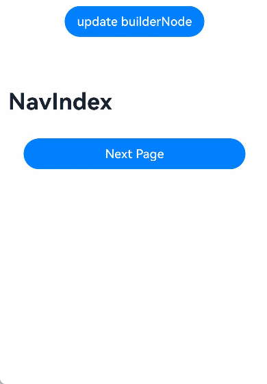
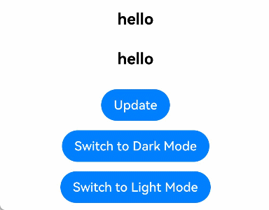
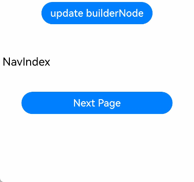
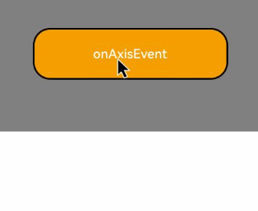

# BuilderNode
<!--Kit: ArkUI-->
<!--Subsystem: ArkUI-->
<!--Owner: @xiang-shouxing-->
<!--Designer: @xiang-shouxing-->
<!--Tester: @sally__-->
<!--Adviser: @Brilliantry_Rui-->

<!--Kit: ArkUI-->
<!--Subsystem: ArkUI-->
<!--Owner: @xiang-shouxing-->
<!--Designer: @xiang-shouxing-->
<!--Tester: @sally__-->

The **BuilderNode** module provides APIs for a BuilderNode – a custom node that can be used to mount built-in components. A BuilderNode can be used only as a leaf node. For details, see [BuilderNode Development](../../ui/arkts-user-defined-arktsNode-builderNode.md). For best practices, see [Dynamic Component Creation: Dynamically Adding, Updating, and Deleting Components](https://developer.huawei.com/consumer/en/doc/best-practices/bpta-ui-dynamic-operations#section153921947151012).

Compared with BuilderNode, ReactiveBuilderNode can generate a component tree through the stateless UI method @Builder with multiple parameters.

> **NOTE**
>
> - The initial APIs of this module are supported since API version 11. Newly added APIs will be marked with a superscript to indicate their earliest API version.
> 
> - If the root node of the provided Builder is a syntax node ([Ifelse](../../ui/rendering-control/arkts-rendering-control-ifelse.md)/[ForEach](../../ui/rendering-control/arkts-rendering-control-foreach.md)/[LazyForEach](../../ui/rendering-control/arkts-rendering-control-lazyforeach.md)/[ContentSlot](../../ui/rendering-control/arkts-rendering-control-contentslot.md)...), [Span](./arkui-ts/ts-basic-components-span.md), [ContainerSpan](./arkui-ts/ts-basic-components-containerspan.md), [SymbolSpan](./arkui-ts/ts-basic-components-symbolSpan.md), or a custom component, an additional [FrameNode](./js-apis-arkui-frameNode.md) is generated and displayed as BuilderProxyNode in the node tree. This structural change affects the propagation of certain events. For details, see [BuilderProxyNode in BuilderNode Causes Tree Structure Changes](../../ui/arkts-user-defined-arktsNode-builderNode.md#builderproxynode-in-buildernode-causes-tree-structure-changes).
>
> - If you encounter display issues when reusing a BuilderNode across pages, see [Cross-Page Reuse Considerations](../../ui/arkts-user-defined-arktsNode-builderNode.md#cross-page-reuse-considerations) for guidance.
>
> - **BuilderNode** is not available in DevEco Studio Previewer.
>
> - Custom components under a BuilderNode can use the [@Prop](../../ui/state-management/arkts-prop.md) decorator. The [@Link](../../ui/state-management/arkts-link.md) decorator cannot be used to synchronize data and states across BuilderNode boundaries.
>
> - If a BuilderNode contains custom components as child nodes, these custom components cannot use the [@Reusable](../../ui/state-management/arkts-reusable.md) decorator. For details, see [Using the @Reusable Decorator with BuilderNode Child Components](../../ui/arkts-user-defined-arktsNode-builderNode.md#using-the-reusable-decorator-with-buildernode-child-components).
>
> - Since API version 12, custom components can receive [LocalStorage](../../ui/state-management/arkts-localstorage.md) instances. You can use LocalStorage related decorators such as [@LocalStorageProp](../../ui/state-management/arkts-localstorage.md#localstorageprop) and [@LocalStorageLink](../../ui/state-management/arkts-localstorage.md#localstoragelink) by [passing LocalStorage instances](../../ui/state-management/arkts-localstorage.md#providing-a-custom-component-with-access-to-a-localstorage-instance).
>
> - Since API version 20, when configured with [BuildOptions](#buildoptions12), custom components within a BuilderNode can access the host page's [@Provide](../../ui/state-management/arkts-provide-and-consume.md) data through their [@Consume](../../ui/state-management/arkts-provide-and-consume.md) decorated attributes.
>
> - The behavior of other decorators is undefined. Avoid using those decorators.
>
> - [Repeat](../../ui/rendering-control/arkts-new-rendering-control-repeat.md) can be used only in custom components.

## Modules to Import

```ts
import { BuilderNode, ReactiveBuilderNode, RenderOptions, NodeRenderType } from '@kit.ArkUI';
```

## NodeRenderType

Enumerates the node rendering types.

**Atomic service API**: This API can be used in atomic services since API version 12.

**System capability**: SystemCapability.ArkUI.ArkUI.Full

| Name               | Value | Description                        |
| ------------------- | --- | ---------------------------- |
| RENDER_TYPE_DISPLAY | 0   | The node is displayed on the screen.|
| RENDER_TYPE_TEXTURE | 1   | The node is exported as a texture.  |

> **NOTE**
>
> - Currently, the **RENDER_TYPE_TEXTURE** type takes effect only for the [XComponentNode](./js-apis-arkui-xcomponentNode.md) and the [BuilderNode](#buildernode-1) holding a component tree whose root node is a custom component.
>
> - The following custom components currently support texture export as root nodes in [BuilderNode](#buildernode-1) scenarios: [Badge](arkui-ts/ts-container-badge.md), [Blank](arkui-ts/ts-basic-components-blank.md), [Button](arkui-ts/ts-basic-components-button.md), [CanvasGradient](arkui-ts/ts-components-canvas-canvasgradient.md), [CanvasPattern](arkui-ts/ts-components-canvas-canvaspattern.md), [CanvasRenderingContext2D](arkui-ts/ts-canvasrenderingcontext2d.md), [Canvas](arkui-ts/ts-components-canvas-canvas.md), [CheckboxGroup](arkui-ts/ts-basic-components-checkboxgroup.md), [Checkbox](arkui-ts/ts-basic-components-checkbox.md), [Circle](arkui-ts/ts-drawing-components-circle.md), [ColumnSplit](arkui-ts/ts-container-columnsplit.md), [Column](arkui-ts/ts-container-column.md), [ContainerSpan](arkui-ts/ts-basic-components-containerspan.md), [Counter](arkui-ts/ts-container-counter.md), [DataPanel](arkui-ts/ts-basic-components-datapanel.md), [Divider](arkui-ts/ts-basic-components-divider.md), [Ellipse](arkui-ts/ts-drawing-components-ellipse.md), [Flex](arkui-ts/ts-container-flex.md), [Gauge](arkui-ts/ts-basic-components-gauge.md), [Hyperlink](arkui-ts/ts-container-hyperlink.md), [ImageBitmap](arkui-ts/ts-components-canvas-imagebitmap.md), [ImageData](arkui-ts/ts-components-canvas-imagedata.md), [Image](arkui-ts/ts-basic-components-image.md), [Line](arkui-ts/ts-drawing-components-line.md), [LoadingProgress](arkui-ts/ts-basic-components-loadingprogress.md), [Marquee](arkui-ts/ts-basic-components-marquee.md), [Matrix2D](arkui-ts/ts-components-canvas-matrix2d.md), [OffscreenCanvasRenderingContext2D](arkui-ts/ts-offscreencanvasrenderingcontext2d.md), [OffscreenCanvas](arkui-ts/ts-components-offscreencanvas.md), [Path2D](arkui-ts/ts-components-canvas-path2d.md), [Path](arkui-ts/ts-drawing-components-path.md), [PatternLock](arkui-ts/ts-basic-components-patternlock.md), [Polygon](arkui-ts/ts-drawing-components-polygon.md), [Polyline](arkui-ts/ts-drawing-components-polyline.md), [Progress](arkui-ts/ts-basic-components-progress.md), [QRCode](arkui-ts/ts-basic-components-qrcode.md), [Radio](arkui-ts/ts-basic-components-radio.md), [Rating](arkui-ts/ts-basic-components-rating.md), [Rect](arkui-ts/ts-drawing-components-rect.md), [RelativeContainer](arkui-ts/ts-container-relativecontainer.md), [RowSplit](arkui-ts/ts-container-rowsplit.md), [Row](arkui-ts/ts-container-row.md), [Shape](arkui-ts/ts-drawing-components-shape.md), [Slider](arkui-ts/ts-basic-components-slider.md), [Span](arkui-ts/ts-basic-components-span.md), [Stack](arkui-ts/ts-container-stack.md), [TextArea](arkui-ts/ts-basic-components-textarea.md), [TextClock](arkui-ts/ts-basic-components-textclock.md), [TextInput](arkui-ts/ts-basic-components-textinput.md), [TextTimer](arkui-ts/ts-basic-components-texttimer.md), [Text](arkui-ts/ts-basic-components-text.md), [Toggle](arkui-ts/ts-basic-components-toggle.md), [Video](arkui-ts/ts-media-components-video.md) (excluding full-screen playback), [Web](../apis-arkweb/arkts-basic-components-web.md), [XComponent](arkui-ts/ts-basic-components-xcomponent.md).
>
> - Since API version 12, the following components also support texture export: [DatePicker](arkui-ts/ts-basic-components-datepicker.md), [ForEach](arkui-ts/ts-rendering-control-foreach.md), [Grid](arkui-ts/ts-container-grid.md), [IfElse](../../ui/rendering-control/arkts-rendering-control-ifelse.md), [LazyForEach](arkui-ts/ts-rendering-control-lazyforeach.md), [List](arkui-ts/ts-container-list.md), [Scroll](arkui-ts/ts-container-scroll.md), [Swiper](arkui-ts/ts-container-swiper.md), [TimePicker](arkui-ts/ts-basic-components-timepicker.md), custom components decorated with [@Component](../../ui/state-management/arkts-create-custom-components.md#component), [NodeContainer](arkui-ts/ts-basic-components-nodecontainer.md), and [FrameNode](./js-apis-arkui-frameNode.md) and [RenderNode](./js-apis-arkui-renderNode.md) mounted to [NodeContainer](arkui-ts/ts-basic-components-nodecontainer.md).
>
> - For details, see [Rendering and Drawing Video and Button Components at the Same Layer](../../web/web-same-layer.md).

## RenderOptions

Provides optional parameters for creating a BuilderNode.

**Atomic service API**: This API can be used in atomic services since API version 12.

**System capability**: SystemCapability.ArkUI.ArkUI.Full

| Name         | Type                                  | Read-Only| Optional| Description                                                        |
| ------------- | -------------------------------------- | ---- | ---- | ------------------------------------------------------------ |
| selfIdealSize | [Size](js-apis-arkui-graphics.md#size) | No  | Yes| Ideal size of the node.<br>Default value: **{ width: 0, height: 0 }**.|
| type          | [NodeRenderType](#noderendertype)      | No  | Yes| Rendering type of the node.<br>Default value: **NodeRenderType.RENDER_TYPE_DISPLAY**.|
| surfaceId     | string                                 | No  | Yes| Surface ID of the texture receiver. Typically, the texture receiver is [OH_NativeImage](../apis-arkgraphics2d/capi-oh-nativeimage-oh-nativeimage.md).<br>This parameter is effective only when **type** is set to **NodeRenderType.RENDER_TYPE_TEXTURE**.<br>Default value: **""**.|

## BuildOptions<sup>12+</sup>

Defines the optional build options.

**System capability**: SystemCapability.ArkUI.ArkUI.Full

| Name         | Type              | Read-Only| Optional| Description                                                        |
| ------------- | ----------------- | ---- | ---- | ------------------------------------------------------------ |
| nestingBuilderSupported | boolean | No  | Yes  | Whether to support nested **@Builder** within **@Builder**. **true** if supported, **false** otherwise.<br>Default value: **false**.<br>**Atomic service API**: This API can be used in atomic services since API version 12.|
| localStorage<sup>20+</sup> | [LocalStorage](../../ui/state-management/arkts-localstorage.md) | No  | Yes  | LocalStorage for the current BuilderNode. Custom components mounted under this BuilderNode will share the specified LocalStorage. **NOTE**<br>If LocalStorage is also passed through a custom component's constructor, the constructor parameter takes precedence.<br>Default value: **null**.<br>**Atomic service API**: This API can be used in atomic services since API version 20.|
| enableProvideConsumeCrossing<sup>20+</sup> | boolean | No  | Yes  | Whether @Consume in V1 custom components within the BuilderNode interacts with @Provide outside the BuilderNode, and whether @Consumer in V2 custom components within the BuilderNode interacts with @Provider outside the BuilderNode.<br>V1 custom component state management is supported since API version 20. V2 custom component state management is supported since API version 22.<br>The value **true** means that this feature is supported, and **false** means the opposite.<br>Default value: **false**.<br>**Atomic service API**: This API can be used in atomic services since API version 20.|

## InputEventType<sup>20+</sup>

type InputEventType = TouchEvent | MouseEvent | AxisEvent

Defines the type of input event to be dispatched. For details, see [postInputEvent](#postinputevent20).

**Atomic service API**: This API can be used in atomic services since API version 20.

**System capability**: SystemCapability.ArkUI.ArkUI.Full

| Type| Description                                  |
| ------------- | -------------------------------------- |
| [TouchEvent](arkui-ts/ts-universal-events-touch.md#touchevent)  | Touch event.|
| [MouseEvent](arkui-ts/ts-universal-mouse-key.md#mouseevent)  | Mouse event.|
| [AxisEvent](arkui-ts/ts-universal-events-axis.md#axisevent)  | Axis event.|

## BuilderNode

class BuilderNode\<Args extends Object[]>

Implements a BuilderNode, which can create a component tree through the stateless UI method [@Builder](../../ui/state-management/arkts-builder.md) and hold the root node of the component tree. A BuilderNode cannot be defined as a state variable. The FrameNode held in the BuilderNode is only used to mount the BuilderNode to other FrameNodes as a child node. Undefined behavior may occur if you set attributes or perform operations on subnodes of the FrameNode held by the BuilderNode. Therefore, after you have obtained a [RenderNode](js-apis-arkui-renderNode.md) through the [getFrameNode](#getframenode) method of the BuilderNode and the [getRenderNode](js-apis-arkui-frameNode.md#getrendernode) method of the [FrameNode](js-apis-arkui-frameNode.md), avoid setting the attributes or operating the subnodes through APIs of [RenderNode](js-apis-arkui-renderNode.md).

**Atomic service API**: This API can be used in atomic services since API version 12.

**System capability**: SystemCapability.ArkUI.ArkUI.Full

### constructor

constructor(uiContext: UIContext, options?: RenderOptions)

When content generated by BuilderNode is embedded within another RenderNode for display, the **selfIdealSize** parameter in **RenderOptions** must be explicitly specified. Otherwise, the layout constraints for the parent component in Builder default to [0, 0]. In this case, if **selfIdealSize** is not set, the root node of the subtree in BuilderNode will have a size of [0, 0].

**Atomic service API**: This API can be used in atomic services since API version 12.

**System capability**: SystemCapability.ArkUI.ArkUI.Full

**Parameters**

| Name   | Type                                   | Mandatory| Description                                                             |
| --------- | --------------------------------------- | ---- | ----------------------------------------------------------------- |
| uiContext | [UIContext](arkts-apis-uicontext-uicontext.md) | Yes  | UI context. For details about how to obtain it, see [Obtaining UI Context](./js-apis-arkui-node.md#obtaining-ui-context).|
| options   | [RenderOptions](#renderoptions)         | No  | Parameters for creating a BuilderNode.<br>Default value: **undefined**.  |

> **NOTE**
> The input parameter for **uiContext** must be a valid value, that is, the UI context must be correct. If an invalid value is passed in or if no value is specified, creation will fail.

### build

build(builder: WrappedBuilder\<Args>, arg?: Object): void

Creates a component tree based on the passed object and holds the root node of the component tree. The stateless UI method [@Builder](../../ui/state-management/arkts-builder.md) has at most one root node.

Custom components are allowed.

> **NOTE**
>
> - When nesting @Builder, ensure that the input objects for the inner and outer @Builder methods are consistent.
>
> - The outermost @Builder supports only one input parameter.
>
> - The build parameter uses the pass-by-value semantics. To implement state updates, you must explicitly use the [update](#update) API.
>
> - To operate objects in a BuilderNode, ensure that the reference to the BuilderNode is not garbage collected. When a BuilderNode object is garbage collected by the virtual machine, the associated [FrameNode](js-apis-arkui-frameNode.md) and [RenderNode](js-apis-arkui-renderNode.md) objects are also dereferenced from the backend node tree. This means that any FrameNode objects obtained from a BuilderNode will no longer correspond to any actual node if the BuilderNode is garbage collected.
>
> - The BuilderNode object maintains references to its underlying entity nodes. When the BuilderNode frontend object is no longer required for managing backend nodes, call the [dispose](#dispose12) API to release node references and unbind frontend and backend nodes.

**Atomic service API**: This API can be used in atomic services since API version 12.

**System capability**: SystemCapability.ArkUI.ArkUI.Full

**Parameters**

| Name | Type                                                           | Mandatory| Description                                                                                  |
| ------- | --------------------------------------------------------------- | ---- | -------------------------------------------------------------------------------------- |
| builder | [WrappedBuilder\<Args>](../../ui/state-management/arkts-wrapBuilder.md) | Yes  | Stateless UI method [@Builder](../../ui/state-management/arkts-builder.md) required for creating a component tree.|
| arg     | Object                                                          | No  | Argument of the builder. Only one input parameter is supported, and the type of the input parameter must be consistent with the type defined by @Builder.<br>Default value: **undefined**.|

### build<sup>12+</sup>

build(builder: WrappedBuilder\<Args>, arg: Object, options: BuildOptions): void

Creates a component tree based on the passed object and holds the root node of the component tree. The stateless UI method [@Builder](../../ui/state-management/arkts-builder.md) has at most one root node.

Custom components are allowed. Compared with the [build(builder: WrappedBuilder\<Args>, arg?: Object)](#build) API, this API supports the builder configuration parameters to determine whether @Builder can be nested with @Builder.

> **NOTE**
> 
> - For details about the creation and update using @Builder, see [@Builder](../../ui/state-management/arkts-builder.md).
> 
> - The outermost @Builder supports only one input parameter.

**Atomic service API**: This API can be used in atomic services since API version 12.

**System capability**: SystemCapability.ArkUI.ArkUI.Full

**Parameters**

| Name | Type                                                           | Mandatory| Description                                                                                   |
| ------- | --------------------------------------------------------------- | ---- | -------------------------------------------------------------------------------------- |
| builder | [WrappedBuilder\<Args>](../../ui/state-management/arkts-wrapBuilder.md) | Yes  | Stateless UI method [@Builder](../../ui/state-management/arkts-builder.md) required for creating a component tree.  |
| arg     | Object                                                          | Yes  | Argument of the builder. Only one input parameter is supported, and the type of the input parameter must be consistent with the type defined by @Builder.                                                           |
| options | [BuildOptions](#buildoptions12)                                           | Yes  | Build options, which determine whether to support nesting @Builder within @Builder.                                        |

**Example**
```ts
import { BuilderNode, NodeContent } from "@kit.ArkUI";

// Define the API for passing parameters.
interface ParamsInterface {
  text: string;
  func: Function;
}

@Builder
function buildTextWithFunc(fun: Function) {
  Text(fun())
    .fontSize(50)
    .fontWeight(FontWeight.Bold)
    .margin({ bottom: 36 })
}

@Builder
function buildText(params: ParamsInterface) {
  Column() {
    Text(params.text)
      .fontSize(50)
      .fontWeight(FontWeight.Bold)
      .margin({ bottom: 36 })
    buildTextWithFunc(params.func)
  }
}


@Entry
@Component
struct Index {
  @State message: string = "HELLO";
  private content: NodeContent = new NodeContent();

  build() {
    Row() {
      Column() {
        Button('addBuilderNode')
          .onClick(() => {
            let buildNode = new BuilderNode<[ParamsInterface]>(this.getUIContext());
            // Create a node tree.
            buildNode.build(wrapBuilder<[ParamsInterface]>(buildText), {
              text: this.message, func: () => {
                return "FUNCTION";
              }
            }, { nestingBuilderSupported: true });
            this.content.addFrameNode(buildNode.getFrameNode());
            buildNode.dispose();
          })
        ContentSlot(this.content)
      }
      .id("column")
      .width('100%')
      .height('100%')
    }
    .height('100%')
  }
}
```

### getFrameNode

getFrameNode(): FrameNode | null

Obtains the [FrameNode](js-apis-arkui-frameNode.md) from the BuilderNode. The FrameNode is generated only after the BuilderNode executes the build operation.

**Atomic service API**: This API can be used in atomic services since API version 12.

**System capability**: SystemCapability.ArkUI.ArkUI.Full

**Return value**

| Type                                                     | Description                                                                 |
| --------------------------------------------------------- | --------------------------------------------------------------------- |
| [FrameNode](js-apis-arkui-frameNode.md) \| null | **FrameNode** object. If no such object is held by the **BuilderNode** instance, null is returned.|

**Example 1**

The BuilderNode is returned as the root node of [NodeContainer](arkui-ts/ts-basic-components-nodecontainer.md).

```ts
import { NodeController, BuilderNode, FrameNode, UIContext } from "@kit.ArkUI";

// Define the class for passing parameters.
class Params {
  text: string = "";
  constructor(text: string) {
    this.text = text;
  }
}

@Builder
function buildText(params: Params) {
  Column() {
    Text(params.text)
      .fontSize(50)
      .fontWeight(FontWeight.Bold)
      .margin({bottom: 36})
  }
}

// Implement a custom textNode controller by extending NodeController.
class TextNodeController extends NodeController {
  private textNode: BuilderNode<[Params]> | null = null;
  private message: string = "DEFAULT";

  constructor(message: string) {
    super();
    this.message = message;
  }

  makeNode(context: UIContext): FrameNode | null {
    this.textNode = new BuilderNode(context);
    this.textNode.build(wrapBuilder<[Params]>(buildText), new Params(this.message));
    // Return the FrameNode contained in the BuilderNode.
    return this.textNode.getFrameNode();
  }
}

@Entry
@Component
struct Index {
  @State message: string = "hello";

  build() {
    Row() {
      Column() {
        NodeContainer(new TextNodeController(this.message))
          .width('100%')
          .height(100)
          .backgroundColor('#FFF0F0F0')
      }
      .width('100%')
      .height('100%')
    }
    .height('100%')
  }
}
```

**Example 2**

The [FrameNode](js-apis-arkui-frameNode.md) of the BuilderNode is mounted to another FrameNode.

```ts
import { NodeController, BuilderNode, FrameNode, UIContext } from "@kit.ArkUI";

// Define the class for passing parameters.
class Params {
  text: string = "";

  constructor(text: string) {
    this.text = text;
  }
}

@Builder
function buildText(params: Params) {
  Column() {
    Text(params.text)
      .fontSize(50)
      .fontWeight(FontWeight.Bold)
      .margin({ bottom: 36 })
  }
}

// Implement a custom textNode controller by extending NodeController.
class TextNodeController extends NodeController {
  private rootNode: FrameNode | null = null;
  private textNode: BuilderNode<[Params]> | null = null;
  private message: string = "DEFAULT";

  constructor(message: string) {
    super();
    this.message = message;
  }

  makeNode(context: UIContext): FrameNode | null {
    this.rootNode = new FrameNode(context);
    this.textNode = new BuilderNode(context, { selfIdealSize: { width: 150, height: 150 } });
    this.textNode.build(wrapBuilder<[Params]>(buildText), new Params(this.message));
    if (this.rootNode !== null) {
      // Mount the FrameNode of BuilderNode to another FrameNode
      this.rootNode.appendChild(this.textNode?.getFrameNode());
    }

    return this.rootNode;
  }
}

@Entry
@Component
struct Index {
  @State message: string = "hello";

  build() {
    Row() {
      Column() {
        NodeContainer(new TextNodeController(this.message))
          .width('100%')
          .height(100)
          .backgroundColor('#FFF0F0F0')
      }
      .width('100%')
      .height('100%')
    }
    .height('100%')
  }
}
```

**Example 3**

The [RenderNode](./js-apis-arkui-renderNode.md) of the BuilderNode is mounted to another RenderNode. Since the RenderNode does not pass layout constraints, this mode of mounting nodes is not recommended.

```ts
import { NodeController, BuilderNode, FrameNode, UIContext, RenderNode } from "@kit.ArkUI";
// Define the class for passing parameters.
class Params {
  text: string = "";

  constructor(text: string) {
    this.text = text;
  }
}

@Builder
function buildText(params: Params) {
  Column() {
    Text(params.text)
      .fontSize(50)
      .fontWeight(FontWeight.Bold)
      .margin({ bottom: 36 })
  }
}

// Implement a custom textNode controller by extending NodeController.
class TextNodeController extends NodeController {
  private rootNode: FrameNode | null = null;
  private textNode: BuilderNode<[Params]> | null = null;
  private message: string = "DEFAULT";

  constructor(message: string) {
    super();
    this.message = message;
  }

  makeNode(context: UIContext): FrameNode | null {
    this.rootNode = new FrameNode(context);
    let renderNode = new RenderNode();
    renderNode.clipToFrame = false;
    this.textNode = new BuilderNode(context, { selfIdealSize: { width: 150, height: 150 } });
    this.textNode.build(wrapBuilder<[Params]>(buildText), new Params(this.message));
    const textRenderNode = this.textNode?.getFrameNode()?.getRenderNode();

    const rootRenderNode = this.rootNode.getRenderNode();
    if (rootRenderNode !== null) {
      rootRenderNode.appendChild(renderNode);
    // Mount the RenderNode of BuilderNode to another RenderNode.
      renderNode.appendChild(textRenderNode);
    }

    return this.rootNode;
  }
}

@Entry
@Component
struct Index {
  @State message: string = "hello";

  build() {
    Row() {
      Column() {
        NodeContainer(new TextNodeController(this.message))
          .width('100%')
          .height(100)
          .backgroundColor('#FFF0F0F0')
      }
      .width('100%')
      .height('100%')
    }
    .height('100%')
  }
}
```

### update

update(arg: Object): void

Updates this BuilderNode using the provided parameter, which must be of the same type as the input parameter passed to the [build](#build) API. When updating a custom component, define the variables used in the component as [@Prop](../../ui/state-management/arkts-prop.md) decorated properties.

**Atomic service API**: This API can be used in atomic services since API version 12.

**System capability**: SystemCapability.ArkUI.ArkUI.Full

**Parameters**

| Name| Type  | Mandatory| Description                                                                    |
| ------ | ------ | ---- | ------------------------------------------------------------------------ |
| arg    | Object | Yes  | Parameter used to update the BuilderNode. It is of the same type as the parameter passed to the [build](#build) API.|

**Example**
```ts
import { NodeController, BuilderNode, FrameNode, UIContext } from "@kit.ArkUI";

// Define the class for passing parameters.
class Params {
  text: string = "";
  constructor(text: string) {
    this.text = text;
  }
}

// Custom component
@Component
struct TextBuilder {
  @Prop message: string = "TextBuilder";

  build() {
    Row() {
      Column() {
        Text(this.message)
          .fontSize(50)
          .fontWeight(FontWeight.Bold)
          .margin({bottom: 36})
          .backgroundColor(Color.Gray)
      }
    }
  }
}

@Builder
function buildText(params: Params) {
  Column() {
    Text(params.text)
      .fontSize(50)
      .fontWeight(FontWeight.Bold)
      .margin({ bottom: 36 })
    TextBuilder({message: params.text}) // Custom component
  }
}

// Implement a custom textNode controller by extending NodeController.
class TextNodeController extends NodeController {
  private rootNode: FrameNode | null = null;
  private textNode: BuilderNode<[Params]> | null = null;
  private message: string = "";

  constructor(message: string) {
    super();
    this.message = message;
  }

  makeNode(context: UIContext): FrameNode | null {
    this.textNode = new BuilderNode(context);
    this.textNode.build(wrapBuilder<[Params]>(buildText), new Params(this.message));
    return this.textNode.getFrameNode();
  }

  // Update BuilderNode based on the input parameters.
  update(message: string) {
    if (this.textNode !== null) {
      this.textNode.update(new Params(message));
    }
  }
}

@Entry
@Component
struct Index {
  @State message: string = "hello";
  private textNodeController: TextNodeController = new TextNodeController(this.message);
  private count = 0;

  build() {
    Row() {
      Column() {
        NodeContainer(this.textNodeController)
          .width('100%')
          .height(200)
          .backgroundColor('#FFF0F0F0')
        Button('Update')
          .onClick(() => {
            this.count += 1;
            const message = "Update " + this.count.toString();
            this.textNodeController.update(message);
          })
      }
      .width('100%')
      .height('100%')
    }
    .height('100%')
  }
}
```

### postTouchEvent

postTouchEvent(event: TouchEvent): boolean

Posts a raw touch event to the FrameNode created by this BuilderNode.

**postTouchEvent** dispatches the event from a middle node in the component tree downwards. To ensure the event is dispatched correctly, it needs to be transformed into the coordinate system of the parent component, as shown in the figure below.

**OffsetA** indicates the offset of the BuildNode relative to the parent component. You can obtain this offset by calling [getPositionToParent](js-apis-arkui-frameNode.md#getpositiontoparent12) in the FrameNode. **OffsetB** indicates the offset of the touch point relative to the BuildNode. You can obtain this offset from the [TouchEvent](arkui-ts/ts-universal-events-touch.md#touchevent) object. **OffsetC** is the sum of **OffsetA** and **OffsetB**. It represents the final offset that you need to pass to **postTouchEvent**.


> **NOTE**
>
> - The coordinates you pass in need to be converted to pixel values (px). If the BuilderNode has any affine transformations applied to it, they must be taken into account and combined with the touch event coordinates.
>
> - In [Webview](../apis-arkweb/arkts-apis-webview.md), coordinate system transformations are already handled internally, so you can directly dispatch the touch event without additional adjustments.
>
> - The **postTouchEvent** API can be called only once for the same timestamp.<!--Del-->
>
> - [UIExtensionComponent](arkui-ts/ts-container-ui-extension-component-sys.md) is not supported.
<!--DelEnd-->

**Atomic service API**: This API can be used in atomic services since API version 12.

**System capability**: SystemCapability.ArkUI.ArkUI.Full

**Parameters**

| Name| Type                                                                     | Mandatory| Description      |
| ------ | ------------------------------------------------------------------------- | ---- | ---------- |
| event  | [TouchEvent](arkui-ts/ts-universal-events-touch.md#touchevent) | Yes  | Touch event.|

**Return value**

| Type   | Description              |
| ------- | ------------------ |
| boolean | Whether the event is successfully dispatched. The value **true** means the event is consumed by a component that responds to the event, and **false** means that no component responds to the event.<br>**NOTE**<br>If the event does not hit the expected component, ensure the following:<br>1. The coordinate system has been correctly transformed<br>2. The component is in an interactive state.<br>3. The event has been bound to the component.|

**Example**

```ts
import { NodeController, BuilderNode, FrameNode, UIContext } from '@kit.ArkUI';

// Define the class for passing parameters.
class Params {
  text: string = "this is a text";
}

@Builder
function ButtonBuilder(params: Params) {
  Column() {
    Button(`button ` + params.text)
      .borderWidth(2)
      .backgroundColor(Color.Orange)
      .width("100%")
      .height("100%")
      .gesture(
        TapGesture()
          .onAction((event: GestureEvent) => {
            console.info("TapGesture");
          })
      )
  }
  .width(500)
  .height(300)
  .backgroundColor(Color.Gray)
}

// Implement a custom UI controller by extending NodeController.
class MyNodeController extends NodeController {
  private rootNode: BuilderNode<[Params]> | null = null;
  private wrapBuilder: WrappedBuilder<[Params]> = wrapBuilder(ButtonBuilder);

  makeNode(uiContext: UIContext): FrameNode | null {
    this.rootNode = new BuilderNode(uiContext);
    this.rootNode.build(this.wrapBuilder, { text: "this is a string" });
    return this.rootNode.getFrameNode();
  }

  // Coordinate system transformation
  postTouchEvent(event: TouchEvent, uiContext: UIContext): boolean {
    if (this.rootNode == null) {
      return false;
    }
    let node: FrameNode | null = this.rootNode.getFrameNode();
    let offsetX: number | null | undefined = node?.getPositionToParent().x;
    let offsetY: number | null | undefined = node?.getPositionToParent().y;
    
    let changedTouchLen = event.changedTouches.length;
    for (let i = 0; i < changedTouchLen; i++) {
      if (offsetX != null && offsetY != null && offsetX != undefined && offsetY != undefined) {
        event.changedTouches[i].x = uiContext.vp2px(offsetX + event.changedTouches[i].x);
        event.changedTouches[i].y = uiContext.vp2px(offsetY + event.changedTouches[i].y);
      }
    }
    // Dispatch the event to the FrameNode created by BuilderNode. result indicates whether the dispatch is successful.
    let result = this.rootNode.postTouchEvent(event);
    console.info("result " + result);
    return result;
  }
}

@Entry
@Component
struct MyComponent {
  private nodeController: MyNodeController = new MyNodeController();

  build() {
    Column() {
      NodeContainer(this.nodeController)
        .height(300)
        .width(500)

      Column()
        .width(500)
        .height(300)
        .backgroundColor(Color.Pink)
        .onTouch((event) => {
          if (event != undefined) {
            this.nodeController.postTouchEvent(event, this.getUIContext());
          }
        })
    }
  }
}
```

### dispose<sup>12+</sup>

dispose(): void

Immediately releases the reference relationship between this BuilderNode object and its [entity node](../../ui/arkts-user-defined-node.md#basic-concepts). For details about the scenarios involving BuilderNode unbinding, see [Canceling the Reference to the Entity Node](../../ui/arkts-user-defined-arktsNode-builderNode.md#canceling-the-reference-to-the-entity-node).

> **NOTE**
>
> After calling **dispose()**, the BuilderNode object cancels its reference to the backend entity node. If the frontend object BuilderNode cannot be released, memory leaks may occur. To avoid this, be sure to call **dispose()** on the BuilderNode when you no longer need it. This reduces the complexity of reference relationships and lowers the risk of memory leaks. For details, see [Memory Leak Caused by Circular Reference Between BuilderNode Frontend and Backend](../../ui/arkts-user-defined-node-faq.md#memory-leak-caused-by-circular-reference-between-buildernode-frontend-and-backend).

**Atomic service API**: This API can be used in atomic services since API version 12.

**System capability**: SystemCapability.ArkUI.ArkUI.Full

```ts
import { FrameNode, NodeController, BuilderNode } from '@kit.ArkUI';

// Custom component
@Component
struct TestComponent {
  build() {
    Column() {
      Text('This is a BuilderNode.')
        .fontSize(16)
        .fontWeight(FontWeight.Bold)
    }
    .width('100%')
    .backgroundColor(Color.Gray)
  }

  aboutToAppear() {
    console.info('aboutToAppear');
  }

  aboutToDisappear() {
    console.info('aboutToDisappear');
  }
}

@Builder
function buildComponent() {
  TestComponent()
}

// Implement a custom UI controller by extending NodeController.
class MyNodeController extends NodeController {
  private rootNode: FrameNode | null = null;
  private builderNode: BuilderNode<[]> | null = null;

  makeNode(uiContext: UIContext): FrameNode | null {
    this.rootNode = new FrameNode(uiContext);
    this.builderNode = new BuilderNode(uiContext, { selfIdealSize: { width: 200, height: 100 } });
    this.builderNode.build(new WrappedBuilder(buildComponent));

    const rootRenderNode = this.rootNode!.getRenderNode();
    if (rootRenderNode !== null) {
      rootRenderNode.size = { width: 200, height: 200 };
      rootRenderNode.backgroundColor = 0xff00ff00;
      rootRenderNode.appendChild(this.builderNode!.getFrameNode()!.getRenderNode());
    }

    return this.rootNode;
  }

  // Remove the reference relationship between the current builderNode and the backend entity.
  dispose() {
    if (this.builderNode !== null) {
      this.builderNode.dispose();
    }
  }

  removeBuilderNode() {
    const rootRenderNode = this.rootNode!.getRenderNode();
    if (rootRenderNode !== null && this.builderNode !== null && this.builderNode.getFrameNode() !== null) {
      rootRenderNode.removeChild(this.builderNode!.getFrameNode()!.getRenderNode());
    }
  }
}

@Entry
@Component
struct Index {
  private myNodeController: MyNodeController = new MyNodeController();

  build() {
    Column({ space: 4 }) {
      NodeContainer(this.myNodeController)
      Button('BuilderNode dispose')
        .onClick(() => {
          this.myNodeController.removeBuilderNode();
          this.myNodeController.dispose();
        })
        .width('100%')
    }
  }
}
```

### reuse<sup>12+</sup>

reuse(param?: Object): void

Triggers component reuse for custom components under this BuilderNode. For details about component reuse, see [\@Reusable Decorator: Reusing Components](../../ui/state-management/arkts-reusable.md). For details about the scenarios involving BuilderNode unbinding, see [Canceling the Reference to the Entity Node](../../ui/arkts-user-defined-arktsNode-builderNode.md#canceling-the-reference-to-the-entity-node).

**Atomic service API**: This API can be used in atomic services since API version 12.

**System capability**: SystemCapability.ArkUI.ArkUI.Full

**Parameters**

| Name| Type  | Mandatory| Description                                                                    |
| ------ | ------ | ---- | ------------------------------------------------------------------------ |
| param  | Object | No  | Parameter used to reuse the BuilderNode. This parameter is passed to all top-level custom components within the BuilderNode during reuse and must include all required constructor parameters for each component; otherwise, undefined behavior may occur. Calling this method synchronously triggers the [aboutToReuse](../../reference//apis-arkui/arkui-ts/ts-custom-component-lifecycle.md#abouttoreuse10) lifecycle callback of internal custom components, with this parameter as the callback input. Default value: **undefined**, in which case the custom components in the BuilderNode will use their original construction data source.|

### recycle<sup>12+</sup>

recycle(): void

- Triggers recycling of custom components under this BuilderNode. Component recycling is part of the component reuse mechanism. For details, see [\@Reusable Decorator: Reusing Components](../../ui/state-management/arkts-reusable.md).
- The BuilderNode completes the reuse event transfer between internal and external custom components through **reuse** and **recycle**. For specific usage scenarios, see [Implementing Node Reuse with the BuilderNode reuse and recycle APIs](../../ui/arkts-user-defined-arktsNode-builderNode.md#implementing-node-reuse-with-the-buildernode-reuse-and-recycle-apis).

**Atomic service API**: This API can be used in atomic services since API version 12.

**System capability**: SystemCapability.ArkUI.ArkUI.Full

```ts
import { FrameNode, NodeController, BuilderNode, UIContext } from "@kit.ArkUI";

const TEST_TAG: string = "Reuse+Recycle";

// Define the class for managing data.
class MyDataSource {
  private dataArray: string[] = [];
  private listener: DataChangeListener | null = null;

  public totalCount(): number {
    return this.dataArray.length;
  }

  public getData(index: number) {
    return this.dataArray[index];
  }

  public pushData(data: string) {
    this.dataArray.push(data);
  }

  public reloadListener(): void {
    this.listener?.onDataReloaded();
  }

  public registerDataChangeListener(listener: DataChangeListener): void {
    this.listener = listener;
  }

  public unregisterDataChangeListener(): void {
    this.listener = null;
  }
}

// Define the class for passing parameters.
class Params {
  item: string = '';

  constructor(item: string) {
    this.item = item;
  }
}

@Builder
function buildNode(param: Params = new Params("hello")) {
  Row() {
    Text(`C${param.item} -- `)
    ReusableChildComponent2({ item: param.item }) // This custom component cannot be correctly reused in the BuilderNode.
  }
}

// Implement a custom UI controller by extending NodeController.
class MyNodeController extends NodeController {
  public builderNode: BuilderNode<[Params]> | null = null;
  public item: string = "";

  makeNode(uiContext: UIContext): FrameNode | null {
    if (this.builderNode == null) {
      this.builderNode = new BuilderNode(uiContext, { selfIdealSize: { width: 300, height: 200 } });
      this.builderNode.build(wrapBuilder<[Params]>(buildNode), new Params(this.item));
    }
    return this.builderNode.getFrameNode();
  }
}

// The custom component that is reused and recycled will have its state variables updated, and the state variables of the nested custom component ReusableChildComponent3 will also be updated. However, the BuilderNode will block this propagation process.
@Reusable
@Component
struct ReusableChildComponent {
  @Prop item: string = '';
  @Prop switch: string = '';
  private controller: MyNodeController = new MyNodeController();

  aboutToAppear() {
    this.controller.item = this.item;
  }

  aboutToRecycle(): void {
    console.info(`${TEST_TAG} ReusableChildComponent aboutToRecycle ${this.item}`);

    // When the switch is open, pass the recycle event to the nested custom component, such as ReusableChildComponent2, through the BuilderNode's recycle API to complete recycling.
    if (this.switch === 'open') {
      this.controller?.builderNode?.recycle();
    }
  }

  aboutToReuse(params: object): void {
    console.info(`${TEST_TAG} ReusableChildComponent aboutToReuse ${JSON.stringify(params)}`);

    // When the switch is open, pass the reuse event to the nested custom component, such as ReusableChildComponent2, through the BuilderNode's reuse API to complete reuse.
    if (this.switch === 'open') {
      this.controller?.builderNode?.reuse(params);
    }
  }

  build() {
    Row() {
      Text(`A${this.item}--`)
      ReusableChildComponent3({ item: this.item })
      NodeContainer(this.controller);
    }
  }
}

// Custom component
@Component
struct ReusableChildComponent2 {
  @Prop item: string = "false";

  aboutToReuse(params: Record<string, object>) {
    console.info(`${TEST_TAG} ReusableChildComponent2 aboutToReuse ${JSON.stringify(params)}`);
  }

  aboutToRecycle(): void {
    console.info(`${TEST_TAG} ReusableChildComponent2 aboutToRecycle ${this.item}`);
  }

  build() {
    Row() {
      Text(`D${this.item}`)
        .fontSize(20)
        .backgroundColor(Color.Yellow)
        .margin({ left: 10 })
    }.margin({ left: 10, right: 10 })
  }
}

@Component
struct ReusableChildComponent3 {
  @Prop item: string = "false";

  aboutToReuse(params: Record<string, object>) {
    console.info(`${TEST_TAG} ReusableChildComponent3 aboutToReuse ${JSON.stringify(params)}`);
  }

  aboutToRecycle(): void {
    console.info(`${TEST_TAG} ReusableChildComponent3 aboutToRecycle ${this.item}`);
  }

  build() {
    Row() {
      Text(`B${this.item}`)
        .fontSize(20)
        .backgroundColor(Color.Yellow)
        .margin({ left: 10 })
    }.margin({ left: 10, right: 10 })
  }
}


@Entry
@Component
struct Index {
  @State data: MyDataSource = new MyDataSource();

  aboutToAppear() {
    for (let i = 0; i < 100; i++) {
      this.data.pushData(i.toString());
    }
  }

  build() {
    Column() {
      List({ space: 3 }) {
        LazyForEach(this.data, (item: string) => {
          ListItem() {
            ReusableChildComponent({
              item: item,
              switch: 'open' // Changing open to close can be used to observe the behavior of custom components inside the BuilderNode when reuse and recycle events are not passed through the BuilderNode's reuse and recycle APIs.
            })
          }
        }, (item: string) => item)
      }
      .width('100%')
      .height('100%')
    }
  }
}
```

### updateConfiguration<sup>12+</sup>

updateConfiguration(): void

Updates the configuration of the entire node by passing in a [system environment change](../apis-ability-kit/js-apis-app-ability-configuration.md) event.

**Atomic service API**: This API can be used in atomic services since API version 12.

**System capability**: SystemCapability.ArkUI.ArkUI.Full

> **NOTE**
>
> The **updateConfiguration** API is used to instruct an object to update, with the system environment used for the update being determined by the changes in the application's current system environment.

**Example**
```ts
import { NodeController, BuilderNode, FrameNode, UIContext, FrameCallback } from "@kit.ArkUI";
import { AbilityConstant, Configuration, ConfigurationConstant, EnvironmentCallback } from '@kit.AbilityKit';

class Params {
  text: string = "";

  constructor(text: string) {
    this.text = text;
  }
}

// Custom component
@Component
struct TextBuilder {
  // The @Prop decorated attribute is the attribute to be updated in the custom component. It is a basic attribute.
  @Prop message: string = "TextBuilder";

  build() {
    Row() {
      Column() {
        Text(this.message)
          .fontSize(50)
          .fontWeight(FontWeight.Bold)
          .margin({ bottom: 36 })
      }
    }
  }
}

@Builder
function buildText(params: Params) {
  Column() {
    Text(params.text)
      .fontSize(50)
      .fontWeight(FontWeight.Bold)
      .margin({ bottom: 36 })
    TextBuilder({ message: params.text }) // Custom component
  }.backgroundColor($r('sys.color.ohos_id_color_background'))
}

// Implement a custom textNode controller by extending NodeController.
class TextNodeController extends NodeController {
  private textNode: BuilderNode<[Params]> | null = null;
  private message: string = "";

  constructor(message: string) {
    super();
    this.message = message;
  }

  makeNode(context: UIContext): FrameNode | null {
    return this.textNode?.getFrameNode() ? this.textNode?.getFrameNode() : null;
  }

  createNode(context: UIContext) {
    this.textNode = new BuilderNode(context);
    this.textNode.build(wrapBuilder<[Params]>(buildText), new Params(this.message));
    builderNodeMap.push(this.textNode);
  }

  deleteNode() {
    let node = builderNodeMap.pop();
    node?.dispose();
  }

  update(message: string) {
    if (this.textNode !== null) {
      // Call update to perform an update.
      this.textNode.update(new Params(message));
    }
  }
}

// Record the created custom node object.
const builderNodeMap: Array<BuilderNode<[Params]>> = new Array();

class MyFrameCallback extends FrameCallback {
  onFrame() {
    updateColorMode();
  }
}

function updateColorMode() {
  builderNodeMap.forEach((value, index) => {
    // Notify the BuilderNode of the environment changes to trigger switching between light and dark modes.
    value.updateConfiguration();
  })
}

@Entry
@Component
struct Index {
  @State message: string = "hello";
  private textNodeController: TextNodeController = new TextNodeController(this.message);
  private count = 0;

  aboutToAppear(): void {
    let environmentCallback: EnvironmentCallback = {
      onMemoryLevel: (level: AbilityConstant.MemoryLevel): void => {
        console.info('onMemoryLevel');
      },
      onConfigurationUpdated: (config: Configuration): void => {
        console.info('onConfigurationUpdated ' + JSON.stringify(config));
        this.getUIContext()?.postFrameCallback(new MyFrameCallback());
      }
    };
    // Register a callback.
    this.getUIContext().getHostContext()?.getApplicationContext().on('environment', environmentCallback);
    // Set the application color mode to follow the system settings.
    this.getUIContext()
      .getHostContext()?.getApplicationContext().setColorMode(ConfigurationConstant.ColorMode.COLOR_MODE_NOT_SET);
    // Create a custom node and add it to builderNodeMap.
    this.textNodeController.createNode(this.getUIContext());
  }

  aboutToDisappear(): void {
    // Remove the reference to the custom node from the map and release the node.
    this.textNodeController.deleteNode();
  }

  build() {
    Row() {
      Column() {
        NodeContainer(this.textNodeController)
          .width('100%')
          .height(200)
          .backgroundColor('#FFF0F0F0')
        Button('Update')
          .onClick(() => {
            this.count += 1;
            const message = "Update " + this.count.toString();
            this.textNodeController.update(message);
          })
        Button('Switch to Dark Mode')
          .onClick(() => {
            this.getUIContext()
              .getHostContext()?.getApplicationContext().setColorMode(ConfigurationConstant.ColorMode.COLOR_MODE_DARK);
          })
        Button('Switch to Light Mode')
          .onClick(() => {
            this.getUIContext()
              .getHostContext()?.getApplicationContext().setColorMode(ConfigurationConstant.ColorMode.COLOR_MODE_LIGHT);
          })
      }
      .width('100%')
      .height('100%')
    }
    .height('100%')
  }
}
```

### isDisposed<sup>20+</sup>

isDisposed(): boolean

Checks whether this BuilderNode object has released its reference to its backend entity node. All frontend nodes are bound to corresponding backend entity nodes. After **dispose()** is called, subsequent calls may cause crashes or return default values. This API facilitates validation of node validity prior to operations, thereby mitigating risks in scenarios where calls after disposal are required.

**Atomic service API**: This API can be used in atomic services since API version 20.

**System capability**: SystemCapability.ArkUI.ArkUI.Full

**Return value**

| Type   | Description              |
| ------- | ------------------ |
| boolean | Whether the reference to the backend node is released. The value **true** means that the reference to backend node is released, and **false** means the opposite.|

**Example**

This example shows how to verify a BuilderNode's state using the [isDisposed](#isdisposed20) API. This API returns **true** before node release and **false** after node release.

```ts
import { FrameNode, NodeController, BuilderNode } from '@kit.ArkUI';

// Custom component
@Component
struct TestComponent {
  build() {
    Column() {
      Text('This is a BuilderNode.')
        .fontSize(25)
        .fontWeight(FontWeight.Bold)
    }
    .width('100%')
    .height(30)
    .backgroundColor(Color.Gray)
  }

  aboutToAppear() {
    console.info('aboutToAppear');
  }

  aboutToDisappear() {
    console.info('aboutToDisappear');
  }
}

@Builder
function buildComponent() {
  TestComponent()
}

// Implement a custom UI controller by extending NodeController.
class MyNodeController extends NodeController {
  private rootNode: FrameNode | null = null;
  private builderNode: BuilderNode<[]> | null = null;

  makeNode(uiContext: UIContext): FrameNode | null {
    this.rootNode = new FrameNode(uiContext);
    this.builderNode = new BuilderNode(uiContext, { selfIdealSize: { width: 200, height: 100 } });
    this.builderNode.build(new WrappedBuilder(buildComponent));

    const rootRenderNode = this.rootNode!.getRenderNode();
    if (rootRenderNode !== null) {
      rootRenderNode.size = { width: 300, height: 300 };
      rootRenderNode.backgroundColor = 0xffd5d5d5;
      rootRenderNode.appendChild(this.builderNode!.getFrameNode()!.getRenderNode());
    }

    return this.rootNode;
  }

  // Release the builderNode.
  dispose() {
    if (this.builderNode !== null) {
      this.builderNode.dispose();
    }
  }

  // Check whether the builderNode has been released.
  isDisposed() : string{
    if (this.builderNode !== null) {
      if (this.builderNode.isDisposed()) {
        return 'builderNode isDisposed is true';
      }
      else {
        return 'builderNode isDisposed is false';
      }
    }
    return 'builderNode is null';
  }

  removeBuilderNode() {
    const rootRenderNode = this.rootNode!.getRenderNode();
    if (rootRenderNode !== null && this.builderNode !== null && this.builderNode.getFrameNode() !== null) {
      rootRenderNode.removeChild(this.builderNode!.getFrameNode()!.getRenderNode());
    }
  }
}

@Entry
@Component
struct Index {
  @State text: string = ''
  private myNodeController: MyNodeController = new MyNodeController();

  build() {
    Column({ space: 4 }) {
      NodeContainer(this.myNodeController)
      Button('BuilderNode dispose')
        .onClick(() => {
          this.myNodeController.removeBuilderNode();
          this.myNodeController.dispose();
          this.text = '';
        })
        .width(200)
        .height(50)
      Button('BuilderNode isDisposed')
        .onClick(() => {
          this.text = this.myNodeController.isDisposed();
        })
        .width(200)
        .height(50)
      Text(this.text)
        .fontSize(25)
    }
    .width('100%')
    .height('100%')
  }
}
```


### postInputEvent<sup>20+</sup>

postInputEvent(event: InputEventType): boolean

Dispatches the specified input event to the target node.

**offsetA** indicates the BuilderNode's offset relative to its parent component, **offsetB** the hit position's offset relative to the BuilderNode, **offsetC** the composite offset (offsetA + offsetB) passed to the window in **postInputEvent**.


> **NOTE**
>
> - The passed coordinates must be converted to the unit of px. The sample code below demonstrates how to perform such coordinate conversion.
>
> - Mouse left-click events are automatically converted to touch events. Avoid binding both touch and mouse events at the outer layer, as this may cause coordinate offsets. This is because the **SourceType** remains unchanged during event conversion. For details, see [onTouch](arkui-ts/ts-universal-events-touch.md#ontouch).
>
> - When an [axis event](arkui-ts/ts-universal-events-axis.md#axisevent) event is injected, it cannot trigger [rotation gestures](arkui-ts/ts-basic-gestures-rotationgesture.md). This is because axis events do not include rotation axis information.
>
> - A forwarded event undergoes touch testing in the target component's subtree and triggers corresponding gestures. The original event also triggers gestures in the source component tree. There is no guaranteed outcome for gesture competition between these two types of gestures.
>
> - For developer-constructed events, mandatory fields must be assigned values, such as the **touches** field for touch events and the **scrollStep** field for axis events Ensure the completeness of the event, for example, both **DOWN** and **UP** [TouchType](arkui-ts/ts-appendix-enums.md#touchtype) states must be included for a touch event to prevent undefined behavior.
>
> - [webview](../apis-arkweb/arkts-apis-webview.md) has already handled coordinate system transformation, so events can be dispatched delivered.
>
> - The **postTouchEvent** API needs to provide the gesture coordinates relative to the local coordinates of the target component, and the **postInputEvent** API needs to provide the gesture coordinates relative to the window coordinates.
>
> - Avoid forwarding a single event multiple times. <!--Del-->[UIExtensionComponent](arkui-ts/ts-container-ui-extension-component-sys.md) is not supported.<!--DelEnd-->

**Atomic service API**: This API can be used in atomic services since API version 20.

**System capability**: SystemCapability.ArkUI.ArkUI.Full

**Parameters**

| Name| Type                                                                     | Mandatory| Description      |
| ------ | ------------------------------------------------------------------------- | ---- | ---------- |
| event  | [InputEventType](#inputeventtype20) | Yes  | Input event to dispatch.|

**Return value**

| Type   | Description              |
| ------- | ------------------ |
| boolean | Whether the event is successfully dispatched. Returns **true** if the event is successfully dispatched; returns **false** otherwise.|

**Example**

See [Example 1: Handling Mouse Events in BuilderNode](#example-1-handling-mouse-events-in-buildernode), [Example 2: Handling Touch Events in BuilderNode](#example-2-handling-touch-events-in-buildernode), and [Example 3: Handling Axis Events in BuilderNode](#example-3-handling-axis-events-in-buildernode).

### inheritFreezeOptions<sup>20+</sup>

inheritFreezeOptions(enabled: boolean): void

Sets whether this **BuilderNode** object inherits the freeze policy from its parent component's custom components. When inheritance is disabled (set to **false**), the object's freeze policy is set to **false**, which means its associated node remains unfrozen even in an inactive state.

> **NOTE**
>
> When **inheritFreezeOptions** is set to **true** for **BuilderNode** and the parent component is a custom component, BuilderNode, ComponentContent, ReactiveBuilderNode, or ReactiveComponentContent, the freeze policy of the parent component is inherited. If the child component is a custom component, its freeze policy is not transferred to the child component.

**Atomic service API**: This API can be used in atomic services since API version 20.

**System capability**: SystemCapability.ArkUI.ArkUI.Full

**Parameters**

| Name| Type  | Mandatory| Description                                                                    |
| ------ | ------ | ---- | ------------------------------------------------------------------------ |
| enabled  | boolean | Yes | Whether the current **BuilderNode** object inherits the freeze policy from its parent component's custom components. The value **true** means to inherit the freeze policy from parent component's custom components, and **false** means the opposite.|

**Example**

This example illustrates how to configure the BuilderNode to inherit the freeze policy from its parent component, resulting in the following behavior: It automatically freezes when in inactive state and thaws and updates cached data when in active state.

```ts

import { BuilderNode, FrameNode, NodeController } from '@kit.ArkUI';

// Define the class for passing parameters.
class Params {
  count: number = 0;

  constructor(count: number) {
    this.count = count;
  }
}

@Builder // Builder component
function buildText(params: Params) {

  Column() {
    TextBuilder({ message: params.count })
  }
}

// Implement a custom textNode controller by extending NodeController.
class TextNodeController extends NodeController {
  private rootNode: FrameNode | null = null;
  private textNode: BuilderNode<[Params]> | null = null;
  private count: number = 0;

  makeNode(context: UIContext): FrameNode | null {
    this.rootNode = new FrameNode(context);
    this.textNode = new BuilderNode(context, { selfIdealSize: { width: 150, height: 150 } });
    this.textNode.build(wrapBuilder<[Params]>(buildText), new Params(this.count)); // Create a BuilderNode node.
    this.textNode.inheritFreezeOptions(true); // Configure the BuilderNode to inherit the freeze policy from its parent component.
    if (this.rootNode !== null) {
      this.rootNode.appendChild(this.textNode.getFrameNode()); // Mount the BuilderNode to the component tree.
    }
    return this.rootNode;
  }

  update(): void {
    if (this.textNode !== null) {
      this.count += 1;
      this.textNode.update(new Params(this.count)); // Update the BuilderNode data, which triggers logs.
    }

  }
}

const textNodeController: TextNodeController = new TextNodeController();

@Entry
@Component
struct MyNavigationTestStack {
  @Provide('pageInfo') pageInfo: NavPathStack = new NavPathStack();
  @State message: number = 0;
  @State logNumber: number = 0;

  @Builder
  PageMap(name: string) {
    if (name === 'pageOne') {
      pageOneStack({ message: this.message, logNumber: this.logNumber })
    } else if (name === 'pageTwo') {
      pageTwoStack({ message: this.message, logNumber: this.logNumber })
    }
  }

  build() {
    Column() {
      Button('update builderNode') // Clicking the button updates builderNode.
        .onClick(() => {
          textNodeController.update();
        })
      Navigation(this.pageInfo) {
        Column() {
          Button('Next Page', { stateEffect: true, type: ButtonType.Capsule })
            .width('80%')
            .height(40)
            .margin(20)
            .onClick(() => {
              this.pageInfo.pushPath({ name: 'pageOne' }); // Push the navigation destination page specified by name to the navigation stack.
            })
        }
      }.title('NavIndex')
      .navDestination(this.PageMap)
      .mode(NavigationMode.Stack)
    }
  }
}

@Component
struct pageOneStack { // Page 1
  @Consume('pageInfo') pageInfo: NavPathStack;
  @State index: number = 1;
  @Link message: number;
  @Link logNumber: number;

  build() {
    NavDestination() {
      Column() {
        NavigationContentMsgStack({ message: this.message, index: this.index, logNumber: this.logNumber })
        Button('Next Page', { stateEffect: true, type: ButtonType.Capsule }) // Navigate to page 2.
          .width('80%')
          .height(40)
          .margin(20)
          .onClick(() => {
            this.pageInfo.pushPathByName('pageTwo', null);
          })
        Button('Back Page', { stateEffect: true, type: ButtonType.Capsule }) // Return to the home page.
          .width('80%')
          .height(40)
          .margin(20)
          .onClick(() => {
            this.pageInfo.pop();
          })
      }.width('100%').height('100%')
    }.title('pageOne')
    .onBackPressed(() => {
      this.pageInfo.pop();
      return true;
    })
  }
}

@Component
struct pageTwoStack { // Page 2
  @Consume('pageInfo') pageInfo: NavPathStack;
  @State index: number = 2;
  @Link message: number;
  @Link logNumber: number;

  build() {
    NavDestination() {
      Column() {
        NavigationContentMsgStack({ message: this.message, index: this.index, logNumber: this.logNumber })
        Text('BuilderNode is frozen')
          .fontWeight(FontWeight.Bold)
          .margin({ top: 48, bottom: 48 })
        Button('Back Page', { stateEffect: true, type: ButtonType.Capsule }) // Return to page 1.
          .width('80%')
          .height(40)
          .margin(20)
          .onClick(() => {
            this.pageInfo.pop();
          })
      }.width('100%').height('100%')
    }.title('pageTwo')
    .onBackPressed(() => {
      this.pageInfo.pop();
      return true;
    })
  }
}

@Component({ freezeWhenInactive: true }) // Set the freeze policy to freeze when inactive.
struct NavigationContentMsgStack {
  @Link message: number;
  @Link index: number;
  @Link logNumber: number;

  build() {
    Column() {
      if (this.index === 1) {
        NodeContainer(textNodeController)
      }
    }
  }
}

@Component({ freezeWhenInactive: true }) // Set the freeze policy to freeze when inactive.
struct TextBuilder {
  @Prop @Watch("info") message: number = 0;
  @State count : number = 0;

  info() {
    this.count++;
    console.info(`freeze-test TextBuilder message callback change time ${this.count}`); // Log printed when message content changes, used to check for freezes.
    console.info(`freeze-test TextBuilder message callback change massage ${this.message}`); // Log printed when message content changes, used to check for freezes.
  }

  build() {
    Row() {
      Column() {
        Text(`Update content: ${this.message}`)
          .fontWeight(FontWeight.Bold)
          .margin({ top: 48, bottom: 48 })
        Text(`Update count: ${this.count}`)
          .fontWeight(FontWeight.Bold)
          .margin({ top: 48, bottom: 48 })
      }
    }
  }
}
```



## ReactiveBuilderNode<sup>22+</sup>

ReactiveBuilderNode uses the stateless UI method [@Builder](../../ui/state-management/arkts-builder.md) to generate a component tree and holds the root node of the component tree. It cannot be defined as a state variable. [FrameNode](js-apis-arkui-frameNode.md) held in ReactiveBuilderNode is used only to mount ReactiveBuilderNode as a child node to other FrameNodes. Undefined behavior may occur if you set attributes or perform operations on subnodes of the FrameNode held by the ReactiveBuilderNode. Therefore, after you have obtained a RenderNode through the [getFrameNode](#getframenode) method of the ReactiveBuilderNode and the [getRenderNode](js-apis-arkui-frameNode.md#getrendernode) method of the [FrameNode](js-apis-arkui-frameNode.md), avoid setting the attributes or operating the subnodes through APIs of [RenderNode](js-apis-arkui-renderNode.md).

**Atomic service API**: This API can be used in atomic services since API version 22.

**System capability**: SystemCapability.ArkUI.ArkUI.Full

### constructor<sup>22+</sup>

constructor(uiContext: UIContext, options?: RenderOptions)

Constructs the ReactiveBuilderNode class. When the content generated by ReactiveBuilderNode is embedded into other [RenderNode](js-apis-arkui-renderNode.md) for display, you need to explicitly specify [selfIdealSize](./js-apis-arkui-builderNode.md#renderoptions) in [RenderOptions](./js-apis-arkui-builderNode.md#renderoptions). Otherwise, the default parent component layout constraint of the nodes in ReactiveBuilderNode is [0, 0]. If this API is called and selfIdealSize is not set, the size of the root node of the subtree in ReactiveBuilderNode is [0, 0].

**Atomic service API**: This API can be used in atomic services since API version 22.

**System capability**: SystemCapability.ArkUI.ArkUI.Full

**Parameters**

| Name   | Type                                   | Mandatory| Description                                                             |
| --------- | --------------------------------------- | ---- | ----------------------------------------------------------------- |
| uiContext | [UIContext](arkts-apis-uicontext-uicontext.md) | Yes  | UI context. For details about how to obtain it, see [Obtaining UI Context](./js-apis-arkui-node.md#obtaining-ui-context). The **uiContext** must be a valid value, that is, the UI context is correct. If an invalid value is passed or the UI context is not set, the creation fails.|
| options   | [RenderOptions](./js-apis-arkui-builderNode.md#renderoptions)         | No  | Optional parameter for constructing ReactiveBuilderNode. This parameter is used to construct the ideal size of the node and the rendering type of the node.<br>Default value: **undefined**.  |

### build<sup>22+</sup>

build(builder: WrappedBuilder\<Args>, config: BuildOptions, ...args: Args): void

Creates a component tree ReactiveBuilderNode based on the passed object and holds the root node of the component tree. The stateless UI method [@Builder](../../ui/state-management/arkts-builder.md) has at most one root node.

Custom components are allowed.

> **NOTE**
> 
> For details about the creation and update using @Builder, see [@Builder](../../ui/state-management/arkts-builder.md).


**Atomic service API**: This API can be used in atomic services since API version 22.

**System capability**: SystemCapability.ArkUI.ArkUI.Full

**Parameters**

| Name | Type                                                           | Mandatory| Description                                                                                   |
| ------- | --------------------------------------------------------------- | ---- | -------------------------------------------------------------------------------------- |
| builder | [WrappedBuilder\<Args>](../../ui/state-management/arkts-wrapBuilder.md) | Yes  | Stateless UI method [@Builder](../../ui/state-management/arkts-builder.md) required for creating a component tree.  |
| config | [BuildOptions](#buildoptions12)                                           | Yes  | Configures the build behavior of the builder. All attributes in BuildOptions are optional. The default value is the corresponding default value in BuildOptions.                                        |
| ...args     | Args    | No  | Arguments of builder, which is used to construct the **builder** function encapsulated by the **WrappedBuilder** object. Multiple arguments are supported. The default value is **undefined**.                                                    |

**Example**

This example demonstrates how to use the **build** API of ReactiveBuilderNode to dynamically create a reactive UI component tree and dynamically update the UI content through data binding.

```ts
import { ReactiveBuilderNode, NodeContent, Binding, MutableBinding, UIUtils} from '@kit.ArkUI';

// Builder function, which is used to build UI components that display multiple data records.
@Builder
function buildText(age: Binding<number>, name: MutableBinding<string>, count: number) {
  Column() {
    Text(age.value.toString());
    Text(name.value);
    Text(count.toString());
  }
}

@Entry
@Component
struct Index {
  private content: NodeContent = new NodeContent();
  private age: number = 10;
  private grades: number = 100;

  build() {
    Row() {
      Column() {
        Text()
        // Dynamically create and add a ReactiveBuilderNode when it is clicked.
        Button('add ReactiveBuilderNode').onClick(
          () => {
            // Create a ReactiveBuilderNode instance and specify the types of the three parameters.
            let node = new ReactiveBuilderNode<[Binding<number>, MutableBinding<string>, number]>(this.getUIContext());
            
            // Build the node content and pass the builder function and parameters.
            node.build(
              wrapBuilder<[Binding<number>, Binding<string>, number]>(buildText),  // Wrap the builder function.
              {},
              UIUtils.makeBinding<number>(() => {
                return this.age
              }),
              UIUtils.makeBinding<string>(() => 'Hello World'),
              this.grades
            );
            // Add the built FrameNode to the content container for display.
            this.content.addFrameNode(node.getFrameNode());
          })
        ContentSlot(this.content)
      }
      .id('column')
      .width('100%')
      .height('100%')
    }
    .height('100%')
  }
}
```


### getFrameNode<sup>22+</sup>

getFrameNode(): FrameNode | null

Obtains the [FrameNode](js-apis-arkui-frameNode.md) in the ReactiveBuilderNode. The FrameNode is generated only after the ReactiveBuilderNode executes the build operation.

**Atomic service API**: This API can be used in atomic services since API version 22.

**System capability**: SystemCapability.ArkUI.ArkUI.Full

**Return value**

| Type                                                     | Description                                                                 |
| --------------------------------------------------------- | --------------------------------------------------------------------- |
| [FrameNode](js-apis-arkui-frameNode.md) \| null | FrameNode object. If no such object is held by the **ReactiveBuilderNode** instance, **null** is returned.|

**Example**

This example demonstrates how to use the getFrameNode API to obtain a FrameNode built by ReactiveBuilderNode and dynamically manage the UI node through NodeContent.

```ts
import { ReactiveBuilderNode, NodeContent, Binding, MutableBinding, UIUtils } from '@kit.ArkUI';

// Builder function, which is used to build UI components that contain text and buttons.
@Builder
function buildText(age: Binding<number>, name: MutableBinding<string>, count: number) {
  Column() {
    Text(age.value.toString());
    Text(name.value);
    Text(count.toString());
    Button('click').onClick(() => {
      name.value = 'new name';
    });
  }
}

interface GeneratedObjectLiteralInterface_1 {
  age: number;
  name: string;
  count: number;
}

@Entry
@Component
struct Index {
  private content: NodeContent = new NodeContent();  // Dynamic node content container
  @State params: GeneratedObjectLiteralInterface_1 = {  // State data object
    age: 10,
    name: 'Hello World',
    count: 100
  };

  // Extend Builder.
  @Builder
  extendBlank(age: Binding<number>) {
    Row() {
      Blank();
      Text(`age: ${age.value}, blank`);
    }
    .height(20)
  }

  build() {
    Row() {
      Column() {
        Text()
        // Use buildText Builder to build static content.
        buildText(UIUtils.makeBinding<number>(() => {
          return this.params.age
        }),
          UIUtils.makeBinding<string>(() => this.params.name, val => {
            this.params.name = this.params.name + '+1';
          }),
          this.params.count)
        // Use extendBlank Builder to build extended content.
        this.extendBlank(UIUtils.makeBinding<number>(() => {
          return this.params.age
        }))
        
        // Dynamically add ReactiveBuilderNode.
        Button('add ReactiveBuilderNode').onClick(
          () => {
            // Create a ReactiveBuilderNode instance.
            let node = new ReactiveBuilderNode<[Binding<number>, MutableBinding<string>, number]>(this.getUIContext());
            
            // Build node content.
            node.build(
              wrapBuilder<[Binding<number>, Binding<string>, number]>(buildText),
              {},
              UIUtils.makeBinding<number>(() => {
                return this.params.age
              }),
              UIUtils.makeBinding<string>(() => this.params.name, val => {
                this.params.name = val;
              }),
              this.params.count
            );
            this.content.addFrameNode(node.getFrameNode());
          })
        ContentSlot(this.content)
      }
      .id('column')
      .width('100%')
      .height('100%')
    }
    .height('100%')
  }
}
```


### postTouchEvent<sup>22+</sup>

postTouchEvent(event: TouchEvent): boolean

Posts a raw touch event to the FrameNode created by a ReactiveBuilderNode.

**postTouchEvent** dispatches the event from a middle node in the component tree downwards. To ensure the event is dispatched correctly, it needs to be transformed into the coordinate system of the parent component, as shown in the figure below.

**OffsetA** indicates the offset of the BuildNode relative to the parent component. You can obtain this offset by calling [getPositionToParent](js-apis-arkui-frameNode.md#getpositiontoparent12) in the FrameNode. **OffsetB** indicates the offset of the touch point relative to the BuildNode. You can obtain this offset from the [TouchEvent](arkui-ts/ts-universal-events-touch.md#touchevent) object. **OffsetC** is the sum of **OffsetA** and **OffsetB**. It represents the final offset that you need to pass to **postTouchEvent**.


> **NOTE**
>
> The coordinates you pass in need to be converted to pixel values (px). If the BuilderNode has any affine transformations applied to it, they must be taken into account and combined with the touch event coordinates.
>
> In [Webview](../apis-arkweb/arkts-apis-webview.md), coordinate system transformations are already handled internally, so you can directly dispatch the touch event without additional adjustments.
>
> The **postTouchEvent** API can be called only once for the same timestamp.<!--Del-->
>
> The **postTouchEvent** parameter does not support [UIExtensionComponent](arkui-ts/ts-container-ui-extension-component-sys.md).
<!--DelEnd-->

**Atomic service API**: This API can be used in atomic services since API version 22.

**System capability**: SystemCapability.ArkUI.ArkUI.Full

**Parameters**

| Name| Type                                                                     | Mandatory| Description      |
| ------ | ------------------------------------------------------------------------- | ---- | ---------- |
| event  | [TouchEvent](arkui-ts/ts-universal-events-touch.md#touchevent) | Yes  | Touch event.|

**Return value**

| Type   | Description              |
| ------- | ------------------ |
| boolean | Whether the event is successfully dispatched. Returns **true** if the event is successfully dispatched; returns **false** otherwise.<br>**NOTE**<br>If the event fails to be dispatched, check the following:<br>1. The coordinate system has been correctly transformed<br>2. The component is in an interactive state.<br>3. The event has been bound to the component.|

**Example**

In the following example, the touch event of the button component constructed by ReactiveBuilderNode is associated with that of the external container. This demonstrates the coordinate conversion and cross-node transfer mechanism of touch events in the custom node.

When you touch the blue area, the touch event is transferred to the ReactiveBuilderNode button after coordinate conversion. The touch feedback and log output of the button are triggered, implementing accurate cross-node transfer of touch events.

```ts
import { NodeController, ReactiveBuilderNode, FrameNode, UIContext } from '@kit.ArkUI';

@Builder
function ButtonBuilder() {
  Column() {
    Button(`Button`)
      .borderWidth(2)
      .backgroundColor(Color.Gray)
      .width('100%')
      .height('100%')
      .gesture(
        TapGesture()
          .onAction((event: GestureEvent) => {
            console.info('TapGesture');
          })
      )
      .onTouch(() => {
        console.info(`postTouchEvent Success`);
      })
  }
  .width(500)
  .height(300)
  .backgroundColor(Color.Gray)
}

// Implement a custom UI controller by extending NodeController.
class MyNodeController extends NodeController {
  private rootNode: ReactiveBuilderNode<[]> | null = null;
  private wrapBuilder: WrappedBuilder<[]> = wrapBuilder(ButtonBuilder);

  makeNode(uiContext: UIContext): FrameNode | null {
    this.rootNode = new ReactiveBuilderNode(uiContext);
    this.rootNode.build(this.wrapBuilder, {});
    return this.rootNode.getFrameNode();
  }

  // Coordinate system transformation
  postTouchEvent(event: TouchEvent, uiContext: UIContext): boolean {
    if (this.rootNode == null) {
      return false;
    }
    let node: FrameNode | null = this.rootNode.getFrameNode();
    let offsetX: number | null | undefined = node?.getPositionToParent().x;
    let offsetY: number | null | undefined = node?.getPositionToParent().y;

    let changedTouchLen = event.changedTouches.length;
    for (let i = 0; i < changedTouchLen; i++) {
      if (offsetX != null && offsetY != null && offsetX != undefined && offsetY != undefined) {
        event.changedTouches[i].x = uiContext.vp2px(offsetX + event.changedTouches[i].x);
        event.changedTouches[i].y = uiContext.vp2px(offsetY + event.changedTouches[i].y);
      }
    }
    let result = this.rootNode.postTouchEvent(event);
    console.info('result ' + result);
    return result;
  }
}

@Entry
@Component
struct MyComponent {
  private nodeController: MyNodeController = new MyNodeController();

  build() {
    Column() {
      NodeContainer(this.nodeController)
        .height(300)
        .width(500)

      Column()
        .width(500)
        .height(300)
        .backgroundColor('#ADD8E6')
        .onTouch((event) => {
          if (event != undefined) {
            this.nodeController.postTouchEvent(event, this.getUIContext());
          }
        })
    }
  }
}
```


### dispose<sup>22+</sup>

dispose(): void

Immediately releases the reference relationship between this **ReactiveBuilderNode** object and its [entity node](../../ui/arkts-user-defined-node.md#basic-concepts). For details about the scenarios involving ReactiveBuilderNode unbinding, see [Canceling the Reference to the Entity Node](../../ui/arkts-user-defined-arktsNode-builderNode.md#canceling-the-reference-to-the-entity-node).

> **NOTE**
>
> After calling **dispose()**, the ReactiveBuilderNode object cancels its reference to the backend entity node. If the frontend object ReactiveBuilderNode cannot be released, memory leakage may occur. To avoid this, be sure to call **dispose()** on the ReactiveBuilderNode when you no longer need it. This reduces the complexity of reference relationships and lowers the risk of memory leakage.

**Atomic service API**: This API can be used in atomic services since API version 22.

**System capability**: SystemCapability.ArkUI.ArkUI.Full

**Example**

The following example demonstrates how to use the **dispose** API to dynamically remove the ReactiveBuilderNode component and release resources.

```ts
import { FrameNode, NodeController, ReactiveBuilderNode } from '@kit.ArkUI';

@Component
struct TestComponent {
  build() {
    Column() {
      Text('This is a ReactiveBuilderNode.')
        .fontSize(16)
        .fontWeight(FontWeight.Bold)
    }
    .width('100%')
    .backgroundColor(Color.Gray)
  }

  aboutToAppear() {
    console.info('aboutToAppear');
  }

  aboutToDisappear() {
    console.info('aboutToDisappear');
  }
}

@Builder
function buildComponent() {
  TestComponent()
}

// Custom node controller, which manages ReactiveBuilderNode and FrameNode.
class MyNodeController extends NodeController {
  private rootNode: FrameNode | null = null;
  private builderNode: ReactiveBuilderNode<[]> | null = null;

  makeNode(uiContext: UIContext): FrameNode | null {
    // Create a root FrameNode.
    this.rootNode = new FrameNode(uiContext);
    this.builderNode = new ReactiveBuilderNode(uiContext, { selfIdealSize: { width: 200, height: 100 } });
    // Build the ReactiveBuilderNode content.
    this.builderNode.build(new WrappedBuilder(buildComponent), {});

    const rootRenderNode = this.rootNode!.getRenderNode();
    if (rootRenderNode !== null) {
      rootRenderNode.size = { width: 200, height: 200 };
      rootRenderNode.backgroundColor = 0xff666666;
      // Add the RenderNode of ReactiveBuilderNode to the root node.
      rootRenderNode.appendChild(this.builderNode!.getFrameNode()!.getRenderNode());
    }

    return this.rootNode;
  }

  // Release resources.
  dispose() {
    if (this.builderNode !== null) {
      this.builderNode.dispose(); // Release ReactiveBuilderNode resources.
    }
  }

  // Remove the BuilderNode.
  removeBuilderNode() {
    const rootRenderNode = this.rootNode!.getRenderNode();
    if (rootRenderNode !== null && this.builderNode !== null && this.builderNode.getFrameNode() !== null) {
      // Remove the RenderNode of BuilderNode from the root node.
      rootRenderNode.removeChild(this.builderNode!.getFrameNode()!.getRenderNode());
    }
  }
}

@Entry
@Component
struct Index {
  private myNodeController: MyNodeController = new MyNodeController();

  build() {
    Column({ space: 4 }) {
      NodeContainer(this.myNodeController)
      // Remove and release ReactiveBuilderNode.
      Button('ReactiveBuilderNode dispose')
        .onClick(() => {
          this.myNodeController.removeBuilderNode();
          this.myNodeController.dispose();
        })
        .width('70%')
    }
    .width('100%')
    .height('100%')
    .justifyContent(FlexAlign.Center)
    .alignItems(HorizontalAlign.Center)
  }
}
```


### reuse<sup>22+</sup>

reuse(param?: Object): void

Triggers component reuse for custom components under this **ReactiveBuilderNode**. For details about component reuse, see [\@Reusable Decorator: Reusing Components](../../ui/state-management/arkts-reusable.md). For details about the scenarios involving ReactiveBuilderNode unbinding, see [Canceling the Reference to the Entity Node](../../ui/arkts-user-defined-arktsNode-builderNode.md#canceling-the-reference-to-the-entity-node).

ReactiveBuilderNode completes the reuse event transfer between internal and external custom components through **reuse** and [recycle](#recycle22). For specific usage scenarios, see [Implementing Node Reuse with the BuilderNode reuse and recycle APIs](../../ui/arkts-user-defined-arktsNode-builderNode.md#implementing-node-reuse-with-the-buildernode-reuse-and-recycle-apis).

**Atomic service API**: This API can be used in atomic services since API version 22.

**System capability**: SystemCapability.ArkUI.ArkUI.Full

**Parameters**

| Name| Type  | Mandatory| Description                                                                    |
| ------ | ------ | ---- | ------------------------------------------------------------------------ |
| param | Object | No| Parameter used to reuse the [ReactiveBuilderNode](#reactivebuildernode22). This parameter is passed to all top-level custom components within the [ReactiveBuilderNode](#reactivebuildernode22) during reuse and must include all required constructor parameters for each component; otherwise, undefined behavior may occur. Calling this method synchronously triggers the [aboutToReuse](../../reference//apis-arkui/arkui-ts/ts-custom-component-lifecycle.md#abouttoreuse10) lifecycle callback of internal custom components, with this parameter as the callback input. Default value: **undefined**, in which case the custom components in the ReactiveBuilderNode will use their original construction data source.|

**Example**

For details, see the example in [recycle](#recycle22).

### recycle<sup>22+</sup>

recycle(): void

Recycles the custom component in ReactiveBuilderNode. Component recycling is part of the component reuse mechanism. For details, see [\@Reusable Decorator: Reusing Components](../../ui/state-management/arkts-reusable.md).

ReactiveBuilderNode completes the reuse event transfer between internal and external custom components through [reuse](#reuse22) and **recycle**. For specific usage scenarios, see [Implementing Node Reuse with the BuilderNode reuse and recycle APIs](../../ui/arkts-user-defined-arktsNode-builderNode.md#implementing-node-reuse-with-the-buildernode-reuse-and-recycle-apis).

**Atomic service API**: This API can be used in atomic services since API version 22.

**System capability**: SystemCapability.ArkUI.ArkUI.Full

**Example**

This example shows how to use the **reuse** and **recycle** APIs of ReactiveBuilderNode to implement the component reuse mechanism and optimize the list scrolling performance in the long list scenario.

```ts
import { FrameNode, NodeController, ReactiveBuilderNode, UIContext } from '@kit.ArkUI';

const TEST_TAG: string = 'Reuse+Recycle';

// Custom data source class, which is used to manage list data.
class MyDataSource {
  private dataArray: string[] = [];
  private listener: DataChangeListener | null = null;

  public totalCount(): number {
    return this.dataArray.length;
  }

  public getData(index: number) {
    return this.dataArray[index];
  }

  public pushData(data: string) {
    this.dataArray.push(data);
  }

  public reloadListener(): void {
    this.listener?.onDataReloaded();
  }

  // Register a data change listener.
  public registerDataChangeListener(listener: DataChangeListener): void {
    this.listener = listener;
  }

  public unregisterDataChangeListener(): void {
    this.listener = null;
  }
}

// Builder function, which is used to create the list item UI.
@Builder
function buildNode(text: string) {
  Row() {
    Text(`C${text} -- `)
    ReusableChildComponent2({ item: text }) // Nested reusable component
  }
}

// Custom node controller, which is used to manage ReactiveBuilderNode.
class MyNodeController extends NodeController {
  public builderNode: ReactiveBuilderNode<[string]> | null = null;
  public item: string = '';

  // Create a node.
  makeNode(uiContext: UIContext): FrameNode | null {
    if (this.builderNode == null) {
      // Create a ReactiveBuilderNode and set the ideal size.
      this.builderNode = new ReactiveBuilderNode(uiContext, { selfIdealSize: { width: 300, height: 200 } });
      // Use the builder function to build the node content.
      this.builderNode.build(wrapBuilder<[string]>(buildNode), {}, this.item);
    }
    return this.builderNode.getFrameNode();
  }
}

@Reusable
@Component
struct ReusableChildComponent {
  @Prop item: string = '';
  @Prop switch: string = '';
  private controller: MyNodeController = new MyNodeController();

  aboutToAppear() {
    this.controller.item = this.item; // Initialize the controller data.
  }

  // Lifecycle callback to be invoked when a component is recycled.
  aboutToRecycle(): void {
    console.info(`${TEST_TAG} ReusableChildComponent aboutToRecycle ${this.item}`);

    // When the switch is turned on, the builderNode is recycled.
    if (this.switch === 'open') {
      this.controller?.builderNode?.recycle();
    }
  }

  // Lifecycle callback to be invoked when a component is reused
  aboutToReuse(params: object): void {
    console.info(`${TEST_TAG} ReusableChildComponent aboutToReuse ${JSON.stringify(params)}`);

    // When the switch is turned on, the builderNode is reused.
    if (this.switch === 'open') {
      this.controller?.builderNode?.reuse(params);
    }
  }

  build() {
    Row() {
      Text(`A${this.item}--`)
      ReusableChildComponent3({ item: this.item })
      NodeContainer(this.controller); // Contain NodeContainer for displaying custom nodes.
    }
  }
}

@Component
struct ReusableChildComponent2 {
  @Prop item: string = 'false';

  // Callback to be invoked upon reuse.
  aboutToReuse(params: Record<string, object>) {
    console.info(`${TEST_TAG} ReusableChildComponent2 aboutToReuse ${JSON.stringify(params)}`);
  }

  // Callback to be invoked upon recycling.
  aboutToRecycle(): void {
    console.info(`${TEST_TAG} ReusableChildComponent2 aboutToRecycle ${this.item}`);
  }

  build() {
    Row() {
      Text(`D${this.item}`)
        .fontSize(20)
        .backgroundColor(Color.Yellow)
        .margin({ left: 10 })
    }.margin({ left: 10, right: 10 })
  }
}

@Component
struct ReusableChildComponent3 {
  @Prop item: string = 'false';

  // Callback to be invoked upon reuse.
  aboutToReuse(params: Record<string, object>) {
    console.info(`${TEST_TAG} ReusableChildComponent3 aboutToReuse ${JSON.stringify(params)}`);
  }

  // Callback to be invoked upon recycling.
  aboutToRecycle(): void {
    console.info(`${TEST_TAG} ReusableChildComponent3 aboutToRecycle ${this.item}`);
  }

  build() {
    Row() {
      Text(`B${this.item}`)
        .fontSize(20)
        .backgroundColor(Color.Yellow)
        .margin({ left: 10 })
    }.margin({ left: 10, right: 10 })
  }
}


@Entry
@Component
struct Index {
  @State data: MyDataSource = new MyDataSource();

  aboutToAppear() {
    // Initialize the list data.
    for (let i = 0; i < 100; i++) {
      this.data.pushData(i.toString());
    }
  }

  build() {
    Column() {
      // Use LazyForEach to render a long list and support component reuse.
      List({ space: 3 }) {
        LazyForEach(this.data, (item: string) => {
          ListItem() {
            ReusableChildComponent({
              item: item,
              switch: 'open' // Enable the recycling feature.
            })
          }
        }, (item: string) => item)
      }
      .width('100%')
      .height('100%')
    }
  }
}
```


### updateConfiguration<sup>22+</sup>

updateConfiguration(): void

Updates the configuration of the entire node by passing in a [system environment change](../apis-ability-kit/js-apis-app-ability-configuration.md) event. This event can be used to notify the object of the update. Whether the system environment used by the object is updated depends on the current system environment change of the application.

**Atomic service API**: This API can be used in atomic services since API version 22.

**System capability**: SystemCapability.ArkUI.ArkUI.Full

**Example**

The following example shows how to use the **updateConfiguration** API to respond to system environment configuration changes and dynamically update the UI node constructed by ReactiveBuilderNode.

```ts
import { NodeController, ReactiveBuilderNode, FrameNode, UIContext, FrameCallback, Binding, UIUtils } from '@kit.ArkUI';
import { AbilityConstant, Configuration, ConfigurationConstant, EnvironmentCallback } from '@kit.AbilityKit';

// Custom component
@Component
struct TextBuilder {
  // The @Prop decorated attribute is the attribute to be updated in the custom component. It is a basic attribute.
  @Prop message: string = 'TextBuilder';

  build() {
    Row() {
      Column() {
        Text(this.message)
          .fontSize(20)
          .fontWeight(FontWeight.Bold)
          .margin({ bottom: 30 })
      }
      .justifyContent(FlexAlign.Center)
      .alignItems(HorizontalAlign.Center)
      .width('100%')
    }
    .width('100%')
  }
}

@Builder
function buildText(text: Binding<string>) {
  Column() {
    Text(text.value)
      .fontSize(20)
      .fontWeight(FontWeight.Bold)
      .margin({ bottom: 15 })
    TextBuilder({ message: text.value }) // Custom component.
  }
  .backgroundColor($r('sys.color.ohos_id_color_background'))
  .justifyContent(FlexAlign.Center)
  .alignItems(HorizontalAlign.Center)
  .width('100%')
  .height('100%')
}

// Implement a custom textNode controller by extending NodeController.
class TextNodeController extends NodeController {
  private textNode: ReactiveBuilderNode<[Binding<string>]> | null = null;
  private message: string = '';

  constructor(message: string) {
    super();
    this.message = message;
  }

  makeNode(context: UIContext): FrameNode | null {
    return this.textNode?.getFrameNode() ? this.textNode?.getFrameNode() : null;
  }

  createNode(context: UIContext) {
    this.textNode = new ReactiveBuilderNode(context);
    this.textNode.build(wrapBuilder<[Binding<string>]>(buildText), {},
      UIUtils.makeBinding<string>(() => this.message, val => {
        this.message = val;
      }));
    builderNodeMap.push(this.textNode);
  }

  deleteNode() {
    let node = builderNodeMap.pop();
    node?.dispose();
  }

  update(message: string) {
    this.message = message
    this.textNode?.flushState();
  }
}

// Record the created custom node object.
const builderNodeMap: Array<ReactiveBuilderNode<[text: Binding<string>]>> = new Array();

class MyFrameCallback extends FrameCallback {
  onFrame() {
    updateColorMode();
  }
}

function updateColorMode() {
  builderNodeMap.forEach((value, index) => {
    // Notify the BuilderNode of the environment changes to trigger switching between light and dark modes.
    value.updateConfiguration();
  })
}

@Entry
@Component
struct Index {
  @State message: string = 'hello';
  private textNodeController: TextNodeController = new TextNodeController(this.message);
  private count = 0;

  aboutToAppear(): void {
    let environmentCallback: EnvironmentCallback = {
      onMemoryLevel: (level: AbilityConstant.MemoryLevel): void => {
        console.info('onMemoryLevel');
      },
      onConfigurationUpdated: (config: Configuration): void => {
        console.info('onConfigurationUpdated ' + JSON.stringify(config));
        this.getUIContext()?.postFrameCallback(new MyFrameCallback());
      }
    };
    // Register a callback.
    this.getUIContext().getHostContext()?.getApplicationContext().on('environment', environmentCallback);
    // Set the application color mode to follow the system settings.
    this.getUIContext()
      .getHostContext()?.getApplicationContext().setColorMode(ConfigurationConstant.ColorMode.COLOR_MODE_NOT_SET);
    // Create a custom node and add it to builderNodeMap.
    this.textNodeController.createNode(this.getUIContext());
  }

  aboutToDisappear(): void {
    // Remove the reference from builderNodeMap and release the custom node.
    this.textNodeController.deleteNode();
  }

  build() {
    Row() {
      Column({ space: 12 }) {
        NodeContainer(this.textNodeController)
          .width('100%')
          .height(70)
          .backgroundColor('#FFF0F0F0')
        Button('Update')
          .onClick(() => {
            this.count += 1;
            const message = 'Update ' + this.count.toString();
            this.textNodeController.update(message);
          })
        Button('Switch to Dark Mode')
          .onClick(() => {
            this.getUIContext()
              .getHostContext()?.getApplicationContext().setColorMode(ConfigurationConstant.ColorMode.COLOR_MODE_DARK);
          })
        Button('Switch to Light Mode')
          .onClick(() => {
            this.getUIContext()
              .getHostContext()?.getApplicationContext().setColorMode(ConfigurationConstant.ColorMode.COLOR_MODE_LIGHT);
          })
      }
      .width('100%')
      .height('100%')
    }
    .height('100%')
  }
}
```



### flushState<sup>22+</sup>

flushState(): void

Updates the ReactiveBuilderNode based on the provided parameters. If the bound parameters used in the builder function encapsulated by the [WrappedBuilder](../../ui/state-management/arkts-wrapBuilder.md) object in ReactiveBuilderNode are class instances decorated by the V1 decorator (such as @Observed), you need to manually call this API to update data after the data of this class changes. If the bound parameters are class instances decorated by the V2 decorator (such as @ObservedV2), the data can be automatically updated without manual calling.

**Atomic service API**: This API can be used in atomic services since API version 22.

**System capability**: SystemCapability.ArkUI.ArkUI.Full

**Example**

This example shows how to use the **flushState** API in V1 and V2 decorators and how to update ReactiveBuilderNode in different data response mechanisms.

```ts
import { ReactiveBuilderNode, NodeContent, Binding, UIUtils } from '@kit.ArkUI';

@Builder
function buildText(age: Binding<number>) {
  Column() {
    Text(`age: ${age.value}`);
  }
}

// Class decorated by the V2 decorator, which supports automatic state update.
@ObservedV2
class GeneratedObjectLiteralInterface_1 {
  constructor(age: number) {
    this.age = age;
  }
  @Trace age: number = 0;
}

// Use a common class (V1 decorator style). You need to manually trigger the update.
class GeneratedObjectLiteralInterface_2 {
  constructor(age: number ) {
    this.age = age;
  }
  age: number = 0;
}

@Entry
@ComponentV2
struct Index {
  private content: NodeContent = new NodeContent();
  params: GeneratedObjectLiteralInterface_1 = new GeneratedObjectLiteralInterface_1(25);
  params2: GeneratedObjectLiteralInterface_2 = new GeneratedObjectLiteralInterface_2(25);

  private node1: ReactiveBuilderNode<[Binding<number>]> | null = null

  build() {
    Row() {
      Scroll() {
        Column({ space: 12 }) {
          // Create ReactiveBuilderNode using the V2 decorator.
          Button('Binding parameters are decorated with the V2 decorator').onClick(
            () => {
              let node =
                new ReactiveBuilderNode<[Binding<number>]>(this.getUIContext());
              node.build(
                wrapBuilder<[Binding<number>]>(buildText),
                {},
                UIUtils.makeBinding<number>(() => {
                  return this.params.age;
                })
              );
              this.content.addFrameNode(node.getFrameNode());
            })
          // Create ReactiveBuilderNode using the V1 decorator.
          Button('Binding parameters are decorated with the V1 decorator').onClick(
            () => {
              this.node1 =
                new ReactiveBuilderNode<[Binding<number>]>(this.getUIContext());
              this.node1.build(
                wrapBuilder<[Binding<number>]>(buildText),
                {},
                UIUtils.makeBinding<number>(() => {
                  return this.params2.age;
                })
              );
              this.content.addFrameNode(this.node1.getFrameNode());
            })
          Button('change age - V2 can be automatically updated').onClick(() => {
            this.params.age += 1; // The V2 decorator automatically detects changes and updates the UI.
          })
          Button('change age - V1 must be manually updated').onClick(() => {
            this.params2.age += 1;
            // For the data of the V1 decorator, you need to manually call flushState to trigger UI update.
            this.node1?.flushState();
          })
          // Display the dynamically created content.
          ContentSlot(this.content)
        }
        .id("column")
        .width('100%')
      }
      .scrollable(ScrollDirection.Vertical)
      .scrollBar(BarState.On)
      .scrollBarColor(Color.Gray)
      .scrollBarWidth(10)
    }
    .height('100%')
  }
}
```


### postInputEvent<sup>22+</sup>

postInputEvent(event: InputEventType): boolean

Dispatches the input event to the target node managed by ReactiveBuilderNode.

**offsetA** indicates the BuilderNode's offset relative to its parent component, **offsetB** the hit position's offset relative to the BuilderNode, **offsetC** the composite offset (offsetA + offsetB) passed to **postInputEvent**.

! [Interface coordinate conversion example](figures/postTouchEvent.PNG)

> **NOTE**
>
> The passed coordinates must be converted to the unit of px. The sample code below demonstrates how to perform such coordinate conversion.
>
> Mouse left-click events are automatically converted to touch events. Avoid binding both touch and mouse events at the outer layer, as this may cause coordinate offsets. This is because the **SourceType** remains unchanged during event conversion. For details, see [onTouch](arkui-ts/ts-universal-events-touch.md#ontouch).
>
> When an [axis event](arkui-ts/ts-universal-events-axis.md#axisevent) event is injected, it cannot trigger [rotation gestures](arkui-ts/ts-basic-gestures-rotationgesture.md). This is because axis events do not include rotation axis information.
>
> A forwarded event undergoes touch testing in the target component's subtree and triggers corresponding gestures. The original event also triggers gestures in the source component tree. There is no guaranteed outcome for gesture competition between these two types of gestures.
>
> If the event is constructed by you, the mandatory fields must be assigned values, for example, the **touches** field of the touch event and the **scrollStep** field of the axis event. In addition, ensure the completeness of the event, for example, both **DOWN** and **UP** [TouchType](arkui-ts/ts-appendix-enums.md#touchtype) states must be included for a touch event to prevent undefined behavior.
>
> [webview](../apis-arkweb/arkts-apis-webview.md) has already handled coordinate system transformation, so events can be dispatched delivered.
>
> The **postTouchEvent** API needs to provide the gesture coordinates relative to the local coordinates of the target component, and the **postInputEvent** API needs to provide the gesture coordinates relative to the window coordinates.
>
> Avoid forwarding a single event multiple times.<!--Del-->
> 
> The **postInputEvent** parameter does not support [UIExtensionComponent](arkui-ts/ts-container-ui-extension-component-sys.md).<!--DelEnd-->

**Atomic service API**: This API can be used in atomic services since API version 22.

**System capability**: SystemCapability.ArkUI.ArkUI.Full

**Parameters**

| Name| Type                                                                     | Mandatory| Description      |
| ------ | ------------------------------------------------------------------------- | ---- | ---------- |
| event  | [InputEventType](./js-apis-arkui-builderNode.md#inputeventtype20) | Yes  | Input event to be dispatched.|

**Return value**

| Type   | Description              |
| ------- | ------------------ |
| boolean | Whether the event is successfully dispatched. Returns **true** if the event is successfully dispatched; returns **false** otherwise.|

**Example**

For details, see [Example 13: Handling Mouse Events in ReactiveBuilderNode)](#example-13-handling-mouse-events-in-reactivebuildernode), [Example 14: Handling Touch Events in ReactiveBuilderNode](#example-14-handling-touch-events-in-reactivebuildernode), and [Example 15: Handling Axis Events)](#example-15-handling-axis-events-in-reactivebuildernode).

### inheritFreezeOptions<sup>22+</sup>

inheritFreezeOptions(enabled: boolean): void

Sets whether this **ReactiveBuilderNode** object inherits the freeze policy from its parent component's custom components. When inheritance is disabled (set to **false**), the **ReactiveBuilderNode** object's freeze policy is set to **false**, which means its associated node remains unfrozen even in an inactive state.

> **NOTE**
>
> When **inheritFreezeOptions** is set to **true** for **ReactiveBuilderNode** and the parent component is a custom component, BuilderNode, ComponentContent, ReactiveBuilderNode, or ReactiveComponentContent, the freeze policy of the parent component is inherited. If the child component is a custom component, its freeze policy is not transferred to the child component.

**Atomic service API**: This API can be used in atomic services since API version 22.

**System capability**: SystemCapability.ArkUI.ArkUI.Full

**Parameters**

| Name| Type  | Mandatory| Description                                                                    |
| ------ | ------ | ---- | ------------------------------------------------------------------------ |
| enabled  | boolean | Yes | Whether the current **ReactiveBuilderNode** object inherits the freeze policy from its parent component's custom components. The value **true** means to inherit the freeze policy from parent component's custom components, and **false** means the opposite.|

**Example**

This example demonstrates how to inherit the freeze policy of the parent custom component when ReactiveBuilderNode is set to **true**. When the page is switched to the inactive state, the page is frozen. When the page is switched back to the active state, the page is unfrozen and the cached data is updated.

```ts
import { ReactiveBuilderNode, FrameNode, NodeController, Binding, UIUtils } from '@kit.ArkUI';

@Builder
function buildText(count: Binding<number>) {
  Column() {
    TextBuilder({ message: count.value })
  }
}

// Custom node controller (the logic remains unchanged.)
class TextNodeController extends NodeController {
  private rootNode: FrameNode | null = null;
  private textNode: ReactiveBuilderNode<[Binding<number>]> | null = null;
  private count: number = 0; // Internal counting status

  makeNode(context: UIContext): FrameNode | null {
    this.rootNode = new FrameNode(context);
    this.textNode = new ReactiveBuilderNode(context, { selfIdealSize: { width: 150, height: 150 } });
    // Build node content.
    this.textNode.build(wrapBuilder<[Binding<number>]>(buildText), {}, UIUtils.makeBinding<number>(() => {
      return this.count
    }));
    // Enable the frozen inheritance option. When the parent component is frozen, the child component is automatically frozen.
    this.textNode.inheritFreezeOptions(true);
    // Add ReactiveBuilderNode to the root node.
    if (this.rootNode !== null) {
      this.rootNode.appendChild(this.textNode.getFrameNode());
    }
    return this.rootNode;
  }

  update(): void {
    if (this.textNode !== null) {
      this.count += 1; // Increase the count.
      this.textNode.flushState();
    }
  }
}

const textNodeController: TextNodeController = new TextNodeController();

@Entry
@Component
struct MyNavigationTestStack {
  @Provide('pageInfo') pageInfo: NavPathStack = new NavPathStack();
  @State message: number = 0;
  @State logNumber: number = 0;

  @Builder
  PageMap(name: string) {
    if (name === 'pageOne') {
      pageOneStack({ message: $message, logNumber: $logNumber })
    } else if (name === 'pageTwo') {
      pageTwoStack({ message: $message, logNumber: $logNumber })
    }
  }

  @Builder
  CustomTitle() {
    Text('NavIndex')
      .fontSize(20)
      .fontColor(Color.Black)
      .fontWeight(FontWeight.Normal)
  }

  build() {
    Column() {
      Button('update builderNode')
        .fontSize(18)
        .onClick(() => {
          textNodeController.update();
        })

      Navigation(this.pageInfo) {
        Column() {
          Button('Next Page', { stateEffect: true, type: ButtonType.Capsule })
            .fontSize(18)
            .width('80%')
            .height(40)
            .margin(10)
            .onClick(() => {
              this.pageInfo.pushPath({ name: 'pageOne' });
            })
        }
      }
      .title(this.CustomTitle)
      .navDestination(this.PageMap)
      .mode(NavigationMode.Stack)
    }
    .width('100%')
    .height('100%')
    .padding(10)
  }
}

@Component
struct pageOneStack { // Page 1
  @Consume('pageInfo') pageInfo: NavPathStack;
  @State index: number = 1;
  @Link message: number;
  @Link logNumber: number;

  build() {
    NavDestination() {
      Column() {
        NavigationContentMsgStack({ message: this.message, index: this.index, logNumber: this.logNumber })

        Button('Next Page', { stateEffect: true, type: ButtonType.Capsule })
          .fontSize(18)
          .width('80%')
          .height(40)
          .margin(8)
          .onClick(() => {
            this.pageInfo.pushPathByName('pageTwo', null);
          })

        Button('Back Page', { stateEffect: true, type: ButtonType.Capsule })
          .fontSize(18)
          .width('80%')
          .height(40)
          .margin(8)
          .onClick(() => {
            this.pageInfo.pop();
          })
      }
      .width('100%')
      .height('100%')
    }
    .title('pageOne')
    .onBackPressed(() => {
      this.pageInfo.pop();
      return true;
    })
  }
}

@Component
struct pageTwoStack { // Page 2
  @Consume('pageInfo') pageInfo: NavPathStack;
  @State index: number = 2;
  @Link message: number;
  @Link logNumber: number;

  build() {
    NavDestination() {
      Column({ space: 8 }) {
        NavigationContentMsgStack({ message: this.message, index: this.index, logNumber: this.logNumber })

        Text('BuilderNode is frozen')
          .fontSize(18)
          .fontWeight(FontWeight.Bold)
          .margin({ top: 16, bottom: 16 })

        Button('Back Page', { stateEffect: true, type: ButtonType.Capsule })
          .fontSize(18)
          .width('80%')
          .height(40)
          .margin(8)
          .onClick(() => {
            this.pageInfo.pop();
          })
      }
      .width('100%')
      .height('100%')
    }
    .title('pageTwo')
    .onBackPressed(() => {
      this.pageInfo.pop();
      return true;
    })
  }
}

@Component({ freezeWhenInactive: true }) // Freeze when inactive
struct NavigationContentMsgStack {
  @Link message: number;
  @Link index: number;
  @Link logNumber: number;

  build() {
    Column() {
      if (this.index === 1) {
        NodeContainer(textNodeController)
          .margin({ bottom: 5 })
      }
    }
  }
}

// Text builder component, which supports freezing.
@Component({ freezeWhenInactive: true })
struct TextBuilder {
  @Prop @Watch('info') message: number = 0;
  @State count: number = 0;

  info() {
    this.count++;
    console.info(`freeze-test TextBuilder message callback change time ${this.count}`);
    console.info(`freeze-test TextBuilder message callback change massage ${this.message}`);
  }

  build() {
    Row() {
      Column() {
        Text(`Update content: ${this.message}`)
          .fontSize(18)
          .fontWeight(FontWeight.Bold)
          .margin({ top: 16, bottom: 16 })

        Text(`Update count: ${this.count}`)
          .fontSize(18)
          .fontWeight(FontWeight.Bold)
          .margin({ top: 16, bottom: 16 })
      }
    }
  }
}
```


### isDisposed<sup>22+</sup>

isDisposed(): boolean

Queries whether the current **ReactiveBuilderNode** object has been unbound from the backend entity node. All frontend nodes are bound to corresponding backend entity nodes. After **dispose()** is called, subsequent calls may cause crashes or return default values. This API facilitates validation of node validity prior to operations, thereby mitigating risks in scenarios where calls after disposal are required.

**Atomic service API**: This API can be used in atomic services since API version 22.

**System capability**: SystemCapability.ArkUI.ArkUI.Full

**Return value**

| Type   | Description              |
| ------- | ------------------ |
| boolean | Whether the reference to the backend node is released. The value **true** means that the reference to backend node is released, and **false** means the opposite.|

**Example**

For details, see [isDisposed](./js-apis-arkui-builderNode.md#isdisposed20).

This example shows how to verify a ReactiveBuilderNode's state using the [isDisposed](#isdisposed22) API. This API returns **true** before node release and **false** after node release.

```ts
import { FrameNode, NodeController, ReactiveBuilderNode } from '@kit.ArkUI';

@Component
struct TestComponent {
  build() {
    Column() {
      Text('This is a BuilderNode.')
        .fontSize(25)
        .fontWeight(FontWeight.Bold)
    }
    .width('100%')
    .height(30)
    .backgroundColor(Color.Gray)
  }

  aboutToAppear() {
    console.info('aboutToAppear');
  }

  aboutToDisappear() {
    console.info('aboutToDisappear');
  }
}

@Builder
function buildComponent() {
  TestComponent()
}

// Implement a custom UI controller by extending NodeController.
class MyNodeController extends NodeController {
  private rootNode: FrameNode | null = null; // Root FrameNode container.
  private builderNode: ReactiveBuilderNode<[]> | null = null; // ReactiveBuilderNode instance.

  makeNode(uiContext: UIContext): FrameNode | null {
    this.rootNode = new FrameNode(uiContext);
    this.builderNode = new ReactiveBuilderNode(uiContext, { selfIdealSize: { width: 200, height: 100 } });
    // Build the ReactiveBuilderNode content and use WrappedBuilder to wrap the Builder function.
    this.builderNode.build(new WrappedBuilder(buildComponent),{});

    const rootRenderNode = this.rootNode!.getRenderNode();
    if (rootRenderNode !== null) {
      rootRenderNode.size = { width: 300, height: 50 };
      rootRenderNode.backgroundColor = 0xffd5d5d5;
      // Add the RenderNode of ReactiveBuilderNode to the root node.
      rootRenderNode.appendChild(this.builderNode!.getFrameNode()!.getRenderNode());
    }

    return this.rootNode;
  }

  // Release resources.
  dispose() {
    if (this.builderNode !== null) {
      this.builderNode.dispose(); // Release ReactiveBuilderNode resources.
    }
  }

  // Check whether the node has been released.
  isDisposed() : string{
    if (this.builderNode !== null) {
      if (this.builderNode.isDisposed()) {
        return 'builderNode isDisposed is true';
      }
      else {
        return 'builderNode isDisposed is false';
      }
    }
    return 'builderNode is null';
  }

  removeBuilderNode() {
    const rootRenderNode = this.rootNode!.getRenderNode();
    if (rootRenderNode !== null && this.builderNode !== null && this.builderNode.getFrameNode() !== null) {
      // Remove RenderNode of BuilderNode from the root node.
      rootRenderNode.removeChild(this.builderNode!.getFrameNode()!.getRenderNode());
    }
  }
}

@Entry
@Component
struct Index {
  @State text: string = '' // State variable, used to display node status information.
  private myNodeController: MyNodeController = new MyNodeController();

  build() {
    Column({ space: 4 }) {
      NodeContainer(this.myNodeController)
      Button('BuilderNode dispose')
        .onClick(() => {
          this.myNodeController.removeBuilderNode();
          this.myNodeController.dispose(); // Release resources.
          this.text = '';
        })
        .width(200)
        .height(50)
      Button('BuilderNode isDisposed')
        .onClick(() => {
          this.text = this.myNodeController.isDisposed();
        })
        .width(200)
        .height(50)
      // Display node status information.
      Text(this.text)
        .fontSize(20)
    }
    .width('100%')
    .height('100%')
  }
}
```


## Example

### Example 1: Handling Mouse Events in BuilderNode

This example demonstrates the end-to-end process for intercepting mouse events in a custom component and performing coordinate conversion. The component reads local x- and y-coordinates through the [onMouse](./arkui-ts/ts-universal-mouse-key.md#onmouse) callback, then uses **vp2px** to convert relative coordinates to pixel coordinates based on the offset obtained from FrameNode.[getPositionToParent](js-apis-arkui-frameNode.md#getpositiontoparent12)(). The **windowX**/**windowY** and **displayX**/**displayY** values in [MouseEvent](arkui-ts/ts-universal-mouse-key.md#mouseevent) are updated accordingly. Finally, the converted mouse event is dispatched to child nodes through rootNode.[postInputEvent](#postinputevent20)(event).

```ts
import { NodeController, BuilderNode, FrameNode, PromptAction, UIContext, InputEventType } from '@kit.ArkUI';

// Class for passing custom parameters.
class Params {
  text: string = "this is a text"
  uiContext: UIContext | null = null
}

@Builder
function ButtonBuilder(params: Params) {
  Column() {
    Button(params.text)
      .borderWidth(2)
      .align(Alignment.Center)
      .backgroundColor(Color.Orange)
      .fontSize(20)
      .width("45%")
      .height("30%")
      .offset({ x: 60, y: 100 })
      .borderRadius('50%')
      .onMouse((event) => {
        let promptAction: PromptAction = params.uiContext!.getPromptAction();
        promptAction.showToast({
          message: 'onMouse',
          duration: 3000
        });
        console.info('onMouse')
      })
      .onTouch((event) => {
        let promptAction: PromptAction = params.uiContext!.getPromptAction();
        promptAction.showToast({
          message: 'onTouch',
          duration: 3000
        });
        console.info('onTouch')
      })
  }
  .width(500)
  .height(300)
  .backgroundColor(Color.Gray)
}

// Implement a custom UI controller by extending NodeController.
class MyNodeController extends NodeController {
  private rootNode: BuilderNode<[Params]> | null = null;
  private wrapBuilder: WrappedBuilder<[Params]> = wrapBuilder(ButtonBuilder);

  makeNode(uiContext: UIContext): FrameNode | null {
    this.rootNode = new BuilderNode(uiContext);
    this.rootNode.build(this.wrapBuilder, { text: "This is a string", uiContext })
    return this.rootNode.getFrameNode();
  }

  postMouseEvent(event: InputEventType, uiContext: UIContext): boolean {
    if (this.rootNode == null) {
      return false;
    }
    // Read the x and y offsets of buildNode relative to its parent component and convert them to pixel coordinates.
    let node: FrameNode | null = this.rootNode.getFrameNode();
    let offsetX: number | null | undefined = node?.getPositionToParent().x;
    let offsetY: number | null | undefined = node?.getPositionToParent().y;

    let mouseEvent = event as MouseEvent;
    if (offsetX != null && offsetY != null && offsetX != undefined && offsetY != undefined) {
      mouseEvent.windowX = uiContext.vp2px(offsetX + mouseEvent.x)
      mouseEvent.windowY = uiContext.vp2px(offsetY + mouseEvent.y)
      mouseEvent.displayX = uiContext.vp2px(offsetX + mouseEvent.x)
      mouseEvent.displayY = uiContext.vp2px(offsetY + mouseEvent.y)
      mouseEvent.x = uiContext.vp2px(mouseEvent.x)
      mouseEvent.y = uiContext.vp2px(mouseEvent.y)
    }
    // Dispatch the mouse touch event to the FrameNode created by BuilderNode. result indicates whether the dispatch is successful.
    let result = this.rootNode.postInputEvent(event);
    return result;
  }

  postTouchEvent(event: InputEventType, uiContext: UIContext): boolean {
    if (this.rootNode == null) {
      return false;
    }
    // Read the x and y offsets of buildNode relative to its parent component and convert them to pixel coordinates.
    let node: FrameNode | null = this.rootNode.getFrameNode();
    let offsetX: number | null | undefined = node?.getPositionToParent().x;
    let offsetY: number | null | undefined = node?.getPositionToParent().y;

    let touchEvent = event as TouchEvent;
    let changedTouchLen = touchEvent.changedTouches.length;
    for (let i = 0; i < changedTouchLen; i++) {
      if (offsetX != null && offsetY != null && offsetX != undefined && offsetY != undefined) {
        touchEvent.changedTouches[i].windowX = uiContext.vp2px(offsetX + touchEvent.changedTouches[i].x);
        touchEvent.changedTouches[i].windowY = uiContext.vp2px(offsetY + touchEvent.changedTouches[i].y);
        touchEvent.changedTouches[i].displayX = uiContext.vp2px(offsetX + touchEvent.changedTouches[i].x);
        touchEvent.changedTouches[i].displayY = uiContext.vp2px(offsetY + touchEvent.changedTouches[i].y);
      }
    }
    let touchesLen = touchEvent.touches.length;
    for (let i = 0; i < touchesLen; i++) {
      if (offsetX != null && offsetY != null && offsetX != undefined && offsetY != undefined) {
        touchEvent.touches[i].windowX = uiContext.vp2px(offsetX + touchEvent.touches[i].x);
        touchEvent.touches[i].windowY = uiContext.vp2px(offsetY + touchEvent.touches[i].y);
        touchEvent.touches[i].displayX = uiContext.vp2px(offsetX + touchEvent.touches[i].x);
        touchEvent.touches[i].displayY = uiContext.vp2px(offsetY + touchEvent.touches[i].y);
      }
    }
    // Dispatch the touch event to the FrameNode created by BuilderNode. result indicates whether the dispatch is successful.
    let result = this.rootNode.postInputEvent(event);
    return result;
  }
}

@Entry
@Component
struct MyComponent {
  private nodeController: MyNodeController = new MyNodeController();

  build() {
    Stack() {
      NodeContainer(this.nodeController)
        .height(300)
        .width(500)
      Column()
        .width(500)
        .height(300)
        .backgroundColor(Color.Transparent)
        .onMouse((event) => {
          if (event != undefined) {
            this.nodeController.postMouseEvent(event, this.getUIContext());
          }
        })
        .onTouch((event) => {
          if (event != undefined) {
            this.nodeController.postTouchEvent(event, this.getUIContext());
          }
        })
    }.offset({ top: 100 })
  }
}
```


### Example 2: Handling Touch Events in BuilderNode

This example shows the end-to-end process for intercepting touch events in a custom component and transforming touch point coordinates. The implementation: 1. iterates through **changedTouches** and **touches** arrays of [TouchEvent](arkui-ts/ts-universal-events-touch.md#touchevent) in the [onTouch](arkui-ts/ts-universal-events-touch.md#ontouch) callback; 2. for each touch point, adds the component offset to the X and Y coordinates and converts the result to pixels using **vp2px**; 3. updates the **windowX**, **windowY**, **displayX**, and **displayY** values of each touch point; 4. dispatches the processed touch event to child nodes using **rootNode.postInputEvent(event)**.

```ts
import { NodeController, BuilderNode, FrameNode, UIContext, PromptAction, InputEventType  } from '@kit.ArkUI';

// Define the class for passing parameters.
class Params {
  text: string = "this is a text"
  uiContext: UIContext | null = null
}
@Builder
function ButtonBuilder(params: Params) {
  Column() {
    Button(params.text)
      .borderWidth(2)
      .align(Alignment.Center)
      .backgroundColor(Color.Orange)
      .fontSize(20)
      .width("45%")
      .height("30%")
      .offset({ x: 60, y: 100 })
      .borderRadius('50%')
      .onTouch((event) => {
        let promptAction: PromptAction = params.uiContext!.getPromptAction();
        promptAction.showToast({
          message: 'onTouch',
          duration: 3000
        });
        console.info('onTouch')
      })
  }
  .width(500)
  .height(300)
  .backgroundColor(Color.Gray)
}
// Implement a custom UI controller by extending NodeController.
class MyNodeController extends NodeController {
  private rootNode: BuilderNode<[Params]> | null = null;
  private wrapBuilder: WrappedBuilder<[Params]> = wrapBuilder(ButtonBuilder);
  makeNode(uiContext: UIContext): FrameNode | null {
    this.rootNode = new BuilderNode(uiContext);
    this.rootNode.build(this.wrapBuilder, { text: "This is a string", uiContext })
    return this.rootNode.getFrameNode();
  }

  postInputEvent(event: InputEventType, uiContext: UIContext): boolean {
    if (this.rootNode == null) {
      return false;
    }
    // Read the x and y offsets of buildNode relative to its parent component and convert them to pixel coordinates.
    let node: FrameNode | null = this.rootNode.getFrameNode();
    let offsetX: number | null | undefined = node?.getPositionToParent().x;
    let offsetY: number | null | undefined = node?.getPositionToParent().y;

    // Forward only original touch events, not mouse-simulated touch events.
    if (event.source == SourceType.TouchScreen) {
      let touchEvent = event as TouchEvent;
      let changedTouchLen = touchEvent.changedTouches.length;
      for (let i = 0; i < changedTouchLen; i++) {
        if (offsetX != null && offsetY != null && offsetX != undefined && offsetY != undefined) {
          touchEvent.changedTouches[i].windowX = uiContext.vp2px(offsetX + touchEvent.changedTouches[i].x);
          touchEvent.changedTouches[i].windowY = uiContext.vp2px(offsetY + touchEvent.changedTouches[i].y);
          touchEvent.changedTouches[i].displayX = uiContext.vp2px(offsetX + touchEvent.changedTouches[i].x);
          touchEvent.changedTouches[i].displayY = uiContext.vp2px(offsetY + touchEvent.changedTouches[i].y);
        }
      }
      let touchesLen = touchEvent.touches.length;
      for (let i = 0; i < touchesLen; i++) {
        if (offsetX != null && offsetY != null && offsetX != undefined && offsetY != undefined) {
          touchEvent.touches[i].windowX = uiContext.vp2px(offsetX + touchEvent.touches[i].x);
          touchEvent.touches[i].windowY = uiContext.vp2px(offsetY + touchEvent.touches[i].y);
          touchEvent.touches[i].displayX = uiContext.vp2px(offsetX + touchEvent.touches[i].x);
          touchEvent.touches[i].displayY = uiContext.vp2px(offsetY + touchEvent.touches[i].y);
        }
      }
    }

    // Dispatch the touch event to the FrameNode created by BuilderNode. result indicates whether the dispatch is successful.
    let result = this.rootNode.postInputEvent(event);
    return result;
  }
}
@Entry
@Component
struct MyComponent {
  private nodeController: MyNodeController = new MyNodeController();
  build() {
    Stack() {
      NodeContainer(this.nodeController)
        .height(300)
        .width(500)
      Column()
        .width(500)
        .height(300)
        .backgroundColor(Color.Transparent)
        .onTouch((event) => {
          if (event != undefined) {
            this.nodeController.postInputEvent(event, this.getUIContext());
          }
        })
    }.offset({top: 100})
  }
}
```


### Example 3: Handling Axis Events in BuilderNode

This example demonstrates the end-to-end process for intercepting wheel or trackpad axis events in a custom component and performing coordinate conversion. The implementation: 1. obtains relative X and Y coordinates from the [onAxisEvent](./arkui-ts/ts-universal-events-axis.md#onaxisevent) callback; 2. adds the component offset and converts the result to pixels using **vp2px**; 3. updates the **windowX**, **windowY**, **displayX**, and **displayY** values in **AxisEvent**; 4. dispatches the transformed axis event to child nodes using **rootNode.postInputEvent(event)**.

```ts
import { NodeController, BuilderNode, FrameNode, UIContext, PromptAction, InputEventType } from '@kit.ArkUI';

// Define the class for passing parameters.
class Params {
  text: string = "this is a text"
  uiContext: UIContext | null = null
}
@Builder
function ButtonBuilder(params: Params) {
  Column() {
    Button(params.text)
      .borderWidth(2)
      .align(Alignment.Center)
      .backgroundColor(Color.Orange)
      .fontSize(20)
      .width("45%")
      .height("30%")
      .offset({ x: 60, y: 100 })
      .borderRadius('50%')
      .onAxisEvent((event) => {
        let promptAction: PromptAction = params.uiContext!.getPromptAction();
        promptAction.showToast({
          message: 'onAxisEvent',
          duration: 3000
        });
        console.info('onAxisEvent')
      })
  }
  .width(500)
  .height(300)
  .backgroundColor(Color.Gray)
}
// Implement a custom UI controller by extending NodeController.
class MyNodeController extends NodeController {
  private rootNode: BuilderNode<[Params]> | null = null;
  private wrapBuilder: WrappedBuilder<[Params]> = wrapBuilder(ButtonBuilder);
  makeNode(uiContext: UIContext): FrameNode | null {
    this.rootNode = new BuilderNode(uiContext);
    this.rootNode.build(this.wrapBuilder, { text: "This is a string", uiContext })
    return this.rootNode.getFrameNode();
  }

  postInputEvent(event: InputEventType, uiContext: UIContext): boolean {
    if (this.rootNode == null) {
      return false;
    }
    // Read the x and y offsets of buildNode relative to its parent component and convert them to pixel coordinates.
    let node: FrameNode | null = this.rootNode.getFrameNode();
    let offsetX: number | null | undefined = node?.getPositionToParent().x;
    let offsetY: number | null | undefined = node?.getPositionToParent().y;

    let axisEvent = event as AxisEvent;
    if (offsetX != null && offsetY != null && offsetX != undefined && offsetY != undefined) {
      axisEvent.windowX = uiContext.vp2px(offsetX + axisEvent.x)
      axisEvent.windowY = uiContext.vp2px(offsetY + axisEvent.y)
      axisEvent.displayX = uiContext.vp2px(offsetX + axisEvent.x)
      axisEvent.displayY = uiContext.vp2px(offsetY + axisEvent.y)
      axisEvent.x = uiContext.vp2px(axisEvent.x)
      axisEvent.y = uiContext.vp2px(axisEvent.y)
    }
    // Dispatch the axis event to the FrameNode created by BuilderNode. result indicates whether the dispatch is successful.
    let result = this.rootNode.postInputEvent(event);
    return result;
  }
}
@Entry
@Component
struct MyComponent {
  private nodeController: MyNodeController = new MyNodeController();
  build() {
    Stack() {
      NodeContainer(this.nodeController)
        .height(300)
        .width(500)
      Column()
        .width(500)
        .height(300)
        .backgroundColor(Color.Transparent)
        .onAxisEvent((event) => {
          if (event != undefined) {
            this.nodeController.postInputEvent(event, this.getUIContext());
          }
        })
    }.offset({top: 100})
  }
}
```


### Example 4: Passing a BuilderNode Shared localStorage Instance
This example demonstrates how to pass an external [localStorage](./arkui-ts/ts-state-management.md#localstorage9) instance to a BuilderNode through the **build** method, enabling all custom components mounted under the BuilderNode to share the same **localStorage** instance.
```ts
import { NodeController, BuilderNode, FrameNode, UIContext } from '@kit.ArkUI';

// Define the class for passing parameters.
class Params {
  text: string = ""
  constructor(text: string) {
    this.text = text;
  }
}

let globalBuilderNode: BuilderNode<[Params]> | null = null;

@Builder
function buildText(params: Params) {
  Column() {
    Text('BuildNodeContentArea')
      .fontSize(25)
    CustomComp()
  }
}

// Implement a custom textNode controller by extending NodeController.
class TextNodeController extends NodeController {
  private rootNode: FrameNode | null = null;
  makeNode(context: UIContext): FrameNode | null {
    this.rootNode = new FrameNode(context);
    if (globalBuilderNode === null) {
      globalBuilderNode = new BuilderNode(context);
      // Pass the external LocalStorage to be shared by all custom components mounted to the current BuilderNode.
      globalBuilderNode.build(wrapBuilder<[Params]>(buildText), new Params('builder node text'), { localStorage: localStorage1 })
    }
    this.rootNode.appendChild(globalBuilderNode.getFrameNode());
    return this.rootNode;
  }
}

// Create LocalStorage and set initial values.
let localStorage1: LocalStorage = new LocalStorage();
localStorage1.setOrCreate('PropA', 'PropA');

@Entry(localStorage1)
@Component
struct Index {
  private controller: TextNodeController = new TextNodeController();
  @LocalStorageLink('PropA') PropA: string = 'Hello World';
  build() {
    Row() {
      Column() {
        Text(this.PropA)
        NodeContainer(this.controller)
        Button('changeLocalstorage').onClick(()=>{
          localStorage1.set('PropA','AfterChange')
        })
      }
    }
  }
}
@Component
struct CustomComp {
  @LocalStorageLink('PropA') PropA: string = 'Hello World';
  build() {
    Row() {
      Column() {
        Text(this.PropA)
      }
    }
  }
}
```

### Example 5: Configuring the BuilderNode for Cross-Boundary @Provide-@Consume Communication

This example demonstrates how to enable data flow between @Provide in host components and @Consume in the BuilderNode's internal components by setting **enableProvideConsumeCrossing** to **true** in [BuildOptions](#buildoptions12).

```ts
import { BuilderNode, NodeContent } from '@kit.ArkUI';

// Custom component
@Component
struct ConsumeChild {
  // Establish connection with external @Provider data.
  @Consume @Watch("ChangeData") message: string = ""

  ChangeData() {
    console.info(`ChangeData ${this.message}`);
  }

  build() {
    Column() {
      Text(this.message)
        .fontWeight(FontWeight.Bold)
        .fontSize(20)
      Button("Click to change message to append C")
        .fontWeight(FontWeight.Bold)
        .onClick(() => {
          // Modify the @Consume decorated variable.
          this.message = this.message + "C"
        })
    }
  }
}

@Builder
function CreateText(textMessage: string) {
  Column() {
    Text(textMessage)
      .fontWeight(FontWeight.Bold)
      .fontSize(20)
    ConsumeChild()
  }
}

@Entry
@Component
struct Index {
  // Establish connection with internal @Consumer data.
  @Provide message: string = 'Hello World';
  private content: NodeContent = new NodeContent();
  private builderNode: BuilderNode<[string]> = new BuilderNode<[string]>(this.getUIContext());

  aboutToAppear(): void {
    // Set enableProvideConsumeCrossing to true. Enable data flow between @Provide in host components and @Consume in BuilderNode's internal components.
    this.builderNode.build(wrapBuilder(CreateText), "Test Consume", { enableProvideConsumeCrossing: true })
    this.content.addFrameNode(this.builderNode.getFrameNode())
  }

  build() {
    Column() {
      Text(this.message)
        .fontWeight(FontWeight.Bold)
        .fontSize(20)
      Button("Click to change message to append I")
        .fontWeight(FontWeight.Bold)
        .onClick(() => {
          this.message = this.message + "I";
        })
      Column() {
        ContentSlot(this.content)
      }
    }
    .height('100%')
    .width('100%')
  }
}
```


### Example 6: Configuring the BuilderNode for Cross-Boundary @Provider-@Consumer Communication

> **NOTE**
>
> Since API version 22, cross-BuilderNode pairing of @Provider and @Consumer is supported.

This example demonstrates how to enable data flow between @Provider in host components and @Consumer in the BuilderNode's internal components by setting **enableProvideConsumeCrossing** to **true** in [BuildOptions](#buildoptions12).

```ts
import { BuilderNode, FrameNode, NodeController } from '@kit.ArkUI';

@Builder
function buildText() {
  // @Consumer is mounted under BuilderNode.
  addChildChild();
}

class TextNodeControllerAdd extends NodeController {
  builderNode: BuilderNode<[]> | null = null;
  private uiContext: UIContext | null = null;

  constructor() {
    super();
  }

  makeNode(context: UIContext): FrameNode | null {
    console.info('TextNodeControllerAdd makeNode');
    this.builderNode = new BuilderNode(context);
    // Build the builderNode and set enableProvideConsumeCrossing to true.
    this.builderNode.build(wrapBuilder<[]>(buildText), undefined, {enableProvideConsumeCrossing: true});
    return this.builderNode.getFrameNode();
  }
}

@ComponentV2
struct addChildChild {
  @Consumer() content: string = 'default value';
  @Monitor('content') consumeWatch() {
    console.info(`Consumer change ${this.content}`);
  }

  build() {
    Column() {
      Text(`Test: ${this.content}`);
      Button('change consumer')
        .onClick(() => {
          // Modify the @Consumer decorated variable.
          this.content += ' Consumer';
        })
    }
  }
}

@Entry
@ComponentV2
struct AddChild {
  // Establish connection with @Consumer data.
  @Provider() content: string = 'Index: hello world';
  @Monitor('content') providerWatch() {
    console.info(`Provider change ${this.content}`);
  }

  controllerIndex: TextNodeControllerAdd = new TextNodeControllerAdd();

  build() {
    Column() {
      Text(`Provider: ${this.content}`)
      Button('change Provider')
        .onClick(() => {
          // Modify the @Provider decorated variable.
          this.content += ' Provider';
        })
      // Connect to the BuilderNode through NodeContainer.
      NodeContainer(this.controllerIndex);
    }
    .width('100%')
    .height('100%')
  }
}
```


### Example 7: Synchronization Relationship Changes During BuilderNode Mounting and Unmounting

> **NOTE**
>
> Since API version 22, cross-BuilderNode pairing of @Provider and @Consumer is supported.

This example demonstrates how the synchronization relationship between @Consumer and @Provider changes when a BuilderNode is mounted to or unmounted from the component tree.

```ts
import { BuilderNode, FrameNode, NodeController } from '@kit.ArkUI';

@Builder
function buildText() {
  TestRemove();
}

let globalBuilderNode: BuilderNode<[]> | null = null;

class TextNodeController extends NodeController {
  private rootNode: FrameNode | null = null;
  private uiContext: UIContext | null = null;

  constructor() {
    super();
  }

  makeNode(context: UIContext): FrameNode | null {
    this.rootNode = new FrameNode(context);
    this.uiContext = context;
    return this.rootNode;
  }

  addBuilderNode(): void {
    if (globalBuilderNode === null && this.uiContext) {
      globalBuilderNode = new BuilderNode(this.uiContext);
      globalBuilderNode.build(wrapBuilder<[]>(buildText), undefined, {enableProvideConsumeCrossing: true});
    }
    if (this.rootNode && globalBuilderNode) {
      this.rootNode.appendChild(globalBuilderNode.getFrameNode());
    }
  }

  removeBuilderNode(): void {
    if (this.rootNode && globalBuilderNode) {
      this.rootNode.removeChild(globalBuilderNode.getFrameNode());
    }
  }

  disposeNode(): void {
    if (this.rootNode && globalBuilderNode) {
      globalBuilderNode.dispose();
    }
  }
}

@Entry
@ComponentV2
struct RemoChildDisconnectProvider {
  @Provider() content: string = 'Index: hello world';
  @Monitor('content') providerWatch() {
    console.info(`Provider change ${this.content}`);
  }
  controllerIndex: TextNodeController = new TextNodeController();

  build() {
    Column({space: 8}) {
      Text(`Provider: ${this.content}`)
      Button('add child')
        .onClick(() => {
          this.controllerIndex.addBuilderNode();
        })

      Button('remove child')
        .onClick(() => {
          this.controllerIndex.removeBuilderNode();
        })

      Button('dispose child')
        .onClick(() => {
          this.controllerIndex.disposeNode();
      })

      Button('change Provider')
        .onClick(() => {
          // Modify the @Provider decorated variable.
          this.content += 'Pro';
        })
      NodeContainer(this.controllerIndex);
    }
    .width('100%')
    .height('100%')
  }
}

@ComponentV2
struct TestRemove {
  @Consumer() content: string = 'default value';
  @Monitor('content') consumerWatch() {
    console.info(`Consumer change ${this.content}`);
  }

  aboutToDisappear() {
    console.info(`TestRemove aboutToDisappear`);
  }

  build() {
    Column() {
      Text(`Consumer ${this.content}`)

      Button('change content')
        .onClick(() => {
          // Modify the @Consumer decorated variable.
          this.content += 'content';
        })
    }
  }
}
```

### Example 8: Implementing Synchronization Relationship Changes When BuilderNode Is Mounted to Another Component Tree

> **NOTE**
>
> Since API version 22, cross-BuilderNode pairing of @Provider and @Consumer is supported.

This example demonstrates how the synchronization relationship between @Consumer and @Provider changes when a BuilderNode is mounted to a different component tree.

```ts
import { BuilderNode, FrameNode, NodeController } from '@kit.ArkUI';

@Builder
function buildText() {
  ConsumerChild();
}

let globalBuilderNode: BuilderNode<[]> | null = null;

class TextNodeController extends NodeController {
  private rootNode: FrameNode | null = null;
  private uiContext: UIContext | null = null;

  constructor() {
    super();
  }

  makeNode(context: UIContext): FrameNode | null {
    this.rootNode = new FrameNode(context);
    this.uiContext = context;
    return this.rootNode;
  }

  addBuilderNode(): void {
    if (globalBuilderNode === null && this.uiContext) {
      globalBuilderNode = new BuilderNode(this.uiContext);
      globalBuilderNode.build(wrapBuilder<[]>(buildText), undefined, {enableProvideConsumeCrossing: true});
    }
    if (this.rootNode && globalBuilderNode) {
      this.rootNode.appendChild(globalBuilderNode.getFrameNode());
    }
  }

  removeBuilderNode(): void {
    if (this.rootNode && globalBuilderNode) {
      this.rootNode.removeChild(globalBuilderNode.getFrameNode());
    }
  }
}

@Entry
@ComponentV2
struct AddRemoveAddToAnother {
  @Provider() content: string = 'Index: hello world';
  @Monitor('content') providerWatch() {
    console.info(`Provider change ${this.content}`);
  }
  controllerIndex: TextNodeController = new TextNodeController();

  build() {
    Column({space: 8}) {
      Text(`Index Provider: ${this.content}`)

      Button('add child')
        .onClick(() => {
          this.controllerIndex.addBuilderNode();
      })

      Button('change Index Provide')
        .onClick(() => {
          // Modify the @Provider decorated variable.
          this.content += 'Pro';
        })

      NodeContainer(this.controllerIndex);
      ChildHasProvide({controllerIndex: this.controllerIndex});
    }
    .width('100%')
    .height('100%')
  }
}

@ComponentV2
struct ChildHasProvide {
  @Provider('content') content: string = 'Child: hello world';
  @Monitor('content') providerWatch() {
    console.info(`Provider change ${this.content}`);
  }
  @Param private controllerIndex: TextNodeController | undefined = undefined;
  controllerIndexChild: TextNodeController = new TextNodeController();

  build() {
    Column() {
      Text(`Child Provider: ${this.content}`)

      Button('change Child Provide')
        .onClick(() => {
          // Modify the @Provider decorated variable.
          this.content += 'Pro';
        })

      Button('change View')
        .onClick(() => {
          this.controllerIndex?.removeBuilderNode();
          this.controllerIndexChild.addBuilderNode();
      })
      NodeContainer(this.controllerIndexChild);
    }
  }
}

@ComponentV2
struct ConsumerChild {
  @Consumer() content: string = 'default value';
  @Monitor('content') consumerWatch() {
    console.info(`Consumer change ${this.content}`);
  }

  build() {
    Column() {
      Text(`Consumer: ${this.content}`)

      Button('change content')
        .onClick(() => {
          // Modify the @Consumer decorated variable.
          this.content += 'content';
        })
    }
  }
}
```

### Example 9: Implementing Synchronization Relationship Changes in Nested BuilderNode Scenarios

> **NOTE**
>
> Since API version 22, cross-BuilderNode pairing of @Provider and @Consumer is supported.

This example demonstrates how the synchronization relationship between @Consumer and @Provider changes when BuilderNodes are nested.

```ts
import { BuilderNode, FrameNode, NodeContent, NodeController } from '@kit.ArkUI';

let content: NodeContent = new NodeContent();
@Builder
function buildText() {
  Column() {
    BuildNodeToBuildNodeChild().border({width: 2, color: Color.Pink, radius: 5});
    ContentSlot(content);
  }
}

@Builder
function buildText2() {
  Column() {
    BuildNodeToBuildNodeChild().border({width: 2, color: Color.Pink, radius: 5});
  }
}

let globalBuilderNode: BuilderNode<[]> | null = null;
let globalBuilderNode2: BuilderNode<[]> | null = null;

class TextNodeControllerAdd extends NodeController {
  private rootNode: FrameNode | null = null;
  private uiContext: UIContext | null = null;

  constructor() {
    super();
  }

  makeNode(context: UIContext): FrameNode | null {
    this.rootNode = new FrameNode(context);
    this.uiContext = context;
    // Only FrameNode is returned. build is not executed.
    return this.rootNode;
  }

  addBuilderNode(): void {
    if (globalBuilderNode === null && this.uiContext) {
      globalBuilderNode = new BuilderNode(this.uiContext);
      globalBuilderNode.build(wrapBuilder<[]>(buildText), undefined, {enableProvideConsumeCrossing: true});
    }
    if (this.rootNode && globalBuilderNode) {
      this.rootNode.appendChild(globalBuilderNode.getFrameNode());
    }
  }

  removeBuilderNode(): void {
    if (this.rootNode && globalBuilderNode) {
      this.rootNode.removeChild(globalBuilderNode.getFrameNode());
    }
  }
}

@Entry
@ComponentV2
struct BuildNodeToBuildNode {
  @Provider() content: string = 'Index: hello world';
  @Monitor('content') providerWatch() {
    console.info(`Provider change ${this.content}`);
  }
  controllerIndex: TextNodeControllerAdd = new TextNodeControllerAdd();

  build() {
    Column({space: 8}) {
      Text(`Provider: ${this.content}`)
      Button('add child')
        .onClick(() => {
          this.controllerIndex.addBuilderNode();
      })
      // builderNode is nested in builderNode.
      Button('add to NodeContent')
        .onClick(() => {
          globalBuilderNode2 = new BuilderNode(this.getUIContext());
          globalBuilderNode2.build(wrapBuilder<[]>(buildText2), undefined, {enableProvideConsumeCrossing: true});
          content.addFrameNode(globalBuilderNode2.getFrameNode());
      })
      Button('change Provider')
        .onClick(() => {
          // Modify the @Provider decorated variable.
          this.content += 'Pro';
        })
      NodeContainer(this.controllerIndex);
    }
    .width('100%')
    .height('100%')
  }
}

@ComponentV2
struct BuildNodeToBuildNodeChild {
  // When not mounted in the tree, the Test component has no parent view, and this node is off-screen. @Consumer cannot find the corresponding @Provider and uses the default value.
  @Consumer() content: string = 'default value';
  @Monitor('content') consumerWatch() {
    console.info(`Consumer change ${this.content}`);
  }

  build() {
    Column() {
      Text(`Test: ${this.content}`)

      Button('change content')
        .onClick(() => {
          // Modify the @Consumer decorated variable.
          this.content += 'content';
        })
    }
  }
}
```

### Example 10: Understanding the Synchronization Relationship When @Consumer Components Have Child Components Under BuilderNode

> **NOTE**
>
> Since API version 22, cross-BuilderNode pairing of @Provider and @Consumer is supported.

This example demonstrates the synchronization relationship between @Consumer and @Provider when the custom component containing @Consumer is located under BuilderNode and has child components.

```ts
import { BuilderNode, FrameNode, NodeController } from '@kit.ArkUI';

@Builder
function buildText() {
  NestedComponentChild();
}

let globalBuilderNode: BuilderNode<[]> | null = null;

class TextNodeController extends NodeController {
  private rootNode: FrameNode | null = null;
  private uiContext: UIContext | null = null;

  constructor() {
    super();
  }

  makeNode(context: UIContext): FrameNode | null {
    this.rootNode = new FrameNode(context);
    this.uiContext = context;
    return this.rootNode;
  }

  addBuilderNode(): void {
    if (globalBuilderNode === null && this.uiContext) {
      globalBuilderNode = new BuilderNode(this.uiContext);
      globalBuilderNode.build(wrapBuilder<[]>(buildText), undefined, {enableProvideConsumeCrossing: true});
    }
    if (this.rootNode && globalBuilderNode) {
      this.rootNode.appendChild(globalBuilderNode.getFrameNode());
    }
  }

  removeBuilderNode(): void {
    if (this.rootNode && globalBuilderNode) {
      this.rootNode.removeChild(globalBuilderNode.getFrameNode());
    }
  }

  disposeNode(): void {
    if (this.rootNode && globalBuilderNode) {
      globalBuilderNode.dispose();
    }
  }
}

@Entry
@ComponentV2
struct NestedComponent {
  @Provider() content: string = 'Index: hello world';
  @Monitor('content') providerWatch() {
    console.info(`Provider change ${this.content}`);
  }
  controllerIndex: TextNodeController = new TextNodeController();

  build() {
    Column({space: 8}) {
      Text(`Provider: ${this.content}`)

      Button('add child')
        .onClick(() => {
          this.controllerIndex.addBuilderNode();
      })

      Button('remove child')
        .onClick(() => {
          this.controllerIndex.removeBuilderNode();
      })

      Button('dispose child')
        .onClick(() => {
          this.controllerIndex.disposeNode();
      })

      Button('change Provider')
        .onClick(() => {
          // Modify the @Provider decorated variable.
          this.content += 'Pro';
        })
      NodeContainer(this.controllerIndex);
    }
    .width('100%')
    .height('100%')
  }
}

@ComponentV2
struct NestedComponentChild {
  @Consumer() content: string = 'default value';
  @Monitor('content') consumerWatch() {
    console.info(`Consumer change ${this.content}`);
  }

  aboutToDisappear() {
    console.info(`TestRemove aboutToDisappear`);
  }

  build() {
    Column() {
      Text(`Consumer: ${this.content}`)

      Button('change content')
        .onClick(() => {
          // Modify the @Consumer decorated variable.
          this.content += 'content';
        })
      NestedComponentChildChld({content: this.content, addContent: () => this.content += 'content'});
    }
  }
}

@ComponentV2
struct NestedComponentChildChld {
  // When not mounted in the tree, the Test component has no parent view, and this node is off-screen. @Consumer cannot find the corresponding @Provider and uses the default value.
  @Param@Require content: string;
  @Event addContent: () => void;
  @Monitor('content') paramEventWatch() {
    console.info(`ParamEvent change ${this.content}`);
  }

  build() {
    Column() {
      Text(`Param: ${this.content}`)

      Button('change content')
        .onClick(() => {
          this.addContent();
        })
    }
  }
}
```

### Example 11: Understanding the Synchronization Relationship in the @Provider-@Consumer-BuilderNode-@Consumer Component Tree

> **NOTE**
>
> Since API version 22, cross-BuilderNode pairing of @Provider and @Consumer is supported.

This example demonstrates the synchronization relationship between @Consumer and @Provider in a component tree structured as @Provider-@Consumer-BuilderNode-@Consumer.

```ts
import { BuilderNode, FrameNode, NodeController } from '@kit.ArkUI';

@ObservedV2
class Ob {
  @Trace a: number = 0;
}

@Builder
function buildText() {
  NestedComponentChild();
}

let globalBuilderNode: BuilderNode<[]> | null = null;

class TextNodeController extends NodeController {
  private rootNode: FrameNode | null = null;
  private uiContext: UIContext | null = null;

  constructor() {
    super();
  }

  makeNode(context: UIContext): FrameNode | null {
    this.rootNode = new FrameNode(context);
    this.uiContext = context;
    return this.rootNode;
  }

  addBuilderNode(): void {
    if (globalBuilderNode === null && this.uiContext) {
      globalBuilderNode = new BuilderNode(this.uiContext);
      globalBuilderNode.build(wrapBuilder<[]>(buildText), undefined, {enableProvideConsumeCrossing: true});
    }
    if (this.rootNode && globalBuilderNode) {
      this.rootNode.appendChild(globalBuilderNode.getFrameNode());
    }
  }

  removeBuilderNode(): void {
    if (this.rootNode && globalBuilderNode) {
      this.rootNode.removeChild(globalBuilderNode.getFrameNode());
    }
  }

  disposeNode(): void {
    if (this.rootNode && globalBuilderNode) {
      globalBuilderNode.dispose();
    }
  }
}

@Entry
@ComponentV2
// Establish connection with @Consumer data.
struct ProvideConsumeBuilderNodeConsume {
  @Provider() content : Ob = new Ob();
  @Monitor('content') providerWatch() {
    console.info(`Provider change ${this.content.a}`);
  }

  build() {
    Column({space: 8}) {
      Text(`Provide: ${this.content.a}`)

      Button('Change Provider a')
        .onClick(() => {
          this.content.a++;
        })
      Button('Change Provider Whole')
        .onClick(() => {
          this.content.a = 0;
        })
      ProvideConsumeBuilderNodeConsumeChild();
    }
    .width('100%')
    .height('100%')
  }
}

// The component tree is in the @Provider-@Consumer-BuilderNode-@Consumer structure.
@ComponentV2
struct ProvideConsumeBuilderNodeConsumeChild{
  @Consumer() content: Ob = new Ob();
  @Monitor('content') consumerWatch() {
    console.info(`ProvideConsumeBuilderNodeConsumeChild change ${this.content.a}`);
  }
  controllerIndex : TextNodeController = new TextNodeController();

  build() {
    Column({space: 8}) {
      Text(`Consumer: ${this.content.a}`)
      Button('add child')
        .onClick(() => {
          this.controllerIndex.addBuilderNode();
      })

      Button('remove child')
        .onClick(() => {
          this.controllerIndex.removeBuilderNode();
      })

      Button('dispose child')
        .onClick(() => {
          this.controllerIndex.disposeNode();
      })

      Button('change consumer a')
        .onClick(() => {
          this.content.a++;
        })
      Button('change consumer whole')
        .onClick(() => {
          this.content.a = 0;
        })
      NodeContainer(this.controllerIndex);
    }
    .width('100%')
    .height('100%')
  }
}
@ComponentV2
struct NestedComponentChild {
  @Consumer() content: Ob = new Ob();
  @Monitor('content') consumer1Watch() {
    console.info(`Consumer change ${this.content.a}`);
  }

  aboutToDisappear() {
    console.info(`TestRemove aboutToDisappear`);
  }

  build() {
    Column({space: 8}) {
      Text(`Consumer under builder node: ${this.content.a}`)

      Button('Consumer change content')
        .onClick(() => {
          this.content.a++;
        })
    }
  }
}
```

### Example 12: Understanding the Synchronization Relationship in the @Provider-BuilderNode-@Provider-@Consumer Component Tree

> **NOTE**
>
> Since API version 22, cross-BuilderNode pairing of @Provider and @Consumer is supported.

This example demonstrates the synchronization relationship between @Consumer and @Provider in a component tree structured as @Provider-BuilderNode-@Provider-@Consumer.

```ts
import { BuilderNode, FrameNode, NodeController } from '@kit.ArkUI';

@ObservedV2
class Ob {
  @Trace a: number = 0;
}

@Builder
function buildText() {
  Provider2();
}

let globalBuilderNode: BuilderNode<[]> | null = null;

class TextNodeController extends NodeController {
  private rootNode: FrameNode | null = null;
  private uiContext: UIContext | null = null;

  constructor() {
    super();
  }

  makeNode(context: UIContext): FrameNode | null {
    this.rootNode = new FrameNode(context);
    this.uiContext = context;
    return this.rootNode;
  }

  addBuilderNode(): void {
    if (globalBuilderNode === null && this.uiContext) {
      globalBuilderNode = new BuilderNode(this.uiContext);
      globalBuilderNode.build(wrapBuilder<[]>(buildText), undefined, {enableProvideConsumeCrossing: true});
    }
    if (this.rootNode && globalBuilderNode) {
      this.rootNode.appendChild(globalBuilderNode.getFrameNode());
    }
  }

  removeBuilderNode(): void {
    if (this.rootNode && globalBuilderNode) {
      this.rootNode.removeChild(globalBuilderNode.getFrameNode());
    }
  }

  disposeNode(): void {
    if (this.rootNode && globalBuilderNode) {
      globalBuilderNode.dispose();
    }
  }
}

// The component tree is in the @Provider-BuilderNode-@Provider-@Consumer structure.
@Entry
@ComponentV2
struct Provider1 {
  // Establish connection with @Consumer data.
  @Provider() content : Ob = new Ob();
  @Monitor('content') providerWatch() {
    console.info(`Provider change ${this.content.a}`);
  }
  controllerIndex : TextNodeController = new TextNodeController();

  build() {
    Column({space: 8}) {
      Text(`Provider1: ${this.content.a}`)

      Button('Change Provider1 a')
        .onClick(() => {
          this.content.a++;
        })
      Button('Change Provider1 Whole')
        .onClick(() => {
          this.content.a = 0;
        })
      Button('add child')
        .onClick(() => {
          this.controllerIndex.addBuilderNode();
      })

      Button('remove child')
        .onClick(() => {
          this.controllerIndex.removeBuilderNode();
      })

      Button('dispose child')
        .onClick(() => {
          this.controllerIndex.disposeNode();
      })
      NodeContainer(this.controllerIndex);
    }
    .width('100%')
    .height('100%')
  }
}

@ComponentV2
struct Provider2{
  @Provider() content: Ob = new Ob();
  @Monitor('content') consumerWatch() {
    console.info(`Provider2 change ${this.content.a}`);
  }
  controllerIndex : TextNodeController = new TextNodeController();

  build() {
    Column() {
      Text(`Provider2: ${this.content.a}`)

      Button('change Provider2 a')
        .onClick(() => {
          this.content.a++;
        })
      Button('change Provider2 whole')
        .onClick(() => {
          this.content.a = 0;
        })
      defaultConsumer();
    }
    .width('100%')
    .height('100%')
  }
}

@ComponentV2
struct defaultConsumer {
  @Consumer() content: Ob = new Ob();
  @Monitor('content') consumer1Watch() {
    console.info(`Consumer change ${this.content.a}`);
  }

  aboutToDisappear() {
    console.info(`TestRemove aboutToDisappear`);
  }

  build() {
    Column() {
      Text(`Consumer under builder node:: ${this.content.a}`)

      Button('Consumer change ++')
        .onClick(() => {
          this.content.a++;
        })
    }
  }
}
```

### Example 13: Handling Mouse Events in ReactiveBuilderNode

The functionality demonstrated in this example is supported starting from API version 22.

This example demonstrates the end-to-end process for intercepting mouse events in a custom component and performing coordinate conversion. The component reads the local X and Y coordinates through the [onMouse](./arkui-ts/ts-universal-mouse-key.md#onmouse) callback, and then calls [vp2px](./arkts-apis-uicontext-uicontext.md#vp2px12) to convert the relative coordinates to pixel coordinates based on the offset obtained by **FrameNode.**[getPositionToParent](js-apis-arkui-frameNode.md#getpositiontoparent12)**()**. The **windowX**/**windowY** and **displayX**/**displayY** of the [MouseEvent](arkui-ts/ts-universal-mouse-key.md#mouseevent) are updated. Finally, the converted mouse event is dispatched to the child node for processing through **rootNode.**[postInputEvent](#postinputevent20).

```ts
import { NodeController, ReactiveBuilderNode, FrameNode, PromptAction, UIContext, InputEventType } from '@kit.ArkUI';

@Builder
function ButtonBuilder(text: string, uiContext: UIContext) {
  Column() {
    Button(text)
      .borderWidth(2)
      .align(Alignment.Center)
      .backgroundColor(Color.Orange)
      .fontSize(15)
      .width('45%')
      .height('30%')
      .offset({ y: 70 })
      // Handle the mouse event.
      .onMouse((event) => {
        let promptAction: PromptAction = uiContext!.getPromptAction();
        promptAction.showToast({
          message: 'onMouse',
          duration: 3000
        });
        console.info('onMouse')
      })
      // Handle the touch event.
      .onTouch((event) => {
        let promptAction: PromptAction = uiContext!.getPromptAction();
        promptAction.showToast({
          message: 'onTouch',
          duration: 3000
        });
        console.info('onTouch')
      })
  }
  .width(500)
  .height(200)
  .backgroundColor(Color.Gray)
}

// Implement a custom UI controller by extending NodeController.
class MyNodeController extends NodeController {
  private rootNode: ReactiveBuilderNode<[text: string, uiContext: UIContext]> | null = null;
  private wrapBuilder: WrappedBuilder<[text: string, uiContext: UIContext]> = wrapBuilder(ButtonBuilder);

  makeNode(uiContext: UIContext): FrameNode | null {
    this.rootNode = new ReactiveBuilderNode(uiContext);
    this.rootNode.build(this.wrapBuilder, {}, 'onMouse', uiContext)
    return this.rootNode.getFrameNode();
  }

  postMouseEvent(event: InputEventType, uiContext: UIContext): boolean {
    if (this.rootNode == null) {
      return false;
    }
    let node: FrameNode | null = this.rootNode.getFrameNode();
    // Obtain the offset of the node relative to the parent component.
    let offsetX: number | null | undefined = node?.getPositionToParent().x;
    let offsetY: number | null | undefined = node?.getPositionToParent().y;

    let mouseEvent = event as MouseEvent;
    // Coordinate conversion: Convert the event coordinates to the node coordinate system.
    if (offsetX != null && offsetY != null && offsetX != undefined && offsetY != undefined) {
      mouseEvent.windowX = uiContext.vp2px(offsetX + mouseEvent.x)
      mouseEvent.windowY = uiContext.vp2px(offsetY + mouseEvent.y)
      mouseEvent.displayX = uiContext.vp2px(offsetX + mouseEvent.x)
      mouseEvent.displayY = uiContext.vp2px(offsetY + mouseEvent.y)
      mouseEvent.x = uiContext.vp2px(mouseEvent.x)
      mouseEvent.y = uiContext.vp2px(mouseEvent.y)
    }
    // Call postInputEvent to transfer the converted event to ReactiveBuilderNode.
    let result = this.rootNode.postInputEvent(event);
    return result;
  }

  // Handle the touch events.
  postTouchEvent(event: InputEventType, uiContext: UIContext): boolean {
    if (this.rootNode == null) {
      return false;
    }
    let node: FrameNode | null = this.rootNode.getFrameNode();
    // Obtain the offset of the node relative to the parent component.
    let offsetX: number | null | undefined = node?.getPositionToParent().x;
    let offsetY: number | null | undefined = node?.getPositionToParent().y;

    let touchEvent = event as TouchEvent;
    // Convert the coordinates of all touch points in the changedTouches array.
    let changedTouchLen = touchEvent.changedTouches.length;
    for (let i = 0; i < changedTouchLen; i++) {
      if (offsetX != null && offsetY != null && offsetX != undefined && offsetY != undefined) {
        touchEvent.changedTouches[i].windowX = uiContext.vp2px(offsetX + touchEvent.changedTouches[i].x);
        touchEvent.changedTouches[i].windowY = uiContext.vp2px(offsetY + touchEvent.changedTouches[i].y);
        touchEvent.changedTouches[i].displayX = uiContext.vp2px(offsetX + touchEvent.changedTouches[i].x);
        touchEvent.changedTouches[i].displayY = uiContext.vp2px(offsetY + touchEvent.changedTouches[i].y);
      }
    }
    // Convert the coordinates of all touch points in the touches array.
    let touchesLen = touchEvent.touches.length;
    for (let i = 0; i < touchesLen; i++) {
      if (offsetX != null && offsetY != null && offsetX != undefined && offsetY != undefined) {
        touchEvent.touches[i].windowX = uiContext.vp2px(offsetX + touchEvent.touches[i].x);
        touchEvent.touches[i].windowY = uiContext.vp2px(offsetY + touchEvent.touches[i].y);
        touchEvent.touches[i].displayX = uiContext.vp2px(offsetX + touchEvent.touches[i].x);
        touchEvent.touches[i].displayY = uiContext.vp2px(offsetY + touchEvent.touches[i].y);
      }
    }
    // Call postInputEvent to transfer the converted event to ReactiveBuilderNode.
    let result = this.rootNode.postInputEvent(event);
    return result;
  }
}

@Entry
@Component
struct MyComponent {
  private nodeController: MyNodeController = new MyNodeController();

  build() {
    Stack() {
      NodeContainer(this.nodeController)
        .height(300)
        .width(500)
      Column()
        .width(500)
        .height(300)
        .margin({ top: 500 })
        .backgroundColor(Color.Transparent)
        // Capture the mouse event and transfer it to the custom node.
        .onMouse((event) => {
          if (event != undefined) {
            this.nodeController.postMouseEvent(event, this.getUIContext());
          }
        })
        // Capture the touch event and transfer it to the custom node.
        .onTouch((event) => {
          if (event != undefined) {
            this.nodeController.postTouchEvent(event, this.getUIContext());
          }
        })
    }.offset({ top: 180 })
  }
}
```


### Example 14: Handling Touch Events in ReactiveBuilderNode

The functionality demonstrated in this example is supported starting from API version 22.

This example shows the end-to-end process for intercepting touch events in a custom component and transforming touch point coordinates. In the [onTouch](arkui-ts/ts-universal-events-touch.md#ontouch) callback, traverse the **changedTouches** and **touches** arrays of [TouchEvent](arkui-ts/ts-universal-events-touch.md#touchevent), add the component offset to the X and Y coordinates of each touch point, call [vp2px](./arkts-apis-uicontext-uicontext.md#vp2px12) to convert the coordinates to pixels, and update **windowX**/**windowY** and **displayX**/**displayY**. Finally, the converted touch event is dispatched to the child node for handling through **rootNode.**[postInputEvent](#postinputevent20).

```ts
import { NodeController, ReactiveBuilderNode, FrameNode, UIContext, PromptAction, InputEventType } from '@kit.ArkUI';

@Builder
function ButtonBuilder(text: string, uiContext: UIContext) {
  Column() {
    Button(text)
      .borderWidth(2)
      .align(Alignment.Center)
      .backgroundColor(Color.Orange)
      .fontSize(15)
      .width('45%')
      .height('30%')
      .offset({ y: 70 })
      // Handle the touch event.
      .onTouch((event) => {
        let promptAction: PromptAction = uiContext!.getPromptAction();
        promptAction.showToast({
          message: 'onTouch',
          duration: 3000
        });
        console.info('onTouch')
      })
  }
  .width(500)
  .height(200)
  .backgroundColor(Color.Gray)
}

class MyNodeController extends NodeController {
  private rootNode: ReactiveBuilderNode<[text: string, uiContext: UIContext]> | null = null;
  private wrapBuilder: WrappedBuilder<[text: string, uiContext: UIContext]> =
    wrapBuilder<[text: string, uiContext: UIContext]>(ButtonBuilder);

  makeNode(uiContext: UIContext): FrameNode | null {
    this.rootNode = new ReactiveBuilderNode(uiContext);
    // Build a ReactiveBuilderNode and transfer the button text and UI context.
    this.rootNode.build(this.wrapBuilder, {}, 'onTouch', uiContext)
    return this.rootNode.getFrameNode();
  }

  postInputEvent(event: InputEventType, uiContext: UIContext): boolean {
    if (this.rootNode == null) {
      return false;
    }
    let node: FrameNode | null = this.rootNode.getFrameNode();
    // Obtain the offset of the node relative to the parent component.
    let offsetX: number | null | undefined = node?.getPositionToParent().x;
    let offsetY: number | null | undefined = node?.getPositionToParent().y;

    if (event.source == SourceType.TouchScreen) {
      let touchEvent = event as TouchEvent;
      // Convert the coordinates of all touch points in the changedTouches array.
      let changedTouchLen = touchEvent.changedTouches.length;
      for (let i = 0; i < changedTouchLen; i++) {
        if (offsetX != null && offsetY != null && offsetX != undefined && offsetY != undefined) {
          touchEvent.changedTouches[i].windowX = uiContext.vp2px(offsetX + touchEvent.changedTouches[i].x);
          touchEvent.changedTouches[i].windowY = uiContext.vp2px(offsetY + touchEvent.changedTouches[i].y);
          touchEvent.changedTouches[i].displayX = uiContext.vp2px(offsetX + touchEvent.changedTouches[i].x);
          touchEvent.changedTouches[i].displayY = uiContext.vp2px(offsetY + touchEvent.changedTouches[i].y);
        }
      }
      // Convert the coordinates of all touch points in the touches array.
      let touchesLen = touchEvent.touches.length;
      for (let i = 0; i < touchesLen; i++) {
        if (offsetX != null && offsetY != null && offsetX != undefined && offsetY != undefined) {
          touchEvent.touches[i].windowX = uiContext.vp2px(offsetX + touchEvent.touches[i].x);
          touchEvent.touches[i].windowY = uiContext.vp2px(offsetY + touchEvent.touches[i].y);
          touchEvent.touches[i].displayX = uiContext.vp2px(offsetX + touchEvent.touches[i].x);
          touchEvent.touches[i].displayY = uiContext.vp2px(offsetY + touchEvent.touches[i].y);
        }
      }
    }

    // Call postInputEvent to transfer the converted event to ReactiveBuilderNode.
    let result = this.rootNode.postInputEvent(event);
    return result;
  }
}

@Entry
@Component
struct MyComponent {
  private nodeController: MyNodeController = new MyNodeController();

  build() {
    Stack() {
      NodeContainer(this.nodeController)
        .height(300)
        .width(500)
      Column()
        .width(500)
        .height(300)
        .margin({ top: 600 })
        .backgroundColor(Color.Transparent)
        // Capture the touch event and transfer it to the custom node.
        .onTouch((event) => {
          if (event != undefined) {
            this.nodeController.postInputEvent(event, this.getUIContext());
          }
        })
    }.offset({ top: 180 })
  }
}
```


### Example 15: Handling Axis Events in ReactiveBuilderNode

The functionality demonstrated in this example is supported starting from API version 22.

This example demonstrates the end-to-end process for intercepting wheel or trackpad axis events in a custom component and performing coordinate conversion. In the [onAxisEvent](./arkui-ts/ts-universal-events-axis.md#onaxisevent) callback, obtain the relative X and Y coordinates of the event, add the component offset, call [vp2px](./arkts-apis-uicontext-uicontext.md#vp2px12) to convert the coordinates to pixels, update the **windowX**/**windowY** and **displayX**/**displayY** of the axis event, and finally dispatch the converted axis event to the child node for handling through **rootNode.**[postInputEvent](#postinputevent20).

```ts
import { NodeController, ReactiveBuilderNode, FrameNode, UIContext, PromptAction, InputEventType } from '@kit.ArkUI';

@Builder
function ButtonBuilder(text: string, uiContext: UIContext) {
  Column() {
    Button(text)
      .borderWidth(2)
      .align(Alignment.Center)
      .backgroundColor(Color.Orange)
      .fontSize(15)
      .width("45%")
      .height("30%")
      .offset({ y: 80 })
      .onAxisEvent((event) => {
        let promptAction: PromptAction = uiContext!.getPromptAction();
        promptAction.showToast({
          message: 'onAxisEvent', // Display the message indicating that the axis event is triggered.
          duration: 3000
        });
        console.info('onAxisEvent')
      })
  }
  .width(500)
  .height(200)
  .backgroundColor(Color.Gray)
}
// Implement a custom UI controller by extending NodeController.
class MyNodeController extends NodeController {
  private rootNode: ReactiveBuilderNode<[text: string, uiContext: UIContext]> | null = null;

  private wrapBuilder: WrappedBuilder<[text: string, uiContext: UIContext]> = wrapBuilder<[text: string, uiContext: UIContext]>(ButtonBuilder);
  makeNode(uiContext: UIContext): FrameNode | null {
    this.rootNode = new ReactiveBuilderNode(uiContext);
    // Build ReactiveBuilderNode and transfer the button text and UI context.
    this.rootNode.build(this.wrapBuilder, {}, 'onAxisEvent', uiContext )
    return this.rootNode.getFrameNode();
  }

  // Handle the axis event.
  postInputEvent(event: InputEventType, uiContext: UIContext): boolean {
    if (this.rootNode == null) {
      return false;
    }
    // Read the x and y offsets of buildNode relative to its parent component and convert them to pixel coordinates.
    let node: FrameNode | null = this.rootNode.getFrameNode();
    let offsetX: number | null | undefined = node?.getPositionToParent().x;
    let offsetY: number | null | undefined = node?.getPositionToParent().y;

    let axisEvent = event as AxisEvent;
    if (offsetX != null && offsetY != null && offsetX != undefined && offsetY != undefined) {
      axisEvent.windowX = uiContext.vp2px(offsetX + axisEvent.x)
      axisEvent.windowY = uiContext.vp2px(offsetY + axisEvent.y)
      axisEvent.displayX = uiContext.vp2px(offsetX + axisEvent.x)
      axisEvent.displayY = uiContext.vp2px(offsetY + axisEvent.y)
      axisEvent.x = uiContext.vp2px(axisEvent.x)
      axisEvent.y = uiContext.vp2px(axisEvent.y)
    }
    // Call postInputEvent to transfer the converted event to ReactiveBuilderNode.
    let result = this.rootNode.postInputEvent(event);
    return result;
  }
}
@Entry
@Component
struct MyComponent {
  private nodeController: MyNodeController = new MyNodeController();
  build() {
    Stack() {
      NodeContainer(this.nodeController)
        .height(300)
        .width(500)
      Column()
        .width(500)
        .height(300)
        .margin({ top: 600 })
        .backgroundColor(Color.Transparent)
        // Capture the axis event and transfer it to the custom node.
        .onAxisEvent((event) => {
          if (event != undefined) {
            // Call the axis event handling method.
            this.nodeController.postInputEvent(event, this.getUIContext());
          }
        })
    }.offset({top: 180})
  }
}
```


