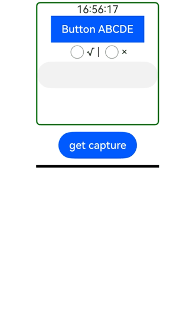

# @ohos.arkui.componentSnapshot (Component Snapshot)

<!--Kit: ArkUI-->
<!--Subsystem: ArkUI-->
<!--Owner: @yihao-lin-->
<!--Designer: @piggyguy-->
<!--Tester: @songyanhong-->
<!--Adviser: @Brilliantry_Rui-->
<!-- md-trans-meta sourceCommit=9430c77017ca73641537d932a3d7d8a4c99c078b translatedAt=2026-07-29T09:22:32.041Z pushedAt=2026-08-03T02:35:51.828Z -->

The **componentSnapshot** module provides APIs for obtaining component snapshots, including snapshots of components that have been loaded and snapshots of components that have not been loaded yet. Snapshots are strictly limited to the component's layout bounds. Content drawn outside the area of the owning component or the parent component is not visible in the snapshots. In addition, sibling components stacked in the component's area are not displayed in the snapshot.

Transformation attributes such as scaling, translation, and rotation only apply to the child components of the target component. Applying these transformation attributes directly to the target component itself has no effect; the snapshot will still display the component as it appears before any transformations are applied.

For typical use cases (for example, long screenshots) and best practices of component snapshots, see [Using Component Snapshot (ComponentSnapshot)](../../ui/arkts-uicontext-component-snapshot.md).

> **NOTE**
>
> - The initial APIs of this module are supported since API version 10. Newly added APIs will be marked with a superscript to indicate their earliest API version.
>
> - The APIs of this module can be used only in the stage model.
>
> - In scenarios where [XComponent](arkui-ts/ts-basic-components-xcomponent.md) is used to, for example, display video or camera streams, obtain images through [createPixelMapFromSurface](../apis-image-kit/arkts-apis-image-f.md#imagecreatepixelmapfromsurface11), instead of through an API in this module.
>
> - If the content of a component does not fill the entire area allocated for it, any remaining space in the snapshot will be rendered as transparent pixels. In addition, if the component uses [image effects](arkui-ts/ts-universal-attributes-image-effect.md) or other effect-related attributes, the resulting snapshot may not be as expected. To address these potential issues, check whether the component's transparent content area needs to be filled, or use the window screenshot API [snapshot](arkts-apis-window-Window.md#snapshot9) instead.
>
> - You can preview how this component looks on a real device, but not in DevEco Studio Previewer.

## Modules to Import

```ts
import { componentSnapshot } from '@kit.ArkUI';
```

## componentSnapshot.get<sup>(deprecated)</sup>

get(id: string, callback: AsyncCallback<image.PixelMap>, options?: SnapshotOptions): void

Obtains the snapshot of a component that has been loaded based on the provided [component ID](arkui-ts/ts-universal-attributes-component-id.md). This API uses an asynchronous callback to return the result.

> **NOTE**
>
> - This API is supported since API version 10 and deprecated since API version 18. You are advised to use [get](arkts-apis-uicontext-componentsnapshot.md#get12) instead. Before calling this API, you need to obtain the [ComponentSnapshot](arkts-apis-uicontext-componentsnapshot.md) object using the [getComponentSnapshot](arkts-apis-uicontext-uicontext.md#getcomponentsnapshot12) method in [UIContext](arkts-apis-uicontext-uicontext.md).
>
> - Since API version 12, you can use the [getComponentSnapshot](arkts-apis-uicontext-uicontext.md#getcomponentsnapshot12) API in [UIContext](arkts-apis-uicontext-uicontext.md) to obtain the [ComponentSnapshot](arkts-apis-uicontext-componentsnapshot.md) object associated with the current UI context.
>
> - The snapshot captures content rendered in the last frame. If this API is called when the component triggers an update, the re-rendered content will not be included in the obtained snapshot.

**Atomic service API**: This API can be used in atomic services since API version 12.

**System capability**: SystemCapability.ArkUI.ArkUI.Full

**Parameters**

| Name     | Type                                 | Mandatory  | Description                                      |
| -------- | ----------------------------------- | ---- | ---------------------------------------- |
| id       | string                              | Yes   | [ID](arkui-ts/ts-universal-attributes-component-id.md) of the target component.|
| callback | [AsyncCallback](../apis-basic-services-kit/js-apis-base.md#asynccallback)&lt;image.[PixelMap](../apis-image-kit/arkts-apis-image-PixelMap.md)&gt; | Yes   | Callback used to return the result.                              |
| options<sup>12+</sup>       | [SnapshotOptions](#snapshotoptions12)                              | No   | Custom settings of the snapshot.|

**Error codes**

For details about the error codes, see [Universal Error Codes](../errorcode-universal.md) and [API Call Error Codes](errorcode-internal.md).

| ID| Error Message           |
| -------- | ------------------- |
| 401      | Parameter error. Possible causes: 1. Mandatory parameters are left unspecified; 2.Incorrect parameters types; 3. Parameter verification failed.   |
| 100001   | Invalid ID. |

> **NOTE**
> 
> Directly using **componentSnapshot** can lead to the issue of [ambiguous UI context](../../ui/arkts-global-interface.md#ambiguous-ui-context). To avoid this, you are advised to use **getUIContext()** to obtain a [UIContext](arkts-apis-uicontext-uicontext.md) instance, and use [getComponentSnapshot](arkts-apis-uicontext-uicontext.md#getcomponentsnapshot12) to obtain **componentSnapshot** associated with the instance.

**Example**

```ts
import { componentSnapshot } from '@kit.ArkUI';
import { image } from '@kit.ImageKit';

@Entry
@Component
struct SnapshotExample {
  @State pixmap: image.PixelMap | undefined = undefined

  build() {
    Column() {
      Row() {
        Image(this.pixmap).width(200).height(200).border({ color: Color.Black, width: 2 }).margin(5)
        // Replace $r('app.media.img') with the image resource file you use.
        Image($r('app.media.img'))
          .autoResize(true)
          .width(200)
          .height(200)
          .margin(5)
          .id("root")
      }

      Button("click to generate UI snapshot")
        .onClick(() => {
          // You are advised to use this.getUIContext().getComponentSnapshot().get().
          componentSnapshot.get("root", (error: Error, pixmap: image.PixelMap) => {
            if (error) {
              console.error(`error:${JSON.stringify(error)}`)
              return;
            }
            this.pixmap = pixmap
          }, { scale: 2, waitUntilRenderFinished: true })
        }).margin(10)
    }
    .width('100%')
    .height('100%')
    .alignItems(HorizontalAlign.Center)
  }
}
```

 

## componentSnapshot.get<sup>(deprecated)</sup>

get(id: string, options?: SnapshotOptions): Promise<image.PixelMap>

Obtains the snapshot of a component that has been loaded based on the provided [component ID](arkui-ts/ts-universal-attributes-component-id.md). This API uses a promise to return the result.

> **NOTE**
>
> - This API is supported since API version 10 and deprecated since API version 18. You are advised to use [get](arkts-apis-uicontext-componentsnapshot.md#get12-1) instead. Before calling this API, you need to obtain the [ComponentSnapshot](arkts-apis-uicontext-componentsnapshot.md) object using the [getComponentSnapshot](arkts-apis-uicontext-uicontext.md#getcomponentsnapshot12) method in [UIContext](arkts-apis-uicontext-uicontext.md).
>
> - Since API version 12, you can use the [getComponentSnapshot](arkts-apis-uicontext-uicontext.md#getcomponentsnapshot12) API in [UIContext](arkts-apis-uicontext-uicontext.md) to obtain the [ComponentSnapshot](arkts-apis-uicontext-componentsnapshot.md) object associated with the current UI context.
> 
> - The snapshot captures content rendered in the last frame. If this API is called when the component triggers an update, the re-rendered content will not be included in the obtained snapshot.

**Atomic service API**: This API can be used in atomic services since API version 12.

**System capability**: SystemCapability.ArkUI.ArkUI.Full

**Parameters**

| Name | Type    | Mandatory  | Description                                      |
| ---- | ------ | ---- | ---------------------------------------- |
| id   | string | Yes   | [ID](arkui-ts/ts-universal-attributes-component-id.md) of the target component.|
| options<sup>12+</sup>       | [SnapshotOptions](#snapshotoptions12)                              | No   | Custom settings of the snapshot.|

**Return value**

| Type                           | Description      |
| ----------------------------- | -------- |
| Promise&lt;image.[PixelMap](../apis-image-kit/arkts-apis-image-PixelMap.md)&gt; | Promise used to return the result.|

**Error codes**

For details about the error codes, see [Universal Error Codes](../errorcode-universal.md) and [API Call Error Codes](errorcode-internal.md).

| ID | Error Message               |
| ------ | ------------------- |
| 401    | Parameter error. Possible causes: 1. Mandatory parameters are left unspecified; 2.Incorrect parameters types; 3. Parameter verification failed.   |
| 100001 | Invalid ID. |

> **NOTE**
> 
> Directly using **componentSnapshot** can lead to the issue of [ambiguous UI context](../../ui/arkts-global-interface.md#ambiguous-ui-context). To avoid this, you are advised to use **getUIContext()** to obtain a [UIContext](arkts-apis-uicontext-uicontext.md) instance, and use [getComponentSnapshot](arkts-apis-uicontext-uicontext.md#getcomponentsnapshot12) to obtain **componentSnapshot** associated with the instance.

**Example**

```ts
import { componentSnapshot } from '@kit.ArkUI';
import { image } from '@kit.ImageKit';

@Entry
@Component
struct SnapshotExample {
  @State pixmap: image.PixelMap | undefined = undefined

  build() {
    Column() {
      Row() {
        Image(this.pixmap).width(200).height(200).border({ color: Color.Black, width: 2 }).margin(5)
        // Replace $r('app.media.img') with the image resource file you use.
        Image($r('app.media.img'))
          .autoResize(true)
          .width(200)
          .height(200)
          .margin(5)
          .id("root")
      }

      Button("click to generate UI snapshot")
        .onClick(() => {
          // You are advised to use this.getUIContext().getComponentSnapshot().get().
          componentSnapshot.get("root", { scale: 2, waitUntilRenderFinished: true })
            .then((pixmap: image.PixelMap) => {
              this.pixmap = pixmap
            }).catch((err: Error) => {
            console.error(`error:${err}`)
          })
        }).margin(10)
    }
    .width('100%')
    .height('100%')
    .alignItems(HorizontalAlign.Center)
  }
}
```

 

## componentSnapshot.createFromBuilder<sup>(deprecated)</sup>

createFromBuilder(builder: CustomBuilder, callback: AsyncCallback<image.PixelMap>, delay?: number, checkImageStatus?: boolean, options?: SnapshotOptions): void

Renders a custom component in the application background and outputs its snapshot. This API uses an asynchronous callback to return the result. The coordinates and size of the offscreen component's drawing area can be obtained through the callback.

> **NOTE**
>
> - This API is supported since API version 10 and deprecated since API version 18. You are advised to use [createFromBuilder](arkts-apis-uicontext-componentsnapshot.md#createfrombuilder12) instead. Before calling this API, you need to obtain the [ComponentSnapshot](arkts-apis-uicontext-componentsnapshot.md) object using the [getComponentSnapshot](arkts-apis-uicontext-uicontext.md#getcomponentsnapshot12) method in [UIContext](arkts-apis-uicontext-uicontext.md).
>
> - Since API version 12, you can use the [getComponentSnapshot](arkts-apis-uicontext-uicontext.md#getcomponentsnapshot12) API in [UIContext](arkts-apis-uicontext-uicontext.md) to obtain the [ComponentSnapshot](arkts-apis-uicontext-componentsnapshot.md) object associated with the current UI context.
>
> - To account for the time spent in awaiting component building and rendering, the callback of offscreen snapshots has a delay of less than 500 ms.
>
> - Components in the builder do not support the setting of animation-related attributes, such as [transition](arkui-ts/ts-transition-animation-component.md).
>
> - If a component is on a time-consuming task, for example, an [Image](arkui-ts/ts-basic-components-image.md) or [Web](../apis-arkweb/arkts-basic-components-web.md) component that is loading online images, its loading may be still in progress when this API is called. In this case, the output snapshot does not represent the component in the way it looks when the loading is successfully completed.

**Atomic service API**: This API can be used in atomic services since API version 12.

**System capability**: SystemCapability.ArkUI.ArkUI.Full

**Parameters**

| Name     | Type                                      | Mandatory  | Description        |
| -------- | ---------------------------------------- | ---- | ---------- |
| builder  | [CustomBuilder](arkui-ts/ts-types.md#custombuilder8) | Yes    | Builder of the custom component.<br>**Note:** The global builder is not supported.<br>If the width and height of the root component of the builder are both 0, the snapshot operation fails and error code 100001 is thrown.|
| callback | [AsyncCallback](../apis-basic-services-kit/js-apis-base.md#asynccallback)&lt;image.[PixelMap](../apis-image-kit/arkts-apis-image-PixelMap.md)&gt;      | Yes   | Callback used to return the result. The coordinates and size of the offscreen component's drawing area can be obtained through the callback.|
| delay<sup>12+</sup>   | number | No    | Delay time for triggering the snapshot command. When an image component is used in the layout, delay time must be specified so that the system can decode the image resource. The larger the resource, the longer the decoding takes. It is recommended to use PixelMap resources that do not require decoding whenever possible.<br> When PixelMap resources are used or **syncLoad** is set to **true** for the **Image** component, **delay** can be set to **0** to forcibly capture snapshots without waiting. This delay time does not refer to the time from API call to return. Since the system needs to perform temporary off-screen construction of the passed-in builder, the return time is usually longer than this delay.<br>**Note:** In the builder passed to the snapshot API, state variables should not be used to control the construction of child components. If they must be used, they should not change when the snapshot API is called, to avoid unexpected snapshot results.<br> Default value: **300** <br> Unit: ms <br> Value range: [0, +∞). Values less than 0 are processed as the default value. |
| checkImageStatus<sup>12+</sup>  | boolean | No    | Whether to verify the image decoding status before taking a snapshot. The value **true** indicates to check whether all **Image** components have been decoded. The value **false** indicates to skip verification. If the verification is not completed, snapshot capture will be canceled and an exception will be returned.<br>Default value: **false**|
| options<sup>12+</sup>       | [SnapshotOptions](#snapshotoptions12)           | No   | Custom settings of the snapshot.|

**Error codes**

For details about the error codes, see [Universal Error Codes](../errorcode-universal.md), [Snapshot Error Codes](errorcode-snapshot.md), and [API Call Error Codes](errorcode-internal.md).

| ID| Error Message                                                    |
| -------- | ------------------------------------------------------------ |
| 401      | Parameter error. Possible causes: 1. Mandatory parameters are left unspecified; 2.Incorrect parameters types; 3. Parameter verification failed. |
| 100001   | The builder is not a valid build function.                   |
| 160001   | An image component in builder is not ready for taking a snapshot. The check for the ready state is required when the checkImageStatus option is enabled.<br>Applicable versions: 12+ |

> **NOTE**
> 
> Directly using **componentSnapshot** can lead to the issue of [ambiguous UI context](../../ui/arkts-global-interface.md#ambiguous-ui-context). To avoid this, you are advised to use **getUIContext()** to obtain a [UIContext](arkts-apis-uicontext-uicontext.md) instance, and use [getComponentSnapshot](arkts-apis-uicontext-uicontext.md#getcomponentsnapshot12) to obtain **componentSnapshot** associated with the instance.

**Example**

```ts
import { componentSnapshot } from '@kit.ArkUI';
import { image } from '@kit.ImageKit';

@Entry
@Component
struct OffscreenSnapshotExample {
  @State pixmap: image.PixelMap | undefined = undefined

  @Builder
  RandomBuilder() {
    Flex({ direction: FlexDirection.Column, justifyContent: FlexAlign.Center, alignItems: ItemAlign.Center }) {
      Text('Test menu item 1')
        .fontSize(20)
        .width(100)
        .height(50)
        .textAlign(TextAlign.Center)
      Divider().height(10)
      Text('Test menu item 2')
        .fontSize(20)
        .width(100)
        .height(50)
        .textAlign(TextAlign.Center)
    }
    .width(100)
    .id("builder")
  }

  build() {
    Column() {
      Button("click to generate offscreen UI snapshot")
        .onClick(() => {
          // You are advised to use this.getUIContext().getComponentSnapshot().createFromBuilder().
          componentSnapshot.createFromBuilder(() => {
            this.RandomBuilder()
          },
            (error: Error, pixmap: image.PixelMap) => {
              if (error) {
                console.error(`error:${JSON.stringify(error)}`)
                return;
              }
              this.pixmap = pixmap
              // Save the pixmap to a file.
              // ....
              // Obtain the component size and position.
              let info = this.getUIContext().getComponentUtils().getRectangleById("builder")
              console.info(info.size.width + ' ' + info.size.height + ' ' + info.localOffset.x + ' ' +
              info.localOffset.y + ' ' + info.windowOffset.x + ' ' + info.windowOffset.y)
            }, 320, true, { scale: 2, waitUntilRenderFinished: true })
        })
      Image(this.pixmap)
        .margin(10)
        .height(200)
        .width(200)
        .border({ color: Color.Black, width: 2 })
    }.width('100%').margin({ left: 10, top: 5, bottom: 5 }).height(300)
  }
}
```

 

## componentSnapshot.createFromBuilder<sup>(deprecated)</sup>

createFromBuilder(builder: CustomBuilder, delay?: number, checkImageStatus?: boolean, options?: SnapshotOptions): Promise<image.PixelMap>

Renders a custom component in the application background and outputs its snapshot. This API uses a promise to return the result. The coordinates and size of the offscreen component's drawing area can be obtained through the promise.

> **NOTE**
>
> - This API is supported since API version 10 and deprecated since API version 18. You are advised to use [createFromBuilder](arkts-apis-uicontext-componentsnapshot.md#createfrombuilder12-1) instead. Before calling this API, you need to obtain the [ComponentSnapshot](arkts-apis-uicontext-componentsnapshot.md) object using the [getComponentSnapshot](arkts-apis-uicontext-uicontext.md#getcomponentsnapshot12) method in [UIContext](arkts-apis-uicontext-uicontext.md).
>
> - Since API version 12, you can use the [getComponentSnapshot](arkts-apis-uicontext-uicontext.md#getcomponentsnapshot12) API in [UIContext](arkts-apis-uicontext-uicontext.md) to obtain the [ComponentSnapshot](arkts-apis-uicontext-componentsnapshot.md) object associated with the current UI context.
> 
> - To account for the time spent in awaiting component building and rendering, the callback of offscreen snapshots has a delay of less than 500 ms.
>
> - Components in the builder do not support the setting of animation-related attributes, such as [transition](arkui-ts/ts-transition-animation-component.md).
>
> - If a component is on a time-consuming task, for example, an [Image](arkui-ts/ts-basic-components-image.md) or [Web](../apis-arkweb/arkts-basic-components-web.md) component that is loading online images, its loading may be still in progress when this API is called. In this case, the output snapshot does not represent the component in the way it looks when the loading is successfully completed.

**Atomic service API**: This API can be used in atomic services since API version 12.

**System capability**: SystemCapability.ArkUI.ArkUI.Full

**Parameters**

| Name    | Type                                      | Mandatory  | Description        |
| ------- | ---------------------------------------- | ---- | ---------- |
| builder | [CustomBuilder](arkui-ts/ts-types.md#custombuilder8) | Yes    | Builder of the custom component.<br>**Note:** The global builder is not supported.<br>If the width and height of the root component of the builder are both 0, the screenshot operation fails and error code 100001 is thrown. |
| delay<sup>12+</sup>   | number | No    | Delay time for triggering the screenshot command. When an image component is used in the layout, delay time must be specified to allow the system to decode the image resource. The larger the resource, the longer the decoding takes. It is recommended to use PixelMap resources that do not require decoding whenever possible.<br> When PixelMap resources are used or **syncLoad** of the **Image** component is set to **true**, **delay** can be set to **0** to forcibly capture snapshots without waiting. This delay time does not refer to the time from API call to return. Since the system needs to perform temporary off-screen building of the passed-in builder, the return time is usually longer than this delay.<br>**Note:** In the builder passed to the screenshot API, state variables should not be used to control the construction of child components. If they must be used, they should not change when the screenshot API is called, to avoid unexpected screenshot results.<br> Default value: **300** <br> Unit: ms|
| checkImageStatus<sup>12+</sup>  | boolean | No    | Whether to verify the image decoding status before taking a snapshot. The value **true** indicates to check whether all **Image** components have been decoded. The value **false** indicates to skip verification. If the verification is not completed, snapshot capture will be canceled and an exception will be returned.<br>Default value: **false**|
| options<sup>12+</sup>       | [SnapshotOptions](#snapshotoptions12)           | No   | Custom settings of the snapshot.|

**Return value**

| Type                           | Description      |
| ----------------------------- | -------- |
| Promise&lt;image.[PixelMap](../apis-image-kit/arkts-apis-image-PixelMap.md)&gt; | Promise used to return the result.|

**Error codes**
For details about the error codes, see [Universal Error Codes](../errorcode-universal.md), [Snapshot Error Codes](errorcode-snapshot.md), and [API Call Error Codes](errorcode-internal.md).

| ID | Error Message                                    |
| ------ | ---------------------------------------- |
| 401    | Parameter error. Possible causes: 1. Mandatory parameters are left unspecified; 2.Incorrect parameters types; 3. Parameter verification failed.   |
| 100001 | The builder is not a valid build function. |
| 160001 | An image component in builder is not ready for taking a snapshot. The check for the ready state is required when the checkImageStatus option is enabled.<br>Applicable versions: 12+ |

> **NOTE**
> 
> Directly using **componentSnapshot** can lead to the issue of [ambiguous UI context](../../ui/arkts-global-interface.md#ambiguous-ui-context). To avoid this, you are advised to use **getUIContext()** to obtain a [UIContext](arkts-apis-uicontext-uicontext.md) instance, and use [getComponentSnapshot](arkts-apis-uicontext-uicontext.md#getcomponentsnapshot12) to obtain **componentSnapshot** associated with the instance.

**Example**

```ts
import { componentSnapshot } from '@kit.ArkUI'
import { image } from '@kit.ImageKit'

@Entry
@Component
struct OffscreenSnapshotExample {
  @State pixmap: image.PixelMap | undefined = undefined

  @Builder
  RandomBuilder() {
    Flex({ direction: FlexDirection.Column, justifyContent: FlexAlign.Center, alignItems: ItemAlign.Center }) {
      Text('Test menu item 1')
        .fontSize(20)
        .width(100)
        .height(50)
        .textAlign(TextAlign.Center)
      Divider().height(10)
      Text('Test menu item 2')
        .fontSize(20)
        .width(100)
        .height(50)
        .textAlign(TextAlign.Center)
    }
    .width(100)
    .id("builder")
  }

  build() {
    Column() {
      Button("click to generate offscreen UI snapshot")
        .onClick(() => {
          // You are advised to use this.getUIContext().getComponentSnapshot().createFromBuilder().
          componentSnapshot.createFromBuilder(() => {
            this.RandomBuilder()
          }, 320, true, { scale: 2, waitUntilRenderFinished: true })
            .then((pixmap: image.PixelMap) => {
              this.pixmap = pixmap
              // Save the pixmap to a file.
              // ....
              // Obtain the component size and position.
              let info = this.getUIContext().getComponentUtils().getRectangleById("builder")
              console.info(`${info.size.width} ${info.size.height} ${info.localOffset.x} ${
              info.localOffset.y} ${info.windowOffset.x} ${info.windowOffset.y}`)
            }).catch((err: Error) => {
            console.error(`error:${err}`)
          })
        })
      Image(this.pixmap)
        .margin(10)
        .height(200)
        .width(200)
        .border({ color: Color.Black, width: 2 })
    }.width('100%').margin({ left: 10, top: 5, bottom: 5 }).height(300)
  }
}
```


## componentSnapshot.getSync<sup>12+</sup>

getSync(id: string, options?: SnapshotOptions): image.PixelMap

Obtains the snapshot of a component that has been loaded based on the provided [component ID](arkui-ts/ts-universal-attributes-component-id.md). This API synchronously waits for the snapshot to complete and returns a [PixelMap](../apis-image-kit/arkts-apis-image-PixelMap.md) object.

> **NOTE**
>
> The snapshot captures content rendered in the last frame. If this API is called when the component triggers an update, the re-rendered content will not be included in the obtained snapshot.

**Atomic service API**: This API can be used in atomic services since API version 12.

**System capability**: SystemCapability.ArkUI.ArkUI.Full

**Parameters**

| Name | Type    | Mandatory  | Description                                      |
| ---- | ------ | ---- | ---------------------------------------- |
| id   | string | Yes   | [ID](arkui-ts/ts-universal-attributes-component-id.md) of the target component.|
| options       | [SnapshotOptions](#snapshotoptions12)                              | No    | Custom options related to the snapshot, which are passed when custom snapshot behavior is needed, for example, setting the scale ratio, waiting for rendering to complete, snapshot area, color space, or dynamic range. Default snapshot configuration is used when this parameter is not passed. |

**Return value**

| Type                           | Description      |
| ----------------------------- | -------- |
| image.[PixelMap](../apis-image-kit/arkts-apis-image-PixelMap.md) | **PixelMap** object of the component snapshot, which represents the captured component image. |

**Error codes**

For details about the error codes, see [Universal Error Codes](../errorcode-universal.md), [Snapshot Error Codes](errorcode-snapshot.md), and [API Call Error Codes](errorcode-internal.md).

| ID | Error Message               |
| ------ | ------------------- |
| 401      | Parameter error. Possible causes: 1. Mandatory parameters are left unspecified; 2.Incorrect parameters types; 3. Parameter verification failed.   |
| 100001 | Invalid ID. |
| 160002 | Timeout. |
| 160003 | Unsupported color space or dynamic range mode in snapshot options.<br>Applicable versions: 23+ |

> **NOTE**
>
> Directly using **componentSnapshot** may cause the issue of [ambiguous UI context](../../ui/arkts-global-interface.md#ambiguous-ui-context). To avoid this, you are advised to use **getUIContext()** to obtain a [UIContext](arkts-apis-uicontext-uicontext.md) instance, and use [getComponentSnapshot](arkts-apis-uicontext-uicontext.md#getcomponentsnapshot12) to obtain the **componentSnapshot** associated with the instance.

**Example**

```ts
import { componentSnapshot } from '@kit.ArkUI';
import { image } from '@kit.ImageKit';

@Entry
@Component
struct SnapshotExample {
  @State pixmap: image.PixelMap | undefined = undefined

  build() {
    Column() {
      Row() {
        Image(this.pixmap).width(200).height(200).border({ color: Color.Black, width: 2 }).margin(5)
        // Replace $r('app.media.img') with the image resource file you use.
        Image($r('app.media.img'))
          .autoResize(true)
          .width(200)
          .height(200)
          .margin(5)
          .id('root')
      }

      Button('click to generate UI snapshot')
        .onClick(() => {
          try {
            // You are advised to use this.getUIContext().getComponentSnapshot().getSync().
            let pixelmap = componentSnapshot.getSync('root', { scale: 2, waitUntilRenderFinished: true });
            this.pixmap = pixelmap;
          } catch (error) {
            console.error(`getSync error message:${error.message}`);
          }
        }).margin(10)
    }
    .width('100%')
    .height('100%')
    .alignItems(HorizontalAlign.Center)
  }
}
```


## SnapshotSizeLimitation

Defines the size limit of a component screenshot.

**Since**: 26.0.0

**Model restriction**: This API can be used only in the stage model.

**Atomic service API**: This API can be used in atomic services since API version 26.0.0.

**System capability**: SystemCapability.ArkUI.ArkUI.Full

| Name       | Type    | Read-Only| Optional| Description                  |
| --------- | ------ | ---- | ---- | -------------------- |
| maxWidth  | number | No   | No   | Maximum width for the component snapshot.<br>Value range: [0, +∞)<br>Unit: px |
| maxHeight | number | No   | No   | Maximum height for the component snapshot.<br>Value range: [0, +∞)<br>Unit: px |

## SnapshotOptions<sup>12+</sup>

**Model restriction**: This API can be used only in the stage model.

**System capability**: SystemCapability.ArkUI.ArkUI.Full

<!--Table: 20%; 20%; 8%; 8%; 44%-->

| Name          | Type           |    Read-Only      |    Optional          |   Description                   |
| ---------------|------------     | -------------|---------------| -----------------------------|
| scale           | number | No  |  Yes | Scale ratio for rendering a PixelMap on the graphics side during snapshot. If the ratio is too large, the snapshot may take longer or fail.<br>Value range: [0, +∞). Values less than or equal to 0 are treated as the default value.<br>Default value: 1<br>**NOTE**<br>Do not take snapshots of excessively large sizes. It is recommended that the snapshot size not exceed the screen size. If the target width or height of the snapshot exceeds the underlying limit, the snapshot will fail. The underlying limit varies by device. You can obtain the specific limit through the [getSizeLimitation](./arkts-apis-uicontext-componentsnapshot.md#getsizelimitation) API.<br>**Atomic service API:** This API can be used in atomic services since API version 12.    |
| waitUntilRenderFinished    | boolean | No | Yes  | Whether to force the system to wait for all rendering commands to complete before taking the snapshot. The value **true** means the system is forced to wait for all rendering commands to complete before taking the snapshot, and **false** means the system is not forced to wait. This parameter ensures that the snapshot content is as up-to-date as possible and should be enabled whenever possible. Note that enabling this parameter may cause the API to take longer to return, depending on the size of the area that needs to be redrawn on the current page.<br>Default value: **false**<br>**Atomic service API:** This API can be used in atomic services since API version 12.         |
| region<sup>15+</sup> | [SnapshotRegionType](#snapshotregiontype15) | No  | Yes | Rectangular region for the snapshot. The default region is the entire component.<br>**Atomic service API:** This API can be used in atomic services since API version 15. |
| colorMode<sup>23+</sup> | [ColorModeOptions](#colormodeoptions23) | No  | Yes | Color space used for the snapshot.<br>Default value: **{colorSpace: SRGB, isAuto: false}**<br>**Atomic service API:** This API can be used in atomic services since API version 23. |
| dynamicRangeMode<sup>23+</sup> | [DynamicRangeModeOptions](#dynamicrangemodeoptions23) | No  | Yes | Dynamic range mode used for the snapshot.<br>Default value: **{dynamicRangeMode: STANDARD, isAuto: false}**<br>**Atomic service API:** This API can be used in atomic services since API version 23. |

## ColorModeOptions<sup>23+</sup>

Defines the color space used for the snapshot.

**Atomic service API**: This API can be used in atomic services since API version 23.

**Model restriction**: This API can be used only in the stage model.

**System capability**: SystemCapability.ArkUI.ArkUI.Full

| Name| Type| Read-Only | Optional| Description|
| ---- | ---- | ---- | ---- | ---- |
| colorSpace | [colorSpaceManager.ColorSpace](../apis-arkgraphics2d/js-apis-colorSpaceManager.md#colorspace) | No | Yes | Color space used for the snapshot.<br>If the color space used by the component to be captured is known, you can specify it through the `colorSpace` field and set `isAuto` to **false** to achieve the expected snapshot effect.<br>The value can be **DISPLAY_P3**, **SRGB**, and **DISPLAY_BT2020_SRGB** in [colorSpaceManager.ColorSpace](../apis-arkgraphics2d/js-apis-colorSpaceManager.md#colorspace).<br>Default value: **SRGB**<br>If the value is **undefined**, **null**, or not set, the default value is used for the snapshot. Other invalid values will cause the snapshot to fail, and error code 160003 is returned. |
| isAuto | boolean | No | Yes | Whether the system automatically determines the color space to use.<br>The value options are as follows: **true** indicates that the system automatically determines the color space to use. **false** indicates that the color space set through the `colorSpace` field is used for the snapshot. If an invalid value is used, the default value **false** is applied.<br>Default value: **false**<br>For off-screen snapshots, only **false** is supported. Otherwise, error code 160004 is returned.<br>When `isAuto` is set to **true**, it is recommended to also set the `waitUntilRenderFinished` field in [SnapshotOptions](#snapshotoptions12) to **true** to ensure that the system can properly detect the mode used.<br>When you are unsure about the color space used by the component, it is recommended to set `isAuto` to **true** so that the system automatically determines the color space based on the actual situation.<br>When `isAuto` is to **true**, the value set in the `colorSpace` field will be ignored. In this case, if the component to be captured contains child components with different color spaces, the color space of the snapshot is the one with the highest priority, in the order of **DISPLAY_BT2020_SRGB** > **DISPLAY_P3** > **SRGB**. |

**Example**

```ts
import { image } from '@kit.ImageKit';
import { colorSpaceManager } from '@kit.ArkGraphics2D';

@Entry
@Component
struct SnapshotColorModeExample {
  @State pixmap: image.PixelMap | undefined = undefined;

  build() {
    Column() {
      Row() {
        Image(this.pixmap).width(200).height(200).border({ color: Color.Black, width: 2 }).margin(5)
        // Replace $r('app.media.img') with the image resource file you use.
        Image($r('app.media.img'))
          .autoResize(true)
          .width(200)
          .height(200)
          .margin(5)
          .id('root')
      }

      Button('click to generate UI snapshot')
        .onClick(() => {
          this.getUIContext().getComponentSnapshot().get('root', (error: Error, pixmap: image.PixelMap) => {
            if (error) {
              console.error(`error:${JSON.stringify(error)}`);
              return;
            }
            this.pixmap = pixmap;
          }, {
            scale: 2,
            waitUntilRenderFinished: true,
            // Set the color space to DISPLAY_P3.
            colorMode: { colorSpace: colorSpaceManager.ColorSpace.DISPLAY_P3, isAuto: false }
          })
        }).margin(10)
    }
    .width('100%')
    .height('100%')
    .alignItems(HorizontalAlign.Center)
  }
}
```


## DynamicRangeModeOptions<sup>23+</sup>

Defines the dynamic range mode used for the snapshot.

**Atomic service API**: This API can be used in atomic services since API version 23.

**Model restriction**: This API can be used only in the stage model.

**System capability**: SystemCapability.ArkUI.ArkUI.Full

| Name| Type| Read-Only | Optional| Description|
| ---- | ---- | ---- | ---- | ---- |
| dynamicRangeMode| [DynamicRangeMode](./arkui-ts/ts-basic-components-image.md#dynamicrangemode12) | No | Yes | Dynamic range mode used for snapshot.<br> By default, the system takes snapshots in [STANDARD](./arkui-ts/ts-basic-components-image.md#dynamicrangemode12) mode. If you know the dynamic range mode used by the component to be captured, you can specify the specific dynamic range mode through the `dynamicRangeMode` field and set `isAuto` to **false** to achieve the expected snapshot effect.<br>Although there are three dynamic range modes, both **HIGH** and **CONSTRAINT** behave as HDR (High Dynamic Range). The **STANDARD** mode corresponds to SDR (Standard Dynamic Range).<br>After a valid dynamic range mode is specified, the dynamic range actually used for the snapshot is affected by both the component being captured and the set value, as follows:<br>1. When the dynamic range of the component being captured is SDR, the snapshot actually uses SDR even if the dynamic range mode is specified as **HIGH**.<br>2. When the dynamic range of the component being captured is HDR, the snapshot actually uses the specified dynamic range mode.<br>3. When the [color space](#colormodeoptions23) is set to **SRGB** or **DISPLAY_P3**, the snapshot actually uses SDR as the dynamic range mode.<br>4. If the component being captured contains child components with both SDR and HDR, HDR is used.<br>5. If conditions 3 and 4 are met simultaneously, the snapshot actually uses SDR as the dynamic range mode.<br>Value range: enumerated values of [DynamicRangeMode](./arkui-ts/ts-basic-components-image.md#dynamicrangemode12).<br>Default value: **STANDARD** <br>If the value is **undefined**, **null**, or not set, the default value is used for the snapshot. Other invalid values cause the snapshot to fail and return error code 160003. |
|isAuto | boolean | No | Yes | Whether the system automatically determines the dynamic range mode to use.<br>The value options are as follows: **true** indicates that the system automatically determines the dynamic range mode to use. **false** indicates that the dynamic range mode set through the `dynamicRangeMode` field is used for the snapshot. Invalid values are treated as the default value **false**.<br>Default value: **false**<br>For off-screen snapshots, only **false** is supported. Otherwise, error code 160004 is returned.<br>When `isAuto` is set to **true**, it is recommended to also set the `waitUntilRenderFinished` field in [SnapshotOptions](#snapshotoptions12) to **true** to ensure that the system can properly detect the mode used.<br>When you are unsure about the dynamic range mode used by the component, it is recommended to set `isAuto` to **true** so that the system automatically determines the dynamic range mode based on the actual situation.<br> When `isAuto` is set to **true**, the value set in the `dynamicRangeMode` field is ignored. |

**Example**

```ts
import { image } from '@kit.ImageKit';

@Entry
@Component
struct SnapshotDynamicRangeExample {
  @State pixmap: image.PixelMap | undefined = undefined;

  build() {
    Column() {
      Row() {
        Image(this.pixmap).width(200).height(200).border({ color: Color.Black, width: 2 }).margin(5)
        // Replace $r('app.media.img') with the image resource file you use.
        Image($r('app.media.img'))
          .autoResize(true)
          .width(200)
          .height(200)
          .margin(5)
          .id('root')
      }

      Button('click to generate UI snapshot')
        .onClick(() => {
          this.getUIContext().getComponentSnapshot().get('root', (error: Error, pixmap: image.PixelMap) => {
            if (error) {
              console.error(`error:${JSON.stringify(error)}`);
              return;
            }
            this.pixmap = pixmap;
          }, {
            scale: 2,
            waitUntilRenderFinished: true,
            // Set isAuto to true for the dynamic range mode.
            dynamicRangeMode: { dynamicRangeMode: DynamicRangeMode.STANDARD, isAuto: true }
          })
        }).margin(10)
    }
    .width('100%')
    .height('100%')
    .alignItems(HorizontalAlign.Center)
  }
}
```


## SnapshotRegionType<sup>15+</sup>

type SnapshotRegionType = SnapshotRegion | LocalizedSnapshotRegion

Represents the region of a component to be captured in a snapshot. It can take one of the types listed in the table below.

**Atomic service API**: This API can be used in atomic services since API version 15.

**Model restriction**: This API can be used only in the stage model.

**System capability**: SystemCapability.ArkUI.ArkUI.Full

| Type  | Description  |
| ------ | ------ |
| [SnapshotRegion](#snapshotregion15) | Rectangular region for capturing the component snapshot.|
| [LocalizedSnapshotRegion](#localizedsnapshotregion15) | Rectangular region for capturing the component snapshot, with horizontal flipping based on the layout direction. If the layout direction is right-to-left (RTL), the specified region is flipped horizontally to accommodate the RTL layout. |

## SnapshotRegion<sup>15+</sup>

Defines the rectangular region for capturing the component snapshot.

**Atomic service API**: This API can be used in atomic services since API version 15.

**Model restriction**: This API can be used only in the stage model.

**System capability**: SystemCapability.ArkUI.ArkUI.Full

| Name  | Type  | Read-Only| Optional| Description                                   |
| ------ | ------ | ---- | ---- | --------------------------------------- |
| left   | number | No   | No   | X-coordinate of the upper left corner of the rectangular region.<br>Unit: px<br>Value range: [0, Component width]. If the value is out of range, the snapshot fails and error code 401 is returned. |
| top    | number | No   | No   | Y-coordinate of the upper left corner of the rectangular region.<br>Unit: px<br>Value range: [0, Component height]. If the value is out of range, the snapshot fails and error code 401 is returned. |
| right  | number | No   | No   | X-coordinate of the lower right corner of the rectangular region.<br>Unit: px<br>Value range: [0, Component width]. If the value is out of range, the snapshot fails and error code 401 is returned. |
| bottom | number | No   | No   | Y-coordinate of the lower right corner of the rectangular region.<br>Unit: px<br>Value range: [0, Component height]. If the value is out of range, the snapshot fails and error code 401 is returned. |

## LocalizedSnapshotRegion<sup>15+</sup>

Defines the rectangular region for capturing the component snapshot, with coordinates adjusted based on the layout direction (LTR or RTL).

**Atomic service API**: This API can be used in atomic services since API version 15.

**Model restriction**: This API can be used only in the stage model.

**System capability**: SystemCapability.ArkUI.ArkUI.Full

| Name  | Type  | Read-Only| Optional| Description                                                        |
| ------ | ------ | ----| ---- | ------------------------------------------------------------ |
| start  | number | No  | No   | For LTR layouts: X-coordinate of the upper left corner of the rectangular region. For RTL layouts: X-coordinate of the upper right corner of the rectangular region.<br>Unit: px<br>Value range: [0, Component width]. If the value is out of range, the snapshot fails and error code 401 is returned. |
| top    | number | No  | No   | For LTR layouts: Y-coordinate of the upper left corner of the rectangular region. For RTL layouts: Y-coordinate of the upper right corner of the rectangular region.<br>Unit: px<br>Value range: [0, Component height]. If the value is out of range, the snapshot fails and error code 401 is returned. |
| end    | number | No  | No   | For LTR layouts: X-coordinate of the lower right corner of the rectangular region. For RTL layouts: X-coordinate of the lower left corner of the rectangular region.<br>Unit: px<br>Value range: [0, Component width]. If the value is out of range, the snapshot fails and error code 401 is returned. |
| bottom | number | No  | No   | For LTR layouts: Y-coordinate of the lower right corner of the rectangular region. For RTL layouts: Y-coordinate of the lower left corner of the rectangular region.<br>Unit: px<br>Value range: [0, Component height]. If the value is out of range, the snapshot fails and error code 401 is returned. |

> **NOTE**
> Directly using **componentSnapshot** may cause the issue of [ambiguous UI context](../../ui/arkts-global-interface.md#ambiguous-ui-context). To avoid this, you are advised to use **getUIContext()** to obtain a [UIContext](arkts-apis-uicontext-uicontext.md) instance, and use [getComponentSnapshot](arkts-apis-uicontext-uicontext.md#getcomponentsnapshot12) to obtain **componentSnapshot** associated with the instance.

**Example**

```ts
import { image } from '@kit.ImageKit';

@Entry
@Component
struct SnapshotExample {
  @State pixmap: image.PixelMap | undefined = undefined

  build() {
    Column() {
      Row() {
        Column() {
          TextClock()
          Button('Button ABCDE').type(ButtonType.Normal)
          Row() {
            Checkbox()
            Text('√')
            Text(' | ')
            Checkbox()
            Text('×')
          }.align(Alignment.Start)

          TextInput()
        }
        .align(Alignment.Start)
        .id('component1')
        .width('600px')
        .height('600px')
        .borderRadius(6)
        .borderWidth(2)
        .borderColor(Color.Green)

      }

      Button('get capture')
        .onClick(() => {
          try {
            let pixelmap = this.getUIContext().getComponentSnapshot().getSync('component1',
              {
                scale: 2,
                waitUntilRenderFinished: true,
                region: {
                  start: 20,
                  top: 20,
                  end: 200,
                  bottom: 240
                }
              })
            this.pixmap = pixelmap;
          } catch (error) {
            console.error(`getSync error message:${error.message}`);
          }
        }).margin(10)
      Image(this.pixmap).border({ color: Color.Black, width: 2 }).width('600px')
    }.width('100%').align(Alignment.Center)
  }
}
```



<!--no_check-->