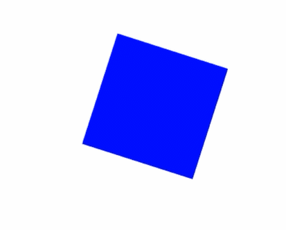
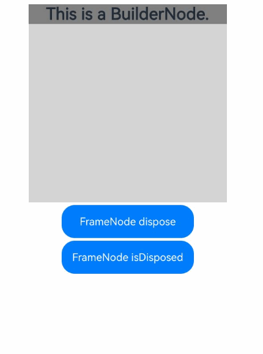
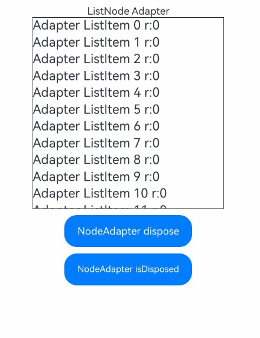

# FrameNode
<!--Kit: ArkUI-->
<!--Subsystem: ArkUI-->
<!--Owner: @xiang-shouxing-->
<!--Designer: @xiang-shouxing-->
<!--Tester: @sally__-->
<!--Adviser: @Brilliantry_Rui-->

**FrameNode** represents an entity node in the component tree. It can be used by a [NodeController](./js-apis-arkui-nodeController.md) to mount a [BuilderNode](./js-apis-arkui-builderNode.md) (that holds the FrameNode) to a [NodeContainer](arkui-ts/ts-basic-components-nodecontainer.md) or mount a [RenderNode](./js-apis-arkui-renderNode.md) to another FrameNode. For best practices, see [Dynamic Component Creation: Dynamically Adding, Updating, and Deleting Components](https://developer.huawei.com/consumer/en/doc/best-practices/bpta-ui-dynamic-operations#section153921947151012).

> **NOTE**
>
> The initial APIs of this module are supported since API version 11. Newly added APIs will be marked with a superscript to indicate their earliest API version.
>
> **FrameNode** is not available in DevEco Studio Previewer.
>
> FrameNodes cannot be dragged.

## Modules to Import

```ts
import { FrameNode, LayoutConstraint, ExpandMode, typeNode, NodeAdapter } from "@kit.ArkUI";
```

## LayoutConstraint<sup>12+</sup>

Describes the layout constraints of the component.

**Atomic service API**: This API can be used in atomic services since API version 12.

**System capability**: SystemCapability.ArkUI.ArkUI.Full

| Name           |  Type | Read-Only  | Optional  | Description                                      |
| -------------- | ------ | ----- | ----------|-------------------------------- |
| maxSize           | [Size](./js-apis-arkui-graphics.md#size) |No| No   | Maximum size.             |
| minSize            | [Size](./js-apis-arkui-graphics.md#size) |No| No   | Minimum size.                 |
| percentReference      | [Size](./js-apis-arkui-graphics.md#size) |No| No   | Size reference for calculating the percentage of a child node.|

## CrossLanguageOptions<sup>15+</sup>

Provides options for configuring or querying the cross-language access permissions for a FrameNode. For example, for nodes created using ArkTS, this API can control whether non-ArkTS languages are allowed to access or modify the attributes of these nodes.

**Atomic service API**: This API can be used in atomic services since API version 15.

**System capability**: SystemCapability.ArkUI.ArkUI.Full

| Name  | Type  | Read-Only| Optional| Description                  |
| ------ | ------ | ---- | ---- | ---------------------- |
| attributeSetting  | boolean | No  | Yes  | Whether the FrameNode supports cross-language settings.<br>The value **true** means the FrameNode supports cross-language settings, and **false** means the opposite.<br>Default value: **false**.|

## ExpandMode<sup>15+</sup>

Enumerates the expansion mode of child nodes.

**Atomic service API**: This API can be used in atomic services since API version 15.

**System capability**: SystemCapability.ArkUI.ArkUI.Full

| Name| Value| Description|
| -------- | -------- | -------- |
| NOT_EXPAND | 0 | The child nodes of the current FrameNode are not expanded. If the FrameNode contains [LazyForEach](./arkui-ts/ts-rendering-control-lazyforeach.md) child nodes, the child nodes are not expanded when the nodes in the main tree are being obtained. The child node sequence numbers are calculated based on the nodes in the main tree.|
| EXPAND | 1 | The child nodes of the current FrameNode are expanded. If the FrameNode contains [LazyForEach](./arkui-ts/ts-rendering-control-lazyforeach.md) child nodes, all child nodes are expanded when being obtained. The child node sequence numbers are calculated based on all child nodes.|
| LAZY_EXPAND | 2 | The child nodes of the current FrameNode are expanded on demand. If the FrameNode contains [LazyForEach](./arkui-ts/ts-rendering-control-lazyforeach.md) child nodes, the child nodes are not expanded when the nodes in the main tree are being obtained, but are expanded when nodes not in the main tree are being obtained. The child node sequence numbers are calculated based on all child nodes.|

## InteractionEventBindingInfo<sup>19+</sup>

Describes the binding state of interaction events on components. When querying reveals an interaction event bound to the current node, this object provides detailed event binding information.

**Atomic service API**: This API can be used in atomic services since API version 19.

**System capability**: SystemCapability.ArkUI.ArkUI.Full

| Name  | Type  | Read-Only| Optional| Description                  |
| ------ | ------ | ---- | ---- | ---------------------- |
| baseEventRegistered  | boolean |  No  | No  | Whether the event is bound declaratively.<br>**true** means that the event is bound declaratively, and **false** means the opposite.|
| nodeEventRegistered  | boolean | No  | No  | Whether the event is bound through a custom component node. For the implementation example, see [Basic Event Example](#basic-event-example).<br>The value **true** means that the event is bound through a custom component node, and **false** means the opposite.|
| nativeEventRegistered  | boolean | No  | No  | Whether the event is bound through node event registration ([registerNodeEvent](capi-arkui-nativemodule-arkui-nativenodeapi-1.md#registernodeevent)).<br>The value **true** means that the event is bound through node event registration, and **false** means the opposite.|
| builtInEventRegistered  | boolean | No  | No  | Whether the component has built-in events (events that are defined internally by the component and do not require manual binding).<br>The value **true** means that the component has built-in events, and **false** means the opposite.|

## UIState<sup>20+</sup>

Enumerates polymorphic style states, which are used to process polymorphic styles.

**Atomic service API**: This API can be used in atomic services since API version 20.

**System capability**: SystemCapability.ArkUI.ArkUI.Full

| Name| Value| Description|
| -------- | -------- | -------- |
| NORMAL | 0 | Normal state.|
| PRESSED | 1 << 0 | Pressed state.|
| FOCUSED | 1 << 1 | Focused state.|
| DISABLED | 1 << 2 | Disabled state.|
| SELECTED | 1 << 3 | Selected state.<br>Only supported by specific components: **Checkbox**, **Radio**, **Toggle**, **List**, **Grid**, **MenuItem**.|

## UIStatesChangeHandler<sup>20+</sup>

type UIStatesChangeHandler = (node: FrameNode, currentUIStates: number) => void

Defines the callback triggered when the UI state changes. Defines the callback triggered on UI state changes. It receives the current [UIState](#uistate20) value when triggered. The parameter represents **UIState** enumerated values or their bitwise combinations.

**Atomic service API**: This API can be used in atomic services since API version 20.

**System capability**: SystemCapability.ArkUI.ArkUI.Full

**Parameters**

| Name  | Type                     | Mandatory| Description                                                    |
| -------- | ----------------------------- | ---- | ------------------------------------------------------------ |
| node    | [FrameNode](#framenode-1) | Yes  | Node triggering the UI state change.                                           |
| currentUIStates    | number         | Yes  | Current UI states when the callback is triggered.<br>You can use the bitwise AND operation to check the [UI states](#uistate20) that are currently included.<br>Example: **if (currentState & UIState.PRESSED == UIState.PRESSED)**.<br>Direct comparison: **if (currentState == UIState.PRESSED)**.                                           |

## FrameNode

### constructor

constructor(uiContext: UIContext)

A constructor used to create a FrameNode.

**Atomic service API**: This API can be used in atomic services since API version 12.

**System capability**: SystemCapability.ArkUI.ArkUI.Full

**Parameters**

| Name   | Type                                     | Mandatory| Description                              |
| --------- | ----------------------------------------- | ---- | ---------------------------------- |
| uiContext | [UIContext](./arkts-apis-uicontext-uicontext.md) | Yes  | UI context for node creation.|

### getRenderNode

getRenderNode(): RenderNode | null

Obtains the [RenderNode](./js-apis-arkui-renderNode.md) held by the FrameNode.

**Atomic service API**: This API can be used in atomic services since API version 12.

**System capability**: SystemCapability.ArkUI.ArkUI.Full

**Return value**

| Type                                                          | Description                                                                                                            |
| -------------------------------------------------------------- | ---------------------------------------------------------------------------------------------------------------- |
| [RenderNode](./js-apis-arkui-renderNode.md) \| null | **RenderNode** instance. If the current FrameNode does not hold any RenderNode, **null** is returned. If the current FrameNode is a node created by a declarative component, **null** is returned.|

**Example**

```ts
import { NodeController, FrameNode } from '@kit.ArkUI';

// Implement a custom UI controller by extending NodeController.
class MyNodeController extends NodeController {
  private rootNode: FrameNode | null = null;

  makeNode(uiContext: UIContext): FrameNode | null {
    this.rootNode = new FrameNode(uiContext);

    // Obtain the RenderNode held by rootNode.
    const renderNode = this.rootNode.getRenderNode();
    if (renderNode !== null) {
      renderNode.size = { width: 100, height: 100 };
      renderNode.backgroundColor = 0XFFFF0000;
    }

    return this.rootNode;
  }
}

@Entry
@Component
struct Index {
  private myNodeController: MyNodeController = new MyNodeController();

  build() {
    Row() {
      NodeContainer(this.myNodeController)
    }
  }
}
```
### isModifiable<sup>12+</sup> 

isModifiable(): boolean

Checks whether this FrameNode is modifiable.

**Atomic service API**: This API can be used in atomic services since API version 12.

**System capability**: SystemCapability.ArkUI.ArkUI.Full

**Return value**

| Type   | Description                                                                                                                                 |
| ------- | ------------------------------------------------------------------------------------------------------------------------------------- |
| boolean | Whether the current FrameNode is modifiable.<br>The value **true** means that the FrameNode is modifiable, and **false** means the opposite.<br>Returns **false** if the node is a system component proxy node in a [custom component node](../../ui/arkts-user-defined-node.md#custom-component-node-framenode) or the node has been [disposed](#dispose12).<br>When **false** is returned, the current FrameNode does not support operations such as [appendChild](#appendchild12), [insertChildAfter](#insertchildafter12), [removeChild](#removechild12), [clearChildren](#clearchildren12), [createAnimation](#createanimation20), and [cancelAnimations](#cancelanimations20).|

**Example**

See [Example of Node Operations](#example-of-node-operations).

### appendChild<sup>12+</sup> 

appendChild(node: FrameNode): void

Appends a child node to the end of this FrameNode. If this FrameNode is not modifiable, an exception is thrown. When **appendChild** is called, [typeNode](#typenode12) validates the type or number of child nodes. If the validation fails, an exception is thrown. For specific limitations, see [typeNode](#typenode12).

**Atomic service API**: This API can be used in atomic services since API version 12.

**System capability**: SystemCapability.ArkUI.ArkUI.Full

**Parameters**

| Name| Type                   | Mandatory| Description                 |
| ------ | ----------------------- | ---- | --------------------- |
| node   | [FrameNode](#framenode-1) | Yes  | Child node to append.<br> The target node must not be a declaratively created node, that is, a FrameNode that is not modifiable. Only declarative nodes obtained from a BuilderNode can be used as child nodes. If the child node does not meet the specifications, an exception is thrown.<br> The FrameNode cannot have a parent node. Otherwise, an exception is thrown.|

**Error codes**

For details about the error codes, see [Custom Node Error Codes](./errorcode-node.md).

| ID| Error Message                        |
| -------- | -------------------------------- |
| 100021   | The FrameNode is not modifiable. |
| 100025   | The parameter is invalid. Details about the invalid parameter and the reason are included in the error message. For example: "The parameter 'node' is invalid: it cannot be adopted." |

**Example**

See [Example of Node Operations](#example-of-node-operations).

### insertChildAfter<sup>12+</sup> 

insertChildAfter(child: FrameNode, sibling: FrameNode | null): void

Inserts a child node after the specified child node of this FrameNode. If this FrameNode is not modifiable, an exception is thrown.

**Atomic service API**: This API can be used in atomic services since API version 12.

**System capability**: SystemCapability.ArkUI.ArkUI.Full

**Parameters**

| Name | Type                                     | Mandatory| Description                                                                        |
| ------- | ----------------------------------------- | ---- | ---------------------------------------------------------------------------- |
| child   | [FrameNode](#framenode-1)                   | Yes  | Child node to add.<br>The target child node must not be a declaratively created node, that is, a FrameNode that is not modifiable. Only declarative nodes obtained from a BuilderNode can be used as child nodes. If the child node does not meet the specifications, an exception is thrown.<br> The child node cannot have a parent node. Otherwise, an exception is thrown.                                                          |
| sibling | [FrameNode](#framenode-1)&nbsp;\|&nbsp;null | Yes  | Node after which the new child node will be inserted. If this parameter is left empty, the new node is inserted before the first subnode.|

**Error codes**

For details about the error codes, see [Custom Node Error Codes](./errorcode-node.md).

| ID| Error Message                        |
| -------- | -------------------------------- |
| 100021   | The FrameNode is not modifiable. |
| 100025   | The parameter is invalid. Details about the invalid parameter and the reason are included in the error message. For example: "The parameter 'child' is invalid: it cannot be adopted." |

**Example**

See [Example of Node Operations](#example-of-node-operations).

### removeChild<sup>12+</sup> 

removeChild(node: FrameNode): void

Deletes the specified child node from this FrameNode. If this FrameNode is not modifiable, an exception is thrown.

**Atomic service API**: This API can be used in atomic services since API version 12.

**System capability**: SystemCapability.ArkUI.ArkUI.Full

**Parameters**

| Name| Type                   | Mandatory| Description              |
| ------ | ----------------------- | ---- | ------------------ |
| node   | [FrameNode](#framenode-1) | Yes  | Child node to delete.|

**Error codes**

| ID| Error Message                        |
| -------- | -------------------------------- |
| 100021   | The FrameNode is not modifiable. |

**Example**

See [Example of Node Operations](#example-of-node-operations).

### clearChildren<sup>12+</sup> 

clearChildren(): void

Clears all child nodes of this FrameNode. If this FrameNode is not modifiable, an exception is thrown.

**Atomic service API**: This API can be used in atomic services since API version 12.

**System capability**: SystemCapability.ArkUI.ArkUI.Full

**Error codes**

| ID| Error Message                        |
| -------- | -------------------------------- |
| 100021   | The FrameNode is not modifiable. |

**Example**

See [Example of Node Operations](#example-of-node-operations).

### getChild<sup>12+</sup> 

getChild(index: number): FrameNode | null

Obtains the child node in the specified position of this node.

**Atomic service API**: This API can be used in atomic services since API version 12.

**System capability**: SystemCapability.ArkUI.ArkUI.Full

**Parameters**

| Name| Type  | Mandatory| Description                      |
| ------ | ------ | ---- | -------------------------- |
| index  | number | Yes  | Index of the child node to obtain.<br>The value range of index is [0, +∞). If the current node has n child nodes, the valid value range of index is [0, n-1].|

**Return value**

| Type                           | Description                                                         |
| ------------------------------- | ------------------------------------------------------------- |
| [FrameNode](#framenode-1) \| null | Child node obtained. If the FrameNode does not contain the specified child node, null is returned.|

**Example**

See [Example of Node Operations](#example-of-node-operations).

### getChild<sup>15+</sup> 

getChild(index: number, expandMode?: ExpandMode): FrameNode | null

Obtains a child node at a specified index from this FrameNode, with optional support for specifying the expansion mode of the child node.

**Atomic service API**: This API can be used in atomic services since API version 15.

**System capability**: SystemCapability.ArkUI.ArkUI.Full

**Parameters**

| Name| Type  | Mandatory| Description                      |
| ------ | ------ | ---- | -------------------------- |
| index  | number | Yes  | Index of the child node to obtain.<br>The value range of index is [0, +∞). If the current node has n child nodes, the valid value range of index is [0, n-1].|
| expandMode | [ExpandMode](#expandmode15) | No| Expansion mode of the child node.<br>Default value: **ExpandMode.EXPAND**.|

**Return value**

| Type                           | Description                                                         |
| ------------------------------- | ------------------------------------------------------------- |
| [FrameNode](#framenode-1) \| null | Child node obtained. If the FrameNode does not contain the specified child node, null is returned.|

**Example**

See [Example of Node Operations in the LazyForEach Scenario](#example-of-node-operations-in-the-lazyforeach-scenario).

### getFirstChildIndexWithoutExpand<sup>15+</sup> 

getFirstChildIndexWithoutExpand(): number

Obtains the sequence number of the first child node of this node that is in the main node tree. The child node sequence numbers are calculated based on all child nodes.

**Atomic service API**: This API can be used in atomic services since API version 15.

**System capability**: SystemCapability.ArkUI.ArkUI.Full

**Return value**

| Type  | Description                                     |
| ------ | ---------------------------------------- |
| number | Sequence number of the first child node of this node that is in the main node tree.|

**Example**

See [Example of Node Operations in the LazyForEach Scenario](#example-of-node-operations-in-the-lazyforeach-scenario).

### getLastChildIndexWithoutExpand<sup>15+</sup> 

getLastChildIndexWithoutExpand(): number

Obtains the sequence number of the last child node of this node that is in the main node tree. The child node sequence numbers are calculated based on all child nodes.

**Atomic service API**: This API can be used in atomic services since API version 15.

**System capability**: SystemCapability.ArkUI.ArkUI.Full

**Return value**

| Type  | Description                                       |
| ------ | ------------------------------------------ |
| number | Sequence number of the last child node of this node that is in the main node tree.|

**Example**

See [Example of Node Operations in the LazyForEach Scenario](#example-of-node-operations-in-the-lazyforeach-scenario).

### getFirstChild<sup>12+</sup> 

getFirstChild(): FrameNode | null

Obtains the first child node of this FrameNode.

**Atomic service API**: This API can be used in atomic services since API version 12.

**System capability**: SystemCapability.ArkUI.ArkUI.Full

**Return value**

| Type                           | Description                                                     |
| ------------------------------- | --------------------------------------------------------- |
| [FrameNode](#framenode-1) \| null | First child node. If the FrameNode does not contain any child node, null is returned.|

**Example**

See [Example of Node Operations](#example-of-node-operations).

### getNextSibling<sup>12+</sup> 

getNextSibling(): FrameNode | null

Obtains the next sibling node of this FrameNode.

**Atomic service API**: This API can be used in atomic services since API version 12.

**System capability**: SystemCapability.ArkUI.ArkUI.Full

**Return value**

| Type                           | Description                                                                                |
| ------------------------------- | ------------------------------------------------------------------------------------ |
| [FrameNode](#framenode-1) \| null | Next sibling node of the current FrameNode. If the FrameNode does not have the next sibling node, null is returned.|

**Example**

See [Example of Node Operations](#example-of-node-operations).

### getPreviousSibling<sup>12+</sup> 

getPreviousSibling(): FrameNode | null

Obtains the previous sibling node of this FrameNode.

**Atomic service API**: This API can be used in atomic services since API version 12.

**System capability**: SystemCapability.ArkUI.ArkUI.Full

**Return value**

| Type                            | Description                                                                                |
| -------------------------------- | ------------------------------------------------------------------------------------ |
| [FrameNode](#framenode-1) \| null | Previous sibling node of the current FrameNode. If the FrameNode does not have the previous sibling node, null is returned.|

**Example**

See [Example of Node Operations](#example-of-node-operations).

### getParent<sup>12+</sup> 

getParent(): FrameNode | null

Obtains the parent node of this FrameNode.

**Atomic service API**: This API can be used in atomic services since API version 12.

**System capability**: SystemCapability.ArkUI.ArkUI.Full

**Return value**

| Type                            | Description                                                                |
| -------------------------------- | -------------------------------------------------------------------- |
| [FrameNode](#framenode-1) \| null | Parent node of the current FrameNode. If the FrameNode does not contain a parent node, null is returned.|

**Example**

See [Example of Node Operations](#example-of-node-operations) and [Example of Obtaining the Root Node](#example-of-obtaining-the-root-node).


### getChildrenCount<sup>12+</sup> 

getChildrenCount(): number

Obtains the number of child nodes of this FrameNode.

**Atomic service API**: This API can be used in atomic services since API version 12.

**System capability**: SystemCapability.ArkUI.ArkUI.Full

**Return value**

| Type    | Description                           |
| -------- | ------------------------------- |
| number | Number of child nodes of the current FrameNode.|

**Example**

See [Example of Node Operations](#example-of-node-operations).

### moveTo<sup>18+</sup>

moveTo(targetParent: FrameNode, index?: number): void

Moves this FrameNode to a specified position within the target FrameNode. If this FrameNode is not modifiable, an exception is thrown. When **targetParent** is a [typeNode](#typenode12), the API validates the type or number of child nodes. If the validation fails, an exception is thrown. For specific limitations, see [typeNode](#typenode12).

> **NOTE**
>
> Currently, only the following types of [TypedFrameNode](#typedframenode12) are supported for the movement operations: [Stack](#stack12), [XComponent](#xcomponent12). This API does not work for other node types.
>
> This API only supports [BuilderNode](./js-apis-arkui-builderNode.md#buildernode-1) with root components of these types: [Stack](./arkui-ts/ts-container-stack.md), [XComponent](./arkui-ts/ts-basic-components-xcomponent.md), [EmbeddedComponent](./arkui-ts/ts-container-embedded-component.md). This API does not work for other component types.

**Atomic service API**: This API can be used in atomic services since API version 18.

**System capability**: SystemCapability.ArkUI.ArkUI.Full

**Parameters**

| Name       | Type                   | Mandatory| Description                 |
| ------------ | ----------------------- | ---- | --------------------- |
| targetParent | [FrameNode](#framenode-1) | Yes  | Target parent node.<br>The target parent node must not be a declaratively created node, that is, a FrameNode that is not modifiable. If it does not meet the specifications, an exception is thrown.|
| index        | number                  | No  | Index of the child node. The current FrameNode will be inserted before the child node at the specified sequence number in the target FrameNode. If the target FrameNode has *n* nodes, the value range for **index** is 0, *n*-1].<br>If the parameter is invalid or not specified, the current FrameNode will be added to the end of the target FrameNode.<br>Default value: **-1**|

**Error codes**

For details about the error codes, see [Custom Node Error Codes](./errorcode-node.md).

| ID| Error Message                         |
| -------- | -------------------------------- |
| 100021   | The FrameNode is not modifiable. |
| 100027   | The current node has been adopted. |

**Example**

See [Example of Node Operations](#example-of-node-operations).

### getPositionToWindow<sup>12+</sup> 

getPositionToWindow(): Position

Obtains the position offset of this FrameNode relative to the window, in vp.

**Atomic service API**: This API can be used in atomic services since API version 12.

**System capability**: SystemCapability.ArkUI.ArkUI.Full

**Return value**

| Type    | Description                           |
| -------- | ------------------------------- |
| [Position](./js-apis-arkui-graphics.md#position) | Position offset of the node relative to the window, in vp.|

**Example**

```ts
import { NodeController, FrameNode, UIContext } from '@kit.ArkUI';

const TEST_TAG: string = "FrameNode ";

// Implement a custom UI controller by extending NodeController.
class MyNodeController extends NodeController {
  public frameNode: FrameNode | null = null;
  private rootNode: FrameNode | null = null;

  makeNode(uiContext: UIContext): FrameNode | null {
    this.rootNode = new FrameNode(uiContext);
    this.frameNode = new FrameNode(uiContext);
    this.frameNode.commonAttribute.backgroundColor(Color.Pink);
    this.frameNode.commonAttribute.size({ width: 100, height: 100 });
    this.rootNode.appendChild(this.frameNode);
    return this.rootNode;
  }

  getPositionToWindow() {
    // Obtain the offset of a FrameNode relative to the window.
    let positionToWindow = this.rootNode?.getPositionToWindow();
    console.info(`${TEST_TAG}${JSON.stringify(positionToWindow)}`);
  }
}

@Entry
@Component
struct Index {
  private myNodeController: MyNodeController = new MyNodeController();
  private scroller: Scroller = new Scroller();
  @State index: number = 0;

  build() {
    Scroll(this.scroller) {
      Column({ space: 8 }) {
        Column() {
          Text("This is a NodeContainer.")
            .textAlign(TextAlign.Center)
            .borderRadius(10)
            .backgroundColor(0xFFFFFF)
            .width('100%')
            .fontSize(16)
          NodeContainer(this.myNodeController)
            .borderWidth(1)
            .width(300)
            .height(100)
        }

        Button("getPositionToWindow")
          .width(300)
          .onClick(() => {
            this.myNodeController.getPositionToWindow();
          })
      }
      .width("100%")
    }
    .scrollable(ScrollDirection.Vertical) // The scrollbar scrolls in the vertical direction.
  }
}

```

See [Example of Node Operations](#example-of-node-operations).


### getPositionToParent<sup>12+</sup>

getPositionToParent(): Position

Obtains the position offset of this FrameNode relative to the parent component, in vp.

**Atomic service API**: This API can be used in atomic services since API version 12.

**System capability**: SystemCapability.ArkUI.ArkUI.Full

**Return value**

| Type                                                          | Description                                                                 |
| -------------------------------------------------------------- | --------------------------------------------------------------------- |
| [Position](./js-apis-arkui-graphics.md#position) | Position offset of the node relative to the parent component, in vp.|

**Example**

```ts
import { NodeController, FrameNode, UIContext } from '@kit.ArkUI';

const TEST_TAG: string = "FrameNode ";

// Implement a custom UI controller by extending NodeController.
class MyNodeController extends NodeController {
  public frameNode: FrameNode | null = null;
  private rootNode: FrameNode | null = null;

  makeNode(uiContext: UIContext): FrameNode | null {
    this.rootNode = new FrameNode(uiContext);

    this.frameNode = new FrameNode(uiContext);
    this.frameNode.commonAttribute.backgroundColor(Color.Pink);
    this.frameNode.commonAttribute.size({ width: 100, height: 100 });
    this.rootNode.appendChild(this.frameNode);
    return this.rootNode;
  }

  getPositionToParent() {
    // Obtain the offset of FrameNode relative to its parent component.
    let positionToParent = this.rootNode?.getPositionToParent();
    console.info(TEST_TAG + JSON.stringify(positionToParent));
  }
}

@Entry
@Component
struct Index {
  private myNodeController: MyNodeController = new MyNodeController();
  private scroller: Scroller = new Scroller();
  @State index: number = 0;

  build() {
    Scroll(this.scroller) {
      Column({ space: 8 }) {
        Column() {
          Text("This is a NodeContainer.")
            .textAlign(TextAlign.Center)
            .borderRadius(10)
            .backgroundColor(0xFFFFFF)
            .width('100%')
            .fontSize(16)
          NodeContainer(this.myNodeController)
            .borderWidth(1)
            .width(300)
            .height(100)
        }

        Button("getPositionToParent")
          .width(300)
          .onClick(() => {
            this.myNodeController.getPositionToParent();
          })
      }
      .width("100%")
    }
    .scrollable(ScrollDirection.Vertical) // The scrollbar scrolls in the vertical direction.
  }
}

```

See [Example of Node Operations](#example-of-node-operations).

### getPositionToScreen<sup>12+</sup> 

getPositionToScreen(): Position

Obtains the position offset of this FrameNode relative to the screen, in vp.

**Atomic service API**: This API can be used in atomic services since API version 12.

**System capability**: SystemCapability.ArkUI.ArkUI.Full

**Return value**

| Type    | Description                           |
| -------- | ------------------------------- |
| [Position](./js-apis-arkui-graphics.md#position) | Position offset of the node relative to the screen, in vp.|

**Example**

```ts
import { NodeController, FrameNode, UIContext } from '@kit.ArkUI';

const TEST_TAG: string = "FrameNode ";

// Implement a custom UI controller by extending NodeController.
class MyNodeController extends NodeController {
  public frameNode: FrameNode | null = null;
  private rootNode: FrameNode | null = null;

  makeNode(uiContext: UIContext): FrameNode | null {
    this.rootNode = new FrameNode(uiContext);

    this.frameNode = new FrameNode(uiContext);
    this.frameNode.commonAttribute.backgroundColor(Color.Pink);
    this.frameNode.commonAttribute.size({ width: 100, height: 100 });
    this.rootNode.appendChild(this.frameNode);
    return this.rootNode;
  }

  getPositionToScreen() {
    // Obtain the offset of a FrameNode relative to the screen.
    let positionToScreen = this.rootNode?.getPositionToScreen();
    console.info(TEST_TAG + JSON.stringify(positionToScreen));
  }
}

@Entry
@Component
struct Index {
  private myNodeController: MyNodeController = new MyNodeController();
  private scroller: Scroller = new Scroller();
  @State index: number = 0;

  build() {
    Scroll(this.scroller) {
      Column({ space: 8 }) {
        Column() {
          Text("This is a NodeContainer.")
            .textAlign(TextAlign.Center)
            .borderRadius(10)
            .backgroundColor(0xFFFFFF)
            .width('100%')
            .fontSize(16)
          NodeContainer(this.myNodeController)
            .borderWidth(1)
            .width(300)
            .height(100)
        }

        Button("getPositionToScreen")
          .width(300)
          .onClick(() => {
            this.myNodeController.getPositionToScreen();
          })
      }
      .width("100%")
    }
    .scrollable(ScrollDirection.Vertical) // The scrollbar scrolls in the vertical direction.
  }
}

```

See [Example of Node Operations](#example-of-node-operations).


### getGlobalPositionOnDisplay<sup>20+</sup> 

getGlobalPositionOnDisplay(): Position

Obtains the position offset of this FrameNode relative to the global display, in vp.

**Atomic service API**: This API can be used in atomic services since API version 20.

**System capability**: SystemCapability.ArkUI.ArkUI.Full

**Return value**

| Type    | Description                           |
| -------- | ------------------------------- |
| [Position](./js-apis-arkui-graphics.md#position) | Position offset of the node relative to the global display, in vp.|

**Example**

See [Example of Node Operations](#example-of-node-operations).


### getPositionToParentWithTransform<sup>12+</sup>

getPositionToParentWithTransform(): Position

Obtains the position offset of a FrameNode relative to its drawing-enabled parent component, in vp. Drawing attributes include [transform](./arkui-ts/ts-universal-attributes-transformation.md#transform) and [translate](./arkui-ts/ts-universal-attributes-transformation.md#translate). This API returns the upper left corner coordinates after component layout.

**Atomic service API**: This API can be used in atomic services since API version 12.

**System capability**: SystemCapability.ArkUI.ArkUI.Full

**Return value**

| Type                                                          | Description                                                                 |
| -------------------------------------------------------------- | --------------------------------------------------------------------- |
| [Position](./js-apis-arkui-graphics.md#position) | Position offset of the node relative to the parent component, in vp. If other drawing attributes (such as **transform** and **translate**) are set, the return value may slightly deviate due to the precision of floating point numbers.|

**Example**

```ts
import { NodeController, FrameNode, UIContext } from '@kit.ArkUI';

const TEST_TAG: string = "FrameNode ";

// Implement a custom UI controller by extending NodeController.
class MyNodeController extends NodeController {
  public frameNode: FrameNode | null = null;
  private rootNode: FrameNode | null = null;

  makeNode(uiContext: UIContext): FrameNode | null {
    this.rootNode = new FrameNode(uiContext);

    this.frameNode = new FrameNode(uiContext);
    this.frameNode.commonAttribute.backgroundColor(Color.Pink);
    this.frameNode.commonAttribute.size({ width: 100, height: 100 });
    this.rootNode.appendChild(this.frameNode);
    return this.rootNode;
  }

  getPositionToParentWithTransform() {
    // Obtain the offset of the FrameNode relative to its drawing-enabled parent component.
    let positionToParentWithTransform = this.rootNode?.getPositionToParentWithTransform();
    console.info(TEST_TAG + JSON.stringify(positionToParentWithTransform));
  }
}

@Entry
@Component
struct Index {
  private myNodeController: MyNodeController = new MyNodeController();
  private scroller: Scroller = new Scroller();
  @State index: number = 0;

  build() {
    Scroll(this.scroller) {
      Column({ space: 8 }) {
        Column() {
          Text("This is a NodeContainer.")
            .textAlign(TextAlign.Center)
            .borderRadius(10)
            .backgroundColor(0xFFFFFF)
            .width('100%')
            .fontSize(16)
          NodeContainer(this.myNodeController)
            .borderWidth(1)
            .width(300)
            .height(100)
        }

        Button("getPositionToParentWithTransform")
          .width(300)
          .onClick(() => {
            this.myNodeController.getPositionToParentWithTransform();
          })
      }
      .width("100%")
    }
    .scrollable(ScrollDirection.Vertical) // The scrollbar scrolls in the vertical direction.
  }
}
```

See [Example of Node Operations](#example-of-node-operations).

### getPositionToWindowWithTransform<sup>12+</sup>

getPositionToWindowWithTransform(): Position

Obtains the position offset of a FrameNode relative to the drawing-enabled window, in vp. Drawing attributes include [transform](./arkui-ts/ts-universal-attributes-transformation.md#transform) and [translate](./arkui-ts/ts-universal-attributes-transformation.md#translate). This API returns the upper left corner coordinates after component layout.

**Atomic service API**: This API can be used in atomic services since API version 12.

**System capability**: SystemCapability.ArkUI.ArkUI.Full

**Return value**

| Type                                                          | Description                                                                 |
| -------------------------------------------------------------- | --------------------------------------------------------------------- |
| [Position](./js-apis-arkui-graphics.md#position) | Position offset of the node relative to the window, in vp. If other drawing attributes (such as **transform** and **translate**) are set, the return value may slightly deviate due to the precision of floating point numbers.|

**Example**

```ts
import { NodeController, FrameNode, UIContext } from '@kit.ArkUI';

const TEST_TAG: string = "FrameNode ";

// Implement a custom UI controller by extending NodeController.
class MyNodeController extends NodeController {
  public frameNode: FrameNode | null = null;
  private rootNode: FrameNode | null = null;

  makeNode(uiContext: UIContext): FrameNode | null {
    this.rootNode = new FrameNode(uiContext);

    this.frameNode = new FrameNode(uiContext);
    this.frameNode.commonAttribute.backgroundColor(Color.Pink);
    this.frameNode.commonAttribute.size({ width: 100, height: 100 });
    this.rootNode.appendChild(this.frameNode);
    return this.rootNode;
  }

  getPositionToWindowWithTransform() {
    // Obtain the offset of the FrameNode relative to the drawing-enabled window.
    let positionToWindowWithTransform = this.rootNode?.getPositionToWindowWithTransform();
    console.info(TEST_TAG + JSON.stringify(positionToWindowWithTransform));
  }
}

@Entry
@Component
struct Index {
  private myNodeController: MyNodeController = new MyNodeController();
  private scroller: Scroller = new Scroller();
  @State index: number = 0;

  build() {
    Scroll(this.scroller) {
      Column({ space: 8 }) {
        Column() {
          Text("This is a NodeContainer.")
            .textAlign(TextAlign.Center)
            .borderRadius(10)
            .backgroundColor(0xFFFFFF)
            .width('100%')
            .fontSize(16)
          NodeContainer(this.myNodeController)
            .borderWidth(1)
            .width(300)
            .height(100)
        }
        Button("getPositionToWindowWithTransform")
          .width(300)
          .onClick(() => {
            this.myNodeController.getPositionToWindowWithTransform();
          })
      }
      .width("100%")
    }
    .scrollable(ScrollDirection.Vertical) // The scrollbar scrolls in the vertical direction.
  }
}
```

See [Example of Node Operations](#example-of-node-operations).

### getPositionToScreenWithTransform<sup>12+</sup>

getPositionToScreenWithTransform(): Position

Obtains the position offset of a FrameNode relative to the drawing-enabled screen, in vp. Drawing attributes include [transform](./arkui-ts/ts-universal-attributes-transformation.md#transform) and [translate](./arkui-ts/ts-universal-attributes-transformation.md#translate). This API returns the upper left corner coordinates after component layout.

**Atomic service API**: This API can be used in atomic services since API version 12.

**System capability**: SystemCapability.ArkUI.ArkUI.Full

**Return value**

| Type                                                          | Description                                                                 |
| -------------------------------------------------------------- | --------------------------------------------------------------------- |
| [Position](./js-apis-arkui-graphics.md#position) | Position offset of the node relative to the screen, in vp. If other drawing attributes (such as **transform** and **translate**) are set, the return value may slightly deviate due to the precision of floating point numbers.|

**Example**

```ts
import { NodeController, FrameNode, UIContext } from '@kit.ArkUI';

const TEST_TAG: string = "FrameNode ";

// Implement a custom UI controller by extending NodeController.
class MyNodeController extends NodeController {
  public frameNode: FrameNode | null = null;
  private rootNode: FrameNode | null = null;

  makeNode(uiContext: UIContext): FrameNode | null {
    this.rootNode = new FrameNode(uiContext);

    this.frameNode = new FrameNode(uiContext);
    this.frameNode.commonAttribute.backgroundColor(Color.Pink);
    this.frameNode.commonAttribute.size({ width: 100, height: 100 });
    this.rootNode.appendChild(this.frameNode);
    return this.rootNode;
  }

  getPositionToScreenWithTransform() {
    // Obtain the offset of the FrameNode relative to the drawing-enabled screen.
    let positionToScreenWithTransform = this.rootNode?.getPositionToScreenWithTransform();
    console.info(TEST_TAG + JSON.stringify(positionToScreenWithTransform));
  }
}

@Entry
@Component
struct Index {
  private myNodeController: MyNodeController = new MyNodeController();
  private scroller: Scroller = new Scroller();
  @State index: number = 0;

  build() {
    Scroll(this.scroller) {
      Column({ space: 8 }) {
        Column() {
          Text("This is a NodeContainer.")
            .textAlign(TextAlign.Center)
            .borderRadius(10)
            .backgroundColor(0xFFFFFF)
            .width('100%')
            .fontSize(16)
          NodeContainer(this.myNodeController)
            .borderWidth(1)
            .width(300)
            .height(100)
        }

        Button("getPositionToScreenWithTransform")
          .width(300)
          .onClick(() => {
            this.myNodeController.getPositionToScreenWithTransform();
          })
      }
      .width("100%")
    }
    .scrollable(ScrollDirection.Vertical) // The scrollbar scrolls in the vertical direction.
  }
}
```

See [Example of Node Operations](#example-of-node-operations).


### getMeasuredSize<sup>12+</sup>

getMeasuredSize(): Size

Obtains the measured size of this FrameNode, in px.

**Atomic service API**: This API can be used in atomic services since API version 12.

**System capability**: SystemCapability.ArkUI.ArkUI.Full

**Return value**

| Type                                                          | Description                                                                 |
| -------------------------------------------------------------- | --------------------------------------------------------------------- |
| [Size](./js-apis-arkui-graphics.md#size) | Measured size of the node, in px.|

**Example**

See [Example of Node Operations](#example-of-node-operations).


### getLayoutPosition<sup>12+</sup>

getLayoutPosition(): Position

Obtains the position offset of this FrameNode relative to the parent component after layout, in px. The offset is the result of the parent component's layout on this node; therefore, the **offset** attribute that takes effect after layout and the **position** attribute that does not participate in layout do not affect this offset value.

**Atomic service API**: This API can be used in atomic services since API version 12.

**System capability**: SystemCapability.ArkUI.ArkUI.Full

**Return value**

| Type                                                          | Description                                                                 |
| -------------------------------------------------------------- | --------------------------------------------------------------------- |
| [Position](./js-apis-arkui-graphics.md#position) | Position offset of the current FrameNode relative to the parent component after layout, in px.|

**Example**

See [Example of Node Operations](#example-of-node-operations).

### getUserConfigBorderWidth<sup>12+</sup>

getUserConfigBorderWidth(): Edges\<LengthMetrics\>

Obtains the border width set by the user.

**Atomic service API**: This API can be used in atomic services since API version 12.

**System capability**: SystemCapability.ArkUI.ArkUI.Full

**Return value**

| Type                                                          | Description                                                                 |
| -------------------------------------------------------------- | --------------------------------------------------------------------- |
| [Edges](./js-apis-arkui-graphics.md#edgest12)\<[LengthMetrics](./js-apis-arkui-graphics.md#lengthmetrics12)\> | Border width set by the user.|

**Example**

See [Example of Node Operations](#example-of-node-operations).

### getUserConfigPadding<sup>12+</sup>

getUserConfigPadding(): Edges\<LengthMetrics\>

Obtains the padding set by the user.

**Atomic service API**: This API can be used in atomic services since API version 12.

**System capability**: SystemCapability.ArkUI.ArkUI.Full

**Return value**

| Type                                                          | Description                                                                 |
| -------------------------------------------------------------- | --------------------------------------------------------------------- |
| [Edges](./js-apis-arkui-graphics.md#edgest12)\<[LengthMetrics](./js-apis-arkui-graphics.md#lengthmetrics12)\> | Padding set by the user.|

**Example**

See [Example of Node Operations](#example-of-node-operations).

### getUserConfigMargin<sup>12+</sup>

getUserConfigMargin(): Edges\<LengthMetrics\>

Obtains the margin set by the user.

**Atomic service API**: This API can be used in atomic services since API version 12.

**System capability**: SystemCapability.ArkUI.ArkUI.Full

**Return value**

| Type                                                          | Description                                                                 |
| -------------------------------------------------------------- | --------------------------------------------------------------------- |
| [Edges](./js-apis-arkui-graphics.md#edgest12)\<[LengthMetrics](./js-apis-arkui-graphics.md#lengthmetrics12)\> | Margin set by the user.|

**Example**

See [Example of Node Operations](#example-of-node-operations).

### getUserConfigSize<sup>12+</sup>

getUserConfigSize(): SizeT\<LengthMetrics\>

Obtains the width and height set by the user.

**Atomic service API**: This API can be used in atomic services since API version 12.

**System capability**: SystemCapability.ArkUI.ArkUI.Full

**Return value**

| Type                                                        | Description            |
| ------------------------------------------------------------ | ---------------- |
| [SizeT](./js-apis-arkui-graphics.md#sizett12)\<[LengthMetrics](./js-apis-arkui-graphics.md#lengthmetrics12)\> | Width and height set by the user.|

**Example**

See [Example of Node Operations](#example-of-node-operations).

### getId<sup>12+</sup>

getId(): string

Obtains the node ID set by the user (the [ID](./arkui-ts/ts-universal-attributes-component-id.md) set in the universal attributes).

**Atomic service API**: This API can be used in atomic services since API version 12.

**System capability**: SystemCapability.ArkUI.ArkUI.Full

**Return value**

| Type                                                          | Description                                                                 |
| -------------------------------------------------------------- | --------------------------------------------------------------------- |
| string | Node ID set by the user (the [ID](./arkui-ts/ts-universal-attributes-component-id.md) set in the universal attributes).|

**Example**

See [Example of Node Operations](#example-of-node-operations).

### getUniqueId<sup>12+</sup>

getUniqueId(): number

Obtains the system-assigned unique ID of the node.

**Atomic service API**: This API can be used in atomic services since API version 12.

**System capability**: SystemCapability.ArkUI.ArkUI.Full

**Return value**

| Type                                                          | Description                                                                 |
| -------------------------------------------------------------- | --------------------------------------------------------------------- |
| number | System-assigned unique ID of the node.|

**Example**

See [Example of Node Operations](#example-of-node-operations).

### getNodeType<sup>12+</sup>

getNodeType(): string

Obtains the type of the node. For built-in components, the node type corresponds to the component name. For example, the node type of the [Button](arkui-ts/ts-basic-components-button.md) component is **Button**. For custom components that implement rendering, the node type is **__Common__**.

**Atomic service API**: This API can be used in atomic services since API version 12.

**System capability**: SystemCapability.ArkUI.ArkUI.Full

**Return value**

| Type                                                          | Description                                                                 |
| -------------------------------------------------------------- | --------------------------------------------------------------------- |
| string | Type of the node.|

**Example**

See [Example of Node Operations](#example-of-node-operations).

### getOpacity<sup>12+</sup>

getOpacity(): number

Obtains the opacity of the node. The minimum value is 0, and the maximum value is 1.

**Atomic service API**: This API can be used in atomic services since API version 12.

**System capability**: SystemCapability.ArkUI.ArkUI.Full

**Return value**

| Type                                                          | Description                                                                 |
| -------------------------------------------------------------- | --------------------------------------------------------------------- |
| number | Opacity of the node. Value range: [0, 1]. A larger value indicates lower opacity.|

**Example**

See [Example of Node Operations](#example-of-node-operations).

### isVisible<sup>12+</sup>

isVisible(): boolean

Obtains whether the node is visible.

> **NOTE**
>
> The visibility of a node is determined by the **visibility** attribute of the component.

**Atomic service API**: This API can be used in atomic services since API version 12.

**System capability**: SystemCapability.ArkUI.ArkUI.Full

**Return value**

| Type                                                          | Description                                                                 |
| -------------------------------------------------------------- | --------------------------------------------------------------------- |
| boolean | Whether the node is visible.<br>The value **true** means that the node is visible, and **false** means the opposite.|

**Example**

See [Example of Node Operations](#example-of-node-operations).

### isClipToFrame<sup>12+</sup>

isClipToFrame(): boolean

Checks whether the node is clipped to the component area. This API returns **true** after the [dispose](#dispose12) API is called to release the reference to the FrameNode.

**Atomic service API**: This API can be used in atomic services since API version 12.

**System capability**: SystemCapability.ArkUI.ArkUI.Full

**Return value**

| Type                                                          | Description                                                                 |
| -------------------------------------------------------------- | --------------------------------------------------------------------- |
| boolean | Whether the node is clipped to the component area.<br>The value **true** means that the node is clipped to the component area, and **false** means the opposite.|

**Example**

See [Example of Node Operations](#example-of-node-operations).

### isAttached<sup>12+</sup>

isAttached(): boolean

Obtains whether the node is mounted to the main node tree.

**Atomic service API**: This API can be used in atomic services since API version 12.

**System capability**: SystemCapability.ArkUI.ArkUI.Full

**Return value**

| Type                                                          | Description                                                                 |
| -------------------------------------------------------------- | --------------------------------------------------------------------- |
| boolean | Whether the node is mounted to the main node tree.<br>The value **true** means that the node is mounted to the main node tree, and **false** means the opposite.|

**Example**

See [Example of Node Operations](#example-of-node-operations).

### isDisposed<sup>20+</sup>

isDisposed(): boolean

Checks whether this FrameNode object has released its reference to its backend entity node. Frontend nodes maintain references to corresponding backend entity nodes. After a node calls the **dispose** API to release this reference, subsequent API calls may cause crashes or return default values. This API facilitates validation of node validity prior to operations, thereby mitigating risks in scenarios where calls after disposal are required.

**Atomic service API**: This API can be used in atomic services since API version 20.

**System capability**: SystemCapability.ArkUI.ArkUI.Full

**Return value**

| Type   | Description              |
| ------- | ------------------ |
| boolean | Whether the reference to the backend node is released. The value **true** means that the reference to backend node is released, and **false** means the opposite.|

**Example**

See [FrameNode Validity Check Example](#framenode-validity-check-example).

### getInspectorInfo<sup>12+</sup>

getInspectorInfo(): Object

Obtains the structure information of the node, which is consistent with what is found in DevEco Studio's built-in <!--RP1-->ArkUI Inspector <!--RP1End-->tool.

> **NOTE**
>
> The **getInspectorInfo** API is designed for debugging purposes to obtain information about all nodes. Frequent calls to this API may cause performance degradation.

**Atomic service API**: This API can be used in atomic services since API version 12.

**System capability**: SystemCapability.ArkUI.ArkUI.Full

**Return value**

| Type                                                          | Description                                                                 |
| -------------------------------------------------------------- | --------------------------------------------------------------------- |
| Object | Structure information of the node.|

The following example shows partial values from the query result of a [Button](arkui-ts/ts-basic-components-button.md) node:
```json
{
    "$type": "Button", // Component type.
    "$ID": 44, // Component ID.
    "type": "build-in", // "build-in" for built-in components, and "custom" for custom components.
    "$rect": "[498.00, 468.00],[718.00,598.00]", // Coordinates of the upper left corner and lower right corner of the component bounding box.
    "$debugLine ": "", // Component source code debugging information, including the file path and line number.
    "$attrs": { // Component attributes. The attributes vary depending on the component. For details about the attributes of each component, see the corresponding component documentation.
        "borderStyle": "BorderStyle.Solid",
        "borderColor": "#FF000000",
        "borderWidth": "0.00vp",
        "borderRadius": {
            "topLeft": "65.00px",
            "topRight": "65.00px",
            "bottomLeft": "65.00px",
            "bottomRight": "65.00px"
        },
        "border": "{\"style\":\"BorderStyle.Solid\",\"color\":\"#FF000000\",\"width\":\"0.00vp\",\"radius\":{\"topLeft\":\"65.00px\",\"topRight\":\"65.00px\",\"bottomLeft\":\"65.00px\",\"bottomRight\":\"65.00px\"},\"dashGap\":\"0.00vp\",\"dashWidth\":\"0.00vp\"}",
        "outlineStyle": "OutlineStyle.SOLID",
        "outlineColor": "#FF000000"
    }
}
```

**Example**

See [Example of Node Operations](#example-of-node-operations).

### getCustomProperty<sup>12+</sup>

getCustomProperty(name: string): Object | undefined

Obtains the component's custom property by its name.

**Atomic service API**: This API can be used in atomic services since API version 12.

**System capability**: SystemCapability.ArkUI.ArkUI.Full

**Parameters**

| Name| Type                                                | Mandatory| Description                                                        |
| ------ | ---------------------------------------------------- | ---- | ------------------------------------------------------------ |
| name  | string | Yes  | Name of the custom property.|

**Return value**

| Type                                                          | Description                                                                 |
| -------------------------------------------------------------- | --------------------------------------------------------------------- |
| Object \| undefined | Value of the custom property.|

**Example**

See [Example of Node Operations](#example-of-node-operations).

### dispose<sup>12+</sup>

dispose(): void

Immediately releases the reference to the underlying FrameNode entity.

**Atomic service API**: This API can be used in atomic services since API version 12.

**System capability**: SystemCapability.ArkUI.ArkUI.Full

> **NOTE**
>
> - After the **dispose** API is called, the FrameNode object no longer corresponds to any entity FrameNode. In this case, attempts to call certain query APIs, such as [getMeasuredSize](#getmeasuredsize12) and [getLayoutPosition](#getlayoutposition12), will result in a JS crash in the application.
>
> - To check whether the current FrameNode object corresponds to an entity FrameNode, you can use [getUniqueId](#getuniqueid12) API. A **UniqueId** value greater than 0 indicates that the object is associated with an entity FrameNode.

**Example**

```ts
import { NodeController, FrameNode, BuilderNode } from '@kit.ArkUI';

@Component
struct TestComponent {
  build() {
    Column() {
      Text('This is a BuilderNode.')
        .fontSize(16)
        .fontWeight(FontWeight.Bold)
    }
    .width('100%')
    .backgroundColor(Color.Gray)
  }

  aboutToAppear() {
    console.error('aboutToAppear');
  }

  aboutToDisappear() {
    console.error('aboutToDisappear');
  }
}

@Builder
function buildComponent() {
  TestComponent()
}

// Implement a custom UI controller by extending NodeController.
class MyNodeController extends NodeController {
  private rootNode: FrameNode | null = null;
  private builderNode: BuilderNode<[]> | null = null;

  makeNode(uiContext: UIContext): FrameNode | null {
    this.rootNode = new FrameNode(uiContext);
    this.builderNode = new BuilderNode(uiContext, { selfIdealSize: { width: 200, height: 100 } });
    this.builderNode.build(new WrappedBuilder(buildComponent));

    const rootRenderNode = this.rootNode.getRenderNode();
    if (rootRenderNode !== null) {
      rootRenderNode.size = { width: 200, height: 200 };
      rootRenderNode.backgroundColor = 0xffd5d5d5;
      rootRenderNode.appendChild(this.builderNode!.getFrameNode()!.getRenderNode());
    }

    return this.rootNode;
  }

  disposeFrameNode() {
    if (this.rootNode !== null && this.builderNode !== null) {
      // Remove all child nodes from rootNode before clearing the reference relationships.
      this.rootNode.removeChild(this.builderNode.getFrameNode());
      // Release the reference between builderNode and FrameNode.
      this.builderNode.dispose();
      // Release the reference between rootNode and FrameNode.
      this.rootNode.dispose();
    }
  }

  removeBuilderNode() {
    const rootRenderNode = this.rootNode!.getRenderNode();
    if (rootRenderNode !== null && this.builderNode !== null && this.builderNode.getFrameNode() !== null) {
      rootRenderNode.removeChild(this.builderNode!.getFrameNode()!.getRenderNode());
    }
  }
}

@Entry
@Component
struct Index {
  private myNodeController: MyNodeController = new MyNodeController();

  build() {
    Column({ space: 4 }) {
      NodeContainer(this.myNodeController)
      Button('FrameNode dispose')
        .onClick(() => {
          this.myNodeController.disposeFrameNode();
        })
        .width('100%')
    }
  }
}
```


### commonAttribute<sup>12+</sup>

get commonAttribute(): CommonAttribute

Obtains the **CommonAttribute** API associated with the FrameNode, which is used to configure [universal attributes](./arkui-ts/ts-component-general-attributes.md) and [universal events](./arkui-ts/ts-component-general-events.md).

Note that only the attributes of a custom node can be modified.

> **NOTE**
>
> The visual representation of the FrameNode is similar to that of a [Stack](./arkui-ts/ts-container-stack.md) container that is aligned to the top start edge.
>
> For details about the supported attributes, see [attributeModifier Support for Attributes and Events](./../../ui/arkts-user-defined-extension-attributeModifier.md#attributemodifier-support-for-attributes-and-events).
>

**Atomic service API**: This API can be used in atomic services since API version 12.

**System capability**: SystemCapability.ArkUI.ArkUI.Full

**Return value**

| Type                                                          | Description                                                                                                            |
| -------------------------------------------------------------- | ---------------------------------------------------------------------------------------------------------------- |
| CommonAttribute | **CommonAttribute** API of the FrameNode, used to configure universal attributes and universal events.|

**Example**

See [Basic Event Example](#basic-event-example).

### commonEvent<sup>12+</sup>

get commonEvent(): UICommonEvent

Obtains the **UICommonEvent** object held in this FrameNode to set basic events. The set basic events will compete with declaratively defined events for event handling without overriding them. If both event callbacks are registered, the declaratively defined event callback takes precedence.

In scenarios involving **LazyForEach**, where nodes may be destroyed and reconstructed, you need to reset or re-attach event listeners to the newly created nodes to ensure they respond to events correctly.

**Atomic service API**: This API can be used in atomic services since API version 12.

**System capability**: SystemCapability.ArkUI.ArkUI.Full

**Return value**

| Type                                                          | Description                                                                                                            |
| -------------------------------------------------------------- | ---------------------------------------------------------------------------------------------------------------- |
| [UICommonEvent](./arkui-ts/ts-uicommonevent.md#uicommonevent) | **UICommonEvent** object, which is used to set basic events.|

**Example**

See [Basic Event Example](#basic-event-example) and [Example of Using Basic Events in the LazyForEach Scenario](#example-of-using-basic-events-in-the-lazyforeach-scenario).

### gestureEvent<sup>14+</sup>

get gestureEvent(): UIGestureEvent

Obtains the **UIGestureEvent** object held by this FrameNode, which is used to set gesture events bound to the component. Gesture events set using the **gestureEvent** API will not override gestures bound using the [declarative gesture API](./arkui-ts/ts-gesture-settings.md). If both APIs are used to set gestures, the declarative API takes precedence.

**Atomic service API**: This API can be used in atomic services since API version 14.

**System capability**: SystemCapability.ArkUI.ArkUI.Full

**Return value**

| Type                                                          | Description                                                                                                            |
| -------------------------------------------------------------- | ---------------------------------------------------------------------------------------------------------------- |
| [UIGestureEvent](./arkui-ts/ts-uigestureevent.md#uigestureevent) | **UIGestureEvent** object, which is used to set the gestures bound to the component.|

**Example**

For details, see [Gesture Event Example](#gesture-event-example).

### onDraw<sup>12+</sup>

onDraw?(context: DrawContext): void

Implements custom drawing for the FrameNode. This API overrides the default drawing behavior and is invoked during FrameNode content rendering.
Note: The Canvas provided in the [DrawContext](./js-apis-arkui-graphics.md#drawcontext) parameter is a temporary command-recording canvas, not the actual rendering canvas of the node. For usage instructions, see [Adjusting the Transformation Matrix of the Custom Drawing Canvas](../../ui/arkts-user-defined-arktsNode-frameNode.md#adjusting-the-transformation-matrix-of-the-custom-drawing-canvas).

**Atomic service API**: This API can be used in atomic services since API version 12.

**System capability**: SystemCapability.ArkUI.ArkUI.Full

**Parameters**

| Name | Type                                                  | Mandatory| Description            |
| ------- | ------------------------------------------------------ | ---- | ---------------- |
| context | [DrawContext](./js-apis-arkui-graphics.md#drawcontext) | Yes  | Graphics drawing context. The self-drawing area cannot exceed the component's own size.|

**Example**

See [Example of Customizing a Node](#example-of-customizing-a-node).

### onMeasure<sup>12+</sup>

onMeasure(constraint: LayoutConstraint): void

Called when this FrameNode needs to determine its size. This API provides custom measurement and overrides the default measurement method.

**Atomic service API**: This API can be used in atomic services since API version 12.

**System capability**: SystemCapability.ArkUI.ArkUI.Full

**Parameters**

| Name | Type                                                  | Mandatory| Description            |
| ------- | ------------------------------------------------------ | ---- | ---------------- |
| constraint | [LayoutConstraint](#layoutconstraint12) | Yes  | Layout constraints used by the component for measurement.|

**Example**

See [Example of Customizing a Node](#example-of-customizing-a-node).

### onLayout<sup>12+</sup>

onLayout(position: Position): void

Called when this FrameNode needs to determine its layout. This API provides custom layout and overrides the default layout method. It can be used to specify how the FrameNode and its child nodes are positioned and sized within the layout.

**Atomic service API**: This API can be used in atomic services since API version 12.

**System capability**: SystemCapability.ArkUI.ArkUI.Full

**Parameters**

| Name | Type                                                  | Mandatory| Description            |
| ------- | ------------------------------------------------------ | ---- | ---------------- |
| position | [Position](./js-apis-arkui-graphics.md#position) | Yes  | Position information used in layout.|

**Example**

See [Example of Customizing a Node](#example-of-customizing-a-node).

### setMeasuredSize<sup>12+</sup>

setMeasuredSize(size: Size): void

Sets the measured size of this FrameNode. The default unit is PX. If the configured width or height values are negative, they are automatically set to 0.

**Atomic service API**: This API can be used in atomic services since API version 12.

**System capability**: SystemCapability.ArkUI.ArkUI.Full

**Parameters**

| Name | Type                                                  | Mandatory| Description            |
| ------- | ------------------------------------------------------ | ---- | ---------------- |
| size | [Size](./js-apis-arkui-graphics.md#size) | Yes  | Measured size of the FrameNode.|

**Example**

See [Example of Customizing a Node](#example-of-customizing-a-node).

### setLayoutPosition<sup>12+</sup>

setLayoutPosition(position: Position): void

Sets the position of this FrameNode after layout. The default unit is PX.

**Atomic service API**: This API can be used in atomic services since API version 12.

**System capability**: SystemCapability.ArkUI.ArkUI.Full

**Parameters**

| Name | Type                                                  | Mandatory| Description            |
| ------- | ------------------------------------------------------ | ---- | ---------------- |
| position | [Position](./js-apis-arkui-graphics.md#position) | Yes  | Position of the FrameNode after layout.|

**Example**

See [Example of Customizing a Node](#example-of-customizing-a-node).

### measure<sup>12+</sup>

measure(constraint: LayoutConstraint): void

Measures this FrameNode and calculates its size based on the layout constraints of the parent container. If the measurement method is overridden, the overridden method is called. It is recommended that this API be called in [onMeasure](#onmeasure12).

**Atomic service API**: This API can be used in atomic services since API version 12.

**System capability**: SystemCapability.ArkUI.ArkUI.Full

**Parameters**

| Name | Type                                                  | Mandatory| Description            |
| ------- | ------------------------------------------------------ | ---- | ---------------- |
| constraint | [LayoutConstraint](#layoutconstraint12) | Yes  | Parent container layout constraints used for measurement.|

**Example**

See [Example of Customizing a Node](#example-of-customizing-a-node).

### layout<sup>12+</sup>

layout(position: Position): void

Lays out this FrameNode, specifying the layout positions for the FrameNode and its child nodes. If the layout method is overridden, the overridden method is called. It is recommended that this API be called in [onLayout](#onlayout12).

**Atomic service API**: This API can be used in atomic services since API version 12.

**System capability**: SystemCapability.ArkUI.ArkUI.Full

**Parameters**

| Name | Type                                                  | Mandatory| Description            |
| ------- | ------------------------------------------------------ | ---- | ---------------- |
| position | [Position](./js-apis-arkui-graphics.md#position) | Yes  | Position information used in layout.|

**Example**

See [Example of Customizing a Node](#example-of-customizing-a-node).

### setNeedsLayout<sup>12+</sup>

setNeedsLayout(): void

Marks this FrameNode as needing layout, so that it will be relaid out in the next frame.

**Atomic service API**: This API can be used in atomic services since API version 12.

**System capability**: SystemCapability.ArkUI.ArkUI.Full

**Example**

See [Example of Customizing a Node](#example-of-customizing-a-node).

### invalidate<sup>12+</sup>

invalidate(): void

Invalidates this FrameNode to trigger a re-rendering of the self-drawing content.

**Atomic service API**: This API can be used in atomic services since API version 12.

**System capability**: SystemCapability.ArkUI.ArkUI.Full

### addComponentContent<sup>12+</sup>

addComponentContent\<T>(content: ComponentContent\<T> | ReactiveComponentContent\<T>): void

Adds component content. The current node must be modifiable, which means the return value of [isModifiable](#ismodifiable12) must be **true**. If the node is not modifiable, an exception is thrown.

**Atomic service API**: This API can be used in atomic services since API version 12.

**System capability**: SystemCapability.ArkUI.ArkUI.Full

**Parameters**

| Name | Type                                                  | Mandatory| Description            |
| ------- | ------------------------------------------------------ | ---- | ---------------- |
| content | [ComponentContent](./js-apis-arkui-ComponentContent.md)\<T> \| [ReactiveComponentContent](./js-apis-arkui-ComponentContent.md#reactivecomponentcontent22)\<T><sup>22+</sup> | Yes  | Component content to display on the FrameNode.|

**Error codes**

| ID| Error Message                        |
| -------- | -------------------------------- |
| 100021   | The FrameNode is not modifiable. |

```ts
import { NodeController, FrameNode, ComponentContent, typeNode } from '@kit.ArkUI';

@Builder
function buildText() {
  Column() {
    Text('hello')
      .width(50)
      .height(50)
      .backgroundColor(Color.Yellow)
  }
}

// Implement a custom UI controller by extending NodeController.
class MyNodeController extends NodeController {
  makeNode(uiContext: UIContext): FrameNode | null {
    let node = new FrameNode(uiContext)
    node.commonAttribute.width(300).height(300).backgroundColor(Color.Red)
    let col = typeNode.createNode(uiContext, "Column")
    col.initialize({ space: 10 })
    node.appendChild(col)
    let row4 = typeNode.createNode(uiContext, "Row")
    row4.attribute.width(200)
      .height(200)
      .borderWidth(1)
      .borderColor(Color.Black)
      .backgroundColor(Color.Green)
    // Create component content.
    let component = new ComponentContent<Object>(uiContext, wrapBuilder(buildText))
    if (row4.isModifiable()) {
      // Add the builderText created to row4.
      row4.addComponentContent(component)
      col.appendChild(row4)
    }
    return node
  }
}

@Entry
@Component
struct FrameNodeTypeTest {
  private myNodeController: MyNodeController = new MyNodeController();

  build() {
    Row() {
      NodeContainer(this.myNodeController);
    }
  }
}
```

### disposeTree<sup>12+</sup>

disposeTree(): void

Traverses down the tree and recursively releases the subtree with this node as the root.

**Atomic service API**: This API can be used in atomic services since API version 12.

**System capability**: SystemCapability.ArkUI.ArkUI.Full

**Example**

```ts
import { FrameNode, NodeController, BuilderNode } from '@kit.ArkUI';

// Custom component with mounted event handling, serving as the entry point for the custom component tree.
@Component
struct TestComponent {
  private myNodeController: MyNodeController = new MyNodeController(wrapBuilder(buildComponent2));

  build() {
    Column() {
      Text('This is a BuilderNode.')
        .fontSize(16)
        .fontWeight(FontWeight.Bold)
      NodeContainer(this.myNodeController)
    }
    .width('100%')
    .backgroundColor(Color.Gray)
  }

  aboutToAppear() {
    console.error('BuilderNode aboutToAppear');
  }

  aboutToDisappear() {
    console.error('BuilderNode aboutToDisappear');
  }
}

// Custom component with mounted event handling, serving as the child component of TestComponent1 and the parent component of TestComponent3 and TestComponent4.
@Component
struct TestComponent2 {
  private myNodeController: MyNodeController = new MyNodeController(wrapBuilder(buildComponent3));
  private myNodeController2: MyNodeController = new MyNodeController(wrapBuilder(buildComponent4));

  build() {
    Column() {
      Text('This is a BuilderNode 2.')
        .fontSize(16)
        .fontWeight(FontWeight.Bold)
      NodeContainer(this.myNodeController)
      NodeContainer(this.myNodeController2)
    }
    .width('100%')
    .backgroundColor(Color.Gray)
  }

  aboutToAppear() {
    console.error('BuilderNode 2 aboutToAppear');
  }

  aboutToDisappear() {
    console.error('BuilderNode 2 aboutToDisappear');
  }
}

// Custom component with mounted event handling, serving as the child component of buildComponent2.
@Component
struct TestComponent3 {
  build() {
    Column() {
      Text('This is a BuilderNode 3.')
        .fontSize(16)
        .fontWeight(FontWeight.Bold)

    }
    .width('100%')
    .backgroundColor(Color.Gray)
  }

  aboutToAppear() {
    console.error('BuilderNode 3 aboutToAppear');
  }

  aboutToDisappear() {
    console.error('BuilderNode 3 aboutToDisappear');
  }
}

// Custom component with mounted event handling, serving as the child component of buildComponent2.
@Component
struct TestComponent4 {
  build() {
    Column() {
      Text('This is a BuilderNode 4.')
        .fontSize(16)
        .fontWeight(FontWeight.Bold)

    }
    .width('100%')
    .backgroundColor(Color.Gray)
  }

  aboutToAppear() {
    console.error('BuilderNode 4 aboutToAppear');
  }

  aboutToDisappear() {
    console.error('BuilderNode 4 aboutToDisappear');
  }
}

@Builder
function buildComponent() {
  TestComponent()
}

@Builder
function buildComponent2() {
  TestComponent2()
}

@Builder
function buildComponent3() {
  TestComponent3()
}

@Builder
function buildComponent4() {
  TestComponent4()
}

// Implement a custom UI controller by extending NodeController.
class MyNodeController extends NodeController {
  private rootNode: FrameNode | null = null;
  private builderNode: BuilderNode<[]> | null = null;
  private wrappedBuilder: WrappedBuilder<[]>;

  constructor(builder: WrappedBuilder<[]>) {
    super();
    this.wrappedBuilder = builder;
  }

  makeNode(uiContext: UIContext): FrameNode | null {
    this.builderNode = new BuilderNode(uiContext, { selfIdealSize: { width: 200, height: 100 } });
    this.builderNode.build(this.wrappedBuilder);

    return this.builderNode.getFrameNode();
  }

  dispose() {
    if (this.builderNode !== null) {
      // Traverse down the tree and recursively release the subtree with the current node as the root.
      this.builderNode.getFrameNode()?.disposeTree()
    }
  }

  removeBuilderNode() {
    const rootRenderNode = this.rootNode!.getRenderNode();
    if (rootRenderNode !== null && this.builderNode !== null && this.builderNode.getFrameNode() !== null) {
      rootRenderNode.removeChild(this.builderNode!.getFrameNode()!.getRenderNode());
    }
  }
}

@Entry
@Component
struct Index {
  private myNodeController: MyNodeController = new MyNodeController(wrapBuilder(buildComponent));

  build() {
    Column({ space: 4 }) {
      NodeContainer(this.myNodeController)
      Button('BuilderNode dispose')
        .onClick(() => {
          this.myNodeController.dispose();
        })
        .width('100%')
      Button('BuilderNode rebuild')
        .onClick(() => {
          this.myNodeController.rebuild();
        })
        .width('100%')
    }
  }
}
```


### setCrossLanguageOptions<sup>15+</sup>

setCrossLanguageOptions(options: CrossLanguageOptions): void

Sets the cross-language access options for this FrameNode. This API allows you to specify whether a FrameNode created in ArkTS can be accessed or modified by non-ArkTS languages. If the current FrameNode is not modifiable or does not support setting cross-language access options, an exception will be thrown.

> **NOTE**
>
> Currently, the cross-ArkTS language access option can only be configured for the following components: [Scroll](#scroll12), [Swiper](#swiper12), [List](#list12), [ListItem](#listitem12), [ListItemGroup](#listitemgroup12), [WaterFlow](#waterflow12), [FlowItem](#flowitem12), [Grid](#grid14), [GridItem](#griditem14), [TextInput](#textinput12), [TextArea](#textarea14), [Column](#column12), [Row](#row12), [Stack](#stack12), [Flex](#flex12), [RelativeContainer](#relativecontainer12), [Progress](#progress12), [LoadingProgress](#loadingprogress12), [Image](#image12), [Button](#button12), [CheckBox](#checkbox18), [Radio](#radio18), [Slider](#slider18), [Toggle](#toggle18), and [TypedFrameNode](#typedframenode12) of the [XComponent](#xcomponent12) type.

**Atomic service API**: This API can be used in atomic services since API version 15.

**System capability**: SystemCapability.ArkUI.ArkUI.Full

**Parameters**

| Name       | Type                   | Mandatory| Description                 |
| ------------ | ----------------------- | ---- | --------------------- |
| options | [CrossLanguageOptions](#crosslanguageoptions15) | Yes  | Cross-ArkTS language access options.|

**Error codes**

| ID| Error Message                         |
| -------- | -------------------------------- |
| 100022   | The FrameNode cannot be set whether to support cross-language common attribute setting. |

**Example**

See [Example of Node Operations](#example-of-node-operations).

### getCrossLanguageOptions<sup>15+</sup>

getCrossLanguageOptions(): CrossLanguageOptions

Obtains the cross-language access options for this FrameNode. This API allows you to check whether a FrameNode created in ArkTS can be accessed or modified by non-ArkTS languages.

**Atomic service API**: This API can be used in atomic services since API version 15.

**System capability**: SystemCapability.ArkUI.ArkUI.Full

**Return value**

| Type                   | Description                 |
| ----------------------- | --------------------- |
| [CrossLanguageOptions](#crosslanguageoptions15) | Cross-ArkTS language access options.|

**Example**

See [Example of Node Operations](#example-of-node-operations).

### getInteractionEventBindingInfo<sup>19+</sup>

getInteractionEventBindingInfo(eventType: EventQueryType): InteractionEventBindingInfo | undefined

Obtains the event binding information for the target node. Returns **undefined** if the specified interaction event type is not bound to the component node.

**Atomic service API**: This API can be used in atomic services since API version 19.

**System capability**: SystemCapability.ArkUI.ArkUI.Full

**Parameters**

| Name| Type| Mandatory| Description |
| ------------------ | ------------------ | ------------------- | ------------------- |
| eventType | [EventQueryType](./arkui-ts/ts-appendix-enums.md#eventquerytype19) | Yes | Type of the interaction event to query.|

**Return value**

| Type              | Description              |
| ------------------ | ------------------ |
| [InteractionEventBindingInfo](#interactioneventbindinginfo19)&nbsp;\|&nbsp;undefined | Returns an **InteractionEventBindingInfo** object containing event binding details if the interaction event is bound to the current node; returns **undefined** otherwise.|

**Example**

See [Example of Node Operations](#example-of-node-operations).

### recycle<sup>18+</sup>

recycle(): void

Triggers child component recycling in global reuse scenarios and fully releases FrameNode backend resources for reuse. This ensures efficient resource reclamation and reuse.

**Atomic service API**: This API can be used in atomic services since API version 18.

**System capability**: SystemCapability.ArkUI.ArkUI.Full

**Example**

See [Example of Reusing and Recycling Nodes](#example-of-reusing-and-recycling-nodes).

### reuse<sup>18+</sup>

reuse(): void

Triggers child component reuse in global reuse scenarios to recycle FrameNode backend resources and improve resource utilization. To ensure adequate resource availability, call this API after the **recycle** API has been executed.

**Atomic service API**: This API can be used in atomic services since API version 18.

**System capability**: SystemCapability.ArkUI.ArkUI.Full

**Example**

See [Example of Reusing and Recycling Nodes](#example-of-reusing-and-recycling-nodes).

### addSupportedUIStates<sup>20+</sup>

addSupportedUIStates(uiStates: number, statesChangeHandler: UIStatesChangeHandler, excludeInner?: boolean): void

Adds the polymorphic style states supported by the component.

**Atomic service API**: This API can be used in atomic services since API version 20.

**System capability**: SystemCapability.ArkUI.ArkUI.Full

**Parameters**

| Name  | Type                     | Mandatory| Description                                                    |
| -------- | ----------------------------- | ---- | ------------------------------------------------------------ |
| uiStates    | number | Yes  | UI states of the target node to be processed.<br>Multiple states can be specified simultaneously using bitwise OR operations, for example: targetUIStates = UIState.PRESSED &nbsp;\|&nbsp; UIState.FOCUSED.                                      |
| statesChangeHandler | [UIStatesChangeHandler](#uistateschangehandler20) | Yes  | Callback invoked when the state changes.                                          |
| excludeInner  | boolean | No  | Whether to disable the default state style processing. Default value: **false**.<br> **true**: Disable default state style processing. **false**: Enable default state style processing.|

**Example**

See [Example of Setting and Deleting a Polymorphic Style State](#example-of-setting-and-deleting-a-polymorphic-style-state).

### removeSupportedUIStates<sup>20+</sup>

removeSupportedUIStates(uiStates: number): void

Removes the state processing registration from the component.

**Atomic service API**: This API can be used in atomic services since API version 20.

**System capability**: SystemCapability.ArkUI.ArkUI.Full

**Parameters**

| Name | Type| Mandatory| Description                                                    |
| ------- | -------- | ---- | ------------------------------------------------------------ |
| uiStates  | number  | Yes  | UI states to be removed.<br>Multiple states can be specified simultaneously using bitwise OR operations, for example: removeUIStates = UIState.PRESSED &nbsp;\|&nbsp; UIState.FOCUSED.                         |

**Example**

See [Example of Setting and Deleting a Polymorphic Style State](#example-of-setting-and-deleting-a-polymorphic-style-state).

### createAnimation<sup>20+</sup>

createAnimation(property: AnimationPropertyType, startValue: Optional\<number[]>, endValue: number[], param: AnimateParam): boolean

Creates a property animation for the FrameNode.

**Atomic service API**: This API can be used in atomic services since API version 20.

**System capability**: SystemCapability.ArkUI.ArkUI.Full

**Parameters**

| Name | Type| Mandatory| Description                                                    |
| ------- | -------- | ---- | ------------------------------------------------------------ |
| property  | [AnimationPropertyType](./arkui-ts/ts-appendix-enums.md#animationpropertytype20) | Yes  | Animation property type.|
| startValue  | Optional\<number[]> | Yes| Animation start value. The value can be **undefined** or an array. If the value is **undefined**, the animation uses the last set value of the property on the node as the starting value. If the value is an array, the length must match the property type requirements:<br>- **AnimationPropertyType.ROTATION**: [rotationX, rotationY, rotationZ] in degrees (°).<br>- **AnimationPropertyType.TRANSLATION**: [translateX, translateY] in px.<br>- **AnimationPropertyType.SCALE**: [scaleX, scaleY] (scale factors).<br>- **AnimationPropertyType.OPACITY**: [opacity] (value range: [0, 1]).<br>For the first animation of a property, **startValue** must be explicitly specified. For subsequent animations, it is recommended that you either omit **startValue** or set it to the previous animation's end value to avoid abrupt changes.|
| endValue  | number[] | Yes| Animation end value. The value is an array. The array length must match the property type requirements:<br>- **AnimationPropertyType.ROTATION**: [rotationX, rotationY, rotationZ] in degrees (°).<br>- **AnimationPropertyType.TRANSLATION**: [translateX, translateY] in px.<br>- **AnimationPropertyType.SCALE**: [scaleX, scaleY] (scale factors).<br>- **AnimationPropertyType.OPACITY**: [opacity] (value range: [0, 1]).|
| param  | [AnimateParam](./arkui-ts/ts-explicit-animation.md#animateparam)| Yes| Animation parameters, including the duration, animation curve, and end callback.|

**Return value**

| Type              | Description              |
| ------------------ | ------------------ |
| boolean | Whether the animation is created successfully.<br>Returns **true** if the animation is created successfully. If an end callback is specified in the animation parameters, it will be invoked upon animation completion.<br>Returns **false** if the animation creation fails. The end callback will not be invoked even if specified.<br>Possible failure reasons:<br>Additional notes:<br> 1. The node has been released (the [dispose](#dispose12) API has been called).<br>2. The node is a built-in component proxy (where [isModifiable](#ismodifiable12) returns **false**).<br>3. There is an invalid property enumeration or length mismatch between the property type and **startValue** or **endValue** arrays.<br>4. No start value is available (**startValue** is **undefined** for the first animation of a property) or the start and end values are identical.|

**Example**

See [Example of Creating and Canceling an Animation](#example-of-creating-and-canceling-an-animation).

### cancelAnimations<sup>20+</sup>

cancelAnimations(properties: AnimationPropertyType[]): boolean

Cancels all animations for specified properties on the FrameNode. This API executes synchronously in the node's owning thread and blocks until cancellation completes. Upon successful cancellation, the node's property values revert to their current display state at the time of cancellation.

**Atomic service API**: This API can be used in atomic services since API version 20.

**System capability**: SystemCapability.ArkUI.ArkUI.Full

**Parameters**

| Name | Type| Mandatory| Description                                                    |
| ------- | -------- | ---- | ------------------------------------------------------------ |
| properties  | [AnimationPropertyType](./arkui-ts/ts-appendix-enums.md#animationpropertytype20)\[\] | Yes  | Array of animation properties to cancel. You can simultaneously cancel the animations of multiple properties on the node.|

**Return value**

| Type              | Description              |
| ------------------ | ------------------ |
| boolean | Animation cancellation status.<br>**true**: successful.<br>**false**: failed.<br>The possible causes are as follows:<br>Additional notes:<br> 1. The node has been released (the [dispose](#dispose12) API has been called).<br>2. The node is a built-in component proxy (where [isModifiable](#ismodifiable12) returns **false**).<br>3. The property array contains invalid enumerated values.<br>4. System error. Example: system IPC communication error.<br>Additional notes:<br> 1. This API returns **true** for properties without active animations, if there are no system errors.<br>2. Valid parameters with normal node returning **false** indicate a system exception. In this case, you can retry cancellation later or use [createAnimation](#createanimation20) with a zero duration as an alternative.|

**Example**

See [Example of Creating and Canceling an Animation](#example-of-creating-and-canceling-an-animation).

### getNodePropertyValue<sup>20+</sup>

getNodePropertyValue(property: AnimationPropertyType): number[]

Obtains the property value of the FrameNode.

**Atomic service API**: This API can be used in atomic services since API version 20.

**System capability**: SystemCapability.ArkUI.ArkUI.Full

**Parameters**

| Name | Type| Mandatory| Description                                                    |
| ------- | -------- | ---- | ------------------------------------------------------------ |
| property  | [AnimationPropertyType](./arkui-ts/ts-appendix-enums.md#animationpropertytype20) | Yes  | Animation property type.|

**Return value**

| Type              | Description              |
| ------------------ | ------------------ |
| number[] | Current property value from the render node. The array length corresponds to the property type.<br>The return value format varies by property:<br>- An empty array (length 0) is returned if the node has been disposed, the [dispose](#dispose12) API has been called, or the property enumeration is invalid.<br>- **AnimationPropertyType.ROTATION**: [rotationX, rotationY, rotationZ] in degrees (°).<br>- **AnimationPropertyType.TRANSLATION**: [translateX, translateY] in px.<br>- **AnimationPropertyType.SCALE**: [scaleX, scaleY] (scale factors).<br>- **AnimationPropertyType.OPACITY**: [opacity].<br>1. After animation cancellation, the node's property value is restored to the display value at the time of cancellation, which can be obtained using this API.<br>2. During animation playback, this API returns the final target value rather than real-time interpolated values.<br>|

**Example**

See [Example of Creating and Canceling an Animation](#example-of-creating-and-canceling-an-animation).

### invalidateAttributes<sup>21+</sup>

invalidateAttributes(): void

Forces immediate node property updates in this frame.

By default, property modifications applied after the build phase are deferred until the next frame.

This API ensures rendering synchronization by triggering immediate property updates.

**Atomic service API**: This API can be used in atomic services since API version 21.

**System capability**: SystemCapability.ArkUI.ArkUI.Full

**Example**

Starting from API version 21, when dynamically switching between nodes using **if/else** statements, you can call **invalidateAttributes** during node creation to trigger immediate attribute updates, preventing visual flickering during component switching.
 
```ts
// index.ets
import { FrameNode, NodeController, typeNode, NodeContent } from '@kit.ArkUI';

// Implement a custom NodeAdapter controller by extending NodeController.
class MyNodeAdapterController extends NodeController {
  rootNode: FrameNode | null = null;
  imageUrl: string = "";

  constructor(imageUrl: string) {
    super();
    this.imageUrl = imageUrl;
  }

  makeNode(uiContext: UIContext): FrameNode | null {
    let imageNode = typeNode.createNode(uiContext, "Image");
    imageNode.initialize($r(this.imageUrl))
    imageNode.attribute.syncLoad(true).width(100).height(100);
    // Force immediate node updates within the current frame to prevent flickering.
    imageNode.invalidateAttributes();
    return imageNode;
  }
}

// Custom component with custom mount event handling that pre-loads sample images before mounting
@Component
struct NodeComponent3 {
  private rootSlot: NodeContent = new NodeContent();

  aboutToAppear(): void {
    const uiContext = this.getUIContext();
    let imageNode = typeNode.createNode(uiContext, "Image");
    imageNode.initialize($r('app.media.startIcon'))
    imageNode.attribute.syncLoad(true).width(100).height(100);
    imageNode.invalidateAttributes();
    this.rootSlot.addFrameNode(imageNode);
  }

  build() {
    ContentSlot(this.rootSlot)
  }
}

// Custom component with custom mount event handling that pre-loads sample images before mounting
@Component
struct NodeComponent4 {
  private rootSlot: NodeContent = new NodeContent();

  aboutToAppear(): void {
    const uiContext = this.getUIContext();
    let imageNode = typeNode.createNode(uiContext, "Image");
    imageNode.initialize($r('app.media.startIcon'))
    imageNode.attribute.syncLoad(true).width(100).height(100);
    imageNode.invalidateAttributes();
    this.rootSlot.addFrameNode(imageNode);
  }

  build() {
    ContentSlot(this.rootSlot)
  }
}

@Entry
@Component
struct ListNodeTest {
  @State flag: boolean = true;
  adapterController: MyNodeAdapterController = new MyNodeAdapterController('app.media.startIcon');

  build() {
    Column() {
      Text("ListNode Adapter");
      if (this.flag) {
        NodeComponent3()
      } else {
        NodeComponent4()
      }
      if (this.flag) {
        NodeContainer(this.adapterController)
          .width(300).height(300)
          .borderWidth(1).borderColor(Color.Black)
      } else {
        NodeContainer(this.adapterController)
          .width(300).height(300)
          .borderWidth(1).borderColor(Color.Black)
      }
      if (this.flag) {
        Image($r('app.media.startIcon')).width(100).height(100).syncLoad(true)
      } else {
        Image($r('app.media.startIcon')).width(100).height(100).syncLoad(true)
      }
      Button('change').onClick(() => {
        this.flag = !this.flag;
      })
    }
    .borderWidth(1)
    .width("100%")
  }
}
```

### adoptChild<sup>22+</sup>

adoptChild(child: FrameNode): void

Adopts the target node as an affiliated node. The adopted node must not have an existing parent. This API is not used to add a node as a child node. Instead, it only allows the node to receive lifecycle callbacks of the corresponding child node.

**Atomic service API**: This API can be used in atomic services since API version 22.

**System capability**: SystemCapability.ArkUI.ArkUI.Full

**Parameters**

| Name | Type| Mandatory| Description                                                    |
| ------- | -------- | ---- | ------------------------------------------------------------ |
| child | [FrameNode](#framenode-1) | Yes  | Node to be adopted.|

**Error codes**

For details about the error codes, see [Custom Node Error Codes](./errorcode-node.md).

| ID| Error Message                        |
| -------- | -------------------------------- |
| 100021   | The current FrameNode is not modifiable. |
| 100025   | The parameter is invalid. Details about the invalid parameter and the reason are included in the error message. For example: "The parameter 'child' is invalid: it cannot be disposed." |
| 100026   | The current FrameNode has been disposed. |

**Example**

See [Example of Adopting a Node as an Affiliate](#example-of-adopting-a-node-as-an-affiliate).

### removeAdoptedChild<sup>22+</sup>

removeAdoptedChild(child: FrameNode): void

Removes a previously adopted node.

**Atomic service API**: This API can be used in atomic services since API version 22.

**System capability**: SystemCapability.ArkUI.ArkUI.Full

**Parameters**

| Name | Type| Mandatory| Description                                                    |
| ------- | -------- | ---- | ------------------------------------------------------------ |
| child | [FrameNode](#framenode-1) | Yes  | Node to remove.|

**Error codes**

For details about the error codes, see [Custom Node Error Codes](./errorcode-node.md).

| ID| Error Message                        |
| -------- | -------------------------------- |
| 100021   | The current FrameNode is not modifiable. |
| 100025   | The parameter is invalid. Details about the invalid parameter and the reason are included in the error message. For example: "The parameter 'child' is invalid: it cannot be null." |
| 100026   | The current FrameNode has been disposed. |

**Example**

See [Example of Adopting a Node as an Affiliate](#example-of-adopting-a-node-as-an-affiliate).

### convertPosition<sup>22+</sup>

convertPosition(position: Position, targetNode: FrameNode): Position

Converts a coordinate point from this node's coordinate system to the target node's coordinate system.

**Atomic service API**: This API can be used in atomic services since API version 22.

**System capability**: SystemCapability.ArkUI.ArkUI.Full

**Parameters**

| Name | Type| Mandatory| Description                                                    |
| ------- | -------- | ---- | ------------------------------------------------------------ |
| position | [Position](./js-apis-arkui-graphics.md#position) | Yes  | Coordinates relative to the current node's coordinate system.|
| targetNode  | [FrameNode](#framenode-1) | Yes  | Target node for coordinate transformation.|

**Return value**

| Type              | Description              |
| ------------------ | ------------------ |
| [Position](./js-apis-arkui-graphics.md#position) | Converted coordinates relative to the target node's local coordinate system.|

**Error codes**

For details about the error codes, see [Custom Node Error Codes](./errorcode-node.md).

| ID| Error Message                        |
| -------- | -------------------------------- |
| 100024   | The current FrameNode and the target FrameNode do not have a common ancestor node. |
| 100025   | The parameter is invalid. Details about the invalid parameter and the reason are included in the error message. For example: "The parameter 'targetNode' is invalid: it cannot be disposed." |

**Example**

```ts

@Entry
@Component
struct ConvertPositionTestOnly {
  private uiContext: UIContext = this.getUIContext();
  @State message: string = 'Hello World';
  @State nodeAOk: boolean = false;
  @State nodeBOK: boolean = false;

  build() {
    Column() {
      Text(this.message)
        .id('testNodeA')
        .fontSize($r('app.float.page_text_font_size'))
        .fontWeight(FontWeight.Bold)
        .onAppear(()=>{this.nodeAOk = true})
      Column() {
        Text('testNodeB')
          .id('testNodeB')
          .fontSize($r('app.float.page_text_font_size'))
          .fontWeight(FontWeight.Bold)
          .onAppear(()=>{this.nodeBOK = true})

      }
      Button('Run convertPosition Test')
        .onClick(() => {
          this.runBasicTest();
        })
        .margin(20)

    }
    .width('100%')
    .height('100%')
  }

  private runBasicTest() {
    if(!this.nodeAOk||!this.nodeBOK) {
      return
    }

    // Wait for UI rendering completion.
    if (!this.uiContext) {
      return
    }
    const nodeA = this.uiContext.getAttachedFrameNodeById('testNodeA');
    const nodeB = this.uiContext.getAttachedFrameNodeById('testNodeB');

    if (!nodeA || !nodeB) {
      console.info('Failed to obtain test nodes');
      return;
    }

    const testPoint:Position = { x: 10, y: 10 };
    const result: Position | undefined = nodeA.convertPosition({x:30,y:10}, nodeB); // Explicitly declare that the method may return undefined.
    if (result === undefined) {
      console.info("Coordinate conversion failed: undefined returned");
      return;
    }
    console.info(`Converted coordinates: (${result.x}, ${result.y})`);

  }
}
```

 ### isInRenderState<sup>23+</sup>

 isInRenderState(): boolean

 Checks whether this node is in render state. A node is considered to be in render state when its corresponding RenderNode is present in the render tree.

**Atomic service API**: This API can be used in atomic services since API version 23.

**System capability**: SystemCapability.ArkUI.ArkUI.Full

**Return value**

| Type               | Description                                |
| ----------------- | ------------------------------------- |
|    boolean          |   Whether the node is in render state.<br>**true**: The node is in render state. **false**: The node is not in render state.|

**Example**

```ts
import { hilog } from '@kit.PerformanceAnalysisKit';

@Entry
@Component
struct Index {
  @State message: string = 'is on render tree';
  @State @Watch('change') isShow: boolean = true;
  data: Array<string> = ['hello1', 'hello2', 'hello3', 'hello4', 'hello5', 'hello6', 'hello7', 'hello8'];

  // Listen for state changes and log the render status.
  change() {
    let buttonNode = this.getUIContext().getFrameNodeById("testButton");
    if (buttonNode == null) {
      return;
    }
    let isOnRenderTree = buttonNode!.isInRenderState();
    if (isOnRenderTree) {
      hilog.info(1,'frameNode', 'is on render tree');
    } else {
      hilog.info(1,'frameNode', 'is not no render tree');
    }
  }

  build() {
    Column() {
      Button('change button visibility').onClick(() => {
        // Change the visibility status of the button.
        this.isShow = !this.isShow;
      })
        .margin({ top: 20 })
      Button('test button')
        .visibility(this.isShow ? Visibility.Visible : Visibility.Hidden)
        .margin(20).id('testButton')

      List() {
        ForEach(this.data, (item: string, index: number) => {
          ListItem() {
            Text(item).id(item)
          }.alignSelf(ItemAlign.Center).width('100%')
        })
      }
      .width('30%')
      .alignSelf(ItemAlign.Center)
      .height("10%")
      .onReachEnd(() => {
        let textNode8 = this.getUIContext().getFrameNodeById("hello8");
        if (textNode8 != null) {
          let isOnRenderTree = textNode8!.isInRenderState();
          hilog.info(1,'frameNode', 'is hello8 on RenderTree: %{public}s', isOnRenderTree);
        }
        let textNode1 = this.getUIContext().getFrameNodeById("hello1");
        if (textNode1 != null) {
          let isOnRenderTree = textNode1!.isInRenderState();
          isOnRenderTree ? this.message = 'is on render tree' : 'is not no render tree'
          hilog.info(1,'frameNode', 'is hello1 on RenderTree: %{public}s', isOnRenderTree);
        }
      })
    }
    .height('100%')
    .width('100%')
  }
}

```

### isOnMainTree<sup>23+</sup>

isOnMainTree(): boolean

Queries whether a node is mounted to the main node tree.

**Atomic service API**: This API can be used in atomic services since API version 23.

**System capability**: SystemCapability.ArkUI.ArkUI.Full

**Return value**

| Type                                                          | Description                                                                 |
| -------------------------------------------------------------- | --------------------------------------------------------------------- |
| boolean | Whether the node is mounted to the main node tree.<br>The value **true** means that the node is mounted to the main node tree, and **false** means the opposite.|

**Example**

```ts
import { NodeController, FrameNode, UIContext, typeNode } from '@kit.ArkUI';
import { BusinessError } from '@kit.BasicServicesKit';

const TEST_TAG: string = 'FrameNode '

// Implement a custom UI controller by extending NodeController.
class MyNodeController extends NodeController {
  public frameNode: FrameNode | null = null;
  public childList: Array<FrameNode> = new Array<FrameNode>();
  private rootNode: FrameNode | null = null;
  private uiContext: UIContext | null = null;
  private childrenCount: number = 0;

  makeNode(uiContext: UIContext): FrameNode | null {
    this.rootNode = new FrameNode(uiContext);
    this.uiContext = uiContext;

    this.frameNode = new FrameNode(uiContext);
    this.frameNode.commonAttribute.backgroundColor(Color.Pink);
    this.frameNode.commonAttribute.size({ width: 100, height: 100 });
    this.addCommonEvent(this.frameNode)
    this.rootNode.appendChild(this.frameNode);
    this.childrenCount = this.childrenCount + 1;
    for (let i = 0; i < 10; i++) {
      let childNode = new FrameNode(uiContext);
      this.childList.push(childNode);
      this.frameNode.appendChild(childNode);
    }
    let stackNode = typeNode.createNode(uiContext, 'Stack');
    this.frameNode.appendChild(stackNode);
    return this.rootNode;
  }

  addCommonEvent(frameNode: FrameNode) {
    frameNode.commonEvent.setOnClick((event: ClickEvent) => {
      console.info(`Click FrameNode: ${JSON.stringify(event)}`)
    })
  }

  createFrameNode() {
    let frameNode = new FrameNode(this.uiContext!);
    frameNode.commonAttribute.backgroundColor(Color.Pink);
    frameNode.commonAttribute.size({ width: 100, height: 100 });
    frameNode.commonAttribute.position({ x: this.childrenCount * 120, y: 0 });

    return frameNode;
  }

  appendChild() {
    const childNode = this.createFrameNode();
    this.rootNode!.appendChild(childNode);
    this.childrenCount = this.childrenCount + 1;
  }

  insertChildAfter(index: number) {
    let insertNode = this.createFrameNode();
    let childNode = this.rootNode!.getChild(index);
    this.rootNode!.insertChildAfter(insertNode, childNode);
    this.childrenCount = this.childrenCount + 1;
  }

  removeChild(index: number) {
    let childNode = this.rootNode!.getChild(index);
    if (childNode == null) {
      console.info(`${TEST_TAG} getchild at index {${index}} : fail`);
      return;
    }
    this.rootNode!.removeChild(childNode);
    this.childrenCount = this.childrenCount - 1;
  }

  getChildNumber() {
    console.info(TEST_TAG + ' getChildNumber ' + this.rootNode!.getChildrenCount())
    console.info(TEST_TAG + ' children count is ' + this.childrenCount);
  }

  clearChildren() {
    this.rootNode!.clearChildren();
  }

  searchFrameNode() {
    if (this.rootNode!.getFirstChild() === null) {
      console.info(TEST_TAG + ' the rootNode does not have child node.')
    }
    if (this.rootNode!.getFirstChild() === this.frameNode) {
      console.info(TEST_TAG +
        ' getFirstChild  result: success. The first child of the rootNode is equals to frameNode.');
    } else {
      console.info(TEST_TAG +
        ' getFirstChild  result: fail. The first child of the rootNode is not equals to frameNode.');
    }
    if (this.frameNode!.getChild(5) === this.frameNode!.getChild(4)!.getNextSibling()) {
      console.info(TEST_TAG + ' getNextSibling  result: success.');
    } else {
      console.info(TEST_TAG + ' getNextSibling  result: fail.');
    }
    if (this.frameNode!.getChild(3) === this.frameNode!.getChild(4)!.getPreviousSibling()) {
      console.info(TEST_TAG + ' getPreviousSibling  result: success.');
    } else {
      console.info(TEST_TAG + ' getPreviousSibling  result: fail.');
    }
    if (this.rootNode!.getFirstChild() !== null && this.rootNode!.getFirstChild()!.getParent() === this.rootNode) {
      console.info(TEST_TAG + ' getParent  result: success.');
    } else {
      console.info(TEST_TAG + ' getParent  result: fail.');
    }
    if (this.rootNode!.getParent() !== undefined || this.rootNode!.getParent() !== null) {
      console.info(TEST_TAG + ' get ArkTsNode success.')
      console.info(TEST_TAG + ' check rootNode whether is modifiable ' + this.rootNode!.isModifiable())
      console.info(TEST_TAG + ' check getParent whether is modifiable ' + this.rootNode!.getParent()!.isModifiable())
    } else {
      console.info(TEST_TAG + ' get ArkTsNode fail.');
    }
  }

  moveFrameNode() {
    const currentNode = this.frameNode!.getChild(10);
    try {
      currentNode!.moveTo(this.rootNode, 0);
      if (this.rootNode!.getChild(0) === currentNode) {
        console.info(TEST_TAG + ' moveTo  result: success.');
      } else {
        console.info(TEST_TAG + ' moveTo  result: fail.');
      }
    } catch (err) {
      console.info(TEST_TAG + ' ' + (err as BusinessError).code + ' : ' + (err as BusinessError).message);
      console.info(TEST_TAG + ' moveTo  result: fail.');
    }
  }

  getPositionToWindow() {
    let positionToWindow = this.rootNode?.getPositionToWindow();
    console.info(TEST_TAG + JSON.stringify(positionToWindow));
  }

  getPositionToParent() {
    let positionToParent = this.rootNode?.getPositionToParent();
    console.info(TEST_TAG + JSON.stringify(positionToParent));
  }

  getPositionToScreen() {
    let positionToScreen = this.rootNode?.getPositionToScreen();
    console.info(TEST_TAG + JSON.stringify(positionToScreen));
  }

  getGlobalPositionOnDisplay() {
    let positionOnGlobalDisplay = this.rootNode?.getGlobalPositionOnDisplay();
    console.info(TEST_TAG + JSON.stringify(positionOnGlobalDisplay));
  }

  getPositionToWindowWithTransform() {
    let positionToWindowWithTransform = this.rootNode?.getPositionToWindowWithTransform();
    console.info(TEST_TAG + JSON.stringify(positionToWindowWithTransform));
  }

  getPositionToParentWithTransform() {
    let positionToParentWithTransform = this.rootNode?.getPositionToParentWithTransform();
    console.info(TEST_TAG + JSON.stringify(positionToParentWithTransform));
  }

  getPositionToScreenWithTransform() {
    let positionToScreenWithTransform = this.rootNode?.getPositionToScreenWithTransform();
    console.info(TEST_TAG + JSON.stringify(positionToScreenWithTransform));
  }

  getMeasuredSize() {
    let measuredSize = this.frameNode?.getMeasuredSize();
    console.info(TEST_TAG + JSON.stringify(measuredSize));
  }

  getLayoutPosition() {
    let layoutPosition = this.frameNode?.getLayoutPosition();
    console.info(TEST_TAG + JSON.stringify(layoutPosition));
  }

  getUserConfigBorderWidth() {
    let userConfigBorderWidth = this.frameNode?.getUserConfigBorderWidth();
    console.info(TEST_TAG + JSON.stringify(userConfigBorderWidth));
  }

  getUserConfigPadding() {
    let userConfigPadding = this.frameNode?.getUserConfigPadding();
    console.info(TEST_TAG + JSON.stringify(userConfigPadding));
  }

  getUserConfigMargin() {
    let userConfigMargin = this.frameNode?.getUserConfigMargin();
    console.info(TEST_TAG + JSON.stringify(userConfigMargin));
  }

  getUserConfigSize() {
    let userConfigSize = this.frameNode?.getUserConfigSize();
    console.info(TEST_TAG + JSON.stringify(userConfigSize));
  }

  getId() {
    let id = this.frameNode?.getId();
    console.info(TEST_TAG + id);
  }

  getUniqueId() {
    let uniqueId = this.frameNode?.getUniqueId();
    console.info(TEST_TAG + uniqueId);
  }

  getNodeType() {
    let nodeType = this.frameNode?.getNodeType();
    console.info(TEST_TAG + nodeType);
  }

  getOpacity() {
    let opacity = this.frameNode?.getOpacity();
    console.info(TEST_TAG + JSON.stringify(opacity));
  }

  isVisible() {
    let visible = this.frameNode?.isVisible();
    console.info(TEST_TAG + JSON.stringify(visible));
  }

  isClipToFrame() {
    let clipToFrame = this.frameNode?.isClipToFrame();
    console.info(TEST_TAG + JSON.stringify(clipToFrame));
  }

  isAttached() {
    let attached = this.frameNode?.isAttached();
    console.info(TEST_TAG + JSON.stringify(attached));
  }

  isOnMainTree() {
    let attached = this.frameNode?.isOnMainTree();
    console.info(TEST_TAG + JSON.stringify(attached));
  }

  getInspectorInfo() {
    let inspectorInfo = this.frameNode?.getInspectorInfo();
    console.info(TEST_TAG + JSON.stringify(inspectorInfo));
  }

  setCrossLanguageOptions() {
    console.info(TEST_TAG + ' getCrossLanguageOptions ' + JSON.stringify(this.frameNode?.getCrossLanguageOptions()));
    try {
      this.frameNode?.setCrossLanguageOptions({
        attributeSetting: true
      });
      console.info(TEST_TAG + ' setCrossLanguageOptions success.');
    } catch (err) {
      console.error(TEST_TAG + ' ' + (err as BusinessError).code + ' : ' + (err as BusinessError).message);
      console.error(TEST_TAG + ' setCrossLanguageOptions fail.');
    }
    console.info(TEST_TAG + ' getCrossLanguageOptions ' + JSON.stringify(this.frameNode?.getCrossLanguageOptions()));
  }

  getInteractionEventBindingInfo() {
    let bindingInfo = this.frameNode?.getInteractionEventBindingInfo(EventQueryType.ON_CLICK);
    console.info(TEST_TAG + bindingInfo?.baseEventRegistered);
    console.info(TEST_TAG + bindingInfo?.nodeEventRegistered);
    console.info(TEST_TAG + bindingInfo?.nativeEventRegistered);
    console.info(TEST_TAG + bindingInfo?.builtInEventRegistered);
    console.info(TEST_TAG + JSON.stringify(bindingInfo));
  }

  throwError() {
    try {
      this.rootNode!.getParent()!.clearChildren();
    } catch (err) {
      console.error(TEST_TAG + ' ' + (err as BusinessError).code + ' : ' + (err as BusinessError).message);
    }
    try {
      this.rootNode!.getParent()!.appendChild(new FrameNode(this.uiContext));
    } catch (err) {
      console.error(TEST_TAG + ' ' + (err as BusinessError).code + ' : ' + (err as BusinessError).message);
    }
    try {
      this.rootNode!.getParent()!.removeChild(this.rootNode!.getParent()!.getChild(0));
    } catch (err) {
      console.error(TEST_TAG + ' ' + (err as BusinessError).code + ' : ' + (err as BusinessError).message);
    }
  }
}

@Entry
@Component
struct Index {
  private myNodeController: MyNodeController = new MyNodeController();
  private scroller: Scroller = new Scroller();
  @State index: number = 0;

  build() {
    Scroll(this.scroller) {
      Column({ space: 8 }) {
        Column() {
          Row() {
            Button('ADD')
              .onClick(() => {
                this.index++;
              })
            Button('DEC')
              .onClick(() => {
                this.index--;
              })
          }

          Text('Current index is ' + this.index)
            .textAlign(TextAlign.Center)
            .borderRadius(10)
            .backgroundColor(0xFFFFFF)
            .width('100%')
            .fontSize(16)
        }

        Column() {
          Text('This is a NodeContainer.')
            .textAlign(TextAlign.Center)
            .borderRadius(10)
            .backgroundColor(0xFFFFFF)
            .width('100%')
            .fontSize(16)
          NodeContainer(this.myNodeController)
            .borderWidth(1)
            .width(300)
            .height(100)
        }

        Button('appendChild')
          .width(300)
          .onClick(() => {
            this.myNodeController.appendChild();
          })
        Button('insertChildAfter')
          .width(300)
          .onClick(() => {
            this.myNodeController.insertChildAfter(this.index);
          })
        Button('removeChild')
          .width(300)
          .onClick(() => {
            this.myNodeController.removeChild(this.index);
          })
        Button('clearChildren')
          .width(300)
          .onClick(() => {
            this.myNodeController.clearChildren();
          })
        Button('getChildNumber')
          .width(300)
          .onClick(() => {
            this.myNodeController.getChildNumber();
          })
        Button('searchFrameNode')
          .width(300)
          .onClick(() => {
            this.myNodeController.searchFrameNode();
          })
        Button('moveFrameNode')
          .width(300)
          .onClick(() => {
            this.myNodeController.moveFrameNode();
          })
        Button('getPositionToWindow')
          .width(300)
          .onClick(() => {
            this.myNodeController.getPositionToWindow();
          })
        Button('getPositionToParent')
          .width(300)
          .onClick(() => {
            this.myNodeController.getPositionToParent();
          })
        Button('getPositionToScreen')
          .width(300)
          .onClick(() => {
            this.myNodeController.getPositionToScreen();
          })
        Button('getGlobalPositionOnDisplay')
          .width(300)
          .onClick(() => {
            this.myNodeController.getGlobalPositionOnDisplay();
          })
        Button('getPositionToParentWithTransform')
          .width(300)
          .onClick(() => {
            this.myNodeController.getPositionToParentWithTransform();
          })
        Button('getPositionToWindowWithTransform')
          .width(300)
          .onClick(() => {
            this.myNodeController.getPositionToWindowWithTransform();
          })
        Button('getPositionToScreenWithTransform')
          .width(300)
          .onClick(() => {
            this.myNodeController.getPositionToScreenWithTransform();
          })
        Button('getMeasuredSize')
          .width(300)
          .onClick(() => {
            this.myNodeController.getMeasuredSize();
          })
        Button('getLayoutPosition')
          .width(300)
          .onClick(() => {
            this.myNodeController.getLayoutPosition();
          })
        Button('getUserConfigBorderWidth')
          .width(300)
          .onClick(() => {
            this.myNodeController.getUserConfigBorderWidth();
          })
        Button('getUserConfigPadding')
          .width(300)
          .onClick(() => {
            this.myNodeController.getUserConfigPadding();
          })
        Button('getUserConfigMargin')
          .width(300)
          .onClick(() => {
            this.myNodeController.getUserConfigMargin();
          })
        Button('getUserConfigSize')
          .width(300)
          .onClick(() => {
            this.myNodeController.getUserConfigSize();
          })
        Button('getId')
          .width(300)
          .onClick(() => {
            this.myNodeController.getId();
          })
        Button('getUniqueId')
          .width(300)
          .onClick(() => {
            this.myNodeController.getUniqueId();
          })
        Button('getNodeType')
          .width(300)
          .onClick(() => {
            this.myNodeController.getNodeType();
          })
        Button('getOpacity')
          .width(300)
          .onClick(() => {
            this.myNodeController.getOpacity();
          })
        Button('isVisible')
          .width(300)
          .onClick(() => {
            this.myNodeController.isVisible();
          })
        Button('isClipToFrame')
          .width(300)
          .onClick(() => {
            this.myNodeController.isClipToFrame();
          })
        Button('isAttached')
          .width(300)
          .onClick(() => {
            this.myNodeController.isAttached();
          })
        Button('isOnMainTree')
          .width(300)
          .onClick(() => {
            this.myNodeController.isOnMainTree();
          })
        Button('getInspectorInfo')
          .width(300)
          .onClick(() => {
            this.myNodeController.getInspectorInfo();
          })
        Button('getCustomProperty')
          .width(300)
          .onClick(() => {
            const uiContext: UIContext = this.getUIContext();
            if (uiContext) {
              const node: FrameNode | null = uiContext.getFrameNodeById('Test_Button') || null;
              if (node) {
                for (let i = 1; i < 4; i++) {
                  const key = 'customProperty' + i;
                  const property = node.getCustomProperty(key);
                  console.info(TEST_TAG + key, JSON.stringify(property));
                }
              }
            }
          })
          .id('Test_Button')
          .customProperty('customProperty1', {
            'number': 10,
            'string': 'this is a string',
            'bool': true,
            'object': {
              'name': 'name',
              'value': 100
            }
          })
          .customProperty('customProperty2', {})
          .customProperty('customProperty2', undefined)
        Button('setCrossLanguageOptions')
          .width(300)
          .onClick(() => {
            this.myNodeController.setCrossLanguageOptions();
          })
        Button('getInteractionEventBindingInfo')
          .width(300)
          .onClick(() => {
            this.myNodeController.getInteractionEventBindingInfo();
          })
        Button('throwError')
          .width(300)
          .onClick(() => {
            this.myNodeController.throwError();
          })
      }
      .width('100%')
    }
    .scrollable(ScrollDirection.Vertical) // The scrollbar scrolls in the vertical direction.
  }
}
```

### convertPositionToWindow<sup>23+</sup>

convertPositionToWindow(positionByLocal: Position): Position

Converts the coordinates of a point from the coordinate system of the current node to the coordinate system of the window where the current node is located.

**Atomic service API**: This API can be used in atomic services since API version 23.

**System capability**: SystemCapability.ArkUI.ArkUI.Full

**Parameters**

| Name | Type| Mandatory| Description                                                    |
| ------- | -------- | ---- | ------------------------------------------------------------ |
| positionByLocal | [Position](./js-apis-arkui-graphics.md#position) | Yes  | Coordinates relative to the current node's coordinate system.|

**Return value**

| Type              | Description              |
| ------------------ | ------------------ |
| [Position](./js-apis-arkui-graphics.md#position) | Converted coordinates in the coordinate system of the window where the current node is located.|

**Error codes**

For details about the error codes, see [Custom Node Error Codes](./errorcode-node.md).

| ID| Error Message                        |
| -------- | -------------------------------- |
| 100026   | The current FrameNode has been disposed. |
| 100028   | The current FrameNode is not on the main tree. |

**Example**

For details, see [Example of Converting Between Local Coordinates and Window Coordinates](#example-of-converting-between-local-coordinates-and-window-coordinates).

### convertPositionFromWindow<sup>23+</sup>

convertPositionFromWindow(positionByWindow: Position): Position

Converts the coordinates of a point from the coordinate system of the window where the current node is located to the coordinate system of the current node.

**Atomic service API**: This API can be used in atomic services since API version 23.

**System capability**: SystemCapability.ArkUI.ArkUI.Full

**Parameters**

| Name | Type| Mandatory| Description                                                    |
| ------- | -------- | ---- | ------------------------------------------------------------ |
| positionByWindow | [Position](./js-apis-arkui-graphics.md#position) | Yes  | Relative coordinates in the coordinate system of the window where the current node is located.|

**Return value**

| Type              | Description              |
| ------------------ | ------------------ |
| [Position](./js-apis-arkui-graphics.md#position) | Converted coordinates in the coordinate system of the current node.|

**Error codes**

For details about the error codes, see [Custom Node Error Codes](./errorcode-node.md).

| ID| Error Message                        |
| -------- | -------------------------------- |
| 100026   | The current FrameNode has been disposed. |
| 100028   | The current FrameNode is not on the main tree. |

**Example**

For details, see [Example of Converting Between Local Coordinates and Window Coordinates](#example-of-converting-between-local-coordinates-and-window-coordinates).

## TypedFrameNode<sup>12+</sup>

Extends [FrameNode](#framenode-1) to define a FrameNode with specific type constraints.

### Properties

**Atomic service API**: This API can be used in atomic services since API version 12.

**System capability**: SystemCapability.ArkUI.ArkUI.Full

| Name      | Type| Read-Only| Optional| Description                                                        |
| ---------- | ---- | ---- | ---- | ------------------------------------------------------------ |
| initialize | C    | No  | No  | Construction parameters for creating a component, used to set or update the component's initial values.|
| attribute  | T    | Yes  | No  | Attribute configuration object for setting or updating common and specific attributes of the component.|

> **NOTE**
>
> The [commonAttribute](#commonattribute12) API is only effective on **CustomFrameNode**. For **TypedFrameNode**, the behavior of** commonAttribute** is undefined. For setting universal attributes, it is recommended that you use the [attribute](#properties) API, such as **node.attribute.backgroundColor(Color.Pink)**, rather than [commonAttribute](#commonattribute12).

## typeNode<sup>12+</sup>

Provides APIs for creating a specific type of FrameNode, which can be mounted through the basic API of the FrameNode and be displayed using a placeholder container.

When **typeNode** is used to create [Text](./arkui-ts/ts-basic-components-text.md), [Image](./arkui-ts/ts-basic-components-image.md), [Select](./arkui-ts/ts-basic-components-select.md), or [Toggle](./arkui-ts/ts-basic-components-toggle.md) nodes, if the UI instance corresponding to the input [UIContext](./arkts-apis-uicontext-uicontext.md) is destroyed, this API returns an invalid FrameNode that cannot be properly mounted or displayed.

**Example**

See [Example of Customizing a Specific Type of Node](#example-of-customizing-a-specific-type-of-node).

### Text<sup>12+</sup>

type Text = TypedFrameNode&lt;TextInterface, TextAttribute&gt;

Represents a FrameNode of the **Text** type. This type of node does not allow child components to be added.

**Atomic service API**: This API can be used in atomic services since API version 12.

**System capability**: SystemCapability.ArkUI.ArkUI.Full

| Type                                              | Description                                                        |
| -------------------------------------------------- | ------------------------------------------------------------ |
| TypedFrameNode&lt;[TextInterface](./arkui-ts/ts-basic-components-text.md#apis), [TextAttribute](./arkui-ts/ts-basic-components-text.md#attributes)&gt; | FrameNode of the **Text** type.<br> **TextInterface** is used as the input parameter of the [initialize](#properties) API of [TypedFrameNode](#typedframenode12). The input parameter is of the constructor type for the **Text** component.<br> **TextAttribute** is used as the return value of the [attribute](#properties) API of **TypedFrameNode**. It returns the attribute setting object of the **Text** component.|

### createNode('Text')<sup>12+</sup>

createNode(context: UIContext, nodeType: 'Text'): Text

Creates a FrameNode of the **Text** type.

**Atomic service API**: This API can be used in atomic services since API version 12.

**System capability**: SystemCapability.ArkUI.ArkUI.Full

**Parameters**

| Name| Type| Mandatory| Description |
| ------------------ | ------------------ | ------------------- | ------------------- |
| context | [UIContext](./arkts-apis-uicontext-uicontext.md) | Yes  | UI context for node creation.|
| nodeType | 'Text' | Yes| Node type. Set to **'Text'**.|

**Return value**

| Type                 | Description     |
| ------------------ | ------------------ |
| [Text](#text12) | FrameNode of the **Text** type.|

**Example**

```ts
import { FrameNode, NodeController, typeNode } from '@kit.ArkUI';

// Implement a custom UI controller by extending NodeController.
class MyNodeController extends NodeController {
  makeNode(uiContext: UIContext): FrameNode | null {
    let node = new FrameNode(uiContext);
    node.commonAttribute;
    let col = typeNode.createNode(uiContext, 'Column');
    col.initialize({ space: 5 });
    node.appendChild(col);
    // Create a Text node.
    let text = typeNode.createNode(uiContext, 'Text');
    text.initialize("Hello").fontColor(Color.Blue).fontSize(14);
    typeNode.getAttribute(text, 'Text')?.fontWeight(FontWeight.Bold);
    col.appendChild(text);
    return node;
  }
}

@Entry
@Component
struct FrameNodeTypeTest {
  private myNodeController: MyNodeController = new MyNodeController();

  build() {
    Column({ space: 5 }) {
      Text('Text sample');
      NodeContainer(this.myNodeController);
    }
  }
}
```

### getAttribute('Text')<sup>20+</sup>

getAttribute(node: FrameNode, nodeType: 'Text'): TextAttribute | undefined

Obtains the attributes of a **Text** node. If the node is not created using ArkTS, cross-language access must be enabled; otherwise, **undefined** is returned. This API does not support declaratively created nodes.

**Atomic service API**: This API can be used in atomic services since API version 20.

**System capability**: SystemCapability.ArkUI.ArkUI.Full

**Parameters**

| Name| Type| Mandatory| Description |
| ------------------ | ------------------ | ------------------- | ------------------- |
| node | [FrameNode](./js-apis-arkui-frameNode.md) | Yes  | Target node from which to obtain attributes.|
| nodeType | 'Text' | Yes| Node type. Set to **'Text'**.|

**Return value**

| Type                 | Description     |
| ------------------ | ------------------ |
| TextAttribute&nbsp;\|&nbsp;undefined | Attributes of the **Text** node, or **undefined** if they fail to be obtained.|

**Example**

```ts
import { FrameNode, NodeController, typeNode } from '@kit.ArkUI';

// Implement a custom UI controller by extending NodeController.
class MyNodeController extends NodeController {
  makeNode(uiContext: UIContext): FrameNode | null {
    let node = new FrameNode(uiContext);
    node.commonAttribute;
    let col = typeNode.createNode(uiContext, 'Column');
    col.initialize({ space: 5 });
    node.appendChild(col);
    // Create a Text node.
    let text = typeNode.createNode(uiContext, 'Text');
    text.initialize("Hello");
    // Obtain the Text node attributes.
    typeNode.getAttribute(text, 'Text')?.fontColor(Color.Red)
    col.appendChild(text);
    // Create another text for comparison.
    let text2 = typeNode.createNode(uiContext, 'Text');
    text2.initialize("world");
    col.appendChild(text2);
    return node;
  }
}

@Entry
@Component
struct FrameNodeTypeTest {
  private myNodeController: MyNodeController = new MyNodeController();

  build() {
    Column({ space: 5 }) {
      Text('Text sample');
      NodeContainer(this.myNodeController);
    }
  }
}
```

### bindController('Text')<sup>20+</sup>

bindController(node: FrameNode, controller: TextController, nodeType: 'Text'): void

Binds a [TextController](arkui-ts/ts-basic-components-text.md#textcontroller11) instance to a [Text](#text12) node. Cross-language access must be enabled for nodes not created via ArkTS; otherwise, an exception will be thrown. This API does not support declaratively created nodes.

**Atomic service API**: This API can be used in atomic services since API version 20.

**System capability**: SystemCapability.ArkUI.ArkUI.Full

**Parameters**

| Name| Type| Mandatory| Description |
| ------------------ | ------------------ | ------------------- | ------------------- |
| node | [FrameNode](./js-apis-arkui-frameNode.md) | Yes  | Target node for controller binding.|
| controller | [TextController](arkui-ts/ts-basic-components-text.md#textcontroller11) | Yes  | **TextController** instance to bind.|
| nodeType | 'Text' | Yes| Node type. Set to **'Text'**.|

**Error codes**

For details about the error codes, see [Custom Node Error Codes](./errorcode-node.md).

| ID| Error Message                        |
| -------- | -------------------------------- |
| 100023   | Parameter error. Possible causes: 1. The component type of the node is incorrect. 2. The node is null or undefined. 3. The controller is null or undefined. |
| 100021   | The FrameNode is not modifiable. |

**Example**

```ts
import { FrameNode, NodeController, typeNode } from '@kit.ArkUI';

// Implement a custom UI controller by extending NodeController.
class MyNodeController extends NodeController {
  // Configure the TextController instance, which can be obtained from an external source.
  controller: TextController = new TextController()

  makeNode(uiContext: UIContext): FrameNode | null {
    let node = new FrameNode(uiContext);
    node.commonAttribute;
    let col = typeNode.createNode(uiContext, 'Column');
    col.initialize({ space: 5 });
    node.appendChild(col);
    // Create a Text node.
    let text = typeNode.createNode(uiContext, 'Text');
    text.initialize("Hello").fontColor(Color.Blue).fontSize(14);
    typeNode.getAttribute(text, 'Text')?.fontWeight(FontWeight.Bold)
    // Bind a TextController instance.
    typeNode.bindController(text, this.controller, 'Text');
    col.appendChild(text);
    return node;
  }
}

@Entry
@Component
struct FrameNodeTypeTest {
  @State line: number = 0
  private myNodeController: MyNodeController = new MyNodeController();

  build() {
    Column({ space: 5 }) {
      Text('Text bindController Sample')
      NodeContainer(this.myNodeController)
      Text(`Current line count: ${this.line}`)
      Button(`Obtain Line Count`)
        .onClick(() => {
          this.line = this.myNodeController.controller.getLayoutManager().getLineCount()
        })
    }
  }
}
```

### Column<sup>12+</sup>

type Column = TypedFrameNode&lt;ColumnInterface, ColumnAttribute&gt;

Represents a FrameNode of the **Column** type.

**Atomic service API**: This API can be used in atomic services since API version 12.

**System capability**: SystemCapability.ArkUI.ArkUI.Full

| Type                                                  | Description                                                        |
| ------------------------------------------------------ | ------------------------------------------------------------ |
| TypedFrameNode&lt;[ColumnInterface](./arkui-ts/ts-container-column.md#apis), [ColumnAttribute](./arkui-ts/ts-container-column.md#attributes)&gt; | FrameNode of the **Column** type.<br> **ColumnInterface** is used as the input parameter of the [initialize](#properties) API of [TypedFrameNode](#typedframenode12). The input parameter is of the constructor type for the **Column** component.<br> **ColumnAttribute** is used as the return value of the [attribute](#properties) API of **TypedFrameNode**. It returns the attribute setting object of the **Column** component.|

### createNode('Column')<sup>12+</sup>

createNode(context: UIContext, nodeType: 'Column'): Column

Creates a FrameNode of the **Column** type.

**Atomic service API**: This API can be used in atomic services since API version 12.

**System capability**: SystemCapability.ArkUI.ArkUI.Full

**Parameters**

| Name| Type| Mandatory| Description |
| ------------------ | ------------------ | ------------------- | ------------------- |
| context | [UIContext](./arkts-apis-uicontext-uicontext.md) | Yes  | UI context for node creation.|
| nodeType | 'Column' | Yes| Node type. Set to **'Column'**.|

**Return value**

| Type                 | Description     |
| ------------------ | ------------------ |
| [Column](#column12) | FrameNode of the **Column** type.|

**Example**

```ts
import { NodeController, FrameNode, typeNode } from '@kit.ArkUI';

// Implement a custom Column controller by extending NodeController.
class MyColumnController extends NodeController {
  makeNode(uiContext: UIContext): FrameNode | null {
    let node = new FrameNode(uiContext)
    node.commonAttribute
    // Create a Column node.
    let col = typeNode.createNode(uiContext, 'Column')
    col.initialize({ space: 5 })
      .width('50%')
      .height('50%')
      .backgroundColor(Color.Gray)
    node.appendChild(col)
    return node;
  }
}

@Entry
@Component
struct FrameNodeTypeTest {
  private myColumnController: MyColumnController = new MyColumnController();

  build() {
    Column({ space: 5 }) {
      Text('ColumnSample')
      NodeContainer(this.myColumnController);
    }.width('100%')
  }
}
```

### getAttribute('Column')<sup>20+</sup>

getAttribute(node: FrameNode, nodeType: 'Column'): ColumnAttribute | undefined

Obtains the attributes of a **Column** node. If the node is not created using ArkTS, cross-language access must be enabled; otherwise, **undefined** is returned. This API does not support declaratively created nodes.

**Atomic service API**: This API can be used in atomic services since API version 20.

**System capability**: SystemCapability.ArkUI.ArkUI.Full

**Parameters**

| Name| Type| Mandatory| Description |
| ------------------ | ------------------ | ------------------- | ------------------- |
| node | [FrameNode](./js-apis-arkui-frameNode.md) | Yes  | Target node from which to obtain attributes.|
| nodeType | 'Column' | Yes| Node type. Set to **'Column'**.|

**Return value**

| Type                 | Description     |
| ------------------ | ------------------ |
| ColumnAttribute&nbsp;\|&nbsp;undefined | Attributes of the **Column** node, or **undefined** if they fail to be obtained.|

**Example**

```ts
import { FrameNode, NodeController, typeNode } from '@kit.ArkUI';

class MyNodeController extends NodeController {
  makeNode(uiContext: UIContext): FrameNode | null {
    let node = new FrameNode(uiContext);
    node.commonAttribute;
    let col = typeNode.createNode(uiContext, 'Column');
    col.initialize({ space: 5 });
    node.appendChild(col);
    // Create a Column node.
    let col1 = typeNode.createNode(uiContext, 'Column');
    col1.initialize().width("50%").height("20%").backgroundColor(Color.Pink);
    // Obtain the attributes of the Column node.
    typeNode.getAttribute(col1, 'Column')?.backgroundColor(Color.Blue).width("100%")
    col.appendChild(col1);
    // Create another Column node for comparison.
    let col2 = typeNode.createNode(uiContext, 'Column');
    col2.initialize().width("50%").height("20%").backgroundColor(Color.Pink);
    col.appendChild(col2);
    return node;
  }
}

@Entry
@Component
struct FrameNodeTypeTest {
  private myNodeController: MyNodeController = new MyNodeController();

  build() {
    Column({ space: 5 }) {
      Text('Column sample');
      NodeContainer(this.myNodeController);
    }
  }
}
```

### Row<sup>12+</sup>

type Row = TypedFrameNode&lt;RowInterface, RowAttribute&gt;

Represents a FrameNode of the **Row** type.

**Atomic service API**: This API can be used in atomic services since API version 12.

**System capability**: SystemCapability.ArkUI.ArkUI.Full

| Type                                            | Description                                                        |
| ------------------------------------------------ | ------------------------------------------------------------ |
| TypedFrameNode&lt;[RowInterface](./arkui-ts/ts-container-row.md#apis), [RowAttribute](./arkui-ts/ts-container-row.md#attributes)&gt; | FrameNode of the **Row** type.<br> **RowInterface** is used as the input parameter of the [initialize](#properties) API of [TypedFrameNode](#typedframenode12). The input parameter is of the constructor type for the **Row** component.<br> **RowAttribute** is used as the return value of the [attribute](#properties) API of **TypedFrameNode**. It returns the attribute setting object of the **Row** component.|

### createNode('Row')<sup>12+</sup>

createNode(context: UIContext, nodeType: 'Row'): Row

Creates a FrameNode of the Row type.

**Atomic service API**: This API can be used in atomic services since API version 12.

**System capability**: SystemCapability.ArkUI.ArkUI.Full

**Parameters**

| Name| Type| Mandatory| Description |
| ------------------ | ------------------ | ------------------- | ------------------- |
| context | [UIContext](./arkts-apis-uicontext-uicontext.md) | Yes  | UI context for node creation.|
| nodeType | 'Row' | Yes| Node type. Set to **'Row'**.|

**Return value**

| Type                 | Description     |
| ------------------ | ------------------ |
| [Row](#row12) | FrameNode of the **Row** type.|

**Example**

```ts
import { NodeController, FrameNode, typeNode } from '@kit.ArkUI';

// Implement a custom Row controller by extending NodeController.
class MyRowController extends NodeController {
  makeNode(uiContext: UIContext): FrameNode | null {
    let node = new FrameNode(uiContext)
    node.commonAttribute
    // Create a row.
    let row = typeNode.createNode(uiContext, 'Row')
    row.initialize({ space: 5 })
      .width('50%')
      .height('50%')
      .backgroundColor(Color.Gray)
    node.appendChild(row)
    return node;
  }
}

@Entry
@Component
struct FrameNodeTypeTest {
  private myRowController: MyRowController = new MyRowController();

  build() {
    Column({ space: 5 }) {
      Text('RowSample')
      NodeContainer(this.myRowController);
    }.width('100%')
  }
}
```

### getAttribute('Row')<sup>20+</sup>

getAttribute(node: FrameNode, nodeType: 'Row'): RowAttribute | undefined

Obtains the attributes of a **Row** node. If the node is not created using ArkTS, cross-language access must be enabled; otherwise, **undefined** is returned. This API does not support declaratively created nodes.

**Atomic service API**: This API can be used in atomic services since API version 20.

**System capability**: SystemCapability.ArkUI.ArkUI.Full

**Parameters**

| Name| Type| Mandatory| Description |
| ------------------ | ------------------ | ------------------- | ------------------- |
| node | [FrameNode](./js-apis-arkui-frameNode.md) | Yes  | Target node from which to obtain attributes.|
| nodeType | 'Row' | Yes| Node type. Set to **'Row'**.|

**Return value**

| Type                 | Description     |
| ------------------ | ------------------ |
| RowAttribute&nbsp;\|&nbsp;undefined | Attributes of the **Row** node, or **undefined** if they fail to be obtained.|

**Example**

```ts
import { FrameNode, NodeController, typeNode } from '@kit.ArkUI';

class MyNodeController extends NodeController {
  makeNode(uiContext: UIContext): FrameNode | null {
    let node = new FrameNode(uiContext);
    node.commonAttribute;
    let col = typeNode.createNode(uiContext, 'Column');
    col.initialize({ space: 5 });
    node.appendChild(col);
    // Create a Row node.
    let row1 = typeNode.createNode(uiContext, 'Row');
    row1.initialize().width("50%").height("20%").backgroundColor(Color.Pink);
    // Obtain the attributes of the Row node.
    typeNode.getAttribute(row1, 'Row')?.backgroundColor(Color.Blue).width("100%")
    col.appendChild(row1);
    // Create another Row node for comparison.
    let row2 = typeNode.createNode(uiContext, 'Row');
    row2.initialize().width("50%").height("20%").backgroundColor(Color.Pink);
    col.appendChild(row2);
    return node;
  }
}

@Entry
@Component
struct FrameNodeTypeTest {
  private myNodeController: MyNodeController = new MyNodeController();

  build() {
    Column({ space: 5 }) {
      Text('Row sample');
      NodeContainer(this.myNodeController);
    }
  }
}
```

### Stack<sup>12+</sup>

type Stack = TypedFrameNode&lt;StackInterface, StackAttribute&gt;

Represents a FrameNode of the **Stack** type.

**Atomic service API**: This API can be used in atomic services since API version 12.

**System capability**: SystemCapability.ArkUI.ArkUI.Full

| Type                                                | Description                                                        |
| ---------------------------------------------------- | ------------------------------------------------------------ |
| TypedFrameNode&lt;[StackInterface](./arkui-ts/ts-container-stack.md#apis), [StackAttribute](./arkui-ts/ts-container-stack.md#attributes)&gt; | FrameNode of the **Stack** type.<br> **StackInterface** is used as the input parameter of the [initialize](#properties) API of [TypedFrameNode](#typedframenode12). The input parameter is of the constructor type for the **Stack** component.<br> **StackAttribute** is used as the return value of the [attribute](#properties) API of **TypedFrameNode**. It returns the attribute setting object of the **Stack** component.|

### createNode('Stack')<sup>12+</sup>

createNode(context: UIContext, nodeType: 'Stack'): Stack

Creates a FrameNode of the **Stack** type.

**Atomic service API**: This API can be used in atomic services since API version 12.

**System capability**: SystemCapability.ArkUI.ArkUI.Full

**Parameters**

| Name| Type| Mandatory| Description |
| ------------------ | ------------------ | ------------------- | ------------------- |
| context | [UIContext](./arkts-apis-uicontext-uicontext.md) | Yes  | UI context for node creation.|
| nodeType | 'Stack' | Yes| Node type. Set to **'Stack'**.|

**Return value**

| Type                 | Description     |
| ------------------ | ------------------ |
| [Stack](#stack12) | FrameNode of the **Stack** type.|

**Example**

```ts
import { NodeController, FrameNode, typeNode } from '@kit.ArkUI';

// Implement a custom Stack controller by extending NodeController.
class MyStackController extends NodeController {
  makeNode(uiContext: UIContext): FrameNode | null {
    let node = new FrameNode(uiContext)
    node.commonAttribute
    // Create a Stack node.
    let stack = typeNode.createNode(uiContext, 'Stack')
    stack.initialize({ alignContent: Alignment.Top })
      .width('50%')
      .height('50%')
      .backgroundColor(Color.Gray)
    node.appendChild(stack)
    let text = typeNode.createNode(uiContext, 'Text')
    text.initialize("This is Text")
    // Add a Text node to the Stack node.
    stack.appendChild(text)
    return node;
  }
}

@Entry
@Component
struct FrameNodeTypeTest {
  private myStackController: MyStackController = new MyStackController();

  build() {
    Column({ space: 5 }) {
      Text('StackSample')
      NodeContainer(this.myStackController);
    }.width('100%')
  }
}
```

### getAttribute('Stack')<sup>20+</sup>

getAttribute(node: FrameNode, nodeType: 'Stack'): StackAttribute | undefined

Obtains the attributes of a **Stack** node. If the node is not created using ArkTS, cross-language access must be enabled; otherwise, **undefined** is returned. This API does not support declaratively created nodes.

**Atomic service API**: This API can be used in atomic services since API version 20.

**System capability**: SystemCapability.ArkUI.ArkUI.Full

**Parameters**

| Name| Type| Mandatory| Description |
| ------------------ | ------------------ | ------------------- | ------------------- |
| node | [FrameNode](./js-apis-arkui-frameNode.md) | Yes  | Target node from which to obtain attributes.|
| nodeType | 'Stack' | Yes| Node type. Set to **'Stack'**.|

**Return value**

| Type                 | Description     |
| ------------------ | ------------------ |
| StackAttribute&nbsp;\|&nbsp;undefined | Attributes of the **Stack** node, or **undefined** if they fail to be obtained.|

**Example**

```ts
import { FrameNode, NodeController, typeNode } from '@kit.ArkUI';

class MyNodeController extends NodeController {
  makeNode(uiContext: UIContext): FrameNode | null {
    let node = new FrameNode(uiContext);
    node.commonAttribute;
    let col = typeNode.createNode(uiContext, 'Column');
    col.initialize({ space: 5 });
    node.appendChild(col);
    // Create a Stack node.
    let stack1 = typeNode.createNode(uiContext, 'Stack');
    stack1.initialize().width("50%").height("20%").backgroundColor(Color.Pink);
    // Obtain the Stack attributes.
    typeNode.getAttribute(stack1, 'Stack')?.backgroundColor(Color.Blue).width("100%")
    col.appendChild(stack1);
    // Create another Stack node for comparison.
    let stack2 = typeNode.createNode(uiContext, 'Stack');
    stack2.initialize().width("50%").height("20%").backgroundColor(Color.Pink);
    col.appendChild(stack2);
    return node;
  }
}

@Entry
@Component
struct FrameNodeTypeTest {
  private myNodeController: MyNodeController = new MyNodeController();

  build() {
    Column({ space: 5 }) {
      Text('Row sample');
      NodeContainer(this.myNodeController);
    }
  }
}
```

### GridRow<sup>12+</sup>

type GridRow = TypedFrameNode&lt;GridRowInterface, GridRowAttribute&gt;

Represents a FrameNode of the **GridRow** type. This type of node only allows child components of the **GridCol** type.

**Atomic service API**: This API can be used in atomic services since API version 12.

**System capability**: SystemCapability.ArkUI.ArkUI.Full

| Type                                                    | Description                                                        |
| -------------------------------------------------------- | ------------------------------------------------------------ |
| TypedFrameNode&lt;[GridRowInterface](./arkui-ts/ts-container-gridrow.md#apis), [GridRowAttribute](./arkui-ts/ts-container-gridrow.md#attributes)&gt; | FrameNode of the **GridRow** type.<br> **GridRowInterface** is used as the input parameter of the [initialize](#properties) API of [TypedFrameNode](#typedframenode12). The input parameter is of the constructor type for the **GridRow** component.<br> **GridRowAttribute** is used as the return value of the [attribute](#properties) API of **TypedFrameNode**. It returns the attribute setting object of the **GridRow** component.|

### createNode('GridRow')<sup>12+</sup>

createNode(context: UIContext, nodeType: 'GridRow'): GridRow

Creates a FrameNode of the **GridRow** type.

**Atomic service API**: This API can be used in atomic services since API version 12.

**System capability**: SystemCapability.ArkUI.ArkUI.Full

**Parameters**

| Name| Type| Mandatory| Description |
| ------------------ | ------------------ | ------------------- | ------------------- |
| context | [UIContext](./arkts-apis-uicontext-uicontext.md) | Yes  | UI context for node creation.|
| nodeType | 'GridRow' | Yes| Node type. Set to **'GridRow'**.|

**Return value**

| Type                 | Description     |
| ------------------ | ------------------ |
| [GridRow](#gridrow12) | FrameNode of the **GridRow** type.|

**Example**

```ts
import { NodeController, FrameNode, typeNode } from '@kit.ArkUI';

// Implement a custom GridRow controller by extending NodeController.
class MyGridRowController extends NodeController {
  makeNode(uiContext: UIContext): FrameNode | null {
    let node = new FrameNode(uiContext)
    node.commonAttribute
    // Create a GridRow.
    let gridRow = typeNode.createNode(uiContext, 'GridRow')
    gridRow.initialize({ columns: 12 })
      .width('50%')
      .height('50%')
      .backgroundColor(Color.Gray)
    node.appendChild(gridRow)
    // Create a GridCol node.
    let gridCol = typeNode.createNode(uiContext, 'GridCol')
    gridCol.initialize({ span: 2, offset: 4 })
      .height("100%")
      .backgroundColor(Color.Red)
    // Add gridCol to gridRow.
    gridRow.appendChild(gridCol)
    return node;
  }
}

@Entry
@Component
struct FrameNodeTypeTest {
  private myGridRowController: MyGridRowController = new MyGridRowController();

  build() {
    Column({ space: 5 }) {
      Text('GridRowSample')
      NodeContainer(this.myGridRowController);
    }.width('100%')
  }
}
```

### GridCol<sup>12+</sup>

type GridCol = TypedFrameNode&lt;GridColInterface, GridColAttribute&gt;

Represents a FrameNode of the **GridCol** type. This type of node does not allow child components to be added.

**Atomic service API**: This API can be used in atomic services since API version 12.

**System capability**: SystemCapability.ArkUI.ArkUI.Full

| Type                                                    | Description                                                        |
| -------------------------------------------------------- | ------------------------------------------------------------ |
| TypedFrameNode&lt;[GridColInterface](./arkui-ts/ts-container-gridcol.md#apis), [GridColAttribute](./arkui-ts/ts-container-gridcol.md#attributes)&gt; | FrameNode of the **GridCol** type.<br> **GridColInterface** is used as the input parameter of the [initialize](#properties) API of [TypedFrameNode](#typedframenode12). The input parameter is of the constructor type for the **GridCol** component.<br> **GridColAttribute** is used as the return value of the [attribute](#properties) API of **TypedFrameNode**. It returns the attribute setting object of the **GridCol** component.|

### createNode('GridCol')<sup>12+</sup>

createNode(context: UIContext, nodeType: 'GridCol'): GridCol

Creates a FrameNode of the **GridCol** type.

**Atomic service API**: This API can be used in atomic services since API version 12.

**System capability**: SystemCapability.ArkUI.ArkUI.Full

**Parameters**

| Name| Type| Mandatory| Description |
| ------------------ | ------------------ | ------------------- | ------------------- |
| context | [UIContext](./arkts-apis-uicontext-uicontext.md) | Yes  | UI context for node creation.|
| nodeType | 'GridCol' | Yes| Node type. Set to **'GridCol'**.|

**Return value**

| Type                 | Description     |
| ------------------ | ------------------ |
| [GridCol](#gridcol12) | FrameNode of the **GridCol** type.|

**Example**

```ts
import { NodeController, FrameNode, typeNode } from '@kit.ArkUI';

// Implement a custom GridRow controller by extending NodeController.
class MyGridRowController extends NodeController {
  makeNode(uiContext: UIContext): FrameNode | null {
    let node = new FrameNode(uiContext)
    node.commonAttribute
    // Create a GridRow.
    let gridRow = typeNode.createNode(uiContext, 'GridRow')
    gridRow.initialize({ columns: 12 })
      .width('50%')
      .height('50%')
      .backgroundColor(Color.Gray)
    node.appendChild(gridRow)
    // Create a GridCol node.
    let gridCol = typeNode.createNode(uiContext, 'GridCol')
    gridCol.initialize({ span: 2, offset: 4 })
      .height("100%")
      .backgroundColor(Color.Red)
    // Add gridCol to gridRow.
    gridRow.appendChild(gridCol)
    return node;
  }
}

@Entry
@Component
struct FrameNodeTypeTest {
  private myGridRowController: MyGridRowController = new MyGridRowController();

  build() {
    Column({ space: 5 }) {
      Text('GridColSample')
      NodeContainer(this.myGridRowController);
    }.width('100%')
  }
}
```

### Flex<sup>12+</sup>

type Flex = TypedFrameNode&lt;FlexInterface, FlexAttribute&gt;

Represents a FrameNode of the Flex type.

**Atomic service API**: This API can be used in atomic services since API version 12.

**System capability**: SystemCapability.ArkUI.ArkUI.Full

| Type                                              | Description                                                        |
| -------------------------------------------------- | ------------------------------------------------------------ |
| TypedFrameNode&lt;[FlexInterface](./arkui-ts/ts-container-flex.md#apis), [FlexAttribute](./arkui-ts/ts-container-flex.md#attributes)&gt; | FrameNode of the Flex type.<br> **FlexInterface** is used as the input parameter of the [initialize](#properties) API of [TypedFrameNode](#typedframenode12). The input parameter is of the constructor type for the **Flex** component.<br> **FlexAttribute** is used as the return value of the [attribute](#properties) API of **TypedFrameNode**. It returns the attribute setting object of the **Flex** component.|

### createNode('Flex')<sup>12+</sup>

createNode(context: UIContext, nodeType: 'Flex'): Flex

Creates a FrameNode of the Flex type.

**Atomic service API**: This API can be used in atomic services since API version 12.

**System capability**: SystemCapability.ArkUI.ArkUI.Full

**Parameters**

| Name| Type| Mandatory| Description |
| ------------------ | ------------------ | ------------------- | ------------------- |
| context | [UIContext](./arkts-apis-uicontext-uicontext.md) | Yes  | UI context for node creation.|
| nodeType | 'Flex' | Yes| Node type. Set to **'Flex'**.|

**Return value**

| Type                 | Description     |
| ------------------ | ------------------ |
| [Flex](#flex12) | FrameNode of the **Flex** type.|

**Example**

```ts
import { NodeController, FrameNode, typeNode } from '@kit.ArkUI';

// Implement a custom Flex controller by extending NodeController.
class MyFlexController extends NodeController {
  makeNode(uiContext: UIContext): FrameNode | null {
    let node = new FrameNode(uiContext)
    node.commonAttribute
    // Create a Flex.
    let flex = typeNode.createNode(uiContext, 'Flex')
    flex.initialize()
      .width('50%')
      .height('50%')
      .backgroundColor(Color.Gray)
    node.appendChild(flex)
    return node;
  }
}

@Entry
@Component
struct FrameNodeTypeTest {
  private myFlexController: MyFlexController = new MyFlexController();

  build() {
    Column({ space: 5 }) {
      Text('FlexSample')
      NodeContainer(this.myFlexController);
    }.width('100%')
  }
}
```

### getAttribute('Flex')<sup>20+</sup>

getAttribute(node: FrameNode, nodeType: 'Flex'): FlexAttribute | undefined

Obtains the Flex node attributes. If the node is not created using ArkTS, cross-language access must be enabled; otherwise, **undefined** is returned. This API does not support declaratively created nodes.

**Atomic service API**: This API can be used in atomic services since API version 20.

**System capability**: SystemCapability.ArkUI.ArkUI.Full

**Parameters**

| Name| Type| Mandatory| Description |
| ------------------ | ------------------ | ------------------- | ------------------- |
| node | [FrameNode](./js-apis-arkui-frameNode.md) | Yes  | Target node from which to obtain attributes.|
| nodeType | 'Flex' | Yes| Flex node type.|

**Return value**

| Type                 | Description     |
| ------------------ | ------------------ |
| FlexAttribute&nbsp;\|&nbsp;undefined | Flex node type. If the operation fails, undefined is returned.|

**Example**

```ts
import { FrameNode, NodeController, typeNode } from '@kit.ArkUI';

class MyNodeController extends NodeController {
  makeNode(uiContext: UIContext): FrameNode | null {
    let node = new FrameNode(uiContext);
    node.commonAttribute;
    let col = typeNode.createNode(uiContext, 'Column');
    col.initialize({ space: 5 });
    node.appendChild(col);
    // Create a Flex.
    let flex1 = typeNode.createNode(uiContext, 'Flex');
    flex1.initialize().width("50%").height("20%").backgroundColor(Color.Pink);
    // Obtain the Flex attributes.
    typeNode.getAttribute(flex1, 'Flex')?.backgroundColor(Color.Blue).width("100%")
    col.appendChild(flex1);
    // Create another Flex node for comparison.
    let flex2 = typeNode.createNode(uiContext, 'Flex');
    flex2.initialize().width("50%").height("20%").backgroundColor(Color.Pink);
    col.appendChild(flex2);
    return node;
  }
}

@Entry
@Component
struct FrameNodeTypeTest {
  private myNodeController: MyNodeController = new MyNodeController();

  build() {
    Column({ space: 5 }) {
      Text('Flex sample');
      NodeContainer(this.myNodeController);
    }
  }
}
```

### Swiper<sup>12+</sup>

type Swiper = TypedFrameNode&lt;SwiperInterface, SwiperAttribute&gt;

Represents a FrameNode of the **Swiper** type.

**Atomic service API**: This API can be used in atomic services since API version 12.

**System capability**: SystemCapability.ArkUI.ArkUI.Full

| Type                                                  | Description                                                        |
| ------------------------------------------------------ | ------------------------------------------------------------ |
| TypedFrameNode&lt;[SwiperInterface](./arkui-ts/ts-container-swiper.md#apis), [SwiperAttribute](./arkui-ts/ts-container-swiper.md#attributes)&gt; | FrameNode of the **Swiper** type.<br> **SwiperInterface** is used as the input parameter of the [initialize](#properties) API of [TypedFrameNode](#typedframenode12). The input parameter is of the constructor type for the **Swiper** component.<br> **SwiperAttribute** is used as the return value of the [attribute](#properties) API of **TypedFrameNode**. It returns the attribute setting object of the **Swiper** component.|

### createNode('Swiper')<sup>12+</sup>

createNode(context: UIContext, nodeType: 'Swiper'): Swiper

Creates a FrameNode of the **Swiper** type.

**Atomic service API**: This API can be used in atomic services since API version 12.

**System capability**: SystemCapability.ArkUI.ArkUI.Full

**Parameters**

| Name| Type| Mandatory| Description |
| ------------------ | ------------------ | ------------------- | ------------------- |
| context | [UIContext](./arkts-apis-uicontext-uicontext.md) | Yes  | UI context for node creation.|
| nodeType | 'Swiper' | Yes| Node type. Set to **'Swiper'**.|

**Return value**

| Type                 | Description     |
| ------------------ | ------------------ |
| [Swiper](#swiper12) | FrameNode of the **Swiper** type.|

**Example**

<!--code_no_check-->

```ts
import { FrameNode, NodeController, typeNode } from '@kit.ArkUI';

// Implement a custom Swiper controller by extending NodeController.
class MySwiperController extends NodeController {
  swiperController: SwiperController = new SwiperController()

  makeNode(uiContext: UIContext): FrameNode | null {
    // Create a Swiper node.
    let swiperNode = typeNode.createNode(uiContext, 'Swiper')

    // Create a Text node.
    let text0 = typeNode.createNode(uiContext, 'Text')
    text0.initialize("0")
      .width('100%')
      .height('100%')
      .textAlign(TextAlign.Center)
    // Add text0 to the Swiper.
    swiperNode.appendChild(text0)
    // Create another Text node for switching.
    let text1 = typeNode.createNode(uiContext, 'Text')
    text1.initialize("1")
      .width('100%')
      .height('100%')
      .textAlign(TextAlign.Center)
    // Add text1 to the swiper.
    swiperNode.appendChild(text1)
    swiperNode.commonAttribute.width('100%')
      .height('20%')
      .backgroundColor(0xAFEEEE)
    // Bind the swiper to the controller.
    typeNode.bindController(swiperNode, this.swiperController, 'Swiper')
    typeNode.getAttribute(swiperNode, 'Swiper')?.loop(false)
    return swiperNode;

  }
}

@Entry
@Component
struct FrameNodeTypeTest {
  private mySwiperController: MySwiperController = new MySwiperController();

  build() {
    Column({ space: 5 }) {
      Text('SwiperSample')
      NodeContainer(this.mySwiperController);
    }.width('100%')
  }
}
```

### getAttribute('Swiper')<sup>20+</sup>

getAttribute(node: FrameNode, nodeType: 'Swiper'): SwiperAttribute | undefined

Obtains the attributes of a **Swiper** node. If the node is not created using ArkTS, cross-language access must be enabled; otherwise, **undefined** is returned. This API does not support declaratively created nodes.

**Atomic service API**: This API can be used in atomic services since API version 20.

**System capability**: SystemCapability.ArkUI.ArkUI.Full

**Parameters**

| Name| Type| Mandatory| Description |
| ------------------ | ------------------ | ------------------- | ------------------- |
| node | [FrameNode](./js-apis-arkui-frameNode.md) | Yes  | Target node from which to obtain attributes.|
| nodeType | 'Swiper' | Yes| Node type. Set to **'Swiper'**.|

**Return value**

| Type                 | Description     |
| ------------------ | ------------------ |
| SwiperAttribute&nbsp;\|&nbsp;undefined | Properties of the **Swiper** node, or **undefined** if they fail to be obtained.|

**Example**

See the example for [createNode('Swiper')<sup>12+</sup>](#createnodeswiper12).

### bindController('Swiper')<sup>20+</sup>

bindController(node: FrameNode, controller: SwiperController, nodeType: 'Swiper'): void

Binds a [SwiperController](arkui-ts/ts-container-swiper.md#swipercontroller) instance to the [Swiper](#swiper12) node. Cross-language access must be enabled for nodes not created via ArkTS; otherwise, an exception will be thrown. This API does not support declaratively created nodes.

**Atomic service API**: This API can be used in atomic services since API version 20.

**System capability**: SystemCapability.ArkUI.ArkUI.Full

**Parameters**

| Name| Type| Mandatory| Description |
| ------------------ | ------------------ | ------------------- | ------------------- |
| node | [FrameNode](./js-apis-arkui-frameNode.md) | Yes  | Target node for controller binding.|
| controller | [SwiperController](arkui-ts/ts-container-swiper.md#swipercontroller) | Yes  | **SwiperController** instance.|
| nodeType | 'Swiper' | Yes| Node type. Set to **'Swiper'**.|

**Error codes**

For details about the error codes, see [Custom Node Error Codes](./errorcode-node.md).

| ID| Error Message                        |
| -------- | -------------------------------- |
| 100023   | Parameter error. Possible causes: 1. The component type of the node is incorrect. 2. The node is null or undefined. 3. The controller is null or undefined. |
| 100021   | The FrameNode is not modifiable. |

**Example**

See the example for [createNode('Swiper')<sup>12+</sup>](#createnodeswiper12).

### Progress<sup>12+</sup>

type Progress = TypedFrameNode&lt;ProgressInterface, ProgressAttribute&gt;

Represents a FrameNode of the **Progress** type. This type of node does not allow child components to be added.

**Atomic service API**: This API can be used in atomic services since API version 12.

**System capability**: SystemCapability.ArkUI.ArkUI.Full

| Type                                                      | Description                                                        |
| ---------------------------------------------------------- | ------------------------------------------------------------ |
| TypedFrameNode&lt;[ProgressInterface](./arkui-ts/ts-basic-components-progress.md#apis), [ProgressAttribute](./arkui-ts/ts-basic-components-progress.md#attributes)&gt; | FrameNode of the **Progress** type.<br> **ProgressInterface** is used as the input parameter of the [initialize](#properties) API of [TypedFrameNode](#typedframenode12). The input parameter is of the constructor type for the **Progress** component.<br> **ProgressAttribute** is used as the return value of the [attribute](#properties) API of **TypedFrameNode**. It returns the attribute setting object of the **Progress** component.|

### createNode('Progress')<sup>12+</sup>

createNode(context: UIContext, nodeType: 'Progress'): Progress

Creates a FrameNode of the **Progress** type.

**Atomic service API**: This API can be used in atomic services since API version 12.

**System capability**: SystemCapability.ArkUI.ArkUI.Full

**Parameters**

| Name| Type| Mandatory| Description |
| ------------------ | ------------------ | ------------------- | ------------------- |
| context | [UIContext](./arkts-apis-uicontext-uicontext.md) | Yes  | UI context for node creation.|
| nodeType | 'Progress' | Yes| Node type. Set to **'Progress'**.|

**Return value**

| Type                 | Description     |
| ------------------ | ------------------ |
| [Progress](#progress12) | FrameNode of the **Progress** type.|

**Example**

```ts
import { FrameNode, NodeController, typeNode } from '@kit.ArkUI';

// Implement a custom Progress controller by extending NodeController.
class MyProgressNodeController extends NodeController {
  public uiContext: UIContext | null = null;
  public rootNode: FrameNode | null = null;

  makeNode(uiContext: UIContext): FrameNode | null {
    this.uiContext = uiContext;
    this.rootNode = new FrameNode(uiContext);
    // Create a Progress node.
    let node = typeNode.createNode(uiContext, 'Progress');
    node.initialize({
      value: 15,
      total: 200,
      type: ProgressType.ScaleRing
    }).width(100)
      .height(100)
    this!.rootNode!.appendChild(node);
    return this.rootNode;
  }
}

@Entry
@Component
struct Sample {
  build() {
    Column({ space: 10 }) {
      NodeContainer(new MyProgressNodeController()).margin(5)
    }.width('100%').height('100%')

  }
}
```

### getAttribute('Progress')<sup>20+</sup>

getAttribute(node: FrameNode, nodeType: 'Progress'): ProgressAttribute | undefined

Obtains the attributes of a **Progress** node. If the node is not created using ArkTS, cross-language access must be enabled; otherwise, **undefined** is returned. This API does not support declaratively created nodes.

**Atomic service API**: This API can be used in atomic services since API version 20.

**System capability**: SystemCapability.ArkUI.ArkUI.Full

**Parameters**

| Name| Type| Mandatory| Description |
| ------------------ | ------------------ | ------------------- | ------------------- |
| node | [FrameNode](./js-apis-arkui-frameNode.md) | Yes  | Target node from which to obtain attributes.|
| nodeType | 'Progress' | Yes| Node type. Set to **'Progress'**.|

**Return value**

| Type                 | Description     |
| ------------------ | ------------------ |
| ProgressAttribute&nbsp;\|&nbsp;undefined | Properties of the **Progress** node, or **undefined** if they fail to be obtained.|

**Example**

```ts
import { FrameNode, NodeController, typeNode } from '@kit.ArkUI';

// Implement a custom Progress controller by extending NodeController.
class MyProgressNodeController extends NodeController {
  public uiContext: UIContext | null = null;
  public rootNode: FrameNode | null = null;

  makeNode(uiContext: UIContext): FrameNode | null {
    this.uiContext = uiContext;
    this.rootNode = new FrameNode(uiContext);
    let node = typeNode.createNode(uiContext, 'Progress');
    node.initialize({
      value: 15,
      total: 200,
      type: ProgressType.ScaleRing
    }).width(100)
      .height(100)
    // Obtain the attributes of the Progress node.
    typeNode.getAttribute(node, 'Progress');
    this!.rootNode!.appendChild(node);
    return this.rootNode;
  }
}

@Entry
@Component
struct Sample {
  build() {
    Column({ space: 10 }) {
      NodeContainer(new MyProgressNodeController()).margin(5)
    }.width('100%').height('100%')

  }
}
```

### Scroll<sup>12+</sup>

type Scroll = TypedFrameNode&lt;ScrollInterface, ScrollAttribute&gt;

Represents a FrameNode of the **Scroll** type. This type of node allows only one child component to be added.

**Atomic service API**: This API can be used in atomic services since API version 12.

**System capability**: SystemCapability.ArkUI.ArkUI.Full

| Type                                                  | Description                                                        |
| ------------------------------------------------------ | ------------------------------------------------------------ |
| TypedFrameNode&lt;[ScrollInterface](./arkui-ts/ts-container-scroll.md#apis), [ScrollAttribute](./arkui-ts/ts-container-scroll.md#attributes)&gt; | FrameNode of the **Scroll** type.<br> **ScrollInterface** is used as the input parameter of the [initialize](#properties) API of [TypedFrameNode](#typedframenode12). The input parameter is of the constructor type for the **Scroll** component.<br> **ScrollAttribute** is used as the return value of the [attribute](#properties) API of **TypedFrameNode**. It returns the attribute setting object of the **Scroll** component.|

### createNode('Scroll')<sup>12+</sup>

createNode(context: UIContext, nodeType: 'Scroll'): Scroll

Creates a FrameNode of the **Scroll** type.

**Atomic service API**: This API can be used in atomic services since API version 12.

**System capability**: SystemCapability.ArkUI.ArkUI.Full

**Parameters**

| Name| Type| Mandatory| Description |
| ------------------ | ------------------ | ------------------- | ------------------- |
| context | [UIContext](./arkts-apis-uicontext-uicontext.md) | Yes  | UI context for node creation.|
| nodeType | 'Scroll' | Yes| Node type. Set to **'Scroll'**.|

**Return value**

| Type                 | Description     |
| ------------------ | ------------------ |
| [Scroll](#scroll12) | FrameNode of the **Scroll** type.|

**Example**

```ts
import { NodeController, FrameNode, typeNode } from '@kit.ArkUI';

// Implement a custom Scroll controller by extending NodeController.
class MyScrollController extends NodeController {
  public rootNode: FrameNode | null = null;

  makeNode(uiContext: UIContext): FrameNode | null {
    this.rootNode = new FrameNode(uiContext);

    // Create a Scroll node.
    let scroller: Scroller = new Scroller();
    // Create a Scroll node and set its properties.
    let scrollNode = typeNode.createNode(uiContext, 'Scroll');
    scrollNode.initialize(scroller).size({ width: '100%', height: 500 });
    typeNode.getAttribute(scrollNode, "Scroll")?.friction(0.6);

    let colNode = typeNode.createNode(uiContext, 'Column');
    // Add a Column node to Scroll.
    scrollNode.appendChild(colNode);

    for (let i = 0; i < 10; i++) {
      let text = typeNode.createNode(uiContext, 'Text');
      text.initialize('item' + i)
        .size({ width: '90%', height: 100 })
        .textAlign(TextAlign.Center)
        .backgroundColor(0xF9CF93);
      colNode.appendChild(text);
    }

    this!.rootNode!.appendChild(scrollNode);
    return this.rootNode;
  }
}

@Entry
@Component
struct FrameNodeTypeTest {
  private myScrollController: MyScrollController = new MyScrollController();

  build() {
    Column({ space: 5 }) {
      Text('ScrollSample')
      NodeContainer(this.myScrollController)

    }.width('100%')
  }
}
```

### getAttribute('Scroll')<sup>15+</sup>

getAttribute(node: FrameNode, nodeType: 'Scroll'): ScrollAttribute | undefined

Obtains the attributes of a **Scroll** node. If the node is not created using ArkTS, cross-language access must be enabled; otherwise, **undefined** is returned. This API does not support declaratively created nodes.

**Atomic service API**: This API can be used in atomic services since API version 15.

**System capability**: SystemCapability.ArkUI.ArkUI.Full

**Parameters**

| Name| Type| Mandatory| Description |
| ------------------ | ------------------ | ------------------- | ------------------- |
| node | [FrameNode](./js-apis-arkui-frameNode.md) | Yes  | Target node from which to obtain attributes.|
| nodeType | 'Scroll' | Yes| Node type. Set to **'Scroll'**.|

**Return value**

| Type                 | Description     |
| ------------------ | ------------------ |
| ScrollAttribute&nbsp;\|&nbsp;undefined | Attributes of the **Scroll** node, or **undefined** if they fail to be obtained.|

**Example**

See the example for [createNode('Scroll')](#createnodescroll12).

### getEvent('Scroll')<sup>19+</sup>

getEvent(node: FrameNode, nodeType: 'Scroll'): UIScrollEvent | undefined

Obtains the **UIScrollEvent** object associated with the **Scroll** node for configuring scroll events. The scroll events configured through this API coexist with declarative events without overriding them. If both event callbacks are registered, the declaratively defined event callback takes precedence.

**Atomic service API**: This API can be used in atomic services since API version 19.

**System capability**: SystemCapability.ArkUI.ArkUI.Full

**Parameters**

| Name| Type| Mandatory| Description |
| ------------------ | ------------------ | ------------------- | ------------------- |
| node | [FrameNode](./js-apis-arkui-frameNode.md) | Yes  | Target node.|
| nodeType | 'Scroll' | Yes| **Scroll** node type for scroll event configuration.|

**Return value**

| Type                 | Description     |
| ------------------ | ------------------ |
| [UIScrollEvent](./arkui-ts/ts-container-scroll.md#uiscrollevent19)&nbsp;\|&nbsp;undefined | **UIScrollEvent** object for the **Scroll** node, or **undefined** if it fails to be obtained.|

**Example**

See [Scroll Event Example](#scroll-event-example).

### bindController('Scroll')<sup>15+</sup>

bindController(node: FrameNode, controller: Scroller, nodeType: 'Scroll'): void

Binds the [Scroller](arkui-ts/ts-container-scroll.md#scroller) to the [Scroll](#scroll12) node. Cross-language access must be enabled for nodes not created via ArkTS; otherwise, an exception will be thrown. This API does not support declaratively created nodes.

**Atomic service API**: This API can be used in atomic services since API version 15.

**System capability**: SystemCapability.ArkUI.ArkUI.Full

**Parameters**

| Name| Type| Mandatory| Description |
| ------------------ | ------------------ | ------------------- | ------------------- |
| node | [FrameNode](./js-apis-arkui-frameNode.md) | Yes  | Target node to which the scroll controller is bound.|
| controller | [Scroller](arkui-ts/ts-container-scroll.md#scroller) | Yes  | Scroll controller.|
| nodeType | 'Scroll' | Yes| Node type, which is **Scroll** in this API.|

**Error codes**

| ID| Error Message                        |
| -------- | -------------------------------- |
| 401      | Parameter error. Possible causes: 1. the type of the node is error. 2. the node is null or undefined. |
| 100021   | The FrameNode is not modifiable. |

**Example**

<!--code_no_check-->

```ts
typeNode.bindController(node, scroller, 'Scroll');
```

### RelativeContainer<sup>12+</sup>

type RelativeContainer = TypedFrameNode&lt;RelativeContainerInterface, RelativeContainerAttribute&gt;

Represents a FrameNode of the **RelativeContainer** type.

**Atomic service API**: This API can be used in atomic services since API version 12.

**System capability**: SystemCapability.ArkUI.ArkUI.Full

| Type                                                        | Description                                                        |
| ------------------------------------------------------------ | ------------------------------------------------------------ |
| TypedFrameNode&lt;[RelativeContainerInterface](./arkui-ts/ts-container-relativecontainer.md#apis), [RelativeContainerAttribute](./arkui-ts/ts-container-relativecontainer.md#attributes)&gt; | FrameNode of the RelativeContainer type.<br> **RelativeContainerInterface** is used as the input parameter of the [initialize](#properties) API of [TypedFrameNode](#typedframenode12). The input parameter is of the constructor type for the **RelativeContainer** component.<br> **RelativeContainerAttribute** is used as the return value of the [attribute](#properties) API of **TypedFrameNode**. It returns the attribute setting object of the **RelativeContainer** component.|

### createNode('RelativeContainer')<sup>12+</sup>

createNode(context: UIContext, nodeType: 'RelativeContainer'): RelativeContainer

Creates a FrameNode of the **RelativeContainer** type.

**Atomic service API**: This API can be used in atomic services since API version 12.

**System capability**: SystemCapability.ArkUI.ArkUI.Full

**Parameters**

| Name| Type| Mandatory| Description |
| ------------------ | ------------------ | ------------------- | ------------------- |
| context | [UIContext](./arkts-apis-uicontext-uicontext.md) | Yes  | UI context for node creation.|
| nodeType | 'RelativeContainer' | Yes| Node type. Set to **'RelativeContainer'**.|

**Return value**

| Type                 | Description     |
| ------------------ | ------------------ |
| [RelativeContainer](#relativecontainer12) | FrameNode of the **RelativeContainer** type.|

**Example**

```ts
import { NodeController, FrameNode, typeNode } from '@kit.ArkUI';

// Implement a custom RelativeContainer controller by extending NodeController.
class MyRelativeController extends NodeController {
  makeNode(uiContext: UIContext): FrameNode | null {
    let node = new FrameNode(uiContext)
    node.commonAttribute
    // Create a RelativeContainer node.
    let relative = typeNode.createNode(uiContext, 'RelativeContainer')
    relative.initialize()
      .width('50%')
      .height('50%')
      .backgroundColor(Color.Gray)
    node.appendChild(relative)
    return node;
  }
}

@Entry
@Component
struct FrameNodeTypeTest {
  private myRelativeController: MyRelativeController = new MyRelativeController();

  build() {
    Column({ space: 5 }) {
      Text('RelativeContainerSample')
      NodeContainer(this.myRelativeController);
    }.width('100%')
  }
}
```

### getAttribute('RelativeContainer')<sup>20+</sup>

getAttribute(node: FrameNode, nodeType: 'RelativeContainer'): RelativeContainerAttribute | undefined

Obtains the attributes of a **RelativeContainer** node. If the node is not created using ArkTS, cross-language access must be enabled; otherwise, **undefined** is returned. This API does not support declaratively created nodes.

**Atomic service API**: This API can be used in atomic services since API version 20.

**System capability**: SystemCapability.ArkUI.ArkUI.Full

**Parameters**

| Name| Type| Mandatory| Description |
| ------------------ | ------------------ | ------------------- | ------------------- |
| node | [FrameNode](./js-apis-arkui-frameNode.md) | Yes  | Target node from which to obtain attributes.|
| nodeType | 'RelativeContainer' | Yes| Node type. Set to **'RelativeContainer'**.|

**Return value**

| Type                 | Description     |
| ------------------ | ------------------ |
| RelativeContainerAttribute&nbsp;\|&nbsp;undefined | Attributes of the **RelativeContainer** node, or **undefined** if they fail to be obtained.|

**Example**

```ts
import { FrameNode, NodeController, typeNode } from '@kit.ArkUI';

class MyNodeController extends NodeController {
  makeNode(uiContext: UIContext): FrameNode | null {
    let node = new FrameNode(uiContext);
    node.commonAttribute;
    let col = typeNode.createNode(uiContext, 'Column');
    col.initialize({ space: 5 });
    node.appendChild(col);
    // Create a RelativeContainer node.
    let relative1 = typeNode.createNode(uiContext, 'RelativeContainer');
    relative1.initialize().width("50%").height("20%").backgroundColor(Color.Pink);
    // Obtain the attributes of the RelativeContainer node.
    typeNode.getAttribute(relative1, 'RelativeContainer')?.backgroundColor(Color.Blue).width("100%")
    col.appendChild(relative1);
    // Create another RelativeContainer node for comparison.
    let relative2 = typeNode.createNode(uiContext, 'RelativeContainer');
    relative2.initialize().width("50%").height("20%").backgroundColor(Color.Pink);
    col.appendChild(relative2);
    return node;
  }
}

@Entry
@Component
struct FrameNodeTypeTest {
  private myNodeController: MyNodeController = new MyNodeController();

  build() {
    Column({ space: 5 }) {
      Text('RelativeContainer sample');
      NodeContainer(this.myNodeController);
    }
  }
}
```

### Divider<sup>12+</sup>

type Divider = TypedFrameNode&lt;DividerInterface, DividerAttribute&gt;

Represents a FrameNode of the **Divider** type. This type of node does not allow child components to be added.

**Atomic service API**: This API can be used in atomic services since API version 12.

**System capability**: SystemCapability.ArkUI.ArkUI.Full

| Type                                                    | Description                                                        |
| -------------------------------------------------------- | ------------------------------------------------------------ |
| TypedFrameNode&lt;[DividerInterface](./arkui-ts/ts-basic-components-divider.md#apis), [DividerAttribute](./arkui-ts/ts-basic-components-divider.md#attributes)&gt; | FrameNode of the **Divider** type.<br> **DividerInterface** is used as the input parameter of the [initialize](#properties) API of [TypedFrameNode](#typedframenode12). The input parameter is of the constructor type for the **RelativeContainer** component.<br> **DividerAttribute** is used as the return value of the [attribute](#properties) API of **TypedFrameNode**. It returns the attribute setting object of the **Divider** component.|

### createNode('Divider')<sup>12+</sup>

createNode(context: UIContext, nodeType: 'Divider'): Divider

Creates a FrameNode of the **Divider** type.

**Atomic service API**: This API can be used in atomic services since API version 12.

**System capability**: SystemCapability.ArkUI.ArkUI.Full

**Parameters**

| Name| Type| Mandatory| Description |
| ------------------ | ------------------ | ------------------- | ------------------- |
| context | [UIContext](./arkts-apis-uicontext-uicontext.md) | Yes  | UI context for node creation.|
| nodeType | 'Divider' | Yes| Node type. Set to **'Divider'**.|

**Return value**

| Type                 | Description     |
| ------------------ | ------------------ |
| [Divider](#divider12) | FrameNode of the **Divider** type.|

**Example**

```ts
import { NodeController, FrameNode, typeNode } from '@kit.ArkUI';

// Implement a custom Divider controller by extending NodeController.
class MyDividerController extends NodeController {
  makeNode(uiContext: UIContext): FrameNode | null {
    let node = new FrameNode(uiContext)
    node.commonAttribute
    let col = typeNode.createNode(uiContext, 'Column')
    col.initialize({ space: 5 })
      .width('100%')
      .height('100%')
    node.appendChild(col)
    // Create a Divider node.
    let divider = typeNode.createNode(uiContext, 'Divider')
    divider.initialize()
      .strokeWidth(1)
    // Add the Divider node to col.
    col.appendChild(divider)

    return node;
  }
}

@Entry
@Component
struct FrameNodeTypeTest {
  private myDividerController: MyDividerController = new MyDividerController();

  build() {
    Column({ space: 5 }) {
      Text('DividerSample')
      NodeContainer(this.myDividerController);

    }.width('100%')
  }
}
```

### LoadingProgress<sup>12+</sup>

type LoadingProgress = TypedFrameNode&lt;LoadingProgressInterface, LoadingProgressAttribute&gt;

Represents a FrameNode of the **LoadingProgress** type. This type of node does not allow child components to be added.

**Atomic service API**: This API can be used in atomic services since API version 12.

**System capability**: SystemCapability.ArkUI.ArkUI.Full

| Type                                                        | Description                                                        |
| ------------------------------------------------------------ | ------------------------------------------------------------ |
| TypedFrameNode&lt;[LoadingProgressInterface](./arkui-ts/ts-basic-components-loadingprogress.md#apis), [LoadingProgressAttribute](./arkui-ts/ts-basic-components-loadingprogress.md#attributes)&gt; | FrameNode of the **LoadingProgress** type.<br> **LoadingProgressInterface** is used as the input parameter of the [initialize](#properties) API of [TypedFrameNode](#typedframenode12). The input parameter is of the constructor type for the **LoadingProgress** component.<br> **LoadingProgressAttribute** is used as the return value of the [attribute](#properties) API of **TypedFrameNode**. It returns the attribute setting object of the **LoadingProgress** component.|

### createNode('LoadingProgress')<sup>12+</sup>

createNode(context: UIContext, nodeType: 'LoadingProgress'): LoadingProgress

Creates a FrameNode of the **LoadingProgress** type.

**Atomic service API**: This API can be used in atomic services since API version 12.

**System capability**: SystemCapability.ArkUI.ArkUI.Full

**Parameters**

| Name| Type| Mandatory| Description |
| ------------------ | ------------------ | ------------------- | ------------------- |
| context | [UIContext](./arkts-apis-uicontext-uicontext.md) | Yes  | UI context for node creation.|
| nodeType | 'LoadingProgress' | Yes| Node type. Set to **'LoadingProgress'**.|

**Return value**

| Type                 | Description     |
| ------------------ | ------------------ |
| [LoadingProgress](#loadingprogress12) | FrameNode of the **LoadingProgress** type.|

**Example**

```ts
import { FrameNode, NodeController, typeNode } from '@kit.ArkUI';

// Implement a custom LoadingProgress controller by extending NodeController.
class MyLoadingProgressNodeController extends NodeController {
  public uiContext: UIContext | null = null;
  public rootNode: FrameNode | null = null;

  makeNode(uiContext: UIContext): FrameNode | null {
    this.uiContext = uiContext;
    this.rootNode = new FrameNode(uiContext);
    // Create LoadingProgress node.
    let node = typeNode.createNode(uiContext, 'LoadingProgress');
    node.initialize()
      .width(100)
      .height(100)
      .color(Color.Red)
      .enableLoading(true)
    this!.rootNode!.appendChild(node);
    return this.rootNode;
  }
}

@Entry
@Component
struct Sample {
  build() {
    Column({ space: 10 }) {
      NodeContainer(new MyLoadingProgressNodeController()).margin(5)
    }.width('100%').height('100%')
  }
}
```

### getAttribute('LoadingProgress')<sup>20+</sup>

getAttribute(node: FrameNode, nodeType: 'LoadingProgress'): LoadingProgressAttribute | undefined

Obtains the attributes of a [LoadingProgress](arkui-ts/ts-basic-components-loadingprogress.md) node. If the node is not created using ArkTS, cross-language access must be enabled; otherwise, **undefined** is returned. This API does not support declaratively created nodes.

**Atomic service API**: This API can be used in atomic services since API version 20.

**System capability**: SystemCapability.ArkUI.ArkUI.Full

**Parameters**

| Name| Type| Mandatory| Description |
| ------------------ | ------------------ | ------------------- | ------------------- |
| node | [FrameNode](./js-apis-arkui-frameNode.md) | Yes  | Target node from which to obtain attributes.|
| nodeType | 'LoadingProgress' | Yes| Node type. Set to **'LoadingProgress'**.|

**Return value**

| Type                 | Description     |
| ------------------ | ------------------ |
| LoadingProgressAttribute&nbsp;\|&nbsp;undefined | Properties of the **LoadingProgress** node, or **undefined** if they fail to be obtained.|

**Example**

```ts
import { FrameNode, NodeController, typeNode } from '@kit.ArkUI';

// Implement a custom LoadingProgress controller by extending NodeController.
class MyLoadingProgressNodeController extends NodeController {
  public uiContext: UIContext | null = null;
  public rootNode: FrameNode | null = null;

  makeNode(uiContext: UIContext): FrameNode | null {
    this.uiContext = uiContext;
    this.rootNode = new FrameNode(uiContext);
    let node = typeNode.createNode(uiContext, 'LoadingProgress');
    node.initialize()
      .width(100)
      .height(100)
      .color(Color.Red)
      .enableLoading(true)
    // Obtain the attributes of the LoadingProgress node.
    typeNode.getAttribute(node, 'LoadingProgress');
    this!.rootNode!.appendChild(node);
    return this.rootNode;
  }
}

@Entry
@Component
struct Sample {
  build() {
    Column({ space: 10 }) {
      NodeContainer(new MyLoadingProgressNodeController()).margin(5)
    }.width('100%').height('100%')
  }
}
```

### Search<sup>12+</sup>

type Search = TypedFrameNode&lt;SearchInterface, SearchAttribute&gt;

Represents a FrameNode of the **Search** type.

**Atomic service API**: This API can be used in atomic services since API version 12.

**System capability**: SystemCapability.ArkUI.ArkUI.Full

| Type                                                  | Description                                                        |
| ------------------------------------------------------ | ------------------------------------------------------------ |
| TypedFrameNode&lt;[SearchInterface](./arkui-ts/ts-basic-components-search.md#apis), [SearchAttribute](./arkui-ts/ts-basic-components-search.md#attributes)&gt; | FrameNode of the **Search** type.<br> **SearchInterface** is used as the input parameter of the [initialize](#properties) API of [TypedFrameNode](#typedframenode12). The input parameter is of the constructor type for the **Search** component.<br> **SearchAttribute** is used as the return value of the [attribute](#properties) API of **TypedFrameNode**. It returns the attribute setting object of the **Search** component.|

### createNode('Search')<sup>12+</sup>

createNode(context: UIContext, nodeType: 'Search'): Search

Creates a FrameNode of the **Search** type.

**Atomic service API**: This API can be used in atomic services since API version 12.

**System capability**: SystemCapability.ArkUI.ArkUI.Full

**Parameters**

| Name| Type| Mandatory| Description |
| ------------------ | ------------------ | ------------------- | ------------------- |
| context | [UIContext](./arkts-apis-uicontext-uicontext.md) | Yes  | UI context for node creation.|
| nodeType | 'Search' | Yes| Node type. Set to **'Search'**.|

**Return value**

| Type                 | Description     |
| ------------------ | ------------------ |
| [Search](#search12) | FrameNode of the **Search** type.|

**Example**

```ts
import { FrameNode, NodeController, typeNode } from '@kit.ArkUI';

// Implement a custom UI controller by extending NodeController.
class MyNodeController extends NodeController {
  makeNode(uiContext: UIContext): FrameNode | null {
    let node = new FrameNode(uiContext);
    node.commonAttribute;
    let col = typeNode.createNode(uiContext, 'Column');
    col.initialize({ space: 5 });
    node.appendChild(col);
    // Create a Search node.
    let search = typeNode.createNode(uiContext, 'Search');
    search.initialize({ value: "Search" })
      .searchButton('SEARCH')
      .textFont({ size: 14, weight: 400 })
    col.appendChild(search);
    return node;
  }
}

@Entry
@Component
struct FrameNodeTypeTest {
  private myNodeController: MyNodeController = new MyNodeController();

  build() {
    Column({ space: 5 }) {
      Text('Search sample');
      NodeContainer(this.myNodeController);
    }
  }
}
```

### Blank<sup>12+</sup>

type Blank = TypedFrameNode&lt;BlankInterface, BlankAttribute&gt;

Represents a FrameNode of the **Blank** type. This type of node does not allow child components to be added.

**Atomic service API**: This API can be used in atomic services since API version 12.

**System capability**: SystemCapability.ArkUI.ArkUI.Full

| Type                                                | Description                                                        |
| ---------------------------------------------------- | ------------------------------------------------------------ |
| TypedFrameNode&lt;[BlankInterface](./arkui-ts/ts-basic-components-blank.md#apis), [BlankAttribute](./arkui-ts/ts-basic-components-blank.md#attributes)&gt; | FrameNode of the **Blank** type.<br> **BlankInterface** is used as the input parameter of the [initialize](#properties) API of [TypedFrameNode](#typedframenode12). The input parameter is of the constructor type for the **Blank** component.<br> **BlankAttribute** is used as the return value of the [attribute](#properties) API of **TypedFrameNode**. It returns the attribute setting object of the **Blank** component.|

### createNode('Blank')<sup>12+</sup>
createNode(context: UIContext, nodeType: 'Blank'): Blank

Creates a FrameNode of the **Blank** type.

**Atomic service API**: This API can be used in atomic services since API version 12.

**System capability**: SystemCapability.ArkUI.ArkUI.Full

**Parameters**

| Name| Type| Mandatory| Description |
| ------------------ | ------------------ | ------------------- | ------------------- |
| context | [UIContext](./arkts-apis-uicontext-uicontext.md) | Yes  | UI context for node creation.|
| nodeType | 'Blank' | Yes| Node type. Set to **'Blank'**.|

**Return value**

| Type                 | Description     |
| ------------------ | ------------------ |
| [Blank](#blank12) | FrameNode of the **Blank** type.|

**Example**

```ts
import { NodeController, FrameNode, typeNode } from '@kit.ArkUI';

// Implement a custom Blank controller by extending NodeController.
class MyBlankController extends NodeController {
  makeNode(uiContext: UIContext): FrameNode | null {
    let node = new FrameNode(uiContext)
    node.commonAttribute
    let col = typeNode.createNode(uiContext, 'Column')
    col.initialize({ space: 5 })
      .width('100%')
      .height('100%')
    node.appendChild(col)
    // Create a Blank node.
    let blank = typeNode.createNode(uiContext, 'Blank')
    blank.initialize()
      .width('50%')
      .height('50%')
      .backgroundColor(Color.Blue)
    col.appendChild(blank)

    return node;
  }
}

@Entry
@Component
struct FrameNodeTypeTest {
  private myBlankController: MyBlankController = new MyBlankController();

  build() {
    Column({ space: 5 }) {
      Text('BlankSample')
      NodeContainer(this.myBlankController);

    }.width('100%')
  }
}
```

### Image<sup>12+</sup>

type Image = TypedFrameNode&lt;ImageInterface, ImageAttribute&gt;

Represents a FrameNode of the **Image** type. This type of node does not allow child components to be added.

**Atomic service API**: This API can be used in atomic services since API version 12.

**System capability**: SystemCapability.ArkUI.ArkUI.Full

| Type                                                | Description                                                        |
| ---------------------------------------------------- | ------------------------------------------------------------ |
| TypedFrameNode&lt;[ImageInterface](./arkui-ts/ts-basic-components-image.md#apis), [ImageAttribute](./arkui-ts/ts-basic-components-image.md#attributes)&gt; | FrameNode of the **Image** type.<br> **ImageInterface** is used as the input parameter of the [initialize](#properties) API of [TypedFrameNode](#typedframenode12). The input parameter is of the constructor type for the **Image** component.<br> **ImageAttribute** is used as the return value of the [attribute](#properties) API of **TypedFrameNode**. It returns the attribute setting object of the **Image** component.|

### createNode('Image')<sup>12+</sup>

createNode(context: UIContext, nodeType: 'Image'): Image

Creates a FrameNode of the **Image** type.

**Atomic service API**: This API can be used in atomic services since API version 12.

**System capability**: SystemCapability.ArkUI.ArkUI.Full

**Parameters**

| Name| Type| Mandatory| Description |
| ------------------ | ------------------ | ------------------- | ------------------- |
| context | [UIContext](./arkts-apis-uicontext-uicontext.md) | Yes  | UI context for node creation.|
| nodeType | 'Image' | Yes| Node type, which is **Image** in this API.|

**Return value**

| Type                 | Description     |
| ------------------ | ------------------ |
| [Image](#image12) | FrameNode of the **Image** type.|

**Example**

```ts
import { FrameNode, NodeController, typeNode } from '@kit.ArkUI';

// Implement a custom Image controller by extending NodeController.
class MyImageController extends NodeController {
  public uiContext: UIContext | null = null;
  public rootNode: FrameNode | null = null;

  makeNode(uiContext: UIContext): FrameNode | null {
    this.uiContext = uiContext;
    this.rootNode = new FrameNode(uiContext);
    // Create an Image node.
    let imageNode = typeNode.createNode(uiContext, 'Image');
    imageNode
      // Replace $r('app.media.img') with the image resource file you use.
      .initialize($r('app.media.img'))
      .width(100)
      .height(100)
      .fillColor(Color.Red)
      .objectFit(ImageFit.Contain)
      .renderMode(ImageRenderMode.Template)
      .fitOriginalSize(true)
      .matchTextDirection(true)
      .objectRepeat(ImageRepeat.X)
      .autoResize(true)

    this!.rootNode!.appendChild(imageNode);
    return this.rootNode;

  }
}

@Entry
@Component
struct Sample {
  build() {
    Column({ space: 10 }) {
      NodeContainer(new MyImageController()).margin(5)
    }.width('100%').height('100%')

  }
}
```

### getAttribute('Image')<sup>20+</sup>

getAttribute(node: FrameNode, nodeType: 'Image'): ImageAttribute | undefined

Obtains the attributes of an **Image** node. If the node is not created using ArkTS, cross-language access must be enabled; otherwise, **undefined** is returned. This API does not support declaratively created nodes.

**Atomic service API**: This API can be used in atomic services since API version 20.

**System capability**: SystemCapability.ArkUI.ArkUI.Full

**Parameters**

| Name| Type| Mandatory| Description |
| ------------------ | ------------------ | ------------------- | ------------------- |
| node | [FrameNode](./js-apis-arkui-frameNode.md) | Yes  | Target node from which to obtain attributes.|
| nodeType | 'Image' | Yes| Node type. Set to **'Image'**.|

**Return value**

| Type                 | Description     |
| ------------------ | ------------------ |
| ImageAttribute&nbsp;\|&nbsp;undefined | Properties of the **Image** node, or **undefined** if they fail to be obtained.|

**Example**


```ts
import { FrameNode, NodeController, typeNode } from '@kit.ArkUI';

// Implement a custom Image controller by extending NodeController.
class MyImageController extends NodeController {
  public uiContext: UIContext | null = null;
  public rootNode: FrameNode | null = null;

  makeNode(uiContext: UIContext): FrameNode | null {
    this.uiContext = uiContext;
    this.rootNode = new FrameNode(uiContext);
    let imageNode = typeNode.createNode(uiContext, 'Image');
    imageNode
      // Replace $r('app.media.img') with the image resource file you use.
      .initialize($r('app.media.img'))
      .width(100)
      .height(100)
      .fillColor(Color.Red)
      .objectFit(ImageFit.Contain)
      .renderMode(ImageRenderMode.Template)
      .fitOriginalSize(true)
      .matchTextDirection(true)
      .objectRepeat(ImageRepeat.X)
      .autoResize(true)
    // Obtain the attributes of the Image node.
    typeNode.getAttribute(imageNode, 'Image');
    this!.rootNode!.appendChild(imageNode);
    return this.rootNode;

  }
}

@Entry
@Component
struct Sample {
  build() {
    Column({ space: 10 }) {
      NodeContainer(new MyImageController()).margin(5)
    }.width('100%').height('100%')

  }
}
```

### List<sup>12+</sup>

type List = TypedFrameNode&lt;ListInterface, ListAttribute&gt;

Represents a FrameNode of the **List** type. This type of node only allows child components of the [ListItem](#listitem12) and [ListItemGroup](#listitemgroup12) types.

**Atomic service API**: This API can be used in atomic services since API version 12.

**System capability**: SystemCapability.ArkUI.ArkUI.Full

| Type                                              | Description                                                        |
| -------------------------------------------------- | ------------------------------------------------------------ |
| TypedFrameNode&lt;[ListInterface](./arkui-ts/ts-container-list.md#apis), [ListAttribute](./arkui-ts/ts-container-list.md#attributes)&gt; | FrameNode of the **List** type.<br> **ListInterface** is used as the input parameter of the [initialize](#properties) API of [TypedFrameNode](#typedframenode12). The input parameter is of the constructor type for the **List** component.<br> **ListAttribute** is used as the return value of the [attribute](#properties) API of **TypedFrameNode**. It returns the attribute setting object of the **List** component.|

### createNode('List')<sup>12+</sup>
createNode(context: UIContext, nodeType: 'List'): List

Creates a FrameNode of the **List** type.

**Atomic service API**: This API can be used in atomic services since API version 12.

**System capability**: SystemCapability.ArkUI.ArkUI.Full

**Parameters**

| Name| Type| Mandatory| Description |
| ------------------ | ------------------ | ------------------- | ------------------- |
| context | [UIContext](./arkts-apis-uicontext-uicontext.md) | Yes  | UI context for node creation.|
| nodeType | 'List' | Yes| Node type, which is **List** in this API.|

**Return value**

| Type                 | Description     |
| ------------------ | ------------------ |
| [List](#list12) | FrameNode of the **List** type.|

**Example**

```ts
import { NodeController, FrameNode, typeNode } from '@kit.ArkUI';

// Implement a custom List controller by extending NodeController.
class MyListController extends NodeController {
  public rootNode: FrameNode | null = null;

  makeNode(uiContext: UIContext): FrameNode | null {
    // Create a List node.
    this.rootNode = new FrameNode(uiContext);
    // Create a List node.
    let listNode = typeNode.createNode(uiContext, 'List');
    listNode.initialize({ space: 3 }).size({ width: '100%', height: '100%' });
    typeNode.getAttribute(listNode, "List")?.friction(0.6);

    // Create a ListItemGroup node in the List.
    let listItemGroupNode = typeNode.createNode(uiContext, 'ListItemGroup');
    listItemGroupNode.initialize({ space: 3 });
    listNode.appendChild(listItemGroupNode);

    // Add ListItem nodes to ListItemGroup.
    let listItemNode1 = typeNode.createNode(uiContext, 'ListItem');
    listItemNode1.initialize({ style: ListItemStyle.NONE }).height(100).borderWidth(1).backgroundColor('#FF00FF');
    let text1 = typeNode.createNode(uiContext, 'Text');
    text1.initialize('ListItem1');
    listItemNode1.appendChild(text1);
    listItemGroupNode.appendChild(listItemNode1);

    // Create a ListItem, add a Text to the ListItem, and add the ListItem to listItemGroup.
    let listItemNode2 = typeNode.createNode(uiContext, 'ListItem');
    listItemNode2.initialize({ style: ListItemStyle.CARD }).borderWidth(1).backgroundColor('#FF00FF');
    typeNode.getAttribute(listItemNode2, "ListItem")?.height(100);
    let text2 = typeNode.createNode(uiContext, 'Text');
    text2.initialize('ListItem2');
    listItemNode2.appendChild(text2);
    listItemGroupNode.appendChild(listItemNode2);

    this!.rootNode!.appendChild(listNode);
    return this.rootNode;
  }
}

@Entry
@Component
struct FrameNodeTypeTest {
  private myListController: MyListController = new MyListController();

  build() {
    Column({ space: 5 }) {
      Text('ListSample')
      NodeContainer(this.myListController)

    }.width('100%')
  }
}
```

### getEvent('List')<sup>19+</sup>

getEvent(node: FrameNode, nodeType: 'List'): UIListEvent | undefined

Obtains the **UIListEvent** object associated with the **List** node for configuring scroll events. The scroll events configured through this API coexist with declarative events without overriding them. If both event callbacks are registered, the declaratively defined event callback takes precedence.

**Atomic service API**: This API can be used in atomic services since API version 19.

**System capability**: SystemCapability.ArkUI.ArkUI.Full

**Parameters**

| Name| Type| Mandatory| Description |
| ------------------ | ------------------ | ------------------- | ------------------- |
| node | [FrameNode](./js-apis-arkui-frameNode.md) | Yes  | Target node.|
| nodeType | 'List' | Yes| **List** node type for scroll event configuration.|

**Return value**

| Type                 | Description     |
| ------------------ | ------------------ |
| [UIListEvent](./arkui-ts/ts-container-list.md#uilistevent19)&nbsp;\|&nbsp;undefined | **UIListEvent** object for the **List** node, or **undefined** if it fails to be obtained.|

**Example**

See [Scroll Event Example](#scroll-event-example).

### getAttribute('List')<sup>20+</sup>

getAttribute(node: FrameNode, nodeType: 'List'): ListAttribute | undefined

Obtains the attributes of a **List** node. If the node is not created using ArkTS, cross-language access must be enabled; otherwise, **undefined** is returned. This API does not support declaratively created nodes.

**Atomic service API**: This API can be used in atomic services since API version 20.

**System capability**: SystemCapability.ArkUI.ArkUI.Full

**Parameters**

| Name| Type| Mandatory| Description |
| ------------------ | ------------------ | ------------------- | ------------------- |
| node | [FrameNode](./js-apis-arkui-frameNode.md) | Yes  | Target node from which to obtain attributes.|
| nodeType | 'List' | Yes| Node type. Set to **'List'**.|

**Return value**

| Type                 | Description     |
| ------------------ | ------------------ |
| ListAttribute&nbsp;\|&nbsp;undefined | Attributes of the **List** node, or **undefined** if they fail to be obtained.|

**Example**

See the example for [createNode('List')](#createnodelist12).

### bindController('List')<sup>20+</sup>

bindController(node: FrameNode, controller: Scroller, nodeType: 'List'): void

Binds a [Scroller](arkui-ts/ts-container-scroll.md#scroller) instance to the [List](#list12) node. Cross-language access must be enabled for nodes not created via ArkTS; otherwise, an exception will be thrown. This API does not support declaratively created nodes.

**Atomic service API**: This API can be used in atomic services since API version 20.

**System capability**: SystemCapability.ArkUI.ArkUI.Full

**Parameters**

| Name| Type| Mandatory| Description |
| ------------------ | ------------------ | ------------------- | ------------------- |
| node | [FrameNode](./js-apis-arkui-frameNode.md) | Yes  | Target node to which the scroll controller is bound.|
| controller | [Scroller](arkui-ts/ts-container-scroll.md#scroller) | Yes  | Scroll controller.|
| nodeType | 'List' | Yes| Node type. Set to **'List'**.|

**Error codes**

For details about the error codes, see [Custom Node Error Codes](./errorcode-node.md).

| ID| Error Message                        |
| -------- | -------------------------------- |
| 100023   | Parameter error. Possible causes: 1. The component type of the node is incorrect. 2. The node is null or undefined. 3. The controller is null or undefined. |
| 100021   | The FrameNode is not modifiable. |

**Example**

<!--code_no_check-->

```ts
typeNode.bindController(node, scroller, 'List');
```

### ListItem<sup>12+</sup>

type ListItem = TypedFrameNode&lt;ListItemInterface, ListItemAttribute&gt;

Represents a FrameNode of the **ListItem** type.

**Atomic service API**: This API can be used in atomic services since API version 12.

**System capability**: SystemCapability.ArkUI.ArkUI.Full

| Type                                                      | Description                                                        |
| ---------------------------------------------------------- | ------------------------------------------------------------ |
| TypedFrameNode&lt;[ListItemInterface](./arkui-ts/ts-container-listitem.md#apis), [ListItemAttribute](./arkui-ts/ts-container-listitem.md#attributes)&gt; | FrameNode of the **ListItem** type.<br> **ListItemInterface** is used as the input parameter of the [initialize](#properties) API of [TypedFrameNode](#typedframenode12). The input parameter is of the constructor type for the **ListItem** component.<br> **ListItemAttribute** is used as the return value of the [attribute](#properties) API of **TypedFrameNode**. It returns the attribute setting object of the **ListItem** component.|

### createNode('ListItem')<sup>12+</sup>
createNode(context: UIContext, nodeType: 'ListItem'): ListItem

Creates a FrameNode of the **ListItem** type.

**Atomic service API**: This API can be used in atomic services since API version 12.

**System capability**: SystemCapability.ArkUI.ArkUI.Full

**Parameters**

| Name| Type| Mandatory| Description |
| ------------------ | ------------------ | ------------------- | ------------------- |
| context | [UIContext](./arkts-apis-uicontext-uicontext.md) | Yes  | UI context for node creation.|
| nodeType | 'ListItem' | Yes| Node type. Set to **'ListItem'**.|

**Return value**

| Type                 | Description     |
| ------------------ | ------------------ |
| [ListItem](#listitem12) | FrameNode of the **ListItem** type.|

**Example**

See the example of [createNode('List')](#createnodelist12).

### getAttribute('ListItem')<sup>20+</sup>

getAttribute(node: FrameNode, nodeType: 'ListItem'): ListItemAttribute | undefined

Obtains the attributes of a **ListItem** node. If the node is not created using ArkTS, cross-language access must be enabled; otherwise, **undefined** is returned. This API does not support declaratively created nodes.

**Atomic service API**: This API can be used in atomic services since API version 20.

**System capability**: SystemCapability.ArkUI.ArkUI.Full

**Parameters**

| Name| Type| Mandatory| Description |
| ------------------ | ------------------ | ------------------- | ------------------- |
| node | [FrameNode](./js-apis-arkui-frameNode.md) | Yes  | Target node from which to obtain attributes.|
| nodeType | 'ListItem' | Yes| Node type. Set to **'ListItem'**.|

**Return value**

| Type                 | Description     |
| ------------------ | ------------------ |
| ListItemAttribute&nbsp;\|&nbsp;undefined | Attributes of the **ListItem** node, or **undefined** if they fail to be obtained.|

**Example**

See the example for [createNode('List')](#createnodelist12).

### TextInput<sup>12+</sup>
type TextInput = TypedFrameNode&lt;TextInputInterface, TextInputAttribute&gt;

Represents a FrameNode of the **TextInput** type.

**Atomic service API**: This API can be used in atomic services since API version 12.

**System capability**: SystemCapability.ArkUI.ArkUI.Full

| Type                                                        | Description                                                        |
| ------------------------------------------------------------ | ------------------------------------------------------------ |
| TypedFrameNode&lt;[TextInputInterface](./arkui-ts/ts-basic-components-textinput.md#apis), [TextInputAttribute](./arkui-ts/ts-basic-components-textinput.md#attributes)&gt; | FrameNode of the **TextInput** type.<br> **TextInputInterface** is used as the input parameter of the [initialize](#properties) API of [TypedFrameNode](#typedframenode12). The input parameter is of the constructor type for the **TextInput** component.<br> **TextInputAttribute** is used as the return value of the [attribute](#properties) API of **TypedFrameNode**. It returns the attribute setting object of the **TextInput** component.|

### createNode('TextInput')<sup>12+</sup>

createNode(context: UIContext, nodeType: 'TextInput'): TextInput

Creates a FrameNode of the **TextInput** type.

**Atomic service API**: This API can be used in atomic services since API version 12.

**System capability**: SystemCapability.ArkUI.ArkUI.Full

**Parameters**

| Name| Type| Mandatory| Description |
| ------------------ | ------------------ | ------------------- | ------------------- |
| context | [UIContext](./arkts-apis-uicontext-uicontext.md) | Yes  | UI context for node creation.|
| nodeType | 'TextInput' | Yes| Node type. Set to **'TextInput'**.|

**Return value**

| Type                 | Description     |
| ------------------ | ------------------ |
| [TextInput](#textinput12) | FrameNode of the **TextInput** type.|

**Example**

```ts
import { FrameNode, NodeController, typeNode } from '@kit.ArkUI';

// Implement a custom UI controller by extending NodeController.
class MyNodeController extends NodeController {
  makeNode(uiContext: UIContext): FrameNode | null {
    let node = new FrameNode(uiContext);
    node.commonAttribute;
    let col = typeNode.createNode(uiContext, 'Column');
    col.initialize({ space: 5 });
    node.appendChild(col);
    // Create a TextInput.
    let textInput = typeNode.createNode(uiContext, 'TextInput');
    textInput.initialize({ text: "TextInput" });
    col.appendChild(textInput);
    return node;
  }
}

@Entry
@Component
struct FrameNodeTypeTest {
  private myNodeController: MyNodeController = new MyNodeController();

  build() {
    Column({ space: 5 }) {
      Text('TextInput sample')
      NodeContainer(this.myNodeController);
    }
  }
}
```

### getAttribute('TextInput')<sup>20+</sup>

getAttribute(node: FrameNode, nodeType: 'TextInput'): TextInputAttribute | undefined

Obtains the attributes of a **TextInput** node. If the node is not created using ArkTS, cross-language access must be enabled; otherwise, **undefined** is returned. This API does not support declaratively created nodes.

**Atomic service API**: This API can be used in atomic services since API version 20.

**System capability**: SystemCapability.ArkUI.ArkUI.Full

**Parameters**

| Name| Type| Mandatory| Description |
| ------------------ | ------------------ | ------------------- | ------------------- |
| node | [FrameNode](./js-apis-arkui-frameNode.md) | Yes  | Target node from which to obtain attributes.|
| nodeType | 'TextInput' | Yes| Node type. Set to **'TextInput'**.|

**Return value**

| Type                 | Description     |
| ------------------ | ------------------ |
| TextInputAttribute&nbsp;\|&nbsp;undefined | Properties of the **TextInput** node, or **undefined** if they fail to be obtained.|

**Example**

```ts
import { FrameNode, NodeController, typeNode } from '@kit.ArkUI';

// Implement a custom UI controller by extending NodeController.
class MyNodeController extends NodeController {
  makeNode(uiContext: UIContext): FrameNode | null {
    let node = new FrameNode(uiContext);
    node.commonAttribute;
    let col = typeNode.createNode(uiContext, 'Column');
    col.initialize({ space: 5 });
    node.appendChild(col);
    // Create a TextInput.
    let textInput = typeNode.createNode(uiContext, 'TextInput');
    textInput.initialize({ placeholder: 'TextInput placeholderColor' });
    // Obtain the attributes of the TextInput node.
    typeNode.getAttribute(textInput, 'TextInput')?.placeholderColor(Color.Red);
    col.appendChild(textInput);
    return node;
  }
}

@Entry
@Component
struct FrameNodeTypeTest {
  private myNodeController: MyNodeController = new MyNodeController();

  build() {
    Column({ space: 5 }) {
      Text('TextInput getAttribute sample');
      NodeContainer(this.myNodeController);
    }
  }
}
```

### bindController('TextInput')<sup>20+</sup>
bindController(node: FrameNode, controller: TextInputController, nodeType: 'TextInput'): void

Binds the [TextInputController](arkui-ts/ts-basic-components-textinput.md#textinputcontroller8) to the [TextInput](#textinput12) node. Cross-language access must be enabled for nodes not created via ArkTS; otherwise, an exception will be thrown. This API does not support declaratively created nodes.

**Atomic service API**: This API can be used in atomic services since API version 20.

**System capability**: SystemCapability.ArkUI.ArkUI.Full

**Parameters**

| Name| Type| Mandatory| Description |
| ------------------ | ------------------ | ------------------- | ------------------- |
| node | [FrameNode](./js-apis-arkui-frameNode.md) | Yes  | Target node to which the input box controller is bound.|
| controller | [TextInputController](arkui-ts/ts-basic-components-textinput.md#textinputcontroller8) | Yes  | Input box controller.|
| nodeType | 'TextInput' | Yes| Node type. Set to **'TextInput'**.|

**Error codes**

For details about the error codes, see [Custom Node Error Codes](./errorcode-node.md).

| ID| Error Message                        |
| -------- | -------------------------------- |
| 100023   | Parameter error. Possible causes: 1. The component type of the node is incorrect. 2. The node is null or undefined. 3. The controller is null or undefined. |
| 100021   | The FrameNode is not modifiable. |

**Example**

```ts
import { FrameNode, NodeController, typeNode } from '@kit.ArkUI';

// Implement a custom UI controller by extending NodeController.
class MyNodeController extends NodeController {
  makeNode(uiContext: UIContext): FrameNode | null {
    let node = new FrameNode(uiContext);
    node.commonAttribute;
    let col = typeNode.createNode(uiContext, 'Column');
    col.initialize({ space: 5 });
    node.appendChild(col);
    // Create and initialize TextInput. By default, the focus is obtained.
    let textInput = typeNode.createNode(uiContext, 'TextInput');
    textInput.initialize({ text: "TextInput" })
      .defaultFocus(true)
    col.appendChild(textInput);
    // Bind TextInputController and set the cursor position.
    let controller: TextInputController = new TextInputController();
    typeNode.bindController(textInput, controller, 'TextInput');
    controller.caretPosition(3);
    return node;
  }
}

@Entry
@Component
struct FrameNodeTypeTest {
  private myNodeController: MyNodeController = new MyNodeController();

  build() {
    Column({ space: 5 }) {
      Text('TextInput bindController sample');
      NodeContainer(this.myNodeController);
    }
  }
}
```

### Button<sup>12+</sup>

type Button = TypedFrameNode&lt;ButtonInterface, ButtonAttribute&gt;

Represents a FrameNode of the **Button** type. When created in child component mode, this type of node allows only one child component to be added. When created in label mode, it does not child components to be added.

**Atomic service API**: This API can be used in atomic services since API version 12.

**System capability**: SystemCapability.ArkUI.ArkUI.Full

| Type                                                  | Description                                                        |
| ------------------------------------------------------ | ------------------------------------------------------------ |
| TypedFrameNode&lt;[ButtonInterface](./arkui-ts/ts-basic-components-button.md#apis), [ButtonAttribute](./arkui-ts/ts-basic-components-button.md#attributes)&gt; | FrameNode of the **Button** type.<br> **ButtonInterface** is used as the input parameter of the [initialize](#properties) API of [TypedFrameNode](#typedframenode12). The input parameter is of the constructor type for the **Button** component.<br> **ButtonAttribute** is used as the return value of the [attribute](#properties) API of **TypedFrameNode**. It returns the attribute setting object of the **Button** component.<br> If a value is specified for the **label** parameter, a **Button** component is created in label mode. This component cannot contain child components, and any attempt to set child components will result in an exception. The mode in which the **Button** component is created cannot be dynamically modified in subsequent **initialize** calls. As such, to include child components, do not set the **label** parameter during the first **initialize** call.<br> When created in child component mode, a **Button** component can contain a single child component. Any attempt to set multiple child components will result in an exception.|

### createNode('Button')<sup>12+</sup>

createNode(context: UIContext, nodeType: 'Button'): Button

Creates a FrameNode of the **Button** type.

**Atomic service API**: This API can be used in atomic services since API version 12.

**System capability**: SystemCapability.ArkUI.ArkUI.Full

**Parameters**

| Name| Type| Mandatory| Description |
| ------------------ | ------------------ | ------------------- | ------------------- |
| context | [UIContext](./arkts-apis-uicontext-uicontext.md) | Yes  | UI context for node creation.|
| nodeType | 'Button' | Yes| Node type. Set to **'Button'**.|

**Return value**

| Type                 | Description     |
| ------------------ | ------------------ |
| [Button](#button12) | FrameNode of the **Button** type.|

**Example**

```ts
import { NodeController, FrameNode, typeNode } from '@kit.ArkUI';

// Implement a custom Button controller by extending NodeController.
class MyButtonController extends NodeController {
  makeNode(uiContext: UIContext): FrameNode | null {
    let node = new FrameNode(uiContext)
    node.commonAttribute
    let col = typeNode.createNode(uiContext, 'Column')
    col.initialize({ space: 5 })
      .width('100%')
      .height('100%')
    node.appendChild(col)
    // Create a Button node.
    let button = typeNode.createNode(uiContext, 'Button')
    button.initialize("This is Button")
      .onClick(() => {
        uiContext.getPromptAction().showToast({ message: "Button clicked" })
      })
    col.appendChild(button)

    return node;
  }
}

@Entry
@Component
struct FrameNodeTypeTest {
  private myButtonController: MyButtonController = new MyButtonController();

  build() {
    Column({ space: 5 }) {
      Text('ButtonSample')
      NodeContainer(this.myButtonController);

    }.width('100%')
  }
}
```

### getAttribute('Button')<sup>20+</sup>

getAttribute(node: FrameNode, nodeType: 'Button'): ButtonAttribute | undefined

Obtains the attributes of a **Button** node. If the node is not created using ArkTS, cross-language access must be enabled; otherwise, **undefined** is returned. This API does not support declaratively created nodes.

**Atomic service API**: This API can be used in atomic services since API version 20.

**System capability**: SystemCapability.ArkUI.ArkUI.Full

**Parameters**

| Name| Type| Mandatory| Description |
| ------------------ | ------------------ | ------------------- | ------------------- |
| node | [FrameNode](./js-apis-arkui-frameNode.md) | Yes  | Target node from which to obtain attributes.|
| nodeType | 'Button' | Yes| Node type. Set to **'Button'**.|

**Return value**

| Type                 | Description     |
| ------------------ | ------------------ |
| ButtonAttribute&nbsp;\|&nbsp;undefined | Attributes of the **Button** node, or **undefined** if they fail to be obtained.|

**Example**

```ts
import { NodeController, FrameNode, typeNode } from '@kit.ArkUI';

// Implement a custom Button controller by extending NodeController.
class MyButtonController extends NodeController {
  makeNode(uiContext: UIContext): FrameNode | null {
    let node = new FrameNode(uiContext)
    node.commonAttribute
    let col = typeNode.createNode(uiContext, 'Column')
    col.initialize({ space: 5 })
      .width('100%')
      .height('100%')
    node.appendChild(col)
    let button = typeNode.createNode(uiContext, 'Button')
    button.initialize("This is Button")
      .onClick(() => {
        uiContext.getPromptAction().showToast({ message: "Button clicked" })
      })
    // Obtain the attributes of the Button node.
    typeNode.getAttribute(button,'Button')?.buttonStyle(ButtonStyleMode.TEXTUAL)
    col.appendChild(button)

    return node;
  }
}

@Entry
@Component
struct FrameNodeTypeTest {
  private myButtonController: MyButtonController = new MyButtonController();

  build() {
    Column({ space: 5 }) {
      Text('ButtonSample')
      NodeContainer(this.myButtonController);

    }.width('100%')
  }
}
```

### ListItemGroup<sup>12+</sup>
type ListItemGroup = TypedFrameNode&lt;ListItemGroupInterface, ListItemGroupAttribute&gt;

Represents a FrameNode of the **ListItemGroup** type. Only [ListItem](./arkui-ts/ts-container-listitem.md) child components can be added.

**Atomic service API**: This API can be used in atomic services since API version 12.

**System capability**: SystemCapability.ArkUI.ArkUI.Full

| Type                                                        | Description                                                        |
| ------------------------------------------------------------ | ------------------------------------------------------------ |
| TypedFrameNode&lt;[ListItemGroupInterface](./arkui-ts/ts-container-listitem.md#apis), [ListItemGroupAttribute](./arkui-ts/ts-container-listitem.md#attributes)&gt; | FrameNode of the **ListItemGroup** type.<br> **ListItemGroupInterface** is used as the input parameter of the [initialize](#properties) API of [TypedFrameNode](#typedframenode12). The input parameter is of the constructor type for the **ListItemGroup** component.<br> **ListItemGroupAttribute** is used as the return value of the [attribute](#properties) API of **TypedFrameNode**. It returns the attribute setting object of the **ListItemGroup** component.|

### createNode('ListItemGroup')<sup>12+</sup>

createNode(context: UIContext, nodeType: 'ListItemGroup'): ListItemGroup

Creates a FrameNode of the **ListItemGroup** type.

**Atomic service API**: This API can be used in atomic services since API version 12.

**System capability**: SystemCapability.ArkUI.ArkUI.Full

**Parameters**

| Name| Type| Mandatory| Description |
| ------------------ | ------------------ | ------------------- | ------------------- |
| context | [UIContext](./arkts-apis-uicontext-uicontext.md) | Yes  | UI context for node creation.|
| nodeType | 'ListItemGroup' | Yes| Node type. Set to **'ListItemGroup'**.|

**Return value**

| Type                 | Description     |
| ------------------ | ------------------ |
| [ListItemGroup](#listitemgroup12) | FrameNode of the **ListItemGroup** type.|

**Example**

See the example of [createNode('List')](#createnodelist12).

### getAttribute('ListItemGroup')<sup>20+</sup>

getAttribute(node: FrameNode, nodeType: 'ListItemGroup'): ListItemGroupAttribute | undefined

Obtains the attributes of a **ListItemGroup** node. If the node is not created using ArkTS, cross-language access must be enabled; otherwise, **undefined** is returned. This API does not support declaratively created nodes.

**Atomic service API**: This API can be used in atomic services since API version 20.

**System capability**: SystemCapability.ArkUI.ArkUI.Full

**Parameters**

| Name| Type| Mandatory| Description |
| ------------------ | ------------------ | ------------------- | ------------------- |
| node | [FrameNode](./js-apis-arkui-frameNode.md) | Yes  | Target node from which to obtain attributes.|
| nodeType | 'ListItemGroup' | Yes| Node type. Set to **'ListItemGroup'**.|

**Return value**

| Type                 | Description     |
| ------------------ | ------------------ |
| ListItemGroupAttribute&nbsp;\|&nbsp;undefined | Attributes of the **ListItemGroup** node, or **undefined** if they fail to be obtained.|

**Example**

<!--code_no_check-->

```ts
typeNode.getAttribute(node, 'ListItemGroup');
```

### WaterFlow<sup>12+</sup>

type WaterFlow = TypedFrameNode&lt;WaterFlowInterface, WaterFlowAttribute&gt;

Represents a FrameNode of the **WaterFlow** type. Only [FlowItem](./arkui-ts/ts-container-flowitem.md) child components can be added.

**Atomic service API**: This API can be used in atomic services since API version 12.

**System capability**: SystemCapability.ArkUI.ArkUI.Full

| Type                                                        | Description                                                        |
| ------------------------------------------------------------ | ------------------------------------------------------------ |
| TypedFrameNode&lt;[WaterFlowInterface](./arkui-ts/ts-container-waterflow.md#apis), [WaterFlowAttribute](./arkui-ts/ts-container-waterflow.md#attributes)&gt; | Provides the FrameNode of the [WaterFlow](#waterflow12) type.<br> **WaterFlowInterface** is used as the input parameter of the [initialize](#properties) API of [TypedFrameNode](#typedframenode12). The input parameter is of the constructor type for the **WaterFlow** component.<br> **WaterFlowAttribute** is used as the return value of the [attribute](#properties) API of **TypedFrameNode**. It returns the attribute setting object of the **WaterFlow** component.|

### createNode('WaterFlow')<sup>12+</sup>

createNode(context: UIContext, nodeType: 'WaterFlow'): WaterFlow

Creates a FrameNode of the **WaterFlow** type.

**Atomic service API**: This API can be used in atomic services since API version 12.

**System capability**: SystemCapability.ArkUI.ArkUI.Full

**Parameters**

| Name| Type| Mandatory| Description |
| ------------------ | ------------------ | ------------------- | ------------------- |
| context | [UIContext](./arkts-apis-uicontext-uicontext.md) | Yes  | UI context for node creation.|
| nodeType | 'WaterFlow' | Yes| Node type. Set to **'WaterFlow'**.|

**Return value**

| Type                 | Description     |
| ------------------ | ------------------ |
| [WaterFlow](#waterflow12) | FrameNode of the **WaterFlow** type.|

**Example**

```ts
import { NodeController, FrameNode, typeNode } from '@kit.ArkUI';

// Implement a custom WaterFlow controller by extending NodeController.
class MyWaterFlowController extends NodeController {
  public rootNode: FrameNode | null = null;
  private minHeight: number = 80;
  private maxHeight: number = 180;

  // Calculate the FlowItem height.
  private getHeight() {
    let ret = Math.floor(Math.random() * this.maxHeight);
    return (ret > this.minHeight ? ret : this.minHeight);
  }

  makeNode(uiContext: UIContext): FrameNode | null {
    this.rootNode = new FrameNode(uiContext);

    // Create a WaterFlow node and set its properties.
    let waterFlowNode = typeNode.createNode(uiContext, 'WaterFlow');
    waterFlowNode.attribute.size({ width: '100%', height: '100%' })
      .columnsTemplate('1fr 1fr')
      .columnsGap(10)
      .rowsGap(5);
    typeNode.getAttribute(waterFlowNode, "WaterFlow")?.friction(0.6);

    // Create a FlowItem node and set its properties.
    for (let i = 0; i < 20; i++) {
      let flowItemNode = typeNode.createNode(uiContext, 'FlowItem');
      flowItemNode.attribute.size({ height: this.getHeight() });
      typeNode.getAttribute(flowItemNode, "FlowItem")?.width('100%');
      waterFlowNode.appendChild(flowItemNode);

      let text = typeNode.createNode(uiContext, 'Text');
      text.initialize('N' + i)
        .size({ width: '100%', height: '100%' })
        .textAlign(TextAlign.Center)
        .backgroundColor(0xF9CF93);
      flowItemNode.appendChild(text);
    }

    this!.rootNode!.appendChild(waterFlowNode);
    return this.rootNode;
  }
}

@Entry
@Component
struct FrameNodeTypeTest {
  private myWaterFlowController: MyWaterFlowController = new MyWaterFlowController();

  build() {
    Column({ space: 5 }) {
      Text('WaterFlowSample')
      NodeContainer(this.myWaterFlowController);

    }.width('100%')
  }
}
```

### getEvent('WaterFlow')<sup>19+</sup>

getEvent(node: FrameNode, nodeType: 'WaterFlow'): UIWaterFlowEvent | undefined

Obtains the **UIWaterFlowEvent** object associated with the [WaterFlow](#waterflow12) node for configuring scroll events. The scroll events configured through this API coexist with declarative events without overriding them. If both event callbacks are registered, the declaratively defined event callback takes precedence.

**Atomic service API**: This API can be used in atomic services since API version 19.

**System capability**: SystemCapability.ArkUI.ArkUI.Full

**Parameters**

| Name| Type| Mandatory| Description |
| ------------------ | ------------------ | ------------------- | ------------------- |
| node | [FrameNode](./js-apis-arkui-frameNode.md) | Yes  | Target node.|
| nodeType | 'WaterFlow' | Yes| **WaterFlow** node type for scroll event configuration.|

**Return value**

| Type                 | Description     |
| ------------------ | ------------------ |
| [UIWaterFlowEvent](./arkui-ts/ts-container-waterflow.md#uiwaterflowevent19)&nbsp;\|&nbsp;undefined | **UIWaterFlowEvent** object for the **WaterFlow** node, or **undefined** if it fails to be obtained.|

**Example**

See [Scroll Event Example](#scroll-event-example).

### getAttribute('WaterFlow')<sup>20+</sup>

getAttribute(node: FrameNode, nodeType: 'WaterFlow'): WaterFlowAttribute | undefined

Obtains the attributes of a **WaterFlow** node. If the node is not created using ArkTS, cross-language access must be enabled; otherwise, **undefined** is returned. This API does not support declaratively created nodes.

**Atomic service API**: This API can be used in atomic services since API version 20.

**System capability**: SystemCapability.ArkUI.ArkUI.Full

**Parameters**

| Name| Type| Mandatory| Description |
| ------------------ | ------------------ | ------------------- | ------------------- |
| node | [FrameNode](./js-apis-arkui-frameNode.md) | Yes  | Target node from which to obtain attributes.|
| nodeType | 'WaterFlow' | Yes| Node type. Set to **'WaterFlow'**.|

**Return value**

| Type                 | Description     |
| ------------------ | ------------------ |
| WaterFlowAttribute&nbsp;\|&nbsp;undefined | Properties of the **WaterFlow** node, or **undefined** if they fail to be obtained.|

**Example**

See the example for [createNode('WaterFlow')](#createnodewaterflow12).

### bindController('WaterFlow')<sup>20+</sup>

bindController(node: FrameNode, controller: Scroller, nodeType: 'WaterFlow'): void

Binds a [Scroller](arkui-ts/ts-container-scroll.md#scroller) instance to the [WaterFlow](#waterflow12) node. Cross-language access must be enabled for nodes not created via ArkTS; otherwise, an exception will be thrown. This API does not support declaratively created nodes.

**Atomic service API**: This API can be used in atomic services since API version 20.

**System capability**: SystemCapability.ArkUI.ArkUI.Full

**Parameters**

| Name| Type| Mandatory| Description |
| ------------------ | ------------------ | ------------------- | ------------------- |
| node | [FrameNode](./js-apis-arkui-frameNode.md) | Yes  | Target node to which the scroll controller is bound.|
| controller | [Scroller](arkui-ts/ts-container-scroll.md#scroller) | Yes  | Scroll controller.|
| nodeType | 'WaterFlow' | Yes| Node type. Set to **'WaterFlow'**.|

**Error codes**

For details about the error codes, see [Custom Node Error Codes](./errorcode-node.md).

| ID| Error Message                        |
| -------- | -------------------------------- |
| 100023   | Parameter error. Possible causes: 1. The component type of the node is incorrect. 2. The node is null or undefined. 3. The controller is null or undefined. |
| 100021   | The FrameNode is not modifiable. |

**Example**

<!--code_no_check-->

```ts
typeNode.bindController(node, scroller, 'WaterFlow');
```

### FlowItem<sup>12+</sup>

type FlowItem = TypedFrameNode&lt;FlowItemInterface, FlowItemAttribute&gt;

Represents a FrameNode of the **FlowItem** type. This type of node allows only one child component to be added.

**Atomic service API**: This API can be used in atomic services since API version 12.

**System capability**: SystemCapability.ArkUI.ArkUI.Full

| Type                                                      | Description                                                        |
| ---------------------------------------------------------- | ------------------------------------------------------------ |
| TypedFrameNode&lt;[FlowItemInterface](./arkui-ts/ts-container-flowitem.md#apis), [FlowItemAttribute](./arkui-ts/ts-container-flowitem.md#attributes)&gt; | FrameNode of the **FlowItem** type.<br> **FlowItemInterface** is used as the input parameter of the [initialize](#properties) API of [TypedFrameNode](#typedframenode12). The input parameter is of the constructor type for the **FlowItem** component.<br> **FlowItemAttribute** is used as the return value of the [attribute](#properties) API of **TypedFrameNode**. It returns the attribute setting object of the **FlowItem** component.|

### createNode('FlowItem')<sup>12+</sup>

createNode(context: UIContext, nodeType: 'FlowItem'): FlowItem

Creates a FrameNode of the **FlowItem** type.

**Atomic service API**: This API can be used in atomic services since API version 12.

**System capability**: SystemCapability.ArkUI.ArkUI.Full

**Parameters**

| Name| Type| Mandatory| Description |
| ------------------ | ------------------ | ------------------- | ------------------- |
| context | [UIContext](./arkts-apis-uicontext-uicontext.md) | Yes  | UI context for node creation.|
| nodeType | 'FlowItem' | Yes| Node type. Set to **'FlowItem'**.|

**Return value**

| Type                 | Description     |
| ------------------ | ------------------ |
| [FlowItem](#flowitem12) | FrameNode of the **FlowItem** type.|

**Example**

See the example of [createNode('WaterFlow')](#createnodewaterflow12).

### getAttribute('FlowItem')<sup>20+</sup>

getAttribute(node: FrameNode, nodeType: 'FlowItem'): FlowItemAttribute | undefined

Obtains the attributes of a **FlowItem** node. If the node is not created using ArkTS, cross-language access must be enabled; otherwise, **undefined** is returned. This API does not support declaratively created nodes.

**Atomic service API**: This API can be used in atomic services since API version 20.

**System capability**: SystemCapability.ArkUI.ArkUI.Full

**Parameters**

| Name| Type| Mandatory| Description |
| ------------------ | ------------------ | ------------------- | ------------------- |
| node | [FrameNode](./js-apis-arkui-frameNode.md) | Yes  | Target node from which to obtain attributes.|
| nodeType | 'FlowItem' | Yes| Node type. Set to **'FlowItem'**.|

**Return value**

| Type                 | Description     |
| ------------------ | ------------------ |
| FlowItemAttribute&nbsp;\|&nbsp;undefined | Properties of the **FlowItem** node, or **undefined** if they fail to be obtained.|

**Example**

See the example for [createNode('WaterFlow')](#createnodewaterflow12).

### XComponent<sup>12+</sup>

type XComponent = TypedFrameNode&lt;XComponentInterface, XComponentAttribute&gt;

Represents a FrameNode of the **XComponent** type.

**Atomic service API**: This API can be used in atomic services since API version 12.

**System capability**: SystemCapability.ArkUI.ArkUI.Full

| Type                                                        | Description                                                        |
| ------------------------------------------------------------ | ------------------------------------------------------------ |
| TypedFrameNode&lt;[XComponentInterface](./arkui-ts/ts-basic-components-xcomponent.md#apis), [XComponentAttribute](./arkui-ts/ts-basic-components-xcomponent.md#attributes)&gt; | FrameNode of the **XComponent** type.<br> **XComponentInterface** is used as the input parameter of the [initialize](#properties) API of [TypedFrameNode](#typedframenode12). The input parameter is of the constructor type for the **XComponent** component.<br> **XComponentAttribute** is used as the return value of the [attribute](#properties) API of **TypedFrameNode**. It returns the attribute setting object of the **XComponent** component.|

### createNode('XComponent')<sup>12+</sup>

createNode(context: UIContext, nodeType: 'XComponent'): XComponent

Creates a FrameNode of the **XComponent** type.

**Atomic service API**: This API can be used in atomic services since API version 12.

**System capability**: SystemCapability.ArkUI.ArkUI.Full

**Parameters**

| Name| Type| Mandatory| Description |
| ------------------ | ------------------ | ------------------- | ------------------- |
| context | [UIContext](./arkts-apis-uicontext-uicontext.md) | Yes  | UI context for node creation.|
| nodeType | 'XComponent' | Yes| Node type. Set to **'XComponent'**.|

**Return value**

| Type                 | Description     |
| ------------------ | ------------------ |
| [XComponent](#xcomponent12) | FrameNode of the **XComponent** type.|

**Example**

<!--code_no_check-->

```ts
import { NodeController, FrameNode, typeNode } from '@kit.ArkUI';

// Implement a custom UI controller by extending NodeController.
class MyNodeController extends NodeController {
  makeNode(uiContext: UIContext): FrameNode | null {
    let node = new FrameNode(uiContext);
    let col = typeNode.createNode(uiContext, 'Column');
    col.initialize({ space: 5 })
      .width('100%')
      .height('100%')
    node.appendChild(col);
    // Create an XComponent object.
    let xcomponent = typeNode.createNode(uiContext, 'XComponent');
    xcomponent.attribute.backgroundColor(Color.Red);
    col.appendChild(xcomponent);
    return node;
  }
}

@Entry
@Component
struct FrameNodeTypeTest {
  private myNodeController: MyNodeController = new MyNodeController();

  build() {
    Column({ space: 5 }) {
      Text('XComponentSample')
      NodeContainer(this.myNodeController)
    }.width('100%')
  }
}
```

### createNode('XComponent')<sup>12+</sup>

createNode(context: UIContext, nodeType: 'XComponent', options: XComponentOptions): XComponent

Creates a FrameNode of the **XComponent** type based on the settings specified in **options**.

**Atomic service API**: This API can be used in atomic services since API version 12.

**System capability**: SystemCapability.ArkUI.ArkUI.Full

**Parameters**

| Name| Type| Mandatory| Description |
| ------------------ | ------------------ | ------------------- | ------------------- |
| context | [UIContext](./arkts-apis-uicontext-uicontext.md) | Yes  | UI context for node creation.|
| nodeType | 'XComponent' | Yes| Node type. Set to **'XComponent'**.|
| options | [XComponentOptions](./arkui-ts/ts-basic-components-xcomponent.md#xcomponentoptions12) | Yes| Options of the **XComponent**.|

**Return value**

| Type                 | Description     |
| ------------------ | ------------------ |
| [XComponent](#xcomponent12) | FrameNode of the **XComponent** type.|

**Example**

<!--code_no_check-->

```ts
import { NodeController, FrameNode, typeNode } from '@kit.ArkUI';

// Implement a custom UI controller by extending NodeController.
class MyNodeController extends NodeController {
  controller: XComponentController = new XComponentController();
  makeNode(uiContext: UIContext): FrameNode | null {
    let node = new FrameNode(uiContext);
    let col = typeNode.createNode(uiContext, 'Column');
    col.initialize({ space: 5 })
      .width('100%')
      .height('100%')
    node.appendChild(col);
    // Set the XComponent parameter object.
    let options: XComponentOptions = {
      type: XComponentType.SURFACE,
      controller: this.controller
    };
    // Create an XComponent object.
    let xcomponent = typeNode.createNode(uiContext, 'XComponent', options);
    xcomponent.attribute.backgroundColor(Color.Red);
    col.appendChild(xcomponent);
    return node;
  }
}

@Entry
@Component
struct FrameNodeTypeTest {
  private myNodeController: MyNodeController = new MyNodeController();

  build() {
    Column({ space: 5 }) {
      Text('XComponentSample')
      NodeContainer(this.myNodeController)
    }.width('100%')
  }
}
```

### createNode('XComponent')<sup>19+</sup>

createNode(context: UIContext, nodeType: 'XComponent', parameters: NativeXComponentParameters): XComponent

Creates a FrameNode of the **XComponent** type based on the settings specified in **parameters**.

**Atomic service API**: This API can be used in atomic services since API version 19.

**System capability**: SystemCapability.ArkUI.ArkUI.Full

**Parameters**

| Name| Type| Mandatory| Description |
| ------------------ | ------------------ | ------------------- | ------------------- |
| context | [UIContext](./arkts-apis-uicontext-uicontext.md) | Yes  | UI context for node creation.|
| nodeType | 'XComponent' | Yes| Node type. Set to **'XComponent'**.|
| parameters | [NativeXComponentParameters](./arkui-ts/ts-basic-components-xcomponent.md#nativexcomponentparameters19) | Yes| Options of the **XComponent**.|

**Return value**

| Type                 | Description     |
| ------------------ | ------------------ |
| [XComponent](#xcomponent12) | FrameNode of the **XComponent** type.|

**Example**

<!--code_no_check-->

```ts
import { NodeController, FrameNode, typeNode } from '@kit.ArkUI';

// Implement a custom UI controller by extending NodeController.
class MyNodeController extends NodeController {
  controller: XComponentController = new XComponentController();
  makeNode(uiContext: UIContext): FrameNode | null {
    let node = new FrameNode(uiContext);
    let col = typeNode.createNode(uiContext, 'Column');
    col.initialize({ space: 5 })
      .width('100%')
      .height('100%')
    node.appendChild(col);
    let parameters: NativeXComponentParameters = {
      type: XComponentType.SURFACE
    };
    // Create an XComponent object.
    let xcomponent = typeNode.createNode(uiContext, 'XComponent', parameters);
    xcomponent.attribute.backgroundColor(Color.Red);
    col.appendChild(xcomponent);
    return node;
  }
}

@Entry
@Component
struct FrameNodeTypeTest {
  private myNodeController: MyNodeController = new MyNodeController();

  build() {
    Column({ space: 5 }) {
      Text('XComponentSample')
      NodeContainer(this.myNodeController)
    }.width('100%')
  }
}
```

### getAttribute('XComponent')<sup>20+</sup>

getAttribute(node: FrameNode, nodeType: 'XComponent'): XComponentAttribute | undefined

Obtain the attributes of an **XComponent** node. If the node is not created using ArkTS, cross-language access must be enabled; otherwise, **undefined** is returned. This API does not support declaratively created nodes.

**Atomic service API**: This API can be used in atomic services since API version 20.

**System capability**: SystemCapability.ArkUI.ArkUI.Full

**Parameters**

| Name| Type| Mandatory| Description |
| ------------------ | ------------------ | ------------------- | ------------------- |
| node | [FrameNode](./js-apis-arkui-frameNode.md) | Yes  | Target node from which to obtain attributes.|
| nodeType | 'XComponent' | Yes| Node type. Set to **'XComponent'**.|

**Return value**

| Type                 | Description     |
| ------------------ | ------------------ |
| XComponentAttribute&nbsp;\|&nbsp;undefined | Properties of the **XComponent** node, or **undefined** if they fail to be obtained.|

**Example**

<!--code_no_check-->

```ts
typeNode.getAttribute(node, 'XComponent');
```

### QRCode<sup>14+</sup>
type QRCode = TypedFrameNode&lt;QRCodeInterface, QRCodeAttribute&gt;

Represents a FrameNode of the **QRCode** type.

**Atomic service API**: This API can be used in atomic services since API version 14.

**System capability**: SystemCapability.ArkUI.ArkUI.Full

| Type                           | Description                  |
| ----------------------------- | -------------------- |
| TypedFrameNode&lt;[QRCodeInterface](./arkui-ts/ts-basic-components-qrcode.md#apis), [QRCodeAttribute](./arkui-ts/ts-basic-components-qrcode.md#attributes)&gt; | FrameNode of the **QRCode** type.<br> **QRCodeInterface** is used as the input parameter of the [initialize](#properties) API of [TypedFrameNode](#typedframenode12). The input parameter is of the constructor type for the **QRCode** component.<br> **QRCodeAttribute** is used as the return value of the [attribute](#properties) API of **TypedFrameNode**. It returns the attribute setting object of the **QRCode** component.|

### createNode('QRCode')<sup>14+</sup>

createNode(context: UIContext, nodeType: 'QRCode'): QRCode

Creates a FrameNode of the **QRCode** type.

**Atomic service API**: This API can be used in atomic services since API version 14.

**System capability**: SystemCapability.ArkUI.ArkUI.Full

**Parameters**

| Name| Type| Mandatory| Description |
| ------------------ | ------------------ | ------------------- | ------------------- |
| context | [UIContext](./arkts-apis-uicontext-uicontext.md) | Yes  | UI context for node creation.|
| nodeType | 'QRCode' | Yes| Node type, which is **QRCode** in this API.|

**Return value**

| Type                 | Description     |
| ------------------ | ------------------ |
| [QRCode](#qrcode14) | FrameNode of the **QRCode** type.|

**Example**

<!--code_no_check-->

```ts
typeNode.createNode(uiContext, 'QRCode');
```

### Badge<sup>14+</sup>

type Badge = TypedFrameNode&lt;BadgeInterface, BadgeAttribute&gt;

Represents a FrameNode of the **Badge** type.

**Atomic service API**: This API can be used in atomic services since API version 14.

**System capability**: SystemCapability.ArkUI.ArkUI.Full

| Type                           | Description                  |
| ----------------------------- | -------------------- |
| TypedFrameNode&lt;[BadgeInterface](./arkui-ts/ts-container-badge.md#apis), [BadgeAttribute](./arkui-ts/ts-container-badge.md#attributes)&gt; | FrameNode of the **Badge** type.<br> **BadgeInterface** is used as the input parameter of the [initialize](#properties) API of [TypedFrameNode](#typedframenode12). The input parameter is of the constructor type for the **Badge** component.<br> **BadgeAttribute** is used as the return value of the [attribute](#properties) API of **TypedFrameNode**. It returns the attribute setting object of the **Badge** component.|

### createNode('Badge')<sup>14+</sup>

createNode(context: UIContext, nodeType: 'Badge'): Badge

Creates a FrameNode of the **Badge** type.

**Atomic service API**: This API can be used in atomic services since API version 14.

**System capability**: SystemCapability.ArkUI.ArkUI.Full

**Parameters**

| Name| Type| Mandatory| Description |
| ------------------ | ------------------ | ------------------- | ------------------- |
| context | [UIContext](./arkts-apis-uicontext-uicontext.md) | Yes  | UI context for node creation.|
| nodeType | 'Badge' | Yes| Node type. Set to **'Badge'**.|

**Return value**

| Type                 | Description     |
| ------------------ | ------------------ |
| [Badge](#badge14) | FrameNode of the **Badge** type.|

**Example**

<!--code_no_check-->

```ts
typeNode.createNode(uiContext, 'Badge');
```

### Grid<sup>14+</sup>

type Grid = TypedFrameNode&lt;GridInterface, GridAttribute&gt;

Represents a FrameNode of the **Grid** type.

**Atomic service API**: This API can be used in atomic services since API version 14.

**System capability**: SystemCapability.ArkUI.ArkUI.Full

| Type                           | Description                  |
| ----------------------------- | -------------------- |
| TypedFrameNode&lt;[GridInterface](./arkui-ts/ts-container-grid.md#apis), [GridAttribute](./arkui-ts/ts-container-grid.md#attributes)&gt; | FrameNode of the **Grid** type.<br> **GridInterface** is used as the input parameter of the [initialize](#properties) API of [TypedFrameNode](#typedframenode12). The input parameter is of the constructor type for the **Grid** component.<br> **GridAttribute** is used as the return value of the [attribute](#properties) API of **TypedFrameNode**. It returns the attribute setting object of the **Grid** component.|

### createNode('Grid')<sup>14+</sup>

createNode(context: UIContext, nodeType: 'Grid'): Grid

Creates a FrameNode of the **Grid** type.

**Atomic service API**: This API can be used in atomic services since API version 14.

**System capability**: SystemCapability.ArkUI.ArkUI.Full

**Parameters**

| Name| Type| Mandatory| Description |
| ------------------ | ------------------ | ------------------- | ------------------- |
| context | [UIContext](./arkts-apis-uicontext-uicontext.md) | Yes  | UI context for node creation.|
| nodeType | 'Grid' | Yes| Node type. Set to **'Grid'**.|

**Return value**

| Type                 | Description     |
| ------------------ | ------------------ |
| [Grid](#grid14) | FrameNode of the **Grid** type.|

**Example**

```ts
import { NodeController, FrameNode, typeNode } from '@kit.ArkUI';

// Implement a custom Grid controller by extending NodeController.
class MyGridController extends NodeController {
  public rootNode: FrameNode | null = null;
  private scroller: Scroller = new Scroller();

  makeNode(uiContext: UIContext): FrameNode | null {
    this.rootNode = new FrameNode(uiContext);

    // Create a Grid node and set its properties.
    let gridNode = typeNode.createNode(uiContext, 'Grid');
    gridNode.initialize(this.scroller, { regularSize: [1, 1] })
      .size({ width: '90%', height: 300 })
      .columnsTemplate('1fr 1fr 1fr 1fr 1fr')
      .rowsTemplate('1fr 1fr 1fr 1fr 1fr')
      .columnsGap(10)
      .rowsGap(10);
    typeNode.getAttribute(gridNode, "Grid")?.friction(0.6);

    // Create a GridItem node and set its properties.
    for (let i = 0; i < 25; i++) {
      let gridItemNode = typeNode.createNode(uiContext, 'GridItem');
      gridItemNode.initialize({ style: GridItemStyle.NONE }).size({ height: '100%' });
      typeNode.getAttribute(gridItemNode, "GridItem")?.width('100%');

      let text = typeNode.createNode(uiContext, 'Text');
      text.initialize((i % 5).toString())
        .size({ width: '100%', height: '100%' })
        .textAlign(TextAlign.Center)
        .backgroundColor(0xF9CF93);
      gridItemNode.appendChild(text);
      gridNode.appendChild(gridItemNode);
    }

    this!.rootNode!.appendChild(gridNode);
    return this.rootNode;
  }
}

@Entry
@Component
struct FrameNodeTypeTest {
  private myGridController: MyGridController = new MyGridController();

  build() {
    Column({ space: 5 }) {
      Text('GridSample')
      NodeContainer(this.myGridController)

    }.width('100%')
  }
}
```

### getEvent('Grid')<sup>19+</sup>

getEvent(node: FrameNode, nodeType: 'Grid'): UIGridEvent | undefined

Obtains the **UIGridEvent** object associated with the **Grid** node for configuring scroll events. The scroll events configured through this API coexist with declarative events without overriding them. If both event callbacks are registered, the declaratively defined event callback takes precedence.

**Atomic service API**: This API can be used in atomic services since API version 19.

**System capability**: SystemCapability.ArkUI.ArkUI.Full

**Parameters**

| Name| Type| Mandatory| Description |
| ------------------ | ------------------ | ------------------- | ------------------- |
| node | [FrameNode](./js-apis-arkui-frameNode.md) | Yes  | Target node.|
| nodeType | 'Grid' | Yes| **Grid** node type for scroll event configuration.|

**Return value**

| Type                 | Description     |
| ------------------ | ------------------ |
| [UIGridEvent](./arkui-ts/ts-container-grid.md#uigridevent19)&nbsp;\|&nbsp;undefined | **UIGridEvent** object for the **Grid** node, or **undefined** if it fails to be obtained.|

**Example**

See [Scroll Event Example](#scroll-event-example).

### getAttribute('Grid')<sup>20+</sup>

getAttribute(node: FrameNode, nodeType: 'Grid'): GridAttribute | undefined

Obtains the attributes of a **Grid** node. If the node is not created using ArkTS, cross-language access must be enabled; otherwise, **undefined** is returned. This API does not support declaratively created nodes.

**Atomic service API**: This API can be used in atomic services since API version 20.

**System capability**: SystemCapability.ArkUI.ArkUI.Full

**Parameters**

| Name| Type| Mandatory| Description |
| ------------------ | ------------------ | ------------------- | ------------------- |
| node | [FrameNode](./js-apis-arkui-frameNode.md) | Yes  | Target node from which to obtain attributes.|
| nodeType | 'Grid' | Yes| Node type. Set to **'Grid'**.|

**Return value**

| Type                 | Description     |
| ------------------ | ------------------ |
| GridAttribute&nbsp;\|&nbsp;undefined | Properties of the **Grid** node, or **undefined** if they fail to be obtained.|

**Example**

See the example for [createNode('Grid')](#createnodegrid14).

### bindController('Grid')<sup>20+</sup>

bindController(node: FrameNode, controller: Scroller, nodeType: 'Grid'): void

Binds a [Scroller](arkui-ts/ts-container-scroll.md#scroller) instance to the [Grid](#grid14) node. Cross-language access must be enabled for nodes not created via ArkTS; otherwise, an exception will be thrown. This API does not support declaratively created nodes.

**Atomic service API**: This API can be used in atomic services since API version 20.

**System capability**: SystemCapability.ArkUI.ArkUI.Full

**Parameters**

| Name| Type| Mandatory| Description |
| ------------------ | ------------------ | ------------------- | ------------------- |
| node | [FrameNode](./js-apis-arkui-frameNode.md) | Yes  | Target node to which the scroll controller is bound.|
| controller | [Scroller](arkui-ts/ts-container-scroll.md#scroller) | Yes  | Scroll controller.|
| nodeType | 'Grid' | Yes| Node type. Set to **'Grid'**.|

**Error codes**

For details about the error codes, see [Custom Node Error Codes](./errorcode-node.md).

| ID| Error Message                        |
| -------- | -------------------------------- |
| 100023   | Parameter error. Possible causes: 1. The component type of the node is incorrect. 2. The node is null or undefined. 3. The controller is null or undefined. |
| 100021   | The FrameNode is not modifiable. |

**Example**

<!--code_no_check-->

```ts
typeNode.bindController(node, scroller, 'Grid');
```

### GridItem<sup>14+</sup>

type GridItem = TypedFrameNode&lt;GridItemInterface, GridItemAttribute&gt;

Represents a FrameNode of the **GridItem** type.

**Atomic service API**: This API can be used in atomic services since API version 14.

**System capability**: SystemCapability.ArkUI.ArkUI.Full

| Type                           | Description                  |
| ----------------------------- | -------------------- |
| TypedFrameNode&lt;[GridItemInterface](./arkui-ts/ts-container-griditem.md#apis), [GridItemAttribute](./arkui-ts/ts-container-griditem.md#attributes)&gt; | FrameNode of the **GridItem** type.<br> **GridItemInterface** is used as the input parameter of the [initialize](#properties) API of [TypedFrameNode](#typedframenode12). The input parameter is of the constructor type for the **GridItem** component.<br> **GridItemAttribute** is used as the return value of the [attribute](#properties) API of **TypedFrameNode**. It returns the attribute setting object of the **GridItem** component.|

### createNode('GridItem')<sup>14+</sup>

createNode(context: UIContext, nodeType: 'GridItem'): GridItem

Creates a FrameNode of the **GridItem** type.

**Atomic service API**: This API can be used in atomic services since API version 14.

**System capability**: SystemCapability.ArkUI.ArkUI.Full

**Parameters**

| Name| Type| Mandatory| Description |
| ------------------ | ------------------ | ------------------- | ------------------- |
| context | [UIContext](./arkts-apis-uicontext-uicontext.md) | Yes  | UI context for node creation.|
| nodeType | 'GridItem' | Yes| Node type. Set to **'GridItem'**.|

**Return value**

| Type                 | Description     |
| ------------------ | ------------------ |
| [GridItem](#griditem14) | FrameNode of the **GridItem** type.|

**Example**

See the example for [createNode('Grid')](#createnodegrid14).

### getAttribute('GridItem')<sup>20+</sup>

getAttribute(node: FrameNode, nodeType: 'GridItem'): GridItemAttribute | undefined

Obtains the attributes of a **GridItem** node. If the node is not created using ArkTS, cross-language access must be enabled; otherwise, **undefined** is returned. This API does not support declaratively created nodes.

**Atomic service API**: This API can be used in atomic services since API version 20.

**System capability**: SystemCapability.ArkUI.ArkUI.Full

**Parameters**

| Name| Type| Mandatory| Description |
| ------------------ | ------------------ | ------------------- | ------------------- |
| node | [FrameNode](./js-apis-arkui-frameNode.md) | Yes  | Target node from which to obtain attributes.|
| nodeType | 'GridItem' | Yes| Node type. Set to **'GridItem'**.|

**Return value**

| Type                 | Description     |
| ------------------ | ------------------ |
| GridItemAttribute&nbsp;\|&nbsp;undefined | Properties of the **GridItem** node, or **undefined** if they fail to be obtained.|

**Example**

See the example for [createNode('Grid')](#createnodegrid14).

### TextClock<sup>14+</sup>

type TextClock = TypedFrameNode&lt;TextClockInterface, TextClockAttribute&gt;

Represents a FrameNode of the **TextClock** type.

**Atomic service API**: This API can be used in atomic services since API version 14.

**System capability**: SystemCapability.ArkUI.ArkUI.Full

| Type                           | Description                  |
| ----------------------------- | -------------------- |
| TypedFrameNode&lt;[TextClockInterface](./arkui-ts/ts-basic-components-textclock.md#apis), [TextClockAttribute](./arkui-ts/ts-basic-components-textclock.md#attributes)&gt; | FrameNode of the **TextClock** type.<br> **TextClockInterface** is used as the input parameter of the [initialize](#properties) API of [TypedFrameNode](#typedframenode12). The input parameter is of the constructor type for the **TextClock** component.<br> **TextClockAttribute** is used as the return value of the [attribute](#properties) API of **TypedFrameNode**. It returns the attribute setting object of the **TextClock** component.|

### createNode('TextClock')<sup>14+</sup>

createNode(context: UIContext, nodeType: 'TextClock'): TextClock

Creates a FrameNode of the **TextClock** type.

**Atomic service API**: This API can be used in atomic services since API version 14.

**System capability**: SystemCapability.ArkUI.ArkUI.Full

**Parameters**

| Name| Type| Mandatory| Description |
| ------------------ | ------------------ | ------------------- | ------------------- |
| context | [UIContext](./arkts-apis-uicontext-uicontext.md) | Yes  | UI context for node creation.|
| nodeType | 'TextClock' | Yes| Node type. Set to **'TextClock'**.|

**Return value**

| Type                 | Description     |
| ------------------ | ------------------ |
| [TextClock](#textclock14) | FrameNode of the **TextClock** type.|

**Example**

<!--code_no_check-->

```ts
typeNode.createNode(uiContext, 'TextClock');
```

### TextTimer<sup>14+</sup>

type TextTimer = TypedFrameNode&lt;TextTimerInterface, TextTimerAttribute&gt;

Represents a FrameNode of the **TextTimer** type.

**Atomic service API**: This API can be used in atomic services since API version 14.

**System capability**: SystemCapability.ArkUI.ArkUI.Full

| Type                           | Description                  |
| ----------------------------- | -------------------- |
| TypedFrameNode&lt;[TextTimerInterface](./arkui-ts/ts-basic-components-texttimer.md#apis), [TextTimerAttribute](./arkui-ts/ts-basic-components-texttimer.md#attributes)&gt; | FrameNode of the **TextTimer** type.<br> **TextTimerInterface** is used as the input parameter of the [initialize](#properties) API of [TypedFrameNode](#typedframenode12). The input parameter is of the constructor type for the **TextTimer** component.<br> **TextTimerAttribute** is used as the return value of the [attribute](#properties) API of **TypedFrameNode**. It returns the attribute setting object of the **TextTimer** component.|

### createNode('TextTimer')<sup>14+</sup>

createNode(context: UIContext, nodeType: 'TextTimer'): TextTimer

Creates a FrameNode of the **TextTimer** type.

**Atomic service API**: This API can be used in atomic services since API version 14.

**System capability**: SystemCapability.ArkUI.ArkUI.Full

**Parameters**

| Name| Type| Mandatory| Description |
| ------------------ | ------------------ | ------------------- | ------------------- |
| context | [UIContext](./arkts-apis-uicontext-uicontext.md) | Yes  | UI context for node creation.|
| nodeType | 'TextTimer' | Yes| Node type. Set to **'TextTimer'**.|

**Return value**

| Type                 | Description     |
| ------------------ | ------------------ |
| [TextTimer](#texttimer14) | FrameNode of the **TextTimer** type.|

**Example**

<!--code_no_check-->

```ts
typeNode.createNode(uiContext, 'TextTimer');
```

### Marquee<sup>14+</sup>

type Marquee = TypedFrameNode&lt;MarqueeInterface, MarqueeAttribute&gt;

Represents a FrameNode of the **Marquee** type.

**Atomic service API**: This API can be used in atomic services since API version 14.

**System capability**: SystemCapability.ArkUI.ArkUI.Full

| Type                           | Description                  |
| ----------------------------- | -------------------- |
| TypedFrameNode&lt;[MarqueeInterface](./arkui-ts/ts-basic-components-marquee.md#apis), [MarqueeAttribute](./arkui-ts/ts-basic-components-marquee.md#attributes)&gt; | FrameNode of the **Marquee** type.<br> **MarqueeInterface** is used as the input parameter of the [initialize](#properties) API of [TypedFrameNode](#typedframenode12). The input parameter is of the constructor type for the **Marquee** component.<br> **MarqueeAttribute** is used as the return value of the [attribute](#properties) API of **TypedFrameNode**. It returns the attribute setting object of the **Marquee** component.|

### createNode('Marquee')<sup>14+</sup>

createNode(context: UIContext, nodeType: 'Marquee'): Marquee

Creates a FrameNode of the **Marquee** type.

**Atomic service API**: This API can be used in atomic services since API version 14.

**System capability**: SystemCapability.ArkUI.ArkUI.Full

**Parameters**

| Name| Type| Mandatory| Description |
| ------------------ | ------------------ | ------------------- | ------------------- |
| context | [UIContext](./arkts-apis-uicontext-uicontext.md) | Yes  | UI context for node creation.|
| nodeType | 'Marquee' | Yes| Node type. Set to **'Marquee'**.|

**Return value**

| Type                 | Description     |
| ------------------ | ------------------ |
| [Marquee](#marquee14) | FrameNode of the **Marquee** type.|

**Example**

```ts
import { FrameNode, NodeController, typeNode } from '@kit.ArkUI';

// Implement a custom UI controller by extending NodeController.
class MyNodeController extends NodeController {
  makeNode(uiContext: UIContext): FrameNode | null {
    let node = new FrameNode(uiContext);
    node.commonAttribute;
    let col = typeNode.createNode(uiContext, 'Column');
    col.initialize({ space: 5 })
    node.appendChild(col);
    // Create a Marquee node.
    let marquee = typeNode.createNode(uiContext, 'Marquee');
    marquee.initialize({start:true,src:'Marquee, if need display, src shall be long'})
      .width(100);
    col.appendChild(marquee);
    return node;
  }
}

@Entry
@Component
struct FrameNodeTypeTest {
  private myNodeController: MyNodeController = new MyNodeController();

  build() {
    Column({ space: 5 }) {
      Text('Marquee createNode sample');
      NodeContainer(this.myNodeController);
    }
  }
}
```

### TextArea<sup>14+</sup>

type TextArea = TypedFrameNode&lt;TextAreaInterface, TextAreaAttribute&gt;

Represents a FrameNode of the **TextArea** type.

**Atomic service API**: This API can be used in atomic services since API version 14.

**System capability**: SystemCapability.ArkUI.ArkUI.Full

| Type                           | Description                  |
| ----------------------------- | -------------------- |
| TypedFrameNode&lt;[TextAreaInterface](./arkui-ts/ts-basic-components-textarea.md#apis), [TextAreaAttribute](./arkui-ts/ts-basic-components-textarea.md#attributes)&gt; | FrameNode of the **TextArea** type.<br> **TextAreaInterface** is used as the input parameter of the [initialize](#properties) API of [TypedFrameNode](#typedframenode12). The input parameter is of the constructor type for the **TextArea** component.<br> **TextAreaAttribute** is used as the return value of the [attribute](#properties) API of **TypedFrameNode**. It returns the attribute setting object of the **TextArea** component.|

### createNode('TextArea')<sup>14+</sup>

createNode(context: UIContext, nodeType: 'TextArea'): TextArea

Creates a FrameNode of the **TextArea** type.

**Atomic service API**: This API can be used in atomic services since API version 14.

**System capability**: SystemCapability.ArkUI.ArkUI.Full

**Parameters**

| Name| Type| Mandatory| Description |
| ------------------ | ------------------ | ------------------- | ------------------- |
| context | [UIContext](./arkts-apis-uicontext-uicontext.md) | Yes  | UI context for node creation.|
| nodeType | 'TextArea' | Yes| Node type. Set to **'TextArea'**.|

**Return value**

| Type                 | Description     |
| ------------------ | ------------------ |
| [TextArea](#textarea14) | FrameNode of the **TextArea** type.|

**Example**

```ts
import { FrameNode, NodeController, typeNode } from '@kit.ArkUI';

// Implement a custom UI controller by extending NodeController.
class MyNodeController extends NodeController {
  makeNode(uiContext: UIContext): FrameNode | null {
    let node = new FrameNode(uiContext);
    node.commonAttribute
    let col = typeNode.createNode(uiContext, 'Column');
    col.initialize({ space: 5 })
    node.appendChild(col);
    // Create a TextArea node.
    let textArea = typeNode.createNode(uiContext, 'TextArea');
    textArea.initialize({ text: "TextArea" });
    col.appendChild(textArea);
    return node;
  }
}

@Entry
@Component
struct FrameNodeTypeTest {
  private myNodeController: MyNodeController = new MyNodeController();

  build() {
    Column({ space: 5 }) {
      Text('TextArea create sample')
      NodeContainer(this.myNodeController);
    }
  }
}
```

### getAttribute('TextArea')<sup>20+</sup>

getAttribute(node: FrameNode, nodeType: 'TextArea'): TextAreaAttribute | undefined

Obtains the attributes of a **TextArea** node. If the node is not created using ArkTS, cross-language access must be enabled; otherwise, **undefined** is returned. This API does not support declaratively created nodes.

**Atomic service API**: This API can be used in atomic services since API version 20.

**System capability**: SystemCapability.ArkUI.ArkUI.Full

**Parameters**

| Name| Type| Mandatory| Description |
| ------------------ | ------------------ | ------------------- | ------------------- |
| node | [FrameNode](./js-apis-arkui-frameNode.md) | Yes  | Target node from which to obtain attributes.|
| nodeType | 'TextArea' | Yes| Node type. Set to **'TextArea'**.|

**Return value**

| Type                 | Description     |
| ------------------ | ------------------ |
| TextAreaAttribute&nbsp;\|&nbsp;undefined | Properties of the **TextArea** node, or **undefined** if they fail to be obtained.|

**Example**

```ts
import { FrameNode, NodeController, typeNode } from '@kit.ArkUI';

// Implement a custom UI controller by extending NodeController.
class MyNodeController extends NodeController {
  makeNode(uiContext: UIContext): FrameNode | null {
    let node = new FrameNode(uiContext);
    node.commonAttribute;
    let col = typeNode.createNode(uiContext, 'Column');
    col.initialize({ space: 5 });
    node.appendChild(col);
    // Create a TextArea node.
    let textArea = typeNode.createNode(uiContext, 'TextArea');
    textArea.initialize({ placeholder: 'TextArea placeholderColor' });
    col.appendChild(textArea);
    // Obtain the attributes of the TextArea node.
    typeNode.getAttribute(textArea, 'TextArea')?.placeholderColor(Color.Red);
    return node;
  }
}

@Entry
@Component
struct FrameNodeTypeTest {
  private myNodeController: MyNodeController = new MyNodeController();

  build() {
    Column({ space: 5 }) {
      Text('TextArea getAttribute sample');
      NodeContainer(this.myNodeController);
    }
  }
}
```

### bindController('TextArea')<sup>20+</sup>

bindController(node: FrameNode, controller: TextAreaController, nodeType: 'TextArea'): void

Binds a [TextAreaController](arkui-ts/ts-basic-components-textarea.md#textareacontroller8) instance to the [TextArea](#textarea14) node. Cross-language access must be enabled for nodes not created via ArkTS; otherwise, an exception will be thrown. This API does not support declaratively created nodes.

**Atomic service API**: This API can be used in atomic services since API version 20.

**System capability**: SystemCapability.ArkUI.ArkUI.Full

**Parameters**

| Name| Type| Mandatory| Description |
| ------------------ | ------------------ | ------------------- | ------------------- |
| node | [FrameNode](./js-apis-arkui-frameNode.md) | Yes  | Target node to which the input box controller is bound.|
| controller | [TextAreaController](arkui-ts/ts-basic-components-textarea.md#textareacontroller8) | Yes  | Input box controller.|
| nodeType | 'TextArea' | Yes| Node type. Set to **'TextArea'**.|

**Error codes**

For details about the error codes, see [Custom Node Error Codes](./errorcode-node.md).

| ID| Error Message                        |
| -------- | -------------------------------- |
| 100023   | Parameter error. Possible causes: 1. The component type of the node is incorrect. 2. The node is null or undefined. 3. The controller is null or undefined. |
| 100021   | The FrameNode is not modifiable. |

**Example**

```ts
import { FrameNode, NodeController, typeNode } from '@kit.ArkUI';

// Implement a custom UI controller by extending NodeController.
class MyNodeController extends NodeController {
  makeNode(uiContext: UIContext): FrameNode | null {
    let node = new FrameNode(uiContext);
    node.commonAttribute;
    let col = typeNode.createNode(uiContext, 'Column');
    col.initialize({ space: 5 });
    node.appendChild(col);
    // Create and initialize a TextArea node. By default, the node is focused.
    let textArea = typeNode.createNode(uiContext, 'TextArea');
    textArea.initialize({ text: "TextArea" })
      .defaultFocus(true)
    col.appendChild(textArea);
    // Bind a TextAreaController instance and set the cursor position.
    let controller: TextAreaController = new TextAreaController()
    typeNode.bindController(textArea, controller, 'TextArea');
    controller.caretPosition(3);
    return node;
  }
}

@Entry
@Component
struct FrameNodeTypeTest {
  private myNodeController: MyNodeController = new MyNodeController();

  build() {
    Column({ space: 5 }) {
      Text('TextArea bindController sample');
      NodeContainer(this.myNodeController);
    }
  }
}
```

### SymbolGlyph<sup>14+</sup>

type SymbolGlyph = TypedFrameNode&lt;SymbolGlyphInterface, SymbolGlyphAttribute&gt;

Represents a FrameNode of the **SymbolGlyph** type.

**Atomic service API**: This API can be used in atomic services since API version 14.

**System capability**: SystemCapability.ArkUI.ArkUI.Full

| Type                           | Description                  |
| ----------------------------- | -------------------- |
| TypedFrameNode&lt;[SymbolGlyphInterface](./arkui-ts/ts-basic-components-symbolGlyph.md#apis), [SymbolGlyphAttribute](./arkui-ts/ts-basic-components-symbolGlyph.md#attributes)&gt; | FrameNode of the **SymbolGlyph** type.<br> **SymbolGlyphInterface** is used as the input parameter of the [initialize](#properties) API of [TypedFrameNode](#typedframenode12). The input parameter is of the constructor type for the **SymbolGlyph** component.<br> **SymbolGlyphAttribute** is used as the return value of the [attribute](#properties) API of **TypedFrameNode**. It returns the attribute setting object of the **SymbolGlyph** component.|

### createNode('SymbolGlyph')<sup>14+</sup>

createNode(context: UIContext, nodeType: 'SymbolGlyph'): SymbolGlyph

Creates a FrameNode of the **SymbolGlyph** type.

**Atomic service API**: This API can be used in atomic services since API version 14.

**System capability**: SystemCapability.ArkUI.ArkUI.Full

**Parameters**

| Name| Type| Mandatory| Description |
| ------------------ | ------------------ | ------------------- | ------------------- |
| context | [UIContext](./arkts-apis-uicontext-uicontext.md) | Yes  | UI context for node creation.|
| nodeType | 'SymbolGlyph' | Yes| Node type. Set to **'SymbolGlyph'**.|

**Return value**

| Type                 | Description     |
| ------------------ | ------------------ |
| [SymbolGlyph](#symbolglyph14) | FrameNode of the **SymbolGlyph** type.|

**Example**

```ts
import { FrameNode, NodeController, typeNode } from '@kit.ArkUI';

// Implement a custom UI controller by extending NodeController.
class MyNodeController extends NodeController {
  makeNode(uiContext: UIContext): FrameNode | null {
    let node = new FrameNode(uiContext);
    node.commonAttribute;
    let col = typeNode.createNode(uiContext, 'Column');
    col.initialize({ space: 5 });
    node.appendChild(col);
    // Create a SymbolGlyph node.
    let symbolGlyph = typeNode.createNode(uiContext, 'SymbolGlyph');
    symbolGlyph.initialize($r('sys.symbol.ohos_trash'));
    col.appendChild(symbolGlyph);
    return node;
  }
}

@Entry
@Component
struct FrameNodeTypeTest {
  private myNodeController: MyNodeController = new MyNodeController();

  build() {
    Column({ space: 5 }) {
      Text('SymbolGlyph sample');
      NodeContainer(this.myNodeController);
    }
  }
}
```

### Checkbox<sup>18+</sup>

type Checkbox = TypedFrameNode&lt;CheckboxInterface, CheckboxAttribute&gt;

Represents a FrameNode of the **Checkbox** type.

**Atomic service API**: This API can be used in atomic services since API version 18.

**System capability**: SystemCapability.ArkUI.ArkUI.Full

| Type                           | Description                  |
| ----------------------------- | -------------------- |
| TypedFrameNode&lt;[CheckboxInterface](./arkui-ts/ts-basic-components-checkbox.md#apis), [CheckboxAttribute](./arkui-ts/ts-basic-components-checkbox.md#attributes)&gt; | FrameNode of the **Checkbox** type.<br> **CheckboxInterface** is used as the input parameter of the [initialize](#properties) API of [TypedFrameNode](#typedframenode12). The input parameter is of the constructor type for the **Checkbox** component.<br> **CheckboxAttribute** is used as the return value of the [attribute](#properties) API of **TypedFrameNode**. It returns the attribute setting object of the **Checkbox** component.|

### createNode('Checkbox')<sup>18+</sup>

createNode(context: UIContext, nodeType: 'Checkbox'): Checkbox

Creates a FrameNode of the **Checkbox** type.

**Atomic service API**: This API can be used in atomic services since API version 18.

**System capability**: SystemCapability.ArkUI.ArkUI.Full

**Parameters**

| Name| Type| Mandatory| Description |
| ------------------ | ------------------ | ------------------- | ------------------- |
| context | [UIContext](./arkts-apis-uicontext-uicontext.md) | Yes  | UI context for node creation.|
| nodeType | 'Checkbox' | Yes| Node type. Set to **'Checkbox'**.|

**Return value**

| Type                 | Description     |
| ------------------ | ------------------ |
| [Checkbox](#checkbox18) | FrameNode of the **Checkbox** type.|

**Example**

```ts
import { NodeController, FrameNode, typeNode } from '@kit.ArkUI';

// Implement a custom Checkbox controller by extending NodeController.
class MyCheckboxController extends NodeController {
  makeNode(uiContext: UIContext): FrameNode | null {
    let node = new FrameNode(uiContext)
    node.commonAttribute
    let col = typeNode.createNode(uiContext, 'Column')
    col.initialize({ space: 5 })
      .width('100%')
      .height('100%')
    node.appendChild(col)
    // Create a Checkbox node.
    let checkbox = typeNode.createNode(uiContext, 'Checkbox')
    checkbox.initialize({ name: 'checkbox1', group: 'checkboxGroup1' })

    // Create another Checkbox node.
    let checkbox1 = typeNode.createNode(uiContext, 'Checkbox')
    checkbox1.initialize({ name: 'checkbox2', group: 'checkboxGroup1' })

    // Add the two Checkbox nodes to col for comparison.
    col.appendChild(checkbox)
    col.appendChild(checkbox1)
    return node;
  }
}

@Entry
@Component
struct FrameNodeTypeTest {
  private myCheckboxController: MyCheckboxController = new MyCheckboxController();

  build() {
    Column({ space: 5 }) {
      Text('CheckboxSample')
      NodeContainer(this.myCheckboxController);
    }.width('100%')
  }
}
```

### getAttribute('Checkbox')<sup>20+</sup>

getAttribute(node: FrameNode, nodeType: 'Checkbox'): CheckboxAttribute | undefined

Obtains the attributes of a **Checkbox** node. If the node is not created using ArkTS, cross-language access must be enabled; otherwise, **undefined** is returned. This API does not support declaratively created nodes.

**Atomic service API**: This API can be used in atomic services since API version 20.

**System capability**: SystemCapability.ArkUI.ArkUI.Full

**Parameters**

| Name| Type| Mandatory| Description |
| ------------------ | ------------------ | ------------------- | ------------------- |
| node | [FrameNode](./js-apis-arkui-frameNode.md) | Yes  | Target node from which to obtain attributes.|
| nodeType | 'Checkbox' | Yes| Node type. Set to **'Checkbox'**.|

**Return value**

| Type                 | Description     |
| ------------------ | ------------------ |
| CheckboxAttribute&nbsp;\|&nbsp;undefined | Attributes of the **Checkbox** node, or **undefined** if they fail to be obtained.|

**Example**

```ts
import { NodeController, FrameNode, typeNode } from '@kit.ArkUI';

// Implement a custom Checkbox controller by extending NodeController.
class MyCheckboxController extends NodeController {
  makeNode(uiContext: UIContext): FrameNode | null {
    let node = new FrameNode(uiContext)
    node.commonAttribute
    let col = typeNode.createNode(uiContext, 'Column')
    col.initialize({ space: 5 })
      .width('100%')
      .height('100%')
    node.appendChild(col)
    // Create a Checkbox node.
    let checkbox = typeNode.createNode(uiContext, 'Checkbox')
    checkbox.initialize({ name: 'checkbox1', group: 'checkboxGroup1' })

    // Create another Checkbox node.
    let checkbox1 = typeNode.createNode(uiContext, 'Checkbox')
    checkbox1.initialize({ name: 'checkbox2', group: 'checkboxGroup1' })
    // Set the shape property for the first Checkbox.
    typeNode.getAttribute(checkbox1,'Checkbox')?.shape(CheckBoxShape.ROUNDED_SQUARE)
    // Add the two Checkbox nodes to col for comparison.
    col.appendChild(checkbox)
    col.appendChild(checkbox1)
    return node;
  }
}

@Entry
@Component
struct FrameNodeTypeTest {
  private myCheckboxController: MyCheckboxController = new MyCheckboxController();

  build() {
    Column({ space: 5 }) {
      Text('CheckboxSample')
      NodeContainer(this.myCheckboxController);
    }.width('100%')
  }
}
```

### CheckboxGroup<sup>18+</sup>

type CheckboxGroup = TypedFrameNode&lt;CheckboxGroupInterface, CheckboxGroupAttribute&gt;

Represents a FrameNode of the **CheckboxGroup** type.

**Atomic service API**: This API can be used in atomic services since API version 18.

**System capability**: SystemCapability.ArkUI.ArkUI.Full

| Type                           | Description                  |
| ----------------------------- | -------------------- |
| TypedFrameNode&lt;[CheckboxGroupInterface](./arkui-ts/ts-basic-components-checkboxgroup.md#apis), [CheckboxGroupAttribute](./arkui-ts/ts-basic-components-checkboxgroup.md#attributes)&gt; | FrameNode of the **CheckboxGroup** type.<br> **CheckboxGroupInterface** is used as the input parameter of the [initialize](#properties) API of [TypedFrameNode](#typedframenode12). The input parameter is of the constructor type for the **CheckboxGroup** component.<br> **CheckboxGroupAttribute** is used as the return value of the [attribute](#properties) API of **TypedFrameNode**. It returns the attribute setting object of the **CheckboxGroup** component.|

### createNode('CheckboxGroup')<sup>18+</sup>

createNode(context: UIContext, nodeType: 'CheckboxGroup'): CheckboxGroup

Creates a FrameNode of the **CheckboxGroup** type.

**Atomic service API**: This API can be used in atomic services since API version 18.

**System capability**: SystemCapability.ArkUI.ArkUI.Full

**Parameters**

| Name| Type| Mandatory| Description |
| ------------------ | ------------------ | ------------------- | ------------------- |
| context | [UIContext](./arkts-apis-uicontext-uicontext.md) | Yes  | UI context for node creation.|
| nodeType | 'CheckboxGroup' | Yes| Node type. Set to **'CheckboxGroup'**.|

**Return value**

| Type                 | Description     |
| ------------------ | ------------------ |
| [CheckboxGroup](#checkboxgroup18) | FrameNode of the **CheckboxGroup** type.|

**Example**

```ts
import { NodeController, FrameNode, typeNode } from '@kit.ArkUI';

// Implement a custom CheckboxGroup controller by extending NodeController.
class MyCheckboxGroupController extends NodeController {
  makeNode(uiContext: UIContext): FrameNode | null {
    let node = new FrameNode(uiContext)
    node.commonAttribute
    let col = typeNode.createNode(uiContext, 'Column')
    col.initialize({ space: 5 })
      .width('100%')
      .height('100%')
    node.appendChild(col)
    let checkbox = typeNode.createNode(uiContext, 'Checkbox')
    checkbox.initialize({ name: 'checkbox1', group: 'checkboxGroup1' })

    let checkbox1 = typeNode.createNode(uiContext, 'Checkbox')
    checkbox1.initialize({ name: 'checkbox2', group: 'checkboxGroup1' })

    // Create a CheckboxGroup node.
    let checkboxGroup = typeNode.createNode(uiContext, 'CheckboxGroup')
    checkboxGroup.initialize({ group: 'checkboxGroup1' })

    col.appendChild(checkbox)
    col.appendChild(checkbox1)
    col.appendChild(checkboxGroup)
    return node;
  }
}

@Entry
@Component
struct FrameNodeTypeTest {
  private myCheckboxGroupController: MyCheckboxGroupController = new MyCheckboxGroupController();

  build() {
    Column({ space: 5 }) {
      Text('CheckboxGroupSample')
      NodeContainer(this.myCheckboxGroupController);
    }.width('100%')
  }
}
```

### Rating<sup>18+</sup>

type Rating = TypedFrameNode&lt;RatingInterface, RatingAttribute&gt;

Represents a FrameNode of the **Rating** type.

**Atomic service API**: This API can be used in atomic services since API version 18.

**System capability**: SystemCapability.ArkUI.ArkUI.Full

| Type                           | Description                  |
| ----------------------------- | -------------------- |
| TypedFrameNode&lt;[RatingInterface](./arkui-ts/ts-basic-components-rating.md#apis), [RatingAttribute](./arkui-ts/ts-basic-components-rating.md#attributes)&gt; | FrameNode of the **Rating** type.<br> **RatingInterface** is used as the input parameter of the [initialize](#properties) API of [TypedFrameNode](#typedframenode12). The input parameter is of the constructor type for the **Rating** component.<br> **RatingAttribute** is used as the return value of the [attribute](#properties) API of **TypedFrameNode**. It returns the attribute setting object of the **Rating** component.|

### createNode('Rating')<sup>18+</sup>

createNode(context: UIContext, nodeType: 'Rating'): Rating

Creates a FrameNode of the **Rating** type.

**Atomic service API**: This API can be used in atomic services since API version 18.

**System capability**: SystemCapability.ArkUI.ArkUI.Full

**Parameters**

| Name| Type| Mandatory| Description |
| ------------------ | ------------------ | ------------------- | ------------------- |
| context | [UIContext](./arkts-apis-uicontext-uicontext.md) | Yes  | UI context for node creation.|
| nodeType | 'Rating' | Yes| Node type, which is **Rating** in this API.|

**Return value**

| Type                 | Description     |
| ------------------ | ------------------ |
| [Rating](#rating18) | FrameNode of the **Rating** type.|

**Example**

```ts
import { NodeController, FrameNode, typeNode } from '@kit.ArkUI';

// Implement a custom Rating controller by extending NodeController.
class MyRatingController extends NodeController {
  makeNode(uiContext: UIContext): FrameNode | null {
    let node = new FrameNode(uiContext)
    node.commonAttribute
    let col = typeNode.createNode(uiContext, 'Column')
    col.initialize({ space: 5 })
      .width('100%')
      .height('100%')
    node.appendChild(col)
    // Create a Rating node.
    let rating = typeNode.createNode(uiContext, 'Rating')
    rating.initialize({ rating: 0 })
    col.appendChild(rating)
    return node;
  }
}

@Entry
@Component
struct FrameNodeTypeTest {
  private myRatingController: MyRatingController = new MyRatingController();

  build() {
    Column({ space: 5 }) {
      Text('RatingSample')

      NodeContainer(this.myRatingController);

    }.width('100%')
  }
}
```

### Radio<sup>18+</sup>

type Radio = TypedFrameNode&lt;RadioInterface, RadioAttribute&gt;

Represents a FrameNode of the **Radio** type.

**Atomic service API**: This API can be used in atomic services since API version 18.

**System capability**: SystemCapability.ArkUI.ArkUI.Full

| Type                           | Description                  |
| ----------------------------- | -------------------- |
| TypedFrameNode&lt;[RadioInterface](./arkui-ts/ts-basic-components-radio.md#apis), [RadioAttribute](./arkui-ts/ts-basic-components-radio.md#attributes)&gt; | FrameNode of the **Radio** type.<br> **RadioInterface** is used as the input parameter of the [initialize](#properties) API of [TypedFrameNode](#typedframenode12). The input parameter is of the constructor type for the **Radio** component.<br> **RadioAttribute** is used as the return value of the [attribute](#properties) API of **TypedFrameNode**. It returns the attribute setting object of the **Radio** component.|

### createNode('Radio')<sup>18+</sup>

createNode(context: UIContext, nodeType: 'Radio'): Radio

Creates a FrameNode of the **Radio** type.

**Atomic service API**: This API can be used in atomic services since API version 18.

**System capability**: SystemCapability.ArkUI.ArkUI.Full

**Parameters**

| Name| Type| Mandatory| Description |
| ------------------ | ------------------ | ------------------- | ------------------- |
| context | [UIContext](./arkts-apis-uicontext-uicontext.md) | Yes  | UI context for node creation.|
| nodeType | 'Radio' | Yes| Node type. Set to **'Radio'**.|

**Return value**

| Type                 | Description     |
| ------------------ | ------------------ |
| [Radio](#radio18) | FrameNode of the **Radio** type.|

**Example**

```ts
import { NodeController, FrameNode, typeNode } from '@kit.ArkUI';

// Implement a custom Radio controller by extending NodeController.
class MyRadioController extends NodeController {
  makeNode(uiContext: UIContext): FrameNode | null {
    let node = new FrameNode(uiContext)
    node.commonAttribute
    let col = typeNode.createNode(uiContext, 'Column')
    col.initialize({ space: 5 })
      .width('100%')
      .height('100%')
    node.appendChild(col)
    // Create a Radio node.
    let radio1 = typeNode.createNode(uiContext, 'Radio')
    radio1.initialize({ value: 'radio1', group: 'radioGroup' })

    // Create another Radio node for comparison.
    let radio2 = typeNode.createNode(uiContext, 'Radio')
    radio2.initialize({ value: 'radio2', group: 'radioGroup' })

    col.appendChild(radio1)
    col.appendChild(radio2)
    return node;
  }
}

@Entry
@Component
struct FrameNodeTypeTest {
  private myRadioController: MyRadioController = new MyRadioController();

  build() {
    Column({ space: 5 }) {
      Text('RadioSample')
      NodeContainer(this.myRadioController);
    }.width('100%')
  }
}
```

### getAttribute('Radio')<sup>20+</sup>

getAttribute(node: FrameNode, nodeType: 'Radio'): RadioAttribute | undefined

Obtains the attributes of a **Radio** node. If the node is not created using ArkTS, cross-language access must be enabled; otherwise, **undefined** is returned. This API does not support declaratively created nodes.

**Atomic service API**: This API can be used in atomic services since API version 20.

**System capability**: SystemCapability.ArkUI.ArkUI.Full

**Parameters**

| Name| Type| Mandatory| Description |
| ------------------ | ------------------ | ------------------- | ------------------- |
| node | [FrameNode](./js-apis-arkui-frameNode.md) | Yes  | Target node from which to obtain attributes.|
| nodeType | 'Radio' | Yes| Node type. Set to **'Radio'**.|

**Return value**

| Type                 | Description     |
| ------------------ | ------------------ |
| RadioAttribute&nbsp;\|&nbsp;undefined | Properties of the **Radio** node, or **undefined** if they fail to be obtained.|

**Example**

```ts
import { NodeController, FrameNode, typeNode } from '@kit.ArkUI';

// Implement a custom Radio controller by extending NodeController.
class MyRadioController extends NodeController {
  makeNode(uiContext: UIContext): FrameNode | null {
    let node = new FrameNode(uiContext)
    node.commonAttribute
    let col = typeNode.createNode(uiContext, 'Column')
    col.initialize({ space: 5 })
      .width('100%')
      .height('100%')
    node.appendChild(col)
    // Create a Radio node.
    let radio1 = typeNode.createNode(uiContext, 'Radio')
    radio1.initialize({ value: 'radio1', group: 'radioGroup' })
    typeNode.getAttribute(radio1,'Radio')?.checked(true)
    // Create another Radio node for comparison.
    let radio2 = typeNode.createNode(uiContext, 'Radio')
    radio2.initialize({ value: 'radio2', group: 'radioGroup' })


    col.appendChild(radio1)
    col.appendChild(radio2)
    return node;
  }
}

@Entry
@Component
struct FrameNodeTypeTest {
  private myRadioController: MyRadioController = new MyRadioController();

  build() {
    Column({ space: 5 }) {
      Text('RadioSample')
      NodeContainer(this.myRadioController);
    }.width('100%')
  }
}
```

### Slider<sup>18+</sup>

type Slider = TypedFrameNode&lt;SliderInterface, SliderAttribute&gt;

Represents a FrameNode of the **Slider** type.

**Atomic service API**: This API can be used in atomic services since API version 18.

**System capability**: SystemCapability.ArkUI.ArkUI.Full

| Type                           | Description                  |
| ----------------------------- | -------------------- |
| TypedFrameNode&lt;[SliderInterface](./arkui-ts/ts-basic-components-slider.md#apis), [SliderAttribute](./arkui-ts/ts-basic-components-slider.md#attributes)&gt; | FrameNode of the **Slider** type.<br> **SliderInterface** is used as the input parameter of the [initialize](#properties) API of [TypedFrameNode](#typedframenode12). The input parameter is of the constructor type for the **Slider** component.<br> **SliderAttribute** is used as the return value of the [attribute](#properties) API of **TypedFrameNode**. It returns the attribute setting object of the **Slider** component.|

### createNode('Slider')<sup>18+</sup>

createNode(context: UIContext, nodeType: 'Slider'): Slider

Creates a FrameNode of the **Slider** type.

**Atomic service API**: This API can be used in atomic services since API version 18.

**System capability**: SystemCapability.ArkUI.ArkUI.Full

**Parameters**

| Name| Type| Mandatory| Description |
| ------------------ | ------------------ | ------------------- | ------------------- |
| context | [UIContext](./arkts-apis-uicontext-uicontext.md) | Yes  | UI context for node creation.|
| nodeType | 'Slider' | Yes| Node type. Set to **'Slider'**.|

**Return value**

| Type                 | Description     |
| ------------------ | ------------------ |
| [Slider](#slider18) | FrameNode of the **Slider** type.|

**Example**

```ts
import { NodeController, FrameNode, typeNode } from '@kit.ArkUI';

// Implement a custom Slider controller by extending NodeController.
class MySliderController extends NodeController {
  makeNode(uiContext: UIContext): FrameNode | null {
    let node = new FrameNode(uiContext)
    node.commonAttribute
    let col = typeNode.createNode(uiContext, 'Column')
    col.initialize({ space: 5 })
      .width('100%')
      .height('100%')
    node.appendChild(col)
    // Create a Slider node.
    let slider = typeNode.createNode(uiContext, 'Slider')
    slider.initialize({value:50})
    col.appendChild(slider)
    return node;
  }
}

@Entry
@Component
struct FrameNodeTypeTest {
  private mySliderController: MySliderController = new MySliderController();

  build() {
    Column({ space: 5 }) {
      Text('SliderSample')
      NodeContainer(this.mySliderController);

    }.width('100%')
  }
}
```

### getAttribute('Slider')<sup>20+</sup>

getAttribute(node: FrameNode, nodeType: 'Slider'): SliderAttribute | undefined

Obtains the attributes of a **Slider** node. If the node is not created using ArkTS, cross-language access must be enabled; otherwise, **undefined** is returned. This API does not support declaratively created nodes.

**Atomic service API**: This API can be used in atomic services since API version 20.

**System capability**: SystemCapability.ArkUI.ArkUI.Full

**Parameters**

| Name| Type| Mandatory| Description |
| ------------------ | ------------------ | ------------------- | ------------------- |
| node | [FrameNode](./js-apis-arkui-frameNode.md) | Yes  | Target node from which to obtain attributes.|
| nodeType | 'Slider' | Yes| Node type. Set to **'Slider'**.|

**Return value**

| Type                 | Description     |
| ------------------ | ------------------ |
| SliderAttribute&nbsp;\|&nbsp;undefined | Properties of the **Slider** node, or **undefined** if they fail to be obtained.|

**Example**

```ts
import { NodeController, FrameNode, typeNode } from '@kit.ArkUI';

// Implement a custom Slider controller by extending NodeController.
class MySliderController extends NodeController {
  makeNode(uiContext: UIContext): FrameNode | null {
    let node = new FrameNode(uiContext)
    node.commonAttribute
    let col = typeNode.createNode(uiContext, 'Column')
    col.initialize({ space: 5 })
      .width('100%')
      .height('100%')
    node.appendChild(col)
    // Create a Slider node.
    let slider = typeNode.createNode(uiContext, 'Slider')
    slider.initialize({value:50})
    typeNode.getAttribute(slider,'Slider')?.selectedColor(Color.Pink)
    col.appendChild(slider)
    return node;
  }
}

@Entry
@Component
struct FrameNodeTypeTest {
  private mySliderController: MySliderController = new MySliderController();

  build() {
    Column({ space: 5 }) {
      Text('SliderSample')
      NodeContainer(this.mySliderController);

    }.width('100%')
  }
}
```

### Select<sup>18+</sup>

type Select = TypedFrameNode&lt;SelectInterface, SelectAttribute&gt;

Represents a FrameNode of the **Select** type.

**Atomic service API**: This API can be used in atomic services since API version 18.

**System capability**: SystemCapability.ArkUI.ArkUI.Full

| Type                           | Description                  |
| ----------------------------- | -------------------- |
| TypedFrameNode&lt;[SelectInterface](./arkui-ts/ts-basic-components-select.md#apis), [SelectAttribute](./arkui-ts/ts-basic-components-select.md#attributes)&gt; | FrameNode of the **Select** type.<br> **SelectInterface** is used as the input parameter of the [initialize](#properties) API of [TypedFrameNode](#typedframenode12). The input parameter is of the constructor type for the **Select** component.<br> **SelectAttribute** is used as the return value of the [attribute](#properties) API of **TypedFrameNode**. It returns the attribute setting object of the **Select** component.|

### createNode('Select')<sup>18+</sup>

createNode(context: UIContext, nodeType: 'Select'): Select

Creates a FrameNode of the **Select** type.

**Atomic service API**: This API can be used in atomic services since API version 18.

**System capability**: SystemCapability.ArkUI.ArkUI.Full

**Parameters**

| Name| Type| Mandatory| Description |
| ------------------ | ------------------ | ------------------- | ------------------- |
| context | [UIContext](./arkts-apis-uicontext-uicontext.md) | Yes  | UI context for node creation.|
| nodeType | 'Select' | Yes| Node type. Set to **'Select'**.|

**Return value**

| Type                 | Description     |
| ------------------ | ------------------ |
| [Select](#select18) | FrameNode of the **Select** type.|

**Example**

```ts
import { NodeController, FrameNode, typeNode } from '@kit.ArkUI';

// Implement a custom Select controller by extending NodeController.
class MySelectController extends NodeController {
  makeNode(uiContext: UIContext): FrameNode | null {
    let node = new FrameNode(uiContext)
    node.commonAttribute
    let col = typeNode.createNode(uiContext, 'Column')
    col.initialize({ space: 5 })
      .width('100%')
      .height('100%')
    node.appendChild(col)
    // Create a Select node and set its options.
    let select = typeNode.createNode(uiContext, 'Select')
    select.initialize([{ value: "option one" }, { value: "option two" }, { value: "option three" }])
    col.appendChild(select)
    return node;
  }
}

@Entry
@Component
struct FrameNodeTypeTest {
  private mySelectController: MySelectController = new MySelectController();

  build() {
    Column({ space: 5 }) {
      Text('SelectSample')
      NodeContainer(this.mySelectController);
    }.width('100%')
  }
}
```

### Toggle<sup>18+</sup>

type Toggle = TypedFrameNode&lt;[ToggleInterface](./arkui-ts/ts-basic-components-toggle.md#apis), [ToggleAttribute](./arkui-ts/ts-basic-components-toggle.md#attributes)&gt;

FrameNode of the [Toggle](arkui-ts/ts-basic-components-toggle.md) type.

**Atomic service API**: This API can be used in atomic services since API version 18.

**System capability**: SystemCapability.ArkUI.ArkUI.Full

| Type                           | Description                  |
| ----------------------------- | -------------------- |
| TypedFrameNode&lt;[ToggleInterface](./arkui-ts/ts-basic-components-toggle.md#apis), [ToggleAttribute](./arkui-ts/ts-basic-components-toggle.md#attributes)&gt; | FrameNode of the **Toggle** type.<br> **ToggleInterface** is used as the input parameter of the [initialize](#properties) API of [TypedFrameNode](#typedframenode12). The input parameter is of the constructor type for the **Toggle** component.<br> **ToggleAttribute** is used as the return value of the [attribute](#properties) API of **TypedFrameNode**. It returns the attribute setting object of the **Toggle** component.|

### createNode('Toggle')<sup>18+</sup>

createNode(context: UIContext, nodeType: 'Toggle', options?: ToggleOptions): Toggle

Creates a FrameNode of the **Toggle** type.

**Atomic service API**: This API can be used in atomic services since API version 18.

**System capability**: SystemCapability.ArkUI.ArkUI.Full

**Parameters**

| Name| Type| Mandatory| Description |
| ------------------ | ------------------ | ------------------- | ------------------- |
| context | [UIContext](./arkts-apis-uicontext-uicontext.md) | Yes  | UI context for node creation.|
| nodeType | 'Toggle' | Yes| Node type. Set to **'Toggle'**.|
| options | [ToggleOptions](./arkui-ts/ts-basic-components-toggle.md#toggleoptions18) | No| Options for configuring the node of the Toggle type, including setting the style through the **type** property.|

**Return value**

| Type                 | Description     |
| ------------------ | ------------------ |
| [Toggle](#toggle18) | FrameNode of the **Toggle** type.|

**Example**

```ts
import { NodeController, FrameNode, typeNode } from '@kit.ArkUI';

// Implement a custom Toggle controller by extending NodeController.
class MyToggleController extends NodeController {
  makeNode(uiContext: UIContext): FrameNode | null {
    let node = new FrameNode(uiContext)
    node.commonAttribute
    let col = typeNode.createNode(uiContext, 'Column')
    col.initialize({ space: 5 })
      .width('100%')
      .height('100%')
    node.appendChild(col)
    // Create a Toggle node.
    let toggleSwitch = typeNode.createNode(uiContext, 'Toggle')
    toggleSwitch.initialize({ type: ToggleType.Switch })
    col.appendChild(toggleSwitch)

    return node;
  }
}

@Entry
@Component
struct FrameNodeTypeTest {
  private myToggleController: MyToggleController = new MyToggleController();

  build() {
    Column({ space: 5 }) {
      Text('ToggleSample')
      NodeContainer(this.myToggleController);

    }.width('100%')
  }
}
```

### getAttribute('Toggle')<sup>20+</sup>

getAttribute(node: FrameNode, nodeType: 'Toggle'): ToggleAttribute | undefined

Obtains the attributes of a **Toggle** node. If the node is not created using ArkTS, cross-language access must be enabled; otherwise, **undefined** is returned. This API does not support declaratively created nodes.

**Atomic service API**: This API can be used in atomic services since API version 20.

**System capability**: SystemCapability.ArkUI.ArkUI.Full

**Parameters**

| Name| Type| Mandatory| Description |
| ------------------ | ------------------ | ------------------- | ------------------- |
| node | [FrameNode](./js-apis-arkui-frameNode.md) | Yes  | Target node from which to obtain attributes.|
| nodeType | 'Toggle' | Yes| Node type. Set to **'Toggle'**.|

**Return value**

| Type                 | Description     |
| ------------------ | ------------------ |
| ToggleAttribute&nbsp;\|&nbsp;undefined | Properties of the **Toggle** node, or **undefined** if they fail to be obtained.|

**Example**

```ts
import { NodeController, FrameNode, typeNode } from '@kit.ArkUI';

// Implement a custom Toggle controller by extending NodeController.
class MyToggleController extends NodeController {
  makeNode(uiContext: UIContext): FrameNode | null {
    let node = new FrameNode(uiContext)
    node.commonAttribute
    let col = typeNode.createNode(uiContext, 'Column')
    col.initialize({ space: 5 })
      .width('100%')
      .height('100%')
    node.appendChild(col)
    // Create a Toggle node.
    let toggleSwitch = typeNode.createNode(uiContext, 'Toggle')
    toggleSwitch.initialize({ type: ToggleType.Switch })
    typeNode.getAttribute(toggleSwitch,'Toggle')?.selectedColor(Color.Orange)
    col.appendChild(toggleSwitch)
    return node;
  }
}

@Entry
@Component
struct FrameNodeTypeTest {
  private myToggleController: MyToggleController = new MyToggleController();

  build() {
    Column({ space: 5 }) {
      Text('ToggleSample')
      NodeContainer(this.myToggleController);

    }.width('100%')
  }
}
```

## NodeAdapter<sup>12+</sup>

Provides lazy loading capabilities for FrameNode data, implementing [LazyForEach](./arkui-ts/ts-rendering-control-lazyforeach.md) API functionality.

> **NOTE**
>
> Negative input parameters are ignored and trigger no processing.

**Example**

See the example for [NodeAdapter Usage Example](#nodeadapter-usage-example).

### constructor<sup>12+</sup>

constructor()

A constructor used to create a **NodeAdapter** object.

**Atomic service API**: This API can be used in atomic services since API version 12.

**System capability**: SystemCapability.ArkUI.ArkUI.Full

### dispose<sup>12+</sup>

dispose(): void

Disposes of this **NodeAdapter** object. Bindings, if any, of the object will be cleared before the object is disposed of.

**Atomic service API**: This API can be used in atomic services since API version 12.

**System capability**: SystemCapability.ArkUI.ArkUI.Full

### totalNodeCount<sup>12+</sup>

set totalNodeCount(count: number)

Sets the total number of items in this node.

**Atomic service API**: This API can be used in atomic services since API version 12.

**System capability**: SystemCapability.ArkUI.ArkUI.Full

**Parameters**

| Name | Type                                                  | Mandatory| Description            |
| ------- | ------------------------------------------------------ | ---- | ---------------- |
| count | number | Yes  | Total number of items.<br>Value range: [0, +∞).|

get totalNodeCount(): number

Obtains the total number of items in this node.

**Atomic service API**: This API can be used in atomic services since API version 12.

**System capability**: SystemCapability.ArkUI.ArkUI.Full

**Return value**

| Type                    | Description                |
| ----------------- | ------------ |
| number | Total number of items.<br>Value range: [0, +∞).|

### reloadAllItems<sup>12+</sup>

reloadAllItems(): void

Reloads all items in this node. This API calls the [OnDataReloaded](./arkui-ts/ts-rendering-control-lazyforeach.md#ondatareloaded) API in **LazyForEach** to trigger component data refresh.

**Atomic service API**: This API can be used in atomic services since API version 12.

**System capability**: SystemCapability.ArkUI.ArkUI.Full

### reloadItem<sup>12+</sup>

reloadItem(start: number, count: number): void

Reloads a specified number of items starting from a specific index.

**Atomic service API**: This API can be used in atomic services since API version 12.

**System capability**: SystemCapability.ArkUI.ArkUI.Full

**Parameters**

| Name | Type                                                  | Mandatory| Description            |
| ------- | ------------------------------------------------------ | ---- | ---------------- |
| start | number | Yes  | Starting index of the items to reload.<br>Value range: [0, +∞).|
| count | number | Yes  | Number of the items to reload.<br>Value range: [0, +∞).|

### removeItem<sup>12+</sup>

removeItem(start: number, count: number): void

Removes a specified number of items starting from a specific index.

**Atomic service API**: This API can be used in atomic services since API version 12.

**System capability**: SystemCapability.ArkUI.ArkUI.Full

**Parameters**

| Name | Type                                                  | Mandatory| Description            |
| ------- | ------------------------------------------------------ | ---- | ---------------- |
| start | number | Yes  | Starting index of the items to remove.<br>Value range: [0, +∞).|
| count | number | Yes  | Number of the items to remove.<br>Value range: [0, +∞).|

### insertItem<sup>12+</sup>

insertItem(start: number, count: number): void

Inserts a specified number of items starting from a specific index.

**Atomic service API**: This API can be used in atomic services since API version 12.

**System capability**: SystemCapability.ArkUI.ArkUI.Full

**Parameters**

| Name | Type                                                  | Mandatory| Description            |
| ------- | ------------------------------------------------------ | ---- | ---------------- |
| start | number | Yes  | Starting index of the items to insert.<br>Value range: [0, +∞).|
| count | number | Yes  | Number of the items to insert.<br>Value range: [0, +∞).|

### moveItem<sup>12+</sup>

moveItem(from: number, to: number): void

Moves items from the starting index to the ending index.

**Atomic service API**: This API can be used in atomic services since API version 12.

**System capability**: SystemCapability.ArkUI.ArkUI.Full

**Parameters**

| Name | Type                                                  | Mandatory| Description            |
| ------- | ------------------------------------------------------ | ---- | ---------------- |
| from | number | Yes  | Original index from which the data will be moved.<br>Value range: [0, +∞).|
| to | number | Yes  | Target index to which the data will be moved.<br>Value range: [0, +∞).|

### getAllAvailableItems<sup>12+</sup>

getAllAvailableItems(): Array&lt;FrameNode&gt;

Obtains all available items. Available nodes include both currently displayed and preloaded nodes. The number of preloaded nodes can be configured by adjusting the **cachedCount** property of the parent container, following the [usage constraints](../../ui/rendering-control/arkts-rendering-control-lazyforeach.md#constraints) of **LazyForEach**.

**Atomic service API**: This API can be used in atomic services since API version 12.

**System capability**: SystemCapability.ArkUI.ArkUI.Full

**Return value**

| Type                    | Description                |
| ----------------- | ------------ |
| Array&lt;FrameNode&gt; | Array of items in the FrameNode.|

### onAttachToNode<sup>12+</sup>

onAttachToNode?(target: FrameNode): void

Called when a FrameNode is attached to the NodeAdapter.

**Atomic service API**: This API can be used in atomic services since API version 12.

**System capability**: SystemCapability.ArkUI.ArkUI.Full

**Parameters**

| Name | Type                                                  | Mandatory| Description            |
| ------- | ------------------------------------------------------ | ---- | ---------------- |
| target | FrameNode | Yes  | FrameNode attached to the NodeAdapter.|

### onDetachFromNode<sup>12+</sup>

onDetachFromNode?(): void

Called when detachment occurs.

**Atomic service API**: This API can be used in atomic services since API version 12.

**System capability**: SystemCapability.ArkUI.ArkUI.Full

### onGetChildId<sup>12+</sup>

onGetChildId?(index: number): number

Called during node initialization or when new child nodes are detected. The **index** parameter enables custom ID generation. Ensure that IDs remain unique across different index values.

**Atomic service API**: This API can be used in atomic services since API version 12.

**System capability**: SystemCapability.ArkUI.ArkUI.Full

**Parameters**

| Name | Type                                                  | Mandatory| Description            |
| ------- | ------------------------------------------------------ | ---- | ---------------- |
| index | number | Yes  | Index of the loaded node.<br>Value range: [0, +∞).|

**Return value**

| Type                    | Description                |
| ----------------- | ------------ |
| number | Custom ID. Make sure the ID is unique.|

### onCreateChild<sup>12+</sup>

onCreateChild?(index: number): FrameNode

Called during node initialization or when new child nodes are detected. When adding child components, follow the child component restrictions for declarative components. For example, **WaterFlow** only supports adding **FlowItem** child nodes. The parent node uses the child node's index and key to determine whether the node is being loaded for the first time or a new node is sliding into view.

**Atomic service API**: This API can be used in atomic services since API version 12.

**System capability**: SystemCapability.ArkUI.ArkUI.Full

**Parameters**

| Name | Type                                                  | Mandatory| Description            |
| ------- | ------------------------------------------------------ | ---- | ---------------- |
| index | number | Yes  | Index of the loaded node.<br>Value range: [0, +∞).|

**Return value**

| Type                    | Description                |
| ----------------- | ------------ |
| FrameNode | FrameNode created by you.|

### onDisposeChild<sup>12+</sup>

onDisposeChild?(id: number, node: FrameNode): void

Called when a child node is about to be disposed. Nodes that are neither displayed on the screen nor within the preload range are considered nodes about to be disposed.

**Atomic service API**: This API can be used in atomic services since API version 12.

**System capability**: SystemCapability.ArkUI.ArkUI.Full

**Parameters**

| Name | Type                                                  | Mandatory| Description            |
| ------- | ------------------------------------------------------ | ---- | ---------------- |
| id | number | Yes  | ID of the child node to be disposed of.|
| node | FrameNode | Yes  | FrameNode to be disposed of.|

### onUpdateChild<sup>12+</sup>

onUpdateChild?(id: number, node: FrameNode): void

Called when a loaded node is reused. Node reuse occurs when the key value of a cached node matches that of the node to be reused.

**Atomic service API**: This API can be used in atomic services since API version 12.

**System capability**: SystemCapability.ArkUI.ArkUI.Full

**Parameters**

| Name | Type                                                  | Mandatory| Description            |
| ------- | ------------------------------------------------------ | ---- | ---------------- |
| id | number | Yes  | ID of the node to be reused.|
| node | FrameNode | Yes  | FrameNode that is reused.|

### attachNodeAdapter<sup>12+</sup>

static attachNodeAdapter(adapter: NodeAdapter, node: FrameNode): boolean

Attaches a FrameNode to a NodeAdapter. Each node can be bound to only one NodeAdapter. Attempts to re-attach to a NodeAdapter that has already been attached to will fail and return **false**.

> **NOTE**
>
> The following components can be bound: **Column**, **Row**, **Stack**, **GridRow**, **Flex**, **Swiper**, **RelativeContainer**, **List**, **ListItemGroup**, **WaterFlow**, and **Grid**.

**Atomic service API**: This API can be used in atomic services since API version 12.

**System capability**: SystemCapability.ArkUI.ArkUI.Full

**Parameters**

| Name | Type                                                  | Mandatory| Description            |
| ------- | ------------------------------------------------------ | ---- | ---------------- |
| adapter | [NodeAdapter](#nodeadapter12) | Yes  | NodeAdapter class for lazy loading.|
| node | FrameNode | Yes  | FrameNode to be attached.|

**Return value**

| Type                    | Description                |
| ----------------- | ------------ |
| boolean | Attachment result. Returns **true** if the attachment is successful; returns **false** otherwise.|

### detachNodeAdapter<sup>12+</sup>

static detachNodeAdapter(node: FrameNode): void

Detaches a FrameNode from its NodeAdapter.

**Atomic service API**: This API can be used in atomic services since API version 12.

**System capability**: SystemCapability.ArkUI.ArkUI.Full

**Parameters**

| Name | Type                                                  | Mandatory| Description            |
| ------- | ------------------------------------------------------ | ---- | ---------------- |
| node | FrameNode | Yes  | FrameNode to detach.|

### isDisposed<sup>20+</sup>

isDisposed(): boolean

Checks whether the NodeAdapter's backend reference has been released. Frontend nodes maintain references to corresponding backend entity nodes. After a node calls the **dispose** API to release this reference, subsequent API calls may cause crashes or return default values. This API facilitates validation of node validity prior to operations, thereby mitigating risks in scenarios where calls after disposal are required.

**Atomic service API**: This API can be used in atomic services since API version 20.

**System capability**: SystemCapability.ArkUI.ArkUI.Full

**Return value**

| Type   | Description              |
| ------- | ------------------ |
| boolean | Whether the reference to the backend node is released. The value **true** means that the reference to backend node is released, and **false** means the opposite.|

**Example**

See [NodeAdapter Validity Check Example](#nodeadapter-validity-check-example).

## Example of Customizing a Specific Type of Node

The following example shows how to create a node of the Text type.

```ts
import { NodeController, FrameNode, typeNode } from '@kit.ArkUI';

// Implement a custom UI controller by extending NodeController.
class MyNodeController extends NodeController {
  makeNode(uiContext: UIContext): FrameNode | null {
    let node = new FrameNode(uiContext);
    node.commonAttribute.width(100)
      .height(50)
      .borderColor(Color.Gray)
      .borderWidth(1)
      .margin({ left: 10 });
    let col = typeNode.createNode(uiContext, 'Column');
    col.initialize({ space: 5 })
      .width('100%').height('100%').margin({ top: 5 });
    node.appendChild(col);
    let text = typeNode.createNode(uiContext, 'Text');
    text.initialize("Hello").fontColor(Color.Blue).fontSize(14);
    col.appendChild(text);
    return node;
  }
}

@Entry
@Component
struct FrameNodeTypeTest {
  private myNodeController: MyNodeController = new MyNodeController();

  build() {
    Row() {
      NodeContainer(this.myNodeController);
    }
  }
}
```


## Example of Node Operations
```ts
import { NodeController, FrameNode, UIContext, typeNode } from '@kit.ArkUI';
import { BusinessError } from '@kit.BasicServicesKit';

const TEST_TAG: string = "FrameNode "

// Implement a custom UI controller by extending NodeController.
class MyNodeController extends NodeController {
  public frameNode: FrameNode | null = null;
  public childList: Array<FrameNode> = new Array<FrameNode>();
  private rootNode: FrameNode | null = null;
  private uiContext: UIContext | null = null;
  private childrenCount: number = 0;

  makeNode(uiContext: UIContext): FrameNode | null {
    this.rootNode = new FrameNode(uiContext);
    this.uiContext = uiContext;

    this.frameNode = new FrameNode(uiContext);
    this.frameNode.commonAttribute.backgroundColor(Color.Pink);
    this.frameNode.commonAttribute.size({ width: 100, height: 100 });
    this.addCommonEvent(this.frameNode)
    this.rootNode.appendChild(this.frameNode);
    this.childrenCount = this.childrenCount + 1;

    // Create 10 child nodes in batches and mount them to the parent node.
    for (let i = 0; i < 10; i++) {
      let childNode = new FrameNode(uiContext);
      this.childList.push(childNode);
      this.frameNode.appendChild(childNode);
    }

    // Create a Stack container node.
    let stackNode = typeNode.createNode(uiContext, "Stack");
    this.frameNode.appendChild(stackNode);
    return this.rootNode;
  }

  // Add a click event to the node.
  addCommonEvent(frameNode: FrameNode) {
    frameNode.commonEvent.setOnClick((event: ClickEvent) => {
      console.info(`Click FrameNode: ${JSON.stringify(event)}`)
    })
  }

  createFrameNode() {
    let frameNode = new FrameNode(this.uiContext!);
    frameNode.commonAttribute.backgroundColor(Color.Pink);
    frameNode.commonAttribute.size({ width: 100, height: 100 });
    frameNode.commonAttribute.position({ x: this.childrenCount * 120, y: 0 });

    return frameNode;
  }

  // Append a child node to the end of the root node.
  appendChild() {
    const childNode = this.createFrameNode();
    this.rootNode!.appendChild(childNode);
    this.childrenCount = this.childrenCount + 1;
  }

  // Insert a new node after the node at the specified index.
  insertChildAfter(index: number) {
    let insertNode = this.createFrameNode();
    let childNode = this.rootNode!.getChild(index);
    this.rootNode!.insertChildAfter(insertNode, childNode);
    this.childrenCount = this.childrenCount + 1;
  }

  // Remove the child node at the specified index.
  removeChild(index: number) {
    let childNode = this.rootNode!.getChild(index);
    if (childNode == null) {
      console.info(`${TEST_TAG} getchild at index {${index}} : fail`);
      return;
    }
    this.rootNode!.removeChild(childNode);
    this.childrenCount = this.childrenCount - 1;
  }

  // Print the number of nodes.
  getChildNumber() {
    console.info(TEST_TAG + " getChildNumber " + this.rootNode!.getChildrenCount())
    console.info(TEST_TAG + " children count is " + this.childrenCount);
  }

  // Clear all child nodes.
  clearChildren() {
    this.rootNode!.clearChildren();
  }

  // Verify the node relationship.
  searchFrameNode() {
    if (this.rootNode!.getFirstChild() === null) {
      console.info(TEST_TAG + " the rootNode does not have child node.")
    }
    if (this.rootNode!.getFirstChild() === this.frameNode) {
      console.info(TEST_TAG +
        " getFirstChild  result: success. The first child of the rootNode is equals to frameNode.");
    } else {
      console.info(TEST_TAG +
        " getFirstChild  result: fail. The first child of the rootNode is not equals to frameNode.");
    }
    if (this.frameNode!.getChild(5) === this.frameNode!.getChild(4)!.getNextSibling()) {
      console.info(TEST_TAG + " getNextSibling  result: success.");
    } else {
      console.info(TEST_TAG + " getNextSibling  result: fail.");
    }
    if (this.frameNode!.getChild(3) === this.frameNode!.getChild(4)!.getPreviousSibling()) {
      console.info(TEST_TAG + " getPreviousSibling  result: success.");
    } else {
      console.info(TEST_TAG + " getPreviousSibling  result: fail.");
    }
    if (this.rootNode!.getFirstChild() !== null && this.rootNode!.getFirstChild()!.getParent() === this.rootNode) {
      console.info(TEST_TAG + " getParent  result: success.");
    } else {
      console.info(TEST_TAG + " getParent  result: fail.");
    }
    if (this.rootNode!.getParent() !== undefined || this.rootNode!.getParent() !== null) {
      console.info(TEST_TAG + " get ArkTsNode success.")
      console.info(TEST_TAG + " check rootNode whether is modifiable " + this.rootNode!.isModifiable())
      console.info(TEST_TAG + " check getParent whether is modifiable " + this.rootNode!.getParent()!.isModifiable())
    } else {
      console.info(TEST_TAG + " get ArkTsNode fail.");
    }
  }

  // Move the specified node to the first position of the root node.
  moveFrameNode() {
    const currentNode = this.frameNode!.getChild(10);
    try {
      currentNode!.moveTo(this.rootNode, 0);
      if (this.rootNode!.getChild(0) === currentNode) {
        console.info(TEST_TAG + " moveTo  result: success.");
      } else {
        console.info(TEST_TAG + " moveTo  result: fail.");
      }
    } catch (err) {
      console.info(TEST_TAG + " " + (err as BusinessError).code + " : " + (err as BusinessError).message);
      console.info(TEST_TAG + " moveTo  result: fail.");
    }
  }

  getPositionToWindow() {
    let positionToWindow = this.rootNode?.getPositionToWindow();
    console.info(TEST_TAG + JSON.stringify(positionToWindow));
  }

  getPositionToParent() {
    let positionToParent = this.rootNode?.getPositionToParent();
    console.info(TEST_TAG + JSON.stringify(positionToParent));
  }

  getPositionToScreen() {
    let positionToScreen = this.rootNode?.getPositionToScreen();
    console.info(TEST_TAG + JSON.stringify(positionToScreen));
  }

  getGlobalPositionOnDisplay() {
    let positionOnGlobalDisplay = this.rootNode?.getGlobalPositionOnDisplay();
    console.info(TEST_TAG + JSON.stringify(positionOnGlobalDisplay));
  }

  getPositionToWindowWithTransform() {
    let positionToWindowWithTransform = this.rootNode?.getPositionToWindowWithTransform();
    console.info(TEST_TAG + JSON.stringify(positionToWindowWithTransform));
  }

  getPositionToParentWithTransform() {
    let positionToParentWithTransform = this.rootNode?.getPositionToParentWithTransform();
    console.info(TEST_TAG + JSON.stringify(positionToParentWithTransform));
  }

  getPositionToScreenWithTransform() {
    let positionToScreenWithTransform = this.rootNode?.getPositionToScreenWithTransform();
    console.info(TEST_TAG + JSON.stringify(positionToScreenWithTransform));
  }

  getMeasuredSize() {
    let measuredSize = this.frameNode?.getMeasuredSize();
    console.info(TEST_TAG + JSON.stringify(measuredSize));
  }

  getLayoutPosition() {
    let layoutPosition = this.frameNode?.getLayoutPosition();
    console.info(TEST_TAG + JSON.stringify(layoutPosition));
  }

  getUserConfigBorderWidth() {
    let userConfigBorderWidth = this.frameNode?.getUserConfigBorderWidth();
    console.info(TEST_TAG + JSON.stringify(userConfigBorderWidth));
  }

  getUserConfigPadding() {
    let userConfigPadding = this.frameNode?.getUserConfigPadding();
    console.info(TEST_TAG + JSON.stringify(userConfigPadding));
  }

  getUserConfigMargin() {
    let userConfigMargin = this.frameNode?.getUserConfigMargin();
    console.info(TEST_TAG + JSON.stringify(userConfigMargin));
  }

  getUserConfigSize() {
    let userConfigSize = this.frameNode?.getUserConfigSize();
    console.info(TEST_TAG + JSON.stringify(userConfigSize));
  }

  getId() {
    let id = this.frameNode?.getId();
    console.info(TEST_TAG + id);
  }

  getUniqueId() {
    let uniqueId = this.frameNode?.getUniqueId();
    console.info(TEST_TAG + uniqueId);
  }

  getNodeType() {
    let nodeType = this.frameNode?.getNodeType();
    console.info(TEST_TAG + nodeType);
  }

  getOpacity() {
    let opacity = this.frameNode?.getOpacity();
    console.info(TEST_TAG + JSON.stringify(opacity));
  }

  isVisible() {
    let visible = this.frameNode?.isVisible();
    console.info(TEST_TAG + JSON.stringify(visible));
  }

  isClipToFrame() {
    let clipToFrame = this.frameNode?.isClipToFrame();
    console.info(TEST_TAG + JSON.stringify(clipToFrame));
  }

  isAttached() {
    let attached = this.frameNode?.isAttached();
    console.info(TEST_TAG + JSON.stringify(attached));
  }

  getInspectorInfo() {
    let inspectorInfo = this.frameNode?.getInspectorInfo();
    console.info(TEST_TAG + JSON.stringify(inspectorInfo));
  }

  // Set the cross-language interaction option.
  setCrossLanguageOptions() {
    console.info(TEST_TAG + " getCrossLanguageOptions " + JSON.stringify(this.frameNode?.getCrossLanguageOptions()));
    try {
      this.frameNode?.setCrossLanguageOptions({
        attributeSetting: true
      });
      console.info(TEST_TAG + " setCrossLanguageOptions success.");
    } catch (err) {
      console.error(TEST_TAG + " " + (err as BusinessError).code + " : " + (err as BusinessError).message);
      console.error(TEST_TAG + " setCrossLanguageOptions fail.");
    }
    console.info(TEST_TAG + " getCrossLanguageOptions " + JSON.stringify(this.frameNode?.getCrossLanguageOptions()));
  }

  getInteractionEventBindingInfo() {
    let bindingInfo = this.frameNode?.getInteractionEventBindingInfo(EventQueryType.ON_CLICK);
    console.info(TEST_TAG + bindingInfo?.baseEventRegistered);
    console.info(TEST_TAG + bindingInfo?.nodeEventRegistered);
    console.info(TEST_TAG + bindingInfo?.nativeEventRegistered);
    console.info(TEST_TAG + bindingInfo?.builtInEventRegistered);
    console.info(TEST_TAG + JSON.stringify(bindingInfo));
  }

  throwError() {
    try {
      this.rootNode!.getParent()!.clearChildren();
    } catch (err) {
      console.error(TEST_TAG + " " + (err as BusinessError).code + " : " + (err as BusinessError).message);
    }
    try {
      this.rootNode!.getParent()!.appendChild(new FrameNode(this.uiContext));
    } catch (err) {
      console.error(TEST_TAG + " " + (err as BusinessError).code + " : " + (err as BusinessError).message);
    }
    try {
      this.rootNode!.getParent()!.removeChild(this.rootNode!.getParent()!.getChild(0));
    } catch (err) {
      console.error(TEST_TAG + " " + (err as BusinessError).code + " : " + (err as BusinessError).message);
    }
  }
}

@Entry
@Component
struct Index {
  private myNodeController: MyNodeController = new MyNodeController();
  private scroller: Scroller = new Scroller();
  @State index: number = 0;

  build() {
    Scroll(this.scroller) {
      Column({ space: 8 }) {
        Column() {
          Row() {
            Button("ADD")
              .onClick(() => {
                this.index++;
              })
            Button("DEC")
              .onClick(() => {
                this.index--;
              })
          }

          // Display the current index value.
          Text("Current index is " + this.index)
            .textAlign(TextAlign.Center)
            .borderRadius(10)
            .backgroundColor(0xFFFFFF)
            .width('100%')
            .fontSize(16)
        }

        Column() {
          Text("This is a NodeContainer.")
            .textAlign(TextAlign.Center)
            .borderRadius(10)
            .backgroundColor(0xFFFFFF)
            .width('100%')
            .fontSize(16)

          // Customize a node container.
          NodeContainer(this.myNodeController)
            .borderWidth(1)
            .width(300)
            .height(100)
        }

        Button("appendChild")
          .width(300)
          .onClick(() => {
            this.myNodeController.appendChild();
          })
        Button("insertChildAfter")
          .width(300)
          .onClick(() => {
            this.myNodeController.insertChildAfter(this.index);
          })
        Button("removeChild")
          .width(300)
          .onClick(() => {
            this.myNodeController.removeChild(this.index);
          })
        Button("clearChildren")
          .width(300)
          .onClick(() => {
            this.myNodeController.clearChildren();
          })
        Button("getChildNumber")
          .width(300)
          .onClick(() => {
            this.myNodeController.getChildNumber();
          })
        Button("searchFrameNode")
          .width(300)
          .onClick(() => {
            this.myNodeController.searchFrameNode();
          })
        Button("moveFrameNode")
          .width(300)
          .onClick(() => {
            this.myNodeController.moveFrameNode();
          })
        Button("getPositionToWindow")
          .width(300)
          .onClick(() => {
            this.myNodeController.getPositionToWindow();
          })
        Button("getPositionToParent")
          .width(300)
          .onClick(() => {
            this.myNodeController.getPositionToParent();
          })
        Button("getPositionToScreen")
          .width(300)
          .onClick(() => {
            this.myNodeController.getPositionToScreen();
          })
        Button("getGlobalPositionOnDisplay")
          .width(300)
          .onClick(() => {
            this.myNodeController.getGlobalPositionOnDisplay();
          })
        Button("getPositionToParentWithTransform")
          .width(300)
          .onClick(() => {
            this.myNodeController.getPositionToParentWithTransform();
          })
        Button("getPositionToWindowWithTransform")
          .width(300)
          .onClick(() => {
            this.myNodeController.getPositionToWindowWithTransform();
          })
        Button("getPositionToScreenWithTransform")
          .width(300)
          .onClick(() => {
            this.myNodeController.getPositionToScreenWithTransform();
          })
        Button("getMeasuredSize")
          .width(300)
          .onClick(() => {
            this.myNodeController.getMeasuredSize();
          })
        Button("getLayoutPosition")
          .width(300)
          .onClick(() => {
            this.myNodeController.getLayoutPosition();
          })
        Button("getUserConfigBorderWidth")
          .width(300)
          .onClick(() => {
            this.myNodeController.getUserConfigBorderWidth();
          })
        Button("getUserConfigPadding")
          .width(300)
          .onClick(() => {
            this.myNodeController.getUserConfigPadding();
          })
        Button("getUserConfigMargin")
          .width(300)
          .onClick(() => {
            this.myNodeController.getUserConfigMargin();
          })
        Button("getUserConfigSize")
          .width(300)
          .onClick(() => {
            this.myNodeController.getUserConfigSize();
          })
        Button("getId")
          .width(300)
          .onClick(() => {
            this.myNodeController.getId();
          })
        Button("getUniqueId")
          .width(300)
          .onClick(() => {
            this.myNodeController.getUniqueId();
          })
        Button("getNodeType")
          .width(300)
          .onClick(() => {
            this.myNodeController.getNodeType();
          })
        Button("getOpacity")
          .width(300)
          .onClick(() => {
            this.myNodeController.getOpacity();
          })
        Button("isVisible")
          .width(300)
          .onClick(() => {
            this.myNodeController.isVisible();
          })
        Button("isClipToFrame")
          .width(300)
          .onClick(() => {
            this.myNodeController.isClipToFrame();
          })
        Button("isAttached")
          .width(300)
          .onClick(() => {
            this.myNodeController.isAttached();
          })
        Button("getInspectorInfo")
          .width(300)
          .onClick(() => {
            this.myNodeController.getInspectorInfo();
          })
        Button("getCustomProperty")
          .width(300)
          .onClick(() => {
            const uiContext: UIContext = this.getUIContext();
            if (uiContext) {
              // Obtain the FrameNode node based on the component ID.
              const node: FrameNode | null = uiContext.getFrameNodeById("Test_Button") || null;
              if (node) {
                for (let i = 1; i < 4; i++) {
                  const key = 'customProperty' + i;
                  const property = node.getCustomProperty(key);
                  console.info(TEST_TAG + key, JSON.stringify(property));
                }
              }
            }
          })
          .id('Test_Button')
          .customProperty('customProperty1', {
            'number': 10,
            'string': 'this is a string',
            'bool': true,
            'object': {
              'name': 'name',
              'value': 100
            }
          })
          .customProperty('customProperty2', {})
          .customProperty('customProperty2', undefined)
        Button("setCrossLanguageOptions")
          .width(300)
          .onClick(() => {
            this.myNodeController.setCrossLanguageOptions();
          })
        Button("getInteractionEventBindingInfo")
          .width(300)
          .onClick(() => {
            this.myNodeController.getInteractionEventBindingInfo();
          })
        Button("throwError")
          .width(300)
          .onClick(() => {
            this.myNodeController.throwError();
          })
      }
      .width("100%")
    }
    .scrollable(ScrollDirection.Vertical) // The scrollbar scrolls in the vertical direction.
  }
}
```

## Example of Node Operations in the LazyForEach Scenario

```ts
import { NodeController, FrameNode, UIContext, BuilderNode, ExpandMode, LengthUnit } from '@kit.ArkUI';

const TEST_TAG: string = "FrameNode "

// BasicDataSource implements the IDataSource API to manage listeners and notify LazyForEach of data updates.
class BasicDataSource implements IDataSource {
  private listeners: DataChangeListener[] = [];
  private originDataArray: string[] = [];

  public totalCount(): number {
    return 0;
  }

  public getData(index: number): string {
    return this.originDataArray[index];
  }

  // Called by the framework to register a listener with the LazyForEach data source.
  registerDataChangeListener(listener: DataChangeListener): void {
    if (this.listeners.indexOf(listener) < 0) {
      console.info('add listener');
      this.listeners.push(listener);
    }
  }

  // This method is called by the framework to remove the listener from the LazyForEach data source.
  unregisterDataChangeListener(listener: DataChangeListener): void {
    const pos = this.listeners.indexOf(listener);
    if (pos >= 0) {
      console.info('remove listener');
      this.listeners.splice(pos, 1);
    }
  }

  // Notify LazyForEach that all child components need to be reloaded.
  notifyDataReload(): void {
    this.listeners.forEach(listener => {
      listener.onDataReloaded();
    })
  }

  // Notify LazyForEach that a child component needs to be added for the data item with the specified index.
  notifyDataAdd(index: number): void {
    this.listeners.forEach(listener => {
      listener.onDataAdd(index);
      // Method 2: listener.onDatasetChange([{type: DataOperationType.ADD, index: index}]);
    })
  }

  // Notify LazyForEach that the data item with the specified index has changed and the child component needs to be rebuilt.
  notifyDataChange(index: number): void {
    this.listeners.forEach(listener => {
      listener.onDataChange(index);
      // Method 2: listener.onDatasetChange([{type: DataOperationType.CHANGE, index: index}]);
    })
  }

  // Notify LazyForEach that the child component that matches the specified index needs to be deleted.
  notifyDataDelete(index: number): void {
    this.listeners.forEach(listener => {
      listener.onDataDelete(index);
      // Method 2: listener.onDatasetChange([{type: DataOperationType.DELETE, index: index}]);
    })
  }

  // Notify LazyForEach that data needs to be swapped between the from and to positions.
  notifyDataMove(from: number, to: number): void {
    this.listeners.forEach(listener => {
      listener.onDataMove(from, to);
      // Method 2: listener.onDatasetChange ()
      //         [{type: DataOperationType.EXCHANGE, index: {start: from, end: to}}]);
    })
  }

  notifyDatasetChange(operations: DataOperation[]): void {
    this.listeners.forEach(listener => {
      listener.onDatasetChange(operations);
    })
  }
}

// Manage the string array using the custom data management class.
class MyDataSource extends BasicDataSource {
  private dataArray: string[] = []

  public totalCount(): number {
    return this.dataArray.length;
  }

  public getData(index: number): string {
    return this.dataArray[index];
  }

  public addData(index: number, data: string): void {
    this.dataArray.splice(index, 0, data);
    this.notifyDataAdd(index);
  }

  public pushData(data: string): void {
    this.dataArray.push(data);
    this.notifyDataAdd(this.dataArray.length - 1);
  }
}

class Params {
  data: MyDataSource | null = null;
  scroller: Scroller | null = null;
  constructor(data: MyDataSource, scroller: Scroller) {
    this.data = data;
    this.scroller = scroller;
  }
}

@Builder
function buildData(params: Params) {
  List({ scroller: params.scroller }) {
    LazyForEach(params.data, (item: string) => {
      ListItem() {
        Column() {
          Text(item)
            .fontSize(20)
            .onAppear(() => {
              console.info(TEST_TAG + " node appear: " + item)
            })
            .backgroundColor(Color.Pink)
            .margin({
              top: 30,
              bottom: 30,
              left: 10,
              right: 10
            })
        }
      }
      .id(item)
    }, (item: string) => item)
  }
  .cachedCount(5)
  .listDirection(Axis.Horizontal)
}

// Implement a custom UI controller by extending NodeController.
class MyNodeController extends NodeController {
  private rootNode: FrameNode | null = null;
  private uiContext: UIContext | null = null;
  private data: MyDataSource = new MyDataSource();
  private scroller: Scroller = new Scroller();

  makeNode(uiContext: UIContext): FrameNode | null {
    this.uiContext = uiContext;
    for (let i = 0; i <= 20; i++) {
      this.data.pushData(`N${i}`);
    }
    const params: Params = new Params(this.data, this.scroller);
    const dataNode: BuilderNode<[Params]> = new BuilderNode(uiContext);
    dataNode.build(wrapBuilder<[Params]>(buildData), params);
    this.rootNode = dataNode.getFrameNode();
    const scrollToIndexOptions: ScrollToIndexOptions = {
      extraOffset: {
        value: 20, unit: LengthUnit.VP
      }
    };
    this.scroller.scrollToIndex(6, true, ScrollAlign.START, scrollToIndexOptions);
    return this.rootNode;
  }

  getFirstChildIndexWithoutExpand() {
    console.info(`${TEST_TAG} getFirstChildIndexWithoutExpand: ${this.rootNode!.getFirstChildIndexWithoutExpand()}`);
  }

  getLastChildIndexWithoutExpand() {
    console.info(`${TEST_TAG} getLastChildIndexWithoutExpand: ${this.rootNode!.getLastChildIndexWithoutExpand()}`);
  }

  getChildWithNotExpand() {
    const childNode = this.rootNode!.getChild(3, ExpandMode.NOT_EXPAND);
    console.info(TEST_TAG + " getChild(3, ExpandMode.NOT_EXPAND): " + childNode!.getId());
    if (childNode!.getId() === "N9") {
      console.info(TEST_TAG + " getChild(3, ExpandMode.NOT_EXPAND)  result: success.");
    } else {
      console.info(TEST_TAG + " getChild(3, ExpandMode.NOT_EXPAND)  result: fail.");
    }
  }

  getChildWithExpand() {
    const childNode = this.rootNode!.getChild(3, ExpandMode.EXPAND);
    console.info(TEST_TAG + " getChild(3, ExpandMode.EXPAND): " + childNode!.getId());
    if (childNode!.getId() === "N3") {
      console.info(TEST_TAG + " getChild(3, ExpandMode.EXPAND)  result: success.");
    } else {
      console.info(TEST_TAG + " getChild(3, ExpandMode.EXPAND)  result: fail.");
    }
  }
  
  getChildWithLazyExpand() {
    const childNode = this.rootNode!.getChild(3, ExpandMode.LAZY_EXPAND);
    console.info(TEST_TAG + " getChild(3, ExpandMode.LAZY_EXPAND): " + childNode!.getId());
    if (childNode!.getId() === "N3") {
      console.info(TEST_TAG + " getChild(3, ExpandMode.LAZY_EXPAND)  result: success.");
    } else {
      console.info(TEST_TAG + " getChild(3, ExpandMode.LAZY_EXPAND)  result: fail.");
    }
  }
}

@Entry
@Component
struct Index {
  private myNodeController: MyNodeController = new MyNodeController();
  private scroller: Scroller = new Scroller();

  build() {
    Scroll(this.scroller) {
      Column({ space: 8 }) {
        Column() {
          Text("This is a NodeContainer.")
            .textAlign(TextAlign.Center)
            .borderRadius(10)
            .backgroundColor(0xFFFFFF)
            .width('100%')
            .fontSize(16)
          NodeContainer(this.myNodeController)
            .borderWidth(1)
            .width(300)
            .height(100)
        }

        Button("getFirstChildIndexWithoutExpand")
          .width(300)
          .onClick(() => {
            this.myNodeController.getFirstChildIndexWithoutExpand();
          })
        Button("getLastChildIndexWithoutExpand")
          .width(300)
          .onClick(() => {
            this.myNodeController.getLastChildIndexWithoutExpand();
          })
        Button("getChildWithNotExpand")
          .width(300)
          .onClick(() => {
            this.myNodeController.getChildWithNotExpand();
          })
        Button("getChildWithExpand")
          .width(300)
          .onClick(() => {
            this.myNodeController.getChildWithExpand();
          })
        Button("getChildWithLazyExpand")
          .width(300)
          .onClick(() => {
            this.myNodeController.getChildWithLazyExpand();
          })
      }
      .width("100%")
    }
    .scrollable(ScrollDirection.Vertical) // The scrollbar scrolls in the vertical direction.
  }
}
```

## Basic Event Example
```ts
import { NodeController, FrameNode } from '@kit.ArkUI';

// Implement a custom UI controller by extending NodeController.
class MyNodeController extends NodeController {
  public rootNode: FrameNode | null = null;

  makeNode(uiContext: UIContext): FrameNode | null {
    this.rootNode = new FrameNode(uiContext);
    this.rootNode.commonAttribute.width(100)
      .height(100)
      .backgroundColor(Color.Pink);
    this.addCommonEvent(this.rootNode);
    return this.rootNode;
  }

  // Bind interaction events to FrameNode.
  addCommonEvent(frameNode: FrameNode) {

    // Hover event
    frameNode.commonEvent.setOnHover(((isHover: boolean, event: HoverEvent): void => {
      console.info(`isHover FrameNode: ${isHover}`);
      console.info(`isHover FrameNode: ${JSON.stringify(event)}`);
      event.stopPropagation();
    }))

    // Click event
    frameNode.commonEvent.setOnClick((event: ClickEvent) => {
      console.info(`Click FrameNode: ${JSON.stringify(event)}`)
    })

    // Touch event
    frameNode.commonEvent.setOnTouch((event: TouchEvent) => {
      console.info(`touch FrameNode: ${JSON.stringify(event)}`)
    })

    // Display event
    frameNode.commonEvent.setOnAppear(() => {
      console.info(`on Appear FrameNode`)
    })

    // Disappearance event
    frameNode.commonEvent.setOnDisappear(() => {
      console.info(`onDisAppear FrameNode`)
    })

    // Focus event
    frameNode.commonEvent.setOnFocus(() => {
      console.info(`onFocus FrameNode`)
    })

    // Defocus event
    frameNode.commonEvent.setOnBlur(() => {
      console.info(`onBlur FrameNode`)
    })

    // Keyboard event
    frameNode.commonEvent.setOnKeyEvent((event: KeyEvent) => {
      console.info(`Key FrameNode: ${JSON.stringify(event)}`)
    })

    // Mouse event
    frameNode.commonEvent.setOnMouse((event: MouseEvent) => {
      console.info(`Mouse FrameNode: ${JSON.stringify(event)}`)
    })

    // Component area change event
    frameNode.commonEvent.setOnSizeChange((oldValue: SizeOptions, newValue: SizeOptions) => {
      console.info(`onSizeChange FrameNode: oldValue is ${JSON.stringify(oldValue)} value is ${JSON.stringify(newValue)}`)
    })
  }
}

@Entry
@Component
struct Index {
  private myNodeController: MyNodeController = new MyNodeController();

  build() {
    Column() {
      Button("add CommonEvent to Text")
        .onClick(() => {
          this.myNodeController!.addCommonEvent(this.myNodeController!.rootNode!.getParent()!.getPreviousSibling() !)
        })
      Text("this is a Text")
        .fontSize(16)
        .borderWidth(1)
        .onHover(((isHover: boolean, event: HoverEvent): void => {
          console.info(`isHover Text: ${isHover}`);
          console.info(`isHover Text: ${JSON.stringify(event)}`);
          event.stopPropagation();  // Prevent event bubbling.
        }))
        .onClick((event: ClickEvent) => {
          console.info(`Click Text    : ${JSON.stringify(event)}`)
        })
        .onTouch((event: TouchEvent) => {
          console.info(`touch Text    : ${JSON.stringify(event)}`)
        })
        .onAppear(() => {
          console.info(`on Appear Text`)
        })
        .onDisAppear(() => {
          console.info(`onDisAppear Text`)
        })
        .onFocus(() => {
          console.info(`onFocus Text`)
        })
        .onBlur(() => {
          console.info(`onBlur Text`)
        })
        .onKeyEvent((event: KeyEvent) => {
          console.info(`Key Text    : ${JSON.stringify(event)}`)
        })
        .onMouse((event: MouseEvent) => {
          console.info(`Mouse Text : ${JSON.stringify(event)}`)
        })
        .onSizeChange((oldValue: SizeOptions, newValue: SizeOptions) => {
          console.info(`onSizeChange Text: oldValue is ${JSON.stringify(oldValue)} value is ${JSON.stringify(newValue)}`)
        })
      NodeContainer(this.myNodeController)
        .borderWidth(1)
        .width(300)
        .height(100)
    }.width("100%")
  }
}
```

## Example of Using Basic Events in the LazyForEach Scenario

<!--code_no_check-->

```ts
// index.ets
import {Track, TrackManager, TrackNode} from "./track"

@Builder
function page1() {
  Column() {
    Text("Page1")
    PageList().height("90%")
    Button("DumpMessage")
      .onClick(() => {
        TrackManager.get().dump()
      })

  }.width("100%").height("100%")
}

class BasicDataSource implements IDataSource {
  private listeners: DataChangeListener[] = [];
  private originDataArray: string[] = [];

  public totalCount(): number {
    return 0;
  }

  public getData(index: number): string {
    return this.originDataArray[index];
  }

  // Called by the framework to register a listener with the LazyForEach data source.
  registerDataChangeListener(listener: DataChangeListener): void {
    if (this.listeners.indexOf(listener) < 0) {
      console.info('add listener');
      this.listeners.push(listener);
    }
  }

  // This method is called by the framework to remove the listener from the LazyForEach data source.
  unregisterDataChangeListener(listener: DataChangeListener): void {
    const pos = this.listeners.indexOf(listener);
    if (pos >= 0) {
      console.info('remove listener');
      this.listeners.splice(pos, 1);
    }
  }

  // Notify LazyForEach that all child components need to be reloaded.
  notifyDataReload(): void {
    this.listeners.forEach(listener => {
      listener.onDataReloaded();
    })
  }

  // Notify LazyForEach that a child component needs to be added for the data item with the specified index.
  notifyDataAdd(index: number): void {
    this.listeners.forEach(listener => {
      listener.onDataAdd(index);
    })
  }

  // Notify LazyForEach that the data item with the specified index has changed and the child component needs to be rebuilt.
  notifyDataChange(index: number): void {
    this.listeners.forEach(listener => {
      listener.onDataChange(index);
    })
  }

  // Notify LazyForEach that the child component that matches the specified index needs to be deleted.
  notifyDataDelete(index: number): void {
    this.listeners.forEach(listener => {
      listener.onDataDelete(index);
    })
  }

  // Notify LazyForEach that data needs to be swapped between the from and to positions.
  notifyDataMove(from: number, to: number): void {
    this.listeners.forEach(listener => {
      listener.onDataMove(from, to);
    })
  }
}

// Manage the string array using the custom data management class.
class MyDataSource extends BasicDataSource {
  private dataArray: string[] = [];

  public totalCount(): number {
    return this.dataArray.length;
  }

  public getData(index: number): string {
    return this.dataArray[index];
  }

  public addData(index: number, data: string): void {
    this.dataArray.splice(index, 0, data);
    this.notifyDataAdd(index);
  }

  public pushData(data: string): void {
    this.dataArray.push(data);
    this.notifyDataAdd(this.dataArray.length - 1);
  }
}

@Component
struct PageList {
  private data: MyDataSource = new MyDataSource();

  aboutToAppear() {
    for (let i = 0; i <= 100; i++) {
      this.data.pushData(`Hello ${i}`)
    }
  }

  build() {
    List({ space: 3 }) {
      LazyForEach(this.data, (item: string, index: number) => {
        ListItem() {
          // Encapsulate and instrument the component with tracking through TrackNode.
          TrackNode({track: new Track().tag("xxx"+ item).id(index + 30000)}) {
            Row() {
              Text(item).fontSize(30)
                .onClick(() => {
                })
            }.margin({ left: 10, right: 10 })
          }
        }
      }, (item: string) => item)
    }.cachedCount(5)
  }
}


@Entry
@Component
struct TrackTest {
  pageInfos: NavPathStack = new NavPathStack()
  build() {
    Row() {
      TrackNode({ track: new Track().tag("root").id(10000)}) {
        page1()
      }
    }
  }

  aboutToAppear(): void {
    TrackManager.get().startListenClick(this.getUIContext())
  }
}
```

<!--code_no_check-->

```ts
// ./track.ets
import { FrameNode, Rect } from '@kit.ArkUI';

@Component
export struct TrackNode {
  @BuilderParam closer: VoidCallback = this.defaultBuilder
  track: Track | null = null
  trackShadow: TrackShadow = new TrackShadow()

  @Builder defaultBuilder() {
  }

  build() {
    this.closer()
  }

  aboutToAppear(): void {
    // Use onDidBuild later.
  }

  aboutToDisappear(): void {
    TrackManager.get().removeTrack(this.trackShadow.id)
    console.info("Track disappear:" + this.trackShadow.id)
  }

  onDidBuild(): void {
    // Build the virtual tree of the tracking point and obtain the root node (Row in this example) of the current page.
    let uid = this.getUniqueId()
    let node: FrameNode | null = this.getUIContext().getFrameNodeByUniqueId(uid);
    console.info("Track onDidBuild node:" + node?.getNodeType())
    if (node === null) {
      return
    }
    this.trackShadow.node = node
    this.trackShadow.id = node?.getUniqueId()
    this.trackShadow.track = this.track;
    TrackManager.get().addTrack(this.trackShadow.id, this.trackShadow)
    // Use setOnVisibleAreaApproximateChange to listen for and record the visible area of the event component.
    node?.commonEvent.setOnVisibleAreaApproximateChange(
      { ratios: [0, 0.1, 0.2, 0.5, 0.8, 1], expectedUpdateInterval: 500 },
      (ratioInc: boolean, ratio: number) => {
        console.info(`Node ${node?.getUniqueId()}:${node?.getNodeType()} is visibleRatio is ${ratio}`);
        this.trackShadow.visibleRatio = ratio
      })

    let parent: FrameNode | null = node?.getParent()

    let attachTrackToParent: (parent: FrameNode | null) => boolean =
      (parent: FrameNode | null) => {
        while (parent !== null) {
          let parentTrack = TrackManager.get().getTrackById(parent.getUniqueId())
          if (parentTrack !== undefined) {
            parentTrack.childIds.add(this.trackShadow.id)
            this.trackShadow.parentId = parentTrack.id
            return true;
          }
          parent = parent.getParent()
        }
        return false;
      }
    let attached = attachTrackToParent(parent);

    if (!attached) {
      node?.commonEvent.setOnAppear(() => {
        let attached = attachTrackToParent(parent);
        if (attached) {
          console.info("Track lazy attached:" + this.trackShadow.id)
        }
      })
    }
  }
}

export class Track {
  public areaPercent: number = 0
  private trackTag: string = ""
  private trackId: number = 0

  constructor() {
  }

  tag(newTag: string): Track {
    this.trackTag = newTag;
    return this;
  }

  id(newId: number): Track {
    this.trackId = newId;
    return this;
  }
}

export class TrackShadow {
  public node: FrameNode | null = null
  public id: number = -1
  public track: Track | null = null
  public childIds: Set<number> = new Set()
  public parentId: number = -1
  public visibleRect: Rect = { left: 0, top: 0, right: 0, bottom: 0 }
  public area: number = 0
  public visibleRatio: number = 0

  // Output the tracking tree information through global dump.
  dump(depth: number = 0): void {
    console.info("Track DP:" + depth + " id:" + this.id + " areaPer:" + this.track?.areaPercent + " visibleRatio:" + this.visibleRatio)
    this.childIds.forEach((value: number) => {
      TrackManager.get().getTrackById(value)?.dump(depth + 1)
    })
  }
}

export class TrackManager {
  static instance: TrackManager
  private trackMap: Map<number, TrackShadow> = new Map()
  private rootTrack: TrackShadow | null = null

  static get(): TrackManager {
    if (TrackManager.instance !== undefined) {
      return TrackManager.instance
    }
    TrackManager.instance = new TrackManager()
    return TrackManager.instance
  }

  addTrack(id: number, track: TrackShadow) {
    if (this.trackMap.size == 0) {
      this.rootTrack = track
    }
    console.info("Track add id:" + id)
    this.trackMap.set(id, track)
  }

  removeTrack(id: number) {
    let current = this.getTrackById(id)
    if (current !== undefined) {
      this.trackMap.delete(id)
      let parent = this.getTrackById(current?.parentId)
      parent?.childIds.delete(id)
    }
  }

  getTrackById(id: number): TrackShadow | undefined {
    return this.trackMap.get(id)
  }

  startListenClick(context: UIContext) {
    //Obtain the tracking information of the FrameNode through seamless listening.
    context.getUIObserver().on("willClick", (event: ClickEvent, node?: FrameNode) => {
      console.info("Track clicked:" + node)
      if (node == undefined) {
        return
      }
      let track = this.getTrackById(node.getUniqueId())
      track?.dump(0);
    })
  }

  updateVisibleInfo(track: TrackShadow): void {
    // Update the tracking information.
  }

  dump(): void {
    this.rootTrack?.dump(0)
  }
}
```
## Gesture Event Example
```ts
import { NodeController, FrameNode } from '@kit.ArkUI';

// Implement a custom UI controller by extending NodeController.
class MyNodeController extends NodeController {
  public rootNode: FrameNode | null = null;

  makeNode(uiContext: UIContext): FrameNode | null {
    this.rootNode = new FrameNode(uiContext);
    this.rootNode.commonAttribute.width(100)
      .overlay('This is a FrameNode')
      .backgroundColor(Color.Pink)
      .width('100%')
      .height('100%');
    this.addGestureEvent(this.rootNode);
    return this.rootNode;
  }

  addGestureEvent(frameNode: FrameNode) {
    frameNode.gestureEvent.addGesture(new PanGestureHandler()
        .onActionStart((event: GestureEvent) => {
            console.info(`Pan start: ${JSON.stringify(event)}`);
        })
        .onActionUpdate((event: GestureEvent) => {
            console.info(`Pan update: ${JSON.stringify(event)}`);
        })
        .onActionEnd((event: GestureEvent) => {
            console.info(`Pan end: ${JSON.stringify(event)}`);
        })
        .onActionCancel(() => {
            console.info('Pan cancel');
        })
    )
    frameNode.gestureEvent.addGesture(new LongPressGestureHandler()
        .onAction((event: GestureEvent) => {
            console.info(`Long press action: ${JSON.stringify(event)}`);
        })
        .onActionEnd((event: GestureEvent) => {
            console.info(`Long press action end: ${JSON.stringify(event)}`);
        })
        .onActionCancel(() => {
            console.info('Long press cancel');
        })
    )
    frameNode.gestureEvent.addGesture(new TapGestureHandler()
        .onAction((event: GestureEvent) => {
            console.info(`Tap action: ${JSON.stringify(event)}`);
        })
    )
  }
}

@Entry
@Component
struct Index {
  private myNodeController: MyNodeController = new MyNodeController();

  build() {
    Column() {
      NodeContainer(this.myNodeController)
        .borderWidth(1)
        .width(300)
        .height(300)
    }.width("100%")
  }
}
```
## Example of Customizing a Node

```ts
import { UIContext, DrawContext, FrameNode, NodeController, LayoutConstraint, Size, Position } from '@kit.ArkUI';
import { drawing } from '@kit.ArkGraphics2D';

function GetChildLayoutConstraint(constraint: LayoutConstraint, child: FrameNode): LayoutConstraint {
  const size = child.getUserConfigSize();
  const width = Math.max(
    Math.min(constraint.maxSize.width, size.width.value), 
    constraint.minSize.width
    );
  const height = Math.max(
    Math.min(constraint.maxSize.height, size.height.value), 
    constraint.minSize.height
    );
  const finalSize: Size = { width, height };
  const res: LayoutConstraint = {
    maxSize: finalSize,
    minSize: finalSize,
    percentReference: finalSize
  };

  return res;
}

// Customize FrameNode to implement the custom layout function.
class MyFrameNode extends FrameNode {
  public width: number = 10;
  private space: number = 1;

  onMeasure(constraint: LayoutConstraint): void {
    let sizeRes: Size = { width: 100, height: 100 };
    for (let i = 0;i < this.getChildrenCount();i++) {
      let child = this.getChild(i);
      if (child) {
        let childConstraint = GetChildLayoutConstraint(constraint, child);
        child.measure(childConstraint);
        let size = child.getMeasuredSize();
        sizeRes.height += size.height + this.space;
        sizeRes.width = Math.max(sizeRes.width, size.width);
      }
    }
    this.setMeasuredSize(sizeRes);
  }

  onLayout(position: Position): void {
    let y = 0;
    for (let i = 0;i < this.getChildrenCount();i++) {
      let child = this.getChild(i);
      if (child) {
        child.layout({
          x: 20,
          y: y
        });
        y += child.getMeasuredSize().height + this.space;
      }
    }
    this.setLayoutPosition(position);
  }

  onDraw(context: DrawContext) {
    const canvas = context.canvas;
    const pen = new drawing.Pen();
    pen.setStrokeWidth(5);
    pen.setColor({ alpha: 255, red: 255, green: 0, blue: 0 });
    canvas.attachPen(pen);
    canvas.drawRect({ left: 0, right: this.width, top: 0, bottom: this.width });
    canvas.detachPen();
  }

  addWidth() {
    this.width += 10;
  }
}

// Implement a custom UI controller by extending NodeController.
class MyNodeController extends NodeController {
  public rootNode: MyFrameNode | null = null;

  makeNode(context: UIContext): FrameNode | null {
    this.rootNode = new MyFrameNode(context);
    this.rootNode?.commonAttribute?.size({ width: 100, height: 100 }).backgroundColor(Color.Green);
    return this.rootNode;
  }
}

@Entry
@Component
struct Index {
  private nodeController: MyNodeController = new MyNodeController();

  build() {
    Row() {
      Column() {
        NodeContainer(this.nodeController)
          .width('100%')
          .height(100)
          .backgroundColor('#FFF0F0F0')
        Button('Invalidate')
          .onClick(() => {
            this.nodeController?.rootNode?.addWidth();
            this.nodeController?.rootNode?.invalidate();
          })
        Button('UpdateLayout')
          .onClick(() => {
            this.nodeController?.rootNode?.setNeedsLayout();
          })
      }
      .width('100%')
      .height('100%')
    }
    .height('100%')
  }
}
```
## NodeAdapter Usage Example

```ts
import { FrameNode, NodeController, NodeAdapter, typeNode } from '@kit.ArkUI';

// Customize the NodeAdapter to manage data.
class MyNodeAdapter extends NodeAdapter {
  uiContext: UIContext
  cachePool: Array<FrameNode> = new Array();
  changed: boolean = false
  reloadTimes: number = 0;
  data: Array<string> = new Array();
  hostNode?: FrameNode

  constructor(uiContext: UIContext, count: number) {
    super();
    this.uiContext = uiContext;
    this.totalNodeCount = count;
    this.loadData();
  }

  reloadData(count: number): void {
    this.reloadTimes++;
    NodeAdapter.attachNodeAdapter(this, this.hostNode);
    this.totalNodeCount = count;
    this.loadData();
    this.reloadAllItems();
  }

  refreshData(): void {
    let items = this.getAllAvailableItems()
    console.info("UINodeAdapter get All items:" + items.length);
    this.reloadAllItems();
  }

  detachData(): void {
    NodeAdapter.detachNodeAdapter(this.hostNode);
    this.reloadTimes = 0;
  }

  loadData(): void {
    for (let i = 0; i < this.totalNodeCount; i++) {
      this.data[i] = "Adapter ListItem " + i + " r:" + this.reloadTimes;
    }
  }

  changeData(from: number, count: number): void {
    this.changed = !this.changed;
    for (let i = 0; i < count; i++) {
      let index = i + from;
      this.data[index] = "Adapter ListItem " + (this.changed ? "changed:" : "") + index + " r:" + this.reloadTimes;
    }
    this.reloadItem(from, count);
  }

  insertData(from: number, count: number): void {
    for (let i = 0; i < count; i++) {
      let index = i + from;
      this.data.splice(index, 0, "Adapter ListItem " + from + "-" + i);
    }
    this.insertItem(from, count);
    this.totalNodeCount += count;
    console.info("UINodeAdapter after insert count:" + this.totalNodeCount);
  }

  removeData(from: number, count: number): void {
    let arr = this.data.splice(from, count);
    this.removeItem(from, count);
    this.totalNodeCount -= arr.length;
    console.info("UINodeAdapter after remove count:" + this.totalNodeCount);
  }

  moveData(from: number, to: number): void {
    let tmp = this.data.splice(from, 1);
    this.data.splice(to, 0, tmp[0]);
    this.moveItem(from, to);
  }

  onAttachToNode(target: FrameNode): void {
    console.info("UINodeAdapter onAttachToNode id:" + target.getUniqueId());
    this.hostNode = target;
  }

  onDetachFromNode(): void {
    console.info("UINodeAdapter onDetachFromNode");
  }

  onGetChildId(index: number): number {
    console.info("UINodeAdapter onGetChildId:" + index);
    return index;
  }

  onCreateChild(index: number): FrameNode {
    console.info("UINodeAdapter onCreateChild:" + index);
    if (this.cachePool.length > 0) {
      let cacheNode = this.cachePool.pop();
      if (cacheNode !== undefined) {
        console.info("UINodeAdapter onCreateChild reused id:" + cacheNode.getUniqueId());
        let text = cacheNode?.getFirstChild();
        let textNode = text as typeNode.Text;
        textNode?.initialize(this.data[index]).fontSize(20);
        return cacheNode;
      }
    }
    console.info("UINodeAdapter onCreateChild createNew");
    let itemNode = typeNode.createNode(this.uiContext, "ListItem");
    let textNode = typeNode.createNode(this.uiContext, "Text");
    textNode.initialize(this.data[index]).fontSize(20);
    itemNode.appendChild(textNode);
    return itemNode;
  }

  onDisposeChild(id: number, node: FrameNode): void {
    console.info("UINodeAdapter onDisposeChild:" + id);
    if (this.cachePool.length < 10) {
      if (!this.cachePool.includes(node)) {
        console.info("UINodeAdapter caching node id:" + node.getUniqueId());
        this.cachePool.push(node);
      }
    } else {
      node.dispose();
    }
  }

  onUpdateChild(id: number, node: FrameNode): void {
    let index = id;
    let text = node.getFirstChild();
    let textNode = text as typeNode.Text;
    textNode?.initialize(this.data[index]).fontSize(20);
  }
}
// Implement a custom NodeAdapter controller by extending NodeController.
class MyNodeAdapterController extends NodeController {
  rootNode: FrameNode | null = null;
  nodeAdapter: MyNodeAdapter | null = null;

  makeNode(uiContext: UIContext): FrameNode | null {
    this.rootNode = new FrameNode(uiContext);
    let listNode = typeNode.createNode(uiContext, "List");
    listNode.initialize({ space: 3 }).borderWidth(2).borderColor(Color.Black);
    this.rootNode.appendChild(listNode);
    this.nodeAdapter = new MyNodeAdapter(uiContext, 100);
    NodeAdapter.attachNodeAdapter(this.nodeAdapter, listNode);
    return this.rootNode;
  }
}

@Entry
@Component
struct ListNodeTest {
  adapterController: MyNodeAdapterController = new MyNodeAdapterController();

  build() {
    Column() {
      Text("ListNode Adapter");
      NodeContainer(this.adapterController)
        .width(300).height(300)
        .borderWidth(1).borderColor(Color.Black);
      Row() {
        Button("Reload")
          .onClick(() => {
            this.adapterController.nodeAdapter?.reloadData(50);
          })
        Button("Change")
          .onClick(() => {
            this.adapterController.nodeAdapter?.changeData(5, 10)
          })
        Button("Insert")
          .onClick(() => {
            this.adapterController.nodeAdapter?.insertData(10, 10);
          })
      }

      Row() {
        Button("Remove")
          .onClick(() => {
            this.adapterController.nodeAdapter?.removeData(10, 10);
          })
        Button("Move")
          .onClick(() => {
            this.adapterController.nodeAdapter?.moveData(2, 5);
          })
        Button("Refresh")
          .onClick(() => {
            this.adapterController.nodeAdapter?.refreshData();
          })
        Button("Detach")
          .onClick(() => {
            this.adapterController.nodeAdapter?.detachData();
          })
      }
    }.borderWidth(1)
    .width("100%")
  }
}

```

## Example of Reusing and Recycling Nodes

```ts
import { NodeController, BuilderNode, FrameNode, UIContext } from '@kit.ArkUI';

class Params {
  text: string = "this is a text"
}

@Builder
function buttonBuilder(params: Params) {
  Column() {
    Button(params.text)
      .fontSize(20)
      .borderRadius(8)
      .borderWidth(2)
      .backgroundColor(Color.Grey)
  }
}

// Implement a custom UI controller by extending NodeController.
class MyNodeController extends NodeController {
  private buttonNode: BuilderNode<[Params]> | null = null;
  private rootNode: FrameNode | null = null;
  private wrapBuilder: WrappedBuilder<[Params]> = wrapBuilder(buttonBuilder);

  makeNode(uiContext: UIContext): FrameNode {
    if (this.rootNode == null) {
      this.rootNode = new FrameNode(uiContext);
      this.buttonNode = new BuilderNode(uiContext);
      this.buttonNode.build(this.wrapBuilder, { text: "This is a Button" });
      this.rootNode.appendChild(this.buttonNode.getFrameNode());
    }
    return this.rootNode;
  }

  onAttach(): void {
    console.info("myButton on attach");
  }

  onDetach(): void {
    console.info("myButton on detach");
  }

  // The child node has been added to the tree again. In this case, reuse is called to ensure that the child component can be reused.
  onBind(containerId: number): void {
    // This method triggers the reuse of child components. In the global reuse scenario, the backend resources of FrameNode are reused.
    this.rootNode?.reuse();
    console.info("myButton reuse");
  }

  // The child node has been removed from the tree. In this case, recycle is called to ensure that the child component can be completely recycled.
  onUnbind(containerId: number): void {
    // This method triggers the recycling of child components. In the global reuse scenario, the backend resources of FrameNode are recycled for reuse.
    this.rootNode?.recycle();
    console.info("myButton recycle");
  }

  getButtonNode(): BuilderNode<[Params]> | null {
    return this.buttonNode;
  }

  getFrameNode(): FrameNode | null {
    return this.rootNode;
  }
}

@Entry
@Component
struct Index {
  @State buttonShow: boolean = true
  @State buttonIndex: number = 0
  public buttonController: MyNodeController = new MyNodeController();
  private buttonNull: null = null;
  private buttonControllerArray: Array<MyNodeController | null> = [this.buttonController, this.buttonNull]

  build() {
    Column() {
      Row() {
        Button("Bind/Unbind")
          .onClick(() => {
            this.buttonIndex++;
          }).margin(5)
        Button("onAttach/onDetach")
          .onClick(() => {
            this.buttonShow = !this.buttonShow
          }).margin(5)
      }
      if (this.buttonShow) {
        NodeContainer(this.buttonControllerArray[this.buttonIndex % this.buttonControllerArray.length])
      }
    }
    .padding({ left: 35, right: 35 })
    .width("100%")
    .height("100%")
  }
}

```

## Example of Setting and Deleting a Polymorphic Style State

```ts
import { NodeController, FrameNode, typeNode, UIState } from '@kit.ArkUI';

// Implement a custom UI controller by extending NodeController.
class MyNodeController extends NodeController {
  private isEnable: boolean = true;
  private theStatesToBeSupported = UIState.NORMAL | UIState.PRESSED | UIState.FOCUSED | UIState.DISABLED | UIState.SELECTED;

  makeNode(uiContext: UIContext): FrameNode | null {
    // Create and organize node relationships.
    let node = new FrameNode(uiContext);
    node.commonAttribute.width('100%')
      .height('100%')
      .borderColor(Color.Gray)
      .borderWidth(1)
      .margin({ left: 10 })

    let column = typeNode.createNode(uiContext, 'Column');
    column.initialize({ space: 20 })
      .width('100%')
      .height('100%')
    node.appendChild(column);

    let styleText = typeNode.createNode(uiContext, 'Text');
    styleText.initialize("StyleTarget")
      .width('50%')
      .height('5%')
      .margin({ top: 5, bottom:5 })
      .fontSize(14)
      .fontColor(Color.White)
      .textAlign(TextAlign.Center)
      .backgroundColor(Color.Green)
      .borderWidth(2)
      .borderColor(Color.Black)
      .focusable(true)

    // Add the polymorphic style processing capability to the Text component.
    styleText.addSupportedUIStates(this.theStatesToBeSupported, (node: FrameNode, currentState: number) => {
      if (currentState == UIState.NORMAL) { // Use the equality operator to check NORMAL state.
        // NORMAL state: Apply normal UI effects.
        console.info('Callback UIState.NORMAL')
        node.commonAttribute.backgroundColor(Color.Green)
        node.commonAttribute.borderWidth(2)
        node.commonAttribute.borderColor(Color.Black)
      }
      if ((currentState & UIState.PRESSED) == UIState.PRESSED) {
        // PRESSED state: Apply pressed UI effects.
        console.info('Callback UIState.PRESSED')
        node.commonAttribute.backgroundColor(Color.Brown)
      }
      if ((currentState & UIState.FOCUSED) == UIState.FOCUSED) {
        // FOCUSED state: Apply focused UI effects.
        console.info('Callback UIState.FOCUSED')
        node.commonAttribute.borderWidth(5)
        node.commonAttribute.borderColor(Color.Yellow)
      }
      if ((currentState & UIState.DISABLED) == UIState.DISABLED) {
        // DISABLED state: Apply disabled UI effects.
        console.info('Callback UIState.DISABLED')
        node.commonAttribute.backgroundColor(Color.Gray)
        node.commonAttribute.borderWidth(0)
      }
      if ((currentState & UIState.SELECTED) == UIState.SELECTED) {
        // SELECTED state: Apply selected UI effects.
        console.info('Callback UIState.SELECTED')
        node.commonAttribute.backgroundColor(Color.Pink)
      }
    }, false)

    column.appendChild(styleText);

    // Delete the multi-state style processing capability of the text component.
    let buttonRemove = typeNode.createNode(uiContext, 'Button');
    buttonRemove.initialize("RemoveUIStatus")
      .width('50%')
      .height('5%')
      .fontSize(14)
      .margin({ top: 5, bottom:5 })
      .onClick(() => {
        styleText.removeSupportedUIStates(this.theStatesToBeSupported);
      });
    column.appendChild(buttonRemove);

    // Change the enabling status of the target node of the polymorphic style.
    let buttonEnable = typeNode.createNode(uiContext, 'Button');
    buttonEnable.initialize("DisableText")
      .width('50%')
      .height('5%')
      .fontSize(14)
      .margin({ top: 5, bottom:5 })
      .onClick(() => {
        this.isEnable = !this.isEnable;
        buttonEnable.initialize(this.isEnable ? 'DisableText' : 'EnableText');
        styleText.attribute.enabled(this.isEnable)
      });
    column.appendChild(buttonEnable);
    return node;
  }
}

@Entry
@Component
struct FrameNodeTypeTest {
  private myNodeController: MyNodeController = new MyNodeController();
  build() {
    Row() {
      NodeContainer(this.myNodeController);
    }
  }
}
```

## Example of Creating and Canceling an Animation

This example demonstrates how to use the [createAnimation](#createanimation20), [cancelAnimations](#cancelanimations20), and [getNodePropertyValue](#getnodepropertyvalue20) APIs on the FrameNode.

``` ts
import { FrameNode, NodeController, UIContext } from '@kit.ArkUI';

// Implement a custom UI controller by extending NodeController.
class MyNodeController extends NodeController {
  private rootNode: FrameNode | null = null;
  private isRunning: boolean = false; // Indicate whether the animation on the node is in progress.

  private startInitAnimation() {
    if (this.rootNode) {
      let result: boolean = this.rootNode.createAnimation(AnimationPropertyType.ROTATION, [0, 0, 0], [0, 0, 360],
        { duration: 3000, curve: Curve.Linear, iterations: -1 }); // Create an animation. Explicitly define the initial value upon first-time animation creation. The rotation angle transitions from [0, 0, 0] to [0, 0, 360], enabling infinite rotation.
      if (result) {
        this.isRunning = true;
      } else {
        console.warn('create rotation animation failed');
      }
    }
  }

  cancelAnimation(cnt: number) {
    if (this.rootNode && this.isRunning) {
      let result: boolean = this.rootNode.cancelAnimations([AnimationPropertyType.ROTATION]);
      if (result) {
        this.isRunning = false;
      } else {
        console.warn('cancel rotation animation failed');
        if (cnt < 2) { // cnt indicates the number of attempts to cancel the animation.
          // Retry cancellation after a 500 ms delay if the initial attempt fails.
          setTimeout(() => {
            this.cancelAnimation(cnt + 1);
          }, 500);
        }
      }
    }
  }

  continueAnimation() {
    if (this.rootNode && !this.isRunning) {
      let currentProperty: number[] =
        this.rootNode.getNodePropertyValue(AnimationPropertyType.ROTATION); // Obtain the current node's final rotation property value.
      if (currentProperty.length == 3) { // The rotation attribute is acquired successfully; the 3-element array represents rotation angles on the x, y, and z axes respectively.
        let endValue: number[];
        let startValue: number[] | undefined = undefined;
        if (currentProperty[2] >= 360) {
          startValue = [currentProperty[0], currentProperty[1],
            currentProperty[2] - 360]; // Reduce the z-axis rotation by 360° for excessively large values, preventing cumulative growth of the z-angle caused by repeated animation starts and stops.
          endValue = [currentProperty[0], currentProperty[1], currentProperty[2]];
        } else {
          endValue = [currentProperty[0], currentProperty[1], currentProperty[2] + 360]; // When the current rotation angle is less than 360 degrees, add one full rotation cycle from the last angle.
        }
        let result: boolean = this.rootNode.createAnimation(AnimationPropertyType.ROTATION, startValue, endValue,
          { duration: 3000, curve: Curve.Linear, iterations: -1 });
        console.info(`create rotation animation from ${startValue ? String(startValue[2]) :
          "undefined"} to ${endValue[2]}`);
        if (result) {
          this.isRunning = true;
        } else {
          console.warn('create rotation animation failed when continue');
        }
      }
    }
  }
  
  makeNode(uiContext: UIContext): FrameNode | null {
    if (this.rootNode) {
      return this.rootNode;
    }
    this.rootNode = new FrameNode(uiContext);
    this.rootNode.commonAttribute.width(100)
      .height(100)
      .backgroundColor(Color.Blue); // Set node attributes.
    this.startInitAnimation();
    this.rootNode.commonEvent.setOnClick(() => {
      if (this.isRunning) {
        this.cancelAnimation(1);
      } else {
        this.continueAnimation();
      }
    });
    return this.rootNode;
  }
}

@Entry
@Component
struct CreateAnimationExample {
  private myNodeController: MyNodeController = new MyNodeController();

  build() {
    Column() {
      NodeContainer(this.myNodeController)
    }.width('100%').padding({ top: 50 })
  }
}
```



## Scroll Event Example

```ts
import { NodeController, FrameNode, typeNode } from '@kit.ArkUI';

// Implement a custom UI controller by extending NodeController.
class MyNodeController extends NodeController {
  public rootNode: FrameNode | null = null;

  makeNode(uiContext: UIContext): FrameNode | null {
    this.rootNode = new FrameNode(uiContext);
    this.rootNode.commonAttribute.width(100)
    return this.rootNode;
  }

  addCommonEvent(frameNode: FrameNode) {
    let gridEvent: UIGridEvent | undefined = typeNode.getEvent(frameNode, "Grid");
    gridEvent?.setOnWillScroll((scrollOffset: number, scrollState: ScrollState, scrollSource: ScrollSource) => {
      console.info(`onWillScroll scrollOffset = ${scrollOffset}, scrollState = ${scrollState}, scrollSource = ${scrollSource}`)
    })
    gridEvent?.setOnDidScroll((scrollOffset: number, scrollState: ScrollState) => {
      console.info(`onDidScroll scrollOffset = ${scrollOffset}, scrollState = ${scrollState}`)
    })
    gridEvent?.setOnReachStart(() => {
      console.info(`onReachStart`)
    })
    gridEvent?.setOnReachEnd(() => {
      console.info(`onReachEnd`)
    })
    gridEvent?.setOnScrollStart(() => {
      console.info(`onScrollStart`)
    })
    gridEvent?.setOnScrollStop(() => {
      console.info(`onScrollStop`)
    })
    gridEvent?.setOnScrollFrameBegin((offset: number, state: ScrollState) => {
      console.info(`onScrollFrameBegin offset = ${offset}, state = ${state}`)
      return undefined;
    })
    gridEvent?.setOnScrollIndex((first: number, last: number) => {
      console.info(`onScrollIndex start = ${first}, end = ${last}`)
    })
  }
}

@Entry
@Component
struct Index {
  @State index: number = 0;
  private myNodeController: MyNodeController = new MyNodeController();
  @State numbers: string[] = []

  aboutToAppear() {
    for (let i = 0; i < 5; i++) {
      for (let j = 0; j < 5; j++) {
        this.numbers.push(j.toString());
      }
    }
  }

  build() {
    Column() {
      Button("add CommonEvent to Grid")
        .onClick(() => {
          this.myNodeController!.addCommonEvent(this.myNodeController!.rootNode!.getParent()!.getPreviousSibling()!)
        })
      Grid() {
        ForEach(this.numbers, (day: string, index: number) => {
          GridItem() {
            Text(day)
              .fontSize(16)
              .backgroundColor(0xF9CF93)
              .width('100%')
              .height(80)
              .textAlign(TextAlign.Center)
          }
        }, (day: string, index: number) => index.toString() + day)
      }
      .columnsTemplate('1fr 1fr 1fr 1fr 1fr')
      .columnsGap(10)
      .rowsGap(10)
      .enableScrollInteraction(true)
      .width('90%')
      .backgroundColor(0xFAEEE0)
      .height(300)
      NodeContainer(this.myNodeController)
    }.width("100%")
  }
}
```

## FrameNode Validity Check Example

This example shows how to verify a FrameNode's state using the [isDisposed](#isdisposed20) API. This API returns **true** before node release and **false** after node release.

```ts
import { NodeController, FrameNode, BuilderNode } from '@kit.ArkUI';

@Component
struct TestComponent {
  build() {
    Column() {
      Text('This is a BuilderNode.')
        .fontSize(25)
        .fontWeight(FontWeight.Bold)
    }
    .width('100%')
    .height(30)
    .backgroundColor(Color.Gray)
  }

  aboutToAppear() {
    console.error('aboutToAppear');
  }

  aboutToDisappear() {
    console.error('aboutToDisappear');
  }
}

@Builder
function buildComponent() {
  TestComponent()
}

// Implement a custom UI controller by extending NodeController.
class MyNodeController extends NodeController {
  private rootNode: FrameNode | null = null;
  private builderNode: BuilderNode<[]> | null = null;

  makeNode(uiContext: UIContext): FrameNode | null {
    this.rootNode = new FrameNode(uiContext);
    this.builderNode = new BuilderNode(uiContext, { selfIdealSize: { width: 200, height: 100 } });
    this.builderNode.build(new WrappedBuilder(buildComponent));

    const rootRenderNode = this.rootNode.getRenderNode();
    if (rootRenderNode !== null) {
      rootRenderNode.size = { width: 300, height: 300 };
      rootRenderNode.backgroundColor = 0xffd5d5d5;
      rootRenderNode.appendChild(this.builderNode!.getFrameNode()!.getRenderNode());
    }

    return this.rootNode;
  }

  disposeFrameNode() {
    if (this.rootNode !== null && this.builderNode !== null) {
      this.rootNode.removeChild(this.builderNode.getFrameNode());
      this.builderNode.dispose();

      this.rootNode.dispose();
    }
  }

  isDisposed() : string {
    if (this.rootNode !== null) {
      if (this.rootNode.isDisposed()) {
        return 'frameNode isDisposed is true';
      }
      else {
        return 'frameNode isDisposed is false';
      }
    }
    return 'frameNode is null';
  }

  removeBuilderNode() {
    const rootRenderNode = this.rootNode!.getRenderNode();
    if (rootRenderNode !== null && this.builderNode !== null && this.builderNode.getFrameNode() !== null) {
      rootRenderNode.removeChild(this.builderNode!.getFrameNode()!.getRenderNode());
    }
  }
}

@Entry
@Component
struct Index {
  @State text: string = ''
  private myNodeController: MyNodeController = new MyNodeController();

  build() {
    Column({ space: 4 }) {
      NodeContainer(this.myNodeController)
      Button('FrameNode dispose')
        .onClick(() => {
          this.myNodeController.disposeFrameNode();
          this.text = '';
        })
        .width(200)
        .height(50)
      Button('FrameNode isDisposed')
        .onClick(() => {
          this.text = this.myNodeController.isDisposed();
        })
        .width(200)
        .height(50)
      Text(this.text)
        .fontSize(25)
    }
    .width('100%')
    .height('100%')
  }
}
```



## NodeAdapter Validity Check Example

This example shows how to verify a [NodeAdapter](#nodeadapter12)'s state using the [isDisposed](#isdisposed20) API. This API returns **true** before node release and **false** after node release.

```ts
import { FrameNode, NodeController, NodeAdapter, typeNode } from '@kit.ArkUI';

// Customize the NodeAdapter to manage data.
class MyNodeAdapter extends NodeAdapter {
  uiContext: UIContext
  cachePool: Array<FrameNode> = new Array();
  changed: boolean = false
  reloadTimes: number = 0;
  data: Array<string> = new Array();
  hostNode?: FrameNode

  constructor(uiContext: UIContext, count: number) {
    super();
    this.uiContext = uiContext;
    this.totalNodeCount = count;
    this.loadData();
  }

  loadData(): void {
    for (let i = 0; i < this.totalNodeCount; i++) {
      this.data[i] = "Adapter ListItem " + i + " r:" + this.reloadTimes;
    }
  }

  onCreateChild(index: number): FrameNode {
    console.info("UINodeAdapter onCreateChild:" + index);
    if (this.cachePool.length > 0) {
      let cacheNode = this.cachePool.pop();
      if (cacheNode !== undefined) {
        console.info("UINodeAdapter onCreateChild reused id:" + cacheNode.getUniqueId());
        let text = cacheNode?.getFirstChild();
        let textNode = text as typeNode.Text;
        textNode?.initialize(this.data[index]).fontSize(20);
        return cacheNode;
      }
    }
    console.info("UINodeAdapter onCreateChild createNew");
    let itemNode = typeNode.createNode(this.uiContext, "ListItem");
    let textNode = typeNode.createNode(this.uiContext, "Text");
    textNode.initialize(this.data[index]).fontSize(20);
    itemNode.appendChild(textNode);
    return itemNode;
  }
}

// Implement a custom NodeAdapter controller by extending NodeController.
class MyNodeAdapterController extends NodeController {
  rootNode: FrameNode | null = null;
  nodeAdapter: MyNodeAdapter | null = null;

  makeNode(uiContext: UIContext): FrameNode | null {
    this.rootNode = new FrameNode(uiContext);
    let listNode = typeNode.createNode(uiContext, "List");
    listNode.initialize({ space: 3 }).borderColor(Color.Black);
    this.rootNode.appendChild(listNode);
    this.nodeAdapter = new MyNodeAdapter(uiContext, 20);
    NodeAdapter.attachNodeAdapter(this.nodeAdapter, listNode);
    return this.rootNode;
  }

  dispose() {
    if (this.nodeAdapter !== null) {
      this.nodeAdapter.dispose();
    }
  }

  isDisposed() : string {
    if (this.nodeAdapter !== null) {
      if (this.nodeAdapter.isDisposed()) {
        return 'nodeAdapter isDisposed is true';
      }
      else {
        return 'nodeAdapter isDisposed is false';
      }
    }
    return 'nodeAdapter is null';
  }
}

@Entry
@Component
struct ListNodeTest {
  @State text: string = ''
  adapterController: MyNodeAdapterController = new MyNodeAdapterController();

  build() {
    Column() {
      Text("ListNode Adapter");
      NodeContainer(this.adapterController)
        .width(300).height(300)
        .borderWidth(1).borderColor(Color.Black);
      Button("NodeAdapter dispose")
        .onClick(() => {
          this.adapterController.dispose();
          this.text = '';
        })
        .width(200)
        .height(50)
        .margin({ top: 10, bottom: 10 })
      Button("NodeAdapter isDisposed")
        .onClick(() => {
          this.text = this.adapterController.isDisposed();
        })
        .width(200)
        .height(50)
      Text(this.text)
        .fontSize(25)
    }
    .width("100%")
  }
}
```



## Example of Obtaining the Root Node

This example demonstrates how to obtain the root node of the current page using the [getParent](#getparent12) API of **FrameNode**.

```ts
@Component
struct ChildView {
  @State message: string = 'Hello World';

  build() {
    RelativeContainer() {
      Text(this.message)
        .id('HelloWorld')
        .fontSize($r('app.float.page_text_font_size'))
        .fontWeight(FontWeight.Bold)
        .alignRules({
          center: { anchor: '__container__', align: VerticalAlign.Center },
          middle: { anchor: '__container__', align: HorizontalAlign.Center }
        })
        .onClick(() => {
          // Obtain the FrameNode object of the Text node by ID. Avoid setting multiple nodes with the same ID.
          let node = this.getUIContext().getFrameNodeById("HelloWorld");
          console.info(`Find HelloWorld Tag:${node!.getNodeType()} id:${node!.getUniqueId()}`);
          // Use a while loop to traverse and find the root node of the page. If the current node is a custom component, continue traversing its parent node.
          while (node && node.getParent() && node.getParent()!.getUniqueId() > 0) {
            node = node.getParent();
            console.info(`Find FrameNode Tag:${node!.getNodeType()} id:${node!.getUniqueId()}`);
          }
        })
    }
    .height('100%')
    .width('100%')
  }
}

@Entry
@Component
struct Index {
  @State message: string = 'Hello World';

  build() {
    RelativeContainer() {
      ChildView({ message: this.message })
        .height('100%')
        .width('100%')
    }
    .height('100%')
    .width('100%')
  }
}
```

## Example of Adopting a Node as an Affiliate

This example demonstrates how to adopt a node as an affiliate node using the [adoptChild](#adoptchild22) and [removeAdoptedChild](#removeadoptedchild22) APIs of FrameNode, supported since API version 22.

```ts
import {NodeController, FrameNode, UIContext} from '@kit.ArkUI';
const TEST_TAG: string = "FrameNode "

// Implement a custom UI controller by extending NodeController.
class MyNodeController extends NodeController {
  public frameNode: FrameNode | null = null;
  public rootNode: FrameNode | null = null;

  makeNode(uiContext: UIContext): FrameNode | null {
    this.rootNode = new FrameNode(uiContext);
    this.frameNode = new FrameNode(uiContext);
    this.addCommonEvent(this.frameNode);
    return this.rootNode;
  }

  addCommonEvent(frameNode: FrameNode) {
    frameNode.commonEvent.setOnClick((event: ClickEvent) => {
      console.info(`${TEST_TAG} Click FrameNode: ${JSON.stringify(event)}`);
    })
  }

  adoptChild() {
    try {
      this.rootNode?.adoptChild(this.frameNode);
      console.info(`${TEST_TAG} adoptChild success`);
    } catch (e) {
      console.info(`${TEST_TAG} adoptChild fail: ${JSON.stringify(e)}`);
    }
  }

  removeAdoptedChild() {
    try {
      this.rootNode?.removeAdoptedChild(this.frameNode);
      console.info(`${TEST_TAG} removeAdoptedChild success`);
    } catch (e) {
      console.info(`${TEST_TAG} removeAdoptedChild fail: ${JSON.stringify(e)}`);
    }
  }
}

@Entry
@Component
struct Index {
  private myNodeController: MyNodeController = new MyNodeController();
  
  build() {
    Column({ space: 8 }) {
      Column() {
        Text(`This is a NodeContainer.`)
          .textAlign(TextAlign.Center)
          .borderRadius(10)
          .backgroundColor(0xFFFFFF)
          .width(`100%`)
          .fontSize(16)
        NodeContainer(this.myNodeController)
          .borderWidth(1)
          .width(300)
          .height(100)
      }
      Button(`adoptChild`)
        .width(300)
        .onClick(() => {
          this.myNodeController.adoptChild();
        })
      Button(`removeAdoptedChild`)
        .width(300)
        .onClick(() => {
          this.myNodeController.removeAdoptedChild();
        })
    }
  }
}
```

## Example of Converting Between Local Coordinates and Window Coordinates

This example demonstrates how to convert between local coordinates and window coordinates using the [convertPositionToWindow](#convertpositiontowindow23) and [convertPositionFromWindow](#convertpositionfromwindow23) APIs of the FrameNode.

The **convertPositionToWindow** and **convertPositionFromWindow** APIs are available starting from API version 23.

```ts
import { Position } from '@kit.ArkUI';

@Entry
@Component
struct ConvertPositionWithWindow {
  private uiContext: UIContext = this.getUIContext();
  @State message: string = 'Hello World';

  build() {
    Column() {
      Text(this.message)
        .id('testNodeA')
        .fontSize($r('app.float.page_text_font_size')) // Replace this resource placeholder with the actual resource.
        .fontWeight(FontWeight.Bold)
      Button('Run convertPositionToWindow and convertPositionFromWindow Test')
        .onClick(() => {
          this.runBasicTest();
        })
        .margin(20)
    }
    .width('100%')
    .height('100%')
  }

  private runBasicTest() {
    // Wait for UI rendering completion.
    if (!this.uiContext) {
      return;
    }
    const nodeA = this.uiContext.getAttachedFrameNodeById('testNodeA');

    if (!nodeA) {
      console.info('Failed to obtain test nodes');
      return;
    }

    const testPoint: Position = { x: 10, y: 10 };
    try {
      const result: Position = nodeA.convertPositionToWindow(testPoint); // The explicit declaration may return undefined.
      console.info(`Node-relative coordinates (10, 10) are converted to window-relative coordinates (${result?.x}, ${result?.y}).`);
    } catch (e) {
      const exception = e as BusinessError<void>;
      console.error(`convertPositionToWindow throw error! code: ${exception.code}, message: ${exception.message}`);
    }

    try {
      const result: Position = nodeA.convertPositionFromWindow(testPoint); // The explicit declaration may return undefined.
      console.info(`Window-relative coordinates (10, 10) are converted to node-relative coordinates (${result?.x}, ${result?.y}).`);
    } catch (e) {
      const exception = e as BusinessError<void>;
      console.error(`convertPositionFromWindow throw error! code: ${exception.code}, message: ${exception.message}`);
    }
  }
}
```
