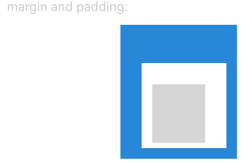
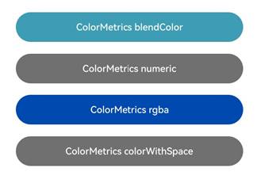

# Graphics
<!--Kit: ArkUI-->
<!--Subsystem: ArkUI-->
<!--Owner: @xiang-shouxing-->
<!--Designer: @xiang-shouxing-->
<!--Tester: @sally__-->
<!--Adviser: @Brilliantry_Rui-->

The **Graphics** module provides APIs for defining attributes of a custom node.

> **NOTE**
>
> The initial APIs of this module are supported since API version 11. Newly added APIs will be marked with a superscript to indicate their earliest API version.

## Modules to Import

```ts
import { DrawContext, Size, Offset, Position, Pivot, Scale, Translation, Matrix4, Rotation, Frame, LengthMetricsUnit } from "@kit.ArkUI";
```

## Size

Returns the width and height of the component. The default unit is vp, but APIs that use the Size type may specify a different unit, in which case the unit specified by the API takes precedence.

**Atomic service API**: This API can be used in atomic services since API version 12.

**System capability**: SystemCapability.ArkUI.ArkUI.Full

| Name  | Type  | Read-Only| Optional| Description                  |
| ------ | ------ | ---- | ---- | ---------------------- |
| width  | number | No  | No  | Width of the component.<br>Unit: vp.<br>Value range: [0, +∞).|
| height | number | No  | No  | Height of the component.<br>Unit: vp.<br>Value range: [0, +∞).|

## Position

type Position = Vector2

Sets or returns the position of the component.

**Atomic service API**: This API can be used in atomic services since API version 12.

**System capability**: SystemCapability.ArkUI.ArkUI.Full

| Type               | Description                               |
| ------------------- | ----------------------------------- |
| [Vector2](#vector2) | A vector that contains two values: x and y.<br>Unit: vp.|

## PositionT<sup>12+</sup>

type PositionT\<T> = Vector2T\<T>

Sets or returns the position of the component.

**Atomic service API**: This API can be used in atomic services since API version 12.

**System capability**: SystemCapability.ArkUI.ArkUI.Full

| Type                        | Description                               |
| ---------------------------- | ----------------------------------- |
| [Vector2T\<T>](#vector2tt12) | A vector that contains two values: x and y.<br>Unit: vp.|

## Frame

Sets or returns the layout size and position of the component.

**Atomic service API**: This API can be used in atomic services since API version 12.

**System capability**: SystemCapability.ArkUI.ArkUI.Full

| Name  | Type  | Read-Only| Optional| Description                       |
| ------ | ------ | ---- | ---- | --------------------------- |
| x      | number | No  | No  | Horizontal position.<br>Unit: vp.<br>Value range: (-∞, +∞).|
| y      | number | No  | No  | Vertical position.<br>Unit: vp.<br>Value range: (-∞, +∞).|
| width  | number | No  | No  | Component width.<br>Unit: vp.<br>Value range: [0, +∞).  |
| height | number | No  | No  | Component height.<br>Unit: vp.<br>Value range: [0, +∞).  |

## Pivot

type Pivot = Vector2

Sets the pivot of the component. As the rotation or scaling center of the component, the pivot affects the rotation and scaling effects.

**Atomic service API**: This API can be used in atomic services since API version 12.

**System capability**: SystemCapability.ArkUI.ArkUI.Full

| Type               | Description                                                        |
| ------------------- | ------------------------------------------------------------ |
| [Vector2](#vector2) | X and Y coordinates of the pivot. The value is a floating point number in the range [0.0, 1.0], and the default value is **0.5**.|

## Scale

type Scale = Vector2

Sets the scale factor of the component.

**Atomic service API**: This API can be used in atomic services since API version 12.

**System capability**: SystemCapability.ArkUI.ArkUI.Full

| Type               | Description                                           |
| ------------------- | ----------------------------------------------- |
| [Vector2](#vector2) | Scale factor along the x- and y-axis. The value is a floating point number, and the default value is **1.0**.|

## Translation

type Translation = Vector2

Sets the translation amount of the component.

**Atomic service API**: This API can be used in atomic services since API version 12.

**System capability**: SystemCapability.ArkUI.ArkUI.Full

| Type               | Description                         |
| ------------------- | ----------------------------- |
| [Vector2](#vector2) | Translation amount along the x- and y-axis.<br>Unit: px|

## Rotation

type Rotation = Vector3

Sets the rotation angle of the component.

**Atomic service API**: This API can be used in atomic services since API version 12.

**System capability**: SystemCapability.ArkUI.ArkUI.Full

| Type               | Description                                  |
| ------------------- | -------------------------------------- |
| [Vector3](#vector3) | Rotation angle around the x-, y-, and z-axes.<br>Unit: degree|

## Offset

type Offset = Vector2

Sets the offset of the component or effect.

**Atomic service API**: This API can be used in atomic services since API version 12.

**System capability**: SystemCapability.ArkUI.ArkUI.Full

| Type               | Description                             |
| ------------------- | --------------------------------- |
| [Vector2](#vector2) | Offset along the x- and y-axis.<br>Unit: vp.|

## Matrix4

type Matrix4 = [number,number,number,number,number,number,number,number,number,number,number,number,number,number,number,number]

Sets a 4x4 matrix.

**Atomic service API**: This API can be used in atomic services since API version 12.

**System capability**: SystemCapability.ArkUI.ArkUI.Full

| Type                                                        | Description                                |
| ------------------------------------------------------------ | ------------------------------------ |
| [number,number,number,number,<br>number,number,number,number,<br>number,number,number,number,<br>number,number,number,number] | A 16-element array representing a 4x4 matrix.<br>Value range of each number: (-∞, +∞)|

The **Matrix4** type is used to set transformation information for components. The following is an example:
```ts
const transform: Matrix4 = [
  1, 0, 45, 0,
  0, 1,  0, 0,
  0, 0,  1, 0,
  0, 0,  0, 1
]
```

## Vector2

Defines a vector that contains the x and y coordinate values.

**Atomic service API**: This API can be used in atomic services since API version 12.

**System capability**: SystemCapability.ArkUI.ArkUI.Full

| Name| Type  | Read-Only| Optional| Description             |
| ---- | ------ | ---- | ---- | ----------------- |
| x    | number | No  | No  | X coordinate value of the vector.<br>Value range: (-∞, +∞).|
| y    | number | No  | No  | Y coordinate value of the vector.<br>Value range: (-∞, +∞).|

## Vector3

Represents a vector including three values: x, y, and z.

**Atomic service API**: This API can be used in atomic services since API version 12.

**System capability**: SystemCapability.ArkUI.ArkUI.Full

| Name| Type  | Read-Only| Optional| Description               |
| ---- | ------ | ---- | ---- | ------------------- |
| x    | number | No  | No  | Rotation angle along the x-axis.<br>Value range: (-∞, +∞).|
| y    | number | No  | No  | Rotation angle along the y-axis.<br>Value range: (-∞, +∞).|
| z    | number | No  | No  | Rotation angle along the z-axis.<br>Value range: (-∞, +∞).|

## Vector2T\<T><sup>12+</sup>

Represents a vector of the T type that contains two values: x and y.

**Atomic service API**: This API can be used in atomic services since API version 12.

**System capability**: SystemCapability.ArkUI.ArkUI.Full

| Name| Type  | Read-Only| Optional| Description             |
| ---- | ------ | ---- | ---- | ----------------- |
| x    | T | No | No | X coordinate value of the vector.|
| y    | T | No | No | Y coordinate value of the vector.|

## DrawContext

Graphics drawing context, which provides the canvas width and height required for drawing.

### size

get size(): Size

Obtains the width and height of the canvas.

**Atomic service API**: This API can be used in atomic services since API version 12.

**System capability**: SystemCapability.ArkUI.ArkUI.Full

**Return value**

| Type         | Description            |
| ------------- | ---------------- |
| [Size](#size) | Width and height of the canvas.|

### sizeInPixel<sup>12+</sup>

get sizeInPixel(): Size

Obtains the width and height of the canvas in px.

**Atomic service API**: This API can be used in atomic services since API version 12.

**System capability**: SystemCapability.ArkUI.ArkUI.Full

**Return value**

| Type         | Description            |
| ------------- | ---------------- |
| [Size](#size) | Width and height of the canvas, in px.|

### canvas

get canvas(): drawing.Canvas

Obtains the canvas used for drawing.

**Atomic service API**: This API can be used in atomic services since API version 12.

**System capability**: SystemCapability.ArkUI.ArkUI.Full

**Return value**

| Type         | Description            |
| ------------- | ---------------- |
| [drawing.Canvas](../apis-arkgraphics2d/arkts-apis-graphics-drawing-Canvas.md) | Canvas for drawing.|

**Example**

```ts
import { RenderNode, FrameNode, NodeController, DrawContext } from "@kit.ArkUI";

class MyRenderNode extends RenderNode {
  flag: boolean = false;

  draw(context: DrawContext) {
    const size = context.size;
    const canvas = context.canvas;
    const sizeInPixel = context.sizeInPixel;
  }
}

const renderNode = new MyRenderNode();
renderNode.frame = { x: 0, y: 0, width: 100, height: 100 };
renderNode.backgroundColor = 0xffff0000;

class MyNodeController extends NodeController {
  private rootNode: FrameNode | null = null;

  makeNode(uiContext: UIContext): FrameNode | null {
    this.rootNode = new FrameNode(uiContext);

    const rootRenderNode = this.rootNode.getRenderNode();
    if (rootRenderNode !== null) {
      rootRenderNode.appendChild(renderNode);
    }

    return this.rootNode;
  }
}

@Entry
@Component
struct Index {
  private myNodeController: MyNodeController = new MyNodeController();

  build() {
    Row() {
      NodeContainer(this.myNodeController)
    }
  }
}
```

## Edges\<T><sup>12+</sup>

Describes the edges.

**Atomic service API**: This API can be used in atomic services since API version 12.

**System capability**: SystemCapability.ArkUI.ArkUI.Full

| Name  | Type| Read-Only| Optional| Description            |
| ------ | ---- | ---- | ---- | ---------------- |
| left   | T    | No  | No  | Left edge.|
| top    | T    | No  | No  | Top edge.|
| right  | T    | No  | No  | Right edge.|
| bottom | T    | No  | No  | Bottom edge.|

## LengthUnit<sup>12+</sup>

Enumerates length units.

**Atomic service API**: This API can be used in atomic services since API version 12.

**System capability**: SystemCapability.ArkUI.ArkUI.Full

| Name| Value| Description|
| -------- | -------- | -------- |
| PX | 0 | Length in px.|
| VP | 1 | Length in vp.|
| FP | 2 | Length in fp.|
| PERCENT | 3 | Length in percentage.|
| LPX | 4 | Length in lpx.|

## SizeT\<T><sup>12+</sup>

Sets the width and height attributes.

**Atomic service API**: This API can be used in atomic services since API version 12.

**System capability**: SystemCapability.ArkUI.ArkUI.Full

| Name  | Type| Read-Only| Optional| Description            |
| ------ | ---- | ---- | ---- | ---------------- |
| width   | T    | No  | No  | Width.|
| height    | T    | No  | No  | Height.|

## LengthMetricsUnit<sup>12+</sup>

Enumerates length units.

**Atomic service API**: This API can be used in atomic services since API version 12.

**System capability**: SystemCapability.ArkUI.ArkUI.Full

| Name| Value| Description|
| -------- | -------- | -------- |
| DEFAULT | 0 | Length in vp.|
| PX | 1 | Length in px.|

## LengthMetrics<sup>12+</sup>

Defines the length attribute. When the length unit is PERCENT, the value **1** indicates 100%.

### Attributes

**Atomic service API**: This API can be used in atomic services since API version 12.

**System capability**: SystemCapability.ArkUI.ArkUI.Full

| Name  | Type| Read-Only| Optional| Description            |
| ------------ | ---------------------------------------- | ---- | ---- | ------ |
| value       | number | No  | No  | Value of the length property.  |
| unit | [LengthUnit](#lengthunit12)                                   | No  | No  | Unit of the length property. The default value is VP.|

### constructor<sup>12+</sup>

constructor(value: number, unit?: LengthUnit)

A constructor used to create a **LengthMetrics** instance. If the **unit** parameter is omitted or explicitly set to **undefined**, the default unit VP is used. If it is set to a value that is not of the LengthUnit type, the default value 0 VP is used.

**Atomic service API**: This API can be used in atomic services since API version 12.

**System capability**: SystemCapability.ArkUI.ArkUI.Full

**Parameters**

| Name| Type         | Mandatory| Description        |
| ------ | ------------- | ---- | ------------ |
| value   | number | Yes  | Value of the length property.<br>Value range: [0, +∞).|
| unit   | [LengthUnit](#lengthunit12) | No  | Unit of the length property.|

### px<sup>12+</sup>

static px(value: number): LengthMetrics

Creates a length property in px.

**Atomic service API**: This API can be used in atomic services since API version 12.

**System capability**: SystemCapability.ArkUI.ArkUI.Full

**Parameters**

| Name| Type         | Mandatory| Description        |
| ------ | ------------- | ---- | ------------ |
| value   | number | Yes  | Value of the length property.<br>Value range: (-∞, +∞).|

**Return value**

| Type         | Description            |
| ------------- | ---------------- |
| [LengthMetrics](#lengthmetrics12) | Instance of the **LengthMetrics** class.|

### vp<sup>12+</sup>

static vp(value: number): LengthMetrics

Creates a length property in vp.

**Atomic service API**: This API can be used in atomic services since API version 12.

**System capability**: SystemCapability.ArkUI.ArkUI.Full

**Parameters**

| Name| Type         | Mandatory| Description        |
| ------ | ------------- | ---- | ------------ |
| value   | number | Yes  | Value of the length property.<br>Value range: (-∞, +∞).|

**Return value**

| Type         | Description            |
| ------------- | ---------------- |
| [LengthMetrics](#lengthmetrics12) | Instance of the **LengthMetrics** class.|

### fp<sup>12+</sup>

static fp(value: number): LengthMetrics

Creates a length property in fp.

**Atomic service API**: This API can be used in atomic services since API version 12.

**System capability**: SystemCapability.ArkUI.ArkUI.Full

**Parameters**

| Name| Type         | Mandatory| Description        |
| ------ | ------------- | ---- | ------------ |
| value   | number | Yes  | Value of the length property.<br>Value range: (-∞, +∞).|

**Return value**

| Type         | Description            |
| ------------- | ---------------- |
| [LengthMetrics](#lengthmetrics12) | Instance of the **LengthMetrics** class.|

### percent<sup>12+</sup>

static percent(value: number): LengthMetrics

Creates a length property in percent. The value **1** indicates 100%.

**Atomic service API**: This API can be used in atomic services since API version 12.

**System capability**: SystemCapability.ArkUI.ArkUI.Full

**Parameters**

| Name| Type         | Mandatory| Description        |
| ------ | ------------- | ---- | ------------ |
| value   | number | Yes  | Value of the length property.<br>Value range: [0, 1].|

**Return value**

| Type         | Description            |
| ------------- | ---------------- |
| [LengthMetrics](#lengthmetrics12) | Instance of the **LengthMetrics** class.|

### lpx<sup>12+</sup>

static lpx(value: number): LengthMetrics

Creates a length property in lpx.

**Atomic service API**: This API can be used in atomic services since API version 12.

**System capability**: SystemCapability.ArkUI.ArkUI.Full

**Parameters**

| Name| Type         | Mandatory| Description        |
| ------ | ------------- | ---- | ------------ |
| value   | number | Yes  | Value of the length property.<br>Value range: (-∞, +∞).|

**Return value**

| Type         | Description            |
| ------------- | ---------------- |
| [LengthMetrics](#lengthmetrics12) | Instance of the **LengthMetrics** class.|

### resource<sup>12+</sup>

static resource(value: Resource): LengthMetrics

Represents the length of a resource of the Resource type.

**Atomic service API**: This API can be used in atomic services since API version 12.

**System capability**: SystemCapability.ArkUI.ArkUI.Full

**Parameters**

| Name| Type         | Mandatory| Description        |
| ------ | ------------- | ---- | ------------ |
| value   | Resource | Yes  | Value of the length property.|

**Return value**

| Type         | Description            |
| ------------- | ---------------- |
| [LengthMetrics](#lengthmetrics12) | Instance of the **LengthMetrics** class.|

**Example**

Use LengthMetrics to set the padding and margin attributes of Row.
```ts
import { LengthMetrics, LengthUnit } from '@kit.ArkUI';

@Entry
@Component
struct SizeExample {
  build() {
    Column({ space: 10 }) {
      Text('margin and padding:')
        .fontSize(12)
        .fontColor(0xCCCCCC)
        .width('90%')
      Row() {
        Row() {
          Row()
            .size({ width: '100%', height: '100%' })
            .backgroundColor('#ffd5d5d5')
        }
        .width(80)
        .height(80)
        .padding({
          top: new LengthMetrics(20, LengthUnit.VP),
          bottom: LengthMetrics.px(15),
          start: LengthMetrics.vp(10),
          end: LengthMetrics.fp(20)
        })
        .margin({
          top: LengthMetrics.percent(0.1),
          bottom: LengthMetrics.lpx(20),
          start: LengthMetrics.resource($r('app.float.row_margin_start')),
          end: LengthMetrics.vp(10)
        })
        .backgroundColor(Color.White)
      }
      .backgroundColor("#ff2787d9")
    }
    .width('100%')
    .margin({ top: 5 })
  }
}
```



## ColorMetrics<sup>12+</sup>

Used to mix colors.

**System capability**: SystemCapability.ArkUI.ArkUI.Full

### numeric<sup>12+</sup>

static numeric(value: number): ColorMetrics

Instantiates the **ColorMetrics** class using a color in HEX format.

**Atomic service API**: This API can be used in atomic services since API version 12.

**System capability**: SystemCapability.ArkUI.ArkUI.Full

**Parameters**

| Name| Type         | Mandatory| Description        |
| ------ | ------------- | ---- | ------------ |
| value   | number | Yes  | Color in HEX format.<br>RGB and ARGB color values are supported.|

**Return value**

| Type         | Description            |
| ------------- | ---------------- |
| [ColorMetrics](#colormetrics12) | Instance of the **ColorMetrics** class.|

### rgba<sup>12+</sup>

static rgba(red: number, green: number, blue: number, alpha?: number): ColorMetrics

Instantiates the **ColorMetrics** class using colors in RGB or RGBA format.

**Atomic service API**: This API can be used in atomic services since API version 12.

**System capability**: SystemCapability.ArkUI.ArkUI.Full

**Parameters**

| Name| Type         | Mandatory| Description        |
| ------ | ------------- | ---- | ------------ |
| red   | number | Yes  | Red component of the color. The value is an integer ranging from 0 to 255.|
| green | number | Yes  | Green component of the color. The value is an integer ranging from 0 to 255.|
| blue  | number | Yes  | Blue component of the color. The value is an integer ranging from 0 to 255.|
| alpha | number | No  | Alpha component of the color. The value is a floating point number ranging from 0.0 to 1.0. The default value is **1.0** (fully opaque).<br> Note: If alpha is less than 0, the color is fully transparent. If alpha is greater than 1, the color is opaque.|

**Return value**

| Type         | Description            |
| ------------- | ---------------- |
| [ColorMetrics](#colormetrics12) | Instance of the **ColorMetrics** class.|

### colorWithSpace<sup>20+</sup>

static colorWithSpace(colorSpace: ColorSpace, red: number, green: number, blue: number, alpha?: number): ColorMetrics

Creates a **ColorMetrics** instance using specified [ColorSpace](./arkui-ts/ts-appendix-enums.md#colorspace20) and RGBA values. Only certain attributes support color configuration in the display-p3 color space.

**Atomic service API**: This API can be used in atomic services since API version 20.

**System capability**: SystemCapability.ArkUI.ArkUI.Full

**Parameters**

| Name| Type         | Mandatory| Description        |
| ------ | ------------- | ---- | ------------ |
| colorSpace   | [ColorSpace](./arkui-ts/ts-appendix-enums.md#colorspace20) | Yes  | Color space used to specify the color. If ColorSpace.DISPLAY_P3 is used, the [setWindowColorSpace](./arkts-apis-window-Window.md#setwindowcolorspace9-1) API must be called to set the current window to the wide color gamut mode.|
| red   | number | Yes  | Red component of the color. The value is a floating point number ranging from 0 to 1.|
| green | number | Yes  | Green component of the color. The value is a floating point number ranging from 0 to 1.|
| blue  | number | Yes  | Blue component of the color. The value is a floating point number ranging from 0 to 1.|
| alpha | number | No  | Alpha component of the color. The value is a floating point number ranging from 0.0 to 1.0. The default value is **1.0** (fully opaque).|

**Return value**

| Type         | Description            |
| ------------- | ---------------- |
| [ColorMetrics](#colormetrics12) | Instance of the **ColorMetrics** class.|

### resourceColor<sup>12+</sup>

static resourceColor(color: ResourceColor): ColorMetrics

Instantiates the **ColorMetrics** class using a color in resource reference format.

**Atomic service API**: This API can be used in atomic services since API version 12.

**System capability**: SystemCapability.ArkUI.ArkUI.Full

**Parameters**

| Name| Type         | Mandatory| Description        |
| ------ | ------------- | ---- | ------------ |
| color | [ResourceColor](arkui-ts/ts-types.md#resourcecolor) | Yes| Color in resource reference format.|

**Return value**

| Type         | Description            |
| ------------- | ---------------- |
| [ColorMetrics](#colormetrics12) | Instance of the **ColorMetrics** class.|

**Error codes**

For details about the error codes, see [Universal Error Codes](../errorcode-universal.md) and [System Resource Error Codes](errorcode-system-resource.md).

| ID| Error Message|
| -------- | ---------------------------------------- |
| 401   | Parameter error. Possible cause:1.The type of the input color parameter is not ResourceColor;2.The format of the input color string is not RGB or RGBA.             |
| 180003   | Failed to obtain the color resource.         |

### blendColor<sup>12+</sup>

blendColor(overlayColor: ColorMetrics): ColorMetrics

Blends a specified color (**overlayColor**) with the current color and returns the resulting color.

**Atomic service API**: This API can be used in atomic services since API version 12.

**System capability**: SystemCapability.ArkUI.ArkUI.Full

**Parameters**

| Name| Type         | Mandatory| Description        |
| ------ | ------------- | ---- | ------------ |
| overlayColor | [ColorMetrics](#colormetrics12) | Yes| Color to overlay. The alpha value determines the blending strength: **1.0** indicates complete opacity (fully covers the base color), and **0.0** indicates complete transparency (returns the original color).|

**Return value**

| Type         | Description            |
| ------------- | ---------------- |
| [ColorMetrics](#colormetrics12) |  New color object with red, green, blue, and alpha channels representing the blended result of the current color and overlay color.|

**Blending formula**:

The resulting alpha is fully opaque. The RGB values are calculated using the following formula:

result_rgb = overlay_rgb*(overlay_alpha) + (1 - overlay_alpha) * base_rgb

**Error codes**

For details about the error codes, see [Universal Error Codes](../errorcode-universal.md).

| ID| Error Message|
| -------- | ---------------------------------------- |
| 401   | Parameter error. The type of the input parameter is not ColorMetrics.                |

### color<sup>12+</sup>

get color(): string

Obtains the color of **ColorMetrics**. The return value is a string indicating an RGBA color value.

**Atomic service API**: This API can be used in atomic services since API version 12.

**System capability**: SystemCapability.ArkUI.ArkUI.Full

**Return value**

| Type         | Description            |
| ------------- | ---------------- |
| string | String indicating an RGBA color value. Example: **'rgba(255, 100, 255, 0.5)'**|

### red<sup>12+</sup>

get red(): number

Obtains the red component of the ColorMetrics color.

**Atomic service API**: This API can be used in atomic services since API version 12.

**System capability**: SystemCapability.ArkUI.ArkUI.Full

**Return value**

| Type         | Description            |
| ------------- | ---------------- |
| number | Red component of the color. The value is an integer ranging from 0 to 255.|

### green<sup>12+</sup>

get green(): number

Obtains the green component of the ColorMetrics color.

**Atomic service API**: This API can be used in atomic services since API version 12.

**System capability**: SystemCapability.ArkUI.ArkUI.Full

**Return value**

| Type         | Description            |
| ------------- | ---------------- |
| number | Green component of the color. The value is an integer ranging from 0 to 255.|

### blue<sup>12+</sup>

get blue(): number

Obtains the blue component of the ColorMetrics color.

**Atomic service API**: This API can be used in atomic services since API version 12.

**System capability**: SystemCapability.ArkUI.ArkUI.Full

**Return value**

| Type         | Description            |
| ------------- | ---------------- |
| number | Blue component of the color. The value is an integer ranging from 0 to 255.|

### alpha<sup>12+</sup>

get alpha(): number

Obtains the alpha component of the ColorMetrics color.

**Atomic service API**: This API can be used in atomic services since API version 12.

**System capability**: SystemCapability.ArkUI.ArkUI.Full

**Return value**

| Type         | Description            |
| ------------- | ---------------- |
| number | Alpha component of the color. The value is an integer ranging from 0 to 255.|

**Example**

```ts
import { ColorMetrics } from '@kit.ArkUI';
import { BusinessError } from '@kit.BasicServicesKit';

function getBlendColor(baseColor: ResourceColor): ColorMetrics {
  let sourceColor: ColorMetrics;
  try {
    // When resourceColor and blendColor of ColorMetrics are used, add exception handling.
    // Error codes 401 and 180003 of the ArkUI subsystem may be returned.
    // 61 157 180
    sourceColor = ColorMetrics.resourceColor(baseColor).blendColor(ColorMetrics.resourceColor("#083d9db4"));
    console.info('current color is '+sourceColor.color+ ' r:'+sourceColor.red +' g:'+sourceColor.green+' b:'+sourceColor.blue+ ' a :'+sourceColor.alpha );
  } catch (error) {
    console.error("getBlendColor failed, code = " + (error as BusinessError).code + ", message = " +
    (error as BusinessError).message);
    sourceColor = ColorMetrics.resourceColor("#19000000");
  }
  return sourceColor;
}

@Entry
@Component
struct ColorMetricsSample {
  build() {
    Flex({ direction: FlexDirection.Column, alignItems: ItemAlign.Center, justifyContent: FlexAlign.Center }) {
      Button("ColorMetrics blendColor")
        .width('80%')
        .align(Alignment.Center)
        .height(50)
        .backgroundColor(getBlendColor("#ff3d9db4").color)
        .margin(10)
      Button("ColorMetrics numeric")
        .width('80%')
        .align(Alignment.Center)
        .height(50)
        .backgroundColor(ColorMetrics.numeric(0xff707070).color)
        .margin(10)
      Button("ColorMetrics rgba")
        .width('80%')
        .align(Alignment.Center)
        .height(50)
        .backgroundColor(ColorMetrics.rgba(0,74,175,255).color)
        .margin(10)
      Button("ColorMetrics colorWithSpace")
        .width('80%')
        .align(Alignment.Center)
        .height(50)
        .backgroundColor(ColorMetrics.colorWithSpace(ColorSpace.SRGB,  0.4392, 0.4392, 0.4392).color)
        .margin(10)
    }
    .width('100%')
    .height('100%')
  }
}
```


## Corners\<T><sup>12+</sup>

Describes the four corners.

**Atomic service API**: This API can be used in atomic services since API version 12.

**System capability**: SystemCapability.ArkUI.ArkUI.Full

| Name       | Type| Read-Only| Optional| Description                  |
| ----------- | ---- | ---- | ---- | ---------------------- |
| topLeft     | T    | No  | No  | Radius of the upper left corner.  |
| topRight    | T    | No  | No  | Radius of the upper right corner.|
| bottomLeft  | T    | No  | No  | Radius of the lower left corner.  |
| bottomRight | T    | No  | No  | Radius of the lower right corner.  |

## CornerRadius<sup>12+</sup>

type CornerRadius = Corners\<Vector2>

Sets the semi-axis lengths for the x-axis and y-axis of the rounded corners.

**Atomic service API**: This API can be used in atomic services since API version 12.

**System capability**: SystemCapability.ArkUI.ArkUI.Full

| Type                                        | Description              |
| -------------------------------------------- | ------------------ |
| [Corners](#cornerst12)[\<Vector2>](#vector2) | Semi-axis lengths for the x-axis and y-axis of the rounded corners.|

## BorderRadiuses<sup>12+</sup>

type BorderRadiuses = Corners\<number>

Sets the uniform radius of the four corners.

**Atomic service API**: This API can be used in atomic services since API version 12.

**System capability**: SystemCapability.ArkUI.ArkUI.Full

| Type                           | Description              |
| ------------------------------- | ------------------ |
| [Corners\<number>](#cornerst12) | Uniform radius of the four corners.|

## Rect<sup>12+</sup>

type Rect = common2D.Rect

Describes a rectangle.

**Atomic service API**: This API can be used in atomic services since API version 12.

**System capability**: SystemCapability.ArkUI.ArkUI.Full

| Type                                                        | Description      |
| ------------------------------------------------------------ | ---------- |
| [common2D.Rect](../apis-arkgraphics2d/js-apis-graphics-common2D.md#rect) | Rectangle.|

## RoundRect<sup>12+</sup>

Describes a rectangle with rounded corners.

**Atomic service API**: This API can be used in atomic services since API version 12.

**System capability**: SystemCapability.ArkUI.ArkUI.Full

| Name   | Type                         | Read-Only| Optional| Description            |
| ------- | ----------------------------- | ---- | ---- | ---------------- |
| rect    | [Rect](#rect12)                 | No  | No  | Attributes of the rectangle.|
| corners | [CornerRadius](#cornerradius12) | No  | No  | Attributes of rounded corners.|

## Circle<sup>12+</sup>

Describes a circle.

**Atomic service API**: This API can be used in atomic services since API version 12.

**System capability**: SystemCapability.ArkUI.ArkUI.Full

| Name   | Type  | Read-Only| Optional| Description                     |
| ------- | ------ | ---- | ---- | ------------------------- |
| centerX | number | No  | No  | X-coordinate of the center of the circle, in px.|
| centerY | number | No  | No  | Y-coordinate of the center of the circle, in px.|
| radius  | number | No  | No  | Radius of the circle, in px.<br> Value range: [0, +∞).  |

## CommandPath<sup>12+</sup>

Describes the command for drawing a path.

**Atomic service API**: This API can be used in atomic services since API version 12.

**System capability**: SystemCapability.ArkUI.ArkUI.Full

| Name                                                        | Type  | Read-Only| Optional| Description                                                        |
| ------------------------------------------------------------ | ------ | ---- | ---- | ------------------------------------------------------------ |
| [commands](./arkui-ts/ts-drawing-components-path.md#commands) | string | No  | No  | Commands for drawing a path. For details about how to convert pixel units, see [Pixel Units](./arkui-ts/ts-pixel-units.md).<br>Unit: px|

## ShapeMask<sup>12+</sup>

Describes the shape mask.

### Attributes

**Atomic service API**: This API can be used in atomic services since API version 12.

**System capability**: SystemCapability.ArkUI.ArkUI.Full

| Name           | Type   | Read-Only| Optional| Description                                               |
| --------------- | ------ | ---- | ---- | -------------------------------------------------- |
| fillColor       | number | No  | No  | Describes the fill color of the mask, in ARGB format. The default value is **0XFF000000**.<br> A color with only the transparency is generated based on the transparency and brightness of **fillColor**. The higher the brightness, the more transparent the color. Then, the color is blended with the color of **RednerNode** using the [BlendMode.SRC_IN](../apis-arkgraphics2d/arkts-apis-graphics-drawing-e.md#blendmode) API to generate the final color.|
| strokeColor     | number | No  | No  | Sets the stroke color for the mask, in ARGB format. The default value is **0XFF000000**.<br>  A color with only the transparency is generated based on the transparency and brightness of **strokeColor**. The higher the brightness, the more transparent the color. Then, the color is blended with the color of **RednerNode** using the [BlendMode.SRC_IN](../apis-arkgraphics2d/arkts-apis-graphics-drawing-e.md#blendmode) API to generate the final color.|
| strokeWidth     | number | No  | No  | Sets the stroke width for the mask, in px. The default value is **0**.  |

### constructor<sup>12+</sup>

constructor()

A constructor used to create a **ShapeMask** instance.

**Atomic service API**: This API can be used in atomic services since API version 12.

**System capability**: SystemCapability.ArkUI.ArkUI.Full

### setRectShape<sup>12+</sup>

setRectShape(rect: Rect): void

Sets a rectangle mask.

**Atomic service API**: This API can be used in atomic services since API version 12.

**System capability**: SystemCapability.ArkUI.ArkUI.Full

**Parameters**

| Name| Type         | Mandatory| Description        |
| ------ | ------------- | ---- | ------------ |
| rect   | [Rect](#rect12) | Yes  | Shape of the rectangle.|

**Example**

```ts
import { RenderNode, FrameNode, NodeController, ShapeMask } from '@kit.ArkUI';

class MyNodeController extends NodeController {
  private rootNode: FrameNode | null = null;

  makeNode(uiContext: UIContext): FrameNode | null {
    this.rootNode = new FrameNode(uiContext);

    const mask = new ShapeMask();
    mask.setRectShape({ left: 0, right: uiContext.vp2px(150), top: 0, bottom: uiContext.vp2px(150) });
    mask.fillColor = 0X55FF0000;

    const renderNode = new RenderNode();
    renderNode.frame = { x: 0, y: 0, width: 150, height: 150 };
    renderNode.backgroundColor = 0XFF00FF00;
    renderNode.shapeMask = mask;

    const rootRenderNode = this.rootNode.getRenderNode();
    if (rootRenderNode !== null) {
      rootRenderNode.appendChild(renderNode);
    }

    return this.rootNode;
  }
}

@Entry
@Component
struct Index {
  private myNodeController: MyNodeController = new MyNodeController();

  build() {
    Row() {
      NodeContainer(this.myNodeController)
    }
  }
}
```

### setRoundRectShape<sup>12+</sup>

setRoundRectShape(roundRect: RoundRect): void

Sets the mask in the shape of a rectangle with rounded corners.

**Atomic service API**: This API can be used in atomic services since API version 12.

**System capability**: SystemCapability.ArkUI.ArkUI.Full

**Parameters**

| Name   | Type                   | Mandatory| Description            |
| --------- | ----------------------- | ---- | ---------------- |
| roundRect | [RoundRect](#roundrect12) | Yes  | Shape of the rectangle with rounded corners.|

**Example**

```ts
import { RenderNode, FrameNode, NodeController, ShapeMask,RoundRect} from '@kit.ArkUI';

class MyNodeController extends NodeController {
  private rootNode: FrameNode | null = null;

  makeNode(uiContext: UIContext): FrameNode | null {
    this.rootNode = new FrameNode(uiContext);

    const mask = new ShapeMask();
    const roundRect: RoundRect = {
      rect: { left: 0, top: 0, right: uiContext.vp2px(150), bottom: uiContext.vp2px(150) },
      corners: {
        topLeft: { x: 32, y: 32 },
        topRight: { x: 32, y: 32 },
        bottomLeft: { x: 32, y: 32 },
        bottomRight: { x: 32, y: 32 }
      }
    }
    mask.setRoundRectShape(roundRect);
    mask.fillColor = 0X55FF0000;

    const renderNode = new RenderNode();
    renderNode.frame = { x: 0, y: 0, width: 150, height: 150 };
    renderNode.backgroundColor = 0XFF00FF00;
    renderNode.shapeMask = mask;

    const rootRenderNode = this.rootNode.getRenderNode();
    if (rootRenderNode !== null) {
      rootRenderNode.appendChild(renderNode);
    }

    return this.rootNode;
  }
}

@Entry
@Component
struct Index {
  private myNodeController: MyNodeController = new MyNodeController();

  build() {
    Row() {
      NodeContainer(this.myNodeController)
    }
  }
}
```

### setCircleShape<sup>12+</sup>

setCircleShape(circle: Circle): void

Sets a round mask.

**Atomic service API**: This API can be used in atomic services since API version 12.

**System capability**: SystemCapability.ArkUI.ArkUI.Full

**Parameters**

| Name| Type             | Mandatory| Description        |
| ------ | ----------------- | ---- | ------------ |
| circle | [Circle](#circle12) | Yes  | Round shape.|

**Example**

```ts
import { RenderNode, FrameNode, NodeController, ShapeMask } from '@kit.ArkUI';

class MyNodeController extends NodeController {
  private rootNode: FrameNode | null = null;

  makeNode(uiContext: UIContext): FrameNode | null {
    this.rootNode = new FrameNode(uiContext);

    const mask = new ShapeMask();
    mask.setCircleShape({ centerY: uiContext.vp2px(75), centerX: uiContext.vp2px(75), radius: uiContext.vp2px(75) });
    mask.fillColor = 0X55FF0000;

    const renderNode = new RenderNode();
    renderNode.frame = { x: 0, y: 0, width: 150, height: 150 };
    renderNode.backgroundColor = 0XFF00FF00;
    renderNode.shapeMask = mask;

    const rootRenderNode = this.rootNode.getRenderNode();
    if (rootRenderNode !== null) {
      rootRenderNode.appendChild(renderNode);
    }

    return this.rootNode;
  }
}

@Entry
@Component
struct Index {
  private myNodeController: MyNodeController = new MyNodeController();

  build() {
    Row() {
      NodeContainer(this.myNodeController)
    }
  }
}
```

### setOvalShape<sup>12+</sup>

setOvalShape(oval: Rect): void

Sets an oval mask.

**Atomic service API**: This API can be used in atomic services since API version 12.

**System capability**: SystemCapability.ArkUI.ArkUI.Full

**Parameters**

| Name| Type         | Mandatory| Description          |
| ------ | ------------- | ---- | -------------- |
| oval   | [Rect](#rect12) | Yes  | Oval shape.|

**Example**

```ts
import { RenderNode, FrameNode, NodeController, ShapeMask } from '@kit.ArkUI';

class MyNodeController extends NodeController {
  private rootNode: FrameNode | null = null;

  makeNode(uiContext: UIContext): FrameNode | null {
    this.rootNode = new FrameNode(uiContext);

    const mask = new ShapeMask();
    mask.setOvalShape({ left: 0, right: uiContext.vp2px(150), top: 0, bottom: uiContext.vp2px(100) });
    mask.fillColor = 0X55FF0000;

    const renderNode = new RenderNode();
    renderNode.frame = { x: 0, y: 0, width: 150, height: 150 };
    renderNode.backgroundColor = 0XFF00FF00;
    renderNode.shapeMask = mask;

    const rootRenderNode = this.rootNode.getRenderNode();
    if (rootRenderNode !== null) {
      rootRenderNode.appendChild(renderNode);
    }

    return this.rootNode;
  }
}

@Entry
@Component
struct Index {
  private myNodeController: MyNodeController = new MyNodeController();

  build() {
    Row() {
      NodeContainer(this.myNodeController)
    }
  }
}
```

### setCommandPath<sup>12+</sup>

setCommandPath(path: CommandPath): void

Sets the command for drawing a path.

**Atomic service API**: This API can be used in atomic services since API version 12.

**System capability**: SystemCapability.ArkUI.ArkUI.Full

**Parameters**

| Name| Type                       | Mandatory| Description          |
| ------ | --------------------------- | ---- | -------------- |
| path   | [CommandPath](#commandpath12) | Yes  | Command for drawing a path.|

**Example**

```ts
import { RenderNode, FrameNode, NodeController, ShapeMask } from '@kit.ArkUI';

const mask = new ShapeMask();
mask.setCommandPath({ commands: "M100 0 L0 100 L50 200 L150 200 L200 100 Z" });
mask.fillColor = 0X55FF0000;

const renderNode = new RenderNode();
renderNode.frame = { x: 0, y: 0, width: 150, height: 150 };
renderNode.backgroundColor = 0XFF00FF00;
renderNode.shapeMask = mask;


class MyNodeController extends NodeController {
  private rootNode: FrameNode | null = null;

  makeNode(uiContext: UIContext): FrameNode | null {
    this.rootNode = new FrameNode(uiContext);

    const rootRenderNode = this.rootNode.getRenderNode();
    if (rootRenderNode !== null) {
      rootRenderNode.appendChild(renderNode);
    }

    return this.rootNode;
  }
}

@Entry
@Component
struct Index {
  private myNodeController: MyNodeController = new MyNodeController();

  build() {
    Row() {
      NodeContainer(this.myNodeController)
    }
  }
}
```

## ShapeClip<sup>12+</sup>

Sets the clipping shape.

### constructor<sup>12+</sup>

constructor()

A constructor used to create a **ShapeClip** object.

**System capability**: SystemCapability.ArkUI.ArkUI.Full

**Atomic service API**: This API can be used in atomic services since API version 12.

### setRectShape<sup>12+</sup>

setRectShape(rect: Rect): void

Sets a rectangle for shape clipping.

**System capability**: SystemCapability.ArkUI.ArkUI.Full

**Atomic service API**: This API can be used in atomic services since API version 12.

**Parameters**

| Name| Type         | Mandatory| Description        |
| ------ | ------------- | ---- | ------------ |
| rect   | [Rect](#rect12) | Yes  | Shape of the rectangle.|

**Example**

```ts
import { RenderNode, FrameNode, NodeController, ShapeClip } from '@kit.ArkUI';

const clip = new ShapeClip();
clip.setCommandPath({ commands: "M100 0 L0 100 L50 200 L150 200 L200 100 Z" });

const renderNode = new RenderNode();
renderNode.frame = {
  x: 0,
  y: 0,
  width: 150,
  height: 150
};
renderNode.backgroundColor = 0XFF00FF00;
renderNode.shapeClip = clip;
const shapeClip = renderNode.shapeClip;

class MyNodeController extends NodeController {
  private rootNode: FrameNode | null = null;

  makeNode(uiContext: UIContext): FrameNode | null {
    this.rootNode = new FrameNode(uiContext);

    const rootRenderNode = this.rootNode.getRenderNode();
    if (rootRenderNode !== null) {
      rootRenderNode.appendChild(renderNode);
    }

    return this.rootNode;
  }
}

@Entry
@Component
struct Index {
  private myNodeController: MyNodeController = new MyNodeController();

  build() {
    Column() {
      NodeContainer(this.myNodeController)
        .borderWidth(1)
      Button("setRectShape")
        .onClick(() => {
          shapeClip.setRectShape({
            left: 0,
            right: 150,
            top: 0,
            bottom: 150
          });
          renderNode.shapeClip = shapeClip;
        })
    }
  }
}
```

### setRoundRectShape<sup>12+</sup>

setRoundRectShape(roundRect: RoundRect): void

Sets a rounded rectangle for shape clipping.

**System capability**: SystemCapability.ArkUI.ArkUI.Full

**Atomic service API**: This API can be used in atomic services since API version 12.

**Parameters**

| Name   | Type                   | Mandatory| Description            |
| --------- | ----------------------- | ---- | ---------------- |
| roundRect | [RoundRect](#roundrect12) | Yes  | Shape of the rectangle with rounded corners.|

**Example**
```ts
import { RenderNode, FrameNode, NodeController, ShapeClip } from '@kit.ArkUI';

const clip = new ShapeClip();
clip.setCommandPath({ commands: "M100 0 L0 100 L50 200 L150 200 L200 100 Z" });

const renderNode = new RenderNode();
renderNode.frame = {
  x: 0,
  y: 0,
  width: 150,
  height: 150
};
renderNode.backgroundColor = 0XFF00FF00;
renderNode.shapeClip = clip;

class MyNodeController extends NodeController {
  private rootNode: FrameNode | null = null;

  makeNode(uiContext: UIContext): FrameNode | null {
    this.rootNode = new FrameNode(uiContext);

    const rootRenderNode = this.rootNode.getRenderNode();
    if (rootRenderNode !== null) {
      rootRenderNode.appendChild(renderNode);
    }

    return this.rootNode;
  }
}

@Entry
@Component
struct Index {
  private myNodeController: MyNodeController = new MyNodeController();

  build() {
    Column() {
      NodeContainer(this.myNodeController)
        .borderWidth(1)
      Button("setRoundRectShape")
        .onClick(() => {
          renderNode.shapeClip.setRoundRectShape({
            rect: {
              left: 0,
              top: 0,
              right: this.getUIContext().vp2px(150),
              bottom: this.getUIContext().vp2px(150)
            },
            corners: {
              topLeft: { x: 32, y: 32 },
              topRight: { x: 32, y: 32 },
              bottomLeft: { x: 32, y: 32 },
              bottomRight: { x: 32, y: 32 }
            }
          });
        })
    }
  }
}
```

### setCircleShape<sup>12+</sup>

setCircleShape(circle: Circle): void

Sets a circle for shape clipping.

**System capability**: SystemCapability.ArkUI.ArkUI.Full

**Atomic service API**: This API can be used in atomic services since API version 12.

**Parameters**

| Name| Type             | Mandatory| Description        |
| ------ | ----------------- | ---- | ------------ |
| circle | [Circle](#circle12) | Yes  | Round shape.|

**Example**

```ts
import { RenderNode, FrameNode, NodeController, ShapeClip } from '@kit.ArkUI';

const clip = new ShapeClip();
clip.setCommandPath({ commands: "M100 0 L0 100 L50 200 L150 200 L200 100 Z" });

const renderNode = new RenderNode();
renderNode.frame = {
  x: 0,
  y: 0,
  width: 150,
  height: 150
};
renderNode.backgroundColor = 0XFF00FF00;
renderNode.shapeClip = clip;

class MyNodeController extends NodeController {
  private rootNode: FrameNode | null = null;

  makeNode(uiContext: UIContext): FrameNode | null {
    this.rootNode = new FrameNode(uiContext);

    const rootRenderNode = this.rootNode.getRenderNode();
    if (rootRenderNode !== null) {
      rootRenderNode.appendChild(renderNode);
    }

    return this.rootNode;
  }
}

@Entry
@Component
struct Index {
  private myNodeController: MyNodeController = new MyNodeController();

  build() {
    Column() {
      NodeContainer(this.myNodeController)
        .borderWidth(1)
      Button("setCircleShape")
        .onClick(() => {
          renderNode.shapeClip.setCircleShape({ centerY: 75, centerX: 75, radius: 75 });

        })
    }
  }
}
```

### setOvalShape<sup>12+</sup>

setOvalShape(oval: Rect): void

Sets an oval shape for shape clipping.

**System capability**: SystemCapability.ArkUI.ArkUI.Full

**Atomic service API**: This API can be used in atomic services since API version 12.

**Parameters**

| Name| Type         | Mandatory| Description          |
| ------ | ------------- | ---- | -------------- |
| oval   | [Rect](#rect12) | Yes  | Oval shape.|

**Example**

```ts
import { RenderNode, FrameNode, NodeController, ShapeClip } from '@kit.ArkUI';

const clip = new ShapeClip();
clip.setCommandPath({ commands: "M100 0 L0 100 L50 200 L150 200 L200 100 Z" });

const renderNode = new RenderNode();
renderNode.frame = {
  x: 0,
  y: 0,
  width: 150,
  height: 150
};
renderNode.backgroundColor = 0XFF00FF00;
renderNode.shapeClip = clip;

class MyNodeController extends NodeController {
  private rootNode: FrameNode | null = null;

  makeNode(uiContext: UIContext): FrameNode | null {
    this.rootNode = new FrameNode(uiContext);

    const rootRenderNode = this.rootNode.getRenderNode();
    if (rootRenderNode !== null) {
      rootRenderNode.appendChild(renderNode);
    }

    return this.rootNode;
  }
}

@Entry
@Component
struct Index {
  private myNodeController: MyNodeController = new MyNodeController();

  build() {
    Column() {
      NodeContainer(this.myNodeController)
        .borderWidth(1)
      Button("setOvalShape")
        .onClick(() => {
          renderNode.shapeClip.setOvalShape({
            left: 0,
            right: this.getUIContext().vp2px(150),
            top: 0,
            bottom: this.getUIContext().vp2px(100)
          });
        })
    }
  }
}
```

### setCommandPath<sup>12+</sup>

setCommandPath(path: CommandPath): void

Sets the command for drawing a path.

**System capability**: SystemCapability.ArkUI.ArkUI.Full

**Atomic service API**: This API can be used in atomic services since API version 12.

**Parameters**

| Name| Type                       | Mandatory| Description          |
| ------ | --------------------------- | ---- | -------------- |
| path   | [CommandPath](#commandpath12) | Yes  | Command for drawing a path.|

**Example**

```ts
import { RenderNode, FrameNode, NodeController, ShapeClip } from '@kit.ArkUI';

const clip = new ShapeClip();
clip.setCommandPath({ commands: "M100 0 L0 100 L50 200 L150 200 L200 100 Z" });

const renderNode = new RenderNode();
renderNode.frame = { x: 0, y: 0, width: 150, height: 150 };
renderNode.backgroundColor = 0XFF00FF00;
renderNode.shapeClip = clip;

class MyNodeController extends NodeController {
  private rootNode: FrameNode | null = null;

  makeNode(uiContext: UIContext): FrameNode | null {
    this.rootNode = new FrameNode(uiContext);

    const rootRenderNode = this.rootNode.getRenderNode();
    if (rootRenderNode !== null) {
      rootRenderNode.appendChild(renderNode);
    }

    return this.rootNode;
  }
}

@Entry
@Component
struct Index {
  private myNodeController: MyNodeController = new MyNodeController();

  build() {
    Column() {
      NodeContainer(this.myNodeController)
        .borderWidth(1)
      Button("setCommandPath")
        .onClick(()=>{
          renderNode.shapeClip.setCommandPath({ commands: "M100 0 L0 100 L50 200 L150 200 L200 100 Z" });
        })
    }
  }
}
```

## edgeColors<sup>12+</sup>

edgeColors(all: number): Edges\<number>

Generates an **edgeColors** object with the specified edge color for all edges.

**Atomic service API**: This API can be used in atomic services since API version 12.

**System capability**: SystemCapability.ArkUI.ArkUI.Full

**Parameters**

| Name| Type  | Mandatory| Description                |
| ------ | ------ | ---- | -------------------- |
| all    | number | Yes  | Edge color, in ARGB format, for example, **0xffff00ff**.<br>Value range: [0, 0xffffffff]|

**Return value**

| Type                    | Description                                  |
| ------------------------ | -------------------------------------- |
| [Edges\<number>](#edgest12) | **edgeColors** object whose edge colors are all at the specified value.|

**Example**

```ts
import { RenderNode, FrameNode, NodeController, edgeColors } from '@kit.ArkUI';

const renderNode = new RenderNode();
renderNode.frame = { x: 0, y: 0, width: 150, height: 150 };
renderNode.backgroundColor = 0XFF00FF00;
renderNode.borderWidth = { left: 8, top: 8, right: 8, bottom: 8 };
renderNode.borderColor = edgeColors(0xFF0000FF);


class MyNodeController extends NodeController {
  private rootNode: FrameNode | null = null;

  makeNode(uiContext: UIContext): FrameNode | null {
    this.rootNode = new FrameNode(uiContext);

    const rootRenderNode = this.rootNode.getRenderNode();
    if (rootRenderNode !== null) {
      rootRenderNode.appendChild(renderNode);
    }

    return this.rootNode;
  }
}

@Entry
@Component
struct Index {
  private myNodeController: MyNodeController = new MyNodeController();

  build() {
    Row() {
      NodeContainer(this.myNodeController)
    }
  }
}
```

## edgeWidths<sup>12+</sup>

edgeWidths(all: number): Edges\<number>

Generates an **edgeWidths** object with the specified edge width for all edges.

**Atomic service API**: This API can be used in atomic services since API version 12.

**System capability**: SystemCapability.ArkUI.ArkUI.Full

**Parameters**

| Name| Type  | Mandatory| Description                |
| ------ | ------ | ---- | -------------------- |
| all    | number | Yes  | Edge width, in vp.<br>Value range: [0, +∞).|

**Return value**

| Type                    | Description                                  |
| ------------------------ | -------------------------------------- |
| [Edges\<number>](#edgest12) | **edgeWidths** object whose edge widths are all at the specified value.|

**Example**

```ts
import { RenderNode, FrameNode, NodeController, edgeWidths } from '@kit.ArkUI';

const renderNode = new RenderNode();
renderNode.frame = { x: 0, y: 0, width: 150, height: 150 };
renderNode.backgroundColor = 0XFF00FF00;
renderNode.borderWidth = edgeWidths(8);
renderNode.borderColor = { left: 0xFF0000FF, top: 0xFF0000FF, right: 0xFF0000FF, bottom: 0xFF0000FF };


class MyNodeController extends NodeController {
  private rootNode: FrameNode | null = null;

  makeNode(uiContext: UIContext): FrameNode | null {
    this.rootNode = new FrameNode(uiContext);

    const rootRenderNode = this.rootNode.getRenderNode();
    if (rootRenderNode !== null) {
      rootRenderNode.appendChild(renderNode);
    }

    return this.rootNode;
  }
}

@Entry
@Component
struct Index {
  private myNodeController: MyNodeController = new MyNodeController();

  build() {
    Row() {
      NodeContainer(this.myNodeController)
    }
  }
}
```

## borderStyles<sup>12+</sup>

borderStyles(all: BorderStyle): Edges\<BorderStyle>

Generates a border style object with the specified border style color for all borders.

**Atomic service API**: This API can be used in atomic services since API version 12.

**System capability**: SystemCapability.ArkUI.ArkUI.Full

**Parameters**

| Name| Type                                                      | Mandatory| Description      |
| ------ | ---------------------------------------------------------- | ---- | ---------- |
| all    | [BorderStyle](./arkui-ts/ts-appendix-enums.md#borderstyle) | Yes  | Border style.|

**Return value**

| Type                                                                       | Description                                  |
| --------------------------------------------------------------------------- | -------------------------------------- |
| [Edges](#edgest12)<[BorderStyle](./arkui-ts/ts-appendix-enums.md#borderstyle)> | **borderStyles** object whose borders are all in the specified style.|

**Example**

```ts
import { RenderNode, FrameNode, NodeController, borderStyles } from '@kit.ArkUI';

const renderNode = new RenderNode();
renderNode.frame = { x: 0, y: 0, width: 150, height: 150 };
renderNode.backgroundColor = 0XFF00FF00;
renderNode.borderWidth = { left: 8, top: 8, right: 8, bottom: 8 };
renderNode.borderColor = { left: 0xFF0000FF, top: 0xFF0000FF, right: 0xFF0000FF, bottom: 0xFF0000FF };
renderNode.borderStyle = borderStyles(BorderStyle.Dotted);


class MyNodeController extends NodeController {
  private rootNode: FrameNode | null = null;

  makeNode(uiContext: UIContext): FrameNode | null {
    this.rootNode = new FrameNode(uiContext);

    const rootRenderNode = this.rootNode.getRenderNode();
    if (rootRenderNode !== null) {
      rootRenderNode.appendChild(renderNode);
    }

    return this.rootNode;
  }
}

@Entry
@Component
struct Index {
  private myNodeController: MyNodeController = new MyNodeController();

  build() {
    Row() {
      NodeContainer(this.myNodeController)
    }
  }
}
```

## borderRadiuses<sup>12+</sup>

borderRadiuses(all: number): BorderRadiuses

Generates a **borderRadiuses** object with the specified radius for all border corners.

**Atomic service API**: This API can be used in atomic services since API version 12.

**System capability**: SystemCapability.ArkUI.ArkUI.Full

**Parameters**

| Name| Type  | Mandatory| Description      |
| ------ | ------ | ---- | ---------- |
| all    | number | Yes  | Radius of border corners.<br>Unit: vp.<br>Value range: [0, +∞).|

**Return value**

| Type                             | Description                                  |
| --------------------------------- | -------------------------------------- |
| [BorderRadiuses](#borderradiuses12) | **borderRadiuses** object whose border corners all have the specified radius.|

**Example**

```ts
import { RenderNode, FrameNode, NodeController, borderRadiuses }  from '@kit.ArkUI';

const renderNode = new RenderNode();
renderNode.frame = { x: 0, y: 0, width: 150, height: 150 };
renderNode.backgroundColor = 0XFF00FF00;
renderNode.borderRadius = borderRadiuses(32);


class MyNodeController extends NodeController {
  private rootNode: FrameNode | null = null;

  makeNode(uiContext: UIContext): FrameNode | null {
    this.rootNode = new FrameNode(uiContext);

    const rootRenderNode = this.rootNode.getRenderNode();
    if (rootRenderNode !== null) {
      rootRenderNode.appendChild(renderNode);
    }

    return this.rootNode;
  }
}

@Entry
@Component
struct Index {
  private myNodeController: MyNodeController = new MyNodeController();

  build() {
    Row() {
      NodeContainer(this.myNodeController)
    }
  }
}
```
