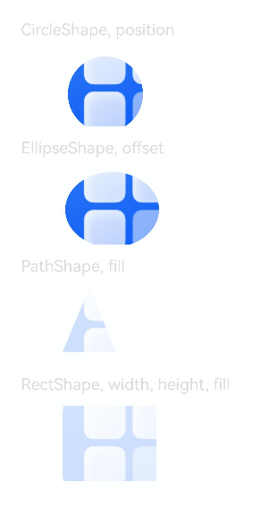

# @ohos.arkui.shape (Shape)

<!--Kit: ArkUI-->
<!--Subsystem: ArkUI-->
<!--Owner: @hehongyang3-->
<!--Designer: @hehongyang3-->
<!--Tester: @lxl007-->
<!--Adviser: @Brilliantry_Rui-->
<!-- md-trans-meta sourceCommit=4074739ec104663f417d9981273bcd01b284c4ca translatedAt=2026-07-29T09:31:15.819Z pushedAt=2026-08-03T09:01:05.929Z -->

The **Shape** module provides multiple shape definitions such as **CircleShape**, **EllipseShape**, **PathShape**, and **RectShape**, which can be passed to the [clipShape](arkui-ts/ts-universal-attributes-sharp-clipping.md#clipshape12) and [maskShape](arkui-ts/ts-universal-attributes-sharp-clipping.md#maskshape12) APIs to clip and mask components. It is suitable for scenarios where components need to be clipped into specific shapes such as circles, ellipses, and rectangles, or where visual effects are achieved through shape masking, such as avatar clipping and icon masking.

> **NOTE**
>
> - The initial APIs of this module are supported since API version 12. Newly added APIs will be marked with a superscript to indicate their earliest API version.
>
> - The APIs of this module can be used only in the stage model.

## Modules to Import

```ts
import { CircleShape, EllipseShape, PathShape, RectShape } from '@kit.ArkUI';
```

## CircleShape

Represents a circle shape used in the **clipShape** and **maskShape** APIs.

This API inherits from [BaseShape](#baseshape).

**Widget capability**: This API can be used in ArkTS widgets since API version 12.

**Atomic service API**: This API can be used in atomic services since API version 12.

**System capability**: SystemCapability.ArkUI.ArkUI.Full

### constructor

constructor(options?: ShapeSize)

A constructor used to create a **CircleShape** object.

**Widget capability**: This API can be used in ArkTS widgets since API version 12.

**Atomic service API**: This API can be used in atomic services since API version 12.

**System capability**: SystemCapability.ArkUI.ArkUI.Full

**Parameters**

| Name        | Type                                              | Mandatory| Description                                        |
| ----------- | -------------------------------------------------- | ---- | -------------------------------------------- |
| options | [ShapeSize](#shapesize) | No | Size of the shape, including the **width** and **height** attributes, which is used to set the dimensions of the shape. If not specified, the default size is used, with the default width of 0 vp and default height of 0 vp. |

## EllipseShape

Represents an ellipse shape used in the **clipShape** and **maskShape** APIs.

This API inherits from [BaseShape](#baseshape).

**Widget capability**: This API can be used in ArkTS widgets since API version 12.

**Atomic service API**: This API can be used in atomic services since API version 12.

**System capability**: SystemCapability.ArkUI.ArkUI.Full

### constructor

constructor(options?: ShapeSize)

A constructor used to create an **EllipseShape** object.

**Widget capability**: This API can be used in ArkTS widgets since API version 12.

**Atomic service API**: This API can be used in atomic services since API version 12.

**System capability**: SystemCapability.ArkUI.ArkUI.Full

**Parameters**

| Name        | Type                                              | Mandatory| Description                                        |
| ----------- | -------------------------------------------------- | ---- | -------------------------------------------- |
| options | [ShapeSize](#shapesize) | No | Size of the shape, which is used to customize the width and height of the ellipse. If not specified, the default value of **width** and **height** is 0 vp. |

## PathShape

Represents a path shape used for the **clipShape** and **maskShape** APIs.

This API inherits from [CommonShapeMethod](#commonshapemethod).

**Widget capability**: This API can be used in ArkTS widgets since API version 12.

**Atomic service API**: This API can be used in atomic services since API version 12.

**System capability**: SystemCapability.ArkUI.ArkUI.Full

### constructor

constructor(options?: PathShapeOptions)

A constructor used to create a **PathShape** object.

**Widget capability**: This API can be used in ArkTS widgets since API version 12.

**Atomic service API**: This API can be used in atomic services since API version 12.

**System capability:** SystemCapability.ArkUI.ArkUI.Full

**Parameters**

| Name        | Type                                              | Mandatory| Description                                        |
| ----------- | -------------------------------------------------- | ---- | -------------------------------------------- |
| options | [PathShapeOptions](#pathshapeoptions) | No| Path parameters.|

### commands

commands(commands: string): PathShape

Sets the path drawing commands.

**Widget capability**: This API can be used in ArkTS widgets since API version 12.

**Atomic service API**: This API can be used in atomic services since API version 12.

**System capability**: SystemCapability.ArkUI.ArkUI.Full

**Parameters**

| Name        | Type                                              | Mandatory| Description                                        |
| ----------- | -------------------------------------------------- | ---- | -------------------------------------------- |
| commands | string | Yes| Path drawing commands.|

**Return value**

| Type  | Description                    |
| ------ | ------------------------ |
| [PathShape](#pathshape) | **PathShape** object with path drawing commands configured, which can be used for chained calls to further configure the path shape. |

## RectShape

Represents a rectangle shape used in the **clipShape** and **maskShape** APIs.

This API inherits from [BaseShape](#baseshape).

**Widget capability**: This API can be used in ArkTS widgets since API version 12.

**Atomic service API**: This API can be used in atomic services since API version 12.

**System capability**: SystemCapability.ArkUI.ArkUI.Full

### constructor

constructor(options?: RectShapeOptions \| RoundRectShapeOptions)

A constructor used to create a **RectShape** object.

**Widget capability**: This API can be used in ArkTS widgets since API version 12.

**Atomic service API**: This API can be used in atomic services since API version 12.

**System capability**: SystemCapability.ArkUI.ArkUI.Full

**Parameters**

| Name        | Type                                              | Mandatory| Description                                        |
| ----------- | -------------------------------------------------- | ---- | -------------------------------------------- |
| options | [RectShapeOptions](#rectshapeoptions) &nbsp;\|&nbsp; [RoundRectShapeOptions](#roundrectshapeoptions) | No| Rectangle parameters.|

### radiusWidth

radiusWidth(rWidth: number \| string): RectShape

Sets the radius width of the rectangle border corners.

**Widget capability**: This API can be used in ArkTS widgets since API version 12.

**Atomic service API**: This API can be used in atomic services since API version 12.

**System capability**: SystemCapability.ArkUI.ArkUI.Full

**Parameters**

| Name        | Type                                              | Mandatory| Description                                        |
| ----------- | -------------------------------------------------- | ---- | -------------------------------------------- |
| rWidth | number &nbsp;\|&nbsp; string | Yes | Width of the corner radius of the rectangle shape.<br>If the type is number, the value range is [0, +∞); if the type is string, the value is specified by [Length](arkui-ts/ts-types.md#length).<br>Unit: vp<br>If the value is abnormal, 0 vp is used. |

**Return value**

| Type  | Description                    |
| ------ | ------------------------ |
| [RectShape](#rectshape) | **RectShape** object with the corner radius set, which can be used for chained calls to further configure the rectangle shape. |

### radiusHeight

radiusHeight(rHeight: number \| string): RectShape

Sets the radius height of the rectangle border corners.

**Widget capability**: This API can be used in ArkTS widgets since API version 12.

**Atomic service API**: This API can be used in atomic services since API version 12.

**System capability**: SystemCapability.ArkUI.ArkUI.Full

**Parameters**

| Name        | Type                                              | Mandatory| Description                                        |
| ----------- | -------------------------------------------------- | ---- | -------------------------------------------- |
| rHeight | number &nbsp;\|&nbsp; string | Yes | Height of the corner radius of the rectangle shape. If the type is number, the value range is [0, +∞); if the type is string, the value is specified by [Length](arkui-ts/ts-types.md#length). Unit: vp. If the value is abnormal, 0 vp is used. |

**Return value**

| Type  | Description                    |
| ------ | ------------------------ |
| [RectShape](#rectshape) | **RectShape** object with the height of the corner radius set, which can be used for chained calls to further configure the rectangle shape. |

### radius

radius(radius: number | string | Array<number &nbsp;\|&nbsp; string>): RectShape

Sets the radius of the rectangle border corners.

**Widget capability**: This API can be used in ArkTS widgets since API version 12.

**Atomic service API**: This API can be used in atomic services since API version 12.

**System capability**: SystemCapability.ArkUI.ArkUI.Full

**Parameters**

| Name        | Type                                              | Mandatory| Description                                        |
| ----------- | -------------------------------------------------- | ---- | -------------------------------------------- |
| radius | number &nbsp;\|&nbsp; string &nbsp;\|&nbsp; Array<number &nbsp;\|&nbsp; string> | Yes | Corner radius of the rectangle shape. Only the first four elements of the array are accepted, which represent the corner radii of the top-left, top-right, bottom-left, and bottom-right corners of the rectangle, respectively.<br>If the type is number, the value range is [0, +∞); if the type is string, the value is specified by [Length](arkui-ts/ts-types.md#length).<br>Unit: vp<br>If the value is abnormal, 0 vp is used. |

**Return value**

| Type  | Description                    |
| ------ | ------------------------ |
| [RectShape](#rectshape) | **RectShape** object with the width of the corner radius set, which can be used for chained calls to further configure the rectangle shape. |

## ShapeSize

Provides the size parameters of a shape.

**Widget capability**: This API can be used in ArkTS widgets since API version 12.

**Atomic service API**: This API can be used in atomic services since API version 12.

**System capability**: SystemCapability.ArkUI.ArkUI.Full

| Name        | Type                                              | Read-Only                                            | Optional                                            | Description                                        |
| ----------- | -------------------------------------------------- | -------------------------------------------- | -------------------------------------------- | -------------------------------------------- |
| width | number &nbsp;\|&nbsp; string | No | Yes | Width of the shape.<br/> If the type is number, the value range is [0, +∞); if the type is string, the value is specified by [Length](arkui-ts/ts-types.md#length). <br/>Unit: vp<br/>Default value: **0vp**<br/>If an abnormal value is set, **0vp** is used.<br/>If not set, the default value **0vp** is used. |
| height | number &nbsp;\|&nbsp; string | No | Yes | Height of the shape. <br/> If the type is number, the value range is [0, +∞); if the type is string, the value is specified by [Length](arkui-ts/ts-types.md#length). <br/>Unit: vp<br/>Default value: **0vp**<br/>If an abnormal value is set, **0vp** is used.<br/>If not set, the default value **0vp** is used. |

## PathShapeOptions

Represents the parameter of the constructor used to create a **PathShape** object.

**Widget capability**: This API can be used in ArkTS widgets since API version 12.

**Atomic service API**: This API can be used in atomic services since API version 12.

**System capability**: SystemCapability.ArkUI.ArkUI.Full

| Name        | Type                                              | Read-Only                                            | Optional                                            | Description                                        |
| ----------- | -------------------------------------------------- | -------------------------------------------- | -------------------------------------------- | -------------------------------------------- |
| commands | string | No | Yes | Commands for drawing the path. The default value is an empty string, and no path is drawn when this parameter is not set. For more information, see the drawing commands supported by [commands](arkui-ts/ts-drawing-components-path.md#commands). |

## RectShapeOptions

Represents the parameter of the constructor used to create a **RectShape** object.

This API inherits from [ShapeSize](#shapesize).

**Widget capability**: This API can be used in ArkTS widgets since API version 12.

**Atomic service API**: This API can be used in atomic services since API version 12.

**System capability**: SystemCapability.ArkUI.ArkUI.Full

| Name        | Type                                              | Read-Only                                            | Optional                                            | Description                                        |
| ----------- | -------------------------------------------------- | -------------------------------------------- | -------------------------------------------- | -------------------------------------------- |
| radius | number &nbsp;\|&nbsp; string &nbsp;\|&nbsp; Array<number &nbsp;\|&nbsp; string> | No| Yes| Radius of the rectangle border corners.<br> When the parameter type is number, the valid value range is [0, +∞). When the parameter type is string, the value must conform to the [Length](arkui-ts/ts-types.md#length) type specification.<br>Unit: vp.<br>If the value is invalid, 0 vp is used.|

## RoundRectShapeOptions

Represents the parameters of the constructor used to create a **RectShape** object with rounded corners.

This API inherits from [ShapeSize](#shapesize).

**Widget capability**: This API can be used in ArkTS widgets since API version 12.

**Atomic service API**: This API can be used in atomic services since API version 12.

**System capability**: SystemCapability.ArkUI.ArkUI.Full

| Name        | Type                                              | Read-Only                                            | Optional                                            | Description                                        |
| ----------- | -------------------------------------------------- | -------------------------------------------- | -------------------------------------------- | -------------------------------------------- |
| radiusWidth | number &nbsp;\|&nbsp; string | No | Yes | Radius width of the rectangle border corners.<br/>If the type is number, the value range is [0, +∞); if the type is string, the value is specified by [Length](arkui-ts/ts-types.md#length).<br/>Unit: vp<br/>Default value: **0vp**<br/>If an abnormal value is set, **0vp** is used. |
| radiusHeight | number &nbsp;\|&nbsp; string | No | Yes | Radius height of the rectangle border corners.<br/>If the type is number, the value range is [0, +∞); if the type is string, the value is specified by [Length](arkui-ts/ts-types.md#length).<br/>Unit: vp<br/>Default value: **0vp**<br/>If an abnormal value is set, **0vp** is used. |

## BaseShape

This API inherits from [CommonShapeMethod](#commonshapemethod).

**Widget capability**: This API can be used in ArkTS widgets since API version 12.

**Atomic service API**: This API can be used in atomic services since API version 12.

**System capability**: SystemCapability.ArkUI.ArkUI.Full

### width

width(width: Length): T

Sets the width of a shape.

**Widget capability**: This API can be used in ArkTS widgets since API version 12.

**Atomic service API**: This API can be used in atomic services since API version 12.

**System capability**: SystemCapability.ArkUI.ArkUI.Full

**Parameters**

| Name        | Type                                              | Mandatory| Description                                        |
| ----------- | -------------------------------------------------- | ---- | -------------------------------------------- |
| width | [Length](arkui-ts/ts-types.md#length) | Yes| Width of the shape.<br>Unit: vp.<br>If the value is invalid, 0 vp is used.|

**Return value**

| Type  | Description                    |
| ------ | ------------------------ |
| T | Current object.|

### height

height(height: Length): T

Sets the height of a shape.

**Widget capability**: This API can be used in ArkTS widgets since API version 12.

**Atomic service API**: This API can be used in atomic services since API version 12.

**System capability**: SystemCapability.ArkUI.ArkUI.Full

**Parameters**

| Name        | Type                                              | Mandatory| Description                                        |
| ----------- | -------------------------------------------------- | ---- | -------------------------------------------- |
| height | [Length](arkui-ts/ts-types.md#length) | Yes| Height of the shape.<br>Unit: vp.<br>If the value is invalid, 0 vp is used.|

**Return value**

| Type  | Description                    |
| ------ | ------------------------ |
| T | Current object.|

### size

size(size: SizeOptions): T

Sets the size of a shape.

**Widget capability**: This API can be used in ArkTS widgets since API version 12.

**Atomic service API**: This API can be used in atomic services since API version 12.

**System capability**: SystemCapability.ArkUI.ArkUI.Full

**Parameters**

| Name        | Type                                              | Mandatory| Description                                        |
| ----------- | -------------------------------------------------- | ---- | -------------------------------------------- |
| size | [SizeOptions](arkui-ts/ts-types.md#sizeoptions) | Yes| Size of the shape.|

**Return value**

| Type  | Description                    |
| ------ | ------------------------ |
| T | Current object.|

## CommonShapeMethod

A base class that provides common methods such as offset, fill, and position settings for shapes.

**Widget capability**: This API can be used in ArkTS widgets since API version 12.

**Atomic service API**: This API can be used in atomic services since API version 12.

**System capability**: SystemCapability.ArkUI.ArkUI.Full

### offset

offset(offset: Position): T

Sets the coordinate offset relative to the component's layout position.

**Widget capability**: This API can be used in ArkTS widgets since API version 12.

**Atomic service API**: This API can be used in atomic services since API version 12.

**System capability**: SystemCapability.ArkUI.ArkUI.Full

**Parameters**

| Name        | Type                                              | Mandatory| Description                                        |
| ----------- | -------------------------------------------------- | ---- | -------------------------------------------- |
| offset | [Position](arkui-ts/ts-types.md#position) | Yes| Coordinate offset relative to the component's layout position.|

**Return value**

| Type  | Description                    |
| ------ | ------------------------ |
| T | Current object.|

### fill

fill(color: ResourceColor): T

Sets the fill color of this shape, which determines its opacity, with black representing full transparency and white representing full opacity.

**Widget capability**: This API can be used in ArkTS widgets since API version 12.

**Atomic service API**: This API can be used in atomic services since API version 12.

**System capability**: SystemCapability.ArkUI.ArkUI.Full

**Parameters**

| Name        | Type                                              | Mandatory| Description                                        |
| ----------- | -------------------------------------------------- | ---- | -------------------------------------------- |
| color | [ResourceColor](arkui-ts/ts-types.md#resourcecolor) | Yes| Fill color of the shape, which represents the opacity of the fill area. The black color indicates full transparency, while white indicates full opacity.|

**Return value**

| Type  | Description                    |
| ------ | ------------------------ |
| T | Current object.|

### position

position(position: Position): T

Sets the position coordinates of the shape.

**Widget capability**: This API can be used in ArkTS widgets since API version 12.

**Atomic service API**: This API can be used in atomic services since API version 12.

**System capability**: SystemCapability.ArkUI.ArkUI.Full

**Parameters**

| Name        | Type                                              | Mandatory| Description                                        |
| ----------- | -------------------------------------------------- | ---- | -------------------------------------------- |
| position | [Position](arkui-ts/ts-types.md#position) | Yes | Position of the shape. |

**Return value**

| Type  | Description                    |
| ------ | ------------------------ |
| T | Current object.|

## Example

This example demonstrates how to use [clipShape](arkui-ts/ts-universal-attributes-sharp-clipping.md#clipshape12) and [maskShape](arkui-ts/ts-universal-attributes-sharp-clipping.md#maskshape12) to clip and mask images into different shapes.

```ts
import { CircleShape, EllipseShape, PathShape, RectShape } from '@kit.ArkUI';

@Entry
@Component
struct ShapeExample {
  build() {
    Column({ space: 15 }) {
      Text('CircleShape, position').fontSize(20).width('75%').fontColor('#DCDCDC')
      // Replace $r('app.media.startIcon') with the resource file you use.
      Image($r('app.media.startIcon'))
        .clipShape(new CircleShape({ width: '280px', height: '280px' }).position({ x: '20px', y: '20px' }))
        .width('500px').height('280px')

      Text('EllipseShape, offset').fontSize(20).width('75%').fontColor('#DCDCDC')
      // Replace $r('app.media.startIcon') with the resource file you use.
      Image($r('app.media.startIcon'))
        .clipShape(new EllipseShape({ width: '350px', height: '280px' }).offset({ x: '10px', y: '10px' }))
        .width('500px').height('280px')

      Text('PathShape, fill').fontSize(20).width('75%').fontColor('#DCDCDC')
      // Replace $r('app.media.startIcon') with the resource file you use.
      Image($r('app.media.startIcon'))
        // Use SVG path commands to draw a triangle as the mask shape.
        .maskShape(new PathShape().commands('M100 0 L200 240 L0 240 Z').fill(Color.Red))
        .width('500px').height('280px')
    
      Text('RectShape, width, height, fill').fontSize(20).width('75%').fontColor('#DCDCDC')
      // Replace $r('app.media.startIcon') with the resource file you use.
      Image($r('app.media.startIcon'))
        .maskShape(new RectShape().width('350px').height('280px').fill(Color.Red))
        .width('500px').height('280px')
    }
    .width('100%')
    .margin({ top: 15 })
  }
}
```

