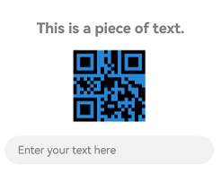
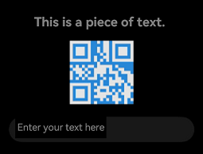

# @ohos.arkui.theme (Theme)
<!--Kit: ArkUI-->
<!--Subsystem: ArkUI-->
<!--Owner: @fangzhiyuan1-->
<!--Designer: @fangzhiyuan1-->
<!--Tester: @gouyuanyuan-->
<!--Adviser: @Brilliantry_Rui-->

You can define a custom theme to apply to components in your application.

> **NOTE**
>
> - The initial APIs of this module are supported since API version 12. Newly added APIs will be marked with a superscript to indicate their earliest API version.
>
> - The APIs of this module can be used only in the stage model.

## Modules to Import

```ts
import { Theme, ThemeControl, CustomColors, Colors, CustomTheme, CustomDarkColors } from '@kit.ArkUI';
```

## Theme

Defines the **Theme** object in use, which can be obtained through [onWillApplyTheme](arkui-ts/ts-custom-component-lifecycle.md#onwillapplytheme12).

**Atomic service API**: This API can be used in atomic services since API version 12.

**System capability**: SystemCapability.ArkUI.ArkUI.Full

| Name| Type               | Read-Only| Optional| Description      |
| ------ |-------------------|-----|-----|----------|
| colors | [Colors](#colors) | No  | No  |  Color resources of the theme.|

## Colors

Defines the color resources of a theme.

**System capability**: SystemCapability.ArkUI.ArkUI.Full

<!--RP1--><!--RP1End-->

<!--Table: 20%; 20%; 8%; 8%; 44%-->
| Name                          | Type                                                | Read-Only| Optional| Description              |
|-------------------------------|-----------------------------------------------------|-----|-----|------------------|
| brand                         | [ResourceColor](arkui-ts/ts-types.md#resourcecolor) | No  | No  | Brand color. When the non-[Resource](./arkui-ts/ts-types.md#resource) type in [ResourceColor](arkui-ts/ts-types.md#resourcecolor) is used to set the color, the default values of **backgroundEmphasize**, **compBackgroundEmphasize**, **compEmphasizeSecondary**, **compEmphasizeTertiary**, **interactiveFocus**, and **interactiveSelect** change according to the mapping. For details, see the description of the corresponding color attributes.<br>**Affected components**: [TextInput](./arkui-ts/ts-basic-components-textinput.md) and [Search](./arkui-ts/ts-basic-components-search.md)<br>**Atomic service API**: This API can be used in atomic services since API version 12.       |
| primary                     | [ResourceColor](arkui-ts/ts-types.md#resourcecolor) | No  | Yes  | Primary color. The default value is **undefined**, indicating that the primary color does not take effect. Since API version 26.0.0, when the non-[Resource](./arkui-ts/ts-types.md#resource) type in [ResourceColor](arkui-ts/ts-types.md#resourcecolor) is used to set the color, the default values of **fontPrimary**, **fontSecondary**, **fontTertiary**, **fontFourth**, **iconPrimary**, **iconSecondary**, **iconTertiary**, and **iconFourth** change with the mapping. For details, see the description of the corresponding color attributes.<br>**Affected components**: N/A<br>**Since**: 26.0.0<br>**Atomic service API**: This API can be used in atomic services since API version 26.0.0.       |
| onPrimary                       | [ResourceColor](arkui-ts/ts-types.md#resourcecolor) | No  | Yes  | Emphasis color. The default value is **undefined**, indicating that the emphasis color does not take effect. Since API version 26.0.0, when the non-[Resource](./arkui-ts/ts-types.md#resource) type in [ResourceColor](arkui-ts/ts-types.md#resourcecolor) is used to set the color, the default values of **fontOnPrimary**, **fontOnSecondary**, **fontOnTertiary**, **fontOnFourth**, **iconOnPrimary**, **iconOnSecondary**, **iconOnTertiary**, and **iconOnFourth** change with the mapping. For details, see the description of the corresponding color attributes.<br>**Affected components**: N/A<br>**Since**: 26.0.0<br>**Atomic service API**: This API can be used in atomic services since API version 26.0.0.       |
| container                        | [ResourceColor](arkui-ts/ts-types.md#resourcecolor) | No  | Yes  | Container color. The default value is **undefined**, indicating that the container color does not take effect. Since API version 26.0.0, when the non-[Resource](./arkui-ts/ts-types.md#resource) type in [ResourceColor](arkui-ts/ts-types.md#resourcecolor) is used to set the color, the default values of **compBackgroundSecondary**, **compBackgroundTertiary**, **compDivider**, **interactiveHover**, **interactivePressed**, and **interactiveClick** change with the mapping. For details, see the description of the corresponding color attributes.<br>**Affected components**: N/A<br>**Since**: 26.0.0<br>**Atomic service API**: This API can be used in atomic services since API version 26.0.0.       |
| warning                       | [ResourceColor](arkui-ts/ts-types.md#resourcecolor) | No  | No  | Warning color.<br>Affected components: [TipsDialog](./arkui-ts/ohos-arkui-advanced-Dialog.md#tipsdialog), [AlertDialog](./arkui-ts/ohos-arkui-advanced-Dialog.md#alertdialog), [CustomContentDialog](./arkui-ts/ohos-arkui-advanced-Dialog.md#customcontentdialog12), [Badge](./arkui-ts/ts-container-badge.md), and [Button](./arkui-ts/ts-basic-components-button.md)<br>**Atomic service API**: This API can be used in atomic services since API version 12.         |
| alert                         | [ResourceColor](arkui-ts/ts-types.md#resourcecolor) | No  | No  | Alert color.<br>**Affected components**: N/A<br>**Atomic service API**: This API can be used in atomic services since API version 12.          |
| confirm                       | [ResourceColor](arkui-ts/ts-types.md#resourcecolor) | No  | No  | Confirmation color.<br>**Affected components**: N/A<br>**Atomic service API**: This API can be used in atomic services since API version 12.            |
| fontPrimary                   | [ResourceColor](arkui-ts/ts-types.md#resourcecolor) | No  | No  | Primary font color.<br>Note: Since API version 26.0.0, when this parameter is used as an attribute of [CustomColors](#customcolors), if **primary** is set, the default value of **fontPrimary** in light color mode and dark color mode is the color value of **primary** with 90% transparency.<br>**Affected components**: [EditableTitleBar](./arkui-ts/ohos-arkui-advanced-EditableTitleBar.md), [LoadingDialog](./arkui-ts/ohos-arkui-advanced-Dialog.md#loadingdialog), [TipsDialog](./arkui-ts/ohos-arkui-advanced-Dialog.md#tipsdialog), [ConfirmDialog](./arkui-ts/ohos-arkui-advanced-Dialog.md#confirmdialog), [AlertDialog](./arkui-ts/ohos-arkui-advanced-Dialog.md#alertdialog), [SelectDialog](./arkui-ts/ohos-arkui-advanced-Dialog.md#selectdialog), [CustomContentDialog](./arkui-ts/ohos-arkui-advanced-Dialog.md#customcontentdialog12), [Swiper](./arkui-ts/ts-container-swiper.md), [Text](./arkui-ts/ts-basic-components-text.md), [SubHeader](./arkui-ts/ohos-arkui-advanced-SubHeader.md), [ProgressButton](./arkui-ts/ohos-arkui-advanced-ProgressButton.md), [AlphabetIndexer](./arkui-ts/ts-container-alphabet-indexer.md), [Popup](./arkui-ts/ohos-arkui-advanced-Popup.md), [Select](./arkui-ts/ts-basic-components-select.md), [Chip](./arkui-ts/ohos-arkui-advanced-Chip.md), [ToolBar](./arkui-ts/ohos-arkui-advanced-ToolBar.md), [Menu](./arkui-ts/ts-basic-components-menu.md), [TextInput](./arkui-ts/ts-basic-components-textinput.md), [Search](./arkui-ts/ts-basic-components-search.md), [TimePicker](./arkui-ts/ts-basic-components-timepicker.md), [DatePicker](./arkui-ts/ts-basic-components-datepicker.md), [TextPicker](./arkui-ts/ts-basic-components-textpicker.md), [ComposeListItem](./arkui-ts/ohos-arkui-advanced-ComposeListItem.md), and [TreeView](./arkui-ts/ohos-arkui-advanced-TreeView.md). Since API version 26.0.0, [CalendarPicker](./arkui-ts/ts-basic-components-calendarpicker.md), [UIPickerComponent](./arkui-ts/ts-container-ui-picker-component.md), [RichEditor](./arkui-ts/ts-basic-components-richeditor.md), [MenuItem](./arkui-ts/ts-basic-components-menuitem.md), [MenuItemGroup](./arkui-ts/ts-basic-components-menuitemgroup.md), and [Counter](./arkui-ts/ts-container-counter.md) are added.<br>**Atomic service API**: This API can be used in atomic services since API version 12.       |
| fontSecondary                 | [ResourceColor](arkui-ts/ts-types.md#resourcecolor) | No  | No  | Secondary font color.<br>Note: Since API version 26.0.0, when this parameter is used as an attribute of [CustomColors](#customcolors), if **primary** is set, the default value of **fontSecondary** in light color mode and dark color mode is the color value of **primary** with 60% transparency.<br>**Affected components**: [EditableTitleBar](./arkui-ts/ohos-arkui-advanced-EditableTitleBar.md), [AlertDialog](./arkui-ts/ohos-arkui-advanced-Dialog.md#alertdialog), [CustomContentDialog](./arkui-ts/ohos-arkui-advanced-Dialog.md#customcontentdialog12), [SubHeader](./arkui-ts/ohos-arkui-advanced-SubHeader.md), [AlphabetIndexer](./arkui-ts/ts-container-alphabet-indexer.md), [Popup](./arkui-ts/ohos-arkui-advanced-Popup.md), [TextInput](./arkui-ts/ts-basic-components-textinput.md), [Search](./arkui-ts/ts-basic-components-search.md), [ComposeListItem](./arkui-ts/ohos-arkui-advanced-ComposeListItem.md), [TreeView](./arkui-ts/ohos-arkui-advanced-TreeView.md), and [TextClock](./arkui-ts/ts-basic-components-textclock.md). Since API version 26.0.0, [MenuItem](./arkui-ts/ts-basic-components-menuitem.md) and [MenuItemGroup](./arkui-ts/ts-basic-components-menuitemgroup.md) are added.<br>**Atomic service API**: This API can be used in atomic services since API version 12.       |
| fontTertiary                  | [ResourceColor](arkui-ts/ts-types.md#resourcecolor) | No  | No  | Tertiary font color.<br>Note: Since API version 26.0.0, when this parameter is used as an attribute of [CustomColors](#customcolors), if **primary** is set, the default value of **fontTertiary** in light color mode and dark color mode is the color value of **primary** with 40% transparency.<br>**Affected components**: [ComposeListItem](./arkui-ts/ohos-arkui-advanced-ComposeListItem.md)<br>**Atomic service API**: This API can be used in atomic services since API version 12.       |
| fontFourth                    | [ResourceColor](arkui-ts/ts-types.md#resourcecolor) | No  | No  | Fourth-level font color.<br>Note: Since API version 26.0.0, when this parameter is used as an attribute of [CustomColors](#customcolors), if **primary** is set, the default value of **fontFourth** in light color mode and dark color mode is the color value of **primary** with 20% transparency.<br>**Affected components**: N/A<br>**Atomic service API**: This API can be used in atomic services since API version 12.       |
| fontEmphasize                 | [ResourceColor](arkui-ts/ts-types.md#resourcecolor) | No  | No  | Emphasis font color.<br>**Affected components**: [TipsDialog](./arkui-ts/ohos-arkui-advanced-Dialog.md#tipsdialog), [ConfirmDialog](./arkui-ts/ohos-arkui-advanced-Dialog.md#confirmdialog), [AlertDialog](./arkui-ts/ohos-arkui-advanced-Dialog.md#alertdialog), [SelectDialog](./arkui-ts/ohos-arkui-advanced-Dialog.md#selectdialog), [CustomContentDialog](./arkui-ts/ohos-arkui-advanced-Dialog.md#customcontentdialog12), [SubHeader](./arkui-ts/ohos-arkui-advanced-SubHeader.md), [AlphabetIndexer](./arkui-ts/ts-container-alphabet-indexer.md), [Popup](./arkui-ts/ohos-arkui-advanced-Popup.md), [Button](./arkui-ts/ts-basic-components-button.md), [Select](./arkui-ts/ts-basic-components-select.md), [ToolBar](./arkui-ts/ohos-arkui-advanced-ToolBar.md), [Search](./arkui-ts/ts-basic-components-search.md), [TimePicker](./arkui-ts/ts-basic-components-timepicker.md), [DatePicker](./arkui-ts/ts-basic-components-datepicker.md), and [TextPicker](./arkui-ts/ts-basic-components-textpicker.md). Since API version 26.0.0, [RichEditor](./arkui-ts/ts-basic-components-richeditor.md) is added.<br>**Atomic service API**: This API can be used in atomic services since API version 12.         |
| fontOnPrimary                 | [ResourceColor](arkui-ts/ts-types.md#resourcecolor) | No  | No  | Primary inverted font color used on color background.<br>Note: Since API version 26.0.0, when this parameter is used as an attribute of [CustomColors](#customcolors), if **onPrimary** is set, the default value of **fontOnPrimary** in light color mode and dark color mode is the color value of **onPrimary** with 100% transparency.<br>**Affected components**: [Badge](./arkui-ts/ts-container-badge.md), [Button](./arkui-ts/ts-basic-components-button.md), and [Chip](./arkui-ts/ohos-arkui-advanced-Chip.md)<br>**Atomic service API**: This API can be used in atomic services since API version 12.|
| fontOnSecondary               | [ResourceColor](arkui-ts/ts-types.md#resourcecolor) | No  | No  | Secondary inverted font color used on color background.<br>Note: Since API version 26.0.0, when this parameter is used as an attribute of [CustomColors](#customcolors), if **onPrimary** is set, the default value of **fontOnSecondary** in light color mode and dark color mode is the color value of **onPrimary** with 60% transparency.<br>**Affected components**: N/A<br>**Atomic service API**: This API can be used in atomic services since API version 12.|
| fontOnTertiary                | [ResourceColor](arkui-ts/ts-types.md#resourcecolor) | No  | No  | Tertiary inverted font color used on color background.<br>Note: Since API version 26.0.0, when this parameter is used as an attribute of [CustomColors](#customcolors), if **onPrimary** is set, the default value of **fontOnTertiary** in light color mode and dark color mode is the color value of **onPrimary** with 40% transparency.<br>**Affected components**: N/A<br>**Atomic service API**: This API can be used in atomic services since API version 12.|
| fontOnFourth                  | [ResourceColor](arkui-ts/ts-types.md#resourcecolor) | No  | No  | Fourth-level inverted font color used on color background.<br>Note: Since API version 26.0.0, when this parameter is used as an attribute of [CustomColors](#customcolors), if **onPrimary** is set, the default value of **fontOnFourth** in light color mode and dark color mode is the color value of **onPrimary** with 20% transparency.<br>**Affected components**: N/A<br>**Atomic service API**: This API can be used in atomic services since API version 12.|
| iconPrimary                   | [ResourceColor](arkui-ts/ts-types.md#resourcecolor) | No  | No  | Primary icon color.<br>Note: Since API version 26.0.0, when this parameter is used as an attribute of [CustomColors](#customcolors), if **primary** is set, the default value of **iconPrimary** in light color mode and dark color mode is the color value of **primary** with 90% transparency.<br>**Affected components**: [EditableTitleBar](./arkui-ts/ohos-arkui-advanced-EditableTitleBar.md), [Swiper](./arkui-ts/ts-container-swiper.md), [ToolBar](./arkui-ts/ohos-arkui-advanced-ToolBar.md), and [TreeView](./arkui-ts/ohos-arkui-advanced-TreeView.md). Since API version 26.0.0, [MenuItem](./arkui-ts/ts-basic-components-menuitem.md) is added.<br>**Atomic service API**: This API can be used in atomic services since API version 12.        |
| iconSecondary                 | [ResourceColor](arkui-ts/ts-types.md#resourcecolor) | No  | No  | Secondary icon color.<br>Note: Since API version 26.0.0, when this parameter is used as an attribute of [CustomColors](#customcolors), if **primary** is set, the default value of **iconSecondary** in light color mode and dark color mode is the color value of **primary** with 60% transparency.<br>**Affected components**: [LoadingDialog](./arkui-ts/ohos-arkui-advanced-Dialog.md#loadingdialog), [SubHeader](./arkui-ts/ohos-arkui-advanced-SubHeader.md), [Popup](./arkui-ts/ohos-arkui-advanced-Popup.md), [Chip](./arkui-ts/ohos-arkui-advanced-Chip.md), [Search](./arkui-ts/ts-basic-components-search.md), and [TreeView](./arkui-ts/ohos-arkui-advanced-TreeView.md). Since API version 26.0.0, [LoadingProgress](./arkui-ts/ts-basic-components-loadingprogress.md) is added.<br>**Atomic service API**: This API can be used in atomic services since API version 12.         |
| iconTertiary                  | [ResourceColor](arkui-ts/ts-types.md#resourcecolor) | No  | No  | Tertiary icon color.<br>Note: Since API version 26.0.0, when this parameter is used as an attribute of [CustomColors](#customcolors), if **primary** is set, the default value of **iconTertiary** in light color mode and dark color mode is the color value of **primary** with 40% transparency.<br>**Affected components**: [SubHeader](./arkui-ts/ohos-arkui-advanced-SubHeader.md)<br>**Atomic service API**: This API can be used in atomic services since API version 12.         |
| iconFourth                    | [ResourceColor](arkui-ts/ts-types.md#resourcecolor) | No  | No  | Fourth-level icon color.<br>Note: Since API version 26.0.0, when this parameter is used as an attribute of [CustomColors](#customcolors), if **primary** is set, the default value of **iconFourth** in light color mode and dark color mode is the color value of **primary** with 20% transparency.<br>**Affected components**: [Checkbox](./arkui-ts/ts-basic-components-checkbox.md), [CheckboxGroup](arkui-ts/ts-basic-components-checkboxgroup.md), and [Radio](./arkui-ts/ts-basic-components-radio.md)<br>**Atomic service API**: This API can be used in atomic services since API version 12.         |
| iconEmphasize                 | [ResourceColor](arkui-ts/ts-types.md#resourcecolor) | No  | No  | Emphasis icon color.<br>**Affected components**: [ToolBar](./arkui-ts/ohos-arkui-advanced-ToolBar.md)<br>**Atomic service API**: This API can be used in atomic services since API version 12.         |
| iconSubEmphasize              | [ResourceColor](arkui-ts/ts-types.md#resourcecolor) | No  | No  | Color of the emphasis auxiliary icon.<br>**Affected components**: N/A<br>**Atomic service API**: This API can be used in atomic services since API version 12.       |
| iconOnPrimary                 | [ResourceColor](arkui-ts/ts-types.md#resourcecolor) | No  | No  | Primary inverted icon color used on color background.<br>Note: Since API version 26.0.0, when this parameter is used as an attribute of [CustomColors](#customcolors), if **onPrimary** is set, the default value of **iconOnPrimary** in light color mode and dark color mode is the color value of **onPrimary** with 100% transparency.<br>**Affected components**: [Checkbox](./arkui-ts/ts-basic-components-checkbox.md), [CheckboxGroup](arkui-ts/ts-basic-components-checkboxgroup.md), and [Radio](./arkui-ts/ts-basic-components-radio.md)<br>**Atomic service API**: This API can be used in atomic services since API version 12.|
| iconOnSecondary               | [ResourceColor](arkui-ts/ts-types.md#resourcecolor) | No  | No  | Secondary inverted icon color used on color background.<br>Note: Since API version 26.0.0, when this parameter is used as an attribute of [CustomColors](#customcolors), if **onPrimary** is set, the default value of **iconOnSecondary** in light color mode and dark color mode is the color value of **onPrimary** with 60% transparency.<br>**Affected components**: [Chip](./arkui-ts/ohos-arkui-advanced-Chip.md)<br>**Atomic service API**: This API can be used in atomic services since API version 12.|
| iconOnTertiary                | [ResourceColor](arkui-ts/ts-types.md#resourcecolor) | No  | No  | Tertiary inverted icon color used on color background.<br>Note: Since API version 26.0.0, when this parameter is used as an attribute of [CustomColors](#customcolors), if **onPrimary** is set, the default value of **iconOnTertiary** in light color mode and dark color mode is the color value of **onPrimary** with 40% transparency.<br>**Affected components**: N/A<br>**Atomic service API**: This API can be used in atomic services since API version 12.|
| iconOnFourth                  | [ResourceColor](arkui-ts/ts-types.md#resourcecolor) | No  | No  | Fourth-level inverted icon color used on color background.<br>Note: Since API version 26.0.0, when this parameter is used as an attribute of [CustomColors](#customcolors), if **onPrimary** is set, the default value of **iconOnFourth** in light color mode and dark color mode is the color value of **onPrimary** with 20% transparency.<br>**Affected components**: [ProgressButton](./arkui-ts/ohos-arkui-advanced-ProgressButton.md)<br>**Atomic service API**: This API can be used in atomic services since API version 12.|
| backgroundPrimary             | [ResourceColor](arkui-ts/ts-types.md#resourcecolor) | No  | No  | Primary background color (solid, opaque).<br>**Affected components**: [TextInput](./arkui-ts/ts-basic-components-textinput.md) and [QRCode](./arkui-ts/ts-basic-components-qrcode.md)<br>**Atomic service API**: This API can be used in atomic services since API version 12. |
| backgroundSecondary           | [ResourceColor](arkui-ts/ts-types.md#resourcecolor) | No  | No  | Secondary background color (solid, opaque).<br>**Affected components**: N/A<br>**Atomic service API**: This API can be used in atomic services since API version 12. |
| backgroundTertiary            | [ResourceColor](arkui-ts/ts-types.md#resourcecolor) | No  | No  | Tertiary background color (solid, opaque).<br>**Affected components**: N/A<br>**Atomic service API**: This API can be used in atomic services since API version 12. |
| backgroundFourth              | [ResourceColor](arkui-ts/ts-types.md#resourcecolor) | No  | No  | Fourth-level background color (solid, opaque).<br>**Affected components**: N/A<br>**Atomic service API**: This API can be used in atomic services since API version 12. |
| backgroundEmphasize           | [ResourceColor](arkui-ts/ts-types.md#resourcecolor) | No  | No  | Emphasis background color (solid, opaque).<br>Note: When this parameter is used as an attribute of [CustomColors](#customcolors), if **brand** is set, the default value of **backgroundEmphasize** in both light mode and dark color mode is the color value of **brand** with 100% transparency.<br>**Affected components**: [Progress](./arkui-ts/ts-basic-components-progress.md), [Button](./arkui-ts/ts-basic-components-button.md), and [Slider](./arkui-ts/ts-basic-components-slider.md)<br>**Atomic service API**: This API can be used in atomic services since API version 12. |
| compForegroundPrimary         | [ResourceColor](arkui-ts/ts-types.md#resourcecolor) | No  | No  | Foreground.<br>**Affected components**: [QRCode](./arkui-ts/ts-basic-components-qrcode.md)<br>**Atomic service API**: This API can be used in atomic services since API version 12.           |
| compBackgroundPrimary         | [ResourceColor](arkui-ts/ts-types.md#resourcecolor) | No  | No  | White background.<br>**Affected components**: N/A<br>**Atomic service API**: This API can be used in atomic services since API version 12.           |
| compBackgroundPrimaryTran     | [ResourceColor](arkui-ts/ts-types.md#resourcecolor) | No  | No  | White transparent background.<br>**Affected components**: N/A<br>**Atomic service API**: This API can be used in atomic services since API version 12.        |
| compBackgroundPrimaryContrary | [ResourceColor](arkui-ts/ts-types.md#resourcecolor) | No  | No  | Always-on background.<br>**Affected components**: [Toggle](./arkui-ts/ts-basic-components-toggle.md) and [Slider](./arkui-ts/ts-basic-components-slider.md)<br>**Atomic service API**: This API can be used in atomic services since API version 12.          |
| compBackgroundGray            | [ResourceColor](arkui-ts/ts-types.md#resourcecolor) | No  | No  | Gray background.<br>**Affected components**: N/A<br>**Atomic service API**: This API can be used in atomic services since API version 12.           |
| compBackgroundSecondary       | [ResourceColor](arkui-ts/ts-types.md#resourcecolor) | No  | No  | Secondary background.<br>Note: Since API version 26.0.0, when this parameter is used as an attribute of [CustomColors](#customcolors), if **container** is set, the default value of **compBackgroundSecondary** in light color mode and dark color mode is the color value of **container** with 10% transparency.<br>**Affected components**: [Swiper](./arkui-ts/ts-container-swiper.md) and [Slider](./arkui-ts/ts-basic-components-slider.md)<br>**Atomic service API**: This API can be used in atomic services since API version 12.           |
| compBackgroundTertiary        | [ResourceColor](arkui-ts/ts-types.md#resourcecolor) | No  | No  | Tertiary background.<br>Note: Since API version 26.0.0, when this parameter is used as an attribute of [CustomColors](#customcolors), if **container** is set, the default value of **compBackgroundTertiary** in light color mode is the color value of **container** with 5% transparency, and the default value in dark color mode is the color value of **container** with 10% transparency.<br>**Affected components**: [EditableTitleBar](./arkui-ts/ohos-arkui-advanced-EditableTitleBar.md), [Progress](./arkui-ts/ts-basic-components-progress.md), [AlphabetIndexer](./arkui-ts/ts-container-alphabet-indexer.md), [Button](./arkui-ts/ts-basic-components-button.md), [Select](./arkui-ts/ts-basic-components-select.md), [Toggle](./arkui-ts/ts-basic-components-toggle.md), [Chip](./arkui-ts/ohos-arkui-advanced-Chip.md), [TextInput](./arkui-ts/ts-basic-components-textinput.md), and [Search](./arkui-ts/ts-basic-components-search.md). Since API version 26.0.0, [UIPickerComponent](./arkui-ts/ts-container-ui-picker-component.md) and [TextPicker](./arkui-ts/ts-basic-components-textpicker.md) are added.<br>**Atomic service API**: This API can be used in atomic services since API version 12.           |
| compBackgroundEmphasize       | [ResourceColor](arkui-ts/ts-types.md#resourcecolor) | No  | No  | Emphasis background.<br>Note: Since API version 26.0.0, when this parameter is used as an attribute of [CustomColors](#customcolors), if **brand** is set, the default value of **compBackgroundEmphasize** in light color mode and dark color mode is the color value of **brand** with 100% transparency.<br>**Affected components**: [Swiper](./arkui-ts/ts-container-swiper.md), [Toggle](./arkui-ts/ts-basic-components-toggle.md), [Chip](./arkui-ts/ohos-arkui-advanced-Chip.md), [Checkbox](./arkui-ts/ts-basic-components-checkbox.md), [CheckboxGroup](arkui-ts/ts-basic-components-checkboxgroup.md), and [Radio](./arkui-ts/ts-basic-components-radio.md)<br>**Atomic service API**: This API can be used in atomic services since API version 12.           |
| compBackgroundNeutral         | [ResourceColor](arkui-ts/ts-types.md#resourcecolor) | No  | No  | Black, neutral, emphasis background.<br>**Affected components**: [PatternLock](./arkui-ts/ts-basic-components-patternlock.md)<br>**Atomic service API**: This API can be used in atomic services since API version 12.     |
| compEmphasizeSecondary        | [ResourceColor](arkui-ts/ts-types.md#resourcecolor) | No  | No  | 20% emphasis background color.<br>Note: When this parameter is used as an attribute of [CustomColors](#customcolors), if **brand** is set, the default value of **compEmphasizeSecondary** in both light mode and dark color mode is the color value of **brand** with 20% transparency.<br>**Affected components**: [Progress](./arkui-ts/ts-basic-components-progress.md), [ProgressButton](./arkui-ts/ohos-arkui-advanced-ProgressButton.md), [AlphabetIndexer](./arkui-ts/ts-container-alphabet-indexer.md), [Select](./arkui-ts/ts-basic-components-select.md), and [Toggle](./arkui-ts/ts-basic-components-toggle.md)<br>**Atomic service API**: This API can be used in atomic services since API version 12.      |
| compEmphasizeTertiary         | [ResourceColor](arkui-ts/ts-types.md#resourcecolor) | No  | No  | 10% emphasis background color.<br>Note: When this parameter is used as an attribute of [CustomColors](#customcolors), if **brand** is set, the default value of **compEmphasizeTertiary** in both light mode and dark color mode is the color value of **brand** with 10% transparency.<br>**Affected components**: N/A<br>**Atomic service API**: This API can be used in atomic services since API version 12.      |
| compDivider                   | [ResourceColor](arkui-ts/ts-types.md#resourcecolor) | No  | No  | Common divider color.<br>Note: Since API version 26.0.0, when this parameter is used as an attribute of [CustomColors](#customcolors), if **container** is set, the default value of **compDivider** in light color mode and dark color mode is the color value of **container** with 20% transparency.<br>**Affected components**: [SelectDialog](./arkui-ts/ohos-arkui-advanced-Dialog.md#selectdialog), [PatternLock](./arkui-ts/ts-basic-components-patternlock.md), and [Divider](./arkui-ts/ts-basic-components-divider.md). Since API version 26.0.0, [UIPickerComponent](./arkui-ts/ts-container-ui-picker-component.md), [TextPicker](./arkui-ts/ts-basic-components-textpicker.md), [MenuItem](./arkui-ts/ts-basic-components-menuitem.md), [MenuItemGroup](./arkui-ts/ts-basic-components-menuitemgroup.md), and [Select](./arkui-ts/ts-basic-components-select.md) are added.<br>**Atomic service API**: This API can be used in atomic services since API version 12.        |
| compCommonContrary            | [ResourceColor](arkui-ts/ts-types.md#resourcecolor) | No  | No  | Common inverted color.<br>**Affected components**: N/A<br>**Atomic service API**: This API can be used in atomic services since API version 12.         |
| compBackgroundFocus           | [ResourceColor](arkui-ts/ts-types.md#resourcecolor) | No  | No  | Background color in the focused state.<br>**Affected components**: N/A<br>**Atomic service API**: This API can be used in atomic services since API version 12.        |
| compFocusedPrimary            | [ResourceColor](arkui-ts/ts-types.md#resourcecolor) | No  | No  | Primary inverted color in the focused state.<br>**Affected components**: N/A<br>**Atomic service API**: This API can be used in atomic services since API version 12.      |
| compFocusedSecondary          | [ResourceColor](arkui-ts/ts-types.md#resourcecolor) | No  | No  | Secondary inverted color in the focused state.<br>**Affected components**: N/A<br>**Atomic service API**: This API can be used in atomic services since API version 12.      |
| compFocusedTertiary           | [ResourceColor](arkui-ts/ts-types.md#resourcecolor) | No  | No  | Tertiary inverted color in the focused state.<br>**Affected components**: [Scroll](arkui-ts/ts-container-scroll.md)<br>**Atomic service API**: This API can be used in atomic services since API version 12.      |
| interactiveHover              | [ResourceColor](arkui-ts/ts-types.md#resourcecolor) | No  | No  | Common interactive color for the hover state.<br>Note: Since API version 26.0.0, when this parameter is used as an attribute of [CustomColors](#customcolors), if **container** is set, the default value of **interactiveHover** in light color mode is the color value of **container** with 5% transparency, and the default value in dark color mode is the color value of **container** with 10% transparency.<br>**Affected components**: [EditableTitleBar](./arkui-ts/ohos-arkui-advanced-EditableTitleBar.md), [Chip](./arkui-ts/ohos-arkui-advanced-Chip.md), and [TreeView](./arkui-ts/ohos-arkui-advanced-TreeView.md). Since API version 26.0.0, [RichEditor](./arkui-ts/ts-basic-components-richeditor.md), [MenuItem](./arkui-ts/ts-basic-components-menuitem.md), and [Select](./arkui-ts/ts-basic-components-select.md) are added.<br>**Atomic service API**: This API can be used in atomic services since API version 12.     |
| interactivePressed            | [ResourceColor](arkui-ts/ts-types.md#resourcecolor) | No  | No  | Common interactive color for the pressed state.<br>Note: Since API version 26.0.0, when this parameter is used as an attribute of [CustomColors](#customcolors), if **container** is set, the default value of **interactivePressed** in light color mode is the color value of **container** with 10% transparency, and the default value in dark color mode is the color value of **container** with 15% transparency.<br>**Affected components**: [EditableTitleBar](./arkui-ts/ohos-arkui-advanced-EditableTitleBar.md), [Chip](./arkui-ts/ohos-arkui-advanced-Chip.md), and [TreeView](./arkui-ts/ohos-arkui-advanced-TreeView.md). Since API version 26.0.0, [RichEditor](./arkui-ts/ts-basic-components-richeditor.md) is added.<br>**Atomic service API**: This API can be used in atomic services since API version 12.      |
| interactiveFocus              | [ResourceColor](arkui-ts/ts-types.md#resourcecolor) | No  | No  | Common interactive color for the focused state.<br>Note: When this parameter is used as an attribute of [CustomColors](#customcolors), if **brand** is set, the default value of **interactiveFocus** in both light mode and dark color mode is the color value of **brand** with 100% transparency.<br>**Affected components**: [EditableTitleBar](./arkui-ts/ohos-arkui-advanced-EditableTitleBar.md), [Chip](./arkui-ts/ohos-arkui-advanced-Chip.md), and [TreeView](./arkui-ts/ohos-arkui-advanced-TreeView.md).<br>**Atomic service API**: This API can be used in atomic services since API version 12.      |
| interactiveActive             | [ResourceColor](arkui-ts/ts-types.md#resourcecolor) | No  | No  | Common interactive color for the active state.<br>**Affected components**: [TreeView](./arkui-ts/ohos-arkui-advanced-TreeView.md)<br>**Atomic service API**: This API can be used in atomic services since API version 12.      |
| interactiveSelect             | [ResourceColor](arkui-ts/ts-types.md#resourcecolor) | No  | No  | Common interactive color for the selected state.<br>Note: When this parameter is used as an attribute of [CustomColors](#customcolors), if **brand** is set, the default value of **interactiveSelect** in both light mode and dark color mode is the color value of **brand** with 20% transparency.<br>**Affected components**: [TreeView](./arkui-ts/ohos-arkui-advanced-TreeView.md)<br>**Atomic service API**: This API can be used in atomic services since API version 12.      |
| interactiveClick              | [ResourceColor](arkui-ts/ts-types.md#resourcecolor) | No  | No  | Common interactive color for the clicked state.<br>Note: Since API version 26.0.0, when this parameter is used as an attribute of [CustomColors](#customcolors), if **container** is set, the default value of **interactiveClick** in light color mode is the color value of **container** with 10% transparency, and the default value in dark color mode is the color value of **container** with 15% transparency.<br>**Affected components**: [MenuItem](./arkui-ts/ts-basic-components-menuitem.md) and [Select](./arkui-ts/ts-basic-components-select.md) are added since API version 26.0.0.<br>**Atomic service API**: This API can be used in atomic services since API version 12.      |

## CustomTheme

Defines a custom theme object.

**System capability**: SystemCapability.ArkUI.ArkUI.Full

| Name                          | Type                                                | Read-Only | Optional | Description        |
|-------------------------------|-----------------------------------------------------|-----|-----|------------|
| colors | [CustomColors](#customcolors) | No  | Yes  | Custom light theme color resources.<br>**Atomic service API**: This API can be used in atomic services since API version 12.|
| darkColors<sup>20+</sup> | [CustomDarkColors](#customdarkcolors20) | No  | Yes  | Custom dark theme color resources.<br>Note: If **darkColors** is not configured, the color values will default to those specified in the **colors** configuration for light mode and will not adapt to dark mode changes, unless the colors are defined using resources from the **dark** directory.<br>**Atomic service API**: This API can be used in atomic services since API version 20.|

## CustomColors

type CustomColors = Partial\<Colors>

Defines the type for custom theme color resources.

**Atomic service API**: This API can be used in atomic services since API version 12.

**System capability**: SystemCapability.ArkUI.ArkUI.Full

| Type | Description          |
|-----|--------------|
| Partial<[Colors](#colors)>   | Type representing customizable theme color resources.|

## CustomDarkColors<sup>20+</sup>

type CustomDarkColors = Partial\<Colors>

Defines the type for dark theme color resources.

**Atomic service API**: This API can be used in atomic services since API version 20.

**System capability**: SystemCapability.ArkUI.ArkUI.Full

| Type | Description          |
|-----|--------------|
| Partial<[Colors](#colors)>   | Type representing customizable dark theme color resources.|

## ThemeControl

Implements a **ThemeControl** object to apply the custom theme to the components in the application.

**Atomic service API**: This API can be used in atomic services since API version 12.

**System capability**: SystemCapability.ArkUI.ArkUI.Full

### setDefaultTheme

setDefaultTheme(theme: [CustomTheme](#customtheme)): void

Sets a custom theme as the default, application-level theme, applying it to all components within the application. When using this API within a page, ensure that the API is called before the page's **build** API executes. When using this API within a UIAbility, ensure that the API is called in the callback after windowStage.[loadContent](./arkts-apis-window-WindowStage.md#loadcontent9) during the **onWindowStageCreate** lifecycle phase. For a complete implementation example, see [Setting Custom Theme Colors for Application Components](../../ui/theme_skinning.md#setting-custom-theme-colors-for-application-components).

**Atomic service API**: This API can be used in atomic services since API version 12.

**System capability**: SystemCapability.ArkUI.ArkUI.Full

**Parameters**

| Name      | Type                          | Mandatory| Description            |
|--------------|------------------------------|------|----------------|
| theme | [CustomTheme](#customtheme)  | Yes   | Custom theme to set.|

## Examples

### Example 1: Using setDefaultTheme

This example demonstrates how to use [ThemeControl](#themecontrol).[setDefaultTheme](#setdefaulttheme).

```ts
import { CustomTheme, CustomColors, ThemeControl } from '@kit.ArkUI';
// Custom theme color
class BlueColors implements CustomColors {
  fontPrimary = "#FF707070";
  backgroundPrimary = "#FF2787D9";
  brand = "#FFEEAAFF"; // Brand color.
}

class PageCustomTheme implements CustomTheme {
  colors?: CustomColors;

  constructor(colors: CustomColors) {
    this.colors = colors;
  }
}
// Create an instance.
const BlueColorsTheme = new PageCustomTheme(new BlueColors());
// Call ThemeControl.setDefaultTheme before page build to set the default application style to BlueColorsTheme.
ThemeControl.setDefaultTheme(BlueColorsTheme);

@Entry
@Component
struct Index {

  build() {
    Row() {
      Column() {
        // Apply fontPrimary to the text color.
        Text('This is a piece of text.')
          .fontSize(30)
          .fontWeight(FontWeight.Bold)
          .margin('5%')
        // Apply backgroundPrimary to the QR code background color.
        QRCode('Hello')
          .width(100)
          .height(100)
        // Apply brand to the input box cursor color.
        TextInput({placeholder: 'input your word...'})
          .width('80%')
          .height(40)
          .margin(20)
      }
      .width('100%')
    }
    .height('100%')
  }
}
```





### Example 2: Setting Theme Colors for a Component

This example demonstrates how to use the **brand**, **primary**, **onPrimary**, and **container** attributes in [Colors](#colors) to set theme colors for a component.

The **primary**, **onPrimary**, and **container** attributes are added to **Colors** since API version 26.0.0.

```ts
import { CustomColors } from '@kit.ArkUI';

class AppColors implements CustomColors {
  brand?: ResourceColor;
  primary?: ResourceColor;
  onPrimary?: ResourceColor;
  container?: ResourceColor;

  constructor(brand?: ResourceColor, primary?: ResourceColor, onPrimary?: ResourceColor, container?: ResourceColor) {
    this.brand = brand;
    this.primary = primary;
    this.onPrimary = onPrimary;
    this.container = container;
  }
}

@Entry({ routeName: "text" })
@Component
struct TextPage {
  @State appColors: AppColors = new AppColors(
    "#ff0000", "#0000ff", "#00ff00", "#ff00ff"
  );
  controller: TextClockController = new TextClockController();
  @State accumulateTime: number = 0;

  build() {
    WithTheme({
      theme: {
        colors: this.appColors
      }
    }) {
      Column({ space: 15 }) {
        Text('11:00:00')
          .fontWeight(FontWeight.Bold)
          .fontSize(30)

        TextClock({ timeZoneOffset: -8, controller: this.controller })
          .format('aa hh:mm:ss')
          .onDateChange((value: number) => {
            this.accumulateTime = value;
          })
          .margin(20)
          .fontSize(30)
          .fontWeight(FontWeight.Bold)
      }
      .width('100%')
      .margin({ top: 30 })
      .padding(16)
    }
  }
}
```


