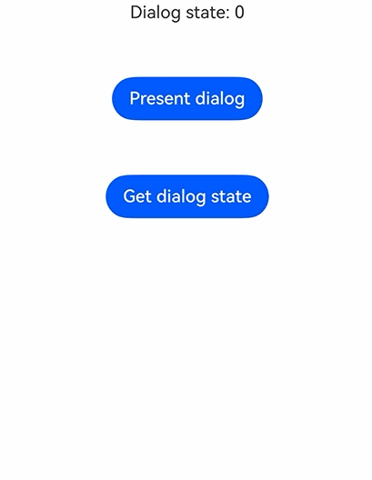

# @ohos.arkui.dialog (Dialog Box)
<!--Kit: ArkUI-->
<!--Subsystem: ArkUI-->
<!--Owner: @houguobiao-->
<!--Designer: @houguobiao-->
<!--Tester: @lxl007-->
<!--Adviser: @Brilliantry_Rui-->
<!-- md-trans-meta sourceCommit=7ded9a1a1ed831177233490290f443a350a53741 translatedAt=2026-09-01T03:17:09.840Z pushedAt=2026-09-01T08:52:16.481Z -->

To meet the requirements of flexibly configuring and managing dialog boxes in applications, this module provides unified **Dialog** type declarations, including dialog box options, button configuration, worksheet items, and enums such as the dialog box controller, alignment, and state. To call specific APIs, use the [DialogPresenter](arkts-apis-uicontext-dialogpresenter.md) object in **UIContext**.

> **NOTE**
>
> To show, update, and close a dialog box, obtain the [DialogPresenter](arkts-apis-uicontext-dialogpresenter.md) object through the [getDialogPresenter()](arkts-apis-uicontext-uicontext.md#getdialogpresenter) API in UIContext, and then call the related API.

**Since**: 26.1.0

## Modules to Import

```ts
import { dialog } from '@kit.ArkUI';
```

## DialogTextStyleOptions

Defines text style options in a dialog box, which can be used as the text style of the message content.

**Atomic service API:** This API can be used in atomic services since API version 26.1.0.

**Model restriction:** This API can be used only in the stage model.

**System capability:** SystemCapability.ArkUI.ArkUI.Full

| Name      | Type                                                         | Read-only | Optional | Description           |
| --------- | ------------------------------------------------------------ | ---- | ---- | -------------- |
| wordBreak | [WordBreak](arkui-ts/ts-appendix-enums.md#wordbreak11)       | No   | Yes  | Word breaking type.<br/>Default value: **WordBreak.BREAK_ALL** |

## DialogButton

Defines the button configuration of a fixed-style dialog box.

**Atomic service API:** This API can be used in atomic services since API version 26.1.0.

**Model restriction:** This API can be used only in the stage model.

**System capability:** SystemCapability.ArkUI.ArkUI.Full

| Name          | Type                                                         | Read-only | Optional | Description                                                  |
| ------------- | ------------------------------------------------------------ | --------- | -------- | ------------------------------------------------------------ |
| value         | [ResourceStr](arkui-ts/ts-types.md#resourcestr)              | No        | No       | Text content of the button.                                  |
| fontColor     | [ResourceColor](arkui-ts/ts-types.md#resourcecolor)          | No        | Yes      | Font color of the button.<br/>Default value: follows the system theme color. |
| backgroundColor | [ResourceColor](arkui-ts/ts-types.md#resourcecolor)        | No        | Yes      | Background color of the button.<br/>Default value: follows the system theme color. |
| enabled       | boolean                                                      | No        | Yes      | Whether to respond when the button is clicked. The value **true** means to respond, and **false** means not to respond.<br/>Default value: **true** |
| primary       | boolean                                                      | No        | Yes      | Whether the button responds to the **Enter**/**Space** key by default. The value **true** means to respond by default, and **false** means not to respond by default.<br/>Default value: **false** |
| style         | [DialogButtonStyle](arkui-ts/ts-appendix-enums.md#dialogbuttonstyle10) | No        | Yes      | Style of the button.<br/>Default value: **DialogButtonStyle.DEFAULT** |
| action        | [VoidCallback](arkui-ts/ts-types.md#voidcallback12)          | No        | No       | Callback invoked when the button is clicked.                 |

## DialogSheet

Defines the configuration item of a dialog box in the **ActionSheet** style.

**Atomic service API:** This API can be used in atomic services since API version 26.1.0.

**Model restriction:** This API can be used only in the stage model.

**System capability:** SystemCapability.ArkUI.ArkUI.Full

| Name   | Type                                                | Read-only | Optional | Description                       |
| ------ | --------------------------------------------------- | --------- | -------- | -------------------------------- |
| title  | [ResourceStr](arkui-ts/ts-types.md#resourcestr)     | No        | No       | Title content.                   |
| icon   | [ResourceStr](arkui-ts/ts-types.md#resourcestr)     | No        | Yes      | Icon content. <br/>Default value: the value is empty. |
| action | [VoidCallback](arkui-ts/ts-types.md#voidcallback12) | No        | No       | Callback invoked when the item is clicked. |

## DialogBaseOptions

Provides basic options shared by all dialog boxes, defining common attributes such as the background, border, alignment, mask, and avoidance of a dialog box. Both [DialogStyleOptions](#dialogstyleoptions) and [DialogCustomOptions](#dialogcustomoptions) are inherited from this API.

**Atomic service API:** This API can be used in atomic services since API version 26.1.0.

**Model restriction:** This API can be used only in the stage model.

**System capability:** SystemCapability.ArkUI.ArkUI.Full

| Name                    | Type                                                         | Read-only | Optional | Description                                                         |
| ----------------------- | ------------------------------------------------------------ | ---- | ---- | ------------------------------------------------------------ |
| controller              | [DialogBaseController](#dialogbasecontroller)                | No   | Yes   | Dialog box controller.                                               |
| width                   | [Dimension](arkui-ts/ts-types.md#dimension10)                | No   | Yes   | Width of the dialog box.<br/>Default value: adaptive to the content.                                               |
| height                  | [Dimension](arkui-ts/ts-types.md#dimension10)                | No   | Yes   | Height of the dialog box.<br/>Default value: adaptive to the content.                                               |
| backgroundColor         | [ResourceColor](arkui-ts/ts-types.md#resourcecolor)          | No   | Yes   | Background color of the dialog box.<br/>Default value: **Color.Transparent**<br/>**Note:** When **backgroundColor** is set to a non-transparent color, **backgroundBlurStyle** must be set to **BlurStyle.NONE**. |
| backgroundBlurStyle     | [BlurStyle](arkui-ts/ts-universal-attributes-background.md#blurstyle9) | No   | Yes   | Background blur style of the dialog box.<br/>Default value: **BlurStyle.NONE**<br/>**Note:** Set it to **BlurStyle.NONE** to disable the background blur. When **backgroundBlurStyle** is set to a value other than **BlurStyle.NONE**, do not set **backgroundColor**; otherwise, the color display will not meet expectations. When the system material **systemMaterial** is set, **backgroundBlurStyle** does not take effect. |
| backgroundBlurStyleOptions | [BackgroundBlurStyleOptions](arkui-ts/ts-universal-attributes-background.md#backgroundblurstyleoptions10) | No   | Yes   | Background blur style with items. The default value is the same as that in the **BackgroundBlurStyleOptions** type description. |
| backgroundEffect        | [BackgroundEffectOptions](arkui-ts/ts-universal-attributes-background.md#backgroundeffectoptions11) | No   | Yes   | Background effect with items. The default value is the same as that in the **BackgroundEffectOptions** type description.|
| borderRadius            | [Dimension](arkui-ts/ts-types.md#dimension10)&nbsp;\|&nbsp;[BorderRadiuses](arkui-ts/ts-types.md#borderradiuses9)&nbsp;\|&nbsp;[LocalizedBorderRadiuses](arkui-ts/ts-types.md#localizedborderradiuses12) | No   | Yes   | Corner radius of the background border.<br>Default value: **{ topLeft: '32vp', topRight: '32vp', bottomLeft: '32vp', bottomRight: '32vp' }** |
| borderWidth             | [Dimension](arkui-ts/ts-types.md#dimension10)&nbsp;\|&nbsp;[EdgeWidths](arkui-ts/ts-types.md#edgewidths9)&nbsp;\|&nbsp;[LocalizedEdgeWidths](arkui-ts/ts-types.md#localizededgewidths12) | No   | Yes   | Border width of the dialog box.<br>Default value: **0**                               |
| borderColor             | [ResourceColor](arkui-ts/ts-types.md#resourcecolor)&nbsp;\|&nbsp;[EdgeColors](arkui-ts/ts-types.md#edgecolors9)&nbsp;\|&nbsp;[LocalizedEdgeColors](arkui-ts/ts-types.md#localizededgecolors12) | No   | Yes   | Border color of the dialog box.<br/>Default value: **Color.Black**                   |
| borderStyle             | [BorderStyle](arkui-ts/ts-appendix-enums.md#borderstyle)&nbsp;\|&nbsp;[EdgeStyles](arkui-ts/ts-types.md#edgestyles9) | No   | Yes   | Border style of the dialog box.<br/>Default value: **BorderStyle.Solid**               |
| shadow                  | [ShadowOptions](arkui-ts/ts-universal-attributes-image-effect.md#shadowoptions)&nbsp;\|&nbsp;[ShadowStyle](arkui-ts/ts-universal-attributes-image-effect.md#shadowstyle10) | No   | Yes   | Shadow of the dialog box.<br/>On PCs/2-in-1 devices, the default shadow value is **ShadowStyle.OUTER_FLOATING_MD** when the component gains focus and **ShadowStyle.OUTER_FLOATING_SM** when the component loses focus. Other devices have no shadow by default. |
| alignment               | [DialogBaseAlignment](#dialogbasealignment)                  | No   | Yes   | Alignment mode of the dialog box.<br/>Default value: **DialogBaseAlignment.DEFAULT**                                           |
| offset                  | [Offset](arkui-ts/ts-types.md#offset)                        | No   | Yes   | Offset of the dialog box relative to the alignment position. <br/>Default value: **{ dx: 0, dy: 0 }**         |
| maskRect                | [Rectangle](arkui-ts/ts-methods-alert-dialog-box.md#rectangle8) | No   | Yes   | Mask area of the dialog box.<br>Default value: **{ x: 0, y: 0, width: '100%', height: '100%' }** |
| maskColor               | [ResourceColor](arkui-ts/ts-types.md#resourcecolor)          | No   | Yes   | Mask color of the dialog box.<br/>Default value: follows the system theme color.                                           |
| isModal                 | boolean                                                      | No   | Yes   | Whether the dialog box is modal. The value **true** indicates that it is modal and has a mask, and the value **false** indicates that it is non-modal and has no mask.<br/>Default value: true |
| showInSubWindow         | boolean                                                      | No   | Yes   | Whether to display the dialog box in a subwindow. The value **true** indicates that it is displayed in a subwindow, and the value **false** indicates that it is displayed in the application.<br/>Default value: **false**<br/>**Note:** **isModal** set to **true** and **showInSubWindow** set to **true** cannot be used at the same time. |
| displayModeInSubWindow  | [DialogDisplayMode](arkui-ts/ts-appendix-enums.md#dialogdisplaymode) | No   | Yes   | Display mode of the dialog box when displayed in a subwindow.<br/>Default value: **DialogDisplayMode.SCREEN_BASED** |
| autoCancel              | boolean                                                      | No   | Yes   | Whether to allow exiting by touching the mask or pressing the **Back** key. The value **true** indicates to allow the exiting, and **false** indicates the opposite.<br/>Default value: **true** |
| focusable               | boolean                                                      | No   | Yes   | Whether the dialog box is focusable. The value **true** indicates that the dialog box is focusable, and **false** indicates the opposite.<br/>Default value: **true** |
| dialogTransition        | [TransitionEffect](arkui-ts/ts-transition-animation-component.md#transitioneffect10) | No   | Yes   | Transition effect for opening/closing the content area of the dialog box.<br/>Default value: the default transition effect of the system.            |
| maskTransition          | [TransitionEffect](arkui-ts/ts-transition-animation-component.md#transitioneffect10) | No   | Yes   | Transition effect for opening/closing the mask.<br/>Default value: the default mask transition effect of the system.                       |
| keyboardAvoidMode       | [KeyboardAvoidMode](arkui-ts/ts-universal-attributes-popup.md#keyboardavoidmode12) | No   | Yes   | Keyboard avoidance mode.<br/>Default value: **KeyboardAvoidMode.DEFAULT**         |
| keyboardAvoidDistance   | [LengthMetrics](js-apis-arkui-graphics.md#lengthmetrics12)   | No   | Yes   | Distance between the dialog box and the system keyboard.<br/>Default value: the default avoidance distance of the system.                                 |
| onWillAppear            | [VoidCallback](arkui-ts/ts-types.md#voidcallback12)          | No   | Yes   | Callback invoked before the dialog box opening animation starts.                             |
| onDidAppear             | [VoidCallback](arkui-ts/ts-types.md#voidcallback12)          | No   | Yes   | Callback invoked when the dialog box appears.                                     |
| onWillDisappear         | [VoidCallback](arkui-ts/ts-types.md#voidcallback12)          | No   | Yes   | Callback invoked before the dialog box closing animation starts.                             |
| onDidDisappear          | [VoidCallback](arkui-ts/ts-types.md#voidcallback12)          | No   | Yes   | Callback invoked when the dialog box disappears.                                     |
| onWillDismiss           | Callback&lt;[DialogDismissal](#dialogdismissal)&gt;          | No   | Yes   | Callback invoked when the dialog box interaction is dismissed.<br/>**Note:** If this callback is registered, the dialog box will not be closed immediately after the user taps the mask or presses the **Back** button. The **reason** parameter in the callback is used to determine whether the dialog box can be closed. |
| enableHoverMode         | boolean                                                      | No   | Yes   | Whether to enable the hover mode. The value **true** indicates to enable the hover mode, and **false** indicates the opposite.<br/>Default value: **false** |
| hoverModeArea           | [HoverModeAreaType](arkui-ts/ts-universal-attributes-sheet-transition.md#hovermodeareatype14) | No   | Yes   | Display area of the dialog box in hover mode.<br/>Default value: **HoverModeAreaType.BOTTOM_SCREEN** |
| levelMode               | [LevelMode](js-apis-promptAction.md#levelmode15)     | No   | Yes   | Display level of the dialog box.<br/>Default value: **LevelMode.OVERLAY**             |
| levelUniqueId           | number                                                       | No   | Yes   | Unique ID of the node under the display layer of the page-level dialog box.<br/>Value range: an integer greater than or equal to 0.<br/>**Note:** This parameter takes effect only when **levelMode** is set to **LevelMode.EMBEDDED**. |
| immersiveMode           | [ImmersiveMode](js-apis-promptAction.md#immersivemode15) | No   | Yes   | Mask effect of the page-level dialog box.<br/>Default value: **ImmersiveMode.DEFAULT**<br/>**Note:** This parameter takes effect only when **levelMode** is set to **LevelMode.EMBEDDED**.     |
| levelOrder              | [LevelOrder](js-apis-promptAction.md#levelorder18)           | No   | Yes   | Display order of the dialog box.<br/>Default value: the value returned by `LevelOrder.clamp(0)`. |
| systemMaterial          | [SystemUiMaterial](arkui-ts/ts-universal-attributes-image-effect.md#systemuimaterial) | No   | Yes   | System material for the dialog box. Different materials have different effects and affect the background color, border, shadow, and other visual attributes of the dialog box.<br/>**Note:**<br/>- Default value: the [ImmersiveMaterial](arkts-apis-uimaterial.md#immersivematerial) object whose **style** of [ImmersiveOptions](arkts-apis-uimaterial.md#immersiveoptions) is set to **ImmersiveStyle.ULTRA_THICK**. When this parameter is set to **undefined**, it has the same effect as the default value.<br/>- This parameter affects the [backgroundColor](arkui-ts/ts-universal-attributes-background.md#backgroundcolor), [backgroundBlurStyle](arkui-ts/ts-universal-attributes-background.md#backgroundblurstyle9), [backgroundEffect](arkui-ts/ts-universal-attributes-background.md#backgroundeffect11), [borderColor](arkui-ts/ts-universal-attributes-border.md#bordercolor), [borderWidth](arkui-ts/ts-universal-attributes-border.md#borderwidth), and [shadow](arkui-ts/ts-universal-attributes-image-effect.md#shadow) attributes. When the system material is set, the preceding attributes do not take effect. |

## DialogMessage

Defines the message content and text style of the dialog box. This API is inherited from [DialogTextStyleOptions](#dialogtextstyleoptions).

**Atomic service API:** This API can be used in atomic services since API version 26.1.0.

**Model restriction:** This API can be used only in the stage model.

**System capability:** SystemCapability.ArkUI.ArkUI.Full

| Name    | Type                                            | Read-only | Optional | Description             |
| ------- | ----------------------------------------------- | --------- | -------- | ----------------------- |
| content | [ResourceStr](arkui-ts/ts-types.md#resourcestr) | No        | No       | Message content of the dialog box. |

## DialogStyleOptions

Defines the options for a dialog box with a fixed style. This API is inherited from [DialogBaseOptions](#dialogbaseoptions). For specific usage, see the [present](arkts-apis-uicontext-dialogpresenter.md#present) API example of **DialogPresenter**.

**Atomic service API:** This API can be used in atomic services since API version 26.1.0.

**Model restriction:** This API can be used only in the stage model.

**System capability:** SystemCapability.ArkUI.ArkUI.Full

| Name           | Type                                                         | Read-only | Optional | Description                                                         |
| -------------- | ------------------------------------------------------------ | ---- | ---- | ------------------------------------------------------------ |
| title          | [ResourceStr](arkui-ts/ts-types.md#resourcestr)              | No   | Yes  | Title of the dialog box.<br/>Default value: no title is displayed when not set.               |
| subtitle       | [ResourceStr](arkui-ts/ts-types.md#resourcestr)              | No   | Yes  | Subtitle of the dialog box.<br/>Default value: no subtitle is displayed when not set.         |
| message        | [DialogMessage](#dialogmessage)                              | No   | Yes  | Message content and text style of the dialog box.<br/>Default value: no message content is displayed when not set. |
| buttons        | Array&lt;[DialogButton](#dialogbutton)&gt;                   | No   | Yes  | Array of buttons in the dialog box. When provided, the dialog box is displayed as an alert-style dialog box with buttons; when used together with sheets, the buttons are displayed below the worksheet item list.<br/>Default value: no buttons are displayed when not set. |
| buttonDirection | [DialogButtonOrientation](#dialogbuttonorientation)         | No   | Yes  | Arrangement of the buttons.<br/>Default value: **DialogButtonOrientation.AUTO**     |
| sheets         | Array&lt;[DialogSheet](#dialogsheet)&gt;                     | No   | Yes  | Array of worksheet items in the action-sheet style. When provided, the dialog box displays worksheet items for the user to select.<br/>Default value: no worksheet items are displayed when not set. |
| gridCount      | number                                                       | No   | Yes  | Number of grid columns for the worksheet items in the dialog box, used to control the column layout of worksheet items in the grid.<br/>Default value: **4**<br/>Value range: an integer greater than 0.               |

## DialogCustomOptions

Defines the options for a custom-style dialog box. This API is inherited from [DialogBaseOptions](#dialogbaseoptions).

The content of the dialog box is provided by the first parameter of the [DialogPresenter.present](arkts-apis-uicontext-dialogpresenter.md#present) API, not in this option object. For specific usage, see the [present](arkts-apis-uicontext-dialogpresenter.md#present) API example of **DialogPresenter**.

**Atomic service API:** This API can be used in atomic services since API version 26.1.0.

**Model restriction:** This API can be used only in the stage model.

**System capability:** SystemCapability.ArkUI.ArkUI.Full

| Name        | Type    | Read-only | Optional | Description                                                         |
| ----------- | ------- | ---- | ---- | ------------------------------------------------------------ |
| customStyle | boolean | No   | Yes  | Whether to enable the custom style. The value **true** means to enable the custom style, and **false** means the opposite.<br/>Default value: **false** |

## DialogBaseController

A class used to control a dialog box. It can be bound to a dialog box through the controller attribute in [DialogBaseOptions](#dialogbaseoptions). For specific usage, see the [present](arkts-apis-uicontext-dialogpresenter.md#present) API example of **DialogPresenter**.

### constructor

constructor()

A constructor of the controller.

**Atomic service API:** This API can be used in atomic services since API version 26.1.0.

**Model restriction:** This API can be used only in the stage model.

**System capability:** SystemCapability.ArkUI.ArkUI.Full

### close

close(): void

Closes the corresponding dialog box.

**Atomic service API:** This API can be used in atomic services since API version 26.1.0.

**Model restriction:** This API can be used only in the stage model.

**System capability:** SystemCapability.ArkUI.ArkUI.Full

### getState

getState(): DialogState

Obtains the state of the dialog box.

**Atomic service API:** This API can be used in atomic services since API version 26.1.0.

**Model restriction:** This API can be used only in the stage model.

**System capability:** SystemCapability.ArkUI.ArkUI.Full

**Return value**

| Type                             | Description           |
| -------------------------------- | -------------- |
| [DialogState](#dialogstate) | State of the dialog box. |

**Example**

This example demonstrates how to show a dialog box by binding **DialogBaseController** to the dialog box, close the dialog box through the controller, and obtain the state of the dialog box.

```ts
import { DialogBaseController, DialogPresenter, DialogState } from '@kit.ArkUI';
import { BusinessError } from '@kit.BasicServicesKit';

@Entry
@Component
struct Index {
  private ctx: UIContext = this.getUIContext();
  private dialogPresenter: DialogPresenter = this.ctx.getDialogPresenter();
  private controller: DialogBaseController = new DialogBaseController();
  @State dialogState: DialogState = DialogState.UNINITIALIZED;

  @Builder
  customDialogComponent() {
    Column() {
      Text('Dialog').fontSize(20)
      Column({ space: 10 }) {
        Button('Close dialog via controller').onClick(() => {
          try {
            this.controller.close();
          } catch (error) {
            let message = (error as BusinessError).message;
            let code = (error as BusinessError).code;
            console.error(`Failed to close dialog. Code: ${code}, message: ${message}`);
          }
        })
        Button('Get dialog state')
          .onClick(() => {
            this.dialogState = this.controller.getState();
            console.info('dialog state: ' + this.dialogState);
          })
      }
    }.height(150).padding(20).justifyContent(FlexAlign.SpaceBetween)
  }

  build() {
    Column({ space: 50 }) {
      Text(`Dialog state: ${this.dialogState}`)
      Button('Present dialog')
        .onClick(() => {
          this.dialogPresenter.present(() => { this.customDialogComponent() },
          {
            controller: this.controller,
          })
            .catch((error: BusinessError) => {
              console.error(`Failed to present dialog. Code: ${error.code}, message: ${error.message}`);
            })
        })
      Button('Get dialog state')
        .onClick(() => {
          this.dialogState = this.controller.getState();
          console.info('dialog state: ' + this.dialogState);
        })
    }.width('100%').height('100%').justifyContent(FlexAlign.Start)
  }
}
```



## DialogResult

Provides the response result of the dialog box.

**Atomic service API:** This API can be used in atomic services since API version 26.1.0.

**Model restriction:** This API can be used only in the stage model.

**System capability:** SystemCapability.ArkUI.ArkUI.Full

| Name | Type | Read-only | Optional | Description |
| ------- | ------ | ---- | ---- | ------------------------------------ |
| dialogId | number | No | No | ID of the dialog box.<br>Value range: an integer greater than or equal to 0. |

## DialogDismissal

Provides the information and API for dismissing a dialog box.

**Atomic service API:** This API can be used in atomic services since API version 26.1.0.

**Model restriction:** This API can be used only in the stage model.

**System capability:** SystemCapability.ArkUI.ArkUI.Full

| Name    | Type                                                         | Read-only | Optional | Description                                                         |
| ------- | ------------------------------------------------------------ | ---- | ---- | ------------------------------------------------------------ |
| dismiss | [VoidCallback](arkui-ts/ts-types.md#voidcallback12)          | No   | No   | Callback for dismissing the dialog box. This callback is invoked only when the dialog box needs to be dismissed.   |
| reason  | [DismissReason](arkui-ts/ts-universal-attributes-popup.md#dismissreason12) | No   | No   | Type of the reason that triggers the dialog box dismissal.                                       |

## DialogBaseAlignment

Defines the alignment mode of the dialog box.

**Atomic service API:** This API can be used in atomic services since API version 26.1.0.

**Model restriction:** This API can be used only in the stage model.

**System capability:** SystemCapability.ArkUI.ArkUI.Full

| Name        | Value | Description           |
| ----------- | ---- | -------------- |
| TOP         | 0    | Vertically top aligned. |
| CENTER      | 1    | Vertically centered. |
| BOTTOM      | 2    | Vertically bottom aligned. |
| DEFAULT     | 3    | Default alignment. |
| TOP_START   | 4    | Top-left aligned. |
| TOP_END     | 5    | Top-right aligned. |
| CENTER_START | 6   | Left-centered. |
| CENTER_END  | 7    | Right-centered. |
| BOTTOM_START | 8   | Bottom-left aligned. |
| BOTTOM_END  | 9    | Bottom-right aligned. |

## DialogButtonOrientation

Defines the arrangement of buttons in a dialog box.

**Atomic service API:** This API can be used in atomic services since API version 26.1.0.

**Model restriction:** This API can be used only in the stage model.

**System capability:** SystemCapability.ArkUI.ArkUI.Full

| Name       | Value | Description                                                  |
| ---------- | ----- | ------------------------------------------------------------ |
| AUTO       | 0     | Buttons are arranged horizontally when there are two or fewer buttons, and vertically when there are more than two buttons. |
| HORIZONTAL | 1     | Buttons are arranged horizontally.                           |
| VERTICAL   | 2     | Buttons are arranged vertically.                             |

## DialogState

Enumerates the states of a dialog box.

**Atomic service API:** This API can be used in atomic services since API version 26.1.0.

**Model restriction:** This API can be used only in the stage model.

**System capability:** SystemCapability.ArkUI.ArkUI.Full

| Name          | Value | Description            |
| ------------- | ----- | ---------------------- |
| UNINITIALIZED | 0     | Not initialized.       |
| INITIALIZED   | 1     | Initialized.           |
| APPEARING     | 2     | Appearing.             |
| APPEARED      | 3     | Appeared.              |
| DISAPPEARING  | 4     | Disappearing.          |
| DISAPPEARED   | 5     | Disappeared.           |

<!--no_check-->