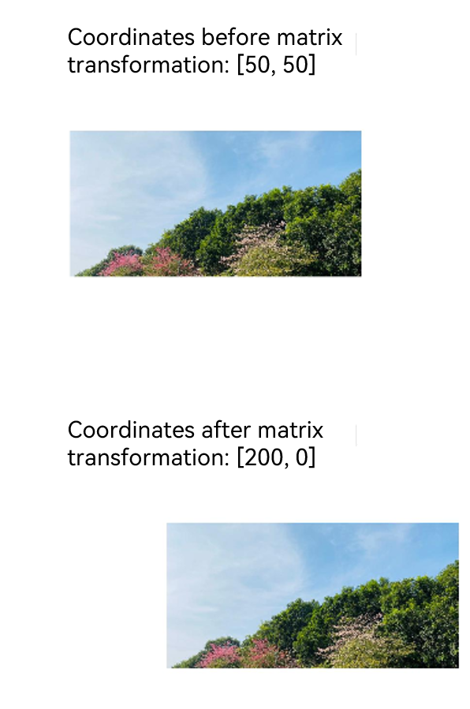

# @ohos.matrix4 (Matrix Transformation)
<!--Kit: ArkUI-->
<!--Subsystem: ArkUI-->
<!--Owner: @hehongyang3-->
<!--Designer: @hehongyang3-->
<!--Tester: @lxl007-->
<!--Adviser: @Brilliantry_Rui-->
<!-- md-trans-meta sourceCommit=39ca26def5c22dc659f3dc0b76ef62a29421e77a translatedAt=2026-09-01T03:19:50.874Z pushedAt=2026-09-02T01:18:17.284Z -->

Provides matrix transformation capabilities for components, including translation, rotation, and scaling. For details, see [Transformation](arkui-ts/ts-universal-attributes-transformation.md).

**Matrix4** can be used in the following scenarios:

In [Transformation](arkui-ts/ts-universal-attributes-transformation.md), the [transform](arkui-ts/ts-universal-attributes-transformation.md#transform18) API uses the **Matrix4** object to set the two-dimensional transformation matrix for a component, and the [transform3D](arkui-ts/ts-universal-attributes-transformation.md#transform3d20) API uses the **Matrix4** object to set the three-dimensional transformation matrix for a component.


> **NOTE**
>
> The initial APIs of this module are supported since API version 7. Newly added APIs will be marked with a superscript to indicate their earliest API version.


## Modules to Import

```ts
import { matrix4 } from '@kit.ArkUI';
```


## matrix4.init

init(options: [number,number,number,number,number,number,number,number,number,number,number,number,number,number,number,number]): Matrix4Transit

Constructor of **Matrix4**. It is used to create a 4 x 4 matrix based on the input parameters. The matrix is column-major, that is, the 16 values in the input array are filled into the matrix column by column: array[0] to array[3] form the first column, array[4] to array[7] form the second column, array[8] to array[11] form the third column, and array[12] to array[15] form the fourth column. When only an identity matrix is required, you are advised to use **matrix4.identity()**.

**Atomic service API**: This API can be used in atomic services since API version 11.

**System capability**: SystemCapability.ArkUI.ArkUI.Full

**Parameters**

| Name| Type                                                        | Mandatory| Description                                                        |
| ------ | ------------------------------------------------------------ | ---- | ------------------------------------------------------------ |
| options | [number,number,number,number,<br>number,number,number,number,<br>number,number,number,number,<br>number,number,number,number] | Yes | Number array whose length is 16 (4 x 4). For details, see **4 x 4 matrix description**.<br>Value range of each number: (-∞, +∞)<br>Default value:<br>[1,&nbsp;0,&nbsp;0,&nbsp;0,<br>0,&nbsp;1,&nbsp;0,&nbsp;0,<br>0,&nbsp;0,&nbsp;1,&nbsp;0,<br>0,&nbsp;0,&nbsp;0,&nbsp;1] |

**Return value**

| Type                             | Description                        |
| --------------------------------- | ---------------------------- |
| [Matrix4Transit](#matrix4transit) | 4 x 4 matrix object created based on the input parameters.|

**4 x 4 matrix description**

| Name | Type    | Mandatory  | Description                  |
| ---- | ------ | ---- | -------------------- |
| m00  | number | Yes   | Scaling value of the x-axis. The default value is **1** for the identity matrix.     |
| m01  | number | Yes    | The second matrix element, which is affected by the rotation or tilt of the x, y, and z axes.   |
| m02  | number | Yes    | The third matrix element, which is affected by the rotation of the x, y, and z axes.   |
| m03  | number | Yes    | The fourth matrix element, which is affected by perspective projection.               |
| m10  | number | Yes    | The fifth matrix element, which is affected by the rotation or tilt of the x, y, and z axes.   |
| m11  | number | Yes   | Scaling value of the y-axis. The default value is **1** for the identity matrix.     |
| m12  | number | Yes    | The seventh matrix element, which is affected by the rotation of the x, y, and z axes.   |
| m13  | number | Yes    | The eighth matrix element, which is affected by perspective projection.               |
| m20  | number | Yes    | The ninth matrix element, which is affected by the rotation of the x, y, and z axes.   |
| m21  | number | Yes    | The tenth matrix element, which is affected by the rotation of the x, y, and z axes.  |
| m22  | number | Yes   | Scaling value of the z-axis. The default value is **1** for the identity matrix.     |
| m23  | number | Yes    | The 12th matrix element, which is affected by perspective projection.               |
| m30  | number | Yes    | Translation value of the x-axis, in px. The default value is **0** for the identity matrix. |
| m31  | number | Yes    | Translation value of the y-axis, in px. The default value is **0** for the identity matrix. |
| m32  | number | Yes    | Translation value of the z-axis, in px. The default value is **0** for the identity matrix. |
| m33  | number | Yes    | Valid in homogeneous coordinates, presenting the perspective projection effect.    |

**Example**

```ts
import { matrix4 } from '@kit.ArkUI';

// Create a 4 x 4 matrix.
let matrix = matrix4.init(
  [1.0, 0.0, 0.0, 0.0,
    0.0, 1.0, 0.0, 0.0,
    0.0, 0.0, 1.0, 0.0,
    0.0, 0.0, 0.0, 1.0]);

@Entry
@Component
struct Tests {
  build() {
    Column() {
      // Replace $r("app.media.zh") with the image resource file you use.
      Image($r("app.media.zh"))
        .width('40%')
        .height(100)
        .transform(matrix)
    }
  }
}
```


## matrix4.identity

identity(): Matrix4Transit

Initializes a matrix and returns an identity matrix object, which can serve as the basis for subsequent matrix transformation operations.

**Atomic service API**: This API can be used in atomic services since API version 11.

**System capability**: SystemCapability.ArkUI.ArkUI.Full

**Return value**

| Type                             | Description          |
| --------------------------------- | -------------- |
| [Matrix4Transit](#matrix4transit) | Identity matrix object.|

**Example**

```ts
// The effect of matrix 1 is the same as that of matrix 2.
import { matrix4 } from '@kit.ArkUI';

let matrix1 = matrix4.init(
  [1.0, 0.0, 0.0, 0.0,
    0.0, 1.0, 0.0, 0.0,
    0.0, 0.0, 1.0, 0.0,
    0.0, 0.0, 0.0, 1.0]);
let matrix2 = matrix4.identity();

@Entry
@Component
struct Tests {
  build() {
    Column() {
      // Replace $r("app.media.zh") with the image resource file you use.
      Image($r("app.media.zh"))
        .width('40%')
        .height(100)
        .transform(matrix1)
      // Replace $r("app.media.zh") with the image resource file you use.
      Image($r("app.media.zh"))
        .width("40%")
        .height(100)
        .margin({ top: 150 })
        .transform(matrix2)
    }
  }
}
```

## Matrix4Transit

Implements a matrix object. It supports combining multiple transformation effects by chained calls of the **translate**, **scale**, **rotate**, and **skew** APIs.

> **NOTE**
>
> When multiple transformation APIs are called in chain mode, the order of transformations affects the final result. For example, translating first and then scaling produces a different transformation effect from scaling first and then translating. Select the correct call order based on the expected effect.
>
> The **translate**, **scale**, **rotate**, **skew**, **combine**, and **invert** APIs modify the original matrix on which they are called. To keep the original matrix unchanged, call **copy()** before performing the transformation, for example, **matrix.copy().translate({x:100})**.

**Atomic service API**: This API can be used in atomic services since API version 11.

**System capability**: SystemCapability.ArkUI.ArkUI.Full

### copy

copy(): Matrix4Transit

Copies this matrix object.

**Atomic service API**: This API can be used in atomic services since API version 11.

**System capability**: SystemCapability.ArkUI.ArkUI.Full

**Return value**

| Type                             | Description                |
| --------------------------------- | -------------------- |
| [Matrix4Transit](#matrix4transit) | Copy object of the current matrix.|


**Example**

```ts
// xxx.ets
import { matrix4 } from '@kit.ArkUI';

let matrix1 = matrix4.identity().scale({ x: 1.5 });
let matrix2 = matrix1.copy().translate({ x: 200 });

@Entry
@Component
struct Test {
  imageSize: Length = '300px';

  build() {
    Column({ space: '50px' }) {
      // Replace $r("app.media.testImage") with the image resource file you use.
      Image($r("app.media.testImage"))
        .width(this.imageSize)
        .height(this.imageSize)
      // Replace $r("app.media.testImage") with the image resource file you use.
      Image($r("app.media.testImage"))
        .width(this.imageSize)
        .height(this.imageSize)
        .transform(matrix1)
      // Replace $r("app.media.testImage") with the image resource file you use.
      Image($r("app.media.testImage"))
        .width(this.imageSize)
        .height(this.imageSize)
        .transform(matrix2)
    }.alignItems(HorizontalAlign.Center)
    .height('100%').width('100%')
    .justifyContent(FlexAlign.Center)
  }
}
```


### combine

combine(options: Matrix4Transit): Matrix4Transit

Combines the effects of two matrices to generate a new matrix object. The matrix that calls this API will be changed.

**Atomic service API**: This API can be used in atomic services since API version 11.

**System capability**: SystemCapability.ArkUI.ArkUI.Full

**Parameters**

| Name| Type                             | Mandatory| Description              |
| ------ | --------------------------------- | ---- | ------------------ |
| options | [Matrix4Transit](#matrix4transit) | Yes | Matrix object to be combined. Its transformation effect is combined on the current matrix (matrix multiplication) to generate a new transformation matrix. |

**Return value**

| Type                             | Description              |
| --------------------------------- | ------------------ |
| [Matrix4Transit](#matrix4transit) | Object after matrix combination.|

**Example**

```ts
// xxx.ets
import { matrix4 } from '@kit.ArkUI';

@Entry
@Component
struct Test {
  private matrix1 = matrix4.identity().translate({ x: 200 });
  private matrix2 = matrix4.identity().scale({ x: 2 });

  build() {
    Column() {
      // Before matrix transformation
      // Replace $r("app.media.icon") with the image resource file you use.
      Image($r("app.media.icon"))
        .width('40%')
        .height(100)
        .margin({ top: 50 })
      // Translate the x-axis by 200px, and then scale it twice to obtain the resultant matrix.
      // Replace $r("app.media.icon") with the image resource file you use.
      Image($r("app.media.icon"))
        .transform(this.matrix1.copy().combine(this.matrix2))
        .width("40%")
        .height(100)
        .margin({ top: 50 })
    }
  }
}
```


### invert

invert(): Matrix4Transit

Inverts this matrix object. The matrix that calls this API will be changed and transformed into its inverse matrix, which is then returned. The product of the inverse matrix and the original matrix is the identity matrix.

**Atomic service API**: This API can be used in atomic services since API version 11.

**System capability**: SystemCapability.ArkUI.ArkUI.Full

**Return value**

| Type                             | Description                  |
| --------------------------------- | ---------------------- |
| [Matrix4Transit](#matrix4transit) | Inverse matrix object of the current matrix.|

**Example**

```ts
import { matrix4 } from '@kit.ArkUI';

// The effect of matrix 1 (width scaled up by 2x) is opposite to that of matrix 2 (width scaled down by 2x).
let matrix1 = matrix4.identity().scale({ x: 2 });
let matrix2 = matrix1.copy().invert();

@Entry
@Component
struct Tests {
  build() {
    Column() {
      // Replace $r("app.media.zh") with the image resource file you use.
      Image($r("app.media.zh"))
        .width(200)
        .height(100)
        .transform(matrix1)
        .margin({ top: 100 })
      // Replace $r("app.media.zh") with the image resource file you use.
      Image($r("app.media.zh"))
        .width(200)
        .height(100)
        .margin({ top: 150 })
        .transform(matrix2)
    }
  }
}
```


### translate

translate(options: TranslateOption): Matrix4Transit

Translates this matrix object along the x, y, and z axes. The matrix that calls this API will be changed.

**Atomic service API**: This API can be used in atomic services since API version 11.

**System capability**: SystemCapability.ArkUI.ArkUI.Full

**Parameters**

| Name| Type                               | Mandatory| Description          |
| ------ | ----------------------------------- | ---- | -------------- |
| options | [TranslateOption](#translateoption) | Yes  | Translation configuration.|

**Return value**

| Type                             | Description                        |
| --------------------------------- | ---------------------------- |
| [Matrix4Transit](#matrix4transit) | Matrix object after the translation.|

**Example**

```ts
// xxx.ets
import { matrix4 } from '@kit.ArkUI';

@Entry
@Component
struct Test {
  private matrix1 = matrix4.identity().translate({ x: 100, y: 200, z: 30 });

  build() {
    Column() {
      // Replace $r("app.media.bg1") with the image resource file you use.
      Image($r("app.media.bg1")).transform(this.matrix1)
        .width('40%')
        .height(100)
    }
  }
}
```


### scale

scale(options: ScaleOption): Matrix4Transit

Scales this matrix object along the x, y, and z axes. The matrix that calls this API will be changed.

**Atomic service API**: This API can be used in atomic services since API version 11.

**System capability**: SystemCapability.ArkUI.ArkUI.Full

**Parameters**

| Name| Type                       | Mandatory| Description          |
| ------ | --------------------------- | ---- | -------------- |
| options | [ScaleOption](#scaleoption) | Yes  | Scaling configuration.|

**Return value**

| Type                             | Description                        |
| --------------------------------- | ---------------------------- |
| [Matrix4Transit](#matrix4transit) | Matrix object after the scaling.|

**Example**

```ts
// xxx.ets
import { matrix4 } from '@kit.ArkUI';

@Entry
@Component
struct Test {
  private matrix1 = matrix4.identity()
    .scale({
      x: 2,
      y: 3,
      z: 4,
      centerX: 50,
      centerY: 50
    });

  build() {
    Column() {
      // Replace $r("app.media.testImage") with the image resource file you use.
      Image($r("app.media.testImage")).transform(this.matrix1)
        .width('300px')
        .height("300px")
    }.width("100%").height("100%").justifyContent(FlexAlign.Center)
  }
}
```


### skew<sup>12+</sup>

skew(x: number, y: number): Matrix4Transit

Skews this matrix object along the x and y axes. The matrix that calls this API will be changed.

**Atomic service API**: This API can be used in atomic services since API version 12.

**Model restriction**: This API can be used only in the stage model.

**System capability**: SystemCapability.ArkUI.ArkUI.Full

**Parameters**

| Name| Type                       | Mandatory| Description          |
| ------ | --------------------------- | ---- | -------------- |
| x | number | Yes | Skew on the x-axis. The value is the shear factor (that is, the tan value).<br>The value **0** indicates no skew, a positive value indicates the skew along the positive direction of the x-axis, and a negative value indicates the skew along the negative direction of the x-axis. |
| y | number | Yes | Skew on the y-axis. The value is the shear factor (that is, the tan value).<br>The value **0** indicates no skew, a positive value indicates the skew along the positive direction of the y-axis, and a negative value indicates the skew along the negative direction of the y-axis. |

**Return value**

| Type                             | Description                        |
| --------------------------------- | ---------------------------- |
| [Matrix4Transit](#matrix4transit) | Matrix object after the skewing.|

**Example**

```ts
// xxx.ets
import { matrix4 } from '@kit.ArkUI';

@Entry
@Component
struct Test {
  private matrix1 = matrix4.identity().skew(2, 3);

  build() {
    Column() {
      // Replace $r("app.media.bg1") with the image resource file you use.
      Image($r("app.media.bg1")).transform(this.matrix1)
        .height(100)
        .margin({
          top: 300
        })
    }
    .width('100%')
    .height("100%")
  }
}
```


### rotate

rotate(options: RotateOption): Matrix4Transit

Rotates this matrix object along the x, y, and z axes. The matrix that calls this API will be changed.

**Atomic service API**: This API can be used in atomic services since API version 11.

**System capability**: SystemCapability.ArkUI.ArkUI.Full

**Parameters**

| Name| Type                         | Mandatory| Description          |
| ------ | ----------------------------- | ---- | -------------- |
| options | [RotateOption](#rotateoption) | Yes  | Rotation configuration.|

**Return value**

| Type                             | Description                        |
| --------------------------------- | ---------------------------- |
| [Matrix4Transit](#matrix4transit) | Matrix object after the rotation.|

**Example**

```ts
// xxx.ets
import { matrix4 } from '@kit.ArkUI';

@Entry
@Component
struct Test {
  private matrix1 = matrix4.identity()
    .rotate({
      x: 1,
      y: 1,
      z: 2,
      angle: 30
    });

  build() {
    Column() {
      // Replace $r("app.media.bg1") with the image resource file you use.
      Image($r("app.media.bg1")).transform(this.matrix1)
        .width('40%')
        .height(100)
    }.width("100%").margin({ top: 50 })
  }
}
```


### transformPoint

transformPoint(options: [number, number]): [number, number]

Applies the current transformation effect to a coordinate point.

**Atomic service API**: This API can be used in atomic services since API version 11.

**System capability**: SystemCapability.ArkUI.ArkUI.Full

**Parameters**

| Name | Type            | Mandatory| Description              |
| ------- | ---------------- | ---- | ------------------ |
| options | [number, number] | Yes | Coordinate point to be transformed, in the format of [x, y], where **x** is the horizontal coordinate and **y** is the vertical coordinate, in px. |

**Return value**

| Type            | Description                       |
| ---------------- | --------------------------- |
| [number, number] | Coordinate point after matrix transformation, in the format of [x, y]. |

**Example**

```ts
// xxx.ets
import { matrix4 } from '@kit.ArkUI';

@Entry
@Component
struct Test {
  private originPoint: number[] = [50, 50];
  private matrix1 = matrix4.identity().translate({ x: 150, y: -50 });
  private transformPoint = this.matrix1.transformPoint([this.originPoint[0], this.originPoint[1]]);
  private matrix2 = matrix4.identity().translate({ x: this.transformPoint[0], y: this.transformPoint[1] });

  build() {
    Column() {
      Text(`Coordinates before matrix transformation: [${this.originPoint}]`)
        .fontSize(16)
      // Replace $r("app.media.image") with the image resource file you use.
      Image($r("app.media.image"))
        .width('600px')
        .height('300px')
        .margin({ top: 50 })
      Text(`Coordinates after matrix transformation: [${this.transformPoint}]`)
        .fontSize(16)
        .margin({ top: 100 })
      // Replace $r("app.media.image") with the image resource file you use.
      Image($r("app.media.image"))
        .width('600px')
        .height('300px')
        .margin({ top: 50 })
        .transform(this.matrix2)
    }.width('100%').padding(50)
  }
}
```



### setPolyToPoly<sup>12+</sup>

setPolyToPoly(options: PolyToPolyOptions): Matrix4Transit

Maps the vertex coordinates of a polygon to those of another polygon. This API is applicable to scenarios requiring custom deformation, such as image perspective correction, 3D visual effects, and card flip effects.

**Atomic service API**: This API can be used in atomic services since API version 12.

**Model restriction**: This API can be used only in the stage model.

**System capability**: SystemCapability.ArkUI.ArkUI.Full

**Parameters**

| Name| Type            | Mandatory| Description              |
| ------ | ---------------- | ---- | ------------------ |
| options | [PolyToPolyOptions](#polytopolyoptions12)  | Yes   | Options for polygon mapping, which specify the mapping relationship between the source polygon vertex coordinates and the target polygon vertex coordinates. |

**Return value**

| Type                             | Description                |
| --------------------------------- | -------------------- |
| [Matrix4Transit](#matrix4transit) | Matrix object after the mapping.|

> **NOTE**
>
> This API must be used with the component's **scale({centerX:0,centerY:0,x:1})** API to set the transformation center to the upper left corner of the component. By default, the transformation center is the center of the component. If this API is not used together with **scale()**, the mapping effect of **setPolyToPoly** will be based on the center of the component, which may cause the transformation result to be different from what is expected. Here, **scale()** should be called on the component (for example, **Image.scale()**) and used together with **transform()**, rather than being a transformation method of the matrix object.

**Example**

```ts
import { matrix4 } from '@kit.ArkUI';

@Entry
@Component
struct Index {
  private matrix1 = matrix4.identity().setPolyToPoly({
    src: [{ x: 0, y: 0 }, { x: 500, y: 0 }, { x: 0, y: 500 }, { x: 500, y: 500 }],
    dst: [{ x: 0, y: 0 }, { x: 500, y: 0 }, { x: 0, y: 500 }, { x: 750, y: 1000 }], pointCount: 4
  });

  build() {
    Stack() {
      Column().backgroundColor(Color.Blue)
        .width('500px')
        .height('500px')
      // Replace $r("app.media.transition_image1") with the image resource file you use.
      Image($r('app.media.transition_image1'))
        .scale({ centerX: 0, centerY: 0, x: 1 })
        .transform(this.matrix1)
        .width('500px')
        .height('500px')
    }.width('100%').height('100%').opacity(0.5)
  }
}
```


## TranslateOption

Describes the translation parameters.

**Atomic service API**: This API can be used in atomic services since API version 11.

**System capability**: SystemCapability.ArkUI.ArkUI.Full

| Name| Type  | Read-Only| Optional| Description                                                       |
| ---- | ------ | ---- | ---------- | ------------------------------------------------- |
| x    | number | No | Yes   | Translation distance along the x-axis.<br>Unit: px<br>Default value: **0**<br>Value range: (-∞, +∞) |
| y    | number | No | Yes   | Translation distance along the y-axis.<br>Unit: px<br>Default value: **0**<br>Value range: (-∞, +∞) |
| z    | number | No | Yes   | Translation distance along the z-axis.<br>Unit: px<br>Default value: **0**<br>Value range: (-∞, +∞) |

## ScaleOption

Describes the scale parameters.

**Atomic service API**: This API can be used in atomic services since API version 11.

**System capability**: SystemCapability.ArkUI.ArkUI.Full

| Name   | Type  | Read-Only| Optional| Description                                                        |
| ------- | ------ | ---- | ---------- | -------------------------------------------------- |
| x       | number | No | Yes  | Scaling multiple along the x-axis. x = 1: No scaling is applied, and the original size is retained.<br>x > 1: The image is scaled up along the x-axis.<br>0 < x < 1: The image is scaled down along the x-axis.<br>x < 0: The image is scaled in the reverse direction along the x-axis.<br>Default value: **1**<br>Value range: (-∞, +∞) |
| y       | number | No | Yes  | Scaling multiple along the y-axis. y > 1: The image is scaled up along the y-axis.<br>0 < y < 1: The image is scaled down along the y-axis.<br>y < 0: The image is scaled in the reverse direction along the y-axis.<br>Default value: **1**<br>Value range: (-∞, +∞) |
| z       | number | No | Yes  | Scaling multiple along the z-axis. z = 1: No scaling is applied, and the original size is retained.<br>z > 1: The image is scaled up along the z-axis.<br>0 < z < 1: The image is scaled down along the z-axis.<br>z < 0: The image is scaled in the reverse direction along the z-axis.<br>Default value: **1**<br>Value range: (-∞, +∞) |
| centerX | number | No | Yes  | X-coordinate of the transformation center.<br>Unit: px<br>Default value: X-coordinate of the component center<br>Value range: (-∞, +∞)    |
| centerY | number | No | Yes  | Y-coordinate of the transformation center.<br>Unit: px<br>Default value: Y-coordinate of the component center<br>Value range: (-∞, +∞)    |

## RotateOption

Describes the rotation parameters.

**Atomic service API**: This API can be used in atomic services since API version 11.

**System capability**: SystemCapability.ArkUI.ArkUI.Full

| Name   | Type  | Read-Only| Optional| Description                                                        |
| ------- | ------ | ---- | ---------- | -------------------------------------------------- |
| x       | number | No | Yes  | X-coordinate of the rotation axis vector, which specifies the component of the rotation axis in the x direction. Pass this parameter when rotating around an axis with an x component. If not passed, the x component of the rotation axis defaults to **0**.<br>**Note:** The rotation vector is meaningful only when at least one of x, y, and z is not 0.<br>Default value: **0**<br>Value range: (-∞, +∞) |
| y       | number | No | Yes  | Y-coordinate of the rotation axis vector, which specifies the component of the rotation axis in the y direction. Pass this parameter when rotating around an axis with a y component. If not passed, the y component of the rotation axis defaults to **0**.<br>**Note:** The rotation vector is meaningful only when at least one of x, y, and z is not 0.<br>Default value: **0**<br>Value range: (-∞, +∞) |
| z       | number | No | Yes  | Z-coordinate of the rotation axis vector, which specifies the component of the rotation axis in the z direction. Pass this parameter when rotating around an axis with a z component. If not passed, the z component of the rotation axis defaults to **0**.<br>Default value: **0**<br>Value range: (-∞, +∞).<br>**Note:** The rotation vector is meaningful only when at least one of x, y, and z is not 0; otherwise, no rotation effect is produced. |
| angle   | number | No | Yes  | Rotation angle, which is used to set the rotation amount of the component around the rotation axis. Pass this parameter when the component needs to be rotated. If not passed, the component is not rotated.<br>Unit: degree (°)<br>Default value: **0** |
| centerX | number | No | Yes  | Additional x-axis offset of the center point of a single matrix transformation operation relative to the component transform center point (anchor point).<br>Unit: px<br>Default value: **0**<br>**Note**<br>When the value is **0**, the matrix transformation center in the x direction is exactly the component anchor point in the x direction. The value indicates the additional offset relative to the component anchor point in the x direction. For details about the implementation, see [Example 3: Implementing Rotation Around a Center Point](arkui-ts/ts-universal-attributes-transformation.md#example-3-implementing-rotation-around-a-center-point). |
| centerY | number | No | Yes  | Additional y-axis offset of the center point of a single matrix transformation operation relative to the component transform center point (anchor point).<br>Unit: px<br>Default value: **0**<br>**Note**<br>When the value is **0**, the matrix transformation center in the y direction is exactly the component anchor point in the y direction. The value indicates the additional offset relative to the component anchor point in the y direction. For details about the implementation, see [Example 3: Implementing Rotation Around a Center Point](arkui-ts/ts-universal-attributes-transformation.md#example-3-implementing-rotation-around-a-center-point). |

## PolyToPolyOptions<sup>12+</sup>

Describes the configuration options for polygon-to-polygon transformation mapping.

**Atomic service API**: This API can be used in atomic services since API version 12.

**Model restriction**: This API can be used only in the stage model.

**System capability**: SystemCapability.ArkUI.ArkUI.Full

| Name| Type  | Read-Only| Optional| Description                                                       |
| ---- | ------ | ---- | ---- | ----------------------------------------------------------- |
| src    |  Array<[Point](#point12)> | No   | No   | Vertex coordinates of the source polygon, used to define the start shape of the transformation mapping. |
| srcIndex    | number | No   | Yes   | Start index of the source point coordinates, used to specify the position in the **src** array from which point obtaining starts. This parameter is passed when the source point needs to be obtained from a specific position in the **src** array. If not passed, the point is obtained from index 0.<br>Default value: **0**<br>Value range: [0, +∞) |
| dst    |  Array<[Point](#point12)>  | No   | No   | Vertex coordinates of the target polygon, used to define the target shape of the transformation mapping. |
| dstIndex    | number | No   | Yes   | Start index of the destination point coordinates, used to specify the position in the **dst** array from which destination point obtaining starts.<br>Default value: **src.length/2**<br>Value range: [0, +∞) |
| pointCount    | number | No   | Yes   | Number of used points. Prerequisite: The number of points in the **src** and **dst** arrays must be no less than the value of **pointCount**. If the number of used points is 0, the identity matrix is returned. If the number is 1, one source point and one destination point are used, and a translation matrix that translates the source point to the destination point is returned. If the number is 2, an affine transformation matrix (including rotation, scaling, and translation) is returned. If the number is 3, an affine transformation matrix (including rotation, scaling, translation, and shearing) is returned. If the number is 4, a perspective transformation matrix is returned. The value does not take effect when it is out of range.<br>Default value: **0**<br>Value range: [0, +∞) |

## Point<sup>12+</sup>

Defines the data structure of a coordinate point.

**Atomic service API**: This API can be used in atomic services since API version 12.

**Model restriction**: This API can be used only in the stage model.

**System capability**: SystemCapability.ArkUI.ArkUI.Full

| Name| Type  | Read-Only| Optional| Description                                                       |
| ---- | ------ | ---- | -------- | --------------------------------------------------- |
| x    |  number | No | No   | X-axis coordinate.<br>Unit: px<br>Value range: (-∞, +∞) |
| y    | number | No | No   | Y-axis coordinate.<br>Unit: px<br>Value range: (-∞, +∞) |

## matrix4.copy<sup>(deprecated)</sup>

copy(): Matrix4Transit


Copies this matrix object.

> **NOTE**
>
> This API is supported since API version 7 and deprecated since API version 10. You are advised to use [Matrix4Transit.copy](#copy) instead.


**System capability**: SystemCapability.ArkUI.ArkUI.Full

**Return value**

| Type                             | Description                |
| --------------------------------- | -------------------- |
| [Matrix4Transit](#matrix4transit) | Copy object of the current matrix.|

**Example**

```ts
// xxx.ets
import { matrix4 } from '@kit.ArkUI';

let matrix1 = matrix4.identity().translate({ x: 100 });
// Perform a scale operation on the copy of matrix1 without affecting matrix1.
let matrix2 = matrix1.copy().scale({ x: 2 });

@Entry
@Component
struct Test {

  build() {
    Column() {
      // Replace $r("app.media.bg1") with the image resource file you use.
      Image($r("app.media.bg1"))
        .width('40%')
        .height(100)
        .transform(matrix1)
      // Replace $r("app.media.bg2") with the image resource file you use.
      Image($r("app.media.bg2"))
        .width("40%")
        .height(100)
        .margin({ top: 50 })
        .transform(matrix2)
    }
  }
}
```


## matrix4.invert<sup>(deprecated)</sup>

invert(): Matrix4Transit

Inverts this matrix object. The matrix that calls this API will be changed.

> **NOTE**
>
> This API is supported since API version 7 and deprecated since API version 10. You are advised to use [Matrix4Transit.invert](#invert) instead.

**System capability**: SystemCapability.ArkUI.ArkUI.Full

**Return value**

| Type                             | Description                  |
| --------------------------------- | ---------------------- |
| [Matrix4Transit](#matrix4transit) | Inverse matrix object of the current matrix.|

## matrix4.combine<sup>(deprecated)</sup>

combine(options: Matrix4Transit): Matrix4Transit

Combines the effects of two matrices to generate a new matrix object. The matrix that calls this API will be changed.

> **NOTE**
>
> The transformation results of **matrixA.combine(matrixB)** and **matrixB.combine(matrixA)** are different. The call order of **combine()** determines the order in which the transformations are combined. For example, translating first and then scaling produces a different transformation effect from scaling first and then translating. Select the correct call order based on the expected transformation effect. To keep the original matrix unchanged, call **copy()** before calling **combine()**, for example, **matrixA.copy().combine(matrixB)**.

> **NOTE**
>
> This API is supported since API version 7 and deprecated since API version 10. You are advised to use [Matrix4Transit.combine](#combine) instead.

**System capability**: SystemCapability.ArkUI.ArkUI.Full

**Parameters**

| Name | Type                             | Mandatory| Description              |
| ------- | --------------------------------- | ---- | ------------------ |
| options | [Matrix4Transit](#matrix4transit) | Yes | Matrix object to be combined. Its transformation effect will be combined with the identity matrix. |

**Return value**

| Type                             | Description                  |
| --------------------------------- | ---------------------- |
| [Matrix4Transit](#matrix4transit) | Matrix object after combination.|

## matrix4.translate<sup>(deprecated)</sup>

translate(options: TranslateOption): Matrix4Transit

Translates this matrix object along the x, y, and z axes. The matrix that calls this API will be changed.

> **NOTE**
>
> This API is supported since API version 7 and deprecated since API version 10. You are advised to use [Matrix4Transit.translate](#translate) instead.

**System capability**: SystemCapability.ArkUI.ArkUI.Full

**Parameters**

| Name | Type                               | Mandatory| Description          |
| ------- | ----------------------------------- | ---- | -------------- |
| options | [TranslateOption](#translateoption) | Yes | Translation options for setting the translation distance on the x-axis, y-axis, and z-axis. |

**Return value**

| Type                             | Description                  |
| --------------------------------- | ---------------------- |
| [Matrix4Transit](#matrix4transit) | Matrix object after translation.|

## matrix4.scale<sup>(deprecated)</sup>

scale(options: ScaleOption): Matrix4Transit

Scales this matrix object along the x, y, and z axes. The matrix that calls this API will be changed.

> **NOTE**
>
> This API is supported since API version 7 and deprecated since API version 10. You are advised to use [Matrix4Transit.scale](#scale) instead.

**System capability**: SystemCapability.ArkUI.ArkUI.Full

**Parameters**

| Name | Type                       | Mandatory| Description          |
| ------- | --------------------------- | ---- | -------------- |
| options | [ScaleOption](#scaleoption) | Yes | Scaling options for setting the scale multiples of the x-axis, y-axis, and z-axis and the coordinates of the transform center point. |

**Return value**

| Type                             | Description                  |
| --------------------------------- | ---------------------- |
| [Matrix4Transit](#matrix4transit) | Matrix object after scaling.|

## matrix4.rotate<sup>(deprecated)</sup>

rotate(options: RotateOption): Matrix4Transit

Rotates this matrix object along the x, y, and z axes. The matrix that calls this API will be changed.

> **NOTE**
>
> This API is supported since API version 7 and deprecated since API version 10. You are advised to use [Matrix4Transit.rotate](#rotate) instead.

**System capability**: SystemCapability.ArkUI.ArkUI.Full

**Parameters**

| Name | Type                         | Mandatory| Description          |
| ------- | ----------------------------- | ---- | -------------- |
| options | [RotateOption](#rotateoption) | Yes | Rotation options for setting the rotation axis vector (x/y/z), rotation angle, and transform center point offset. |

**Return value**

| Type                             | Description                  |
| --------------------------------- | ---------------------- |
| [Matrix4Transit](#matrix4transit) | Matrix object after rotation.|

## matrix4.transformPoint<sup>(deprecated)</sup>

transformPoint(options: [number, number]): [number, number]

Applies the current transformation effect to a coordinate point.

> **NOTE**
>
> This API is supported since API version 7 and deprecated since API version 10. You are advised to use [Matrix4Transit.transformPoint](#transformpoint) instead.

**System capability**: SystemCapability.ArkUI.ArkUI.Full

**Parameters**

| Name | Type            | Mandatory| Description              |
| ------- | ---------------- | ---- | ------------------ |
| options | [number, number] | Yes  | Point to be transformed.|

**Return value**

| Type            | Description                       |
| ---------------- | --------------------------- |
| [number, number] | Coordinate point after matrix transformation, in the format [x, y]. |