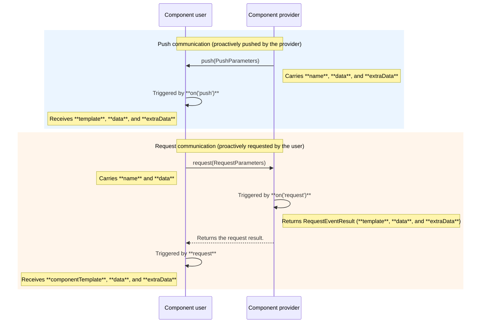

# @ohos.pluginComponent (PluginComponentManager)

<!--Kit: ArkUI-->
<!--Subsystem: ArkUI-->
<!--Owner: @dutie123-->
<!--Designer: @dutie123-->
<!--Tester: @fredyuan0912-->
<!--Adviser: @Brilliantry_Rui-->
<!-- md-trans-meta sourceCommit=c43314d48e5bb6db0c940e002f5fb3a101c7f656 translatedAt=2026-07-29T09:22:42.214Z pushedAt=2026-08-04T02:41:02.063Z -->

The **PluginComponentManager** module provides APIs for the **PluginComponent** user to request components and data and send component templates and data.

The communication process of the plug-in component is shown in the following figure.



> **NOTE**
>
> The initial APIs of this module are supported since API version 8. Newly added APIs will be marked with a superscript to indicate their earliest API version.

## Modules to Import

```ts
import { pluginComponentManager } from '@kit.ArkUI';
```

## PluginComponentTemplate

Describes the **PluginComponent** template parameters.

**Atomic service API**: This API can be used in atomic services since API version 12.

**System capability**: SystemCapability.ArkUI.ArkUI.Full

| Name   | Type  | Read-Only| Optional| Description                       |
| ------- | ------ | ---- | ---- | --------------------------- |
| source  | string | No| No| Component template name.               |
| ability | string | No| No| Bundle name of the provider ability.|

## pluginComponentManager

Implements a plugin component manager, which provides management capabilities such as requesting, pushing, and event listening for plug-in components.

### KVObject

type KVObject = { [key: string]: number | string | boolean | [] | KVObject }

Stores information in the form of key-value pairs, conforming to the JSON format.

**Atomic service API**: This API can be used in atomic services since API version 12.

**System capability**: SystemCapability.ArkUI.ArkUI.Full

| Name   | Type  | Mandatory| Description                       |
| ------- | ------ | ---- | --------------------------- |
| [key: string] | number \| string \| boolean \| [] \| [KVObject](#kvobject) | No | Key-value pair.<br>**number**: numeric value type.<br> **string**: string value type. The value can be an empty string.<br> **boolean**: boolean value type.<br> **[]**: empty array value.<br>[KVObject](#kvobject): KVObject value type. |

### PushParameters

Defines the parameters required when using the **pluginComponentManager.push** API.

**Atomic service API**: This API can be used in atomic services since API version 12.

**System capability**: SystemCapability.ArkUI.ArkUI.Full

| Name       | Type                              | Read-Only| Optional  | Description                                      |
| --------- | ----------------------------------- | ---- | ---- | ---------------------------------------- |
| want      | [Want](../apis-ability-kit/js-apis-application-want.md) | No| No   | Ability information of the component user.                         |
| name      | string                              | No| No   | Component name.                                   |
| data      | [KVObject](#kvobject)               | No | No    | Component data stored in key-value pairs, used to transfer service data to the component user. The key and value types are defined by the service.                                   |
| extraData | [KVObject](#kvobject)               | No | No    | Extra data stored in key-value pairs, used to transfer additional service information. The key and value types are defined by the service.                                   |
| jsonPath  | string                              | No | Yes    | Path of the [external.json](#about-the-externaljson-file) file that stores the template path. This parameter is passed when the template needs to be loaded directly through an external configuration file instead of being sent through Push communication. When **jsonPath** is not empty, Push communication is not triggered, and the template path is read directly from **external.json** for loading. When this parameter is not passed or is empty, Push communication is triggered to push the component and data to the component user. |

### RequestParameters

Defines the parameters required when using the **pluginComponentManager.request** API.

**Atomic service API**: This API can be used in atomic services since API version 12.

**System capability**: SystemCapability.ArkUI.ArkUI.Full

| Name      | Type                              | Read-Only| Optional| Description                                      |
| -------- | ----------------------------------- | ---- | ---- |---------------------------------------- |
| want     | [Want](../apis-ability-kit/js-apis-application-want.md) | No| No   | Ability information of the component provider.                         |
| name     | string                              | No| No   | Name of the requested component.                                 |
| data     | [KVObject](#kvobject)               | No  | No    | Component data stored in key-value pairs, used to transfer service data to the component provider. The key and value types are defined by the service.                                   |
| jsonPath | string                              | No  | Yes    | Path to the [external.json](#about-the-externaljson-file) file that stores the template path. This parameter is passed when the template needs to be loaded directly from an external configuration file instead of being obtained through Request communication. When **jsonPath** is not empty, Request communication is not triggered and the template path is read directly from **external.json**. When this parameter is not passed or is empty, Request communication is triggered to request the template from the component provider. |

### RequestCallbackParameters

Provides the result returned after the **pluginComponentManager.request** API is called.

**Atomic service API**: This API can be used in atomic services since API version 12.

**System capability**: SystemCapability.ArkUI.ArkUI.Full

| Name             | Type                                     | Read-Only| Optional| Description |
| ----------------- | ---------------------------------------- | ---- | ---- | ----- |
| componentTemplate | [PluginComponentTemplate](#plugincomponenttemplate) | No| No   | Component template.|
| data              | [KVObject](#kvobject)                    | No | No    | Component data stored in key-value pairs. The key and value types are defined by the service. |
| extraData         | [KVObject](#kvobject)                    | No | No    | Extra data. This is an optional parameter. If not provided, it is not included in the returned result by default. |

### RequestEventResult

Provides the data type used to respond to a request event after the request listener is registered.

**Atomic service API**: This API can be used in atomic services since API version 12.

**System capability**: SystemCapability.ArkUI.ArkUI.Full

| Name      | Type                 | Read-Only| Optional | Description   |
| --------- | --------------------- | ---- | ---- | ----- |
| template  | string                | No | Yes    | Component template. This is an optional parameter. If not provided, it is not included in the return result by default. Set this parameter when the component template information needs to be returned; it can be omitted when the template is not required. |
| data      | [KVObject](#kvobject) | No | Yes    | Component data stored in key-value pairs, used to transfer service data when responding to a request. The key and value types are defined by the service. This is an optional parameter. If not provided, it is not included in the return result by default. |
| extraData | [KVObject](#kvobject) | No | Yes    | Extra data passed in the request event. This is an optional parameter. If not provided, it is not included in the return result by default. |

### OnPushEventCallback

type OnPushEventCallback = (source: Want, template: PluginComponentTemplate, data: KVObject, extraData: KVObject) => void

Registers the listener for the push event.

**Atomic service API**: This API can be used in atomic services since API version 12.

**System capability**: SystemCapability.ArkUI.ArkUI.Full

**Parameters**

| Name       | Type                                      | Mandatory  | Description                    |
| --------- | ---------------------------------------- | ---- | ---------------------- |
| source    | [Want](../apis-ability-kit/js-apis-application-want.md)      | Yes    | Information about the push request sender.         |
| template  | [PluginComponentTemplate](#plugincomponenttemplate) | Yes   | Component template.|
| data      | [KVObject](#kvobject)                    | Yes    | Data content transmitted in the push event, stored in key-value pairs. The key and value types are defined by the service.                    |
| extraData | [KVObject](#kvobject)                    | Yes    | Extra data transmitted in the push event, stored in key-value pairs. The key and value types are defined by the service.                  |

**Example**

```ts
import { pluginComponentManager, PluginComponentTemplate } from '@kit.ArkUI';
import { Want } from '@kit.AbilityKit';

const onPushListener = (source: Want, template: PluginComponentTemplate, data: pluginComponentManager.KVObject, extraData: pluginComponentManager.KVObject) => {
  console.info("onPushListener template.source=" + template.source);
  console.info("onPushListener source=" + JSON.stringify(source));
  console.info("onPushListener template=" + JSON.stringify(template));
  console.info("onPushListener data=" + JSON.stringify(data));
  console.info("onPushListener extraData=" + JSON.stringify(extraData));
};
```

### OnRequestEventCallback

type OnRequestEventCallback = (source: Want, name: string, data: KVObject) => RequestEventResult

Registers the listener for the request event.

**Atomic service API**: This API can be used in atomic services since API version 12.

**System capability**: SystemCapability.ArkUI.ArkUI.Full

**Parameters**

| Name       | Type                                 | Mandatory  | Description               |
| --------- | ----------------------------------- | ---- | ----------------- |
| source    | [Want](../apis-ability-kit/js-apis-application-want.md) | Yes   | Information about the request sender.|
| name      | string                              | Yes    | Name of the requested component.             |
| data | [KVObject](#kvobject)               | Yes    | Data content transmitted in the request event, stored in key-value pairs. The key and value types are defined by the service.            |

**Return value**

| Type                                      | Description                                                      |
| ---------------------------------------- | --------------------------------------------------------- |
| [RequestEventResult](#requesteventresult) | Data type for responding to a request event after the request listener is registered. |

**Example**

```ts
import { pluginComponentManager } from '@kit.ArkUI';
import { Want } from '@kit.AbilityKit';

const onRequestListener = (source: Want, name: string, data: pluginComponentManager.KVObject) => {
  console.info("onRequestListener");
  console.info("onRequestListener source=" + JSON.stringify(source));
  console.info("onRequestListener name=" + name);
  console.info("onRequestListener data=" + JSON.stringify(data));
  // Build the return data for the Request event callback, specifying the component template path and carrying the request data back to the requester.
  let returnData: Record<string, string | pluginComponentManager.KVObject> = {
    "template": "ets/pages/plugin.js",
    "data": data,
  }
  return returnData;
}
```

### pluginComponentManager.push

push(param: PushParameters , callback: AsyncCallback&lt;void&gt;): void

Pushes the component and data to the component user. This API is applicable to scenarios where the provider needs to proactively notify the user to refresh the display after data is updated.

Cooperation method: The user must first call [on('push', callback)](#plugincomponentmanageron) to register a push event listener before receiving the components and data pushed through this API. If the user does not register the listener, the pushed data cannot be received.

**Atomic service API**: This API can be used in atomic services since API version 12.

**System capability**: SystemCapability.ArkUI.ArkUI.Full

**Parameters**

| Name     | Type                               | Mandatory  | Description          |
| -------- | --------------------------------- | ---- | ------------ |
| param    | [PushParameters](#pushparameters) | Yes    | Detailed parameters for pushing the component.  |
| callback | AsyncCallback&lt;void&gt;         | Yes   | Asynchronous callback used to return the result.|

**Example**

```ts
import { pluginComponentManager } from '@kit.ArkUI';

pluginComponentManager.push(
  {
    want: {
      bundleName: "com.example.provider",
      abilityName: "com.example.provider.MainAbility",
    },
    name: "plugintemplate",
    data: {
      "key_1": "plugin component test",
      "key_2": 34234,
    },
    extraData: {
      "extra_str": "this is push event",
    },
    jsonPath: "",
  },
  (err) => {
    if (err) {
      console.error(`push_callback: err.code = ${err.code}, err.message = ${err.message}`);
      return;
    }
    console.info("push_callback: push ok!");
  }
)
```

### pluginComponentManager.request

request(param: RequestParameters, callback: AsyncCallback&lt;RequestCallbackParameters&gt;): void

Requests the component from the component provider. This API is applicable to scenarios where the user needs to obtain the provider's components and data on demand.

Cooperation method: The provider must first call [on('request', callback)](#plugincomponentmanageron) to register a request event listener before receiving the request initiated by the user through this API and returning data. If the provider does not register the listener, the request cannot be responded to.

**Atomic service API**: This API can be used in atomic services since API version 12.

**System capability**: SystemCapability.ArkUI.ArkUI.Full

**Parameters**

| Name  | Type                                                        | Mandatory| Description                                                        |
| -------- | ------------------------------------------------------------ | ---- | ------------------------------------------------------------ |
| param    | [RequestParameters](#requestparameters)                      | Yes  | Details about the component template request.                                    |
| callback | AsyncCallback&lt;[RequestCallbackParameters](#requestcallbackparameters)&gt; | Yes | Asynchronous callback for this request, used to return the data obtained from the request through the parameter of the callback. |

**Example**

```ts
import { pluginComponentManager } from '@kit.ArkUI';

pluginComponentManager.request(
  {
    want: {
      bundleName: "com.example.provider",
      abilityName: "com.example.provider.MainAbility",
    },
    name: "plugintemplate",
    data: {
      "key_1": "plugin component test",
      "key_2": 1111111,
    },
    jsonPath: "",
  },
  (err, data) => {
    if (err) {
      console.error(`request_callback: err.code = ${err.code}, err.message = ${err.message}`);
      return;
    }
    console.info("request_callback: componentTemplate.ability=" + data.componentTemplate.ability);
    console.info("request_callback: componentTemplate.source=" + data.componentTemplate.source);
    console.info("request_callback: data=" + JSON.stringify(data.data));
    console.info("request_callback: extraData=" + JSON.stringify(data.extraData));
  }
)
```

### pluginComponentManager.on

on(eventType: string, callback: OnPushEventCallback | OnRequestEventCallback): void

Listens for events of the request type and returns the requested data, or listens for events of the push type and receives the data pushed by the provider.

**Atomic service API**: This API can be used in atomic services since API version 12.

**System capability**: SystemCapability.ArkUI.ArkUI.Full

**Parameters**

| Name      | Type                                      | Mandatory  | Description                                      |
| --------- | ---------------------------------------- | ---- | ---------------------------------------- |
| eventType | string                                   | Yes    | Event type to listen for. The options are as follows:<br/>**"push"**: The component provider proactively pushes data to the user.<br/>**"request"**: The component user proactively requests data from the provider. |
| callback  | [OnPushEventCallback](#onpusheventcallback)&nbsp;\|&nbsp;[OnRequestEventCallback](#onrequesteventcallback) | Yes   | Callback used to return the result. The type is [OnPushEventCallback](#onpusheventcallback) for the push event and [OnRequestEventCallback](#onrequesteventcallback) for the request event.|

**Example**

```ts
import { pluginComponentManager, PluginComponentTemplate } from '@kit.ArkUI';
import { Want } from '@kit.AbilityKit';

const onPushListener = (source:Want, template:PluginComponentTemplate, data:pluginComponentManager.KVObject, extraData:pluginComponentManager.KVObject) => {
  console.info("onPushListener template.source=" + template.source);
  console.info("onPushListener source=" + JSON.stringify(source));
  console.info("onPushListener template=" + JSON.stringify(template));
  console.info("onPushListener data=" + JSON.stringify(data));
  console.info("onPushListener extraData=" + JSON.stringify(extraData));
}
const onRequestListener = (source:Want, name:string, data:pluginComponentManager.KVObject) => {
  console.info("onRequestListener");
  console.info("onRequestListener source=" + JSON.stringify(source));
  console.info("onRequestListener name=" + name);
  console.info("onRequestListener data=" + JSON.stringify(data));
  let returnData: Record<string, string | pluginComponentManager.KVObject> = { "template": "ets/pages/plugin.js", "data": data };
  return returnData;
}
pluginComponentManager.on("push", onPushListener);
pluginComponentManager.on("request", onRequestListener);
```

## About the external.json File

The **external.json** file is created by developers. It stores component names and template paths in key-value pairs. The component name is used as the keyword, and the corresponding template path is used as the value.

**Example**

```json
{
  "PluginProviderExample": "ets/pages/PluginProviderExample.js",
  "plugintemplate2": "ets/pages/plugintemplate2.js"
}

```