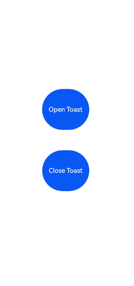
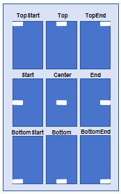
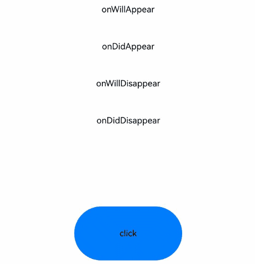

# @ohos.promptAction (Prompt)
<!--Kit: ArkUI-->
<!--Subsystem: ArkUI-->
<!--Owner: @houguobiao-->
<!--Designer: @houguobiao-->
<!--Tester: @lxl007-->
<!--Adviser: @Brilliantry_Rui-->

This module provides API for creating and displaying toasts, dialog boxes, and action menus.

> **NOTE**
>
> - The initial APIs of this module are supported since API version 9. Newly added APIs will be marked with a superscript to indicate their earliest API version.
>
> - This module cannot be used in the file declaration of the [UIAbility](../apis-ability-kit/js-apis-app-ability-uiAbility.md). In other words, the APIs of this module can be used only after a component instance is created; they cannot be called in the lifecycle of the UIAbility.
>
> - The functionality of this module depends on UI context. This means that the APIs of this module cannot be used where [the UI context is ambiguous](../../ui/arkts-global-interface.md#ambiguous-ui-context). For details, see [UIContext](arkts-apis-uicontext-uicontext.md). It is recommended that you use the dialog box APIs provided by **UIContext**<!--Del-->, except for UI-less scenarios such as [ServiceExtensionAbility](../../application-models/serviceextensionability-sys.md)<!--DelEnd-->.

## Modules to Import

```ts
import { promptAction } from '@kit.ArkUI';
```

## promptAction.openToast<sup>18+</sup>

openToast(options: ShowToastOptions): Promise&lt;number&gt;

Shows a toast. This API uses a promise to return the toast ID.

> **NOTE**
> 
> - Subwindows with **showMode** set to **TOP_MOST** or **SYSTEM_TOP_MOST** do not support **openToast** in input method type windows. For details, see the constraints in the input method framework [createPanel](../apis-ime-kit/js-apis-inputmethodengine.md#createpanel10-1).
>
> - Directly using **openToast** can lead to the issue of [ambiguous UI context](../../ui/arkts-global-interface.md#ambiguous-ui-context). To avoid this, obtain the **PromptAction** object using the **getPromptAction** API in **UIContext** and then call the [openToast](arkts-apis-uicontext-promptaction.md#opentoast18) API through this object.

**Atomic service API**: This API can be used in atomic services since API version 18.

**System capability**: SystemCapability.ArkUI.ArkUI.Full

**Parameters**

| Name | Type                                                        | Mandatory| Description          |
| ------- | ------------------------------------------------------------ | ---- | -------------- |
| options | [ShowToastOptions](#showtoastoptions) | Yes  | Toast configuration options.|

**Return value**

| Type            | Description                                |
| ---------------- | ------------------------------------ |
| Promise&lt;number&gt; | that returns the toast ID for use with **closeToast**.|

**Error codes**

For details about the error codes, see [Universal Error Codes](../errorcode-universal.md) and [API Call Error Codes](errorcode-internal.md).

| ID| Error Message                                                    |
| -------- | ------------------------------------------------------------ |
| 401      | Parameter error. Possible causes: 1. Mandatory parameters are left unspecified; 2.Incorrect parameters types; 3. Parameter verification failed. |
| 100001   | Internal error.                                              |

**Example**

```ts
import { BusinessError } from '@kit.BasicServicesKit';
import { PromptAction, UIContext } from '@kit.ArkUI';

@Entry
@Component
struct toastExample {
  @State toastId: number = 0;
  uiContext: UIContext = this.getUIContext();
  promptAction: PromptAction = this.uiContext.getPromptAction();

  build() {
    Column() {
      Button('Open Toast')
        .height(100)
        .type(ButtonType.Capsule)
        .onClick(() => {
          this.promptAction.openToast({
            message: 'Toast Message',
            duration: 10000,
          }).then((toastId: number) => {
            this.toastId = toastId;
          })
            .catch((error: BusinessError) => {
              console.error(`openToast error code is ${error.code}, message is ${error.message}`);
            })
        })
      Blank().height(50)
      Button('Close Toast')
        .height(100)
        .type(ButtonType.Capsule)
        .onClick(() => {
          try {
            this.promptAction.closeToast(this.toastId);
          } catch (error) {
            let message = (error as BusinessError).message;
            let code = (error as BusinessError).code;
            console.error(`CloseToast error code is ${code}, message is ${message}`);
          }
        })
    }.height('100%').width('100%').justifyContent(FlexAlign.Center)
  }
}
```



## promptAction.closeToast<sup>18+</sup>

closeToast(toastId: number): void

Closes the specified toast.

> **NOTE**
> 
> Directly using **closeToast** can lead to the issue of [ambiguous UI context](../../ui/arkts-global-interface.md#ambiguous-ui-context). To avoid this, obtain the **PromptAction** object using the **getPromptAction** API in **UIContext** and then call the [openToast](arkts-apis-uicontext-promptaction.md#closetoast18) API through this object.

**Atomic service API**: This API can be used in atomic services since API version 18.

**System capability**: SystemCapability.ArkUI.ArkUI.Full

**Parameters**

| Name | Type  | Mandatory| Description                         |
| ------- | ------ | ---- | ----------------------------- |
| toastId | number | Yes  | Toast ID returned from **openToast**.|

**Error codes**

For details about the error codes, see [Universal Error Codes](../errorcode-universal.md), [Popup Window Error Codes](errorcode-promptAction.md), and [API Call Error Codes](errorcode-internal.md).

| ID| Error Message                                                    |
| -------- | ------------------------------------------------------------ |
| 401      | Parameter error. Possible causes: 1. Mandatory parameters are left unspecified; 2.Incorrect parameters types; 3. Parameter verification failed. |
| 100001   | Internal error.                                              |
| 103401   | Cannot find the toast.                                       |

**Example**

See the example for [promptAction.openToast18](#promptactionopentoast18).

## ShowToastOptions

Provides toast configuration options.

**System capability**: SystemCapability.ArkUI.ArkUI.Full

| Name                   | Type                                                        | Read-Only| Optional| Description                                                        |
| ----------------------- | ------------------------------------------------------------ | ---- | ------------------------------------------------------------ | ------------------------------------------------------------ |
| message                 | string&nbsp;\|&nbsp;[Resource](arkui-ts/ts-types.md#resource) | No | No | Text to display.<br>**NOTE**<br>The default font is **'Harmony Sans'**. Other fonts are not supported.<br>**Atomic service API**: This API can be used in atomic services since API version 11.|
| duration                | number                                                       | No  | Yes | Duration that the toast will remain on the screen.<br>Default value: 1500 ms.<br>Value range: [1500, 10000].<br>If a value less than 1500 ms is set, the default value is used. If the value greater than 10000 ms is set, the upper limit 10000 ms is used.<br>**Atomic service API**: This API can be used in atomic services since API version 11.|
| bottom                  | string&nbsp;\|&nbsp;number                                   | No  | Yes | Distance from the bottom of the toast to the navigation bar. If the soft keyboard is raised and the **bottom** value is too small, the toast will automatically avoid being blocked by the soft keyboard by moving up 80 vp above it.<br>Default value: **80vp**<br>**NOTE**<br>When there is no navigation bar at the bottom, **bottom** sets the distance from the bottom of the toast to the bottom of the window.<br>If the **alignment** property is set, **bottom** will not take effect.<br>**Atomic service API**: This API can be used in atomic services since API version 11.|
| alignment<sup>12+</sup> | [Alignment](arkui-ts/ts-appendix-enums.md#alignment)         | No  | Yes | Alignment mode.<br>Default value: **undefined**. If **alignment** is not set and a navigation bar or soft keyboard is present, the toast is automatically adjusted according to the position of the navigation bar or soft keyboard. For details, see the description of **bottom**.<br>**NOTE**<br>The figure below shows the position of the toast in different alignment modes.<br><br>The text display of the toast is always left-aligned; other alignment modes are not supported.<br>**Atomic service API**: This API can be used in atomic services since API version 12.        |
| offset<sup>12+</sup>    | [Offset](arkui-ts/ts-types.md#offset)                        | No  | Yes | Offset in the specified alignment mode.<br>Default value: **{ dx: 0, dy: 0 }**, indicating no offset<br>**NOTE**<br>Only values in units of px are supported. Values in other units must be converted to units of px before being passed in. For example, to set a value in vp, convert it to px first and then pass the converted value.<br>**Atomic service API**: This API can be used in atomic services since API version 12.|
| showMode<sup>11+</sup>  | [ToastShowMode](#toastshowmode11)                            | No  | Yes | Display level mode of the toast.<br>Default value: **ToastShowMode.DEFAULT**, which means to show the toast in the application.<br>**Atomic service API**: This API can be used in atomic services since API version 12.|
| backgroundColor<sup>12+</sup>    | [ResourceColor](arkui-ts/ts-types.md#resourcecolor) | No  | Yes | Background color of the toast.<br>Default value: **Color.Transparent**.<br>**NOTE**<br>The background color will be visually combined with the blur effect when both properties are set. If the resulting effect does not match your design requirements, you can disable the blur effect entirely by explicitly setting the **backgroundBlurStyle** property to **BlurStyle.NONE**.<br>**Atomic service API**: This API can be used in atomic services since API version 12.|
| textColor<sup>12+</sup>    | [ResourceColor](arkui-ts/ts-types.md#resourcecolor) | No  | Yes | Text color of the toast.<br>Default value: **Color.Black**.<br>**Atomic service API**: This API can be used in atomic services since API version 12.|
| backgroundBlurStyle<sup>12+</sup>    | [BlurStyle](arkui-ts/ts-universal-attributes-background.md#blurstyle9) | No  | Yes | Background blur style of the toast.<br>Default value: **BlurStyle.COMPONENT_ULTRA_THICK**<br>**NOTE**<br>Setting this parameter to **BlurStyle.NONE** disables the background blur. When **backgroundBlurStyle** is set to a value other than **NONE**, do not set **backgroundColor**. If you do, the color display may not produce the expected visual effect.<br>**Atomic service API**: This API can be used in atomic services since API version 12.|
| shadow<sup>12+</sup>    | [ShadowOptions](arkui-ts/ts-universal-attributes-image-effect.md#shadowoptions)&nbsp;\|&nbsp;[ShadowStyle](arkui-ts/ts-universal-attributes-image-effect.md#shadowstyle10) | No  | Yes | Shadow of the toast background.<br>Default value: **ShadowStyle.OUTER_DEFAULT_MD**<br>**Atomic service API**: This API can be used in atomic services since API version 12.|
| enableHoverMode<sup>14+</sup>    | boolean                       | No  | Yes | Whether to respond when the device is in semi-folded mode. The value **true** means to respond when the device is in semi-folded mode.<br>Default value: **false**, meaning not to respond when the device is in semi-folded mode.<br>**Atomic service API**: This API can be used in atomic services since API version 14.|
| hoverModeArea<sup>14+</sup> | [HoverModeAreaType](arkui-ts/ts-universal-attributes-sheet-transition.md#hovermodeareatype14)         | No  | Yes | Display area of the toast in the hover state.<br>Default value: **HoverModeAreaType.BOTTOM_SCREEN**, indicating that the toast is displayed in the lower half screen<br>**Atomic service API**: This API can be used in atomic services since API version 14.        |

## ToastShowMode<sup>11+</sup>

Enumerates display modes for toasts. By default, the toast is displayed within the application and supports display in subwindows.

**Atomic service API**: This API can be used in atomic services since API version 12.

**System capability**: SystemCapability.ArkUI.ArkUI.Full

| Name    | Value  | Description                  |
| -------- | ---- | ---------------------- |
| DEFAULT  | 0    | The toast is displayed within the application.  |
| TOP_MOST | 1    | The toast is displayed in a subwindow.|

## ShowDialogOptions

Describes the options for showing the dialog box.

**System capability**: SystemCapability.ArkUI.ArkUI.Full

| Name                             | Type                                                        | Read-Only| Optional| Description                                                        |
| --------------------------------- | ------------------------------------------------------------ | ---- | ------------------------------------------------------------ | ------------------------------------------------------------ |
| title                             | string&nbsp;\|&nbsp;[Resource](arkui-ts/ts-types.md#resource) | No  | Yes | Title of the dialog box.<br>**Atomic service API**: This API can be used in atomic services since API version 11.|
| message                           | string&nbsp;\|&nbsp;[Resource](arkui-ts/ts-types.md#resource) | No  | Yes | Text body.<br>**Atomic service API**: This API can be used in atomic services since API version 11.|
| buttons                           | Array&lt;[Button](#button)&gt;                               | No  | Yes | Array of buttons in the dialog box. The array structure is {text:'button',&nbsp;color:&nbsp;'\#666666'}. More than one button is supported.<br>**Atomic service API**: This API can be used in atomic services since API version 11.|
| alignment<sup>10+</sup>           | [DialogAlignment](arkui-ts/ts-methods-alert-dialog-box.md#dialogalignment) | No  | Yes | Alignment mode of the dialog box in the vertical direction.<br>Default value: **DialogAlignment.Default**<br>**NOTE**<br>If **showInSubWindow** is set to **true** in **UIExtension**, the dialog box is aligned with the host window based on **UIExtension**.<br>**Atomic service API**: This API can be used in atomic services since API version 11.|
| offset<sup>10+</sup>              | [Offset](arkui-ts/ts-types.md#offset)                        | No  | Yes | Offset of the dialog box relative to the alignment position.<br>Default value: **{&nbsp;dx:&nbsp;0&nbsp;,&nbsp;dy:&nbsp;0&nbsp;}**<br>**Atomic service API**: This API can be used in atomic services since API version 11.|
| maskRect<sup>10+</sup>            | [Rectangle](arkui-ts/ts-methods-alert-dialog-box.md#rectangle8) | No  | Yes | Mask area of the dialog box. Events within the mask area are blocked, while events outside the mask area are transmitted.<br>Default value: **{ x: 0, y: 0, width: '100%', height: '100%' }**<br>**NOTE**<br>**maskRect** does not take effect when **showInSubWindow** is set to **true**.<br>If only some properties in [Rectangle](arkui-ts/ts-methods-alert-dialog-box.md#rectangle8) are set, the unset properties default to 0.<br>**Atomic service API**: This API can be used in atomic services since API version 11.|
| showInSubWindow<sup>11+</sup>     | boolean                                                      | No  | Yes | Whether to show the dialog box in a subwindow when the dialog box needs to be displayed outside the main window. <br>**true**: The dialog box is shown in a subwindow.<br>**false** (default): The dialog box is displayed within the application, not in a separate subwindow.<br>Note: A dialog box whose **showInSubWindow** attribute is **true** cannot trigger the display of another dialog box whose **showInSubWindow** attribute is also **true**.<br>**Atomic service API**: This API can be used in atomic services since API version 12.|
| isModal<sup>11+</sup>             | boolean                                                      | No  | Yes | Whether the dialog box is a modal, which has a mask applied and does not allow for interaction with other components around the dialog box. <br>**true**: The dialog box is a modal. <br>**false**: The dialog box is not a modal.<br>Default value: **true**.<br>**Atomic service API**: This API can be used in atomic services since API version 12.|
| backgroundColor<sup>12+</sup>     | [ResourceColor](arkui-ts/ts-types.md#resourcecolor)          | No  | Yes | Background color of the dialog box.<br>Default value: **Color.Transparent**.<br>**NOTE**<br>The background color will be visually combined with the blur effect when both properties are set. If the resulting effect does not match your design requirements, you can disable the blur effect entirely by explicitly setting the **backgroundBlurStyle** property to **BlurStyle.NONE**.<br>**Atomic service API**: This API can be used in atomic services since API version 12.|
| backgroundBlurStyle<sup>12+</sup> | [BlurStyle](arkui-ts/ts-universal-attributes-background.md#blurstyle9) | No  | Yes | Background blur style of the dialog box.<br>Default value: **BlurStyle.COMPONENT_ULTRA_THICK**<br>**NOTE**<br>Setting this parameter to **BlurStyle.NONE** disables the background blur. When **backgroundBlurStyle** is set to a value other than **NONE**, do not set **backgroundColor**. If you do, the color display may not produce the expected visual effect.<br>**Atomic service API**: This API can be used in atomic services since API version 12.|
| backgroundBlurStyleOptions<sup>19+</sup> | [BackgroundBlurStyleOptions](arkui-ts/ts-universal-attributes-background.md#backgroundblurstyleoptions10) | No| Yes| Options for customizing the background blur style. For details about the default value, see **BackgroundBlurStyleOptions**.<br>**Atomic service API**: This API can be used in atomic services since API version 19.|
| backgroundEffect<sup>19+</sup> | [BackgroundEffectOptions](arkui-ts/ts-universal-attributes-background.md#backgroundeffectoptions11) | No| Yes| Options for customizing the background effect. For details about the default value, see **BackgroundEffectOptions**.<br>**Atomic service API**: This API can be used in atomic services since API version 19.|
| shadow<sup>12+</sup>              | [ShadowOptions](arkui-ts/ts-universal-attributes-image-effect.md#shadowoptions)&nbsp;\|&nbsp;[ShadowStyle](arkui-ts/ts-universal-attributes-image-effect.md#shadowstyle10) | No  | Yes | Shadow of the dialog box.<br> Default value on 2-in-1 devices: **ShadowStyle.OUTER_FLOATING_MD** when the dialog box is focused and **ShadowStyle.OUTER_FLOATING_SM** otherwise On other devices, the dialog box has no shadow by default.<br>**Atomic service API**: This API can be used in atomic services since API version 12.|
| enableHoverMode<sup>14+</sup>     | boolean                                                      | No  | Yes | Whether to respond when the device is in semi-folded mode. The value **true** means to respond when the device is in semi-folded mode.<br>Default value: **false**, meaning not to respond when the device is in semi-folded mode.<br>**Atomic service API**: This API can be used in atomic services since API version 14.           |
| hoverModeArea<sup>14+</sup>       | [HoverModeAreaType](arkui-ts/ts-universal-attributes-sheet-transition.md#hovermodeareatype14) | No  | Yes | Default display area of the dialog box in semi-folded mode.<br>Default value: **HoverModeAreaType.BOTTOM_SCREEN**<br>**Atomic service API**: This API can be used in atomic services since API version 14.|
| onWillAppear<sup>19+</sup> | Callback&lt;void&gt; | No| Yes| Callback invoked before the dialog box appearance animation.<br>**NOTE**<br>1. The normal timing sequence is as follows: onWillAppear > onDidAppear > onWillDisappear > onDidDisappear.<br>2. You can set the callback event for changing the dialog box display effect in **onWillAppear**. The settings take effect next time the dialog box appears.<br>**Atomic service API**: This API can be used in atomic services since API version 19.|
| onDidAppear<sup>19+</sup> | Callback&lt;void&gt; | No| Yes| Callback invoked after the dialog box appears.<br>**NOTE**<br>1. The normal timing sequence is as follows: onWillAppear > onDidAppear > onWillDisappear > onDidDisappear.<br>2. You can set the callback event for changing the dialog box display effect in **onDidAppear**. The settings take effect next time the dialog box appears.<br>3. When a dialog box is dismissed immediately after being shown, **onWillDisappear** may be triggered before **onDidAppear**.<br>4. If the dialog box is dismissed before its appearance animation is finished, the animation will be interrupted, and **onDidAppear** will not be invoked.<br>**Atomic service API**: This API can be used in atomic services since API version 19.|
| onWillDisappear<sup>19+</sup> | Callback&lt;void&gt; | No| Yes| Callback invoked before the dialog box disappearance animation.<br>**NOTE**<br>1. The normal timing sequence is as follows: onWillAppear > onDidAppear > onWillDisappear > onDidDisappear.<br> **Atomic service API**: This API can be used in atomic services since API version 19.|
| onDidDisappear<sup>19+</sup> | Callback&lt;void&gt; | No| Yes| Callback invoked after the dialog box disappears.<br>**NOTE**<br>1. The normal timing sequence is as follows: onWillAppear > onDidAppear > onWillDisappear > onDidDisappear.<br>**Atomic service API**: This API can be used in atomic services since API version 19.|
| levelMode<sup>15+</sup>       | [LevelMode](#levelmode15) | No  | Yes | Display level of the dialog box.<br>**NOTE**<br>- Default value: **LevelMode.OVERLAY**<br>- This parameter takes effect only when **showInSubWindow** is set to **false**.<br>**Atomic service API**: This API can be used in atomic services since API version 15.|
| levelUniqueId<sup>15+</sup>       | number | No  | Yes | [Unique ID](js-apis-arkui-frameNode.md#getuniqueid12) of the node under the display level for the page-level dialog box.<br>Value range: a number no less than 0<br>**NOTE**<br>- This parameter takes effect only when **levelMode** is set to **LevelMode.EMBEDDED**.<br>**Atomic service API**: This API can be used in atomic services since API version 15.|
| immersiveMode<sup>15+</sup>       | [ImmersiveMode](#immersivemode15) | No  | Yes | Overlay effect for the page-level dialog box.<br>**NOTE**<br>- Default value: **ImmersiveMode.DEFAULT**<br>- This parameter takes effect only when **levelMode** is set to **LevelMode.EMBEDDED**.<br>**Atomic service API**: This API can be used in atomic services since API version 15.|
| levelOrder<sup>18+</sup>       | [LevelOrder](#levelorder18) | No  | Yes | Display order of the dialog box.<br>**NOTE**<br>- Default value: **LevelOrder.clamp(0)**<br>- Dynamic updating is not supported.<br>**Atomic service API**: This API can be used in atomic services since API version 18.|

## ShowDialogSuccessResponse

Describes the dialog box response result.

**Atomic service API**: This API can be used in atomic services since API version 11.

**System capability**: SystemCapability.ArkUI.ArkUI.Full

| Name | Type  | Read-Only| Optional| Description                           |
| ----- | ------ | ---- | ---- | ------------------------------- |
| index | number | No  | No  | Index of the selected button in the **buttons** array, starting from **0**.|

## ActionMenuOptions

Describes the options for showing the action menu.

**System capability**: SystemCapability.ArkUI.ArkUI.Full

| Name                         | Type                                                        | Read-Only| Optional| Description                                                        |
| ----------------------------- | ------------------------------------------------------------ | ---- | ------------------------------------------------------------ | ------------------------------------------------------------ |
| title                         | string&nbsp;\|&nbsp;[Resource](arkui-ts/ts-types.md#resource) | No  | Yes | Title of the dialog box.<br>**Atomic service API**: This API can be used in atomic services since API version 11.|
| buttons                       | [[Button](#button),[Button](#button)?,[Button](#button)?,[Button](#button)?,[Button](#button)?,[Button](#button)?] | No | No | Array of menu item buttons. The array structure is **{text:'button', color: '\#666666'}**. Up to six buttons are supported. If there are more than six buttons, only the first six buttons will be displayed.<br>**Atomic service API**: This API can be used in atomic services since API version 11.|
| showInSubWindow<sup>11+</sup> | boolean                                                      | No  | Yes | Whether to show the menu in a subwindow when the menu needs to be displayed outside the main window. <br>**true**: The menu is shown in a subwindow.<br>Default value: **false**, indicating that the dialog box is not displayed in a subwindow.<br>**NOTE**<br> - A menu whose **showInSubWindow** attribute is **true** cannot trigger the display of another menu whose **showInSubWindow** attribute is also **true**.<br> - If **showInSubWindow** is set to **true** in **UIExtension**, the menu is aligned with the host window based on **UIExtension**.<br>**Atomic service API**: This API can be used in atomic services since API version 12.|
| isModal<sup>11+</sup>         | boolean                                                      | No  | Yes | Whether the menu is a modal, which has a mask applied and does not allow for interaction with other components around the menu. <br>**true**: The menu is a modal. <br>**false**: The menu is not a modal.<br>Default value: **true**.<br>**Atomic service API**: This API can be used in atomic services since API version 12.|
| levelMode<sup>15+</sup>       | [LevelMode](#levelmode15) | No  | Yes | Display level mode of the menu.<br>**NOTE**<br>- Default value: **LevelMode.OVERLAY**<br>- This parameter takes effect only when **showInSubWindow** is set to **false**.<br>**Atomic service API**: This API can be used in atomic services since API version 15.|
| levelUniqueId<sup>15+</sup>       | number | No  | Yes | [Unique ID](js-apis-arkui-frameNode.md#getuniqueid12) of the node under the display level for the page-level menu.<br>Value range: a number no less than 0<br>**NOTE**<br>- This parameter takes effect only when **levelMode** is set to **LevelMode.EMBEDDED**.<br>**Atomic service API**: This API can be used in atomic services since API version 15.|
| immersiveMode<sup>15+</sup>       | [ImmersiveMode](#immersivemode15) | No  | Yes | Overlay effect for the page-level menu.<br>**NOTE**<br>- Default value: **ImmersiveMode.DEFAULT**<br>- This parameter takes effect only when **levelMode** is set to **LevelMode.EMBEDDED**.<br>**Atomic service API**: This API can be used in atomic services since API version 15.|
| onWillAppear<sup>20+</sup> | Callback&lt;void&gt; | No| Yes| Callback invoked before the menu appearance animation.<br>**NOTE**<br>1. The normal timing sequence is as follows: onWillAppear > onDidAppear > onWillDisappear > onDidDisappear.<br>**Atomic service API**: This API can be used in atomic services since API version 20.|
| onDidAppear<sup>20+</sup> | Callback&lt;void&gt; | No| Yes| Callback invoked after the menu appears.<br>**NOTE**<br>1. The normal timing sequence is as follows: onWillAppear > onDidAppear > onWillDisappear > onDidDisappear.<br>2. When a menu is dismissed immediately after being shown, **onWillDisappear** may be triggered before **onDidAppear**.<br>**Atomic service API**: This API can be used in atomic services since API version 20.|
| onWillDisappear<sup>20+</sup> | Callback&lt;void&gt; | No| Yes| Callback invoked before the menu disappearance animation.<br>**NOTE**<br>1. The normal timing sequence is as follows: onWillAppear > onDidAppear > onWillDisappear > onDidDisappear.<br> **Atomic service API**: This API can be used in atomic services since API version 20.|
| onDidDisappear<sup>20+</sup> | Callback&lt;void&gt; | No| Yes| Callback invoked after the menu disappears.<br>**NOTE**<br>1. The normal timing sequence is as follows: onWillAppear > onDidAppear > onWillDisappear > onDidDisappear.<br>**Atomic service API**: This API can be used in atomic services since API version 20.|

## ActionMenuSuccessResponse

Describes the action menu response result.

**Atomic service API**: This API can be used in atomic services since API version 11.

**System capability**: SystemCapability.ArkUI.ArkUI.Full

| Name | Type  | Read-Only| Optional| Description                                    |
| ----- | ------ | ---- | ---- | ---------------------------------------- |
| index | number | No  | No  | Index of the selected button in the **buttons** array, starting from **0**.|

## CommonState<sup>20+</sup>

Enumerates states of the custom dialog box.

**Atomic service API**: This API can be used in atomic services since API version 20.

**System capability**: SystemCapability.ArkUI.ArkUI.Full

| Name         | Value  | Description                                      |
| ------------- | ---- | ------------------------------------------ |
| UNINITIALIZED | 0    | State before the controller is bound to the dialog box.          |
| INITIALIZED   | 1    | State after the controller is bound to the dialog box.           |
| APPEARING     | 2    | State during the dialog box appearance animation.   |
| APPEARED      | 3    | State after the dialog display appearance ends.            |
| DISAPPEARING  | 4    | State during the dialog box disappearance animation.        |
| DISAPPEARED   | 5    | State after the dialog box disappearance animation ends.        |

## DialogController<sup>18+</sup>

Implements a custom dialog controller that inherits from [CommonController](#commoncontroller18).

It can be used as a member variable of **UIContext** to display custom dialog boxes. For specific usage, see the examples for [openCustomDialogWithController](arkts-apis-uicontext-promptaction.md#opencustomdialogwithcontroller18) and [presentCustomDialog](arkts-apis-uicontext-promptaction.md#presentcustomdialog18).

**Atomic service API**: This API can be used in atomic services since API version 18.

**System capability**: SystemCapability.ArkUI.ArkUI.Full

## CommonController<sup>18+</sup>

Implements a common controller for managing components related to **promptAction**.

**Atomic service API**: This API can be used in atomic services since API version 18.

**System capability**: SystemCapability.ArkUI.ArkUI.Full

### constructor<sup>18+</sup>
constructor()

A constructor used to create a controller instance.

**Atomic service API**: This API can be used in atomic services since API version 18.

**System capability**: SystemCapability.ArkUI.ArkUI.Full

### close<sup>18+</sup>
close(): void

Closes the custom dialog box. If the dialog box is already closed, this API has no effect.

**Atomic service API**: This API can be used in atomic services since API version 18.

**System capability**: SystemCapability.ArkUI.ArkUI.Full

### getState<sup>20+</sup>

getState(): CommonState

Obtains the state of the custom dialog box.

**Atomic service API**: This API can be used in atomic services since API version 20.

**System capability**: SystemCapability.ArkUI.ArkUI.Full

**Return value**

| Type                                             | Description              |
| ------------------------------------------------- | ------------------ |
| [CommonState](#commonstate20) | State of the custom dialog box.|

## LevelOrder<sup>18+</sup>

Defines the display order of a dialog box.

**Atomic service API**: This API can be used in atomic services since API version 18.

**System capability**: SystemCapability.ArkUI.ArkUI.Full

### clamp<sup>18+</sup>
static clamp(order: number): LevelOrder

Creates a dialog box level with the specified order.

**Atomic service API**: This API can be used in atomic services since API version 18.

**System capability**: SystemCapability.ArkUI.ArkUI.Full

**Parameters**

| Name| Type   | Mandatory| Description                                                        |
| ------ | ------- | ---- | ------------------------------------------------------------ |
| order | number | Yes  | Display order of the dialog box. The value range is [-100000.0, +100000.0]. Values outside this range are clamped to the nearest limit.|

**Return value**

| Type | Description   |
| ------ | ------ |
| [LevelOrder](#levelorder18) | Current instance.|

### getOrder<sup>18+</sup>
getOrder(): number

Obtains the display order of this dialog box.

**Atomic service API**: This API can be used in atomic services since API version 18.

**System capability**: SystemCapability.ArkUI.ArkUI.Full

**Return value**

| Type | Description   |
| ------ | ------ |
| number | Display order of the dialog box.|

## DialogOptions<sup>18+</sup>

Extends [BaseDialogOptions](#basedialogoptions11) to provide enhanced customization capabilities for the dialog box.

**Atomic service API**: This API can be used in atomic services since API version 18.

**System capability**: SystemCapability.ArkUI.ArkUI.Full

| Name   | Type                                                   | Read-Only| Optional| Description                                                        |
| ------- | ------------------------------------------------------- | ---- | ------------------------------------------------------------ | ------------------------------------------------------------ |
| backgroundColor | [ResourceColor](arkui-ts/ts-types.md#resourcecolor)  | No| Yes| Background color of the dialog box.<br>Default value: **Color.Transparent**.<br>**NOTE**<br>The background color will be visually combined with the blur effect when both properties are set. If the resulting effect does not match your design requirements, you can disable the blur effect entirely by explicitly setting the **backgroundBlurStyle** property to **BlurStyle.NONE**.|
| cornerRadius | [DialogOptionsCornerRadius](#dialogoptionscornerradius18) | No| Yes| Background corner radius of the dialog box.<br>You can set separate radiuses for the four corners.<br>Default value: **{ topLeft: '32vp', topRight: '32vp', bottomLeft: '32vp', bottomRight: '32vp' }**<br> The radius of the rounded corners is subject to the component size. Its maximum value is half of the component width or height. If the value is negative, the default value is used.<br> When set to a percentage, the value defines the radius as a percentage of the parent component's width or height.|
| borderWidth | [DialogOptionsBorderWidth](#dialogoptionsborderwidth18) | No| Yes| Border width of the dialog box.<br>You can set the width for all four sides or set separate widths for individual sides.<br>Default value: **0**.<br>Unit: vp.<br> When set to a percentage, the value defines the border width as a percentage of the parent dialog box's width.<br>If the left and right borders are greater than its width, or the top and bottom borders are greater than its height, the dialog box may not display as expected.|
| borderColor | [DialogOptionsBorderColor](#dialogoptionsbordercolor18) | No| Yes| Border color of the dialog box.<br>Default value: **Color.Black**<br> **borderColor** must be used with **borderWidth** in pairs.|
| borderStyle | [DialogOptionsBorderStyle](#dialogoptionsborderstyle18) | No| Yes| Border style of the dialog box.<br>Default value: **BorderStyle.Solid**.<br> **borderStyle** must be used with **borderWidth** in pairs.|
| width | [Dimension](arkui-ts/ts-types.md#dimension10) | No  | Yes | Width of the dialog box.<br>**NOTE**<br>- Default maximum value: 400vp<br>- Percentage-based configuration: The reference width of the dialog box is adjusted based on the width of the window where the dialog box is located.|
| height | [Dimension](arkui-ts/ts-types.md#dimension10)  | No  | Yes | Height of the dialog box.<br>**NOTE**<br>- Default maximum value: 0.9 x (Window height – Safe area)<br>- When this parameter is set to a percentage, the reference height of the dialog box is the height of the window where the dialog box is located minus the safe area. You can decrease or increase the height as needed.|
| shadow | [DialogOptionsShadow](#dialogoptionsshadow18) | No| Yes| Shadow of the dialog box.<br>Default value on 2-in-1 devices: **ShadowStyle.OUTER_FLOATING_MD** when the dialog box is focused and **ShadowStyle.OUTER_FLOATING_SM** otherwise On other devices, the dialog box has no shadow by default.|
| backgroundBlurStyle | [BlurStyle](arkui-ts/ts-universal-attributes-background.md#blurstyle9)                 | No  | Yes | Background blur style of the dialog box.<br>Default value: **BlurStyle.COMPONENT_ULTRA_THICK**<br>**NOTE**<br>Setting this parameter to **BlurStyle.NONE** disables the background blur. When **backgroundBlurStyle** is set to a value other than **NONE**, do not set **backgroundColor**. If you do, the color display may not produce the expected visual effect.|

## DialogOptionsCornerRadius<sup>18+</sup>

type DialogOptionsCornerRadius = Dimension&nbsp;\|&nbsp;BorderRadiuses

Defines the allowed data types for specifying the background corner radius of a dialog box.

**Atomic service API**: This API can be used in atomic services since API version 18.

**System capability**: SystemCapability.ArkUI.ArkUI.Full

| Type                                                        | Description                        |
| ------------------------------------------------------------ | ---------------------------- |
| [Dimension](arkui-ts/ts-types.md#dimension10) | Length type used to represent a size unit.|
| [BorderRadiuses](arkui-ts/ts-types.md#borderradiuses9) | Type used to describe the corner radius of a component's border.|

## DialogOptionsBorderWidth<sup>18+</sup>

type DialogOptionsBorderWidth = Dimension&nbsp;\|&nbsp;EdgeWidths

Defines the allowed data types for specifying the background border width of a dialog box.

**Atomic service API**: This API can be used in atomic services since API version 18.

**System capability**: SystemCapability.ArkUI.ArkUI.Full

| Type                                                        | Description                        |
| ------------------------------------------------------------ | ---------------------------- |
| [Dimension](arkui-ts/ts-types.md#dimension10) | Length type used to represent a size unit.|
| [EdgeWidths](arkui-ts/ts-types.md#edgewidths9) | Type used to describe the edge width of a component in different directions.|

## DialogOptionsBorderColor<sup>18+</sup>

type DialogOptionsBorderColor = ResourceColor&nbsp;\|&nbsp;EdgeColors

Defines the allowed data types for specifying the background border color of a dialog box.

**Atomic service API**: This API can be used in atomic services since API version 18.

**System capability**: SystemCapability.ArkUI.ArkUI.Full

| Type                                                        | Description                        |
| ------------------------------------------------------------ | ---------------------------- |
| [ResourceColor](arkui-ts/ts-types.md#resourcecolor) | Color type used to describe resource colors.|
| [EdgeColors](arkui-ts/ts-types.md#edgecolors9) | Type used to describe the border color for each edge of a component.|

## DialogOptionsBorderStyle<sup>18+</sup>

type DialogOptionsBorderStyle = BorderStyle&nbsp;\|&nbsp;EdgeStyles

Defines the allowed data types for specifying the background border style of a dialog box.

**Atomic service API**: This API can be used in atomic services since API version 18.

**System capability**: SystemCapability.ArkUI.ArkUI.Full

| Type                                                        | Description                        |
| ------------------------------------------------------------ | ---------------------------- |
| [BorderStyle](arkui-ts/ts-appendix-enums.md#borderstyle) | Type used to describe the border style of a component.|
| [EdgeStyles](arkui-ts/ts-types.md#edgestyles9) | Type used to describe the border style for each edge of a component.|

## DialogOptionsShadow<sup>18+</sup>

type DialogOptionsShadow = ShadowOptions&nbsp;\|&nbsp;ShadowStyle

Defines the allowed data types for specifying the background shadow of a dialog box.

**Atomic service API**: This API can be used in atomic services since API version 18.

**System capability**: SystemCapability.ArkUI.ArkUI.Full

| Type                                                        | Description                        |
| ------------------------------------------------------------ | ---------------------------- |
| [ShadowOptions](arkui-ts/ts-universal-attributes-image-effect.md#shadowoptions) | Type used to describe shadow attributes, including the blur radius, color, and offset along the x-axis and y-axis.|
| [ShadowStyle](arkui-ts/ts-universal-attributes-image-effect.md#shadowstyle10) | Type used to describe the shadow style.|

## CustomDialogOptions<sup>11+</sup>

Extends [BaseDialogOptions](#basedialogoptions11) to provide enhanced customization capabilities for the dialog box.

**Atomic service API**: This API can be used in atomic services since API version 12.

**System capability**: SystemCapability.ArkUI.ArkUI.Full

| Name   | Type                                                   | Read-Only| Optional| Description                                                        |
| ------- | ------------------------------------------------------- | ---- | ------------------------------------------------------------ | ------------------------------------------------------------ |
| builder | [CustomBuilder](arkui-ts/ts-types.md#custombuilder8) | No| No| Custom content of the dialog box.<br>**NOTE**<br>The builder needs to be assigned an arrow function in the following format: () => { this.XXX() }, where XXX indicates the internal builder name.<br>Global builders must be created inside the component and called within the internal builder.<br>The width and height percentages of the builder's root node are relative to the size of the dialog box container.<br>The width and height percentages of non-root nodes are relative to the size of their parent node.|
| backgroundColor <sup>12+</sup>| [ResourceColor](arkui-ts/ts-types.md#resourcecolor)  | No| Yes| Background color of the dialog box.<br>Default value: **Color.Transparent**.<br>**NOTE**<br>When **backgroundColor** is set to a non-transparent color, **backgroundBlurStyle** must be set to **BlurStyle.NONE**; otherwise, the color display may not meet the expected effect.|
| cornerRadius<sup>12+</sup>| [Dimension](arkui-ts/ts-types.md#dimension10)&nbsp;\|&nbsp;[BorderRadiuses](arkui-ts/ts-types.md#borderradiuses9) | No| Yes| Corner radius of the background.<br>You can set separate radiuses for the four corners.<br>Default value: **{ topLeft: '32vp', topRight: '32vp', bottomLeft: '32vp', bottomRight: '32vp' }**<br> The radius of the rounded corners is subject to the component size. Its maximum value is half of the component width or height. If the value is negative, the default value is used.<br> When set to a percentage, the value defines the radius as a percentage of the parent component's width or height.|
| borderWidth<sup>12+</sup>| [Dimension](arkui-ts/ts-types.md#dimension10)&nbsp;\|&nbsp;[EdgeWidths](arkui-ts/ts-types.md#edgewidths9)  | No| Yes| Border width of the dialog box.<br>You can set the width for all four sides or set separate widths for individual sides.<br>Default value: **0**.<br>Unit: vp.<br> When set to a percentage, the value defines the border width as a percentage of the parent dialog box's width.<br>If the left and right borders are greater than its width, or the top and bottom borders are greater than its height, the dialog box may not display as expected.|
| borderColor<sup>12+</sup> | [ResourceColor](arkui-ts/ts-types.md#resourcecolor)&nbsp;\|&nbsp;[EdgeColors](arkui-ts/ts-types.md#edgecolors9)  | No| Yes| Border color of the dialog box.<br>Default value: **Color.Black**<br> **borderColor** must be used with **borderWidth** in pairs.|
| borderStyle<sup>12+</sup> | [BorderStyle](arkui-ts/ts-appendix-enums.md#borderstyle)&nbsp;\|&nbsp;[EdgeStyles](arkui-ts/ts-types.md#edgestyles9)  | No| Yes| Border style of the dialog box.<br>Default value: **BorderStyle.Solid**.<br> **borderStyle** must be used with **borderWidth** in pairs.|
| width<sup>12+</sup> | [Dimension](arkui-ts/ts-types.md#dimension10) | No  | Yes | Width of the dialog box.<br>**NOTE**<br>- Default maximum width of the dialog box: 400 vp<br>- Percentage-based configuration: The reference width of the dialog box is adjusted based on the width of the window where the dialog box is located.|
| height<sup>12+</sup> | [Dimension](arkui-ts/ts-types.md#dimension10)  | No  | Yes | Height of the dialog box.<br>**NOTE**<br>- Default maximum height of the dialog box: 0.9 x (Window height – Safe area)<br>- When this parameter is set to a percentage, the reference height of the dialog box is the height of the window where the dialog box is located minus the safe area. You can decrease or increase the height as needed.|
| shadow<sup>12+</sup>| [ShadowOptions](arkui-ts/ts-universal-attributes-image-effect.md#shadowoptions)&nbsp;\|&nbsp;[ShadowStyle](arkui-ts/ts-universal-attributes-image-effect.md#shadowstyle10)   | No| Yes| Shadow of the dialog box.<br>Default value on 2-in-1 devices: **ShadowStyle.OUTER_FLOATING_MD** when the dialog box is focused and **ShadowStyle.OUTER_FLOATING_SM** otherwise On other devices, the dialog box has no shadow by default.|
| backgroundBlurStyle<sup>12+</sup> | [BlurStyle](arkui-ts/ts-universal-attributes-background.md#blurstyle9)                 | No  | Yes | Background blur style of the dialog box.<br>Default value: **BlurStyle.COMPONENT_ULTRA_THICK**<br>**NOTE**<br>Setting this parameter to **BlurStyle.NONE** disables the background blur. When **backgroundBlurStyle** is set to a value other than **NONE**, do not set **backgroundColor**. If you do, the color display may not produce the expected visual effect.|

## BaseDialogOptions<sup>11+</sup>

Defines the options of the dialog box.

**System capability**: SystemCapability.ArkUI.ArkUI.Full

| Name           | Type                                                        | Read-Only| Optional| Description                                                        |
| --------------- | ------------------------------------------------------------ | ---- | ------------------------------------------------------------ | ------------------------------------------------------------ |
| maskRect        | [Rectangle](arkui-ts/ts-methods-alert-dialog-box.md#rectangle8) | No  | Yes | Mask area.<br>Default value: **{ x: 0, y: 0, width: '100%', height: '100%' }**<br>**NOTE**<br>**maskRect** does not take effect when **showInSubWindow** is set to **true**.<br>If only some properties in [Rectangle](arkui-ts/ts-methods-alert-dialog-box.md#rectangle8) are set, the unset properties default to 0.<br>**Atomic service API**: This API can be used in atomic services since API version 12.|
| alignment       | [DialogAlignment](arkui-ts/ts-methods-alert-dialog-box.md#dialogalignment) | No  | Yes | Alignment mode of the dialog box in the vertical direction.<br>Default value: **DialogAlignment.Default**<br>**NOTE**<br>If **showInSubWindow** is set to **true** in **UIExtension**, the dialog box is aligned with the host window based on **UIExtension**.<br>**Atomic service API**: This API can be used in atomic services since API version 12.|
| offset          | [Offset](arkui-ts/ts-types.md#offset)                     | No  | Yes | Offset of the dialog box based on the **alignment** settings.<br>Default value: **{&nbsp;dx:&nbsp;0&nbsp;,&nbsp;dy:&nbsp;0&nbsp;}**<br>**Atomic service API**: This API can be used in atomic services since API version 12.|
| isModal         | boolean                                                      | No  | Yes | Whether the dialog box is a modal, which has a mask applied and does not allow for interaction with other components around the menu. <br>**true**: The dialog box is a modal. <br>**false**: The dialog box is not a modal.<br>Default value: **true**.<br>**Atomic service API**: This API can be used in atomic services since API version 12.|
| showInSubWindow | boolean                                                      | No  | Yes | Whether to show the dialog box in a subwindow when the dialog box needs to be displayed outside the main window. <br>**true**: The dialog box is shown in a subwindow.<br>Default value: **false**, meaning the dialog box is displayed within the application, not in a separate subwindow<br>**Atomic service API**: This API can be used in atomic services since API version 12.|
| onWillDismiss<sup>12+</sup> | Callback<[DismissDialogAction](#dismissdialogaction12)> | No| Yes| Callback for interactive dismissal of the dialog box.<br>**NOTE**<br>1. If this callback is registered, the dialog box will not be dismissed immediately after the user touches the mask or the Back button, presses the Esc key, or swipes left or right on the screen. The **reason** parameter in the callback is used to determine whether the dialog box can be dismissed. The reason returned by the component does not support the value **CLOSE_BUTTON**.<br>2. In the **onWillDismiss** callback, another **onWillDismiss** callback is not allowed.<br>**Atomic service API**: This API can be used in atomic services since API version 12.|
|  autoCancel<sup>12+</sup> |       boolean                                   | No  | Yes | Whether to dismiss the dialog box when the mask is touched. The value **true** means to dismiss the dialog box when the mask is touched, and **false** means the opposite.<br>Default value: **true**.<br>**Atomic service API**: This API can be used in atomic services since API version 12.|
|  maskColor<sup>12+</sup> |        [ResourceColor](arkui-ts/ts-types.md#resourcecolor) | No   | Yes  | Mask color.<br>Default value: **0x33000000**<br>**Atomic service API**: This API can be used in atomic services since API version 12.|
| transition<sup>12+</sup>          | [TransitionEffect](arkui-ts/ts-transition-animation-component.md#transitioneffect10) | No  | Yes | Transition effect for the appearance and disappearance of the dialog box.<br>**NOTE**<br> 1. If this parameter is not set, the default effect is used.<br> 2. Touching the Back button during the appearance animation pauses the appearance animation and starts the disappearance animation. The final effect is one obtained after the curves of the appearance and disappearance animations are combined.<br> 3. Touching the Back button during the exit animation does not affect the animation playback. Touching the Back button again closes the application.<br>**Atomic service API**: This API can be used in atomic services since API version 12.|
| dialogTransition<sup>19+</sup>          | [TransitionEffect](arkui-ts/ts-transition-animation-component.md#transitioneffect10) | No  | Yes | Transition effect for the dialog box content. By default, there is no transition effect.<br>**Atomic service API**: This API can be used in atomic services since API version 19.|
| maskTransition<sup>19+</sup>          | [TransitionEffect](arkui-ts/ts-transition-animation-component.md#transitioneffect10) | No  | Yes | Transition effect for the mask. By default, there is no transition effect.<br>**Atomic service API**: This API can be used in atomic services since API version 19.|
| onDidAppear<sup>12+</sup> | () => void | No| Yes| Event callback after the dialog box appears.<br>**NOTE**<br>1. The normal timing sequence is as follows: onWillAppear > onDidAppear > (onDateAccept/onCancel/onDateChange) > onWillDisappear > onDidDisappear.<br>2. You can set the callback event for changing the dialog box display effect in **onDidAppear**. The settings take effect next time the dialog box appears.<br>3. If the user dismisses the dialog box immediately after it appears, **onWillDisappear** is invoked before **onDidAppear**.<br>4. If the dialog box is dismissed before its appearance animation is finished, this callback is not invoked.<br>**Atomic service API**: This API can be used in atomic services since API version 12.|
| onDidDisappear<sup>12+</sup> | () => void | No| Yes| Event callback after the dialog box disappears.<br>**NOTE**<br>The normal timing sequence is as follows: onWillAppear > onDidAppear > (onDateAccept/onCancel/onDateChange) > onWillDisappear > onDidDisappear.<br>This callback is not triggered if the dialog box disappearance animation is interrupted (for example, by page navigation).<br>**Atomic service API**: This API can be used in atomic services since API version 12.|
| onWillAppear<sup>12+</sup> | () => void | No| Yes| Event callback when the dialog box is about to appear.<br>**NOTE**<br>1. The normal timing sequence is as follows: onWillAppear > onDidAppear > (onDateAccept/onCancel/onDateChange) > onWillDisappear > onDidDisappear.<br>2. You can set the callback event for changing the dialog box display effect in **onWillAppear**. The settings take effect next time the dialog box appears.<br>**Atomic service API**: This API can be used in atomic services since API version 12.|
| onWillDisappear<sup>12+</sup> | () => void | No| Yes| Event callback when the dialog box is about to disappear.<br>**NOTE**<br>1. The normal timing sequence is as follows: onWillAppear > onDidAppear > (onDateAccept/onCancel/onDateChange) > onWillDisappear > onDidDisappear.<br>2. If the user dismisses the dialog box immediately after it appears, **onWillDisappear** is invoked before **onDidAppear**.<br>**Atomic service API**: This API can be used in atomic services since API version 12.|
| keyboardAvoidMode<sup>12+</sup> | [KeyboardAvoidMode](./arkui-ts/ts-universal-attributes-popup.md#keyboardavoidmode12) | No| Yes| How the dialog box avoids the soft keyboard when it is brought up.<br>Default value: **KeyboardAvoidMode.DEFAULT**<br>**Atomic service API**: This API can be used in atomic services since API version 12.|
| enableHoverMode<sup>14+</sup>   | boolean | No  | Yes | Whether to respond when the device is in semi-folded mode. The value **true** means to respond when the device is in semi-folded mode.<br>Default value: **false**, meaning not to respond when the device is in semi-folded mode.<br>**Atomic service API**: This API can be used in atomic services since API version 14.|
| hoverModeArea<sup>14+</sup>     | [HoverModeAreaType](arkui-ts/ts-universal-attributes-sheet-transition.md#hovermodeareatype14) | No  | Yes | Display area of the dialog box in the hover state.<br>Default value: **HoverModeAreaType.BOTTOM_SCREEN**<br>**Atomic service API**: This API can be used in atomic services since API version 14.|
| backgroundBlurStyleOptions<sup>19+</sup> | [BackgroundBlurStyleOptions](arkui-ts/ts-universal-attributes-background.md#backgroundblurstyleoptions10) | No| Yes| Options for customizing the background blur style. For details about the default value, see **BackgroundBlurStyleOptions**.<br>**Atomic service API**: This API can be used in atomic services since API version 19.|
| backgroundEffect<sup>19+</sup> | [BackgroundEffectOptions](arkui-ts/ts-universal-attributes-background.md#backgroundeffectoptions11) | No| Yes| Options for customizing the background effect. For details about the default value, see **BackgroundEffectOptions**.<br>**Atomic service API**: This API can be used in atomic services since API version 19.|
| keyboardAvoidDistance<sup>15+</sup>       | [LengthMetrics](js-apis-arkui-graphics.md#lengthmetrics12) | No  | Yes | Distance between the dialog box and the keyboard after keyboard avoidance is applied.<br>**NOTE**<br>- Default value: **16vp**<br>- Default unit: vp<br>- This parameter takes effect only when **keyboardAvoidMode** is set to **DEFAULT**.<br>**Atomic service API**: This API can be used in atomic services since API version 15.|
| levelMode<sup>15+</sup>       | [LevelMode](#levelmode15) | No  | Yes | Display level of the dialog box.<br>**NOTE**<br>- Default value: **LevelMode.OVERLAY**<br>- This parameter takes effect only when **showInSubWindow** is set to **false**.<br>**Atomic service API**: This API can be used in atomic services since API version 15.|
| levelUniqueId<sup>15+</sup>       | number | No  | Yes | [Unique ID](js-apis-arkui-frameNode.md#getuniqueid12) of the node under the display level for the page-level dialog box.<br>Value range: a number no less than 0<br>**NOTE**<br>- This parameter takes effect only when **levelMode** is set to **LevelMode.EMBEDDED**.<br>**Atomic service API**: This API can be used in atomic services since API version 15.|
| immersiveMode<sup>15+</sup>       | [ImmersiveMode](#immersivemode15) | No  | Yes | Overlay effect for the page-level dialog box.<br>**NOTE**<br>- Default value: **ImmersiveMode.DEFAULT**<br>- This parameter takes effect only when **levelMode** is set to **LevelMode.EMBEDDED**.<br>**Atomic service API**: This API can be used in atomic services since API version 15.|
| levelOrder<sup>18+</sup>       | [LevelOrder](#levelorder18) | No  | Yes | Display order of the dialog box.<br>**NOTE**<br>- Default value: **LevelOrder.clamp(0)**<br>- Dynamic updating is not supported.<br>**Atomic service API**: This API can be used in atomic services since API version 18.|
| focusable<sup>19+</sup>       | boolean | No  | Yes | Whether the dialog box can gain focus. <br>**true**: The dialog box can gain focus.<br>**false**: The dialog box cannot gain focus.<br>Default value: **true**.<br>**NOTE**<br>Only dialog boxes that are displayed on top of the current window can gain focus.<br>**Atomic service API**: This API can be used in atomic services since API version 19.|

## DismissDialogAction<sup>12+</sup>

Provides information about the action to dismiss the dialog box.

**Atomic service API**: This API can be used in atomic services since API version 12.

**System capability**: SystemCapability.ArkUI.ArkUI.Full

### Attributes

| Name   | Type                                                        | Read-Only| Optional| Description                                                        |
| ------- | ------------------------------------------------------------ | ---- | ---- | ------------------------------------------------------------ |
| dismiss | Callback&lt;void&gt;                                         | No  | No  | Callback for dismissing the dialog box. This API is called only when the dialog box needs to be exited.|
| reason  | [DismissReason](./arkui-ts/ts-universal-attributes-popup.md#dismissreason12) | No  | No  | Reason why the dialog box cannot be dismissed. You must specify whether to close the dialog box for each of the listed actions.|

## LevelMode<sup>15+</sup>

Enumerates the display level modes of the dialog box.

**Atomic service API**: This API can be used in atomic services since API version 15.

**System capability**: SystemCapability.ArkUI.ArkUI.Full

| Name   | Value  | Description                                            |
| ------- | ---- | ------------------------------------------------ |
| OVERLAY | 0    | The dialog box is displayed at the root node level of the application window and remains visible during navigation.|
| EMBEDDED    | 1    | The dialog box is a child of the page's route/navigation and is hidden when the page is hidden.<br>**NOTE**<br>1. Currently, the dialog box can only be mounted to a **Page** or [NavDestination](./arkui-ts/ts-basic-components-navdestination.md) node, with **Page** nodes taking precedence. The dialog box is displayed only on top of these two page types.<br>2. In this mode, new pages can be displayed over the dialog box. When users return to the previous page, the dialog box remains visible and its content is preserved.<br>3. In this mode, you must ensure that the target page node, such as the **Page** node, has been attached to the tree before bringing up the dialog box; otherwise, the dialog box will not be able to be attached to the corresponding page node.|

## ImmersiveMode<sup>15+</sup>

Enumerates the display area modes of the dialog box overlay within a page.

**Atomic service API**: This API can be used in atomic services since API version 15.

**System capability**: SystemCapability.ArkUI.ArkUI.Full

| Name   | Value  | Description                                            |
| ------- | ---- | ------------------------------------------------ |
| DEFAULT | 0    | The dialog box overlay follows the layout constraints of its parent node.|
| EXTEND    | 1    | The dialog box overlay can extend to cover the status bar and navigation bar for a more immersive look.|

## Button

Describes the menu item button in the action menu.

**System capability**: SystemCapability.ArkUI.ArkUI.Full

| Name   | Type                                      | Read-Only| Optional| Description     |
| ----- | ---------------------------------------- | ---- | ------- | ------- |
| text  | string&nbsp;\|&nbsp; [Resource](arkui-ts/ts-types.md#resource) | No  | No  | Button text.<br>**Atomic service API**: This API can be used in atomic services since API version 11.|
| color | string&nbsp;\| &nbsp;[Resource](arkui-ts/ts-types.md#resource) | No  | No  | Text color of the button.<br>**Atomic service API**: This API can be used in atomic services since API version 11.|
| primary<sup>12+</sup> | boolean | No   | Yes  | Whether the button responds to the **Enter** key by default when the dialog box has focus and the **Tab** key is not pressed for sequential focus navigation. If there are multiple buttons, set this parameter to **true** for only one button. Otherwise, no button will respond. Multiple dialog boxes can automatically gain focus and respond to user interactions in a sequential manner. **true**: The button responds to the **Enter** key by default. **false**: The button responds to the **Enter** key by default.<br>Default value: **false**.<br>**Atomic service API**: This API can be used in atomic services since API version 12.|

## Example

This example demonstrates how to call the **getState** API of **promptAction.DialogController** to obtain the current state of a dialog box, supported since API version 20.

```ts
// xxx.ets
import { BusinessError } from '@kit.BasicServicesKit';
import { ComponentContent, promptAction } from '@kit.ArkUI';

@Component
struct CustomDialogExample {
  build() {
    Column() {
      Text('Hello')
        .fontSize(50)
        .fontWeight(FontWeight.Bold)
        .margin({ bottom: 36 })
      Button('Close Dialog Box')
        .onClick(() => {
          if (this.getDialogController()) {
            this.getDialogController().close();
          }
        })
      Button('Obtain State')
        .onClick(() => {
          if (this.getDialogController()) {
            let state: promptAction.CommonState = this.getDialogController().getState();
            switch (state) {
              case promptAction.CommonState.UNINITIALIZED: {
                console.info('The dialog state is uninitialized.');
                break;
              }
              case promptAction.CommonState.INITIALIZED: {
                console.info('The dialog state is initialized.');
                break;
              }
              case promptAction.CommonState.APPEARING: {
                console.info('The dialog state is appearing.');
                break;
              }
              case promptAction.CommonState.APPEARED: {
                console.info('The dialog state is appeared.');
                break;
              }
              case promptAction.CommonState.DISAPPEARING: {
                console.info('The dialog state is disappearing.');
                break;
              }
              case promptAction.CommonState.DISAPPEARED: {
                console.info('The dialog state is disappeared.');
                break;
              }
              default: {
                console.info('The dialog state is unknown.');
                break;
              }
            }
          }
        })

    }.backgroundColor('#FFF0F0F0')
  }
}

@Builder
function buildText() {
   CustomDialogExample()
}

@Entry
@Component
struct Index {

  private dialogController: promptAction.DialogController = new promptAction.DialogController()

  build() {
    Row() {
      Column() {
        Button("click me")
          .onClick(() => {
            let uiContext = this.getUIContext();
            let promptAction = uiContext.getPromptAction();
            let contentNode = new ComponentContent(uiContext, wrapBuilder(buildText),
            );

            promptAction.openCustomDialogWithController(contentNode, this.dialogController, {

              transition: TransitionEffect.OPACITY.animation({
                duration: 3000
              })
            }).then(() => {
              console.info('succeeded')
            }).catch((error: BusinessError) => {
              console.error(`OpenCustomDialogWithController args error code is ${error.code}, message is ${error.message}`);
            })
          })
      }
      .width('100%')
      .height('100%')
    }
    .height('100%')
  }
}
```

## promptAction.showToast<sup>(deprecated)</sup>

showToast(options: ShowToastOptions): void

Creates and displays a toast.

> **NOTE**
>
> - This API is supported since API version 9 and deprecated since API version 18. You are advised to use [showToast](arkts-apis-uicontext-promptaction.md#showtoast) instead. Before calling this API, you need to obtain the [PromptAction](arkts-apis-uicontext-promptaction.md) object using the [getPromptAction](arkts-apis-uicontext-uicontext.md#getpromptaction) method in [UIContext](arkts-apis-uicontext-uicontext.md). Directly using **showToast** can lead to the issue of [ambiguous UI context](../../ui/arkts-global-interface.md#ambiguous-ui-context).
>
> - Since API version 10, you can use the [getPromptAction](arkts-apis-uicontext-uicontext.md#getpromptaction) API in [UIContext](arkts-apis-uicontext-uicontext.md) to obtain the [PromptAction](arkts-apis-uicontext-promptaction.md) object associated with the current UI context.
>
> - The toast has a fixed style and does not support content customization. For specific supported capabilities, see [ShowToastOptions](#showtoastoptions).

**Atomic service API**: This API can be used in atomic services since API version 11.

**System capability**: SystemCapability.ArkUI.ArkUI.Full

**Parameters**

| Name | Type                                 | Mandatory| Description          |
| ------- | ------------------------------------- | ---- | -------------- |
| options | [ShowToastOptions](#showtoastoptions) | Yes  | Toast configuration options.|

**Error codes**

For details about the error codes, see [Universal Error Codes](../errorcode-universal.md) and [API Call Error Codes](errorcode-internal.md).

> **NOTE**
>
> If error code 100001 is returned, indicating an ambiguous UI context, use the corresponding APIs from **UIContext** instead. For details, see [Using the UI Context API for UI Operations (UIContext)](../../ui/arkts-global-interface.md).

| ID| Error Message                                                    |
| -------- | ------------------------------------------------------------ |
| 401      | Parameter error. Possible causes: 1. Mandatory parameters are left unspecified; 2.Incorrect parameters types; 3. Parameter verification failed. |
| 100001   | Internal error.                                              |

**Example**

```ts
import { promptAction } from '@kit.ArkUI';
import { BusinessError } from '@kit.BasicServicesKit';

@Entry
@Component
struct toastExample {
  build() {
    Column() {
      Button('Show toast').fontSize(20)
        .onClick(() => {
          try {
            promptAction.showToast({
              message: 'Hello World',
              duration: 2000
            });
          } catch (error) {
            let message = (error as BusinessError).message;
            let code = (error as BusinessError).code;
            console.error(`showToast args error code is ${code}, message is ${message}`);
          };
        })
    }.height('100%').width('100%').justifyContent(FlexAlign.Center)
  }
}
```

Below is a toast in API version 11 and earlier versions.


Below is a toast in API version 12 and later versions.


## promptAction.showDialog<sup>(deprecated)</sup>

showDialog(options: ShowDialogOptions): Promise&lt;ShowDialogSuccessResponse&gt;

Creates and displays a dialog box in the given settings. This API uses a promise to return the result.

> **NOTE**
>
> - This API is supported since API version 9 and deprecated since API version 18. You are advised to use [showDialog](arkts-apis-uicontext-promptaction.md#showdialog-1) instead. Before calling this API, you need to obtain the [PromptAction](arkts-apis-uicontext-promptaction.md) object using the [getPromptAction](arkts-apis-uicontext-uicontext.md#getpromptaction) method in [UIContext](arkts-apis-uicontext-uicontext.md). Directly using **showDialog** can lead to the issue of [ambiguous UI context](../../ui/arkts-global-interface.md#ambiguous-ui-context).
>
> - Since API version 10, you can use the [getPromptAction](arkts-apis-uicontext-uicontext.md#getpromptaction) API in [UIContext](arkts-apis-uicontext-uicontext.md) to obtain the [PromptAction](arkts-apis-uicontext-promptaction.md) object associated with the current UI context.

**Atomic service API**: This API can be used in atomic services since API version 11.

**System capability**: SystemCapability.ArkUI.ArkUI.Full

**Parameters**

| Name | Type                                   | Mandatory| Description        |
| ------- | --------------------------------------- | ---- | ------------ |
| options | [ShowDialogOptions](#showdialogoptions) | Yes  | Dialog box configuration options.|

**Return value**

| Type                                                        | Description            |
| ------------------------------------------------------------ | ---------------- |
| Promise&lt;[ShowDialogSuccessResponse](#showdialogsuccessresponse)&gt; | Promise that returns the dialog box response.|

**Error codes**

For details about the error codes, see [Universal Error Codes](../errorcode-universal.md) and [API Call Error Codes](errorcode-internal.md).

| ID| Error Message                                                    |
| -------- | ------------------------------------------------------------ |
| 401      | Parameter error. Possible causes: 1. Mandatory parameters are left unspecified; 2.Incorrect parameters types; 3. Parameter verification failed. |
| 100001   | Internal error.                                              |

**Example**

```ts
import { promptAction } from '@kit.ArkUI';

promptAction.showDialog({
  title: 'Title Info',
  message: 'Message Info',
  buttons: [
    {
      text: 'button1',
      color: '#000000'
    },
    {
      text: 'button2',
      color: '#000000'
    }
  ],
})
  .then(data => {
    console.info('showDialog success, click button: ' + data.index);
  })
  .catch((err: Error) => {
    console.info('showDialog error: ' + err);
  })
```


## promptAction.showDialog<sup>(deprecated)</sup>

showDialog(options: ShowDialogOptions, callback: AsyncCallback&lt;ShowDialogSuccessResponse&gt;):void

Creates and displays a dialog box. This API uses an asynchronous callback to return the result.

> **NOTE**
>
> - This API is supported since API version 9 and deprecated since API version 18. You are advised to use [showDialog](arkts-apis-uicontext-promptaction.md#showdialog) instead. Before calling this API, you need to obtain the [PromptAction](arkts-apis-uicontext-promptaction.md) object using the [getPromptAction](arkts-apis-uicontext-uicontext.md#getpromptaction) method in [UIContext](arkts-apis-uicontext-uicontext.md). Directly using **showDialog** can lead to the issue of [ambiguous UI context](../../ui/arkts-global-interface.md#ambiguous-ui-context).
>
> - Since API version 10, you can use the [getPromptAction](arkts-apis-uicontext-uicontext.md#getpromptaction) API in [UIContext](arkts-apis-uicontext-uicontext.md) to obtain the [PromptAction](arkts-apis-uicontext-promptaction.md) object associated with the current UI context.

**Atomic service API**: This API can be used in atomic services since API version 11.

**System capability**: SystemCapability.ArkUI.ArkUI.Full

**Parameters**

| Name  | Type                                                        | Mandatory| Description                    |
| -------- | ------------------------------------------------------------ | ---- | ------------------------ |
| options  | [ShowDialogOptions](#showdialogoptions)                      | Yes  | Dialog box configuration options.|
| callback | AsyncCallback&lt;[ShowDialogSuccessResponse](#showdialogsuccessresponse)&gt; | Yes  | Callback used to return the result. On success, **err** is **undefined** and **data** contains the dialog box response. On failure, **err** provides error details.  |

**Error codes**

For details about the error codes, see [Universal Error Codes](../errorcode-universal.md) and [API Call Error Codes](errorcode-internal.md).

| ID| Error Message                                                    |
| -------- | ------------------------------------------------------------ |
| 401      | Parameter error. Possible causes: 1. Mandatory parameters are left unspecified; 2.Incorrect parameters types; 3. Parameter verification failed. |
| 100001   | Internal error.                                              |

**Example**

```ts
import { promptAction } from '@kit.ArkUI';
import { BusinessError } from '@kit.BasicServicesKit';

try {
  promptAction.showDialog({
    title: 'showDialog Title Info',
    message: 'Message Info',
    buttons: [
      {
        text: 'button1',
        color: '#000000'
      },
      {
        text: 'button2',
        color: '#000000'
      }
    ]
  }, (err, data) => {
    if (err) {
      console.info('showDialog err: ' + err);
      return;
    }
    console.info('showDialog success callback, click button: ' + data.index);
  });
} catch (error) {
  let message = (error as BusinessError).message;
  let code = (error as BusinessError).code;
  console.error(`showDialog args error code is ${code}, message is ${message}`);
};
```


When the **showInSubWindow** attribute is set to **true**, the toast can be displayed outside the window.

```ts
import { promptAction } from '@kit.ArkUI';
import { BusinessError } from '@kit.BasicServicesKit';

try {
  promptAction.showDialog({
    title: 'showDialog Title Info',
    message: 'Message Info',
    isModal: true,
    showInSubWindow: true,
    buttons: [
      {
        text: 'button1',
        color: '#000000'
      },
      {
        text: 'button2',
        color: '#000000'
      }
    ]
  }, (err, data) => {
    if (err) {
      console.info('showDialog err: ' + err);
      return;
    }
    console.info('showDialog success callback, click button: ' + data.index);
  });
} catch (error) {
  let message = (error as BusinessError).message;
  let code = (error as BusinessError).code;
  console.error(`showDialog args error code is ${code}, message is ${message}`);
};
```


This example demonstrates how to use the **onDidAppear**, **onDidDisappear**, **onWillAppear**, and **onWillDisappear** properties of [ShowDialogOptions](#showdialogoptions) to implement the dialog box lifecycle callbacks, supported since API version 19.

```ts
// xxx.ets
import { BusinessError } from '@kit.BasicServicesKit';

@Entry
@Component
struct DialogExample {
  @State log: string = 'Log information:';
  build() {
    Column() {
      Button('showDialog')
        .onClick(() => {
          this.showCustomDialog();
        })
      Text(this.log).fontSize(30).margin({ top: 200 })
    }.width('100%').margin({ top: 5 })
  }

  showCustomDialog() {
    try {
      this.getUIContext().getPromptAction().showDialog({
        title: 'Confirm',
        message: 'Are you sure you want to continue?',
        alignment: DialogAlignment.Bottom,
        buttons: [
          {
            text: 'Cancel',
            color: '#999999'
          },
          {
            text: 'OK',
            color: '#007DFF'
          }
        ],
        onDidAppear: () => {
          this.log += '# onDidAppear';
          console.info("showDialog,is onDidAppear!");
        },
        onDidDisappear: () => {
          this.log += '# onDidDisappear';
          console.info("showDialog,is onDidDisappear!");
        },
        onWillAppear: () => {
          this.log = 'Log information:#onWillAppear';
          console.info("showDialog,is onWillAppear!");
        },
        onWillDisappear: () => {
          this.log += '# onWillDisappear';
          console.info("showDialog,is onWillDisappear!");
        },
      })
    } catch (error) {
      let err: BusinessError = error as BusinessError;
      console.error(`Exception caught: ${err.code}, ${err.message}`);
    }
  }
}
```


## promptAction.showActionMenu<sup>(deprecated)</sup>

showActionMenu(options: ActionMenuOptions, callback: AsyncCallback&lt;ActionMenuSuccessResponse&gt;):void

Creates and displays an action menu. This API uses an asynchronous callback to return the result.

> **NOTE**
>
> - This API is supported since API version 9 and deprecated since API version 18. You are advised to use [showActionMenu](arkts-apis-uicontext-promptaction.md#showactionmenu11) instead. Before calling this API, you need to obtain the [PromptAction](arkts-apis-uicontext-promptaction.md) object using the [getPromptAction](arkts-apis-uicontext-uicontext.md#getpromptaction) method in [UIContext](arkts-apis-uicontext-uicontext.md). Directly using **showActionMenu** can lead to the issue of [ambiguous UI context](../../ui/arkts-global-interface.md#ambiguous-ui-context).
>
> - Since API version 11, you can use the [getPromptAction](arkts-apis-uicontext-uicontext.md#getpromptaction) API in [UIContext](arkts-apis-uicontext-uicontext.md) to obtain the [PromptAction](arkts-apis-uicontext-promptaction.md) object associated with the current UI context.

**Atomic service API**: This API can be used in atomic services since API version 11.

**System capability**: SystemCapability.ArkUI.ArkUI.Full

**Parameters**

| Name  | Type                                                        | Mandatory| Description              |
| -------- | ------------------------------------------------------------ | ---- | ------------------ |
| options  | [ActionMenuOptions](#actionmenuoptions)                      | Yes  | Action menu options.    |
| callback | AsyncCallback&lt;[ActionMenuSuccessResponse](#actionmenusuccessresponse)> | Yes  | Callback used to return the result. On success, **err** is **undefined** and **data** contains the action menu response. On failure, **err** provides error details.|

**Error codes**

For details about the error codes, see [Universal Error Codes](../errorcode-universal.md) and [API Call Error Codes](errorcode-internal.md).

| ID| Error Message                                                    |
| -------- | ------------------------------------------------------------ |
| 401      | Parameter error. Possible causes: 1. Mandatory parameters are left unspecified; 2.Incorrect parameters types; 3. Parameter verification failed. |
| 100001   | Internal error.                                              |

**Example 1**

```ts
import { promptAction } from '@kit.ArkUI';
import { BusinessError } from '@kit.BasicServicesKit';

try {
  promptAction.showActionMenu({
    title: 'Title Info',
    buttons: [
      {
        text: 'item1',
        color: '#666666'
      },
      {
        text: 'item2',
        color: '#000000'
      },
    ]
  }, (err, data) => {
    if (err) {
      console.info('showActionMenu err: ' + err);
      return;
    }
    console.info('showActionMenu success callback, click button: ' + data.index);
  })
} catch (error) {
  let message = (error as BusinessError).message
  let code = (error as BusinessError).code
  console.error(`showActionMenu args error code is ${code}, message is ${message}`);
};
```


**Example 2**

This example demonstrates how to use the **onDidAppear**, **onDidDisappear**, **onWillAppear**, and **onWillDisappear** properties of [ActionMenuOptions](#actionmenuoptions) to implement the action menu lifecycle callbacks, supported since API version 19.

```ts
import { promptAction } from '@kit.ArkUI';

@Entry
@Component
struct Index {
  @State isShown: boolean = false
  @State textColor: Color = Color.Black
  @State blueColor: Color = Color.Blue

  @State onWillAppear: boolean = false
  @State onDidAppear: boolean = false
  @State onWillDisappear: boolean = false
  @State onDidDisappear: boolean = false
  build() {
    Column({ space: 50 }) {
      Text('onWillAppear').fontColor(this.onWillAppear ? this.blueColor : this.textColor)
      Text('onDidAppear').fontColor(this.onDidAppear ? this.blueColor : this.textColor)
      Text('onWillDisappear').fontColor(this.onWillDisappear ? this.blueColor : this.textColor)
      Text('onDidDisappear').fontColor(this.onDidDisappear ? this.blueColor : this.textColor)
      Button('click')
        .width(200)
        .height(100)
        .margin(100)
        .fontColor(this.textColor)
        .onClick(() => {
          promptAction.showActionMenu({
            title: 'showActionMenu Title Info',
            buttons: [
              {
                text: 'item1',
                color: '#666666'
              },
              {
                text: 'item2',
                color: '#000000'
              },
            ],
            onWillAppear:() => {
              console.info("promptAction menu cycle life onWillAppear");
              this.onWillAppear = true;
            },
            onDidAppear:() => {
              console.info("promptAction menu cycle life onDidAppear");
              this.onDidAppear = true;
            },
            onWillDisappear:() => {
              this.isShown = false;
              console.info("promptAction menu cycle life onWillDisappear");
              this.onWillDisappear = true;
            },
            onDidDisappear:() => {
              console.info("promptAction menu cycle life onDidDisappear");
              this.onDidDisappear = true;
            }
          })
            .then(data => {
              console.info('showActionMenu success, click button: ' + data.index);
            })
            .catch((err: Error) => {
              console.info('showActionMenu error: ' + err);
            })
        })
    }
    .width('100%')
  }
}
```



## promptAction.showActionMenu<sup>(deprecated)</sup>

showActionMenu(options: ActionMenuOptions): Promise&lt;ActionMenuSuccessResponse&gt;

Creates and displays an action menu in the given settings. This API uses a promise to return the result.

> **NOTE**
>
> - This API is supported since API version 9 and deprecated since API version 18. You are advised to use [showActionMenu](arkts-apis-uicontext-promptaction.md#showactionmenu) instead. Before calling this API, you need to obtain the [PromptAction](arkts-apis-uicontext-promptaction.md) object using the [getPromptAction](arkts-apis-uicontext-uicontext.md#getpromptaction) method in [UIContext](arkts-apis-uicontext-uicontext.md). Directly using **showActionMenu** can lead to the issue of [ambiguous UI context](../../ui/arkts-global-interface.md#ambiguous-ui-context).
>
> - Since API version 10, you can use the [getPromptAction](arkts-apis-uicontext-uicontext.md#getpromptaction) API in [UIContext](arkts-apis-uicontext-uicontext.md) to obtain the [PromptAction](arkts-apis-uicontext-promptaction.md) object associated with the current UI context.

**Atomic service API**: This API can be used in atomic services since API version 11.

**System capability**: SystemCapability.ArkUI.ArkUI.Full

**Parameters**

| Name | Type                                   | Mandatory| Description          |
| ------- | --------------------------------------- | ---- | -------------- |
| options | [ActionMenuOptions](#actionmenuoptions) | Yes  | Promise that returns the action menu response.|

**Return value**

| Type                                                        | Description          |
| ------------------------------------------------------------ | -------------- |
| Promise&lt;[ActionMenuSuccessResponse](#actionmenusuccessresponse)&gt; | Promise that returns the action menu response.|

**Error codes**

For details about the error codes, see [Universal Error Codes](../errorcode-universal.md) and [API Call Error Codes](errorcode-internal.md).

| ID| Error Message                                                    |
| -------- | ------------------------------------------------------------ |
| 401      | Parameter error. Possible causes: 1. Mandatory parameters are left unspecified; 2.Incorrect parameters types; 3. Parameter verification failed. |
| 100001   | Internal error.                                              |

**Example**

```ts
import { promptAction } from '@kit.ArkUI';

promptAction.showActionMenu({
  title: 'showActionMenu Title Info',
  buttons: [
    {
      text: 'item1',
      color: '#666666'
    },
    {
      text: 'item2',
      color: '#000000'
    },
  ]
})
  .then(data => {
    console.info('showActionMenu success, click button: ' + data.index);
  })
  .catch((err: Error) => {
    console.info('showActionMenu error: ' + err);
  })
```


## promptAction.openCustomDialog<sup>(deprecated)</sup>

openCustomDialog(options: CustomDialogOptions): Promise&lt;number&gt;

Opens a custom dialog box. This API uses a promise to return the result.

<!--Del-->This API cannot be used in **ServiceExtension**.<!--DelEnd-->


By default, the width of the dialog box in portrait mode is the width of the window where it is located minus the left and right margins (40 vp for 2-in-1 devices and 16 vp for other devices), and the maximum width is 400 vp.

> **NOTE**
>
> - This API is supported since API version 11 and deprecated since API version 18. You are advised to use [openCustomDialog](arkts-apis-uicontext-promptaction.md#opencustomdialog12-1) instead. Before calling this API, you need to obtain the [PromptAction](arkts-apis-uicontext-promptaction.md) object using the [getPromptAction](arkts-apis-uicontext-uicontext.md#getpromptaction) method in [UIContext](arkts-apis-uicontext-uicontext.md). Directly using **openCustomDialog** can lead to the issue of [ambiguous UI context](../../ui/arkts-global-interface.md#ambiguous-ui-context).
>
> - Since API version 12, you can use the [getPromptAction](arkts-apis-uicontext-uicontext.md#getpromptaction) API in [UIContext](arkts-apis-uicontext-uicontext.md) to obtain the [PromptAction](arkts-apis-uicontext-promptaction.md) object associated with the current UI context.

**Atomic service API**: This API can be used in atomic services since API version 12.

**System capability**: SystemCapability.ArkUI.ArkUI.Full

**Parameters**

| Name | Type                                         | Mandatory| Description              |
| ------- | --------------------------------------------- | ---- | ------------------ |
| options | [CustomDialogOptions](#customdialogoptions11) | Yes  | Content of the custom dialog box.<br>Note: If both [isModal](js-apis-promptAction.md#basedialogoptions11) and [showInSubWindow](js-apis-promptAction.md#basedialogoptions11) in **BaseDialogOptions** are set to **true**, only **showInSubWindow** takes effect. In this case, the non-modal dialog box is displayed without mask in the subwindow.|

**Return value**

| Type                 | Description                                   |
| --------------------- | --------------------------------------- |
| Promise&lt;number&gt; | ID of the custom dialog box, which can be used in **closeCustomDialog**.|

**Error codes**

For details about the error codes, see [Universal Error Codes](../errorcode-universal.md) and [API Call Error Codes](errorcode-internal.md).

| ID| Error Message                                                    |
| -------- | ------------------------------------------------------------ |
| 401      | Parameter error. Possible causes: 1. Mandatory parameters are left unspecified; 2.Incorrect parameters types; 3. Parameter verification failed. |
| 100001   | Internal error.                                              |

**Example**

```ts
import { promptAction } from '@kit.ArkUI';
import { BusinessError } from '@kit.BasicServicesKit';

@Entry
@Component
struct Index {
  private customDialogComponentId: number = 0;

  @Builder
  customDialogComponent() {
    Column() {
      Text('Dialog box').fontSize(30)
      Row({ space: 50 }) {
        Button("OK").onClick(() => {
          try {
            promptAction.closeCustomDialog(this.customDialogComponentId)
          } catch (error) {
            let message = (error as BusinessError).message;
            let code = (error as BusinessError).code;
            console.error(`closeCustomDialog error code is ${code}, message is ${message}`);
          }
        })
        Button("Cancel").onClick(() => {
          try {
            promptAction.closeCustomDialog(this.customDialogComponentId)
          } catch (error) {
            let message = (error as BusinessError).message;
            let code = (error as BusinessError).code;
            console.error(`closeCustomDialog error code is ${code}, message is ${message}`);
          }
        })
      }
    }.height(200).padding(5).justifyContent(FlexAlign.SpaceBetween)
  }

  build() {
    Row() {
      Column({ space: 20 }) {
        Text('In-component dialog box')
          .fontSize(30)
          .onClick(() => {
            promptAction.openCustomDialog({
              builder: () => {
                this.customDialogComponent()
              },
              onWillDismiss: (dismissDialogAction: DismissDialogAction) => {
                console.info('reason' + JSON.stringify(dismissDialogAction.reason));
                console.info('dialog onWillDismiss');
                if (dismissDialogAction.reason == DismissReason.PRESS_BACK) {
                  dismissDialogAction.dismiss();
                }
                if (dismissDialogAction.reason == DismissReason.TOUCH_OUTSIDE) {
                  dismissDialogAction.dismiss();
                }
              }
            }).then((dialogId: number) => {
              this.customDialogComponentId = dialogId;
            })
              .catch((error: BusinessError) => {
                console.error(`openCustomDialog error code is ${error.code}, message is ${error.message}`);
              })
          })
      }
      .width('100%')
    }
    .height('100%')
  }
}

```

This example demonstrates how to set styles of a dialog box, including the width, height, background color, and shadow.

> **NOTE**
>
> Directly using **openCustomDialog** can lead to the issue of ambiguous UI context. To avoid this, obtain the [PromptAction](arkts-apis-uicontext-promptaction.md) object using the [getPromptAction](arkts-apis-uicontext-uicontext.md#getpromptaction) API in [UIContext](arkts-apis-uicontext-uicontext.md) and then call the [openCustomDialog](arkts-apis-uicontext-promptaction.md#opencustomdialog12-1) API through this object.

```ts
import { LevelMode, ImmersiveMode } from '@kit.ArkUI';

let customDialogId: number = 0;

@Builder
function customDialogBuilder(uiContext: UIContext) {
  Column() {
    Text('Custom dialog Message').fontSize(10)
    Row() {
      Button("OK").onClick(() => {
        uiContext.getPromptAction().closeCustomDialog(customDialogId);
      })
      Blank().width(50)
      Button("Cancel").onClick(() => {
        uiContext.getPromptAction().closeCustomDialog(customDialogId);
      })
    }
  }
}

@Entry
@Component
struct Index {
  @State message: string = 'Hello World';
  private uiContext: UIContext = this.getUIContext();

  @Builder
  customDialogComponent() {
    customDialogBuilder(this.uiContext)
  }

  build() {
    Row() {
      Column() {
        Text(this.message).id("test_text")
          .fontSize(50)
          .fontWeight(FontWeight.Bold)
          .onClick(() => {
            const node: FrameNode | null = this.uiContext.getFrameNodeById("test_text") || null;
            this.uiContext.getPromptAction().openCustomDialog({
              builder: () => {
                this.customDialogComponent()
              },
              keyboardAvoidMode: KeyboardAvoidMode.NONE,
              showInSubWindow: false,
              offset: { dx: 5, dy: 5 },
              backgroundColor: 0xd9ffffff,
              cornerRadius: 20,
              width: '80%',
              height: 200,
              borderWidth: 1,
              borderStyle: BorderStyle.Dashed, // borderStyle must be used with borderWidth in pairs.
              borderColor: Color.Blue, // borderColor must be used with borderWidth in pairs.
              shadow: ({
                radius: 20,
                color: Color.Grey,
                offsetX: 50,
                offsetY: 0
              }),
              levelMode: LevelMode.EMBEDDED,
              levelUniqueId: node?.getUniqueId(),
              immersiveMode: ImmersiveMode.DEFAULT,
            }).then((dialogId: number) => {
              customDialogId = dialogId;
            })
          })
      }
      .width('100%')
    }
    .height('100%')
  }
}
```


This example shows how to implement a dialog box on a page.

> **NOTE**
>
> Directly using **openCustomDialog** can lead to the issue of ambiguous UI context. To avoid this, obtain the [PromptAction](arkts-apis-uicontext-promptaction.md) object using the [getPromptAction](arkts-apis-uicontext-uicontext.md#getpromptaction) API in [UIContext](arkts-apis-uicontext-uicontext.md) and then call the [openCustomDialog](arkts-apis-uicontext-promptaction.md#opencustomdialog12-1) API through this object.

```ts
// Index.ets
import { LevelMode, ImmersiveMode } from '@kit.ArkUI';

let customDialogId: number = 0;

@Builder
function customDialogBuilder(uiContext: UIContext) {
  Column() {
    Text('Custom dialog Message').fontSize(10).height(100)
    Row() {
      Button("Next").onClick(() => {
        uiContext.getRouter().pushUrl({ url: 'pages/Next' });
      })
      Blank().width(50)
      Button("Close").onClick(() => {
        uiContext.getPromptAction().closeCustomDialog(customDialogId);
      })
    }
  }.padding(20)
}

@Entry
@Component
struct Index {
  @State message: string = 'Hello World';
  private uiContext: UIContext = this.getUIContext();

  @Builder
  customDialogComponent() {
    customDialogBuilder(this.uiContext)
  }

  build() {
    Row() {
      Column() {
        Text(this.message).id("test_text")
          .fontSize(50)
          .fontWeight(FontWeight.Bold)
          .onClick(() => {
            const node: FrameNode | null = this.uiContext.getFrameNodeById("test_text") || null;
            this.uiContext.getPromptAction().openCustomDialog({
              builder: () => {
                this.customDialogComponent()
              },
              levelMode: LevelMode.EMBEDDED,
              levelUniqueId: node?.getUniqueId(),
              immersiveMode: ImmersiveMode.DEFAULT,
            }).then((dialogId: number) => {
              customDialogId = dialogId;
            })
          })
      }
      .width('100%')
    }
    .height('100%')
  }
}
```

```ts
// Next.ets
@Entry
@Component
struct Next {
  @State message: string = 'Back';

  build() {
    Row() {
      Column() {
        Button(this.message)
          .onClick(() => {
            this.getUIContext().getRouter().back();
          })
      }
      .width('100%')
    }
    .height('100%')
  }
}
```


## promptAction.closeCustomDialog<sup>(deprecated)</sup>

closeCustomDialog(dialogId: number): void

Closes the specified custom dialog box.

> **NOTE**
>
> - This API is supported since API version 11 and deprecated since API version 18. You are advised to use [closeCustomDialog](arkts-apis-uicontext-promptaction.md#closecustomdialog12-1) instead. Before calling this API, you need to obtain the [PromptAction](arkts-apis-uicontext-promptaction.md) object using the [getPromptAction](arkts-apis-uicontext-uicontext.md#getpromptaction) method in [UIContext](arkts-apis-uicontext-uicontext.md). Directly using **closeCustomDialog** can lead to the issue of [ambiguous UI context](../../ui/arkts-global-interface.md#ambiguous-ui-context).
>
> - Since API version 12, you can use the [getPromptAction](arkts-apis-uicontext-uicontext.md#getpromptaction) API in [UIContext](arkts-apis-uicontext-uicontext.md) to obtain the [PromptAction](arkts-apis-uicontext-promptaction.md) object associated with the current UI context.

**Atomic service API**: This API can be used in atomic services since API version 12.

**System capability**: SystemCapability.ArkUI.ArkUI.Full

**Parameters**

| Name  | Type  | Mandatory| Description                            |
| -------- | ------ | ---- | -------------------------------- |
| dialogId | number | Yes  | ID of the custom dialog box to close. It is returned from **openCustomDialog**.|

**Error codes**

For details about the error codes, see [Universal Error Codes](../errorcode-universal.md) and [API Call Error Codes](errorcode-internal.md).

| ID| Error Message                                                    |
| -------- | ------------------------------------------------------------ |
| 401      | Parameter error. Possible causes: 1. Mandatory parameters are left unspecified; 2.Incorrect parameters types; 3. Parameter verification failed. |
| 100001   | Internal error.                                              |

**Example**

See the example of [promptAction.openCustomDialog](#promptactionopencustomdialogdeprecated).
