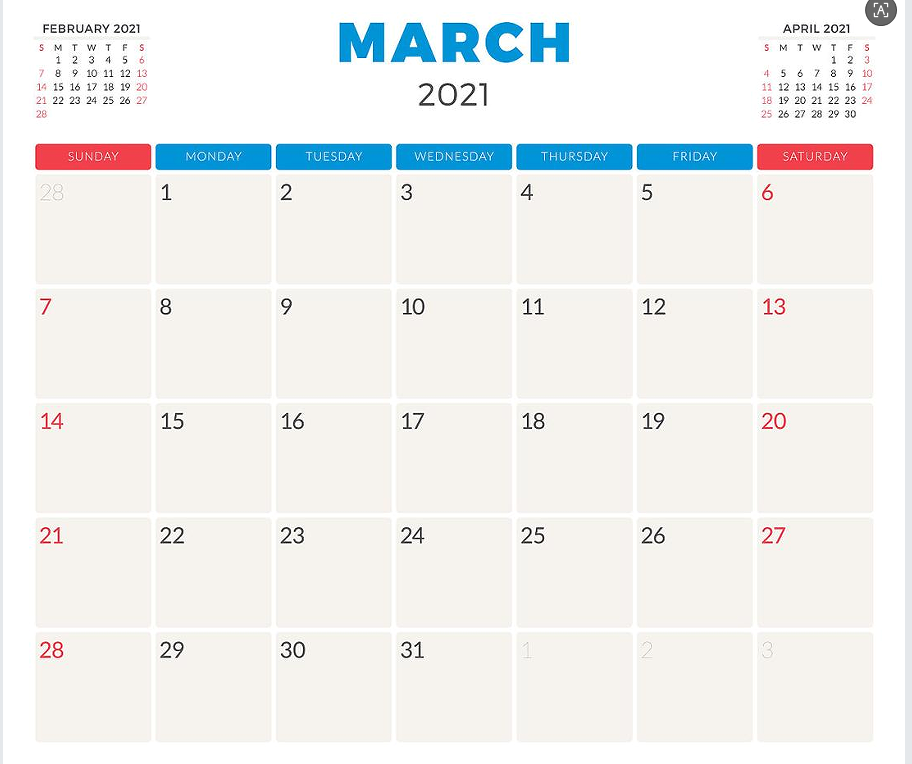

# calendar

<!--Kit: ArkUI-->
<!--Subsystem: ArkUI-->
<!--Owner: @liyujie43-->
<!--Designer: @weixin_52725220-->
<!--Tester: @xiong0104-->
<!--Adviser: @Brilliantry_Rui-->
<!-- md-trans-meta sourceCommit=7b6b884ef565767a6c9d0d7139fb4cb24a435447 translatedAt=2026-06-05T10:27:45.077Z pushedAt=2026-06-05T12:07:44.171Z -->

A calendar component used to display a calendar interface.

> **NOTE**
>
> This component is supported since API version 8. Updates will be marked with a superscript to indicate their earliest API version.

## Child Components

Not supported.

## Attributes

In addition to the [universal attributes](js-service-widget-common-attributes.md), the following attributes are also supported:

| Name             | Type     | Default Value   | Mandatory   | Description                                       |
| -------------- | ------ | ----- | ---- | ---------------------------------------- |
| date           | string | Current date  | No    | Date selected on the current page. The default value is the current date, in the format of year-month-day, for example, "2019-11-22". |
| cardcalendar   | boolean   | false | No    | Whether the current calendar is a card calendar.<br/>Default value: false, indicating that the current calendar is not a card calendar.                           |
| startdayofweek | int    | 6     | No    | Start day displayed on the card. The default value is Sunday (value range: 0-6).             |
| offdays        | string | 5,6   | No    | Rest days displayed on the card. The default values are Saturday and Sunday (value range: 0-6).         |
| calendardata   | string | -     | Yes    | Monthly view data information to be displayed on the card, including daily data information in a 5\*7 or 6\*7 grid, in JSON string format. For the "data" tag attribute information, see **Table 1** Daily attributes of calendardata. |
| showholiday    | boolean   | true  | No    | Whether to display holiday information.<br/>Default value: true, indicating that holiday information is to be displayed.                           |

 **Table 1** Daily attributes of calendardata

| Name             | Type     | Description                                      |
| -------------- | ------ | --------------------------------------- |
| index          | int    | Index of the data, indicating the sequence number of the date.                          |
| day            | int    | Indicates the specific day.                                |
| month          | int    | Indicates the month.                                   |
| year           | int    | Indicates the year.                                   |
| isFirstOfLunar | boolean  | Whether it is the first day of the lunar calendar. A horizontal line is drawn below the data for the first day of the lunar calendar. The value true indicates it is the first day of the lunar calendar. The value false indicates it is not the first day of the lunar calendar.             |
| hasSchedule    | boolean  | Whether there is a schedule. A circle is drawn on the date data for days with schedules. The value true indicates there is a schedule for the current day. The value false indicates there is no schedule for the current day.               |
| markLunarDay   | boolean  | Whether the Lunar calendar data part turns blue on holidays. The value true indicates that the Lunar calendar data part turns blue when the current day is a holiday. The value false indicates that the Lunar calendar data part does not turn blue when the current day is a holiday.                       |
| lunarDay       | string | Lunar calendar date.                                   |
| lunarMonth     | string | Lunar calendar month.                                   |
| dayMark        | string | Indicates the workday.<br>- "work": Workday.<br>- "off": Rest day. |
| dayMarkValue   | string | Indicates the specific "Work" or "Off" information to be displayed.                     |

Example of calendardata:

```json
{
"year":2021,
"month":1,
"data": [{
    "index": 0,    
    "lunarMonth": "Eleven",
    "lunarDay": "Thirteen",    
    "year": 2020,    
    "month": 12,    
    "day": 27,    
    "dayMark": "work",    
    "dayMarkValue": "Shift",
    "isFirstOfLunar": true,
    "hasSchedule": true,
    "markLunarDay": true
  },  {
    "index": 1,
    "lunarMonth": "Eleven",
    "lunarDay": "Fourteen",    
    "year": 2020,    
    "month": 12,    
    "day": 28,    
    "dayMark": "work",    
    "dayMarkValue": "Shift",
    "isFirstOfLunar": true,
    "hasSchedule": true,
    "markLunarDay": true
  },  {
    "index": 2,
    "lunarMonth": "11",
    "lunarDay": "15",    
    "year": 2020,    
    "month": 12,    
    "day": 29,    
    "dayMark": "work",    
    "dayMarkValue": "Shift",
    "isFirstOfLunar": true,
    "hasSchedule": true,
    "markLunarDay": true
  },
  ...
  ]
}
```

## Styles

| Name             | Type          | Default Value | Required | Description        |
| ---------------- | ------------- | ------------- | -------- | ------------------ |
| background-color | &lt;color&gt; | -             | No       | Sets the background color. |

## Events

| Name             | Parameter     | Description                                      |
| ---------------- | ------------- | ------------------------------------------------ |
| selectedchange   | changeEvent   | Triggered when a date is clicked or when switching between months. |
| requestdata      | requestEvent  | Triggered when requesting date data.             |

  **Table 2** changeEvent

| Name           | Type   | Description     |
| ------------ | ------ | ------ |
| $event.day   | string | Selected date. |
| $event.month | string | Selected month. |
| $event.year  | string | Selected year. |

  **Table 3** requestEvent

| Name                | Type   | Description         |
| ------------------- | ------ | -------- |
| $event.month        | string | Requested month.    |
| $event.year         | string | Requested year.     |
| $event.currentYear  | string | Currently displayed year. |
| $event.currentMonth | string | Currently displayed month. |

## Example

The current data is for demonstration purposes only. Please provide complete date data for actual use.

```html
<!-- xxx.hml -->
<div class="container">
    <calendar class="container_test"
        cardcalendar="true"
        onselectedchange="clickOneDay"
        onrequestdata="messageEventData"
        date="{{currentDate}}"
        offdays="{{offDays}}"
        showholiday="{{showHoliday}}"
        startdayofweek="{{startDayOfWeek}}"
        calendardata="{{calendarData}}">
   </calendar>
</div>
```

```css
/* xxx.css */ 
.container {
    flex-direction:column;
    width: 100%;
    height: 100%;
    align-items:center;
    padding-start: 4px;
    padding-end: 4px;
}
.container_test {
    background-color: white;
}
```

```json
{
    "data": {
        "currentDate": "",
        "offDays": "",
        "startDayOfWeek": 6,
        "showHoliday": true,
        "calendarData": ""
    },
    "actions": {
        "clickOneDay": {
            "action": "router",
            "bundleName": "com.example.calendar",
            "abilityName": "EntryAbility",
            "params": {
                "action": "click_month_view_event",
                "day": "$event.day",
                "month": "$event.month",
                "year": "$event.year"
            }
        },
        "messageEventData": {
            "action": "message",
            "params": {
                "month": "$event.month",
                "year": "$event.year",
                "currentMonth": "$event.currentMonth",
                "currentYear": "$event.currentYear"
            }
        }
    }
}
```

**4\*4 widget**

