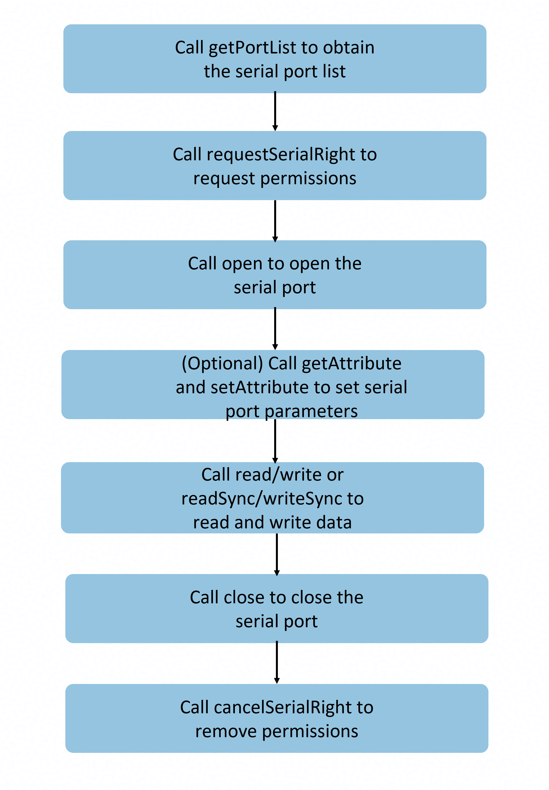

# @ohos.usbManager.serial (Serial Port Management)

<!--Kit: Basic Services Kit-->
<!--Subsystem: USB-->
<!--Owner: @hwymlgitcode-->
<!--Designer: @w00373942-->
<!--Tester: @dong-dongzhen-->
<!--Adviser: @fang-jinxu-->
<!-- md-trans-meta sourceCommit=3ab752ff96f8a27144e9b7b27b4bb4283f1f111c translatedAt=2026-09-01T04:20:18.591Z pushedAt=2026-09-02T11:38:37.649Z -->

This module provides APIs for managing the access and communication of serial port devices. It provides functions such as opening and closing devices, reading and writing data, setting parameters, and managing permissions. It addresses issues such as permission request, device configuration, and data transfer during communication between apps and serial port devices. This module simplifies the process of accessing serial port devices and improves development efficiency.

**Process**


**Use scenarios**
- **Embedded device communication**: exchanges data with various embedded devices, such as sensor data collection and device status monitoring.
- **Industrial device debugging**: connects to industrial control devices to perform debugging operations such as parameter configuration, command delivery, and log output.
- **Data exchange with serial port peripherals**: communicates with serial port peripherals, such as printers, scanners, and modems, for data transmission and reception.

> **NOTE**
>
> The initial APIs of this module are supported since API version 19. Newly added APIs will be marked with a superscript to indicate their earliest API version.

## Modules to Import

```ts
import { serialManager } from '@kit.BasicServicesKit';
```

## serialManager.getPortList

getPortList(): Readonly&lt;SerialPort&gt;[]

Obtains the serial port device list, including the device name and port number. Generally, this API is called when the application is started, a device is connected, or available serial port devices need to be detected.

**System capability**: SystemCapability.USB.USBManager.Serial

**Return value**

| Type                                       | Description         |
|-------------------------------------------|-------------|
| Readonly&lt;[SerialPort](#serialport)&gt;[] | List of available serial port devices. Each element contains attributes such as the port number and device name of the serial port. This parameter can be used to obtain all serial port devices in the system, and users can choose one to operate. |

**Example**

> **NOTE**
>
> The following sample code shows the basic process for calling the **getPortList** API and it needs to be executed in a specific method. In actual calling, you must comply with the device-related protocols.

<!--code_no_check-->
```ts
import { JSON } from '@kit.ArkTS';
import { serialManager } from '@kit.BasicServicesKit';

// Obtain the serial port device list.
function getPortListExample() {
  let portList: serialManager.SerialPort[] = serialManager.getPortList();
  console.info('usbSerial portList: ' + JSON.stringify(portList));
  if (!portList || portList.length === 0) {
    console.error('usbSerial portList is empty');
    return;
  }
}
```

## serialManager.hasSerialRight

hasSerialRight(portId: number): boolean

Checks whether the app has the permission to access the serial port device. When an app is restarted after exiting, permission needs to be requested again. Generally, this API is called to check the permission status before a serial port device is opened or a serial port operation is performed.

**Prerequisites**
- You have called [getPortList](#serialmanagergetportlist) to obtain the port number.

**System capability**: SystemCapability.USB.USBManager.Serial

**Parameters**

| Name   | Type    | Mandatory| Description                                 |
|--------|--------|----|-------------------------------------|
| portId | number | Yes | Port number, which is obtained from the [SerialPort](#serialport) object returned by [getPortList](#serialmanagergetportlist). The value must be a valid port number returned by **getPortList**. If an invalid value is passed, error code 31400003 is thrown. |

**Return value**

| Type      | Description               |
|---------|------------------|
| boolean | The value **true** indicates that the permission is granted, and **false** indicates the opposite. |

**Error codes**

For details about the error codes, see [Universal Error Codes](../errorcode-universal.md) and [USB Error Codes](errorcode-usb.md).

| ID| Error Message                                                    |
| -------- | ------------------------------------------------------------ |
| 401      | Parameter error. Possible causes: 1. Mandatory parameters are left unspecified; 2. Incorrect parameter types; 3. Parameter verification failed. |
| 14400005 | Database operation exception. |
| 31400001 | Serial port management exception. |
| 31400003 | PortId does not exist. |

**Example**

> **NOTE**
>
> The following sample code shows the basic process for calling the **hasSerialRight** API and it needs to be executed in a specific method. In actual calling, you must comply with the device-related protocols.

<!--code_no_check-->
```ts
import { JSON } from '@kit.ArkTS';
import { serialManager } from '@kit.BasicServicesKit';

// Obtain the serial port list.
function hasSerialRightExample() {
  let portList: serialManager.SerialPort[] = serialManager.getPortList();
  console.info('portList: ' + JSON.stringify(portList));
  if (!portList || portList.length === 0) {
    console.error('portList is empty');
    return;
  }
  let portId: number = portList[0].portId;

  // Check whether the device can be accessed by the application.
  if (serialManager.hasSerialRight(portId)) {
    console.info('The serial port is accessible');
  } else {
    console.error('No permission to access the serial port');
  }
}
```

## serialManager.requestSerialRight

requestSerialRight(portId: number): Promise&lt;boolean&gt;

Requests the permission for the app to access the serial port device. After the app exits, the access permission on the serial port device is automatically removed. After the app is restarted, the app needs to request the permission again. This API uses a promise to return the result. Generally, this API is called to request authorization from the user when the application attempts to access the serial port for the first time and detects that it does not have the permission. You can call [cancelSerialRight](#serialmanagercancelserialright) to remove the permission.

**Prerequisites**
- You have called [getPortList](#serialmanagergetportlist) to obtain the port number.

**System capability**: SystemCapability.USB.USBManager.Serial

**Parameters**

| Name   | Type    | Mandatory| Description                                 |
|--------|--------|----|-------------------------------------|
| portId | number | Yes | Port number, which is obtained from the [SerialPort](#serialport) object returned by [getPortList](#serialmanagergetportlist). The value must be a valid port number returned by **getPortList**. If an invalid value is passed, error code 31400003 is thrown. |

**Return value**

| Type                    | Description           |
|------------------------|---------------|
| Promise&lt;boolean&gt; | Promise used to return a Boolean value. The value **true** indicates that the permission is successfully requested, and **false** indicates the opposite.|

**Error codes**

For details about the error codes, see [Universal Error Codes](../errorcode-universal.md) and [USB Error Codes](errorcode-usb.md).

| ID| Error Message                                                    |
| -------- | ------------------------------------------------------------ |
| 401      | Parameter error. Possible causes: 1. Mandatory parameters are left unspecified; 2. Incorrect parameter types; 3. Parameter verification failed. |
| 14400005 | Database operation exception. |
| 31400001 | Serial port management exception. |
| 31400003 | PortId does not exist. |

**Example**

> **NOTE**
>
> The following sample code shows the basic process for calling the **requestSerialRight** API and it needs to be executed in a specific method. In actual calling, you must comply with the device-related protocols.

<!--code_no_check-->
```ts
import { JSON } from '@kit.ArkTS';
import { serialManager } from '@kit.BasicServicesKit';
import { BusinessError } from '@kit.BasicServicesKit';

// Obtain the serial port list.
function requestSerialRightExample() {
  let portList: serialManager.SerialPort[] = serialManager.getPortList();
  console.info('usbSerial portList: ' + JSON.stringify(portList));
  if (!portList || portList.length === 0) {
    console.error('usbSerial portList is empty');
    return;
  }
  let portId: number = portList[0].portId;

  // Check whether the device can be accessed by the application.
  if (!serialManager.hasSerialRight(portId)) {
    serialManager.requestSerialRight(portId).then(result => {
      if (!result) {
        // If the application does not have the access permission and the user does not grant the permission, the application exits.
        console.error('user is not granted the operation permission');
        return;
      } else {
        console.info('grant permission successfully');
      }
    }).catch((err: BusinessError) => {
      console.error(`Failed to request serial right. Code: ${err.code}, message: ${err.message}`);
    });
  }
}
```

## serialManager.open

open(portId: number): void

Opens a serial port device. Before calling this API, you need to call [requestSerialRight](#serialmanagerrequestserialright) to request the permission. After calling this API, you need to call [close](#serialmanagerclose) to close the serial port. After the API is successfully called, you can perform operations such as read/write and parameter configuration on the serial port.

**Prerequisites**
- You have called [getPortList](#serialmanagergetportlist) to obtain the port number.
- Call [requestSerialRight](#serialmanagerrequestserialright) to request the access permission.

**API called in pairs**
- This API must be used with [close](#serialmanagerclose) in pairs.
- After the serial port is opened, you must call **close()** to close the serial port and release resources.

**System capability**: SystemCapability.USB.USBManager.Serial

**Parameters**

| Name   | Type    | Mandatory| Description         |
|--------|--------|----|-------------|
| portId | number | Yes | Port number, which is obtained from the [SerialPort](#serialport) object returned by [getPortList](#serialmanagergetportlist). The value must be a valid port number returned by **getPortList**. If an invalid value is passed, error code 31400003 is thrown. |

**Error codes**

For details about the error codes, see [Universal Error Codes](../errorcode-universal.md) and [USB Error Codes](errorcode-usb.md).

| ID| Error Message                                                    |
| -------- | ------------------------------------------------------------ |
| 401      | Parameter error. Possible causes: 1. Mandatory parameters are left unspecified; 2. Incorrect parameter types; 3. Parameter verification failed. |
| 31400001 | Serial port management exception. |
| 31400002 | Access denied. Call requestSerialRight to request user authorization first. |
| 31400003 | PortId does not exist. |
| 31400004 | The serial port device is occupied. |

**Example**

> **NOTE**
>
> The following sample code shows the basic process for calling the **open** API and it needs to be executed in a specific method. In actual calling, you must comply with the device-related protocols.

<!--code_no_check-->
```ts
import { JSON } from '@kit.ArkTS';
import { serialManager } from '@kit.BasicServicesKit';
import { BusinessError } from '@kit.BasicServicesKit';

// Obtain the serial port list.
async function openExample() {
  let portList: serialManager.SerialPort[] = serialManager.getPortList();
  console.info('usbSerial portList: ' + JSON.stringify(portList));
  if (!portList || portList.length === 0) {
    console.error('usbSerial portList is empty');
    return;
  }
  let portId: number = portList[0].portId;

  // Check whether the device can be accessed by the application.
  if (!serialManager.hasSerialRight(portId)) {
    let result = await serialManager.requestSerialRight(portId);
    if (!result) {
      // If the app does not have the access permission and the user does not grant the permission, the app exits.
      console.error('user is not granted the operation permission');
      return;
    } else {
      console.info('grant permission successfully');
    }
  }

  // Open a serial port device.
  try {
    serialManager.open(portId);
    console.info('open usbSerial success, portId: ' + portId);
  } catch (error) {
    const err: BusinessError = error as BusinessError;
    console.error(`Failed to open usbSerial. Code: ${err.code}, message: ${err.message}`);
  }

  // Close the serial port device.
  try {
    serialManager.close(portId);
    console.info('close usbSerial success, portId: ' + portId);
  } catch (error) {
    const err: BusinessError = error as BusinessError;
    console.error(`Failed to close usbSerial. Code: ${err.code}, message: ${err.message}`);
  }
}
```

## serialManager.getAttribute

getAttribute(portId: number): Readonly&lt;SerialAttribute&gt;

Obtains the configuration parameters of a specified serial port. You need to call [open](#serialmanageropen) to open the serial port to obtain the configuration. Generally, this API is called to check the current communication parameter configuration and debug serial port communication issues after the device is initialized.

**Prerequisites**
- You have called [getPortList](#serialmanagergetportlist) to obtain the port number.
- You have called [requestSerialRight](#serialmanagerrequestserialright) to request the access permission.
- You have called [open](#serialmanageropen) to open the serial port.


**System capability**: SystemCapability.USB.USBManager.Serial

**Parameters**

| Name   | Type    | Mandatory| Description         |
|--------|--------|----|-------------|
| portId | number | Yes | Port number, which is obtained from the [SerialPort](#serialport) object returned by [getPortList](#serialmanagergetportlist). The value must be a valid port number returned by **getPortList**. If an invalid value is passed, error code 31400003 is thrown. |

**Return value**

| Type    | Description         |
|--------|-------------|
| Readonly&lt;[SerialAttribute](#serialattribute)&gt; |  Serial port configuration parameters, including the baud rate, data bit, parity bit, and stop bit.|

**Error codes**

For details about the error codes, see [Universal Error Codes](../errorcode-universal.md) and [USB Error Codes](errorcode-usb.md).

| ID| Error Message                                                    |
| -------- | ------------------------------------------------------------ |
| 401      | Parameter error. Possible causes: 1. Mandatory parameters are left unspecified; 2. Incorrect parameter types; 3. Parameter verification failed. |
| 31400001 | Serial port management exception. |
| 31400003 | PortId does not exist. |
| 31400005 | The serial port device is not opened. Call the open API first. |

**Example**

> **NOTE**
>
> The following sample code shows the basic process for calling the **getAttribute** API and it needs to be executed in a specific method. In actual calling, you must comply with the device-related protocols.

<!--code_no_check-->
```ts
import { JSON } from '@kit.ArkTS';
import { serialManager } from '@kit.BasicServicesKit';
import { BusinessError } from '@kit.BasicServicesKit';

// Obtain the serial port list.
async function getAttributeExample() {
  let portList: serialManager.SerialPort[] = serialManager.getPortList();
  console.info('usbSerial portList: ' + JSON.stringify(portList));
  if (!portList || portList.length === 0) {
    console.error('usbSerial portList is empty');
    return;
  }
  let portId: number = portList[0].portId;

  // Check whether the device can be accessed by the application.
  if (!serialManager.hasSerialRight(portId)) {
    let result = await serialManager.requestSerialRight(portId);
    if (!result) {
      // If the app does not have the access permission and the user does not grant the permission, the app exits.
      console.error('user is not granted the operation permission');
      return;
    } else {
      console.info('grant permission successfully');
    }
  }

  // Open a serial port device.
  try {
    serialManager.open(portId);
    console.info('open usbSerial success, portId: ' + portId);
  } catch (error) {
    const err: BusinessError = error as BusinessError;
    console.error(`Failed to open usbSerial. Code: ${err.code}, message: ${err.message}`);
  }

  // Obtain the serial port configuration.
  try {
    let attribute: serialManager.SerialAttribute = serialManager.getAttribute(portId);
    if (attribute === undefined) {
      console.error('getAttribute usbSerial error, attribute is undefined');
    } else {
      console.info('getAttribute usbSerial success, attribute: ' + JSON.stringify(attribute));
    }
  } catch (error) {
    const err: BusinessError = error as BusinessError;
    console.error(`Failed to get attribute. Code: ${err.code}, message: ${err.message}`);
  }

  // Close the serial port device.
  try {
    serialManager.close(portId);
    console.info('close usbSerial success, portId: ' + portId);
  } catch (error) {
    const err: BusinessError = error as BusinessError;
    console.error(`Failed to close usbSerial. Code: ${err.code}, message: ${err.message}`);
  }
}
```

## serialManager.setAttribute

setAttribute(portId: number, attribute: SerialAttribute): void

Sets the parameters of the specified serial port. You need to call [open](#serialmanageropen) to open the serial port to set parameters. The configuration parameters include **baudRate** (mandatory), **dataBits** (optional) whose default value is **8**, **parity** (optional) whose default value is **PARITY_NONE**, and **stopBits** (optional) whose default value is 1. Generally, this API is called when the device is initialized, the communication protocol is switched, or the device requires non-default configuration parameters.

**Prerequisites**
- You have called [getPortList](#serialmanagergetportlist) to obtain the port number.
- You have called [requestSerialRight](#serialmanagerrequestserialright) to request the access permission.
- You have called [open](#serialmanageropen) to open the serial port.


**System capability**: SystemCapability.USB.USBManager.Serial

**Parameters**

| Name      | Type                                 | Mandatory| Description         |
|-----------|-------------------------------------|----|-------------|
| portId    | number                              | Yes  | Port number, which is obtained from the [SerialPort](#serialport) object returned by [getPortList](#serialmanagergetportlist). The value must be a valid port number returned by **getPortList**. If an invalid value is passed, error code 31400003 is thrown. |
| attribute | [SerialAttribute](#serialattribute) | Yes  | Serial port configuration parameters. The parameters include **baudRate** (mandatory), **dataBits** (optional) whose default value is **8**, **parity** (optional) whose default value is **PARITY_NONE**, and **stopBits** (optional) whose default value is **1**.    |

**Error codes**

For details about the error codes, see [Universal Error Codes](../errorcode-universal.md) and [USB Error Codes](errorcode-usb.md).

| ID| Error Message                                                    |
| -------- | ------------------------------------------------------------ |
| 401      | Parameter error. Possible causes: 1. Mandatory parameters are left unspecified; 2. Incorrect parameter types; 3. Parameter verification failed. |
| 31400001 | Serial port management exception. |
| 31400003 | PortId does not exist. |
| 31400005 | The serial port device is not opened. Call the open API first. |

**Example**

> **NOTE**
>
> The following sample code shows the basic process for calling the **setAttribute** API and it needs to be executed in a specific method. In actual calling, you must comply with the device-related protocols.

<!--code_no_check-->
```ts
import { JSON } from '@kit.ArkTS';
import { serialManager } from '@kit.BasicServicesKit';
import { BusinessError } from '@kit.BasicServicesKit';

// Obtain the serial port list.
async function setAttributeExample() {
  let portList: serialManager.SerialPort[] = serialManager.getPortList();
  console.info('usbSerial portList: ' + JSON.stringify(portList));
  if (!portList || portList.length === 0) {
    console.error('usbSerial portList is empty');
    return;
  }
  let portId: number = portList[0].portId;

  // Check whether the device can be accessed by the application.
  if (!serialManager.hasSerialRight(portId)) {
    let result = await serialManager.requestSerialRight(portId);
    if (!result) {
      // If the app does not have the access permission and the user does not grant the permission, the app exits.
      console.error('user is not granted the operation permission');
      return;
    } else {
      console.info('grant permission successfully');
    }
  }

  // Open a serial port device.
  try {
    serialManager.open(portId);
    console.info('open usbSerial success, portId: ' + portId);
  } catch (error) {
    const err: BusinessError = error as BusinessError;
    console.error(`Failed to open usbSerial. Code: ${err.code}, message: ${err.message}`);
  }

  // Set the serial port configuration.
  try {
    let attribute: serialManager.SerialAttribute = {
      baudRate: serialManager.BaudRates.BAUDRATE_9600,
      dataBits: serialManager.DataBits.DATABIT_8,
      parity: serialManager.Parity.PARITY_NONE,
      stopBits: serialManager.StopBits.STOPBIT_1
    };
    serialManager.setAttribute(portId, attribute);
    console.info('setAttribute usbSerial success, attribute: ' + JSON.stringify(attribute));
  } catch (error) {
    const err: BusinessError = error as BusinessError;
    console.error(`Failed to set attribute. Code: ${err.code}, message: ${err.message}`);
  }

  // Close the serial port device.
  try {
    serialManager.close(portId);
    console.info('close usbSerial success, portId: ' + portId);
  } catch (error) {
    const err: BusinessError = error as BusinessError;
    console.error(`Failed to close usbSerial. Code: ${err.code}, message: ${err.message}`);
  }
}
```

## serialManager.read

read(portId: number, buffer: Uint8Array, timeout?: number): Promise&lt;number&gt;

Reads data from the serial port device asynchronously. The read data is stored in the **buffer** parameter. Before calling this API, call [open](#serialmanageropen) to open the serial port device first. This API uses a promise to return the length of the data that is actually read. This API can be used to receive data reported by sensors, read response data returned by devices, and receive device status information.

**Prerequisites**
- You have called [getPortList](#serialmanagergetportlist) to obtain the port number.
- You have called [requestSerialRight](#serialmanagerrequestserialright) to request the access permission.
- You have called [open](#serialmanageropen) to open the serial port.

**System capability**: SystemCapability.USB.USBManager.Serial

**Parameters**

| Name    | Type        | Mandatory| Description              |
|---------|------------|----|------------------|
| portId | number | Yes | Port number, which is obtained from the [SerialPort](#serialport) object returned by [getPortList](#serialmanagergetportlist). The value must be a valid port number returned by **getPortList**. If an invalid value is passed, error code 31400003 is thrown. |
| buffer  | Uint8Array | Yes | Buffer for storing the binary data read from the serial port device. The buffer size should be determined based on the expected amount of data to be read. After the read operation is successful, the return value indicates the length of the data that is actually read.|
| timeout | number | No | Timeout interval, in milliseconds. If there is no data in the buffer of the target port, this API returns the result after waiting for the specified time. The default value is **0**. If the default value is used or the parameter is not specified, it indicates that the API returns the result without waiting. If a negative number is passed, a parameter error is thrown. Set this parameter based on the device response speed and data volume. |

**Return value**

| Type                   | Description            |
|-----------------------|----------------|
| Promise&lt;number&gt; | Promise used to return the length of the data read, in bytes.|

**Error codes**

For details about the error codes, see [Universal Error Codes](../errorcode-universal.md) and [USB Error Codes](errorcode-usb.md).

| ID| Error Message                                                    |
| -------- | ------------------------------------------------------------ |
| 401      | Parameter error. Possible causes: 1. Mandatory parameters are left unspecified; 2. Incorrect parameter types; 3. Parameter verification failed; 4. Optional parameters passed as undefined. |
| 31400001 | Serial port management exception. |
| 31400003 | PortId does not exist. |
| 31400005 | The serial port device is not opened. Call the open API first. |
| 31400006 | Data transfer timed out. |
| 31400007 | I/O exception. Possible causes: 1. The transfer was canceled. 2. The device offered more data than allowed. |

**Example**

> **NOTE**
>
> The following sample code shows the basic process for calling the **read** API and it needs to be executed in a specific method. In actual calling, you must comply with the device-related protocols.

<!--code_no_check-->
```ts
import { JSON } from '@kit.ArkTS';
import { serialManager } from '@kit.BasicServicesKit';
import { BusinessError } from '@kit.BasicServicesKit';

// Obtain the serial port list.
async function readExample() {
  let portList: serialManager.SerialPort[] = serialManager.getPortList();
  console.info('usbSerial portList: ' + JSON.stringify(portList));
  if (!portList || portList.length === 0) {
    console.error('usbSerial portList is empty');
    return;
  }
  let portId: number = portList[0].portId;

  // Check whether the device can be accessed by the application.
  if (!serialManager.hasSerialRight(portId)) {
    let result = await serialManager.requestSerialRight(portId);
    if (!result) {
      // If the app does not have the access permission and the user does not grant the permission, the app exits.
      console.error('user is not granted the operation permission');
      return;
    } else {
      console.info('grant permission successfully');
    }
  }

  // Open a serial port device.
  try {
    serialManager.open(portId);
    console.info('open usbSerial success, portId: ' + portId);
  } catch (error) {
    const err: BusinessError = error as BusinessError;
    console.error(`Failed to open usbSerial. Code: ${err.code}, message: ${err.message}`);
  }

  // Read data asynchronously.
  try {
    let readBuffer: Uint8Array = new Uint8Array(64);
    let size: number = await serialManager.read(portId, readBuffer, 2000);
    if (size > 0) {
      console.info('read usbSerial success, readBuffer: ' + readBuffer.toString());
    }
  } catch (error) {
    const err: BusinessError = error as BusinessError;
    console.error(`Failed to read usbSerial. Code: ${err.code}, message: ${err.message}`);
  }

  // Close the serial port device.
  try {
    serialManager.close(portId);
    console.info('close usbSerial success, portId: ' + portId);
  } catch (error) {
    const err: BusinessError = error as BusinessError;
    console.error(`Failed to close usbSerial. Code: ${err.code}, message: ${err.message}`);
  }
}
```

## Differences Between read and readSync

- **read**: reads data asynchronously. This API uses a promise to return the result, which does not block the main thread. This method is suitable for scenarios that require non-blocking operations or concurrent processing of multiple tasks.
- **readSync**: reads data synchronously. The current thread is blocked until the read operation is complete or times out. It is suitable for simple scenarios or scenarios where operations need to be performed in sequence.

Select a proper read mode based on the application architecture and performance requirements.

## serialManager.readSync

readSync(portId: number, buffer: Uint8Array, timeout?: number): number

Reads data from the serial port device synchronously. The read data is stored in the **buffer** parameter. The actual length of the data read is returned. Before calling this API, call [open](#serialmanageropen) to open the serial port device first. This method is applicable to simple communication scenarios where data needs to be read in blocking mode, the read sequence must be strictly followed, or there is no high requirement on real-time performance.

**Prerequisites**
- You have called [getPortList](#serialmanagergetportlist) to obtain the port number.
- You have called [requestSerialRight](#serialmanagerrequestserialright) to request the access permission.
- You have called [open](#serialmanageropen) to open the serial port.

**System capability**: SystemCapability.USB.USBManager.Serial

**Parameters**

| Name    | Type        | Mandatory| Description              |
|---------|------------|----|------------------|
| portId  | number | Yes  | Port number, which is obtained from the [SerialPort](#serialport) object returned by [getPortList](#serialmanagergetportlist). The value must be a valid port number returned by **getPortList**. If an invalid value is passed, error code 31400003 is thrown. |
| buffer  | Uint8Array | Yes | Buffer for storing the binary data read from the serial port device. The buffer size should be determined based on the expected amount of data to be read. After the read operation is successful, the return value indicates the length of the data that is actually read.|
| timeout | number     | No  | Timeout interval, in milliseconds. If there is no data in the buffer of the target port, this API returns the result after waiting for the specified time. The default value is **0**. If the default value is used or the parameter is not specified, it indicates that the API returns the result without waiting. If a negative number is passed, a parameter error is thrown. Set this parameter based on the device response speed and data volume. |

**Return value**

| Type    | Description         |
|--------|-------------|
| number | Length of the data read, in bytes.|

**Error codes**

For details about the error codes, see [Universal Error Codes](../errorcode-universal.md) and [USB Error Codes](errorcode-usb.md).

| ID| Error Message                                                    |
| -------- | ------------------------------------------------------------ |
| 401      | Parameter error. Possible causes: 1. Mandatory parameters are left unspecified; 2. Incorrect parameter types; 3. Parameter verification failed; 4. Optional parameters passed as undefined. |
| 31400001 | Serial port management exception. |
| 31400003 | PortId does not exist. |
| 31400005 | The serial port device is not opened. Call the open API first. |
| 31400006 | Data transfer timed out. |
| 31400007 | I/O exception. Possible causes: 1. The transfer was canceled. 2. The device offered more data than allowed. |

**Example**

> **NOTE**
>
> The following sample code shows the basic process for calling the **readSync** API and it needs to be executed in a specific method. In actual calling, you must comply with the device-related protocols.

<!--code_no_check-->
```ts
import { JSON } from '@kit.ArkTS';
import { serialManager } from '@kit.BasicServicesKit';
import { BusinessError } from '@kit.BasicServicesKit';

// Obtain the serial port list.
async function readSyncExample() {
  let portList: serialManager.SerialPort[] = serialManager.getPortList();
  console.info('usbSerial portList: ' + JSON.stringify(portList));
  if (!portList || portList.length === 0) {
    console.error('usbSerial portList is empty');
    return;
  }
  let portId: number = portList[0].portId;

  // Check whether the device can be accessed by the application.
  if (!serialManager.hasSerialRight(portId)) {
    let result = await serialManager.requestSerialRight(portId);
    if (!result) {
      // If the app does not have the access permission and the user does not grant the permission, the app exits.
      console.error('user is not granted the operation permission');
      return;
    } else {
      console.info('grant permission successfully');
    }
  }

  // Open a serial port device.
  try {
    serialManager.open(portId);
    console.info('open usbSerial success, portId: ' + portId);
  } catch (error) {
    const err: BusinessError = error as BusinessError;
    console.error(`Failed to open usbSerial. Code: ${err.code}, message: ${err.message}`);
  }

  // Read data synchronously.
  let readSyncBuffer: Uint8Array = new Uint8Array(64);
  try {
    serialManager.readSync(portId, readSyncBuffer, 2000);
    console.info('readSync usbSerial success, readSyncBuffer: ' + readSyncBuffer.toString());
  } catch (error) {
    const err: BusinessError = error as BusinessError;
    console.error(`Failed to readSync usbSerial. Code: ${err.code}, message: ${err.message}`);
  }

  // Close the serial port device.
  try {
    serialManager.close(portId);
    console.info('close usbSerial success, portId: ' + portId);
  } catch (error) {
    const err: BusinessError = error as BusinessError;
    console.error(`Failed to close usbSerial. Code: ${err.code}, message: ${err.message}`);
  }
}
```

## serialManager.write

write(portId: number, buffer: Uint8Array, timeout?: number): Promise&lt;number&gt;

Writes data to the serial port device asynchronously. Before calling this API, call [open](#serialmanageropen) to open the serial port first. The length of data written each time cannot exceed 4 KB; otherwise, data loss may occur. You are advised to write long data in multiple packets. This API uses a promise to return the result. This API is applicable to scenarios such as sending control commands to devices, delivering configuration parameters, and transferring the collected data.

**Prerequisites**
- You have called [getPortList](#serialmanagergetportlist) to obtain the port number.
- You have called [requestSerialRight](#serialmanagerrequestserialright) to request the access permission.
- You have called [open](#serialmanageropen) to open the serial port.

**System capability**: SystemCapability.USB.USBManager.Serial

**Parameters**

| Name    | Type        | Mandatory| Description              |
|---------|------------|----|------------------|
| portId  | number     | Yes  | Port number, which is obtained from the [SerialPort](#serialport) object returned by [getPortList](#serialmanagergetportlist). The value must be a valid port number returned by **getPortList**. If an invalid value is passed, error code 31400003 is thrown. |
| buffer  | Uint8Array | Yes | Buffer for writing data, including the binary data to be sent to the serial port device. The length of data written each time cannot exceed 4 KB; otherwise, data loss may occur. You are advised to write long data in multiple packets.|
| timeout | number     | No  | Timeout interval, in milliseconds. When writing data, this API waits until the buffer is writable and returns the result after the specified time. The default value is **0**. If the default value is used or the parameter is not specified, it indicates that the API returns the result without waiting. If a negative number is passed, a parameter error is thrown. Set this parameter based on the device response speed and data volume. |

**Return value**

| Type                   | Description         |
|-----------------------|-------------|
| Promise&lt;number&gt; | Promise used to return the length of the data written, in bytes.|

**Error codes**

For details about the error codes, see [Universal Error Codes](../errorcode-universal.md) and [USB Error Codes](errorcode-usb.md).

| ID| Error Message                                                    |
| -------- | ------------------------------------------------------------ |
| 401      | Parameter error. Possible causes: 1. Mandatory parameters are left unspecified; 2. Incorrect parameter types; 3. Parameter verification failed; 4. Optional parameters passed as undefined. |
| 31400001 | Serial port management exception. |
| 31400003 | PortId does not exist. |
| 31400005 | The serial port device is not opened. Call the open API first. |
| 31400006 | Data transfer timed out. |
| 31400007 | I/O exception. Possible causes: 1. The transfer was canceled. 2. The device offered more data than allowed. |

**Example**

> **NOTE**
>
> The following sample code shows the basic process for calling the **write** API and it needs to be executed in a specific method. In actual calling, you must comply with the device-related protocols.

<!--code_no_check-->
```ts
import { JSON } from '@kit.ArkTS';
import { buffer } from '@kit.ArkTS';
import { serialManager } from '@kit.BasicServicesKit';
import { BusinessError } from '@kit.BasicServicesKit';

// Obtain the serial port list.
async function writeExample() {
  let portList: serialManager.SerialPort[] = serialManager.getPortList();
  console.info('usbSerial portList: ' + JSON.stringify(portList));
  if (!portList || portList.length === 0) {
    console.error('usbSerial portList is empty');
    return;
  }
  let portId: number = portList[0].portId;

  // Check whether the device can be accessed by the application.
  if (!serialManager.hasSerialRight(portId)) {
    let result = await serialManager.requestSerialRight(portId);
    if (!result) {
      // If the app does not have the access permission and the user does not grant the permission, the app exits.
      console.error('user is not granted the operation permission');
      return;
    } else {
      console.info('grant permission successfully');
    }
  }

  // Open a serial port device.
  try {
    serialManager.open(portId);
    console.info('open usbSerial success, portId: ' + portId);
  } catch (error) {
    const err: BusinessError = error as BusinessError;
    console.error(`Failed to open usbSerial. Code: ${err.code}, message: ${err.message}`);
  }

  // Write data asynchronously.
  try {
    let writeBuffer: Uint8Array = new Uint8Array(buffer.from('Hello World', 'utf-8').buffer);
    let size: number = await serialManager.write(portId, writeBuffer, 2000);
    if (size > 0) {
      console.info('write usbSerial success, writeBuffer: ' + writeBuffer.toString());
    }
  } catch (error) {
    const err: BusinessError = error as BusinessError;
    console.error(`Failed to write usbSerial. Code: ${err.code}, message: ${err.message}`);
  }

  // Close the serial port device.
  try {
    serialManager.close(portId);
    console.info('close usbSerial success, portId: ' + portId);
  } catch (error) {
    const err: BusinessError = error as BusinessError;
    console.error(`Failed to close usbSerial. Code: ${err.code}, message: ${err.message}`);
  }
}
```

## Differences Between write and writeSync

- **write**: writes data asynchronously. This API uses a promise to return the result, which does not block the main thread. This method is suitable for scenarios that require non-blocking operations or concurrent processing of multiple tasks.
- **writeSync**: writes data synchronously. The current thread is blocked until the write operation is complete or times out. It is suitable for simple scenarios or scenarios where operations need to be performed in sequence.

Select a proper write mode based on the application architecture and performance requirements.

## serialManager.writeSync

writeSync(portId: number, buffer: Uint8Array, timeout?: number): number

Writes data to the serial port device synchronously. Before calling this API, call [open](#serialmanageropen) to open the serial port device first. The length of data written each time cannot exceed 4 KB. Otherwise, data loss may occur. You are advised to write long data in multiple packets. This API is applicable to scenarios where data needs to be written in blocking mode, important commands need to be sent, or the write sequence must be strictly followed.

**Prerequisites**
- You have called [getPortList](#serialmanagergetportlist) to obtain the port number.
- You have called [requestSerialRight](#serialmanagerrequestserialright) to request the access permission.
- You have called [open](#serialmanageropen) to open the serial port.

**System capability**: SystemCapability.USB.USBManager.Serial

**Parameters**

| Name    | Type        | Mandatory| Description              |
|---------|------------|----|------------------|
| portId  | number     | Yes  | Port number, which is obtained from the [SerialPort](#serialport) object returned by [getPortList](#serialmanagergetportlist). The value must be a valid port number returned by **getPortList**. If an invalid value is passed, error code 31400003 is thrown. |
| buffer  | Uint8Array | Yes | Buffer for writing data, including the binary data to be sent to the serial port device. The length of data written each time cannot exceed 4 KB; otherwise, data loss may occur. You are advised to write long data in multiple packets.|
| timeout | number     | No  | Timeout interval, in milliseconds. When writing data, this API waits until the buffer is writable and returns the result after the specified time. The default value is **0**. If the default value is used or the parameter is not specified, it indicates that the API returns the result without waiting. If a negative number is passed, a parameter error is thrown. Set this parameter based on the device response speed and data volume. |

**Return value**

| Type    | Description         |
|--------|-------------|
| number | Length of the data written, in bytes.|

**Error codes**

For details about the error codes, see [Universal Error Codes](../errorcode-universal.md) and [USB Error Codes](errorcode-usb.md).

| ID| Error Message                                                    |
| -------- | ------------------------------------------------------------ |
| 401      | Parameter error. Possible causes: 1. Mandatory parameters are left unspecified; 2. Incorrect parameter types; 3. Parameter verification failed; 4. Optional parameters passed as undefined. |
| 31400001 | Serial port management exception. |
| 31400003 | PortId does not exist. |
| 31400005 | The serial port device is not opened. Call the open API first. |
| 31400006 | Data transfer timed out. |
| 31400007 | I/O exception. Possible causes: 1. The transfer was canceled. 2. The device offered more data than allowed. |

**Example**

> **NOTE**
>
> The following sample code shows the basic process for calling the **writeSync** API and it needs to be executed in a specific method. In actual calling, you must comply with the device-related protocols.

<!--code_no_check-->
```ts
import { JSON } from '@kit.ArkTS';
import { buffer } from '@kit.ArkTS';
import { serialManager } from '@kit.BasicServicesKit';
import { BusinessError } from '@kit.BasicServicesKit';

// Obtain the serial port list.
async function writeSyncExample() {
  let portList: serialManager.SerialPort[] = serialManager.getPortList();
  console.info('usbSerial portList: ' + JSON.stringify(portList));
  if (!portList || portList.length === 0) {
    console.error('usbSerial portList is empty');
    return;
  }
  let portId: number = portList[0].portId;

  // Check whether the device can be accessed by the application.
  if (!serialManager.hasSerialRight(portId)) {
    let result = await serialManager.requestSerialRight(portId);
    if (!result) {
      // If the app does not have the access permission and the user does not grant the permission, the app exits.
      console.error('user is not granted the operation permission');
      return;
    } else {
      console.info('grant permission successfully');
    }
  }

  // Open a serial port device.
  try {
    serialManager.open(portId);
    console.info('open usbSerial success, portId: ' + portId);
  } catch (error) {
    const err: BusinessError = error as BusinessError;
    console.error(`Failed to open usbSerial. Code: ${err.code}, message: ${err.message}`);
  }

  // Write data synchronously.
  let writeSyncBuffer: Uint8Array = new Uint8Array(buffer.from('Hello World', 'utf-8').buffer);
  try {
    serialManager.writeSync(portId, writeSyncBuffer, 2000);
    console.info('writeSync usbSerial success, writeSyncBuffer: ' + writeSyncBuffer.toString());
  } catch (error) {
    const err: BusinessError = error as BusinessError;
    console.error(`Failed to writeSync usbSerial. Code: ${err.code}, message: ${err.message}`);
  }
  
  // Close the serial port device.
  try {
    serialManager.close(portId);
    console.info('close usbSerial success, portId: ' + portId);
  } catch (error) {
    const err: BusinessError = error as BusinessError;
    console.error(`Failed to close usbSerial. Code: ${err.code}, message: ${err.message}`);
  }
}
```

## serialManager.close

close(portId: number): void

Closes the serial port device. Call [requestSerialRight](#serialmanagerrequestserialright) to request the permission and then call [open](#serialmanageropen) to open the serial port. Generally, this API is called when the application exits, the device is disconnected, or serial port resources need to be released. Closing the serial port does not remove the access permission. To remove the permission, call **cancelSerialRight**.

**API called in pairs**
- This API must be used with [open](#serialmanageropen) in pairs.
- After the serial port is opened, you must call this method to close the serial port and release resources.

**Prerequisites**
- You have called [getPortList](#serialmanagergetportlist) to obtain the port number.
- You have called [requestSerialRight](#serialmanagerrequestserialright) to request the access permission.
- You have called [open](#serialmanageropen) to open the serial port.


**System capability**: SystemCapability.USB.USBManager.Serial

**Parameters**

| Name   | Type    | Mandatory| Description         |
|--------|--------|----|-------------|
| portId | number | Yes | Port number, which is obtained from the [SerialPort](#serialport) object returned by [getPortList](#serialmanagergetportlist). The value must be a valid port number returned by **getPortList**. If an invalid value is passed, error code 31400003 is thrown. |

**Error codes**

For details about the error codes, see [Universal Error Codes](../errorcode-universal.md) and [USB Error Codes](errorcode-usb.md).

| ID| Error Message                                                    |
| -------- | ------------------------------------------------------------ |
| 401      | Parameter error. Possible causes: 1. Mandatory parameters are left unspecified; 2. Incorrect parameter types; 3. Parameter verification failed. |
| 31400001 | Serial port management exception. |
| 31400003 | PortId does not exist. |
| 31400005 | The serial port device is not opened. Call the open API first. |

**Example**

> **NOTE**
>
> The following sample code shows the basic process for calling the **close** API and it needs to be executed in a specific method. In actual calling, you must comply with the device-related protocols.

<!--code_no_check-->
```ts
import { JSON } from '@kit.ArkTS';
import { serialManager } from '@kit.BasicServicesKit';
import { BusinessError } from '@kit.BasicServicesKit';

// Obtain the serial port list.
async function closeExample() {
  let portList: serialManager.SerialPort[] = serialManager.getPortList();
  console.info('usbSerial portList: ' + JSON.stringify(portList));
  if (!portList || portList.length === 0) {
    console.error('usbSerial portList is empty');
    return;
  }
  let portId: number = portList[0].portId;

  // Check whether the device can be accessed by the application.
  if (!serialManager.hasSerialRight(portId)) {
    let result = await serialManager.requestSerialRight(portId);
    if (!result) {
      // If the app does not have the access permission and the user does not grant the permission, the app exits.
      console.error('user is not granted the operation permission');
      return;
    } else {
      console.info('grant permission successfully');
    }
  }

  // Open a serial port device.
  try {
    serialManager.open(portId);
    console.info('open usbSerial success, portId: ' + portId);
  } catch (error) {
    const err: BusinessError = error as BusinessError;
    console.error(`Failed to open usbSerial. Code: ${err.code}, message: ${err.message}`);
  }


  // Close the serial port device.
  try {
    serialManager.close(portId);
    console.info('close usbSerial success, portId: ' + portId);
  } catch (error) {
    const err: BusinessError = error as BusinessError;
    console.error(`Failed to close usbSerial. Code: ${err.code}, message: ${err.message}`);
  }
}
```

## serialManager.cancelSerialRight

cancelSerialRight(portId: number): void

Cancels the permission to access the serial port device when the application is running. This API is used to close the enabled serial port device. Generally, this API is called to proactively release the permission, access another device, or for security purposes.

**Prerequisites**
- You have called [getPortList](#serialmanagergetportlist) to obtain the port number.
- You have called [requestSerialRight](#serialmanagerrequestserialright) to request the access permission.

**Related methods**
- [requestSerialRight](#serialmanagerrequestserialright): requests the access permission.
- [hasSerialRight](#serialmanagerhasserialright): checks whether the access permission is granted.

**System capability**: SystemCapability.USB.USBManager.Serial

**Parameters**

| Name   | Type    | Mandatory| Description                                 |
|--------|--------|----|-------------------------------------|
| portId | number | Yes | Port number, which is obtained from the [SerialPort](#serialport) object returned by [getPortList](#serialmanagergetportlist). The value must be a valid port number returned by **getPortList**. If an invalid value is passed, error code 31400003 is thrown. |

**Error codes**

For details about the error codes, see [Universal Error Codes](../errorcode-universal.md) and [USB Error Codes](errorcode-usb.md).

| ID| Error Message                                                    |
| -------- | ------------------------------------------------------------ |
| 401      | Parameter error. Possible causes: 1. Mandatory parameters are left unspecified; 2. Incorrect parameter types; 3. Parameter verification failed. |
| 14400005 | Database operation exception.                                |
| 31400001 | Serial port management exception. |
| 31400002 | Access denied. Call requestSerialRight to request user authorization first. |
| 31400003 | PortId does not exist. |

**Example**

> **NOTE**
>
> The following sample code shows the basic process for calling the **cancelSerialRight** API and it needs to be executed in a specific method. In actual calling, you must comply with the device-related protocols.

<!--code_no_check-->
```ts
import { JSON } from '@kit.ArkTS';
import { serialManager } from '@kit.BasicServicesKit';
import { BusinessError } from '@kit.BasicServicesKit';

// Obtain the serial port list.
async function cancelSerialRightExample() {
  let portList: serialManager.SerialPort[] = serialManager.getPortList();
  console.info('usbSerial portList: ' + JSON.stringify(portList));
  if (!portList || portList.length === 0) {
    console.error('usbSerial portList is empty');
    return;
  }
  let portId: number = portList[0].portId;

  // Check whether the device can be accessed by the application.
  if (!serialManager.hasSerialRight(portId)) {
    let result = await serialManager.requestSerialRight(portId);
    if (!result) {
      // If the app does not have the access permission and the user does not grant the permission, the app exits.
      console.error('user is not granted the operation permission');
      return;
    } else {
      console.info('grant permission successfully');
    }
  }

  // Cancel the granted permission.
  try {
    serialManager.cancelSerialRight(portId);
    console.info('cancelSerialRight success, portId: ' + portId);
  } catch (error) {
    const err: BusinessError = error as BusinessError;
    console.error(`Failed to cancel serial right. Code: ${err.code}, message: ${err.message}`);
  }
}
```

## SerialAttribute

Represents the configuration parameters of a serial port.

**System capability**: SystemCapability.USB.USBManager.Serial

| Name      |          Type       |  Read-Only  |  Optional| Description       |
|----------|--------|----------|-----------|----------------------|
| baudRate | [BaudRates](#baudrates) |   No  | No | Baud rate of the serial port, in bit/s. This parameter indicates the data transmission rate. |
| dataBits | [DataBits](#databits)   |   No  | Yes | Data bits of the serial port, in bits. The default value is **8**. This parameter indicates the number of valid data bits in a packet. |
| parity   | [Parity](#parity)       |   No   | Yes  | Parity check. The default value is **PARITY_NONE**, indicating that no parity check is performed. This parameter is used to detect data transmission errors. |
| stopBits | [StopBits](#stopbits)   |   No  | Yes | Stop bits of the serial port, in bits. The default value is **1**. This parameter indicates the end of a packet. |

## SerialPort

Represents the parameters of a serial port.

**System capability**: SystemCapability.USB.USBManager.Serial

| Name    | Type |  Read-Only| Optional| Description   |
|--------|--------|------|-------|--------|
| portId | number | No  |  No | Serial port number, which uniquely identifies a serial port device. The value is obtained from the **SerialPort** object returned by **getPortList** and is used to specify the serial port device to be operated. |
| deviceName | string | No  |  No | Name of a serial port device, which is used to display and identify a specific serial port device. It can be used to display device information on the UI, helping users distinguish between different serial port devices. |

## BaudRates

Enumerates the baud rates, in bit/s.

**System capability**: SystemCapability.USB.USBManager.Serial

| Name    | Value    | Description   |
|-----------|-----------|-----------|
| BAUDRATE_50  | 50  | The transmission baud rate is 50 bit/s. |
| BAUDRATE_75  | 75  | The transmission baud rate is 75 bit/s. |
| BAUDRATE_110  | 110  | The transmission baud rate is 110 bit/s. |
| BAUDRATE_134  | 134  | The transmission baud rate is 134 bit/s. |
| BAUDRATE_150  | 150  | The transmission baud rate is 150 bit/s. |
| BAUDRATE_200  | 200  | The transmission baud rate is 200 bit/s. |
| BAUDRATE_300  | 300  | The transmission baud rate is 300 bit/s. |
| BAUDRATE_600  | 600  | The transmission baud rate is 600 bit/s. |
| BAUDRATE_1200  | 1200  | The transmission baud rate is 1200 bit/s. |
| BAUDRATE_1800  | 1800  | The transmission baud rate is 1800 bit/s. |
| BAUDRATE_2400  | 2400  | The transmission baud rate is 2400 bit/s. |
| BAUDRATE_4800  | 4800  | The transmission baud rate is 4800 bit/s. |
| BAUDRATE_9600  | 9600  | The transmission baud rate is 9600 bit/s. |
| BAUDRATE_19200  | 19200  | The transmission baud rate is 19,200 bit/s. |
| BAUDRATE_38400  | 38400  | The transmission baud rate is 38,400 bit/s. |
| BAUDRATE_57600  | 57600  | The transmission baud rate is 57,600 bit/s. |
| BAUDRATE_115200  | 115200  | The transmission baud rate is 115,200 bit/s. |
| BAUDRATE_230400  | 230400  | The transmission baud rate is 230,400 bit/s. |
| BAUDRATE_460800  | 460800  | The transmission baud rate is 460,800 bit/s. |
| BAUDRATE_500000  | 500000  | The transmission baud rate is 500,000 bit/s. |
| BAUDRATE_576000  | 576000  | The transmission baud rate is 576,000 bit/s. |
| BAUDRATE_921600  | 921600  | The transmission baud rate is 921,600 bit/s. |
| BAUDRATE_1000000  | 1000000  | The transmission baud rate is 1,000,000 bit/s. |
| BAUDRATE_1152000  | 1152000  | The transmission baud rate is 1,152,000 bit/s. |
| BAUDRATE_1500000  | 1500000  | The transmission baud rate is 1,500,000 bit/s. |
| BAUDRATE_2000000  | 2000000  | The transmission baud rate is 2,000,000 bit/s. |
| BAUDRATE_2500000  | 2500000  | The transmission baud rate is 2,500,000 bit/s. |
| BAUDRATE_3000000  | 3000000  | The transmission baud rate is 3,000,000 bit/s. |
| BAUDRATE_3500000  | 3500000  | The transmission baud rate is 3,500,000 bit/s. |
| BAUDRATE_4000000  | 4000000  | The transmission baud rate is 4,000,000 bit/s. |

## DataBits

Enumerates the number of data bits, in bits.

**System capability**: SystemCapability.USB.USBManager.Serial

| Name    | Value    | Description   |
|-----------|-----------|-----------|
| DATABIT_8 | 8 | The number of valid packet data bits is 8.|
| DATABIT_7 | 7 | The number of valid packet data bits is 7.|
| DATABIT_6 | 6 | The number of valid packet data bits is 6.|
| DATABIT_5 | 5 | The number of valid packet data bits is 5.|

## Parity

Enumerates the parity check modes.

**System capability**: SystemCapability.USB.USBManager.Serial

| Name    | Value    | Description   |
|-----------|-----------|-----------|
| PARITY_NONE | 0 | No parity.|
| PARITY_ODD | 1 | Odd parity.|
| PARITY_EVEN | 2 | Even parity.|
| PARITY_MARK | 3 | Mark parity, whose parity bit is fixed at **1**.|
| PARITY_SPACE | 4 | Space parity, whose parity bit is fixed at **0**.|

## StopBits

Enumerates the number of stop bits, in bits.

**System capability**: SystemCapability.USB.USBManager.Serial

| Name    | Value    | Description   |
|-----------|-----------|-----------|
| STOPBIT_1 | 0 | The number of stop bits is 1. |
| STOPBIT_2 | 1 | The number of stop bits is 2. |
