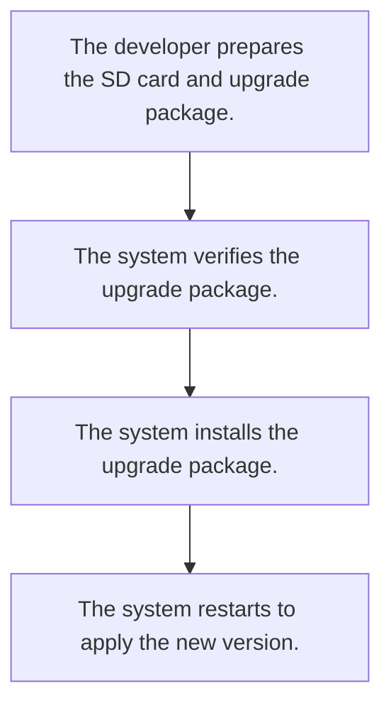
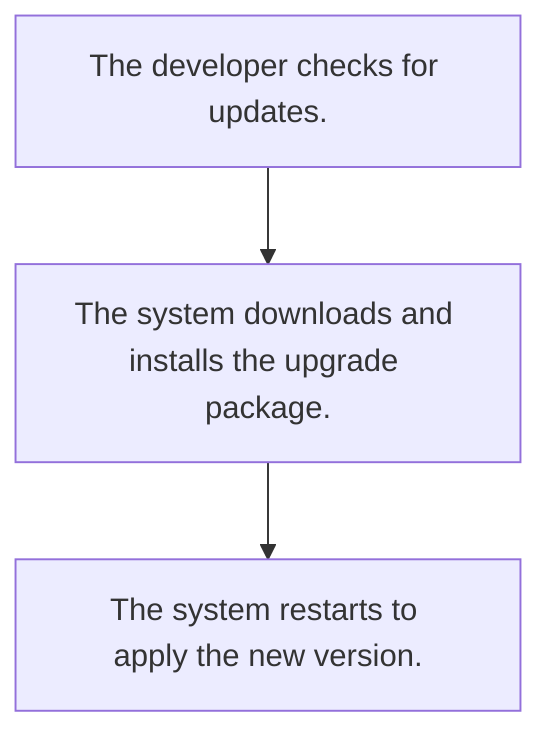
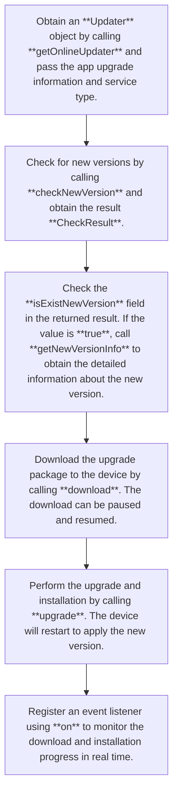
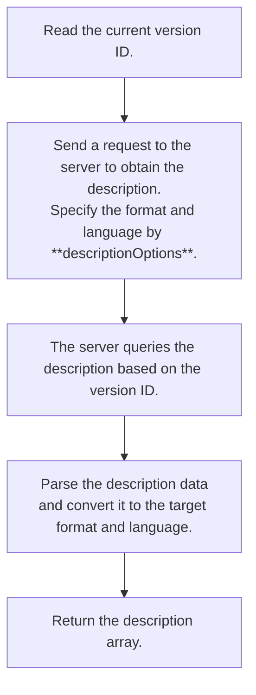
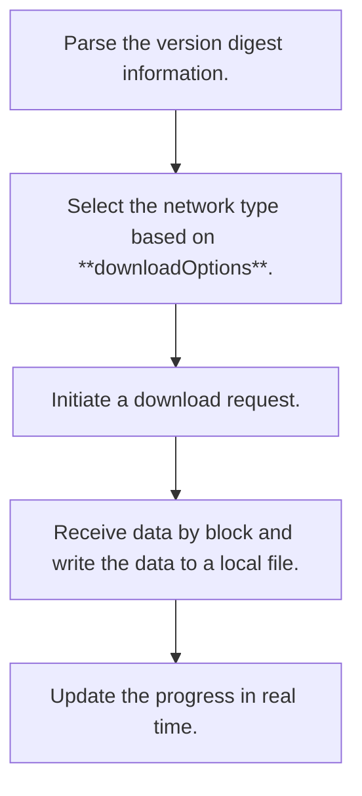

# @ohos.update (Update) (System API)
<!--Kit: Basic Services Kit-->
<!--Subsystem: Update-->
<!--Owner: @RainyDay_005; @huangsiping3-->
<!--Designer: @zhangzhengxue; @jackd320-->
<!--Tester: @mamba-ting-->
<!--Adviser: @fang-jinxu-->

The **@ohos.update** module provides the core capabilities of online update, local SD card update, and factory reset. Version management, update control, and equipment maintenance can be implemented for the Over-The-Air (OTA) clients and system apps using this module. APIs provided by this module can be used for system version update, offline update, and data clearing.

This module implements update of the entire system, including built-in resources and preset applications, but not third-party apps. This feature ensures system integrity, prevents compatibility issues with third-party apps, and improves update stability and security.

There are two types of updates: local SD card update and OTA update.

The design logic and use scenarios of each update type are as follows:

- **Local SD card update:** For details, see [Upgrading Service Terms](../../basic-services/update/update-kit-term.md).

Use scenarios: The system needs to be updated from a local storage device.

The update process is as follows:



**Benefits**

This update mode applies to system update offline or with poor network connection when automatic update cannot be implemented. This mode does not depend on the upgrade package management server, reducing the update cost.

- **Online update:** For details, see [Upgrading Service Terms](../../basic-services/update/update-kit-term.md).

Use scenarios: The system needs to be automatically checked and updated by connecting to the network.

The update process is as follows:



This update mode is implemented by calling APIs of the **Updater** module. This mode depends on the upgrade package management server deployed by the vendor (the server system provides functions such as version check and upgrade package download). The APIs are implemented by the vendor.

**Benefits**

Users can obtain system updates in a timely manner, improving update efficiency and user experience. Functions such as automatic version check, background download, and resumable download are supported, reducing operation costs for users.

**Reset**

Use scenarios: This operation is performed to delete user data and restore the device to factory settings. It is applicable to scenarios such as troubleshooting, device transfer or scrapping, privacy protection, and storage space release. Traditional reset methods have problems such as residual data, uncleared keys, and incomplete data cleanup. This module provides hierarchical restoration capabilities to meet different security requirements.

**Benefits**

This module enables users to quickly troubleshoot, free up storage space, and protect the security of privacy data. Three reset modes are provided to meet the requirements for different security levels. Common reset applies to routine maintenance scenarios, forcible reset applies to data destruction scenarios, and deep reset applies to extreme scenarios such as device scrapping. In this way, hierarchical management of data clearing is implemented, reducing O&M costs.

The following standard process must be followed for restoring the equipment to factory settings:

```mermaid
graph TD
    A[System verification permission:
    (Check whether the current caller has the permission to perform the restoration operation.)] --> B{Application developer selects the factory reset mode.}
    B -->|factoryReset| C1[Common factory reset: Clear data in the user partition only.]
    B -->|forceFactoryReset| C2[Forcible factory reset: Clear data and file keys.]
    B -->|deepFactoryReset| C3[Deep factory reset: Overwrite data for multiple times and perform complete data destruction in the configurable range.]
    C1 --> D[The system performs the clearing operation.]
    C2 --> D
    C3 --> D
    D --> E[The system restarts to restore to the factory settings.]
```

> **NOTE**
>
> The initial APIs of this module are supported since API version 9. Newly added APIs will be marked with a superscript to indicate their earliest API version.
> The APIs provided by this module are system APIs. For details about the system application permission request, see the system application development guide. For details about the application extension permission request, see the application extension development guide.

## Modules to Import

Before using the sample code, you must import the **update** module.

```js
import { update } from '@kit.BasicServicesKit';
```

## update.getOnlineUpdater

getOnlineUpdater(upgradeInfo: UpgradeInfo): Updater

Obtains an **OnlineUpdater** object, which can be used to check for new versions online, download update packages, and install update packages. This API can be used in scenarios such as OTA upgrade (for details, see [Upgrading Service Terms](../../basic-services/update/update-kit-term.md)) of client applications and online system upgrade. This API can help users obtain system updates in a timely manner, improving upgrade efficiency and user experience.

**Overview**

This API obtains an **OnlineUpdater** object through the system service interface. The object provides core functions such as checking for new versions, downloading update packages, and installing update packages.

**Constraints**

- The upgrade package management server deployed by the vendor is required for checking for new versions and downloading update packages.

**System API:** This is a system API.

**System capability:** SystemCapability.Update.UpdateService

**Parameters**

| Name| Type| Mandatory| Description|
| --- | --- | --- | --- |
| upgradeInfo | [UpgradeInfo](#upgradeinfo) | Yes   | **UpgradeInfo** is the upgrade object information, which is used to identify the caller and upgrade service type. **upgradeApp** is the package name of the caller. The value is a string of 1 to 255 characters in the format **com.***xxx.xxx.xxx*. The length of each segment ranges from 1 to 64 characters. Only letters, digits, and periods (.) are supported. Each segment must start with a letter and cannot contain consecutive periods (.) or start or end with a period (.). If the value is out of range or the format is incorrect, an exception is thrown.|

**Return value**

| Type| Description|
| --- | --- |
| [Updater](#updater) | Utility object used to perform online update operations.|

**Error codes**

For details about the error codes, see [Universal Error Codes](../errorcode-universal.md).

| ID| Error Message|
| --- | --- |
| 202 | Permission verification failed. A non-system application calls a system API. |

**Example**

```ts
  // Define an UpgradeInfo object.
  const upgradeInfo: update.UpgradeInfo = {
    upgradeApp: 'com.ohos.ota.updateclient',  // App package name
    businessType: {
      vendor: update.BusinessVendor.PUBLIC, // Vendor type
      subType: update.BusinessSubType.FIRMWARE // The update type is firmware.
    }
  };  
  // Obtain an OnlineUpdater object.
  let onlineUpdater = update.getOnlineUpdater(upgradeInfo);
```

## update.getRestorer

getRestorer(): Restorer

Obtains a **Restorer** object for restoring factory settings. After this API is called, the system returns the **Restorer** utility object. Three factory reset methods are provided:

- **factoryReset**: Common factory reset. Only data in the user partition is cleared in this mode. For details, see [Upgrading Service Terms](../../basic-services/update/update-kit-term.md).
- **forceFactoryReset**: Forcible factory reset. Both data in the user partition and file keys are cleared in this mode. For details, see [Upgrading Service Terms](../../basic-services/update/update-kit-term.md).
- **deepFactoryReset**: Deep factory reset. Data in the scope specified by **scope** is cleared in this mode. **DATA**: Clear data in the user partition only; **DATA_AND_OS**: Clear data in both the user partition and OS partition. For details, see [Upgrading Service Terms](../../basic-services/update/update-kit-term.md).

After obtaining the object, you can call the corresponding method to restore the device to its factory settings. The device will restart and restore to its initial factory settings.

**Overview**

This API obtains a **Restorer** object through the system service interface, and encapsulates core functions such as data partition clearing, key clearing, and system partition clearing.

**Constraints**

- Restoring factory settings is irreversible and will permanently delete user data. Therefore, remind users to back up important data in advance.
- The **ohos.permission.FACTORY_RESET** permission is required for calling **factoryReset**, **deepFactoryReset**, and **getDeepFactoryResetInfo**.
- The **ohos.permission.FORCE_FACTORY_RESET** permission is required for calling **forceFactoryReset**.
- During the operation, the device automatically restarts. The app status needs to be saved.
- **deepFactoryReset** takes a long time (1 to 4 hours depending on the device storage capacity). Ensure that the device has sufficient battery power (recommended battery level: > 50%).
- You are advised to perform the factory reset operation after clicking the confirmation button in the dialog box or on the screen.

**System API**: This is a system API.

**System capability:** SystemCapability.Update.UpdateService

**Return value**

| Type| Description|
| --- | --- |
| [Restorer](#restorer) | Utility object used to perform factory reset operations.|

**Error codes**

For details about the error codes, see [Universal Error Codes](../errorcode-universal.md).

| ID| Error Message|
| --- | --- |
| 202 | Permission verification failed. A non-system application calls a system API. |

**Example**

```ts
  // Obtain a Restorer object for restoring factory settings.
  let factoryRestorer = update.getRestorer();
```

## update.getLocalUpdater

getLocalUpdater(): LocalUpdater

Obtains a **LocalUpdater** object, which is used to upgrade the system from a local storage device (such as the SD card). After this API is called, the system returns the **LocalUpdater** utility object, which provides functions such as verifying and installing the local upgrade package.

The typical process is as follows: The developer prepares the upgrade package (in .zip or .bin format) and certificate file (in .cert or .der format). The system verifies the package signature and integrity. The system installs the upgrade package. The system restarts to apply the new version.

**Overview**

This API obtains a **LocalUpdater** object and encapsulates the capabilities of verifying the upgrade package (the digital signature, file integrity, and version compatibility) and installing the upgrade package (decompress the package and writing it to the system partition). The local upgrade does not depend on the network. The upgraded package is read from the device.

**Constraints**

- The upgrade package must be downloaded from the official website of the vendor or from an official channel to ensure that the source is trusted.
- Before the installation, you must verify the upgrade package by calling **verifyUpgradePackage**. An unverified package may damage the system.
- During the upgrade, the device automatically restarts. The app status needs to be saved.
- The **ohos.permission.UPDATE_SYSTEM** permission is required for calling **getLocalUpdater** APIs.
- The upgrade package file path contains a maximum of 255 characters. If the value contains more than 255 characters, an exception is thrown.

**System API:** This is a system API.

**System capability:** SystemCapability.Update.UpdateService

**Return value**

| Type| Description|
| --- | --- |
| [LocalUpdater](#localupdater) | Utility object used to perform local update operations.|

**Error codes**

For details about the error codes, see [Universal Error Codes](../errorcode-universal.md).

| ID| Error Message|
| --- | --- |
| 202      | Permission verification failed. A non-system application calls a system API. |

**Example**

```ts
  // Obtain a LocalUpdater object.
  let localUpdater = update.getLocalUpdater();
```

## Updater

Defines a utility class that provides online system update functions, such as checking new versions online, downloading upgrade packages, installing update packages, managing upgrade policies, and obtaining version information.

Use scenarios: OTA upgrade, online system upgrade, automatic version check, and upgrade management.

**Benefits**

Users can obtain system updates in a timely manner, improving upgrade efficiency and user experience and reducing operation costs. Functions such as automatic version check, background download, and resumable transfer are supported.

**Online upgrade**



**Implementation mechanism**

- Version check: Query requests about the new version information can be sent to the upgrade package management server.
- Download management: Network type selection, pause/resume download, and resumable transfer are supported.
- Installation mechanism: After the upgrade package is downloaded, it is unzipped and written to the system partition to prepare for restarting the app.
- Status management: Maintain the upgrade task status, including querying task information, clearing abnormal status, and terminating the upgrade.

### checkNewVersion

checkNewVersion(callback: AsyncCallback\<CheckResult>): void

Checks whether a new version is available. The result includes whether a new version is available, new version number, and version digest information.

After the API is successfully called, the version check result is returned. The result can be used to determine whether an upgrade is required and provide version identifiers for subsequent operations such as download and upgrade. This API uses an asynchronous callback to return the result.

This API is the first one used in the online update process. The returned **versionDigestInfo** is mandatory for subsequent APIs.

After this API is called, you can call **getNewVersionInfo** to obtain detailed information about the new version, **download** to download the upgrade package, and **upgrade** to install the upgrade package.

**versionDigestInfo** returned by this API are mandatory for the subsequent APIs. These APIs can be called only when **isExistNewVersion** is **true**.

If the value of **isExistNewVersion** is **false**, the current version is the latest version. In this case, you do not need to perform the subsequent upgrade operations.

Use scenarios: Quickly check whether a new version is available and obtain the version digest information. Users can learn about the system update status in a timely manner, providing a basis for upgrade decisions.

**Overview**

This API sends a version check request to the upgrade package management server deployed by the vendor. The request carries parameters such as the current version information and device model. The server checks whether a new version is available based on the request parameters and returns the version check result (**CheckResult**), including the **isExistNewVersion** flag and **newVersionInfo** structure (version digest and version number).

The check process is as follows: The developer constructs request parameters. The system initiates an HTTP request. The server queries the version information. The system parses the response. The system returns the result.

**Constraints**

- This method depends on the upgrade package management server deployed by the vendor. Ensure that the server is properly deployed and accessible.

**System API:** This is a system API.

**System capability:** SystemCapability.Update.UpdateService

**Required permissions:** ohos.permission.UPDATE_SYSTEM

**Parameters**

| Name| Type| Mandatory| Description|
| --- | --- | --- | --- |
| callback | AsyncCallback\<[CheckResult](#checkresult)> | Yes   | Callback used to receive the version check result. The callback parameters include **err** and **checkResult**. **err** is **null** when the operation is successful; otherwise, **err** is an error object.|

**Return value**

| Type| Description|
| --- | --- |
| void | No return value. An asynchronous callback is used to return the version check result.|

**Error codes**

For details about the error codes, see [Universal Error Codes](../errorcode-universal.md) and [Update Error Codes](errorcode-update.md).

| ID| Error Message|
| --- | --- |
| 201      | Permission denied. |
| 202      | Permission verification failed. A non-system application calls a system API. |
| 11500104 | IPC error.               |

**Example**

```ts
import { BusinessError } from '@kit.BasicServicesKit';
try {
  // Define an UpgradeInfo object.
  const upgradeInfo: update.UpgradeInfo = {
    upgradeApp: 'com.ohos.ota.updateclient',  // App package name
    businessType: {
      vendor: update.BusinessVendor.PUBLIC, // Vendor type
      subType: update.BusinessSubType.FIRMWARE // The update type is firmware.
    }
  };
  // Obtain an OnlineUpdater object.
  let onlineUpdater = update.getOnlineUpdater(upgradeInfo);
  // Check for a new version and obtain the check result using a callback.
  onlineUpdater.checkNewVersion((checkNewVersionError: BusinessError,  
    checkResult: update.CheckResult) => {
      // Handle the error.
      if (checkNewVersionError) {
        console.error(`checkNewVersion error, code:${checkNewVersionError.code}, message:${checkNewVersionError.message}.`);
        return;
      }
      console.info(`checkNewVersion isExistNewVersion  ${checkResult?.isExistNewVersion}`);
    });
} catch (error) {
  let errInfo: BusinessError = error as BusinessError;
  console.error(`Failed to get updater. Code: ${errInfo.code}, message: ${errInfo.message}.`);
}
```

### checkNewVersion

checkNewVersion(): Promise\<CheckResult>

Checks whether a new version is available. The result includes whether a new version is available, new version number, and version digest information.

After the API is successfully called, the version check result is returned. The result can be used to determine whether an upgrade is required and provide version identifiers for subsequent operations such as download and upgrade. This API uses a promise to return the result.

This API is the first one used in the online update process. The returned **versionDigestInfo** is mandatory for subsequent APIs.

After this API is called, you can call **getNewVersionInfo** to obtain detailed information about the new version, **download** to download the upgrade package, and **upgrade** to install the upgrade package.

**versionDigestInfo** returned by this API are mandatory for the subsequent APIs. These APIs can be called only when **isExistNewVersion** is **true**.

If the value of **isExistNewVersion** is **false**, the current version is the latest version. In this case, you do not need to perform the subsequent upgrade operations.

Use scenarios: Quickly check whether a new version is available and obtain the version digest information. Users can learn about the system update status in a timely manner, providing a basis for upgrade decisions.

**Overview**

This method provides the online upgrade function, which depends on the upgrade package management server deployed by the vendor. This API sends a version check request to the upgrade package management server deployed by the vendor. The request carries parameters such as the current version information and device model. The server checks whether a new version is available based on the request parameters and returns the version check result (**CheckResult**), including the **isExistNewVersion** flag and **newVersionInfo** structure (version digest and version number).

The check process is as follows: The developer constructs request parameters. The system initiates an HTTP request. The server queries the version information. The system parses the response. The system returns the result.

**Constraints**

- This method depends on the upgrade package management server deployed by the vendor. Ensure that the server is properly deployed and accessible.

**System API:** This is a system API.

**System capability:** SystemCapability.Update.UpdateService

**Required permissions:** ohos.permission.UPDATE_SYSTEM

**Return value**

| Type| Description|
| --- | --- |
| Promise\<[CheckResult](#checkresult)> | Promise used to return the result. If the operation is successful, the return value of **resolve** is the version check result. If the operation fails, the return value of **reject** is an error message.|

**Error codes**

For details about the error codes, see [Universal Error Codes](../errorcode-universal.md) and [Update Error Codes](errorcode-update.md).

| ID| Error Message|
| --- | --- |
| 201      | Permission denied. |
| 202      | Permission verification failed. A non-system application calls a system API. |
| 11500104 | IPC error.               |

**Example**

```ts
import { BusinessError } from '@kit.BasicServicesKit';

try {
  // Define an UpgradeInfo object.
  const upgradeInfo: update.UpgradeInfo = {
    upgradeApp: 'com.ohos.ota.updateclient',  // App package name
    businessType: {
      vendor: update.BusinessVendor.PUBLIC, // Vendor type
      subType: update.BusinessSubType.FIRMWARE // The update type is firmware.
    }
  };
  // Obtain an OnlineUpdater object.
  let onlineUpdater = update.getOnlineUpdater(upgradeInfo);
  // Check for a new version.
  onlineUpdater.checkNewVersion().then((result: update.CheckResult) => {
    console.info(`checkNewVersion isExistNewVersion: ${result.isExistNewVersion}`);
    // Version digest information
    console.info(`checkNewVersion versionDigestInfo: ${result.newVersionInfo.versionDigestInfo.versionDigest}`);
    }).catch((checkNewVersionError: BusinessError) => {
      console.error(`checkNewVersion promise error, code:${checkNewVersionError.code}, message:${checkNewVersionError.message}.`);
    });
} catch (error) {
  let err: BusinessError = error as BusinessError;
  console.error(`Fail to checkNewVersion. Code: ${err.code}, message: ${err.message}.`);
}
```

### getNewVersionInfo

getNewVersionInfo(callback: AsyncCallback\<NewVersionInfo>): void

Obtains the new version information and sends requests to the upgrade package management server to query the detailed information about the new version, including the version number, version digest information, and version components. After the API is successfully called, a **NewVersionInfo** object is returned, containing complete version information, including the version digest information and version components. This method provides the online upgrade function, which depends on the upgrade package management server deployed by the vendor. This API uses an asynchronous callback to return the result.

Use scenarios: The technical information (such as the version number, upgrade package size, and component details) of the new version is required for version management, diagnosis, or technical analysis. This API helps developers fully understand the technical details of the new version.

To display readable version description to users, you are advised to use the **getNewVersionDescription** method.

**Overview**

This API sends requests to the upgrade package management server to query the complete details of the new version based on the version digest information returned by **checkNewVersion**. The server returns a **NewVersionInfo** object, including **versionDigestInfo** (version digest information used as the version ID for subsequent download and upgrade operations) and a **versionComponents** array (version number, size, and type of each component). This API can be called only when the value of **isExistNewVersion** is **true** by calling **checkNewVersion**. Otherwise, empty data is returned.

**Calling sequence**

- You must first call **checkNewVersion** to check whether a new version is available.
- This API can be called only when the value of **isExistNewVersion** is **true**.

**Related methods**

- **checkNewVersion()**: checks whether a new version is available (prerequisite method).
- **getNewVersionInfo()**: obtains the technical information (version number and component details) of the new version, which is applicable to version management and diagnosis scenarios.
- **getNewVersionDescription()**: obtains the description of the new version, which is used to display the updated content to users.
- **download()**: downloads the upgrade package (subsequent method).

**Constraints**

- This method provides the online upgrade function, which depends on the upgrade package management server deployed by the vendor.
- You must first call **checkNewVersion** to check whether a new version is available. This API can be called only when **isExistNewVersion** is **true**.

**System API:** This is a system API.

**System capability:** SystemCapability.Update.UpdateService

**Required permissions:** ohos.permission.UPDATE_SYSTEM

**Parameters**

| Name| Type| Mandatory| Description|
| --- | --- | --- | --- |
| callback | AsyncCallback\<[NewVersionInfo](#newversioninfo)> | Yes   | Callback used to receive the new version information (**NewVersionInfo**). The callback parameters include **err** and **newInfo**. If the operation is successful, **err** is **null**; if the operation fails, **err** is an error object. Before calling this API, you must call **checkNewVersion** to check whether a new version is available. **newInfo** is valid only when **isExistNewVersion** is **true**. If **isExistNewVersion** is **false**, **newInfo** is **null**.|

**Return value**

| Type| Description|
| --- | --- |
| void | No return value. An asynchronous callback is used to return the new version information.|

**Error codes**

For details about the error codes, see [Universal Error Codes](../errorcode-universal.md) and [Update Error Codes](errorcode-update.md).

| ID| Error Message|
| --- | --- |
| 201      | Permission denied. |
| 202      | Permission verification failed. A non-system application calls a system API. |
| 11500104 | IPC error.               |

**Example**

```ts
import { BusinessError } from '@kit.BasicServicesKit';
try {
  // Define an UpgradeInfo object.
  const upgradeInfo: update.UpgradeInfo = {
    upgradeApp: 'com.ohos.ota.updateclient',  // App package name
    businessType: {
      vendor: update.BusinessVendor.PUBLIC, // Vendor type
      subType: update.BusinessSubType.FIRMWARE // The update type is firmware.
    }
  };
  // Obtain an OnlineUpdater object.
  let onlineUpdater = update.getOnlineUpdater(upgradeInfo);
  // Obtain the new version information and obtain the version details using a callback.
  onlineUpdater.getNewVersionInfo((getNewVersionInfoError: BusinessError, newInfo: update.NewVersionInfo) => {
    if (getNewVersionInfoError) {
      console.error(`getNewVersionInfo error, code:${getNewVersionInfoError.code}, message:${getNewVersionInfoError.message}.`);
      return;
    }
    console.info(`info displayVersion = ${newInfo?.versionComponents[0].displayVersion}`);
    console.info(`info innerVersion = ${newInfo?.versionComponents[0].innerVersion}`);
  });
} catch (error) {
  console.error(`Fail to get onlineUpdater error: ${error}`);
}
```

### getNewVersionInfo

getNewVersionInfo(): Promise\<NewVersionInfo>

Obtains the new version information and sends requests to the upgrade package management server to query the detailed information about the new version, including the version number, version digest information, and version components. After the API is successfully called, a **NewVersionInfo** object is returned, containing complete version information, including the version digest information and version components. This method provides the online upgrade function, which depends on the upgrade package management server deployed by the vendor. This API uses a promise to return the result.

Use scenarios: The technical information (such as the version number, upgrade package size, and component details) of the new version is required for version management, diagnosis, or technical analysis. This API helps developers fully understand the technical details of the new version.

To display readable version description to users, you are advised to use the **getNewVersionDescription** method.

**Overview**

This API sends requests to the upgrade package management server to query the complete details of the new version based on the version digest information returned by **checkNewVersion**. The server returns a **NewVersionInfo** object, including **versionDigestInfo** (version digest information used as the version ID for subsequent download and upgrade operations) and a **versionComponents** array (version number, size, and type of each component). This API can be called only when the value of **isExistNewVersion** is **true** by calling **checkNewVersion**. Otherwise, empty data is returned.

**Calling sequence**

- You must first call **checkNewVersion** to check whether a new version is available.
- This API can be called to obtain details about the new version only when the value of **isExistNewVersion** is **true** by calling **checkNewVersion**.

**Related methods**

- **checkNewVersion()**: checks whether a new version is available (prerequisite method).
- **getNewVersionInfo()**: obtains the technical information (version number and component details) of the new version, which is applicable to version management and diagnosis scenarios.
- **getNewVersionDescription()**: obtains the description of the new version, which is used to display the updated content to users.
- **download()**: downloads the upgrade package (subsequent method).

**Constraints**

- This method provides the online upgrade function, which depends on the upgrade package management server deployed by the vendor.
- You must first call **checkNewVersion** to check whether a new version is available. This API can be called only when **isExistNewVersion** is **true**.

**System API:** This is a system API.

**System capability:** SystemCapability.Update.UpdateService

**Required permissions:** ohos.permission.UPDATE_SYSTEM

**Return value**

| Type| Description|
| --- | --- |
| Promise\<[NewVersionInfo](#newversioninfo)> | Promise used to return the result. If the operation is successful, the return value of **resolve** is the detailed information about the new version. If the operation fails, the return value of **reject** is an error message.|

**Error codes**

For details about the error codes, see [Universal Error Codes](../errorcode-universal.md) and [Update Error Codes](errorcode-update.md).

| ID| Error Message|
| --- | --- |
| 201      | Permission denied. |
| 202      | Permission verification failed. A non-system application calls a system API. |
| 11500104 | IPC error.               |

**Example**

```ts
import { BusinessError } from '@kit.BasicServicesKit';
try {
  // Define an UpgradeInfo object.
  const upgradeInfo: update.UpgradeInfo = {
    upgradeApp: 'com.ohos.ota.updateclient',  // App package name
    businessType: {
      vendor: update.BusinessVendor.PUBLIC, // Vendor type
      subType: update.BusinessSubType.FIRMWARE // The update type is firmware.
    }
  };
  // Obtain an OnlineUpdater object.
  let onlineUpdater = update.getOnlineUpdater(upgradeInfo);
  // Obtain new version information.
  onlineUpdater.getNewVersionInfo().then((info: update.NewVersionInfo) => {
    console.info(`info displayVersion = ${info.versionComponents[0].displayVersion}`);
    console.info(`info innerVersion = ${info.versionComponents[0].innerVersion}`);
  }).catch((getNewVersionInfoError: BusinessError) => {
    console.error(`getNewVersionInfo promise error, code:${getNewVersionInfoError.code}, message:${getNewVersionInfoError.message}.`);
  });
} catch (error) {
  console.error(`Fail to get onlineUpdater error: ${error}`);
}
```

### getNewVersionDescription

getNewVersionDescription(versionDigestInfo: VersionDigestInfo, descriptionOptions: DescriptionOptions, callback: AsyncCallback\<Array\<ComponentDescription>>): void

Obtains the description of the new version. This method provides the online upgrade function, which depends on the upgrade package management server deployed by the vendor. After the API is successfully called, the new version description array is returned, including the version description of each component. This API uses an asynchronous callback to return the result.

Use scenarios: Display version updates to users and confirm whether to perform the upgrade. Help users understand the function improvements and fixes of the new version and make upgrade decisions.

**Overview**

This API sends requests to the upgrade package management server to query the version description of each component based on the version digest information returned by **checkNewVersion**. The description includes the function improvements, fixes, and version features of each component. The server returns a description array. Each element corresponds to the description of a component (**ComponentDescription**). The server returns the description text in the format (**STANDARD** or **SIMPLIFIED**) and language (for example, **zh-cn**) specified by **descriptionOptions**. The description can be in text format (**DescriptionType.CONTENT**) or link format (**DescriptionType.URI**) and is used to display the version updates to users.

**Calling sequence**

- You need to call **checkNewVersion** to check whether a new version is available and obtain the version digest information.
- The value of **versionDigestInfo** is obtained from the result returned by calling **checkNewVersion**. **checkNewVersion** must be called first.

**System API:** This is a system API.

**System capability:** SystemCapability.Update.UpdateService

**Required permissions:** ohos.permission.UPDATE_SYSTEM

**Parameters**

| Name| Type| Mandatory| Description|
| --- | --- | --- | --- |
| versionDigestInfo | [VersionDigestInfo](#versiondigestinfo)  | Yes   | Version digest information, including the version ID (**versionDigest** field). This parameter can be used only after the **checkNewVersion** API is called to check for a new version and the value of **isExistNewVersion** is **true**. The parameter value is obtained from the **newVersionInfo** field in the result returned by the **checkNewVersion** API. The version digest uniquely identifies a version generated by the server and is used for subsequent version query, download, and upgrade operations. This parameter is valid only when **isExistNewVersion** is **true**.|
| descriptionOptions | [DescriptionOptions](#descriptionoptions) | Yes   | Description options. This parameter specifies the format and language of the description file. The **format** field specifies the description format (**STANDARD** or **SIMPLIFIED**). The **language** field specifies the language of the description file. The value is a string of 2 to 10 characters, for example, **zh-cn** (Chinese), **en-us** (English), and **ja-jp** (Japanese). Valid characters include letters (case sensitive) and hyphens (-). Lowercase letters are recommended. An exception is thrown if the value is out of range or contains invalid characters.|
| callback           | AsyncCallback\<Array\<[ComponentDescription](#componentdescription)>> | Yes   | Callback used to receive the description of the new version. The callback parameters include **err** and **descriptionInfo**. If the operation is successful, **err** is **null**; if the operation fails, **err** is an error object. **descriptionInfo** is the new version description array, including the version description of each component. Before calling this API, you must call **checkNewVersion** to check whether a new version is available. **descriptionInfo** is valid only when **isExistNewVersion** is **true**. If **isExistNewVersion** is **false**, **descriptionInfo** is **null**.|

**Error codes**

For details about the error codes, see [Universal Error Codes](../errorcode-universal.md) and [Update Error Codes](errorcode-update.md).

| ID| Error Message|
| --- | --- |
| 201      | Permission denied. |
| 202      | Permission verification failed. A non-system application calls a system API. |
| 401      | Parameter verification failed.    |
| 11500104 | IPC error.               |

**Example**

```ts
import { BusinessError } from '@kit.BasicServicesKit';

// Version digest information
const versionDigestInfo: update.VersionDigestInfo = {
  versionDigest: 'versionDigest' // Obtain the version digest information from the checkNewVersion result.
};

// Options of the description file
const descriptionOptions: update.DescriptionOptions = {
  format: update.DescriptionFormat.STANDARD, // Standard format
  language: 'zh-cn' // Chinese
};

try {
  // Define an UpgradeInfo object.
  const upgradeInfo: update.UpgradeInfo = {
    upgradeApp: 'com.ohos.ota.updateclient',  // App package name
    businessType: {
      vendor: update.BusinessVendor.PUBLIC, // Vendor type
      subType: update.BusinessSubType.FIRMWARE // The update type is firmware.
    }
  };
  // Obtain an OnlineUpdater object.
  let onlineUpdater = update.getOnlineUpdater(upgradeInfo);
  // Obtain the description of the new version.
  onlineUpdater.getNewVersionDescription(versionDigestInfo, descriptionOptions, (descriptionError, descriptionInfo) => {
    if (descriptionError) {
      console.error(`getNewVersionDescription error, code:${descriptionError.code}, message:${descriptionError.message}.`);
      return;
    }
    console.info(`getNewVersionDescription info ${JSON.stringify(descriptionInfo)}`);
  });
} catch (error) {
  console.error(`Fail to get updater error: ${error}`);
}
```

### getNewVersionDescription

getNewVersionDescription(versionDigestInfo: VersionDigestInfo, descriptionOptions: DescriptionOptions): Promise\<Array\<ComponentDescription>>

Obtains the description of the new version (**ComponentDescription**). This method provides the online upgrade function, which depends on the upgrade package management server deployed by the vendor. After the API is successfully called, the new version description array is returned, including the version description of each component. This API uses a promise to return the result.

Use scenarios: Display version updates to users and confirm whether to perform the upgrade. Help users understand the function improvements and fixes of the new version and make upgrade decisions.

**Overview**

This API sends requests to the upgrade package management server to query the version description of each component based on the version digest information returned by **checkNewVersion**. The description includes the function improvements, fixes, and version features of each component. The server returns a description array. Each element corresponds to the description of a component (**ComponentDescription**). The server returns the description text in the format (**STANDARD** or **SIMPLIFIED**) and language (for example, **zh-cn**) specified by **descriptionOptions**. The description can be in text format (**DescriptionType.CONTENT**) or link format (**DescriptionType.URI**) and is used to display the version updates to users.

**Calling sequence**

- You need to call **checkNewVersion** to check whether a new version is available and obtain the version digest information.
- The value of **versionDigestInfo** is obtained from the result returned by calling **checkNewVersion**.

**System API:** This is a system API.

**System capability:** SystemCapability.Update.UpdateService

**Required permissions:** ohos.permission.UPDATE_SYSTEM

**Parameters**

| Name| Type| Mandatory| Description|
| --- | --- | --- | --- |
| versionDigestInfo  | [VersionDigestInfo](#versiondigestinfo)  | Yes   | Version digest information. This parameter can be used only after the **checkNewVersion** API is called to check for a new version and the value of **isExistNewVersion** is **true**. The parameter value is obtained from the **newVersionInfo** field in the result returned by the **checkNewVersion** API, which identifies a specific version. This parameter is valid only when **isExistNewVersion** is **true**.|
| descriptionOptions | [DescriptionOptions](#descriptionoptions) | Yes   | Description options. This parameter specifies the format and language of the description file. The **format** field specifies the description format (**STANDARD** or **SIMPLIFIED**). The **language** field specifies the language of the description file. The value is a string of 2 to 10 characters, for example, **zh-cn** (Chinese), **en-us** (English), and **ja-jp** (Japanese). Valid characters include letters (case sensitive) and hyphens (-). Lowercase letters are recommended. An exception is thrown if the value is out of range or contains invalid characters.|

**Return value**

| Type| Description|
| --- | --- |
| Promise\<Array\<[ComponentDescription](#componentdescription)>> | Promise used to return the result. If the operation is successful, the return value of **resolve** is the new version description array, which is used to display the version updates to the user and confirm the updates. If the operation fails, the return value of **reject** is an error message.|

**Error codes**

For details about the error codes, see [Universal Error Codes](../errorcode-universal.md) and [Update Error Codes](errorcode-update.md).

| ID| Error Message|
| --- | --- |
| 201      | Permission denied. |
| 202      | Permission verification failed. A non-system application calls a system API. |
| 401      | Parameter verification failed.    |
| 11500104 | IPC error.               |

**Example**

```ts
import { BusinessError } from '@kit.BasicServicesKit';

// Version digest information. Call checkNewVersion to check for a new version and confirm the value of isExistNewVersion is true first.
// Obtain the value from the newVersionInfo.versionDigestInfo field in the returned result.
const versionDigestInfo: update.VersionDigestInfo = {
  versionDigest: 'versionDigest' // Obtain the actual value from the result returned by checkNewVersion.
};

// Options of the description file
const descriptionOptions: update.DescriptionOptions = {
  format: update.DescriptionFormat.STANDARD, // Standard format
  language: 'zh-cn' // Chinese
};

try {
  // Define an UpgradeInfo object.
  const upgradeInfo: update.UpgradeInfo = {
    upgradeApp: 'com.ohos.ota.updateclient',  // App package name
    businessType: {
      vendor: update.BusinessVendor.PUBLIC, // Vendor type
      subType: update.BusinessSubType.FIRMWARE // The update type is firmware.
    }
  };
  // Obtain an OnlineUpdater object.
  let onlineUpdater = update.getOnlineUpdater(upgradeInfo);

  // Obtain the description of the new version.
  onlineUpdater.getNewVersionDescription(versionDigestInfo, descriptionOptions)
    .then((info: Array<update.ComponentDescription>) => {
    console.info(`getNewVersionDescription promise info ${JSON.stringify(info)}`);
  }).catch((descriptionError: BusinessError) => {
    console.error(`getNewVersionDescription promise error, code:${descriptionError.code}, message:${descriptionError.message}.`);
  });
} catch (error) {
  console.error(`Fail to get onlineUpdater error: ${error}`);
}
```

### getCurrentVersionInfo

getCurrentVersionInfo(callback: AsyncCallback\<CurrentVersionInfo>): void

Obtains information about the current version. After the API is successfully called, a **CurrentVersionInfo** object is returned, including the system version number, device name, and version components. This helps users quickly learn about the device version status, facilitating upgrade decision-making and troubleshooting. This API uses an asynchronous callback to return the result.

Use scenarios: Display the system version on the settings screen, check whether the version is the latest, and perform version management and diagnosis. To display the readable description of the current version to users, you are advised to use **getCurrentVersionDescription**.

**Overview**

This method reads the current version information from the local system files and configurations of the device, including **osVersion** (system version number read from the system version configuration file), **deviceName** (device name read from the device attribute configuration), and **versionComponents** (array of component version information read from the system partition metadata). The information comes from the local device and does not depend on the network connection. After this method is called, the locally cached version data is directly returned.

**System API:** This is a system API.

**System capability:** SystemCapability.Update.UpdateService

**Required permissions:** ohos.permission.UPDATE_SYSTEM

**Parameters**

| Name| Type| Mandatory| Description|
| --- | --- | --- | --- |
| callback | AsyncCallback\<[CurrentVersionInfo](#currentversioninfo)> | Yes   | Callback used to receive the current version information (**CurrentVersionInfo**). The callback parameters include **err** and **currentInfo**. If the operation is successful, **err** is **null**; if the operation fails, **err** is an error object. **currentInfo** indicates the current version information, including the **osVersion**, **deviceName**, and **versionComponents** fields.|

**Return value**

| Type| Description|
| --- | --- |
| void | No return value. An asynchronous callback is used to return the current version information.|

**Error codes**

For details about the error codes, see [Universal Error Codes](../errorcode-universal.md) and [Update Error Codes](errorcode-update.md).

| ID| Error Message|
| --- | --- |
| 201      | Permission denied. |
| 202      | Permission verification failed. A non-system application calls a system API. |
| 11500104 | IPC error.               |

**Example**

```ts
import { BusinessError } from '@kit.BasicServicesKit';

try {
  // Define an UpgradeInfo object.
  const upgradeInfo: update.UpgradeInfo = {
    upgradeApp: 'com.ohos.ota.updateclient',  // App package name
    businessType: {
      vendor: update.BusinessVendor.PUBLIC, // Vendor type
      subType: update.BusinessSubType.FIRMWARE // The update type is firmware.
    }
  };
  // Obtain an OnlineUpdater object.
  let onlineUpdater = update.getOnlineUpdater(upgradeInfo);

  // Obtain the current version information and obtain the version details using a callback.
  onlineUpdater.getCurrentVersionInfo((currentVersionInfoError: BusinessError,
    currentVersionInfo: update.CurrentVersionInfo) => {
    if (currentVersionInfoError) {
      console.error(`getCurrentVersionInfo error, code:${currentVersionInfoError.code}, message:${currentVersionInfoError.message}.`);
      return;
    }
    console.info(`info osVersion = ${currentVersionInfo?.osVersion}`);
    console.info(`info deviceName = ${currentVersionInfo?.deviceName}`);
    console.info(`info displayVersion = ${currentVersionInfo?.versionComponents[0].displayVersion}`);
  });
} catch (error) {
  console.error(`Fail to get onlineUpdater error: ${error}`);
}
```

### getCurrentVersionInfo

getCurrentVersionInfo(): Promise\<CurrentVersionInfo>

Obtains information about the current version. After the API is successfully called, a **CurrentVersionInfo** object is returned, including the system version number, device name, and version components. This helps users quickly learn about the device version status, facilitating upgrade decision-making and troubleshooting. This API uses a promise to return the result.

Use scenarios: Display the system version on the settings screen, check whether the version is the latest, and perform version management and diagnosis. To display the readable description of the current version to users, you are advised to use **getCurrentVersionDescription**.

**Overview**

This method reads the current version information from the local system files and configurations of the device, including **osVersion** (system version number read from the system version configuration file), **deviceName** (device name read from the device attribute configuration), and **versionComponents** (array of component version information read from the system partition metadata). The information comes from the local device and does not depend on the network connection. After this method is called, the locally cached version data is directly returned.

**System API:** This is a system API.

**System capability:** SystemCapability.Update.UpdateService

**Required permissions:** ohos.permission.UPDATE_SYSTEM

**Return value**

| Type                                      | Description                 |
| ---------------------------------------- | ------------------- |
| Promise\<[CurrentVersionInfo](#currentversioninfo)> | Promise used to return the result. If the operation is successful, the return value of **resolve** is the current version information, which is used to display the system version and version comparison. If the operation fails, the return value of **reject** is an error message.|

**Error codes**

For details about the error codes, see [Universal Error Codes](../errorcode-universal.md) and [Update Error Codes](errorcode-update.md).

| ID| Error Message|
| --- | --- |
| 201      | Permission denied. |
| 202      | Permission verification failed. A non-system application calls a system API. |
| 11500104 | IPC error.               |

**Example**

```ts
import { BusinessError } from '@kit.BasicServicesKit';
try {
  // Define an UpgradeInfo object.
  const upgradeInfo: update.UpgradeInfo = {
    upgradeApp: 'com.ohos.ota.updateclient',  // App package name
    businessType: {
      vendor: update.BusinessVendor.PUBLIC, // Vendor type
      subType: update.BusinessSubType.FIRMWARE // The update type is firmware.
    }
  };
  // Obtain an OnlineUpdater object.
  let onlineUpdater = update.getOnlineUpdater(upgradeInfo);
  // Obtain the current version information.
  onlineUpdater.getCurrentVersionInfo().then((info: update.CurrentVersionInfo) => {
    console.info(`info osVersion = ${info.osVersion}`);
    console.info(`info deviceName = ${info.deviceName}`);
    console.info(`info displayVersion = ${info.versionComponents[0].displayVersion}`);
  }).catch((currentVersionInfoError: BusinessError) => {
    console.error(`getCurrentVersionInfo error, code:${currentVersionInfoError.code}, message:${currentVersionInfoError.message}.`);
  });
} catch (error) {
  console.error(`Fail to get updater error: ${error}`);
}
```

### getCurrentVersionDescription

getCurrentVersionDescription(descriptionOptions: DescriptionOptions, callback: AsyncCallback\<Array\<ComponentDescription>>): void

Obtains the description of the current version. This method provides the online upgrade function, which depends on the upgrade package management server deployed by the vendor. After this API is called successfully, the current version description array is returned, which can be used for version information display, version status confirmation, and version comparison and analysis. This API uses an asynchronous callback to return the result.

Use scenarios: Display the current version details to users, confirm the current system version status, and compare the differences between the old and new versions. For example, display the update description on the device information page, and display changes on the version history page. Use **getCurrentVersionInfo** to obtain the technical version information such as the version number and device name.

**Overview**

This API obtains the description of each component of the current version from the upgrade package management server. The process is as follows:



The description includes the function description and version features of each component. The information can be returned in **CONTENT** (text) or **URI** (link) format.

**Related methods**

- **getCurrentVersionInfo()**: obtains the current version information such as the version number and device name. This method can be called independently.
- **getCurrentVersionDescription()**: obtains the description of the current version, which can be displayed to users.
- The two methods can be used together. You can call **getCurrentVersionInfo** to obtain basic information and then call this method to obtain the detailed description for display.

**System API:** This is a system API.

**System capability:** SystemCapability.Update.UpdateService

**Required permissions:** ohos.permission.UPDATE_SYSTEM

**Parameters**

| Name| Type| Mandatory| Description|
| --- | --- | --- | --- |
| descriptionOptions | [DescriptionOptions](#descriptionoptions) | Yes   | Description options. This parameter specifies the format and language of the description file. The **format** field specifies the description format (**STANDARD** or **SIMPLIFIED**). The **language** field specifies the language of the description file. The value is a string of 2 to 10 characters, for example, **zh-cn** (Chinese), **en-us** (English), and **ja-jp** (Japanese). Valid characters include letters (case sensitive) and hyphens (-). Lowercase letters are recommended. An exception is thrown if the value is out of range or contains invalid characters.|
| callback           | AsyncCallback\<Array\<[ComponentDescription](#componentdescription)>> | Yes   | Callback used to receive the description of the current version. The callback parameters include **err** and **info**. If the operation is successful, **err** is **null**; if the operation fails, **err** is an error object. **info** is the current version description array, including the version description.|

**Error codes**

For details about the error codes, see [Universal Error Codes](../errorcode-universal.md) and [Update Error Codes](errorcode-update.md).

| ID| Error Message|
| --- | --- |
| 201      | Permission denied. |
| 202      | Permission verification failed. A non-system application calls a system API. |
| 401      | Parameter verification failed. |
| 11500104 | IPC error. |

**Example**

```ts
// Options of the description file
const descriptionOptions: update.DescriptionOptions = {
  format: update.DescriptionFormat.STANDARD, // Standard format
  language: 'zh-cn' // Chinese
};

try {
  // Define an UpgradeInfo object.
  const upgradeInfo: update.UpgradeInfo = {
    upgradeApp: 'com.ohos.ota.updateclient',  // App package name
    businessType: {
      vendor: update.BusinessVendor.PUBLIC, // Vendor type
      subType: update.BusinessSubType.FIRMWARE // The update type is firmware.
    }
  };
  // Obtain an OnlineUpdater object.
  let onlineUpdater = update.getOnlineUpdater(upgradeInfo);

  // Obtain the description of the current version.
  onlineUpdater.getCurrentVersionDescription(descriptionOptions, (currentDescriptionError, info) => {
    if (currentDescriptionError) {
      console.error(`getCurrentVersionDescription error, code:${currentDescriptionError.code}, message:${currentDescriptionError.message}.`);
      return;
    }
    console.info(`getCurrentVersionDescription info ${JSON.stringify(info)}`);
  });
} catch (error) {
  console.error(`Fail to get onlineUpdater error: ${error}`);
}
```

### getCurrentVersionDescription

getCurrentVersionDescription(descriptionOptions: DescriptionOptions): Promise\<Array\<ComponentDescription>>

Obtains the description of the current version. This method provides the online upgrade function, which depends on the upgrade package management server deployed by the vendor. After this API is called successfully, the current version description array is returned, which can be used for version information display, version status confirmation, and version comparison and analysis. This API uses a promise to return the result.

Use scenarios: Display the current version details to users, confirm the current system version status, and compare the differences between the old and new versions. For example, display the update description on the device information page, and display changes on the version history page. Use **getCurrentVersionInfo** to obtain the technical version information such as the version number and device name.

**Overview**

This API obtains the description of each component of the current version from the upgrade package management server. The process is as follows: Read the current version ID. Send a request to the server to obtain the description. (Specify the format and language by descriptionOptions.) The server queries the description based on the version ID. Parse the description data and convert it to the target format and language. Return the description array. The description includes the function description and version features of each component. The information can be returned in **CONTENT** (text) or **URI** (link) format.

**Related methods**

- **getCurrentVersionInfo()**: obtains the current version information such as the version number and device name. This method can be called independently.
- **getCurrentVersionDescription()**: obtains the description of the current version, which can be displayed to users.
- The two methods can be used together. You can call **getCurrentVersionInfo** to obtain basic information and then call this method to obtain the detailed description for display.

**System API:** This is a system API.

**System capability:** SystemCapability.Update.UpdateService

**Required permissions:** ohos.permission.UPDATE_SYSTEM

**Parameters**

| Name| Type| Mandatory| Description|
| --- | --- | --- | --- |
| descriptionOptions | [DescriptionOptions](#descriptionoptions) | Yes   | Description options. This parameter specifies the format and language of the description file. The **format** field specifies the description format (**STANDARD** or **SIMPLIFIED**). The **language** field specifies the language of the description file. The value is a string of 2 to 10 characters, for example, **zh-cn** (Chinese), **en-us** (English), and **ja-jp** (Japanese). Valid characters include letters (case sensitive) and hyphens (-). Lowercase letters are recommended. An exception is thrown if the value is out of range or contains invalid characters.|

**Return value**

| Type                                      | Description                  |
| ---------------------------------------- | -------------------- |
| Promise\<Array\<[ComponentDescription](#componentdescription)>> | Promise used to return the result. If the operation is successful, the return value of **resolve** is the current version description array, which is used to display the current version and version comparison. If the operation fails, the return value of **reject** is an error message.|

**Error codes**

For details about the error codes, see [Universal Error Codes](../errorcode-universal.md) and [Update Error Codes](errorcode-update.md).

| ID| Error Message|
| --- | --- |
| 201      | Permission denied. |
| 202      | Permission verification failed. A non-system application calls a system API. |
| 401      | Parameter verification failed.    |
| 11500104 | IPC error.               |

**Example**

```ts
import { BusinessError } from '@kit.BasicServicesKit';
// Options of the description file
const descriptionOptions: update.DescriptionOptions = {
  format: update.DescriptionFormat.STANDARD, // Standard format
  language: 'zh-cn' // Chinese
};
try {
  // Define an UpgradeInfo object.
  const upgradeInfo: update.UpgradeInfo = {
    upgradeApp: 'com.ohos.ota.updateclient',  // App package name
    businessType: {
      vendor: update.BusinessVendor.PUBLIC, // Vendor type
      subType: update.BusinessSubType.FIRMWARE // The update type is firmware.
    }
  };
  // Obtain an OnlineUpdater object.
  let onlineUpdater = update.getOnlineUpdater(upgradeInfo);

  // Obtain the description of the current version.
  onlineUpdater.getCurrentVersionDescription(descriptionOptions).then((info: Array<update.ComponentDescription>) => {
    console.info(`getCurrentVersionDescription promise info ${JSON.stringify(info)}`);
  }).catch((descriptionError: BusinessError) => {
    console.error(`getCurrentVersionDescription error, code:${descriptionError.code}, message:${descriptionError.message}.`);
  });
} catch (error) {
  console.error(`Fail to get onlineUpdater error: ${error}`);
}
```

### getTaskInfo

getTaskInfo(callback: AsyncCallback\<TaskInfo>): void

Obtains information about the update task. This method provides the online upgrade function, which depends on the upgrade package management server deployed by the vendor. After the information is obtained, a **TaskInfo** object is returned, including whether the task exists, task status, and progress. This helps you monitor the upgrade progress in real time, detect exceptions promptly, and optimize the upgrade policy, improving the controllability and success rate of the upgrade process. This API uses an asynchronous callback to return the result.

Use scenarios: Track the upgrade progress in real time, monitor the task status, and detect exceptions promptly.

**Overview**

This method queries the status of the current upgrade task from the system upgrade service. The system maintains an upgrade task status record, including **existTask** (whether a task exists) and **taskBody** (task details, including the version digest, current status, progress percentage, and installation mode). The task status is updated in real time during the download and installation processes. This method can be used to query the latest status. The status information is stored in the memory of the system service process. Each time this method is called, the status information is queried from the service process and returned in real time.

**Related methods**

- **download()**: downloads the upgrade package. (You can call **getTaskInfo** to query the download progress and status during download.)
- **upgrade()**: installs the upgrade package. (You can call **getTaskInfo** to query the installation progress and status during installation.)
- **pauseDownload()**: pauses download. (You can call **getTaskInfo** to query the pause status after download is paused.)
- **terminateUpgrade()**: terminates upgrade. (You can call **getTaskInfo** to query the task cancellation status after upgrade is terminated.)

**When to Call:**

- You are advised to call **getTaskInfo** to query the task progress as required after calling **download** or **upgrade** to start the upgrade task.
- During upgrade, you can obtain the progress in real time using an event listener registered by **on** or use **getTaskInfo** to query the current status.
- In the case of an exception or interruption, you can call **getTaskInfo** to confirm the task status and determine the follow-up procedure.

**System API:** This is a system API.

**System capability:** SystemCapability.Update.UpdateService

**Required permissions:** ohos.permission.UPDATE_SYSTEM

**Parameters**

| Name| Type| Mandatory| Description|
| --- | --- | --- | --- |
| callback | AsyncCallback\<[TaskInfo](#taskinfo)> | Yes   | Callback used to receive the upgrade task information (**TaskInfo**). The callback parameters include **err** and **taskInfo**. If the operation is successful, **err** is **null**; if the operation fails, **err** is an error object. **taskInfo** indicates the upgrade task information, including the **existTask** and **taskBody** fields.|

**Error codes**

For details about the error codes, see [Universal Error Codes](../errorcode-universal.md) and [Update Error Codes](errorcode-update.md).

| ID| Error Message|
| --- | --- |
| 201      | Permission denied. |
| 202      | Permission verification failed. A non-system application calls a system API. |
| 11500104 | IPC error.               |

**Example**

```ts
import { BusinessError } from '@kit.BasicServicesKit';

try {
  // Define an UpgradeInfo object.
  const upgradeInfo: update.UpgradeInfo = {
    upgradeApp: 'com.ohos.ota.updateclient',  // App package name
    businessType: {
      vendor: update.BusinessVendor.PUBLIC, // Vendor type
      subType: update.BusinessSubType.FIRMWARE // The update type is firmware.
    }
  };
  // Obtain an OnlineUpdater object.
  let onlineUpdater = update.getOnlineUpdater(upgradeInfo);

  // Obtain the update task information and use a callback to receive the task status.
  onlineUpdater.getTaskInfo((taskInfoError: BusinessError, taskInfo: update.TaskInfo) => {
    if (taskInfoError) {
      console.error(`getTaskInfo error, code:${taskInfoError.code}, message:${taskInfoError.message}.`);
      return;
    }
    console.info(`getTaskInfo existTask= ${taskInfo?.existTask}`);
  });
} catch (error) {
  console.error(`Fail to get onlineUpdater error: ${error}`);
}
```

### getTaskInfo

getTaskInfo(): Promise\<TaskInfo>

Obtains information about the update task. This method provides the online upgrade function, which depends on the upgrade package management server deployed by the vendor. After the information is obtained, a **TaskInfo** object is returned, including whether the task exists, task status, and progress. This helps you monitor the upgrade progress in real time, detect exceptions promptly, and optimize the upgrade policy, improving the controllability and success rate of the upgrade process. This API uses a promise to return the result.

Use scenarios: Track the upgrade progress in real time, monitor the task status, and detect exceptions promptly.

**Overview**

This method queries the status of the current upgrade task from the system upgrade service. The system maintains an upgrade task status record, including **existTask** (whether a task exists) and **taskBody** (task details, including the version digest, current status, progress percentage, and installation mode). The task status is updated in real time during the download and installation processes. This method can be used to query the latest status. The status information is stored in the memory of the system service process. Each time this method is called, the status information is queried from the service process and returned in real time.

**Related methods**

- **download()**: downloads the upgrade package. (You can call **getTaskInfo** to query the download progress and status during download.)
- **upgrade()**: installs the upgrade package. (You can call **getTaskInfo** to query the installation progress and status during installation.)
- **pauseDownload()**: pauses download. (You can call **getTaskInfo** to query the pause status after download is paused.)
- **terminateUpgrade()**: terminates upgrade. (You can call **getTaskInfo** to query the task cancellation status after upgrade is terminated.)

**When to Call:**

- You are advised to call **getTaskInfo** to query the task progress periodically after calling **download** or **upgrade** to start the upgrade task.
- During upgrade, you can obtain the progress in real time using an event listener registered by **on** or use **getTaskInfo** to query the current status.
- In the case of an exception or interruption, you can call **getTaskInfo** to confirm the task status and determine the follow-up procedure.

**System API:** This is a system API.

**System capability:** SystemCapability.Update.UpdateService

**Required permissions:** ohos.permission.UPDATE_SYSTEM

**Return value**

| Type| Description|
| --- | --- |
| Promise\<[TaskInfo](#taskinfo)> | Promise used to return the result. If the operation is successful, the return value of **resolve** is a **TaskInfo** object, which is used to query and monitor the upgrade task status. If the operation fails, the return value of **reject** is an error message.|

**Error codes**

For details about the error codes, see [Universal Error Codes](../errorcode-universal.md) and [Update Error Codes](errorcode-update.md).

| ID| Error Message|
| --- | --- |
| 201      | Permission denied. |
| 202      | Permission verification failed. A non-system application calls a system API. |
| 11500104 | IPC error.               |

**Example**

```ts
import { BusinessError } from '@kit.BasicServicesKit';

try {
  // Define an UpgradeInfo object.
  const upgradeInfo: update.UpgradeInfo = {
    upgradeApp: 'com.ohos.ota.updateclient',  // App package name
    businessType: {
      vendor: update.BusinessVendor.PUBLIC, // Vendor type
      subType: update.BusinessSubType.FIRMWARE // The update type is firmware.
    }
  };
  // Obtain an OnlineUpdater object.
  let onlineUpdater = update.getOnlineUpdater(upgradeInfo);
  // Obtain information about the update task.
  onlineUpdater.getTaskInfo().then((info: update.TaskInfo) => {
    console.info(`getTaskInfo existTask= ${info.existTask}`);
  }).catch((taskInfoError: BusinessError) => {
    // Handle the failure of obtaining the task information.
    console.error(`Failed to get task info. code:${taskInfoError.code}, message:${taskInfoError.message}.`);
  });
} catch (error) {
  console.error(`Fail to get onlineUpdater error: ${error}`);
}
```

### download

download(versionDigestInfo: VersionDigestInfo, downloadOptions: DownloadOptions, callback: AsyncCallback\<void>): void

Downloads the upgrade package to the device. This method provides the online upgrade function, which depends on the upgrade package management server deployed by the vendor. Progress monitoring, pause, and resumption of download are supported, helping users efficiently obtain the upgrade package, saving bandwidth and time, and improving the upgrade success rate. This API uses an asynchronous callback to return the result.

Use scenarios: online update of the OTA client, automatic download of the upgrade package in the background, and resumable transfer after network interruption.

**Overview**

This method downloads the upgrade package from the upgrade package management server to the device. The download process is as follows:



Resumable transfer is supported. The number of bytes that have been downloaded and the network connection status are recorded. If the download is interrupted, it can resume from the breakpoint. When the download is paused, the progress status (such as the size of the data that has been downloaded and file path) is saved. When the download is resumed, the progress status is read to continue receiving data.

**Calling sequence**

- You must call **checkNewVersion** to check whether a new version is available and obtain the version digest information.
- You must first call **checkNewVersion** to check whether a new version is available. This API can be called to download the upgrade package only when **isExistNewVersion** is **true**.
- If the value of **isExistNewVersion** is **false**, no new version is available. If this method is called, a message will be returned, indicating that the current version is the latest version.

**Related methods**

- **checkNewVersion()**: checks whether a new version is available (prerequisite method).
- **resumeDownload()**: resumes download (called after the download is paused).
- **pauseDownload()**: pauses download (called during download).
- **upgrade()**: installs the upgrade package (called after the download is complete).

**System API:** This is a system API.

**System capability:** SystemCapability.Update.UpdateService

**Required permissions:** ohos.permission.UPDATE_SYSTEM

**Parameters**

| Name| Type| Mandatory| Description|
| --- | --- | --- | --- |
| versionDigestInfo | [VersionDigestInfo](#versiondigestinfo) | Yes   | Version digest information. This parameter can be used only after the **checkNewVersion** API is called to check for a new version and the value of **isExistNewVersion** is **true**. The parameter value is obtained from the **newVersionInfo** field in the result returned by the **checkNewVersion** API, which identifies a specific version. This parameter is valid only when **isExistNewVersion** is **true**.|
| downloadOptions   | [DownloadOptions](#downloadoptions)     | Yes   | Download options, which are used to control the download behavior. The **allowNetwork** field specifies the network type allowed for download. You are advised to select a network type based on the upgrade package size and network environment. If the upgrade package exceeds 100 MB, you are advised to set the network type to **WIFI** to reduce mobile data usage and improve the download speed. If you are in a mobile scenario or there is no Wi-Fi available, you can set the network type to **CELLULAR**. If the network environment is uncertain, you are advised to set the network type to **CELLULAR_AND_WIFI**.|
| callback          | AsyncCallback\<void>                    | Yes   | Callback used to receive the download result. The callback parameter is **err**. If the operation is successful, **err** is **null**; if the operation fails, **err** is an error object.|

**Return value**

| Type| Description|
| --- | --- |
| void | No return value. An asynchronous callback is used to return the download result.|

**Error codes**

For details about the error codes, see [Universal Error Codes](../errorcode-universal.md) and [Update Error Codes](errorcode-update.md).

| ID| Error Message|
| --- | --- |
| 201      | Permission denied. |
| 202      | Permission verification failed. A non-system application calls a system API. |
| 401      | Parameter verification failed.    |
| 11500104 | IPC error.               |

**Example**

```ts
import { BusinessError } from '@kit.BasicServicesKit';

// Version digest information. Call checkNewVersion to check for a new version and confirm the value of isExistNewVersion is true first.
// Obtain the value from the newVersionInfo.versionDigestInfo field in the returned result.
const versionDigestInfo: update.VersionDigestInfo = {
  versionDigest: 'versionDigest' // Obtain the actual value from the result returned by checkNewVersion.
};

// Download options
const downloadOptions: update.DownloadOptions = {
  allowNetwork: update.NetType.CELLULAR, // Whether to allow download over data network
  order: update.Order.DOWNLOAD // Download
};
try {
  // Define an UpgradeInfo object.
  const upgradeInfo: update.UpgradeInfo = {
    upgradeApp: 'com.ohos.ota.updateclient',  // App package name
    businessType: {
      vendor: update.BusinessVendor.PUBLIC, // Vendor type
      subType: update.BusinessSubType.FIRMWARE // The update type is firmware.
    }
  };
  // Obtain an OnlineUpdater object.
  let onlineUpdater = update.getOnlineUpdater(upgradeInfo);
  // Download the upgrade package.
  onlineUpdater.download(versionDigestInfo, downloadOptions, (downloadError: BusinessError) => {
    if (downloadError) {
      // Download failed.
      console.error(`download error. code:${downloadError.code}, message:${downloadError.message}.`);
    } else {
      // The download is successful.
      console.info(`download success`);
    };
  });
} catch (error) {
  console.error(`Fail to get onlineUpdater error: ${error}`);
}
```

### download

download(versionDigestInfo: VersionDigestInfo, downloadOptions: DownloadOptions): Promise\<void>

Downloads the upgrade package to the device. This method provides the online upgrade function, which depends on the upgrade package management server deployed by the vendor. Progress monitoring, pause, and resumption of download are supported,

helping users efficiently obtain the upgrade package, saving bandwidth and time, and improving the upgrade success rate. This API uses a promise to return the result.

Use scenarios: online update of the OTA client, automatic download of the upgrade package in the background, and resumable transfer after network interruption.

**Overview**

This method downloads the upgrade package from the upgrade package management server to the device. The download process is as follows:


Resumable transfer is supported. The number of bytes that have been downloaded and the network connection status are recorded. If the download is interrupted, it can resume from the breakpoint. When the download is paused, the progress status (such as the size of the data that has been downloaded and file path) is saved. When the download is resumed, the progress status is read to continue receiving data.

**Calling sequence**

- You must call **checkNewVersion** to check whether a new version is available and obtain the version digest information.
- This method can be called to download the upgrade package only when the value of **isExistNewVersion** is **true** by calling **checkNewVersion**.
- If the value of **isExistNewVersion** is **false**, no new version is available. If this method is called, a message will be returned, indicating that the current version is the latest version.

**Related methods**

- **checkNewVersion()**: checks whether a new version is available (prerequisite method).
- **resumeDownload()**: resumes download (called after the download is paused).
- **pauseDownload()**: pauses download (called during download).
- **upgrade()**: installs the upgrade package (called after the download is complete).

**System API:** This is a system API.

**System capability:** SystemCapability.Update.UpdateService

**Required permissions:** ohos.permission.UPDATE_SYSTEM

**Parameters**

| Name| Type| Mandatory| Description|
| --- | --- | --- | --- |
| versionDigestInfo | [VersionDigestInfo](#versiondigestinfo) | Yes   | Version digest information. This parameter can be used only after the **checkNewVersion** API is called to check for a new version and the value of **isExistNewVersion** is **true**. The parameter value is obtained from the **newVersionInfo** field in the result returned by the **checkNewVersion** API, which identifies a specific version. This parameter is valid only when **isExistNewVersion** is **true**.|
| downloadOptions   | [DownloadOptions](#downloadoptions)     | Yes   | Download options, which are used to control the download behavior. The **allowNetwork** field specifies the network type allowed for download. You are advised to select a network type based on the upgrade package size and network environment. If the upgrade package exceeds 100 MB, you are advised to set the network type to **WIFI** to reduce mobile data usage and improve the download speed. If you are in a mobile scenario or there is no Wi-Fi available, you can set the network type to **CELLULAR**. If the network environment is uncertain, you are advised to set the network type to **CELLULAR_AND_WIFI**.|

**Return value**

| Type| Description|
| --- | --- |
| Promise\<void> | Promise used to return the result. If the operation is successful, **resolve** returns no value, indicating that the download task is started successfully. If the operation fails, the return value of **reject** is an error message.|

**Error codes**

For details about the error codes, see [Universal Error Codes](../errorcode-universal.md) and [Update Error Codes](errorcode-update.md).

| ID| Error Message|
| --- | --- |
| 201      | Permission denied. |
| 202      | Permission verification failed. A non-system application calls a system API. |
| 401      | Parameter verification failed.    |
| 11500104 | IPC error.               |

**Example**

```ts
import { BusinessError } from '@kit.BasicServicesKit';

// Version digest information. Call checkNewVersion to check for a new version and confirm the value of isExistNewVersion is true first.
// Obtain the value from the newVersionInfo.versionDigestInfo field in the returned result.
const versionDigestInfo: update.VersionDigestInfo = {
  versionDigest: 'versionDigest' // Obtain the actual value from the result returned by checkNewVersion.
};

// Download options
const downloadOptions: update.DownloadOptions = {
  allowNetwork: update.NetType.CELLULAR, // Whether to allow download over data network
  order: update.Order.DOWNLOAD // Download
};
try {
  // Define an UpgradeInfo object.
  const upgradeInfo: update.UpgradeInfo = {
    upgradeApp: 'com.ohos.ota.updateclient',  // App package name
    businessType: {
      vendor: update.BusinessVendor.PUBLIC, // Vendor type
      subType: update.BusinessSubType.FIRMWARE // The update type is firmware.
    }
  };
  // Obtain an OnlineUpdater object.
  let onlineUpdater = update.getOnlineUpdater(upgradeInfo);
  // Download the upgrade package.
  onlineUpdater.download(versionDigestInfo, downloadOptions).then(() => {
    console.info(`download start`);
  }).catch((downloadError: BusinessError) => {
    console.error(`download error. code:${downloadError.code}, message:${downloadError.message}.`);
  });
} catch (error) {
  console.error(`Fail to get onlineUpdater error: ${error}`);
}
```

### resumeDownload

resumeDownload(versionDigestInfo: VersionDigestInfo, resumeDownloadOptions: ResumeDownloadOptions, callback: AsyncCallback\<void>): void

Resumes a paused download task for the upgrade package, which can prevent repeatedly downloading the completed part. This method provides the online upgrade function, which depends on the upgrade package management server deployed by the vendor. This API uses an asynchronous callback to return the result.

Use scenarios: Resume download after network interruption, resume download after the user pauses it, and resume a download task in the background.

**Overview**

The process is as follows: Read the progress status saved when the download is paused (including the number of downloaded bytes, file path, and network connection). Select the network type based on **resumeDownloadOptions**. Send a request to the server to resume download (carrying the number of downloaded bytes). The server returns the remaining data. Continue writing data to the local file from the breakpoint. Update the progress in real time. When resuming the download, the system verifies the integrity of the downloaded part to ensure data consistency before continuing to receive new data.

**API called in pairs**

- This API must be used in pairs with **pauseDownload()** to pause and resume the download process.
- This API can be called to resume download only after **pauseDownload()** is called to pause download.

**System API:** This is a system API.

**System capability:** SystemCapability.Update.UpdateService

**Required permissions:** ohos.permission.UPDATE_SYSTEM

**Parameters**

| Name| Type| Mandatory| Description|
| --- | --- | --- | --- |
| versionDigestInfo     | [VersionDigestInfo](#versiondigestinfo)  | Yes   | Version digest information. This parameter can be used only after the **checkNewVersion** API is called to check for a new version and the value of **isExistNewVersion** is **true**. The parameter value is obtained from the **newVersionInfo** field in the result returned by the **checkNewVersion** API, which identifies a specific version. This parameter is valid only when **isExistNewVersion** is **true**.|
| resumeDownloadOptions | [ResumeDownloadOptions](#resumedownloadoptions) | Yes   | Resuming download options, which are used to specify the network type for resuming download. This parameter takes effect only after the **pauseDownload** API is called to pause download. If **pauseDownload** is not called to pause download, using this parameter will cause the download resumption to fail or the parameter to be invalid. The **allowNetwork** field specifies the network type allowed for resuming download. You are advised to select a network type based on the upgrade package size and network environment. If the upgrade package exceeds 100 MB, you are advised to set the network type to **WIFI** to reduce mobile data usage and improve the download speed. If you are in a mobile scenario or there is no Wi-Fi available, you can set the network type to **CELLULAR**. If the network environment is uncertain, you are advised to set the network type to **CELLULAR_AND_WIFI**.|
| callback              | AsyncCallback\<void>                     | Yes   | Callback used to receive the download resumption result. The callback parameter is **err**. If the operation is successful, **err** is **null**; if the operation fails, **err** is an error object.|

**Error codes**

For details about the error codes, see [Universal Error Codes](../errorcode-universal.md) and [Update Error Codes](errorcode-update.md).

| ID| Error Message|
| --- | --- |
| 201      | Permission denied. |
| 202      | Permission verification failed. A non-system application calls a system API. |
| 401      | Parameter verification failed.    |
| 11500104 | IPC error.               |

**Example**

```ts
import { BusinessError } from '@kit.BasicServicesKit';

// Version digest information. Call checkNewVersion to check for a new version and confirm the value of isExistNewVersion is true first.
// Obtain the value from the newVersionInfo.versionDigestInfo field in the returned result.
const versionDigestInfo: update.VersionDigestInfo = {
  versionDigest: 'versionDigest' // Obtain the actual value from the result returned by checkNewVersion.
};

// Options for resuming download
const resumeDownloadOptions: update.ResumeDownloadOptions = {
  allowNetwork: update.NetType.CELLULAR, // Whether to allow download over data network
};
try {
  // Define an UpgradeInfo object.
  const upgradeInfo: update.UpgradeInfo = {
    upgradeApp: 'com.ohos.ota.updateclient',  // App package name
    businessType: {
      vendor: update.BusinessVendor.PUBLIC, // Vendor type
      subType: update.BusinessSubType.FIRMWARE // The update type is firmware.
    }
  };
  // Obtain an OnlineUpdater object.
  let onlineUpdater = update.getOnlineUpdater(upgradeInfo);
  // Resume the download of the update package.
  onlineUpdater.resumeDownload(versionDigestInfo, resumeDownloadOptions,
    (resumeDownloadError: BusinessError) => {
    if (resumeDownloadError) {
      console.error(`resumeDownload error. code:${resumeDownloadError.code}, message:${resumeDownloadError.message}.`);
    } else {
      console.info(`resumeDownload success`);
    };
  });
} catch (error) {
  console.error(`Fail to get onlineUpdater error: ${error}`);
}
```

### resumeDownload

resumeDownload(versionDigestInfo: VersionDigestInfo, resumeDownloadOptions: ResumeDownloadOptions): Promise\<void>

Resumes a paused download task for the upgrade package, which can prevent repeatedly downloading the completed part. This method provides the online upgrade function, which depends on the upgrade package management server deployed by the vendor. This API uses a promise to return the result.

Use scenarios: Resume download after network interruption, resume download after the user pauses it, and resume a download task in the background.

**Overview**

The process is as follows: Read the progress status saved when the download is paused (including the number of downloaded bytes, file path, and network connection). Select the network type based on **resumeDownloadOptions**. Send a request to the server to resume download (carrying the number of downloaded bytes). The server returns the remaining data. Continue writing data to the local file from the breakpoint. Update the progress in real time. When resuming the download, the system verifies the integrity of the downloaded part to ensure data consistency before continuing to receive new data.

**API called in pairs**

- This API must be used in pairs with **pauseDownload()** to pause and resume the download process.
- This API can be called to resume download only after **pauseDownload()** is called to pause download.

**System API:** This is a system API.

**System capability:** SystemCapability.Update.UpdateService

**Required permissions:** ohos.permission.UPDATE_SYSTEM

**Parameters**

| Name| Type| Mandatory| Description|
| --- | --- | --- | --- |
| versionDigestInfo     | [VersionDigestInfo](#versiondigestinfo)  | Yes   | Version digest information. This parameter can be used only after the **checkNewVersion** API is called to check for a new version and the value of **isExistNewVersion** is **true**. The parameter value is obtained from the **newVersionInfo** field in the result returned by the **checkNewVersion** API, which identifies a specific version. This parameter is valid only when **isExistNewVersion** is **true**.|
| resumeDownloadOptions | [ResumeDownloadOptions](#resumedownloadoptions) | Yes   | Resuming download options, which are used to specify the network type for resuming download. This parameter takes effect only after the **pauseDownload** API is called to pause download. If **pauseDownload** is not called to pause download, using this parameter will cause the download resumption to fail or the parameter to be invalid. The **allowNetwork** field specifies the network type allowed for resuming download. You are advised to select a network type based on the upgrade package size and network environment. If the upgrade package exceeds 100 MB, you are advised to set the network type to **WIFI** to reduce mobile data usage and improve the download speed. If you are in a mobile scenario or there is no Wi-Fi available, you can set the network type to **CELLULAR**. If the network environment is uncertain, you are advised to set the network type to **CELLULAR_AND_WIFI**.|

**Return value**

| Type| Description|
| --- | --- |
| Promise\<void> | Promise used to return the result. If the operation is successful, **resolve** returns no value. If the operation fails, the return value of **reject** is an error message.|

**Error codes**

For details about the error codes, see [Universal Error Codes](../errorcode-universal.md) and [Update Error Codes](errorcode-update.md).

| ID| Error Message|
| --- | --- |
| 201      | Permission denied. |
| 202      | Permission verification failed. A non-system application calls a system API. |
| 401      | Parameter verification failed.    |
| 11500104 | IPC error.               |

**Example**

```ts
import { BusinessError } from '@kit.BasicServicesKit';

// Version digest information. Call checkNewVersion to check for a new version and confirm the value of isExistNewVersion is true first.
// Obtain the value from the newVersionInfo.versionDigestInfo field in the returned result.
const versionDigestInfo: update.VersionDigestInfo = {
  versionDigest: 'versionDigest' // Obtain the actual value from the result returned by checkNewVersion.
};

// Options for resuming download
const resumeDownloadOptions: update.ResumeDownloadOptions = {
  allowNetwork: update.NetType.CELLULAR, // Whether to allow download over data network
};
try {
  // Define an UpgradeInfo object.
  const upgradeInfo: update.UpgradeInfo = {
    upgradeApp: 'com.ohos.ota.updateclient',  // App package name
    businessType: {
      vendor: update.BusinessVendor.PUBLIC, // Vendor type
      subType: update.BusinessSubType.FIRMWARE // The update type is firmware.
    }
  };
  // Obtain an OnlineUpdater object.
  let onlineUpdater = update.getOnlineUpdater(upgradeInfo);
  // Resume the download of the update package.
  onlineUpdater.resumeDownload(versionDigestInfo, resumeDownloadOptions).then(() => {
    console.info(`resumeDownload start`);
  }).catch((resumeDownloadError: BusinessError) => {
    console.error(`resumeDownload error. code:${resumeDownloadError.code}, message:${resumeDownloadError.message}.`);
  });
} catch (error) {
  console.error(`Fail to get onlineUpdater error: ${error}`);
}
```

### pauseDownload

pauseDownload(versionDigestInfo: VersionDigestInfo, pauseDownloadOptions: PauseDownloadOptions, callback: AsyncCallback\<void>): void

Pauses download of the new version. This method provides the online upgrade function, which depends on the upgrade package management server deployed by the vendor. This method can be called to pause the download only when there is an ongoing download task. After the download is paused, call **resumeDownload()** to resume the download. After the download is resumed, call **upgrade()** to install the upgrade package. This API uses an asynchronous callback to return the result.

Use scenarios: The user proactively pauses the download, the network connection is poor, or the download needs to be paused during a specific period (for example, 22:00–06:00 at night or 08:00–18:00 on workdays).

**Overview**

The process is as follows: Disconnect from the network. Save the progress status, including the number of downloaded bytes, file path, network type, and version digest information. Mark the task status as **DOWNLOAD_PAUSED**. Release some network resources. When the download is paused, the system writes the progress status for persistent storage so that the download can be resumed after the device is rebooted or the app is exited. Based on the **isAllowAutoResume** parameter, the system may automatically resume the download or wait for the download to be resumed manually by calling **resumeDownload**.

**API called in pairs**

- This API must be used in pairs with **resumeDownload()** to pause and resume the download process. After the download is paused, call **resumeDownload()** to resume the download.

**State transition description**

- After the download is paused, you can call **resumeDownload()** to resume the download.
- After the download is paused, you can call **getTaskInfo()** to query the current task status.
- After the download is paused, you cannot directly call **upgrade()** to install the upgrade package. You must resume the download and complete the installation first.

**System API:** This is a system API.

**System capability:** SystemCapability.Update.UpdateService

**Required permissions:** ohos.permission.UPDATE_SYSTEM

**Parameters**

| Name| Type| Mandatory| Description|
| --- | --- | --- | --- |
| versionDigestInfo    | [VersionDigestInfo](#versiondigestinfo)  | Yes   | Version digest information. This parameter can be used only after the **checkNewVersion** API is called to check for a new version and the value of **isExistNewVersion** is **true**. The parameter value is obtained from the **newVersionInfo** field in the result returned by the **checkNewVersion** API, which identifies a specific version. This parameter is valid only when **isExistNewVersion** is **true**.|
| pauseDownloadOptions | [PauseDownloadOptions](#pausedownloadoptions) | Yes   | Pausing download options, which are used to control the pause behavior. If there is no ongoing download task, using this parameter will cause the pause operation to fail or the parameter to be invalid. The **isAllowAutoResume** field specifies whether to allow automatically resuming the download. You are advised to set this parameter to **true** when the network is unstable, improving the download success rate. You are advised to set this parameter to **false** when the download time needs to be precisely controlled or resuming download needs to be prevented in specific network environments. In this case, you can call **resumeDownload** to control when to resume the download.|
| callback | AsyncCallback\<void> | Yes| Callback used to receive the download pause result. The callback parameter is **err**. If the operation is successful, **err** is **null**; if the operation fails, **err** is an error object.|

**Error codes**

For details about the error codes, see [Universal Error Codes](../errorcode-universal.md) and [Update Error Codes](errorcode-update.md).

| ID| Error Message|
| --- | --- |
| 201      | Permission denied. |
| 202      | Permission verification failed. A non-system application calls a system API. |
| 401      | Parameter verification failed.    |
| 11500104 | IPC error.               |

**Example**

```ts
import { BusinessError } from '@kit.BasicServicesKit';

// Version digest information. Call checkNewVersion to check for a new version and confirm the value of isExistNewVersion is true first.
// Obtain the value from the newVersionInfo.versionDigestInfo field in the returned result.
const versionDigestInfo: update.VersionDigestInfo = {
  versionDigest: 'versionDigest' // Obtain the actual value from the result returned by checkNewVersion.
};

// Options for pausing download
const pauseDownloadOptions: update.PauseDownloadOptions = {
  isAllowAutoResume: true // Whether to allow automatic resuming of download
};
try {
  // Define an UpgradeInfo object.
  const upgradeInfo: update.UpgradeInfo = {
    upgradeApp: 'com.ohos.ota.updateclient',  // App package name
    businessType: {
      vendor: update.BusinessVendor.PUBLIC, // Vendor type
      subType: update.BusinessSubType.FIRMWARE // The update type is firmware.
    }
  };
  // Obtain an OnlineUpdater object.
  let onlineUpdater = update.getOnlineUpdater(upgradeInfo);
  // Pause the download of the update package.
  onlineUpdater.pauseDownload(versionDigestInfo, pauseDownloadOptions,
    (pauseDownloadError: BusinessError) => {
    if (pauseDownloadError) {
      console.error(`pauseDownload error. code:${pauseDownloadError.code}, message:${pauseDownloadError.message}.`);
    } else {
      console.info(`pauseDownload success`);
    };
  });
} catch (error) {
  console.error(`Fail to get onlineUpdater error: ${error}`);
}
```

### pauseDownload

pauseDownload(versionDigestInfo: VersionDigestInfo, pauseDownloadOptions: PauseDownloadOptions): Promise\<void>

Pauses download of the new version. This method provides the online upgrade function, which depends on the upgrade package management server deployed by the vendor. This method can be called to pause the download only when there is an ongoing download task. After the download is paused, call **resumeDownload()** to resume the download. After the download is resumed, call **upgrade()** to install the upgrade package. This API uses a promise to return the result.

Use scenarios: The user proactively pauses the download, the network connection is poor, or the download needs to be performed during a specific period.

**Overview**

The process is as follows: Disconnect from the network. Save the progress status, including the number of downloaded bytes, file path, network type, and version digest information. Mark the task status as **DOWNLOAD_PAUSED**. Release some network resources. When the download is paused, the system writes the progress status for persistent storage so that the download can be resumed after the device is rebooted or the app is exited. Based on the **isAllowAutoResume** parameter, the system may automatically resume the download or wait for the download to be resumed manually by calling **resumeDownload**.

**API called in pairs**

- This API must be used in pairs with **resumeDownload()** to pause and resume the download process. After the download is paused, call **resumeDownload()** to resume the download.

**State transition description**

- After the download is paused, you can call **resumeDownload()** to resume the download.
- After the download is paused, you can call **getTaskInfo()** to query the current task status.
- After the download is paused, you cannot directly call **upgrade()** to install the upgrade package. You must resume the download and complete the installation first.

**System API:** This is a system API.

**System capability:** SystemCapability.Update.UpdateService

**Required permissions:** ohos.permission.UPDATE_SYSTEM

**Parameters**

| Name| Type| Mandatory| Description|
| --- | --- | --- | --- |
| versionDigestInfo    | [VersionDigestInfo](#versiondigestinfo)  | Yes   | Version digest information. This parameter can be used only after the **checkNewVersion** API is called to check for a new version and the value of **isExistNewVersion** is **true**. The parameter value is obtained from the **newVersionInfo** field in the result returned by the **checkNewVersion** API, which identifies a specific version. This parameter is valid only when **isExistNewVersion** is **true**.|
| pauseDownloadOptions | [PauseDownloadOptions](#pausedownloadoptions) | Yes   | Pausing download options, which are used to control the pause behavior. This parameter takes effect only when there is an ongoing download task. If there is no ongoing download task, using this parameter will cause the pause operation to fail or the parameter to be invalid. The **isAllowAutoResume** field specifies whether to allow automatically resuming the download. You are advised to set this parameter to **true** when the network is unstable, improving the download success rate. You are advised to set this parameter to **false** when the download time needs to be precisely controlled or resuming download needs to be prevented in specific network environments. In this case, you can call **resumeDownload** to control when to resume the download.|

**Return value**

| Type| Description|
| --- | --- |
| Promise\<void> | Promise used to return the result. If the operation is successful, **resolve** returns no value. If the operation fails, the return value of **reject** is an error message.|

**Error codes**

For details about the error codes, see [Universal Error Codes](../errorcode-universal.md) and [Update Error Codes](errorcode-update.md).

| ID| Error Message|
| --- | --- |
| 201      | Permission denied. |
| 202      | Permission verification failed. A non-system application calls a system API. |
| 401      | Parameter verification failed.    |
| 11500104 | IPC error.               |

**Example**

```ts
import { BusinessError } from '@kit.BasicServicesKit';

// Version digest information. Call checkNewVersion to check for a new version and confirm the value of isExistNewVersion is true first.
// Obtain the value from the newVersionInfo.versionDigestInfo field in the returned result.
const versionDigestInfo: update.VersionDigestInfo = {
  versionDigest: 'versionDigest' // Obtain the actual value from the result returned by checkNewVersion.
};

// Options for pausing download
const pauseDownloadOptions: update.PauseDownloadOptions = {
  isAllowAutoResume: true // Whether to allow automatic resuming of download
};
try {
  // Define an UpgradeInfo object.
  const upgradeInfo: update.UpgradeInfo = {
    upgradeApp: 'com.ohos.ota.updateclient',  // App package name
    businessType: {
      vendor: update.BusinessVendor.PUBLIC, // Vendor type
      subType: update.BusinessSubType.FIRMWARE // The update type is firmware.
    }
  };
  // Obtain an OnlineUpdater object.
  let onlineUpdater = update.getOnlineUpdater(upgradeInfo);
  // Pause the download of the update package.
  onlineUpdater.pauseDownload(versionDigestInfo, pauseDownloadOptions).then(() => {
    console.info(`pauseDownload`);
  }).catch((pauseDownloadError: BusinessError) => {
    console.error(`pauseDownload error. code:${pauseDownloadError.code}, message:${pauseDownloadError.message}.`);
    
  });
} catch (error) {
  console.error(`Fail to get onlineUpdater error: ${error}`);
}
```

### upgrade

upgrade(versionDigestInfo: VersionDigestInfo, upgradeOptions: UpgradeOptions, callback: AsyncCallback\<void>): void

Upgrades the version by installing the upgrade package. After the API is successfully called, the system starts to install the upgrade package and prepares for restart to apply the new version. This API uses an asynchronous callback to return the result.

Use scenarios: Install the new version after the upgrade package is downloaded. Help users update the system version, obtain new functions, and optimize performance.

**Overview**

This method installs the downloaded upgrade package and applies it to the system. The installation process is as follows: Verify the integrity of the upgrade package. Decompress the upgrade package. Write the package to the system partition (overwriting or updating system files). Update the version ID. Prepare for the restart. Select the upgrade type based on the **upgradeOptions.order** parameter. The options are as follows: **DOWNLOAD** (download the upgrade package without installing it), **INSTALL** (install the downloaded upgrade package without automatically restarting the system), **DOWNLOAD_AND_INSTALL** (download and install the upgrade package, which is the complete process), **APPLY** (apply the installed upgrade package, and the new version needs to be applied by restarting the system), and **INSTALL_AND_APPLY** (install the upgrade package and immediately restart the system).

**Dependency description**

This method is called in the installation phase of the online upgrade process. The actual installation operation is a local operation (installing the downloaded upgrade package) and does not require network connection. However, this method is usually called after **download** is called. The entire online upgrade process depends on the upgrade package management server deployed by the device vendor.

**Calling sequence**

- Before calling this method to perform upgrade, you must call **checkNewVersion** to check whether a new version is available first and then call **download** to download the upgrade package.

**State transition description**

- Call this method to install the upgrade package only after the download is complete.
- During the installation process, you can call **terminateUpgrade()** to terminate the upgrade.
- After the installation is complete, the device will restart to apply the new version.

**Failure handling**

If the **upgrade** method fails (the status is **UPGRADE_FAIL**), you must call **clearError** to clear the abnormal status before restarting the upgrade process.

**System API:** This is a system API.

**System capability:** SystemCapability.Update.UpdateService

**Required permissions:** ohos.permission.UPDATE_SYSTEM

**Parameters**

| Name| Type| Mandatory| Description|
| --- | --- | --- | --- |
| versionDigestInfo | [VersionDigestInfo](#versiondigestinfo) | Yes   | Version digest information. This parameter can be used only after the **checkNewVersion** API is called to check for a new version and the value of **isExistNewVersion** is **true**. The parameter value is obtained from the **newVersionInfo** field in the result returned by the **checkNewVersion** API, which identifies a specific version. This parameter is valid only when **isExistNewVersion** is **true**.|
| upgradeOptions    | [UpgradeOptions](#upgradeoptions)       | Yes   | Upgrade options, which are used to specify the upgrade operation type. The **order** field specifies the upgrade command, which should be set based on the upgrade status and service requirements. The options are as follows: **DOWNLOAD**: download the upgrade package, which needs to be manually installed later; **INSTALL**: install the upgrade package that has been downloaded; **DOWNLOAD_AND_INSTALL**: download and install the upgrade package, which is the complete upgrade process; **APPLY**: apply the upgrade package that has been installed by restarting device; **INSTALL_AND_APPLY**: install the upgrade package and apply it immediately by restarting the device.|
| callback          | AsyncCallback\<void>                     | Yes   | Callback used to receive the upgrade package installation result. The callback parameter is **err**. If the operation is successful, **err** is **null**; if the operation fails, **err** is an error object.|

**Return value**

| Type| Description|
| --- | --- |
| void | No return value. An asynchronous callback is used to return the upgrade package installation result.|

**Error codes**

For details about the error codes, see [Universal Error Codes](../errorcode-universal.md) and [Update Error Codes](errorcode-update.md).

| ID| Error Message|
| --- | --- |
| 201      | Permission denied. |
| 202      | Permission verification failed. A non-system application calls a system API. |
| 401      | Parameter verification failed.    |
| 11500104 | IPC error.               |

**Example**

```ts
import { BusinessError } from '@kit.BasicServicesKit';

// Version digest information. Call checkNewVersion to check for a new version and confirm the value of isExistNewVersion is true first.
// Obtain the value from the newVersionInfo.versionDigestInfo field in the returned result.
const versionDigestInfo: update.VersionDigestInfo = {
  versionDigest: 'versionDigest' // Obtain the actual value from the result returned by checkNewVersion.
};

// Installation options
const upgradeOptions: update.UpgradeOptions = {
  order: update.Order.INSTALL // Installation command
};
try {
  // Define an UpgradeInfo object.
  const upgradeInfo: update.UpgradeInfo = {
    upgradeApp: 'com.ohos.ota.updateclient',  // App package name
    businessType: {
      vendor: update.BusinessVendor.PUBLIC, // Vendor type
      subType: update.BusinessSubType.FIRMWARE // The update type is firmware.
    }
  };
  // Obtain an OnlineUpdater object.
  let onlineUpdater = update.getOnlineUpdater(upgradeInfo);
  // Install the upgrade package.
  onlineUpdater.upgrade(versionDigestInfo, upgradeOptions, (upgradeError: BusinessError) => {
    if (upgradeError) {
      console.error(`upgrade error. code:${upgradeError.code}, message:${upgradeError.message}.`);
    } else {
      console.info(`upgrade success`);
    };
  });
} catch (error) {
  console.error(`Fail to get onlineUpdater error: ${error}`);
}
```

### upgrade

upgrade(versionDigestInfo: VersionDigestInfo, upgradeOptions: UpgradeOptions): Promise\<void>

Upgrades the version by installing the upgrade package. After the API is successfully called, the system starts to install the upgrade package and prepares for restart to apply the new version. This API uses a promise to return the result.

Use scenarios: Install the new version after the upgrade package is downloaded. Help users update the system version, obtain new functions, and optimize performance.

**Overview**

This method installs the downloaded upgrade package and applies it to the system. The installation process is as follows: Verify the integrity of the upgrade package. Decompress the upgrade package. Write the package to the system partition (overwriting or updating system files). Update the version ID. Prepare for the restart. Select the upgrade type based on the **upgradeOptions.order** parameter. The options are as follows: **DOWNLOAD** (download the upgrade package without installing it), **INSTALL** (install the downloaded upgrade package without automatically restarting the system), **DOWNLOAD_AND_INSTALL** (download and install the upgrade package, which is the complete process), **APPLY** (apply the installed upgrade package, and the new version needs to be applied by restarting the system), and **INSTALL_AND_APPLY** (install the upgrade package and immediately restart the system).

**Dependency description**

This method is called in the installation phase of the online upgrade process. The actual installation operation is a local operation (installing the downloaded upgrade package) and does not require network connection. However, this method is usually called after **download** is called. The entire online upgrade process depends on the upgrade package management server deployed by the device vendor.

**Calling sequence**

Before calling this method to perform upgrade, you must call **checkNewVersion** to check whether a new version is available first and then call **download** to download the upgrade package.

**State transition description**

- Call this method to install the upgrade package only after the download is complete.
- During the installation process, you can call **terminateUpgrade()** to terminate the upgrade.
- After the installation is complete, the device will restart to apply the new version.

**Failure handling**

If the **upgrade** method fails (the status is **UPGRADE_FAIL**), you must call **clearError** to clear the abnormal status before restarting the upgrade process.

**System API:** This is a system API.

**System capability:** SystemCapability.Update.UpdateService

**Required permissions:** ohos.permission.UPDATE_SYSTEM

**Parameters**

| Name| Type| Mandatory| Description|
| --- | --- | --- | --- |
| versionDigestInfo | [VersionDigestInfo](#versiondigestinfo) | Yes   | Version digest information. This parameter can be used only after the **checkNewVersion** API is called to check for a new version and the value of **isExistNewVersion** is **true**. The parameter value is obtained from the **newVersionInfo** field in the result returned by the **checkNewVersion** API, which identifies a specific version. This parameter is valid only when **isExistNewVersion** is **true**.|
| upgradeOptions    | [UpgradeOptions](#upgradeoptions)       | Yes   | Upgrade options, which are used to specify the upgrade operation type. The **order** field specifies the upgrade command, which should be set based on the upgrade status and service requirements. The options are as follows: **DOWNLOAD**: download the upgrade package, which needs to be manually installed later; **INSTALL**: install the upgrade package that has been downloaded; **DOWNLOAD_AND_INSTALL**: download and install the upgrade package, which is the complete upgrade process; **APPLY**: apply the upgrade package that has been installed by restarting device; **INSTALL_AND_APPLY**: install the upgrade package and apply it immediately by restarting the device.|

**Return value**

| Type| Description|
| --- | --- |
| Promise\<void> | Promise used to return the result. If the operation is successful, **resolve** returns no value. If the operation fails, the return value of **reject** is an error message.|

**Error codes**

For details about the error codes, see [Universal Error Codes](../errorcode-universal.md) and [Update Error Codes](errorcode-update.md).

| ID| Error Message|
| --- | --- |
| 201      | Permission denied. |
| 202      | Permission verification failed. A non-system application calls a system API. |
| 401      | Parameter verification failed.    |
| 11500104 | IPC error.               |

**Example**

```ts
import { BusinessError } from '@kit.BasicServicesKit';

// Version digest information. Call checkNewVersion to check for a new version and confirm the value of isExistNewVersion is true first.
// Obtain the value from the newVersionInfo.versionDigestInfo field in the returned result.
const versionDigestInfo: update.VersionDigestInfo = {
  versionDigest: 'versionDigest' // Obtain the actual value from the result returned by checkNewVersion.
};

// Installation options
const upgradeOptions: update.UpgradeOptions = {
  order: update.Order.INSTALL // Installation command
};
try {
  // Define an UpgradeInfo object.
  const upgradeInfo: update.UpgradeInfo = {
    upgradeApp: 'com.ohos.ota.updateclient',  // App package name
    businessType: {
      vendor: update.BusinessVendor.PUBLIC, // Vendor type
      subType: update.BusinessSubType.FIRMWARE // The update type is firmware.
    }
  };
  // Obtain an OnlineUpdater object.
  let onlineUpdater = update.getOnlineUpdater(upgradeInfo);
  // Install the upgrade package.
  onlineUpdater.upgrade(versionDigestInfo, upgradeOptions).then(() => {
    console.info(`upgrade start`);
  }).catch((upgradeError: BusinessError) => {
    console.error(`upgrade error. code:${upgradeError.code}, message:${upgradeError.message}.`);
  });
} catch (error) {
  console.error(`Fail to get onlineUpdater error: ${error}`);
}
```

### clearError

clearError(versionDigestInfo: VersionDigestInfo, clearOptions: ClearOptions, callback: AsyncCallback\<void>): void

Clears errors. When the upgrade package fails to be downloaded or installed, delete the downloaded files and clear errors. After the API is successfully called, errors are cleared and the upgrade is restored to the initial state. You can start the complete upgrade process from the step of **checkNewVersion**. This API uses an asynchronous callback to return the result.

Use scenarios: Clear errors and restart the upgrade after the upgrade fails.

**Overview**

The process is as follows: Verify the **clearOptions** parameter, and ensure that the value of **status** is **UPGRADE_FAIL**. Delete the local upgrade package file to release storage space. Clear errors in the system service. Reset the task status to the initial state. Clear the error information cache. After errors are cleared, the upgrade service is restored to the available state. You can call **checkNewVersion** to restart upgrade. Errors can be cleared only in the **UPGRADE_FAIL** state. If this API is called in other states, an error is returned.

**Constraints**

- If the **upgrade** method fails (the status is **UPGRADE_FAIL**), you must call **clearError** to clear the abnormal status.
- If **clearError** is not called to clear errors, the upgrade process cannot be restarted.
- After errors are cleared, you can restart the upgrade process from the step of **checkNewVersion**.

**Related methods**

- **upgrade()**: installs the upgrade package. If the operation fails, call **clearError**.
- **checkNewVersion()**: checks for a new version again. This API should be called after errors are cleared.

**System API:** This is a system API.

**System capability:** SystemCapability.Update.UpdateService

**Required permissions:** ohos.permission.UPDATE_SYSTEM

**Parameters**

| Name| Type| Mandatory| Description|
| --- | --- | --- | --- |
| versionDigestInfo | [VersionDigestInfo](#versiondigestinfo) | Yes   | Version digest information. This parameter can be used only after the **checkNewVersion** API is called to check for a new version and the value of **isExistNewVersion** is **true**. The parameter value is obtained from the **newVersionInfo** field in the result returned by the **checkNewVersion** API, which identifies a specific version. This parameter is valid only when **isExistNewVersion** is **true**.|
| clearOptions      | [ClearOptions](#clearoptions)           | Yes   | Clearing options, which specify the errors to be cleared. The **status** field must be **UPGRADE_FAIL**. If the upgrade fails, the system retains the error state to prevent the upgrade from being performed again. In this case, you need to pass **UPGRADE_FAIL** so that errors can be cleared, and the system can be restored to the initial state to restart the upgrade process.|
| callback | AsyncCallback\<void> | Yes| Callback used to receive the result of clearing errors. The callback parameter is **err**. If the operation is successful, **err** is **null**; if the operation fails, **err** is an error object.|

**Error codes**

For details about the error codes, see [Universal Error Codes](../errorcode-universal.md) and [Update Error Codes](errorcode-update.md).

| ID| Error Message|
| --- | --- |
| 201      | Permission denied. |
| 202      | Permission verification failed. A non-system application calls a system API. |
| 401      | Parameter verification failed.    |
| 11500104 | IPC error.               |

**Example**

```ts
import { BusinessError } from '@kit.BasicServicesKit';

// Version digest information. Call checkNewVersion to check for a new version and confirm the value of isExistNewVersion is true first.
// Obtain the value from the newVersionInfo.versionDigestInfo field in the returned result.
const versionDigestInfo: update.VersionDigestInfo = {
  versionDigest: 'versionDigest' // Obtain the actual value from the result returned by checkNewVersion.
};

// Options for clearing errors
const clearOptions: update.ClearOptions = {
  status: update.UpgradeStatus.UPGRADE_FAIL,
};
try {
  // Define an UpgradeInfo object.
  const upgradeInfo: update.UpgradeInfo = {
    upgradeApp: 'com.ohos.ota.updateclient',  // App package name
    businessType: {
      vendor: update.BusinessVendor.PUBLIC, // Vendor type
      subType: update.BusinessSubType.FIRMWARE // The update type is firmware.
    }
  };
  // Obtain an OnlineUpdater object.
  let onlineUpdater = update.getOnlineUpdater(upgradeInfo);
  // Clear errors and use a callback to return the result.
  onlineUpdater.clearError(versionDigestInfo, clearOptions, (clearFailError: BusinessError) => {
    if (clearFailError) {
      // Error clearing fails.
      console.error(`clearError execute error. code:${clearFailError.code}, message:${clearFailError.message}.`);
    } else {
      // Error clearing succeeds.
      console.info(`clearError execute success`);
    };
  });
} catch (error) {
  console.error(`Fail to get onlineUpdater error: ${error}`);
}
```

### clearError

clearError(versionDigestInfo: VersionDigestInfo, clearOptions: ClearOptions): Promise\<void>

Clears errors. When the upgrade package fails to be downloaded or installed, delete the downloaded files and clear errors. After the API is successfully called, errors are cleared and the upgrade is restored to the initial state. You can start the complete upgrade process from the step of **checkNewVersion**. This API uses a promise to return the result.

Use scenarios: Clear errors and restart the upgrade after the upgrade fails.

**Overview**

The process is as follows: Verify the **clearOptions** parameter, and ensure that the value of **status** is **UPGRADE_FAIL**. Delete the local upgrade package file to release storage space. Clear errors in the system service. Reset the task status to the initial state. Clear the error information cache. After errors are cleared, the upgrade service is restored to the available state. You can call **checkNewVersion** to restart upgrade. Errors can be cleared only in the **UPGRADE_FAIL** state. If this API is called in other states, an error is returned.

**Constraints**

- If the **upgrade** method fails (the status is **UPGRADE_FAIL**), you must call **clearError** to clear the abnormal status.
- If **clearError** is not called to clear errors, the upgrade process cannot be restarted.
- After errors are cleared, you can restart the upgrade process from the step of **checkNewVersion**.

**Related methods**

- **upgrade()**: installs the upgrade package. If the operation fails, call **clearError**.
- **checkNewVersion()**: checks for a new version again. This API should be called after errors are cleared.

**System API:** This is a system API.

**System capability:** SystemCapability.Update.UpdateService

**Required permissions:** ohos.permission.UPDATE_SYSTEM

**Parameters**

| Name| Type| Mandatory| Description|
| --- | --- | --- | --- |
| versionDigestInfo | [VersionDigestInfo](#versiondigestinfo) | Yes   | Version digest information. This parameter can be used only after the **checkNewVersion** API is called to check for a new version and the value of **isExistNewVersion** is **true**. The parameter value is obtained from the **newVersionInfo** field in the result returned by the **checkNewVersion** API, which identifies a specific version. This parameter is valid only when **isExistNewVersion** is **true**.|
| clearOptions      | [ClearOptions](#clearoptions)           | Yes   | Clearing options, which specify the errors to be cleared. The **status** field must be **UPGRADE_FAIL**. If the upgrade fails, the system retains the error state to prevent the upgrade from being performed again. In this case, you need to pass **UPGRADE_FAIL** so that errors can be cleared, and the system can be restored to the initial state to restart the upgrade process.|

**Return value**

| Type| Description|
| --- | --- |
| Promise\<void> | Promise used to return the result. If the operation is successful, **resolve** returns no value. If the operation fails, the return value of **reject** is an error message.|

**Error codes**

For details about the error codes, see [Universal Error Codes](../errorcode-universal.md) and [Update Error Codes](errorcode-update.md).

| ID| Error Message|
| --- | --- |
| 201      | Permission denied. |
| 202      | Permission verification failed. A non-system application calls a system API. |
| 401      | Parameter verification failed.    |
| 11500104 | IPC error.               |

**Example**

```ts
import { BusinessError } from '@kit.BasicServicesKit';

// Version digest information. Call checkNewVersion to check for a new version and confirm the value of isExistNewVersion is true first.
// Obtain the value from the newVersionInfo.versionDigestInfo field in the returned result.
const versionDigestInfo: update.VersionDigestInfo = {
  versionDigest: 'versionDigest' // Obtain the actual value from the result returned by checkNewVersion.
};

// Options for clearing errors
const clearOptions: update.ClearOptions = {
  status: update.UpgradeStatus.UPGRADE_FAIL,
};
try {
  // Define an UpgradeInfo object.
  const upgradeInfo: update.UpgradeInfo = {
    upgradeApp: 'com.ohos.ota.updateclient',  // App package name
    businessType: {
      vendor: update.BusinessVendor.PUBLIC, // Vendor type
      subType: update.BusinessSubType.FIRMWARE // The update type is firmware.
    }
  };
  // Obtain an OnlineUpdater object.
  let onlineUpdater = update.getOnlineUpdater(upgradeInfo);
  // Clear errors.
  onlineUpdater.clearError(versionDigestInfo, clearOptions).then(() => {
    console.info(`clearError execute success`);
  }).catch((clearFailError: BusinessError) => {
    console.error(`clearError execute error. code:${clearFailError.code}, message:${clearFailError.message}.`);
  });
} catch (error) {
  console.error(`Fail to get onlineUpdater error: ${error}`);
}
```

### getUpgradePolicy

getUpgradePolicy(callback: AsyncCallback\<UpgradePolicy>): void

Obtains the upgrade policy. If this API is called successfully, an **UpgradePolicy** object is returned, containing the configuration of the automatic download policy, automatic upgrade policy, and upgrade time period. This API uses an asynchronous callback to return the result.

Use scenarios: The device management system checks the current upgrade policy configuration, the OTA upgrade client checks the policy configuration before startup, and the enterprise device management platform displays the upgrade rules.

**Overview**

This method queries the upgrade policy configuration from the system upgrade service. The policy configuration is stored in the system configuration file, including **downloadStrategy** (automatic download switch), **autoUpgradeStrategy** (automatic upgrade switch), and **autoUpgradePeriods** (upgrade period). When this method is called, the system service reads the configuration file, parses the policy parameters, encapsulates them into an **UpgradePolicy** object, and returns the object. The upgrade policy is set using **setUpgradePolicy**. The policy is persistently stored in the system, which remains valid after the device is restarted.

**System API:** This is a system API.

**System capability:** SystemCapability.Update.UpdateService

**Required permissions:** ohos.permission.UPDATE_SYSTEM

**Parameters**

| Name| Type| Mandatory| Description|
| --- | --- | --- | --- |
| callback | AsyncCallback\<[UpgradePolicy](#upgradepolicy)> | Yes   | Callback used to receive the upgrade policy. The callback parameters include **err** and **policy**. If the operation is successful, **err** is **null**; if the operation fails, **err** is an error object. **policy** includes the **downloadStrategy**, **autoUpgradeStrategy**, and **autoUpgradePeriods** fields.|

**Error codes**

For details about the error codes, see [Universal Error Codes](../errorcode-universal.md) and [Update Error Codes](errorcode-update.md).

| ID| Error Message|
| --- | --- |
| 201      | Permission denied. |
| 202      | Permission verification failed. A non-system application calls a system API. |
| 11500104 | IPC error.               |

**Example**

```ts
import { BusinessError } from '@kit.BasicServicesKit';
try {
  // Define an UpgradeInfo object.
  const upgradeInfo: update.UpgradeInfo = {
    upgradeApp: 'com.ohos.ota.updateclient',  // App package name
    businessType: {
      vendor: update.BusinessVendor.PUBLIC, // Vendor type
      subType: update.BusinessSubType.FIRMWARE // The update type is firmware.
    }
  };
  // Obtain an OnlineUpdater object.
  let onlineUpdater = update.getOnlineUpdater(upgradeInfo);
  // Obtain the upgrade policy and use a callback to receive the policy configuration.
  onlineUpdater.getUpgradePolicy((upgradePolicyError: BusinessError, policy: update.UpgradePolicy) => {
    if (upgradePolicyError) {
      console.error(`getUpgradePolicy error. code:${upgradePolicyError.code}, message:${upgradePolicyError.message}.`);
      return;
    }
    console.info(`policy downloadStrategy = ${policy?.downloadStrategy}`);
    console.info(`policy autoUpgradeStrategy = ${policy?.autoUpgradeStrategy}`);
  });
} catch (error) {
  console.error(`Fail to get onlineUpdater error: ${error}`);
}
```

### getUpgradePolicy

getUpgradePolicy(): Promise\<UpgradePolicy>

Obtains the upgrade policy. If this API is called successfully, an **UpgradePolicy** object is returned, containing the configuration of the automatic download policy, automatic upgrade policy, and upgrade time period. This API uses a promise to return the result.

Use scenarios: The device management system checks the current upgrade policy configuration, the OTA upgrade client checks the policy configuration before startup, and the enterprise device management platform displays the upgrade rules.

**Overview**

This method queries the upgrade policy configuration from the system upgrade service. The policy configuration is stored in the system configuration file, including **downloadStrategy** (automatic download switch), **autoUpgradeStrategy** (automatic upgrade switch), and **autoUpgradePeriods** (upgrade period). When this method is called, the system service reads the configuration file, parses the policy parameters, encapsulates them into an **UpgradePolicy** object, and returns the object. The upgrade policy is set using **setUpgradePolicy**. The policy is persistently stored in the system, which remains valid after the device is restarted.

**System API:** This is a system API.

**System capability:** SystemCapability.Update.UpdateService

**Required permissions:** ohos.permission.UPDATE_SYSTEM

**Return value**

| Type| Description|
| --- | --- |
| Promise\<[UpgradePolicy](#upgradepolicy)> | Promise used to return the result. If the operation is successful, the return value of **resolve** is an **UpgradePolicy** object, which is used to query the policy configuration such as automatic download, automatic upgrade, and upgrade periods. If the operation fails, the return value of **reject** is an error message.|

**Error codes**

For details about the error codes, see [Universal Error Codes](../errorcode-universal.md) and [Update Error Codes](errorcode-update.md).

| ID| Error Message|
| --- | --- |
| 201      | Permission denied. |
| 202      | Permission verification failed. A non-system application calls a system API. |
| 11500104 | IPC error.               |

**Example**

```ts
import { BusinessError } from '@kit.BasicServicesKit';
try {
  // Define an UpgradeInfo object.
  const upgradeInfo: update.UpgradeInfo = {
    upgradeApp: 'com.ohos.ota.updateclient',  // App package name
    businessType: {
      vendor: update.BusinessVendor.PUBLIC, // Vendor type
      subType: update.BusinessSubType.FIRMWARE // The update type is firmware.
    }
  };
  // Obtain an OnlineUpdater object.
  let onlineUpdater = update.getOnlineUpdater(upgradeInfo);
  // Obtain the upgrade policy.
  onlineUpdater.getUpgradePolicy().then((policy: update.UpgradePolicy) => {
    console.info(`policy downloadStrategy = ${policy.downloadStrategy}`);
    console.info(`policy autoUpgradeStrategy = ${policy.autoUpgradeStrategy}`);
  }).catch((upgradePolicyError: BusinessError) => {
    console.error(`getUpgradePolicy error. code:${upgradePolicyError.code}, message:${upgradePolicyError.message}.`);
  });
} catch (error) {
  console.error(`Fail to get onlineUpdater error: ${error}`);
}
```

### setUpgradePolicy

setUpgradePolicy(policy: UpgradePolicy, callback: AsyncCallback\<void>): void

Sets the upgrade policy to control the upgrade behavior. After the API is called successfully, the new upgrade policy takes effect immediately. The system controls the automatic download, automatic upgrade, and upgrade periods based on the policy. This API uses an asynchronous callback to return the result.

Use scenarios: enterprise device management, upgrade period configuration and automatic download control. This method helps users flexibly configure upgrade behaviors to meet enterprise management and customization requirements.

**Overview**

This method writes the upgrade policy to the system configuration file and updates the running parameters of the upgrade service.

The process is as follows: Verify the validity of the policy parameters. Write the policy data to the system configuration file for persistent storage. Update the policy cache of the upgrade service. Notify the upgrade service to apply the new policy. The policy takes effect immediately. The system determines whether to automatically download the upgrade package based on **downloadStrategy**, whether to automatically install the upgrade package based on **autoUpgradeStrategy**, and the upgrade period based on **autoUpgradePeriods**. The policy is stored permanently. After the device is restarted, the policy is still valid.

**System API:** This is a system API.

**System capability:** SystemCapability.Update.UpdateService

**Required permissions:** ohos.permission.UPDATE_SYSTEM

**Parameters**

| Name| Type| Mandatory| Description|
| --- | --- | --- | --- |
| policy   | [UpgradePolicy](#upgradepolicy) | Yes   | Upgrade policy, which is used to control the upgrade behavior. This parameter includes the **downloadStrategy** (automatic download policy), **autoUpgradeStrategy** (automatic upgrade policy), and **autoUpgradePeriods** (automatic upgrade period) fields. **downloadStrategy** specifies whether automatic download is allowed. The value **true** indicates that automatic download is allowed (applicable to scenarios where the system automatically detects and downloads the new version), and the value **false** indicates that automatic download is not allowed (applicable to scenarios where users need to manually confirm the download). **autoUpgradeStrategy** specifies whether automatic upgrade is allowed. The value **true** indicates that automatic upgrade is allowed (applicable to the scenario where the system needs to automatically complete the upgrade process), and the value **false** indicates that automatic upgrade is not allowed (applicable to the scenario where users need to manually confirm the upgrade). **autoUpgradePeriods** specifies the automatic upgrade period (optional). Pass this parameter when automatic upgrade needs to be performed in a specified period, for example, at night. If this parameter is not passed, the default value is an empty array **[]**, indicating that the automatic upgrade period is not specified.|
| callback | AsyncCallback\<void> | Yes| Callback used to receive the upgrade policy configuration result. The callback parameter is **err**. If the operation is successful, **err** is **null**; if the operation fails, **err** is an error object.|

**Error codes**

For details about the error codes, see [Universal Error Codes](../errorcode-universal.md) and [Update Error Codes](errorcode-update.md).

| ID| Error Message|
| --- | --- |
| 201      | Permission denied. |
| 202      | Permission verification failed. A non-system application calls a system API. |
| 11500104 | IPC error.               |

**Example**

```ts
import { BusinessError } from '@kit.BasicServicesKit';

const upgradePolicy: update.UpgradePolicy = {
  downloadStrategy: false, // Disable automatic download.
  autoUpgradeStrategy: false, // Disable automatic upgrade.
  autoUpgradePeriods: [ { start: 120, end: 240 }] // Automatic update period, in minutes
};
try {
  // Define an UpgradeInfo object.
  const upgradeInfo: update.UpgradeInfo = {
    upgradeApp: 'com.ohos.ota.updateclient',  // App package name
    businessType: {
      vendor: update.BusinessVendor.PUBLIC, // Vendor type
      subType: update.BusinessSubType.FIRMWARE // The update type is firmware.
    }
  };
  // Obtain an OnlineUpdater object.
  let onlineUpdater = update.getOnlineUpdater(upgradeInfo);
  // Set the upgrade policy and use a call back to return the result.
  onlineUpdater.setUpgradePolicy(upgradePolicy, (setUpgradePolicyError: BusinessError) => {
    if (setUpgradePolicyError) {
      console.error(`setUpgradePolicy error, code:${setUpgradePolicyError.code}, message:${setUpgradePolicyError.message}.`);
    } else {
      console.info(`setUpgradePolicy success`);
    };
  });
} catch (error) {
  console.error(`Fail to get onlineUpdater error: ${error}`);
}
```

### setUpgradePolicy

setUpgradePolicy(policy: UpgradePolicy): Promise\<void>

Sets the upgrade policy to control the upgrade behavior. After the API is called successfully, the new upgrade policy takes effect immediately. The system controls the automatic download, automatic upgrade, and upgrade periods based on the policy. This API uses a promise to return the result.

Use scenarios: enterprise device management, upgrade period configuration and automatic download control. This method helps users flexibly configure upgrade behaviors to meet enterprise management and customization requirements.

**Overview**

This method writes the upgrade policy to the system configuration file and updates the running parameters of the upgrade service.

The process is as follows: Verify the validity of the policy parameters. Write the policy data to the system configuration file for persistent storage. Update the policy cache of the upgrade service. Notify the upgrade service to apply the new policy. The policy takes effect immediately. The system determines whether to automatically download the upgrade package based on **downloadStrategy**, whether to automatically install the upgrade package based on **autoUpgradeStrategy**, and the upgrade period based on **autoUpgradePeriods**. The policy is stored permanently. After the device is restarted, the policy is still valid.

**System API:** This is a system API.

**System capability:** SystemCapability.Update.UpdateService

**Required permissions:** ohos.permission.UPDATE_SYSTEM

**Parameters**

| Name| Type| Mandatory| Description|
| --- | --- | --- | --- |
| policy | [UpgradePolicy](#upgradepolicy) | Yes   | Upgrade policy, which is used to control the upgrade behavior. This parameter includes the **downloadStrategy** (automatic download policy), **autoUpgradeStrategy** (automatic upgrade policy), and **autoUpgradePeriods** (automatic upgrade period) fields. **downloadStrategy** specifies whether automatic download is allowed. The value **true** indicates that automatic download is allowed (applicable to scenarios where the system automatically detects and downloads the new version), and the value **false** indicates that automatic download is not allowed (applicable to scenarios where users need to manually confirm the download). **autoUpgradeStrategy** specifies whether automatic upgrade is allowed. The value **true** indicates that automatic upgrade is allowed (applicable to the scenario where the system needs to automatically complete the upgrade process), and the value **false** indicates that automatic upgrade is not allowed (applicable to the scenario where users need to manually confirm the upgrade). **autoUpgradePeriods** specifies the automatic upgrade period (optional). Pass this parameter when automatic upgrade needs to be performed in a specified period, for example, at night. If this parameter is not passed, the default value is an empty array **[]**, indicating that the automatic upgrade period is not specified.|

**Return value**

| Type| Description|
| --- | --- |
| Promise\<void> | Promise used to return the result. If the operation is successful, **resolve** returns no value, indicating that the upgrade policy is set successfully. If the operation fails, the return value of **reject** is an error message.|

**Error codes**

For details about the error codes, see [Universal Error Codes](../errorcode-universal.md) and [Update Error Codes](errorcode-update.md).

| ID| Error Message|
| --- | --- |
| 201      | Permission denied. |
| 202      | Permission verification failed. A non-system application calls a system API. |
| 11500104 | IPC error.               |

**Example**

```ts
import { BusinessError } from '@kit.BasicServicesKit';

const upgradePolicy: update.UpgradePolicy = {
  downloadStrategy: false, // Disable automatic download.
  autoUpgradeStrategy: false, // Disable automatic upgrade.
  autoUpgradePeriods: [ { start: 120, end: 240 }] // Automatic update period, in minutes
};
try {
  // Define an UpgradeInfo object.
  const upgradeInfo: update.UpgradeInfo = {
    upgradeApp: 'com.ohos.ota.updateclient',  // App package name
    businessType: {
      vendor: update.BusinessVendor.PUBLIC, // Vendor type
      subType: update.BusinessSubType.FIRMWARE // The update type is firmware.
    }
  };
  // Obtain an OnlineUpdater object.
  let onlineUpdater = update.getOnlineUpdater(upgradeInfo);
  // Set the upgrade policy.
  onlineUpdater.setUpgradePolicy(upgradePolicy).then(() => {
    console.info(`setUpgradePolicy success`);
  }).catch((setUpgradePolicyError: BusinessError) => {
    console.error(`setUpgradePolicy promise error, code:${setUpgradePolicyError.code}, message:${setUpgradePolicyError.message}.`);
  });
} catch (error) {
  console.error(`Fail to get onlineUpdater error: ${error}`);
}
```

### terminateUpgrade

terminateUpgrade(callback: AsyncCallback\<void>): void

Terminates the current upgrade task and cancels the ongoing installation. This method provides the online upgrade function, which depends on the upgrade package management server deployed by the vendor. If the API is called successfully, the task status changes to canceled. This API uses an asynchronous callback to return the result.

Use scenarios: The user cancels the upgrade or stops the upgrade urgently. This method helps users flexibly control the upgrade process, which can prevent unnecessary upgrade or stop the upgrade in emergencies.

**Overview**

The process is as follows: Check the current task status, and only download or installation can be terminated. Send a termination command to the upgrade service. Interrupt the current operation, stop download, or stop installation. Change the task status to canceled. Clear temporary resources, disconnect from the network, and clear temporary files. Notify the upgrade service to update the status. After the upgrade is terminated, the system retains some downloaded data. You are advised to call **clearError** to clear errors and then restart the upgrade process.

**State transition description**

- This method can be called to terminate the upgrade only during the download or installation process.
- After the task is terminated, the task status changes to canceled.
- After the task is terminated, you can call **getTaskInfo** to query the current task status.
- If you need to perform the upgrade again after the upgrade is terminated, you are advised to call **clearError** to clear errors and restart the upgrade.

**Related methods**

- **download()**/**upgrade()**: method that can be terminated.
- **getTaskInfo()**: queries the task status.
- **clearError()**: clears errors. Call this API if the upgrade needs to be restarted.

**System API:** This is a system API.

**System capability:** SystemCapability.Update.UpdateService

**Required permissions:** ohos.permission.UPDATE_SYSTEM

**Parameters**

| Name| Type| Mandatory| Description|
| --- | --- | --- | --- |
| callback | AsyncCallback\<void> | Yes| Callback used to receive the result of terminating upgrade. The callback parameter is **err**. If the operation is successful, **err** is **null**; if the operation fails, **err** is an error object.|

**Error codes**

For details about the error codes, see [Universal Error Codes](../errorcode-universal.md) and [Update Error Codes](errorcode-update.md).

| ID| Error Message|
| --- | --- |
| 201      | Permission denied. |
| 202      | Permission verification failed. A non-system application calls a system API. |
| 11500104 | IPC error.               |

**Example**

```ts
import { BusinessError } from '@kit.BasicServicesKit';
try {
  // Define an UpgradeInfo object.
  const upgradeInfo: update.UpgradeInfo = {
    upgradeApp: 'com.ohos.ota.updateclient',  // App package name
    businessType: {
      vendor: update.BusinessVendor.PUBLIC, // Vendor type
      subType: update.BusinessSubType.FIRMWARE // The update type is firmware.
    }
  };
  // Obtain an OnlineUpdater object.
  let onlineUpdater = update.getOnlineUpdater(upgradeInfo);
  // Terminate the upgrade and use a callback to return the result.
  onlineUpdater.terminateUpgrade((terminateUpgradeError: BusinessError) => {
    if (terminateUpgradeError) {
      console.error(`terminateUpgrade error, code:${terminateUpgradeError.code}, message:${terminateUpgradeError.message}.`);
    } else {
      console.info(`terminateUpgrade success`);
    };
  });
} catch (error) {
  console.error(`Fail to get onlineUpdater error: ${error}`);
}
```

### terminateUpgrade

terminateUpgrade(): Promise\<void>

Terminates the current upgrade task and cancels the ongoing installation. This method provides the online upgrade function, which depends on the upgrade package management server deployed by the vendor. If the API is called successfully, the task status changes to canceled. This API uses a promise to return the result.

Use scenarios: The user cancels the upgrade or stops the upgrade urgently. This method helps users flexibly control the upgrade process, which can prevent unnecessary upgrade or stop the upgrade in emergencies.

**Overview**

The process is as follows: Check the current task status, and only download or installation can be terminated. Send a termination command to the upgrade service. Interrupt the current operation, stop download, or stop installation. Change the task status to canceled. Clear temporary resources, disconnect from the network, and clear temporary files. Notify the upgrade service to update the status. After the upgrade is terminated, the system retains some downloaded data. You are advised to call **clearError** to clear errors and then restart the upgrade process.

**State transition description**

- This method can be called to terminate the upgrade only during the download or installation process.
- After the task is terminated, the task status changes to canceled.
- After the task is terminated, you can call **getTaskInfo** to query the current task status.
- If you need to perform the upgrade again after the upgrade is terminated, you are advised to call **clearError** to clear errors and restart the upgrade.

**Related methods**

- **download()**/**upgrade()**: method that can be terminated.
- **getTaskInfo()**: queries the task status.
- **clearError()**: clears errors. Call this API if the upgrade needs to be restarted.

**System API:** This is a system API.

**System capability:** SystemCapability.Update.UpdateService

**Required permissions:** ohos.permission.UPDATE_SYSTEM

**Return value**

| Type| Description|
| --- | --- |
| Promise\<void> | Promise used to return the result. If the operation is successful, **resolve** returns no value. If the operation fails, the return value of **reject** is an error message.|

**Error codes**

For details about the error codes, see [Universal Error Codes](../errorcode-universal.md) and [Update Error Codes](errorcode-update.md).

| ID| Error Message|
| --- | --- |
| 201      | Permission denied. |
| 202      | Permission verification failed. A non-system application calls a system API. |
| 11500104 | IPC error.               |

**Example**

```ts
import { BusinessError } from '@kit.BasicServicesKit';
try {
  // Define an UpgradeInfo object.
  const upgradeInfo: update.UpgradeInfo = {
    upgradeApp: 'com.ohos.ota.updateclient',  // App package name
    businessType: {
      vendor: update.BusinessVendor.PUBLIC, // Vendor type
      subType: update.BusinessSubType.FIRMWARE // The update type is firmware.
    }
  };
  // Obtain an OnlineUpdater object.
  let onlineUpdater = update.getOnlineUpdater(upgradeInfo);
  // Terminate the upgrade task.
  onlineUpdater.terminateUpgrade().then(() => {
    console.info(`terminateUpgrade success`);
  }).catch((terminateUpgradeError: BusinessError) => {
    console.error(`terminateUpgrade error, code:${terminateUpgradeError.code}, message:${terminateUpgradeError.message}.`);
  });
} catch (error) {
  console.error(`Fail to get onlineUpdater error: ${error}`);
}
```

### on

on(eventClassifyInfo: EventClassifyInfo, taskCallback: UpgradeTaskCallback): void

Registers an event listener to monitor the upgrade status in real time. This method provides the online upgrade function, which depends on the upgrade package management server deployed by the vendor. After the API is successfully called, the upgrade event of the corresponding type is listened for. When an event occurs, the event information is transferred using a callback, including the event ID, task status, and progress.

Use scenarios: Display the upgrade progress bar and percentage on the OTA upgrade client, monitor the batch device upgrade status in the device management system, and track the progress of automatic upgrade in the background.

**Overview**

This method registers an upgrade event listener. The process is as follows: Construct **eventClassifyInfo** to specify the event type, for example, **TASK**. Register the callback function with the event listening list of the upgrade service. The upgrade service triggers an event upon status changes, for example, when the download starts, the download progress is updated, or the upgrade succeeds. The event is transferred to the app process through the IPC channel. Call the registered callback to transfer the **EventInfo** object. This API uses an asynchronous callback to return the result, which does not affect the upgrade process. You are advised to call **off** to unregister the listener after the upgrade process is complete to prevent memory leak.

**API called in pairs**

- After a listener is registered by calling **on()**, you are advised to call **off()** to unregister the listener when it is no longer needed.
- If **off()** is not called to unregister the listener, memory leak occurs, affecting system performance.
- You are advised to call **off()** after the upgrade process is complete or when the page is destroyed.

**Suggestions**

- Register a listener before performing long-time operations such as calling **download** or **upgrade**.
- Unregister the listener after the operation is complete or the final event (such as **EVENT_DOWNLOAD_SUCCESS** or **EVENT_UPGRADE_SUCCESS**) is received.

**Related methods**

- **off()**: unregisters the event listener. This API is used with **on()** in pairs.

**System API:** This is a system API.

**System capability:** SystemCapability.Update.UpdateService

**Parameters**

| Name| Type| Mandatory| Description|
| --- | --- | --- | --- |
| eventClassifyInfo | [EventClassifyInfo](#eventclassifyinfo)  | Yes   | **EventClassifyInfo** object, which is used to specify the type of the upgrade event to be listened for. The system registers an upgrade event listener of the corresponding type based on **eventClassifyInfo**. When an event occurs, the event information is transferred through **taskCallback**.|
| taskCallback | [UpgradeTaskCallback](#upgradetaskcallback) | Yes   | Task callback, which is used to process upgrade tasks. Callback signature. In the signature, **eventInfo** is an **EventInfo** object, whose value is **void**. **eventInfo** contains the **eventId** (event ID) and **taskBody** (task data) fields.|

**Error codes**

For details about the error codes, see [Universal Error Codes](../errorcode-universal.md).

| ID| Error Message|
| --- | --- |
| 202      | Permission verification failed. A non-system application calls a system API. |

**Example**

```ts
const eventClassifyInfo: update.EventClassifyInfo = {
  eventClassify: update.EventClassify.TASK, // Task event type
  extraInfo: '' // Additional information. If this parameter is left empty, no additional information is available.
};
try {
  // Define an UpgradeInfo object.
  const upgradeInfo: update.UpgradeInfo = {
    upgradeApp: 'com.ohos.ota.updateclient',  // App package name
    businessType: {
      vendor: update.BusinessVendor.PUBLIC, // Vendor type
      subType: update.BusinessSubType.FIRMWARE // The update type is firmware.
    }
  };
  // Obtain an OnlineUpdater object.
  let onlineUpdater = update.getOnlineUpdater(upgradeInfo);
  // Register an event listener to monitor the update status in real time.
  onlineUpdater.on(eventClassifyInfo, (eventInfo: update.EventInfo) => {
    console.info(`updater on ${JSON.stringify(eventInfo)}`);
  });
} catch (error) {
  console.error(`Fail to get onlineUpdater error: ${error}`);
}
```

### off

off(eventClassifyInfo: EventClassifyInfo, taskCallback?: UpgradeTaskCallback): void

Disables listening for update events. After the API is successfully called, the listener for the upgrade events of the corresponding type is unregistered. No more notifications for this event type will be received, preventing memory leak.

Use scenarios: The upgrade process is complete and the upgrade event does not need to be monitored. You must use **on()** to register a listener before using this method to unregister the listener.

**Overview**

The process is as follows: Confirm the event type based on **eventClassifyInfo**. Remove the corresponding callback from the event listening list of the upgrade service. (If **taskCallback** is passed, remove the specific callback; otherwise, remove all listeners for the event type.) Release the system resources occupied by the listener. Disconnect the event transfer channel. After the listener is unregistered, the update service no longer sends event notifications of this type to the app, and the app process no longer receives related event callbacks. The memory and IPC channel occupied by the listener are released.

**API called in pairs**

- This API must be used in pairs with **on()** to unregister a registered event listener.
- This API can be called only after a listener is registered using **on()**.
- You are advised to call this method after the upgrade process is complete or when the page is destroyed to release resources in a timely manner.

**System API:** This is a system API.

**System capability:** SystemCapability.Update.UpdateService

**Parameters**

| Name| Type| Mandatory| Description|
| --- | --- | --- | --- |
| eventClassifyInfo | [EventClassifyInfo](#eventclassifyinfo)  | Yes   | **EventClassifyInfo** object, which is used to specify the type of the upgrade event whose listener needs to be unregistered. The prerequisite is that you have registered a listener by calling **on**. After the listener is registered, the system maintains the event listening list and continuously receives local update event notifications of the corresponding type. After this parameter is used to unregister the listener, the system removes the corresponding listening record from the event listening list, and releases the memory and IPC channel occupied by the listener. The app will no longer receive event notifications of this type.|
| taskCallback | [UpgradeTaskCallback](#upgradetaskcallback) | No   | Task callback, which is used to process upgrade tasks. Callback signature. In the signature, **eventInfo** is an **EventInfo** object, whose value is **void**. **eventInfo** contains the **eventId** (event ID) and **taskBody** (task data) fields. Pass this parameter when a specific callback listener needs to be unregistered. If this parameter is not passed, all listeners for the event type are canceled.|

**Error codes**

For details about the error codes, see [Universal Error Codes](../errorcode-universal.md).

| ID| Error Message|
| --- | --- |
| 202      | Permission verification failed. A non-system application calls a system API. |

**Example**

```ts
const eventClassifyInfo: update.EventClassifyInfo = {
  eventClassify: update.EventClassify.TASK, // Task event type
  extraInfo: ''
};
try {
  // Define an UpgradeInfo object.
  const upgradeInfo: update.UpgradeInfo = {
    upgradeApp: 'com.ohos.ota.updateclient',  // App package name
    businessType: {
      vendor: update.BusinessVendor.PUBLIC, // Vendor type
      subType: update.BusinessSubType.FIRMWARE // The update type is firmware.
    }
  };
  // Obtain an OnlineUpdater object.
  let onlineUpdater = update.getOnlineUpdater(upgradeInfo);
  // Unregister the event listener.
  onlineUpdater.off(eventClassifyInfo, (eventInfo: update.EventInfo) => {
    console.info(`onlineUpdater off ${JSON.stringify(eventInfo)}`);
  });
} catch (error) {
  console.error(`Fail to get onlineUpdater error: ${error}`);
}
```

## Restorer

Defines a tool class for restoring factory settings, such as clearing data in the user partition, deeply clearing data in the user and OS partitions, and synchronously clearing file keys.

> **Factory reset**

- Call **getRestorer** to obtain a **Restorer** object.
- Select a factory reset mode as required:
  1. **factoryReset**: Common factory reset. Only data in the user partition is cleared in this mode.
  2. **forceFactoryReset**: Forcible factory reset. Both data in the user partition and file keys are cleared in this mode.
  3. **deepFactoryReset**: Deep factory reset. Data in the scope specified by **scope** is cleared in this mode. **DATA**: Clear data in the user partition only; **DATA_AND_OS**: Clear data in both the user partition and OS partition.
- After corresponding factory reset method is called, the device will clear data and restore to its factory settings.

You are advised to select **factoryReset** for routine maintenance, **forceFactoryReset** when sensitive data or device handover is involved, and **deepFactoryReset** when devices are scrapped or data needs to be physically destroyed.

**Design logic**

```mermaid
graph TD
    A[Comparison of three factory reset methods] --> B[factoryReset]
    A --> C[forceFactoryReset]
    A --> D[deepFactoryReset]
    
    subgraph Common scenario
        B --- B1(Clearing scope: data in the user partition only)
        B --- B2(security level: fast data erasure)
    end
    
    Subgraph Sensitive data
        C --- C1(Clearing scope: data in the user partition and file keys)
        C --- C2(security level: synchronous key erasure)
    end
    
    subgraph Secure data destruction
        D --- D1(Clearing scope: data in the user partition and OS partition)
        D --- D2(security level: overwriting for multiple times)
    end
```

**Benefits**

This method quickly clears errors, releases storage space, and protects private data. It supports device handover and secure data destruction, meeting data clearing requirements at different security levels.

### factoryReset

factoryReset(callback: AsyncCallback\<void>): void

Clears data in the user partition, deletes installed apps, user files, and personal settings, and restores the device to its factory settings. This API uses an asynchronous callback to return the result.

Use scenarios: A user chooses to restore the device to its factory settings.

**Overview**

The process is as follows: Verify the permission to call APIs. Clear data in the user partition by deleting the installed apps, user files, and personal settings. Retain the system partitions and pre-installed apps. Clear the system cache. Set the factory reset flag. The device automatically restarts. Data is cleared in quick erasure mode, and indexes and files in data partitions are deleted without being overwritten. Only data in the user partition is cleared. The OS partition and pre-installed apps are not affected. After the device is restarted, it is restored to its factory settings. The user data is cleared, and the system files remain intact.

**Constraints**

- The operation is irreversible. Remind the user to back up important data and obtain explicit confirmation.
- The system permission **ohos.permission.FACTORY_RESET** is required.
- During the operation, the device automatically restarts. The app status needs to be saved.
- You are advised to perform factory reset only after the user explicitly confirms the operation.

**System API:** This is a system API.

**System capability:** SystemCapability.Update.UpdateService

**Required permissions:** ohos.permission.FACTORY_RESET

**Parameters**

| Name| Type| Mandatory| Description|
| --- | --- | --- | --- |
| callback | AsyncCallback\<void> | Yes| Callback used to receive the factory reset result. The callback parameter is **err**. If the operation is successful, **err** is **null**; if the operation fails, **err** is an error object.|

**Return value**

| Type| Description|
| --- | --- |
| void | No return value. An asynchronous callback is used to return the factory reset result.|

**Error codes**

For details about the error codes, see [Universal Error Codes](../errorcode-universal.md) and [Update Error Codes](errorcode-update.md).

| ID| Error Message|
| --- | --- |
| 201      | Permission denied. |
| 202      | Permission verification failed. A non-system application calls a system API. |
| 11500104 | IPC error.               |

**Example**

```ts
import { BusinessError } from '@kit.BasicServicesKit';

try {
  // Obtain a Restorer object for restoring factory settings.
  let factoryRestorer = update.getRestorer();
  // Restore factory settings.
  factoryRestorer.factoryReset((resetError: BusinessError) => {
    if (resetError) {
      console.error(`factoryReset error, code:${resetError.code}, message:${resetError.message}.`);
      return;
    }
    console.info(`factoryReset success`);
  });
} catch (error) {
  let err: BusinessError = error as BusinessError;
  console.error(`Fail to get factoryRestorer. Code: ${err.code}, message: ${err.message}.`);
}
```

### factoryReset

factoryReset(): Promise\<void>

Clears data in the user partition, deletes installed apps, user files, and personal settings, and restores the device to its factory settings. This API uses a promise to return the result.

Use scenarios: A user chooses to restore the device to its factory settings.

**Overview**

The process is as follows: Verify the permission to call APIs. Clear data in the user partition by deleting the installed apps, user files, and personal settings. Retain the system partitions and pre-installed apps. Clear the system cache. Set the factory reset flag. The device automatically restarts. Data is cleared in quick erasure mode, and indexes and files in data partitions are deleted without being overwritten. Only data in the user partition is cleared. The OS partition and pre-installed apps are not affected. After the device is restarted, it is restored to its factory settings. The user data is cleared, and the system files remain intact.

**Constraints**

- The operation is irreversible. Remind the user to back up important data and obtain explicit confirmation.
- The system permission **ohos.permission.FACTORY_RESET** is required.
- During the operation, the device automatically restarts. The app status needs to be saved.
- You are advised to perform factory reset only after the user explicitly confirms the operation.

**System API:** This is a system API.

**System capability:** SystemCapability.Update.UpdateService

**Required permissions:** ohos.permission.FACTORY_RESET

**Return value**

| Type| Description|
| --- | --- |
| Promise\<void> | Promise used to return the result. If the operation is successful, **resolve** returns no value. If the operation fails, the return value of **reject** is an error message.|

**Error codes**

For details about the error codes, see [Universal Error Codes](../errorcode-universal.md) and [Update Error Codes](errorcode-update.md).

| ID| Error Message|
| --- | --- |
| 201      | Permission denied. |
| 202      | Permission verification failed. A non-system application calls a system API. |
| 11500104 | IPC error.               |

**Example**

```ts
import { BusinessError } from '@kit.BasicServicesKit';

try {
  // Obtain a Restorer object for restoring factory settings.
  let factoryRestorer = update.getRestorer();
  // Restore factory settings.
  factoryRestorer.factoryReset().then(() => {
    console.info(`factoryReset success`);
  }).catch((resetError: BusinessError) => {
    console.error(`factoryReset error, code:${resetError.code}, message:${resetError.message}.`);
  });
} catch (error) {
  console.error(`Fail to get factoryRestorer: ${error}`);
}
```

### forceFactoryReset<sup>23+</sup>

forceFactoryReset(): Promise\<void>

Clears data in the user partition, clears the file key, deletes the installed apps and user files, and restores the device to factory settings. The file key is generated by the system for encrypting user data and is stored in a secure area to protect sensitive user data. After the API is successfully called, the system immediately performs forcible factory reset. The process is as follows: Clear data in the user partition. Clear the file key. Clear the system cache and temporary files. The device automatically restarts to restore its factory settings. This API uses a promise to return the result.

Use scenarios: This operation is performed to thoroughly delete sensitive data or clear data before device handover.

**Overview**

The difference between this method and **factoryReset** is that this method clears the file key synchronously. The file key is generated by the system to encrypt user data and is stored in a secure area such as the keystore or a dedicated partition. The file key is used to encrypt personal files, app data, and configuration information in the user data partition. After the file key is cleared, the residual encrypted data cannot be decrypted or restored, achieving more complete data destruction. **forceFactoryReset** not only deletes data in the user partition, but also sends a command of data clearing to the key management system to completely delete the key from the secure storage, ensuring that the encrypted data cannot be restored. This mechanism is applicable to secure data destruction.

**Constraints**

- The operation is irreversible and will permanently delete all user data and encryption keys. Therefore, remind users to back up important data in advance.
- The system permission **ohos.permission.FORCE_FACTORY_RESET** is required.
- Before calling this method, remind users to back up important data and confirm the operation.
- You are advised to perform factory reset only after the user explicitly confirms the operation.
- This method is applicable to scenarios with high security requirements, such as destruction of sensitive data and device handover.
- During the operation, the device automatically restarts. The app status needs to be saved.

**System API:** This is a system API.

**System capability:** SystemCapability.Update.UpdateService

**Required permissions:** ohos.permission.FORCE_FACTORY_RESET

**Return value**

| Type| Description|
| --- | --- |
| Promise\<void> | Promise used to return the result. If the operation is successful, **resolve** returns no value. If the operation fails, the return value of **reject** is an error message.|

**Error codes**

For details about the error codes, see [Universal Error Codes](../errorcode-universal.md) and [Update Error Codes](errorcode-update.md).

| ID| Error Message|
| --- | --- |
| 201      | Permission denied. |
| 202      | Permission verification failed. A non-system application calls a system API. |
| 11500104 | IPC error.               |

**Example**

```ts
import { BusinessError } from '@kit.BasicServicesKit';
try {
  // Obtain a Restorer object for restoring factory settings.
  let factoryRestorer = update.getRestorer();
  // Perform forcible factory reset.
  factoryRestorer.forceFactoryReset().then(() => {
    console.info(`forceFactoryReset success`);
  }).catch((forceResetError: BusinessError) => {
    console.error(`forceFactoryReset error, code:${forceResetError.code}, message:${forceResetError.message}.`);
  });
} catch (error) {
  console.error(`Fail to get factoryRestorer: ${error}`);
}
```

### deepFactoryReset

deepFactoryReset(factoryResetStrategy: FactoryResetStrategy): Promise\<void>

Deeply clears data in the user partition and OS partition by means of overwriting, completely destroys data, and restores the device to its factory settings. After the API is successfully called, the system performs deep factory reset. The process is as follows: Determine the clearance scope based on the policy. Overwrite data in the data partition for multiple times. Destroy key data in the OS partition. Verify whether data is completely destroyed. The device automatically restarts to restore its factory settings. Deep clearance uses physical overwriting to ensure that data cannot be restored by any tool. This API uses a promise to return the result.

Use scenarios: The device is lost, and data needs to be completely destroyed.

**Overview**

This method provides data clearance of the highest security level. Unlike **factoryReset** which clears only data in the user partition and **forceFactoryReset** which clears data in the user partition and keys, **deepFactoryReset** physically destroys data by overwriting multiple times, for example, by writing random data multiple times. This method can prevent residual data from being extracted using data recovery tools. The data clearing scope can be configured: **DATA**: Clear data in the user partition only; **DATA_AND_OS**: Clear data in both the user partition and OS partition.

**Constraints**

- Data destruction is irreversible and cannot be restored by any technical means. Explicit authorization from the user must be obtained before performing this operation.
- The system permission **ohos.permission.FACTORY_RESET** is required.
- Deep data clearance takes a long time, which may last for hours. Ensure that the device has sufficient battery power. It is recommended the battery level be above 50%.
- The APIs of this module can be used only in the stage model.
- This method is applicable to extreme scenarios such as device scrapping and complete data destruction with high security requirements. It is not recommended for common factory reset scenarios.
- Before performing the operation, you must clearly inform the user of the consequences and obtain the user's confirmation.
- You are advised to perform factory reset only after the user explicitly confirms the operation.
- You must call **getDeepFactoryResetInfo** to obtain the estimated time required for the operation and inform the user of the waiting time. Ensure that the device has sufficient battery power before performing the deep factory reset.
- After the operation is complete, the device automatically restarts and restores to its factory settings. The app status needs to be saved in advance.

**Since:** 26.0.0

**Model restriction:** This API can be used only in the stage model (OpenHarmony app development model). For details, see [Stage Model Development Overview](../../application-models/stage-model-development-overview.md).

**System API**: This is a system API.

**System capability:** SystemCapability.Update.UpdateService

**Required permissions:** ohos.permission.FACTORY_RESET

**Parameters**

| Name| Type| Mandatory| Description|
| --- | --- | --- | --- |
| factoryResetStrategy | [FactoryResetStrategy](#factoryresetstrategy) | Yes| Factory reset strategy, which contains the **scope** (reset scope) and **strategy** (reset strategy description) fields. This parameter is used to control the scope and mode of factory reset. **scope** specifies the data clearance scope. **DATA** indicates that only data in the user partition is cleared; **DATA_AND_OS** indicates that data in both the user partition and OS partition is cleared. **strategy** is the custom description of the reset operation. The value is a string of 0 to 64 characters. The value can contain letters, digits, underscores (_), hyphens (-), and spaces. An exception is thrown if the value is out of range or contains invalid characters.|

**Return value**

| Type| Description|
| --- | --- |
| Promise\<void> | Promise used to return the result. If the operation is successful, **resolve** returns no value. If the operation fails, the return value of **reject** is an error message.|

**Error codes**

For details about the error codes, see [Universal Error Codes](../errorcode-universal.md) and [Update Error Codes](errorcode-update.md).

| ID| Error Message|
| --- | --- |
| 201      | Permission denied. |
| 202      | Permission verification failed. A non-system application calls a system API. |
| 11500104 | IPC error.               |

**Example**

```ts
import { BusinessError } from '@kit.BasicServicesKit';
try {
  // Obtain a Restorer object for restoring factory settings.
  let factoryRestorer = update.getRestorer();
  // Create a FactoryResetStrategy object.
  let factoryResetStrategy: update.FactoryResetStrategy = {
    scope: update.FactoryResetScope.DATA, // The reset scope is user data.
    strategy: 'deepFactoryReset test' // Reset scope
  };
  // Perform deep factory reset.
  factoryRestorer.deepFactoryReset(factoryResetStrategy).then(() => {
    console.info(`deepFactoryReset success`);
  }).catch((deepResetError: BusinessError) => {
    console.error(`deepFactoryReset error, code:${deepResetError.code}, message:${deepResetError.message}.`);
  });
} catch (error) {
  console.error(`Fail to get factoryRestorer: ${error}`);
}
```

### getDeepFactoryResetInfo

getDeepFactoryResetInfo(factoryResetStrategy: FactoryResetStrategy): Promise\<FactoryResetInfo>

Obtains the deep factory reset information, which is used to estimate the time required for the reset. After this method is called, the system calculates the time required for deep factory reset based on the clearance scope specified by **DATA** or **DATA_AND_OS** and the device storage capacity, and returns a **FactoryResetInfo** object that contains the estimated time required for reset. This API uses a promise to return the result.

Use scenarios: Before performing the deep factory reset, remind the user with the waiting time, plan the operation time, and ensure that the battery level is sufficient.

**Overview**

This method calculates the time required by analyzing the data clearance scope and storage medium. Deep data clearance destroys data by overwriting it multiple times. The time required is directly proportional to the clearance scope. It the clearance scope is set to **DATA**, it takes a shorter time because only data in the user partition needs to be cleared; if the scope is set to **DATA_AND_OS**, it takes a longer time because data in both the user partition and OS partition needs to be cleared. The system calculates the estimated time based on factors such as the storage capacity, number of overwrites, and write speed.

**Constraints**

- The APIs of this module can be used only in the stage model.
- The system permission **ohos.permission.FACTORY_RESET** is required.
- The returned time is an estimated value. The actual time required may vary depending on the device status.
- It is recommended that the device power be higher than 50%. When the device power is lower than that level, do not perform the deep factory reset. Otherwise, the operation may fail due to power-off.
- This API must be called before **deepFactoryReset** is called to help users prepare for time and power.

**Since:** 26.0.0

**Model restriction:** This API can be used only in the stage model.

**System API:** This is a system API.

**System capability:** SystemCapability.Update.UpdateService

**Required permissions:** ohos.permission.FACTORY_RESET

**Parameters**

| Name| Type| Mandatory| Description|
| --- | --- | --- | --- |
| factoryResetStrategy  | [FactoryResetStrategy](#factoryresetstrategy)  | Yes| Factory reset strategy, which contains the **scope** (reset scope) and **strategy** (reset strategy description) fields. This parameter is used to control the scope and mode of factory reset. **scope** specifies the data clearance scope. **DATA** indicates that only data in the user partition is cleared; **DATA_AND_OS** indicates that data in both the user partition and OS partition is cleared. **strategy** is the custom description of the reset operation. The value is a string of 0 to 64 characters. The value can contain letters, digits, underscores (_), hyphens (-), and spaces. An exception is thrown if the value is out of range or contains invalid characters.|

**Return value**

| Type| Description|
| --- | --- |
| Promise\<[FactoryResetInfo](#factoryresetinfo)> | Promise used to return the result. If the operation is successful, the return value of **resolve** is a **FactoryResetInfo** object, including the estimated time required for reset. If the operation fails, the return value of **reject** is an error message.|

**Error codes**

For details about the error codes, see [Universal Error Codes](../errorcode-universal.md) and [Update Error Codes](errorcode-update.md).

| ID| Error Message|
| --- | --- |
| 201      | Permission denied. |
| 202      | Permission verification failed. A non-system application calls a system API. |
| 11500104 | IPC error.               |

**Example**

```ts
import { BusinessError } from '@kit.BasicServicesKit';

// Create a FactoryResetStrategy object.
let factoryResetStrategy: update.FactoryResetStrategy = {
  scope: update.FactoryResetScope.DATA, // The reset scope is user data.
  strategy: 'getDeepFactoryResetInfo test' // Reset scope
};
try {
  // Obtain a Restorer object for restoring factory settings.
  let factoryRestorer = update.getRestorer();
  // Query the deep factory reset strategy.
  factoryRestorer.getDeepFactoryResetInfo(factoryResetStrategy).then((deepResetInfo: update.FactoryResetInfo) => {
    console.info(`getDeepFactoryResetInfo success`);
  }).catch((resetInfoError: BusinessError) => {
    console.error(`getDeepFactoryResetInfo promise error, code:${resetInfoError.code}, message:${resetInfoError.message}.`);
  });
} catch (error) {
  console.error(`Fail to get factoryRestorer: ${error}`);
}
```

## LocalUpdater

Defines a tool class for updating the local firmware, such as verifying the signature and integrity of the local upgrade package, installing the local upgrade package, and listening for local upgrade events.

Use scenarios: offline system upgrade, upgrade with poor network connection, and controllable upgrade.

**Benefits**

This upgrade mode applies to offline system upgrade or upgrade with poor network connection when automatic upgrade cannot be implemented. This mode does not depend on the upgrade package management server, reducing the update cost. The upgrade time can be controlled, ensuring system integrity.

**Local upgrade**

```mermaid
graph TD
    A[Call **getLocalUpdater** to obtain a **LocalUpdater** object.] --> B[Download the local upgrade package (in .zip or .bin format) and the corresponding certificate file (in .cert format) from the official website of the vendor, and save them to an accessible path on the device.]
    B --> C[Call **verifyUpgradePackage** to verify the digital signature, file integrity, and version compatibility of the upgrade package.]
    C --> D[After the verification is successful, call **applyNewVersion** to install the upgrade package. The system restarts to apply the new version.]
    D --> E[Call **on** to register an event listener to monitor the installation progress and status changes in real time.]
```

**Implementation mechanism**

- Verification mechanism: Verify that the upgrade package is officially released and has not been tampered with by checking the signature, integrity, and version compatibility.
- Installation mechanism: Decompress the upgrade package and and write its content to the system partition. Prepare for the device restart to apply the new version.
- Security assurance: The upgrade package must be verified first to ensure that the source is trusted before installation.

### verifyUpgradePackage

verifyUpgradePackage(upgradeFile: UpgradeFile, certsFile: string, callback: AsyncCallback\<void>): void

Verifies the upgrade package, including its digital signature, file integrity, and version compatibility, to ensure that the upgrade package is officially released and has not been tampered with. If the API is called successfully and the verification is passed, the upgrade package is considered trusted and can be used for subsequent installation. If the verification fails, an error message is returned and the installation is blocked. This API uses an asynchronous callback to return the result.

Use scenarios: When a user obtains an upgrade package from a local storage device, the source needs to be verified to ensure integrity and prevent malicious packet attacks.

**Overview**

The process is as follows: Read the upgrade package and certificate file. Use the certificate to verify the digital signature of the upgrade package, including the signature algorithm, signature value, and certificate validity. Calculate the hash value of the upgrade package and compare it with the hash value in the package to verify the file integrity. Check the compatibility between the upgrade package version and the current system version. Return the verification result. Digital signature verification ensures that the upgrade package is from a trusted source signed using the official signature. Integrity verification ensures that the upgrade package has not been tampered with. Version compatibility verification ensures that the upgrade package is applicable to the current device. After the verification is successful, the upgrade package is marked as trusted and can be used in the subsequent installation process.

**Calling sequence**

- The upgrade package must be downloaded from the official website of the vendor or from an official channel to ensure that the source is trusted. Using update packages downloaded from non-official channels may pose security risks.
- You must call **verifyUpgradePackage** to verify the upgrade package and pass the verification before calling **applyNewVersion** to install the upgrade package.
- If you call **applyNewVersion** without verifying the upgrade package first, the installation may fail and the system may be damaged.
- The upgrade package that passes the verification can be used in the subsequent installation process.

**Related methods**

- **applyNewVersion()**: installs the upgrade package. This method can be called after the verification is successful.

**System API:** This is a system API.

**System capability:** SystemCapability.Update.UpdateService

**Required permissions:** ohos.permission.UPDATE_SYSTEM

**Parameters**

| Name| Type| Mandatory| Description|
| --- | --- | --- | --- |
| upgradeFile | [UpgradeFile](#upgradefile) | Yes   | Upgrade file, including the file type and file path, which are used to specify the local upgrade package to be verified.|
| certsFile   | string                      | Yes   | Certificate file path, which is used to verify the upgrade package signature. The certificate file must be downloaded from the official website of the vendor to ensure that the source is trusted. The value can be an absolute path or a relative path. The path length ranges from 1 to 255 characters. Only letters, digits, underscores (_), hyphens (-), dots (.), and slashes (/) are allowed. An exception is thrown if the value is out of range or contains invalid characters.|
| callback    | AsyncCallback\<void> | Yes| Callback used to receive the verification result. The callback parameter is **err**. If the operation is successful, **err** is **null**; if the operation fails, **err** is an error object.|

**Error codes**

For details about the error codes, see [Universal Error Codes](../errorcode-universal.md) and [Update Error Codes](errorcode-update.md).

| ID| Error Message|
| --- | --- |
| 201      | Permission denied. |
| 202      | Permission verification failed. A non-system application calls a system API. |
| 401      | Parameter verification failed.    |
| 11500104 | IPC error.               |

**Example**

```ts
import { BusinessError } from '@kit.BasicServicesKit';

const upgradeFile: update.UpgradeFile = {
  fileType: update.ComponentType.OTA, // OTA package
  filePath: '/data/local/tmp/updater.zip' // Local update package path. The user needs to download the upgrade package from the official website of the vendor or an official channel and save it to an accessible storage path of the device, for example, /data/local/tmp/updater.zip.
};
// certsFile is the certificate file path, which needs to be downloaded from the official website of the vendor and saved to an accessible path on the device.
const certsFile = '/path/to/certificate.cert'; // Certificate file path, which needs to be downloaded from the official website of the vendor.

try {
  // Obtain a LocalUpdater object.
  let localUpdater = update.getLocalUpdater();
  // Verify the upgrade package.
  localUpdater.verifyUpgradePackage(upgradeFile, certsFile, (verifyUpgradePackageError: BusinessError) => {
    if (verifyUpgradePackageError) {
      console.error(`verifyUpgradePackage error, code:${verifyUpgradePackageError.code}, message:${verifyUpgradePackageError.message}.`);
      return;
    }
    console.info(`verifyUpgradePackage success`);
  });
} catch (error) {
  let err: BusinessError = error as BusinessError;
  console.error(`Fail to get localUpdater. Code: ${err.code}, message: ${err.message}.`);
}
```

### verifyUpgradePackage

verifyUpgradePackage(upgradeFile: UpgradeFile, certsFile: string): Promise\<void>

Verifies the upgrade package, including its digital signature, file integrity, and version compatibility, to ensure that the upgrade package is officially released and has not been tampered with. If the API is called successfully and the verification is passed, the upgrade package is considered trusted and can be used for subsequent installation. If the verification fails, an error message is returned and the installation is blocked. This API uses a promise to return the result.

Use scenarios: When a user obtains an upgrade package from a local storage device, the source needs to be verified to ensure integrity and prevent malicious packet attacks.

**Overview**

The process is as follows: Read the upgrade package and certificate file. Use the certificate to verify the digital signature of the upgrade package, including the signature algorithm, signature value, and certificate validity. Calculate the hash value of the upgrade package and compare it with the hash value in the package to verify the file integrity. Check the compatibility between the upgrade package version and the current system version. Return the verification result. Digital signature verification ensures that the upgrade package is from a trusted source signed using the official signature. Integrity verification ensures that the upgrade package has not been tampered with. Version compatibility verification ensures that the upgrade package is applicable to the current device. After the verification is successful, the upgrade package is marked as trusted and can be used in the subsequent installation process.

**Calling sequence**

- The upgrade package must be downloaded from the official website of the vendor or from an official channel to ensure that the source is trusted. Using update packages downloaded from non-official channels may pose security risks.
- You must call **verifyUpgradePackage** to verify the upgrade package and pass the verification before calling **applyNewVersion** to install the upgrade package.
- If you call **applyNewVersion** without verifying the upgrade package first, the installation may fail and the system may be damaged.
- The upgrade package that passes the verification can be used in the subsequent installation process.

**System API:** This is a system API.

**System capability:** SystemCapability.Update.UpdateService

**Required permissions:** ohos.permission.UPDATE_SYSTEM

**Parameters**

| Name| Type| Mandatory| Description|
| --- | --- | --- | --- |
| upgradeFile | [UpgradeFile](#upgradefile) | Yes   | Upgrade file, including the file type and file path, which are used to specify the local upgrade package to be verified.|
| certsFile   | string                      | Yes   | Certificate file path, which is used to verify the upgrade package signature. The certificate file must be downloaded from the official website of the vendor to ensure that the source is trusted. The value can be an absolute path or a relative path. The path length ranges from 1 to 255 characters. Only letters, digits, underscores (_), hyphens (-), dots (.), and slashes (/) are allowed. An exception is thrown if the value is out of range or contains invalid characters.|

**Return value**

| Type| Description|
| --- | --- |
| Promise\<void> | Promise used to return the result. If the operation is successful, **resolve** returns no value. If the operation fails, the return value of **reject** is an error message.|

**Error codes**

For details about the error codes, see [Universal Error Codes](../errorcode-universal.md) and [Update Error Codes](errorcode-update.md).

| ID| Error Message|
| --- | --- |
| 201      | Permission denied. |
| 202      | Permission verification failed. A non-system application calls a system API. |
| 401      | Parameter verification failed.    |
| 11500104 | IPC error.               |

**Example**

```ts
import { BusinessError } from '@kit.BasicServicesKit';

const upgradeFile: update.UpgradeFile = {
  fileType: update.ComponentType.OTA, // OTA package
  filePath: '/data/local/tmp/updater.zip' // Local update package path. The user needs to download the upgrade package from the official website of the vendor or an official channel and save it to an accessible storage path of the device, for example, /data/local/tmp/updater.zip.
};

// certsFile is the certificate file path, which needs to be downloaded from the official website of the vendor and saved to an accessible path on the device.
const certsFile = '/path/to/certificate.cert'; // Certificate file path, which needs to be downloaded from the official website of the vendor.

try {
  // Obtain a LocalUpdater object.
  let localUpdater = update.getLocalUpdater();
  // Verify the upgrade package.
  localUpdater.verifyUpgradePackage(upgradeFile, certsFile).then(() => {
    console.info(`verifyUpgradePackage success`);
  }).catch((verifyUpgradePackageError: BusinessError) => {
    console.error(`verifyUpgradePackage error, code:${verifyUpgradePackageError.code}, message:${verifyUpgradePackageError.message}.`);
  });
} catch (error) {
  console.error(`Fail to get localUpdater error: ${error}`);
}
```

### applyNewVersion

applyNewVersion(upgradeFiles: Array\<UpgradeFile>, callback: AsyncCallback\<void>): void

Installs the upgrade package. During the upgrade, the device automatically restarts. The app status needs to be saved. This API uses an asynchronous callback to return the result.

**Overview**

The process is as follows: Read the upgrade package. Decompress the upgrade package. Verify the package integrity by verifying the signature and version compatibility based on the result of **verifyUpgradePackage**. Write the package to the system partition by overwriting or updating system files. Update the version ID. Prepare the environment for restart. The device restarts to apply the new version. Maintain the task status during the installation process. You can call **on** to monitor the installation progress and status changes. After the installation is successful, the device restarts and loads the new system version. The upgrade is complete.

**Calling sequence**

- You must call **verifyUpgradePackage** to verify the upgrade package and pass the verification before calling this method to install the upgrade package.
- You must call **verifyUpgradePackage** to verify the upgrade package first. Failing to do so may cause installation failure or system damage.
- After the API is successfully called, the system decompresses the upgrade package, writes its content to the system partition, and prepares for device restart to apply the new version. An event listener can be registered to track the installation progress.
- You can install the upgrade package to update the system version.

Use scenarios: This method is used to upgrade the system from a local storage device (such as an SD card).

**System API:** This is a system API.

**System capability:** SystemCapability.Update.UpdateService

**Required permissions:** ohos.permission.UPDATE_SYSTEM

**Parameters**

| Name| Type| Mandatory| Description|
| --- | --- | --- | --- |
| upgradeFiles | Array\<[UpgradeFile](#upgradefile)> | Yes   | An array of upgrade files, which is used to specify the local upgrade files to be installed. You must call **verifyUpgradePackage** to verify the upgrade package and pass the verification before using this parameter to install the upgrade package. The parameter contains the **fileType** and **filePath** fields. The value of **filePath** is a string of 1 to 255 characters. If the value is out of range, an exception is thrown, and you need to provide the path of the upgrade package.|
| callback    | AsyncCallback\<void> | Yes| Callback function used to receive the result of installing the upgrade package. The callback parameter is **err**. If the operation is successful, **err** is **null**; if the operation fails, **err** is an error object.|

**Error codes**

For details about the error codes, see [Universal Error Codes](../errorcode-universal.md) and [Update Error Codes](errorcode-update.md).

| ID| Error Message|
| --- | --- |
| 201      | Permission denied. |
| 202      | Permission verification failed. A non-system application calls a system API. |
| 401      | Parameter verification failed.    |
| 11500104 | IPC error.               |

**Example**

```ts
import { BusinessError } from '@kit.BasicServicesKit';

const upgradeFiles: Array<update.UpgradeFile> = [{
  fileType: update.ComponentType.OTA, // OTA package
  filePath: '/data/local/tmp/updater.zip' // Local update package path. The user needs to download the upgrade package from the official website of the vendor or an official channel and save it to an accessible storage path of the device, for example, /data/local/tmp/updater.zip.
}];

try {
  // Obtain a LocalUpdater object.
  let localUpdater = update.getLocalUpdater();
  // Install the new version.
  localUpdater.applyNewVersion(upgradeFiles, (applyNewVersionError: BusinessError) => {
    if (applyNewVersionError) {
      console.error(`applyNewVersion error, code:${applyNewVersionError.code}, message:${applyNewVersionError.message}.`);
      return;
    }
    console.info(`applyNewVersion success`);
  });
} catch (error) {
  console.error(`Fail to get localUpdater error: ${error}`);
}
```

### applyNewVersion

applyNewVersion(upgradeFiles: Array\<UpgradeFile>): Promise\<void>

Installs the upgrade package. During the upgrade, the device automatically restarts. The app status needs to be saved. This API uses a promise to return the result.

**Overview**

The process is as follows: Read the upgrade package. Decompress the upgrade package. Verify the package integrity by verifying the signature and version compatibility based on the result of **verifyUpgradePackage**. Write the package to the system partition by overwriting or updating system files. Update the version ID. Prepare the environment for restart. The device restarts to apply the new version. Maintain the task status during the installation process. You can call **on** to monitor the installation progress and status changes. After the installation is successful, the device restarts and loads the new system version. The upgrade is complete.

**Calling sequence**

- You must call **verifyUpgradePackage** to verify the upgrade package and pass the verification before calling this method to install the upgrade package.
- You must call **verifyUpgradePackage** to verify the upgrade package first. Failing to do so may cause installation failure or system damage.
- After the API is successfully called, the system decompresses the upgrade package, writes its content to the system partition, and prepares for device restart to apply the new version. An event listener can be registered to track the installation progress.
- You can install the upgrade package to update the system version.

Use scenarios: This method is used to upgrade the system from a local storage device (such as an SD card).

**System API:** This is a system API.

**System capability:** SystemCapability.Update.UpdateService

**Required permissions:** ohos.permission.UPDATE_SYSTEM

**Parameters**

| Name| Type| Mandatory| Description|
| --- | --- | --- | --- |
| upgradeFiles | Array\<[UpgradeFile](#upgradefile)> | Yes   | An array of upgrade files, which is used to specify the local upgrade files to be installed. You must call **verifyUpgradePackage** to verify the upgrade package and pass the verification before using this parameter to install the upgrade package. The parameter contains the **fileType** and **filePath** fields. The value of **filePath** is a string of 1 to 255 characters. If the value is out of range, an exception is thrown, and you need to provide the path of the upgrade package.|

**Return value**

| Type| Description|
| --- | --- |
| Promise\<void> | Promise used to return the result. If the operation is successful, **resolve** returns no value. If the operation fails, the return value of **reject** is an error message.|

**Error codes**

For details about the error codes, see [Universal Error Codes](../errorcode-universal.md) and [Update Error Codes](errorcode-update.md).

| ID| Error Message|
| --- | --- |
| 201      | Permission denied. |
| 202      | Permission verification failed. A non-system application calls a system API. |
| 401      | Parameter verification failed.    |
| 11500104 | IPC error.               |

**Example**

```ts
import { BusinessError } from '@kit.BasicServicesKit';

const upgradeFiles: Array<update.UpgradeFile> = [{
  fileType: update.ComponentType.OTA, // OTA package
  filePath: '/data/local/tmp/updater.zip' // Local update package path. The user needs to download the upgrade package from the official website of the vendor or an official channel and save it to an accessible storage path of the device, for example, /data/local/tmp/updater.zip.
}];

try {
  // Obtain a LocalUpdater object.
  let localUpdater = update.getLocalUpdater();
  // Install the new version.
  localUpdater.applyNewVersion(upgradeFiles).then(() => {
    console.info(`applyNewVersion success`);
  }).catch((applyNewVersionError: BusinessError) => {
    console.error(`applyNewVersion error, code:${applyNewVersionError.code}, message:${applyNewVersionError.message}.`);
  });
} catch (error) {
  console.error(`Fail to get localUpdater error: ${error}`);
}
```

### on

on(eventClassifyInfo: EventClassifyInfo, taskCallback: UpgradeTaskCallback): void

Registers an event listener to monitor the upgrade status in real time. After the API is successfully called, the upgrade event of the corresponding type is listened for. When an event occurs, the event information is transferred using a callback, including the event ID, task status, and progress. The event listener can be used to obtain the upgrade progress and status changes in real time, detect and handle upgrade exceptions promptly, thereby improving user experience and the controllability of the upgrade process.

Use scenarios: Display the upgrade progress bar and percentage on the OTA upgrade client, monitor the batch device upgrade status in the device management system, and track the progress of automatic upgrade in the background.

**Overview**

This method registers a local upgrade event listener. The process is as follows: Construct **eventClassifyInfo** to specify the event type, for example, **TASK**. Register the callback function with the local event listening list of the upgrade service. The local upgrade service triggers an event upon installation status changes, for example, when the installation starts, the installation progress is updated, or the installation succeeds. The event is transferred to the app process through the IPC channel. Call the registered callback to transfer the **EventInfo** object. This API uses an asynchronous callback to return the result, which does not affect the local upgrade process. You are advised to call **off** to unregister the listener after the upgrade process is complete to prevent memory leak.

**API called in pairs**

- After a listener is registered by calling **on()**, you are advised to call **off()** to unregister the listener when it is no longer needed.
- If **off()** is not called to unregister the listener, memory leak occurs, affecting system performance.
- You are advised to call **off()** after the upgrade process is complete or when the page is destroyed.

**Suggestions**

- Register a listener before performing long-time operations such as calling **applyNewVersion**.
- Unregister the listener after the operation is complete or the final event is received.

**System API:** This is a system API.

**System capability:** SystemCapability.Update.UpdateService

**Parameters**

| Name| Type| Mandatory| Description|
| --- | --- | --- | --- |
| eventClassifyInfo | [EventClassifyInfo](#eventclassifyinfo)  | Yes   | **EventClassifyInfo** object, which is used to specify the type of the upgrade event to be listened for.|
| taskCallback | [UpgradeTaskCallback](#upgradetaskcallback) | Yes   | Task callback, which is used to receive upgrade task event notifications. Callback signature. In the signature, **eventInfo** is an **EventInfo** object, whose value is **void**. **eventInfo** contains the **eventId** (event ID) and **taskBody** (task data) fields.|

**Error codes**

For details about the error codes, see [Universal Error Codes](../errorcode-universal.md).

| ID| Error Message|
| --- | --- |
| 202      | Permission verification failed. A non-system application calls a system API. |

**Example**

```ts
const eventClassifyInfo: update.EventClassifyInfo = {
  eventClassify: update.EventClassify.TASK, // Task event type
  extraInfo: ''
};
// Define the callback for task updates, which is used to process the upgrade task event.
let onTaskUpdate: update.UpgradeTaskCallback = (eventInfo: update.EventInfo) => {
  console.info(`on eventInfo id `, eventInfo.eventId);
};

try {
  // Obtain a LocalUpdater object.
  let localUpdater = update.getLocalUpdater();
  // Register a local upgrade event listener.
  localUpdater.on(eventClassifyInfo, onTaskUpdate);
} catch (error) {
  console.error(`Fail to get localUpdater error: ${error}`);
}
```

### off

off(eventClassifyInfo: EventClassifyInfo, taskCallback?: UpgradeTaskCallback): void

Disables listening for update events. After the API is successfully called, no more notifications for the upgrade events of the corresponding type will be received, preventing memory leak.

Use scenarios: The local upgrade process is complete and the upgrade event does not need to be monitored.

**Overview**

The process is as follows: Confirm the event type based on **eventClassifyInfo**. Remove the corresponding callback from the event listening list of the upgrade service. (If **taskCallback** is passed, remove the specific callback; otherwise, remove all listeners for the event type.) Release the system resources occupied by the listener. Disconnect the event transfer channel. After the listener is unregistered, the update service no longer sends event notifications of this type to the app, and the app process no longer receives related event callbacks. The memory and IPC channel occupied by the listener are released.

**API called in pairs**

- This API must be used in pairs with **on()** to unregister a registered event listener.
- This API can be called only after a listener is registered using **on()**.
- You are advised to call this method after the upgrade process is complete or when the page is destroyed to release resources in a timely manner.

**System API:** This is a system API.

**System capability:** SystemCapability.Update.UpdateService

**Parameters**

| Name| Type| Mandatory| Description|
| --- | --- | --- | --- |
| eventClassifyInfo | [EventClassifyInfo](#eventclassifyinfo)  | Yes  | **EventClassifyInfo** object, which is used to specify the type of the upgrade event whose listener needs to be unregistered. You must use **on** to register a listener before using this method to unregister the listener.|
| taskCallback | [UpgradeTaskCallback](#upgradetaskcallback) | No   | Task callback, which is used to cancel a specified callback listener. Callback signature. In the signature, **eventInfo** is an **EventInfo** object, whose value is **void**. **eventInfo** contains the **eventId** and **taskBody** fields. Pass this parameter when a specific callback listener needs to be unregistered. If this parameter is not passed, the default value is **undefined**, indicating that all listeners for the event type are canceled.|

**Error codes**

For details about the error codes, see [Universal Error Codes](../errorcode-universal.md).

| ID| Error Message|
| --- | --- |
| 202      | Permission verification failed. A non-system application calls a system API. |

**Example**

```ts
const eventClassifyInfo: update.EventClassifyInfo = {
  eventClassify: update.EventClassify.TASK, // Task event type
  extraInfo: ''
};
// Define the callback for task updates, which is used to process the upgrade task event.
let onTaskUpdate: update.UpgradeTaskCallback = (eventInfo: update.EventInfo) => {
  console.info(`on eventInfo id `, eventInfo.eventId);
};

try {
  // Obtain a LocalUpdater object.
  let localUpdater = update.getLocalUpdater();
  // Unregister a local upgrade event listener.
  localUpdater.off(eventClassifyInfo, onTaskUpdate);
} catch (error) {
  console.error(`Fail to get localUpdater error: ${error}`);
}
```

## UpgradeInfo

Represents update information.

**System API:** This is a system API.

**System capability:** SystemCapability.Update.UpdateService

| Name      | Type                           | Attribute| Description  |
| ------------ | ----------------------------- | -------- | ------ |
| upgradeApp   | string                        | Read-only: no; optional: no| Caller package name, which is used to identify the app that calls the upgrade API. The value is in the format of **com.***xxx.xxx.xxx* and consists of multiple segments separated by dots (.). The value is a string of 1 to 255 characters, and each segment ranges from 1 to 64 characters. Only letters, digits, and dots (.) are supported. Each segment must start with a letter and cannot contain consecutive dots (.) or end with a dot (.). An exception is thrown when the value is out of range or the format is incorrect.|
| businessType | [BusinessType](#businesstype) | Read-only: no; optional: no| Upgrade service type.|

## BusinessType

Represents an upgrade service type.

**System API:** This is a system API.

**System capability:** SystemCapability.Update.UpdateService

| Name      | Type                           | Attribute| Description  |
| ------------ | ----------------------------- | -------- | ------ |
| vendor  | [BusinessVendor](#businessvendor)   | Read-only: no; optional: no| Vendor type, which is used to identify the vendor of the upgrade package.<br>Use scenarios: The system selects the upgrade package management server and verification policy based on the vendor type.<br>The value can be **PUBLIC**, indicating an open-source vendor, applicable to open-source version upgrade.<br>You are advised to select a vendor type based on the actual upgrade package source. Set **vendor** to **PUBLIC** for open-source version upgrade.|
| subType | [BusinessSubType](#businesssubtype) | Read-only: no; optional: no| Upgrade type, which is used to specify the target object to be upgraded.<br>Use scenarios: The system selects the upgrade package and upgrade process based on the upgrade type.<br>The value can be **FIRMWARE**, indicating firmware upgrade,which is applicable to upgrade of the system firmware instead of the app.<br>You are advised to set **subType** to **FIRMWARE** for system firmware upgrade. Other values should be selected for app upgrade.|

## CheckResult

Indicates the version check result.

**System API:** This is a system API.

**System capability:** SystemCapability.Update.UpdateService

| Name             | Type                             | Attribute        | Description  |
| ----------------- | --------------------------------- | ------------ | ------ |
| isExistNewVersion | boolean                              | Read-only: no; optional: no| Whether a new version is available. The value **true** indicates that a new version is available, and the value **false** indicates the opposite.|
| newVersionInfo    | [NewVersionInfo](#newversioninfo) | Read-only: no; optional: no| Information about the new version.|

## NewVersionInfo

Represents information about the new version.

**System API:** This is a system API.

**System capability:** SystemCapability.Update.UpdateService

| Name             | Type                             | Attribute        | Description  |
| ----------------- | ---------------------------------------- | --------- |---- |
| versionDigestInfo | [VersionDigestInfo](#versiondigestinfo)  | Read-only: no; optional: no| Version digest information.|
| versionComponents | Array\<[VersionComponent](#versioncomponent)> | Read-only: no; optional: no| Version components.|

## VersionDigestInfo

Represents version digest information.

**System API:** This is a system API.

**System capability:** SystemCapability.Update.UpdateService

| Name             | Type                             | Attribute        | Description  |
| --------------- | ----------------------------------- | --------- | -------- |
| versionDigest | string | Read-only: no; optional: no| Version digest information. The value is a string of 1 to 128 characters. The value is obtained from the version check result and is used to identify a specific version. An exception is thrown if the value is out of range.|

## VersionComponent

Represents a version component.

**System API:** This is a system API.

**System capability:** SystemCapability.Update.UpdateService

| Name             | Type                             | Attribute        | Description  |
| --------------- | ----------------------------------- | --------- | -------- |
| componentId     | string                              | Read-only: no; optional: no| Component ID, which uniquely identifies a component in the upgrade package. The value is obtained from the **versionComponents** array in the version check result and is used for subsequent description query or component information display.|
| componentType   | [ComponentType](#componenttype)     | Read-only: no; optional: no| Component type.|
| upgradeAction   | [UpgradeAction](#upgradeaction)     | Read-only: no; optional: no| Upgrade action. The value **UPGRADE** indicates that the upgrade package is a differential package, which applies to incremental upgrade. The value **RECOVERY** indicates that the upgrade package is a repair package, which applies to system failure repair.|
| displayVersion  | string                              | Read-only: no; optional: no| Display version number.   |
| innerVersion    | string                              | Read-only: no; optional: no| Internal version number.     |
| size            | int                              | Read-only: no; optional: no| Size of the upgrade package, in bytes. The value range is [0, +∞]. An exception is thrown if the value is out of range.|
| effectiveMode   | [EffectiveMode](#effectivemode)     | Read-only: no; optional: no| Effective mode. The value **COLD** indicates the cold upgrade, which takes effect after the device is restarted; **LIVE** indicates the hot upgrade, which does not require restarting the device to take effect; **LIVE_AND_COLD** indicates the integrated upgrade, which combines the characteristics of **COLD** and **LIVE**.|
| otaMode | [OtaMode](#otamode)                 | Read-only: no; optional: yes| OTA mode. Pass this parameter to specify a specific upgrade mode, which is applicable to special scenarios such as the upgrade with limited storage space, fast upgrade, and A/B partition device upgrade. The value **REGULAR_OTA** indicates a regular upgrade, which is applicable to most common upgrade scenarios. **STREAM_OTA** indicates a streaming upgrade, which is applicable to scenarios where the storage space is limited or a fast upgrade is required. **AB_REGULAR_OTA** indicates the normal A/B upgrade and applies to the A/B partition device. **AB_STREAM_OTA** indicates the A/B streaming upgrade and applies to the A/B partition device. If this parameter is not specified, the default value **REGULAR_OTA** is used, indicating that the regular upgrade mode is used.|

## DescriptionOptions

Defines the description options, which specifies the format and language of the description file. The object contains the **format** and **language** fields. **format** indicates the description file format, which can be **STANDARD** or **SIMPLIFIED**. **language** indicates the language code, which can be **zh-cn**.

**System API:** This is a system API.

**System capability:** SystemCapability.Update.UpdateService

| Name             | Type                             | Attribute        | Description  |
| --------------- | ----------------------------------- | --------- | -------- |
| format   | [DescriptionFormat](#descriptionformat) | Read-only: no; optional: no| Format of the description file. The value **STANDARD** is applicable to the scenario where complete description is required; **SIMPLIFIED** is applicable to the scenario where only simplified description is required.|
| language | string                                  | Read-only: no; optional: no| Language of the description file. The value is a string of 2 to 10 characters, for example, **zh-cn** (Chinese), **en-us** (English), and **ja-jp** (Japanese). Valid characters include letters (case sensitive) and hyphens (-). Lowercase letters are recommended. An exception is thrown if the value is out of range or contains invalid characters.|

## ComponentDescription

Represents a component description file.

**System API:** This is a system API.

**System capability:** SystemCapability.Update.UpdateService

| Name             | Type                             | Attribute        | Description  |
| --------------- | ----------------------------------- | --------- | -------- |
| componentId     | string                              | Read-only: no; optional: no| Component ID, which uniquely identifies a component in the upgrade package.<br>Use scenarios: Pass this parameter to obtain the description of the corresponding component when calling **getNewVersionDescription**. Use this parameter to distinguish different components when displaying version details.<br>How to obtain: Obtain the value of **componentId** of the corresponding component from the **versionComponents** array in the version check result.|
| descriptionInfo | [DescriptionInfo](#descriptioninfo) | Read-only: no; optional: no| Information about the description file.|

## DescriptionInfo

Represents information about the version description file.

**System API:** This is a system API.

**System capability:** SystemCapability.Update.UpdateService

| Name             | Type                             | Attribute        | Description  |
| --------------- | ----------------------------------- | --------- | -------- |
| descriptionType | [DescriptionType](#descriptiontype) | Read-only: no; optional: no| Description type. The value **CONTENT** indicates that the description is content, which is applicable to scenarios where the description content is short or needs to be displayed immediately. **URI** indicates that the description is a link, which is applicable to scenarios where the description content is long or needs to be obtained from external resources. Select a value based on the description length and display mode.|
| content         | string                              | Read-only: no; optional: no| Content of the description file.|

## CurrentVersionInfo

Represents information about the current version.

**System API:** This is a system API.

**System capability:** SystemCapability.Update.UpdateService

| Name             | Type                             | Attribute        | Description  |
| --------------- | ----------------------------------- | --------- | -------- |
| osVersion         | string                                   | Read-only: no; optional: no| System version number.|
| deviceName        | string                                   | Read-only: no; optional: no| Device name.  |
| versionComponents | Array\<[VersionComponent](#versioncomponent)> | Read-only: no; optional: no| Version components. |

## DownloadOptions

Defines the download options, including the **allowNetwork** and **order** fields, which are used to control the download behavior.

**System API:** This is a system API.

**System capability:** SystemCapability.Update.UpdateService

| Name             | Type                             | Attribute        | Description  |
| --------------- | ----------------------------------- | --------- | -------- |
| allowNetwork | [NetType](#nettype) | Read-only: no; optional: no| Network type allowed for download. The value **CELLULAR** indicates that only download over the cellular network is allowed; **WiFi** that only download using Wi-Fi is allowed; **CELLULAR_AND_WIFI** indicates that download over both the cellular network and Wi-Fi is allowed. You are advised to select a network type based on the upgrade package size and network environment. If the upgrade package is big, you are advised to set the network type to **WIFI** to reduce mobile data usage and improve the download speed. If you are in a mobile scenario or there is no Wi-Fi available, you can set the network type to **CELLULAR**. If the network environment is uncertain, you are advised to set the network type to **CELLULAR_AND_WIFI**.|
| order        | [Order](#order)     | Read-only: no; optional: no| The options are as follows: **DOWNLOAD**: download the upgrade package, which needs to be manually installed later; **INSTALL**: install the upgrade package that has been downloaded; **DOWNLOAD_AND_INSTALL**: download and install the upgrade package, which is the complete upgrade process; **APPLY**: apply the upgrade package that has been installed by restarting device; **INSTALL_AND_APPLY**: install the upgrade package and apply it immediately by restarting the device.|

## ResumeDownloadOptions

Defines the resuming download options, which are used to specify the network type for resuming download. The object includes the **allowNetwork** field, which specifies the network type allowed for download.

**System API:** This is a system API.

**System capability:** SystemCapability.Update.UpdateService

| Name             | Type                             | Attribute        | Description  |
| --------------- | ----------------------------------- | --------- | -------- |
| allowNetwork | [NetType](#nettype)                    | Read-only: no; optional: no| Network type allowed for resuming download. This parameter is set only after the **pauseDownload** API is called to pause download. The value **CELLULAR** indicates that only download resumption over the cellular network is allowed; **WiFi** that only download resumption using Wi-Fi is allowed; **CELLULAR_AND_WIFI** indicates download resumption over both the cellular network and Wi-Fi is allowed. You are advised to select a network type based on the upgrade package size and network environment. If the upgrade package exceeds 100 MB, you are advised to set the network type to **WIFI** to reduce mobile data usage and improve the download speed. If you are in a mobile scenario or there is no Wi-Fi available, you can set the network type to **CELLULAR**. If the network environment is uncertain, you are advised to set the network type to **CELLULAR_AND_WIFI**.|

## PauseDownloadOptions

Defines the pausing download options, which are used to control the pause behavior. The object contains the **isAllowAutoResume** field. The value **true** indicates that automatically resuming download is allowed, and the value **false** indicates that download needs to be manually resumed.

**System API:** This is a system API.

**System capability:** SystemCapability.Update.UpdateService

| Name             | Type                             | Attribute        | Description  |
| --------------- | ----------------------------------- | --------- | -------- |
| isAllowAutoResume | boolean | Read-only: no; optional: no| Whether to allow automatic resuming of download. This parameter is set only when there is an ongoing download task.<br>The value **true** indicates that automatically resuming download is allowed and the system may automatically resume the download. The value **false** indicates that automatically resuming download is not allowed and you need to manually call **resumeDownload** to resume the download.<br>You are advised to set this parameter to **true** when the network is unstable, improving the download success rate. You are advised to set this parameter to **false** when the download time needs to be precisely controlled or resuming download needs to be prevented in specific network environments. In this case, you can call **resumeDownload** to control when to resume the download.|

## UpgradeOptions

Defines the upgrade options, which are used to specify the upgrade operation type.

**System API:** This is a system API.

**System capability:** SystemCapability.Update.UpdateService

| Name             | Type                             | Attribute        | Description  |
| --------------- | ----------------------------------- | --------- | -------- |
| order | [Order](#order) | Read-only: no; optional: no| Upgrade command, which specifies the execution mode of the upgrade operation. The options are as follows: **DOWNLOAD**: download the upgrade package, which needs to be manually installed later; **INSTALL**: install the upgrade package that has been downloaded; **DOWNLOAD_AND_INSTALL**: download and install the upgrade package, which is the complete upgrade process; **APPLY**: apply the upgrade package that has been installed by restarting device; **INSTALL_AND_APPLY**: install the upgrade package and apply it immediately by restarting the device. Select a proper value based on the current upgrade status and service requirements.|

## ClearOptions

Defines the clearing options, which specify the errors to be cleared.

**System API:** This is a system API.

**System capability:** SystemCapability.Update.UpdateService

| Name             | Type                             | Attribute        | Description  |
| --------------- | ----------------------------------- | -------------- | -------- |
| status | [UpgradeStatus](#upgradestatus) | Read-only: no; optional: no| Exception status, which is used to specify the status to be cleared. This parameter can be set to **UPGRADE_FAIL** only when the **upgrade** method fails to be executed and its status is **UPGRADE_FAIL**.<br>Use scenarios: If the upgrade fails (with the status of **UPGRADE_FAIL**), the system retains the error state to prevent the upgrade from being performed again. In this case, you need to call **status** passed by **clearError** so that errors can be cleared, and the system can be restored to the initial state to restart the upgrade process.<br>A common value is **UPGRADE_FAIL**, including upgrade failure. Note: Only the **UPGRADE_FAIL** status can be cleared.|

## UpgradePolicy

Sets the upgrade policy to control the upgrade behavior.

### Upgrade policy description

- **downloadStrategy**: automatic download policy
- **autoUpgradeStrategy**: automatic upgrade policy
- **autoUpgradePeriods**: automatic upgrade period

Construct an object based on actual requirements.

**System API:** This is a system API.

**System capability:** SystemCapability.Update.UpdateService

| Name             | Type                             | Attribute        | Description  |
| --------------- | ----------------------------------- | ------------------- | -------- |
| downloadStrategy    | boolean                        | Read-only: no; optional: no| Automatic download policy.<br>The value **true** indicates that automatic download is enabled, which is applicable to scenarios where the system is expected to automatically detect and download the new version to reduce manual operations. <br>The value **false** indicates that automatic download is disabled, which is applicable to scenarios where users need to manually confirm the download, preventing using the mobile data or storage space in the background. Select a value based on user preferences and mobile data policies.|
| autoUpgradeStrategy | boolean                        | Read-only: no; optional: no| Automatic upgrade policy.<br>The value **true** indicates that automatic upgrade is enabled, which is applicable to scenarios where the system needs to automatically complete the upgrade process to improve user experience.<br>The value **false** indicates that automatic upgrade is disabled, which is applicable to scenarios where users need to manually confirm the upgrade to prevent unexpected upgrade or ensure that users are informed. Select a value based on user experience requirements and the upgrade control policy.|
| autoUpgradePeriods  | Array\<[UpgradePeriod](#upgradeperiod)> | Read-only: no; optional: yes| Automatic upgrade periods. This parameter is optional and is used when the automatic upgrade needs to be performed in a specified period (for example, at night). If this parameter is not passed, the value is an empty array **[]** by default, indicating that the automatic upgrade period is not limited and the upgrade can be performed at any time.|

## UpgradePeriod

Represents an automatic upgrade period.

**System API:** This is a system API.

**System capability:** SystemCapability.Update.UpdateService

| Name             | Type                             | Attribute        | Description  |
| --------------- | ----------------------------------- | ------------------- | -------- |
| start | int | Read-only: no; optional: no| Start time. The value ranges from 0 to 1440, in minutes. This parameter indicates the number of minutes in a day. The value **0** indicates the time of 00:00, and the value **1440** indicates 24:00.<br>The value must be less than or equal to that of **end**. An exception is thrown if the value is out of range.|
| end   | int | Read-only: no; optional: no| End time. The value ranges from 0 to 1440, in minutes. This parameter indicates the number of minutes in a day. The value **0** indicates the time of 00:00, and the value **1440** indicates 24:00.<br>The value must be greater than or equal to that of **start**. An exception is thrown if the value is out of range.|

## TaskInfo

Represents the task information.

**System API:** This is a system API.

**System capability:** SystemCapability.Update.UpdateService

| Name      | Type                           | Attribute| Description  |
| ------------ | ----------------------------- | -------- | ------ |
| existTask |  boolean                  | Read-only: no; optional: no| Whether an upgrade task exists, which is used to determine whether an upgrade task is in progress.<br>Use scenarios: Query the task status before the upgrade to avoid repeated operations. Monitor the task status change during the upgrade. The value **true** indicates that an upgrade task (for example, a download or installation task) is in progress. You need to wait until the task is complete or canceled before executing a new task. The value **false** indicates that no task is running and a new upgrade process can be started.|
| taskBody  | [TaskBody](#taskbody) | Read-only: no; optional: no| Task data.|

## EventInfo

Defines an **EventInfo** object, which is used to receive the event details transferred by upgrade event notification. The object contains the **eventId** and **taskBody** fields. **eventId** indicates the event ID, which identifies the event type; **taskBody** indicates the task data, which contains the task status and progress.

Use scenarios: After an event listener is registered by calling **on**, the callback function receives an **EventInfo** object when an event occurs. The real-time status and progress of the upgrade task can be obtained by parsing **eventId** and **taskBody**, which can be used to monitor the upgrade process in real time.

**System API:** This is a system API.

**System capability:** SystemCapability.Update.UpdateService

| Name      | Type                           | Attribute| Description  |
| ------------ | ----------------------------- | -------- | ------ |
| eventId  | [EventId](#eventid)   | Read-only: no; optional: no| Event ID, which identifies the upgrade event type. You can determine the specific event based on **eventId** and take corresponding actions. For example, **EVENT_DOWNLOAD_START** indicates that the download starts, and **EVENT_UPGRADE_SUCCESS** indicates that the upgrade is successful.<br>Common event types include download events (such as **EVENT_DOWNLOAD_START**), upgrade events (such as **EVENT_UPGRADE_START**), and completion events (such as **EVENT_UPGRADE_SUCCESS** and **EVENT_UPGRADE_FAIL**). You are advised to execute different service logic based on **eventId** in the event callback.|
| taskBody | [TaskBody](#taskbody) | Read-only: no; optional: no| Represents task data.|

## TaskBody

Represents task data.

**System API:** This is a system API.

**System capability:** SystemCapability.Update.UpdateService

| Name      | Type                           | Attribute| Description  |
| ------------ | ----------------------------- | -------- | ------ |
| versionDigestInfo | [VersionDigestInfo](#versiondigestinfo)  | Read-only: no; optional: no| Version digest information.|
| status            | [UpgradeStatus](#upgradestatus)          | Read-only: no; optional: no| Upgrade status, which indicates the current execution phase of the upgrade task. The value can be a download status (from **WAITING_DOWNLOAD** to **DOWNLOAD_FAIL**), installation status (from **WAITING_INSTALL** to **UPDATING**), effective status (from **WAITING_APPLY** to **APPLYING**), or the final result (**UPGRADE_SUCCESS** or **UPGRADE_FAIL**). This parameter is used for status monitoring, progress display, and exception handling.|
| subStatus         | int                                   | Read-only: no; optional: no| Sub-status. For details about the value range, see [UpgradeStatus](#upgradestatus). |
| progress          | int                                   | Read-only: no; optional: no| Progress, in percentage. The value range is [0, 100]. If the value is out of the range, an exception is thrown.|
| installMode       | int                                   | Read-only: no; optional: no| Install mode. The value range is [0, 2]. The value **0** indicates the regular upgrade, which is applicable to scenarios where users proactively trigger the upgrade. **1** indicates the upgrade at night, which is applicable to scenarios where automatic upgrade is performed at night. **2** indicates the automatic upgrade, which is applicable to scenarios where the system automatically detects and performs the upgrade. Select a value based on the upgrade policy and user experience requirements. An exception is thrown if the value is out of range.|
| errorMessages     | Array\<[ErrorMessage](#errormessage)>    | Read-only: no; optional: no| Error message.|
| versionComponents | Array\<[VersionComponent](#versioncomponent)> | Read-only: no; optional: no| Version components.|

## ErrorMessage

Represents an error message.

**System API:** This is a system API.

**System capability:** SystemCapability.Update.UpdateService

| Name      | Type                           | Attribute| Description  |
| ------------ | ----------------------------- | -------- | ------ |
| errorCode    | int | Read-only: no; optional: no| Error code, which identifies an error type. You can quickly locate the cause of the upgrade failure based on **errorCode** and take corresponding measures. For example, **201** indicates the permission error, **401** indicates the parameter error, and **11500104** indicates the IPC error.<br>Use scenarios: In the callback of **EVENT_UPGRADE_FAIL**, use **errorCode** to determine the failure cause and handle the error or notify the user. You are advised to analyze and handle the error based on **errorMessage**.|
| errorMessage | string | Read-only: no; optional: no| Error message, which provides detailed description of the error. **errorMessage** provides detailed error description, such as 'Permission denied' and 'Parameter verification failed', to help developers understand the cause of the error and perform debugging.<br>Use scenarios: During error handling, **errorMessage** can be used for log recording, error message display, or error analysis. It is recommended that this parameter be used together with **errorCode**. The **errorCode** parameter defines the error type, and the **errorMessage** parameter provides detailed description.|

## EventClassifyInfo

Represents event type information.

**System API:** This is a system API.

**System capability:** SystemCapability.Update.UpdateService

| Name      | Type                           | Attribute| Description  |
| ------------ | ----------------------------- | -------- | ------ |
| eventClassify | [EventClassify](#eventclassify) | Read-only: no; optional: no| Event type, which specifies the type of event to listen for. The value can be **TASK**, indicating a task event.|
| extraInfo     | string                          | Read-only: no; optional: yes| Additional information, which is used to transfer the extended data. The default value is an empty string, indicating that there is no additional information. The value is a string of 0 to 128 characters. The value can contain letters, digits, underscores (_), hyphens (-), and spaces. If the value is out of range or contains invalid characters, an exception is thrown.|

## UpgradeFile

Represents the upgrade file, including the file type and file path, which are used to specify the local upgrade package to be installed.

**System API:** This is a system API.

**System capability:** SystemCapability.Update.UpdateService

| Name      | Type                           | Attribute| Description  |
| ------------ | ----------------------------- | -------- | ------ |
| fileType | [ComponentType](#componenttype) | Read-only: no; optional: no| File type, which specifies the type of the upgrade package. If this parameter is set to **OTA**, the system performs the firmware upgrade based on the OTA type, including integrity check and system partition writing.|
| filePath | string                          | Read-only: no; optional: no| File path, which can be an absolute path or a relative path. The path length ranges from 1 to 255 characters. If the path length is out of the range, an exception is thrown.|

## FactoryResetStrategy

Represents the factory reset strategy, which contains the **scope** (reset scope) and **strategy** (reset strategy description) fields.

**Since:** 26.0.0

**Model restriction:** This API can be used only in the stage model.

**System API:** This is a system API.

**System capability:** SystemCapability.Update.UpdateService

| Name      | Type                           | Attribute| Description  |
| ------------ | ----------------------------- | -------- | ------ |
| scope | [FactoryResetScope](#factoryresetscope) | Read-only: no; optional: no| Reset scope. The value **DATA** indicates that only data in the user partition is cleared; **DATA_AND_OS** indicates that data in both the user partition and OS partition is cleared.|
| strategy | string                          | Read-only: no; optional: no| Reset strategy, which specifies the specific strategy for the reset operation. The value is a string of 0 to 64 characters. The value can contain letters, digits, underscores (_), hyphens (-), and spaces. An exception is thrown if the value is out of range or contains invalid characters. This parameter describes the reset operation. For example, **quick erase** indicates fast data erasure, and **deep erase** indicates deep erasure.|

## FactoryResetInfo

Describes the information of restoring factory settings.

**Since:** 26.0.0

**Model restriction:** This API can be used only in the stage model.

**System API:** This is a system API.

**System capability:** SystemCapability.Update.UpdateService

| Name      | Type                           | Attribute| Description  |
| ------------ | ----------------------------- | -------- | ------ |
| duration | int                          | Read-only: no; optional: no| Duration required for restoring factory settings, in minutes. The value range is [0, +∞]. An exception is thrown if the value is out of range.|

## FactoryResetScope

Describes the scope of restoring factory settings.

**Since:** 26.0.0

**Model restriction:** This API can be used only in the stage model.

**System API:** This is a system API.

**System capability:** SystemCapability.Update.UpdateService

| Name          | Value | Description  |
| ------------- | ---- | ---- |
| DATA | 1    | User data.|
| DATA_AND_OS | 2    | User data and operating system.|

## UpgradeTaskCallback

type UpgradeTaskCallback = (eventInfo: EventInfo) => void

Represents an event callback.

**Since:** 23

**System API:** This is a system API.

**System capability:** SystemCapability.Update.UpdateService

| Name       | Type                   | Mandatory  | Description  |
| --------- | ----------------------- | ---- | ---- |
| eventInfo | [EventInfo](#eventinfo) | Yes   | Event information, including the **eventId** (event ID) and **taskBody** (task data) fields.|

## BusinessVendor

Represents a device vendor.

**System API:** This is a system API.

**System capability:** SystemCapability.Update.UpdateService

| Name   | Value     | Description  |
| ------ | -------- | ---- |
| PUBLIC | "public" | Open source. This parameter indicates that the vendor is an open-source vendor, which is applicable to open-source version upgrade.|

## BusinessSubType

Represents an update type.

**System API:** This is a system API.

**System capability:** SystemCapability.Update.UpdateService

| Name     | Value | Description  |
| -------- | ---- | ---- |
| FIRMWARE | 1    | Firmware, indicating firmware upgrade,which is applicable to upgrade of the system firmware instead of the app. For details, see [Upgrading Service Terms](../../basic-services/update/update-kit-term.md).|

## ComponentType

Represents a component type.

**System API:** This is a system API.

**System capability:** SystemCapability.Update.UpdateService

| Name | Value | Description  |
| ---- | ---- | ---- |
| OTA  | 1    | OTA upgrade package, which is a complete upgrade package used for firmware upgrade|

## UpgradeAction

Represents an update mode.

**System API:** This is a system API.

**System capability:** SystemCapability.Update.UpdateService

| Name     | Value       | Description  |
| -------- | ---------- | ---- |
| UPGRADE  | "upgrade"  | Difference package, which contains only the different parts between the current version and the target version. It is applicable to the incremental upgrade when the basic version has been installed. For details, see [Upgrading Service Terms](../../basic-services/update/update-kit-term.md).|
| RECOVERY | "recovery" | Repair package, which is a special upgrade package used to fix system errors or restore system functions. It is applicable to repair in case of system failure. For details, see [Upgrading Service Terms](../../basic-services/update/update-kit-term.md).|

## EffectiveMode

Enumerates effective modes.

**System API:** This is a system API.

**System capability:** SystemCapability.Update.UpdateService

| Name          | Value | Description  |
| ------------- | ---- | ---- |
| COLD          | 1    | Cold upgrade, which takes effect after the device is restarted. This mode applies to scenarios where a complete system reset or firmware upgrade is required. For details, see [Upgrading Service Terms](../../basic-services/update/update-kit-term.md).|
| LIVE          | 2    | Hot upgrade, which takes effect without requiring restarting the device. This mode applies to scenarios where app-layer components need to be upgraded or the device needs to keep running. For details, see [Upgrading Service Terms](../../basic-services/update/update-kit-term.md).|
| LIVE_AND_COLD | 3    | Integrated upgrade, which combines the characteristics of both hot and cold upgrades. This mode applies to scenarios where both hot and cold upgrade components are involved. For details, see [Upgrading Service Terms](../../basic-services/update/update-kit-term.md).|

## OtaMode

Enumerates the update modes.

**System API:** This is a system API.

**System capability:** SystemCapability.Update.UpdateService

| Name          | Value | Description  |
| ------------- | ---- | ---- |
| REGULAR_OTA   | 0    | Regular OTA. In this mode, download the complete upgrade package to the local device and then install the package. This mode applies to most regular upgrade scenarios.|
| STREAM_OTA    | 1    | Streaming OTA. In this mode, the upgrade is performed while the package is being downloaded. This mode applies to scenarios where the storage space is limited or a quick upgrade is required. For details, see [Upgrading Service Terms](../../basic-services/update/update-kit-term.md).|
| AB_REGULAR_OTA | 2    | Regular A/B OTA. This mode applies to devices with A/B partitions. For details, see [Upgrading Service Terms](../../basic-services/update/update-kit-term.md).|
| AB_STREAM_OTA  | 3    | Streaming A/B OTA. This mode applies to devices with A/B partitions. For details, see [Upgrading Service Terms](../../basic-services/update/update-kit-term.md).|

## DescriptionType

Enumerates description file types.

**System API:** This is a system API.

**System capability:** SystemCapability.Update.UpdateService

| Name    | Value | Description  |
| ------- | ---- | ---- |
| CONTENT | 0    | Content. This type indicates that the description content is directly provided, which is applicable to scenarios where the description content is short or needs to be displayed immediately.|
| URI     | 1    | Link. This type indicates that the description is provided through a link, which is applicable to scenarios where the description content is long or needs to be obtained from external resources.|

## DescriptionFormat

Enumerates description file formats.

**System API:** This is a system API.

**System capability:** SystemCapability.Update.UpdateService

| Name       | Value | Description  |
| ---------- | ---- | ---- |
| STANDARD   | 0    | Standard format. This format is applicable to scenarios where complete description is required.|
| SIMPLIFIED | 1    | Simple format. This format is applicable to scenarios where only simplified description is required.|

## NetType

Enumerates the network types allowed for download. The value **CELLULAR** indicates that only download over the cellular network is allowed; **WiFi** that only download using Wi-Fi is allowed; **CELLULAR_AND_WIFI** indicates that download over both the cellular network and Wi-Fi is allowed.

**System API:** This is a system API.

**System capability:** SystemCapability.Update.UpdateService

| Name              | Value | Description       |
| ----------------- | ---- | --------- |
| CELLULAR          | 1    | Data network.     |
| METERED_WIFI      | 2    | Wi-Fi hotspot.   |
| NOT_METERED_WIFI  | 4    | Non Wi-Fi hotspot.  |
| WIFI              | 6    | Wi-Fi.     |
| CELLULAR_AND_WIFI | 7    | Data network and Wi-Fi.|

## Order

Enumerates update commands.

**System API:** This is a system API.

**System capability:** SystemCapability.Update.UpdateService

| Name                 | Value | Description   |
| -------------------- | ---- | ----- |
| DOWNLOAD             | 1    | Download. This command is applicable to the scenario where only the upgrade package is downloaded.|
| INSTALL              | 2    | Install. This command is applicable to the scenario where the downloaded upgrade package is directly installed.|
| DOWNLOAD_AND_INSTALL | 3    | Download and install. This command is applicable to the scenario where the upgrade package is downloaded and installed.|
| APPLY                | 4    | Apply. This command is applicable only to the scenario where the installed upgrade package takes effect. The device will restart to apply the new version. This command is applicable to the scenario where the installation is complete and the device needs to be restarted for the installation to take effect.|
| INSTALL_AND_APPLY    | 6    | Install and apply. After the installation, the device restarts to apply the new version. This command is applicable to the scenario where the system upgrade needs to be completed quickly and take effect immediately.|

## UpgradeStatus

Enumerates update states.

**System API:** This is a system API.

**System capability:** SystemCapability.Update.UpdateService

| Name             | Value | Description  |
| ---------------- | ---- | ---- |
| WAITING_DOWNLOAD | 20   | Waiting for download. |
| DOWNLOADING      | 21   | Downloading. |
| DOWNLOAD_PAUSED  | 22   | Download paused.|
| DOWNLOAD_FAIL    | 23   | Download failed.|
| WAITING_INSTALL  | 30   | Waiting for installation. |
| UPDATING         | 31   | Updating. |
| WAITING_APPLY    | 40   | Waiting for applying the upgrade. |
| APPLYING         | 41   | Applying the update. |
| UPGRADE_SUCCESS  | 50   | Update succeeded.|
| UPGRADE_FAIL     | 51   | Update failed.|

## EventClassify

Represents an event type.

**System API:** This is a system API.

**System capability:** SystemCapability.Update.UpdateService

| Name  | Value       | Description  |
| ---- | ---------- | ---- |
| TASK | 0x01000000 | Task event.|

## EventId

Enumerates event IDs.

**System API:** This is a system API.

**System capability:** SystemCapability.Update.UpdateService

| Name                    | Value       | Description    |
| ---------------------- | ---------- | ------ |
| EVENT_TASK_BASE        | EventClassify.TASK | Task event.  |
| EVENT_TASK_RECEIVE     | 0x01000001 | Task received.  |
| EVENT_TASK_CANCEL      | 0x01000002 | Task cancelled.  |
| EVENT_DOWNLOAD_WAIT    | 0x01000003 | Waiting for download.   |
| EVENT_DOWNLOAD_START   | 0x01000004 | Download started.  |
| EVENT_DOWNLOAD_UPDATE  | 0x01000005 | Download progress update.|
| EVENT_DOWNLOAD_PAUSE   | 0x01000006 | Download paused.  |
| EVENT_DOWNLOAD_RESUME  | 0x01000007 | Download resumed.  |
| EVENT_DOWNLOAD_SUCCESS | 0x01000008 | Download succeeded.  |
| EVENT_DOWNLOAD_FAIL    | 0x01000009 | Download failed.  |
| EVENT_UPGRADE_WAIT     | 0x0100000A | Waiting for upgrade.   |
| EVENT_UPGRADE_START    | 0x0100000B | Upgrade started.  |
| EVENT_UPGRADE_UPDATE   | 0x0100000C | Upgrade in progress.   |
| EVENT_APPLY_WAIT       | 0x0100000D | Waiting for applying the upgrade.   |
| EVENT_APPLY_START      | 0x0100000E | Applying the upgrade.  |
| EVENT_UPGRADE_SUCCESS  | 0x0100000F | Upgrade succeeded.  |
| EVENT_UPGRADE_FAIL     | 0x01000010 | Update failed.  |
<!--no_check-->