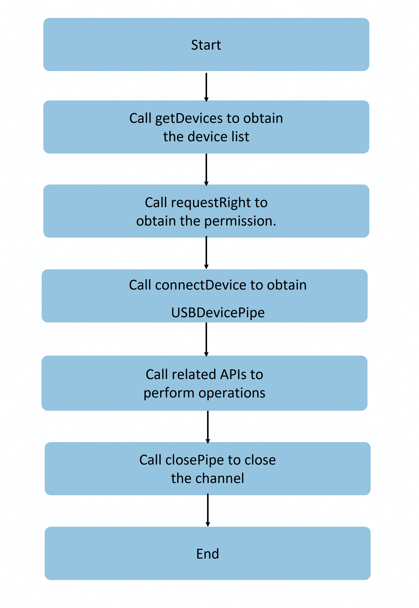
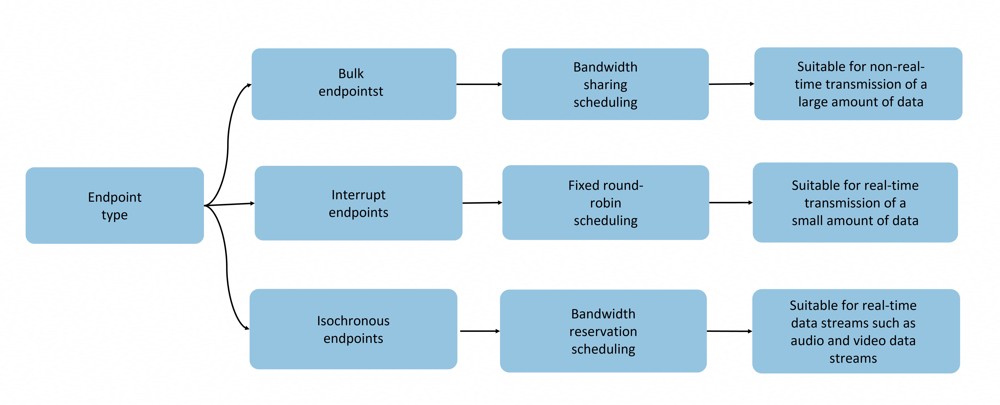

# @ohos.usbManager (USB Manager)

<!--Kit: Basic Services Kit-->
<!--Subsystem: USB-->
<!--Owner: @hwymlgitcode-->
<!--Designer: @w00373942-->
<!--Tester: @dong-dongzhen-->
<!--Adviser: @fang-jinxu-->
<!-- md-trans-meta sourceCommit=9d2bc7386aedc5c38819f3fdab4390f797851b9c translatedAt=2026-09-01T08:30:38.432Z pushedAt=2026-09-04T09:42:52.242Z -->

This module provides APIs for managing USB devices, including USB device list query, bulk data transfer, control transfer, and permission control on the host side as well as port management, and function switch and query on the device side. This module can be used to exchange data with USB devices, manage USB device permissions, and dynamically switch the USB device mode.

> **NOTE**
> 
> The initial APIs of this module are supported since API version 9. Newly added APIs will be marked with a superscript to indicate their earliest API version.

## Modules to Import

```ts
import { usbManager } from '@kit.BasicServicesKit';
```

## How to Use

Perform the following steps when using the APIs with the [USBDevicePipe](#usbdevicepipe) parameter:

**Before use**:

1. Call [usbManager.getDevices](#usbmanagergetdevices) to obtain the USB device list.

2. Call [usbManager.requestRight](#usbmanagerrequestright) to request the temporary device access permission.

3. Call [usbManager.connectDevice](#usbmanagerconnectdevice) to obtain **USBDevicePipe** as an input parameter.

**After use**:

Call [usbManager.closePipe](#usbmanagerclosepipe) to disable the USB connection channel.



## usbManager.getDevices

getDevices(): Array&lt;Readonly&lt;USBDevice&gt;&gt;

Obtains the list of USB devices connected to the host. After the API is called successfully, a list of connected devices is returned, including the device name, manufacturer, and product information.

> **NOTE**
>
> Third-party apps cannot directly obtain the device serial number from the **serial** field through the **getDevices()** API. This field is unavailable to third-party apps. To obtain the serial number, third-party apps need to request permissions to access the device and then initiate a control transfer.

**System capability**: SystemCapability.USB.USBManager

**Return value**

| Type                                                   | Description      |
| ---------------------------------------------------- | ------- |
| Array&lt;Readonly&lt;[USBDevice](#usbdevice)&gt;&gt; | Device information list. |

**Error codes**

For details about the error codes, see [Universal Error Codes](../errorcode-universal.md).

| ID | Error Message                  |
| -------- | ------------------------- |
| 801      | Capability not supported.  <br>Applicable versions: 18+ |

**Example**

```ts
let devicesList: Array<usbManager.USBDevice> = usbManager.getDevices();
console.info(`devicesList = ${devicesList}`);
/*
  The following is a simple example of the data structure for devicesList:
  [
    {
      name: "1-1",
      serial: "",
      manufacturerName: "",
      productName: "",
      version: "",
      vendorId: 7531,
      productId: 2,
      clazz: 9,
      subClass: 0,
      protocol: 1,
      devAddress: 1,
      busNum: 1,
      configs: [
        {
          id: 1,
          attributes: 224,
          isRemoteWakeup: true,
          isSelfPowered: true,
          maxPower: 0,
          name: "1-1",
          interfaces: [
            {
              id: 0,
              protocol: 0,
              clazz: 9,
              subClass: 0,
              alternateSetting: 0,
              name: "1-1",
              endpoints: [
                {
                  address: 129,
                  attributes: 3,
                  interval: 12,
                  maxPacketSize: 4,
                  direction: 128,
                  number: 1,
                  type: 3,
                  interfaceId: 0,
                },
              ],
            },
          ],
        },
      ],
    },
  ]
 */
```

## usbManager.connectDevice

connectDevice(device: USBDevice): Readonly&lt;USBDevicePipe&gt;

Connects to the USB device based on the device information returned by **getDevices()**. After the API is called successfully, a device connection channel is established for subsequent data transmission and device control operations. After using the channel, you can call [usbManager.closePipe](#usbmanagerclosepipe) to disable the USB connection channel. If the USB service is abnormal, **undefined** is returned. Check whether the return value of the API is empty.

1. Call [usbManager.getDevices](#usbmanagergetdevices) to obtain the USB device information and the **USBDevice** value.
2. Call [usbManager.requestRight](#usbmanagerrequestright) to request the device access permission.

**System capability**: SystemCapability.USB.USBManager

**Parameters**

| Name | Type | Mandatory | Description |
| -------- | -------- | -------- | ---------------- |
| device | [USBDevice](#usbdevice) | Yes | USB device. The **busNum** and **devAddress** parameters obtained by [getDevices](#usbmanagergetdevices) are used to determine a USB device. Other attributes (such as **name** and **vendorId**) are not involved in device matching. |

**Return value**

| Type | Description |
| -------- | -------- |
| Readonly&lt;[USBDevicePipe](#usbdevicepipe)&gt; | **USBDevicePipe** object, which is used in subsequent data transfer and device control. |

**Error codes**

For details about the error codes, see [Universal Error Codes](../errorcode-universal.md) and [USB Error Codes](errorcode-usb.md).

| ID | Error Message                                                     |
| -------- | ------------------------------------------------------------ |
| 401      | Parameter error. Possible causes: 1. Mandatory parameters are left unspecified. 2. Incorrect parameter types. |
| 801      | Capability not supported.  <br>Applicable versions: 18+ |
| 14400001 | Access right denied. Call requestRight to get the USBDevicePipe access right first. |

**Example**

```ts
async function connectDevice() {
  let devicesList: Array<usbManager.USBDevice> = usbManager.getDevices();
  if (!devicesList || devicesList.length == 0) {
    console.info(`device list is empty`);
    return;
  }

  let device: usbManager.USBDevice = devicesList?.[0];
  let rightResult = await usbManager.requestRight(device.name);
  if (!rightResult) {
    console.error(`request right failed`);
    return;
  }
  let devicePipe: usbManager.USBDevicePipe = usbManager.connectDevice(device);
  if (devicePipe == undefined) {
    console.error(`connect device failed`);
    return;
  }
  console.info(`devicePipe = ${devicePipe}`);
  usbManager.closePipe(devicePipe);
}
```

## usbManager.hasRight

hasRight(deviceName: string): boolean

Checks whether the application has the permission to access the device.

The value **true** is returned if the user has the device access permissions; the value **false** is returned otherwise.

**System capability**: SystemCapability.USB.USBManager

**Parameters**

| Name | Type | Mandatory | Description |
| -------- | -------- | -------- | -------- |
| deviceName | string | Yes | Device name, which is the name of the USBDevice in the device list obtained by [getDevices](#usbmanagergetdevices). |

**Return value**

| Type | Description |
| -------- | -------- |
| boolean | true indicates that the application has the permission to access the device, and false indicates that it does not. |

**Error codes**

For details about the error codes, see [Universal Error Codes](../errorcode-universal.md).

| ID | Error Message                                                     |
| -------- | ------------------------------------------------------------ |
| 401      | Parameter error. Possible causes: 1. Mandatory parameters are left unspecified. 2. Incorrect parameter types. |
| 801      | Capability not supported.  <br>Applicable versions: 18+ |

**Example**

```ts
async function hasRight(): Promise<boolean> {
  let devicesList: Array<usbManager.USBDevice> = usbManager.getDevices();
  if (!devicesList || devicesList.length == 0) {
    console.info(`device list is empty`);
    return false;
  }

  let device: usbManager.USBDevice = devicesList?.[0];
  await usbManager.requestRight(device.name);
  let right: boolean = usbManager.hasRight(device.name);
  console.info(`${right}`);
  return right;
}
```

## usbManager.requestRight

requestRight(deviceName: string): Promise&lt;boolean&gt;

Requests the temporary permission for the app to access the device. This API uses a promise to return the result. System apps are granted the device access permission by default, and you do not need to call this API to request the permission.

**System capability**: SystemCapability.USB.USBManager

**Parameters**

| Name | Type | Mandatory | Description |
| -------- | -------- | -------- | -------- |
| deviceName | string | Yes | Device name, which is the name of the USBDevice in the device list obtained by [getDevices](#usbmanagergetdevices). |

**Return value**

| Type | Description |
| -------- | -------- |
| Promise&lt;boolean&gt; | Promise object that returns the result of the temporary permission request. The value true indicates that the temporary permission request is successful; the value false indicates that the temporary permission request fails. |

**Error codes**

For details about the error codes, see [Universal Error Codes](../errorcode-universal.md).

| ID | Error Message                                                     |
| -------- | ------------------------------------------------------------ |
| 401      | Parameter error. Possible causes: 1. Mandatory parameters are left unspecified. 2. Incorrect parameter types. |
| 801      | Capability not supported.  <br>Applicable versions: 18+  |

**Example**

```ts
import {BusinessError} from '@kit.BasicServicesKit';
function requestRight() {
  let devicesList: Array<usbManager.USBDevice> = usbManager.getDevices();
  if (!devicesList || devicesList.length == 0) {
    console.info(`device list is empty`);
    return;
  }

  let device: usbManager.USBDevice = devicesList?.[0];
  usbManager.requestRight(device.name).then(ret => {
    console.info(`requestRight = ${ret}`);
  }).catch((error: BusinessError) => {
    console.error(`Failed to request right. Code: ${error.code}, message: ${error.message}`);
  });
}
```

## usbManager.removeRight

removeRight(deviceName: string): boolean

Removes the permission for an app to access the device. System apps are granted the device access permission by default, and calling this API will not revoke the permission.

**System capability**: SystemCapability.USB.USBManager

**Parameters**

| Name | Type | Mandatory | Description |
| -------- | -------- | -------- | -------- |
| deviceName | string | Yes | Device name, which is the name of the USBDevice in the device list obtained by [getDevices](#usbmanagergetdevices). |

**Return value**

| Type | Description |
| -------- | -------- |
| boolean | Returns the result of permission removal. The value **true** indicates that the permission is removed successfully; the value **false** indicates that the permission removal fails. |

**Error codes**

For details about the error codes, see [Universal Error Codes](../errorcode-universal.md).

| ID | Error Message                                                     |
| -------- | ------------------------------------------------------------ |
| 401      | Parameter error. Possible causes: 1. Mandatory parameters are left unspecified. 2. Incorrect parameter types. |
| 801      | Capability not supported.  <br>Applicable versions: 18+  |

**Example**

```ts
function removeRight(): boolean {
  let devicesList: Array<usbManager.USBDevice> = usbManager.getDevices();
  if (!devicesList || devicesList.length == 0) {
    console.info(`device list is empty`);
    return false;
  }

  let device: usbManager.USBDevice = devicesList?.[0];
  if (usbManager.removeRight(device.name)) {
    console.info(`Succeed in removing right`);
    return true;
  }
  return false;
}
```

## usbManager.claimInterface

claimInterface(pipe: USBDevicePipe, iface: USBInterface, force ?: boolean): number

Claims a USB device interface. After this API is called successfully, the app obtains exclusive control over the interface and can perform operations such as data transfer. Other apps cannot access the interface. After using the interface, call [releaseInterface](#usbmanagerreleaseinterface) to release the control over the interface.

**Use scenarios**: Before transferring data over a USB device, you need to claim control over the interface to exclusively access the interface. For example, you need to claim control over the interface before reading data from or writing data to a USB storage device, collecting data from a USB camera, or communicating with a USB serial port.

> **NOTE**
>
> In USB programming, **claimInterface** is a common operation, which indicates that an app requests the operating system to release a USB interface from the kernel driver and hand over the USB interface to a user space program for control.
> All the **claim** communication interfaces used below refer to the claim interface operations.

**System capability**: SystemCapability.USB.USBManager

**Parameters**

| Name | Type | Mandatory | Description |
| -------- | -------- | -------- | -------- |
| pipe | [USBDevicePipe](#usbdevicepipe) | Yes | USB device pipe, which is used to determine the bus address and device address. You need to call [connectDevice](#usbmanagerconnectdevice) to obtain its value.|
| iface | [USBInterface](#usbinterface) | Yes | USB interface. You can use [getDevices](#usbmanagergetdevices) to obtain device information and identify the USB interface based on its **id**.|
| force | boolean | No | Optional parameter that determines whether to forcibly claim the USB interface. The default value is **false**, indicating that the USB interface is not forcibly claimed. If no kernel driver occupies the interface, the claim is successful. Otherwise, the claim fails. If this parameter is set to **true**, the kernel driver's control over the interface is forcibly released and handed over to a user space program.|

**Return value**

| Type | Description |
| -------- | -------- |
| number | Returns **0** if the **claim** interface is called successfully; returns an error code otherwise. The error codes are as follows:<br>- 88080389: The service is not started. Possible causes: 1. No device is inserted; 2. The service exits abnormally.<br>- 88080486: The service is being initialized. Try again later.<br>- 88080488: No permission to access the device. Call [requestRight](#usbmanagerrequestright) to request authorization first.<br>- -1: The driver is abnormal. Possible causes: 1. The device connection is unstable or the device is disconnected. 2. The USB driver fails to be loaded. 3. The kernel USB module is abnormal. |

**Error codes**

For details about the error codes, see [Universal Error Codes](../errorcode-universal.md).

| ID | Error Message                                                     |
| -------- | ------------------------------------------------------------ |
| 401      | Parameter error. Possible causes: 1. Mandatory parameters are left unspecified. 2. Incorrect parameter types. |
| 801      | Capability not supported.  <br>Applicable versions: 18+ |

**Example**

```ts
async function claimInterface() {
  let devicesList: Array<usbManager.USBDevice> = usbManager.getDevices();
  if (!devicesList || devicesList.length == 0) {
    console.info(`device list is empty`);
    return;
  }

  let device: usbManager.USBDevice = devicesList?.[0];
  let rightResult = await usbManager.requestRight(device.name);
  if (!rightResult) {
    console.error(`request right failed`);
    return;
  }
  let devicePipe: usbManager.USBDevicePipe = usbManager.connectDevice(device);
  if (devicePipe == undefined) {
    console.error(`connect device failed`);
    return;
  }
  let interfaces: usbManager.USBInterface = device.configs?.[0]?.interfaces?.[0];
  let ret: number = usbManager.claimInterface(devicePipe, interfaces);
  if (ret !== 0) {
    console.error(`claim interface failed`);
    usbManager.closePipe(devicePipe);
    return;
  }
  console.info(`claimInterface = ${ret}`);
  ret = usbManager.releaseInterface(devicePipe, interfaces);
  console.info(`releaseInterface = ${ret}`);
  usbManager.closePipe(devicePipe);
}
```

## usbManager.releaseInterface

releaseInterface(pipe: USBDevicePipe, iface: USBInterface): number

Releases the claimed communication interface.

> **NOTE**
>
> Before calling this API, call the [usbManager.claimInterface](#usbmanagerclaiminterface) API to claim a communication interface.

**System capability**: SystemCapability.USB.USBManager

**Parameters**

| Name | Type | Mandatory | Description |
| -------- | -------- | -------- | -------- |
| pipe | [USBDevicePipe](#usbdevicepipe) | Yes | USB device pipe, which is used to determine the bus address and device address. You need to call [connectDevice](#usbmanagerconnectdevice) to obtain its value. |
| iface | [USBInterface](#usbinterface) | Yes | USB interface whose control is to be released. You can use [getDevices](#usbmanagergetdevices) to obtain device information and identify the interface based on its **id**. |

**Return value**

| Type | Description |
| -------- | -------- |
| number | Returns **0** if the **release** interface is released successfully; returns an error code otherwise. The error codes are as follows:<br>- 88080389: The service is not started. Possible causes: 1. No device is inserted; 2. The service exits abnormally.<br>- 88080486: The service is being initialized. Try again later.<br>- 88080488: No permission to access the device. Call [requestRight](#usbmanagerrequestright) to request authorization first.<br>- -1: The driver is abnormal. Possible causes: 1. The device connection is unstable or the device is disconnected. 2. The USB driver fails to be loaded. 3. The kernel USB module is abnormal. |

**Error Codes:**

For details about the error codes, see [Universal Error Codes](../errorcode-universal.md).

| ID | Error Message                                                     |
| -------- | ------------------------------------------------------------ |
| 401      | Parameter error. Possible causes: 1. Mandatory parameters are left unspecified. 2. Incorrect parameter types. |
| 801      | Capability not supported.  <br>Applicable versions: 18+ |

**Example**

```ts
async function releaseInterface() {
  let devicesList: Array<usbManager.USBDevice> = usbManager.getDevices();
  if (!devicesList || devicesList.length == 0) {
    console.info(`device list is empty`);
    return;
  }

  let device: usbManager.USBDevice = devicesList?.[0];
  let rightResult = await usbManager.requestRight(device.name);
  if (!rightResult) {
    console.error(`request right failed`);
    return;
  }
  let devicePipe: usbManager.USBDevicePipe = usbManager.connectDevice(device);
  if (devicePipe == undefined) {
    console.error(`connect device failed`);
    return;
  }
  let interfaces: usbManager.USBInterface = device.configs?.[0]?.interfaces?.[0];
  let ret: number = usbManager.claimInterface(devicePipe, interfaces);
  if (ret !== 0) {
    console.error(`claim interface failed`);
    usbManager.closePipe(devicePipe);
    return;
  }
  ret = usbManager.releaseInterface(devicePipe, interfaces);
  console.info(`releaseInterface = ${ret}`);
  usbManager.closePipe(devicePipe);
}
```

## usbManager.setConfiguration

setConfiguration(pipe: USBDevicePipe, config: USBConfiguration): number

Sets the device configuration. This API can be used to switch the working mode of a multi-functional USB device. For example, it can be used to switch to the printing mode or scanning mode for a device combining the printer and scanner functions, or switch a device from a low-power configuration to a high-power configuration to enable all functions. After the API is successfully called, the device configuration is switched to the specified configuration. Subsequent data transfer and device operations are performed based on the new configuration.

> **NOTE**
>
> Before calling this API, call the [usbManager.claimInterface](#usbmanagerclaiminterface) API to claim a communication interface.

**System capability**: SystemCapability.USB.USBManager

**Parameters**

| Name | Type | Mandatory | Description |
| -------- | -------- | -------- | -------- |
| pipe | [USBDevicePipe](#usbdevicepipe) | Yes | USB device pipe, which is used to determine the bus address and device address. You need to call [connectDevice](#usbmanagerconnectdevice) to obtain its value.|
| config | [USBConfiguration](#usbconfiguration) | Yes | USB configuration. You can use [getDevices](#usbmanagergetdevices) to obtain device information and identify the configuration based on its **id**.|

**Return value**

| Type | Description |
| -------- | -------- |
| number | Result of the USB configuration. Returns **0** if the device configuration is set successfully; returns an error code otherwise. The error codes are as follows:<br>- 88080389: The service is not started. Possible causes: 1. No device is inserted; 2. The service exits abnormally.<br>- 88080486: The service is being initialized. Try again later.<br>- 88080488: No permission to access the device. Call [requestRight](#usbmanagerrequestright) to request authorization first.<br>- -1: The driver is abnormal. Possible causes: 1. The device connection is unstable or the device is disconnected. 2. The USB driver fails to be loaded. 3. The kernel USB module is abnormal.<br>- -17: I/O failure. Possible causes: 1. The I/O operation fails due to abnormal device communication. 2. The data transfer is interrupted. |

**Error codes**

For details about the error codes, see [Universal Error Codes](../errorcode-universal.md).

| ID | Error Message                                                     |
| -------- | ------------------------------------------------------------ |
| 401      | Parameter error. Possible causes: 1. Mandatory parameters are left unspecified. 2. Incorrect parameter types. |
| 801      | Capability not supported.  <br>Applicable versions: 18+ |

**Example**

```ts
async function setConfiguration() {
  let devicesList: Array<usbManager.USBDevice> = usbManager.getDevices();
  if (!devicesList || devicesList.length == 0) {
    console.info(`device list is empty`);
    return;
  }

  let device: usbManager.USBDevice = devicesList?.[0];
  let rightResult = await usbManager.requestRight(device.name);
  if (!rightResult) {
    console.error(`request right failed`);
    return;
  }
  let devicePipe: usbManager.USBDevicePipe = usbManager.connectDevice(device);
  if (devicePipe == undefined) {
    console.error(`connect device failed`);
    return;
  }
  let config: usbManager.USBConfiguration = device.configs?.[0];
  let ret: number = usbManager.setConfiguration(devicePipe, config);
  console.info(`setConfiguration = ${ret}`);
  usbManager.closePipe(devicePipe);
}
```

## usbManager.setInterface

setInterface(pipe: USBDevicePipe, iface: USBInterface): number

Sets a USB interface. After the API is successfully called, the specified alternate setting is switched for the interfaces, and the endpoint configuration changes accordingly to match the transmission type.

> **NOTE**
>
> A USB interface may have multiple selection modes and supports dynamic switching. It is used to reset the endpoint to match the transmission type during data transmission.
>
> Before calling this API, call the [usbManager.claimInterface](#usbmanagerclaiminterface) API to claim a communication interface.

**System capability**: SystemCapability.USB.USBManager

**Parameters**

| Name | Type | Mandatory | Description |
| -------- | -------- | -------- | -------- |
| pipe | [USBDevicePipe](#usbdevicepipe) | Yes | USB device pipe, which is used to determine the bus address and device address. You need to call [connectDevice](#usbmanagerconnectdevice) to obtain its value. |
| iface | [USBInterface](#usbinterface)   | Yes | USB interface. You can use [getDevices](#usbmanagergetdevices) to obtain device information and identify the USB interface based on its **id** and **alternateSetting**. **id** is the unique identifier of the interface. **alternateSetting** is used to switch between optional modes of the same interface. If **alternateSetting* is **0**, optional modes are not supported. |

**Return value**

| Type | Description |
| -------- | -------- |
| number | Result of the device interface setting. Returns **0** if the interface is set successfully; returns an error code otherwise. The error codes are as follows:<br>- 88080389: The service is not started. Possible causes: 1. No device is inserted; 2. The service exits abnormally.<br>- 88080486: The service is being initialized. Try again later.<br>- 88080488: No permission to access the device. Call [requestRight](#usbmanagerrequestright) to request authorization first.<br>- -1: The driver is abnormal. Possible causes: 1. The device connection is unstable or the device is disconnected. 2. The USB driver fails to be loaded. 3. The kernel USB module is abnormal. |

**Error Codes**

For details about the error codes, see [Universal Error Codes](../errorcode-universal.md).

| ID | Error Message                                                     |
| -------- | ------------------------------------------------------------ |
| 401      | Parameter error. Possible causes: 1. Mandatory parameters are left unspecified. 2. Incorrect parameter types. |
| 801      | Capability not supported.  <br>Applicable versions: 18+ |

**Example**

```ts
async function setInterface() {
  let devicesList: Array<usbManager.USBDevice> = usbManager.getDevices();
  if (!devicesList || devicesList.length == 0) {
    console.info(`device list is empty`);
    return;
  }

  let device: usbManager.USBDevice = devicesList?.[0];
  let rightResult = await usbManager.requestRight(device.name);
  if (!rightResult) {
    console.error(`request right failed`);
    return;
  }
  let devicePipe: usbManager.USBDevicePipe = usbManager.connectDevice(device);
  if (devicePipe == undefined) {
    console.error(`connect device failed`);
    return;
  }
  let interfaces: usbManager.USBInterface = device.configs?.[0]?.interfaces?.[0];
  let ret: number = usbManager.claimInterface(devicePipe, interfaces);
  if (ret !== 0) {
    console.error(`claim interface failed`);
    usbManager.closePipe(devicePipe);
    return;
  }
  ret = usbManager.setInterface(devicePipe, interfaces);
  console.info(`setInterface = ${ret}`);
  ret = usbManager.releaseInterface(devicePipe, interfaces);
  console.info(`releaseInterface = ${ret}`);
  usbManager.closePipe(devicePipe);
}
```

## usbManager.getRawDescriptor

getRawDescriptor(pipe: USBDevicePipe): Uint8Array

Obtains a raw USB descriptor. If the USB service is abnormal, **undefined** may be returned. Check whether the return value of the API is empty.

**System capability**: SystemCapability.USB.USBManager

**Parameters**

| Name | Type | Mandatory | Description |
| -------- | -------- | -------- | -------- |
| pipe | [USBDevicePipe](#usbdevicepipe) | Yes | USB device pipe, which is used to determine the bus address and device address. You need to call [connectDevice](#usbmanagerconnectdevice) to obtain its value. |

**Return value**

| Type | Description |
| -------- | -------- |
| Uint8Array | Returns the obtained raw data; returns undefined on failure. |

**Error codes**

For details about the error codes, see [Universal Error Codes](../errorcode-universal.md).

| ID | Error Message                                                     |
| -------- | ------------------------------------------------------------ |
| 401      | Parameter error. Possible causes: 1. Mandatory parameters are left unspecified. 2. Incorrect parameter types. |
| 801      | Capability not supported. <br>Applicable versions: 18+   |

**Example**

```ts
async function getRawDescriptor() {
  let devicesList: Array<usbManager.USBDevice> = usbManager.getDevices();
  if (!devicesList || devicesList.length == 0) {
    console.info(`device list is empty`);
    return;
  }

  let rightResult = await usbManager.requestRight(devicesList?.[0]?.name);
  if (!rightResult) {
    console.error(`request right failed`);
    return;
  }
  let devicePipe: usbManager.USBDevicePipe = usbManager.connectDevice(devicesList?.[0]);
  if (devicePipe == undefined) {
    console.error(`connect device failed`);
    return;
  }
  usbManager.getRawDescriptor(devicePipe);
  usbManager.closePipe(devicePipe);
}
```

## usbManager.getFileDescriptor

getFileDescriptor(pipe: USBDevicePipe): number

Obtains a file descriptor. If the USB service is abnormal, an error code may be returned. Check whether the return value of the API is empty or check the error code.

**System capability**: SystemCapability.USB.USBManager

**Parameters**

| Name | Type | Mandatory | Description |
| -------- | -------- | -------- | -------- |
| pipe | [USBDevicePipe](#usbdevicepipe) | Yes | USB device pipe, which is used to determine the bus address and device address. You need to call [connectDevice](#usbmanagerconnectdevice) to obtain its value. |

**Return value**

| Type     | Description                   |
| ------ | -------------------- |
| number | Returns the file descriptor corresponding to the device. If the operation fails, one of the following error codes is returned:<br>- 88080486: The service is being initialized. Try again later.<br>- 88080488: No permission to access the device. Call [requestRight](#usbmanagerrequestright) to request authorization first.<br>- -1: The driver is abnormal. Possible causes: 1. The device connection is unstable or the device is disconnected. 2. The USB driver fails to be loaded. 3. The kernel USB module is abnormal. |

**Error codes**

For details about the error codes, see [Universal Error Codes](../errorcode-universal.md).

| ID | Error Message                                                     |
| -------- | ------------------------------------------------------------ |
| 401      | Parameter error. Possible causes: 1. Mandatory parameters are left unspecified. 2. Incorrect parameter types. |
| 801      | Capability not supported.  <br>Applicable versions: 18+ |

**Example**

```ts
async function getFileDescriptor() {
  let devicesList: Array<usbManager.USBDevice> = usbManager.getDevices();
  if (!devicesList || devicesList.length == 0) {
    console.info(`device list is empty`);
    return;
  }

  let rightResult = await usbManager.requestRight(devicesList?.[0]?.name);
  if (!rightResult) {
    console.error(`request right failed`);
    return;
  }
  let devicePipe: usbManager.USBDevicePipe = usbManager.connectDevice(devicesList?.[0]);
  if (devicePipe == undefined) {
    console.error(`connect device failed`);
    return;
  }
  let ret: number = usbManager.getFileDescriptor(devicePipe);
  console.info(`getFileDescriptor = ${ret}`);
  let closeRet: number = usbManager.closePipe(devicePipe);
  console.info(`closePipe = ${closeRet}`);
}
```

## usbManager.usbControlTransfer<sup>12+</sup>

usbControlTransfer(pipe: USBDevicePipe, requestparam: USBDeviceRequestParams, timeout ?: number): Promise&lt;number&gt;

Performs control transfer. After the control command is transferred successfully, the size of the transferred or received data block is returned. This API can be used to exchange control commands with a USB device, such as obtaining the device descriptor, setting the device address, sending vendor-defined commands, and configuring HID device features. This API uses a promise to return the result.

**System capability**: SystemCapability.USB.USBManager

**Parameters**

| Name | Type | Mandatory | Description |
| -------- | -------- | -------- | -------- |
| pipe | [USBDevicePipe](#usbdevicepipe) | Yes | USB device pipe, which is used to determine the bus address and device address. You need to call [connectDevice](#usbmanagerconnectdevice) to obtain its value. |
| requestparam | [USBDeviceRequestParams](#usbdevicerequestparams12) | Yes | Control transfer parameters, including the **bmRequestType**, **bRequest**, **wValue**, **wIndex**, **wLength**, and **data** fields. For details about the parameter types, see the USB protocol specifications. Set the parameters based on the device and control request type. |
| timeout | number | No | Timeout interval, in milliseconds. This parameter is optional. If the control transfer is complete within the specified time, the size of the transferred or received data block is returned; otherwise, a timeout error is returned. The default value is **0**, indicating that the system waits infinitely until the control transfer is complete. If a negative number is passed, a parameter error is thrown. Set this parameter as required. |

**Return value**

| Type | Description |
| -------- | -------- |
| Promise&lt;number&gt; | Promise used to return the result, which is the size of the transferred or received data block if the transfer is successful. If the API call fails, the following error codes are returned:<br>- -1: The driver is abnormal. Possible causes: 1. The device connection is unstable or the device is disconnected. 2. The USB driver fails to be loaded. 3. The kernel USB module is abnormal. |

**Error codes**

For details about the error codes, see [Universal Error Codes](../errorcode-universal.md).

| ID | Error Message                                                     |
| -------- | ------------------------------------------------------------ |
| 401      | Parameter error. Possible causes: 1. Mandatory parameters are left unspecified. 2. Incorrect parameter types. |
| 801      | Capability not supported.  <br>Applicable versions: 18+ |

**Example**

```ts
import {BusinessError} from '@kit.BasicServicesKit';
// Control transfer parameters: Set each field based on the USB protocol specifications, device descriptor, or device specifications document.
// bmRequestType: request control type. Common values are as follows: 0x00 (standard request, from the host to the device), 0x20 (class request, from the host to the device), 0x40 (vendor request, from the host to the device), and 0x80 (standard request, from the device to the host).
// bRequest: specific control request command (such as obtaining a descriptor or setting an address)
// wValue: content of the request parameter
// wIndex: index of the request parameter
// wLength: data length
// data: buffer for writing or reading data
let param: usbManager.USBDeviceRequestParams = {
  bmRequestType: 0x80,
  bRequest: 0x06,
  wValue: 0x01 << 8 | 0,
  wIndex: 0,
  wLength: 18,
  data: new Uint8Array(18)
};

async function usbControlTransfer() {
  let devicesList: Array<usbManager.USBDevice> = usbManager.getDevices();
  if (!devicesList || devicesList.length == 0) {
    console.info(`device list is empty`);
    return;
  }

  let rightResult = await usbManager.requestRight(devicesList?.[0]?.name);
  if (!rightResult) {
    console.error(`request right failed`);
    return;
  }
  let devicePipe: usbManager.USBDevicePipe = usbManager.connectDevice(devicesList?.[0]);
  if (devicePipe == undefined) {
    console.error(`connect device failed`);
    return;
  }
  usbManager.usbControlTransfer(devicePipe, param).then((ret: number) => {
    console.info(`usbControlTransfer = ${ret}`);
  }).catch((error: BusinessError) => {
    console.error(`usbControlTransfer failed: ${error.code}, message: ${error.message}`);
  }).finally(() => {
    usbManager.closePipe(devicePipe);
  });
}
```

## usbManager.bulkTransfer

bulkTransfer(pipe: USBDevicePipe, endpoint: USBEndpoint, buffer: Uint8Array, timeout ?: number): Promise&lt;number&gt;

After the bulk transfer is complete, the size of the transferred or received data block is returned. This API uses a promise to return the result. Compared with **usbSubmitTransfer**, **bulkTransfer** is suitable for simple bulk transfer. It directly transfers data and endpoints through independent parameters and uses a promise to return the result. **usbSubmitTransfer** is suitable for scenarios that require more flexible control. It encapsulates parameters in the **UsbDataTransferParams** object, supports asynchronous callback, and allows you to cancel a transfer request using **usbCancelTransfer**.

> **NOTE**
>
> The total size of data (including **pipe**, **endpoint**, **buffer**, and **timeout**) to be transferred in a single bulk transfer must be less than 200 KB. Otherwise, the transfer fails and **-1** is returned.
>
> Before calling this API, call the [usbManager.claimInterface](#usbmanagerclaiminterface) API to claim a communication interface.

**System capability**: SystemCapability.USB.USBManager

**Parameters**

| Name | Type | Mandatory | Description |
| -------- | -------- | -------- | -------- |
| pipe | [USBDevicePipe](#usbdevicepipe) | Yes | USB device pipe, which is used to determine the bus address and device address. You need to call [connectDevice](#usbmanagerconnectdevice) to obtain its value. |
| endpoint | [USBEndpoint](#usbendpoint) | Yes | USB endpoint, which is used to determine the USB port for data transfer. You need to call [getDevices](#usbmanagergetdevices) to obtain the device information list. In the **USBEndpoint** API, the **address** parameter indicates the endpoint address. The **direction** parameter indicates the transmission direction of the endpoint, the value **0** indicates output, and **128** indicates input. The **interfaceId** parameter identifies the interface to which the endpoint belongs. Currently, other attributes are not processed. |
| buffer | Uint8Array | Yes | Buffer for writing or reading data. The array length indicates the buffer size. This parameter is used to write or read data during bulk transfer. |
| timeout | number | No | Timeout interval, in milliseconds. This parameter is optional. If the bulk transfer is complete within the specified time, the size of the transferred or received data block is returned; otherwise, a timeout error is returned. The default value is **0**, indicating that the system waits infinitely until the control transfer is complete. If a negative number is passed, a parameter error is thrown. Set this parameter as required. |

**Return value**

| Type | Description |
| -------- | -------- |
| Promise&lt;number&gt; | Promise used to return the result, which is the size of the transferred or received data block if the transfer is successful. If the API call fails, the following error codes are returned:<br>- -1: The driver is abnormal. Possible causes: 1. The device connection is unstable or the device is disconnected. 2. The USB driver fails to be loaded. 3. The kernel USB module is abnormal. |

**Error Codes:**

For details about the error codes, see [Universal Error Codes](../errorcode-universal.md).

| ID | Error Message                                                     |
| -------- | ------------------------------------------------------------ |
| 401      | Parameter error. Possible causes: 1. Mandatory parameters are left unspecified. 2. Incorrect parameter types. |
| 801      | Capability not supported.  <br>Applicable versions: 18+ |

**Example**

> **NOTE**
>
> The following sample code is only a basic process for calling the **bulkTransfer** API. When calling this API, you must comply with the protocol specifications of the target USB device to ensure proper data transfer and device compatibility. For details about the protocol requirements, see the technical documentation of the device.

```ts
import {BusinessError} from '@kit.BasicServicesKit';
// Call usbManager.getDevices to obtain a data set. Then, obtain a USB device and its access permission.
// Pass the obtained USB device as a parameter to usbManager.connectDevice. Then, call usbManager.connectDevice to connect the USB device.
// Call usbManager.claimInterface to claim a USB interface. After that, call usbManager.bulkTransfer to start bulk transfer.
async function bulkTransfer() {
  let devicesList: Array<usbManager.USBDevice> = usbManager.getDevices();
  if (!devicesList || devicesList.length == 0) {
    console.info(`device list is empty`);
    return;
  }

  let device: usbManager.USBDevice = devicesList?.[0];
  await usbManager.requestRight(device.name);
  if (!usbManager.hasRight(device.name)) {
    console.error(`request right fail`);
    return;
  }
  let devicePipe: usbManager.USBDevicePipe = usbManager.connectDevice(device);
  if (devicePipe == undefined) {
    console.error(`connect device failed`);
    return;
  }
  for (let i = 0; i < device.configs?.[0]?.interfaces.length; i++) {
    if (device.configs?.[0]?.interfaces?.[i]?.endpoints?.[0]?.attributes == 2) {
      let endpoint: usbManager.USBEndpoint = device.configs?.[0]?.interfaces?.[i]?.endpoints?.[0];
      let interfaces: usbManager.USBInterface = device.configs?.[0]?.interfaces?.[i];
      let ret: number = usbManager.claimInterface(devicePipe, interfaces);
      if (ret !== 0) {
        console.error(`claim interface failed`);
        continue;
      }
      let buffer = new Uint8Array(128);
      usbManager.bulkTransfer(devicePipe, endpoint, buffer).then((ret: number) => {
        console.info(`bulkTransfer = ${ret}`);
        ret = usbManager.releaseInterface(devicePipe, interfaces);
        console.info(`releaseInterface = ${ret}`);
        if (i === device.configs?.[0]?.interfaces.length - 1) {
          usbManager.closePipe(devicePipe);
        }
      }).catch((error: BusinessError) => {
        console.error(`Failed to transfer. Code: ${error.code}, message: ${error.message}`);
      });
    }
  }
}
```

## usbManager.usbSubmitTransfer<sup>18+</sup>

usbSubmitTransfer(transfer: UsbDataTransferParams): void

Submits an asynchronous transfer request. The result is returned immediately after this API is called. This API uses a callback to return the actual read/write operation result. You can call [usbCancelTransfer](#usbmanagerusbcanceltransfer18) to cancel an asynchronous transfer request.

> **NOTE**
>
> This API uses an asynchronous callback to return the result.
>
> Before calling this API, call the [usbManager.claimInterface](#usbmanagerclaiminterface) API to claim a communication interface.

**System capability**: SystemCapability.USB.USBManager

**Parameters**

| Name | Type | Mandatory | Description |
| -------- | -------- | -------- | -------- |
| transfer | [UsbDataTransferParams](#usbdatatransferparams18) | Yes | As a USB data transfer interface, it is required for a client to initiate a transfer request. Before calling this API, call the [usbManager.claimInterface](#usbmanagerclaiminterface) API to claim a communication interface.|

**Error codes**

For details about the error codes, see [Universal Error Codes](../errorcode-universal.md) and [USB Error Codes](errorcode-usb.md).

| ID | Error Message                                                     |
| -------- | ------------------------------------------------------------ |
| 801 | Capability not supported. |
| 14400001 | Access right denied. Call requestRight to get the USBDevicePipe access right first. |
| 14400007 | Resource busy. Possible causes: 1. The transfer has already been submitted. 2. The interface is claimed by another program or driver.|
| 14400008 | No such device (it may have been disconnected). |
| 14400009 | Insufficient memory. Possible causes: 1. Memory allocation failed. |
| 14400012 | Transmission I/O error. |

**Example**

> **NOTE**
>
> The following sample code is only a basic process for calling the **usbSubmitTransfer** API. When calling this API, you must comply with the protocol specifications of the target USB device to ensure proper data transfer and device compatibility. For details about the protocol requirements, see the technical documentation of the device.

<!--code_no_check-->
```ts
// Call usbManager.getDevices to obtain a data set. Then, obtain a USB device and its access permission.
//  Pass the obtained USB device as a parameter to usbManager.connectDevice. Then, call usbManager.connectDevice to connect the USB device.
// Call usbManager.claimInterface to claim a USB interface. After that, call usbManager.bulkTransfer to start bulk transfer.
async function usbSubmitTransfer() {
  let devicesList: Array<usbManager.USBDevice> = usbManager.getDevices();
  if (!devicesList || devicesList.length == 0) {
    console.info(`device list is empty`);
    return;
  }
  let device: usbManager.USBDevice = devicesList?.[0];
  await usbManager.requestRight(device.name);
  if (!usbManager.hasRight(device.name)) {
    console.info(`request right fail`);
    return;
  }
  let devicePipe: usbManager.USBDevicePipe = usbManager.connectDevice(device);
  if (devicePipe == undefined) {
    console.error(`connect device failed`);
    return;
  }
  // Obtain the endpoint address.
  let endpoint = device.configs?.[0]?.interfaces?.[0]?.endpoints.find((value) => {
    return value.direction === 0 && value.type === 2;
  });
  // Claim control over the interface. If force is set to true, the interface control is forcibly claimed.
  let ret: number = usbManager.claimInterface(devicePipe, device.configs?.[0]?.interfaces?.[0], true);
  if (ret !== 0) {
    console.error(`claim interface failed`);
    usbManager.closePipe(devicePipe);
    return;
  }

  let transferParams: usbManager.UsbDataTransferParams = {
    devPipe: devicePipe,
    flags: usbManager.UsbTransferFlags.USB_TRANSFER_SHORT_NOT_OK,
    endpoint: 1,
    type: usbManager.UsbEndpointTransferType.TRANSFER_TYPE_BULK,
    timeout: 2000,
    length: 10, 
    callback: () => {},
    userData: new Uint8Array(10),
    buffer: new Uint8Array(10),
    isoPacketCount: 0,
  };
  try {
    transferParams.endpoint = endpoint?.address as number;
    transferParams.callback = (err, callbackData: usbManager.SubmitTransferCallback) => {
      let relIntfRet: number = usbManager.releaseInterface(devicePipe, interfaces);
      console.info(`releaseInterface = ${relIntfRet}`);
      usbManager.closePipe(devicePipe);
      if (err) {
        console.error(`USB transfer failed. Code: ${err.code}, message: ${err.message}`);
        return;
      }
      console.info('callbackData =' + JSON.stringify(callbackData));
    };
    usbManager.usbSubmitTransfer(transferParams); 
    console.info('USB transfer request submitted.');
  } catch (error) {
    console.error(`USB transfer failed. Code: ${error.code}, message: ${error.message}`);
  }
}
```

## usbManager.usbCancelTransfer<sup>18+</sup>

usbCancelTransfer(transfer: UsbDataTransferParams): void

Cancels an asynchronous USB data transfer request. This API can be used to proactively terminate an ongoing USB data transfer, for example, when a user manually cancels a long-time data transfer, when an error occurs after a transfer times out, or when the current transfer needs to be terminated during an app switch.

> **NOTE**
>
> This API can be used to proactively cancel an unfinished USB data transfer request, such as the request submitted by usbSubmitTransfer.
> Before calling this API, call the [usbManager.claimInterface](#usbmanagerclaiminterface) API to claim a communication interface.

**System capability**: SystemCapability.USB.USBManager

**Parameters**

| Name | Type | Mandatory | Description |
| -------- | -------- | -------- | -------- |
| transfer | [UsbDataTransferParams](#usbdatatransferparams18) | Yes | Parameter whose transfer is canceled. The value of this parameter is the same as that of the **transfer** parameter in the [usbManager.usbSubmitTransfer](#usbmanagerusbsubmittransfer18) API. Before calling this API, call the [usbManager.claimInterface](#usbmanagerclaiminterface) API to claim a communication interface.|

**Error codes**

For details about the error codes, see [Universal Error Codes](../errorcode-universal.md) and [USB Error Codes](errorcode-usb.md).

| ID | Error Message                                                     |
| -------- | ------------------------------------------------------------ |
| 801 | Capability not supported. |
| 14400001 | Access right denied. Call requestRight to get the USBDevicePipe access right first. |
| 14400008 | No such device (it may have been disconnected). |
| 14400010 | Other USB error. Possible causes:<br>1. Unrecognized discard error code. |
| 14400011 | The transfer is not in progress, or is already complete or cancelled.|

**Example**

> **NOTE**
>
> The following sample code is only a basic process for calling the **usbCancelTransfer** API. When calling this API, you must comply with the protocol specifications of the target USB device to ensure proper data transfer and device compatibility. For details about the protocol requirements, see the technical documentation of the device.

<!--code_no_check-->
```ts
// Call usbManager.getDevices to obtain a data set. Then, obtain a USB device and its access permission.
// Pass the obtained USB device as a parameter to usbManager.connectDevice. Then, call usbManager.connectDevice to connect the USB device.
// Call usbManager.claimInterface to claim a USB interface. After that, call usbManager.bulkTransfer to start bulk transfer.
async function usbCancelTransfer() {
  let devicesList: Array<usbManager.USBDevice> = usbManager.getDevices();
  if (!devicesList || devicesList.length == 0) {
    console.info(`device list is empty`);
    return;
  }
  let device: usbManager.USBDevice = devicesList?.[0];
  let rightResult = await usbManager.requestRight(device.name);
  if (!rightResult) {
    console.error(`request right failed`);
    return;
  }
  let devicePipe: usbManager.USBDevicePipe = usbManager.connectDevice(device);
  if (devicePipe === undefined) {
    console.info(`connect device fail`);
    return;
  }
  // Obtain the endpoint address.
  let endpoint = device.configs?.[0]?.interfaces?.[0]?.endpoints.find((value) => {
    return value.direction === 0 && value.type === 2;
  });
  if (endpoint === undefined) {
    console.info(`invalid endpoint`);
    return;
  }
  // Claim control over the interface. If force is set to true, the interface control is forcibly claimed.
  let ret: number = usbManager.claimInterface(devicePipe, device.configs?.[0]?.interfaces?.[0], true);
  if (ret !== 0) {
    console.error(`claim interface failed`);
    usbManager.closePipe(devicePipe);
    return;
  }
  let transferParams: usbManager.UsbDataTransferParams = {
    devPipe: devicePipe,
    flags: usbManager.UsbTransferFlags.USB_TRANSFER_SHORT_NOT_OK,
    endpoint: 1,
    type: usbManager.UsbEndpointTransferType.TRANSFER_TYPE_BULK,
    timeout: 2000,
    length: 10, 
    callback: () => {},
    userData: new Uint8Array(10),
    buffer: new Uint8Array(10),
    isoPacketCount: 0,
  };
  try {
    transferParams.endpoint = endpoint?.address as number;
    transferParams.callback = (err, callbackData: usbManager.SubmitTransferCallback)=>{
      console.info('callbackData =' + JSON.stringify(callbackData));
    };
    usbManager.usbSubmitTransfer(transferParams);
    usbManager.usbCancelTransfer(transferParams);
    console.info('USB transfer request submitted.');
  } catch (error) {
    console.error(`USB transfer failed. Code: ${error.code}, message: ${error.message}`);
  }
  ret = usbManager.releaseInterface(devicePipe, interfaces);
  console.info(`releaseInterface = ${ret}`);
  usbManager.closePipe(devicePipe);
}
```

## usbManager.closePipe

closePipe(pipe: USBDevicePipe): number

Closes the USB device pipe.

1. Call [usbManager.getDevices](#usbmanagergetdevices) to obtain the device list;
2. Call [usbManager.requestRight](#usbmanagerrequestright) to request the device access permission.
3. Call [usbManager.connectDevice](#usbmanagerconnectdevice) to obtain **devicepipe** as an input parameter.

**System capability**: SystemCapability.USB.USBManager

**Parameters**

| Name | Type | Mandatory | Description |
| -------- | -------- | -------- | -------- |
| pipe | [USBDevicePipe](#usbdevicepipe) | Yes | USB device pipe, which is used to determine the bus address and device address. You need to call [connectDevice](#usbmanagerconnectdevice) to obtain its value. |

**Return value**

| Type | Description |
| -------- | -------- |
| number | Returns **0** if the USB device pipe is closed successfully; returns an error code otherwise. The error codes are as follows:<br>- 22: The service is abnormal. Possible causes: 1. The USB service is abnormal. 2. The USB device pipe is abnormal. |

**Error codes**

For details about the error codes, see [Universal Error Codes](../errorcode-universal.md).

| ID | Error Message                                                     |
| -------- | ------------------------------------------------------------ |
| 401      | Parameter error. Possible causes: 1. Mandatory parameters are left unspecified. 2. Incorrect parameter types. |
| 801      | Capability not supported.  <br>Applicable versions: 18+ |

**Example**

```ts
async function closePipe() {
  let devicesList: Array<usbManager.USBDevice> = usbManager.getDevices();
  if (!devicesList || devicesList.length == 0) {
    console.info(`device list is empty`);
    return;
  }

  let rightResult = await usbManager.requestRight(devicesList?.[0]?.name);
  if (!rightResult) {
    console.error(`request right failed`);
    return;
  }
  let devicePipe: usbManager.USBDevicePipe = usbManager.connectDevice(devicesList?.[0]);
  if (devicePipe == undefined) {
    console.error(`connect device failed`);
    return;
  }
  let ret: number = usbManager.closePipe(devicePipe);
  console.info(`closePipe = ${ret}`);
}
```

## usbManager.hasAccessoryRight<sup>14+</sup>

hasAccessoryRight(accessory: USBAccessory): boolean

Checks whether the app has the permission to access USB accessories.

You need to call [usbManager.getAccessoryList](#usbmanagergetaccessorylist14) to obtain the accessory list and use [USBAccessory](#usbaccessory14) as a parameter.

**System capability**: SystemCapability.USB.USBManager

**Parameters**

| Name      | Type         | Mandatory | Description                                  |
| --------- | ------------ | --------- | -------------------------------------------- |
| accessory | [USBAccessory](#usbaccessory14) | Yes       | USB accessory, which can be obtained through [getAccessoryList](#usbmanagergetaccessorylist14). |

**Return value**

| Type    | Description                          |
| ------- | ------------------------------------ |
| boolean | The value **true** indicates that the app has the permission to access USB accessories; **false** indicates the opposite. |

**Error codes**

For details about the error codes, see [Universal Error Codes](../errorcode-universal.md) and [USB Error Codes](errorcode-usb.md).

| ID       | Error Message                                                |
| -------- | ------------------------------------------------------------ |
| 401      | Parameter error. Possible causes: 1. Mandatory parameters are left unspecified. 2. Incorrect parameter types. |
| 801      | Capability not supported.  <br>Applicable versions: 18+ |
| 14400004 | Service exception. Possible causes: 1. No accessory is plugged in. |
| 14400005 | Database operation exception. |
| 14401001 | The target USBAccessory not matched. |

**Example**

```ts
try {
  let accList: usbManager.USBAccessory[] = usbManager.getAccessoryList();
  let flag = usbManager.hasAccessoryRight(accList?.[0]);
  console.info(`hasAccessoryRight success, ret:${flag}`);
} catch (error) {
  console.error(`hasAccessoryRight error ${error.code}, message is ${error.message}`);
}
```

## usbManager.requestAccessoryRight<sup>14+</sup>

requestAccessoryRight(accessory: USBAccessory): Promise&lt;boolean&gt;

Requests the permission to access USB accessories for a specified app. This API uses a promise to return the result.

You need to call [usbManager.getAccessoryList](#usbmanagergetaccessorylist14) to obtain the accessory list and use [USBAccessory](#usbaccessory14) as a parameter.

**System capability**: SystemCapability.USB.USBManager

**Parameters**

| Name      | Type         | Mandatory | Description                                  |
| --------- | ------------ | ---- | ------------------------------------- |
| accessory | [USBAccessory](#usbaccessory14) | Yes   | USB accessory, which must be obtained through [getAccessoryList](#usbmanagergetaccessorylist14). |

**Return value**

| Type             | Description                          |
| ---------------- | ----------------------------- |
| Promise&lt;boolean&gt; | Promise used to return the result. The value **true** indicates that the app is granted with the permission to access USB accessories; **false** indicates the opposite. |

**Error codes**

For details about the error codes, see [Universal Error Codes](../errorcode-universal.md) and [USB Error Codes](errorcode-usb.md).

| ID | Error Message                                                     |
| -------- | ------------------------------------------------------------ |
| 401      | Parameter error. Possible causes: 1. Mandatory parameters are left unspecified. 2. Incorrect parameter types. |
| 801      | Capability not supported.  <br>Applicable versions: 18+ |
| 14400004 | Service exception. Possible causes: 1. No accessory is plugged in. |
| 14400005 | Database operation exception. |
| 14401001 | The target USBAccessory not matched. |

**Example**

```ts
async function requestAccessoryRight() {
  try {
    let accList: usbManager.USBAccessory[] = usbManager.getAccessoryList();
    let flag = await usbManager.requestAccessoryRight(accList?.[0]);
    console.info(`requestAccessoryRight success, ret:${flag}`);
  } catch (error) {
    console.error(`requestAccessoryRight error ${error.code}, message is ${error.message}`);
  }
}
```

## usbManager.cancelAccessoryRight<sup>14+</sup>

cancelAccessoryRight(accessory: USBAccessory): void

Cancels the permission of the current app to access USB accessories. This API is called to cancel the accessory access permission requested using **requestAccessoryRight()**. This API must be used with **requestAccessoryRight()** in pairs.

You need to call [usbManager.getAccessoryList](#usbmanagergetaccessorylist14) to obtain the accessory list and use [USBAccessory](#usbaccessory14) as a parameter.

**System capability**: SystemCapability.USB.USBManager

**Parameters**

| Name      | Type         | Mandatory | Description                                  |
| --------- | ------------ | ---- | ------------------------------------- |
| accessory | [USBAccessory](#usbaccessory14) | Yes   | USB accessory, which must be obtained through [getAccessoryList](#usbmanagergetaccessorylist14). |

**Error codes**

For details about the error codes, see [Universal Error Codes](../errorcode-universal.md) and [USB Error Codes](errorcode-usb.md).

| ID | Error Message                                                     |
| -------- | ------------------------------------------------------------ |
| 401      | Parameter error. Possible causes: 1. Mandatory parameters are left unspecified. 2. Incorrect parameter types. |
| 801      | Capability not supported.  <br>Applicable versions: 18+ |
| 14400004 | Service exception. Possible causes: 1. No accessory is plugged in. |
| 14400005 | Database operation exception. |
| 14401001 | The target USBAccessory not matched. |

**Example**

<!--code_no_check-->
```ts
async function cancelAccessoryRight() {
  try {
    let accList: usbManager.USBAccessory[] = usbManager.getAccessoryList();
    let flag = await usbManager.requestAccessoryRight(accList?.[0]);
    if (!flag) {
      return;
    }
    usbManager.cancelAccessoryRight(accList?.[0]);
    console.info(`cancelAccessoryRight success`);
  } catch (error) {
    console.error(`cancelAccessoryRight error ${error.code}, message is ${error.message}`);
  }
}
```

## usbManager.getAccessoryList<sup>14+</sup>

getAccessoryList(): Array<Readonly&lt;USBAccessory&gt;>

Obtains the list of USB accessories connected to the host.

**System capability**: SystemCapability.USB.USBManager

**Return value**

| Type                          | Description                                               |
| ----------------------------- | -------------------------------------------------- |
| Array<Readonly&lt;[USBAccessory](#usbaccessory14)&gt;> | List of USB accessories (read-only), including all available USB accessories. |

**Error codes**

For details about the error codes, see [Universal Error Codes](../errorcode-universal.md) and [USB Error Codes](errorcode-usb.md).

| ID | Error Message                                                     |
| -------- | ------------------------------------------------------------ |
| 801      | Capability not supported.  <br>Applicable versions: 18+ |
| 14400004 | Service exception. Possible causes: 1. No accessory is plugged in. |

**Example**

```ts
try {
  let accList: usbManager.USBAccessory[] = usbManager.getAccessoryList();
  console.info(`getAccessoryList success, accList: ${JSON.stringify(accList)}`);
} catch (error) {
  console.error(`getAccessoryList error ${error.code}, message is ${error.message}`);
}
```

## usbManager.openAccessory<sup>14+</sup>

openAccessory(accessory: USBAccessory): USBAccessoryHandle

Obtains the accessory handle and opens the accessory file descriptor. Then, the host can communicate with the accessory through the **read** and **write** APIs provided by Core File Kit. After using the accessory, call [closeAccessory](#usbmanagercloseaccessory14) to close the file descriptor.

You need to call [usbManager.getAccessoryList](#usbmanagergetaccessorylist14) to obtain the accessory list and use [USBAccessory](#usbaccessory14) as a parameter. Before calling this API, call [usbManager.requestAccessoryRight](#usbmanagerrequestaccessoryright14) to request the permission to access the accessory. This API can be called only after the permission is granted (**true** is returned).

**System capability**: SystemCapability.USB.USBManager

**Parameters**

| Name      | Type         | Mandatory | Description                                  |
| --------- | ------------ | ---- | ------------------------------------- |
| accessory | [USBAccessory](#usbaccessory14) | Yes   | USB accessory, which needs to be obtained through [getAccessoryList](#usbmanagergetaccessorylist14). |

**Return value**

| Type               | Description        |
| ------------------ | ----------- |
| [USBAccessoryHandle](#usbaccessoryhandle14) | Describes the USB accessory handle. |

**Error codes**

For details about the error codes, see [Universal Error Codes](../errorcode-universal.md) and [USB Error Codes](errorcode-usb.md).

| ID | Error Message                                                     |
| -------- | ------------------------------------------------------------ |
| 401      | Parameter error. Possible causes: 1. Mandatory parameters are left unspecified. 2. Incorrect parameter types. |
| 801      | Capability not supported.  <br>Applicable versions: 18+ |
| 14400001 | Access right denied. Call requestRight to get the USBDevicePipe access right first. |
| 14400004 | Service exception. Possible causes: 1. No accessory is plugged in. |
| 14401001 | The target USBAccessory not matched. |
| 14401002 | Failed to open the native accessory node. |
| 14401003 | Cannot reopen the accessory.                                 |

**Example**

<!--code_no_check-->
```ts
import { fileIo } from '@kit.CoreFileKit';
async function openAccessory() {
  try {
    let accList: usbManager.USBAccessory[] = usbManager.getAccessoryList();
    let flag = await usbManager.requestAccessoryRight(accList?.[0]);
    if (!flag) {
      return;
    }
    let handle = usbManager.openAccessory(accList?.[0]);
    console.info(`openAccessory success`);
    let arrayBuffer = new ArrayBuffer(4096);
    let readLength = fileIo.readSync(handle.accessoryFd, arrayBuffer, {offset: 0, length: 4096});
    console.info('readSync ret: ' + readLength.toString(10));
    usbManager.closeAccessory(handle);
  } catch (error) {
    console.error(`openAccessory error ${error.code}, message is ${error.message}`);
  }
}
```

## usbManager.closeAccessory<sup>14+</sup>

closeAccessory(accessoryHandle: USBAccessoryHandle): void

Closes the accessory file descriptor.

You need to call [usbManager.getAccessoryList](#usbmanagergetaccessorylist14) to obtain the accessory list, and then call [usbManager.requestAccessoryRight](#usbmanagerrequestaccessoryright14) to request the permission to access the accessory. After the permission is granted, call [usbManager.openAccessory](#usbmanageropenaccessory14) to obtain the accessory handle. The obtained [USBAccessoryHandle](#usbaccessoryhandle14) is used as a parameter.

**System capability**: SystemCapability.USB.USBManager

**Parameters**

| Name            | Type                                             | Mandatory | Description                                                        |
| --------------- | ------------------------------------------------ | --------- | ------------------------------------------------------------------ |
| accessoryHandle | [USBAccessoryHandle](#usbaccessoryhandle14)      | Yes       | USB accessory handle, which must be obtained through [openAccessory](#usbmanageropenaccessory14). |

**Error codes**

For details about the error codes, see [Universal Error Codes](../errorcode-universal.md) and [USB Error Codes](errorcode-usb.md).

| ID | Error Message                                                                                                              |
| ------------- | -------------------------------------------------------------------------------------------------------------------------- |
| 401           | Parameter error. Possible causes: 1. Mandatory parameters are left unspecified. 2. Incorrect parameter types.              |
| 801           | Capability not supported.  <br>Applicable versions: 18+                                                                        |
| 14400004      | Service exception. Possible causes: 1. No accessory is plugged in.                                                         |

**Example**

<!--code_no_check-->
```ts
async function closeAccessory() {
  try {
    let accList: usbManager.USBAccessory[] = usbManager.getAccessoryList();
    let flag = await usbManager.requestAccessoryRight(accList?.[0]);
    if (!flag) {
      return;
    }
    let handle = usbManager.openAccessory(accList?.[0]);
    usbManager.closeAccessory(handle);
    console.info(`closeAccessory success`);
  } catch (error) {
    console.error(`closeAccessory error ${error.code}, message is ${error.message}`);
  }
}
```

## usbManager.resetUsbDevice<sup>20+</sup>

resetUsbDevice(pipe: USBDevicePipe): boolean

Resets the USB device. This API is applicable to scenarios where the USB device needs to be restored due to communication exceptions. For example, the device needs to be reinitialized after a device firmware upgrade, the device status needs to be restored when it is abnormal, or the device status needs to be reset during debugging. After this API is successfully called, the device is reset to the initial state. The previously set configurations and interface settings are cleared, and the device needs to be reinitialized.

> **NOTE**
>
> Previous configurations and interface settings will be reset after this API is called. Ensure that the related services have been completed before calling this API.

1. Call [usbManager.getDevices](#usbmanagergetdevices) to obtain the USB device list.
2. Call [usbManager.requestRight](#usbmanagerrequestright) to request the device access permission.
3. Call [usbManager.connectDevice](#usbmanagerconnectdevice) to obtain **devicepipe** as an input parameter.

**System capability**: SystemCapability.USB.USBManager

**Parameters**

| Name | Type | Mandatory | Description |
| -------- | -------- | -------- | -------- |
| pipe | [USBDevicePipe](#usbdevicepipe) | Yes | USB device pipe, which is used to determine the bus address and device address. You need to call [connectDevice](#usbmanagerconnectdevice) to obtain its value. |

**Return value**

| Type | Description |
| -------- | -------- |
| boolean | Returns **true** if the device is reset successfully; returns **false** otherwise. |

**Error codes**

For details about the error codes, see [Universal Error Codes](../errorcode-universal.md) and [USB Error Codes](errorcode-usb.md).

| ID | Error Message                                                     |
| -------- | ------------------------------------------------------------ |
| 801 | Capability not supported. |
| 14400001 | Access right denied. Call requestRight to get the USBDevicePipe access right first. |
| 14400004 | Service exception. Possible causes: 1. No accessory is plugged in. |
| 14400008 | No such device (it may have been disconnected). |
| 14400010 | Other USB error. Possible causes:<br>1.Unrecognized discard error code. |
| 14400013 | The USBDevicePipe validity check failed. Possible causes:<br>1. The input parameters fail the validation check.<br>2. The call chain used to obtain the input parameters is not reasonable. |

**Example**

```ts
import {BusinessError} from '@kit.BasicServicesKit';
async function resetUsbDevice() {
  let devicesList: Array<usbManager.USBDevice> = usbManager.getDevices();
  if (!devicesList || devicesList.length == 0) {
    console.error(`device list is empty`);
    return;
  }

  let rightResult = await usbManager.requestRight(devicesList?.[0]?.name);
  if (!rightResult) {
    console.error(`request right failed`);
    return;
  }
  let devicePipe: usbManager.USBDevicePipe = usbManager.connectDevice(devicesList?.[0]);
  if (devicePipe == undefined) {
    console.error(`connect device failed`);
    return;
  }
  try {
    let ret: boolean = usbManager.resetUsbDevice(devicePipe);
    console.info(`resetUsbDevice  = ${ret}`);
  } catch (err) {
    console.error(`Failed to reset USB device. Code: ${err.code}, message: ${err.message}`);
  }
  usbManager.closePipe(devicePipe);
}
```

## usbManager.controlTransfer<sup>(deprecated)</sup>

controlTransfer(pipe: USBDevicePipe, controlparam: USBControlParams, timeout ?: number): Promise&lt;number&gt;

Performs control transfer. This API uses a promise to return the result.

> **NOTE**
>
> This API is supported since API version 9 and deprecated since API version 12. You are advised to use [usbControlTransfer](#usbmanagerusbcontroltransfer12) instead.

**System capability**: SystemCapability.USB.USBManager

**Parameters**

| Name | Type | Mandatory | Description |
| -------- | -------- | -------- | -------- |
| pipe | [USBDevicePipe](#usbdevicepipe) | Yes | USB device pipe, which is obtained by calling [connectDevice](#usbmanagerconnectdevice). |
| controlparam | [USBControlParams](#usbcontrolparamsdeprecated) | Yes | Control transfer parameters, including the **request**, **target**, **reqType**, **value**, **index**, and **data** fields. For details about the parameter types, see the USB protocol specifications. Set the parameters based on the device and control request type. |
| timeout | number | No | Timeout interval, in milliseconds. This parameter is optional. If the control transfer is complete within the specified time, the size of the transferred or received data block is returned; otherwise, a timeout error is returned. The default value is **0**, indicating that the system waits infinitely until the control transfer is complete. If a negative number is passed, a parameter error is thrown. Set this parameter as required. |

**Return value**

| Type | Description |
| -------- | -------- |
| Promise&lt;number&gt; | Promise used to return the result, which is the size of the transferred or received data block if the transfer is successful. If the API call fails, the following error codes are returned:<br>- - -1: The driver is abnormal. Possible causes: 1. The device connection is unstable or the device is disconnected. 2. The USB driver fails to be loaded. 3. The kernel USB module is abnormal. |

**Error codes**

For details about the error codes, see [Universal Error Codes](../errorcode-universal.md).

| ID | Error Message                                                     |
| -------- | ------------------------------------------------------------ |
| 401      | Parameter error. Possible causes: 1. Mandatory parameters are left unspecified. 2. Incorrect parameter types. |

**Example**

```ts
import {BusinessError} from '@kit.BasicServicesKit';
let param: usbManager.USBControlParams = {
  request: 0x06,
  reqType: 0x80,
  target: 0,
  value: 0x01 << 8 | 0,
  index: 0,
  data: new Uint8Array(18)
};

async function controlTransfer() {
  let devicesList: Array<usbManager.USBDevice> = usbManager.getDevices();
  if (!devicesList || devicesList.length == 0) {
    console.info(`device list is empty`);
    return;
  }

  let rightResult = await usbManager.requestRight(devicesList[0].name);
  if (!rightResult) {
    console.error(`request right failed`);
    return;
  }
  let devicePipe: usbManager.USBDevicePipe = usbManager.connectDevice(devicesList[0]);
  if (devicePipe == undefined) {
    console.error(`connect device failed`);
    return;
  }
  usbManager.controlTransfer(devicePipe, param).then((ret: number) => {
    console.info(`controlTransfer = ${ret}`);
  }).catch((error: BusinessError) => {
    console.error(`Failed to transfer. Code: ${error.code}, message: ${error.message}`);
  }).finally(() => {
    usbManager.closePipe(devicePipe);
  });
}
```

## USBEndpoint

Defines a USB endpoint, which is used for data transfer between the host and the USB device. You can obtain the USB endpoint through [USBInterface](#usbinterface).

>**Note:**
>
> The host controller schedules endpoints based on their types. Different scheduling policies are used for different types of endpoints. Bandwidth sharing scheduling is used for bulk endpoints, which is suitable for non-real-time transmission of a large amount of data. Fixed polling scheduling is used for interrupt endpoints, which is suitable for real-time transmission of a small amount of data. Bandwidth reservation scheduling is used for isochronous endpoints, which is suitable for real-time data streams such as audio and video.
>
> The transmission characteristics, including the data packet format, error processing mechanism, and timeout policy, are determined based on the endpoint type during protocol layer packaging.



**System capability**: SystemCapability.USB.USBManager

| Name          | Type                                        | Read-Only | Optional | Description            |
| ------------- | ------------------------------------------- | ---- | ---- |------------- |
| address       | number                                      | No   | No | Endpoint address.         |
| attributes    | number                                      | No   | No | Endpoint attributes, indicating the transfer characteristics of the endpoint, including the transfer type (bulk, interrupt, or isochronous) and synchronization type. The value must comply with the USB endpoint descriptor specifications. |
| interval      | number                                      | No   | No | Endpoint interval, in milliseconds. This parameter indicates the interval for interrupt and isochronous endpoints. This field is not used for bulk endpoints. |
| maxPacketSize | number                                      | No   | No | Maximum size of data packets on the endpoint, in bytes.    |
| direction     | [USBRequestDirection](#usbrequestdirection) | No   | No | Endpoint direction.        |
| number        | number                                      | No   | No | Endpoint number.          |
| type          | number                                      | No   | No | Endpoint type. For details, see [UsbEndpointTransferType](#usbendpointtransfertype18).         |
| interfaceId   | number                                      | No   | No | Unique ID of the interface to which the endpoint belongs. |

## USBInterface

Represents a USB interface. One [USBConfiguration](#usbconfiguration) object can contain multiple **USBInterface** instances, each providing a specific function.

**System capability**: SystemCapability.USB.USBManager

| Name             | Type                                     | Read-Only | Optional | Description                                                                 |
| ---------------- | ---------------------------------------- | --------- | -------- | --------------------------------------------------------------------------- |
| id               | number                                   | No        | No       | Unique ID of the USB interface.                                         |
| protocol         | number                                   | No        | No       | Interface protocol.                                                  |
| clazz            | number                                   | No        | No       | Device type.                                                                |
| subClass         | number                                   | No        | No       | Device subclass.                                                            |
| alternateSetting | number                                   | No        | No       | Alternative setting index of the interface, which is used to switch between multiple optional descriptors of the same interface. The value **0** indicates the default setting, and other values indicate specific alternative settings. |
| name             | string                                   | No        | No       | Interface name.                                                             |
| endpoints        | Array&lt;[USBEndpoint](#usbendpoint)&gt; | No        | No       | Endpoints that belong to the USB interface.                               |

## USBConfiguration

Represents the USB configuration. One [USBDevice](#usbdevice) can contain multiple **USBConfig** instances.

**System capability**: SystemCapability.USB.USBManager

| Name           | Type                                            | Read-Only | Optional | Description       |
| -------------- | ----------------------------------------------- | --------- | -------- | ----------------- |
| id             | number                                          | No        | No       | Unique ID of the USB configuration. |
| attributes     | number                                          | No        | No       | Configuration attributes, indicating features such as the power supply mode and remote wakeup capability. The value must comply with the USB configuration descriptor specifications. |
| maxPower       | number                                          | No        | No       | Maximum power consumption, in mA. |
| name           | string                                          | No        | No       | Configuration name, which can be an empty string. |
| isRemoteWakeup | boolean                                         | No        | No       | Whether remote wakeup is supported. **true** if supported, and **false** otherwise. |
| isSelfPowered  | boolean                                         | No        | No       | Whether an independent power supply is supported. **true** if supported, and **false** otherwise. |
| interfaces     | Array<[USBInterface](#usbinterface)>            | No        | No       | List of supported interfaces. |

## USBDevice

Represents the USB device information.

**System capability**: SystemCapability.USB.USBManager

| Name             | Type                                 | Read-only | Optional | Description |
| ---------------- | ------------------------------------ | ---- | ---------- |---------- |
| busNum           | number                               | No | No | Bus address. |
| devAddress       | number                               | No | No | Device address. |
| serial           | string                               | No | No | Serial number. Third-party apps cannot obtain the device serial number from this field. This field is unavailable to third-party apps. To obtain the serial number, third-party apps need to request permissions to access the device and then initiate a control transfer. |
| name             | string                               | No | No | Device name. |
| manufacturerName | string                               | No | No | Manufacturer name. |
| productName      | string                               | No | No | Product name. |
| version          | string                               | No | No | Version. |
| vendorId         | number                               | No | No | Vendor ID. |
| productId        | number                               | No | No | Product ID. |
| clazz            | number                               | No | No | Device class code. |
| subClass         | number                               | No | No | Device subclass code. |
| protocol         | number                               | No | No | Device protocol code. |
| configs          | Array&lt;[USBConfiguration](#usbconfiguration)&gt; | No | No | Device configuration descriptor information. |

## USBDevicePipe

Define a USB device pipe, which is used to determine the bus address and device address.

**System capability**: SystemCapability.USB.USBManager

| Name       | Type   | Read-only | Optional | Description |
| ---------- | ------ | --------- | -------- | ----------- |
| busNum     | number | No        | No       | Bus address. |
| devAddress | number | No        | No       | Device address. |

## USBDeviceRequestParams<sup>12+</sup>

Describes control transfer parameters.

**System capability**: SystemCapability.USB.USBManager

| Name      | Type                                            | Read-Only | Optional               | Description               |
| ------- | ----------------------------------------------- | ---- | ---------------- |---------------- |
| bmRequestType | number                                    | No | No   |Request control type, which specifies the direction and type of the control transfer. The value must comply with the USB protocol specifications. Common values are as follows: **0x00**: standard request from the host to the device; **0x20**: class request from the host to the device; **0x40**: vendor request from the host to the device; 0x80: standard request from the device to the host.|
| bRequest  | number                                        | No | No   |Request type, which indicates a specific USB control request command such as obtaining the descriptor or setting the address.         |
| wValue | number                                           | No | No   |Request parameter, which is used to transfer the parameters required by the control request to the USB device.          |
| wIndex   | number                                         | No | No   |Index value corresponding to the request parameter **wValue**, which is used to specify the target interface or endpoint of the control request.           |
| wLength   | number                                        | No | No   |Length of the request data, which is used to specify the number of data bytes expected to be received or sent during control transfer. |
| data    | Uint8Array                                      | No | No   |Buffer for writing or reading data. The array length must be equal to the number of data bytes specified by **wLength**. It is used to control data transmission or reception during data transfer. |

## USBRequestTargetType

Enumerates request target types.

**System capability**: SystemCapability.USB.USBManager

| Name                         | Value | Description |
| ---------------------------- | ----- | ----------- |
| USB_REQUEST_TARGET_DEVICE    | 0     | The control request target is set to the USB device, which is used to control the entire device, for example, setting the device address or obtaining the device descriptor. |
| USB_REQUEST_TARGET_INTERFACE | 1     | The control request target is set to an interface of the USB device, which is used to control the interface, for example, setting the interface features or obtaining the interface descriptor. |
| USB_REQUEST_TARGET_ENDPOINT  | 2     | The control request target is set to an endpoint of the USB device, which is used to control the endpoint, for example, clearing the endpoint stop state or obtaining the endpoint status. |
| USB_REQUEST_TARGET_OTHER     | 3     | The control request target is set to another unit, which is used to control the unit of a non-standard device, interface, or endpoint. |

## USBControlRequestType

Enumerates control request types. Each type indicates a specific USB control request command such as obtaining the descriptor or setting the address.

**System capability**: SystemCapability.USB.USBManager

| Name                     | Value | Description   |
| ------------------------ | ----- | ------------- |
| USB_REQUEST_TYPE_STANDARD | 0    | Standard request type, which is used to send standard control requests (such as the device descriptor, setting address, and setting configuration) defined by the USB protocol.|
| USB_REQUEST_TYPE_CLASS   | 1    | Class request type, which is used to send class-specific control requests (such as HID and mass storage class requests).   |
| USB_REQUEST_TYPE_VENDOR  | 2    | Vendor request type, which is used to send vendor-defined control requests. The request content is defined by the vendor. |

## USBRequestDirection

Enumerates request directions.

**System capability**: SystemCapability.USB.USBManager

| Name                        | Value | Description                     |
| --------------------------- | ----- | ------------------------------- |
| USB_REQUEST_DIR_TO_DEVICE   | 0     | Request for writing data from the host to the device. |
| USB_REQUEST_DIR_FROM_DEVICE | 0x80  | Request for reading data from the device to the host. |

## USBAccessory<sup>14+</sup>

Describes the USB accessory information.

**System capability**: SystemCapability.USB.USBManager

| Name         | Type   | Read Only | Optional | Description             |
| ------------ | ------ | ---- | ---- | ---------------- |
| manufacturer | string | No | No   | Manufacturer of an accessory. |
| product      | string | No | No   | Product type of an accessory. |
| description  | string | No | No   | Description of an accessory, which is provided by the manufacturer to describe the functions, usage, or features of the accessory.     |
| version      | string | No | No   | Version of an accessory.     |
| serialNumber | string | No | No   | SN of an accessory.     |

## USBAccessoryHandle<sup>14+</sup>

Defines a USB accessory handle, including the accessory file descriptor. This API is used to communicate with the accessory through the **read** or **write** API provided by Core File Kit.

**System capability**: SystemCapability.USB.USBManager

| Name        | Type   | Read Only | Optional | Description                                      |
| ----------- | ------ | --------- | -------- | ------------------------------------------------ |
| accessoryFd | number | No        | No       | Accessory file descriptor. A valid **accessoryFd** is a positive integer. |

## UsbDataTransferParams<sup>18+</sup>

Defines a USB data transfer parameter object, which contains all parameters required for USB data transfer. It is used by the **usbSubmitTransfer** and **usbCancelTransfer** APIs to initiate transfer requests.

**System capability**: SystemCapability.USB.USBManager

| Name         | Type   | Read-Only  | Optional    | Description    |
| ---------- | ------ | ---- | ----- |----- |
| devPipe | [USBDevicePipe](#usbdevicepipe) | No | No | USB device pipe, which is used to determine the bus address and device address. You need to call [connectDevice](#usbmanagerconnectdevice) to obtain its value. |
| flags | [UsbTransferFlags](#usbtransferflags18) | No | No | USB transfer flag, which is used to control the transfer behavior. The options are as follows: **0**: Report short frames as errors; **1**: Automatically release the transfer buffer; **2**: Automatically release transfer resources after the callback is complete; **3**: Add an extra data packet to be transferred. |
| endpoint | number | No | No | Endpoint address. The value is a positive integer within the range of [1, 255]. You need to call [getDevices](#usbmanagergetdevices) to obtain the device information, use the **address** attribute of the endpoint to determine the endpoint information, and use the **direction** attribute to determine the endpoint direction. |
| type | [UsbEndpointTransferType](#usbendpointtransfertype18) | No | No | Transfer type, which specifies the USB data transfer mode. The options are as follows: **0x1**: real-time transfer, suitable for real-time data streams such as audio and video; **0x2**: bulk transfer, suitable for non-real-time transfer of a large amount of data; **0x3**: interrupt transfer, suitable for real-time transfer of a small amount of data. |
| timeout | number | No | No | Timeout interval, in milliseconds. If the transfer is complete within the specified time, the size of the transferred or received data block is returned; otherwise, a timeout error is returned. The default value is **0**, indicating that the system waits infinitely until the control transfer is complete. If a negative number is passed, a parameter error is thrown. |
| length | number | No | No | Expected length of the data buffer, in bytes. The value must be a non-negative number in the range of [0, **INT_MAX**]. |
| callback | [AsyncCallback](js-apis-base.md#asynccallback)<[SubmitTransferCallback](#submittransfercallback18)> | No | No | Callback invoked when the transfer is complete. The signature is **(err: Error, data: SubmitTransferCallback) => void**. If the operation is successful, **err** is **null**; if the operation fails, **err** is an error object. **data** contains information such as the transfer status and actual length. |
| userData | Uint8Array | No | No | User context data, which is used to pass custom context information in the callback. The size and format are defined by the user and specified in the transfer request. The data is returned in the callback without any modification. |
| buffer | Uint8Array | No | No | Buffer, which is used to store data for read or write requests. |
| isoPacketCount | number | No | No | Number of data packets during real-time transfer, used only for I/Os with real-time transfer endpoints. The value must be a non-negative number in the range of [0, **INT_MAX**]. |

## UsbTransferFlags<sup>18+</sup>

Enumerates USB transfer flags.

**System capability**: SystemCapability.USB.USBManager

| Name                         | Value | Description   |
| ---------------------------- | ---- | ------ |
| USB_TRANSFER_SHORT_NOT_OK    | 0    | Reports short frames as errors. |
| USB_TRANSFER_FREE_BUFFER | 1    | Automatically releases the transfer buffer. |
| USB_TRANSFER_FREE_TRANSFER  | 2    | Automatically releases transfer resources after the callback is complete. |
| USB_TRANSFER_ADD_ZERO_PACKET     | 3    | Adds an additional data packet to be transferred. |

## UsbEndpointTransferType<sup>18+</sup>

Enumerates USB transfer types.

**System capability**: SystemCapability.USB.USBManager

| Name                         | Value   | Description   |
| ---------------------------- | ---- | ------ |
| TRANSFER_TYPE_ISOCHRONOUS | 0x1    | Isochronous transfer. |
| TRANSFER_TYPE_BULK  | 0x2    | Bulk transfer. |
| TRANSFER_TYPE_INTERRUPT     | 0x3    | Interrupt transfer. |

## SubmitTransferCallback<sup>18+</sup>

Transfers USB data packets in an asynchronous manner.

**System capability**: SystemCapability.USB.USBManager

| Name        | Type | Read-Only | Optional   | Description    |
| ---------- | ------ | ---- | ----- | ------ |
| actualLength | number | No |  No |Actual length of the read/write operation, in bytes. |
| status | [UsbTransferStatus](#usbtransferstatus18) | No | No |Status of the read/write operation. |
| isoPacketDescs | Array<Readonly<[UsbIsoPacketDescriptor](#usbisopacketdescriptor18)>> | No | No |Packet information of the isochronous transfer. |

## UsbTransferStatus<sup>18+</sup>

Enumerates the status code returned after data processing is complete.

**System capability**: SystemCapability.USB.USBManager

| Name                         | Value   | Description   |
| ---------------------------- | ---- | ------ |
| TRANSFER_COMPLETED    | 0    | Transfer completed.|
| TRANSFER_ERROR | 1    | Transfer failed. |
| TRANSFER_TIMED_OUT  | 2    | Transfer timed out. |
| TRANSFER_CANCELED     | 3    |Transfer canceled. |
| TRANSFER_STALL  | 4    | Stall detected (bulk/interrupt endpoint).|
| TRANSFER_NO_DEVICE     | 5    | Device disconnected.|
| TRANSFER_OVERFLOW     | 6    | Device sent more data than requested.|

## UsbIsoPacketDescriptor<sup>18+</sup>

Describes packet information returned in real time by the transfer callback.

**System capability**: SystemCapability.USB.USBManager

| Name         | Type | Read Only  | Optional | Description    |
| ---------- | ------ | ----| ----- | ------ |
| length | number | No | No |Expected length of the read/write operation, in bytes. |
| actualLength | number| No | No |Actual length of the read/write operation, in bytes. |
| status | [UsbTransferStatus](#usbtransferstatus18) | No | No |Status code of the isochronous transfer subpacket. |

## USBControlParams<sup>(deprecated)</sup>

Control transfer parameters.

>**NOTE**
>
> This API is supported since API version 9 and deprecated since API version 18. You are advised to use [USBDeviceRequestParams](#usbdevicerequestparams12) instead.

**System capability**: SystemCapability.USB.USBManager

| Name    | Type                                            | Read-Only | Optional          | Description               |
| ------- | ----------------------------------------------- | ---- | ---------------- |---------------- |
| request | number                                          | No  | No   | Request type, which indicates a specific USB control request command.            |
| target  | [USBRequestTargetType](#usbrequesttargettype)   | No  | No   | Request target type.          |
| reqType | [USBControlRequestType](#usbcontrolrequesttype) | No  | No   | Request control type.          |
| value   | number                                          | No  | No   | Request parameter, which is used to transfer the parameters required by the control request to the USB device.            |
| index   | number                                          | No  | No   | Index value corresponding to the request parameter **value**, which is used to specify the target interface or endpoint of the control request. |
| data    | Uint8Array                                      | No  | No   | Buffer for writing or reading data.     |
