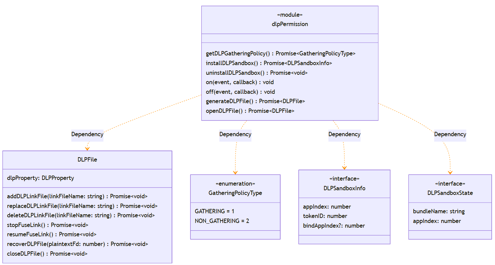

# @ohos.dlpPermission (DLP) (System API)
<!--Kit: Data Protection Kit-->
<!--Subsystem: Security-->
<!--Owner: @winnieHuYu-->
<!--Designer: @QRF-->
<!--Tester: @nacyli-->
<!--Adviser: @zengyawen-->

## Model Overview
Data loss prevention (DLP) is a system solution provided to prevent data disclosure. This module provides APIs for cross-device file access management, encrypted storage, and access authorization. DLP protects sensitive files through encryption and generates encrypted files in .dlp format (DLP files). When opening a DLP file, the system automatically creates an isolated DLP sandbox environment to ensure that the file content is not leaked to unauthorized environments.

Typical application scenarios:

- An enterprise security management application obtains the configuration of the DLP sandbox gathering policy.
- A DLP file management application installs or uninstalls the sandbox environment.
- The enterprise document management system generates protected DLP files and sets access permissions.

> **NOTE**
>
> - The initial APIs of this module are supported since API version 10. Newly added APIs will be marked with a superscript to indicate their earliest API version.
> - This topic describes only the system APIs provided by the module. For details about its public APIs, see [@ohos.dlpPermission](js-apis-dlppermission.md).

## Key Classes and APIs

### Key Enums

- **GatheringPolicyType**: enumerates the types of DLP sandbox gathering policies, which is used to control the sandbox opening mode of DLP files with the same authorization type.

### Key APIs

- **DLPSandboxInfo**: represents the DLP sandbox information, which is returned by **installDLPSandbox()**.
- **DLPSandboxState**: represents the DLP sandbox status, which is used for event callbacks.

### Key Callbacks

- **AsyncCallback\<DLPSandboxInfo>**: defines a callback for sandbox installation.
- **AsyncCallback\<DLPFile>**: defines a callback for file operations.
- **AsyncCallback\<GatheringPolicyType>**: defines a callback for querying the sandbox gathering policy.

### Core Classes

- **DLPFile**: Defines a DLP file object.



### APIs called in pairs

| API Called First| API Called in Pairs| Description|
| -------- | -------- | -------- |
| installDLPSandbox() | uninstallDLPSandbox() | The sandbox must be uninstalled after being installed.|
| on('uninstallDLPSandbox') | off('uninstallDLPSandbox') | The listener must be unregistered after being registered.|
| generateDLPFile() | closeDLPFile() | The DLP file must be closed after being generated.|
| openDLPFile() | closeDLPFile() | The DLP file must be closed after being opened.|
| addDLPLinkFile() | deleteDLPLinkFile() | The FUSE mapping must be deleted after being created.|
| stopFuseLink() | resumeFuseLink() | The read and write can be restored after being stopped.|

## Modules to Import

```ts
import { dlpPermission } from '@kit.DataProtectionKit';
```

## dlpPermission.getDLPGatheringPolicy

getDLPGatheringPolicy(): Promise&lt;GatheringPolicyType&gt;

Obtains the DLP sandbox gathering policy. This API uses a promise to return the result.

This API is used to obtain the DLP sandbox gathering policy of the current system.

**System API**: This is a system API.

**Required permissions**: ohos.permission.ACCESS_DLP_FILE

**System capability**: SystemCapability.Security.DataLossPrevention

**Return value**

| Type| Description|
| -------- | -------- |
| Promise&lt;[GatheringPolicyType](#gatheringpolicytype)&gt; | Promise used to return the DLP sandbox gathering policy obtained.|

**Error codes**

For details about the error codes, see [Universal Error Codes](../errorcode-universal.md) and [DLP Error Codes](errorcode-dlp.md).

| Error Code| Error Message|
| -------- | -------- |
| 201 | Permission denied. |
| 202 | Non-system applications use system APIs. |
| 19100001 | Invalid parameter value. |
| 19100011 | The system ability works abnormally. |

**Example**

```ts
import { dlpPermission } from '@kit.DataProtectionKit';

dlpPermission.getDLPGatheringPolicy().then((gatheringPolicy: dlpPermission.GatheringPolicyType) => {
  console.info('gatheringPolicy: ', JSON.stringify(gatheringPolicy));
}).catch((error: BusinessError)=> {
  console.error(error.message);
}); // Obtain the sandbox gathering policy.
```

## dlpPermission.getDLPGatheringPolicy

getDLPGatheringPolicy(callback: AsyncCallback&lt;GatheringPolicyType&gt;): void

Obtains the DLP sandbox gathering policy. This API uses an asynchronous callback to return the result.

This API is used to obtain the DLP sandbox gathering policy of the current system.

**System API**: This is a system API.

**Required permissions**: ohos.permission.ACCESS_DLP_FILE

**System capability**: SystemCapability.Security.DataLossPrevention

**Parameters**

| Name| Type| Mandatory| Description|
| -------- | -------- | -------- | -------- |
| callback | AsyncCallback&lt;[GatheringPolicyType](#gatheringpolicytype)&gt; | Yes| Callback used to return the result. If the operation is successful, **err** is **undefined**. Otherwise, **err** is an error object.|

**Error codes**

For details about the error codes, see [Universal Error Codes](../errorcode-universal.md) and [DLP Error Codes](errorcode-dlp.md).

| Error Code| Error Message|
| -------- | -------- |
| 201 | Permission denied. |
| 202 | Non-system applications use system APIs. |
| 401 | Parameter error. Possible causes: 1. Incorrect parameter types. |
| 19100001 | Invalid parameter value. |
| 19100011 | The system ability works abnormally. |

**Example**

```ts
import { dlpPermission } from '@kit.DataProtectionKit';

dlpPermission.getDLPGatheringPolicy((err, gatheringPolicy) => {
  if (err !== undefined) {
    console.error('getDLPGatheringPolicy error,', err.code, err.message);
  } else {
    console.info('gatheringPolicy: ', JSON.stringify(gatheringPolicy));
  }
}); // Obtain the sandbox gathering policy.
```

## dlpPermission.installDLPSandbox

installDLPSandbox(bundleName: string, access: DLPFileAccess, userId: number, uri: string): Promise&lt;DLPSandboxInfo&gt;

Installs a DLP sandbox application for an application. The DLP sandbox creates an independent running environment for protected DLP files, which is isolated from the original application process. This ensures that data is securely transferred within the authorized scope. The sandbox application inherits the functions of the original application but can access only authorized DLP files. This API uses a promise to return the result.

After calling **installDLPSandbox** to install a sandbox, the system must call **uninstallDLPSandbox** to uninstall the sandbox after using it.

Before a DLP file management application opens a protected file, the system needs to install a DLP sandbox for the target application.

**System API**: This is a system API.

**Required permissions**: ohos.permission.ACCESS_DLP_FILE

**System capability**: SystemCapability.Security.DataLossPrevention

**Parameters**

| Name| Type| Mandatory| Description|
| -------- | -------- | -------- | -------- |
| bundleName | string | Yes| Bundle name of the application. The value contains 7 to 128 bytes. If the value is out of range, error code 19100001 is thrown.|
| access | [DLPFileAccess](js-apis-dlppermission.md#dlpfileaccess) | Yes| Permission on the DLP file. The permissions on a DLP file determine the access scope of the file. If the value is out of range, error code 19100001 is thrown.|
| userId | number | Yes| Current user ID, which is the system account ID obtained by the account subsystem. The default super user ID is **100**. If the input value is invalid, error code 19100001 is thrown.|
| uri | string | Yes|  URI of the DLP file. The value contains up to 4095 bytes. If the value is out of range, error code 19100001 is thrown.|

**Return value**

| Type| Description|
| -------- | -------- |
| Promise&lt;[DLPSandboxInfo](#dlpsandboxinfo)&gt; | Promise used to return the information about the sandbox application installed.|

**Error codes**

For details about the error codes, see [Universal Error Codes](../errorcode-universal.md) and [DLP Error Codes](errorcode-dlp.md).

| Error Code| Error Message|
| -------- | -------- |
| 201 | Permission denied. |
| 202 | Non-system applications use system APIs. |
| 401 | Parameter error. Possible causes: 1. Mandatory parameters are left unspecified. 2. Incorrect parameter types. |
| 19100001 | Invalid parameter value. |
| 19100011 | The system ability works abnormally. |

**Example**

```ts
import { dlpPermission } from '@kit.DataProtectionKit';

let uri = 'file://docs/storage/Users/currentUser/Desktop/test.txt.dlp';
dlpPermission.installDLPSandbox('com.ohos.note', dlpPermission.DLPFileAccess.READ_ONLY, 100,
  uri).then((dlpSandboxInfo: dlpPermission.DLPSandboxInfo) => {
  console.info('dlpSandboxInfo: ', JSON.stringify(dlpSandboxInfo));
}).catch((error: BusinessError)=> {
  console.error(error.message);
}); // Install a DLP sandbox application.
```

## dlpPermission.installDLPSandbox

installDLPSandbox(bundleName: string, access: DLPFileAccess, userId: number, uri:string, callback: AsyncCallback&lt;DLPSandboxInfo&gt;): void

Installs a DLP sandbox application for an application. This API uses an asynchronous callback to return the result. After the API is called, the system creates a DLP sandbox for the application and returns the sandbox information.

After calling **installDLPSandbox** to install a sandbox, the system must call **uninstallDLPSandbox** to uninstall the sandbox after using it.

Before a DLP file management application opens a protected file, the system needs to install a DLP sandbox for the target application.

**System API**: This is a system API.

**Required permissions**: ohos.permission.ACCESS_DLP_FILE

**System capability**: SystemCapability.Security.DataLossPrevention

**Parameters**

| Name| Type| Mandatory| Description|
| -------- | -------- | -------- | -------- |
| bundleName | string | Yes| Bundle name of the application. The value contains 7 to 128 bytes. If the value is out of range, error code 19100001 is thrown.|
| access | [DLPFileAccess](js-apis-dlppermission.md#dlpfileaccess) | Yes| Permission on the DLP file. The permissions on a DLP file determine the access scope of the file. If the value is out of range, error code 19100001 is thrown.|
| userId | number | Yes| Current user ID, which is the system account ID obtained by the account subsystem. The default super user ID is **100**. If the value is out of range, error code 19100001 is thrown.|
| uri | string | Yes| URI of the DLP file. The value contains up to 4095 bytes. If the value is out of range, error code 19100001 is thrown.|
| callback | AsyncCallback&lt;[DLPSandboxInfo](#dlpsandboxinfo)&gt; | Yes| Callback used to return the result. If the DLP sandbox is installed successfully, **err** is **undefined** and **data** is the sandbox information obtained; otherwise, **err** is an error object.|

**Error codes**

For details about the error codes, see [Universal Error Codes](../errorcode-universal.md) and [DLP Error Codes](errorcode-dlp.md).

| Error Code| Error Message|
| -------- | -------- |
| 201 | Permission denied. |
| 202 | Non-system applications use system APIs. |
| 401 | Parameter error. Possible causes: 1. Mandatory parameters are left unspecified. 2. Incorrect parameter types. |
| 19100001 | Invalid parameter value. |
| 19100011 | The system ability works abnormally. |

**Example**

```ts
import { dlpPermission } from '@kit.DataProtectionKit';

let uri = 'file://docs/storage/Users/currentUser/Desktop/test.txt.dlp';
dlpPermission.installDLPSandbox('com.ohos.note', dlpPermission.DLPFileAccess.READ_ONLY, 100, uri, (err, res) => {
  if (err !== undefined) {
    console.error('installDLPSandbox error,', err.code, err.message);
  } else {
    console.info('res', JSON.stringify(res));
  }
}); // Install a DLP sandbox application.
```

## dlpPermission.uninstallDLPSandbox

uninstallDLPSandbox(bundleName: string, userId: number, appIndex: number): Promise&lt;void&gt;

Uninstalls a DLP sandbox application for an application. This API uses a promise to return the result. After this API is called, the system destroys the specified DLP sandbox environment and releases related resources.

Use this API to clear the corresponding sandbox environment.

This API can be called only after a DLP sandbox is installed by calling **installDLPSandbox**.

**System API**: This is a system API.

**Required permissions**: ohos.permission.ACCESS_DLP_FILE

**System capability**: SystemCapability.Security.DataLossPrevention

**Parameters**

| Name| Type| Mandatory| Description|
| -------- | -------- | -------- | -------- |
| bundleName | string | Yes| Bundle name of the application. The value contains 7 to 128 bytes. If the value is out of range, error code 19100001 is thrown.|
| userId | number | Yes| Current user ID, which is the system account ID obtained by the account subsystem. The default super user ID is **100**. If the value is out of range, error code 19100001 is thrown.|
| appIndex | number | Yes| DLP sandbox index, which is the value returned after **installDLPSandbox** is successfully called. It is used to identify the installed DLP sandbox. If the value is out of range, error code 19100001 is thrown.|

**Return value**

| Type| Description|
| -------- | -------- |
| Promise&lt;void&gt; | Promise that returns no value.|

**Error codes**

For details about the error codes, see [Universal Error Codes](../errorcode-universal.md) and [DLP Error Codes](errorcode-dlp.md).

| Error Code| Error Message|
| -------- | -------- |
| 201 | Permission denied. |
| 202 | Non-system applications use system APIs. |
| 401 | Parameter error. Possible causes: 1. Mandatory parameters are left unspecified. 2. Incorrect parameter types. |
| 19100001 | Invalid parameter value. |
| 19100011 | The system ability works abnormally. |

**Example**

```ts
import { dlpPermission } from '@kit.DataProtectionKit';

let uri = 'file://docs/storage/Users/currentUser/Desktop/test.txt.dlp';
dlpPermission.installDLPSandbox('com.ohos.note', dlpPermission.DLPFileAccess.READ_ONLY, 100,
  uri).then(async (dlpSandboxInfo: dlpPermission.DLPSandboxInfo) => {
  console.info('dlpSandboxInfo: ', JSON.stringify(dlpSandboxInfo));
  await dlpPermission.uninstallDLPSandbox('com.ohos.note', 100, dlpSandboxInfo.appIndex); // Uninstall the DLP sandbox.
}).catch((error: BusinessError)=> {
  console.error(error.message);
}); // Uninstall the DLP sandbox that has been installed.
```

## dlpPermission.uninstallDLPSandbox

uninstallDLPSandbox(bundleName: string, userId: number, appIndex: number, callback: AsyncCallback&lt;void&gt;): void

Uninstalls a DLP sandbox application for an application. This API uses an asynchronous callback to return the result. After this API is called, the system destroys the specified DLP sandbox environment and releases related resources.

Use this API to clear the sandbox environment.

**System API**: This is a system API.

**Required permissions**: ohos.permission.ACCESS_DLP_FILE

**System capability**: SystemCapability.Security.DataLossPrevention

**Parameters**

| Name| Type| Mandatory| Description|
| -------- | -------- | -------- | -------- |
| bundleName | string | Yes| Bundle name of the application. The value contains 7 to 128 bytes. If the value is out of range, error code 19100001 is thrown.|
| userId | number | Yes| Current user ID, which is the system account ID obtained by the account subsystem. The default super user ID is **100**. If the value is out of range, error code 19100001 is thrown.|
| appIndex | number | Yes| DLP sandbox index, which is the value returned after **installDLPSandbox** is successfully called. It is used to identify the installed DLP sandbox. The value range is [1000, 1100]. If the value is out of range, error code 19100001 is thrown.|
| callback | AsyncCallback&lt;void&gt; | Yes| Callback used to return the result. If the DLP sandbox is uninstalled successfully, **err** is **undefined**; otherwise, **err** is an error object.|

**Error codes**

For details about the error codes, see [Universal Error Codes](../errorcode-universal.md) and [DLP Error Codes](errorcode-dlp.md).

| Error Code| Error Message|
| -------- | -------- |
| 201 | Permission denied. |
| 202 | Non-system applications use system APIs. |
| 401 | Parameter error. Possible causes: 1. Mandatory parameters are left unspecified. 2. Incorrect parameter types. |
| 19100001 | Invalid parameter value. |
| 19100011 | The system ability works abnormally. |

**Example**

```ts
import { dlpPermission } from '@kit.DataProtectionKit';

let uri = 'file://docs/storage/Users/currentUser/Desktop/test.txt.dlp';
dlpPermission.installDLPSandbox('com.ohos.note', dlpPermission.DLPFileAccess.READ_ONLY, 100,
  uri).then((dlpSandboxInfo: dlpPermission.DLPSandboxInfo) => {
  console.info('dlpSandboxInfo: ', JSON.stringify(dlpSandboxInfo));
  dlpPermission.uninstallDLPSandbox('com.ohos.note', 100, dlpSandboxInfo.appIndex, (err, res) => {
    if (err !== undefined) {
      console.error('uninstallDLPSandbox error,', err.code, err.message);
    } else {
      console.info('res', JSON.stringify(res));
    }
  }); // Uninstall a DLP sandbox.
}).catch((error: BusinessError)=> {
  console.error(error.message);
}); // Uninstall the DLP sandbox that has been installed.
```

## dlpPermission.on('uninstallDLPSandbox')

on(type: 'uninstallDLPSandbox', listener: Callback&lt;DLPSandboxState&gt;): void

Registers a listener for the DLP sandbox uninstall event, which is used to detect changes in the sandbox environment. After the registration, the system notifies the application using a callback when the DLP sandbox is uninstalled.

After a listener is registered by calling **on()**, you are advised to call **off()** to unregister the listener and release resources when the listener is no longer needed.

The DLP management application needs to track the creation and destruction status of the sandbox to maintain the sandbox list or release resources.

**System API**: This is a system API.

**Required permissions**: ohos.permission.ACCESS_DLP_FILE

**System capability**: SystemCapability.Security.DataLossPrevention

**Parameters**
| Name| Type| Mandatory| Description|
| -------- | -------- | -------- | -------- |
| type | 'uninstallDLPSandbox' | Yes| Event type. It has a fixed value of **uninstallDLPSandbox**, which indicates the DLP sandbox application uninstall event.|
| listener | Callback&lt;[DLPSandboxState](#dlpsandboxstate)&gt; | Yes| Callback used to receive the sandbox application uninstall event.|

**Error codes**

For details about the error codes, see [Universal Error Codes](../errorcode-universal.md) and [DLP Error Codes](errorcode-dlp.md).

| Error Code| Error Message|
| -------- | -------- |
| 201 | Permission denied. |
| 202 | Non-system applications use system APIs. |
| 401 | Parameter error. Possible causes: 1. Mandatory parameters are left unspecified. 2. Incorrect parameter types. 3. Parameter verification failed. |
| 19100001 | Invalid parameter value. |
| 19100011 | The system ability works abnormally. |

**Example**

```ts
import { dlpPermission } from '@kit.DataProtectionKit';

dlpPermission.on('uninstallDLPSandbox', (info: dlpPermission.DLPSandboxState) => {
  console.info('uninstallDLPSandbox event', info.appIndex, info.bundleName)
}); // Subscribe to the DLP sandbox application uninstall event.
```

## dlpPermission.off('uninstallDLPSandbox')

off(type: 'uninstallDLPSandbox', listener?: Callback&lt;DLPSandboxState&gt;): void

Unsubscribes from the DLP sandbox uninstall event. After the API is successfully called, the application will no longer receive callback notifications for the DLP sandbox uninstall event.

This API can be called only after a listener is registered using **on()**.

When the DLP management application exits or no longer needs to track sandbox status changes, unregister the listener to release resources.

**System API**: This is a system API.

**Required permissions**: ohos.permission.ACCESS_DLP_FILE

**System capability**: SystemCapability.Security.DataLossPrevention

**Parameters**
| Name| Type| Mandatory| Description|
| -------- | -------- | -------- | -------- |
| type | 'uninstallDLPSandbox' | Yes| Event type. It has a fixed value of **uninstallDLPSandbox**, which indicates the DLP sandbox application uninstall event.|
| listener | Callback&lt;[DLPSandboxState](#dlpsandboxstate)&gt; | No| Callback used when a sandbox application is uninstalled. By default, this parameter is left blank, which unregisters all callbacks for the sandbox uninstall event.|

**Error codes**

For details about the error codes, see [Universal Error Codes](../errorcode-universal.md) and [DLP Error Codes](errorcode-dlp.md).

| Error Code| Error Message|
| -------- | -------- |
| 201 | Permission denied. |
| 202 | Non-system applications use system APIs. |
| 401 | Parameter error. Possible causes: 1. Mandatory parameters are left unspecified. 2. Incorrect parameter types. 3. Parameter verification failed. |
| 19100001 | Invalid parameter value. |
| 19100011 | The system ability works abnormally. |

**Example**

```ts
import { dlpPermission } from '@kit.DataProtectionKit';

dlpPermission.off('uninstallDLPSandbox', (info: dlpPermission.DLPSandboxState) => {
  console.info('uninstallDLPSandbox event', info.appIndex, info.bundleName)
}); // Unsubscribe from the DLP sandbox application uninstall event.
```

## DLPFile

Provides APIs for managing DLP files. A **DLPFile** instance indicates a DLP file object. You can use [generateDLPFile](#dlppermissiongeneratedlpfile) or [openDLPFile](#dlppermissionopendlpfile11) to obtain a **DLPFile** instance. The **DLPFile** object represents an opened DLP file handle, which encapsulates all operation APIs for DLP files. After using the object, the system must call the **closeDLPFile** API to release resources to prevent file handle leaks. Authorization is required when the **DLPFile** object is transferred across processes.

### Properties

**System API**: This is a system API.

**System capability**: SystemCapability.Security.DataLossPrevention

| Name| Type| Read Only| Optional| Description|
| -------- | -------- | -------- | -------- | -------- |
| dlpProperty | [DLPProperty](js-apis-dlppermission.md#dlpproperty21) | No| No| Authorized user information.|

### addDLPLinkFile

addDLPLinkFile(linkFileName: string): Promise&lt;void&gt;

Adds a link file to the Filesystem in Userspace (FUSE). FUSE allows you to implement custom logic of the file system in user space. The link file is a virtual file in the FUSE, which is used to map to the DLP file. The read and write on the link file will be synchronized to the actual DLP file. This API uses a promise to return the result.

When a DLP application needs to access a DLP file using a standard file API, it can add a link file as the virtual plaintext file to map the DLP file, and then perform read and write on the link file as it does on a common file.

**System API**: This is a system API.

**Required permissions**: ohos.permission.ACCESS_DLP_FILE

**System capability**: SystemCapability.Security.DataLossPrevention

**Parameters**

| Name| Type| Mandatory| Description|
| -------- | -------- | -------- | -------- |
| linkFileName | string | Yes| Name of the link file in the FUSE. The value contains up to 255 bytes. If the value is out of range, error code 19100001 is returned.|

**Return value**

| Type| Description|
| -------- | -------- |
| Promise&lt;void&gt; | Promise that returns no value.|

**Error codes**

For details about the error codes, see [Universal Error Codes](../errorcode-universal.md) and [DLP Error Codes](errorcode-dlp.md).

| Error Code| Error Message|
| -------- | -------- |
| 201 | Permission denied. |
| 202 | Non-system applications use system APIs. |
| 401 | Parameter error. Possible causes: 1. Mandatory parameters are left unspecified. 2. Incorrect parameter types. |
| 19100001 | Invalid parameter value. |
| 19100009 | Failed to operate the DLP file. |
| 19100011 | The system ability works abnormally. |

**Example**

```ts
import { dlpPermission } from '@kit.DataProtectionKit';
import { fileIo } from '@kit.CoreFileKit';
import { bundleManager } from '@kit.AbilityKit';

async function ExampleFunction() {
  let uri = 'file://docs/storage/Users/currentUser/Desktop/test.txt.dlp';
  let file: number | undefined = undefined;
  let bundleFlags = bundleManager.BundleFlag.GET_BUNDLE_INFO_WITH_SIGNATURE_INFO;
  let appId = '';
  let bundleName = 'com.ohos.note';
  let userId = 100;
  let dlpFile: dlpPermission.DLPFile | undefined = undefined;
  
  let data = bundleManager.getBundleInfoSync(bundleName, bundleFlags, userId);
  appId = data.signatureInfo.appId;

  file = fileIo.openSync(uri).fd;
  dlpFile = await dlpPermission.openDLPFile(file, appId); // Open a DLP file.
  await dlpFile.addDLPLinkFile('test.txt.dlp.link'); // Add a link file.

  dlpFile?.closeDLPFile(); // Close the DLP object.
  if (file) {
    fileIo.closeSync(file);
  }
}

ExampleFunction();
```

### addDLPLinkFile

addDLPLinkFile(linkFileName: string, callback: AsyncCallback&lt;void&gt;): void

Adds a link file to the FUSE. This API uses an asynchronous callback to return the result. After this API is successfully called, a virtual file used to map the DLP file is created in the FUSE.

This API is called when a DLP application needs to access a DLP file using a standard file API.

**System API**: This is a system API.

**Required permissions**: ohos.permission.ACCESS_DLP_FILE

**System capability**: SystemCapability.Security.DataLossPrevention

**Parameters**

| Name| Type| Mandatory| Description|
| -------- | -------- | -------- | -------- |
| linkFileName | string | Yes| Name of the link file in the FUSE. The value contains up to 255 bytes. If the value is out of range, error code 19100001 is thrown.|
| callback | AsyncCallback&lt;void&gt; | Yes| Callback used to receive the result of adding a link file.|

**Error codes**

For details about the error codes, see [Universal Error Codes](../errorcode-universal.md) and [DLP Error Codes](errorcode-dlp.md).

| Error Code| Error Message|
| -------- | -------- |
| 201 | Permission denied. |
| 202 | Non-system applications use system APIs. |
| 401 | Parameter error. Possible causes: 1. Mandatory parameters are left unspecified. 2. Incorrect parameter types. |
| 19100001 | Invalid parameter value. |
| 19100009 | Failed to operate the DLP file. |
| 19100011 | The system ability works abnormally. |

**Example**

```ts
import { dlpPermission } from '@kit.DataProtectionKit';
import { fileIo } from '@kit.CoreFileKit';
import { bundleManager } from '@kit.AbilityKit';

async function ExampleFunction() {
  let uri = 'file://docs/storage/Users/currentUser/Desktop/test.txt.dlp';
  let file: number | undefined = undefined;
  let bundleFlags = bundleManager.BundleFlag.GET_BUNDLE_INFO_WITH_SIGNATURE_INFO;
  let appId = '';
  let bundleName = 'com.ohos.note';
  let userId = 100;
  let dlpFile: dlpPermission.DLPFile | undefined = undefined;
  
  let data = bundleManager.getBundleInfoSync(bundleName, bundleFlags, userId);
  appId = data.signatureInfo.appId;

  file = fileIo.openSync(uri).fd;
  dlpFile = await dlpPermission.openDLPFile(file, appId); // Open a DLP file.
  dlpFile.addDLPLinkFile('test.txt.dlp.link', async (err, res) => {
    if (err !== undefined) {
      console.error('addDLPLinkFile error,', err.code, err.message);
    } else {
      console.info('res', JSON.stringify(res));
    }
    await dlpFile?.closeDLPFile(); // Close the DLP object.
    fileIo.closeSync(file);
  }); // Add a link file.
}

ExampleFunction();
```

### stopFuseLink

stopFuseLink(): Promise&lt;void&gt;

Stops the read and write on the FUSE. This API uses a promise to return the result. After the API is successfully called, the read and write on the link file are stopped.

After calling **stopFuseLink()** to stop the read and write on the FUSE, the system must call **resumeFuseLink()** to resume the read and write.

Before deleting a link file, stop the read and write to ensure secure file operations.

**System API**: This is a system API.

**Required permissions**: ohos.permission.ACCESS_DLP_FILE

**System capability**: SystemCapability.Security.DataLossPrevention

**Return value**

| Type| Description|
| -------- | -------- |
| Promise&lt;void&gt; | Promise that returns no value.|

**Error codes**

For details about the error codes, see [Universal Error Codes](../errorcode-universal.md) and [DLP Error Codes](errorcode-dlp.md).

| Error Code| Error Message|
| -------- | -------- |
| 201 | Permission denied. |
| 202 | Non-system applications use system APIs. |
| 19100001 | Invalid parameter value. |
| 19100009 | Failed to operate the DLP file. |
| 19100011 | The system ability works abnormally. |

**Example**

```ts
import { dlpPermission } from '@kit.DataProtectionKit';
import { fileIo } from '@kit.CoreFileKit';
import { bundleManager } from '@kit.AbilityKit';

async function ExampleFunction() {
  let uri = 'file://docs/storage/Users/currentUser/Desktop/test.txt.dlp';
  let file: number | undefined = undefined;
  let bundleFlags = bundleManager.BundleFlag.GET_BUNDLE_INFO_WITH_SIGNATURE_INFO;
  let appId = '';
  let bundleName = 'com.ohos.note';
  let userId = 100;
  let dlpFile: dlpPermission.DLPFile | undefined = undefined;

  let data = bundleManager.getBundleInfoSync(bundleName, bundleFlags, userId);
  appId = data.signatureInfo.appId;

  file = fileIo.openSync(uri).fd;
  dlpFile = await dlpPermission.openDLPFile(file, appId) // Open a DLP file.
  dlpFile.addDLPLinkFile('test.txt.dlp.link'); // Add a link file.
  dlpFile.stopFuseLink(); // Stop read/write on the link file.
  dlpFile?.closeDLPFile(); // Close the DLP object.
  if (file) {
    fileIo.closeSync(file);
  }
}

ExampleFunction();
```

### stopFuseLink

stopFuseLink(callback: AsyncCallback&lt;void&gt;): void

Stops the read and write on the FUSE. This API uses an asynchronous callback to return the result. After the API is successfully called, the read and write on the link file are stopped.

Before deleting a link file, stop the read and write.

**System API**: This is a system API.

**Required permissions**: ohos.permission.ACCESS_DLP_FILE

**System capability**: SystemCapability.Security.DataLossPrevention

**Parameters**

| Name| Type| Mandatory| Description|
| -------- | -------- | -------- | -------- |
| callback | AsyncCallback&lt;void&gt; | Yes| Callback used to receive the result of stopping read and write on the FUSE. The callback parameter is **err**. **err** is **undefined** when the operation is successful; otherwise, **err** is an error object.|

**Error codes**

For details about the error codes, see [Universal Error Codes](../errorcode-universal.md) and [DLP Error Codes](errorcode-dlp.md).

| Error Code| Error Message|
| -------- | -------- |
| 201 | Permission denied. |
| 202 | Non-system applications use system APIs. |
| 401 | Parameter error. Possible causes: 1. Incorrect parameter types. |
| 19100001 | Invalid parameter value. |
| 19100009 | Failed to operate the DLP file. |
| 19100011 | The system ability works abnormally. |

**Example**

```ts
import { dlpPermission } from '@kit.DataProtectionKit';
import { fileIo } from '@kit.CoreFileKit';
import { bundleManager } from '@kit.AbilityKit';

async function ExampleFunction() {
  let uri = 'file://docs/storage/Users/currentUser/Desktop/test.txt.dlp';
  let file: number | undefined = undefined;
  let bundleFlags = bundleManager.BundleFlag.GET_BUNDLE_INFO_WITH_SIGNATURE_INFO;
  let appId = '';
  let bundleName = 'com.ohos.note';
  let userId = 100;
  let dlpFile: dlpPermission.DLPFile | undefined = undefined;

  let data = bundleManager.getBundleInfoSync(bundleName, bundleFlags, userId);
  appId = data.signatureInfo.appId;

  file = fileIo.openSync(uri).fd;
  dlpFile = await dlpPermission.openDLPFile(file, appId); // Open a DLP file.
  await dlpFile.addDLPLinkFile('test.txt.dlp.link'); // Add a link file.
  dlpFile.stopFuseLink(async (err, res) => {
    if (err !== undefined) {
      console.error('stopFuseLink error,', err.code, err.message);
    } else {
      console.info('res', JSON.stringify(res));
    }
    await dlpFile?.closeDLPFile(); // Close the DLP object.
    fileIo.closeSync(file);
  }); // Stop read/write on the link file.
}

ExampleFunction();
```

### resumeFuseLink

resumeFuseLink(): Promise&lt;void&gt;

Resumes the read and write on the FUSE. This API uses a promise to return the result. After the API is successfully called, the read and write on the link file are resumed.

This API can be called to resume read and write only after **stopFuseLink()** is called to stop the read and write operations.

After the link file is replaced, the read and write need to be resumed for normal file access.

**System API**: This is a system API.

**Required permissions**: ohos.permission.ACCESS_DLP_FILE

**System capability**: SystemCapability.Security.DataLossPrevention

**Return value**

| Type| Description|
| -------- | -------- |
| Promise&lt;void&gt; | Promise that returns no value.|

**Error codes**

For details about the error codes, see [Universal Error Codes](../errorcode-universal.md) and [DLP Error Codes](errorcode-dlp.md).

| Error Code| Error Message|
| -------- | -------- |
| 201 | Permission denied. |
| 202 | Non-system applications use system APIs. |
| 19100001 | Invalid parameter value. |
| 19100009 | Failed to operate the DLP file. |
| 19100011 | The system ability works abnormally. |

**Example**

```ts
import { dlpPermission } from '@kit.DataProtectionKit';
import { fileIo } from '@kit.CoreFileKit';
import { bundleManager } from '@kit.AbilityKit';

async function ExampleFunction() {
  let uri = 'file://docs/storage/Users/currentUser/Desktop/test.txt.dlp';
  let file: number | undefined = undefined;
  let bundleFlags = bundleManager.BundleFlag.GET_BUNDLE_INFO_WITH_SIGNATURE_INFO;
  let appId = '';
  let bundleName = 'com.ohos.note';
  let userId = 100;
  let dlpFile: dlpPermission.DLPFile | undefined = undefined;

  let data = bundleManager.getBundleInfoSync(bundleName, bundleFlags, userId);
  appId = data.signatureInfo.appId;

  file = fileIo.openSync(uri).fd;
  dlpFile = await dlpPermission.openDLPFile(file, appId); // Open a DLP file.
  await dlpFile.addDLPLinkFile('test.txt.dlp.link'); // Add a link file.
  await dlpFile.stopFuseLink(); // Stop the read and write on the link file.
  await dlpFile.resumeFuseLink(); // Resume read/write on the link file.
  
  dlpFile?.closeDLPFile(); // Close the DLP object.
  if (file) {
    fileIo.closeSync(file);
  }
}

ExampleFunction();
```

### resumeFuseLink

resumeFuseLink(callback: AsyncCallback&lt;void&gt;): void

Resumes the read and write on the FUSE. This API uses an asynchronous callback to return the result. After the API is successfully called, the read and write on the link file are resumed.

After the link file is replaced, the read and write need to be resumed.

**System API**: This is a system API.

**Required permissions**: ohos.permission.ACCESS_DLP_FILE

**System capability**: SystemCapability.Security.DataLossPrevention

**Parameters**

| Name| Type| Mandatory| Description|
| -------- | -------- | -------- | -------- |
| callback | AsyncCallback&lt;void&gt; | Yes| Callback used to receive the result of resume the read and write on the FUSE.|

**Error codes**

For details about the error codes, see [Universal Error Codes](../errorcode-universal.md) and [DLP Error Codes](errorcode-dlp.md).

| Error Code| Error Message|
| -------- | -------- |
| 201 | Permission denied. |
| 202 | Non-system applications use system APIs. |
| 401 | Parameter error. Possible causes: 1. Incorrect parameter types. |
| 19100001 | Invalid parameter value. |
| 19100009 | Failed to operate the DLP file. |
| 19100011 | The system ability works abnormally. |

**Example**

```ts
import { dlpPermission } from '@kit.DataProtectionKit';
import { fileIo } from '@kit.CoreFileKit';
import { bundleManager } from '@kit.AbilityKit';

async function ExampleFunction() {
  let uri = 'file://docs/storage/Users/currentUser/Desktop/test.txt.dlp';
  let file: number | undefined = undefined;
  let bundleFlags = bundleManager.BundleFlag.GET_BUNDLE_INFO_WITH_SIGNATURE_INFO;
  let appId = '';
  let bundleName = 'com.ohos.note';
  let userId = 100;
  let dlpFile: dlpPermission.DLPFile | undefined = undefined;

  let data = bundleManager.getBundleInfoSync(bundleName, bundleFlags, userId);
  appId = data.signatureInfo.appId;

  file = fileIo.openSync(uri).fd;
  dlpFile = await dlpPermission.openDLPFile(file, appId); // Open a DLP file.
  await dlpFile.addDLPLinkFile('test.txt.dlp.link'); // Add a link file.
  await dlpFile.stopFuseLink(); // Stop the read and write on the link file.
  dlpFile.resumeFuseLink(async (err, res) => {
    if (err !== undefined) {
      console.error('resumeFuseLink error,', err.code, err.message);
    } else {
      console.info('res', JSON.stringify(res));
    }
    await dlpFile?.closeDLPFile(); // Close the DLP object.
    fileIo.closeSync(file);
  }); // Resume read/write on the link file.
}

ExampleFunction();
```

### replaceDLPLinkFile

replaceDLPLinkFile(linkFileName: string): Promise&lt;void&gt;

Replaces a link file. This API uses a promise to return the result. After the API is successfully called, the current link file is replaced with the new link file.

When you need to access a different DLP file, you can replace the link file to change the file mapping.

**System API**: This is a system API.

**Required permissions**: ohos.permission.ACCESS_DLP_FILE

**System capability**: SystemCapability.Security.DataLossPrevention

**Parameters**

| Name| Type| Mandatory| Description|
| -------- | -------- | -------- | -------- |
| linkFileName | string | Yes| Name of the link file in the FUSE. The value contains up to 255 bytes. If the value is out of range, error code 19100001 is thrown.|

**Return value**

| Type| Description|
| -------- | -------- |
| Promise&lt;void&gt; | Promise that returns no value.|

**Error codes**

For details about the error codes, see [Universal Error Codes](../errorcode-universal.md) and [DLP Error Codes](errorcode-dlp.md).

| Error Code| Error Message|
| -------- | -------- |
| 201 | Permission denied. |
| 202 | Non-system applications use system APIs. |
| 401 | Parameter error. Possible causes: 1. Mandatory parameters are left unspecified. 2. Incorrect parameter types. |
| 19100001 | Invalid parameter value. |
| 19100009 | Failed to operate the DLP file. |
| 19100011 | The system ability works abnormally. |

**Example**

```ts
import { dlpPermission } from '@kit.DataProtectionKit';
import { fileIo } from '@kit.CoreFileKit';
import { bundleManager } from '@kit.AbilityKit';

async function ExampleFunction() {
  let uri = 'file://docs/storage/Users/currentUser/Desktop/test.txt.dlp';
  let file: number | undefined = undefined;
  let bundleFlags = bundleManager.BundleFlag.GET_BUNDLE_INFO_WITH_SIGNATURE_INFO;
  let appId = '';
  let bundleName = 'com.ohos.note';
  let userId = 100;
  let dlpFile: dlpPermission.DLPFile | undefined = undefined;

  let data = bundleManager.getBundleInfoSync(bundleName, bundleFlags, userId);
  appId = data.signatureInfo.appId;

  file = fileIo.openSync(uri).fd;
  dlpFile = await dlpPermission.openDLPFile(file, appId); // Open a DLP file.
  await dlpFile.addDLPLinkFile('test.txt.dlp.link'); // Add a link file.
  await dlpFile.stopFuseLink(); // Stop the read and write on the link file.
  await dlpFile.replaceDLPLinkFile('test_new.txt.dlp.link'); // Replace a link file.
  await dlpFile.resumeFuseLink(); // Resume read/write on the link file.
  
  await dlpFile?.closeDLPFile(); // Close the DLP object.
  if (file) {
    fileIo.closeSync(file);
  }
}

ExampleFunction();
```

### replaceDLPLinkFile

replaceDLPLinkFile(linkFileName: string, callback: AsyncCallback&lt;void&gt;): void

Replaces a link file. This API uses an asynchronous callback to return the result. After the API is successfully called, the current link file is replaced with the new link file.

When you need to access a different DLP file, you can replace the link file.

**System API**: This is a system API.

**Required permissions**: ohos.permission.ACCESS_DLP_FILE

**System capability**: SystemCapability.Security.DataLossPrevention

**Parameters**

| Name| Type| Mandatory| Description|
| -------- | -------- | -------- | -------- |
| linkFileName | string | Yes| Name of the link file in the FUSE. The value contains up to 255 bytes. If the value is out of range, error code 19100001 is thrown.|
| callback | AsyncCallback&lt;void&gt; | Yes| Callback used to receive the result of replacing a link file. The callback parameter is **err**. **err** is **undefined** when the operation is successful; otherwise, **err** is an error object.|

**Error codes**

For details about the error codes, see [Universal Error Codes](../errorcode-universal.md) and [DLP Error Codes](errorcode-dlp.md).

| Error Code| Error Message|
| -------- | -------- |
| 201 | Permission denied. |
| 202 | Non-system applications use system APIs. |
| 401 | Parameter error. Possible causes: 1. Mandatory parameters are left unspecified. 2. Incorrect parameter types. |
| 19100001 | Invalid parameter value. |
| 19100009 | Failed to operate the DLP file. |
| 19100011 | The system ability works abnormally. |

**Example**

```ts
import { dlpPermission } from '@kit.DataProtectionKit';
import { fileIo } from '@kit.CoreFileKit';
import { bundleManager } from '@kit.AbilityKit';

async function ExampleFunction() {
  let uri = 'file://docs/storage/Users/currentUser/Desktop/test.txt.dlp';
  let file: number | undefined = undefined;
  let bundleFlags = bundleManager.BundleFlag.GET_BUNDLE_INFO_WITH_SIGNATURE_INFO;
  let appId = '';
  let bundleName = 'com.ohos.note';
  let userId = 100;
  let dlpFile: dlpPermission.DLPFile | undefined = undefined;

  let data = bundleManager.getBundleInfoSync(bundleName, bundleFlags, userId);
  appId = data.signatureInfo.appId;

  file = fileIo.openSync(uri).fd;
  dlpFile = await dlpPermission.openDLPFile(file, appId); // Open a DLP file.
  await dlpFile.addDLPLinkFile('test.txt.dlp.link'); // Add a link file.
  await dlpFile.stopFuseLink(); // Stop the read and write on the link file.
  dlpFile.replaceDLPLinkFile('test_new.txt.dlp.link', async (err, res) => { // Replace a link file.
    if (err !== undefined) {
      console.error('replaceDLPLinkFile error,', err.code, err.message);
    } else {
      console.info('res', JSON.stringify(res));
      await dlpFile?.resumeFuseLink(); // Resume the read and write on the link file.
    }
    await dlpFile?.closeDLPFile(); // Close the DLP object.
    fileIo.closeSync(file);
  });
}

ExampleFunction();
```

### deleteDLPLinkFile

deleteDLPLinkFile(linkFileName: string): Promise&lt;void&gt;

Deletes a link file from the FUSE. This API uses a promise to return the result. After the API is successfully called, the specified link file is deleted from the FUSE.

This API is used to clear the link file mapping after DLP file access is complete.

**System API**: This is a system API.

**Required permissions**: ohos.permission.ACCESS_DLP_FILE

**System capability**: SystemCapability.Security.DataLossPrevention

**Parameters**

| Name| Type| Mandatory| Description|
| -------- | -------- | -------- | -------- |
| linkFileName | string | Yes| Name of the link file in the FUSE. The value contains up to 255 bytes. If the value is out of range, error code 19100001 is thrown.|

**Return value**

| Type| Description|
| -------- | -------- |
| Promise&lt;void&gt; | Promise that returns no value.|

**Error codes**

For details about the error codes, see [Universal Error Codes](../errorcode-universal.md) and [DLP Error Codes](errorcode-dlp.md).

| Error Code| Error Message|
| -------- | -------- |
| 201 | Permission denied. |
| 202 | Non-system applications use system APIs. |
| 401 | Parameter error. Possible causes: 1. Mandatory parameters are left unspecified. 2. Incorrect parameter types. |
| 19100001 | Invalid parameter value. |
| 19100009 | Failed to operate the DLP file. |
| 19100011 | The system ability works abnormally. |

**Example**

```ts
import { dlpPermission } from '@kit.DataProtectionKit';
import { fileIo } from '@kit.CoreFileKit';
import { bundleManager } from '@kit.AbilityKit';

async function ExampleFunction() {
  let uri = 'file://docs/storage/Users/currentUser/Desktop/test.txt.dlp';
  let file: number | undefined = undefined;
  let bundleFlags = bundleManager.BundleFlag.GET_BUNDLE_INFO_WITH_SIGNATURE_INFO;
  let appId = '';
  let bundleName = 'com.ohos.note';
  let userId = 100;
  let dlpFile: dlpPermission.DLPFile | undefined = undefined;

  let data = bundleManager.getBundleInfoSync(bundleName, bundleFlags, userId);
  appId = data.signatureInfo.appId;

  file = fileIo.openSync(uri).fd;
  dlpFile = await dlpPermission.openDLPFile(file, appId); // Open a DLP file.
  await dlpFile.addDLPLinkFile('test.txt.dlp.link'); // Add a link file.
  await dlpFile.deleteDLPLinkFile('test.txt.dlp.link'); // Delete a link file.
  
  await dlpFile?.closeDLPFile(); // Close the DLP object.
  if (file) {
    fileIo.closeSync(file);
  }
}

ExampleFunction();
```

### deleteDLPLinkFile

deleteDLPLinkFile(linkFileName: string, callback: AsyncCallback&lt;void&gt;): void

Deletes a link file from the FUSE. This API uses an asynchronous callback to return the result. After the API is successfully called, the specified link file is deleted from the FUSE.

This API is used to clear the link file mapping after DLP file access is complete.

**System API**: This is a system API.

**Required permissions**: ohos.permission.ACCESS_DLP_FILE

**System capability**: SystemCapability.Security.DataLossPrevention

**Parameters**

| Name| Type| Mandatory| Description|
| -------- | -------- | -------- | -------- |
| linkFileName | string | Yes| Name of the link file in the FUSE. The value contains up to 255 bytes. If the value is out of range, error code 19100001 is thrown.|
| callback | AsyncCallback&lt;void&gt; | Yes| Callback used to receive the result of deleting a link file.|

**Error codes**

For details about the error codes, see [Universal Error Codes](../errorcode-universal.md) and [DLP Error Codes](errorcode-dlp.md).

| Error Code| Error Message|
| -------- | -------- |
| 201 | Permission denied. |
| 202 | Non-system applications use system APIs. |
| 401 | Parameter error. Possible causes: 1. Mandatory parameters are left unspecified. 2. Incorrect parameter types. |
| 19100001 | Invalid parameter value. |
| 19100009 | Failed to operate the DLP file. |
| 19100011 | The system ability works abnormally. |

**Example**

```ts
import { dlpPermission } from '@kit.DataProtectionKit';
import { fileIo } from '@kit.CoreFileKit';
import { bundleManager } from '@kit.AbilityKit';

async function ExampleFunction() {
  let uri = 'file://docs/storage/Users/currentUser/Desktop/test.txt.dlp';
  let file: number | undefined = undefined;
  let bundleFlags = bundleManager.BundleFlag.GET_BUNDLE_INFO_WITH_SIGNATURE_INFO;
  let appId = '';
  let bundleName = 'com.ohos.note';
  let userId = 100;
  let dlpFile: dlpPermission.DLPFile | undefined = undefined;

  let data = bundleManager.getBundleInfoSync(bundleName, bundleFlags, userId);
  appId = data.signatureInfo.appId;

  file = fileIo.openSync(uri).fd;
  dlpFile = await dlpPermission.openDLPFile(file, appId); // Open a DLP file.
  await dlpFile.addDLPLinkFile('test.txt.dlp.link'); // Add a link file.
  dlpFile.deleteDLPLinkFile('test.txt.dlp.link', async (err, res) => { // Delete a link file.
    if (err !== undefined) {
      console.error('deleteDLPLinkFile error,', err.code, err.message);
    } else {
      console.info('res', JSON.stringify(res));
    }
    await dlpFile?.closeDLPFile(); // Close the DLP object.
    fileIo.closeSync(file);
  });
}

ExampleFunction();
```

### recoverDLPFile

recoverDLPFile(plaintextFd: number): Promise&lt;void&gt;

Recovers the plaintext of a DLP file. This API uses a promise to return the result.

This API is used when the file owner decides to disable the DLP protection for a file and convert it into a common file for free sharing.

**System API**: This is a system API.

**Required permissions**: ohos.permission.ACCESS_DLP_FILE

**System capability**: SystemCapability.Security.DataLossPrevention

**Parameters**

| Name| Type| Mandatory| Description|
| -------- | -------- | -------- | -------- |
| plaintextFd | number | Yes| FD of the target plaintext file.|

**Return value**

| Type| Description|
| -------- | -------- |
| Promise&lt;void&gt; | Promise that returns no value.|

**Error codes**

For details about the error codes, see [Universal Error Codes](../errorcode-universal.md) and [DLP Error Codes](errorcode-dlp.md).

| Error Code| Error Message|
| -------- | -------- |
| 201 | Permission denied. |
| 202 | Non-system applications use system APIs. |
| 401 | Parameter error. Possible causes: 1. Mandatory parameters are left unspecified. 2. Incorrect parameter types. |
| 19100001 | Invalid parameter value. |
| 19100002 | Credential service busy due to too many tasks or duplicate tasks. |
| 19100003 | Credential task time out. |
| 19100004 | Credential service error. |
| 19100005 | Credential authentication server error. |
| 19100008 | The file is not a DLP file. |
| 19100009 | Failed to operate the DLP file. |
| 19100010 | The DLP file is read only. |
| 19100011 | The system ability works abnormally. |

**Example**

```ts
import { dlpPermission } from '@kit.DataProtectionKit';
import { fileIo } from '@kit.CoreFileKit';
import { bundleManager } from '@kit.AbilityKit';

async function ExampleFunction() {
  let uri = 'file://docs/storage/Users/currentUser/Desktop/test.txt.dlp';
  let file: number | undefined = undefined;
  let destFile: number | undefined = undefined;
  let bundleFlags = bundleManager.BundleFlag.GET_BUNDLE_INFO_WITH_SIGNATURE_INFO;
  let appId = '';
  let bundleName = 'com.ohos.note';
  let userId = 100;
  let dlpFile: dlpPermission.DLPFile | undefined = undefined;

  let data = bundleManager.getBundleInfoSync(bundleName, bundleFlags, userId);
  appId = data.signatureInfo.appId;

  file = fileIo.openSync(uri).fd;
  destFile = fileIo.openSync('destUri').fd;
  dlpFile = await dlpPermission.openDLPFile(file, appId); // Open a DLP file.
  await dlpFile.recoverDLPFile(destFile); // Recover the plaintext of a DLP file.
  dlpFile?.closeDLPFile(); // Close the DLP object.
  if (file) {
    fileIo.closeSync(file);
  }
  if (destFile) {
    fileIo.closeSync(destFile);
  }
}

ExampleFunction();
```

### recoverDLPFile

recoverDLPFile(plaintextFd: number, callback: AsyncCallback&lt;void&gt;): void

Recovers the plaintext of a DLP file. This API uses an asynchronous callback to return the result.

This API is used when the file owner decides to disable the DLP protection for a file.

**System API**: This is a system API.

**Required permissions**: ohos.permission.ACCESS_DLP_FILE

**System capability**: SystemCapability.Security.DataLossPrevention

**Parameters**

| Name| Type| Mandatory| Description|
| -------- | -------- | -------- | -------- |
| plaintextFd | number | Yes| FD of the target plaintext file. The value range is [0, 2<sup>31</sup>-1]. If the value is out of range, the excess part will be truncated.|
| callback | AsyncCallback&lt;void&gt; | Yes| Callback used to receive the result of recovering the plaintext of a DLP file. The callback parameter is **err**. **err** is **undefined** when the operation is successful; otherwise, **err** is an error object.|

**Error codes**

For details about the error codes, see [Universal Error Codes](../errorcode-universal.md) and [DLP Error Codes](errorcode-dlp.md).

| Error Code| Error Message|
| -------- | -------- |
| 201 | Permission denied. |
| 202 | Non-system applications use system APIs. |
| 401 | Parameter error. Possible causes: 1. Mandatory parameters are left unspecified. 2. Incorrect parameter types. |
| 19100001 | Invalid parameter value. |
| 19100002 | Credential service busy due to too many tasks or duplicate tasks. |
| 19100003 | Credential task time out. |
| 19100004 | Credential service error. |
| 19100005 | Credential authentication server error. |
| 19100008 | The file is not a DLP file. |
| 19100009 | Failed to operate the DLP file. |
| 19100010 | The DLP file is read only. |
| 19100011 | The system ability works abnormally. |

**Example**

```ts
import { dlpPermission } from '@kit.DataProtectionKit';
import { fileIo } from '@kit.CoreFileKit';
import { bundleManager } from '@kit.AbilityKit';

async function ExampleFunction() {
  let uri = 'file://docs/storage/Users/currentUser/Desktop/test.txt.dlp';
  let file: number | undefined = undefined;
  let destFile: number | undefined = undefined;
  let bundleFlags = bundleManager.BundleFlag.GET_BUNDLE_INFO_WITH_SIGNATURE_INFO;
  let appId = '';
  let bundleName = 'com.ohos.note';
  let userId = 100;
  let dlpFile: dlpPermission.DLPFile | undefined = undefined;

  let data = bundleManager.getBundleInfoSync(bundleName, bundleFlags, userId);
  appId = data.signatureInfo.appId;

  file = fileIo.openSync(uri).fd;
  destFile = fileIo.openSync('destUri').fd;
  dlpFile = await dlpPermission.openDLPFile(file, appId); // Open a DLP file.
  dlpFile.recoverDLPFile(destFile, async (err, res) => { // Recover the plaintext of a DLP file.
    if (err !== undefined) {
      console.error('recoverDLPFile error,', err.code, err.message);
    } else {
      console.info('res', JSON.stringify(res));
    }
    await dlpFile?.closeDLPFile(); // Close the DLP object.
    fileIo.closeSync(file);
    fileIo.closeSync(destFile);
  });
}

ExampleFunction();
```

### closeDLPFile

closeDLPFile(): Promise&lt;void&gt;

Closes a **DLPFile** object. This API uses a promise to return the result.

After calling **openDLPFile()** to return a **DLPFile** object, the system must call **closeDLPFile()** to release resources after using the object.

This API is used when the file owner decides to close a DLP file.

**System API**: This is a system API.

**Required permissions**: ohos.permission.ACCESS_DLP_FILE

**System capability**: SystemCapability.Security.DataLossPrevention

> **NOTE**
>
> If a DLP file is no longer used, close the **dlpFile** object to release the memory.

**Return value**

| Type| Description|
| -------- | -------- |
| Promise&lt;void&gt; | Promise that returns no value.|

**Error codes**

For details about the error codes, see [Universal Error Codes](../errorcode-universal.md) and [DLP Error Codes](errorcode-dlp.md).

| Error Code| Error Message|
| -------- | -------- |
| 201 | Permission denied. |
| 202 | Non-system applications use system APIs. |
| 19100001 | Invalid parameter value. |
| 19100009 | Failed to operate the DLP file. |
| 19100011 | The system ability works abnormally. |

**Example**

```ts
import { dlpPermission } from '@kit.DataProtectionKit';
import { fileIo } from '@kit.CoreFileKit';
import { bundleManager } from '@kit.AbilityKit';

async function ExampleFunction() {
  let uri = 'file://docs/storage/Users/currentUser/Desktop/test.txt.dlp';
  let file: number | undefined = undefined;
  let bundleFlags = bundleManager.BundleFlag.GET_BUNDLE_INFO_WITH_SIGNATURE_INFO;
  let appId = '';
  let bundleName = 'com.ohos.note';
  let userId = 100;
  let dlpFile: dlpPermission.DLPFile | undefined = undefined;

  let data = bundleManager.getBundleInfoSync(bundleName, bundleFlags, userId);
  appId = data.signatureInfo.appId;

  file = fileIo.openSync(uri).fd;
  dlpFile = await dlpPermission.openDLPFile(file, appId); // Open a DLP file.

  dlpFile?.closeDLPFile(); // Close the DLP object.
  if (file) {
    fileIo.closeSync(file);
  }
}

ExampleFunction();
```

### closeDLPFile

closeDLPFile(callback: AsyncCallback&lt;void&gt;): void

Closes a **DLPFile** object. This API uses an asynchronous callback to return the result.

After calling **openDLPFile()** to return a **DLPFile** object, the system must call **closeDLPFile()** to release resources after using the object.

This API is used when the file owner decides to close a DLP file.

**System API**: This is a system API.

**Required permissions**: ohos.permission.ACCESS_DLP_FILE

**System capability**: SystemCapability.Security.DataLossPrevention

> **NOTE**
>
> If a DLP file is no longer used, close the **dlpFile** instance to release the memory.

**Parameters**

| Name| Type| Mandatory| Description|
| -------- | -------- | -------- | -------- |
| callback | AsyncCallback&lt;void&gt; | Yes| Callback used to receive the result of closing a **DLPFile** object.|

**Error codes**

For details about the error codes, see [Universal Error Codes](../errorcode-universal.md) and [DLP Error Codes](errorcode-dlp.md).

| Error Code| Error Message|
| -------- | -------- |
| 201 | Permission denied. |
| 202 | Non-system applications use system APIs. |
| 401 | Parameter error. Possible causes: 1. Incorrect parameter types. |
| 19100001 | Invalid parameter value. |
| 19100009 | Failed to operate the DLP file. |
| 19100011 | The system ability works abnormally. |

**Example**

```ts
import { dlpPermission } from '@kit.DataProtectionKit';
import { fileIo } from '@kit.CoreFileKit';
import { bundleManager } from '@kit.AbilityKit';

async function ExampleFunction() {
  let uri = 'file://docs/storage/Users/currentUser/Desktop/test.txt.dlp';
  let file: number | undefined = undefined;
  let bundleFlags = bundleManager.BundleFlag.GET_BUNDLE_INFO_WITH_SIGNATURE_INFO;
  let appId = '';
  let bundleName = 'com.ohos.note';
  let userId = 100;
  let dlpFile: dlpPermission.DLPFile | undefined = undefined;

  let data = bundleManager.getBundleInfoSync(bundleName, bundleFlags, userId);
  appId = data.signatureInfo.appId;

  file = fileIo.openSync(uri).fd;
  dlpFile = await dlpPermission.openDLPFile(file, appId); // Open a DLP file.
  dlpFile.closeDLPFile((err, res) => {// Close the DLP file.
    if (err !== undefined) {
      console.error('closeDLPFile error,', err.code, err.message);
    } else {
      console.info('res', JSON.stringify(res));
    }
    fileIo.closeSync(file);
  });
}

ExampleFunction();
```

## dlpPermission.generateDLPFile

generateDLPFile(plaintextFd: number, ciphertextFd: number, property: DLPProperty): Promise&lt;DLPFile&gt;

Generates a **DLPFile** object, which is an encrypted file that can be accessed only by authorized users. The users can have the full control permission or read-only permission on the DLP file. This API uses a promise to return the result.

After calling **generateDLPFile** to return a **DLPFile** object, the system must call **closeDLPFile** to release resources after using the object.

**System API**: This is a system API.

**Required permissions**: ohos.permission.ACCESS_DLP_FILE

**System capability**: SystemCapability.Security.DataLossPrevention

**Parameters**

| Name| Type| Mandatory| Description|
| -------- | -------- | -------- | -------- |
| plaintextFd | number | Yes| FD of the plaintext file to be encrypted. The value range is [0, 2<sup>31</sup>-1]. If the value is out of range, the excess part will be truncated.|
| ciphertextFd | number | Yes| FD of the encrypted file. The value range is [0, 2<sup>31</sup>-1]. If the value is out of range, the excess part will be truncated.|
| property | [DLPProperty](js-apis-dlppermission.md#dlpproperty21) | Yes| Authorization information, which includes the authorized user list, owner account, and contact account information.|

**Return value**

| Type| Description|
| -------- | -------- |
| Promise&lt;[DLPFile](#dlpfile)&gt; | Promise used to return the result. If the value is **resolve**, a **DLPFile** object is returned, indicating that a DLP file is successfully generated. If the value is **reject**, an error is returned, indicating that the DLP file fails to be generated.|

**Error codes**

For details about the error codes, see [Universal Error Codes](../errorcode-universal.md) and [DLP Error Codes](errorcode-dlp.md).

| Error Code| Error Message|
| -------- | -------- |
| 201 | Permission denied. |
| 202 | Non-system applications use system APIs. |
| 401 | Parameter error. Possible causes: 1. Mandatory parameters are left unspecified. 2. Incorrect parameter types. |
| 19100001 | Invalid parameter value. |
| 19100002 | Credential service busy due to too many tasks or duplicate tasks. |
| 19100003 | Credential task time out. |
| 19100004 | Credential service error. |
| 19100005 | Credential authentication server error. |
| 19100009 | Failed to operate the DLP file. |
| 19100011 | The system ability works abnormally. |

**Example**

```ts
import { dlpPermission } from '@kit.DataProtectionKit';
import { fileIo } from '@kit.CoreFileKit';

async function ExampleFunction() {
  let dlpUri = 'file://docs/storage/Users/currentUser/Desktop/test.txt.dlp';
  let uri = 'file://docs/storage/Users/currentUser/Desktop/test.txt';
  let file: number | undefined = undefined;
  let dlp: number | undefined = undefined;
  let dlpFile: dlpPermission.DLPFile | undefined = undefined;

  file = fileIo.openSync(uri).fd;
  dlp = fileIo.openSync(dlpUri).fd;
  let dlpProperty: dlpPermission.DLPProperty = {
    ownerAccount: 'zhangsan',
    ownerAccountType: dlpPermission.AccountType.DOMAIN_ACCOUNT,
    authUserList: [],
    contactAccount: 'zhangsan',
    offlineAccess: true,
    ownerAccountID: 'xxxxxxx',
    everyoneAccessList: []
  };
  dlpFile = await dlpPermission.generateDLPFile(file, dlp, dlpProperty); // Generate a DLP file.

  dlpFile?.closeDLPFile(); // Close the DLP object.
  if (file) {
    fileIo.closeSync(file);
  }
  if (dlp) {
    fileIo.closeSync(dlp);
  }
}

ExampleFunction();
```

## dlpPermission.generateDLPFile

generateDLPFile(plaintextFd: number, ciphertextFd: number, property: DLPProperty, callback: AsyncCallback&lt;DLPFile&gt;): void

Generates a DLP file, which is an encrypted file that can be accessed only by authorized users. The users can have the full control permission or read-only permission on the DLP file. Obtains a **DLPFile** object. This API uses an asynchronous callback to return the result. After using the **DLPFile** object, call **closeDLPFile** to close the object to prevent resource leakage.

After calling **generateDLPFile()** to return a **DLPFile** object, the system must call **closeDLPFile()** to release resources after using the object.

**System API**: This is a system API.

**Required permissions**: ohos.permission.ACCESS_DLP_FILE

**System capability**: SystemCapability.Security.DataLossPrevention

**Parameters**

| Name| Type| Mandatory| Description|
| -------- | -------- | -------- | -------- |
| plaintextFd | number | Yes| FD of the plaintext file to be encrypted. The value range is [0, 2<sup>31</sup>-1]. If the value is out of range, the excess part will be truncated.|
| ciphertextFd | number | Yes| FD of the encrypted file. The value range is [0, 2<sup>31</sup>-1]. If the value is out of range, the excess part will be truncated.|
| property | [DLPProperty](js-apis-dlppermission.md#dlpproperty21) | Yes| Authorization information, which includes the authorized user list, owner account, and contact account information.|
| callback | AsyncCallback&lt;[DLPFile](#dlpfile)&gt; | Yes|Callback used to return the result. If the DLP file is generated successfully, **err** is **undefined** and **data** is the DLP file information obtained; otherwise, **err** is an error object.|

**Error codes**

For details about the error codes, see [Universal Error Codes](../errorcode-universal.md) and [DLP Error Codes](errorcode-dlp.md).

| Error Code| Error Message|
| -------- | -------- |
| 201 | Permission denied. |
| 202 | Non-system applications use system APIs. |
| 401 | Parameter error. Possible causes: 1. Mandatory parameters are left unspecified. 2. Incorrect parameter types. |
| 19100001 | Invalid parameter value. |
| 19100002 | Credential service busy due to too many tasks or duplicate tasks. |
| 19100003 | Credential task time out. |
| 19100004 | Credential service error. |
| 19100005 | Credential authentication server error. |
| 19100009 | Failed to operate the DLP file. |
| 19100011 | The system ability works abnormally. |

**Example**

```ts
import { dlpPermission } from '@kit.DataProtectionKit';
import { fileIo } from '@kit.CoreFileKit';

let dlpUri = 'file://docs/storage/Users/currentUser/Desktop/test.txt.dlp';
let uri = 'file://docs/storage/Users/currentUser/Desktop/test.txt';
let file: number | undefined = undefined;
let dlp: number | undefined = undefined;

file = fileIo.openSync(uri).fd;
dlp = fileIo.openSync(dlpUri).fd;
let dlpProperty: dlpPermission.DLPProperty = {
  ownerAccount: 'zhangsan',
  ownerAccountType: dlpPermission.AccountType.DOMAIN_ACCOUNT,
  authUserList: [],
  contactAccount: 'zhangsan',
  offlineAccess: true,
  ownerAccountID: 'xxxxxxx',
  everyoneAccessList: []
};
dlpPermission.generateDLPFile(file, dlp, dlpProperty, (err, res) => { // Generate a DLP file.
  if (err !== undefined) {
    console.error('generateDLPFile error,', err.code, err.message);
  } else {
    console.info('res', JSON.stringify(res));
  }
  fileIo.closeSync(file);
  fileIo.closeSync(dlp);
});
```

## dlpPermission.openDLPFile<sup>11+</sup>

openDLPFile(ciphertextFd: number, appId: string): Promise&lt;DLPFile&gt;

Opens a DLP file. After the API is successfully called, the **DLPFile** object is returned, which can be used to manage the permissions on the DLP file and perform related operations. This API uses a promise to return the result.

After calling **openDLPFile()** to return a **DLPFile** object, the system must call **closeDLPFile** to release resources after using the object.

When a DLP management application or an authorized application needs to access a DLP file, it must first open the file to obtain the managed object.

**System API**: This is a system API.

**Required permissions**: ohos.permission.ACCESS_DLP_FILE

**System capability**: SystemCapability.Security.DataLossPrevention

**Parameters**

| Name| Type| Mandatory| Description|
| -------- | -------- | -------- | -------- |
| ciphertextFd | number | Yes| FD of the encrypted file.|
| appId | string | Yes| ID of the caller. The value contains 8 to 1024 bytes.|

**Return value**

| Type| Description|
| -------- | -------- |
| Promise&lt;[DLPFile](#dlpfile)&gt; | Promise If the value is **resolve**, a **DLPFile** object is returned, indicating that a DLP file is successfully opened. If the value is **reject**, an error is returned, indicating that the DLP file fails to be opened.|

**Error codes**

For details about the error codes, see [Universal Error Codes](../errorcode-universal.md) and [DLP Error Codes](errorcode-dlp.md).

| Error Code| Error Message|
| -------- | -------- |
| 201 | Permission denied. |
| 202 | Non-system applications use system APIs. |
| 401 | Parameter error. Possible causes: 1. Mandatory parameters are left unspecified. 2. Incorrect parameter types. |
| 19100001 | Invalid parameter value. |
| 19100002 | Credential service busy due to too many tasks or duplicate tasks. |
| 19100003 | Credential task time out. |
| 19100004 | Credential service error. |
| 19100005 | Credential authentication server error. |
| 19100008 | The file is not a DLP file. |
| 19100009 | Failed to operate the DLP file. |
| 19100011 | The system ability works abnormally. |
| 19100018 | The application is not authorized. |
| 19100019 | The DLP file has expired. |
| 19100020 | No network connection. |

**Example**

```ts
import { dlpPermission } from '@kit.DataProtectionKit';
import { fileIo } from '@kit.CoreFileKit';
import { bundleManager } from '@kit.AbilityKit';

async function ExampleFunction() {
  let uri = 'file://docs/storage/Users/currentUser/Desktop/test.txt.dlp';
  let file: number | undefined = undefined;
  let bundleFlags = bundleManager.BundleFlag.GET_BUNDLE_INFO_WITH_SIGNATURE_INFO;
  let appId = '';
  let bundleName = 'com.ohos.note';
  let userId = 100;
  let dlpFile: dlpPermission.DLPFile | undefined = undefined;

  let data = bundleManager.getBundleInfoSync(bundleName, bundleFlags, userId);
  appId = data.signatureInfo.appId; // The app ID is obtained from the application package.

  file = fileIo.openSync(uri).fd; // The FD is obtained by opening a file.
  dlpFile = await dlpPermission.openDLPFile(file, appId); // Open a DLP file.

  if (file) {
    fileIo.closeSync(file);
  }
}

ExampleFunction();
```

## dlpPermission.openDLPFile<sup>11+</sup>

openDLPFile(ciphertextFd: number, appId: string, callback: AsyncCallback&lt;DLPFile&gt;): void

Opens a DLP file. This API uses an asynchronous callback to return the result. After the API is successfully called, the **DLPFile** object is returned, which can be used to manage the permissions on the DLP file and perform related operations. After using the **DLPFile** object, call **closeDLPFile** to close the object to prevent resource leakage.

**System API**: This is a system API.

**Required permissions**: ohos.permission.ACCESS_DLP_FILE

**System capability**: SystemCapability.Security.DataLossPrevention

**Parameters**

| Name| Type| Mandatory| Description|
| -------- | -------- | -------- | -------- |
| ciphertextFd | number | Yes| FD of the encrypted file.|
| appId | string | Yes| ID of the caller. The value contains 8 to 1024 bytes. If the value is out of range, error code 19100001 is returned.|
| callback | AsyncCallback&lt;[DLPFile](#dlpfile)&gt; | Yes| Callback used to receive the result of opening a DLP file. The callback parameters include **err** and **res**. **err** is **undefined** when the operation is successful; otherwise, **err** is an error object. **res** is a **DLPFile** object that represents the DLP file opened.|

**Error codes**

For details about the error codes, see [Universal Error Codes](../errorcode-universal.md) and [DLP Error Codes](errorcode-dlp.md).

| Error Code| Error Message|
| -------- | -------- |
| 201 | Permission denied. |
| 202 | Non-system applications use system APIs. |
| 401 | Parameter error. Possible causes: 1. Mandatory parameters are left unspecified. 2. Incorrect parameter types. |
| 19100001 | Invalid parameter value. |
| 19100002 | Credential service busy due to too many tasks or duplicate tasks. |
| 19100003 | Credential task time out. |
| 19100004 | Credential service error. |
| 19100005 | Credential authentication server error. |
| 19100008 | The file is not a DLP file. |
| 19100009 | Failed to operate the DLP file. |
| 19100011 | The system ability works abnormally. |
| 19100018 | The application is not authorized. |
| 19100019 | The DLP file has expired. |
| 19100020 | No network connection. |

**Example**

```ts
import { dlpPermission } from '@kit.DataProtectionKit';
import { fileIo } from '@kit.CoreFileKit';
import { bundleManager } from '@kit.AbilityKit';

let uri = 'file://docs/storage/Users/currentUser/Desktop/test.txt.dlp';
let file: number | undefined = undefined;
let bundleFlags = bundleManager.BundleFlag.GET_BUNDLE_INFO_WITH_SIGNATURE_INFO;
let appId = '';
let bundleName = 'com.ohos.note';
let userId = 100;

let data = bundleManager.getBundleInfoSync(bundleName, bundleFlags, userId);
appId = data.signatureInfo.appId; // The app ID is obtained from the application package.

file = fileIo.openSync(uri).fd; // The FD is obtained by opening a file.
dlpPermission.openDLPFile(file, appId, (err, res) => { // Open a DLP file.
  if (err !== undefined) {
    console.error('openDLPFile error,', err.code, err.message);
  } else {
    console.info('res', JSON.stringify(res));
  }
  if (file) {
    fileIo.closeSync(file);
  }
});
```

## DLPSandboxInfo

Represents the DLP sandbox information.

**System API**: This is a system API.

**System capability**: SystemCapability.Security.DataLossPrevention

| Name| Type| Read Only| Optional| Description|
| -------- | -------- | -------- | -------- | -------- |
| appIndex | number | No| No| Index of the DLP sandbox application.|
| tokenID | number | No| No| Token ID of the DLP sandbox application.|
| bindAppIndex<sup>24+</sup> | number | No| Yes| Index of the DLP sandbox application to be bound. This parameter is not returned by default. It is returned only when the sandbox application is previewed.<br>**Model restriction**: This API can be used only in the stage model.|

## DLPSandboxState

Represents the DLP sandbox state information.

**System API**: This is a system API.

**System capability**: SystemCapability.Security.DataLossPrevention

| Name| Type| Read Only| Optional| Description|
| -------- | -------- | -------- | -------- | -------- |
| bundleName | string | No| No| Bundle name of the application. The value contains 7 to 128 bytes. If the value is out of range, error code 19100001 is thrown.|
| appIndex | number | No| No| Index of the DLP sandbox application. The value range is [1000, 1100]. If the value is out of range, error code 19100001 is thrown.|

## GatheringPolicyType

Enumerates the DLP sandbox gathering policy types. **GATHERING** allows the DLP files of the same permission type to be opened in a sandbox. For example, open different tab pages in a sandbox. **NON_GATHERING** allows different DLP files to be opened in different sandboxes.

**System capability**: SystemCapability.Security.DataLossPrevention

**System API**: This is a system API.

**Parameters**

| Name| Value| Description|
| -------- | -------- | -------- |
| GATHERING | 1 | Allows the DLP files of the same permission type to be opened in a sandbox. For example, the files of the same permission type can be opened in tab pages of a window.|
| NON_GATHERING | 2 | Allows the DLP files of different permission types to be opened in different sandboxes.|
