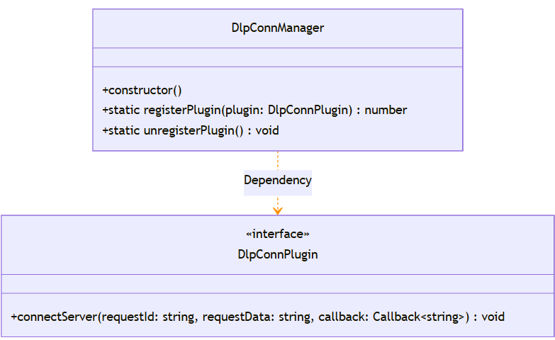

# @ohos.dlpPermission (DLP)
<!--Kit: Data Protection Kit-->
<!--Subsystem: Security-->
<!--Owner: @winnieHuYu-->
<!--Designer: @QRF-->
<!--Tester: @nacyli-->
<!--Adviser: @zengyawen-->
<!-- md-trans-meta sourceCommit=213f49839bb0df5a68c6a506716431423e2e8a3e translatedAt=2026-08-31T01:16:23.286Z pushedAt=2026-09-01T02:23:48.517Z -->

Data loss prevention (DLP) is a system solution provided to prevent data disclosure. This module provides APIs for cross-device file access management, encrypted storage, and access authorization. DLP protects sensitive files through encryption and generates encrypted files in .dlp format. When opening a DLP file, the system automatically creates an isolated DLP sandbox environment to ensure that the file content is not leaked to unauthorized environments. Fine-grained permission control is supported for enterprise DLP files, including management of permissions to view, edit, copy, print, and screen-record files.

**Use scenarios** 
- In enterprise office scenarios, protects sensitive documents from unauthorized access and leakage.
- In multi-device collaborative office scenarios, ensures secure document transfer across different devices.
- Document sharing and collaboration, implementing fine-grained permission control.

> **NOTE**
>
> - The initial APIs of this module are supported since API version 10. New APIs added in later versions are marked with a superscript to indicate their starting version.
> - The kit to which @ohos.dlpPermission belongs has been renamed from `DataLossPreventionKit` to `DataProtectionKit`. You are advised to use the new module name `@kit.DataProtectionKit` for module import. If `@kit.DataLossPreventionKit` is used for import, only the APIs before the renaming can be called, and new APIs are unavailable.

## Key Classes/Interfaces

### Core Enum Types
- **ActionFlagType**: Enumerates the flag types of executable operations on DLP files, used for fine-grained permission control.
- **DLPFileAccess**: Enumerates the authorization types of DLP files, defining the access level of files.
- **ActionType**: Enumerates the actions to be performed after file permission expiration.
- **AccountType**: Enumerates the authorized account types.

### Core API Types

- **CustomProperty**: Represents a custom policy, including the JSON string of the enterprise custom policy and the query options for enterprise DLP files.
- **DLPProperty**: Represents authorization-related information, including the permission setter account, the permission setter account ID, and the permission setter account type.
- **AuthUser**: Represents authorized user data, including the authorized user account, the authorized user account type, and the granted permissions.
- **DlpConnPlugin**: Interface for registering the cloud authentication callback capability, including the method for connecting to the server (Parameters: request identifier, request data, callback function).

### Core Callback Types

- **Callback\<AccessedDLPFileInfo>**: Callback for DLP file access information, used to listen for DLP file open events.
- **AsyncCallback\<DLPPermissionInfo>**: Asynchronous callback for DLP permission information, used to return the sandbox permission query result.
- **AsyncCallback\<Array\<RetentionSandboxInfo>>**: Asynchronous callback for the retained sandbox information list, used to return the sandbox query result.
- **AsyncCallback\<Array\<AccessedDLPFileInfo>>**: Asynchronous callback for the DLP file access record list, used to return the file access history.

### Core Classes

- **DlpConnManager**: core management class of the DLP system, which is used to register or unregister the callback capability in the system ability (SA).



## API Usage Relationship Description

| First call | Paired call | Description |
|---------|---------|------|
| on('openDLPFile', listener) | off('openDLPFile', listener) | Subscribes to the DLP file open event. Unsubscribe when the page is destroyed or no longer needed to release resources. |
| DlpConnManager.registerPlugin() | DlpConnManager.unregisterPlugin() | Registers callback capabilities in SA. Unregister the capabilities when the application exits or no longer needs them. |
| setRetentionState() | cancelRetentionState() | Sets the sandbox retained state to quickly reopen a file. Cancel the retention when it is no longer needed to release system resources. |
| setSandboxAppConfig() | cleanSandboxAppConfig() | Sets the custom configuration of a sandbox application. Clean up the configuration to restore the default state after use. |
| generateDlpFileForEnterprise() | decryptDlpFile() | Encrypts a plaintext file to generate an enterprise DLP file, or decrypts a DLP file back to a plaintext file. The two operations are inverse to each other. |
| setSandboxAppConfig() | getSandboxAppConfig() | After setting the sandbox configuration, verifies whether the configuration takes effect or reads the current configuration state through the query API. |
| isInSandbox() | getDLPPermissionInfo() | After determining that the current environment is a sandbox environment, calls the permission query API to obtain specific permission information to control application behavior. |
| isDLPFile() | getOriginalFileName() | After determining that a file is a DLP file, obtains the original file name to determine the file type and select an appropriate application to open it. |
| isDLPFeatureProvided() | generateDlpFileForEnterprise() or startDLPManagerForResult() | After confirming that the system supports the DLP encryption feature, calls the related functional APIs to avoid execution failure on unsupported devices. |

## Modules to Import

```ts
import { dlpPermission } from '@kit.DataProtectionKit';
```

## dlpPermission.isDLPFile

isDLPFile(fd: number): Promise&lt;boolean&gt;

Checks whether a file is a DLP file based on its file descriptor (fd). This API uses a promise to return the result.

In the file processing workflow, you need to first determine whether a file is a DLP file before deciding on the subsequent processing strategy (for example, whether to open it through the DLP sandbox).

**System capability:** SystemCapability.Security.DataLossPrevention

**Parameters**

| Name | Type | Mandatory | Description |
| -------- | -------- | -------- | -------- |
| fd | number | Yes | FD (file descriptor) of the file to query. The value range is [0, 2<sup>31</sup>-1]. If fd is less than 0, error code 19100001 is thrown. If fd is greater than 2<sup>31</sup>-1, the value is truncated. |

**Return value**
| Type | Description |
| -------- | -------- |
| Promise&lt;boolean&gt; | Promise object. The value true indicates that the file is a DLP file, and the value false indicates that the file is not a DLP file. |

**Error codes**

For details about the error codes, see [Universal Error Codes](../errorcode-universal.md) and [DLP Service Error Codes](errorcode-dlp.md).

| error code ID | error message |
| -------- | -------- |
| 401 | Parameter error. Possible causes: 1. Mandatory parameters are left unspecified. 2. Incorrect parameter types. |
| 19100001 | Invalid parameter value. |
| 19100011 | The system ability works abnormally. |

**Example**

```ts
import { dlpPermission } from '@kit.DataProtectionKit';
import { fileIo } from '@kit.CoreFileKit';

let uri = 'file://docs/storage/Users/currentUser/Documents/test.txt.dlp';
let file: number | undefined = undefined;
file = fileIo.openSync(uri).fd;
dlpPermission.isDLPFile(file).then((isDLPFile: boolean) => {
    console.info(JSON.stringify(isDLPFile));
}).catch((error: BusinessError) => {
    console.error(`Failed to check if file is DLP file. Code: ${error.code}, message: ${error.message}`);
}).finally(() => {
    if (file !== undefined) {
        fileIo.closeSync(file);
    }
});
```

## dlpPermission.isDLPFile

isDLPFile(fd: number, callback: AsyncCallback&lt;boolean&gt;): void

Queries whether a file is a DLP file based on its file descriptor (fd). Returns the query result upon successful call. The value **true** indicates that the file is a DLP file, and **false** indicates that it is not. This API uses an asynchronous callback to return the result.

In the file processing workflow, you need to first determine whether a file is a DLP file before deciding on the subsequent processing strategy (for example, whether to open it through the DLP sandbox).

**System capability:** SystemCapability.Security.DataLossPrevention

**Parameters**

| Name | Type | Mandatory | Description |
| -------- | -------- | -------- | -------- |
| fd | number | Yes | FD (file descriptor) of the file to query. The value range is [0, 2<sup>31</sup>-1]. If fd is less than 0, error code 19100001 is thrown. If fd is greater than 2<sup>31</sup>-1, the value is truncated. |
| callback | AsyncCallback&lt;boolean&gt; | Yes | Callback invoked to return the query result. The callback parameters include err (error object, which is undefined when the query succeeds) and res (query result, where true indicates a DLP file and false indicates a non-DLP file). |

**Error codes**

For details about the error codes, see [Universal Error Codes](../errorcode-universal.md) and [DLP Service Error Codes](errorcode-dlp.md).

| Error Code ID | Error Message |
| -------- | -------- |
| 401 | Parameter error. Possible causes: 1. Mandatory parameters are left unspecified. 2. Incorrect parameter types. |
| 19100001 | Invalid parameter value. |
| 19100011 | The system ability works abnormally. |

**Example**

```ts
import { dlpPermission } from '@kit.DataProtectionKit';
import { fileIo } from '@kit.CoreFileKit';

let uri = "file://docs/storage/Users/currentUser/Desktop/test.txt.dlp";
let file: number | undefined = undefined;
file = fileIo.openSync(uri).fd;
dlpPermission.isDLPFile(file, (err, isDLPFile) => {
 if (err) {
    console.error(`Failed to check if file is DLP file. Code: ${err.code}, message: ${err.message}`);
  } else {
    console.info('isDLPFile:', isDLPFile);
  }
  fileIo.closeSync(file);
});
```

## dlpPermission.getDLPPermissionInfo

getDLPPermissionInfo(): Promise&lt;DLPPermissionInfo&gt;

Queries the permission information of the current DLP sandbox, including the file authorization type and executable operations (such as viewing, editing, and copying). This API can only be called in a DLP sandbox app. This API uses a promise to return the result.

You are advised to call [isInSandbox](#dlppermissionisinsandbox) first to check whether the current environment is a sandbox environment.

When processing files in a DLP sandbox, you can use the permission information to determine which operations the current user can perform, thereby avoiding calls to unauthorized features.

**System capability:** SystemCapability.Security.DataLossPrevention

**Return value**

| Type | Description |
| -------- | -------- |
| Promise&lt;[DLPPermissionInfo](#dlppermissioninfo)&gt; | Promise object. Returns the permission information of the queried DLP file. No exception indicates a successful query. |

**Error codes**

For details about the error codes, see [DLP Error Codes](errorcode-dlp.md).

| error code ID | error message |
| -------- | -------- |
| 19100001 | Invalid parameter value. |
| 19100006 | No permission to call this API, which is available only for DLP sandbox applications. |
| 19100011 | The system ability works abnormally. |

**Example**

```ts
import { dlpPermission } from '@kit.DataProtectionKit';

dlpPermission.isInSandbox().then(async (inSandbox) => { // Whether the current environment is a sandbox environment.
  if (inSandbox) {
    dlpPermission.getDLPPermissionInfo().then((permissionInfo: dlpPermission.DLPPermissionInfo) => {
      console.info('permissionInfo', JSON.stringify(permissionInfo));
    }).catch((error: BusinessError)=> {
      console.error(`Failed to get DLP permission info. Code: ${error.code}, message: ${error.message}`);
    });
  }
});
```

## dlpPermission.getDLPPermissionInfo

getDLPPermissionInfo(callback: AsyncCallback&lt;DLPPermissionInfo&gt;): void

Obtains the permission information of this DLP file. The returned permission information includes permissions on the file and operations that can be performed (such as viewing, editing, and copying). This API can be called only in DLP sandbox applications. This API uses an asynchronous callback to return the result.

When processing files in a DLP sandbox, you can use the permission information to determine which operations the current user can perform, thereby avoiding calls to unauthorized features.

**System capability:** SystemCapability.Security.DataLossPrevention

**Parameters**

| Parameter | Type | Mandatory | Description |
| -------- | -------- | -------- | -------- |
| callback | AsyncCallback&lt;[DLPPermissionInfo](#dlppermissioninfo)&gt; | Yes | Callback function. If err is undefined, the query succeeds; otherwise, it is an error object. |

**Error codes:**

For details about the error codes, see [Universal Error Codes](../errorcode-universal.md) and [DLP Service Error Codes](errorcode-dlp.md).

| Error Code ID | Error Message |
| -------- | -------- |
| 401 | Parameter error. Possible causes: 1. Incorrect parameter types. |
| 19100001 | Invalid parameter value. |
| 19100006 | No permission to call this API, which is available only for DLP sandbox applications. |
| 19100011 | The system ability works abnormally. |

**Example**

```ts
import { dlpPermission } from '@kit.DataProtectionKit';

dlpPermission.isInSandbox().then((inSandbox) => { // Whether it is in the sandbox.
  if (inSandbox) {
    dlpPermission.getDLPPermissionInfo((err, permissionInfo) => { 
      if (err) {
        console.error(`Failed to get DLP permission info. Code: ${err.code}, message: ${err.message}`);
      } else {
        console.info('permissionInfo', JSON.stringify(permissionInfo));
      }
    }); // Obtain the permission information.
  }
});
```

## dlpPermission.getOriginalFileName

getOriginalFileName(fileName: string): string

Obtains the original file name of a specified DLP file. This API is a synchronous interface.

Determines the file type based on the original file name extension, and selects the corresponding app to open it.

**System capability:** SystemCapability.Security.DataLossPrevention

**Parameters**

| Name | Type | Mandatory | Description |
| -------- | -------- | -------- | -------- |
| fileName | string | Yes | DLP file name to query. The length cannot exceed 255 bytes. If the value is out of range, error code 401 is thrown. |

**Return value**

| Type | Description |
| -------- | -------- |
| string | Original file name of the DLP file. For example, if the DLP file name is test.txt.dlp, the original file name returned is test.txt. The length cannot exceed 255 bytes. |

**Error codes**

For details about the error codes, see [DLP Error Codes](errorcode-dlp.md).

| Error code ID | Error message |
| -------- | -------- |
| 19100001 | Invalid parameter value. |
| 19100011 | The system ability works abnormally. |

**Example**

```ts
import { dlpPermission } from '@kit.DataProtectionKit';

let originalFileName = dlpPermission.getOriginalFileName('test.txt.dlp'); // Obtain the original file name.
console.info('originalFileName:', originalFileName);
```

## dlpPermission.getDLPSuffix

getDLPSuffix(): string

Obtains the DLP file extension. After a successful call, returns the DLP file extension (for example, '.dlp'). This API is a synchronous API.

Used to obtain the standard extension of a DLP file, facilitating DLP file name construction or file type determination.

**System capability:** SystemCapability.Security.DataLossPrevention

**Return value**

| Type | Description |
| -------- | -------- |
| string | DLP file extension. For example, if the original file is "test.txt", the encrypted DLP file is named "test.txt.dlp", and the returned extension is ".dlp". |

**Error code**

For details about the error codes, see [DLP Error Codes](errorcode-dlp.md).

| error code ID | error message |
| -------- | -------- |
| 19100011 | The system ability works abnormally. |

**Example**

```ts
import { dlpPermission } from '@kit.DataProtectionKit';

let dlpSuffix = dlpPermission.getDLPSuffix(); // Obtain the DLP extension.
console.info('dlpSuffix:', dlpSuffix);
```

## dlpPermission.on('openDLPFile')

on(type: 'openDLPFile', listener: Callback&lt;AccessedDLPFileInfo&gt;): void

Subscribes to the opening of a DLP file. After a successful call, when a DLP file is opened, a callback is triggered to notify the current app. This API can only be called in a non-DLP sandbox app.

You can subscribe to this event when your application needs to perform specific operations (such as logging and updating the UI) after a DLP file is opened.

**System capability:** SystemCapability.Security.DataLossPrevention

**Parameters**

| Name | Type | Mandatory | Description |
| -------- | -------- | -------- | -------- |
| type | 'openDLPFile' | Yes | Type of the event to listen for. The value is fixed at 'openDLPFile', which indicates the DLP file open event. |
| listener | Callback&lt;[AccessedDLPFileInfo](#accesseddlpfileinfo)&gt; | Yes | Callback for the DLP file open event. Notifies the current application when a DLP file is opened by a sandbox application of the current application. |

**Error codes**

For details about the error codes, see [Universal Error Codes](../errorcode-universal.md) and [DLP Service Error Codes](errorcode-dlp.md).

| Error code ID | Error message |
| -------- | -------- |
| 401 | Parameter error. Possible causes: 1. Mandatory parameters are left unspecified. 2. Incorrect parameter types. 3. Parameter verification failed. |
| 19100001 | Invalid parameter value. |
| 19100007 | No permission to call this API, which is available only for non-DLP sandbox applications. |
| 19100011 | The system ability works abnormally. |

**Example**

```ts
import { dlpPermission } from '@kit.DataProtectionKit';

dlpPermission.on('openDLPFile', (info: dlpPermission.AccessedDLPFileInfo) => {
  console.info('openDlpFile event', info.uri, info.lastOpenTime);
}); // Register the DLP file open event listener.
```

## dlpPermission.off('openDLPFile')

off(type: 'openDLPFile', listener?: Callback&lt;AccessedDLPFileInfo&gt;): void

Unsubscribes from the DLP file open event. This API can only be called in a non-DLP sandbox app. After a successful call, notifications of DLP file open events will no longer be received.

This API is typically called when a page is destroyed or when listening is no longer needed, to release resources.

**System capability:** SystemCapability.Security.DataLossPrevention

**Parameters**
| Name | Type | Mandatory | Description |
| -------- | -------- | -------- | -------- |
| type | 'openDLPFile' | Yes | Type of the event to listen for. The value is fixed at 'openDLPFile', which indicates the DLP file open event. |
| listener | Callback&lt;[AccessedDLPFileInfo](#accesseddlpfileinfo)&gt; | No | Callback for the DLP file open event. Pass this parameter (the callback function registered previously) when you need to cancel a specific callback. Leave this parameter unspecified when you need to cancel all callbacks. If not passed, the default is empty, and all callbacks of this type of event are canceled.  |

**Error codes**

For details about the error codes, see [Universal Error Codes](../errorcode-universal.md) and [DLP Service Error Codes](errorcode-dlp.md).

| Error code ID | Error message |
| -------- | -------- |
| 401 | Parameter error. Possible causes: 1. Mandatory parameters are left unspecified. 2. Incorrect parameter types. 3. Parameter verification failed. |
| 19100001 | Invalid parameter value. |
| 19100007 | No permission to call this API, which is available only for non-DLP sandbox applications. |
| 19100011 | The system ability works abnormally. |

**Example**

```ts
import { dlpPermission } from '@kit.DataProtectionKit';

dlpPermission.off('openDLPFile', (info: dlpPermission.AccessedDLPFileInfo) => {
  console.info('openDlpFile event', info.uri, info.lastOpenTime);
}); // Unsubscribe.
```

## dlpPermission.isInSandbox

isInSandbox(): Promise&lt;boolean&gt;

Checks whether the current app is running in a DLP sandbox environment. This API uses a promise to return the result.

This API is used to determine whether the current app is in a DLP sandbox environment, so as to decide whether to perform sandbox-related operations or call sandbox-specific APIs.

**System capability:** SystemCapability.Security.DataLossPrevention

**Return value**

| Type | Description |
| -------- | -------- |
| Promise&lt;boolean&gt; | Promise object. The value **true** indicates that the current application is running in the sandbox, and **false** indicates that the current application is not running in the sandbox. |

**Error Codes**

For details about the error codes, see [DLP Error Codes](errorcode-dlp.md).

| error code ID | error message |
| -------- | -------- |
| 19100001 | Invalid parameter value. |
| 19100011 | The system ability works abnormally. |

**Example**

```ts
import { dlpPermission } from '@kit.DataProtectionKit';

dlpPermission.isInSandbox().then((isInSandbox) => { // Whether the application is in the sandbox.
  console.info('isInSandbox', isInSandbox);
}).catch((error: BusinessError)=> {
  console.error(JSON.stringify(error));
});
```

## dlpPermission.isInSandbox

isInSandbox(callback: AsyncCallback&lt;boolean&gt;): void

Queries whether the current app is running in a DLP sandbox environment. This API uses an asynchronous callback to return the result.

This API is used to determine whether the current app is in a DLP sandbox environment, so as to decide whether to perform sandbox-related operations or call sandbox-specific APIs.

**System capability:** SystemCapability.Security.DataLossPrevention

**Parameters**

| Name | Type | Mandatory | Description |
| -------- | -------- | -------- | -------- |
| callback | AsyncCallback&lt;boolean&gt; | Yes | Callback function used to return the result. If err is undefined, the query succeeds; otherwise, err is an error object. The value true indicates that the current application is running in the sandbox, and false indicates that the current application is not running in the sandbox. |

**Error codes**

For details about the error codes, see [Universal Error Codes](../errorcode-universal.md) and [DLP Service Error Codes](errorcode-dlp.md).

| error code ID | error message |
| -------- | -------- |
| 401 | Parameter error. Possible causes: 1. Incorrect parameter types. |
| 19100001 | Invalid parameter value. |
| 19100011 | The system ability works abnormally. |

**Example**

```ts
import { dlpPermission } from '@kit.DataProtectionKit';

dlpPermission.isInSandbox((err, isInSandbox) => {
  if (err) {
    console.error(`Failed to check sandbox status. Code: ${err.code}, message: ${err.message}`);
  } else {
    console.info('isInSandbox:', JSON.stringify(isInSandbox));
  }
}); // Check whether the application is running in a sandbox.
```

## dlpPermission.getDLPSupportedFileTypes

getDLPSupportedFileTypes(): Promise&lt;Array&lt;string&gt;&gt;

Queries the list of file extension types that support permission setting and verification. Upon successful invocation, returns the list of supported file types, which can be used to determine which file types can be managed with DLP permission. This API uses a promise to return the result.

This API is used to obtain the list of file types that support DLP permission management, so as to determine whether the current file can be encrypted.

**System capability:** SystemCapability.Security.DataLossPrevention

**Return value**

| Type | Description |
| -------- | -------- |
| Promise&lt;Array&lt;string&gt;&gt; | Promise object. Returns the list of file extension types that can support permission setting and verification. |

**Error codes**

For details about the error codes, see [DLP Error Codes](errorcode-dlp.md).

| error code ID | error message |
| -------- | -------- |
| 19100001 | Invalid parameter value. |
| 19100011 | The system ability works abnormally. |

**Example**

```ts
import { dlpPermission } from '@kit.DataProtectionKit';

dlpPermission.getDLPSupportedFileTypes().then((fileTypes) => { // Obtain the file types that support DLP.
  console.info('fileTypes', JSON.stringify(fileTypes));
}).catch((error: BusinessError)=> {
  console.error(JSON.stringify(error));
});
```

## dlpPermission.getDLPSupportedFileTypes

getDLPSupportedFileTypes(callback: AsyncCallback&lt;Array&lt;string&gt;&gt;): void

Queries the list of file extension types that support permission setting and verification. Upon successful call, returns the list of supported file types, which can be used to determine which file types can be managed with DLP permission. This API uses an asynchronous callback to return the result.

This API is used to obtain the list of file types that support DLP permission management, so as to determine whether the current file can be encrypted.

**System capability:** SystemCapability.Security.DataLossPrevention

**Parameters**

| Name | Type | Mandatory | Description |
| -------- | -------- | -------- | -------- |
| callback | AsyncCallback&lt;Array&lt;string&gt;&gt; | Yes | Callback function. If err is undefined, the query succeeds; otherwise, err is an error object. |

**Error codes**

For details about the error codes, see [Universal Error Codes](../errorcode-universal.md) and [DLP Service Error Codes](errorcode-dlp.md).

| error code ID | error message |
| -------- | -------- |
| 401 | Parameter error. Possible causes: 1. Incorrect parameter types. |
| 19100001 | Invalid parameter value. |
| 19100011 | The system ability works abnormally. |

**Example**

```ts
import { dlpPermission } from '@kit.DataProtectionKit';

dlpPermission.getDLPSupportedFileTypes((err, fileTypes) => {
  if (err) {
    console.error(`Failed to get DLP supported file types. Code: ${err.code}, message: ${err.message}`);
  } else {
    console.info('fileTypes', JSON.stringify(fileTypes));
  }
}); // Obtain the file types that support DLP.
```

## dlpPermission.setRetentionState

setRetentionState(docUris: Array&lt;string&gt;): Promise&lt;void&gt;

Sets the retention state of a DLP sandbox. By default, when a DLP file is opened, the system automatically creates a sandbox environment, and the sandbox is automatically destroyed when the file is closed. After the retention state is set, the sandbox environment is retained even after the DLP file is closed, facilitating quick reopening of the same DLP file. This is suitable for scenarios where the same DLP file needs to be operated frequently, improving file open efficiency. This API can only be called in a DLP sandbox app. This API uses a promise to return the result.

**System capability:** SystemCapability.Security.DataLossPrevention

**Parameters**

| Name | Type | Mandatory | Description |
| -------- | -------- | -------- | -------- |
| docUris | Array&lt;string&gt; | Yes | List of file URIs for which the retained state needs to be set. The length of the array is not limited. Each string cannot exceed 4095 bytes. If the value is out of range, error code 401 is thrown. |

**Return value**

| Type | Description |
| -------- | -------- |
| Promise&lt;void&gt; | Promise object. A Promise object that returns no value. |

**Error codes**

For details about the error codes, see [Universal Error Codes](../errorcode-universal.md) and [DLP Service Error Codes](errorcode-dlp.md).

| Error code ID | Error message |
| -------- | -------- |
| 401 | Parameter error. Possible causes: 1. Mandatory parameters are left unspecified. 2. Incorrect parameter types. |
| 19100001 | Invalid parameter value. |
| 19100006 | No permission to call this API, which is available only for DLP sandbox applications. |
| 19100011 | The system ability works abnormally. |

**Example**

```ts
import { dlpPermission } from '@kit.DataProtectionKit';

let uri = "file://docs/storage/Users/currentUser/Desktop/test.txt.dlp";
dlpPermission.isInSandbox().then(async (inSandbox) => {
  if (inSandbox) {
    await dlpPermission.setRetentionState([uri]); // Set the sandbox to be retained.
  }
}).catch((error: BusinessError)=> {
  console.error(JSON.stringify(error));
}); // Whether the file is in the sandbox.
```

## dlpPermission.setRetentionState

setRetentionState(docUris: Array&lt;string&gt;, callback: AsyncCallback&lt;void&gt;): void

Sets the retention state of the DLP sandbox. By default, the system automatically creates a sandbox environment when a DLP file is opened and automatically destroys the sandbox when the file is closed. After the retention state is set, the sandbox environment is retained even after the DLP file is closed, facilitating quick reopening of the same DLP file. This is suitable for scenarios where the same DLP file needs to be operated frequently, improving file open efficiency. This API can be called only in a DLP sandbox app. This API uses an asynchronous callback to return the result.

**System capability:** SystemCapability.Security.DataLossPrevention

**Parameters**

| Name | Type | Mandatory | Description |
| -------- | -------- | -------- | -------- |
| docUris | Array&lt;string&gt; | Yes | Indicates the list of file URIs for which the retained state needs to be set. The length of the array is not limited. Each string cannot exceed 4095 bytes; otherwise, error code 401 is thrown. |
| callback | AsyncCallback&lt;void&gt; | Yes | Callback function. If err is undefined, the setting is successful; otherwise, it is an error object. |

**Error codes**

For details about the error codes, see [Universal Error Codes](../errorcode-universal.md) and [DLP Service Error Codes](errorcode-dlp.md).

| Error Code ID | Error Message |
| -------- | -------- |
| 401 | Parameter error. Possible causes: 1. Mandatory parameters are left unspecified. 2. Incorrect parameter types. |
| 19100001 | Invalid parameter value. |
| 19100006 | No permission to call this API, which is available only for DLP sandbox applications. |
| 19100011 | The system ability works abnormally. |

**Example**

```ts
import { dlpPermission } from '@kit.DataProtectionKit';

let uri = "file://docs/storage/Users/currentUser/Desktop/test.txt.dlp";
dlpPermission.isInSandbox().then((inSandbox) => { // Whether the application is running in a sandbox.
  if (inSandbox) {
    dlpPermission.setRetentionState([uri], (err) => {
      if (err) {
        console.error(`Failed to set retention state. Code: ${err.code}, message: ${err.message}`);
      } else {
        console.info('setRetentionState success');
      }
    }); // Set the sandbox retention state.
  }
}).catch((error: BusinessError)=> {
  console.error(JSON.stringify(error));
});
```

## dlpPermission.cancelRetentionState

cancelRetentionState(docUris: Array&lt;string&gt;): Promise&lt;void&gt;

Cancels the sandbox retention state, that is, allows the sandbox application to be automatically uninstalled when the DLP file is closed. This API uses a promise to return the result.

This API is used to cancel the sandbox retained state and restore the default behavior to release system resources. It is suitable for scenarios where DLP files are no longer frequently accessed.

**System capability:** SystemCapability.Security.DataLossPrevention

**Parameters**

| Name | Type | Mandatory | Description |
| -------- | -------- | -------- | -------- |
| docUris | Array&lt;string&gt; | Yes | List of file URIs whose retained state is to be canceled. The array length is not limited. The length of each string cannot exceed 4095 bytes. If the length is out of range, error code 401 is thrown. |

**Return value**

| Type | Description |
| -------- | -------- |
| Promise&lt;void&gt; | Promise that returns no value. |

**Error codes**

For details about the error codes, see [Universal Error Codes](../errorcode-universal.md) and [DLP Service Error Codes](errorcode-dlp.md).

| Error code ID | Error message |
| -------- | -------- |
| 401 | Parameter error. Possible causes: 1. Mandatory parameters are left unspecified. 2. Incorrect parameter types. |
| 19100001 | Invalid parameter value. |
| 19100011 | The system ability works abnormally. |

**Example**

```ts
import { dlpPermission } from '@kit.DataProtectionKit';

let uri = "file://docs/storage/Users/currentUser/Desktop/test.txt.dlp";
dlpPermission.cancelRetentionState([uri]).then(() => { // Cancel the sandbox retention.
  console.info('success!');
}).catch((error: BusinessError)=> {
  console.error(JSON.stringify(error));
});
```

## dlpPermission.cancelRetentionState

cancelRetentionState(docUris: Array&lt;string&gt;, callback: AsyncCallback&lt;void&gt;): void

Cancels the sandbox retention state, that is, restores the policy of automatically unloading the sandbox when a DLP file is closed. This API uses an asynchronous callback to return the result.

This API is used to cancel the sandbox retained state and restore the default behavior to release system resources. It is suitable for scenarios where DLP files are no longer frequently accessed.

**System capability:** SystemCapability.Security.DataLossPrevention

**Parameters**

| Name | Type | Mandatory | Description |
| -------- | -------- | -------- | -------- |
| docUris | Array&lt;string&gt; | Yes | URIs of the files to be canceled with the retention state. The length of the array is not limited. Each string contains a maximum of 4095 bytes. If the string is out of range, error code 401 is thrown. |
| callback | AsyncCallback&lt;void&gt; | Yes | Callback used to return the result. If the cancellation is successful, **err** is **undefined**. Otherwise, **err** is an error object. |

**Error codes**

For details about the error codes, see [Universal Error Codes](../errorcode-universal.md) and [DLP Service Error Codes](errorcode-dlp.md).

| Error Code ID | Error Message |
| -------- | -------- |
| 401 | Parameter error. Possible causes: 1. Mandatory parameters are left unspecified. 2. Incorrect parameter types. |
| 19100001 | Invalid parameter value. |
| 19100011 | The system ability works abnormally. |

**Example**

```ts
import { dlpPermission } from '@kit.DataProtectionKit';

let uri = "file://docs/storage/Users/currentUser/Desktop/test.txt.dlp";
dlpPermission.cancelRetentionState([uri], (err, res) => {
  if (err) {
    console.error(`Failed to cancel retention state. Code: ${err.code}, message: ${err.message}`);
  } else {
    console.info('cancelRetentionState success');
  }
}); // Cancel the sandbox retention state.
```

## dlpPermission.getRetentionSandboxList

getRetentionSandboxList(bundleName?: string): Promise&lt;Array&lt;RetentionSandboxInfo&gt;&gt;

Queries the list of retained sandbox information for a specified app. This API can be called only in a non-DLP sandbox app. This API uses a promise to return the result.

This API is used to query the retained sandbox list of a specified app, so as to view or manage the sandbox environments currently in the retained state.

**System capability:** SystemCapability.Security.DataLossPrevention

**Parameters**

| Name | Type | Mandatory | Description |
| -------- | -------- | -------- | -------- |
| bundleName | string | No | App bundle name, used to query the retained sandbox information list of the specified app. Pass this parameter when querying the retained sandbox information of another app; omit this parameter when querying the retained sandbox information of the current app. The length ranges from 7 to 128 bytes. If the length is out of this range, error code 401 is thrown. |

**Return value**

| Type | Description |
| -------- | -------- |
| Promise&lt;Array&lt;[RetentionSandboxInfo](#retentionsandboxinfo)&gt;&gt; | Promise object. Returns the queried sandbox information list. |

**Error codes**

For details about the error codes, see [Universal Error Codes](../errorcode-universal.md) and [DLP Service Error Codes](errorcode-dlp.md).

| Error Code ID | Error Message |
| -------- | -------- |
| 401 | Parameter error. Possible causes: 1. Incorrect parameter types. |
| 19100001 | Invalid parameter value. |
| 19100007 | No permission to call this API, which is available only for non-DLP sandbox applications. |
| 19100011 | The system ability works abnormally. |

**Example**

```ts
import { dlpPermission } from '@kit.DataProtectionKit';

dlpPermission.getRetentionSandboxList().then((sandboxList) => { // Obtain the retained sandbox list.
  console.info('sandboxList', JSON.stringify(sandboxList));
}).catch((error: BusinessError)=> {
  console.error(JSON.stringify(error));
});
```

## dlpPermission.getRetentionSandboxList

getRetentionSandboxList(bundleName: string, callback: AsyncCallback&lt;Array&lt;RetentionSandboxInfo&gt;&gt;): void

Queries the list of retained sandbox information for a specified app. This API can only be called in a non-DLP sandbox app. This API uses an asynchronous callback to return the result.

This API is used to query the retained sandbox list of a specified app, so as to view or manage the sandbox environments currently in the retained state.

**System capability:** SystemCapability.Security.DataLossPrevention

**Parameters**

| Name | Type | Mandatory | Description |
| -------- | -------- | -------- | -------- |
| bundleName | string | Yes | Bundle name of the specified application, used to query the retention sandbox information list of the application. The length ranges from 7 to 128 bytes. If the value is out of range, error code 401 is thrown. |
| callback | AsyncCallback&lt;Array&lt;[RetentionSandboxInfo](#retentionsandboxinfo)&gt;&gt; | Yes | Callback function. If err is undefined, the query succeeds; otherwise, it is an error object. |

**Error codes**

For details about the error codes, see [Universal Error Codes](../errorcode-universal.md) and [DLP Service Error Codes](errorcode-dlp.md).

| Error Code ID | Error Message |
| -------- | -------- |
| 401 | Parameter error. Possible causes: 1. Incorrect parameter types. |
| 19100001 | Invalid parameter value. |
| 19100007 | No permission to call this API, which is available only for non-DLP sandbox applications. |
| 19100011 | The system ability works abnormally. |

**Example**

```ts
import { dlpPermission } from '@kit.DataProtectionKit';

dlpPermission.getRetentionSandboxList('bundleName', (err, sandboxList) => {
  if (err) {
    console.error(`Failed to get retention sandbox list. Code: ${err.code}, message: ${err.message}`);
  } else {
    console.info('sandboxList', JSON.stringify(sandboxList));
  }
}); // Obtain the sandbox retention information.
```

## dlpPermission.getRetentionSandboxList

getRetentionSandboxList(callback: AsyncCallback&lt;Array&lt;RetentionSandboxInfo&gt;&gt;): void

Queries the retention sandbox information list of the current app. This API uses an asynchronous callback to return the result.

This API is used to query the sandbox retention information of the current application, so that the sandbox environment in the retention state can be checked or managed. This API can be called only in non-DLP sandbox applications.

**System capability:** SystemCapability.Security.DataLossPrevention

**Parameters**

| Name | Type | Mandatory | Description |
| -------- | -------- | -------- | -------- |
| callback | AsyncCallback&lt;Array&lt;[RetentionSandboxInfo](#retentionsandboxinfo)&gt;&gt; | Yes | Callback function. If err is undefined, the query succeeds; otherwise, err is an error object. |

**Error codes**

For details about the error codes, see [Universal Error Codes](../errorcode-universal.md) and [DLP Service Error Codes](errorcode-dlp.md).

| error code ID | error message |
| -------- | -------- |
| 401 | Parameter error. Possible causes: 1. Incorrect parameter types. |
| 19100001 | Invalid parameter value. |
| 19100007 | No permission to call this API, which is available only for non-DLP sandbox applications. |
| 19100011 | The system ability works abnormally. |

**Example**

```ts
import { dlpPermission } from '@kit.DataProtectionKit';

dlpPermission.getRetentionSandboxList((err, retentionSandboxList) => {
  if (err) {
    console.error(`Failed to get retention sandbox list. Code: ${err.code}, message: ${err.message}`);
  } else {
    console.info('retentionSandboxList', JSON.stringify(retentionSandboxList));
  }
}); // Obtain the sandbox retention information.
```

## dlpPermission.getDLPFileAccessRecords

getDLPFileAccessRecords(): Promise&lt;Array&lt;AccessedDLPFileInfo&gt;&gt;

Queries the list of recently accessed DLP files. Upon successful invocation, file access records are returned for tracking and managing DLP file usage. This API can be called only in non-DLP sandbox apps. This API uses a promise to return the result.

This API is used to obtain the list of recently accessed DLP file records, facilitating audit tracking and file usage management.

**System capability:** SystemCapability.Security.DataLossPrevention

**Return value**

| Type | Description |
| -------- | -------- |
| Promise&lt;Array&lt;[AccessedDLPFileInfo](#accesseddlpfileinfo)&gt;&gt; | Promise object. Returns the list of recently accessed DLP files. |

**Error codes**

For details about the error codes, see [DLP Error Codes](errorcode-dlp.md).

| error code ID | error message |
| -------- | -------- |
| 19100001 | Invalid parameter value. |
| 19100007 | No permission to call this API, which is available only for non-DLP sandbox applications. |
| 19100011 | The system ability works abnormally. |

**Example**

```ts
import { dlpPermission } from '@kit.DataProtectionKit';

dlpPermission.getDLPFileAccessRecords().then((accessRecords) => { // Obtain the DLP access list.
  console.info('accessRecords', JSON.stringify(accessRecords));
}).catch((error: BusinessError)=> {
  console.error(JSON.stringify(error));
});
```

## dlpPermission.getDLPFileAccessRecords

getDLPFileAccessRecords(callback: AsyncCallback&lt;Array&lt;AccessedDLPFileInfo&gt;&gt;): void

Obtains the list of DLP files that are accessed recently. After the API is successfully called, the file access records are returned, which can be used to track and manage the usage of DLP files. This API can be called only in non-DLP sandbox applications. This API uses a promise to return the result.

This API is used to obtain the list of recently accessed DLP file records, facilitating audit tracking and file usage management.

**System capability:** SystemCapability.Security.DataLossPrevention

**Parameters**

| Name | Type | Mandatory | Description |
| -------- | -------- | -------- | -------- |
| callback | AsyncCallback&lt;Array&lt;[AccessedDLPFileInfo](#accesseddlpfileinfo)&gt;&gt; | Yes | Callback function. If err is undefined, the query succeeds; otherwise, it is an error object. |

**Error codes**

For details about the error codes, see [Universal Error Codes](../errorcode-universal.md) and [DLP Service Error Codes](errorcode-dlp.md).

| error code ID | error message |
| -------- | -------- |
| 401 | Parameter error. Possible causes: 1. Incorrect parameter types. |
| 19100001 | Invalid parameter value. |
| 19100007 | No permission to call this API, which is available only for non-DLP sandbox applications. |
| 19100011 | The system ability works abnormally. |

**Example**

```ts
import { dlpPermission } from '@kit.DataProtectionKit';

dlpPermission.getDLPFileAccessRecords((err, accessRecords) => {
  if (err) {
    console.error(`Failed to get DLP file access records. Code: ${err.code}, message: ${err.message}`);
  } else {
    console.info('accessRecords', JSON.stringify(accessRecords));
  }
}); // Obtain the list of recently accessed DLP files.
```

## dlpPermission.startDLPManagerForResult<sup>11+</sup>

startDLPManagerForResult(context: common.UIAbilityContext, want: Want): Promise&lt;DLPManagerResult&gt;

Opens the DLP permission management app in borderless mode on the current [UIAbility](../apis-ability-kit/js-apis-app-ability-uiAbility.md#uiability) page. This API uses a promise to return the result.

This API is used to start the DLP permission management app to configure file permissions and return the user operation result to the caller.

> **NOTE**
>
> This API is supported only for domain account calls.

**Model restriction:** This API can be used only in the stage model.

**System capability:** SystemCapability.Security.DataLossPrevention

**Parameters**

| Name | Type | Mandatory | Description |
| -------- | -------- | -------- | -------- |
| context | [common.UIAbilityContext](../apis-ability-kit/js-apis-inner-application-uiAbilityContext.md) | Yes | Context of the current [UIAbility](../apis-ability-kit/js-apis-app-ability-uiAbility.md#uiability). |
| want | [Want](../apis-ability-kit/js-apis-app-ability-want.md) | Yes | Request object, which must contain the uri and displayName fields. |

**Return value**

| Type | Description |
| -------- | -------- |
| Promise&lt;[DLPManagerResult](#dlpmanagerresult11)&gt; | Promise object. Result returned after the DLP permission management application is opened and exited. |

**Error codes**

For details about the error codes, see [Universal Error Codes](../errorcode-universal.md) and [DLP Service Error Codes](errorcode-dlp.md).

| Error Code ID | Error Message |
| -------- | -------- |
| 401 | Parameter error. Possible causes: 1. Mandatory parameters are left unspecified. 2. Incorrect parameter types. |
| 19100001 | Invalid parameter value. |
| 19100011 | The system ability works abnormally. |
| 19100016 | The uri field is missing in the want parameter. |
| 19100017 | The displayName field is missing in the want parameter. |

**Example**

```ts
import { dlpPermission } from '@kit.DataProtectionKit';
import { common, Want } from '@kit.AbilityKit';
import { UIContext } from '@kit.ArkUI';

let context = new UIContext().getHostContext() as common.UIAbilityContext; // Obtain the current UIAbilityContext.
if (context !== undefined) {
    let want: Want = {
        "uri": "file://docs/storage/Users/currentUser/Desktop/1.txt",
        "parameters": {
        "displayName": "1.txt"
        }
    }; // Construct the request parameters, which must contain the file uri and displayName.
    dlpPermission.startDLPManagerForResult(context, want).then((res) => {
        console.info('res.resultCode', res.resultCode);
        console.info('res.want', JSON.stringify(res.want));
    }); // Open the DLP permission management application.
}
```

## dlpPermission.setSandboxAppConfig<sup>11+</sup>
setSandboxAppConfig(configInfo: string): Promise&lt;void&gt;

Sets the configuration information of the sandbox application. The configuration information is in JSON string format and can be set by the application. After the API is successfully called, the sandbox application runs based on the configuration information. This API uses a promise to return the result. This API can be called only in non-DLP sandbox applications.

This API is used to set the configuration information of the sandbox app so that the app can pass custom parameters as needed.

**System capability:** SystemCapability.Security.DataLossPrevention

**Parameters**

| Name | Type | Mandatory | Description |
| -------- | -------- | -------- | -------- |
| configInfo | string | Yes | Sandbox application configuration information. The length cannot exceed 2<sup>22</sup>-1 bytes. If the length is out of range, error code 401 is thrown. |

**Return value**

| Type | Description |
| -------- | -------- |
| Promise&lt;void&gt; | Promise that returns no value. |

**Error codes**

For details about the error codes, see [Universal Error Codes](../errorcode-universal.md) and [DLP Service Error Codes](errorcode-dlp.md).

| Error Code ID | Error Message |
| -------- | -------- |
| 401 | Parameter error. Possible causes: 1. Mandatory parameters are left unspecified. 2. Incorrect parameter types. |
| 19100001 | Invalid parameter value. |
| 19100007 | No permission to call this API, which is available only for non-DLP sandbox applications. |
| 19100011 | The system ability works abnormally. |
| 19100018 | The application is not authorized. |

**Example**

```ts
import { dlpPermission } from '@kit.DataProtectionKit';

dlpPermission.setSandboxAppConfig('configInfo').then(() => { // Set sandbox application configuration.
  console.info('setSandboxAppConfig success');
}).catch((error: BusinessError)=> {
  console.error(JSON.stringify(error));
});
```

## dlpPermission.cleanSandboxAppConfig<sup>11+</sup>
cleanSandboxAppConfig(): Promise&lt;void&gt;

Cleans the sandbox app configuration information. After a successful call, the sandbox app configuration is cleared and the default state is restored. This API uses a promise to return the result.

This API clears the sandbox application configuration and restores the default state to prevent residual configurations from affecting subsequent use. This API can be called only in non-sandbox applications.

**System capability:** SystemCapability.Security.DataLossPrevention

**Return value**

| Type | Description |
| -------- | -------- |
| Promise&lt;void&gt; | Promise that returns no value. |

**Error codes**

For details about the error codes, see [DLP Error Codes](errorcode-dlp.md).

| error code ID | error message |
| -------- | -------- |
| 19100001 | Invalid parameter value. |
| 19100007 | No permission to call this API, which is available only for non-DLP sandbox applications. |
| 19100011 | The system ability works abnormally. |
| 19100018 | The application is not authorized. |

**Example**

```ts
import { dlpPermission } from '@kit.DataProtectionKit';

dlpPermission.cleanSandboxAppConfig().then(() => { // Clear sandbox application configuration.
  console.info('cleanSandboxAppConfig success');
}).catch((error: BusinessError)=> {
  console.error(JSON.stringify(error));
});
```

## dlpPermission.getSandboxAppConfig<sup>11+</sup>
getSandboxAppConfig(): Promise&lt;string&gt;

Obtains the sandbox app configuration information. This API uses a promise to return the result.

This API is used to obtain the sandbox app configuration information for reading or verifying the current configuration state.

**System capability:** SystemCapability.Security.DataLossPrevention

**Return value**
| Type | Description |
| -------- | -------- |
| Promise\<string> | Promise object. Returns the sandbox application configuration information. The length is less than 4194304 bytes. |

**Error codes**

For details about the error codes, see [DLP Error Codes](errorcode-dlp.md).

| error code ID | error message |
| -------- | -------- |
| 19100001 | Invalid parameter value. |
| 19100011 | The system ability works abnormally. |
| 19100018 | The application is not authorized. |

**Example**

```ts
import { dlpPermission } from '@kit.DataProtectionKit';

dlpPermission.getSandboxAppConfig().then((configInfo) => { // Obtain the sandbox application configuration information.
  console.info('configInfo', configInfo);
}).catch((error: BusinessError)=> {
  console.error(JSON.stringify(error));
});
```

## dlpPermission.isDLPFeatureProvided<sup>12+</sup>
isDLPFeatureProvided(): Promise&lt;boolean&gt;

Queries whether the current system provides encryption protection features. This feature is only supported on enterprise devices and must be enabled through [MDM (Mobile Device Management)](../../mdm/mdm-kit-intro.md) configuration. After a successful call, the query result is returned, which can be used to determine whether the system supports the DLP encryption feature. This API uses a promise to return the result.

This API is used to determine whether the current system supports the DLP encryption feature, so that compatibility handling or feature degradation can be performed on unsupported devices.

> **NOTE**
>
> This API is enabled through [MDM](../../mdm/mdm-kit-intro.md) configuration, and the enablement scenario is enterprise devices. Other devices (such as consumer terminal devices) do not need to use this API. If this API is called on such devices, the return value is **false**.

**System capability:** SystemCapability.Security.DataLossPrevention

**Return value**
| Type | Description |
| -------- | -------- |
| Promise&lt;boolean&gt; | Promise object. The value **true** indicates that the current system provides the encryption protection feature, and **false** indicates the opposite. |

**Error codes**

For details about the error codes, see [DLP Error Codes](errorcode-dlp.md).

| error code ID | error message |
| -------- | -------- |
| 19100011 | The system ability works abnormally. |

**Example**

```ts
import { dlpPermission } from '@kit.DataProtectionKit';

dlpPermission.isDLPFeatureProvided().then((isFeatureProvided) => { // Check whether the current system provides the encryption protection feature.
  console.info('isFeatureProvided', JSON.stringify(isFeatureProvided));
}).catch((err: BusinessError) => {
  console.error(`Failed to check if DLP feature is provided. Code: ${(err as BusinessError).code}, message: ${(err as BusinessError).message}`);
});
```

## dlpPermission.setEnterprisePolicy<sup>21+</sup>

setEnterprisePolicy(policy: EnterprisePolicy): void

Sets the enterprise app protection policy. After a successful call, DLP protection for the enterprise app is executed according to the configured policy.

This API can be used by enterprise administrators to configure DLP security policies for unified management of enterprise data security protection rules.

> **NOTE**
>
> This API can be called only by enterprise accounts.

**Required permissions:** ohos.permission.ENTERPRISE_ACCESS_DLP_FILE

**System capability:** SystemCapability.Security.DataLossPrevention

**Parameters**

| Name | Type | Mandatory | Description |
| -------- | -------- | -------- | -------- |
| policy | [EnterprisePolicy](#enterprisepolicy21) | Yes | Enterprise application protection policy to be set. After the policy is set, access control and behavior restrictions are applied to enterprise DLP files based on the policy. |

**Error code**

For details about the error codes, see [Universal Error Codes](../errorcode-universal.md) and [DLP Service Error Codes](errorcode-dlp.md).

| Error code ID | Error message |
| -------- | -------- |
| 201 | Permission denied. |
| 19100001 | Invalid parameter value. |
| 19100011 | The system ability works abnormally. |
| 19100021 | Failed to set the enterprise policy. |

**Example**

```ts
import { dlpPermission } from '@kit.DataProtectionKit';

interface Attribute {
  attributeId: string;
  attributeValues: Array<string>;
  valueType: number;
  opt: number;
}

interface Rule {
  ruleId: string;
  attributes: Array<Attribute>;
}

interface Policy {
  rules: Array<Rule>;
  policyId: string;
  ruleConflictAlg: number;
}

try {
    let attributeValues: Array<string> = [ '1' ];
    let attribute: Attribute = {
        attributeId: 'DeviceHealthyStatus',
        attributeValues: attributeValues,
        valueType: 0,
        opt: 2
    }; // Attribute information
    let rule: Rule = {
        ruleId: 'ruleId',
        attributes: [ attribute ]
    }; // Rules
    let policy: Policy = {
        rules: [ rule ],
        policyId: 'policyId',
        ruleConflictAlg: 0
    }; // Policy
    let enterprisePolicy: dlpPermission.EnterprisePolicy = {
        policyString: JSON.stringify(policy)
    };
    dlpPermission.setEnterprisePolicy(enterprisePolicy);
    console.info('set enterprise policy success'); 
} catch (err) { 
    console.error(`Failed to set enterprise policy. Code: ${err.code}, message: ${err.message}`);
}
```

## ActionFlagType

Enumerates the operation types that can be performed on DLP files. For example, a DLP sandbox app can gray out buttons based on whether the corresponding operation permission is granted.

**System capability:** SystemCapability.Security.DataLossPrevention

| Name | Value | Description |
| -------- | -------- | -------- |
| ACTION_VIEW | 0x00000001 | Indicates the view permission of the file. |
| ACTION_SAVE | 0x00000002 | Indicates the save permission of the file. |
| ACTION_SAVE_AS | 0x00000004 | Indicates the save as permission of the file. |
| ACTION_EDIT | 0x00000008 | Indicates the edit permission of the file. |
| ACTION_SCREEN_CAPTURE | 0x00000010 | Indicates the screen capture permission of the file. |
| ACTION_SCREEN_SHARE | 0x00000020 | Indicates the screen share permission of the file. |
| ACTION_SCREEN_RECORD | 0x00000040 | Indicates the screen record permission of the file. |
| ACTION_COPY | 0x00000080 | Indicates the copy permission of the file. |
| ACTION_PRINT | 0x00000100 | Indicates the print permission of the file. |
| ACTION_EXPORT | 0x00000200 | Indicates the export permission of the file. |
| ACTION_PERMISSION_CHANGE | 0x00000400 | Indicates the permission to change file permissions. |

## DLPFileAccess

Enumerates the DLP file permission types.

**System capability:** SystemCapability.Security.DataLossPrevention

| Name | Value | Description |
| -------- | -------- | -------- |
| NO_PERMISSION | 0 | No file permission. |
| READ_ONLY | 1 | Read-only permission for the file. |
| CONTENT_EDIT | 2 | Edit permission for the file. |
| FULL_CONTROL | 3 | Full control permission for the file. |

## DLPPermissionInfo

Represents the permission information of a DLP file.

**System capability:** SystemCapability.Security.DataLossPrevention

| Name | Type | Readable | Optional | Description |
| -------- | -------- | -------- | -------- | -------- |
| dlpFileAccess | [DLPFileAccess](#dlpfileaccess) | No | No | Indicates the authorization type of the DLP file for the user, for example, read-only. |
| flags | number | No | No | Indicates the detailed operation permission of the DLP file. The value range is determined by the combination of different [ActionFlagType](#actionflagtype) values. |

## AccessedDLPFileInfo

Represents information about an opened DLP file.

**System capability:** SystemCapability.Security.DataLossPrevention

| Name | Type | Read-only | Optional | Description |
| -------- | -------- | -------- | -------- | -------- |
| uri | string | No | No | URI of the DLP file. The value contains up to 4095 bytes. |
| lastOpenTime | number | No | No | Timestamp when the DLP file was last opened. Unit: s. |

## DLPManagerResult<sup>11+</sup>

Represents the result of opening the DLP permission management app.

**Model restriction:** This API can be used only in the stage model.

**System capability:** SystemCapability.Security.DataLossPrevention

| Name | Type | Readable | Optional | Description |
| -------- | -------- | -------- | -------- | -------- |
| resultCode | number | No | No | Result code returned after the DLP manager application is started and exits. The value ranges from 0 to 3. The value **0** indicates success, while other values indicate failure. |
| want | [Want](../apis-ability-kit/js-apis-app-ability-want.md) | No | No | Data returned after the DLP manager application is started and exits. |

## RetentionSandboxInfo

Sandbox information of the retained sandbox.

**System capability:** SystemCapability.Security.DataLossPrevention

| Name | Type | Readable | Optional | Description |
| -------- | -------- | -------- | -------- | -------- |
| appIndex | number | No | No | Indicates the index of the DLP sandbox application. The value range is 1001 to 1100. |
| bundleName | string | No | No | Indicates the application bundle name. The minimum length is 7 bytes and the maximum length is 128 bytes. |
| docUris | Array&lt;string&gt; | No | No | Indicates the URI list of DLP files. The array length is not limited, and the length of each string does not exceed 4095 bytes. |

## EnterprisePolicy<sup>21+</sup>

Represents an enterprise custom policy.

**System capability:** SystemCapability.Security.DataLossPrevention

| Name | Type | Readable | Optional | Description |
| -------- | -------- | -------- | -------- | -------- |
| policyString | string | No | No | JSON string of an enterprise custom policy. The value contains a maximum of 2<sup>22</sup> bytes. If the value is out of range, an error log is generated. |

## dlpPermission.generateDlpFileForEnterprise<sup>21+</sup>

generateDlpFileForEnterprise(plaintextFd: number, dlpFd: number, property: DLPProperty, customProperty: CustomProperty): Promise&lt;void&gt;

Encrypts a plaintext file to generate an enterprise account DLP file. This API can only be called by enterprise accounts. This API uses a promise to return the result.

Used to encrypt a plaintext file to generate a DLP permission-controlled file for enterprise accounts, implementing enterprise-level file permission management.

> **NOTE**
>
> This API can only be called by enterprise accounts and requires enterprises to set up their own enterprise account servers for use. This API can encrypt a plaintext file to generate a permission-controlled file, and the enterprise server controls whether an account has the permission to decrypt the file.

**Required permissions:** ohos.permission.ENTERPRISE_ACCESS_DLP_FILE

**System capability:** SystemCapability.Security.DataLossPrevention

**Parameters**

| Name | Type | Mandatory | Description |
| -------- | -------- | -------- | -------- |
| plaintextFd | number | Yes | FD of a plaintext file. The value range is [0, 2<sup>31</sup>-1]. If the value of **plaintextFd** is less than 0, an error log is generated, and the function stops running. If the value of **plaintextFd** is greater than 2<sup>31</sup>-1, the excess part will be truncated. |
| dlpFd | number | Yes | FD of an encrypted file. The value range is [0, 2<sup>31</sup>-1]. If the value of **dlpFd** is less than 0, an error log is generated, and the function stops running. If the value of **dlpFd** is greater than 2<sup>31</sup>-1, the excess part will be truncated. |
| property | [DLPProperty](#dlpproperty21) | Yes | General policy of DLP files. |
| customProperty | [CustomProperty](#customproperty21) | Yes | Enterprise custom policy. |

**Return value**

| Type | Description |
| -------- | -------- |
| Promise&lt;void&gt; | Promise that returns no value. |

**Error code**   

For details about the error codes, see [Universal Error Codes](../errorcode-universal.md) and [DLP Service Error Codes](errorcode-dlp.md).

| error code ID | error message |
| -------- | -------- |
| 201 | Permission denied. |
| 19100001 | Invalid parameter value. |
| 19100002 | Credential service busy due to too many tasks or duplicate tasks. |
| 19100003 | Credential task time out. |
| 19100004 | Credential service error. |
| 19100005 | Credential authentication server error. |
| 19100009 | Failed to operate the DLP file. |
| 19100011 | The system ability works abnormally. |
| 19100014 | Account not logged in. |

**Example**

```ts
import { dlpPermission } from '@kit.DataProtectionKit';
import { fileIo } from '@kit.CoreFileKit';

let plaintextFd: number | undefined = undefined;
let dlpFd: number | undefined = undefined;
let plainFilePath: string = 'file://docs/storage/Users/currentUser/Documents/test.txt';
let dlpFilePath: string = "file://docs/storage/Users/currentUser/Documents/test.txt.dlp";
plaintextFd = fileIo.openSync(plainFilePath, fileIo.OpenMode.READ_ONLY).fd; // Open a plaintext file.
dlpFd = fileIo.openSync(dlpFilePath, fileIo.OpenMode.READ_WRITE | fileIo.OpenMode.CREATE).fd; // Open the DLP file.
let dlpProperty: dlpPermission.DLPProperty = {
  ownerAccount: 'zhangsan',
  ownerAccountType: dlpPermission.AccountType.DOMAIN_ACCOUNT,
  authUserList: [],
  contactAccount: 'zhangsan',
  offlineAccess: true,
  ownerAccountID: 'xxxxxxx',
  everyoneAccessList: []
};
let customProperty: dlpPermission.CustomProperty = {
  enterprise: 'customProperty'
};
dlpPermission.generateDlpFileForEnterprise(plaintextFd, dlpFd, dlpProperty, customProperty).then((res) => {
  console.info('Successfully generate DLP file for enterprise.');
}).catch((error: BusinessError)=> {
  console.error(`Failed to generate DLP file for enterprise. Code: ${error.code}, message: ${error.message}`);
}).finally(()=>{
  if (dlpFd) {
    fileIo.closeSync(dlpFd);
  }
  if (plaintextFd) {
    fileIo.closeSync(plaintextFd);
  }
});
```

## dlpPermission.decryptDlpFile<sup>21+</sup>

decryptDlpFile(dlpFd: number, plaintextFd: number): Promise&lt;void&gt;

Decrypts a DLP file to generate a plaintext file. Only enterprise accounts are supported. This API uses a promise to return the result.

This API is used to decrypt a DLP-encrypted file into a plaintext file, suitable for owner-privileged users to export or migrate files.
> **NOTE**
>
> This API supports only enterprise account calls. An enterprise account server must be set up by the enterprise for use. The enterprise server controls whether an account has the permission to decrypt DLP files.

**Required permissions:** ohos.permission.ENTERPRISE_ACCESS_DLP_FILE

**System capability:** SystemCapability.Security.DataLossPrevention

**Parameters**

| Name | Type | Mandatory | Description |
| -------- | -------- | -------- | -------- |
| dlpFd | number | Yes | FD of the DLP file to be decrypted. The value range is [0, 2<sup>31</sup>-1]. If the value of **dlpFd** is less than 0, an error log is generated, and the function stops running. If the value of **dlpFd** is greater than 2<sup>31</sup>-1, the excess part will be truncated. |
| plaintextFd | number | Yes | FD of the plaintext file to be decrypted. The value range is [0, 2<sup>31</sup>-1]. If the value of **plaintextFd** is less than 0, an error log is generated, and the function stops running. If the value of **plaintextFd** is greater than 2<sup>31</sup>-1, the excess part will be truncated. |

**Return value**

| Type | Description |
| -------- | -------- |
| Promise&lt;void&gt; | Promise that returns no value. |

**Error code**

For details about the error codes, see [Universal Error Codes](../errorcode-universal.md) and [DLP Service Error Codes](errorcode-dlp.md).

| error code ID | error message |
| -------- | -------- |
| 201 | Permission denied. |
| 19100001 | Invalid parameter value. |
| 19100002 | Credential service busy due to too many tasks or duplicate tasks. |
| 19100003 | Credential task time out. |
| 19100004 | Credential service error. |
| 19100005 | Credential authentication server error. |
| 19100008 | The file is not a DLP file. |
| 19100009 | Failed to operate the DLP file. |
| 19100011 | The system ability works abnormally. |
| 19100013 | The user does not have the permission. |

**Example**

```ts
import { dlpPermission } from '@kit.DataProtectionKit';
import { fileIo } from '@kit.CoreFileKit';

let plaintextFd: number | undefined = undefined;
let dlpFd: number | undefined = undefined;
let plainFilePath: string = "file://docs/storage/Users/currentUser/Documents/test.txt";
let dlpFilePath: string = "file://docs/storage/Users/currentUser/Documents/test.txt.dlp";
plaintextFd = fileIo.openSync(plainFilePath, fileIo.OpenMode.READ_WRITE | fileIo.OpenMode.CREATE).fd; // Open the target plaintext file.
dlpFd = fileIo.openSync(dlpFilePath, fileIo.OpenMode.READ_ONLY).fd; // Open the DLP file to be decrypted.
dlpPermission.decryptDlpFile(dlpFd, plaintextFd).then((res) => {
  console.info('Successfully decrypt DLP file.');
}).catch((error: BusinessError)=> {
  console.error(JSON.stringify(error));
}).finally(()=>{
  if (dlpFd) {
    fileIo.closeSync(dlpFd);
  }
  if (plaintextFd) {
    fileIo.closeSync(plaintextFd);
  }
});
```

## dlpPermission.queryDlpPolicy<sup>21+</sup>

queryDlpPolicy(dlpFd: number): Promise&lt;string&gt;

Parses the file header in a DLP file to obtain the DLP plaintext policy. The returned policy JSON string contains [DLPProperty](#dlpproperty21) and [CustomProperty](#customproperty21) information. This API uses a promise to return the result.

This API can be used in scenarios such as viewing DLP file permission configurations, to obtain the file's policy information for analysis.

> **NOTE**
>
> This API can be called only by enterprise accounts.

**Required permissions:** ohos.permission.ENTERPRISE_ACCESS_DLP_FILE

**System capability:** SystemCapability.Security.DataLossPrevention

**Parameters**

| Name | Type | Mandatory | Description |
| -------- | -------- | -------- | -------- |
| dlpFd | number | Yes | FD of the DLP file to be queried. The value range is [0, 2<sup>31</sup>-1]. If the value of **dlpFd** is less than 0, an error log is generated, and the function stops running. If the value of **dlpFd** is greater than 2<sup>31</sup>-1, the excess part will be truncated. |

**Return value**

| Type | Description |
| -------- | -------- |
| Promise&lt;string&gt; | Promise object that returns the JSON string of the current DLP policy. The length does not exceed 4194304 bytes. |

**Error codes**

For details about the error codes, see [Universal Error Codes](../errorcode-universal.md) and [DLP Service Error Codes](errorcode-dlp.md).

| Error Code ID | Error Message |
| -------- | -------- |
| 201 | Permission denied. |
| 19100001 | Invalid parameter value. |
| 19100002 | Credential service busy due to too many tasks or duplicate tasks. |
| 19100003 | Credential task time out. |
| 19100004 | Credential service error. |
| 19100005 | Credential authentication server error. |
| 19100008 | The file is not a DLP file. |
| 19100009 | Failed to operate the DLP file. |
| 19100011 | The system ability works abnormally. |
| 19100013 | The user does not have the permission. |

**Example**

```ts
import { dlpPermission } from '@kit.DataProtectionKit';
import { fileIo } from '@kit.CoreFileKit';

let dlpFd : number | undefined = undefined; // File descriptor of the DLP file whose policy is to be queried.
let dlpFilePath: string = "file://docs/storage/Users/currentUser/Documents/test.txt.dlp"; // Specify the DLP file path.
dlpFd = fileIo.openSync(dlpFilePath, fileIo.OpenMode.READ_ONLY).fd; // Open the DLP file to obtain the file descriptor.
dlpPermission.queryDlpPolicy(dlpFd).then((policy) => {
  console.info('DLP policy:' + policy);
}).catch((error: BusinessError)=> {
  console.error(JSON.stringify(error));
}).finally(()=>{
  if (dlpFd) {
    fileIo.closeSync(dlpFd);
  }
});
```

## ActionType<sup>21+</sup>

Enumerates the actions to be executed after the permission time set for a file expires. The default value is NOT_OPEN.

**System capability:** SystemCapability.Security.DataLossPrevention

| Name | Value | Description |
| -------- | -------- | -------- |
| NOT_OPEN | 0 | The user has no permission to open the DLP file after the permission control time expires. |
| OPEN | 1 | The logged-in account can still open the DLP file with edit permission after the permission control time expires. |

## AccountType<sup>21+</sup>

Enumerates the authorized account types.

**System capability:** SystemCapability.Security.DataLossPrevention

| Name | Value | Description |
| -------- | -------- | -------- |
| CLOUD_ACCOUNT | 1 | Cloud account. |
| DOMAIN_ACCOUNT | 2 | Domain account. |
| ENTERPRISE_ACCOUNT | 4 | Enterprise account. |

## CustomProperty<sup>21+</sup>

Represents a custom policy.


**System capability:** SystemCapability.Security.DataLossPrevention

| Name | Type | Readable | Optional | Description |
| -------- | -------- | -------- | -------- | -------- |
| enterprise | string | No | No | JSON string of an enterprise custom policy. The value contains a maximum of 2<sup>22</sup> bytes. If the value is out of range, error code 401 is thrown. |
| options | [DlpFileQueryOptions](#dlpfilequeryoptions) | No | Yes | Query options about an enterprise DLP file. This parameter is left blank by default. **Since:** 26.0.0<br>**Model restriction:** This API can be used only in the stage model. |

## DLPProperty<sup>21+</sup>

Represents authorization-related information.


**System capability:** SystemCapability.Security.DataLossPrevention

| Name | Type | Readable | Optional | Description |
| -------- | -------- | -------- | -------- | -------- |
| ownerAccount | string | No | No | Account of the owner who can set the permission. The value contains a maximum of 255 bytes. If the value is out of range, error code 401 is thrown. |
| ownerAccountID | string | No | No | Account ID of the owner. The value contains a maximum of 255 bytes. If the value is out of range, error code 401 is thrown. |
| ownerAccountType | [AccountType](#accounttype21) | No | No | Account type of the owner. |
| authUserList | Array&lt;[AuthUser](#authuser21)&gt; | No | Yes | List of users who are authorized to access the DLP file. By default, this parameter is left blank. |
| contactAccount | string | No | No | Account of the contact. The value contains a maximum of 255 bytes. If the value is out of range, error code 401 is thrown. |
| offlineAccess | boolean | No | No | Whether the file can be accessed offline. **true**: yes; **false**: no. |
| everyoneAccessList | Array&lt;[DLPFileAccess](#dlpfileaccess)&gt; | No | Yes | Permission granted to everyone. This parameter is left blank by default. |
| expireTime | number | No | Yes | Timestamp when the file permission has expired. This parameter is left blank by default. The value must be greater than or equal to 0. If the value is out of range, an error code is thrown. Unit: s. |
| actionUponExpiry | [ActionType](#actiontype21) | No | Yes | Whether the file can be opened after the permission expires (with the editing permission). This parameter is valid only when **expireTime** is not empty. This parameter is left empty by default. |
| fileId | string | No | Yes | System account ID. This parameter is left empty by default. The length cannot exceed 255 bytes. Otherwise, error code 401 is thrown. |
| allowedOpenCount | number | No | Yes | Number of allowed opening times. The default value is **0**. No value range restriction is specified. |
| waterMarkConfig<sup>23+</sup> | boolean | No | Yes | Whether watermarks are required. **true**: yes; **false**: no. This parameter is left empty by default. |
| countdown<sup>23+</sup> | number | No | Yes | Validity period for file viewing, in seconds. The default value is **0**. After the validity period expires, the file is automatically closed. The value range is [-2<sup>31</sup>, 2<sup>31</sup>-1].<br>**Model restriction:** This API can be used only in the stage model. |
| extensionFields<sup>24+</sup> | Record\<string, Object> | No | Yes | Extended attribute of a DLP file. This parameter is left empty by default.<br>**Model restriction:** This API can be used only in the stage model. |

## AuthUser<sup>21+</sup>

Represents authorized user data.

**System capability:** SystemCapability.Security.DataLossPrevention

| Name | Type | Read-only | Optional | Description |
| -------- | -------- | -------- | -------- | -------- |
| authAccount | string | No | No | Account of the user who can access the DLP file. The value contains a maximum of 255 bytes. If the value is out of range, error code 401 is thrown. |
| authAccountType | [AccountType](#accounttype21) | No | No | Type of the account. |
| dlpFileAccess | [DLPFileAccess](#dlpfileaccess) | No | No | Permission granted to the user. |
| permExpiryTime | number | No | No | Timestamp when the authorization has expired. The value must be greater than or equal to 0. If the value is out of range, it will be forcibly converted to an unsigned integer. Unit: s. |

## DlpConnPlugin<sup>21+</sup>

Used in the registerPlugin API to register callback capabilities to the SA (System Ability).

> **NOTE**
>
> The parameters of the [registerPlugin](#registerplugin21) API must inherit this interface. [connectServer](#connectserver21) is called by the SA (System Ability) side and returns parameters through a callback.

**System capability:** SystemCapability.Security.DataLossPrevention

### connectServer<sup>21+</sup>
connectServer(requestId: string, requestData: string, callback: Callback\<string\>): void

This function is called by the SA (System Ability) side. After processing the request for connecting to the cloud service, it returns the result to the SA (System Ability) via the callback.

This API can be used in scenarios such as enterprise account authentication and cloud permission verification, enabling communication between the SA and the cloud server to complete the permission verification or account verification process.

> **NOTE**
>
> The connectServer API represents a single call for communication from the system capability side to the frontend.

**Required permissions:** From API version 26.0.0, ohos.permission.ENTERPRISE_ACCESS_DLP_FILE or ohos.permission.ACCESS_DLP_SERVICE; for API versions 21 to 24, ohos.permission.ENTERPRISE_ACCESS_DLP_FILE.

**System capability:** SystemCapability.Security.DataLossPrevention

**Parameters**

| Name | Type | Mandatory | Description |
| -------- | -------- | -------- | -------- |
| requestId | string | Yes | Identifier of this request passed by the SA (System Ability) side. No value range limit. |
| requestData | string | Yes | Data passed by the SA (System Ability) side. No value range limit. |
| callback | Callback\<string\>| Yes | Interface passed by the SA (System Ability) side, used for callback. No value range limit. |

**Error codes**

For details about the error codes, see [Universal Error Codes](../errorcode-universal.md) and [DLP Service Error Codes](errorcode-dlp.md).

| Error Code ID | Error Message |
| -------- | -------- |
| 201 | Permission denied. |
| 19100011 | The system ability works abnormally. |

**Example**

```ts
import { dlpPermission } from '@kit.DataProtectionKit';
import { Callback } from '@kit.BasicServicesKit';

export default class DataCapsulePlugin implements dlpPermission.DlpConnPlugin {
  constructor() {
  }

  connectServer(requestId: string, requestData: string, callback: Callback<string>): void {
    let callbackJson = JSON.stringify({
      'requestId': requestId,
    }); // Construct callback JSON data.
    callback(callbackJson);  // Use a callback to return the result.
  }
}

let plugin: dlpPermission.DlpConnPlugin = new DataCapsulePlugin();
```


## DlpConnManager<sup>21+</sup>

Used to call the registerPlugin and unregisterPlugin APIs to register or unregister callback capabilities in the SA (System Ability).

> **NOTE**
>
> The registerPlugin API registers callback capabilities in the SA (System Ability), and the unregisterPlugin API unregisters callback capabilities from the SA (System Ability).

**System capability:** SystemCapability.Security.DataLossPrevention

### constructor<sup>21+</sup>

constructor()

Constructor for instantiating [DlpConnManager](#dlpconnmanager21).

**Required permissions:** From API version 26.0.0, ohos.permission.ENTERPRISE_ACCESS_DLP_FILE or ohos.permission.ACCESS_DLP_SERVICE; for API versions 21 to 24, ohos.permission.ENTERPRISE_ACCESS_DLP_FILE.

**System capability:** SystemCapability.Security.DataLossPrevention

**Error codes:**

For details about the error codes, see [Universal Error Codes](../errorcode-universal.md).

| error code ID | error message |
| -------- | -------- |
| 201 | Permission denied. |

**Example**

```ts
import { dlpPermission } from '@kit.DataProtectionKit';

let dlpConnManager: dlpPermission.DlpConnManager = new dlpPermission.DlpConnManager();
```

### registerPlugin<sup>21+</sup>
static registerPlugin(plugin: DlpConnPlugin): number

Registers a callback with the SA (System Ability) side.

> **NOTE**
>
> registerPlugin registers the plugin with the SA (System Ability) side, where it waits to be called by the SA (System Ability).

**Required permissions:** From API version 26.0.0, ohos.permission.ENTERPRISE_ACCESS_DLP_FILE or ohos.permission.ACCESS_DLP_SERVICE; for API versions 21 to 24, ohos.permission.ENTERPRISE_ACCESS_DLP_FILE.

**System capability:** SystemCapability.Security.DataLossPrevention

**Parameters**

| Name | Type | Mandatory | Description |
| -------- | -------- | -------- | -------- |
| plugin | [DlpConnPlugin](#dlpconnplugin21) | Yes | Callback plugin object, used to register the callback capability with the SA (System Ability) side. It must inherit the DlpConnPlugin interface and implement the connectServer method so that the processing result can be returned through the callback when the SA side invokes it. |

**Return value**

| Type | Description |
| -------- | -------- |
| number | Registration result. The unique ID of the callback is returned. The value range is [0, 2<sup>53</sup>-1]. |

**Error codes**

For details about the error codes, see [Universal Error Codes](../errorcode-universal.md) and [DLP Service Error Codes](errorcode-dlp.md).

| Error Code ID | Error Message |
| -------- | -------- |
| 201 | Permission denied. |
| 19100001 | Invalid parameter value. |
| 19100002 | Credential service busy due to too many tasks or duplicate tasks. |
| 19100003 | Credential task time out. |
| 19100004 | Credential service error. |

**Example**

```ts
import { dlpPermission } from '@kit.DataProtectionKit';
import { Callback } from '@kit.BasicServicesKit';

export default class DataCapsulePlugin implements dlpPermission.DlpConnPlugin {
  private accountId: string;
  private accountName: string;
  constructor() {
    this.accountId = 'accountId'; // Initialize the account information.
    this.accountName = 'accountName';
  }

  connectServer(requestId: string, requestData: string, callback: Callback<string>): void {
    let callbackJson = JSON.stringify({
      'requestId': requestId,
    });
    callback(callbackJson);
  }
}
  
let pluginId: number = dlpPermission.DlpConnManager.registerPlugin(new DataCapsulePlugin());
```

### unregisterPlugin<sup>21+</sup>
static unregisterPlugin(): void

Provides the capability to unregister callbacks from the SA (System Ability) side.

This API unregisters a callback and releases resources when an application exits.

> **NOTE**
>
> unregisterPlugin unregisters the plugin from the SA (System Ability) side.

**Required permissions:** From API version 26.0.0, ohos.permission.ENTERPRISE_ACCESS_DLP_FILE or ohos.permission.ACCESS_DLP_SERVICE; for API versions 21 to 24, ohos.permission.ENTERPRISE_ACCESS_DLP_FILE.

**System capability:** SystemCapability.Security.DataLossPrevention

**Error codes**

For details about the error codes, see [Universal Error Codes](../errorcode-universal.md) and [DLP Service Error Codes](errorcode-dlp.md).

| error code ID | error message |
| -------- | -------- |
| 201 | Permission denied. |
| 19100001 | Invalid parameter value. |
| 19100002 | Credential service busy due to too many tasks or duplicate tasks. |
| 19100003 | Credential task time out. |
| 19100004 | Credential service error. |

**Example**

```ts
import { dlpPermission } from '@kit.DataProtectionKit';

dlpPermission.DlpConnManager.unregisterPlugin();
```

## DlpFileQueryOptions

Represents the query options for enterprise DLP files.

**Since**: 26.0.0

**Model restriction**: This API can be used only in the stage model.

**System capability:** SystemCapability.Security.DataLossPrevention

| Name | Type | Read-only | Optional | Description |
| -------- | -------- | -------- | -------- | -------- |
| classificationLabel | string | No | Yes | User-defined classification label of the enterprise DLP file. The default is empty. The maximum length is 255 bytes. If the length exceeds this range, error code 19100001 is thrown. |

## dlpPermission.queryOpenedEnterpriseDlpFiles

queryOpenedEnterpriseDlpFiles(options?: DlpFileQueryOptions): Promise&lt;Array&lt;string&gt;&gt;

Queries the URI list of opened enterprise DLP files that match the specified options. This API uses a promise to return the result.

Call this API when you need to manage or track the enterprise DLP files opened by the current app. It can be used in scenarios such as file status check and resource management.

> **NOTE**
>
> - This API can only query enterprise DLP files generated by the caller app through [generateDlpFileForEnterprise](#dlppermissiongeneratedlpfileforenterprise21), and cannot query enterprise DLP files generated by other apps.
> - Read-only enterprise DLP files with the same classification label are opened in the same sandbox. If multiple read-only enterprise DLP files with the same label are opened in a sandbox, the query result returns the URIs of all files that have been opened in this sandbox (including manually closed files).

**Since**: 26.0.0

**Model restriction:** This API can be used only in the stage model.

**Required permissions:** ohos.permission.ENTERPRISE_ACCESS_DLP_FILE

**System capability:** SystemCapability.Security.DataLossPrevention

**Parameters**

| Name | Type | Mandatory | Description |
| -------- | -------- | -------- | -------- |
| options | [DlpFileQueryOptions](#dlpfilequeryoptions) | No | Query options for enterprise DLP files. Pass this parameter when you need to filter and query specific enterprise DLP files by classification label. You can omit this parameter when you need to query all enterprise DLP files. If this parameter is not passed or an empty string is passed, all enterprise DLP files are queried. |

**Return value**

| Type | Description |
| -------- | -------- |
| Promise&lt;Array&lt;string&gt;&gt; | Promise object that returns the URI list of the opened target enterprise DLP files. |

**Error codes**

For details about the error codes, see [Universal Error Codes](../errorcode-universal.md) and [DLP Service Error Codes](errorcode-dlp.md).

| Error Code ID | Error Message |
| -------- | -------- |
| 201 | Permission denied. |
| 801 | Capability not supported. |
| 19100001 | Invalid parameter value. |
| 19100011 | The system ability works abnormally. |

**Example**

```ts
import { dlpPermission } from '@kit.DataProtectionKit';

let options: dlpPermission.DlpFileQueryOptions = {
  classificationLabel: 'label1'
}; // Set query options and specify the classification label.
dlpPermission.queryOpenedEnterpriseDlpFiles(options).then((uris: Array<string>) => {
  console.info("try to query opened enterprise dlp files, result: ", JSON.stringify(uris));
}).catch((error: BusinessError)=> {
  console.error(`Failed to query opened enterprise DLP files. Code: ${error.code}, message: ${error.message}`);
}).finally(()=> {
  console.info("after querying opened enterprise dlp files");
});
```

## dlpPermission.closeOpenedEnterpriseDlpFiles

closeOpenedEnterpriseDlpFiles(options?: DlpFileQueryOptions): Promise&lt;void&gt;

Closes all currently opened enterprise DLP files that match the specified options. This API uses a promise to return the result.

Call this API when you need to batch close enterprise DLP files, clean up file resources, or release file handles before the app exits.

> **NOTE**
>
> This API can only close enterprise DLP files generated by the calling app through [generateDlpFileForEnterprise](#dlppermissiongeneratedlpfileforenterprise21).

**Since**: 26.0.0

**Model restriction**: This API can be used only in the stage model.

**Required permissions:** ohos.permission.ENTERPRISE_ACCESS_DLP_FILE

**System capability:** SystemCapability.Security.DataLossPrevention

**Parameters**

| Name | Type | Mandatory | Description |
| -------- | -------- | -------- | -------- |
| options | [DlpFileQueryOptions](#dlpfilequeryoptions) | No | Query options for enterprise DLP files. Pass this parameter to filter and close specific enterprise DLP files by classification label. Omit this parameter to close all enterprise DLP files. If this parameter is not passed or an empty string is passed, all enterprise DLP files are closed.|

**Return value**

| Type | Description |
| -------- | -------- |
| Promise&lt;void&gt; | Promise that returns no value. |

**Error Codes**

For details about the error codes, see [Universal Error Codes](../errorcode-universal.md) and [DLP Service Error Codes](errorcode-dlp.md).

| Error Code ID | Error Message |
| -------- | -------- |
| 201 | Permission denied. |
| 801 | Capability not supported. |
| 19100001 | Invalid parameter value. |
| 19100011 | The system ability works abnormally. |

**Example**

```ts
import { dlpPermission } from '@kit.DataProtectionKit';

let options: dlpPermission.DlpFileQueryOptions = {
  classificationLabel: 'label1'
};
dlpPermission.closeOpenedEnterpriseDlpFiles(options).then(() => {
  console.info("try to close opened enterprise dlp files");
}).catch((error: BusinessError)=> {
  console.error(error.message);
}).finally(()=> {
  console.info("after closing opened enterprise dlp files");
});
```

## dlpPermission.setControlledAppLists

setControlledAppLists(appLists: Array&lt;string&gt;, userId?: number): Promise&lt;void&gt;

Sets the list of apps controlled by enterprise DLP. This API uses a promise to return the result.

**Since**: 26.0.0

**Model restriction**: This API can be used only in the stage model.

**Required permissions:** ohos.permission.DLP_POLICY_MANAGER

**System capability:** SystemCapability.Security.DataLossPrevention

**Parameters**

| Name | Type | Mandatory | Description |
| -------- | -------- | -------- | -------- |
| appLists | Array&lt;string&gt; | Yes | List of appIdentifiers of the apps to be controlled.<br>The maximum length of the array is 100. If the maximum length is exceeded, error code 19100001 is returned.<br>Each element in the array is the [appIdentifier](../../quick-start/common-problem-of-application.md#what-is-appidentifier) of an app. For details about how to obtain the appIdentifier, see [How Do I Obtain appIdentifier from Application Information?](../../quick-start/common-problem-of-application.md#how-do-i-obtain-appidentifier-from-application-information). The maximum length of a single appIdentifier is 4096 bytes. If the maximum length is exceeded, error code 19100001 is returned. |
| userId | number | No | ID of the user for whom the controlled app list is configured.<br>If this parameter is not specified, the current user is used by default. |

**Return value**

| Type | Description |
| -------- | -------- |
| Promise&lt;void&gt; | Promise that returns no value. |

**Error codes**

For details about the error codes, see [Universal Error Codes](../errorcode-universal.md) and [DLP Service Error Codes](errorcode-dlp.md).

| Error Code ID | Error Message |
| -------- | -------- |
| 201 | Permission denied. |
| 801 | Capability not supported. |
| 19100001 | Invalid parameter value. |
| 19100011 | The system ability works abnormally. |
| 19100023 | The specified userId is inconsistent with the current userId. |
| 19100024 | The specified userId belongs to a personal space user and cannot be managed. |

**Example**

```ts
import { dlpPermission } from '@kit.DataProtectionKit';
import { BusinessError } from '@kit.BasicServicesKit';

let appList: Array<string> = ['appId1', 'appId2'];
let userId: number = 100;
dlpPermission.setControlledAppLists(appList, userId).then(() => {
  console.info("Successfully set controlled appLists.");
}).catch((error: BusinessError) => {
  console.error(error.message);
}).finally(() => {
  console.info("Completed set controlled appLists operation.");
});
```

## dlpPermission.getControlledAppLists

getControlledAppLists(): Promise&lt;Array&lt;string&gt;&gt;

Obtains the list of apps controlled by enterprise DLP for the current user. This API uses a promise to return the result.

>**NOTE**
>
> This API can only query the list of apps controlled by enterprise DLP that is set through [setControlledAppLists](#dlppermissionsetcontrolledapplists).

**Since**: 26.0.0

**Model restriction**: This API can be used only in the stage model.

**Required permissions:** ohos.permission.DLP_POLICY_MANAGER

**System capability:** SystemCapability.Security.DataLossPrevention

**Return value**

| Type | Description |
| -------- | -------- |
| Promise&lt;Array&lt;string&gt;&gt; | Promise object that returns the list of apps controlled by enterprise DLP for the current user. |

**Error code**

For details about the error codes, see [Universal Error Codes](../errorcode-universal.md) and [DLP Service Error Codes](errorcode-dlp.md).

| error code ID | error message |
| -------- | -------- |
| 201 | Permission denied. |
| 801 | Capability not supported. |
| 19100011 | The system ability works abnormally. |

**Example**

```ts
import { dlpPermission } from '@kit.DataProtectionKit';
import { BusinessError } from '@kit.BasicServicesKit';

dlpPermission.getControlledAppLists().then((res) => {
  console.info('res', JSON.stringify(res));
}).catch((error: BusinessError) => {
  console.error(JSON.stringify(error));
}).finally(() => {
  console.info("Completed getControlledAppLists operation.");
})
```