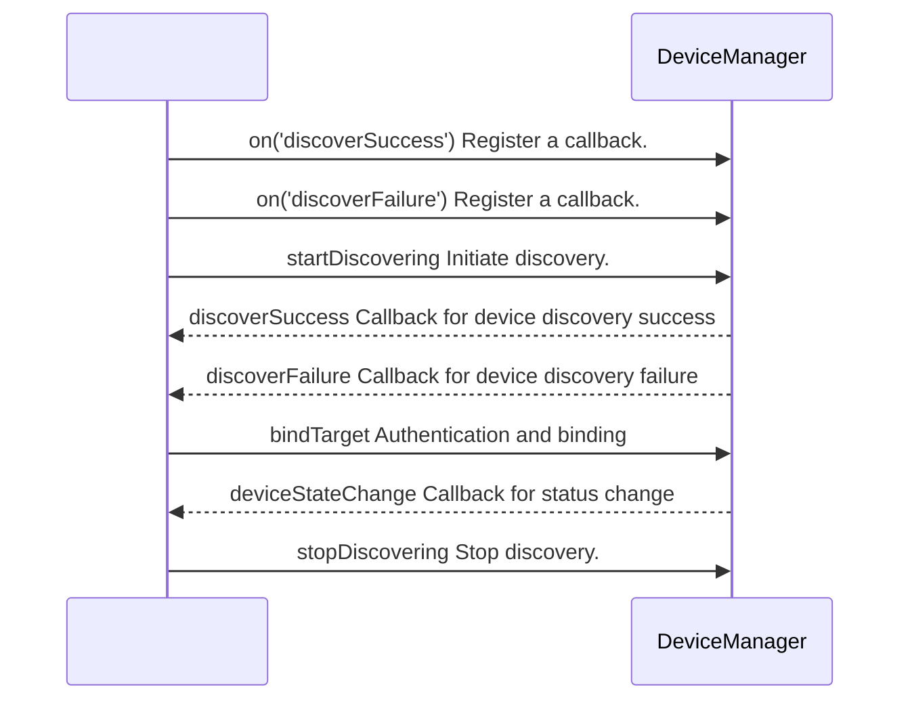

# @ohos.distributedDeviceManager (Device Management)
<!--Kit: Distributed Service Kit-->
<!--Subsystem: DistributedHardware-->
<!--Owner: @hwzhangchuang-->
<!--Designer: @hwzhangchuang-->
<!--Tester: @zhaodengqi-->
<!--Adviser: @hu-zhiqiong-->

This module provides distributed device management capabilities, including device discovery, authentication, status listening, and information query. Device management is based on the device trust model. Trusted connections are established by discovering nearby devices and authenticating and binding them. Authenticated trusted devices can be used for distributed services.

Applications can call the APIs to:

- Subscribe to or unsubscribe from device status changes, device name changes, and unavailable services.
- Starts to discover devices nearby.
- Authenticate or deauthenticate a device.
- Query the trusted device list.
- Query local device information, including the device name, type, and ID.

> **NOTE**
>
> The initial APIs of this module are supported since API version 10. Newly added APIs will be marked with a superscript to indicate their earliest API version.

## Modules to Import

```ts
import { distributedDeviceManager } from '@kit.DistributedServiceKit';
```

## distributedDeviceManager.createDeviceManager

createDeviceManager(bundleName: string): DeviceManager

Creates a **DeviceManager** instance, which is the entry for calling the distributed device management methods. This instance used to obtain the list of trusted devices and information about the local device, such as the device name, type, ID, and network ID. When the **DeviceManager** instance is no longer used, call **releaseDeviceManager** to release the instance to prevent resource leaks.

**System capability**: SystemCapability.DistributedHardware.DeviceManager

**Device behavior differences**: If this API is called on a wearable device that does not support distributed services, error code 801 is returned.

**Parameters**

| Name    | Type                                                | Mandatory| Description                                                       |
| ---------- | ---------------------------------------------------- | ---- | ----------------------------------------------------------- |
| bundleName | string                                               | Yes  | Bundle name of the app. The value contains 1 to 255 characters. If the value is out of range, error code 401 is returned. |

**Return value**

  | Type                                       | Description       |
  | ------------------------------------------- | --------- |
  | [DeviceManager](#devicemanager) | *DeviceManager** instance used to obtain the list of trusted devices and information about the local device, such as the device name, type, ID, and network ID.|

**Error codes**

For details about the error codes, see [Universal Error Codes](../errorcode-universal.md).

| ID| Error Message                                                       |
| -------- | --------------------------------------------------------------- |
| 401 | Parameter error. Possible causes: 1. Mandatory parameters are left unspecified; 2. Incorrect parameter type; 3. Parameter verification failed. |

**Example**

  ```ts
  import { distributedDeviceManager } from '@kit.DistributedServiceKit';
  import { BusinessError } from '@kit.BasicServicesKit';

  try {
    // Create a DeviceManager instance.
    let dmInstance = distributedDeviceManager.createDeviceManager('ohos.samples.jsHelloWorld');
  } catch (err) {
    let error: BusinessError = err as BusinessError;
    console.error(`Failed to create device manager. Code: ${error.code}, message: ${error.message}`);
  }
  ```

## distributedDeviceManager.releaseDeviceManager

releaseDeviceManager(deviceManager: DeviceManager): void

Releases a **DeviceManager** instance that is no longer used.

**System capability**: SystemCapability.DistributedHardware.DeviceManager

**Device behavior differences**: If this API is called on a wearable device that does not support distributed services, error code 801 is returned.

**Parameters**

| Name    | Type                                                | Mandatory| Description                               |
| ---------- | ---------------------------------------------------- | ---- | --------------------------------- |
| deviceManager | [DeviceManager](#devicemanager)    | Yes  | **DeviceManager** instance created through **createDeviceManager**.                                 |

**Error codes**

For details about the error codes, see [Universal Error Codes](../errorcode-universal.md) and [Device Management Error Codes](errorcode-device-manager.md).

| ID| Error Message                                                       |
| -------- | --------------------------------------------------------------- |
| 401 | Parameter error. Possible causes: 1. Mandatory parameters are left unspecified; 2. Incorrect parameter types; 3. Parameter verification failed. |
| 11600101 | Failed to execute the function.                                 |

**Example**

  ```ts
  import { distributedDeviceManager } from '@kit.DistributedServiceKit';
  import { BusinessError } from '@kit.BasicServicesKit';

  try {
    // Create a DeviceManager instance.
    let dmInstance = distributedDeviceManager.createDeviceManager('ohos.samples.jsHelloWorld');
    // Release the DeviceManager instance.
    distributedDeviceManager.releaseDeviceManager(dmInstance);
  } catch (err) {
    let error: BusinessError = err as BusinessError;
    console.error(`Failed to release device manager. Code: ${error.code}, message: ${error.message}`);
  }
  ```

## DeviceBasicInfo

Represents the basic information about a distributed device.

**System capability**: SystemCapability.DistributedHardware.DeviceManager

**Device behavior differences**: If this API is called on a wearable device that does not support distributed services, error code 801 is returned.

| Name          | Type | Read-Only| Optional             |  Description   |
| ---------------------- | ------------------------- | --- | ---- | -------- |
| deviceId               | string                    | No| No | Device ID. The value is the result of obfuscating the udid-hash (hash value of the UDID), **appid**, and salt using the SHA-256 algorithm.|
| deviceName             | string                    | No| No | Device name.   |
| deviceType             | string                    | No| No | Device type.   |
| networkId              | string                    | No| Yes | Network ID of the device. If this parameter is not provided, the default value is an empty string. |

## DeviceStateChange

Enumerates the device states.

**System capability**: SystemCapability.DistributedHardware.DeviceManager

**Device behavior differences**: If this API is called on a wearable device that does not support distributed services, error code 801 is returned.

| Name        | Value | Description             |
| ----------- | ---- | --------------- |
| UNKNOWN     | 0    | The device state is unknown after the device goes online. Before the device state changes to available, distributed services cannot be used.          |
| AVAILABLE   | 1    | The information between devices has been synchronized in the Distributed Data Service (DDS) module, and the device is ready for running distributed services.|
| UNAVAILABLE | 2    | The device goes offline, and the device state is unknown.          |

## DeviceManager

Defines a **DeviceManager** instance, which is the entry for calling the distributed device management methods. It provides capabilities such as device discovery, device authentication, status listening, and information query. Before calling any API in **DeviceManager**, you must use **createDeviceManager** to create a **DeviceManager** instance, for example, **dmInstance**.

**System capability**: SystemCapability.DistributedHardware.DeviceManager

**Device behavior differences**: If this API is called on a wearable device that does not support distributed services, error code 801 is returned.

### getAvailableDeviceListSync

getAvailableDeviceListSync(): Array&lt;DeviceBasicInfo&gt;

Obtains all online trusted devices synchronously. Before calling this method, you must use **createDeviceManager** to create a **DeviceManager** instance. The difference between this method and **getAvailableDeviceList** is that this method is synchronous and directly returns the result, while **getAvailableDeviceList** is asynchronous and returns the result through a callback or promise. You are advised to use this method when you must wait for the result before proceeding, and use **getAvailableDeviceList** in scenarios where thread blocking is undesirable.

**Required permissions**: ohos.permission.DISTRIBUTED_DATASYNC

**System capability**: SystemCapability.DistributedHardware.DeviceManager

**Device behavior differences**: If this API is called on a wearable device that does not support distributed services, error code 801 is returned.

**Return value**

  | Type                                       | Description       |
  | ------------------------------------------- | --------- |
  | Array&lt;[DeviceBasicInfo](#devicebasicinfo)&gt; | Array of trusted devices, containing information such as the device ID, name, type, and network ID.|

**Error codes**

For details about the error codes, see [Universal Error Codes](../errorcode-universal.md) and [Device Management Error Codes](errorcode-device-manager.md).

| ID| Error Message                                                       |
| -------- | --------------------------------------------------------------- |
| 201 | Permission verification failed. The application does not have the permission required to call the API.                                            |
| 11600101 | Failed to execute the function.                                 |

**Example**

  ```ts
  import { distributedDeviceManager } from '@kit.DistributedServiceKit';
  import { BusinessError } from '@kit.BasicServicesKit';

  try {
    // Create a DeviceManager instance.
    let dmInstance = distributedDeviceManager.createDeviceManager('ohos.samples.jsHelloWorld');
    // Obtain all online trusted devices synchronously.
    let deviceInfoList: Array<distributedDeviceManager.DeviceBasicInfo> = dmInstance.getAvailableDeviceListSync();
  } catch (err) {
    let error: BusinessError = err as BusinessError;
    console.error(`Failed to get available device list sync. Code: ${error.code}, message: ${error.message}`);
  }
  ```

### getAvailableDeviceList

getAvailableDeviceList(callback: AsyncCallback&lt;Array&lt;DeviceBasicInfo&gt;&gt;): void

Obtains all online trusted devices. Before calling this method, you must use **createDeviceManager** to create a **DeviceManager** instance. This API uses an asynchronous callback to return the result. * The difference between this method and **getAvailableDeviceListSync** is that this method is asynchronous and returns the result through a callback, while **getAvailableDeviceListSync** is synchronous and directly returns the result. You are advised to use this method in scenarios where thread blocking is undesirable, and use **getAvailableDeviceListSync** when you must wait for the result before proceeding.

**Required permissions**: ohos.permission.DISTRIBUTED_DATASYNC

**System capability**: SystemCapability.DistributedHardware.DeviceManager

**Device behavior differences**: If this API is called on a wearable device that does not support distributed services, error code 801 is returned.

**Parameters**

  | Name      | Type                                    | Mandatory  | Description                   |
  | -------- | ---------------------------------------- | ---- | --------------------- |
  | callback | AsyncCallback&lt;Array&lt;[DeviceBasicInfo](#devicebasicinfo)&gt;&gt; | Yes   | Callback used to return the result. If the list of trusted devices is successfully obtained, **err** is **undefined** and **data** is the list of trusted devices obtained; otherwise, **err** is an error object.|

**Error codes**

For details about the error codes, see [Universal Error Codes](../errorcode-universal.md) and [Device Management Error Codes](errorcode-device-manager.md).

| ID| Error Message                                                       |
| -------- | --------------------------------------------------------------- |
| 201 | Permission verification failed. The application does not have the permission required to call the API.                                            |
| 11600101 | Failed to execute the function.                                 |

**Example**

  ```ts
  import { distributedDeviceManager } from '@kit.DistributedServiceKit';
  import { BusinessError } from '@kit.BasicServicesKit';

  try {
    // Create a DeviceManager instance.
    let dmInstance = distributedDeviceManager.createDeviceManager('ohos.samples.jsHelloWorld');
    // Obtain all online trusted devices.
    dmInstance.getAvailableDeviceList((err: BusinessError, data: Array<distributedDeviceManager.DeviceBasicInfo>) => {
      if (err) {
        console.error(`Failed to get available device list. Code: ${err.code}, message: ${err.message}`);
        return;
      }
      console.info('get available device info: ' + JSON.stringify(data));
    });
  } catch (err) {
    let error: BusinessError = err as BusinessError;
    console.error(`Failed to get available device list. Code: ${error.code}, message: ${error.message}`);
  }
  ```

### getAvailableDeviceList

getAvailableDeviceList(): Promise&lt;Array&lt;DeviceBasicInfo&gt;&gt;

Obtains all online trusted devices. Before calling this method, you must use **createDeviceManager** to create a **DeviceManager** instance. This API uses a promise to return the result. * The difference between this method and **getAvailableDeviceListSync** is that this method is asynchronous and returns the result through a promise, while **getAvailableDeviceListSync** is synchronous and directly returns the result. You are advised to use this method in scenarios where thread blocking is undesirable, and use **getAvailableDeviceListSync** when you must wait for the result before proceeding.

**Required permissions**: ohos.permission.DISTRIBUTED_DATASYNC

**System capability**: SystemCapability.DistributedHardware.DeviceManager

**Device behavior differences**: If this API is called on a wearable device that does not support distributed services, error code 801 is returned.

**Return value**

  | Type                                                      | Description                              |
  | ---------------------------------------------------------- | ---------------------------------- |
  | Promise&lt;Array&lt;[DeviceBasicInfo](#devicebasicinfo)&gt;&gt; | Promise used to return the basic information about distributed devices on **resolve**, or an error message on **reject**.|

**Error codes**

For details about the error codes, see [Universal Error Codes](../errorcode-universal.md) and [Device Management Error Codes](errorcode-device-manager.md).

| ID| Error Message                                                       |
| -------- | --------------------------------------------------------------- |
| 201 | Permission verification failed. The application does not have the permission required to call the API.                                            |
| 11600101 | Failed to execute the function.                                 |

**Example**

  ```ts
  import { distributedDeviceManager } from '@kit.DistributedServiceKit';
  import { BusinessError } from '@kit.BasicServicesKit';

  try {
    // Create a DeviceManager instance.
    let dmInstance = distributedDeviceManager.createDeviceManager('ohos.samples.jsHelloWorld');
    // Obtain all online trusted devices.
    dmInstance.getAvailableDeviceList().then((data: Array<distributedDeviceManager.DeviceBasicInfo>) => {
      console.info('get available device info: ' + JSON.stringify(data));
    }).catch((err: BusinessError) => {
      console.error(`Failed to get available device list. Code: ${err.code}, message: ${err.message}`);
    });
  } catch (err) {
    let error: BusinessError = err as BusinessError;
    console.error(`Failed to get available device list. Code: ${error.code}, message: ${error.message}`);
  }
  ```

### getLocalDeviceNetworkId

getLocalDeviceNetworkId(): string

Obtains the network ID of the local device.

**Required permissions**: ohos.permission.DISTRIBUTED_DATASYNC

**System capability**: SystemCapability.DistributedHardware.DeviceManager

**Device behavior differences**: If this API is called on a wearable device that does not support distributed services, error code 801 is returned.

**Return value**

  | Type                     | Description             |
  | ------------------------- | ---------------- |
  | string | Network ID of the local device, which is a character string uniquely identifying a device in the distributed network.|

**Error codes**

For details about the error codes, see [Universal Error Codes](../errorcode-universal.md) and [Device Management Error Codes](errorcode-device-manager.md).

| ID| Error Message                                                       |
| -------- | --------------------------------------------------------------- |
| 201 | Permission verification failed. The application does not have the permission required to call the API.                                            |
| 11600101 | Failed to execute the function.                                 |

**Example**

  ```ts
  import { distributedDeviceManager } from '@kit.DistributedServiceKit';
  import { BusinessError } from '@kit.BasicServicesKit';

  try {
    // Create a DeviceManager instance.
    let dmInstance = distributedDeviceManager.createDeviceManager('ohos.samples.jsHelloWorld');
    // Obtain the network ID of the local device.
    let deviceNetworkId: string = dmInstance.getLocalDeviceNetworkId();
    console.info('local device networkId: ' + JSON.stringify(deviceNetworkId));
  } catch (err) {
    let error: BusinessError = err as BusinessError;
    console.error(`Failed to get local device network id. Code: ${error.code}, message: ${error.message}`);
  }
  ```

### getLocalDeviceName

getLocalDeviceName(): string

Obtains the local device name.

**Required permissions**: ohos.permission.DISTRIBUTED_DATASYNC

**System capability**: SystemCapability.DistributedHardware.DeviceManager

**Device behavior differences**: If this API is called on a wearable device that does not support distributed services, error code 801 is returned.

**Return value**

  | Type                     | Description             |
  | ------------------------- | ---------------- |
  | string                    | Local device name, which can be used for device display and identification.|

**Error codes**

For details about the error codes, see [Universal Error Codes](../errorcode-universal.md) and [Device Management Error Codes](errorcode-device-manager.md).

| ID| Error Message                                                       |
| -------- | --------------------------------------------------------------- |
| 201 | Permission verification failed. The application does not have the permission required to call the API.                                            |
| 11600101 | Failed to execute the function.                                 |

**Example**

  ```ts
  import { distributedDeviceManager } from '@kit.DistributedServiceKit';
  import { BusinessError } from '@kit.BasicServicesKit';

  try {
    // Create a DeviceManager instance.
    let dmInstance = distributedDeviceManager.createDeviceManager('ohos.samples.jsHelloWorld');
    // Obtain the local device name.
    let deviceName: string = dmInstance.getLocalDeviceName();
    console.info('local device name: ' + JSON.stringify(deviceName));
  } catch (err) {
    let error: BusinessError = err as BusinessError;
    console.error(`Failed to get local device name. Code: ${error.code}, message: ${error.message}`);
  }
  ```

### getLocalDeviceType

getLocalDeviceType(): number

Obtains the local device type.

**Required permissions**: ohos.permission.DISTRIBUTED_DATASYNC

**System capability**: SystemCapability.DistributedHardware.DeviceManager

**Device behavior differences**: If this API is called on a wearable device that does not support distributed services, error code 801 is returned.

**Return value**

  | Type                     | Description             |
  | ------------------------- | ---------------- |
  | number                    | <!--RP1-->Local device type obtained.<!--RP1End--> |

**Error codes**

For details about the error codes, see [Universal Error Codes](../errorcode-universal.md) and [Device Management Error Codes](errorcode-device-manager.md).

| ID| Error Message                                                       |
| -------- | --------------------------------------------------------------- |
| 201 | Permission verification failed. The application does not have the permission required to call the API.                                            |
| 11600101 | Failed to execute the function.                                 |

**Example**

  ```ts
  import { distributedDeviceManager } from '@kit.DistributedServiceKit';
  import { BusinessError } from '@kit.BasicServicesKit';

  try {
    // Create a DeviceManager instance.
    let dmInstance = distributedDeviceManager.createDeviceManager('ohos.samples.jsHelloWorld');
    // Obtain the local device type.
    let deviceType: number = dmInstance.getLocalDeviceType();
    console.info('local device type: ' + JSON.stringify(deviceType));
  } catch (err) {
    let error: BusinessError = err as BusinessError;
    console.error(`Failed to get local device type. Code: ${error.code}, message: ${error.message}`);
  }
  ```

### getLocalDeviceId

getLocalDeviceId(): string

Obtains the local device ID. The value is the result of obfuscating the udid-hash (hash value of the UDID), **appid**, and salt using the SHA-256 algorithm.

**Required permissions**: ohos.permission.DISTRIBUTED_DATASYNC

**System capability**: SystemCapability.DistributedHardware.DeviceManager

**Device behavior differences**: If this API is called on a wearable device that does not support distributed services, error code 801 is returned.

**Return value**

  | Type                     | Description             |
  | ------------------------- | ---------------- |
  | string                    | Local device ID. The value is the result of obfuscating the udid-hash (hash value of the UDID), **appid**, and salt using the SHA-256 algorithm.|

**Error codes**

For details about the error codes, see [Universal Error Codes](../errorcode-universal.md) and [Device Management Error Codes](errorcode-device-manager.md).

| ID| Error Message                                                       |
| -------- | --------------------------------------------------------------- |
| 201 | Permission verification failed. The application does not have the permission required to call the API.                                            |
| 11600101 | Failed to execute the function.                                 |

**Example**

  ```ts
  import { distributedDeviceManager } from '@kit.DistributedServiceKit';
  import { BusinessError } from '@kit.BasicServicesKit';

  try {
    // Create a DeviceManager instance.
    let dmInstance = distributedDeviceManager.createDeviceManager('ohos.samples.jsHelloWorld');
    // Obtain the ID of the local device.
    let deviceId: string = dmInstance.getLocalDeviceId();
    console.info('local device id: ' + JSON.stringify(deviceId));
  } catch (err) {
    let error: BusinessError = err as BusinessError;
    console.error(`Failed to get local device id. Code: ${error.code}, message: ${error.message}`);
  }
  ```

### getDeviceName

getDeviceName(networkId: string): string

Obtains the device name based on the network ID of the specified device.

**Required permissions**: ohos.permission.DISTRIBUTED_DATASYNC

**System capability**: SystemCapability.DistributedHardware.DeviceManager

**Device behavior differences**: If this API is called on a wearable device that does not support distributed services, error code 801 is returned.

**Parameters**

  | Name      | Type                                    | Mandatory  | Description       |
  | -------- | ---------------------------------------- | ---- | --------- |
  | networkId| string                                   | Yes  | Network ID of the device, which can be obtained from the trusted device list (**DeviceBasicInfo** returned by **getAvailableDeviceListSync** or **getAvailableDeviceList**). Note: If the obtained network ID is an empty string, it cannot be used to call this API. The value contains 1 to 255 characters. If the value is out of range, error code 401 is returned.|

**Return value**

  | Type                     | Description             |
  | ------------------------- | ---------------- |
  | string                    | Name of the specified device, which can be used for device display and identification.|

**Error codes**

For details about the error codes, see [Universal Error Codes](../errorcode-universal.md) and [Device Management Error Codes](errorcode-device-manager.md).

| ID| Error Message                                                       |
| -------- | --------------------------------------------------------------- |
| 201 | Permission verification failed. The application does not have the permission required to call the API.                                            |
| 401 | Parameter error. Possible causes: 1. Mandatory parameters are left unspecified; 2. Incorrect parameter type; 3. Parameter verification failed; 4. The size of specified networkId is greater than 255. |
| 11600101 | Failed to execute the function.                                 |

**Example**

  ```ts
  import { distributedDeviceManager } from '@kit.DistributedServiceKit';
  import { BusinessError } from '@kit.BasicServicesKit';

  try {
    // Network ID of the device, which can be obtained from the trusted device list by calling getAvailableDeviceListSync or getAvailableDeviceList.
    let networkId = 'xxxxxxx';
    // Create a DeviceManager instance.
    let dmInstance = distributedDeviceManager.createDeviceManager('ohos.samples.jsHelloWorld');
    // Obtain the device name based on the network ID.
    let deviceName: string = dmInstance.getDeviceName(networkId);
    console.info('device name: ' + JSON.stringify(deviceName)); 
  } catch (err) {
    let error: BusinessError = err as BusinessError;
    console.error(`Failed to get device name. Code: ${error.code}, message: ${error.message}`);
  }
  ```

### getDeviceType

getDeviceType(networkId: string): number

Obtains the device type based on the network ID of the specified device.

**Required permissions**: ohos.permission.DISTRIBUTED_DATASYNC

**System capability**: SystemCapability.DistributedHardware.DeviceManager

**Device behavior differences**: If this API is called on a wearable device that does not support distributed services, error code 801 is returned.

**Parameters**

  | Name      | Type                                    | Mandatory  | Description       |
  | -------- | ---------------------------------------- | ---- | --------- |
  | networkId| string                                   | Yes  | Network ID of the device, which can be obtained from the trusted device list (**DeviceBasicInfo** returned by **getAvailableDeviceListSync** or **getAvailableDeviceList**). Note: If the obtained network ID is an empty string, it cannot be used to call this API. The value contains 1 to 255 characters. If the value is out of range, error code 401 is returned.|

**Return value**

  | Type                     | Description             |
  | ------------------------- | ---------------- |
  | number                    | <!--RP2-->Type of the specified device.<!--RP2End--> |

**Error codes**

For details about the error codes, see [Universal Error Codes](../errorcode-universal.md) and [Device Management Error Codes](errorcode-device-manager.md).

| ID| Error Message                                                       |
| -------- | --------------------------------------------------------------- |
| 201 | Permission verification failed. The application does not have the permission required to call the API.                                            |
| 401 | Parameter error. Possible causes: 1. Mandatory parameters are left unspecified; 2. Incorrect parameter type; 3. Parameter verification failed; 4. The size of specified networkId is greater than 255. |
| 11600101 | Failed to execute the function.                                 |

**Example**

  ```ts
  import { distributedDeviceManager } from '@kit.DistributedServiceKit';
  import { BusinessError } from '@kit.BasicServicesKit';

  try {
    // Network ID of the device, which can be obtained from the trusted device list by calling getAvailableDeviceListSync or getAvailableDeviceList.
    let networkId = 'xxxxxxx';
    // Create a DeviceManager instance.
    let dmInstance = distributedDeviceManager.createDeviceManager('ohos.samples.jsHelloWorld');
    // Obtain the device type based on the network ID.
    let deviceType: number = dmInstance.getDeviceType(networkId);
    console.info('device type: ' + JSON.stringify(deviceType)); 
  } catch (err) {
    let error: BusinessError = err as BusinessError;
    console.error(`Failed to get device type. Code: ${error.code}, message: ${error.message}`);
  }
  ```

### startDiscovering

startDiscovering(discoverParam: {[key:&nbsp;string]:&nbsp;Object;} , filterOptions?: {[key:&nbsp;string]:&nbsp;Object;} ): void

Discovers nearby devices, which is used to search for available devices before a distributed connection is established. The discovery process lasts 2 minutes and automatically stops upon timeout. A maximum of 99 devices can be discovered. When Wi-Fi is used for device discovery, the device initiating the discovery process and the discovered devices must be on the same LAN. Before calling this method, register a callback for device discovery success using [on('discoverSuccess')](#ondiscoversuccess) to receive discovered device information, and register a callback for discovery failure using [on('discoverFailure')](#ondiscoverfailure) to receive failure notifications. After the device discovery is complete, you can call **stopDiscovering** to end the discovery process.

The device discovery and authentication process is as follows:



**Required permissions**: ohos.permission.DISTRIBUTED_DATASYNC

**System capability**: SystemCapability.DistributedHardware.DeviceManager

**Device behavior differences**: If this API is called on a wearable device that does not support distributed services, error code 801 is returned.

**Parameters**

  | Name           | Type                       | Mandatory  | Description   |
  | ------------- | ------------------------------- | ---- | -----  |
  | discoverParam  | {[key:&nbsp;string]:&nbsp;Object;}      | Yes  | Discovery configuration parameters, which are used to specify the type of the target to discover.<br>**discoverTargetType**: type of the target to discover. The value **1** indicates a device. If other values are passed, the parameter does not take effect.|
  | filterOptions | {[key:&nbsp;string]:&nbsp;Object;}          | No  | Options for filtering the devices to discover. This parameter is optional. The default value is **undefined**, indicating that offline devices are discovered. The following key values will be carried. If a key is not passed, the filtering is not performed based on the key.<br>**availableStatus(0-1)**: available status of the discovered device. If a value beyond the range is passed, the parameter does not take effect.<br>- **0**: The device is offline. The client needs to call **bindTarget** to bind the device.<br>- **1**: The device is online and can be connected.<br>**discoverDistance(0-100)**: distance within which devices can be discovered, in cm. If a value beyond the range is passed, the parameter does not take effect. This parameter is not supported when Wi-Fi is used for device discovery. If a value is passed, ths parameter does not take effect.<br>**authenticationStatus(0-1)**: authentication status of the device to discover. If a value beyond the range is passed, the parameter does not take effect.<br>- **0**: The device is not authenticated. The client needs to call **bindTarget** to authenticate and bind the device.<br>- **1**: The device has been authenticated and can be used for distributed services.<br>**authorizationType(0-2)**: authorization type of the device to discover. If a value beyond the range is passed, the parameter does not take effect.<br>- **0**: The device is authenticated by a temporarily agreed session key.<br>- **1**: The device is authenticated by a key of the same account.<br>- **2**: The device is authenticated by a credential key of different accounts.|

**Error codes**

For details about the error codes, see [Universal Error Codes](../errorcode-universal.md) and [Device Management Error Codes](errorcode-device-manager.md).

| ID| Error Message                                                       |
| -------- | --------------------------------------------------------------- |
| 201 | Permission verification failed. The application does not have the permission required to call the API.                                            |
| 401 | Parameter error. Possible causes: 1. Mandatory parameters are left unspecified; 2. Incorrect parameter type; 3. Parameter verification failed. |
| 11600101 | Failed to execute the function.                                 |
| 11600104 | Discovery unavailable.                                          |

**Example**

  ```ts
  import { distributedDeviceManager } from '@kit.DistributedServiceKit';
  import { BusinessError } from '@kit.BasicServicesKit';

  // Discovery flag. If discoverTargetType is set to 1, it indicates that the discovery target is a device.
  let discoverParam: Record<string, number> = {
    'discoverTargetType': 1
  };
  // Filter information for discovering devices. If availableStatus is set to 0, it indicates that offline devices are discovered.
  let filterOptions: Record<string, number> = {
    'availableStatus': 0
  };

  try {
    // Create a DeviceManager instance.
    let dmInstance = distributedDeviceManager.createDeviceManager('ohos.samples.jsHelloWorld');
    dmInstance.startDiscovering(discoverParam, filterOptions); // When devices are discovered, discoverSuccess is called to notify the app.
  } catch (err) {
    let error: BusinessError = err as BusinessError;
    console.error(`Failed to start discovering. Code: ${error.code}, message: ${error.message}`);
  }
  ```

### stopDiscovering

stopDiscovering(): void

Stops device discovery. This method is used together with the **startDiscovering** method to manually stop device discovery before the discovery times out (2 minutes). This method must be called after **startDiscovering** is called.

**Required permissions**: ohos.permission.DISTRIBUTED_DATASYNC

**System capability**: SystemCapability.DistributedHardware.DeviceManager

**Device behavior differences**: If this API is called on a wearable device that does not support distributed services, error code 801 is returned.

**Error codes**

For details about the error codes, see [Universal Error Codes](../errorcode-universal.md) and [Device Management Error Codes](errorcode-device-manager.md).

| ID| Error Message                                                       |
| -------- | --------------------------------------------------------------- |
| 201 | Permission verification failed. The application does not have the permission required to call the API.                                            |
| 11600101 | Failed to execute the function.                                 |

**Example**

  ```ts
  import { distributedDeviceManager } from '@kit.DistributedServiceKit';
  import { BusinessError } from '@kit.BasicServicesKit';

  try {
    // Create a DeviceManager instance.
    let dmInstance = distributedDeviceManager.createDeviceManager('ohos.samples.jsHelloWorld');
    // Stop discovering nearby devices.
    dmInstance.stopDiscovering();
  } catch (err) {
    let error: BusinessError = err as BusinessError;
    console.error(`Failed to stop discovering. Code: ${error.code}, message: ${error.message}`);
  }
  ```

### bindTarget

bindTarget(deviceId: string, bindParam: {[key:&nbsp;string]:&nbsp;Object;} , callback: AsyncCallback&lt;{deviceId: string;}>): void

Authenticates a device and binds the discovered untrusted device as a trusted device through the authentication process. During the authentication, the system initiates an authentication request based on the authentication mode specified in **bindParam**. After the authentication is successful, the device is added to the list of trusted devices and can be queried by calling **getAvailableDeviceListSync**. When you no longer need to perform distributed services with the target device, you can call **unbindTarget** to unbind the device. This API uses an asynchronous callback to return the result.

**Required permissions**: ohos.permission.DISTRIBUTED_DATASYNC

**System capability**: SystemCapability.DistributedHardware.DeviceManager

**Device behavior differences**: If this API is called on a wearable device that does not support distributed services, error code 801 is returned.

**Parameters**

  | Name    | Type                                               | Mandatory | Description        |
  | ---------- | --------------------------------------------------- | ----- | ------------ |
  | deviceId   | string                                              | Yes   | Device ID, which can be obtained from the device discovery result (**DeviceBasicInfo** returned by the callback for **discoverSuccess** of **startDiscovering**). The value contains 1 to 255 characters. If the value is out of range, error code 401 is returned.  |
  | bindParam  | {[key:&nbsp;string]:&nbsp;Object;}                             | Yes   | Authentication parameters. The following key values can be passed:<br>**bindType** (mandatory): binding type, which is of the number type. The value **1** indicates PIN authentication. If other values are passed, a parameter error is returned.<br>**targetPkgName** (optional): package name of the target to be bound, which is of the string type. If this parameter is not passed, the bundle name of the calling app is used by default.<br>**appName** (optional): name of the app that attempts to bind the target, which is of the string type. This parameter is used to display the name of the app that initiates the binding on the authentication screen. If this parameter is not passed, the app name is not displayed.<br>**appOperation** (optional): reason why the app wants to bind the target, which is of the string type. This parameter is used to display the binding purpose to the user. If this parameter is not passed, the binding purpose is not displayed.<br>**customDescription** (optional): detailed description of the binding operation, which is of the string type. This parameter is used to display a more specific operation description to the user. If this parameter is not passed, the detailed description is not displayed.  |
  | callback   | AsyncCallback&lt;{deviceId:&nbsp;string;&nbsp;}&gt; | Yes   | Callback used to return the authentication result. If the authentication is successful, **err** is **undefined**, and **data** is an object containing **deviceId**. If the authentication fails, **err** is an error object.|

**Error codes**

For details about the error codes, see [Universal Error Codes](../errorcode-universal.md) and [Device Management Error Codes](errorcode-device-manager.md).

| ID| Error Message                                                        |
| -------- | --------------------------------------------------------------- |
| 201 | Permission verification failed. The application does not have the permission required to call the API.                                            |
| 401 | Parameter error. Possible causes: 1. Mandatory parameters are left unspecified; 2. Incorrect parameter type; 3. Parameter verification failed; 4. The size of specified deviceId is greater than 255.  |
| 11600101 | Failed to execute the function.                                 |
| 11600103 | Authentication unavailable.                                     |

**Example**

  ```ts
  import { distributedDeviceManager } from '@kit.DistributedServiceKit';
  import { BusinessError } from '@kit.BasicServicesKit';

  class BindResultData {
    deviceId: string = '';
  }
  // Device ID. You can obtain the DeviceBasicInfo.deviceId from the discoverSuccess callback after calling startDiscovering to discover devices, or obtain the DeviceBasicInfo.deviceId of a trusted device by calling getAvailableDeviceListSync or getAvailableDeviceList.
  let deviceId = 'XXXXXXXX';
  // Authentication parameters
  let bindParam: Record<string, string | number> = {
    'bindType': 1, // Binding type. The value 1 means PIN authentication.
    'targetPkgName': 'xxxx',
    'appName': 'xxxx',
    'appOperation': 'xxxx',
    'customDescription': 'xxxx'
  };

  try {
    // Create a DeviceManager instance.
    let dmInstance = distributedDeviceManager.createDeviceManager('ohos.samples.jsHelloWorld');
    // Authenticate a device.
    dmInstance.bindTarget(deviceId, bindParam, (err: BusinessError, data: BindResultData) => {
      if (err) {
        console.error(`Failed to bind target. Code: ${err.code}, message: ${err.message}`);
        return;
      }
      console.info('bindTarget result:' + JSON.stringify(data));
    });
  } catch (err) {
    let error: BusinessError = err as BusinessError;
    console.error(`Failed to bind target. Code: ${error.code}, message: ${error.message}`);
  }
  ```

### unbindTarget

unbindTarget(deviceId: string): void

Unbinds a device. It is used when you no longer need to perform distributed services with the target device. When this method is used together with the **bindTarget** method, only trusted devices that have been bound through **bindTarget** can be unbound. After the unbinding, the device will be removed from the list of trusted devices. You can call **getAvailableDeviceListSync** or **getAvailableDeviceList** to query the list.

**Required permissions**: ohos.permission.DISTRIBUTED_DATASYNC

**System capability**: SystemCapability.DistributedHardware.DeviceManager

**Device behavior differences**: If this API is called on a wearable device that does not support distributed services, error code 801 is returned.

**Parameters**

  | Name  | Type                     | Mandatory| Description      |
  | -------- | ------------------------- | ---- | ---------- |
  | deviceId | string                    | Yes  |  Device ID. The device must be a trusted device that has been bound through **bindTarget**. The value can be obtained from the trusted device list (**DeviceBasicInfo** returned by **getAvailableDeviceListSync** or **getAvailableDeviceList**). The value contains 1 to 255 characters. If the value is out of range, error code 401 is returned.|

**Error codes**

For details about the error codes, see [Universal Error Codes](../errorcode-universal.md) and [Device Management Error Codes](errorcode-device-manager.md).

| ID| Error Message                                                       |
| -------- | --------------------------------------------------------------- |
| 201 | Permission verification failed. The application does not have the permission required to call the API.                                            |
| 401 | Parameter error. Possible causes: 1. Mandatory parameters are left unspecified; 2. Incorrect parameter type; 3. Parameter verification failed; 4. The size of specified deviceId is greater than 255.  |
| 11600101 | Failed to execute the function.                                 |

**Example**

  ```ts
  import { distributedDeviceManager } from '@kit.DistributedServiceKit';
  import { BusinessError } from '@kit.BasicServicesKit';

  try {
    // Device ID, which can be obtained from the discovery result (discoverSuccess callback of startDiscovering) or the trusted device list (DeviceBasicInfo returned by getAvailableDeviceListSync or getAvailableDeviceList).
    let deviceId = 'XXXXXXXX';
    // Create a DeviceManager instance.
    let dmInstance = distributedDeviceManager.createDeviceManager('ohos.samples.jsHelloWorld');
    // Deauthenticate a device.
    dmInstance.unbindTarget(deviceId);
  } catch (err) {
    let error: BusinessError = err as BusinessError;
    console.error(`Failed to unbind target. Code: ${error.code}, message: ${error.message}`);
  }
  ```

### on('deviceStateChange')

on(type: 'deviceStateChange', callback: Callback&lt;{ action: DeviceStateChange; device: DeviceBasicInfo; }&gt;): void

Registers a callback for device status changes to notify the app when the device status changes. This API uses an asynchronous callback to return the result.

**Required permissions**: ohos.permission.DISTRIBUTED_DATASYNC

**System capability**: SystemCapability.DistributedHardware.DeviceManager

**Device behavior differences**: If this API is called on a wearable device that does not support distributed services, error code 801 is returned.

**Parameters**

  | Name      | Type                                    | Mandatory  | Description                            |
  | -------- | ---------------------------------------- | ---- | ------------------------------ |
  | type     | string                                   | Yes   | Event type. The value **'deviceStateChange'** indicates device state changes.|
  | callback | Callback&lt;{&nbsp;action:&nbsp;[DeviceStateChange](#devicestatechange);&nbsp;device:&nbsp;[DeviceBasicInfo](#devicebasicinfo);&nbsp;}&gt; | Yes   | Callback used to return the device state and information.     |

**Error codes**

For details about the error codes, see [Universal Error Codes](../errorcode-universal.md).

| ID| Error Message                                                       |
| -------- | --------------------------------------------------------------- |
| 201 | Permission verification failed. The application does not have the permission required to call the API.                                            |
| 401 | Parameter error. Possible causes: 1. Mandatory parameters are left unspecified; 2. Incorrect parameter type; 3. Parameter verification failed; 4. The size of specified type is greater than 255.  |

**Example**

  ```ts
  import { distributedDeviceManager } from '@kit.DistributedServiceKit';
  import { BusinessError } from '@kit.BasicServicesKit';

  class DeviceStateChangeData {
    action: distributedDeviceManager.DeviceStateChange = 0;
    device: distributedDeviceManager.DeviceBasicInfo = {
      deviceId: '',
      deviceName: '',
      deviceType: '',
      networkId: ''
    };
  }

  try {
    // Create a DeviceManager instance.
    let dmInstance = distributedDeviceManager.createDeviceManager('ohos.samples.jsHelloWorld');
    // Register a callback for device status changes.
    dmInstance.on('deviceStateChange', (data: DeviceStateChangeData) => {
      console.info('deviceStateChange on:' + JSON.stringify(data));
    });
  } catch (err) {
    let error: BusinessError = err as BusinessError;
    console.error(`Failed to register device state change. Code: ${error.code}, message: ${error.message}`);
  }
  ```

### off('deviceStateChange')

off(type: 'deviceStateChange', callback?: Callback&lt;{ action: DeviceStateChange; device: DeviceBasicInfo; }&gt;): void

Unsubscribes from the device state changes. This API uses an asynchronous callback to return the result.

**Required permissions**: ohos.permission.DISTRIBUTED_DATASYNC

**System capability**: SystemCapability.DistributedHardware.DeviceManager

**Device behavior differences**: If this API is called on a wearable device that does not support distributed services, error code 801 is returned.

**Parameters**

  | Name      | Type                                    | Mandatory  | Description                         |
  | -------- | ---------------------------------------- | ---- | --------------------------- |
  | type     | string                                   | Yes   | Event type. The value is **deviceStateChange**, which indicates device state changes.       |
  | callback | Callback&lt;{&nbsp;action:&nbsp;[DeviceStateChange](#devicestatechange);&nbsp;device:&nbsp;[DeviceBasicInfo](#devicebasicinfo);&nbsp;}&gt; | No   | Callback to unregister. If this parameter is set, the specified callback is unregistered. Otherwise, all registered callbacks for **deviceStateChange** are unregistered.|

**Error codes**

For details about the error codes, see [Universal Error Codes](../errorcode-universal.md).

| ID| Error Message                                                       |
| -------- | --------------------------------------------------------------- |
| 201 | Permission verification failed. The application does not have the permission required to call the API.                                            |
| 401 | Parameter error. Possible causes: 1. Mandatory parameters are left unspecified; 2. Incorrect parameter type; 3. Parameter verification failed; 4. The size of specified type is greater than 255.  |

**Example**

  ```ts
  import { distributedDeviceManager } from '@kit.DistributedServiceKit';
  import { BusinessError } from '@kit.BasicServicesKit';

  class DeviceStateChangeData {
    action: distributedDeviceManager.DeviceStateChange = 0;
    device: distributedDeviceManager.DeviceBasicInfo = {
      deviceId: '',
      deviceName: '',
      deviceType: '',
      networkId: ''
    };
  }

  try {
    // Create a DeviceManager instance.
    let dmInstance = distributedDeviceManager.createDeviceManager('ohos.samples.jsHelloWorld');
    // Unregister the callback for device status changes.
    dmInstance.off('deviceStateChange', (data: DeviceStateChangeData) => {
      console.info('deviceStateChange' + JSON.stringify(data));
    });
  } catch (err) {
    let error: BusinessError = err as BusinessError;
    console.error(`Failed to unregister device state change. Code: ${error.code}, message: ${error.message}`);
  }
  ```

### on('discoverSuccess')

on(type: 'discoverSuccess', callback: Callback&lt;{ device: DeviceBasicInfo; }&gt;): void

Registers a callback for successful device discovery events. This API uses an asynchronous callback to return the result. This callback is triggered when a nearby device is discovered by calling **startDiscovering** and returns the discovered device information (**DeviceBasicInfo**). This callback must be registered before **startDiscovering** is called.

**Required permissions**: ohos.permission.DISTRIBUTED_DATASYNC

**System capability**: SystemCapability.DistributedHardware.DeviceManager

**Device behavior differences**: If this API is called on a wearable device that does not support distributed services, error code 801 is returned.

**Parameters**

  | Name      | Type                                    | Mandatory  | Description                        |
  | -------- | ---------------------------------------- | ---- | -------------------------- |
  | type     | string                                   | Yes   | Event type, which has a fixed value of **'discoverSuccess'**.|
  | callback | Callback&lt;{&nbsp;device:&nbsp;[DeviceBasicInfo](#devicebasicinfo);&nbsp;}&gt; | Yes   | Callback used to return the discovered device information (**DeviceBasicInfo**).              |

**Error codes**

For details about the error codes, see [Universal Error Codes](../errorcode-universal.md).

| ID| Error Message                                                       |
| -------- | --------------------------------------------------------------- |
| 201 | Permission verification failed. The application does not have the permission required to call the API.                                            |
| 401 | Parameter error. Possible causes: 1. Mandatory parameters are left unspecified; 2. Incorrect parameter type; 3. Parameter verification failed; 4. The size of specified type is greater than 255.  |

**Example**

  ```ts
  import { distributedDeviceManager } from '@kit.DistributedServiceKit';
  import { BusinessError } from '@kit.BasicServicesKit';

  class DiscoverSuccessData {
    device: distributedDeviceManager.DeviceBasicInfo = {
      deviceId: '',
      deviceName: '',
      deviceType: '',
      networkId: ''
    };
  }
  
  try {
    // Create a DeviceManager instance.
    let dmInstance = distributedDeviceManager.createDeviceManager('ohos.samples.jsHelloWorld');
    // Register a callback for successful device discovery events.
    dmInstance.on('discoverSuccess', (data: DiscoverSuccessData) => {
      console.info('discoverSuccess:' + JSON.stringify(data));
    });
  } catch (err) {
    let error: BusinessError = err as BusinessError;
    console.error(`Failed to register discover success callback. Code: ${error.code}, message: ${error.message}`);
  }
  ```

### off('discoverSuccess')

off(type: 'discoverSuccess', callback?: Callback&lt;{ device: DeviceBasicInfo; }&gt;): void

Unsubscribes from the **'discoverSuccess'** event. This API uses an asynchronous callback to return the result.

**Required permissions**: ohos.permission.DISTRIBUTED_DATASYNC

**System capability**: SystemCapability.DistributedHardware.DeviceManager

**Device behavior differences**: If this API is called on a wearable device that does not support distributed services, error code 801 is returned.

**Parameters**

  | Name      | Type                                    | Mandatory  | Description                         |
  | -------- | ---------------------------------------- | ---- | --------------------------- |
  | type     | string                                   | Yes   | Event type, which has a fixed value of **'discoverSuccess'**.                |
  | callback | Callback&lt;{&nbsp;device:&nbsp;[DeviceBasicInfo](#devicebasicinfo);&nbsp;}&gt; | No   | Callback to unregister. If this parameter is set, the specified callback is unregistered. Otherwise, all registered callbacks for **discoverSuccess** are unregistered.|

**Error codes**

For details about the error codes, see [Universal Error Codes](../errorcode-universal.md).

| ID| Error Message                                                       |
| -------- | --------------------------------------------------------------- |
| 201 | Permission verification failed. The application does not have the permission required to call the API.                                            |
| 401 | Parameter error. Possible causes: 1. Mandatory parameters are left unspecified; 2. Incorrect parameter type; 3. Parameter verification failed; 4. The size of specified type is greater than 255.  |

**Example**

  ```ts
  import { distributedDeviceManager } from '@kit.DistributedServiceKit';
  import { BusinessError } from '@kit.BasicServicesKit';

  class DiscoverSuccessData {
    device: distributedDeviceManager.DeviceBasicInfo = {
      deviceId: '',
      deviceName: '',
      deviceType: '',
      networkId: ''
    };
  }

  try {
    // Create a DeviceManager instance.
    let dmInstance = distributedDeviceManager.createDeviceManager('ohos.samples.jsHelloWorld');
    // Unregister a callback for successful device discovery events.
    dmInstance.off('discoverSuccess', (data: DiscoverSuccessData) => {
      console.info('discoverSuccess' + JSON.stringify(data));
    });
  } catch (err) {
    let error: BusinessError = err as BusinessError;
    console.error(`Failed to unregister discover success callback. Code: ${error.code}, message: ${error.message}`);
  }
  ```

### on('deviceNameChange')

on(type: 'deviceNameChange', callback: Callback&lt;{ deviceName: string; }&gt;): void

Registers a callback for device name changes. The app will be notified when the device name changes. This API uses an asynchronous callback to return the result.

**Required permissions**: ohos.permission.DISTRIBUTED_DATASYNC

**System capability**: SystemCapability.DistributedHardware.DeviceManager

**Device behavior differences**: If this API is called on a wearable device that does not support distributed services, error code 801 is returned.

**Parameters**

  | Name      | Type                                    | Mandatory  | Description                            |
  | -------- | ---------------------------------------- | ---- | ------------------------------ |
  | type     | string                                   | Yes   | Event type, which has a fixed value of **deviceNameChange**.|
  | callback | Callback&lt;{&nbsp;deviceName:&nbsp;string;}&gt; | Yes   | Callback used to return the new device name.               |

**Error codes**

For details about the error codes, see [Universal Error Codes](../errorcode-universal.md).

| ID| Error Message                                                       |
| -------- | --------------------------------------------------------------- |
| 201 | Permission verification failed. The application does not have the permission required to call the API.                                            |
| 401 | Parameter error. Possible causes: 1. Mandatory parameters are left unspecified; 2. Incorrect parameter type; 3. Parameter verification failed; 4. The size of specified type is greater than 255.  |

**Example**

  ```ts
  import { distributedDeviceManager } from '@kit.DistributedServiceKit';
  import { BusinessError } from '@kit.BasicServicesKit';

  class DeviceNameChangeData {
    deviceName: string = '';
  }

  try {
    // Create a DeviceManager instance.
    let dmInstance = distributedDeviceManager.createDeviceManager('ohos.samples.jsHelloWorld');
    // Subscribe to device name changes.
    dmInstance.on('deviceNameChange', (data: DeviceNameChangeData) => {
      console.info('deviceNameChange on:' + JSON.stringify(data));
    });
  } catch (err) {
    let error: BusinessError = err as BusinessError;
    console.error(`Failed to register device name change callback. Code: ${error.code}, message: ${error.message}`);
  }
  ```

### off('deviceNameChange')

off(type: 'deviceNameChange', callback?: Callback&lt;{ deviceName: string; }&gt;): void

Unsubscribes from the device name changes. This API uses an asynchronous callback to return the result.

**Required permissions**: ohos.permission.DISTRIBUTED_DATASYNC

**System capability**: SystemCapability.DistributedHardware.DeviceManager

**Device behavior differences**: If this API is called on a wearable device that does not support distributed services, error code 801 is returned.

**Parameters**

  | Name      | Type                                    | Mandatory  | Description                            |
  | -------- | ---------------------------------------- | ---- | ------------------------------ |
  | type     | string                                   | Yes   | Event type, which has a fixed value of **deviceNameChange**.|
  | callback | Callback&lt;{&nbsp;deviceName:&nbsp;string;}&gt; | No   | Callback to unregister. If this parameter is set, the specified callback is unregistered. Otherwise, all registered callbacks for **deviceNameChange** are unregistered.                |

**Error codes**

For details about the error codes, see [Universal Error Codes](../errorcode-universal.md).

| ID| Error Message                                                       |
| -------- | --------------------------------------------------------------- |
| 201 | Permission verification failed. The application does not have the permission required to call the API.                                            |
| 401 | Parameter error. Possible causes: 1. Mandatory parameters are left unspecified; 2. Incorrect parameter type; 3. Parameter verification failed; 4. The size of specified type is greater than 255.  |

**Example**

  ```ts
  import { distributedDeviceManager } from '@kit.DistributedServiceKit';
  import { BusinessError } from '@kit.BasicServicesKit';

  class DeviceNameChangeData {
    deviceName: string = '';
  }

  try {
    // Create a DeviceManager instance.
    let dmInstance = distributedDeviceManager.createDeviceManager('ohos.samples.jsHelloWorld');
    // Unsubscribe from device name changes.
    dmInstance.off('deviceNameChange', (data: DeviceNameChangeData) => {
      console.info('deviceNameChange' + JSON.stringify(data));
    });
  } catch (err) {
    let error: BusinessError = err as BusinessError;
    console.error(`Failed to unregister device name change callback. Code: ${error.code}, message: ${error.message}`);
  }
  ```

### on('discoverFailure')

on(type: 'discoverFailure', callback: Callback&lt;{ reason: number; }&gt;): void

Registers a callback for failed device discovery events. This API uses an asynchronous callback to return the result. This callback is triggered when a device fails to be discovered after calling **startDiscovering** and returns the failure cause. This callback must be registered before **startDiscovering** is called.

**Required permissions**: ohos.permission.DISTRIBUTED_DATASYNC

**System capability**: SystemCapability.DistributedHardware.DeviceManager

**Device behavior differences**: If this API is called on a wearable device that does not support distributed services, error code 801 is returned.

**Parameters**

  | Name      | Type                                    | Mandatory  | Description                            |
  | -------- | ---------------------------------------- | ---- | ------------------------------ |
  | type     | string                                   | Yes   | Event type, which has a fixed value of **discoverFailure**.|
  | callback | Callback&lt;{&nbsp;reason:&nbsp;number;&nbsp;}&gt; | Yes   | Callback used to return the cause of a device discovery failure. The callback parameter **reason** is of the number type and indicates the cause code of the discovery failure. For details about the value, see [Device Management Error Codes](errorcode-device-manager.md).                |

**Error codes**

For details about the error codes, see [Universal Error Codes](../errorcode-universal.md).

| ID| Error Message                                                       |
| -------- | --------------------------------------------------------------- |
| 201 | Permission verification failed. The application does not have the permission required to call the API.                                            |
| 401 | Parameter error. Possible causes: 1. Mandatory parameters are left unspecified; 2. Incorrect parameter type; 3. Parameter verification failed; 4. The size of specified type is greater than 255.  |

**Example**

  ```ts
  import { distributedDeviceManager } from '@kit.DistributedServiceKit';
  import { BusinessError } from '@kit.BasicServicesKit';

  class DiscoverFailureData {
    reason: number = 0;
  }

  try {
    // Create a DeviceManager instance.
    let dmInstance = distributedDeviceManager.createDeviceManager('ohos.samples.jsHelloWorld');
    // Register a callback for failed device discovery events.
    dmInstance.on('discoverFailure', (data: DiscoverFailureData) => {
      console.info('discoverFailure on:' + JSON.stringify(data));
    });
  } catch (err) {
    let error: BusinessError = err as BusinessError;
    console.error(`Failed to register discover failure callback. Code: ${error.code}, message: ${error.message}`);
  }
  ```

### off('discoverFailure')

off(type: 'discoverFailure', callback?: Callback&lt;{ reason: number; }&gt;): void

Unsubscribes from the **'discoverFailure'** event. This API uses an asynchronous callback to return the result.

**Required permissions**: ohos.permission.DISTRIBUTED_DATASYNC

**System capability**: SystemCapability.DistributedHardware.DeviceManager

**Device behavior differences**: If this API is called on a wearable device that does not support distributed services, error code 801 is returned.

**Parameters**

  | Name      | Type                                    | Mandatory  | Description               |
  | -------- | ---------------------------------------- | ---- | ----------------- |
  | type     | string                                   | Yes   | Event type, which has a fixed value of **'discoverFailure'**.    |
  | callback | Callback&lt;{&nbsp;reason:&nbsp;number;&nbsp;}&gt; | No   | Callback to unregister. If this parameter is set, the specified callback is unregistered. Otherwise, all registered callbacks for **discoverFailure** are unregistered.|

**Error codes**

For details about the error codes, see [Universal Error Codes](../errorcode-universal.md).

| ID| Error Message                                                       |
| -------- | --------------------------------------------------------------- |
| 201 | Permission verification failed. The application does not have the permission required to call the API.                                            |
| 401 | Parameter error. Possible causes: 1. Mandatory parameters are left unspecified; 2. Incorrect parameter type; 3. Parameter verification failed; 4. The size of specified type is greater than 255.  |

**Example**

  ```ts
  import { distributedDeviceManager } from '@kit.DistributedServiceKit';
  import { BusinessError } from '@kit.BasicServicesKit';

  class DiscoverFailureData {
    reason: number = 0;
  }

  try {
    // Create a DeviceManager instance.
    let dmInstance = distributedDeviceManager.createDeviceManager('ohos.samples.jsHelloWorld');
    // Unregister th callback for failed device discovery events.
    dmInstance.off('discoverFailure', (data: DiscoverFailureData) => {
      console.info('discoverFailure' + JSON.stringify(data));
    });
  } catch (err) {
    let error: BusinessError = err as BusinessError;
    console.error(`Failed to unregister discover failure callback. Code: ${error.code}, message: ${error.message}`);
  }
  ```

### on('serviceDie')

on(type: 'serviceDie', callback: Callback&lt;{}&gt;): void

Registers a callback for unavailable**DeviceManager** service events. Your app will be notified when the **DeviceManager** service is terminated unexpectedly. This API uses an asynchronous callback to return the result.

**Required permissions**: ohos.permission.DISTRIBUTED_DATASYNC

**System capability**: SystemCapability.DistributedHardware.DeviceManager

**Device behavior differences**: If this API is called on a wearable device that does not support distributed services, error code 801 is returned.

**Parameters**

  | Name      | Type                   | Mandatory  | Description                                      |
  | -------- | ----------------------- | ---- | ---------------------------------------- |
  | type     | string                  | Yes   | Event type. Your app will be notified when the **DeviceManager** service is terminated unexpectedly. The value is **serviceDie**.|
  | callback | Callback&lt;{}&gt; | Yes   | Callback for the **serviceDie** event, which is triggered when the **DeviceManager** service is terminated unexpectedly.                      |

**Error codes**

For details about the error codes, see [Universal Error Codes](../errorcode-universal.md).

| ID| Error Message                                                       |
| -------- | --------------------------------------------------------------- |
| 201 | Permission verification failed. The application does not have the permission required to call the API.                                            |
| 401 | Parameter error. Possible causes: 1. Mandatory parameters are left unspecified; 2. Incorrect parameter type; 3. Parameter verification failed; 4. The size of specified type is greater than 255.  |

**Example**

  ```ts
  import { distributedDeviceManager } from '@kit.DistributedServiceKit';
  import { BusinessError } from '@kit.BasicServicesKit';

  try {
    // Create a DeviceManager instance.
    let dmInstance = distributedDeviceManager.createDeviceManager('ohos.samples.jsHelloWorld');
    // Register a callback for unavailable DeviceManager service events.
    dmInstance.on('serviceDie', () => {
      console.info('serviceDie on');
    });
  } catch (err) {
    let error: BusinessError = err as BusinessError;
    console.error(`Failed to register service die callback. Code: ${error.code}, message: ${error.message}`);
  }
  ```

### off('serviceDie')

off(type: 'serviceDie', callback?: Callback&lt;{}&gt;): void

Unsubscribes from the dead events of the **DeviceManager** service. This API uses an asynchronous callback to return the result.

**Required permissions**: ohos.permission.DISTRIBUTED_DATASYNC

**System capability**: SystemCapability.DistributedHardware.DeviceManager

**Device behavior differences**: If this API is called on a wearable device that does not support distributed services, error code 801 is returned.

**Parameters**

  | Name      | Type                   | Mandatory  | Description                                      |
  | -------- | ----------------------- | ---- | ---------------------------------------- |
  | type     | string                  | Yes   | Event type. The value is **serviceDie**, which indicates service death.|
  | callback | Callback&lt;{}&gt; | No   | Callback to unregister. If this parameter is set, the specified callback is unregistered. Otherwise, all registered callbacks for **serviceDie** are unregistered.                 |

**Error codes**

For details about the error codes, see [Universal Error Codes](../errorcode-universal.md).

| ID| Error Message                                                       |
| -------- | --------------------------------------------------------------- |
| 201 | Permission verification failed. The application does not have the permission required to call the API.                                            |
| 401 | Parameter error. Possible causes: 1. Mandatory parameters are left unspecified; 2. Incorrect parameter type; 3. Parameter verification failed; 4. The size of specified type is greater than 255.  |

**Example**

  ```ts
  import { distributedDeviceManager } from '@kit.DistributedServiceKit';
  import { BusinessError } from '@kit.BasicServicesKit';

  try {
    // Create a DeviceManager instance.
    let dmInstance = distributedDeviceManager.createDeviceManager('ohos.samples.jsHelloWorld');
    // Unregister the callback for unavailable**DeviceManager** service events.
    dmInstance.off('serviceDie', () => {
      console.info('serviceDie off');
    });
  } catch (err) {
    let error: BusinessError = err as BusinessError;
    console.error(`Failed to unregister service die callback. Code: ${error.code}, message: ${error.message}`);
  }
  ```
