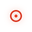

# @ohos.multimodalInput.pointer (Mouse Pointer)

<!--Kit: Input Kit-->
<!--Subsystem: MultimodalInput-->
<!--Owner: @zhaoxueyuan-->
<!--Designer: @hanruofei-->
<!--Tester: @Lyuxin-->
<!--Adviser: @zhang_yixin13-->
<!-- md-trans-meta sourceCommit=574e1b97c419a831e3ff5b620b1254fe667a5306 translatedAt=2026-06-12T02:25:53.918Z pushedAt=2026-06-12T09:30:27.751Z -->

The **pointer** module provides APIs related to pointer attribute management, such as querying and setting pointer attributes.

> **NOTE**
>
> - The initial APIs of this module are supported since API version 9. Newly added APIs will be marked with a superscript to indicate their earliest API version.

## Modules to Import

```js
import { pointer } from '@kit.InputKit';
```

## pointer.setPointerVisible

setPointerVisible(visible: boolean, callback: AsyncCallback&lt;void&gt;): void

Sets whether the mouse pointer is visible in the current window. This API uses an asynchronous callback to return the result.

**System capability**: SystemCapability.MultimodalInput.Input.Pointer

**Parameters**

| Name      | Type                       | Mandatory  | Description                                      |
| -------- | ------------------------- | ---- | ---------------------------------------- |
| visible  | boolean                   | Yes   | Whether the mouse pointer is visible in the current window. The value **true** indicates that the mouse pointer is visible, and the value **false** indicates the opposite.|
| callback | AsyncCallback&lt;void&gt; | Yes    | Callback used to return the result. If the operation is successful, **err** is **undefined**. Otherwise, **err** is an error object. |

**Error codes**

For details about the error codes, see [Universal Error Codes](../errorcode-universal.md).

| ID | Error Message            |
| ---- | --------------------- |
| 401  | Parameter error. Possible causes: 1. Mandatory parameters are left unspecified; 2. Incorrect parameter types; 3. Parameter verification failed. |
| 801  | Capability not supported. |

**Example**

```js
import { pointer } from '@kit.InputKit';
import { BusinessError } from '@kit.BasicServicesKit';

@Entry
@Component
struct Index {
  build() {
    RelativeContainer() {
      Text()
        .onClick(() => {
          try {
            // Setting Mouse Pointer Visibility
            pointer.setPointerVisible(true, (error: BusinessError) => {
              if (error) {
                console.error(`Failed to set pointer cursor visible, Code: ${(error as BusinessError).code}, message: ${(error as BusinessError).message}.`);
                return;
              }
              console.info(`Succeeded in setting pointer cursor visible.`);
            });
          } catch (error) {
            console.error(`Failed to set pointer cursor visible, Code: ${(error as BusinessError).code}, message: ${(error as BusinessError).message}.`);
          }
        })
    }
  }
}
```

## pointer.setPointerVisible

setPointerVisible(visible: boolean): Promise&lt;void&gt;

Sets whether the mouse pointer is visible in the current window. This API uses a promise to return the result.

**System capability**: SystemCapability.MultimodalInput.Input.Pointer

**Parameters**

| Name     | Type     | Mandatory  | Description                                      |
| ------- | ------- | ---- | ---------------------------------------- |
| visible | boolean | Yes   | Whether the mouse pointer is visible in the current window. The value **true** indicates that the mouse pointer is visible, and the value **false** indicates the opposite.|

**Return value**

| Type                 | Description                 |
| ------------------- | ------------------- |
| Promise&lt;void&gt; | Promise that returns no value. |

**Error codes**

For details about the error codes, see [Universal Error Codes](../errorcode-universal.md).

| ID | Error Message            |
| ---- | --------------------- |
| 401  | Parameter error. Possible causes: 1. Mandatory parameters are left unspecified; 2. Incorrect parameter types; 3. Parameter verification failed. |
| 801  | Capability not supported. |

**Example**

```js
import { pointer } from '@kit.InputKit';
import { BusinessError } from '@kit.BasicServicesKit';

@Entry
@Component
struct Index {
  build() {
    RelativeContainer() {
      Text()
        .onClick(() => {
          try {
            // Setting Mouse Pointer Visibility
            pointer.setPointerVisible(false).then(() => {
              console.info(`Succeeded in setting pointer cursor visible.`);
            }).catch((error: BusinessError) => {
              console.error(`Failed to set pointer cursor, Code: ${(error as BusinessError).code}, message: ${(error as BusinessError).message}.`);
            })
          } catch (error) {
            console.error(`Failed to set pointer cursor, Code: ${(error as BusinessError).code}, message: ${(error as BusinessError).message}.`);
          }
        })
    }
  }
}
```

## pointer.setPointerVisibleSync<sup>10+</sup>

setPointerVisibleSync(visible: boolean): void

Sets whether the mouse pointer is visible in the current window. This API returns the result synchronously.

**System capability**: SystemCapability.MultimodalInput.Input.Pointer

**Parameters**

| Name     | Type     | Mandatory  | Description                                      |
| ------- | ------- | ---- | ---------------------------------------- |
| visible | boolean | Yes   | Whether the mouse pointer is visible in the current window. The value **true** indicates that the mouse pointer is visible, and the value **false** indicates the opposite.|

**Error codes**

For details about the error codes, see [Universal Error Codes](../errorcode-universal.md).

| ID | Error Message            |
| ---- | --------------------- |
| 401  | Parameter error. Possible causes: 1. Mandatory parameters are left unspecified; 2. Incorrect parameter types; 3. Parameter verification failed. |

**Example**

```js
import { pointer } from '@kit.InputKit';

@Entry
@Component
struct Index {
  build() {
    RelativeContainer() {
      Text()
        .onClick(() => {
          try {
            // Synchronously sets the visibility of the mouse pointer
            pointer.setPointerVisibleSync(false);
            console.info(`Succeeded in setting pointer cursor visible.`);
          } catch (error) {
            console.error(`Failed to set pointer cursor visible, Code: ${(error as BusinessError).code}, message: ${(error as BusinessError).message}.`);
          }
        })
    }
  }
}
```

## pointer.isPointerVisible

isPointerVisible(callback: AsyncCallback&lt;boolean&gt;): void

Obtains the visible status of the mouse pointer. This API uses an asynchronous callback to return the result.

**System capability**: SystemCapability.MultimodalInput.Input.Pointer

**Parameters**

| Name      | Type                          | Mandatory  | Description            |
| -------- | ---------------------------- | ---- | -------------- |
| callback | AsyncCallback&lt;boolean&gt; | Yes    | Callback used to return the result. If the operation is successful, **err** is **undefined**, and **data** is the visible status of the mouse pointer (**true** if visible and **false** if invisible). Otherwise, **err** is an error object. |

**Error codes**

For details about the error codes, see [Universal Error Codes](../errorcode-universal.md).

| ID | Error Message            |
| ---- | --------------------- |
| 401  | Parameter error. Possible causes: 1. Mandatory parameters are left unspecified; 2. Incorrect parameter types; 3. Parameter verification failed. |

**Example**

```js
import { pointer } from '@kit.InputKit';
import { BusinessError } from '@kit.BasicServicesKit';

@Entry
@Component
struct Index {
  build() {
    RelativeContainer() {
      Text()
        .onClick(() => {
          try {
            // Checks whether the mouse pointer is visible
            pointer.isPointerVisible((error: BusinessError, visible: boolean) => {
              if (error) {
                console.error(`Failed to get pointer visible, Code: ${(error as BusinessError).code}, message: ${(error as BusinessError).message}.`);
                return;
              }
              console.info(`Succeeded in getting pointer visible, visible: ${JSON.stringify(visible)}.`);
            });
          } catch (error) {
            console.error(`Failed to get pointer visible, Code: ${(error as BusinessError).code}, message: ${(error as BusinessError).message}.`);
          }
        })
    }
  }
}
```

## pointer.isPointerVisible

isPointerVisible(): Promise&lt;boolean&gt;

Obtains the visible status of the mouse pointer. This API uses a promise to return the result.

**System capability**: SystemCapability.MultimodalInput.Input.Pointer

**Return value**

| Type                    | Description                 |
| ---------------------- | ------------------- |
| Promise&lt;boolean&gt; | Promise used to return the result. **true** is returned if the mouse pointer is visible; **false** is returned if the mouse pointer is hidden. |

**Example**

```js
import { pointer } from '@kit.InputKit';
import { BusinessError } from '@kit.BasicServicesKit';

@Entry
@Component
struct Index {
  build() {
    RelativeContainer() {
      Text()
        .onClick(() => {
          try {
            // Checks whether the mouse pointer is visible
            pointer.isPointerVisible().then((visible: boolean) => {
              console.info(`Succeeded in getting pointer visible, visible: ${JSON.stringify(visible)}.`);
            }).catch((error: BusinessError) => {
              console.error(`Failed to get pointer, Code: ${(error as BusinessError).code}, message: ${(error as BusinessError).message}.`);
            })
          } catch (error) {
            console.error(`Failed to get pointer visible, Code: ${(error as BusinessError).code}, message: ${(error as BusinessError).message}.`);
          }
        })
    }
  }
}
```

## pointer.isPointerVisibleSync<sup>10+</sup>

isPointerVisibleSync(): boolean

Checks whether the mouse pointer is visible in the current window. This API returns the result synchronously.

**System capability**: SystemCapability.MultimodalInput.Input.Pointer

**Return value**

| Type                    | Description                 |
| ---------------------- | ------------------- |
| boolean | Visible status of the mouse pointer. The value **true** indicates that the mouse pointer is visible, and the value **false** indicates the opposite.|

**Example**

```js
import { pointer } from '@kit.InputKit';

@Entry
@Component
struct Index {
  build() {
    RelativeContainer() {
      Text()
        .onClick(() => {
          try {
            let visible: boolean = pointer.isPointerVisibleSync();
            console.info(`Succeeded in getting pointer visible, visible: ${JSON.stringify(visible)}.`);
          } catch (error) {
            console.error(`Failed to get pointer visible, Code: ${(error as BusinessError).code}, message: ${(error as BusinessError).message}.`);
          }
        })
    }
  }
}
```

## pointer.getPointerStyle

getPointerStyle(windowId: number, callback: AsyncCallback&lt;PointerStyle&gt;): void

Obtains the mouse pointer style type of a specified window. This API can obtain only the mouse pointer style type of windows within the current application process. This API uses an asynchronous callback to return the result.

**System capability**: SystemCapability.MultimodalInput.Input.Pointer

**Parameters**

| Name      | Type                                      | Mandatory  | Description            |
| -------- | ---------------------------------------- | ---- | -------------- |
| windowId | number                                   | Yes   | Window ID. The value is an integer greater than or equal to **-1**. The value **-1** indicates the global window.<br>If the window ID is valid and the corresponding window exists, the mouse pointer style of the window is returned.<br>If the window ID is valid but the window does not exist, the global mouse pointer style is returned by default.<br>If the mouse pointer style is set for a non-existent window through [setPointerStyle](#pointersetpointerstyle), this API can obtain the mouse pointer style properly.|
| callback | AsyncCallback&lt;[PointerStyle](#pointerstyle)&gt; | Yes | Callback used to return the result. If the operation is successful, **err** is **undefined**, and **data** is the mouse pointer style type. Otherwise, **err** is an error object. In specific scenarios (obtaining the style on a window with a custom pointer style), **DEVELOPER_DEFINED_ICON** is returned. |

**Error codes**

For details about the error codes, see [Universal Error Codes](../errorcode-universal.md).

| ID | Error Message            |
| ---- | --------------------- |
| 401  | Parameter error. Possible causes: 1. Mandatory parameters are left unspecified; 2. Incorrect parameter types; 3. Parameter verification failed. |

**Example**

```js
import { pointer } from '@kit.InputKit';
import { BusinessError } from '@kit.BasicServicesKit';
import { window } from '@kit.ArkUI';

@Entry
@Component
struct Index {
  build() {
    RelativeContainer() {
      Text()
        .onClick(() => {
          // Obtains the most recent window in the application.
          window.getLastWindow(this.getUIContext().getHostContext(), (error: BusinessError, win: window.Window) => {
            if (error.code) {
              console.error(`Failed to obtain the top window, Code: ${(error as BusinessError).code}, message: ${(error as BusinessError).message}.`);
              return;
            }
            let windowId = win.getWindowProperties().id;
            if (windowId < 0) {
              console.info(`Invalid windowId.`);
              return;
            }
            try {
              // Obtains the mouse pointer style.
              pointer.getPointerStyle(windowId, (error: BusinessError, style: pointer.PointerStyle) => {
                console.info(`Succeeded in getting pointer style, style: ${JSON.stringify(style)}.`);
              });
            } catch (error) {
              console.error(`Failed to get pointer style, Code: ${(error as BusinessError).code}, message: ${(error as BusinessError).message}.`);
            }
          });
        })
    }
  }
}
```

## pointer.getPointerStyle

getPointerStyle(windowId: number): Promise&lt;PointerStyle&gt;

Obtains the mouse pointer style type. This API can obtain only the mouse pointer style type of windows within the current application process. This API uses a promise to return the result.

**System capability**: SystemCapability.MultimodalInput.Input.Pointer

**Parameters**

| Name    | Type  | Mandatory| Description    |
| -------- | ------ | ---- | -------- |
| windowId | number | Yes  | Window ID. The value is an integer greater than or equal to **-1**. The value **-1** indicates the global window.<br>If the window ID is valid and the corresponding window exists, the mouse pointer style of the window is returned.<br>If the window ID is valid but the window does not exist, the global mouse pointer style is returned by default.<br>If the mouse pointer style is set for a non-existent window through [setPointerStyle](#pointersetpointerstyle-1), this API can obtain the mouse pointer style properly.|

**Return value**

| Type                                      | Description                 |
| ---------------------------------------- | ------------------- |
| Promise&lt;[PointerStyle](#pointerstyle)&gt; | Promise object, which is used to return the mouse pointer style.|

**Error codes**

For details about the error codes, see [Universal Error Codes](../errorcode-universal.md).

| ID | Error Message            |
| ---- | --------------------- |
| 401  | Parameter error. Possible causes: 1. Mandatory parameters are left unspecified; 2. Incorrect parameter types; 3. Parameter verification failed. |

**Example**

```js
import { pointer } from '@kit.InputKit';
import { BusinessError } from '@kit.BasicServicesKit';
import { window } from '@kit.ArkUI';

@Entry
@Component
struct Index {
  build() {
    RelativeContainer() {
      Text()
        .onClick(() => {
          // Obtains the most recent window in the application.
          window.getLastWindow(this.getUIContext().getHostContext(), (error: BusinessError, win: window.Window) => {
            if (error.code) {
              console.error(`Failed to obtain the top window, Code: ${(error as BusinessError).code}, message: ${(error as BusinessError).message}.`);
              return;
            }
            let windowId = win.getWindowProperties().id;
            if (windowId < 0) {
              console.info(`Invalid windowId.`);
              return;
            }
            try {
              // Obtains the mouse pointer style.
              pointer.getPointerStyle(windowId).then((style: pointer.PointerStyle) => {
                console.info(`Succeeded in getting pointer style, style: ${JSON.stringify(style)}.`);
              }).catch((error: BusinessError) => {
                console.error(`Failed to get pointer style, Code: ${(error as BusinessError).code}, message: ${(error as BusinessError).message}.`);
              });
            } catch (error) {
              console.error(`Failed to get pointer style, Code: ${(error as BusinessError).code}, message: ${(error as BusinessError).message}.`);
            }
          });
        })
    }
  }
}
```

## pointer.getPointerStyleSync<sup>10+</sup>

getPointerStyleSync(windowId: number): PointerStyle

Queries the mouse pointer style type of a specified window, such as east arrow, west arrow, south arrow, and north arrow. This API can obtain only the mouse pointer style type of windows within the current application process.

**System capability**: SystemCapability.MultimodalInput.Input.Pointer

**Parameters**

| Name    | Type  | Mandatory| Description    |
| -------- | ------ | ---- | -------- |
| windowId | number | Yes  | Window ID. The value is an integer greater than or equal to **-1**. The value **-1** indicates the global window.<br>If the window ID is valid and the corresponding window exists, the mouse pointer style of the window is returned.<br>If the window ID is valid but the window does not exist, the global mouse pointer style is returned by default.<br>If the mouse pointer style is set for a non-existent window through [setPointerStyleSync](#pointersetpointerstylesync10), this API can obtain the mouse pointer style properly.|

**Return value**

| Type                                      | Description                 |
| ---------------------------------------- | ------------------- |
| [PointerStyle](#pointerstyle) | Mouse pointer style.|

**Error codes**

For details about the error codes, see [Universal Error Codes](../errorcode-universal.md).

| ID | Error Message            |
| ---- | --------------------- |
| 401  | Parameter error. Possible causes: 1. Mandatory parameters are left unspecified; 2. Incorrect parameter types; 3. Parameter verification failed. |

**Example**

```js
import { pointer } from '@kit.InputKit';

@Entry
@Component
struct Index {
  build() {
    RelativeContainer() {
      Text()
        .onClick(() => {
          let windowId = -1;
          try {
            let style: pointer.PointerStyle = pointer.getPointerStyleSync(windowId);
            console.info(`Succeeded in getting pointer style, style: ${JSON.stringify(style)}.`);
          } catch (error) {
            console.error(`Failed to get pointer style, Code: ${(error as BusinessError).code}, message: ${(error as BusinessError).message}.`);
          }
        })
    }
  }
}
```

## pointer.setPointerStyle

setPointerStyle(windowId: number, pointerStyle: PointerStyle, callback: AsyncCallback&lt;void&gt;): void

Sets the mouse pointer style type for a specified window. This API can set only the mouse pointer style type of windows within the current application process. For details about how to set the mouse pointer style type of the host window through the **UIExtensionAbility** process, see [setCursor](../apis-arkui/arkts-apis-uicontext-cursorcontroller.md#setcursor12). This API uses an asynchronous callback to return the result.

**System capability**: SystemCapability.MultimodalInput.Input.Pointer

**Parameters**

| Name          | Type                            | Mandatory  | Description                                 |
| ------------ | ------------------------------ | ---- | ----------------------------------- |
| windowId     | number                         | Yes   | Window ID. The value is an integer greater than or equal to 0.<br>If the window ID is valid and the corresponding window exists, the mouse pointer style of the window can be set properly.<br>If the window ID is valid but the window does not exist, the mouse pointer style can also be set properly.<br>The result can be obtained through [getPointerStyle](#pointergetpointerstyle).|
| pointerStyle | [PointerStyle](#pointerstyle) | Yes    | Pointer style. Do not pass **DEVELOPER_DEFINED_ICON**. |
| callback     | AsyncCallback&lt;void&gt;      | Yes    | Callback used to return the result. If the operation is successful, **err** is **undefined**. Otherwise, **err** is an error object. |

**Error codes**

For details about the error codes, see [Universal Error Codes](../errorcode-universal.md).

| ID | Error Message            |
| ---- | --------------------- |
| 401  | Parameter error. Possible causes: 1. Mandatory parameters are left unspecified; 2. Incorrect parameter types; 3. Parameter verification failed. |

**Example**

```js
import { pointer } from '@kit.InputKit';
import { BusinessError } from '@kit.BasicServicesKit';
import { window } from '@kit.ArkUI';

@Entry
@Component
struct Index {
  build() {
    RelativeContainer() {
      Text()
        .onClick(() => {
          // Obtains the most recent window in the application.
          window.getLastWindow(this.getUIContext().getHostContext(), (error: BusinessError, win: window.Window) => {
            if (error.code) {
              console.error(`Failed to obtain the top window, Code: ${(error as BusinessError).code}, message: ${(error as BusinessError).message}.`);
              return;
            }
            let windowId = win.getWindowProperties().id;
            if (windowId < 0) {
              console.info(`Invalid windowId.`);
              return;
            }
            try {
              // Sets the mouse pointer style.
              pointer.setPointerStyle(windowId, pointer.PointerStyle.CROSS, error => {
                console.info(`Succeeded in setting pointer style.`);
              });
            } catch (error) {
              console.error(`Failed to set pointer style, Code: ${(error as BusinessError).code}, message: ${(error as BusinessError).message}.`);
            }
          });
        })
    }
  }
}
```

## pointer.setPointerStyle

setPointerStyle(windowId: number, pointerStyle: PointerStyle): Promise&lt;void&gt;

Sets the mouse pointer style type for a specified window. This API can set only the mouse pointer style type of windows within the current application process. For details about how to set the mouse pointer style type of the host window through the **UIExtensionAbility** process, see [setCursor](../apis-arkui/arkts-apis-uicontext-cursorcontroller.md#setcursor12). This uses a promise to return the result.

**System capability**: SystemCapability.MultimodalInput.Input.Pointer

**Parameters**

| Name                 | Type                            | Mandatory  | Description              |
| ------------------- | ------------------------------ | ---- | ---------------- |
| windowId            | number                         | Yes   | Window ID. The value is an integer greater than or equal to 0.<br>If the window ID is valid and the corresponding window exists, the mouse pointer style of the window can be set properly.<br>If the window ID is valid but the window does not exist, the mouse pointer style can also be set properly.<br>The result can be obtained through [getPointerStyle](#pointergetpointerstyle-1).      |
| pointerStyle        | [PointerStyle](#pointerstyle) | Yes   | Pointer style.         |

**Return value**

| Type                 | Description                 |
| ------------------- | ------------------- |
| Promise&lt;void&gt; | Promise that returns no value. |

**Error codes**

For details about the error codes, see [Universal Error Codes](../errorcode-universal.md).

| ID | Error Message            |
| ---- | --------------------- |
| 401  | Parameter error. Possible causes: 1. Mandatory parameters are left unspecified; 2. Incorrect parameter types; 3. Parameter verification failed. |

**Example**

```js
import { pointer } from '@kit.InputKit';
import { BusinessError } from '@kit.BasicServicesKit';
import { window } from '@kit.ArkUI';

@Entry
@Component
struct Index {
  build() {
    RelativeContainer() {
      Text()
        .onClick(() => {
          // Obtains the most recent window in the application.
          window.getLastWindow(this.getUIContext().getHostContext(), (error: BusinessError, win: window.Window) => {
            if (error.code) {
              console.error(`Failed to obtain the top window, Code: ${(error as BusinessError).code}, message: ${(error as BusinessError).message}.`);
              return;
            }
            let windowId = win.getWindowProperties().id;
            if (windowId < 0) {
              console.info(`Invalid windowId.`);
              return;
            }
            try {
              // Sets the mouse pointer style.
              pointer.setPointerStyle(windowId, pointer.PointerStyle.CROSS).then(() => {
                console.info(`Succeeded in setting pointer style.`);
              }).catch((error: BusinessError) => {
                console.error(`Failed to set pointer style, Code: ${(error as BusinessError).code}, message: ${(error as BusinessError).message}.`);
              });
            } catch (error) {
              console.error(`Failed to set pointer style, Code: ${(error as BusinessError).code}, message: ${(error as BusinessError).message}.`);
            }
          });
        })
    }
  }
}
```

## pointer.setPointerStyleSync<sup>10+</sup>

setPointerStyleSync(windowId: number, pointerStyle: PointerStyle): void

Sets the mouse pointer style type for a specified window and returns the result synchronously. This API can set only the mouse pointer style type of windows within the current application process. For details about how to set the mouse pointer style type of the host window through the **UIExtensionAbility** process, see [setCursor](../apis-arkui/arkts-apis-uicontext-cursorcontroller.md#setcursor12).

**System capability**: SystemCapability.MultimodalInput.Input.Pointer

**Parameters**

| Name                 | Type                            | Mandatory  | Description              |
| ------------------- | ------------------------------ | ---- | ---------------- |
| windowId            | number                         | Yes   | Window ID. The value is an integer greater than or equal to 0.<br>If the window ID is valid and the corresponding window exists, the mouse pointer style of the window can be set properly.<br>If the window ID is valid but the window does not exist, the mouse pointer style can also be set properly.<br>The result can be obtained through [getPointerStyleSync](#pointergetpointerstylesync10).      |
| pointerStyle        | [PointerStyle](#pointerstyle) | Yes   | Pointer style.         |

**Error codes**

For details about the error codes, see [Universal Error Codes](../errorcode-universal.md).

| ID | Error Message            |
| ---- | --------------------- |
| 401  | Parameter error. Possible causes: 1. Mandatory parameters are left unspecified; 2. Incorrect parameter types; 3. Parameter verification failed. |

**Example**

```js
import { pointer } from '@kit.InputKit';
import { BusinessError } from '@kit.BasicServicesKit';
import { window } from '@kit.ArkUI';

@Entry
@Component
struct Index {
  build() {
    RelativeContainer() {
      Text()
        .onClick(() => {
          // Obtains the most recent window within the application.
          window.getLastWindow(this.getUIContext().getHostContext(), (error: BusinessError, win: window.Window) => {
            if (error.code) {
              console.error(`Failed to obtain the top window, Code: ${(error as BusinessError).code}, message: ${(error as BusinessError).message}.`);
              return;
            }
            let windowId = win.getWindowProperties().id;
            if (windowId < 0) {
              console.info(`Invalid windowId.`);
              return;
            }
            try {
              // Synchronously sets the mouse pointer style.
              pointer.setPointerStyleSync(windowId, pointer.PointerStyle.CROSS);
              console.info(`Succeeded in setting pointer style.`);
            } catch (error) {
              console.error(`Failed to get pointer size, Code: ${(error as BusinessError).code}, message: ${(error as BusinessError).message}.`);
            }
          });
        })
    }
  }
}
```

## PrimaryButton<sup>10+</sup>

Type of the primary mouse button.

**System capability**: SystemCapability.MultimodalInput.Input.Pointer

| Name                              | Value   | Description    |
| -------------------------------- | ---- | ------ |
| LEFT                          | 0    | Left button.    |
| RIGHT                             | 1    | Right button.  |

## RightClickType<sup>10+</sup>

Enumerates shortcut menu triggering modes.

**System capability**: SystemCapability.MultimodalInput.Input.Pointer

| Name                              | Value   | Description    |
| -------------------------------- | ---- | ------ |
| TOUCHPAD_RIGHT_BUTTON            | 1    |Tapping the right-button area of the touchpad.|
| TOUCHPAD_LEFT_BUTTON            | 2    |Tapping the left-button area of the touchpad.|
| TOUCHPAD_TWO_FINGER_TAP         | 3    |Tapping or pressing the touchpad with two fingers.|
| TOUCHPAD_TWO_FINGER_TAP_OR_RIGHT_BUTTON<sup>20+</sup>       | 4    |Tapping or pressing the touchpad with two fingers, or tapping the right-button area of the touchpad.|
| TOUCHPAD_TWO_FINGER_TAP_OR_LEFT_BUTTON<sup>20+</sup>         | 5    |Tapping or pressing the touchpad with two fingers, or tapping the left-button area of the touchpad.|

## PointerStyle

Mouse pointer style types.

**System capability**: SystemCapability.MultimodalInput.Input.Pointer

| Name                              | Value   | Description    |Legend|
| -------------------------------- | ---- | ------ |------ |
| DEFAULT                          | 0    | Default     ||
| EAST                             | 1    | East arrow  ||
| WEST                             | 2    | West arrow  ||
| SOUTH                            | 3    | South arrow  ||
| NORTH                            | 4    | North arrow  ||
| WEST_EAST                        | 5    | West-east arrow ||
| NORTH_SOUTH                      | 6    | North-south arrow ||
| NORTH_EAST                       | 7    | North-east arrow ||
| NORTH_WEST                       | 8    | North-west arrow ||
| SOUTH_EAST                       | 9    | South-east arrow ||
| SOUTH_WEST                       | 10   | South-west arrow ||
| NORTH_EAST_SOUTH_WEST            | 11   | North-east and south-west adjustment||
| NORTH_WEST_SOUTH_EAST            | 12   | North-west and south-east adjustment||
| CROSS                            | 13   | Cross (accurate selection)  ||
| CURSOR_COPY                      | 14   | Copy    ||
| CURSOR_FORBID                    | 15   | Forbid   ||
| COLOR_SUCKER                     | 16   | Color picker    ||
| HAND_GRABBING                    | 17   | Grabbing hand  ||
| HAND_OPEN                        | 18   | Opening hand  ||
| HAND_POINTING                    | 19   | Hand-shaped pointer  ||
| HELP                             | 20   | Help   ||
| MOVE                             | 21   | Move    ||
| RESIZE_LEFT_RIGHT                | 22   | Left and right resizing||
| RESIZE_UP_DOWN                   | 23   | Up and down resizing||
| SCREENSHOT_CHOOSE                | 24   | Screenshot crosshair||
| SCREENSHOT_CURSOR                | 25   | Screenshot    ||
| TEXT_CURSOR                      | 26   | Text selection  ||
| ZOOM_IN                          | 27   | Zoom in    ||
| ZOOM_OUT                         | 28   | Zoom out    ||
| MIDDLE_BTN_EAST                  | 29   | Scrolling east  ||
| MIDDLE_BTN_WEST                  | 30   | Scrolling west  ||
| MIDDLE_BTN_SOUTH                 | 31   | Scrolling south  |             |
| MIDDLE_BTN_NORTH                 | 32   | Scrolling north  ||
| MIDDLE_BTN_NORTH_SOUTH           | 33   | Scrolling north-south ||
| MIDDLE_BTN_NORTH_EAST            | 34   | Scrolling north-east ||
| MIDDLE_BTN_NORTH_WEST            | 35   | Scrolling north-west ||
| MIDDLE_BTN_SOUTH_EAST            | 36   | Scrolling south-east ||
| MIDDLE_BTN_SOUTH_WEST            | 37   | Scrolling south-west ||
| MIDDLE_BTN_NORTH_SOUTH_WEST_EAST | 38   | Moving as a cone in four directions||
| HORIZONTAL_TEXT_CURSOR<sup>10+</sup> | 39 | Horizontal text selection||
| CURSOR_CROSS<sup>10+</sup> | 40 | Cross||
| CURSOR_CIRCLE<sup>10+</sup> | 41 | Circle||
| LOADING<sup>10+</sup> | 42 | Animation loading<br>**Atomic service API**: This API can be used in atomic services since API version 12.||
| RUNNING<sup>10+</sup> | 43 | Animation running in the background<br>**Atomic service API**: This API can be used in atomic services since API version 12.||
| MIDDLE_BTN_EAST_WEST<sup>18+</sup>          | 44   | Scrolling east-west||
| RUNNING_LEFT<sup>22+</sup>         | 45   | Running in the background (extension 1)||
| RUNNING_RIGHT<sup>22+</sup>         | 46   | Running in the background (extension 2)||
| AECH_DEVELOPER_DEFINED_ICON<sup>22+</sup>         | 47   | Custom circular pointer||
| SCREENRECORDER_CURSOR<sup>20+</sup>         | 48   | Screen recording ||
| LASER_CURSOR<sup>22+</sup>        | 49   | Floating This pointer can be used only when the stylus enters the air mouse mode and cannot be directly set.<br>In air mouse mode, you can rotate the stylus in the air to control the movement of the virtual pointer on the screen and press the button on the stylus to turn pages up or down. This mode is used for PPT presentation and air gesture control.||
| LASER_CURSOR_DOT<sup>22+</sup>        | 50   | Click This pointer can be used only when the stylus enters the air mouse mode and cannot be directly set.<br>In air mouse mode, you can rotate the stylus in the air to control the movement of the virtual pointer on the screen and press the button on the stylus to turn pages up or down. This mode is used for PPT presentation and air gesture control.||
| LASER_CURSOR_DOT_RED<sup>22+</sup>        | 51   | Laser pointer This pointer can be used only when the stylus enters the air mouse mode and cannot be directly set.<br>In air mouse mode, you can rotate the stylus in the air to control the movement of the virtual pointer on the screen and press the button on the stylus to turn pages up or down. This mode is used for PPT presentation and air gesture control.||
| DEVELOPER_DEFINED_ICON<sup>22+</sup>        | -100 | Custom pointer. You can use [setCustomCursor](#pointersetcustomcursor15) to set a custom pointer. The custom pointer cannot be directly set using [setPointerStyle](#pointersetpointerstyle-1). |Custom pointer style, set via the API. This value is used by **getPointerStyle** to return data in specific scenarios (obtaining the style on a window where a custom pointer style has been set). It cannot be used as an input parameter of the **setCustomCursor** or **setPointerStyle** API.|

## pointer.setCustomCursor<sup>11+</sup>

setCustomCursor(windowId: number, pixelMap: image.PixelMap, focusX?: number, focusY?: number): Promise&lt;void&gt;

Sets a custom pointer style for a specified window. This API can set only the custom pointer style of windows within the current application process. For details about how to set the custom pointer style of the host window through the **UIExtensionAbility** process, see [setCustomCursor](../apis-arkui/arkts-apis-uicontext-cursorcontroller.md#setcustomcursor). This API uses a promise to return the result.

**System capability**: SystemCapability.MultimodalInput.Input.Pointer

**Parameters**

| Name   | Type    | Mandatory  | Description                                 |
| ----- | ------ | ---- | ----------------------------------- |
| windowId  | number  | Yes   | Window ID.                         |
| pixelMap  | [image.PixelMap](../apis-image-kit/arkts-apis-image-PixelMap.md) | Yes   | Custom cursor resource.|
| focusX  | number | No    | Custom cursor focus X, in px. The value must be greater than or equal to 0. The default value is **0**. |
| focusY  | number | No    | Custom cursor focus Y, in px. The value must be greater than or equal to 0. The default value is **0**. |

**Return value**

| Type                 | Description              |
| ------------------- | ---------------- |
| Promise&lt;void&gt; | Promise that returns no value. |

**Error codes**

For details about the error codes, see [Universal Error Codes](../errorcode-universal.md).

| ID | Error Message            |
| ---- | --------------------- |
| 401  | Parameter error. Possible causes: 1. Mandatory parameters are left unspecified; 2. Incorrect parameter types; 3. Parameter verification failed. |

**Example**

```js
import { pointer } from '@kit.InputKit';
import { image } from '@kit.ImageKit';
import { BusinessError } from '@kit.BasicServicesKit';
import { window } from '@kit.ArkUI';

@Entry
@Component
struct Index {
  build() {
    RelativeContainer() {
      Text()
        .onClick(() => {
          // app_icon is an example resource. Configure the resource file based on the actual requirements.
          this.getUIContext()?.getHostContext()?.resourceManager.getMediaContent(
            $r("app.media.app_icon").id, (error: BusinessError, svgFileData: Uint8Array) => {
            const svgBuffer: ArrayBuffer = svgFileData.buffer.slice(0);
            let svgImageSource: image.ImageSource = image.createImageSource(svgBuffer);
            let svgDecodingOptions: image.DecodingOptions = { desiredSize: { width: 50, height: 50 } };
            // Create a PixelMap
            svgImageSource.createPixelMap(svgDecodingOptions).then((pixelMap) => {
              window.getLastWindow(this.getUIContext().getHostContext(), (error: BusinessError, win: window.Window) => {
                let windowId = win.getWindowProperties().id;
                try {
                  pointer.setCustomCursor(windowId, pixelMap).then(() => {
                    console.info(`Succeeded in setting custom cursor.`);
                  });
                } catch (error) {
                  console.error(`Failed to set custom cursor, Code: ${(error as BusinessError).code}, message: ${(error as BusinessError).message}.`);
                }
              });
            }).catch((error: BusinessError) => {
                console.error(`Failed to create pixel map promise, Code: ${(error as BusinessError).code}, message: ${(error as BusinessError).message}.`);
              });
          });
        })
    }
  }
}
```

## CustomCursor<sup>15+</sup>

Defines custom cursor resources.

**System capability**: SystemCapability.MultimodalInput.Input.Pointer

| Name    | Type    | Read-Only    | Optional    | Description    |
| -------- | ------- | -------- | -------- | ------- |
| pixelMap  | [image.PixelMap](../apis-image-kit/arkts-apis-image-PixelMap.md) | No  | No  | Pixel map. The minimum size is subject to the minimum limit of the image. The maximum size is 256 x 256 px.|
| focusX  | number | No   | Yes   | Horizontal coordinate of the custom pointer focus, in px. This coordinate is limited by the custom pointer size. The minimum value is 0, and the maximum value is the maximum width of the resource image. The default value is **0** when this parameter is omitted. |
| focusY  | number | No   | Yes   | Vertical coordinate of the custom pointer focus, in px. This coordinate is limited by the custom pointer size. The minimum value is 0, and the maximum value is the maximum width of the resource image. The default value is **0** when this parameter is omitted. |

## CursorConfig<sup>15+</sup>

Defines custom cursor configuration.

**System capability**: SystemCapability.MultimodalInput.Input.Pointer

| Name    | Type    | Read-Only    | Optional    | Description    |
| -------- | ------- | -------- | -------- | ------- |
| followSystem  | boolean  | No  | No  | Whether to adjust the cursor size based on system settings. The value **true** means to adjust the cursor size based on system settings, and the value **false** means to use the custom cursor size. The adjustment range is [size of the cursor image, 256 x 256].|

## pointer.setCustomCursor<sup>15+</sup>

setCustomCursor(windowId: number, cursor: CustomCursor, config: CursorConfig): Promise&lt;void&gt;

Sets a custom pointer style for a specified window. This API can set only the custom pointer style of windows within the current application process. For details about how to set the custom pointer style of the host window through the **UIExtensionAbility** process, see [setCustomCursor](../apis-arkui/arkts-apis-uicontext-cursorcontroller.md#setcustomcursor). This API uses a promise to return the result.

The cursor may be switched back to the system style in the following cases: application window layout change, hot zone switching, page redirection, moving of the cursor out of the window and then back to the window, or moving of the cursor in different areas of the window. In this case, you need to reset the cursor style.

**System capability**: SystemCapability.MultimodalInput.Input.Pointer

**Parameters**

| Name   | Type   | Mandatory   | Description   |
| -------- | -------- | -------- | -------- |
| windowId  | number  | Yes   | Window ID.                         |
| cursor  | [CustomCursor](#customcursor15) | Yes   | Custom cursor resource.|
| config  | [CursorConfig](#cursorconfig15) | Yes   | Custom cursor configuration, which specifies whether to adjust the cursor size based on system settings. If **followSystem** in **CursorConfig** is set to **true**, the supported adjustment range is [size of the cursor image, 256 x 256].|

**Return value**

| Type                 | Description              |
| ------------------- | ---------------- |
| Promise&lt;void&gt; | Promise that returns no value. |

**Error codes**

For details about the error codes, see [Universal Error Codes](../errorcode-universal.md) and [Mouse Pointer Error Codes](./errorcode-pointer.md).

| ID | Error Message            |
| ---- | --------------------- |
| 401  | Parameter error. Possible causes: 1. Abnormal windowId parameter passed in. 2. Abnormal pixelMap parameter passed in; 3. Abnormal focusX parameter passed in.4. Abnormal focusY parameter passed in. |
| 26500001 | Invalid windowId. Possible causes: The window id does not belong to the current process. |

**Example**

```js
import { pointer } from '@kit.InputKit';
import { image } from '@kit.ImageKit';
import { BusinessError } from '@kit.BasicServicesKit';
import { window } from '@kit.ArkUI';

@Entry
@Component
struct Index {
  build() {
    RelativeContainer() {
      Text()
        .onClick(() => {
          // app_icon is an example resource. Configure the resource file based on the actual requirements.
          this.getUIContext()?.getHostContext()?.resourceManager.getMediaContent(
            $r("app.media.app_icon").id, (error: BusinessError, svgFileData: Uint8Array) => {
            const svgBuffer: ArrayBuffer = svgFileData.buffer.slice(0);
            let svgImageSource: image.ImageSource = image.createImageSource(svgBuffer);
            let svgDecodingOptions: image.DecodingOptions = { desiredSize: { width: 50, height: 50 } };
            // Create a PixelMap
            svgImageSource.createPixelMap(svgDecodingOptions).then((pixelMap) => {
              // Get the most recent window within the application
              window.getLastWindow(this.getUIContext().getHostContext(), (error: BusinessError, win: window.Window) => {
                let windowId = win.getWindowProperties().id;
                try {
                  // Set a custom pointer
                  pointer.setCustomCursor(windowId, { pixelMap: pixelMap, focusX: 25, focusY: 25 },
                    { followSystem: false }).then(() => {
                    console.info(`Succeeded in setting custom cursor.`);
                  });
                } catch (error) {
                  console.error(`Failed to set custom cursor, Code: ${(error as BusinessError).code}, message: ${(error as BusinessError).message}.`);
                }
              });
            }).catch((error: BusinessError) => {
                console.error(`Failed to create pixel map promise, Code: ${(error as BusinessError).code}, message: ${(error as BusinessError).message}.`);
              });
          });
        })
    }
  }
}
```

## pointer.setCustomCursorSync<sup>11+</sup>

setCustomCursorSync(windowId: number, pixelMap: image.PixelMap, focusX?: number, focusY?: number): void

Sets a custom pointer style for a specified window synchronously. This API can set only the custom pointer style of windows within the current application process. For details about how to set the custom pointer style of the host window through the **UIExtensionAbility** process, see [setCustomCursor](../apis-arkui/arkts-apis-uicontext-cursorcontroller.md#setcustomcursor).

**System capability**: SystemCapability.MultimodalInput.Input.Pointer

**Parameters**

| Name   | Type    | Mandatory  | Description                                 |
| ----- | ------ | ---- | ----------------------------------- |
| windowId  | number  | Yes   | Window ID. The value must be an integer greater than 0.                         |
| pixelMap  | [image.PixelMap](../apis-image-kit/arkts-apis-image-PixelMap.md) | Yes   | Custom cursor resource.|
| focusX  | number | No    | Custom pointer focus X, in px. The value must be greater than or equal to 0. The default value is **0**. |
| focusY  | number | No    | Custom pointer focus Y, in px. The value must be greater than or equal to 0. The default value is **0**. |

**Error codes**

For details about the error codes, see [Universal Error Codes](../errorcode-universal.md).

| ID | Error Message            |
| ---- | --------------------- |
| 401  | Parameter error. Possible causes: 1. Mandatory parameters are left unspecified; 2. Incorrect parameter types; 3. Parameter verification failed. |

**Example**

```js
import { pointer } from '@kit.InputKit';
import { image } from '@kit.ImageKit';
import { BusinessError } from '@kit.BasicServicesKit';
import { window } from '@kit.ArkUI';

@Entry
@Component
struct Index {
  build() {
    RelativeContainer() {
      Text()
        .onClick(() => {
          // app_icon is an example resource. Configure the resource file based on the actual requirements.
          this.getUIContext()?.getHostContext()?.resourceManager.getMediaContent(
            $r("app.media.app_icon").id, (error: BusinessError, svgFileData: Uint8Array) => {
            const svgBuffer = svgFileData.buffer;
            let svgImageSource: image.ImageSource = image.createImageSource(svgBuffer);
            // Width and height of the pointer image
            let svgDecodingOptions: image.DecodingOptions = { desiredSize: { width: 50, height: 50 } };
            // Create a PixelMap
            svgImageSource.createPixelMap(svgDecodingOptions).then((pixelMap) => {
              // Get the most recent window in the application
              window.getLastWindow(this.getUIContext().getHostContext(), (error: BusinessError, win: window.Window) => {
                let windowId = win.getWindowProperties().id;
                try {
                  // Set a custom pointer synchronously
                  pointer.setCustomCursorSync(windowId, pixelMap, 25, 25);
                  console.info(`Succeeded in setting custom cursor sync.`);
                } catch (error) {
                  console.error(`Failed to set custom cursor sync, Code: ${(error as BusinessError).code}, message: ${(error as BusinessError).message}.`);
                }
              });
            }).catch((error: BusinessError) => {
              console.error(`Failed to create pixel map promise, Code: ${(error as BusinessError).code}, message: ${(error as BusinessError).message}.`);
            });
          });
        }
      )
    }
  }
}
```