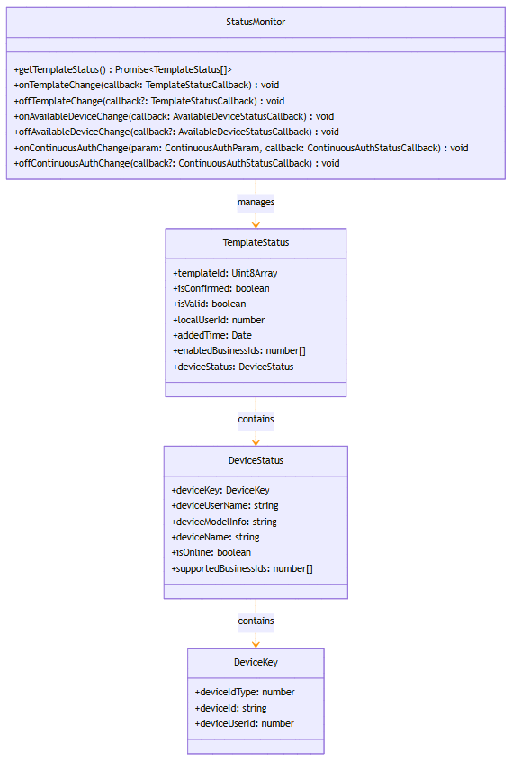

# @ohos.userIAM.companionDeviceAuth (Companion Device Authentication) (System API)
<!--Kit: User Authentication Kit-->
<!--Subsystem: UserIAM-->
<!--Owner: @WALL_EYE-->
<!--Designer: @lichangting518-->
<!--Tester: @jane_lz-->
<!--Adviser: @zengyawen-->

## Overview

The **companionDeviceAuth** module is an important part of the OpenHarmony user identity and access management (UserIAM) system. It is dedicated to companion device authentication management. This module provides the system application with capabilities such as querying and subscribing to companion devices, and managing the service scope.

This module applies to the following scenarios:
- Managing the authentication relationship between a companion device and the primary device.
- Querying and subscribing to the status changes of a companion device.
- Managing the service scope supported by a companion device.
- Implementing continuous authentication.
- Processing device selection and registration.

> **NOTE**
> 
> - The initial APIs of this module are supported since API version 23. Newly added APIs will be marked with a superscript to indicate their earliest API version.
> - The APIs provided by this module are system APIs.

## Key Classes and APIs

### Key Enums

- **[BusinessId](#businessid)**: Enumerates service IDs, which are used to identify the service scenarios supported by the companion device (for example, executing voice commands without unlocking the device).
- **[DeviceIdType](#deviceidtype)**: Enumerates device ID types (for example, unified device ID).
- **[SelectPurpose](#selectpurpose)**: Enumerates the purposes for selecting a companion device (for example, adding a template or selecting an authentication device).

### Key APIs

- **[DeviceKey](#devicekey)**: Defines key device information, including the device ID type, device ID, and device user ID.
- **[DeviceStatus](#devicestatus)**: Defines the device status, including the device key, device user name, device model, device name, online status, and list of supported service IDs.
- **[TemplateStatus](#templatestatus)**: Defines the template status, including the template ID, real-time data ID, validity flag, local user ID, adding time, list of supported service IDs, and device status.
- **[ContinuousAuthParam](#continuousauthparam)**: Defines continuous authentication parameters.
- **[DeviceSelectResult](#deviceselectresult)**: Defines the device selection result.

### Key Callbacks

- **[TemplateStatusCallback](#templatestatuscallback)**: Defines the template status callback.
- **[ContinuousAuthStatusCallback](#continuousauthstatuscallback)**: Defines the continuous authentication status callback.
- **[AvailableDeviceStatusCallback](#availabledevicestatuscallback)**: Defines the available device status callback.
- **[DeviceSelectCallback](#deviceselectcallback)**: Defines the device selection callback.

### Key Classes

- **[StatusMonitor](#statusmonitor)**: Defines the status monitor class, which is used to query and subscribe to collaboration template information.



## APIs Used in Combination

The typical process of using the **companionDeviceAuth** module is as follows:

```ts
// The following is the pseudocode for describing the calling logic. It provides only the step description and does not provide detailed executable code.
// 1. Obtain the status monitor.
let statusMonitor = companionDeviceAuth.getStatusMonitor(localUserId);

// 2. Obtain the current template status.
let templateStatusList = await statusMonitor.getTemplateStatus();

// 3. Subscribe to the template status change event.
statusMonitor.onTemplateChange((templateStatusList) => {
  // Handle the template status change.
});

// 4. Subscribe to the available device status change event.
statusMonitor.onAvailableDeviceChange((deviceStatusList) => {
  // Handle the device status change.
});

// 5. Subscribe to the continuous authentication status change event.
let authParam = { templateId: specificTemplateId };
statusMonitor.onContinuousAuthChange(authParam, (isAuthPassed, authTrustLevel) => {
  // Handle the continuous authentication status change.
});

// 6. Register the device selection callback.
companionDeviceAuth.registerDeviceSelectCallback((selectPurpose) => {
  // Return the device selection result.
  return deviceSelectResult;
});

// 7. Update the service scope supported by the template.
await companionDeviceAuth.updateEnabledBusinessIds(templateId, enabledBusinessIds);

// 8. Unsubscribe from the status change event and unregister the callback.
statusMonitor.offTemplateChange();
statusMonitor.offAvailableDeviceChange();
statusMonitor.offContinuousAuthChange();
companionDeviceAuth.unregisterDeviceSelectCallback();
```

## Modules to Import

```ts
import { companionDeviceAuth } from '@kit.UserAuthenticationKit';
```

## BusinessId

Enumerates service IDs. A service ID uniquely identifies a service scenario supported by the companion device. The service scenarios supported by different companion devices vary according to the authentication security. For example, executing voice commands without screen unlocking.

The companion device relationships of different service IDs are independent of each other and do not interfere with each other. They can be added, deleted, and authenticated independently.

Currently, the services of the companion device module include the default services of OpenHarmony, screen unlocking, application unlocking, and identity authentication before voice commands are executed on the lock screen.

Adding services has requirements on the scenarios supported by the server device. For example, the multi-screen collaboration service requires that the server device support the agency authentication scenario.

**Model constraint**: This API can be used only in the stage model.

**System capability**: SystemCapability.UserIAM.UserAuth.CompanionDeviceAuth

**System API**: This is a system API.

| **Name**| **Value**| **Description**|
| ----------- | ---- | ---------- |
| DEFAULT | 0 | Default service ID. It is system-defined and used for basic authentication scenarios.|
| VENDOR_BEGIN | 10000 | Start value of the vendor-defined service ID. The vendor can extend service IDs based on this value. The actual value must be greater than or equal to 10000 to avoid conflicts with the reserved system values \[0-9999\].|

## DeviceIdType

Enumerates device ID types. They are used to define the device service identifier type. System-defined types and vendor-defined types are supported.

**Model constraint**: This API can be used only in the stage model.

**System capability**: SystemCapability.UserIAM.UserAuth.CompanionDeviceAuth

**System API**: This is a system API.

| **Name**| **Value**| **Description**|
| ----------------- | ----- | ------------------------------------------------------------ |
| UNIFIED_DEVICE_ID | 1 | Unified device ID. It is a system-defined device service ID type, used for unified device identification across devices.|
| VENDOR_BEGIN | 10000 | Start value of the vendor-defined device ID type. The vendor can extend device ID types based on this value. The actual value must be greater than or equal to 10000 to avoid conflicts with the reserved system values [1-9999].|

## SelectPurpose

Selects the purpose of the companion device.

**Model constraint**: This API can be used only in the stage model.

**System capability**: SystemCapability.UserIAM.UserAuth.CompanionDeviceAuth

**System API**: This is a system API.

| **Name**| **Value**| **Description**|
| ----------- | ---- | ---------- |
| SELECT_ADD_DEVICE | 1 | Selects a companion device to which the template is to be added. Specifically, the purpose of the current operation is to select a device for adding a new authentication template. The system returns a list of devices suitable for adding a template.|
| SELECT_AUTH_DEVICE | 2 | Selects the companion device that provides the authentication capability. Specifically, the purpose of the current operation is to select a device that has a registered template for authentication. The system returns a list of devices that have the authentication capability.|
| VENDOR_BEGIN | 10000 | Start value of the vendor-defined selection purpose. The vendor can extend the selection purpose based on this value. The actual value must be greater than or equal to 10000 to avoid conflicts with the reserved system values \[0-9999\].|

## DeviceKey

Defines the device service ID. It uniquely identifies a device and its user, including the device ID type, device ID, and user ID.

**Model constraint**: This API can be used only in the stage model.

**System capability**: SystemCapability.UserIAM.UserAuth.CompanionDeviceAuth

**System API**: This is a system API.

| **Name**| **Type**| **Read-Only**| **Optional**| **Description**|
| ------------ | ---------- | ---- | ---- | -------------------- |
| deviceIdType | number | No| No| Enumerates device ID types. They are used to specify the type of the device service ID and can be extended based on [DeviceIdType](#deviceidtype). For example, you can use **UNIFIED_DEVICE_ID(1)** to indicate the unified device ID or use the vendor-defined value (≥ 10000).|
| deviceId | string | No| No| Device ID. It is a string that uniquely identifies a device. The format is determined by the value of **deviceIdType**.|
| deviceUserId | number | No| No| Device user ID. It is an integer greater than or equal to 0 and is used to distinguish different users on the device.|

## DeviceStatus

Defines the device status information. It describes the current status of the companion device, including the device service ID, user name, model information, device name, online status, and list of supported service IDs.

**Model constraint**: This API can be used only in the stage model.

**System capability**: SystemCapability.UserIAM.UserAuth.CompanionDeviceAuth

**System API**: This is a system API.

| **Name**| **Type**| **Read-Only**| **Optional**| **Description**|
| -------------------- | ------------------------- | ---- | ---- | ---------------------- |
| deviceKey | [DeviceKey](#devicekey) | No| No| Key device information. It uniquely identifies a device, including the device ID type, device ID, and device user ID.|
| deviceUserName | string | No| No| Device user name. It is the display name of the current user on the device, and is displayed on the device selection screen.|
| deviceModelInfo | string | No| No| Device model information. It identifies the device model, such as the product model and device type.|
| deviceName | string | No| No| Device name. It is the name or alias of a device, and is displayed to the user in the device list.|
| isOnline | boolean | No| No| Device online status. The value **true** indicates that the device is online and can communicate with the primary device. The value **false** indicates that the device is offline and cannot perform authentication interaction.|
| supportedBusinessIds | number[] | No| No| List of service IDs supported by the device. It indicates the service scenarios supported by the device, such as unlocking the screen lock and unlocking the application lock. The service scenarios supported by a device vary depending on the authentication security.|

## TemplateStatus

Describes the complete status information about a registered companion device authentication template, including the template ID, data confirmation status, validity, user ID, time when the template is added, supported services, and associated device status.

**Model constraint**: This API can be used only in the stage model.

**System capability**: SystemCapability.UserIAM.UserAuth.CompanionDeviceAuth

**System API**: This is a system API.

| **Name**| **Type**| **Read-Only**| **Optional**| **Description**|
| ------------------ | ------------------------------- | ---- | ---- | -------------------- |
| templateId | Uint8Array | No| No| Template ID. Unique ID of a companion device authentication template, which is used to specify the target template when the service scope is updated or the authentication status is subscribed to.|
| isConfirmed | boolean | No| No| Data confirmation status. The value **true** indicates that the data is real-time data and has been confirmed and synchronized with the device. The value **false** indicates that the data is cached data, which may be different from the actual device status.|
| isValid | boolean | No| No| Template validity. The value **true** indicates that the template is valid and can be used for authentication. The value **false** indicates that the template is invalid, may have been deleted or expired, and cannot be used for authentication.|
| localUserId | number | No| No| Local user ID. It specifies the user ID associated with the template on the primary device. The value is a positive integer greater than or equal to 0.|
| addedTime | Date | No| No| Template adding time. Timestamp when the template is created. The value is a Unix timestamp, that is, the number of milliseconds elapsed since 00:00:00 on January 1, 1970.|
| enabledBusinessIds | number[] | No| No| List of supported service IDs. It specifies the service scenarios where the template is enabled. You can update the service scenarios by calling the [updateEnabledBusinessIds](#companiondeviceauthupdateenabledbusinessids) API.|
| deviceStatus | [DeviceStatus](#devicestatus) | No| No| Device status information. It specifies the current status of the companion device associated with the template, including the online status and device name.|

## TemplateStatusCallback

type TemplateStatusCallback = (templateStatusList: TemplateStatus[]) => void

Defines the callback triggered for receiving notifications of template status changes. When the template status changes (for example, the template is added, deleted, or its validity changes), the system notifies the application through this callback.

**Model constraint**: This API can be used only in the stage model.

**System capability**: SystemCapability.UserIAM.UserAuth.CompanionDeviceAuth

**System API**: This is a system API.

**Parameters**

| **Name**| **Type** | **Mandatory**| **Description**|
| ------------------ | ------------------------------------- | ---- | -------------- |
| templateStatusList | [TemplateStatus](#templatestatus)[] | Yes| Template status list. The list contains the status information of all registered templates of the current user. The application can determine whether a template is valid based on the **isValid** field and whether the data is real-time data based on the **isConfirmed** field.|

## ContinuousAuthStatusCallback

type ContinuousAuthStatusCallback = (isAuthPassed: boolean, authTrustLevel?: UserAuth.AuthTrustLevel) => void

Defines the callback triggered for receiving notifications of continuous authentication status changes. When the authentication status of a companion device changes, the system applies the current authentication result and authentication reliability level through this callback notification.

**Model constraint**: This API can be used only in the stage model.

**System capability**: SystemCapability.UserIAM.UserAuth.CompanionDeviceAuth

**System API**: This is a system API.

**Parameters**

| **Name**| **Type**| **Mandatory**| **Description**|
| -------------- | ----------------------- | ---- | ------------------------------------------------------------ |
| isAuthPassed | boolean | Yes| Whether the authentication is successful. The value **true** indicates that the companion device is successfully authenticated and the user identity is confirmed. The value **false** indicates that the authentication fails, the user identity is not confirmed, or the authentication has expired.|
| authTrustLevel | [UserAuth.AuthTrustLevel](./js-apis-useriam-userauth.md#authtrustlevel8) | No| Highest authentication trust level that the companion device can currently achieve. The value can be **ATL1 (10000)**, **ATL2 (20000)**, **ATL3 (30000)**, or **ATL4 (40000)**. A higher level indicates stronger authentication security.<br>Note:<br>This parameter is provided only when **isAuthPassed** is **true**.<br>that is, the trust level of identity authentication required for typical operations. For details, see [Principles for Classifying Biometric Authentication Trust Levels](../../security/UserAuthenticationKit/user-authentication-overview.md#principles-for-classifying-biometric-authentication-trust-levels).|

## AvailableDeviceStatusCallback

type AvailableDeviceStatusCallback = (deviceStatusList: DeviceStatus[]) => void

Defines the callback triggered for receiving notifications of available device status changes. When the list of available devices changes (for example, a new device goes online or a device goes offline), the system notifies the application through this callback.

**Model constraint**: This API can be used only in the stage model.

**System capability**: SystemCapability.UserIAM.UserAuth.CompanionDeviceAuth

**System API**: This is a system API.

**Parameters**

| **Name**| **Type**| **Mandatory**| **Description**|
| ---------------- | --------------------------------- | -------------- | -------------- |
| deviceStatusList | [DeviceStatus](#devicestatus)[] | Yes| Device status list. It contains the status information about all devices that can be added as companion devices. The application can filter online devices based on the **isOnline** field and determine the service scope supported by the device based on the **supportedBusinessIds** field.|

## ContinuousAuthParam

Defines continuous authentication parameters. They are used to configure parameters related to the subscription to the continuous authentication status, for example, specifying the target template to be subscribed to.

**Model constraint**: This API can be used only in the stage model.

**System capability**: SystemCapability.UserIAM.UserAuth.CompanionDeviceAuth

**System API**: This is a system API.

| **Name**| **Type**| **Read-Only**| **Optional**| **Description**|
| ---------- | ---------- | ---- | ---- | -------------------------------------------- |
| templateId | Uint8Array | No| Yes| Template ID. It is used to specify the target template to be subscribed to. If this parameter is not specified, the continuous authentication status of all templates of the current user is subscribed to by default. If a specific template ID is specified, only the authentication status change of the template is subscribed to.|

## StatusMonitor

Status monitor object. It is used to listen for or obtain information such as the template status, continuous authentication status, and available device status. This object can be obtained by calling [getStatusMonitor](#companiondeviceauthgetstatusmonitor).

### getTemplateStatus

getTemplateStatus(): Promise&lt;TemplateStatus[]&gt;

Obtains the status of the companion device template. This API is used to query the status of all registered companion device authentication templates of the current user, including the template validity, supported services, and associated device status. This API uses a promise to return the result.

**Required permissions**: ohos.permission.USE_USER_IDM

**Model constraint**: This API can be used only in the stage model.

**System capability**: SystemCapability.UserIAM.UserAuth.CompanionDeviceAuth

**System API**: This is a system API.

**Return value**

| **Type**| **Description**|
| ------------------------------------- | ------------------------------------------------------ |
| Promise&lt;[TemplateStatus](#templatestatus)[]&gt;| Promise used to return the status list of all templates of the current user. The status of each template contains the template ID, validity, and device information. If the operation fails, an error code is returned.|

**Error codes**

For details about the error codes, see [User Authentication Error Codes](errorcode-useriam.md).

| **ID**| **Error Message**|
| -------- | ------------------------------------------------------------ |
| 32600001 | The system service is not working properly. Please try again later. |

**Example**

```ts
import { BusinessError } from '@kit.BasicServicesKit';

const localUserId = 100;
const statusMonitor = companionDeviceAuth.getStatusMonitor(localUserId);
statusMonitor.getTemplateStatus()
  .then((templateStatus) => {
    console.info(`templateStatus: ${JSON.stringify(templateStatus)}`);
  })
  .catch((error: BusinessError) => {
    console.error(`error has been captured: message:${error?.message}`);
  })
```

### onTemplateChange

onTemplateChange(callback: TemplateStatusCallback): void

Subscribes to template status change events. This API uses an asynchronous callback to return the result.

**Required permissions**: ohos.permission.USE_USER_IDM

**Model constraint**: This API can be used only in the stage model.

**System capability**: SystemCapability.UserIAM.UserAuth.CompanionDeviceAuth

**System API**: This is a system API.

**Parameters**

| **Name**| **Type**| **Mandatory**| **Description**|
| -------- | --------------------------------------------------- | ---- | ---------------------------- |
| callback | [TemplateStatusCallback](#templatestatuscallback) | Yes| Callback used to receive the template status.|

**Error codes**

For details about the error codes, see [User Authentication Error Codes](errorcode-useriam.md).

| **ID**| **Error Message**|
| -------- | ------------------------------------------------------------ |
| 32600001 | The system service is not working properly. Please try again later. |

**Example**

```ts
import { BusinessError } from '@kit.BasicServicesKit';

try {
  const localUserId = 100;
  const statusMonitor = companionDeviceAuth.getStatusMonitor(localUserId);
  const handler = (templates: companionDeviceAuth.TemplateStatus[]): void => {
    console.info('template status updated');
  };
  statusMonitor.onTemplateChange(handler);
} catch (error) {
  const message = (error as BusinessError).message;
  console.error(`error has been captured: message:${message}`);
}
```

### offTemplateChange

offTemplateChange(callback?: TemplateStatusCallback): void

Unsubscribes from template status change events. This API uses an asynchronous callback to return the result.

**Required permissions**: ohos.permission.USE_USER_IDM

**Model constraint**: This API can be used only in the stage model.

**System capability**: SystemCapability.UserIAM.UserAuth.CompanionDeviceAuth

**System API**: This is a system API.

**Parameters**

| **Name**| **Type**| **Mandatory**| **Description**|
| -------- | --------------------------------------------------- | ---- | ------------------------------------------------------------ |
| callback | [TemplateStatusCallback](#templatestatuscallback) | No| Callback to unregister. If this parameter is not specified, all callbacks corresponding to the event type are unsubscribed.|

**Error codes**

For details about the error codes, see [User Authentication Error Codes](errorcode-useriam.md).

| **ID**| **Error Message**|
| -------- | ------------------------------------------------------------ |
| 32600001 | The system service is not working properly. Please try again later. |

**Example**

```ts
import { BusinessError } from '@kit.BasicServicesKit';

try {
  const localUserId = 100;
  const statusMonitor = companionDeviceAuth.getStatusMonitor(localUserId);
  const handler = (templates: companionDeviceAuth.TemplateStatus[]): void => {
    console.info('template status updated');
  };
  statusMonitor.onTemplateChange(handler);
  statusMonitor.offTemplateChange(handler);
} catch (error) {
  const message = (error as BusinessError).message;
  console.error(`error has been captured: message:${message}`);
}
```

### onAvailableDeviceChange

onAvailableDeviceChange(callback: AvailableDeviceStatusCallback): void

Subscribes to the events for status changes of companion devices that can be added. This API uses an asynchronous callback to return the result.

**Required permissions**: ohos.permission.USE_USER_IDM

**Model constraint**: This API can be used only in the stage model.

**System capability**: SystemCapability.UserIAM.UserAuth.CompanionDeviceAuth

**System API**: This is a system API.

**Parameters**

| **Name**| **Type**| **Mandatory**| **Description**|
| -------- | ------------------------------------------------------------ | ---- | ---------------------------- |
| callback | [AvailableDeviceStatusCallback](#availabledevicestatuscallback) | Yes| Callback used to return the available device status.|

**Error codes**

For details about the error codes, see [User Authentication Error Codes](errorcode-useriam.md).

| **ID**| **Error Message**|
| -------- | ------------------------------------------------------------ |
| 32600001 | The system service is not working properly. Please try again later. |

**Example**

```ts
import { BusinessError } from '@kit.BasicServicesKit';

try {
  const localUserId = 100;
  const statusMonitor = companionDeviceAuth.getStatusMonitor(localUserId);
  const handler = (deviceStatusList: companionDeviceAuth.DeviceStatus[]): void => {
    console.info('available device changed');
  };
  statusMonitor.onAvailableDeviceChange(handler);
} catch (error) {
  const message = (error as BusinessError).message;
  console.error(`error has been captured: message:${message}`);
}
```

### offAvailableDeviceChange

offAvailableDeviceChange(callback?: AvailableDeviceStatusCallback): void

Unsubscribes from the events for status changes of companion devices that can be added. This API uses an asynchronous callback to return the result.

**Required permissions**: ohos.permission.USE_USER_IDM

**Model constraint**: This API can be used only in the stage model.

**System capability**: SystemCapability.UserIAM.UserAuth.CompanionDeviceAuth

**System API**: This is a system API.

**Parameters**

| **Name**| **Type**| **Mandatory**| **Description**|
| -------- | ------------------------------------------------------------ | ---- | -------------------- |
| callback | [AvailableDeviceStatusCallback](#availabledevicestatuscallback) | No| Callback to unregister. If this parameter is not specified, all callbacks corresponding to the event type are unsubscribed.|

**Error codes**

For details about the error codes, see [User Authentication Error Codes](errorcode-useriam.md).

| **ID**| **Error Message**|
| -------- | ------------------------------------------------------------ |
| 32600001 | The system service is not working properly. Please try again later. |

**Example**

```ts
import { BusinessError } from '@kit.BasicServicesKit';

try {
  const localUserId = 100;
  const statusMonitor = companionDeviceAuth.getStatusMonitor(localUserId);
  const handler = (deviceStatusList: companionDeviceAuth.DeviceStatus[]): void => {
    console.info('available device changed');
  };
  statusMonitor.onAvailableDeviceChange(handler);
  statusMonitor.offAvailableDeviceChange(handler);
} catch (error) {
  const message = (error as BusinessError).message;
  console.error(`error has been captured: message:${message}`);
}
```

### onContinuousAuthChange

onContinuousAuthChange(param: ContinuousAuthParam, callback: ContinuousAuthStatusCallback): void

Subscribes to the events for continuous authentication status of companion devices. This API uses an asynchronous callback to return the result.

**Required permissions**: ohos.permission.USE_USER_IDM

**Model constraint**: This API can be used only in the stage model.

**System capability**: SystemCapability.UserIAM.UserAuth.CompanionDeviceAuth

**System API**: This is a system API.

**Parameters**

| **Name**| **Type**| **Mandatory**| **Description**|
| -------- | ------------------------------------------------------------ | ---- | -------------------------------------------- |
| param | [ContinuousAuthParam](#continuousauthparam) | Yes| Device for which the events are subscribed to.|
| callback | [ContinuousAuthStatusCallback](#continuousauthstatuscallback) | Yes| Called when the continuous authentication status of the device changes.|

**Error codes**

For details about the error codes, see [User Authentication Error Codes](errorcode-useriam.md).

| **ID**| **Error Message**|
| -------- | ------------------------------------------------------------ |
| 32600001 | The system service is not working properly. Please try again later. |
| 32600002 | The template is not found. |

**Example**

```ts
import { BusinessError } from '@kit.BasicServicesKit';
import { userAuth } from '@kit.UserAuthenticationKit';

const localUserId = 100;
try {
  const statusMonitor = companionDeviceAuth.getStatusMonitor(localUserId);
  const continuousAuthParam: companionDeviceAuth.ContinuousAuthParam = {
    templateId: new Uint8Array([])
  };
  const handler = (isAuthPassed: boolean, authTrustLevel?: userAuth.AuthTrustLevel): void => {
    console.info('continuous auth changed');
    console.info(`isAuthPassed: ${isAuthPassed}`);
    if (authTrustLevel !== undefined) {
      console.info(`authTrustLevel: ${authTrustLevel}`);
    }
  };

  statusMonitor.onContinuousAuthChange(continuousAuthParam, handler);
} catch (error) {
  const message = (error as BusinessError).message;
  console.error(`error has been captured: message:${message}`);
}
```

### offContinuousAuthChange

offContinuousAuthChange(callback?: ContinuousAuthStatusCallback): void

Unsubscribes from the continuous authentication status change event of the companion device. After the unsubscription, the application will no longer receive notifications of continuous authentication status changes. This API uses an asynchronous callback to return the result.

**Required permissions**: ohos.permission.USE_USER_IDM

**Model constraint**: This API can be used only in the stage model.

**System capability**: SystemCapability.UserIAM.UserAuth.CompanionDeviceAuth

**System API**: This is a system API.

**Parameters**

| **Name**| **Type**| **Mandatory**| **Description**|
| -------- | ------------------------------------------------------------ | ---- | ------------------------------------------------------------ |
| callback | [ContinuousAuthStatusCallback](#continuousauthstatuscallback) | No| Callback to unregister. If this parameter is passed, only the specified callback is unregistered. If this parameter is not passed, all callbacks registered with **onContinuousAuthChange** are unregistered.|

**Error codes**

For details about the error codes, see [User Authentication Error Codes](errorcode-useriam.md).

| **ID**| **Error Message**|
| -------- | ------------------------------------------------------------ |
| 32600001 | The system service is not working properly. Please try again later. |

**Example**

```ts
import { BusinessError } from '@kit.BasicServicesKit';
import { userAuth } from '@kit.UserAuthenticationKit';

const localUserId = 100;
try {
  const statusMonitor = companionDeviceAuth.getStatusMonitor(localUserId);
  const continuousAuthParam: companionDeviceAuth.ContinuousAuthParam = {
    templateId: new Uint8Array([])
  };
  const handler = (isAuthPassed: boolean, authTrustLevel?: userAuth.AuthTrustLevel): void => {
    console.info('continuous auth changed');
    console.info(`isAuthPassed: ${isAuthPassed}`);
    if (authTrustLevel !== undefined) {
      console.info(`authTrustLevel: ${authTrustLevel}`);
    }
  };

  statusMonitor.onContinuousAuthChange(continuousAuthParam, handler);
  statusMonitor.offContinuousAuthChange(handler);
} catch (error) {
  const message = (error as BusinessError).message;
  console.error(`error has been captured: message:${message}`);
}
```

## companionDeviceAuth.getStatusMonitor

getStatusMonitor(localUserId: number): StatusMonitor

Obtains the status monitor. This API is used to obtain the status monitor object of a specified user. The object can be used to query and subscribe to the template status, continuous authentication status, and available device status of the companion device.

**Required permissions**: ohos.permission.USE_USER_IDM

**Model constraint**: This API can be used only in the stage model.

**System capability**: SystemCapability.UserIAM.UserAuth.CompanionDeviceAuth

**System API**: This is a system API.

**Parameters**

| **Name**| **Type**| **Mandatory**| **Description**|
| ----------- | ---- | ---- | ------------ |
| localUserId | number | Yes| Local user ID. User ID on the primary device, which is a positive integer greater than or equal to 0. It is used to obtain the status monitor of the companion device corresponding to the user.|

**Return value**

| **Type**| **Description**|
| --------------------------------- | ------------------------------ |
| [StatusMonitor](#statusmonitor) | Status monitor object. It can be used to query the template status ([getTemplateStatus](#gettemplatestatus)), subscribe to template changes ([onTemplateChange](#ontemplatechange)), subscribe to available device status changes ([onAvailableDeviceChange](#onavailabledevicechange)), and subscribe to continuous authentication status changes ([onContinuousAuthChange](#oncontinuousauthchange)).|

**Error codes**

For details about the error codes, see [Universal Error Codes](../errorcode-universal.md) and [User Authentication Error Codes](errorcode-useriam.md).

| **ID**| **Error Message**|
| -------- | ------------------------------------------------------------ |
| 201 | Permission denied. |
| 202 | Not system application. |
| 32600001 | The system service is not working properly. Please try again later. |
| 32600002 | The local user is not found. |

**Example**

```ts
import { BusinessError } from '@kit.BasicServicesKit';
import { userAuth } from '@kit.UserAuthenticationKit';

const localUserId = 100;
try {
  const statusMonitor = companionDeviceAuth.getStatusMonitor(localUserId);
  const continuousAuthParam: companionDeviceAuth.ContinuousAuthParam = {
    templateId: new Uint8Array([])
  };
  const handler = (isAuthPassed: boolean, authTrustLevel?: userAuth.AuthTrustLevel): void => {
    console.info('continuous auth changed');
    console.info(`isAuthPassed: ${isAuthPassed}`);
    if (authTrustLevel !== undefined) {
      console.info(`authTrustLevel: ${authTrustLevel}`);
    }
  };

  statusMonitor.onContinuousAuthChange(continuousAuthParam, handler);
  statusMonitor.offContinuousAuthChange(handler);
} catch (error) {
  const message = (error as BusinessError).message;
  console.error(`error has been captured: message:${message}`);
}
```

## DeviceSelectResult

Returns the result of companion device selection. It is used to return the device information and extended context selected by the user in the device selection callback.

**Model constraint**: This API can be used only in the stage model.

**System capability**: SystemCapability.UserIAM.UserAuth.CompanionDeviceAuth

**System API**: This is a system API.

| **Name**| **Type**| **Read-Only**| **Optional**| **Description**|
| ---------------- | --------------------------- | ---- | ---- | ------------------------------------------ |
| deviceKeys | [DeviceKey](#devicekey)[] | No| No| Device information list. It contains the device service identifier information selected by the user. Each **DeviceKey** contains the device ID type, device ID, and device user ID. The system will perform subsequent operations such as adding a template or performing authentication based on this information.|
| selectionContext | Uint8Array | No| Yes| Device selection context. It carries extension information in JSON format and can be used to pass additional parameters in the device selection process, such as authentication configuration and service scenario identifier.|

## DeviceSelectCallback

type DeviceSelectCallback = (selectPurpose: number) => DeviceSelectResult

Defines the callback triggered for the companion device selection. When the system requires the user to select a companion device (for example, when adding a template or performing authentication), this callback is triggered. The application needs to return the information about the selected device.

**Model constraint**: This API can be used only in the stage model.

**System capability**: SystemCapability.UserIAM.UserAuth.CompanionDeviceAuth

**System API**: This is a system API.

**Parameters**

| **Name**| **Type**| **Mandatory**| **Description**|
| ------------- | ---- | ---- | ------------------------------------------------------------ |
| selectPurpose | number | Yes| Selection purpose. It identifies the purpose of the current device selection. For details about the value, see [SelectPurpose](#selectpurpose). **SELECT_ADD_DEVICE(1)** means to select the device for adding a template, and **SELECT_AUTH_DEVICE(2)** means to select the device for authentication. Vendors can customize the extended value (greater than or equal to 10000). The application should return the corresponding device list based on the selection purpose.|

**Return value**

| **Type**| **Description**|
| ------------------------------------------- | -------------------- |
| [DeviceSelectResult](#deviceselectresult) | Device selection result. It contains the device information list (**deviceKeys**) selected by the user and the optional extended context (**selectionContext**).|

## companionDeviceAuth.registerDeviceSelectCallback

registerDeviceSelectCallback(callback: DeviceSelectCallback): void

Registers a callback for companion device selection. When the system requires the user to select a companion device, this callback is triggered. The application needs to return the information about the selected device in the callback. Through this callback, the application can implement custom device selection logic, for example, displaying a device selection screen for the user to select a device.

**Required permissions**: ohos.permission.USE_USER_IDM

**Model constraint**: This API can be used only in the stage model.

**System capability**: SystemCapability.UserIAM.UserAuth.CompanionDeviceAuth

**System API**: This is a system API.

**Parameters**

| **Name**| **Type**| **Mandatory**| **Description**|
| -------- | ----------------------------------------------- | ---- | -------------------- |
| callback | [DeviceSelectCallback](#deviceselectcallback) | Yes| Callback for the companion device selection. When this callback is invoked, **selectPurpose** is passed in. The application needs to return the corresponding **DeviceSelectResult**, including the information about the selected device.|

**Error codes**

For details about the error codes, see [Universal Error Codes](../errorcode-universal.md) and [User Authentication Error Codes](errorcode-useriam.md).

| **ID**| **Error Message**|
| -------- | ------------------------------------------------------------ |
| 201 | Permission denied. |
| 202 | Not system application. |
| 32600001 | The system service is not working properly. Please try again later. |

**Example**

```ts
import { BusinessError } from '@kit.BasicServicesKit';

try {
  companionDeviceAuth.registerDeviceSelectCallback((purpose) => {
    const addDeviceId = 'addDeviceId';
    const otherDeviceId = 'otherDeviceId';
    const addDeviceUserId = 100;
    const otherDeviceUserId = 100;
    if (purpose === companionDeviceAuth.SelectPurpose.SELECT_ADD_DEVICE) {
      return {
        deviceKeys: [{
          deviceIdType: companionDeviceAuth.DeviceIdType.UNIFIED_DEVICE_ID,
          deviceId: addDeviceId,
          deviceUserId: addDeviceUserId
        }]
      };
    }
    return {
      deviceKeys: [{
        deviceIdType: companionDeviceAuth.DeviceIdType.UNIFIED_DEVICE_ID,
        deviceId: otherDeviceId,
        deviceUserId: otherDeviceUserId
      }]
    };
  })
} catch (error) {
  const err = error as BusinessError;
  console.error(`error has been captured: ${err.code} ${err.message}`);
}
```

## companionDeviceAuth.unregisterDeviceSelectCallback

unregisterDeviceSelectCallback(): void

Unregisters a callback for companion device selection. After the callback is unregistered, the system will no longer invoke the device selection callback registered by the application, and the device selection will fall back to the default system behavior.

**Required permissions**: ohos.permission.USE_USER_IDM

**Model constraint**: This API can be used only in the stage model.

**System capability**: SystemCapability.UserIAM.UserAuth.CompanionDeviceAuth

**System API**: This is a system API.

**Error codes**

For details about the error codes, see [Universal Error Codes](../errorcode-universal.md) and [User Authentication Error Codes](errorcode-useriam.md).

| **ID**| **Error Message**|
| -------- | ------------------------------------------------------------ |
| 201 | Permission denied. |
| 202 | Not system application. |
| 32600001 | The system service is not working properly. Please try again later. |

**Example**
<!--code_no_check-->

```ts
import { BusinessError } from '@kit.BasicServicesKit';

try {
  companionDeviceAuth.unregisterDeviceSelectCallback();
} catch (error) {
  const err = error as BusinessError;
  console.error(`error has been captured: ${err.code} ${err.message}`);
}
```

## companionDeviceAuth.updateEnabledBusinessIds

updateEnabledBusinessIds(templateId: Uint8Array, enabledBusinessIds: number[]): Promise&lt;void&gt;

Updates the service scope supported by the specified companion device template. This API is used to modify the list of service IDs enabled for a registered template, thereby controlling the service scenarios in which the template can be used. This API uses a promise to return the result.

**Required permissions**: ohos.permission.USE_USER_IDM

**Model constraint**: This API can be used only in the stage model.

**System capability**: SystemCapability.UserIAM.UserAuth.CompanionDeviceAuth

**System API**: This is a system API.

**Parameters**

| **Name**| **Type**| **Mandatory**| **Description**|
| ------------------ | ---------- | ---- | ------------------------ |
| templateId | Uint8Array | Yes| ID of the target template. Unique ID of the template whose service scope is to be updated, which can be obtained through [getTemplateStatus](#gettemplatestatus).|
| enabledBusinessIds | number[] | Yes| ID set of services supported by the template. It indicates the list of service scenarios to be enabled, such as [DEFAULT] and [Service ID for unlocking the screen]. Different service IDs correspond to different authentication scenarios. You can configure the service IDs based on service requirements.|

**Return value**

| **Type**               | **Description**           |
| ------------------- | --------------- |
| Promise&lt;void&gt; | Promise that returns no value.|

**Error codes**

For details about the error codes, see [Universal Error Codes](../errorcode-universal.md) and [User Authentication Error Codes](errorcode-useriam.md).

| **ID**| **Error Message**|
| -------- | ------------------------------------------------------------ |
| 201 | Permission denied. |
| 202 | Not system application. |
| 32600001 | The system service is not working properly. Please try again later. |
| 32600002 | The template is not found. |
| 32600003 | The business ID is invalid. |

**Example**

```ts
import { BusinessError } from '@kit.BasicServicesKit';

const templateId = new Uint8Array([1, 2, 3]);
companionDeviceAuth.updateEnabledBusinessIds(templateId, [companionDeviceAuth.BusinessId.DEFAULT])
  .then(() => {
    console.info('business scope updated');
  })
  .catch((err: BusinessError) => {
    console.error(`error has been captured: code: ${err.code}, message: ${err.message}`);
  })
```
