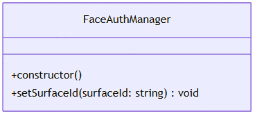

# @ohos.userIAM.faceAuth (Facial Authentication) (System API)

<!--Kit: User Authentication Kit-->
<!--Subsystem: UserIAM-->
<!--Owner: @WALL_EYE-->
<!--Designer: @lichangting518-->
<!--Tester: @jane_lz-->
<!--Adviser: @zengyawen-->

## Overview

The **faceAuth** module is an important part of the OpenHarmony user identity and access management (UserIAM) and is used to manage face enrollment. This module provides core APIs for face authentication management, enabling developers to enroll and manage face information within their applications.

This module applies to the following scenarios:
- Applications that need to implement the face enrollment function.
- Scenarios where the system-level identity authentication service needs to be integrated.
- Applications that need to customize the face preview page.


> **NOTE**
>
> - The initial APIs of this module are supported since API version 9. Newly added APIs will be marked with a superscript to indicate their earliest API version.
>
> - The APIs provided by this module are system APIs.

## Key Classes and APIs

### Key Classes

- [FaceAuthManager](#faceauthmanager): core management class of the **faceAuth** module, which provides basic features required during face enrollment.

It provides the following features:
- Creating a face authentication manager instance.
- Setting the **surface** object of the preview page during face enrollment to the face authentication service.



## APIs Called in Pairs

The typical process of using the **faceAuth** module is as follows:

```ts
// The following is the pseudocode for describing the calling logic. It provides only the step description and does not provide detailed executable code.
// 1. Create a FaceAuthManager instance.
let faceAuthManager = new faceAuth.FaceAuthManager();

// 2. Obtain the surface ID of the XComponent (using XComponentController).
let surfaceId = xComponentController.getXComponentSurfaceId();

// 3. Set the surface ID for the face preview page.
faceAuthManager.setSurfaceId(surfaceId);

// 4. Call the addCredential method of the osAccount module to complete face enrollment.
// osAccount.userIdentityManager.addCredential(...)
```

## Modules to Import

```ts
import { faceAuth } from '@kit.UserAuthenticationKit';
```

## FaceAuthManager

Provides APIs for facial authentication management. It provides management features during face enrollment, including setting the surface ID of the face preview page.

### constructor

constructor()

Creates a face authentication manager object.

**System capability**: SystemCapability.UserIAM.UserAuth.FaceAuth

**System API**: This is a system API.

**Return value**

| Type                  | Description                |
| ---------------------- | -------------------- |
| [FaceAuthManager](#faceauthmanager) | **FaceAuthManager** object. After the object is created, you can call the **setSurfaceId** method to set the face preview page.|

**Example**

```ts
import { faceAuth } from '@kit.UserAuthenticationKit';

let faceAuthManager = new faceAuth.FaceAuthManager();
```

### setSurfaceId

setSurfaceId(surfaceId: string): void

Sets the surface ID of the face preview page during face enrollment. This API must be used together with [addCredential](../apis-basic-services-kit/js-apis-osAccount-sys.md#addcredential8) to display the face preview page through the surface of the [getXComponentSurfaceId](../apis-arkui/arkui-ts/ts-basic-components-xcomponent.md#getxcomponentsurfaceid9) component.

**System capability**: SystemCapability.UserIAM.UserAuth.FaceAuth

**System API**: This is a system API.

**Required permissions**: ohos.permission.MANAGE_USER_IDM

**Parameters**

| Name        | Type                              | Mandatory| Description                      |
| -------------- | ---------------------------------- | ---- | -------------------------- |
| surfaceId       | string     | Yes  | ID of the surface held by [XComponent](../apis-arkui/arkui-ts/ts-basic-components-xcomponent.md#getxcomponentsurfaceid9). This ID is used to display the face preview page during face enrollment. It must be obtained using the **getXComponentSurfaceId** method of **XComponentController**.|

For details about the error codes, see [Universal Error Codes](../errorcode-universal.md) and [User Authentication Error Codes](errorcode-useriam.md).

**Error codes**

| ID| Error Message|
| -------- | ------- |
| 201 | Permission denied. |
| 202 | Permission denied. Called by non-system application. |
| 12700001 | The service is unavailable. |

**Example**

```ts
import { faceAuth } from '@kit.UserAuthenticationKit';
import { BusinessError } from '@kit.BasicServicesKit';

// The surfaceId is obtained from the XComponent control. The surfaceId here is only an example.
let surfaceId = '123456';
let manager = new faceAuth.FaceAuthManager();
try {
  manager.setSurfaceId(surfaceId);
  console.info('set surface id successfully.');
} catch (error) {
  const err: BusinessError = error as BusinessError;
  console.error(`set surface id failed, Code is ${err?.code}, message is ${err?.message}`);
}
```
