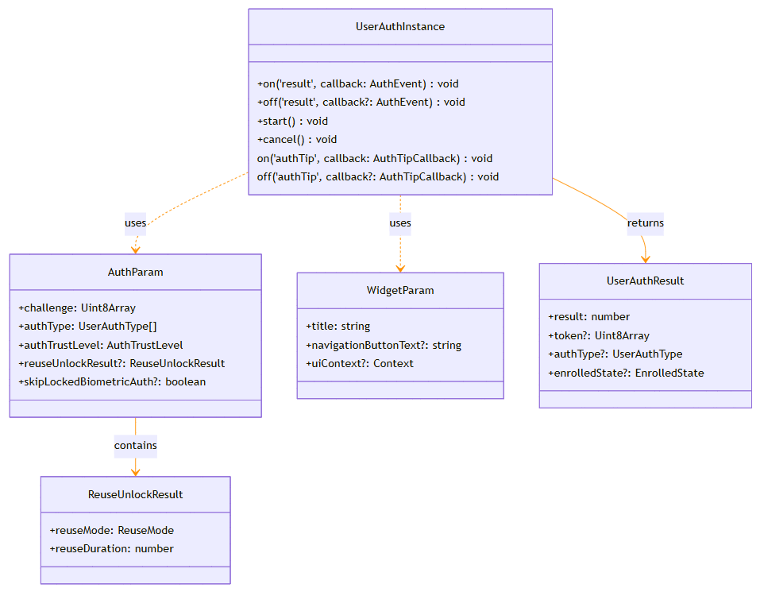

# @ohos.userIAM.userAuth (User Authentication)

<!--Kit: User Authentication Kit-->
<!--Subsystem: UserIAM-->
<!--Owner: @WALL_EYE-->
<!--Designer: @lichangting518-->
<!--Tester: @jane_lz-->
<!--Adviser: @zengyawen-->

## Overview

The **userAuth** module is the core module for user authentication in OpenHarmony. It provides authentication capabilities in scenarios such as device unlocking, payment verification, and application login.

This module supports multiple biometric authentication methods (face, fingerprint) and password authentication (PIN), and provides various security trust levels. Since API version 26.0.0, the companion device authentication mode is added.

This module applies to the following scenarios:
- Device unlocking authentication.
- Financial payment verification.
- Application login protection.
- Confirmation for sensitive operations.


> **NOTE**<br>
>
> The initial APIs of this module are supported since API version 6. Newly added APIs will be marked with a superscript to indicate their earliest API version.

## Key Classes and APIs

### Key Enums

- [UserAuthType](#userauthtype8): Enumerates the authentication types (**PIN**, **FACE**, **FINGERPRINT**, and **COMPANION_DEVICE**).
- [AuthTrustLevel](#authtrustlevel8): Enumerates the authentication trust levels (ATL1 to ATL4).
- [UserAuthResultCode](#userauthresultcode9): Enumerates the authentication result codes.
- [ReuseMode](#reusemode12): Enumerates the authentication result reuse modes.
- [UserAuthTipCode](#userauthtipcode20): Enumerates the authentication tip codes.

### Key APIs

- [AuthParam](#authparam10): Describes the authentication parameters, including the challenge value, authentication type list, trust level, and reuse information.
- [WidgetParam](#widgetparam10): Describes the display parameters of the authentication widget, including the title, navigation button text, and window mode.
- [UserAuthResult](#userauthresult10): Describes the authentication result, including the result code, authentication token, and authentication type.
- [ReuseUnlockResult](#reuseunlockresult12): Describes the authentication result reuse information.
- [EnrolledState](#enrolledstate12): Describes the credential enrollment status.
- [AuthLockState](#authlockstate22): Describes the authentication lock status.

### Key Classes

- [UserAuthInstance](#userauthinstance10): Defines the user authentication instance class, which provides capabilities such as authentication execution, cancellation, and event subscription.



## APIs Used in Combination

The typical process of using the **userAuth** module for authentication is as follows:

```ts
// The following is the pseudocode for describing the calling logic. It provides only the step description and does not provide detailed executable code.
// 1. Check whether the authentication capability is available.
userAuth.getAvailableStatus(userAuth.UserAuthType.FACE, userAuth.AuthTrustLevel.ATL3);

// 2. Obtain the authentication instance.
let authInstance = userAuth.getUserAuthInstance({
  challenge: new Uint8Array([]), // challenge is used to prevent replay attacks and must be obtained using the secure random number generator.
  authType: [userAuth.UserAuthType.FACE, userAuth.UserAuthType.PIN],
  authTrustLevel: userAuth.AuthTrustLevel.ATL3
});

// 3. Subscribe to the authentication result event.
authInstance.on('result', (result: userAuth.UserAuthResult) => {
  // Process the authentication result.
});

// 4. (Optional) Subscribe to the authentication prompt event.
authInstance.on('authTip', (tipCode: userAuth.UserAuthTipCode) => {
  // Process the authentication prompt.
});

// 5. Start authentication.
authInstance.start();

// 6. (Optional) Unsubscribe from the event after authentication is complete.
authInstance.off('result');
authInstance.off('authTip');
```

Process of querying the authentication lock status:

```javascript
// The following is the pseudocode for describing the calling logic. It provides only the step description and does not provide detailed executable code.
// 1. Query the authentication lock status.
let lockState = await userAuth.getAuthLockState(userAuth.UserAuthType.FACE);

// 2. Determine whether to perform authentication based on the lock status.
if (!lockState.isLocked) {
  // Execute the authentication process.
}
```

## Modules to Import

```ts
import { userAuth } from '@kit.UserAuthenticationKit';
```

## Constants

**System capability**: SystemCapability.UserIAM.UserAuth.Core

| Name       | Type  | Value  | Description      |
| ----------- | ---- | ---- | ---------- |
| MAX_ALLOWABLE_REUSE_DURATION<sup>12+</sup>     | number | 300000   | Maximum reuse duration of the authentication result, in milliseconds. The value is **300000** (5 minutes). This constant is used to limit the maximum duration for reusing an authentication result, preventing security risks caused by reusing expired authentication results for a long time. It can be used as the maximum value of the **reuseDuration** parameter in [ReuseUnlockResult](#reuseunlockresult12).<br> **Atomic service API**: This API can be used in atomic services since API version 12.|
| PERMANENT_LOCKOUT_DURATION<sup>22+</sup>      | number | 0x7fffffff | Permanent lockout duration, in milliseconds. The value is **0x7fffffff**. When the number of failed authentication attempts reaches the upper limit, the authenticator enters the permanent lockout status. In this case, PIN authentication is required for unlocking. This value is used to identify the permanent lockout status of the authenticator, which can be returned by the **lockoutDuration** field in [AuthLockState](#authlockstate22).<br> **Atomic service API**: This API can be used in atomic services since API version 22.|

## AuthLockState<sup>22+</sup>

Enumerates the lockout status of an identity authentication type. This API is used to query the lockout status of a specified authentication type (such as face, fingerprint, or PIN), including whether the authentication type is locked out, the number of remaining attempts, and the lockout duration. If a user fails to be authenticated for multiple times, the authenticator may enter a temporary or permanent lockout state. The application can notify the user based on the lockout information.

**Atomic service API**: This API can be used in atomic services since API version 22.

**System capability**: SystemCapability.UserIAM.UserAuth.Core

| Name        | Type   | Read-Only| Optional| Description                |
| ------------ | ---------- | ---- | ---- | -------------------- |
| isLocked       | boolean | No  |  No| Whether the authentication is locked. The value **true** indicates that the authentication type is locked and cannot be used for authentication, and **false** indicates the opposite. The lockout status is usually triggered by multiple consecutive authentication failures.|
| remainingAuthAttempts        | number | No  |  No| Number of remaining attempts before the authentication is locked. The maximum value is **5**. The value decreases by 1 each time the authentication fails. When the value decreases to 0, the authenticator is locked. This parameter is valid only when **isLocked** is set to **false**.|
| lockoutDuration        | number | No  |  No| Remaining lockout duration, in milliseconds. This parameter is valid only when **isLocked** is set to **true**.<br>If the authenticator is permanently locked, the value is [PERMANENT_LOCKOUT_DURATION](#constants), indicating that the authenticator has been permanently locked. The user needs to perform PIN authentication before using the authentication type again. If the authenticator is temporarily locked, the value is the actual remaining lockout duration. After the lockout period ends, the user can continue to attempt authentication.|

## UserAuthTipCode<sup>20+</sup>

Enumerates the intermediate states of identity authentication. This enum is used to describe various intermediate states during authentication, including authentication failure, timeout, lockout, and loading and release of the authentication screen. Applications can subscribe to these intermediate states through the [on('authTip')](#onauthtip20) API to provide more refined user feedback and status awareness during authentication.

**Atomic service API**: This API can be used in atomic services since API version 20.

**System capability**: SystemCapability.UserIAM.UserAuth.Core

| Name               | Value  | Description      |
| -----------        | ---- | ---------- |
| COMPARE_FAILURE    | 1    | The authentication fails. This state occurs because the user's biometric features do not match the registered credential. It is triggered each time the authentication fails. Your application can prompt the user to try again based on this state.|
| TIMEOUT            | 2    | The authentication has timed out. This state usually occurs because the user has not completed the authentication interaction within the specified time (for example, the user has not entered the password in time or has not looked straight at the camera lens).|
| TEMPORARILY_LOCKED | 3    | The authentication is temporarily locked. When this state occurs, users can attempt to perform authentication only after the lockout duration expires. The temporary lockout status is usually triggered by multiple consecutive authentication failures.|
| PERMANENTLY_LOCKED | 4    | The authentication is permanently locked. When this state occurs, automatic unlocking is unavailable. Users must use PIN authentication to unlock the authenticator before using the authentication type. The permanent lockout status is usually triggered by failed authentication attempts during the temporary lockout period.|
| WIDGET_LOADED      | 5    | The identity authentication page is loaded. This state indicates that the authentication widget is successfully loaded and displayed, and the user can start authentication interaction. The application can perform UI-related initialization operations after this state is triggered.|
| WIDGET_RELEASED    | 6    | The current identity authentication page is switched to another authentication page or the identity authentication component is closed. This state indicates that the authentication widget has been released. The application can perform follow-up operations, such as displaying another window, after this state is triggered. When using the application modal dialog for authentication on a PC/2-in-1 device, you are advised to subscribe to this status to ensure that the widget is completely released before performing other operations.|
| COMPARE_FAILURE_WITH_FROZEN    | 7    | The authentication fails and authentication freezing is triggered. This state indicates that the number of authentication failures reaches the threshold and the authenticator is locked. This state contains both authentication failure and freezing information. Your application can prompt the user with the corresponding unlock method based on the lockout type (temporary or permanent).|

## EnrolledState<sup>12+</sup>

Represents the state of a credential enrolled. This API is used to describe the current state of enrolled authentication credentials (such as face, fingerprint, and companion device), including the credential digest and quantity. The application can call the [getEnrolledState](#userauthgetenrolledstate12) API to query the credential status, and check whether the user's credentials have changed (for example, whether a fingerprint, face, or companion device is added or deleted) to perform corresponding service processing.

**Atomic service API**: This API can be used in atomic services since API version 12.

**System capability**: SystemCapability.UserIAM.UserAuth.Core

| Name        | Type   | Read-Only| Optional| Description                |
| ------------ | ---------- | ---- | ---- | -------------------- |
| credentialDigest       | number | No  |  No| Credential digest, which is randomly generated when a credential is added. This value is used to identify the version of the currently registered credential. It changes when a credential is added or deleted. The application can save this value and compare it with the value obtained in subsequent queries to determine whether the credential has changed.<br>**Note**: When the authentication result is reused, if the credential used for the previous authentication has been deleted, the return value of **credentialDigest** may be **0**.|
| credentialCount        | number | No  |  No| Number of enrolled credentials. This parameter indicates the number of credentials of a specified type enrolled by the current user, for example, the number of fingerprints or faces.<br>**Note**: When an authentication result is reused, if the credential used for the previous authentication has been deleted, the returned value of **credentialCount** may be **0**.|

## ReuseMode<sup>12+</sup>

Enumerates the modes for reusing authentication results. This enum defines four modes for reusing authentication results and is used to control which authentication results can be reused under what conditions. The application can select a proper reuse mode based on the service scenario to balance security and user experience.

**System capability**: SystemCapability.UserIAM.UserAuth.Core

| Name       | Value  | Description      |
| ----------- | ---- | ---------- |
| AUTH_TYPE_RELEVANT    | 1   | The device unlock authentication result can be reused within the validity period if the authentication type matches any of the authentication types specified for this authentication.<br>For example, after a user uses face authentication to unlock device, the authentication result can be reused within the validity period if the user initiates a service operation that requires face authentication. However, if the user initiates a service operation that requires fingerprint authentication, the authentication result cannot be reused.<br> **Atomic service API**: This API can be used in atomic services since API version 12.|
| AUTH_TYPE_IRRELEVANT  | 2   | The device unlock authentication result can be reused within the validity period regardless of the authentication type.<br>For example, after a user uses face authentication to unlock the device, the authentication result can be reused within the validity period if the user initiates a service operation that requires fingerprint or PIN authentication.<br>**Atomic service API**: This API can be used in atomic services since API version 12.|
| CALLER_IRRELEVANT_AUTH_TYPE_RELEVANT<sup>14+</sup>    | 3   | Any identity authentication result (including device unlock authentication result) can be reused within the validity period if the authentication type matches any of the authentication types specified for this authentication.<br>For example, after a user uses face authentication to complete payment in an application, the authentication result can be reused within the validity period if the user initiates an operation that requires face authentication in another application. However, if the user initiates an operation that requires fingerprint authentication, the authentication result cannot be reused.<br>**Atomic service API**: This API can be used in atomic services since API version 14.|
| CALLER_IRRELEVANT_AUTH_TYPE_IRRELEVANT<sup>14+</sup>  | 4   | Any identity authentication result (including device unlock authentication result) can be reused within the validity period regardless of the authentication type.<br>For example, after a user uses face authentication to complete an operation in an application, the authentication result can be reused within the validity period if the user initiates an authentication operation of any type in another application.<br>**Atomic service API**: This API can be used in atomic services since API version 14.|

## ReuseUnlockResult<sup>12+</sup>

Represents information about the authentication result reuse. This API is used to configure parameters related to authentication result reuse, including the reuse mode and validity period. By properly configuring authentication result reuse, you can ensure security while avoid repeated authentication, improving user experience.

> **NOTE**<br>
>
> If the credential changes within the reuse duration after a successful identity authentication (including device unlock authentication), the authentication result can still be reused and the actual **EnrolledState** is returned in the authentication result. When the authentication credential used in the previous authentication has been deleted when the authentication result is reused:
>
> - If the face or fingerprint credential is deleted, the authentication result can still be reused, but the values of **credentialCount** and **credentialDigest** in the returned **EnrolledState** are both **0**.
> - If the screen lock password is deleted, the reuse will fail.

**Atomic service API**: This API can be used in atomic services since API version 12.

**System capability**: SystemCapability.UserIAM.UserAuth.Core

| Name        | Type  | Read-Only| Optional| Description                |
| ------------ | ---------- | ---- | ---- | -------------------- |
| reuseMode        | [ReuseMode](#reusemode12) | No| No  | Authentication result reuse mode. Select a proper reuse mode based on the security requirements of the service scenario:<br>- **AUTH_TYPE_RELEVANT(1)**: Only the device unlock result that matches the authentication type is reused, providing the highest security.<br>- **AUTH_TYPE_IRRELEVANT(2)**: Any type of device unlock result is reused, which is applicable to medium-security scenarios.<br>- **CALLER_IRRELEVANT_AUTH_TYPE_RELEVANT(3)**: Any authentication result that matches the authentication type is reused, which is applicable to cross-application scenarios.<br>- **CALLER_IRRELEVANT_AUTH_TYPE_IRRELEVANT(4)**: Any authentication result is reused, which provides the lowest security but the best user experience.      |
| reuseDuration    | number | No| No| Reuse duration of the authentication result, in milliseconds. The value must be greater than 0 and the maximum value is [MAX_ALLOWABLE_REUSE_DURATION](#constants) (300,000 milliseconds, that is, 5 minutes). You are advised to set a proper duration based on the service scenario:<br>- Advanced security scenarios (such as payment): A short duration (for example, 30 seconds to 1 minute) is recommended.<br>- Medium security scenarios (such as application login): A medium duration (for example, 2 to 3 minutes) is recommended.<br>- Low security scenarios (such as data query): The maximum duration can be used.|

## userAuth.getAuthLockState<sup>22+</sup>

getAuthLockState(authType: UserAuthType): Promise\<AuthLockState\>

Queries the lockout state of the specified authentication type. This API uses a promise to return the result.

**Required permissions**: ohos.permission.ACCESS_BIOMETRIC

**Atomic service API**: This API can be used in atomic services since API version 22.

**System capability**: SystemCapability.UserIAM.UserAuth.Core

**Parameters**

| Name        | Type                              | Mandatory| Description                      |
| -------------- | ---------------------------------- | ---- | -------------------------- |
| authType       | [UserAuthType](#userauthtype8)     | Yes  | Authentication type.|

**Return value**

| Type                 | Description                                                        |
| --------------------- | ------------------------------------------------------------ |
| Promise&lt;[AuthLockState](#authlockstate22)&gt; | Promise used to return the result. An error is reported when the operation fails.|

**Error codes**

For details about the error codes, see [Universal Error Codes](../errorcode-universal.md) and [User Authentication Error Codes](errorcode-useriam.md).

| ID| Error Message|
| -------- | ------- |
| 201 | Permission denied. |
| 12500002 | General operation error. |
| 12500005 | The authentication type is not supported. |
| 12500008 | The parameter is out of range. |
| 12500010 | The type of credential has not been enrolled. |

**Example**

```ts
import { userAuth } from '@kit.UserAuthenticationKit';
import { BusinessError } from '@kit.BasicServicesKit';

let queryType = userAuth.UserAuthType.PIN;
let authLockState : userAuth.AuthLockState = {
  isLocked : false,
  remainingAuthAttempts : 0,
  lockoutDuration : 0
}

userAuth.getAuthLockState(queryType)
  .then((result: userAuth.AuthLockState) => {
    authLockState = result;
    console.info('get auth lock state successfully.');
  })
  .catch((err: BusinessError) => {
    console.info(`get auth lock state failed, err code is : ${err?.code}, err message is : ${err?.message}`);
  })
```

## userAuth.getEnrolledState<sup>12+</sup>

getEnrolledState(authType: UserAuthType): EnrolledState

Obtains the credential state. This API is used to obtain the credential enrollment information of a specified authentication type, including the credential digest and quantity. The application can compare the current query result with the previously saved result to determine whether the user has added or deleted credentials, and then perform corresponding service processing.

**Required permissions**: ohos.permission.ACCESS_BIOMETRIC

**Atomic service API**: This API can be used in atomic services since API version 12.

**System capability**: SystemCapability.UserIAM.UserAuth.Core

**Parameters**

| Name        | Type                              | Mandatory| Description                      |
| -------------- | ---------------------------------- | ---- | -------------------------- |
| authType       | [UserAuthType](#userauthtype8)     | Yes  | Authentication type. This parameter specifies the credential type to be queried. The options are **FACE**, **FINGERPRINT**, **PIN**, and **COMPANION_DEVICE**. When a PIN is queried, the overall status of the PIN instead of the number of PINs is returned.|

**Return value**

| Type                 | Description                                                        |
| --------------------- | ------------------------------------------------------------ |
| [EnrolledState](#enrolledstate12) | Credential state obtained if the operation is successful. The value contains **credentialDigest** (credential digest) and **credentialCount** (credential count). The application can save the **credentialDigest** value and compare it with the value obtained in subsequent queries to detect credential changes.|

**Error codes**

For details about the error codes, see [Universal Error Codes](../errorcode-universal.md) and [User Authentication Error Codes](errorcode-useriam.md).

| ID| Error Message|
| -------- | ------- |
| 201 | Permission denied. |
| 401 | Parameter error. Possible causes: <br>1.Mandatory parameters are left unspecified. |
| 12500002 | General operation error. |
| 12500005 | The authentication type is not supported. |
| 12500010 | The type of credential has not been enrolled. |

**Example**

```ts
import { userAuth } from '@kit.UserAuthenticationKit';
import { BusinessError } from '@kit.BasicServicesKit';

try {
  let enrolledState = userAuth.getEnrolledState(userAuth.UserAuthType.FACE);
  console.info('get current enrolled state successfully.');
} catch (error) {
  const err: BusinessError = error as BusinessError;
  console.error(`get current enrolled state failed, Code is ${err?.code}, message is ${err?.message}`);
}
```

## AuthParam<sup>10+</sup>

Defines the user authentication parameters. This API is used to configure user authentication parameters, including the challenge value, authentication type list, authentication trust level, and authentication result reuse configuration. By properly configuring these parameters, you can meet authentication requirements in different service scenarios.

**System capability**: SystemCapability.UserIAM.UserAuth.Core

| Name          | Type                              | Read-Only| Optional| Description                                                        |
| -------------- | ---------------------------------- | ---- | ---- | ------------------------------------------------------------ |
| challenge      | Uint8Array                         |  No |  No | Random challenge value, which can be used to prevent replay attacks. It cannot exceed 32 bytes and can be passed in **Uint8Array([])** format. You are advised to use the random number generated by the [crypto framework](../apis-crypto-architecture-kit/js-apis-cryptoFramework.md) as the challenge value to enhance security. After the authentication is successful, the challenge value is included in the authentication token. The service can verify the validity of the authentication result based on the challenge value in the authentication token.<br>**Atomic service API**: This API can be used in atomic services since API version 12.|
| authType       | [UserAuthType](#userauthtype8)[]   |  No |  No | Authentication type list, which specifies the types of authentication provided on the user authentication page. Multiple authentication types can be specified at the same time, for example, **UserAuthType.PIN**, **UserAuthType.FACE**, and **UserAuthType.FINGERPRINT**. Users can select any authentication type. The selection of authentication types affects the matching conditions for authentication result reuse. Currently, companion device authentication and other authentication types cannot be initiated at the same time.<br>**Atomic service API**: This API can be used in atomic services since API version 12.|
| authTrustLevel | [AuthTrustLevel](#authtrustlevel8) |  No |  No | Authentication trust level. The authentication trust level determines the security strength of authentication. Select a proper level based on the security requirements of the service scenario:<br>- **ATL1**: Applies to low-security scenarios such as service risk control and common personal data query.<br>- **ATL2**: Applies to medium-security scenarios such as application login and maintaining the screen-unlocked state of a device.<br>- **ATL3**: Applies to high-security scenarios such as device unlocking.<br>- **ATL4**: Applies to high-security scenarios such as small-amount payment.<br>For details, see [Principles for Classifying Biometric Authentication Trust Levels](../../security/UserAuthenticationKit/user-authentication-overview.md#principles-for-classifying-biometric-authentication-trust-levels).<br>**Atomic service API**: This API can be used in atomic services since API version 12.|
| reuseUnlockResult<sup>12+</sup> | [ReuseUnlockResult](#reuseunlockresult12) |  No |  Yes | Information about the authentication result reuse. After this parameter is set, if the reuse conditions are met, the system directly returns the previous authentication result, and the user does not need to perform authentication interaction again. By default, the result cannot be reused. Enabling authentication result reuse can improve user experience. However, you should properly configure the reuse mode and validity period based on the security requirements of the service scenario.<br>**Atomic service API**: This API can be used in atomic services since API version 12.|
| skipLockedBiometricAuth<sup>20+</sup> | boolean |  No |  Yes | Whether to skip the authentication mode that has been locked and automatically switch to another authentication mode. If no authentication mode can be switched to, the component is disabled and an authentication freezing error code is returned.<br>- **true**: When biometric authentication is locked, the system skips the countdown screen and directly switches to another authentication type (for example, from the locked fingerprint to the face or PIN). This is applicable to scenarios where quick authentication is required.<br>- **false** (default): The system does not skip the countdown screen. The user needs to wait until the countdown ends before attempting the authentication method again or manually switching to another method.<br>**Atomic service API**: This API can be used in atomic services since API version 20.|

## WidgetParam<sup>10+</sup>

Represents the information presented on the user authentication page. This API is used to configure the display style and interaction mode of the authentication screen, including the title, navigation button text, and window mode. By properly setting these parameters, you can provide clear authentication guidance and good interaction experience for users.

**System capability**: SystemCapability.UserIAM.UserAuth.Core

| Name                | Type                               | Read-Only| Optional| Description                                                        |
| -------------------- | ----------------------------------- | ---- | ---- | ------------------------------------------------------------ |
| title                | string                              |  No |  No | Title of the user authentication page, which cannot be empty or exceed 500 characters. You are advised to set it to the authentication purpose, such as payment or application login. The title is displayed on the authentication screen to help users understand the purpose of the current authentication, improving user trust and cooperation.<br> **Atomic service API**: This API can be used in atomic services since API version 12.|
| navigationButtonText | string                              |  No |  Yes | Text on the navigation button. It cannot exceed 60 characters. Tapping this button triggers a custom application operation, such as jumping to the custom authentication page or canceling authentication. It is supported in single fingerprint or face authentication before API version 18. Since API version 18, it is also supported in combined face and fingerprint authentication. By default, the custom navigation button is not displayed.<br> **Atomic service API**: This API can be used in atomic services since API version 12.|
| uiContext<sup>18+</sup>            | Context               |  No |  Yes | Used to display an application modal dialog for authentication. This parameter can be used only on 2-in-1 devices. After a valid uiContext is passed, the authentication dialog box is displayed as an application modal dialog. After the authentication result is returned, the application needs to obtain the widget release message (subscribe to [on('authTip')](#onauthtip20) and wait for the **WIDGET_RELEASED** state) before displaying other windows. If this parameter is not specified or the device is of another type, the authentication dialog box is displayed as a system modal dialog. In this case, the application can directly perform the follow-up procedure after the widget is released.<br>**Default value**: The authentication dialog box is displayed as a system modal dialog.<br> **Atomic service API**: This API can be used in atomic services since API version 18.|

## UserAuthResult<sup>10+</sup>

Represents the user authentication result. If the authentication is successful, the authentication type and token information are returned. If the authentication fails, the corresponding error code is returned. This API is used to describe the result information after the authentication is complete. The application can obtain the result through the **onResult** callback of [IAuthCallback](#iauthcallback10).

**Atomic service API**: This API can be used in atomic services since API version 12.

**System capability**: SystemCapability.UserIAM.UserAuth.Core

| Name    | Type                          | Read-Only| Optional| Description                                                        |
| -------- | ------------------------------ | ---- | ---- | ------------------------------------------------------------ |
| result   | number                         |  No |  No | User authentication result. If the operation is successful, **SUCCESS(12500000)** is returned. If the operation fails, the corresponding error code is returned. The error codes are as follows:<br>- **FAIL(12500001)**: The authentication fails.<br>- **CANCELED(12500003)**: The authentication is canceled.<br>- **TIMEOUT(12500004)**: The authentication times out.<br>- **LOCKED(12500009)**: The authenticator is locked.<br>- **NOT_ENROLLED(12500010)**: The credential is not registered.<br>- **PIN_EXPIRED(12500013)**: The screen lock PIN has expired.<br>For details about the complete error code list, see [UserAuthResultCode](#userauthresultcode9).|
| token    | Uint8Array                     |  No |  Yes | Token information returned when the authentication is successful. The token contains the credentials for user authentication and can be used for subsequent security operation verification (such as payment confirmation and sensitive data access). The maximum length of a token is 1024 bytes. The token contains the challenge value used during authentication. The service can verify the challenge value to prevent replay attacks.|
| authType | [UserAuthType](#userauthtype8) |  No |  Yes | Authentication type that is actually used when the authentication is successful. If multiple authentication types are specified in the **authType** field of [AuthParam](#authparam10), this field identifies the authentication type that the user selects and completes.                          |
| enrolledState<sup>12+</sup> | [EnrolledState](#enrolledstate12) |  No |  Yes | Enrolled credential status returned when the authentication is successful. It contains the digest and quantity of the current authentication types. The application can compare this value with the previously saved value to determine whether the user credential has changed. If authentication result reuse is enabled and the credential (face or fingerprint) used for the previous authentication has been deleted, the values of **credentialCount** and **credentialDigest** in the returned **enrolledState** are both **0**.|

## IAuthCallback<sup>10+</sup>

Provides callbacks to return the authentication result. This API defines the authentication result callback method, which is used to obtain the authentication result after the authentication is complete. By implementing the **onResult** method, the application can obtain the authentication token when the authentication is successful, or obtain the error code and related information when the authentication fails.

### onResult<sup>10+</sup>

onResult(result: UserAuthResult): void

Called to return the authentication result. If the authentication is successful, you can obtain the token information through **UserAuthResult** for subsequent security operation verification. If the authentication fails, you can obtain the error code through the **result** field and take corresponding measures (for example, prompting the user to perform authentication again or guiding the user to register a credential).

**Atomic service API**: This API can be used in atomic services since API version 12.

**System capability**: SystemCapability.UserIAM.UserAuth.Core

**Parameters**

| Name| Type                               | Mandatory| Description      |
| ------ | ----------------------------------- | ---- | ---------- |
| result | [UserAuthResult](#userauthresult10) | Yes  | Authentication result. It contains information such as the authentication result code, authentication token (when the authentication is successful), authentication type, and credential status. The application needs to check the **result.result** field to determine whether the authentication is successful.<br>- If the value of **result.result** is **SUCCESS(12500000)**, the authentication is successful. In this case, you can use **result.token** to perform the subsequent operations.<br>- If the value of **result.result** is another value, the authentication fails. In this case, you need to handle the error based on the specific error code.|

**Example 1**

Initiate a lock screen password authentication request at ATL3 or higher.
<!--code_no_check-->
```ts
import { BusinessError } from '@kit.BasicServicesKit';
import { cryptoFramework } from '@kit.CryptoArchitectureKit';
import { userAuth } from '@kit.UserAuthenticationKit';

try {
  const rand = cryptoFramework.createRandom();
  const len: number = 16;
  let randData: Uint8Array | null = null;
  let retryCount = 0;
  while(retryCount < 3){
    randData = rand?.generateRandomSync(len)?.data;
    if(randData){
      break;
    }
    retryCount++;
  }
  if(!randData){
    return;
  }
  const authParam: userAuth.AuthParam = {
    challenge: randData,
    authType: [userAuth.UserAuthType.PIN],
    authTrustLevel: userAuth.AuthTrustLevel.ATL3,
  };
  const widgetParam: userAuth.WidgetParam = {
    title: 'Enter password',
  };

  const userAuthInstance = userAuth.getUserAuthInstance(authParam, widgetParam);
  console.info('get userAuth instance successfully.');
  // The authentication result is returned by onResult only after the authentication is started by start() of UserAuthInstance.
  userAuthInstance.on('result', {
    onResult (result) {
      console.info(`userAuthInstance callback result = ${result.result}`);
    }
  });
  console.info('auth on successfully.');
  userAuthInstance.start();
  console.info('auth start successfully.');
} catch (error) {
  const err: BusinessError = error as BusinessError;
  console.error(`auth failed. Code is ${err?.code}, message is ${err?.message}`);
}
```

**Example 2**

Initiate a lock screen password authentication request at ATL3 or higher, and enable the authentication result to be reused for the same type of authentication within the maximum reuse duration of device unlocking.
<!--code_no_check-->
```ts
import { BusinessError } from '@kit.BasicServicesKit';
import { cryptoFramework } from '@kit.CryptoArchitectureKit';
import { userAuth } from '@kit.UserAuthenticationKit';

let reuseUnlockResult: userAuth.ReuseUnlockResult = {
  reuseMode: userAuth.ReuseMode.AUTH_TYPE_RELEVANT,
  reuseDuration: userAuth.MAX_ALLOWABLE_REUSE_DURATION,
}
try {
  const rand = cryptoFramework.createRandom();
  const len: number = 16;
  let randData: Uint8Array | null = null;
  let retryCount = 0;
  while(retryCount < 3){
    randData = rand?.generateRandomSync(len)?.data;
    if(randData){
      break;
    }
    retryCount++;
  }
  if(!randData){
    return;
  }
  const authParam: userAuth.AuthParam = {
    challenge: randData,
    authType: [userAuth.UserAuthType.PIN],
    authTrustLevel: userAuth.AuthTrustLevel.ATL3,
    reuseUnlockResult: reuseUnlockResult,
  };
  const widgetParam: userAuth.WidgetParam = {
    title: 'Enter password',
  };
  const userAuthInstance = userAuth.getUserAuthInstance(authParam, widgetParam);
  console.info('get userAuth instance successfully.');
  // The authentication result is returned by onResult only after the authentication is started by start() of UserAuthInstance.
  userAuthInstance.on('result', {
    onResult (result) {
      console.info(`userAuthInstance callback result = ${result.result}`);
    }
  });
  console.info('auth on successfully.');
  userAuthInstance.start();
  console.info('auth start successfully.');
} catch (error) {
  const err: BusinessError = error as BusinessError;
  console.error(`auth failed. Code is ${err?.code}, message is ${err?.message}`);
}
```

**Example 3**

Initiate a lock screen password authentication request at ATL3 or higher, and enable the authentication result to be reused for any type of authentication within the maximum reuse duration of any application.
<!--code_no_check-->
```ts
import { BusinessError } from '@kit.BasicServicesKit';
import { cryptoFramework } from '@kit.CryptoArchitectureKit';
import { userAuth } from '@kit.UserAuthenticationKit';

let reuseUnlockResult: userAuth.ReuseUnlockResult = {
  reuseMode: userAuth.ReuseMode.CALLER_IRRELEVANT_AUTH_TYPE_RELEVANT,
  reuseDuration: userAuth.MAX_ALLOWABLE_REUSE_DURATION,
}
try {
  const rand = cryptoFramework.createRandom();
  const len: number = 16;
  let randData: Uint8Array | null = null;
  let retryCount = 0;
  while(retryCount < 3){
    randData = rand?.generateRandomSync(len)?.data;
    if(randData){
      break;
    }
    retryCount++;
  }
  if(!randData){
    return;
  }
  const authParam: userAuth.AuthParam = {
    challenge: randData,
    authType: [userAuth.UserAuthType.PIN],
    authTrustLevel: userAuth.AuthTrustLevel.ATL3,
    reuseUnlockResult: reuseUnlockResult,
  };
  const widgetParam: userAuth.WidgetParam = {
    title: 'Enter password',
  };
  const userAuthInstance = userAuth.getUserAuthInstance(authParam, widgetParam);
  console.info('get userAuth instance successfully.');
  // The authentication result is returned by onResult only after the authentication is started by start() of UserAuthInstance.
  userAuthInstance.on('result', {
    onResult (result) {
      console.info(`userAuthInstance callback result = ${result.result}`);
    }
  });
  console.info('auth on successfully.');
  userAuthInstance.start();
  console.info('auth start successfully.');
} catch (error) {
  const err: BusinessError = error as BusinessError;
  console.error(`auth failed. Code is ${err?.code}, message is ${err?.message}`);
}
```

## AuthTipInfo<sup>20+</sup>

Represents the intermediate authentication status. This API is used to describe various intermediate states generated during authentication, including the authentication type and specific status code corresponding to each state. The application can obtain these intermediate states through [AuthTipCallback](#authtipcallback20) to provide more refined user feedback and status awareness during authentication.

**Atomic service API**: This API can be used in atomic services since API version 20.

**System capability**: SystemCapability.UserIAM.UserAuth.Core

| Name    | Type                                 | Read-Only| Optional| Description                             |
| -------- | ------------------------------------ | ---- | ---- | ------------------------------------ |
| tipType | [UserAuthType](#userauthtype8)        |  No |  No | Authentication type of the intermediate status. It indicates the authentication type that generates the current intermediate state, such as face authentication (**FACE**), fingerprint authentication (**FINGERPRINT**), or PIN authentication (**PIN**). The application can provide specific prompts for the user based on the authentication type.|
| tipCode | [UserAuthTipCode](#userauthtipcode20) |  No |  No | Intermediate status. It indicates the specific intermediate status type, such as authentication failure, timeout, lockout, and UI loading/release. The application should provide feedback or execute the corresponding processing logic based on the value of **tipCode**.|

## AuthTipCallback<sup>20+</sup>

type AuthTipCallback = (authTipInfo: AuthTipInfo) => void

Defines the callback to return the intermediate authentication status. This callback is used to obtain various intermediate status information during authentication, including authentication failure, lockout, and loading and release of the authentication screen. By subscribing to these intermediate statuses, the application can provide more refined user interaction and status management during the authentication process.

**Atomic service API**: This API can be used in atomic services since API version 20.

**System capability**: SystemCapability.UserIAM.UserAuth.Core

**Parameters**

| Name| Type                               | Mandatory| Description      |
| ------ | -----------------------------------| ---- | ---------- |
| authTipInfo | [AuthTipInfo](#authtipinfo20)   | Yes  | Intermediate authentication status. It contains the authentication type (**tipType**) and status code (**tipCode**). The application should perform the corresponding processing based on the value of **tipCode**:<br>- **COMPARE_FAILURE(1)**: Prompt the user to try again.<br>- **TIMEOUT(2)**: Prompt the user that the operation has timed out.<br>- **TEMPORARILY_LOCKED(3)**: Prompt the user to wait for unlocking.<br>- **PERMANENTLY_LOCKED(4)**: Prompt the user to use PIN authentication.<br>- **WIDGET_LOADED(5)**: The authentication screen has been loaded and initialization can be performed.<br>- **WIDGET_RELEASED(6)**: The authentication screen has been released, and the subsequent operations can be performed.<br>- **COMPARE_FAILURE_WITH_FROZEN(7)**: Prompt the user that the authentication fails and the authenticator is locked.|

**Example**
<!--code_no_check-->
```ts
import { BusinessError } from '@kit.BasicServicesKit';
import { cryptoFramework } from '@kit.CryptoArchitectureKit';
import { userAuth } from '@kit.UserAuthenticationKit';

try {
  const rand = cryptoFramework.createRandom();
  const len: number = 16;
  let randData: Uint8Array | null = null;
  let retryCount = 0;
  while(retryCount < 3){
    randData = rand?.generateRandomSync(len)?.data;
    if(randData){
      break;
    }
    retryCount++;
  }
  if(!randData){
    return;
  }
  const authParam: userAuth.AuthParam = {
    challenge: randData,
    authType: [userAuth.UserAuthType.PIN],
    authTrustLevel: userAuth.AuthTrustLevel.ATL3,
  };
  const widgetParam: userAuth.WidgetParam = {
    title: 'Enter password',
  };

  const userAuthInstance = userAuth.getUserAuthInstance(authParam, widgetParam);
  console.info('get userAuth instance successfully.');
  // The intermediate authentication status is returned by onAuthTip only after the authentication is started by start() of UserAuthInstance.
  userAuthInstance.on('authTip', (authTipInfo: userAuth.AuthTipInfo) => {
    console.info('userAuthInstance callback');
  });
  console.info('auth on successfully.');
  userAuthInstance.start();
  console.info('auth start successfully.');
} catch (error) {
  const err: BusinessError = error as BusinessError;
  console.error(`auth failed. Code is ${err?.code}, message is ${err?.message}`);
}
```

## UserAuthInstance<sup>10+</sup>

Provides APIs for user authentication. The user authentication widget is supported. This API provides complete user authentication capabilities, including subscribing to authentication results and intermediate states, and starting and canceling authentication. The unified authentication widget provides users with a standardized authentication UI and consistent authentication experience.

Before using the APIs of **UserAuthInstance**, you must obtain a **UserAuthInstance** instance by using [getUserAuthInstance](#userauthgetuserauthinstance10).

> **NOTE**<br>
>
> Each **UserAuthInstance** can be used for only one authentication process. To perform authentication again, you must obtain a new **UserAuthInstance** instance.

### on('result')<sup>10+</sup>

on(type: 'result', callback: IAuthCallback): void

Subscribes to the user authentication result. This API is used to obtain the final identity authentication result after the user completes identity authentication interaction with the authentication component. Before the authentication widget disappears, the intermediate authentication failures will not be returned through this API. Only the final authentication result (success or failure) is returned through this API. To perceive each authentication failure and intermediate status during the entire authentication process, use the [on('authTip')](#onauthtip20) API for subscription.

> **NOTE**<br>
>
> On PCs/2-in-1 devices, if an application initiates authentication in an application modal dialog (that is, a valid **uiContext** is passed when the user API parameter [widgetParam](#widgetparam10) is configured) and receives the authentication result, and if other windows need to be displayed, the application needs to obtain the flag message released by the component pop-up window and subscribe to the component release message (**authTipInfo.tipCode = UserAuthTipCode.WIDGET_RELEASED**) through the [on('authTip')](#onauthtip20) API.

**Atomic service API**: This API can be used in atomic services since API version 12.

**System capability**: SystemCapability.UserIAM.UserAuth.Core

**Parameters**

| Name  | Type                             | Mandatory| Description                                      |
| -------- | --------------------------------- | ---- | ------------------------------------------ |
| type     | 'result'                          | Yes  | Event type. The value is **result**, which indicates the authentication result.|
| callback | [IAuthCallback](#iauthcallback10) | Yes  | Callback used to return the user authentication result.    |

**Error codes**

For details about the error codes, see [Universal Error Codes](../errorcode-universal.md) and [User Authentication Error Codes](errorcode-useriam.md).

| ID| Error Message                |
| -------- | ------------------------ |
| 401      | Parameter error. Possible causes: <br>1.Mandatory parameters are left unspecified. <br>2.Incorrect parameter types. <br>3.Parameter verification failed. |
| 12500002 | General operation error. |

**Example 1**

Perform user identity authentication in a system modal dialog.
<!--code_no_check-->
```ts
import { BusinessError } from '@kit.BasicServicesKit';
import { cryptoFramework } from '@kit.CryptoArchitectureKit';
import { userAuth } from '@kit.UserAuthenticationKit';

try {
  const rand = cryptoFramework.createRandom();
  const len: number = 16;
  let randData: Uint8Array | null = null;
  let retryCount = 0;
  while(retryCount < 3){
    randData = rand?.generateRandomSync(len)?.data;
    if(randData){
      break;
    }
    retryCount++;
  }
  if(!randData){
    return;
  }
  const authParam: userAuth.AuthParam = {
    challenge: randData,
    authType: [userAuth.UserAuthType.PIN],
    authTrustLevel: userAuth.AuthTrustLevel.ATL3,
  };
  const widgetParam: userAuth.WidgetParam = {
    title: 'Enter password',
  };
  const userAuthInstance = userAuth.getUserAuthInstance(authParam, widgetParam);
  console.info('get userAuth instance successfully.');
  // The authentication result is returned by onResult only after the authentication is started by start() of UserAuthInstance.
  userAuthInstance.on('result', {
    onResult (result) {
      console.info(`userAuthInstance callback result = ${result.result}`);
    }
  });
  console.info('auth on successfully.');
  userAuthInstance.start();
  console.info('auth start successfully.');
} catch (error) {
  const err: BusinessError = error as BusinessError;
  console.error(`auth failed. Code is ${err?.code}, message is ${err?.message}`);
}
```

**Example 2**

Perform user identity authentication in an application modal dialog.

```ts
import { BusinessError } from '@kit.BasicServicesKit';
import { cryptoFramework } from '@kit.CryptoArchitectureKit';
import { userAuth } from '@kit.UserAuthenticationKit';

@Entry
@Component
struct Index {
  modelApplicationAuth(): void {
    try {
      const rand = cryptoFramework.createRandom();
      const len: number = 16;
      let randData: Uint8Array | null = null;
      let retryCount = 0;
      while(retryCount < 3){
        randData = rand?.generateRandomSync(len)?.data;
        if(randData){
          break;
        }
        retryCount++;
      }
      if(!randData){
        return;
      }
      const authParam: userAuth.AuthParam = {
        challenge: randData,
        authType: [userAuth.UserAuthType.PIN],
        authTrustLevel: userAuth.AuthTrustLevel.ATL3,
      };
      const uiContext: UIContext = this.getUIContext();
      const context: Context | undefined = uiContext.getHostContext();
      const widgetParam: userAuth.WidgetParam = {
        title: 'Enter password',
        uiContext: context,
      };
      const userAuthInstance = userAuth.getUserAuthInstance(authParam, widgetParam);
      console.info('get userAuth instance successfully.');
      // The authentication result is returned by onResult only after the authentication is started by start() of UserAuthInstance.
      userAuthInstance.on('result', {
        onResult (result) {
          console.info(`userAuthInstance callback result =${result.result}`);
        }
      });
      console.info('auth on successfully.');
      userAuthInstance.start();
      console.info('auth start successfully.');
    } catch (error) {
      const err: BusinessError = error as BusinessError;
      console.error(`auth failed. Code is ${err?.code}, message is ${err?.message}`);
    }
  }

  build() {
    Column() {
      Button('start auth')
        .onClick(() => {
          this.modelApplicationAuth();
        })
    }
  }
}
```

### off('result')<sup>10+</sup>

off(type: 'result', callback?: IAuthCallback): void

Unsubscribes from the user authentication result.

> **NOTE**<br>
> 
> The [UserAuthInstance](#userauthinstance10) instance used to invoke this API must be the one used to subscribe to the event.

**Atomic service API**: This API can be used in atomic services since API version 12.

**System capability**: SystemCapability.UserIAM.UserAuth.Core

**Parameters**

| Name  | Type                             | Mandatory| Description                                      |
| -------- | --------------------------------- | ---- | ------------------------------------------ |
| type     | 'result'                          | Yes  | Event type. The value is **result**, which indicates the authentication result.|
| callback | [IAuthCallback](#iauthcallback10) | No  | Callback used to return the user authentication result. If this parameter is not passed, the value passed when the [on('result')](#onresult10-1) API is called is used by default.|

**Error codes**

For details about the error codes, see [Universal Error Codes](../errorcode-universal.md) and [User Authentication Error Codes](errorcode-useriam.md).

| ID| Error Message                |
| -------- | ------------------------ |
| 401      | Parameter error. Possible causes: <br>1.Mandatory parameters are left unspecified. <br>2.Incorrect parameter types. <br>3.Parameter verification failed. |
| 12500002 | General operation error. |

**Example**
<!--code_no_check-->
```ts
import { BusinessError } from '@kit.BasicServicesKit';
import { cryptoFramework } from '@kit.CryptoArchitectureKit';
import { userAuth } from '@kit.UserAuthenticationKit';

try {
  const rand = cryptoFramework.createRandom();
  const len: number = 16;
  let randData: Uint8Array | null = null;
  let retryCount = 0;
  while(retryCount < 3){
    randData = rand?.generateRandomSync(len)?.data;
    if(randData){
      break;
    }
    retryCount++;
  }
  if(!randData){
    return;
  }
  const authParam: userAuth.AuthParam = {
    challenge: randData,
    authType: [userAuth.UserAuthType.PIN],
    authTrustLevel: userAuth.AuthTrustLevel.ATL3,
  };
  const widgetParam: userAuth.WidgetParam = {
    title: 'Enter password',
  };
  const userAuthInstance = userAuth.getUserAuthInstance(authParam, widgetParam);
  console.info('get userAuth instance successfully.');
  userAuthInstance.off('result', {
    onResult (result) {
      console.info(`auth off result = ${result.result}`);
    }
  });
  console.info('auth off successfully.');
} catch (error) {
  const err: BusinessError = error as BusinessError;
  console.error(`auth failed. Code is ${err?.code}, message is ${err?.message}`);
}
```

### start<sup>10+</sup>

start(): void

Starts authentication.

> **NOTE**<br>
>
> Each **UserAuthInstance** can be used for authentication only once.

**Required permissions**:

- Since API version 20: **ohos.permission.ACCESS_BIOMETRIC** or **ohos.permission.USER_AUTH_FROM_BACKGROUND** (open only to system applications and can initiate authentication in the background)

- API versions 10 to 19: **ohos.permission.ACCESS_BIOMETRIC**

**Atomic service API**: This API can be used in atomic services since API version 12.

**System capability**: SystemCapability.UserIAM.UserAuth.Core

**Error codes**

For details about the error codes, see [Universal Error Codes](../errorcode-universal.md) and [User Authentication Error Codes](errorcode-useriam.md).

| ID| Error Message                                        |
| -------- | ------------------------------------------------ |
| 201      | Permission denied. Possible causes: <br>1.No permission to access biometric. <br>2.No permission to start authentication from background.|
| 401      | Parameter error. Possible causes: <br>1.Incorrect parameter types. |
| 12500001 | Authentication failed. <br> Applicable versions: 10 to 19                         |
| 12500002 | General operation error.                         |
| 12500003 | Authentication canceled.                         |
| 12500004 | Authentication timeout. <br> Applicable versions: 10 to 19                        |
| 12500005 | The authentication type is not supported.        |
| 12500006 | The authentication trust level is not supported. |
| 12500007 | Authentication service is busy. <br> Applicable versions: 10 to 19                |
| 12500009 | Authentication is locked out.                    |
| 12500010 | The type of credential has not been enrolled.    |
| 12500011 | Switched to the customized authentication process.   |
| 12500013 | Operation failed because of PIN expired. <br> Applicable versions: 12 and later|

**Example**
<!--code_no_check-->
```ts
import { BusinessError } from '@kit.BasicServicesKit';
import { cryptoFramework } from '@kit.CryptoArchitectureKit';
import { userAuth } from '@kit.UserAuthenticationKit';

try {
  const rand = cryptoFramework.createRandom();
  const len: number = 16;
  let randData: Uint8Array | null = null;
  let retryCount = 0;
  while(retryCount < 3){
    randData = rand?.generateRandomSync(len)?.data;
    if(randData){
      break;
    }
    retryCount++;
  }
  if(!randData){
    return;
  }
  const authParam: userAuth.AuthParam = {
    challenge: randData,
    authType: [userAuth.UserAuthType.PIN],
    authTrustLevel: userAuth.AuthTrustLevel.ATL3,
  };
  const widgetParam: userAuth.WidgetParam = {
    title: 'Enter password',
  };
  const userAuthInstance = userAuth.getUserAuthInstance(authParam, widgetParam);
  console.info('get userAuth instance successfully.');
  userAuthInstance.start();
  console.info('auth start successfully.');
} catch (error) {
  const err: BusinessError = error as BusinessError;
  console.error(`auth failed. Code is ${err?.code}, message is ${err?.message}`);
}
```

### cancel<sup>10+</sup>

cancel(): void

Cancels this authentication.

> **NOTE**<br>
>
> **UserAuthInstance** must be the instance being authenticated.

**Required permissions**: ohos.permission.ACCESS_BIOMETRIC

**Atomic service API**: This API can be used in atomic services since API version 12.

**System capability**: SystemCapability.UserIAM.UserAuth.Core

**Error codes**

| ID| Error Message                       |
| -------- | ------------------------------- |
| 201      | Permission denied. |
| 401      | Parameter error. Possible causes: <br>1.Incorrect parameter types. |
| 12500002 | General operation error.        |

**Example**
<!--code_no_check-->
```ts
import { BusinessError } from '@kit.BasicServicesKit';
import { cryptoFramework } from '@kit.CryptoArchitectureKit';
import { userAuth } from '@kit.UserAuthenticationKit';

try {
  const rand = cryptoFramework.createRandom();
  const len: number = 16;
  let randData: Uint8Array | null = null;
  let retryCount = 0;
  while(retryCount < 3){
    randData = rand?.generateRandomSync(len)?.data;
    if(randData){
      break;
    }
    retryCount++;
  }
  if(!randData){
    return;
  }
  const authParam : userAuth.AuthParam = {
    challenge: randData,
    authType: [userAuth.UserAuthType.PIN],
    authTrustLevel: userAuth.AuthTrustLevel.ATL3,
  };
  const widgetParam: userAuth.WidgetParam = {
    title: 'Enter password',
  };
  const userAuthInstance = userAuth.getUserAuthInstance(authParam, widgetParam);
  console.info('get userAuth instance successfully.');
  // The cancel() API can be called only after the authentication is started by start() of UserAuthInstance.
  userAuthInstance.start();
  console.info('auth start successfully.');
  userAuthInstance.cancel();
  console.info('auth cancel successfully.');
} catch (error) {
  const err: BusinessError = error as BusinessError;
  console.error(`auth failed. Code is ${err?.code}, message is ${err?.message}`);
}
```

### on('authTip')<sup>20+</sup>

on(type: 'authTip', callback: AuthTipCallback): void

Subscribes to authentication tip information. This API is used to obtain the widget startup and exit messages and each authentication failure. This API uses an asynchronous callback to return the result.

> **NOTE**<br>
>
> On PCs/2-in-1 devices, if an application initiates authentication in an application modal dialog (that is, a valid **uiContext** is passed when the user API parameter [widgetParam](#widgetparam10) is configured) and receives the authentication result, and if other windows need to be displayed, the application needs to obtain the flag message released by the component pop-up window and subscribe to the component release message (**authTipInfo.tipCode = UserAuthTipCode.WIDGET_RELEASED**) through the [on('authTip')](#onauthtip20) API.

**Atomic service API**: This API can be used in atomic services since API version 20.

**System capability**: SystemCapability.UserIAM.UserAuth.Core

**Parameters**

| Name  | Type          | Mandatory| Description                                      |
| -------- | ------------- | ---- | ------------------------------------------ |
| type     | string        | Yes  | Event type. The supported event is **'authTip'**. This event is triggered when [start()](#start10) is called and authentication is initiated.|
| callback | [AuthTipCallback](#authtipcallback20) | Yes  | Callback used to return the intermediate authentication status.    |

**Error codes**

For details about the error codes, see [User Authentication Error Codes](errorcode-useriam.md).

| ID| Error Message                |
| -------- | ------------------------ |
| 12500002 | General operation error. |

**Example**
<!--code_no_check-->
```ts
import { BusinessError } from '@kit.BasicServicesKit';
import { cryptoFramework } from '@kit.CryptoArchitectureKit';
import { userAuth } from '@kit.UserAuthenticationKit';

try {
  const rand = cryptoFramework.createRandom();
  const len: number = 16;
  let randData: Uint8Array | null = null;
  let retryCount = 0;
  while(retryCount < 3){
    randData = rand?.generateRandomSync(len)?.data;
    if(randData){
      break;
    }
    retryCount++;
  }
  if(!randData){
    return;
  }
  const authParam: userAuth.AuthParam = {
    challenge: randData,
    authType: [userAuth.UserAuthType.PIN],
    authTrustLevel: userAuth.AuthTrustLevel.ATL3,
  };
  const widgetParam: userAuth.WidgetParam = {
    title: 'Enter password',
  };
  const userAuthInstance = userAuth.getUserAuthInstance(authParam, widgetParam);
  console.info('get userAuth instance successfully.');
  // The intermediate authentication status is returned by onAuthTip only after the authentication is started by start() of UserAuthInstance.
  userAuthInstance.on('authTip', (authTipInfo: userAuth.AuthTipInfo) => {
    console.info('userAuthInstance callback.');
  });
  console.info('auth on successfully.');
  userAuthInstance.start();
  console.info('auth start successfully.');
} catch (error) {
  const err: BusinessError = error as BusinessError;
  console.error(`auth failed. Code is ${err?.code}, message is ${err?.message}`);
}
```

### off('authtip')<sup>20+</sup>

off(type: 'authTip', callback?: AuthTipCallback): void

Unsubscribes from the event for intermediate authentication status.

> **NOTE**<br>
> 
> The [UserAuthInstance](#userauthinstance10) instance used to invoke this API must be the one used to subscribe to the event.

**Atomic service API**: This API can be used in atomic services since API version 20.

**System capability**: SystemCapability.UserIAM.UserAuth.Core

**Parameters**

| Name  | Type          | Mandatory| Description                                      |
| -------- | ------------- | ---- | ------------------------------------------ |
| type     | string        | Yes  | Event type. The supported event is **'authTip'**. This API unsubscribes from the event triggered by [on('authTip')](#onauthtip20) after the [start()](#start10) call and the initiation of authentication.|
| callback | [AuthTipCallback](#authtipcallback20) | No  | Callback used to return the intermediate authentication status. If this parameter is not passed, the value passed when the [on('authTip')](#onauthtip20) API is called is used by default.|

**Error codes**

For details about the error codes, see [User Authentication Error Codes](errorcode-useriam.md).

| ID| Error Message                |
| -------- | ------------------------ |
| 12500002 | General operation error. |

**Example**
<!--code_no_check-->
```ts
import { BusinessError } from '@kit.BasicServicesKit';
import { cryptoFramework } from '@kit.CryptoArchitectureKit';
import { userAuth } from '@kit.UserAuthenticationKit';

try {
  const rand = cryptoFramework.createRandom();
  const len: number = 16;
  let randData: Uint8Array | null = null;
  let retryCount = 0;
  while(retryCount < 3){
    randData = rand?.generateRandomSync(len)?.data;
    if(randData){
      break;
    }
    retryCount++;
  }
  if(!randData){
    return;
  }
  const authParam: userAuth.AuthParam = {
    challenge: randData,
    authType: [userAuth.UserAuthType.PIN],
    authTrustLevel: userAuth.AuthTrustLevel.ATL3,
  };
  const widgetParam: userAuth.WidgetParam = {
    title: 'Enter password',
  };
  const userAuthInstance = userAuth.getUserAuthInstance(authParam, widgetParam);
  console.info('get userAuth instance successfully.');
  userAuthInstance.off('authTip', (authTipInfo: userAuth.AuthTipInfo) => {
    console.info('userAuthInstance callback');
  });
  console.info('auth off successfully.');
} catch (error) {
  const err: BusinessError = error as BusinessError;
  console.error(`auth failed. Code is ${err?.code}, message is ${err?.message}`);
}
```

## userAuth.getUserAuthInstance<sup>10+</sup>

getUserAuthInstance(authParam: AuthParam, widgetParam: WidgetParam): UserAuthInstance

Obtains a [UserAuthInstance](#userauthinstance10) instance for user authentication. The user authentication widget is also supported. This API is used to create a user authentication instance. After authentication parameters and UI parameters are configured, you can use the returned instance object to start authentication and subscribe to the authentication result.

> **NOTE**<br>
>
> Each **UserAuthInstance** can be used for authentication only once. After the authentication is complete (regardless of whether it is successful or fails), the instance cannot be used again.

**Atomic service API**: This API can be used in atomic services since API version 12.

**System capability**: SystemCapability.UserIAM.UserAuth.Core

**Parameters**

| Name     | Type                         | Mandatory| Description                      |
| ----------- | ----------------------------- | ---- | -------------------------- |
| authParam   | [AuthParam](#authparam10)      | Yes  | User authentication parameters. The parameters include the challenge value, authentication type list, authentication trust level, and authentication result reuse configuration. It is recommended that the challenge value be a random number generated by the crypto framework. Multiple authentication types can be specified for users to choose from. The authentication trust level should be selected based on the security requirements of the service scenario.        |
| widgetParam | [WidgetParam](#widgetparam10) | Yes  | Parameters on the user authentication page. The parameters include the page title, navigation button text, window mode (for system API), and application modal dialog context. It is recommended that the title be set to the authentication purpose, and the navigation button text be used for custom authentication redirection.|

**Return value**

| Type                                   | Description                      |
| --------------------------------------- | -------------------------- |
| [UserAuthInstance](#userauthinstance10) | **UserAuthInstance** instance that supports UI. After obtaining the instance, call [on('result')](#onresult10-1) to subscribe to the authentication result, and then call [start](#start10) to start authentication. After the authentication is complete, you can obtain the authentication result through a callback.|

**Error codes**

For details about the error codes, see [Universal Error Codes](../errorcode-universal.md) and [User Authentication Error Codes](errorcode-useriam.md).

| ID| Error Message                                        |
| -------- | ------------------------------------------------ |
| 401      | Parameter error. Possible causes: <br>1.Mandatory parameters are left unspecified. <br>2.Incorrect parameter types. <br>3.Parameter verification failed.   |
| 12500002 | General operation error.                         |
| 12500005 | The authentication type is not supported.        |
| 12500006 | The authentication trust level is not supported. |

**Example**
<!--code_no_check-->
```ts
import { BusinessError } from '@kit.BasicServicesKit';
import { cryptoFramework } from '@kit.CryptoArchitectureKit';
import { userAuth } from '@kit.UserAuthenticationKit';

try {
  const rand = cryptoFramework.createRandom();
  const len: number = 16;
  let randData: Uint8Array | null = null;
  let retryCount = 0;
  while(retryCount < 3){
    randData = rand?.generateRandomSync(len)?.data;
    if(randData){
      break;
    }
    retryCount++;
  }
  if(!randData){
    return;
  }
  const authParam: userAuth.AuthParam = {
    challenge: randData,
    authType: [userAuth.UserAuthType.PIN],
    authTrustLevel: userAuth.AuthTrustLevel.ATL3,
  };
  const widgetParam: userAuth.WidgetParam = {
    title: 'Enter password',
  };
  let userAuthInstance = userAuth.getUserAuthInstance(authParam, widgetParam);
  console.info('get userAuth instance successfully.');
} catch (error) {
  const err: BusinessError = error as BusinessError;
  console.error(`auth failed. Code is ${err?.code}, message is ${err?.message}`);
}
```

## AuthResultInfo<sup>(deprecated)</sup>

Represents the authentication result.

> **NOTE**<br>
>
> This parameter is supported since API version 9 and deprecated since API version 11. Use [UserAuthResult](#userauthresult10) instead.

**System capability**: SystemCapability.UserIAM.UserAuth.Core

| Name        | Type  | Read-Only| Optional| Description                |
| ----------- | ------ | ---- | ---- | -------------------- |
| result        | number | No| No| Authentication result.      |
| token        | Uint8Array | No| Yes| Token that has passed the user identity authentication.|
| remainAttempts  | number     | No| Yes| Number of remaining authentication attempts.|
| lockoutDuration | number     | No| Yes| Lock duration of the authentication operation, in ms.|

## TipInfo<sup>(deprecated)</sup>

Represents the tip information displayed during the authentication, which is used to provide feedback during the authentication process.

> **NOTE**<br>
>
> This API is supported since API version 9 and deprecated since API version 11. Use [AuthTipInfo](#authtipinfo20) instead.

**System capability**: SystemCapability.UserIAM.UserAuth.Core

| Name        | Type  | Read-Only| Optional| Description                |
| ------------ | ----- | ---- | ---- | -------------------- |
| module        | number | No| No| ID of the module that sends the tip information.      |
| tip        | number | No| No| Tip to be given during the authentication process.      |

## EventInfo<sup>(deprecated)</sup>

type EventInfo = AuthResultInfo | TipInfo

Enumerates the authentication event information types.

It consists of the fields in **Type** in the following table.

> **NOTE**<br>
>
> This parameter is supported since API version 9 and deprecated since API version 11. Use [UserAuthResult](#userauthresult10) instead.

**System capability**: SystemCapability.UserIAM.UserAuth.Core

| Type   | Description                      |
| --------- | ----------------------- |
| [AuthResultInfo](#authresultinfodeprecated)    | Authentication result. |
| [TipInfo](#tipinfodeprecated)    | Authentication tip information.     |

## AuthEventKey<sup>(deprecated)</sup>

type AuthEventKey = 'result' | 'tip'

Defines the keyword of the authentication event type. It is used as a parameter of [on](#ondeprecated).

It consists of the fields in **Type** in the following table.

> **NOTE**<br>
>
> This API is supported since API version 9 and deprecated since API version 11.

**System capability**: SystemCapability.UserIAM.UserAuth.Core

| Type      | Description                   |
| ---------- | ----------------------- |
| 'result' | If the first parameter of [on](#ondeprecated) is **result**, the [callback](#callbackdeprecated) returns the authentication result.|
| 'tip'    | If the first parameter of [on](#ondeprecated) is **tip**, the [callback](#callbackdeprecated) returns the authentication tip information.|

## AuthEvent<sup>(deprecated)</sup>

Provides an asynchronous callback to return the authentication event information.

> **NOTE**<br>
>
> This API is supported since API version 9 and deprecated since API version 11. Use [IAuthCallback](#iauthcallback10) instead.

### callback<sup>(deprecated)</sup>

callback(result : EventInfo) : void

Called to return the authentication result or authentication tip information.

> **NOTE**<br>
>
> This API is supported since API version 9 and deprecated since API version 11. Use [onResult](#onresult10) instead.

**System capability**: SystemCapability.UserIAM.UserAuth.Core

**Parameters**

| Name   | Type                      | Mandatory| Description                          |
| --------- | -------------------------- | ---- | ------------------------------ |
| result    | [EventInfo](#eventinfodeprecated)     | Yes  | Authentication result or tip information. |

**Example**

```ts
import { userAuth } from '@kit.UserAuthenticationKit';

let challenge = new Uint8Array([1, 2, 3, 4, 5, 6, 7, 8]);
let authType = userAuth.UserAuthType.FACE;
let authTrustLevel = userAuth.AuthTrustLevel.ATL1;
// Obtain the authentication result via a callback.
try {
  let auth = userAuth.getAuthInstance(challenge, authType, authTrustLevel);
  auth.on('result', {
    callback: (result: userAuth.AuthResultInfo) => {
      console.info(`result: ${result.result}`);
    }
  } as userAuth.AuthEvent);
  auth.start();
  console.info('auth start successfully.');
} catch (error) {
  console.error(`auth failed, error = ${error}`);
  // do error.
}
// Obtain the authentication tip information via a callback.
try {
  let auth = userAuth.getAuthInstance(challenge, authType, authTrustLevel);
  auth.on('tip', {
    callback : (result : userAuth.TipInfo) => {
      switch (result.tip) {
        case userAuth.FaceTips.FACE_AUTH_TIP_TOO_BRIGHT:
          // Do something.
          break;
        case userAuth.FaceTips.FACE_AUTH_TIP_TOO_DARK:
          // Do something.
          break;
        default:
          // do others.
      }
    }
  } as userAuth.AuthEvent);
  auth.start();
  console.info('auth start successfully.');
} catch (error) {
  console.error(`auth failed, error = ${error}`);
  // do error.
}
```

## AuthInstance<sup>(deprecated)</sup>

Implements user authentication.

> **NOTE**<br>
>
> This API is supported since API version 9 and deprecated since API version 10. Use [UserAuthInstance](#userauthinstance10) instead.

### on<sup>(deprecated)</sup>

on : (name : AuthEventKey, callback : AuthEvent) => void

Subscribes to the user authentication events of the specified type.

> **NOTE**<br>
>
> This API is supported since API version 9 and deprecated since API version 10. Use [on('result')](#onresult10-1) instead.
>
> Use the [AuthInstance](#authinstancedeprecated) instance obtained to call this API.

**System capability**: SystemCapability.UserIAM.UserAuth.Core

**Parameters**

| Name   | Type                       | Mandatory| Description                      |
| --------- | -------------------------- | ---- | ------------------------- |
| name  | [AuthEventKey](#autheventkeydeprecated) | Yes  | Authentication event type. If the value is **result**, the callback returns the authentication result. If the value is **tip**, the callback returns the authentication tip information.|
| callback  | [AuthEvent](#autheventdeprecated)   | Yes  | Callback used to return the authentication result or tip information.|

**Error codes**

For details about the error codes, see [Universal Error Codes](../errorcode-universal.md) and [User Authentication Error Codes](errorcode-useriam.md).

| ID| Error Message|
| -------- | ------- |
| 401 | Parameter error. |
| 12500002 | General operation error. |

**Example**

```ts
import { userAuth } from '@kit.UserAuthenticationKit';

let challenge = new Uint8Array([1, 2, 3, 4, 5, 6, 7, 8]);
let authType = userAuth.UserAuthType.FACE;
let authTrustLevel = userAuth.AuthTrustLevel.ATL1;
try {
  let auth = userAuth.getAuthInstance(challenge, authType, authTrustLevel);
  // Subscribe to the authentication result.
  auth.on('result', {
    callback: (result: userAuth.AuthResultInfo) => {
      console.info(`result: ${result.result}`);
    }
  });
  // Subscribe to authentication tip information.
  auth.on('tip', {
    callback : (result : userAuth.TipInfo) => {
      switch (result.tip) {
        case userAuth.FaceTips.FACE_AUTH_TIP_TOO_BRIGHT:
          // Do something.
          break;
        case userAuth.FaceTips.FACE_AUTH_TIP_TOO_DARK:
          // Do something.
          break;
        default:
          // do others.
      }
    }
  } as userAuth.AuthEvent);
  auth.start();
  console.info('auth start successfully.');
} catch (error) {
  console.error(`auth failed, error = ${error}`);
  // do error.
}
```

### off<sup>(deprecated)</sup>

off : (name : AuthEventKey) => void

Unsubscribes from the user authentication events of the specified type.

> **NOTE**<br>
>
> This API is supported since API version 9 and deprecated since API version 10. Use [off('result')](#offresult10) instead.
>
> The [AuthInstance](#authinstancedeprecated) instance used to invoke this API must be the one used to subscribe to the event.

**System capability**: SystemCapability.UserIAM.UserAuth.Core

| Name   | Type                       | Mandatory| Description                      |
| --------- | -------------------------- | ---- | ------------------------- |
| name    | [AuthEventKey](#autheventkeydeprecated)      | Yes  | Authentication event type. If the value is **result**, the authentication result is unsubscribed from. If the value is **tip**, the authentication tip information is unsubscribed from.|

**Error codes**

For details about the error codes, see [Universal Error Codes](../errorcode-universal.md) and [User Authentication Error Codes](errorcode-useriam.md).

| ID| Error Message|
| -------- | ------- |
| 401 | Parameter error. |
| 12500002 | General operation error. |

**Example**

```ts
import { userAuth } from '@kit.UserAuthenticationKit';

let challenge = new Uint8Array([1, 2, 3, 4, 5, 6, 7, 8]);
let authType = userAuth.UserAuthType.FACE;
let authTrustLevel = userAuth.AuthTrustLevel.ATL1;
try {
  let auth = userAuth.getAuthInstance(challenge, authType, authTrustLevel);
  // Subscribe to the authentication result.
  auth.on('result', {
    callback: (result: userAuth.AuthResultInfo) => {
      console.info(`result: ${result.result}`);
    }
  });
  // Unsubscribe from the authentication result.
  auth.off('result');
  console.info('cancel subscribe authentication event successfully.');
} catch (error) {
  console.error(`cancel subscribe authentication event failed, error = ${error}`);
  // do error.
}
```

### start<sup>(deprecated)</sup>

start : () => void

Starts authentication.

> **NOTE**<br>
>
> This API is supported since API version 9 and deprecated since API version 10. Use [start](#start10) instead.
>
> Use the [AuthInstance](#authinstancedeprecated) instance obtained to call this API.

**Required permissions**: ohos.permission.ACCESS_BIOMETRIC

**System capability**: SystemCapability.UserIAM.UserAuth.Core

**Error codes**

For details about the error codes, see [Universal Error Codes](../errorcode-universal.md) and [User Authentication Error Codes](errorcode-useriam.md).

| ID| Error Message|
| -------- | ------- |
| 201 | Permission denied. |
| 401 | Parameter error. |
| 12500001 | Authentication failed. |
| 12500002 | General operation error. |
| 12500003 | The operation is canceled. |
| 12500004 | The operation is time-out.  |
| 12500005 | The authentication type is not supported. |
| 12500006 | The authentication trust level is not supported. |
| 12500007 | The authentication task is busy. |
| 12500009 | The authenticator is locked. |
| 12500010 | The type of credential has not been enrolled. |

**Example**

```ts
import { userAuth } from '@kit.UserAuthenticationKit';

let challenge = new Uint8Array([1, 2, 3, 4, 5, 6, 7, 8]);
let authType = userAuth.UserAuthType.FACE;
let authTrustLevel = userAuth.AuthTrustLevel.ATL1;

try {
  let auth = userAuth.getAuthInstance(challenge, authType, authTrustLevel);
  auth.start();
  console.info('auth start successfully.');
} catch (error) {
  console.error(`auth failed, error = ${error}`);
}
```

### cancel<sup>(deprecated)</sup>

cancel : () => void

Cancels this authentication.

> **NOTE**<br>
>
> This API is supported since API version 9 and deprecated since API version 10. Use [cancel](#cancel10) instead.
>
> Use the [AuthInstance](#authinstancedeprecated) instance obtained to call this API. The [AuthInstance](#authinstancedeprecated) instance must be the instance being authenticated.

**Required permissions**: ohos.permission.ACCESS_BIOMETRIC

**System capability**: SystemCapability.UserIAM.UserAuth.Core

**Error codes**

For details about the error codes, see [Universal Error Codes](../errorcode-universal.md) and [User Authentication Error Codes](errorcode-useriam.md).

| ID| Error Message|
| -------- | ------- |
| 201 | Permission denied. |
| 401 | Parameter error. |
| 12500002 | General operation error. |

**Example**

```ts
import { userAuth } from '@kit.UserAuthenticationKit';

let challenge = new Uint8Array([1, 2, 3, 4, 5, 6, 7, 8]);
let authType = userAuth.UserAuthType.FACE;
let authTrustLevel = userAuth.AuthTrustLevel.ATL1;

try {
  let auth = userAuth.getAuthInstance(challenge, authType, authTrustLevel);
  auth.cancel();
  console.info('cancel auth successfully.');
} catch (error) {
  console.error(`cancel auth failed, error = ${error}`);
}
```

## userAuth.getAuthInstance<sup>(deprecated)</sup>

getAuthInstance(challenge : Uint8Array, authType : UserAuthType, authTrustLevel : AuthTrustLevel): AuthInstance

Obtains an **AuthInstance** instance for user authentication.

> **NOTE**<br>
>
> This API is supported since API version 9 and deprecated since API version 10. Use [getUserAuthInstance](#userauthgetuserauthinstance10) instead.
>
> An **AuthInstance** instance can be used for authentication only once.


**System capability**: SystemCapability.UserIAM.UserAuth.Core

**Parameters**

| Name        | Type                                    | Mandatory| Description                    |
| -------------- | ---------------------------------------- | ---- | ------------------------ |
| challenge      | Uint8Array                               | Yes  | Challenge value. It cannot exceed 32 bytes and can be passed in Uint8Array([]) format.|
| authType       | [UserAuthType](#userauthtype8)           | Yes  | Authentication type. Currently, **FACE** and **FINGERPRINT** are supported.|
| authTrustLevel | [AuthTrustLevel](#authtrustlevel8)       | Yes  | Authentication trust level.              |

**Return value**

| Type                                   | Description        |
| --------------------------------------- | ------------ |
| [AuthInstance](#authinstancedeprecated) | **AuthInstance** instance obtained.|

**Error codes**

For details about the error codes, see [Universal Error Codes](../errorcode-universal.md) and [User Authentication Error Codes](errorcode-useriam.md).

| ID| Error Message|
| -------- | ------- |
| 401 | Parameter error. |
| 12500002 | General operation error. |
| 12500005 | The authentication type is not supported. |
| 12500006 | The authentication trust level is not supported. |

**Example**

```ts
import { userAuth } from '@kit.UserAuthenticationKit';

let challenge = new Uint8Array([1, 2, 3, 4, 5, 6, 7, 8]);
let authType = userAuth.UserAuthType.FACE;
let authTrustLevel = userAuth.AuthTrustLevel.ATL1;

try {
  let auth = userAuth.getAuthInstance(challenge, authType, authTrustLevel);
  console.info('get auth instance successfully.');
} catch (error) {
  console.error(`get auth instance failed, error = ${error}`);
}
```

## userAuth.getAvailableStatus<sup>9+</sup>

getAvailableStatus(authType : UserAuthType, authTrustLevel : AuthTrustLevel): void

Checks whether the specified authentication capability is supported. This API is used to check whether the current device supports the specified authentication type and authentication trust level. It helps an application determine whether the authentication capability is available before initiating authentication, thereby avoiding unnecessary authentication failures. If the query is successful (no error is thrown), the authentication capability is available. If an error is thrown, the application should determine the cause based on the error code and take appropriate measures.

**Required permissions**: ohos.permission.ACCESS_BIOMETRIC

**Atomic service API**: This API can be used in atomic services since API version 12.

**System capability**: SystemCapability.UserIAM.UserAuth.Core

**Parameters**

| Name        | Type                              | Mandatory| Description                      |
| -------------- | ---------------------------------- | ---- | -------------------------- |
| authType       | [UserAuthType](#userauthtype8)     | Yes  | Authentication type. This parameter specifies the authentication type to be queried. The options are **FACE**, **FINGERPRINT**, **PIN**, and **COMPANION_DEVICE**.<br>Note:<br>PIN is supported since API version 11.<br>COMPANION_DEVICE query is supported since API version 26.0.0.|
| authTrustLevel | [AuthTrustLevel](#authtrustlevel8) | Yes  | Authentication trust level. This parameter specifies the authentication trust level to be queried. The valid values are **ATL1(10000)**, **ATL2(20000)**, **ATL3(30000)**, and **ATL4(40000)**. A higher level indicates a higher requirement on the liveness detection capability of the authentication solution.      |

> The mechanism for returning the error code is as follows:
>
> Error code 12500005 is returned if the authentication executor is not registered and the specified authentication capability is not supported.
>
> Error code 12500006 is returned if the authentication executor has been registered, the authentication functionality is not disabled, but the authentication trust level is lower than that specified by the service.
>
> Error code 12500010 is returned if the authentication executor has been registered, the authentication functionality is not disabled, but the user has not enrolled credential.
>
> Error code 12500013 is returned if the authentication executor has been registered, the authentication functionality is not disabled, but the password has expired.

> **NOTE**
>
> If **getAvailableStatus** is called to check whether lock screen password authentication at ATL4 is supported for a user who has enrolled a 4-digit PIN as the lock screen password (the authentication trust level is ATL3), error code 12500010 will be returned.

**Error codes**

For details about the error codes, see [Universal Error Codes](../errorcode-universal.md) and [User Authentication Error Codes](errorcode-useriam.md).

| ID| Error Message|
| -------- | ------- |
| 201 | Permission denied. |
| 401 | Parameter error. Possible causes: <br>1.Mandatory parameters are left unspecified. |
| 12500002 | General operation error. |
| 12500005 | The authentication type is not supported. |
| 12500006 | The authentication trust level is not supported. |
| 12500010 | The type of credential has not been enrolled. |
| 12500013 | Operation failed because of PIN expired.<br>Applicable versions: 12 and later|

**Example**

```ts
import { userAuth } from '@kit.UserAuthenticationKit';

try {
  userAuth.getAvailableStatus(userAuth.UserAuthType.FACE, userAuth.AuthTrustLevel.ATL3);
  console.info('current auth trust level is supported');
} catch (error) {
  console.error(`current auth trust level is not supported, error = ${error}`);
}
```

## UserAuthResultCode<sup>9+</sup>

Enumerates the authentication result codes. They include all success codes and error codes for user authentication operations. The application can determine the authentication result based on the return code and take corresponding measures.

**System capability**: SystemCapability.UserIAM.UserAuth.Core

| Name                   |   Value  | Description                |
| ----------------------- | ------ | -------------------- |
| SUCCESS                          | 12500000      | The operation is successful. It indicates that the user authentication is successful and the authentication token is valid. The application can use the returned token to perform subsequent security operations.<br> **Atomic service API**: This API can be used in atomic services since API version 12.    |
| FAIL                             | 12500001      | The authentication fails. It indicates that the user characteristics do not match the enrolled credentials. The possible cause is that the user input is incorrect or an unenrolled credential is used. It is recommended that the user be prompted to try again.<br> **Atomic service API**: This API can be used in atomic services since API version 12.    |
| GENERAL_ERROR                    | 12500002      | A general operation error occurred. It indicates that an unknown error occurs during authentication. It is recommended that the user be prompted to try again later or contact the system administrator.<br> **Atomic service API**: This API can be used in atomic services since API version 12.|
| CANCELED                         | 12500003      | The authentication is canceled. It indicates that the user or the system cancels the authentication. The application can determine whether to initiate the authentication again based on the service logic.<br> **Atomic service API**: This API can be used in atomic services since API version 12.    |
| TIMEOUT                          | 12500004      | The authentication has timed out. It indicates that the user does not complete the authentication interaction within the specified time (for example, the user does not enter the password in time or does not look at the camera). You are advised to prompt the user to try again and pay attention to the operation time limit.<br> **Atomic service API**: This API can be used in atomic services since API version 12.    |
| TYPE_NOT_SUPPORT                 | 12500005      | The authentication type is not supported. It indicates that the current device does not support the specified authentication type. For example, the device does not have a fingerprint sensor but the fingerprint authentication is requested. You are advised to check the device capability or change the authentication type.<br> **Atomic service API**: This API can be used in atomic services since API version 12.|
| TRUST_LEVEL_NOT_SUPPORT          | 12500006      | The authentication trust level is not supported. It indicates that the specified authentication trust level is higher than the highest level supported by the current authentication type. You are advised to lower the authentication trust level or use a more secure authentication type.<br> **Atomic service API**: This API can be used in atomic services since API version 12.|
| BUSY                             | 12500007      | The system does not respond. It indicates that the authentication service is busy processing other requests. You are advised to try again later.<br> **Atomic service API**: This API can be used in atomic services since API version 12.    |
| INVALID_PARAMETERS<sup>20+</sup> | 12500008      | Parameter verification failed. It indicates that the input parameter does not meet the requirements, for example, the parameter type is incorrect or the parameter value is out of range. You are advised to check the parameter and call the API again.<br> **Atomic service API**: This API can be used in atomic services since API version 20. |
| LOCKED                           | 12500009      | The authentication executor is locked. It indicates that the authenticator is locked due to consecutive authentication failures. The user can continue the authentication only after waiting for unlocking or using the PIN. You can call [getAuthLockState](#userauthgetauthlockstate22) to query the lock status.<br> **Atomic service API**: This API can be used in atomic services since API version 12. |
| NOT_ENROLLED                     | 12500010      | The user has not enrolled the specified system identity authentication credential. It indicates that the user has not enrolled the requested authentication type. For example, the fingerprint authentication is requested but the user has not enrolled the fingerprint. You are advised to guide the user to register the corresponding credential first.<br> **Atomic service API**: This API can be used in atomic services since API version 12.|
| CANCELED_FROM_WIDGET<sup>10+</sup> | 12500011 | The user cancels the system authentication and selects a custom authentication of the application. It indicates that the user taps the navigation button on the authentication screen and chooses to use the custom authentication type provided by the application. The application needs to launch the custom authentication page.<br> **Atomic service API**: This API can be used in atomic services since API version 12.|
| PIN_EXPIRED<sup>12+</sup> | 12500013 | The PIN has expired. It indicates that the system PIN has expired. For example, the enterprise policy requires that the PIN be changed periodically. In this case, the user needs to change the PIN before using the authentication function.<br> **Atomic service API**: This API can be used in atomic services since API version 12.|

## UserAuth<sup>(deprecated)</sup>

Provides APIs for managing the **UserAuth** object.

### constructor<sup>(deprecated)</sup>

constructor()

A constructor used to create a **UserAuth** instance.

> **NOTE**<br>
>
> This API is supported since API version 8 and deprecated since API version 9. Use [getAuthInstance](#userauthgetauthinstancedeprecated) instead.

**System capability**: SystemCapability.UserIAM.UserAuth.Core

**Example**

```ts
import { userAuth } from '@kit.UserAuthenticationKit';

let auth = new userAuth.UserAuth();
```

### getVersion<sup>(deprecated)</sup>

getVersion() : number

Obtains the version of this authenticator.

> **NOTE**<br>
>
> This API is supported since API version 8 and deprecated since API version 9.

**Required permissions**: ohos.permission.ACCESS_BIOMETRIC

**System capability**: SystemCapability.UserIAM.UserAuth.Core

**Return value**

| Type  | Description                  |
| ------ | ---------------------- |
| number | Authenticator version obtained.|

**Example**

```ts
import { userAuth } from '@kit.UserAuthenticationKit';

let auth = new userAuth.UserAuth();
let version = auth.getVersion();
console.info(`auth version = ${version}`);
```

### getAvailableStatus<sup>(deprecated)</sup>

getAvailableStatus(authType : UserAuthType, authTrustLevel : AuthTrustLevel) : number

Checks whether the specified authentication capability is supported.

> **NOTE**<br>
>
> This API is supported since API version 8 and deprecated since API version 9. Use [getAvailableStatus](#userauthgetavailablestatus9) instead.

**Required permissions**: ohos.permission.ACCESS_BIOMETRIC

**System capability**: SystemCapability.UserIAM.UserAuth.Core

**Parameters**

| Name        | Type                              | Mandatory| Description                      |
| -------------- | ---------------------------------- | ---- | -------------------------- |
| authType       | [UserAuthType](#userauthtype8)     | Yes  | Authentication type. Currently, **FACE** and **FINGERPRINT** are supported.|
| authTrustLevel | [AuthTrustLevel](#authtrustlevel8) | Yes  | Authentication trust level.      |

**Return value**

| Type  | Description                                                        |
| ------ | ------------------------------------------------------------ |
| number | Query result. If the authentication capability is supported, **SUCCESS** is returned. Otherwise, a [ResultCode](#resultcodedeprecated) is returned.|

**Example**

```ts
import { userAuth } from '@kit.UserAuthenticationKit';

let auth = new userAuth.UserAuth();
let checkCode = auth.getAvailableStatus(userAuth.UserAuthType.FACE, userAuth.AuthTrustLevel.ATL1);
if (checkCode == userAuth.ResultCode.SUCCESS) {
  console.info('check auth support successfully.');
} else {
  console.error(`check auth support failed, code = ${checkCode}`);
}
```

### auth<sup>(deprecated)</sup>

auth(challenge: Uint8Array, authType: UserAuthType, authTrustLevel: AuthTrustLevel, callback: IUserAuthCallback): Uint8Array

Starts user authentication. This API uses a callback to return the result.

> **NOTE**<br>
>
> This API is supported since API version 8 and deprecated since API version 9. Use [start](#startdeprecated) instead.

**Required permissions**: ohos.permission.ACCESS_BIOMETRIC

**System capability**: SystemCapability.UserIAM.UserAuth.Core

**Parameters**

| Name        | Type                                    | Mandatory| Description                    |
| -------------- | ---------------------------------------- | ---- | ------------------------ |
| challenge      | Uint8Array                               | Yes  | Challenge value, which can be passed in Uint8Array([]) format.|
| authType       | [UserAuthType](#userauthtype8)           | Yes  | Authentication type. Currently, **FACE** and **FINGERPRINT** are supported.|
| authTrustLevel | [AuthTrustLevel](#authtrustlevel8)       | Yes  | Authentication trust level.            |
| callback       | [IUserAuthCallback](#iuserauthcallbackdeprecated) | Yes  | Callback used to return the result.       |

**Return value**

| Type      | Description                                                        |
| ---------- | ------------------------------------------------------------ |
| Uint8Array | Context ID, which is used as the input parameter of [cancelAuth](#cancelauthdeprecated).|

**Example**

```ts
import { userAuth } from '@kit.UserAuthenticationKit';

let auth = new userAuth.UserAuth();
let challenge = new Uint8Array([]);
auth.auth(challenge, userAuth.UserAuthType.FACE, userAuth.AuthTrustLevel.ATL1, {
  onResult: (result, extraInfo) => {
    try {
      console.info(`auth onResult result = ${result}`);
      if (result == userAuth.ResultCode.SUCCESS) {
        // Add the logic to be executed when the authentication is successful.
      } else {
        // Add the logic to be executed when the authentication fails.
      }
    } catch (error) {
      console.error(`auth onResult failed, error = ${error}`);
    }
  }
});
```

### cancelAuth<sup>(deprecated)</sup>

cancelAuth(contextID : Uint8Array) : number

Cancels the authentication based on the context ID.

> **NOTE**<br>
>
> This API is supported since API version 8 and deprecated since API version 9. Use [cancel](#canceldeprecated) instead.

**Required permissions**: ohos.permission.ACCESS_BIOMETRIC

**System capability**: SystemCapability.UserIAM.UserAuth.Core

**Parameters**

| Name   | Type      | Mandatory| Description                                      |
| --------- | ---------- | ---- | ------------------------------------------ |
| contextID | Uint8Array | Yes  | Context ID, which is obtained by [auth](#authdeprecated).|

**Return value**

| Type  | Description                    |
| ------ | ------------------------ |
| number | Returns **SUCCESS** if the cancellation is successful. Returns a [ResultCode](#resultcodedeprecated) otherwise.|

**Example**

```ts
import { userAuth } from '@kit.UserAuthenticationKit';

// contextId can be obtained via auth(). In this example, it is defined here.
let contextId = new Uint8Array([0, 1, 2, 3, 4, 5, 6, 7]);
let auth = new userAuth.UserAuth();
let cancelCode = auth.cancelAuth(contextId);
if (cancelCode == userAuth.ResultCode.SUCCESS) {
  console.info('cancel auth successfully.');
} else {
  console.error('cancel auth failed.');
}
```

## IUserAuthCallback<sup>(deprecated)</sup>

Provides callbacks to return the authentication result.

> **NOTE**<br>
>
> This API is supported since API version 8 and deprecated since API version 9. Use [AuthEvent](#autheventdeprecated) instead.

### onResult<sup>(deprecated)</sup>

onResult: (result : number, extraInfo : AuthResult) => void

Called to return the authentication result.

> **NOTE**<br>
>
> This API is supported since API version 8 and deprecated since API version 9. Use [callback](#callbackdeprecated) instead.

**System capability**: SystemCapability.UserIAM.UserAuth.Core

**Parameters**

| Name   | Type                      | Mandatory| Description       |
| --------- | -------------------------- | ---- | ------------------------------------------------ |
| result    | number           | Yes  | Authentication result. For details, see [ResultCode](#resultcodedeprecated).|
| extraInfo | [AuthResult](#authresultdeprecated) | Yes  | Extended information, which varies depending on the authentication result.<br>If the authentication is successful, the user authentication token will be returned in **extraInfo**.<br>If the authentication fails, the remaining number of authentication times will be returned in **extraInfo**.<br>If the authentication executor is locked, the freeze time will be returned in **extraInfo**.|

**Example**

```ts
import { userAuth } from '@kit.UserAuthenticationKit';

let auth = new userAuth.UserAuth();
let challenge = new Uint8Array([]);
auth.auth(challenge, userAuth.UserAuthType.FACE, userAuth.AuthTrustLevel.ATL1, {
  onResult: (result, extraInfo) => {
    try {
      console.info(`auth onResult result = ${result}`);
      if (result == userAuth.ResultCode.SUCCESS) {
        // Add the logic to be executed when the authentication is successful.
      }  else {
        // Add the logic to be executed when the authentication fails.
      }
    } catch (error) {
      console.error(`auth onResult failed, error = ${error}`);
    }
  }
});
```

### onAcquireInfo<sup>(deprecated)</sup>

onAcquireInfo ?: (module : number, acquire : number, extraInfo : any) => void

Called to acquire authentication tip information. This API is optional.

> **NOTE**<br>
>
> This API is supported since API version 8 and deprecated since API version 9. Use [callback](#callbackdeprecated) instead.

**System capability**: SystemCapability.UserIAM.UserAuth.Core

**Parameters**

| Name   | Type  | Mandatory| Description                          |
| --------- | ------ | ---- | ------------------------------ |
| module    | number | Yes  | ID of the module that sends the tip information.            |
| acquire   | number | Yes  | Authentication tip information.|
| extraInfo | any    | Yes  | Reserved field.                    |

**Example**

```ts
import { userAuth } from '@kit.UserAuthenticationKit';

let auth = new userAuth.UserAuth();
let challenge = new Uint8Array([]);
auth.auth(challenge, userAuth.UserAuthType.FACE, userAuth.AuthTrustLevel.ATL1, {
  onResult: (result, extraInfo) => {
    try {
      console.info(`auth onResult result = ${result}`);
      if (result == userAuth.ResultCode.SUCCESS) {
        // Add the logic to be executed when the authentication is successful.
      }  else {
        // Add the logic to be executed when the authentication fails.
      }
    } catch (error) {
      console.error(`auth onResult failed, error = ${error}`);
    }
  },
  onAcquireInfo: (module, acquire, extraInfo : userAuth.AuthResult) => {
    try {
      console.info('auth onAcquireInfo successfully.');
    } catch (error) {
      console.error(`auth onAcquireInfo failed, error = ${error}`);
    }
  }
});
```

## AuthResult<sup>(deprecated)</sup>

Represents the authentication result object.

> **NOTE**<br>
>
> This API is supported since API version 8 and deprecated since API version 9. Use [AuthResultInfo](#authresultinfodeprecated) instead.

**System capability**: SystemCapability.UserIAM.UserAuth.Core

| Name        | Type  | Read-Only| Optional| Description                |
| ------------ | ---------- | ---- | ---- | -------------------|
| token        | Uint8Array | No| Yes| Authentication token information.|
| remainTimes  | number     | No| Yes| Number of remaining authentication operations.|
| freezingTime | number     | No| Yes| Time for which the authentication operation is frozen. The unit is milliseconds.|

## ResultCode<sup>(deprecated)</sup>

Enumerates the authentication result codes.

> **NOTE**<br>
>
> This API is supported since API version 8 and deprecated since API version 9. Use [UserAuthResultCode](#userauthresultcode9) instead.

**System capability**: SystemCapability.UserIAM.UserAuth.Core

| Name                   | Value| Description                |
| ----------------------- | ------ | -------------------- |
| SUCCESS                 | 0      | The operation is successful.          |
| FAIL                    | 1      | The authentication failed.          |
| GENERAL_ERROR           | 2      | A general operation error occurred.      |
| CANCELED                | 3      | The authentication is canceled.          |
| TIMEOUT                 | 4      | The authentication timed out.          |
| TYPE_NOT_SUPPORT        | 5      | The authentication type is not supported.  |
| TRUST_LEVEL_NOT_SUPPORT | 6      | The authentication trust level is not supported.  |
| BUSY                    | 7      | Indicates the busy state.          |
| INVALID_PARAMETERS      | 8      | Invalid parameters are detected.          |
| LOCKED                  | 9      | The authentication executor is locked.      |
| NOT_ENROLLED            | 10     | The user has not enrolled the authentication information.|

## FaceTips<sup>(deprecated)</sup>

Enumerates the tip codes used during the facial authentication process.

> **NOTE**<br>
>
> This API is supported since API version 8 and deprecated since API version 11.

**System capability**: SystemCapability.UserIAM.UserAuth.Core

| Name                         |   Value  |    Description                            |
| ----------------------------- | ------ | ------------------------------------ |
| FACE_AUTH_TIP_TOO_BRIGHT      | 1      | The obtained facial image is too bright due to high illumination.          |
| FACE_AUTH_TIP_TOO_DARK        | 2      | The obtained facial image is too dark due to low illumination.          |
| FACE_AUTH_TIP_TOO_CLOSE       | 3      | The face is too close to the device.                  |
| FACE_AUTH_TIP_TOO_FAR         | 4      | The face is too far away from the device.                  |
| FACE_AUTH_TIP_TOO_HIGH        | 5      | Only the upper part of the face is captured because the device is angled too high.        |
| FACE_AUTH_TIP_TOO_LOW         | 6      | Only the lower part of the face is captured because the device is angled too low.        |
| FACE_AUTH_TIP_TOO_RIGHT       | 7      | Only the right part of the face is captured because the device is deviated to the right.      |
| FACE_AUTH_TIP_TOO_LEFT        | 8      | Only the left part of the face is captured because the device is deviated to the left.      |
| FACE_AUTH_TIP_TOO_MUCH_MOTION | 9      | The face moves too fast during facial information collection.|
| FACE_AUTH_TIP_POOR_GAZE       | 10     | The face is not facing the camera.                    |
| FACE_AUTH_TIP_NOT_DETECTED    | 11     | No face is detected.                |


## FingerprintTips<sup>(deprecated)</sup>

Enumerates the tip codes used during the fingerprint authentication process.

> **NOTE**<br>
>
> This API is supported since API version 8 and deprecated since API version 11.

**System capability**: SystemCapability.UserIAM.UserAuth.Core

| Name                             |   Value  | Description                                              |
| --------------------------------- | ------ | -------------------------------------------------- |
| FINGERPRINT_AUTH_TIP_GOOD         | 0      | The obtained fingerprint image is in good condition.                              |
| FINGERPRINT_AUTH_TIP_DIRTY        | 1      | Large fingerprint image noise is detected due to suspicious or detected dirt on the sensor.|
| FINGERPRINT_AUTH_TIP_INSUFFICIENT | 2      | The noise of the fingerprint image is too large to be processed.    |
| FINGERPRINT_AUTH_TIP_PARTIAL      | 3      | Incomplete fingerprint image is detected.                            |
| FINGERPRINT_AUTH_TIP_TOO_FAST     | 4      | The fingerprint image is incomplete due to fast movement.                        |
| FINGERPRINT_AUTH_TIP_TOO_SLOW     | 5      | Failed to obtain the fingerprint image because the finger seldom moves.                      |


## UserAuthType<sup>8+</sup>

Enumerates the identity authentication types. This enum defines the authentication types supported by the system, including PIN authentication and biometric authentication (face and fingerprint). When initiating authentication, an application needs to specify the authentication type list, and the user can select any of the authentication types to complete the authentication. The security strength and user experience vary depending on authentication types. The application needs to select a proper authentication type based on service scenarios.

**System capability**: SystemCapability.UserIAM.UserAuth.Core

| Name       | Value  | Description      |
| ----------- | ---- | ---------- |
| PIN<sup>10+</sup>         | 1    | PIN authentication. It indicates that the user enters the PIN to complete authentication. PIN authentication has a high security level of ATL4. It is applicable to scenarios requiring high security, such as payment and confirmation of important operations. However, users need to manually enter information, which is not as convenient as biometric authentication.<br>**Atomic service API**: This API can be used in atomic services since API version 12.|
| FACE        | 2    | Face authentication. It indicates that the system checks whether the facial features of a user match the enrolled face. Face authentication supports different levels of liveness detection. For details about the classification principles, see [Principles for Classifying Biometric Authentication Trust Levels](../../security/UserAuthenticationKit/user-authentication-overview.md#principles-for-classifying-biometric-authentication-trust-levels). The advantage is convenient user experience, but the disadvantage is that there are certain requirements on the device and lighting conditions.<br>**Atomic service API**: This API can be used in atomic services since API version 12.|
| FINGERPRINT | 4    | Fingerprint authentication. It indicates that the user is authenticated through the fingerprint sensor. The system checks whether the user fingerprint matches the enrolled fingerprint. Fingerprint authentication supports multiple trust levels. For details about the classification principles, see [Principles for Classifying Biometric Authentication Trust Levels](../../security/UserAuthenticationKit/user-authentication-overview.md#principles-for-classifying-biometric-authentication-trust-levels). It is applicable to medium-security scenarios. The advantage is that the operation is simple and quick. The disadvantage is that the device must be equipped with a fingerprint sensor, and wet hands or fingerprint abrasion may affect the recognition effect.<br>**Atomic service API**: This API can be used in atomic services since API version 12.|
| COMPANION_DEVICE  | 64    | Companion device authentication. It indicates that the user completes the authentication through the companion device. Companion device authentication supports multiple trust levels. For details about the classification principles, see [Principles for Classifying Biometric Authentication Trust Levels](../../security/UserAuthenticationKit/user-authentication-overview.md#principles-for-classifying-biometric-authentication-trust-levels).<br>**Since**: 26.0.0<br>**Model restriction**: This API can be used only in the stage model.<br>**Atomic service API**: This API can be used in atomic services since API version 26.0.0.|
## AuthTrustLevel<sup>8+</sup>

Enumerates the trust levels of the authentication result. This enum defines four trust levels of the authentication result, which are used to describe the security strength of the authentication result. A higher trust level indicates a stronger liveness detection capability and more accurate user identity recognition of the authentication solution, and is applicable to service scenarios that require higher security. The application should select a proper authentication trust level based on the security requirements of service scenarios.

For typical use cases, see [Principles for Classifying Biometric Authentication Trust Levels](../../security/UserAuthenticationKit/user-authentication-overview.md#principles-for-classifying-biometric-authentication-trust-levels).

**Atomic service API**: This API can be used in atomic services since API version 12.

**System capability**: SystemCapability.UserIAM.UserAuth.Core

| Name| Value   | Description                                                        |
| ---- | ----- | ------------------------------------------------------------ |
| ATL1 | 10000 | Authentication trust level 1. It can identify individual users and provides basic liveness detection capabilities (such as simple action detection). The security strength is low, and the authentication result may be risky. It is applicable to low-security scenarios such as service risk control, common personal data query, and access to non-sensitive information. It is recommended that this level be used together with other security measures.|
| ATL2 | 20000 | Authentication trust level 2. It can accurately identify individual users and provides standard liveness detection capabilities (such as blinking and nodding detection). It features medium security strength and can effectively defend against simple forgery attacks. It is applicable to medium-security scenarios such as maintaining the screen-unlocked state of a device, application login, and confirmation of general sensitive operations.|
| ATL3 | 30000 | Authentication trust level 3. It can accurately identify individual users and provides strong liveness detection capabilities (such as 3D face recognition and multi-frame analysis). It features high security strength and can effectively defend against common forgery attacks such as photos and videos. It is applicable to high-security scenarios such as device unlocking, confirmation of important sensitive operations, and enterprise-level application login. 3D face recognition devices support this level.|
| ATL4 | 40000 | Authentication trust level 4. It can accurately identify individual users and provides strong liveness detection capabilities (such as in-depth analysis and multi-dimensional verification). It features the highest security strength and can effectively defend against various advanced forgery attacks. It is applicable to high-security scenarios, such as small-amount payment, financial transactions, and access to highly sensitive data. Only a few high-security authentication solutions support this level.|

## SecureLevel<sup>(deprecated)</sup>

type SecureLevel = string

Enumerates the authentication security levels.

> **NOTE**<br>
>
> This API is supported since API version 6 and deprecated since API version 8. Use [AuthTrustLevel](#authtrustlevel8) instead.

**System capability**: SystemCapability.UserIAM.UserAuth.Core

| Type| Description                                                        |
| ---- | ------------------------------------------------------------ |
| string | String type. The authentication security level can be **'S1'** \| **'S2'**\|**'S3'**\|**'S4'**.<br>\- **S1**: authentication trust level 1. The authentication of this level can identify individual users and provides limited liveness detection capabilities. It is usually used in service risk control and query of general personal data.<br>\- **S2**: authentication trust level 2. The authentication of this level can accurately identify individual users and provides regular liveness detection capabilities. It is usually used in scenarios such as application logins and keeping the unlocking state of a device.<br>\- **S3**: authentication trust level 3. The authentication of this level can accurately identify individual users and provides strong liveness detection capabilities. It is usually used in scenarios such as unlocking a device.<br>\- **S4**: authentication trust level 4. The authentication of this level can accurately identify individual users and provides powerful liveness detection capabilities. It is usually used in scenarios such as small-amount payment.|

## AuthType<sup>(deprecated)</sup>

type AuthType = string

Enumerates the authentication types.

> **NOTE**<br>
>
> This API is supported since API version 6 and deprecated since API version 8. Use [UserAuthType](#userauthtype8) instead.

**System capability**: SystemCapability.UserIAM.UserAuth.Core

| Type| Description                                                        |
| ---- | ------------------------------------------------------------ |
| string  | Authentication mode, which can be any of the following: **'ALL'**\|**'FACE_ONLY'**.<br>\- **ALL**: reserved and not supported by the current version.<br>\- **FACE_ONLY**: facial authentication.|

## userAuth.getAuthenticator<sup>(deprecated)</sup>

getAuthenticator(): Authenticator

Obtains an **Authenticator** instance for user authentication.

> **NOTE**<br>
>
> This API is supported since API version 6 and deprecated since API version 8. Use [getAuthInstance](#userauthgetauthinstancedeprecated) instead.

**System capability**: SystemCapability.UserIAM.UserAuth.Core

**Return value**

| Type                                     | Description        |
| ----------------------------------------- | ------------ |
| [Authenticator](#authenticatordeprecated) | **Authenticator** instance obtained.|

**Example**
  ```ts
  import { userAuth } from '@kit.UserAuthenticationKit';
  
  let authenticator = userAuth.getAuthenticator();
  ```

## Authenticator<sup>(deprecated)</sup>

Provides APIs for managing the **Authenticator** object.

> **NOTE**<br>
>
> This API is supported since API version 6 and deprecated since API version 8. Use [AuthInstance](#authinstancedeprecated) instead.

### execute<sup>(deprecated)</sup>

execute(type: AuthType, level: SecureLevel, callback: AsyncCallback&lt;number&gt;): void

Starts user authentication. This API uses an asynchronous callback to return the result.

> **NOTE**<br>
>
> This API is supported since API version 6 and deprecated since API version 8. Use [start](#startdeprecated) instead.

**Required permissions**: ohos.permission.ACCESS_BIOMETRIC

**System capability**: SystemCapability.UserIAM.UserAuth.Core

**Parameters**

| Name  | Type                       | Mandatory| Description                                                                                                                   |
| -------- | --------------------------- | ---- |-----------------------------------------------------------------------------------------------------------------------|
| type     | AuthType                      | Yes  | Authentication type. Currently, only **FACE_ONLY** is supported.<br>**ALL** is reserved and not supported by the current version.                                                                |
| level    | SecureLevel  | Yes  | Security level of the authentication. It can be **S1** (lowest), **S2**, **S3**, or **S4** (highest).<br>Devices capable of 3D facial recognition support S3 and lower-level authentication.<br>Devices capable of 2D facial recognition support S2 and lower-level authentication.|
| callback | AsyncCallback&lt;number&gt; | Yes| Callback used to return the result. **number** indicates the [AuthenticationResult](#authenticationresultdeprecated).|

**Example**

```ts
import { userAuth } from '@kit.UserAuthenticationKit';

let authenticator = userAuth.getAuthenticator();
authenticator.execute('FACE_ONLY', 'S2', (error, code)=>{
  if (code === userAuth.ResultCode.SUCCESS) {
    console.info('auth successfully.');
    return;
  }
  console.error(`auth failed, code = ${code}`);
});
```


### execute<sup>(deprecated)</sup>

execute(type : AuthType, level : SecureLevel): Promise&lt;number&gt;

Starts user authentication. This API uses a promise to return the result.

> **NOTE**<br>
>
> This API is supported since API version 6 and deprecated since API version 8. Use [start](#startdeprecated) instead.

**Required permissions**: ohos.permission.ACCESS_BIOMETRIC

**System capability**: SystemCapability.UserIAM.UserAuth.Core

**Parameters**

| Name| Type  | Mandatory| Description                                                                                                                   |
| ------ | ------ | ---- |-----------------------------------------------------------------------------------------------------------------------|
| type   | AuthType | Yes  | Authentication type. Currently, only **FACE_ONLY** is supported.<br>**ALL** is reserved and not supported by the current version.                                                                |
| level  | SecureLevel | Yes  | Security level of the authentication. It can be **S1** (lowest), **S2**, **S3**, or **S4** (highest).<br>Devices capable of 3D facial recognition support S3 and lower-level authentication.<br>Devices capable of 2D facial recognition support S2 and lower-level authentication.|

**Return value**

| Type                 | Description                                                        |
| --------------------- | ------------------------------------------------------------ |
| Promise&lt;number&gt; | Promise used to return the authentication result, which is a number. For details, see [AuthenticationResult](#authenticationresultdeprecated).|

**Example**

```ts
import { userAuth } from '@kit.UserAuthenticationKit';

try {
  let authenticator = userAuth.getAuthenticator();
  authenticator.execute('FACE_ONLY', 'S2').then((code)=>{
    console.info('auth successfully.');
  })
} catch (error) {
  console.error(`auth failed, code = ${error}`);
}
```

## AuthenticationResult<sup>(deprecated)</sup>

Enumerates the authentication results.

> **NOTE**<br>
>
> This API is supported since API version 6 and deprecated since API version 8. Use [UserAuthResultCode](#userauthresultcode9) instead.

**System capability**: SystemCapability.UserIAM.UserAuth.Core

| Name              |   Value  | Description                      |
| ------------------ | ------ | -------------------------- |
| NO_SUPPORT         | -1     | The device does not support the current authentication mode.|
| SUCCESS            | 0      | The authentication is successful.                |
| COMPARE_FAILURE    | 1      | The feature comparison failed.                |
| CANCELED           | 2      | The authentication was canceled by the user.            |
| TIMEOUT            | 3      | The authentication has timed out.                |
| CAMERA_FAIL        | 4      | The camera failed to start.            |
| BUSY               | 5      | The authentication service is not available. Try again later.  |
| INVALID_PARAMETERS | 6      | The authentication parameters are invalid.            |
| LOCKED             | 7      | The user account is locked because the number of authentication failures has reached the threshold.|
| NOT_ENROLLED       | 8      | No authentication credential is registered.          |
| GENERAL_ERROR      | 100    | Other errors.                |
