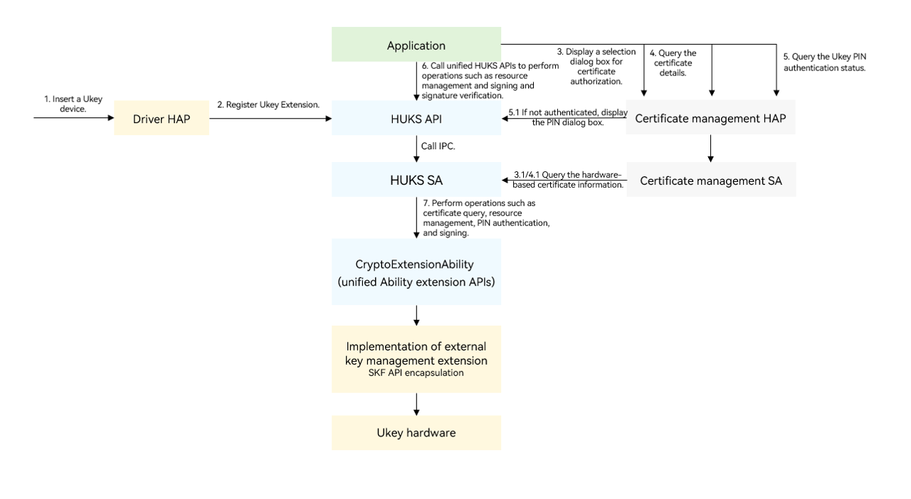

# External Key Management Extension Overview

<!--Kit: Universal Keystore Kit-->
<!--Subsystem: Security-->
<!--Owner: @wutiantian-gitee-->
<!--Designer: @HighLowWorld-->
<!--Tester: @wxy1234564846-->
<!--Adviser: @zengyawen-->

HUKS provides unified Ability extension APIs for the driver HAP to implement external key management extension as well as register and unregister the custom hardware key management module, meeting identity authentication requirements in scenarios such as browser-based two-way SSL authentication of Ukey certificates in the financial field.

A USB key (Ukey) is a hardware device based on the USB API, which can be used to store user private keys, certificates, and identity authentication information.

This guide describes how to implement identity authentication in scenarios such as browser-based two-way SSL authentication of Ukey certificates.

## Working Principles

The following figure shows the process of calling an API to implement identity authentication.

Before the application initiates identity authentication based on the Ukey, the third-party driver HAP must complete the following operations:

- Design and develop the external key management extension capabilities of the application based on service scenarios.

  The driver HAP must inherit **CryptoExtensionAbility** provided by HUKS and implement the capability APIs. For details, see [CryptoExtensionAbility Extension Capability Overview](huks-extension-ability-support-overview.md).

  **CryptoExtensionAbility** is a derived class of [ExtensionAbility](../../application-models/extensionability-overview.md) in the stage model. You can customize the behavior of external hardware key management by inheriting **CryptoExtensionAbility** and implementing custom APIs, including calling APIs for opening and closing resources of external hardware key management, implementing PIN authentication for external hardware key management, and calling general APIs of external hardware key management. For details, see [CryptoExtensionAbility Adaptation Development Guide](huks-extension-ability-support-dev.md).
  
- Register the key management extension capabilities with the system HUKS service.
  
  **CryptoExtensionAbility** can isolate the implementation differences of Ukey driver vendors. The capabilities implemented by the driver HAP are opened for applications through the SDKs of HUKS and [certificate management](../DeviceCertificateKit/certManager-overview.md).

In this way, the applications such as the browser can call the APIs provided by HUKS and [certificate management](../DeviceCertificateKit/certManager-overview.md) to use the external key management capabilities provided by the driver HAP, including certificate query, PIN authentication, and signing and signature verification.

- Mark 1: A Ukey device is inserted.

- Mark 2: The driver HAP registers the external key management extension capability (Ukey Extension) through the Provider management API.

  The driver HAP can register and unregister the external key management extension capability through the Provider management capability. For details, see [Provider Management Overview and Specifications](huks-provider-management-overview.md).

- Mark 3: The application displays a selection dialog box for certificate authorization for the user to select a certificate.

- Mark 4: After the user selects a certificate, the application obtains the certificate index **KeyUri** (that is, **resourceId**) to open the resource and query the PIN authentication status.

  HUKS provides the PIN authentication and authentication status query capabilities. Before the PIN authentication, you can query its authentication status. For details, see [Ukey PIN Authentication](huks-ukey-pin-authentication-management-overview.md).

  4.1: If the resource has been authenticated, that is, the PIN passes the authentication, the application calls the unified HUKS APIs to perform operations such as resource management and signing and signature verification. Example:

  - Open and close handle resources: [Resource Management Overview and Specifications](huks-resource-management-overview.md)
  - Verify the authenticity of the message content and the message sender: [Signing and Signature Verification Overview and Algorithm Specifications](huks-ukey-signing-signature-verification-overview.md)
  
  In addition, HUKS allows the application to query the Ukey key properties. For details, see [General Query](huks-ukey-general-query-overview.md).

  4.2: If the resource has not been authenticated, the application needs to call the certificate management capability to display the PIN authentication dialog box. The user enters the PIN to complete the authentication. After the authentication is complete, the process goes to 4.1. The application calls the unified HUKS APIs to perform the corresponding operations.
