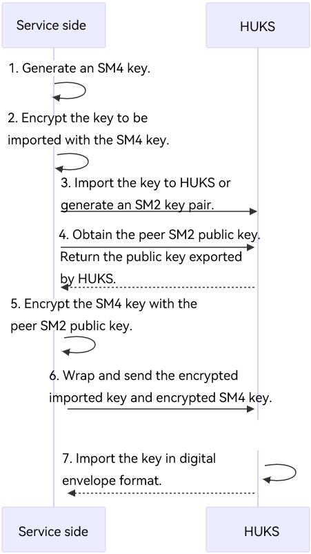

# Key Import Overview and Algorithm Specifications

<!--Kit: Universal Keystore Kit-->
<!--Subsystem: Security-->
<!--Owner: @wutiantian-gitee-->
<!--Designer: @HighLowWorld-->
<!--Tester: @wxy1234564846-->
<!--Adviser: @zengyawen-->

You can import an externally generated key (for example, a key generated after key agreement or generated by a server) into HUKS for management. Once a key is imported into HUKS, the plaintext can be accessed only in a secure environment in its lifecycle.

A key can be imported in plaintext or in encrypted (wrapped) mode.
> **NOTE**
>
> Using an existing key alias as the alias of the key imported will overwrite the existing key.

The [Group Key](huks-group-key-overview.md) feature is supported since API version 23.

## Plaintext Import

Importing a key in plaintext may expose the plaintext to a non-secure environment. This import mode applies to <!--RP2-->mini-system devices<!--RP2End--> or security-insensitive services.

- Plaintext import is recommended to import the public key of an asymmetric key pair.

- It is not recommended to import symmetric keys or asymmetric key pairs.
  > **NOTE**
  >
  > <!--RP2-->The mini-system devices<!--RP2End--> support plaintext import but not encrypted import.

## Encrypted Import

In this mode, the key to be imported is encrypted (wrapped) and then imported to HUKS through an end-to-end encrypted transmission channel established between the service and HUKS. This mode applies to security-sensitive services due to higher security than plaintext import. However, it involves more complex key material and operations.

- Encrypted import is recommended to import symmetric keys or asymmetric key pairs.

The following figure illustrates the development sequence of encrypted import.

During the encrypted import process, the following HUKS capabilities are called in sequence: 
* Generate an asymmetric key pair and export the public key for key agreement between devices.
* Generate a symmetric key to encrypt the key to be imported.
* Use the symmetric key to encrypt the key to be imported to generate the key ciphertext.
* Import a wrapped key.
* Delete a key.

The [public key plaintext material returned by the key export API is encapsulated in X.509 format](huks-concepts.md#public-key-material-format). The key material in the key import API must be encapsulated in the **LengthData-Data** format, for example, [(Lengthpart1Datapart1)... (LengthpartnDatapartn)].

> **NOTE**
>
> 1. The encrypted import supports key agreement algorithms ECDH and X25519. The generated **Shared_Key** uses the AES-GCM algorithm to encrypt **Caller_Kek**. For details about the cipher suites, see [HuksUnwrapSuite](../../reference/apis-universal-keystore-kit/js-apis-huks.md#huksunwrapsuite9).
> 2. The X.509 format is not supported for encrypted import.
> 3. <!--RP2-->The mini-system devices<!--RP2End--> support plaintext import but not encrypted import.

### Key Material Format for Encrypted Import

| Content| Length|
| -------- | -------- |
| Service public key **Caller_Pk** length (LCaller_Pk)| 4 bytes|
| Service public key **Caller_Pk**| LCaller_Pk bytes|
| Shared_Key **AAD2** length (LAAD2)| 4 bytes|
| Shared_Key **AAD2**| LAAD2 bytes|
| Shared_Key **NONCE2** length (LNONCE2)| 4 bytes|
| Shared_Key **NONCE2**| LNONCE2 bytes|
| Shared_Key **TAG2** length (LTAG2)| 4 bytes|
| Shared_Key **TAG2**| LTAG2 bytes|
| **Caller_Kek_enc** length (LCaller_Kek_enc)| 4 bytes|
| Caller_Kek ciphertext **Caller_Kek_enc**| LCaller_Kek_enc bytes|
| Caller_Kek **AAD3** length (LAAD3)| 4 bytes|
| Caller_Kek **AAD3**| LAAD3 bytes|
| Caller_Kek **NONCE3** length (LNONCE3)| 4 bytes|
| Caller_Kek **NONCE3**| LNONCE3 bytes|
| Caller_Kek **TAG3** length (LTAG3)| 4 bytes|
| Caller_Kek **TAG3**| LTAG3 bytes|
| **To_Import_Key_size** length (LTo_Import_Key_size)| 4 bytes|
| Key plaintext material length **To_Import_Key_size**| LTo_Import_Key_size bytes|
| **To_Import_Key_enc** length (LTo_Import_Key_enc)| 4 bytes|
| To_Import_Key ciphertext **To_Import_Key_enc**| LTo_Import_Key_enc bytes|

## Digital Envelope Import
The [digital envelope](huks-key-import-overview.md#digital-envelope-import) feature is supported since API version 23.

This feature allows you to import the key to HUKS in digital envelope format, ensuring secure key import and preventing key leakage during transmission for security-sensitive services.

This feature is recommended to import symmetric keys or asymmetric key pairs.

The following figure shows the development sequence of digital envelope import.

According to the workflow, the HUKS capability needs to be invoked when the digital envelope is imported.

- Generate an SM4 key to encrypt the key to be imported.
- Use the generated SM4 key to encrypt the plaintext of the key to be imported in ECB and NoPadding mode. If an asymmetric key is imported, only the private key needs to be encrypted.
- Export the SM2 public key of the peer end to encrypt the generated SM4 key.
- Use the SM2 public key exported from the peer end, use the NoPadding mode, and specify SM3 as the digest algorithm to encrypt the SM4 key generated on the local end.
- Import a wrapped key.
The public key material format returned by the key export API is encapsulated in [X.509 format](huks-concepts.md#public-key-material-format). The key material returned by the key import API must be encapsulated in the **LengthData-Data** format, for example, [(LengthEncSm4DataEncSm4)(LengthEncImpKeyDataEncImpKey)].

> **NOTE**
> 1. To import a key using digital envelope, the tag **HUKS_TAG_UNWRAP_ALGORITHM_SUITE** is required, and the tag value is **HUKS_UNWRAP_SUITE_SM2_SM4_ECB_NOPADDING**.
> 2. When importing a key pair of an asymmetric key using digital envelope, you need to add the [OH_HUKS_TAG_ASYMMETRIC_PUBLIC_KEY_DATA tag](../../reference/apis-universal-keystore-kit/capi-native-huks-type-h.md#oh_huks_tag) and encapsulate the public key in DER format into the tag. Only key pairs can be imported for asymmetric keys.
> 3. Only <!--RP1-->standard devices<!--RP1End--> support digital envelope import.

## Supported Algorithms

The following table lists the supported key import specifications.
<!--Del-->
The key management service specifications include mandatory specifications and optional specifications. Mandatory specifications are algorithm specifications that must be supported. Optional specifications can be used based on actual situation. Before using the optional specifications, refer to the documents provided by the vendor to ensure that the specifications are supported.

**You are advised to use mandatory specifications in your development for compatibility purposes.**
<!--DelEnd-->

> **NOTE**
>
> When an RSA key is imported, the public key must be greater than or equal to 65537.
> Digital envelope does not support the DSA algorithm, X25519 key, and Ed25519 key. When a digital envelope key is imported, the public key is entered in this tag as a raw key.

**Specifications****<!--RP1--> for standard devices<!--RP1End-->**

| Algorithm| Supported Key Length (Bit)| API Version| <!--DelCol4-->Mandatory|
| -------- | -------- | -------- | -------- |
| AES | 128, 192, 256| 8+ | Yes|
| <!--DelRow-->RSA | 512, 768, 1024| 8+ | No|
| RSA | 2048, 3072, 4096| 8+ | Yes|
| RSA | An integer multiple of 8, ranging from 1024 to 2048 (inclusive)| 18+ | Yes|
| HMAC | An integer multiple of 8, ranging from 8 to 1024 (inclusive)| 8+ | Yes|
| <!--DelRow-->ECC | 224 | 8+ | No|
| ECC | 256, 384, 521| 8+ | Yes|
| ED25519 | 256 | 8+ | Yes|
| X25519 | 256 | 8+ | Yes|
| <!--DelRow-->DSA | An integer multiple of 8, ranging from 512 to 1024 (inclusive) | 8+ | No|
| DH | 2048 | 8+ | Yes|
| <!--DelRow-->DH | 3072, 4096| 8+ | No|
| SM2 | 256 | 9+ | Yes|
| SM4 | 128 | 9+ | Yes|
| DES | 64 | 18+ | Yes|
| 3DES | 128, 192| 18+ | Yes|

**Specifications****<!--RP2--> for mini-system devices<!--RP2End-->**

<!--Del-->
Before implementing the specifications for mini-system devices, determine whether your device supports the related specifications.
<!--DelEnd-->

| Algorithm| Supported Key Length (Bit)| API Version|
| -------- | -------- | -------- |
| AES | 128, 192, 256| 12+ |
| DES | 64 | 12+ |
| 3DES | 128, 192| 12+ |
| RSA |  An integer multiple of 8, ranging from 1024 to 2048 (inclusive)| 12+ |
| HMAC | An integer multiple of 8, ranging from 8 to 1024 (inclusive)| 12+ |
| CMAC | 128 | 12+ |

## Key Import Formats
HUKS supports various types of keys in different formats. The following table lists the key types and key material formats supported by HUKS.
| Key Type| Algorithm| Import Format|
| -------- | -------- | -------- |
| Symmetric key| - | Key in bytes|
| Asymmetric key pair| - | [Key pair material format](huks-concepts.md#key-pair-material-format)|
| Public key of an asymmetric key pair| Ed25519, X25519| Key in bytes. For details, see [Importing the Public Key of an X25519 Key Pair](huks-import-key-in-plaintext-arkts.md#importing-the-public-key-of-an-x25519-key-pair).|
| Public key of an asymmetric key pair| RSA, ECC, ECDH, DSA, DH, SM2| DER format defined in X.509|
<!--no_check-->