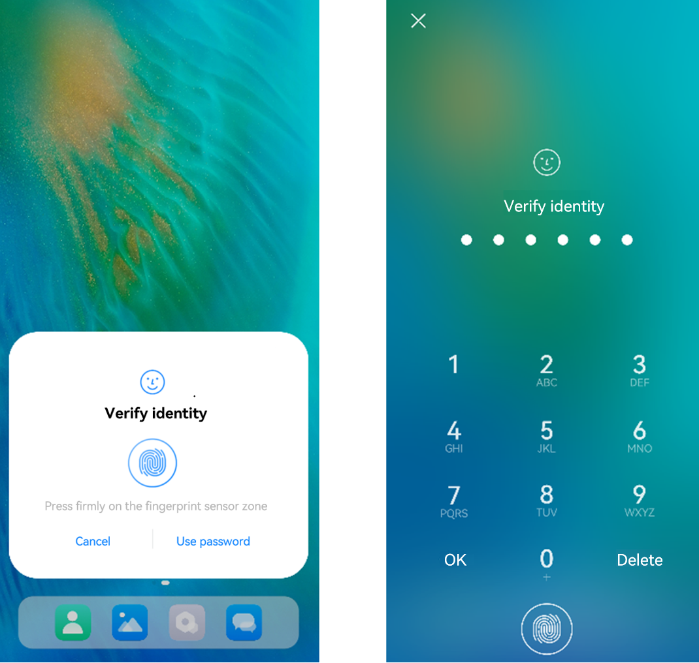

# Initiating User Authentication

<!--Kit: User Authentication Kit-->
<!--Subsystem: UserIAM-->
<!--Owner: @WALL_EYE-->
<!--Designer: @lichangting518-->
<!--Tester: @jane_lz-->
<!--Adviser: @zengyawen-->

A user authentication is required before an application accesses a critical functionality or sensitive data. This topic walks you through the process.

## Available APIs

For details about the parameters, return values, and error codes, see [User Authentication](../../reference/apis-user-authentication-kit/js-apis-useriam-userauth.md#userauthgetuserauthinstance10).

| API| Description| 
| -------- | -------- |
| getUserAuthInstance(authParam: AuthParam, widgetParam: WidgetParam): UserAuthInstance | Obtains a **UserAuthInstance** object for user authentication. The unified [user authentication widget](#user-authentication-widget) is also supported.| 
| on(type: 'result', callback: IAuthCallback): void | Subscribes to the user authentication result.| 
| off(type: 'result', callback?: IAuthCallback): void | Unsubscribes from the user authentication result.| 
| start(): void | Starts user authentication.| 

## User Authentication Widget

The system provides a unified user authentication widget, which stands out with following features:

- The user authentication widget identifies and authenticates user information and returns the authentication result to the application. The overall process is secure and controllable.

- The widget comes with a unified UI component style to elevate user experience.

The following figure shows the style of the user authentication widget, which can be set via the [WidgetParam](../../reference/apis-user-authentication-kit/js-apis-useriam-userauth.md#widgetparam10) parameter.

<!--RP1-->

<!--RP1End-->

- ①: Title (**WidgetParam.title**) of the user authentication page, which cannot be empty or exceed 500 characters. You are advised to set the title to the authentication purpose, for example, payment and application login.
<!--RP2-->
- ②: Text on the navigation button (**WidgetParam.navigationButtonText**), which cannot exceed 60 characters. It can be configured only in single fingerprint or facial authentication scenarios in API versions 10 to 17. Since API version 18, it can also be configured in the combined fingerprint and facial authentication.

  If biometric authentication fails, a button is displayed. The user can tap the button to switch to custom authentication.<!--RP2End-->

<!--Del-->
- The following shows the display modes (**WidgetParam.windowMode**) of the user authentication widget.
  
  The user authentication widget provides two display modes: dialog box (default mode, as shown in figure on the left) and full screen (as shown in the figure on the right).

  Currently, the full screen mode is available only for system applications.

  
<!--DelEnd-->

The user authentication widget supports the following types of authentication:

- Lock screen password authentication

- Facial authentication

- Fingerprint authentication

- Facial + lock screen password authentication

- Fingerprint + lock screen password authentication

- Facial + fingerprint + lock screen password authentication

- Facial authentication + custom navigation button

- Fingerprint authentication + custom navigation button

- Facial authentication + fingerprint authentication + custom navigation button<sup>18+</sup>

## How to Develop

1. Check that the application has the ohos.permission.ACCESS_BIOMETRIC permission. For details about how to request permissions, see [Requesting Permissions](prerequisites.md#requesting-permissions).

2. Set [AuthParam](../../reference/apis-user-authentication-kit/js-apis-useriam-userauth.md#authparam10) (including the challenge, [UserAuthType](../../reference/apis-user-authentication-kit/js-apis-useriam-userauth.md#userauthtype8), and [AuthTrustLevel](../../reference/apis-user-authentication-kit/js-apis-useriam-userauth.md#authtrustlevel8)), configure [WidgetParam](../../reference/apis-user-authentication-kit/js-apis-useriam-userauth.md#widgetparam10), and use [getUserAuthInstance](../../reference/apis-user-authentication-kit/js-apis-useriam-userauth.md#userauthgetuserauthinstance10) to obtain a **UserAuthInstance** instance.

3. Use [UserAuthInstance.on](../../reference/apis-user-authentication-kit/js-apis-useriam-userauth.md#on10) to subscribe to the authentication result.

4. Use [UserAuthInstance.start](../../reference/apis-user-authentication-kit/js-apis-useriam-userauth.md#start10) to start authentication. The authentication result [UserAuthResult](../../reference/apis-user-authentication-kit/js-apis-useriam-userauth.md#userauthresult10) is returned through [IAuthCallback](../../reference/apis-user-authentication-kit/js-apis-useriam-userauth.md#iauthcallback10). If the authentication is successful, [UserAuthType](../../reference/apis-user-authentication-kit/js-apis-useriam-userauth.md#userauthtype8) and token information (**AuthToken**) are returned.

**Example 1**

 Initiate facial authentication and lock screen password authentication at ATL3 or higher.

<!-- @[authentication_example1](https://gitcode.com/openharmony/applications_app_samples/blob/master/code/DocsSample/UserAuthentication/entry/src/main/ets/pages/Index.ets) -->

``` TypeScript
  initiatingUserAuthentication1() {
    try {
      const randData = getRandData();
      if (!randData) {
        return;
      }
      // Set authentication parameters.
      const authParam: userAuth.AuthParam = {
        challenge: randData,
        authType: [userAuth.UserAuthType.PIN, userAuth.UserAuthType.FACE, userAuth.UserAuthType.FINGERPRINT],
        authTrustLevel: userAuth.AuthTrustLevel.ATL3,
      };
      // Set the authentication page.
      const widgetParam: userAuth.WidgetParam = {
        title: resourceToString($r('app.string.title')),
      };
      // Obtain an authentication object.
      const userAuthInstance = userAuth.getUserAuthInstance(authParam, widgetParam);
      Logger.info('get userAuth instance success');
      // Subscribe to the authentication result.
      userAuthInstance.on('result', {
        onResult: (result: userAuth.UserAuthResult) => {
          try {
            Logger.info(`userAuthInstance callback result: ${JSON.stringify(result)}`);
            this.result[ResultIndex.EXAMPLE_1] = (`${result.result}`);
            // Unsubscribe from the authentication result if required.
            userAuthInstance.off('result');
          } catch (error) {
            const err: BusinessError = error as BusinessError;
            Logger.error(`onResult catch error. Code: ${err?.code}, Message: ${err?.message}`);
          }
        }
      });
      // Start authentication.
      userAuthInstance.start();
      Logger.info('auth start success');
    } catch (error) {
      const err: BusinessError = error as BusinessError;
      Logger.error(`auth catch error, code is ${err?.code}, message is ${err?.message}`);
    }
  }

```


**Example 2**

Initiate facial authentication at ATL3 or higher, and enable the device unlock result to be reused for the same type of authentication within the specified time.

<!-- @[authentication_example2](https://gitcode.com/openharmony/applications_app_samples/blob/master/code/DocsSample/UserAuthentication/entry/src/main/ets/pages/Index.ets) -->

``` TypeScript
  initiatingUserAuthentication2() {
    // Set authentication parameters.
    let reuseUnlockResult: userAuth.ReuseUnlockResult = {
      reuseMode: userAuth.ReuseMode.AUTH_TYPE_RELEVANT,
      reuseDuration: userAuth.MAX_ALLOWABLE_REUSE_DURATION,
    };
    try {
      const randData = getRandData();
      if (!randData) {
        return;
      }
      const authParam: userAuth.AuthParam = {
        challenge: randData,
        authType: [userAuth.UserAuthType.PIN, userAuth.UserAuthType.FACE, userAuth.UserAuthType.FINGERPRINT],
        authTrustLevel: userAuth.AuthTrustLevel.ATL3,
        reuseUnlockResult: reuseUnlockResult,
      };
      // Set the authentication page.
      const widgetParam: userAuth.WidgetParam = {
        title: resourceToString($r('app.string.title')),
      };
      // Obtain an authentication object.
      const userAuthInstance = userAuth.getUserAuthInstance(authParam, widgetParam);
      Logger.info('get userAuth instance success');
      // Subscribe to the authentication result.
      userAuthInstance.on('result', {
        onResult: (result: userAuth.UserAuthResult) => {
          try {
            Logger.info(`userAuthInstance callback result: ${JSON.stringify(result)}`);
            this.result[ResultIndex.EXAMPLE_2] = (`${result.result}`);
            // Unsubscribe from the authentication result if required.
            userAuthInstance.off('result');
          } catch (error) {
            const err: BusinessError = error as BusinessError;
            Logger.error(`onResult catch error. Code: ${err?.code}, Message: ${err?.message}`);
          }
        }
      });
      // Start authentication.
      userAuthInstance.start();
      Logger.info('auth start success');
    } catch (error) {
      const err: BusinessError = error as BusinessError;
      Logger.error(`auth catch error, code is ${err?.code}, message is ${err?.message}`);
    }
  }

```


**Example 3**

Initiate facial authentication at ATL3 or higher, and enable the device unlock result to be reused for any type of authentication within the maximum authentication validity of any application.

<!-- @[authentication_example3](https://gitcode.com/openharmony/applications_app_samples/blob/master/code/DocsSample/UserAuthentication/entry/src/main/ets/pages/Index.ets) -->

``` TypeScript
  initiatingUserAuthentication3() {
    // Set authentication parameters.
    let reuseUnlockResult: userAuth.ReuseUnlockResult = {
      reuseMode: userAuth.ReuseMode.CALLER_IRRELEVANT_AUTH_TYPE_RELEVANT,
      reuseDuration: userAuth.MAX_ALLOWABLE_REUSE_DURATION,
    };
    try {
      const randData = getRandData();
      if (!randData) {
        return;
      }
      const authParam: userAuth.AuthParam = {
        challenge: randData,
        authType: [userAuth.UserAuthType.PIN, userAuth.UserAuthType.FACE, userAuth.UserAuthType.FINGERPRINT],
        authTrustLevel: userAuth.AuthTrustLevel.ATL3,
        reuseUnlockResult: reuseUnlockResult,
      };
      // Set the authentication page.
      const widgetParam: userAuth.WidgetParam = {
        title: resourceToString($r('app.string.title')),
      };
      // Obtain an authentication object.
      const userAuthInstance = userAuth.getUserAuthInstance(authParam, widgetParam);
      Logger.info('get userAuth instance success');
      // Subscribe to the authentication result.
      userAuthInstance.on('result', {
        onResult: (result: userAuth.UserAuthResult) => {
          try {
            Logger.info(`userAuthInstance callback result: ${JSON.stringify(result)}`);
            this.result[ResultIndex.EXAMPLE_3] = (`${result.result}`);
            // Unsubscribe from the authentication result if required.
            userAuthInstance.off('result');
          } catch (error) {
            const err: BusinessError = error as BusinessError;
            Logger.error(`onResult catch error. Code: ${err?.code}, Message: ${err?.message}`);
          }
        }
      });
      // Start authentication.
      userAuthInstance.start();
      Logger.info('auth start success');
    } catch (error) {
      const err: BusinessError = error as BusinessError;
      Logger.error(`auth catch error, code is ${err?.code}, message is ${err?.message}`);
    }
  }

```


**Example 4**

Start the user authentication widget in modal application mode.

<!-- @[authentication_example4](https://gitcode.com/openharmony/applications_app_samples/blob/master/code/DocsSample/UserAuthentication/entry/src/main/ets/pages/Index.ets) -->

``` TypeScript
  initiatingUserAuthentication4() {
    // Set authentication parameters.
    try {
      const randData = getRandData();
      if (!randData) {
        return;
      }
      const authParam: userAuth.AuthParam = {
        challenge: randData,
        authType: [userAuth.UserAuthType.PIN, userAuth.UserAuthType.FACE, userAuth.UserAuthType.FINGERPRINT],
        authTrustLevel: userAuth.AuthTrustLevel.ATL3,
      };
      // Set the authentication page.
      const widgetParam: userAuth.WidgetParam = {
        title: resourceToString($r('app.string.title')),
        uiContext: this.getUIContext().getHostContext()
      };
      // Obtain an authentication object.
      const userAuthInstance = userAuth.getUserAuthInstance(authParam, widgetParam);
      Logger.info('get userAuth instance success');
      // Subscribe to the authentication result.
      userAuthInstance.on('result', {
        onResult: (result: userAuth.UserAuthResult) => {
          try {
            Logger.info(`userAuthInstance callback result: ${JSON.stringify(result)}`);
            this.result[ResultIndex.EXAMPLE_4] = (`${result.result}`);
            // Unsubscribe from the authentication result if required.
            userAuthInstance.off('result');
          } catch (error) {
            const err: BusinessError = error as BusinessError;
            Logger.error(`onResult catch error. Code: ${err?.code}, Message: ${err?.message}`);
          }
        }
      });
      // Start authentication.
      userAuthInstance.start();
      Logger.info('auth start success');
    } catch (error) {
      const err: BusinessError = error as BusinessError;
      Logger.error(`auth catch error, code is ${err?.code}, message is ${err?.message}`);
    }
  }

```


## Sample Code

  - [Initiating authentication](https://gitcode.com/openharmony/applications_app_samples/blob/master/code/DocsSample/UserAuthentication)
