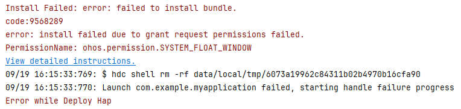

# Bundle Manager
<!--Kit: Ability Kit-->
<!--Subsystem: BundleManager-->
<!--Owner: @wanghang904-->
<!--Designer: @hanfeng6-->
<!--Tester: @kongjing2-->
<!--Adviser: @Brilliantry_Rui-->

Bundle Manager (bm) is a tool for installing, uninstalling, updating, and querying bundles. It provides basic capabilities for debugging application installation bundles.

## Environment Requirements (hdc)

Before using this tool, you need to obtain [hdc](../dfx/hdc.md) and run the **hdc shell** command.

## bm Commands

| Name| Description|
| -------- | -------- |
| help | Displays the commands supported by the bm tool.|
| install | Installs a bundle.|
| uninstall | Uninstalls a bundle.|
| dump | Displays bundle information.|
| clean | Clears the cache and data of a bundle. This command is available in the user version when **Developer options** is enabled. <!--Del-->It is also available in the root version.<!--DelEnd-->|
| <!--DelRow-->enable | Enables a bundle. A bundle can be used after being enabled. This command is available in the root version but not in the user version.|
| <!--DelRow-->disable | Disables a bundle. A bundle cannot be used after being disabled. This command is available in the root version but not in the user version.|
| get | Obtains the UDID of a device.|
| quickfix | Performs patch-related operations, such as installing or querying a patch.|
| compile | Executes the AOT compilation on a bundle.|
| copy-ap | Copies the .ap file of a bundle to the **/data/local/pgo** directory for the shell user to read the file.|
| dump-dependencies | Displays the information about the modules on which the bundle depends.|
| dump-shared | Displays the HSP information of a bundle.|
| dump-overlay | Displays **overlayModuleInfo** of an overlay bundle.|
| dump-target-overlay | Displays **overlayModuleInfo** of all overlay bundles associated with a target bundle.|
| install-plugin | Installs a plugin.|
| uninstall-plugin | Uninstalls a plugin.|


## help

```bash
# Display the help information.
bm help
```
## Description

### userId

ID of the current system account. For details about the APIs related to system accounts, see [@ohos.account.osAccount (System Account Management)](../reference/apis-basic-services-kit/js-apis-osAccount.md). The following lists several common system accounts.

- **userId = 100**: System account with ID 100. This is the default system account, which is created by the system account management module when the device is started for the first time after delivery. After the account is created, all pre-installed bundles are installed for ID 100.

- **userId = 102**: System account with ID 102. This account is created by the system account management module. <!--Del-->You can create an account using the [createOsAccountForDomain](../reference/apis-basic-services-kit/js-apis-osAccount-sys.md) API. <!--DelEnd-->Only system bundles can create accounts. Bundles installed for account 100 are not displayed for account 102. If necessary, reinstall the bundles for account 102. When account 102 is created, the system installs the pre-installed system bundles for account 102.

- **userId = 0**: Shared system account, also called account 0. Unlike the system account, the shared system account is not created by the system account management module. Bundles installed for account 0 are shared by all system accounts and are displayed for each system account. All third-party bundles cannot be installed for account 0.


## install

```bash
bm install [-h] [-p filePath] [-r] [-w waitingTime] [-s hspDirPath] [-u userId] [-d]
```

  **Parameters**


| Parameter| Description|
| -------- | -------- |
| -h | Used to display help information.|
| -p | Used to specify the path of the HAP or HSP file to be installed. This parameter is optional. If multiple HAPs or HSPs are required, you can specify the folder path of the HAPs or HSPs. Since API version 22, you can specify the path of the APP file to be installed or the folder path of only one APP.|
| -r | Used to overwrite an existing HAP or HSP file. This parameter is optional. This parameter is not specified by default, indicating that the existing file will be overwritten.|
| -s | Used to specify the path where the inter-application HSP is to be installed. This parameter is mandatory for installing the inter-application HSP and optional in other scenarios. Each directory can contain only one HSP file.|
| -w | Used to wait for a specified time before installing a HAP. The minimum waiting time is 180s, and the maximum waiting time is 600s. The default waiting time is 180s. This parameter is optional.|
| -u | Used to specify the [user](#userid). By default, the bundle is installed for the current active user. This parameter is optional. The bundle can be installed only for the current active user or user 0.<br>**NOTE**<br> If the current active user is 100, the bundle is installed only for user 100 after the **bm install -p /data/local/tmp/ohos.app.hap -u 102** command is executed.|
| -d | Used to allow an application to be downgraded; that is, an earlier version of the application can overwrite a later version. This parameter is optional. Only third-party applications with the signing certificate distribution type set to **app_gallery** or the signing certificate type set to **debug** can be downgraded. This parameter is supported since API version 23.|


Example
```bash
# Install a HAP.
bm install -p /data/local/tmp/ohos.app.hap
# Install a HAP for user 100.
bm install -p /data/local/tmp/ohos.app.hap -u 100
# Install a HAP in overwrite mode.
bm install -p /data/local/tmp/ohos.app.hap -r
# Install an HSP.
bm install -s xxx.hsp
# Install a HAP and its dependent HSP.
bm install -p aaa.hap -s xxx.hsp yyy.hsp
# Install a HAP and an intra-application shared library simultaneously.
bm install -p /data/local/tmp/hapPath/
# Install a HAP. The waiting time is 180s.
bm install -p /data/local/tmp/ohos.app.hap -w 180
# Install an earlier HAP of the same package name, overwriting the existing application.
bm install -p /data/local/tmp/ohos.app.hap -d
```

## uninstall

```bash
bm uninstall [-h] [-n bundleName] [-m moduleName] [-k] [-s] [-v versionCode] [-u userId]
```

  **Parameters**

| Parameter| Description|
| -------- | -------- |
| -h | Used to display help information.|
| -n | Used to uninstall a bundle. This parameter is mandatory.|
| -m | Used to specify the name of an application module to be uninstalled. This parameter is optional. By default, all modules are uninstalled.|
| -k | Used to uninstall a bundle with or without retaining the bundle data. This parameter is optional. By default, the bundle data is deleted along the uninstall.|
| -s |  Used to uninstall an HSP. This parameter is mandatory only for the HSP uninstallation.|
| -v | Used to uninstall an HSP of a given version number. This parameter is optional. By default, all shared bundles with the specified bundle name are uninstalled.|
| -u | Used to specify the [user](#userid). By default, the bundle is uninstalled for the current active user. This parameter is optional. The bundle can be uninstalled only for the current active user or user 0.<br>**NOTE**<br> If the current active user is 100, the bundle will be uninstalled only for the current active user 100 when the **bm uninstall -n com.ohos.app -u 102** command is executed.|


Example

```bash
# Uninstall a bundle.
bm uninstall -n com.ohos.app
# Uninstall a bundle for the user 100.
bm uninstall -n com.ohos.app -u 100
# Uninstall a module of a bundle.
bm uninstall -n com.ohos.app -m entry
# Uninstall a shared bundle.
bm uninstall -n com.ohos.example -s
# Uninstall a shared bundle of the specified version.
bm uninstall -n com.ohos.example -s -v 100001
# Uninstall a bundle and retain user data.
bm uninstall -n com.ohos.app -k
```


## dump

```bash
bm dump [-h] [-a] [-g] [-n bundleName] [-s shortcutInfo] [-d deviceId] [-l label] [-u userId]
```

  **Parameters**

| Parameter| Description|
| -------- | -------- |
| -h | Used to display help information.|
| -a | Used to display all bundles installed in the system. This parameter is optional.|
| -g | Used to display the names of bundles whose signatures are of the debug type. This parameter is optional.|
| -n | Used to display the details of a bundle. This parameter is optional.|
| -s | Used to display the shortcut information of a bundle. This parameter is optional.|
| -d | Used to display the bundle information on a given device, which is the current device by default. This parameter is optional.  |
| -l | Used to display the label value (bundle name) of a bundle. This parameter is optional. It must be used together with the **-n** or **-a** parameter.<br>**NOTE**<br>This command is supported since API version 20. If the command output on Windows contains special characters or garbled Chinese characters, run the **chcp 65001** command on the CLI to change the CLI code to UTF-8.|
| -u | Used to display bundle information of a specified [user](#userid). By default, bundle information of the current active user is displayed. This parameter is optional. The bundle can be queried only for the current active user or user 0.<br>**NOTE**<br> If the current active user is 100, the **bm dump -n com.ohos.app -u 102** command can be used to query only the bundle information of user 100.|


Example

```bash
# Display the names of all bundles installed in the system.
bm dump -a
# Display the names of bundles whose signatures are of the debug type in the system.
bm dump -g
# Display the details of a bundle.
bm dump -n com.ohos.app
# Display the details of a bundle as user 100.
bm dump -n com.ohos.app -u 100
# Display the shortcut information of a bundle.
bm dump -s -n com.ohos.app
# Display cross-device bundle information.
bm dump -n com.ohos.app -d xxxxx
# Display the label value of a bundle (bundle name).
bm dump -n com.ohos.app -l
# Display the bundle names and label values of all installed bundles.
bm dump -a -l
```

## clean

```bash
bm clean [-h] [-c] [-n bundleName] [-d] [-i appIndex] [-u userId]
```
**Parameters**

| Parameter| Description|
| -------- | --------- |
| -h | Used to display help information.|
| -c -n | **-n** is mandatory, and **-c** is optional. Used to clear the cache data of a specified bundle.|
| -d -n | **-n** is mandatory, and **-d** is optional. Used to clear the data directory of a specified bundle.|
| -i | Used to clear the data directory of a bundle clone. This parameter is optional. The default value is 0.|
| -u | Used to clear the data of a specified [user](#userid). By default, the data of the current active user is cleared. Data can be deleted only for the current active user or user 0.<br>**NOTE**<br> If the current active user is 100, the data will be cleared only for the current active user 100 when you run the **bm clean -c -n com.ohos.app -u 102** command.|


Example

```bash
# Clear the cache data of a bundle.
bm clean -c -n com.ohos.app
# Clear the cache data of a bundle for user 100.
bm clean -c -n com.ohos.app -u 100
# Clear the user data of a bundle.
bm clean -d -n com.ohos.app
# Execution result
clean bundle data files successfully.
```

<!--Del-->
## enable

```bash
bm enable [-h] [-n bundleName] [-a abilityName] [-u userId]
```


  **Parameters**

| Parameter| Description|
| -------- | -------- |
| -h | Used to display help information.|
| -n | Used to enable a specified bundle. This parameter is mandatory.|
| -a | Used to enable an ability with a specified bundle name. This parameter is optional.|
| -u | Used to enable a bundle of a specified [user](#userid). This parameter is optional. By default, the bundle is enabled for the current active user. The bundle can be enabled only for the current active user or user 0.<br>**NOTE**<br> If the current active user is 100, the bundle can be enabled only for the current active user 100 when you run the **bm enable -n com.ohos.app -u 102** command.|


Example

```bash
# Enable a bundle.
bm enable -n com.ohos.app -a com.ohos.app.EntryAbility
# Enable the bundle for user 100.
bm enable -n com.ohos.app -u 100
# Execution result
enable bundle successfully.
```


## disable

```bash
bm disable [-h] [-n bundleName] [-a abilityName] [-u userId]
```


  **Parameters**

| Parameter| Description|
| -------- | -------- |
| -h | Used to display help information.|
| -n | Used to disable a specified bundle. This parameter is mandatory.|
| -a | Used to disable an ability with a specified bundle name. This parameter is optional.|
| -u | Used to disable a bundle for a specified [user](#userid). By default, the bundle is disabled for the current active user. This parameter is optional. The bundle can be disabled only for the current active user or user 0.<br>**NOTE**<br> If the current active user is user 100, when you run the **bm disable -n com.ohos.app -u 102** command to disable a bundle, the bundle is disabled only for user 100.|


Example

```bash
# Disable a bundle.
bm disable -n com.ohos.app -a com.ohos.app.EntryAbility
# Disable the bundle for user 100.
bm disable -n com.ohos.app -u 100
# Execution result
disable bundle successfully.
```
<!--DelEnd-->


## get

```bash
bm get [-h] [-u]
```

  **Parameters**

| Parameter| Description|
| -------- | -------- |
| -h |Used to display help information.|
| -u | Used to obtain the UDID of a device. This parameter is mandatory.|


Example

```bash
# Obtain the UDID of a device.
bm get -u
# Execution result
udid of current device is:
23CADE0C
```


## quickfix

```bash
bm quickfix [-h] [-a -f filePath [-t targetPath] [-d] [-o]] [-q -b bundleName] [-r -b bundleName]
```

Note: For details about how to create an .hqf file, see [HQF Packing Command](packing-tool.md#hqf-packing-command).

  **Parameters**
|   Parameter | Description|
| -------- | -------- |
| -h | Used to display help information.|
| -a -f | **-a** is optional, and **-f** is mandatory when **-a** is specified. Executes the quick fix patch installation command. **file-path** corresponds to an .hqf file. You can pass in one or more .hqf files or the directory where the .hqf file is located.|
| -q -b | **-q** is optional, and **-b** is mandatory when **-q** is specified. Used to display the patch information based on the bundle name.|
| -r&nbsp;-b | **-r** is optional, and **-b** is mandatory when **-r** is specified. Used to uninstall a disabled patch based on the bundle name.|
| -t | Used to fix a bundle to a specified path. This parameter is optional.|
| -d | Used to select the debug mode for quick fix. This parameter is optional.|
| -o | Used to select the overwrite mode for quick fix. In this mode, the .so file is decompressed and overwritten in the .so directory of the bundle. This parameter is optional.|


Example

```bash
# Display patch package information by the bundle name.
bm quickfix -q -b com.ohos.app
# Execution result
# Information as follows:
# ApplicationQuickFixInfo:
#  bundle name: com.ohos.app
#  bundle version code: xxx
#  bundle version name: xxx
#  patch version code: x
#  patch version name:
#  cpu abi:
#  native library path:
#  type:

# Install a quick fix patch.
bm quickfix -a -f /data/app/
# Execution result
apply quickfix succeed.
# Uninstall a quick fix patch.
bm quickfix -r -b com.ohos.app
# Execution result
delete quick fix successfully
```

## dump-shared

```bash
bm dump-shared [-h] [-a] [-n bundleName]
```

  **Parameters**

| Parameter| Description|
| -------- | -------- |
| -h | Used to display help information.|
| -a | Used to display all HSPs in the system. This parameter is optional.|
| -n | Used to display detailed information about the shared library with a specified bundle name. This parameter is optional.|


Example

```bash
# Display the bundle names of all shared libraries installed in the system.
bm dump-shared -a
# Display the details about the specified shared library.
bm dump-shared -n com.ohos.lib
```

## dump-dependencies

```bash
bm dump-dependencies [-h] [-n bundleName] [-m moduleName]
```

**Parameters**
| Parameter| Description|
| -------- | -------- |
| -h | Used to display help information.|
| -n | Used to display information about the shared library on which a specified bundle depends. This parameter is mandatory.|
| -m | Used to display information about the shared library on which a specified module of a bundle depends. This parameter is optional.|

Example
```Bash
# Display information about the shared library on which a specified module of a bundle depends.
bm dump-dependencies -n com.ohos.app -m entry
```


## compile

```bash
bm compile [-h] [-m mode] [-r bundleName] [-a]
```
**Parameters**

| Parameter| Description|
| -------- | -------- |
| -h | Used to display help information.|
| -a | Used to compile all bundles. This parameter is optional.|
| -m |  Used to compile a bundle based on the bundle name. The value can be **partial** or **full**. This parameter is optional.|
| -r | Used to check whether a bundle is removed. This parameter is optional.|

Example

```bash
# Compile a bundle based on the bundle name.
bm compile -m partial com.example.myapplication
```

## copy-ap

Copies an .ap file to the **/data/local/pgo** directory of a specified bundle.

```bash
bm copy-ap [-h] [-a] [-n bundleName]
```

**Parameters**

| Parameter| Description|
| -------- | -------- |
| -h | Used to display help information.|
| -a |  Used to copy the .ap files related to all bundles. By default, .ap files related to all bundles are copied. This parameter is optional.|
| -n |  Used to copy the .ap file related to a specified bundle, which is the current bundle by default. This parameter is optional.|

Example

```bash
# Copy the .ap file related to a specified bundle.
bm copy-ap -n com.example.myapplication
```

## dump-overlay

```bash
bm dump-overlay [-h] [-b bundleName] [-m moduleName] [-t targetModuleName] [-u userId]
```

**Parameters**
| Parameter| Description|
| -------- | -------- |
| -h | Used to display help information.|
| -b | Used to display all **OverlayModuleInfo** about a specified overlay bundle. This parameter is mandatory.|
| -m | Used to query **OverlayModuleInfo** based on the name of the module with the overlay feature. By default, the name of the main module of the current overlay bundle is used. This parameter is optional.|
| -t | Used to query **OverlayModuleInfo** information based on the name of the target module. By default, this parameter is left empty. This parameter is optional.|
| -u | Used to query **OverlayModuleInfo** of a specified user(#userid). By default, the information is queried by the current active user. This parameter is optional. The bundle can be queried only for the current active user or user 0.<br>**NOTE**<br> If the current active user is 100, the **bm dump-overlay -b com.ohos.app -u 102** command can be used to query **OverlayModuleInfo** of user 100 only.|

Example

```bash
# Display OverlayModuleInfo of an overlay bundle named com.ohos.app.
bm dump-overlay -b com.ohos.app

# Display OverlayModuleInfo of an overlay bundle named com.ohos.app as user 100.
bm dump-overlay -b com.ohos.app -u 100

# Display OverlayModuleInfo of overlay module libraryModuleName of an overlay bundle named com.ohos.app.
bm dump-overlay -b com.ohos.app -m libraryModuleName

# Display overlayModuleInfo of overlay module entryModuleName of an overlay bundle named com.ohos.app.
bm dump-overlay -b com.ohos.app -t entryModuleName
```

## dump-target-overlay

Displays **overlayModuleInfo** of all overlay bundles associated with a target bundle.

```bash
bm dump-target-overlay [-h] [-b bundleName] [-m moduleName] [-u userId]
```

**Parameters**
| Parameter| Description|
| -------- | -------- |
| -h | Used to display help information.|
| -b | Used to display all **OverlayBundleInfo** about a specified bundle. This parameter is mandatory.|
| -m |  Used to display **OverlayModuleInfo** based on a specified bundle name and module name. By default, **OverlayModuleInfo** of the main module of the current bundle is displayed. This parameter is optional.|
| -u | Used to query **OverlayModuleInfo** of a specified user(#userid). By default, the information is queried by the current active user. This parameter is optional. The bundle can be queried only for the current active user or user 0.<br>**NOTE**<br> If the current active user is 100, when you run the **bm dump-target-overlay -b com.ohos.app -u 102** command to query all associated **OverlayBundleInfo** in the target bundle **com.ohos.app**, only the **OverlayModuleInfo** of the current active user 100 is returned.|

Example

```bash
# Display OverlayBundleInfo of an overlay bundle named com.ohos.app.
bm dump-target-overlay -b com.ohos.app

# Display OverlayBundleInfo of an overlay bundle named com.ohos.app as user 100.
bm dump-target-overlay -b com.ohos.app -u 100

# Display OverlayModuleInfo of the overlay module named entry in an overlay bundle named com.ohos.app.
bm dump-target-overlay -b com.ohos.app -m entry
```

## install-plugin

```bash
bm install-plugin [-h] [-n hostBundleName] [-p filePath]
```

**Parameters**
| Parameter| Description|
| -------- | -------- |
| -h | Used to display help information.|
| -n | Used to specify the bundle name of the bundle for which the plugin is installed. This parameter is mandatory.|
| -p | Used to specify the plugin file path. This parameter is mandatory.|

Example

```bash
# Install a plugin.
bm install-plugin -n com.ohos.app -p /data/plugin.hsp
```
> **NOTE**
>
> Within the same bundle, installing an identical plugin is treated as an upgrade; downgrades are not supported. After the upgrade, the bundle must be restarted for the new plugin version to take effect.
>
> Installing a plugin with the same name as the host bundle module is not recommended. This operation is not supported currently.


## uninstall-plugin

```bash
bm uninstall-plugin [-h] [-n hostBundleName] [-p pluginBundleName]
```

**Parameters**
| Parameter| Description|
| -------- | -------- |
| -h | Used to display help information.|
| -n | Used to specify the bundle name of a bundle. This parameter is mandatory.|
| -p | Used to specify the bundle name of a plugin. This parameter is mandatory.|

Example

```bash
# Uninstall a plugin.
bm uninstall-plugin -n com.ohos.app -p com.ohos.plugin
```


## Error Codes

### 301 System Account Does Not Exist
**Error Message**

error: user not exist.

**Symptom**

The system account does not exist.

**Possible Causes**

The system account ID does not exist during bundle installation.

**Solution**

1. Restart the phone and try again.

2. If the installation still fails after you repeat the preceding steps three to five times, export the log file and submit an [online ticket](https://developer.huawei.com/consumer/en/support/feedback/#/) for help.

    ```shell
    hdc file recv /data/log/hilog/
    ```

### 304 The HAP File Is Not Installed for the Current System Account
**Error Message**

error: user does not install the hap.

**Symptom**

During the uninstallation, the HAP file is not installed for the current system account.

**Possible Causes**

No HAP file is installed for the current system account.

**Solution**

Do not uninstall the bundle when no HAP file is installed for the current system account.

### 9568319 Signature File Exception
**Error Message**

error: cannot open signature file.

**Symptom**

During bundle installation, the signature file fails to be opened. As a result, the installation fails.

**Possible Causes**

The signature file of the HAP file is abnormal.

**Solution**

Method 1: Use [automatic signing](https://developer.huawei.com/consumer/en/doc/harmonyos-guides/ide-signing#section18815157237) to sign the HAP file after the device is connected.

Method 2: Manually sign the HAP file. For details, see [Signing Your App/Atomic Service Manually](https://developer.huawei.com/consumer/en/doc/harmonyos-guides/ide-signing#section297715173233).

### 9568320 The Signature File Does Not Exist
**Error Message**

error: no signature file.

**Symptom**

A user attempts to install an unsigned HAP/HSP file.

**Possible Causes**

The HAP/HSP file is not signed.

**Solution**

You can choose to use automatic or manual signing based on the actual scenario. For example, if the Internet is unavailable, manual signing is recommended. For details, see [Application Scenarios](https://developer.huawei.com/consumer/en/doc/harmonyos-guides/ide-signing#section54361623194519).

Method 1: Use [automatic signing](https://developer.huawei.com/consumer/en/doc/harmonyos-guides/ide-signing#section18815157237) to sign the HAP file after the device is connected.

Method 2: Manually sign the HAP file. For details, see [Signing Your App/Atomic Service Manually](https://developer.huawei.com/consumer/en/doc/harmonyos-guides/ide-signing#section297715173233).

Method 3: If this error code is reported during the installation of the APP file, set **appWithSignedPkg** to **true** in the [project-level build-profile.json5 file](https://developer.huawei.com/consumer/en/doc/harmonyos-guides/ide-hvigor-build-profile-app) to ensure that the HAP/HSP in the APP file is signed.

### 9568321 Failed to Parse the Signature File
**Error Message**

error: fail to parse signature file.

**Symptom**

Failed to parse the signature file during installation.

**Possible Causes**

The signature file of the HAP file is abnormal.

**Solution**

Method 1: Use [automatic signing](https://developer.huawei.com/consumer/en/doc/harmonyos-guides/ide-signing#section18815157237) to sign the HAP file after the device is connected.

Method 2: Manually sign the HAP file. For details, see [Signing Your App/Atomic Service Manually](https://developer.huawei.com/consumer/en/doc/harmonyos-guides/ide-signing#section297715173233).

### 9568323 Signature Digest Verification Failed
**Error Message**

error: signature verification failed due to not bad digest.

**Symptom**

The signature verification fails during the installation.

**Possible Causes**

The signature of the HAP file is incorrect.

**Solution**

Method 1: Use [automatic signing](https://developer.huawei.com/consumer/en/doc/harmonyos-guides/ide-signing#section18815157237) to sign the HAP file after the device is connected.

Method 2: Manually sign the HAP file. For details, see [Signing Your App/Atomic Service Manually](https://developer.huawei.com/consumer/en/doc/harmonyos-guides/ide-signing#section297715173233).

### 9568324 Signature Integrity Verification Failed
**Error Message**

error: signature verification failed due to out of integrity.

**Symptom**

The signature verification fails during the installation.

**Possible Causes**

The signature of the HAP file is incorrect.

**Solution**

Method 1: Use [automatic signing](https://developer.huawei.com/consumer/en/doc/harmonyos-guides/ide-signing#section18815157237) to sign the HAP file after the device is connected.

Method 2: Manually sign the HAP file. For details, see [Signing Your App/Atomic Service Manually](https://developer.huawei.com/consumer/en/doc/harmonyos-guides/ide-signing#section297715173233).

### 9568326 Abnormal Signature Public Key
**Error Message**

error: signature verification failed due to bad public key.

**Symptom**

The signature verification fails during installation because the signature public key is abnormal.

**Possible Causes**

The signature of the HAP file is incorrect.

**Solution**

Method 1: Use [automatic signing](https://developer.huawei.com/consumer/en/doc/harmonyos-guides/ide-signing#section18815157237) to sign the HAP file after the device is connected.

Method 2: Manually sign the HAP file. For details, see [Signing Your App/Atomic Service Manually](https://developer.huawei.com/consumer/en/doc/harmonyos-guides/ide-signing#section297715173233).

### 9568327 Failed to Obtain the Signature
**Error Message**

error: signature verification failed due to bad bundle signature.

**Symptom**

The signature verification fails during the installation because the signature cannot be obtained.

**Possible Causes**

The signature of the HAP file is incorrect.

**Solution**

Method 1: Use [automatic signing](https://developer.huawei.com/consumer/en/doc/harmonyos-guides/ide-signing#section18815157237) to sign the HAP file after the device is connected.

Method 2: Manually sign the HAP file. For details, see [Signing Your App/Atomic Service Manually](https://developer.huawei.com/consumer/en/doc/harmonyos-guides/ide-signing#section297715173233).

### 9568328 No Configuration File Block Found
**Error Message**

error: signature verification failed due to no profile block.

**Symptom**

The signature verification fails during installation because the configuration file block is not found.

**Possible Causes**

The signature of the HAP file is incorrect.

**Solution**

Method 1: Use [automatic signing](https://developer.huawei.com/consumer/en/doc/harmonyos-guides/ide-signing#section18815157237) to sign the HAP file after the device is connected.

Method 2: Manually sign the HAP file. For details, see [Signing Your App/Atomic Service Manually](https://developer.huawei.com/consumer/en/doc/harmonyos-guides/ide-signing#section297715173233).

### 9568330 Failed to Initialize the Signature Source
**Error Message**

error: signature verification failed due to init source failed.

**Symptom**

The signature verification fails during installation because the signature source fails to be initialized.

**Possible Causes**

The signature of the HAP file is incorrect.

**Solution**

Method 1: Use [automatic signing](https://developer.huawei.com/consumer/en/doc/harmonyos-guides/ide-signing#section18815157237) to sign the HAP file after the device is connected.

Method 2: Manually sign the HAP file. For details, see [Signing Your App/Atomic Service Manually](https://developer.huawei.com/consumer/en/doc/harmonyos-guides/ide-signing#section297715173233).

### 9568257 Failed to Verify the Signature File PKCS#7

**Error Message**

error: fail to verify pkcs7 file.

**Symptom**

The signature PKCS#7 verification fails during bundle installation.

**Possible Causes**

1. The certificate chain is incomplete or untrusted.
2. The signature algorithm does not match.
3. The data is tampered with or the signature file is damaged.
4. The signature format does not match.
5. The private key does not match.

**Solution**

Method 1: Use [automatic signing](https://developer.huawei.com/consumer/en/doc/harmonyos-guides/ide-signing#section18815157237) to sign the HAP file after the device is connected.

Method 2: Manually sign the HAP file. For details, see [Signing Your App/Atomic Service Manually](https://developer.huawei.com/consumer/en/doc/harmonyos-guides/ide-signing#section297715173233).


### 9568344 The Configuration File Fails to Be Parsed
**Error Message**

error: install parse profile prop check error.


**Symptom**

When you start debugging or run an application, the error message "error: install parse profile prop check error" is displayed during the installation of the HAP.

**Possible Causes**

1. The **bundleName** in the [app.json5 configuration file](../quick-start/app-configuration-file.md#tags-in-the-configuration-file) and **name** in the [module.json5 configuration file](../quick-start/module-configuration-file.md#tags-in-the-configuration-file) are invalid.<!--Del-->

2. The **type** field in [extensionAbilities](../quick-start/module-configuration-file.md#extensionabilities) is set to **service** or **dataShare**.<!--DelEnd-->

**Solution**
1. Modify the **bundleName** field in the app.json5 configuration file and the **name** field in the module.json5 file based on the naming rule.<!--Del-->

2. If the **type** field in **extensionAbilities** is set to **service** or **dataShare**, set [allowAppUsePrivilegeExtension](../../device-dev/subsystems/subsys-app-privilege-config-guide.md) for the bundle as follows:

    1. Obtain the new signature fingerprint.

        * In the project-level **build-profile.json5** file (in the root directory of the project), obtain the value of **profile** in the **signingConfigs** field, which is the storage path of the signing file.

        * Open the signing file (with the file name extension .p7b), search for **development-certificate** in the file, copy **-----BEGIN CERTIFICATE-----**, **-----END CERTIFICATE-----**, and the information between them to a new text file, delete the newline characters, and save the file as a new .cer file.

           The format of the new .cer file is shown below. (The file content is an example.)

           

        * Use the keytool (available in the **jbr/bin** folder of the DevEco Studio installation directory) to obtain the SHA-256 value of the certificate fingerprint from the .cer file:

            ```shell
            keytool -printcert -file xxx.cer
            ```
        * Remove the colon from the SHA-256 content in the certificate fingerprint. What you get is the signing fingerprint.

           The following figure shows an example.

           

           After colons are removed, the obtained signature fingerprint is **5753DDBC1A8EF88A62058A9FC4B6AFAFC1C5D8D1A1B86FB3532739B625F8F3DB**.

    2. Obtain the **install_list_capability.json** file of the device.

        * Connect to the device and enter the shell.

            ```shell
            hdc shell
            ```
        * Run the following command to view the **install_list_capability.json** file of the device:

            ```shell
            // Locate the file on the device.
            find /system -name install_list_capability.json
            ```
        * Run the following command to obtain the **install_list_capability.json** file:

            ```shell
            hdc target mount
            hdc file recv /system/etc/app/install_list_capability.json
            ```

    3. Add the signature fingerprint obtained to **app_signature** in the **install_list_capability.json** file. Note that the signature fingerprint must be configured under the corresponding bundle name.
       
    4. Push the modified **install_list_capability.json** file to the device and restart the device.

        ```shell
        hdc target mount
        hdc file send install_list_capability.json /system/etc/app/install_list_capability.json
        hdc shell chmod 644 /system/etc/app/install_list_capability.json
        hdc shell reboot
        ```
    5. Reinstall the bundle.<!--DelEnd-->


### 9568305 The Dependent Module Does Not Exist
**Error Message**

error: Failed to install the HAP or HSP because the dependent module does not exist.

**Symptom**

When an application or service is being debugged or is running, the error message "error: Failed to install the HAP or HSP because the dependent module does not exist." is displayed during the installation of the HAP.

**Possible Causes**

The HSP module on which the bundle depends is not installed.

**Solution**

Scenario 1: When the HSP and HAP are in the same project, perform the following steps:

* Method 1: Run the [bm install -p](#install) command to install the dependent HSP module. On the **Run/Debug Configurations** page of DevEco Studio, select **Keep Application Data** on the **General** tab page, and click **OK** to save the configuration. Then run or debug the bundle again.

  

* Method 2: On the **Run/Debug Configurations** page of DevEco Studio, click the **Deploy Multi Hap** tab, select **Deploy Multi Hap Packages**, select the dependent module SharedLibrary, and click **OK** to save the configuration. Then run or debug the bundle again.

  

* Method 3: Click **Run** > **Edit** Configurations and select **Auto Dependencies** on the **General** tab. Click **OK** to save the configuration, and then run or debug the project.

  

Scenario 2: When the HSP and HAP are not in the same project, perform the following operations:

Before installing the HAP, run the [bm install](#install) command to install the dependent HSP.
  
### 9568259 Some Fields Are Missing in the Configuration File
**Error Message**

error: install parse profile missing prop.


**Symptom**

When you start debugging or run an application, the error message "error: install parse profile missing prop" is displayed during the installation of the HAP.

**Possible Causes**

Mandatory fields are missing in the **app.json5** and **module.json5** files.

**Solution**

* 1. Check and add mandatory fields by referring to the [app.json5 file](../quick-start/app-configuration-file.md) and [module.json5 file](../quick-start/module-configuration-file.md).
* 2. Determine the missing fields based on the HiLog.

    Run the following command to enable disk flushing:
    ```shell
    hilog -w start
    ```

    Disk location: **/data/log/hilog**

    Open the log and check whether the message "profile prop %{public}s is missing" is displayed. For example, if the message "profile prop icon is missing" is displayed, the **icon** field is missing.


### 9568258 The Release Types of the New Bundle and Existing Bundle Are Different
**Error Message**

error: install releaseType target not same.


**Symptom**

When you start debugging or run an application, the error message "error: install releaseType target not same" is displayed during the installation of the HAP.

**Possible Causes**

* Scenario 1: The value of **releaseType** in the SDK used by the existing HAP is different from that used by the new HAP.
* Scenario 2: When the bundle has multiple HAPs, the **releaseType** values in the SDK used by each HAP are different.

**Solution**

* Scenario 1: Uninstall the existing HAP on the device (for PCs/2-in-1 devices, ensure that the HAP is uninstalled for all users<!--RP10--><!--RP10End-->) and then install the new HAP.
* Scenario 2: Use the same SDK to repackage the HAPs to ensure that the **releaseType** values of multiple HAPs are the same.


### 9568260 Internal Installation Error
**Error Message**

error: install internal error.

**Symptom**

An internal error occurs during the installation.

**Possible Causes**

An internal service error occurs during the installation.

**Solution**

Restart the device and try again.
 

### 9568261 Failed to Construct the Installer Object
**Error Message**

error: install host installer failed.

**Symptom**

Failed to obtain the installer object.

**Possible Causes**

An internal service error occurs during the installation.

**Solution**

Restart the device and try again.

### 9568262 Incorrect Plugin Installation Command
**Error Message**

error: install parse failed.

**Symptom**

The command used for installing the plugin is incorrect.

**Possible Causes**

The [bm install](#install) command is used to install the plugin.

**Solution**

Use the [bm install-plugin](#install-plugin) command to install the plugin.

### 9568265 Incorrect Internal Parameter During Installation
**Error Message**

error: install param error.

**Symptom**

The internal parameter is incorrect.

**Possible Causes**

The background service is abnormal during the installation. As a result, the parameter changes and does not meet the expectation.

**Solution**

Restart the device and try again.

### 9568270 Incorrect Installation Package Name
**Error Message**

error: install invalid hap name.

**Symptom**

The extension of the installation package name is incorrect.

**Possible Causes**

The extension of the installation package name is not .hap, .hsp, or .hqf.

**Solution**

Check whether the extension of the installation package name is correct.

### 9568276 Application to Be Installed Already Exists
**Error Message**

error: install already exist.

**Symptom**

The application already exists. The installation fails because the **bundleName** is duplicate.

**Possible Causes**

The **bundleName** is duplicate.

**Solution**

Change the **bundleName** of the application.

### 9568267 The entry Module Already Exists
**Error Message**

error: install entry already exist.

**Symptom**

The entry module of the bundle to be installed already exists.

**Possible Causes**

The entry module must be unique for multi-module bundle installation. The name of the module package to be installed is different from that of the existing module package, but both are of the entry type, which violates the entry uniqueness. As a result, the installation fails.

**Solution**

1. Uninstall the existing HAP on the device (for PCs/2-in-1 devices, ensure that the HAP is uninstalled for all users<!--RP10--><!--RP10End-->) and then install the new HAP.
2. Ensure that the name of the entry module to be installed is the same as that of the existing entry module, or change the type of the entry module to be installed to feature and try again.


### 9568268 Installation State Error
**Error Message**

error: install state error.

**Symptom**

The bundle installation state fails to be updated.

**Possible Causes**

The previous bundle installation package is too large and is not complete when this bundle is installed. As a result, the installation state fails to be updated.

**Solution**

Wait until the previous bundle is installed and try again.


### 9568269 Invalid File Path
**Error Message**

error: install file path invalid.

**Symptom**

The passed-in installation package path is invalid.

**Possible Causes**

1. The installation package path does not exist. For example, the spelling is incorrect.
2. The length of the installation package path exceeds 256 bytes.

**Solution**

1. Check whether the path of the installation package exists and whether you have the permission to access the path.
2. Ensure that the length of the installation package path does not exceed 256 bytes.

### 9568322 Signature Verification Fails Because the Bundle Source Is Untrusted
**Error Message**

error: signature verification failed due to not trusted app source.


**Symptom**

When you start debugging or run an application, the error message "error: signature verification failed due to not trusted app source" is displayed during the installation of the HAP.

**Possible Causes**

<!--RP8-->
<!--RP8End-->The signature does not contain the UDID of the debugging device.


**Solution**

<!--RP9-->
<!--RP9End-->
1. Use [automatic signing](https://developer.huawei.com/consumer/en/doc/harmonyos-guides/ide-signing#section18815157237) to sign the HAP file after the device is connected.<!--Del-->

2. If manual signing is used, for OpenHarmony bundles, add the **UDID** of the debugging device to the **UnsgnedDebugProfileTemplate.json** file. For details, see [hapsigner Guide](../security/hapsigntool-guidelines.md).

    1. Obtain the UDID of the device.

        ```shell
          // Command for obtaining the UDID
          hdc shell bm get -u
        ```

    2. Go to the DevEco Studio installation path and open the **UnsgnedDebugProfileTemplate.json** configuration file in the SDK directory.

        ```shell
          DevEco Studio installation path\sdk\version number or default\openharmony\toolchains\lib\

          Example: xxxx\Huawei\DevEco Studio\sdk\HarmonyOS-NEXT-DB1\openharmony\toolchains\lib\
          Example: xxxx\Huawei\DevEco Studio\sdk\default\openharmony\toolchains\lib\
        ```

    3. Add the UDID of the device to the **device-ids** field in the **UnsgnedDebugProfileTemplate.json** file.

3. Use a text editor to open the signed HAP file, and search for **device-ids** to check whether the signature contains the UDID of the debugging device.<!--DelEnd-->


### 9568286 The Type of the Signing Certificate Profile of the New Bundle Is Different from That of the Existing Bundle
**Error Message**

error: install provision type not same.

**Symptom**

When an application or service is being debugged or is running, the HAP fails to be installed because the type of the <!--RP5-->[profile](../security/app-provision-structure.md)<!--RP5End--> of the new bundle is different from that of the existing bundle.

**Possible Causes**

The type in the signing certificate profile of the new bundle is different from that of the existing bundle.

**Solution**

1. Ensure that the type of the signing certificate profile of the new bundle is the same as that of the existing bundle, and install the new HAP.
2. Uninstall the existing application on the device (for PCs/2-in-1 devices, ensure that the HAP is uninstalled for all users<!--RP10--><!--RP10End-->) and then install the new HAP.


### 9568288 Installation Failure Due to Insufficient Disk Space
**Error Message**

error: install failed due to insufficient disk memory.

**Symptom**

Due to insufficient storage space, a file or directory cannot be created during bundle installation.

**Possible Causes**

The file or directory cannot be created due to insufficient storage space.

**Solution**

Check the device storage and free up enough space to meet the installation requirements, then try installing the bundle again.
<!--RP4-->
```bash
# Check the disk space usage.
hdc shell df -h /system
hdc shell df -h /data
```
<!--RP4End-->


### 9568289 Installation Fails Because the Permission Request Fails
**Error Message**

error: install failed due to grant request permissions failed.<br>



**Symptom**

When an application or service is being debugged or running, an error occurs during the installation of the HAP, and the system displays a message indicating that the request permission fails to be granted. Since API version 18, the specific permission name is printed following the request failure information.

**Possible Causes**

The APL of the application is **normal**. However, it uses a **system_basic** or **system_core** permission. For details, see [Basic Concepts in the Permission Mechanism](../security/AccessToken/app-permission-mgmt-overview.md#basic-concepts-in-the-permission-mechanism).

**Solution**

Check whether the permission exists in the [application permissions](../security/AccessToken/app-permissions.md) based on the permission name in the error description.

* If not, check the description of the API that requires the permission to ensure that the permission can be applied for. For example, among the permissions required by the [setDevicePairingConfirmation](../reference/apis-connectivity-kit/js-apis-bluetooth-connection.md#connectionsetdevicepairingconfirmation) API, **ohos.permission.MANAGE_BLUETOOTH** can be applied for only by system applications. In this case, replace it with **ohos.permission.ACCESS_BLUETOOTH**.

* If yes, check the requirements in the corresponding permission document and check whether the permission can be applied for. For example, to check [restricted permissions](../security/AccessToken/restricted-permissions.md), see <!--RP2-->[Requesting Restricted Permissions](../security/AccessToken/declare-permissions-in-acl.md)<!--RP2End-->. [Available permissions for enterprise applications](../security/AccessToken/permissions-for-enterprise-apps.md) can be applied for only by enterprise applications. Third-party applications do not support these permissions.

### 9568290 Installation Failure Due to HAP Token Update Failure
**Error Message**

error: install failed due to update hap token failed.

**Symptom**

During bundle installation, the bundle token fails to be authorized when HAP is updated.

**Possible Causes**

During bundle installation or update, the token update API of the ability is called, but the API returns a failure message.

**Solution**

1. Restart the phone and try again.

2. If the installation still fails after you repeat the preceding steps three to five times, export the log file and submit an [online ticket](https://developer.huawei.com/consumer/en/support/feedback/#/) for help.

    ```shell
    hdc file recv /data/log/hilog/
    ```

### 9568291 Installation Failure Due to Singleton Inconsistency
**Error Message**

error: install failed due to singleton not same.

**Symptom**

During bundle update, the singleton configuration in the **app.json5** file of the existing HAP file is inconsistent with that of the update package. (The singleton configuration is deprecated since API version 9.)

**Possible Causes**

The singleton configuration in the **app.json5** file of the existing HAP file is inconsistent with that of the update package. (The singleton configuration is deprecated since API version 9.)

**Solution**

Solution 1: Uninstall the existing application package (for PCs/2-in-1 devices, ensure that the application package is uninstalled for all users<!--RP10--><!--RP10End-->) and then install the new application package.

Solution 2: Change the singleton configuration in the update package to be the same as that in the existing package, repack and update the bundle package.


### 9568293 Installation Failure Due to SysCap Inconsistency
**Error Message**

error: install failed due to check syscap filed.

**Symptom**

The installation fails due to SysCap inconsistency.

**Possible Causes**

The [SysCap](./../reference/syscap.md) configured in multiple HAP/HSP files is inconsistent.

**Solution**

Check the **SysCap** configured in multiple HAP/HSP files and ensure that it is consistent.

<!--Del-->
### 9568294 Installation Failure Due to appType Inconsistency
**Error Message**

error: install failed due to apptype not same.

**Symptom**

The [app-feature](../security/app-provision-structure.md) configuration in the existing HAP's signature does not match that of the new HAP, causing the installation failure.

**Possible Causes**

The name of the existing HAP is the same as that of the new HAP, but the **app-feature** configuration in the signature file is different.

**Solution**

* Solution 1: Uninstall the existing HAP (for PCs/2-in-1 devices, ensure that the HAP is uninstalled for all users) and then install the new one.
* Solution 2: Ensure that multiple HAPs/HSPs use the same signing certificate.
* Solution 3: Modify the **app-feature** field in the new HAP's signing file to match that of the existing HAP. Then, repack the HAP, [configure a debug signature](https://developer.huawei.com/consumer/en/doc/harmonyos-guides/ide-signing), and reinstall the HAP.<!--DelEnd-->

### 9568297 Installation Failed Due to an Earlier SDK Version
**Error Message**

error: install failed due to older sdk version in the device.


**Symptom**

When you start debugging or run an application, the error message "error: install failed due to older sdk version in the device" is displayed during the installation of the HAP.

**Possible Causes**

The SDK version used for build and packing does not match the device image version.

**Solution**

* Scenario 1: The device image version is earlier than the SDK version for build and packing. Update the device image version. Run the following command to query the device image version:
  ```bash
  hdc shell param get const.ohos.apiversion
  ```
  If the API version provided by the image is 10 and the SDK version used for bundle build is also 10, the possible cause is that the image version is too early to be compatible with the SDK verification rules of the new version. In this case, update the image version to the latest version.

* Scenario 2: For bundles that need to run on OpenHarmony devices, ensure that runtimeOS has been changed to OpenHarmony.

### 9568299 Installation Information Error

**Error Message**

error: install failed due to ark native file is incompatible.

**Symptom**

The installation information is abnormal.

**Possible Causes**

The installation information is empty or abnormal. As a result, the installation fails.

**Solution**

Restart the device and reinstall the file.

### 9568300 Installation Failed Due to Duplicate Bundle Module Names
**Error Message**

error: moduleName is not unique.

**Symptom**

During the installation of a multi-module bundle, duplicate module names cause the uniqueness check to fail, so installation is aborted.

**Possible Causes**

During the installation of a multi-module bundle, a module name conflict occurs.

**Solution**

Check the name in the **module.json5** file of each module and ensure that the names are different. Then, pack the bundle again and install it.


### 9568332 Installation Fails Due to Inconsistent Signatures
**Error Message**

error: install sign info inconsistent.


**Symptom**

When you start debugging or run an application, the error message "error: install sign info inconsistent" is displayed during the installation of the HAP.

**Possible Causes**

1. The signatures of the existing bundle and new bundle are different, or the signatures of HAPs and HSPs are different. (If the [keys](https://developer.huawei.com/consumer/en/doc/harmonyos-guides/ide-signing#section462703710326) or <!--RP7-->**app-identifier**s in the bundle [profiles](../security/app-provision-structure.md)<!--RP7End--> of two bundles are the same, their signatures are the same.) However, **Keep Bundle Data** (the bundle installation is overwritten) is selected in **Edit Configurations** of DevEco Studio and the bundle is re-signed.
2. If a bundle is uninstalled but its data is kept, and a new bundle with the same bundle name is later installed, it is necessary to check whether the signature details match. This error is reported if the values of [key](https://developer.huawei.com/consumer/en/doc/harmonyos-guides/ide-signing#section462703710326) in the signature information and <!--RP7-->the values of **app-identifier** in the [profiles](../security/app-provision-structure.md)<!--RP7End--> of the bundles are different.


**Solution**

1. Uninstall the existing application on the device (for PCs/2-in-1 devices, ensure that the application is uninstalled for all users<!--RP10--><!--RP10End-->) or deselect **Keep Application Data** and install the new application.
2. If the signature inconsistency is caused by HSPs provided by different teams, use [integrated HSP](../quick-start/integrated-hsp.md). If there are multiple HAPs, ensure that their signatures are the same.
3. If a bundle is uninstalled but its data is kept, a new bundle with the same bundle name but different signature information fails to be installed. To install the new bundle, you must first reinstall the uninstalled bundle and uninstall it without retaining the data.

### 9568329 The Signature Information Fails to Be Verified
**Error Message**

error: verify signature failed.


**Symptom**

The **bundleName** in the signature information is different from that of the bundle.

**Possible Causes**

* Scenario 1: An HSP module provided by a third party is imported, and the HSP is neither an [integrated HSP](../quick-start/integrated-hsp.md) nor an HSP with the same bundle name, causing the bundle name inconsistency.

* Scenario 2: An incorrect signature file (with the file name extension .p7b) is used for signature, causing the bundle name inconsistency.


**Solution**

* Scenario 1: Use an HSP only for the bundle with the same bundle name; use an integrated HSP for bundles with different bundle names. Ask the third party to provide an integrated HSP or an HSP with the same bundle name.

* Scenario 2: Check the signing process and signing certificate. For details, see [Configuring a Debug Signature](https://developer.huawei.com/consumer/en/doc/harmonyos-guides/ide-signing).


### 9568266 Installation Permission Denied
**Error Message**

error: install permission denied.


**Symptom**

When you run the **hdc install** command to install the HAP file, the error message "code:9568266 error: install permission denied" is displayed.

**Possible Causes**

The **hdc install** command cannot be used to install the enterprise bundle with a release signature.

**Solution**

1. Run the **hdc install** command to install and debug the enterprise bundle with a debug signature.


### 9568337 Installation Parsing Fails
**Error Message**

error: install parse unexpected.

**Symptom**

When a bundle is pushed to a device, an error message is displayed, indicating that the HAP file fails to be opened.

**Possible Causes**

* Scenario 1: When you run the **hdc file send** command, files on the device are damaged due to insufficient storage space.

* Scenario 2: The HAP file is damaged when it is pushed to the device.

**Solution**

* Scenario 1: Check the device storage usage. If the storage space is insufficient, free it up.
<!--RP4-->
  ```bash
  hdc shell df -h /system
  ```
<!--RP4End-->

* 2. Check the MD5 values of the local HAP file and the HAP file pushed to the device. If they are different, the HAP is damaged during the push. In this case, push the file again.


### 9568316 The Permission of APL in ProxyData Is Low
**Error Message**

error: apl of required permission in proxy data is too low.

**Symptom**

**requiredReadPermission** and **requiredWritePermission** of the **proxyData** tag in the **module.json** file fail to be verified.

**Possible Causes**

**requiredReadPermission** and **requiredWritePermission** can be configured only when the bundle has the permission level of **system_basic** or **system_core**.

**Solution**

1. Check whether the **proxyData** content defined by the bundle meets the requirements. For details, see [proxyData](../quick-start/module-configuration-file.md#proxydata).


### 9568315 The URI in Proxy Data Is Incorrect
**Error Message**

error: uri in proxy data is wrong.

**Symptom**

**uri** of the **proxyData** tag in the **module.json** file fails to be verified.

**Possible Causes**

The format of **uri** does not meet the requirement.

**Solution**

1. Check whether the **proxyData** content defined by the bundle meets the requirements. For details, see [proxyData](../quick-start/module-configuration-file.md#proxydata).

### 9568318 Invalid Signature File
**Error Message**

error: signature file path is invalid.

**Symptom**

The signature file is invalid.

**Possible Causes**

The signature file is abnormal or the installation package is damaged.

**Solution**

Use [automatic signing](https://developer.huawei.com/consumer/en/doc/harmonyos-guides/ide-signing#section18815157237) or [manual signing](https://developer.huawei.com/consumer/en/doc/harmonyos-guides/ide-signing#section297715173233) to re-sign the bundle for installation and debugging.

### 9568325 Signature Verification Failed Due to Oversized File
**Error Message**

error: signature verification failed due to oversize file.

**Symptom**

The signature verification failed because the file is too large.

**Possible Causes**

The size of the signature file exceeds the upper limit.

**Solution**

Use [automatic signing](https://developer.huawei.com/consumer/en/doc/harmonyos-guides/ide-signing#section18815157237) or apply for a new signing certificate, and then use [manual signing](https://developer.huawei.com/consumer/en/doc/harmonyos-guides/ide-signing#section297715173233) to re-sign the bundle for installation and debugging.

### 9568336 The Debugging Type of the Bundle Is Different From That of the Installed Bundle
**Error Message**

error: install debug type not same.

**Symptom**

The debugging type (the **debug** field in the **app.json** file) of the bundle is different from that of the installed bundle.

**Possible Causes**

You have installed the bundle using the **Debug** button of DevEco Studio, and then you install the HAP file of the bundle by running the **hdc install** command.

**Solution**

1. Uninstall the existing application (for PCs or 2-in-1 devices, ensure that the application is uninstalled for all users<!--RP10--><!--RP10End-->) and install the new application.


### 9568296 The Bundle Type Is Incorrect
**Error Message**

error: install failed due to error bundle type.

**Symptom**

The installation fails because the **bundleType** tag is incorrect.

**Possible Causes**

The **bundleType** of the bundle to be installed is different from that of an existing bundle with the same **bundleName**.

**Solution**

* Method 1: Uninstall the existing application (for PCs or 2-in-1 devices, ensure that the application is uninstalled for all users<!--RP10--><!--RP10End-->) and install the new application.

* Method 2: Set the **bundleType** of the bundle to the same as that of the existing bundle.


### 9568292 User 0 Can Install Only the Singleton Bundle
**Error Message**

error: install failed due to zero user can only install singleton app.

**Symptom**

User 0 can install only bundles with the singleton permission.

**Possible Causes**

User 0 installs an application with the non-singleton permission.

**Solution**

1. If the bundle does not have the singleton permission, you can directly install the bundle without specifying a user.
    ```bash
    hdc shell bm install -p /data/HAP name.hap
    ```


### 9568263 Installation Version Cannot Be Downgraded
**Error Message**

error: install version downgrade.

**Symptom**

The installation fails because **versionCode** of the bundle to be installed is earlier than that of the existing bundle.

**Possible Causes**

The **versionCode** of the bundle to be installed is earlier than that of the existing bundle.

**Solution**

1. Uninstall the existing application (for PCs or 2-in-1 devices, ensure that the application is uninstalled for all users<!--RP10--><!--RP10End-->) and install the new application.
2. For a third-party application whose certificate distribution type is **app_gallery** or signing certificate type is **debug**, you can run the **-d** command to implement downgrade installation.

    ``` bash
    hdc shell bm install -p /data/example.hap -d
    ```


### 9568264 Failed to Verify Signature Consistency During Installation
**Error Message**

error: install verification failed.

**Symptom**

The signature consistency verification fails during installation.

**Possible Causes**

The [appIdentifier](./../quick-start/common_problem_of_application.md#what-is-appidentifier) is inconsistent, causing the installation failure.

**Solution**

Method 1: If the application can be uninstalled, uninstall the application and then reinstall it. (For PCs or 2-in-1 devices, ensure that the application is uninstalled for all users<!--RP10--><!--RP10End-->.)

Method 2: Use a text editor to open the profile, search for the **app-identifier** field, and modify the **appIdentifier** in the installation parameters to match the value in the profile.


### 9568301 Inconsistent Module Type
**Error Message**

error: moduleName is inconsistent.

**Symptom**

The name of the module that is being installed already exists in the system, but the module type is inconsistent. As a result, the installation fails.

**Possible Causes**

The name of the new bundle already exists in the system, but the module type is inconsistent. As a result, the installation fails.

**Solution**

Check whether the module name of the new bundle is the same as that of the existing bundle. If they are the same but their types are different, change the value of **type** in the **module.json5** file.


<!--Del-->
### 9568302 Installation Failure Due to Inconsistent Singletons of Multiple Modules
**Error Message**

error: install failed due to singleton not same.

**Symptom**

The singleton configurations (deprecated in API version 9) of multiple modules of the bundle are inconsistent. As a result, the installation fails.

**Possible Causes**

The singleton configurations of the bundle modules are different. As a result, the singleton consistency check fails and the installation fails.

**Solution**

Ensure all modules have the same singleton configuration before installation.<!--DelEnd-->


### 9568303 Enterprise Device Management Forbidden
**Error Message**

error: Failed to install the HAP because the installation is forbidden by enterprise device management.

**Symptom**

The installation failed due to an application control policy.

**Possible Causes**

There is an application control policy.

**Solution**

No solution is available for enterprise control. You can submit an [online ticket](https://developer.huawei.com/consumer/en/support/feedback/#/) for help.


### 9568304 Current Device Type Not Supported
**Error Message**

error: device type is not supported.

**Symptom**

The installation fails because the bundle does not support the current device type.

**Possible Causes**

The bundle does not support the current device type.

**Solution**

1. To adapt to the current device, add the current device type to the value of **deviceTypes** of the bundle. The value of **deviceTypes** can be any of the following: **phone**, **tablet**, **2in1**, **tv**, **wearable**, and **car**.


### 9568308 Inconsistent Bundle Type
**Error Message**

error: install bundleType not same.

**Symptom**

The installation fails because the bundle types are inconsistent.

**Possible Causes**

When a multi-HAP bundle is installed, the **bundleType** properties of two modules are inconsistent.

**Solution**

Check and ensure that the **bundleType** properties in the **app.json5** file of each module in the multi-HAP bundle are the same.


<!--Del-->
### 9568309 Failed to Install Inter-App HSP
**Error Message**

error: Failed to install the HSP due to the lack of required permission.

**Symptom**

The inter-bundle HSP installation fails because the required permission is not granted.

**Possible Causes**

You do not have the permission to install the inter-bundle HSP.

**Solution**

In the **install_list_capability.json** file, check whether the bundle has the **AllowAppShareLibrary** permission. For details about how to configure the permission, see [Bundle Privilege Configuration](../../device-dev/subsystems/subsys-app-privilege-config-guide.md).


### 9568311 The Inter-App HSP to Be Uninstalled Does Not Exist
**Error Message**

error: shared bundle is not exist.

**Symptom**

Failed to uninstall the inter-bundle HSP because the specified bundle does not exist.

**Possible Causes**

When the inter-bundle HSP is uninstalled, the specified bundle does not exist.

**Solution**

Check whether the inter-bundle HSP to be uninstalled exists.
```bash
hdc shell bm dump-shared -n com.xxx.xxx.demo
```


### 9568312 Dependency on Uninstalled Inter-App HSP
**Error Message**

error: The version of the shared bundle is dependent on other applications.

**Symptom**

The HSP fails to be uninstalled because it is depended on by another bundle.

**Possible Causes**

The inter-bundle HSP is depended on by another bundle.

**Solution**

Check whether the HSP to be uninstalled is depended on by other bundles. If yes, uninstall the bundles.<!--DelEnd-->


### 9568317 The Multi-Process Configuration of the Bundle Does Not Match the System Configuration
**Error Message**

error: isolationMode does not match the system.

**Symptom**

The installation fails because **isolationMode** of the bundle is not supported by the system.

**Possible Causes**

* 1. The device supports the isolation mode (the value of **persist.bms.supportIsolationMode** is **true**), whereas the value of **isolationMode** in the HAP is **nonisolationOnly**.

* 2. The device does not support the isolation mode (the value of **persist.bms.supportIsolationMode** is **false**), whereas the value of **isolationMode** in the HAP is **isolationOnly**.

**Solution**

1. Set the value of **isolationMode** in the HAP configuration file based on the isolation mode of the device.
    ```bash
    # Query the value of persist.bms.supportIsolationMode. If errNum is:106 is returned, persist.bms.supportIsolationMode is not configured.
    hdc shell
    param get persist.bms.supportIsolationMode
    # Set persist.bms.supportIsolationMode.
    hdc shell
    param set persist.bms.supportIsolationMode [true|false]
    ```


### 9568310 The Compatibility Policies Are Different
**Error Message**

error: compatible policy not same.

**Symptom**

The compatibility policy of the new bundle is different from that of the existing bundle.

**Possible Causes**

1. The shared library to be installed has the same bundle name as the existing bundle.
2. The bundle to be installed has the same bundle name as the existing shared library.

**Solution**

1. Uninstall the existing application (for PCs or 2-in-1 devices, ensure that the application is uninstalled for all users<!--RP10--><!--RP10End-->) or the shared library and install the new bundle.


### 9568391 The Bundle Manager Service Is Stopped
**Error Message**

error: bundle manager service is died.

**Symptom**

The bundle manager service is stopped.

**Possible Causes**

An unknown system exception occurs.

**Solution**

1. Restart the phone and try again.

2. If the installation still fails after the preceding steps are performed for three to five times, check whether a crash file containing **foundation** exists in the **/data/log/faultlog/faultlogger/** directory of the device.

    ```bash
    hdc shell
    cd /data/log/faultlog/faultlogger/
    ls -ls
    ```

3. Export the crash file and log file and submit them to [online tickets](https://developer.huawei.com/consumer/en/support/feedback/#/) for help.

    ```bash
    hdc file recv /data/log/faultlog/faultlogger/
    hdc file recv /data/log/hilog/
    ```

### 9568393 The Code Signature Fails to Be Verified
**Error Message**

error: verify code signature failed.

**Symptom**

The code signature fails to be verified.

**Possible Causes**

The bundle does not contain code signature information.

**Solution**

1. Install the latest version of DevEco Studio and sign the code again.

<!--RP3--><!--RP3End-->

### 9568399 Failed to Copy Files

**Error Message**

error: copy file failed.

**Symptom**

The file copy operation fails during bundle installation.

**Possible Causes**

1. The source file path or target path is invalid.
2. Failed to open the source file.
3. Failed to obtain the source file status.
4. The size of the source file is invalid.
5. Failed to copy the source file.
6. You do not have the permission to access the source file.
7. Failed to change the file permission.

**Solution**

1. Restart the phone and try again.

2. If the installation still fails after you repeat the preceding steps three to five times, export the log file and submit an [online ticket](https://developer.huawei.com/consumer/en/support/feedback/#/) for help.

    ```bash
    hdc file recv /data/log/hilog/
    ```

### 9568401 The Bundle to Debug Can Run Only on Devices in Developer Mode
**Error Message**

error: debug bundle can only be installed in developer mode.

**Symptom**

The bundle to debug can run only on devices in developer mode.

**Possible Causes**

Developer mode is not enabled on the device.

**Solution**

1. Choose **Settings** > **System** and check whether **Developer options** is available. If not, go to **Settings** > **About** and touch the version number for seven consecutive times until the message "Enable developer mode?" is displayed. Touch **OK** and enter the PIN (if set). Then the device will automatically restart.
2. Connect the device to the PC using a USB cable. Choose **Settings** > **System** > **Developer options** and enable USB debugging. In the displayed dialog box, touch **Allow**.
3. Start debugging or run the bundle.

### 9568404 Failed to Transfer the Signature Configuration File

**Error Message**

error: delivery sign profile failed.

**Symptom**

The installation fails because an exception occurs when the code signature configuration file is transferred.

**Possible Causes**

1. The file path does not exist.
2. Failed to create the file path.
3. Failed to change the file directory mode.
4. Failed to write the configuration file data.
5. Failed to change the configuration file mode.
6. Failed to add the configuration file data.

**Solution**

1. Restart the phone and try again.

2. If the installation still fails after you repeat the preceding steps three to five times, export the log file and submit an [online ticket](https://developer.huawei.com/consumer/en/support/feedback/#/) for help.

    ```bash
    hdc file recv /data/log/hilog/
    ```

### 9568405 Failed to Delete the Signature Configuration File

**Error Message**

error: remove sign profile failed.

**Symptom**

The bundle fails to be uninstalled because the signature configuration file fails to be deleted.

**Possible Causes**

1. The file path does not exist.
2. Failed to load the configuration file data.
3. You do not have the write permission on the file.

**Solution**

1. Restart the phone and uninstall the bundle again (for PCs or 2-in-1 devices, ensure that the bundle is uninstalled for all users<!--RP10--><!--RP10End-->).

2. If the uninstallation still fails after repeating the preceding steps three to five times, export the log file and submit an [online ticket](https://developer.huawei.com/consumer/en/support/feedback/#/) for help.

    ```bash
    hdc file recv /data/log/hilog/
    ```

### 9568381 Failed to Delete the Application Process
**Error Message**

error: uninstall killing app error.

**Symptom**

The application process fails to be deleted during application uninstallation.

**Possible Causes**

The process ID is incorrect.

**Solution**

Restart the device and uninstall the application again.

### 9568382 Empty Bundle Name or Module Name During Application Uninstallation
**Error Message**

error: uninstall invalid name.

**Symptom**

The **bundleName** or **moduleName** parameter is empty during application uninstallation.

**Possible Causes**

The **bundleName** or **moduleName** parameter are empty.

**Solution**

Restart the device and uninstall the application again.

### 9568384 Abnormal bm Tool Process Permission During Application Uninstallation
**Error Message**

error: uninstall permission denied.

**Symptom**

The bm tool process permission is abnormal during application uninstallation.

**Possible Causes**

The bm tool process is abnormal or the permission is lost. As a result, the bm tool does not have the permission to uninstall the application.

**Solution**

1. Restart the device and uninstall the application again.

2. If the installation still fails after you repeat the preceding steps three to five times, export the log file and submit an [online ticket](https://developer.huawei.com/consumer/en/support/feedback/#/) for help.

    ```bash
    # Export the log file.
    hdc file recv /data/log/hilog/
    ```

### 9568385 Service Uninstallation Exception
**Error Message**

error: uninstall bundle mgr service error.

**Symptom**

The service uninstallation is abnormal.

**Possible Causes**

An unknown system exception occurs.

**Solution**

1. Restart your phone and uninstall the bundle again.

2. If the installation still fails after the preceding steps are performed for three to five times, check whether a crash file containing **foundation** exists in the **/data/log/faultlog/faultlogger/** directory of the device.

    ```bash
    hdc shell
    cd /data/log/faultlog/faultlogger/
    ls -ls
    ```

3. Export the crash file and log file and submit them to [online tickets](https://developer.huawei.com/consumer/en/support/feedback/#/) for help.

    ```bash
    hdc file recv /data/log/faultlog/faultlogger/
    hdc file recv /data/log/hilog/
    ```

### 9568386 The Bundle Cannot Be Found for Uninstallation
**Error Message**

error: uninstall missing installed bundle.

**Symptom**

The bundle cannot be found for uninstallation.

**Possible Causes**

The bundle to be uninstalled is not installed.

**Solution**

1. Check whether the bundle to be uninstalled has been installed.

### 9568388 Bundle Uninstall Is Not Allowed by Enterprise Device Management
**Error Message**

error: Failed to uninstall the HAP because the uninstall is forbidden by enterprise device management.

**Symptom**

The enterprise device management does not allow the uninstall of this bundle.

**Possible Causes**

The bundle is set not to be uninstalled.

**Solution**

1. The enterprise device management cancels the uninstallation control of the bundle.

### 9568389 Installation Failure Due to an Unknown Error
**Error Message**

error: unknown.

**Symptom**

An unknown error occurs.

**Possible Causes**

The installation fails due to an unknown system error.

**Solution**

1. Restart the phone and try again.

2. If the installation still fails after you repeat the preceding steps three to five times, export the log file and submit an [online ticket](https://developer.huawei.com/consumer/en/support/feedback/#/) for help.

    ```bash
    # Export the log file.
    hdc file recv /data/log/hilog/
    ```

### 9568284 Installation Version Not Compatible
**Error Message**

error: install version not compatible.

**Symptom**

The installation version is not compatible.

**Possible Causes**

The version of the installed HSP does not match that of the installed HAP.
When an HSP is installed, the following information is verified:
1. bundleName
2. Version
3. Signature

**Solution**

1. Uninstall the HAP file whose version does not match (ensure that all users have uninstalled the HAP on the PC/2-in-1 device<!--RP10--><!--RP10End-->), and then install the HSP file.
2. Change the HSP version to be the same as that of the HAP and install the HSP again.

### 9568287 Invalid Number of Entry Modules in the Installation Package
**Error Message**

error: install invalid number of entry hap.

**Symptom**

The number of entry modules in the installation package is invalid.

**Possible Causes**

There are multiple entry modules in the installation package. An bundle can have only one entry module but multiple feature modules.

**Solution**

1. Retain one entry module and change the other entry modules to feature modules (by modifying the **type** field in **module.json5**).


### 9568281 Inconsistent vendor of Installation Packages
**Error Message**

error: install vendor not same.

**Symptom**

The **vendor** field of the installation package is inconsistent.

**Possible Causes**

The **vendor** field of the application in the **app.json5** file is inconsistent.

**Solution**

1. If there is only one HAP, the **vendor** field of the installation package must be the same as that of the existing application. Uninstall the application and reinstall it. (For PCs or 2-in-1 devices, ensure that the application is uninstalled for all users.<!--RP10--><!--RP10End-->)
2. If an integrated HSP is included, the **vendor** field of the integrated HSP must be the same as that of the HAP.

### 9568272 Invalid Installation Bundle Size
**Error Message**

error: install invalid hap size.

**Symptom**

The size of the installation package exceeds the upper limit.

**Possible Causes**

The size of the installation package exceeds 4 GB.

**Solution**

Split the package and ensure that the size of each installation package does not exceed 4 GB.

### 9568273 Installation Fails Because the Bundle Cannot Generate the UID
**Error Message**

error: install generate uid error.

**Symptom**

The installation fails because the bundle cannot to generate the UID.

**Possible Causes**

The number of bundles installed on the device exceeds 65,535. As a result, the UID fails to be allocated during bundle installation.

**Solution**

Uninstall unnecessary bundles and try again. (Ensure that all users have uninstalled unnecessary bundles on the PC/2-in-1 device.<!--RP10--><!--RP10End-->)

### 9568274 An Error Occurs During Service Installation
**Error Message**

error: install installd service error.

**Symptom**

An error occurs during service installation.

**Possible Causes**

An exception occurs during service installation.

**Solution**

1. Clear the cache and restart the device.


### 9568275 Bundle Manager Service Error

**Error Message**

error: install bundle mgr service error.

**Symptom**

A bundle manager service error occurs.

**Possible Causes**

An exception occurs in the bundle manager service. For example, an exception occurs due to a null pointer.

**Solution**

Restart the device or try again later.

### 9568277 Installation Failure Due to Inconsistent Bundle Names

**Error Message**

error: install bundle name not same.

**Symptom**

The installation fails due to inconsistent bundle names.

**Possible Causes**

The names of installation bundles in the installation path are different.

**Solution**

Check the names of the installation bundles and ensure that the values of **bundleName** in the **app.json5** configuration files of all installation bundles are the same.


### 9568279 Installation Failure Due to Version Inconsistency

**Error Message**

error: install version name not same.

**Symptom**

The installation fails because the versions (values of the **versionName** field) are inconsistent.

**Possible Causes**

The version names of installation bundles are different.

**Solution**

Check the versions of the installation bundles and ensure that the values of **versionName** in the **app.json5** configuration files of all installation bundles are the same.

### 9568280 Installation Failure Due to Inconsistent minCompatibleVersionCode

**Error Message**

error: install min compatible version code not same.

**Symptom**

The installation fails because the values of the **minCompatibleVersionCode** fields are inconsistent.

**Possible Causes**

The **minCompatibleVersionCode** values of multiple installation bundles are different.

**Solution**

Check the installation bundles and ensure that the values of **minCompatibleVersionCode** in the **app.json5** configuration files of all installation bundles are the same.

### 9568282 Installation Failure Due to Inconsistent targetAPIVersions

**Error Message**

error: install releaseType target not same.

**Symptom**

The installation fails because the values of the **targetAPIVersion** fields are inconsistent.

**Possible Causes**

The **targetAPIVersion** values of multiple installation bundles are different.

**Solution**

Check the installation bundles and ensure that the values of **targetAPIVersion** in the **app.json5** configuration files of all installation bundles are the same.

### 9568314 The HSP Fails to Be Installed
**Error Message**

error: Failed to install the HSP because installing a shared bundle specified by hapFilePaths is not allowed.

**Symptom**

The HSP fails to be installed.

**Possible Causes**

The HSP is installed by running the **hdc app install ***** command.

**Solution**

1. Run the **hdc install -s ***** command to install the HSP.


### 9568349 Passed-in Parameter Error During File Operation
**Error Message**

error: installd param error.

**Symptom**

The installation fails because the passed-in parameter is abnormal during file operation.

**Possible Causes**

The passed-in parameter is invalid or the passed-in directory is empty during the installation.

**Solution**

1. Restart the phone and try again.

2. If the installation still fails after you repeat the preceding steps three to five times, export the log file and submit an [online ticket](https://developer.huawei.com/consumer/en/support/feedback/#/) for help.

    ```bash
    # Export the log file.
    hdc file recv /data/log/hilog/
    ```


### 9568351 Installation Failure Due to a File Directory Creation Exception
**Error Message**

error: installd create dir failed.

**Symptom**

The installation fails because the file directory cannot be created.

**Possible Causes**

You do not have the write permission when creating a file directory.

**Solution**

1. Restart the phone and try again.

2. If the installation still fails after you repeat the preceding steps three to five times, export the log file and submit an [online ticket](https://developer.huawei.com/consumer/en/support/feedback/#/) for help.

    ```bash
    # Export the log file.
    hdc file recv /data/log/hilog/
    ```


### 9568354 Installation Failure Due to a File Directory Deletion Exception
**Error Message**

error: installd remove dir failed.

**Symptom**

The installation fails because the file directory cannot be deleted.

**Possible Causes**

The directory to be deleted does not exist, or you do not have the write permission on the directory.

**Solution**

1. Restart the phone and try again.

2. If the installation still fails after you repeat the preceding steps three to five times, export the log file and submit an [online ticket](https://developer.huawei.com/consumer/en/support/feedback/#/) for help.

    ```bash
    # Export the log file.
    hdc file recv /data/log/hilog/
    ```


### 9568355 Failed to Extract Files from the Installation Bundle
**Error Message**

error: installd extract files failed.

**Symptom**

The installation fails because files cannot be extracted from the installation bundle.

**Possible Causes**

During the installation, the .so file fails to be extracted from the HAP file because the directory for decompressing the .so file cannot be created.

**Solution**

1. Restart the phone and try again.

2. If the installation still fails after you repeat the preceding steps three to five times, export the log file and submit an [online ticket](https://developer.huawei.com/consumer/en/support/feedback/#/) for help.

    ```bash
    # Export the log file.
    hdc file recv /data/log/hilog/
    ```


### 9568356 Failed to Rename a Directory During Installation
**Error Message**

error: installd rename dir failed.

**Symptom**

The installation fails because the directory name cannot be renamed.

**Possible Causes**

The directory name contains more than 260 characters, or you do not have the write permission on the directory.

**Solution**

1. Restart the phone and try again.

2. If the installation still fails after you repeat the preceding steps three to five times, export the log file and submit an [online ticket](https://developer.huawei.com/consumer/en/support/feedback/#/) for help.

    ```bash
    # Export the log file.
    hdc file recv /data/log/hilog/
    ```

### 9568357 Failed to Clear Files
**Error Message**

error: installd clean dir failed.

**Symptom**

The installation fails because files cannot to be cleared.

**Possible Causes**

You do not have the write permission on the files to be cleared.

**Solution**

1. Restart the phone and try again.

2. If the installation still fails after you repeat the preceding steps three to five times, export the log file and submit an [online ticket](https://developer.huawei.com/consumer/en/support/feedback/#/) for help.

    ```bash
    # Export the log file.
    hdc file recv /data/log/hilog/
    ```


### 9568359 The SELinux Fails to be Installed and Set
**Error Message**

error: installd set selinux label failed.

**Symptom**

The SELinux fails to be installed and set.

**Possible Causes**

The **apl** field in the signature configuration file is incorrect. It can be **normal**, **system_basic**, and **system_core**.

**Solution**

1. Check whether the **apl** field in the .p7b file is correct.

    

2. If the **apl** field is incorrect, modify the **apl** field in the **UnsgnedReleasedProfileTemplate.json** file and sign the file again.

    


### 9568360 Error Occurs During Overlay Application Installation
**Error Message**

error: internal error of overlay installation.

**Symptom**

An error occurs during overlay application installation.

**Possible Causes**

The overlay installation package fails to be parsed or an internal error occurs during the installation.

**Solution**

Method 1: Recompile the overlay application and try again.

Method 2: Restart the device and try again.

### 9568361 Failed to Install the Overlay Application Because the Target Bundle Name is Empty
**Error Message**

error: invalid bundle name of overlay installation.

**Symptom**

The installation fails because the target bundle name in the overlay application is empty.

**Possible Causes**

The **targetBundleName** field in the overlay application is empty.

**Solution**

Check whether the **targetBundleName** field in the [app.json5 file](../quick-start/app-configuration-file.md) of the overlay application is configured.

### 9568362 Failed to Install the Overlay Application Because the Target Module Name Is Empty
**Error Message**

error: invalid module name of overlay installation.

**Symptom**

The installation fails because the target module name in the overlay application is empty.

**Possible Causes**

The **targetModuleName** field in the overlay application is empty.

**Solution**

Check whether the **targetModuleName** field in the [module.json5 file](../quick-start/module-configuration-file.md) of the overlay application is configured.


### 9568398 Installation of Enterprise MDM Bundles and Standard Enterprise Bundles Not Allowed
**Error Message**

error: Failed to install the HAP because an enterprise normal/MDM bundle cannot be installed on non-enterprise device.

**Symptom**

The current device prohibits the installation of enterprise MDM bundles or standard enterprise bundles.

**Possible Causes**

The following two types of bundles in <!--RP5-->[the profile](../security/app-provision-structure.md)<!--RP5End--> cannot be installed on the current device: **enterprise_mdm** (enterprise MDM bundle) and **enterprise_normal** (standard enterprise bundle).
For details about the distribution types, see [ApplicationInfo.appDistributionType](../reference/apis-ability-kit/js-apis-bundleManager-applicationInfo.md#applicationinfo-1).

**Solution**

Change the distribution type in the profile signing file.

### 9568402 Installation of the Release Bundle of the app_gallery Type in the Profile Not Allowed
**Error Message**

error: Release bundle can not be installed.

**Symptom**

Do not run the bm command to install release bundles whose type of <!--RP5-->[profile](../security/app-provision-structure.md)<!--RP5End--> is **app_gallery**.

**Possible Causes**

The new bundle is a release bundle whose type of <!--RP5-->[profile](../security/app-provision-structure.md)<!--RP5End--> is **app_gallery**.

**Solution**

1. Use the <!--RP5-->[profile](../security/app-provision-structure.md)<!--RP5End--> whose type is not **app_gallery** to re-sign the bundle.
2. Use the **debug** certificate to re-sign the bundle.

### 9568403 Encryption Check Fails During Installation
**Error Message**

error: check encryption failed.

**Symptom**

The encryption check fails during the installation.

**Possible Causes**

The image version is too early or the **lib** directory of the HAP contain non-so files.

**Solution**

1. Install a new image version.
2. Delete non-so files in the **lib** directory of the HAP project and re-sign and package the files.

### 9568407 Failed to Install the Native Software Package
**Error Message**

error: Failed to install the HAP because installing the native package failed.

**Symptom**

The native software package fails to be installed during HAP installation.

**Possible Causes**

The native software package to be installed in the HAP is damaged.

**Solution**

1. Check the native software package in the HAP, replace the native software package with the correct one, and re-sign and package the software package. For details, see [Native Bundle Development](https://gitcode.com/openharmony/startup_appspawn/blob/master/service/hnp/README_zh.md).

### 9568408 Failed to Uninstall the Native Software Package
**Error Message**

error: Failed to uninstall the HAP because uninstalling the native package failed.

**Symptom**

The native software package fails to be uninstalled during HAP uninstall.

**Possible Causes**

The native software package to be uninstalled is occupied.

**Solution**

1. Check whether any process occupies the native software package. If yes, stop the process and uninstall the native software package again. For details, see [Native Bundle Development](https://gitcode.com/openharmony/startup_appspawn/blob/master/service/hnp/README_zh.md).

### 9568409 Failed to Extract the Native Software Package
**Error Message**

error: Failed to install the HAP because the extract of the native package failed.

**Symptom**

The native software package fails to be extracted during the HAP installation.

**Possible Causes**

The native software package configured in **module.json5** does not exist in the HAP.

**Solution**

1. Check the native software package directory in the HAP, input the native software package to be installed again and sign the package, or delete the missing native software package configuration from the **module.json5** file. For details, see [Native Bundle Development](https://gitcode.com/openharmony/startup_appspawn/blob/master/service/hnp/README_zh.md).

### 9568410 Failed To Install the HAP Because the Device Is Under Control
**Error Message**

error: failed to install because the device be controlled.

**Symptom**

The HAP fails to be installed because the device is under control.

**Possible Causes**

The device is activated through an unauthorized channel.

**Solution**

1. Check whether the device is obtained from unauthorized channels.
2. Activate the device through the normal process.

### 9568412 Uninstallation Request Rejected by Application
**Error Message**

error: The uninstall request is rejected by the application.

**Symptom**

The uninstallation request is rejected by the application.

**Possible Causes**

The target application cannot be uninstalled.

**Solution**

No solution is available. You can submit an [online ticket](https://developer.huawei.com/consumer/en/support/feedback/#/) for help.

### 9568413 Current Device Not Supported

**Error Message**

error: check syscap filed and device type is not supported.

**Symptom**

The [device types](../quick-start/module-configuration-file.md#devicetypes) configured for the bundle are not supported.

**Possible Causes**

The [device types](../quick-start/module-configuration-file.md#devicetypes) configured for the bundle are inconsistent with the device.

**Solution**

Correct the [device types](../quick-start/module-configuration-file.md#devicetypes).

### 9568415 The Encrypted Bundle Whose Signing Certificate Is Debug or Debug Is True in Configuration File Cannot Be Installed
**Error Message**

error: debug encrypted bundle is not allowed to install.

**Symptom**

The encrypted bundle whose signing certificate is of the **debug** type or whose **debug** attribute of the configuration file is **true** cannot be installed.

**Possible Causes**

1. An encrypted bundle whose signing certificate is of the **debug** type has been installed.
2. An encrypted bundle whose **debug** attribute value is **true** in the configuration file has been installed.

**Solution**

1. Decrypt the encrypted bundle for installation and debugging.

### 9568416 The Encrypted Bundle Cannot Be Installed
**Error Message**

error: Encrypted bundle cannot be installed.

**Symptom**

The encrypted bundle cannot be installed using the bm command.

**Possible Causes**

The installed bundle is encrypted.

**Solution**

1. Use [automatic signing](https://developer.huawei.com/consumer/en/doc/harmonyos-guides/ide-signing#section18815157237) or [manual signing](https://developer.huawei.com/consumer/en/doc/harmonyos-guides/ide-signing#section297715173233) to re-sign the bundle for installation and debugging.

### 9568417 Failed to Verify the Signature
**Error Message**

error: bundle cannot be installed because the appId is not same with preinstalled bundle.

**Symptom**

The new bundle cannot be installed because its bundle name matches that of the uninstalled bundle and its signature information differs.

**Possible Causes**

The [key](https://developer.huawei.com/consumer/en/doc/harmonyos-guides/ide-signing#section462703710326) in the bundle signature information and <!--RP7-->the **app-identifier** in the bundle [profile](../security/app-provision-structure.md)<!--RP7End--> are different from those of the uninstalled pre-installed bundle.

**Solution**

Method 1: Re-sign the bundle to ensure that either the [key](https://developer.huawei.com/consumer/en/doc/harmonyos-guides/ide-signing#section462703710326) in the bundle signature information or <!--RP7-->the **app-identifier** in the bundle [profile](../security/app-provision-structure.md)<!--RP7End--> is the same as that of the pre-installed bundle.
Method 2: Modify the [bundleName](../quick-start/app-configuration-file.md#tags-in-the-configuration-file) of the new bundle to ensure it is different from the pre-installed bundle's bundle name.

### 9568418 Failed to Uninstall a Bundle Configured with an Uninstallation Disposed Rule
**Error Message**

error: Failed to uninstall the app because the app is locked.

**Symptom**

The bundle cannot be directly uninstalled because it is configured with an uninstallation disposed rule.

**Possible Causes**

The bundle to be uninstalled is configured with an uninstallation disposed rule.

**Solution**

1. Check whether the bundle is configured with an uninstallation disposed rule. The entity that set the rule is responsible for canceling the rule.

### 9568420 Installation of Pre-installed Release Bundles Using bm Not Allowed
**Error Message**

error: os_integration Bundle is not allowed to install for shell.

**Symptom**

The pre-installed release bundles cannot be installed.

**Possible Causes**

The release bundles are installed using the bm tool.

**Solution**

Check whether the bundle is a pre-installed release bundle. If yes, change the type of the bundle's <!--RP5-->[profile](../security/app-provision-structure.md)<!--RP5End-->, re-sign the bundle, and install it.

### 9568278 Version Codes of Bundles Are Inconsistent
**Error Message**

error: install version code not same.

**Possible Causes**
1. The version code of the new bundle is different from that of the existing bundle.
2. The version codes of multiple bundles to be installed are inconsistent.

**Solution**
1. Ensure that the version of the new bundle is the same as that of the existing bundle, or uninstall the bundle on the device (ensure that the bundle is uninstalled for all users on the PCs or 2-in-1 devices<!--RP10--><!--RP10End-->), and then install the new bundle.
2. Ensure that the version codes of all new bundles are the same.

### 9568421 The Bundle Fails to Be Installed on the Device Because the Type of the Signing Certificate Profile Is Not Supported 
**Error Message**

error: Failed to install the HAP or HSP because the app distribution type is not allowed.

**Symptom**

The bundle fails to be installed on the device because the distribution type in the signing certificate profile is not supported.

**Possible Causes**

The type of the <!--RP5-->[profile](../security/app-provision-structure.md)<!--RP5End--> is not allowed to be installed on the current device.

**Solution**

Change the type of the signing certificate profile.

### 9568423 Installation Failed Because Profile Does Not Contain UDID Configuration of Current Device
**Error Message**

error: Failed to install the HAP because the device is unauthorized, make sure the UDID of your device is configured in the signing profile.

**Symptom**

The HAP cannot be installed on the current device because its profile does not contain the UDID configuration of the current device.

**Possible Causes**

The bundle's <!--RP5-->[profile](../security/app-provision-structure.md)<!--RP5End--> is of the debug type, and the UDID of the current device is not configured.

**Solution**

<!--RP6-->
<!--RP6End-->Use [automatic signing](https://developer.huawei.com/consumer/en/doc/harmonyos-guides/ide-signing#section18815157237) to sign the HAP file.


### 9568380 Failed to Uninstall System Bundles
**Error Message**

error: uninstall system app error.

**Symptom**

Failed to uninstall the system bundle.

**Possible Causes**

Some system bundles cannot be uninstalled.

**Solution**

Do not uninstall bundles that cannot be uninstalled.

### 9568387 Failed to Uninstall a Module That Is Not Installed
**Error Message**

error: uninstall missing installed module.

**Symptom**

The modules that are not installed are being uninstalled.

**Possible Causes**

The modules being uninstalled are not currently installed.

**Solution**

Run the [bm dump -n](#dump) to check the bundle configuration and ensure that the module to be uninstalled has been installed.
### 9568432 Installation Fails Because the pluginDistributionIDs Verification Between Plugin and Bundle Fails
**Error Message**

error: Check pluginDistributionID between plugin and host application failed.

**Symptom**

Failed to verify **pluginDistributionIDs** between the bundle and plugin.

**Possible Causes**

The values of **pluginDistributionIDs** of the bundle and plugin are different.

**Solution**

Reconfigure **pluginDistributionIDs** in the <!--RP5-->[profile](../security/app-provision-structure.md)<!--RP5End--> of the application or plugin. The configuration format is as follows:
```json
"app-services-capabilities":{
    "ohos.permission.kernel.SUPPORT_PLUGIN":{
        "pluginDistributionIDs":"value-1,value-2,···"
    }
}
``` 

### 9568433 ohos.permission.SUPPORT_PLUGIN Not Granted
**Error Message**

error: Failed to install the plugin because host application check permission failed.

**Symptom**

The bundle permission verification fails during plugin installation.

**Possible Causes**

The bundle does not have the **ohos.permission.SUPPORT_PLUGIN** permission.

**Solution**

1. Request the [ohos.permission.kernel.SUPPORT_PLUGIN permission](../security/AccessToken/restricted-permissions.md#ohospermissionkernelsupport_plugin) by referring to [Declaring Permissions](../security/AccessToken/declare-permissions.md).<!--Del-->

2. The permission APL is system_basic. If the [bundle APL](../security/AccessToken/app-permission-mgmt-overview.md#basic-concepts-in-the-permission-mechanism) is lower than system_basic, request the permission by referring to [Requesting Restricted Permissions](../security/AccessToken/declare-permissions-in-acl.md).<!--DelEnd-->


### 9568333 Empty Module Name
**Error Message**

error: Install failed due to hap moduleName is empty.

**Symptom**

The installation fails because the module name is empty.

**Possible Causes**

The module name is empty.

**Solution**

Check whether the **name** field of [module.json5](../quick-start/module-configuration-file.md) is empty.

### 9568331 Inconsistent Signature Information
**Error Message**

error: Install incompatible signature info.

**Symptom**

The installation fails due to inconsistent signature information.

**Possible Causes**

The signatures of the bundle's HAPs are inconsistent.

**Solution**

Re-sign the HAPs to ensure their signatures are consistent. For details, see [Configuring a Debug Signature](https://developer.huawei.com/consumer/en/doc/harmonyos-guides/ide-signing).

### 9568334 Duplicate Module Name
**Error Message**

error: Install failed due to hap moduleName duplicate.

**Symptom**

The installation fails due to duplicate module names.

**Possible Causes**

Duplicate module names are detected when multiple modules are installed for the same bundle.

**Solution**

The names of multiple modules of the same bundle must be the same.


<!--Del-->
### 9568335 Failed to Verify hashParams
**Error Message**

error: Install failed due to check hap hash param failed.

**Symptom**

Failed to verify the **InstallParam.hashParams** parameter during installation.

**Possible Causes**

The [InstallParam.hashParams](../reference/apis-ability-kit/js-apis-installer-sys.md#installparam) parameter contains unnecessary module names.

**Solution**

Check the **InstallParam.hashParams** parameter and ensure that the parameter does not contain unnecessary module names.<!--DelEnd-->


### 9568340 Configuration File Missing
**Error Message**

error: Install parse no profile.

**Symptom**

The installation fails because the HAP does not have the configuration file.

**Possible Causes**

Configuration files such as [module.json](../quick-start/module-configuration-file.md) and [pack.info](https://developer.huawei.com/consumer/en/doc/harmonyos-guides/ide-compile-build#section43931054115513) are missing.

**Solution**

Use DevEco Studio to rebuild, pack, and install the bundle.

### 9568341 Failed to Parse the Configuration File During Installation
**Error Message**

error: Install parse bad profile.

**Symptom**

Failed to parse the configuration file during installation.

**Possible Causes**

The formats of configuration files such as [module.json](../quick-start/module-configuration-file.md) and [pack.info](https://developer.huawei.com/consumer/en/doc/harmonyos-guides/ide-compile-build#section43931054115513) are incorrect.

**Solution**
Use DevEco Studio to rebuild, pack, and install the bundle.


### 9568342 Incorrect Data Type in the Configuration File
**Error Message**

error: Install parse profile prop type error.

**Symptom**

The installation fails because the data type in the configuration file is incorrect.


**Possible Causes**

Configuration files such as [module.json](../quick-start/module-configuration-file.md) and [pack.info](https://developer.huawei.com/consumer/en/doc/harmonyos-guides/ide-compile-build#section43931054115513) contain fields with incorrect data types.

**Solution**

Use DevEco Studio to rebuild, pack, and install the bundle.


### 9568345 Excessive String Length or Array Size in Configuration File
**Error Message**

error: too large size of string or array type element in the profile.

**Symptom**

The installation fails because the configuration file contains strings or arrays that exceed the allowed length or size.

**Possible Causes**

Configuration files such as [module.json](../quick-start/module-configuration-file.md) and [pack.info](https://developer.huawei.com/consumer/en/doc/harmonyos-guides/ide-compile-build#section43931054115513) contain strings or arrays that exceed the allowed length or size.

**Solution**

Use DevEco Studio to rebuild, pack, and install the bundle.


### 9568346 Failed to Obtain SysCap Information from the Installation Package

**Error Message**

error: install parse syscap error.

**Symptom**

Failed to obtain the [SysCap](./../reference/syscap.md) information from the installation package during the installation.

**Possible Causes**

The HAP/HSP file is damaged.

**Solution**

Try again. If the issue persists, recompile, sign, and pack the HAP/HSP, and then install the new HAP/HSP.


### 9568347 Failed to Parse Native SO Files
**Error Message**

error: install parse native so failed.

**Symptom**

When you start debugging or running a C++ app/service, the error message "error: install parse native so failed" is displayed during HAP installation.

**Possible Causes**

The Bundle Binary Interface (ABI) supported by the device does not match that configured in the C++ project.

> **NOTE**
>
> - If the project has a dependent HSP or HAR module, make sure that one of the ABI types configured for all modules that contain C++ code is supported by the device.
> - If the project depends on a third-party library that includes .so files, make sure the appropriate ABI directory for your device, such as **arm64-v8a** or **x86_64**, is present in the **oh_modules/*third-party-library*/libs** directory.
<!--RP1--><!--RP1End-->

**Solution**

1. Connect the device or Emulator to DevEco Studio. For details, please refer to [Running an App/FA](https://developer.huawei.com/consumer/en/doc/harmonyos-guides/ide-run-device).

2. Run the [hdc command](#environment-requirements-hdc) to query ABIs supported on this device.

    ```bash
    hdc shell
    param get const.product.cpu.abilist
    ```
3. Based on the query result, check the ["abiFilters"](../napi/ohos-abi.md) configuration of the [module-level build-profile.json5](https://developer.huawei.com/consumer/en/doc/harmonyos-guides/ide-hvigor-build-profile) file. The rules are as follows:

    <!--Del-->
    * If the list includes only **default**, run the following command to check whether the **lib64** folder exists:
      ```bash
      cd /system/
      ls
      ```
      
      * If the **lib64** folder exists, add the arm64-v8a type to **abiFilters**.
      * If the **lib64** folder does not exist, add armeabi, armeabi-v7a, or both types to **abiFilters**.<!--DelEnd-->


    * If the list includes one or more of the following, add at least one of them to **abiFilters**: armeabi-v7a, armeabi, arm64-v8a, x86, and x86_64.

### 9568348 Failed to Parse the Ark Native SO File

**Error Message**

error: Install parse ark native file failed.

**Symptom**

Failed to parse the ark native SO file during installation.

**Possible Causes**

The ABIs of the HAPs being installed are inconsistent and do not match those supported by the current device.

**Solution**

Check whether the ABIs of HAPs are consistent. For details, see [9568347 Failed to Parse Native SO Files](#9568347-failed-to-parse-native-so-files).


### 9568350 Failed to Obtain the Proxy Object During Installation
**Error Message**

error: Installd get proxy error.

**Symptom**

Failed to obtain the proxy object during installation.

**Possible Causes**

The bundle manager or other services are abnormal.

**Solution**
1. Restart the phone and try again.

2. If the installation still fails after you repeat the preceding steps three to five times, export the log file and submit an [online ticket](https://developer.huawei.com/consumer/en/support/feedback/#/) for help.

    ```bash
    # Export the log file.
    hdc file recv /data/log/hilog/
    ```

### 9568434 Plugin Capability Unavailable on Device
**Error Message**

error: Failed to install the plugin because current device does not support plugin.

**Symptom**

Failed to install the plugin because the device does not have the plugin capability.

**Possible Causes**

The device does not have the plugin capability.

**Solution**

Use the [param tool](./param-tool.md) to set **const.bms.support_plugin** to **true**, that is, run the **hdc shell param set const.bms.support_plugin true** command.


### 9568435 Bundle Name Does Not Exist
**Error Message**

error: Host application is not found.

**Symptom**

The passed-in bundle name does not exist.

**Possible Causes**

The bundle is not installed.

**Solution**

Check whether the passed-in bundle exists.


### 9568436 Inconsistent HSP Information
**Error Message**

error: Failed to install the plugin because they have different configuration information.

**Symptom**

The installation fails because the HSPs have inconsistent bundle information.

**Possible Causes**

The HSPs of the plugin have different bundle information.

**Solution**

Check whether the bundle information of HSPs is consistent, including the **bundleName**, **bundleType**, **versionCode**, and **apiReleaseType** fields in the [**app.json5** file](../quick-start/app-configuration-file.md).

### 9568437 Plugin Installation Failure Because of Plugin ID Parsing Failure
**Error Message**

error: Failed to install the plugin because the plugin id failed to be parsed.

**Symptom**

The installation fails because **pluginDistributionIDs** of the plugin cannot be parsed.

**Possible Causes**

The **pluginDistributionIDs** configuration in the plugin signature information does not meet the specifications.

**Solution**

Reconfigure the **app-services-capabilities** field in <!--RP5-->[the profile](../security/app-provision-structure.md)<!--RP5End--> by referring to the following format:
```json
"app-services-capabilities":{
    "ohos.permission.kernel.SUPPORT_PLUGIN":{
        "pluginDistributionIDs":"value-1,value-2,···"
    }
}
```

### 9568438 Plugin Uninstall Failure Because of Nonexistent Plugin Bundle Name
**Error Message**

error: The plugin is not found.

**Symptom**

The plugin does not exist.

**Possible Causes**

The plugin is not installed in the current bundle.

**Solution**

Run the [bm dump -n command](#dump) to query bundle information and check whether the passed-in plugin is installed.

### 9568439 Plugin Has Same Bundle Name as Bundle
**Error Message**

error: The plugin name is same as host bundle name.

**Symptom**

The plugin has the same bundle name as the bundle.

**Possible Causes**

The plugin has the same bundle name as the bundle.

**Solution**

Change the plugin's bundle name.

### 9568441 U1Enabled Cannot Be Changed for Bundles
**Error Message**

error: install failed due to U1Enabled can not change.

**Symptom**

The installation fails because the value of **U1Enabled** in the signature information is changed.

**Possible Causes**

The **U1Enabled** configuration of the **allowed-acls** field in the bundle's <!--RP5-->[profile](../security/app-provision-structure.md)<!--RP5End--> is changed. For example:
1. The existing bundle has **U1Enabled** in **allowed-acls**, but the new bundle does not.
2. The existing bundle does not have **U1Enabled** in **allowed-acls**, but the new bundle has.

**Solution**

Solution 1: Re-sign the bundle by referring to the ACL permission in [Signing Your App/Service Automatically](https://developer.huawei.com/consumer/en/doc/harmonyos-guides/ide-signing#section18815157237) or the ACL permission configuration guide in [Signing Your App/Atomic Service Manually](https://developer.huawei.com/consumer/en/doc/harmonyos-guides/ide-signing#section297715173233). Ensure that the configuration of the new bundle is the same as that of the existing bundle.<br>
Solution 2: Uninstall the existing bundle on the device (ensure that the bundle is uninstalled for all users on PCs or 2-in-1 devices, <!--RP10--><!--RP10End-->) and then install the new bundle.

### 9568442 Inconsistent U1Enable Configurations
**Error Message**

error: Install failed due to the U1Enabled is not same in all haps.

**Symptom**

The installation fails because **U1Enabled** in the signature information differs between the bundles.

**Possible Causes**

The <!--RP5-->[profiles](../security/app-provision-structure.md)<!--RP5End--> used for signing the bundle's HAPs are inconsistent. As a result, the **U1Enabled** in **allowed-acls** of the signatures are inconsistent.

**Solution**

Re-sign the HAPs by referring to the ACL permission in [Signing Your App/Service Automatically](https://developer.huawei.com/consumer/en/doc/harmonyos-guides/ide-signing#section18815157237) or the ACL permission configuration guide in [Signing Your App/Atomic Service Manually](https://developer.huawei.com/consumer/en/doc/harmonyos-guides/ide-signing#section297715173233). Ensure that **U1Enabled** in **allowed-acls** of the HAPs is consistent.

### 9568445 Only One APP File Can Be Installed at a Time
**Error Message**

error: only one app can be installed at a time.

**Symptom**

Only one APP file can be installed at a time. If multiple APP files are installed, the installation will fail. The HAP/HSP and APP files cannot be installed at the same time.

**Possible Causes**

When the **bm install -p** command is used to install a bundle, any of the following operations are performed:
1. **-p** specifies multiple APP file paths.
2. The path specified by **-p** contains multiple APP files.
3. The path specified by **-p** contains both APP files and HAP/HSP files.
4. **-p** specifies the APP file path, and **-s** specifies the inter-application HSP file path.

**Solution**

Specify only one APP file path at a time, or ensure that the path contains only one APP file. When **-p** is used to specify the APP file path, do not use **-s**.

### 9568446 APP Decompression Failure
**Error Message**

error: decompress app failed.

**Symptom**

The APP file fails to be decompressed during APP installation.

**Possible Causes**

The APP file format is incorrect.

**Solution**

[Pack the APP](./packing-tool.md#app-packing-command) again.

### 9568447 No Packages Can Be Installed on the Current Device in APP
**Error Message**

error: no suitable haps or hsps in the app.

**Symptom**

The APP file to be installed is not applicable to the current device.

**Possible Causes**

The APP file does not contain the HAP or HSP file that is suitable for the current device.

**Solution**

To adapt the APP file to the current device, add the current [device type](../quick-start/module-configuration-file.md#devicetypes) to the application device type configuration, and then [pack the APP](./packing-tool.md#app-packing-command) again.

### 9568448 Failed to Verify the APP Signature
**Error Message**

error: verify app signature failed.

**Symptom**

The APP signature verification fails during the installation.

**Possible Causes**

The HAP file signature is incorrect or no signature is available.

**Solution**

Method 1: Use [automatic signing](https://developer.huawei.com/consumer/en/doc/harmonyos-guides/ide-signing#section18815157237) to sign the HAP file after the device is connected.

Method 2: Manually sign the HAP file. For details, see [Signing Your App/Atomic Service Manually](https://developer.huawei.com/consumer/en/doc/harmonyos-guides/ide-signing#section297715173233).

<!--Del-->
## FAQs

### 1. The pre-installed system bundle has been uninstalled. When the new bundle is installed, an error message is displayed, indicating that the bundle is downgraded or the signature information is inconsistent. What should I do?

**Symptom**

When a new bundle is installed after the existing bundle is uninstalled, an error message is displayed indicating that the bundle is downgraded or the signature information is inconsistent. However, the corresponding bundle icon is displayed on the home screen and can be started properly.

**Possible Causes**

The security control capability is enhanced for pre-installed bundles that have been uninstalled. When an application with the same bundle name is installed, the system restores the bundle in the pre-installed image version and then installs the new bundle.

**Solution**

Rectify the fault based on the error information and error code.
<!--DelEnd-->
