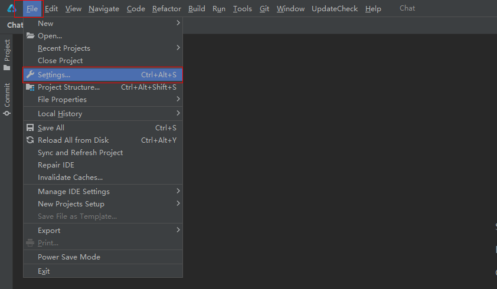
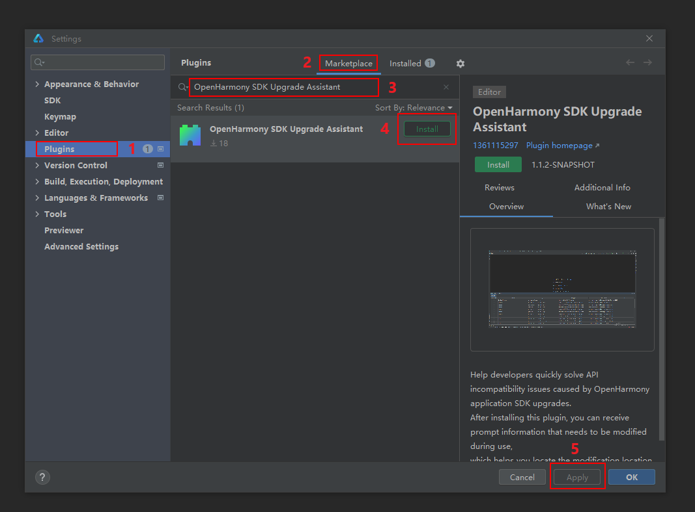
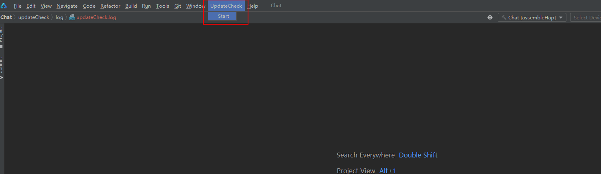

# OpenHarmony SDK Upgrade Assistant
<!--Kit: Network Kit-->
<!--Subsystem: Communication-->
<!--Owner: @wmyao_mm-->
<!--Designer: @guo-min_net-->
<!--Tester: @tongxilin-->
<!--Adviser: @zhang_yixin13-->

## Overview
OpenHarmony SDK Upgrade Assistant helps you quickly resolve API compatibility issues caused by OpenHarmony application SDK updates.<br>
API stability is not guaranteed for OpenHarmony SDK Beta versions. After an SDK update, API incompatibility may occur. If this is the case, you need to adapt to the API and underlying behavior changes after switching to the new API version. To ease this process, OpenHarmony SDK Upgrade Assistant is provided, with which you can quickly grasp the update adaptation overview and perform adaptations as prompted.

## Constraints
1. Before upgrading the SDK, back up the existing SDK files.
2. Currently, OpenHarmony SDK Upgrade Assistant can be used for OpenHarmony application SDK upgrades.

## How to Use

### Installing the Tool
1. On the main menu of DevEco Studio, choose **File > Settings**.



2. In the **Settings** dialog box, select **Plugins** to access the plugin module.

3. Click **Marketplace** and search **OpenHarmony SDK Upgrade Assistant**.

4. Click **Install** on the right of **OpenHarmony SDK Upgrade Assistant**. After the installation is complete, click **Apply** and restart DevEco Studio.



### Using the Tool

After the tool is installed, open the OpenHarmony project to be upgraded.

After the project is loaded, choose **UpdateCheck > Start** from the main menu.



Select the SDK path (including the **est** folder) of the old version. The SDK path of the new version is automatically obtained from the DevEco Studio configuration file and the SDK version configured for the application. Click **OK** to generate an update report.


After the report is generated, a dialog box is displayed. Click **OK** to close the dialog box.


Click **UpdateReport** on the toolbar to view the report.


### Introduction to the UpdateReport 

1. **Total** in the lower part of the report is the total number of problems that occur in the application due to the SDK update. You can evaluate the modification workload from this number.
2. You can sort each column by clicking the title header in the report.
3. You can select an update type reason from the **Select Type** drop-down list. The value of **Total** changes accordingly.
4. **Modified** helps you record the problems that have been modified.
5. You can double-click a cell in the **Code Location** column to locate the code in the application.
6. You can find modification suggestions in the **Prompt Information** column.
7. If there are multiple versions in the **Changelog** column, a dialog box is displayed after you click the cell. You can click the version number and link to go to the page. If there is a single version, the corresponding ChangeLog file is displayed after you click the cell.


## Packaging and Building

1. Clone the [api_diff](https://gitcode.com/openharmony/interface_sdk-js/tree/master/build-tools/api_diff) and [collect_application_api](https://gitcode.com/openharmony/interface_sdk-js/tree/master/build-tools/collect_application_api) tools from the [Interface repository](https://gitcode.com/openharmony/interface_sdk-js/tree/master/build-tools) to the local host. The api_diff tool is used to compare API differences in the SDK of the two versions, and the collect_application_api tool is used to parse and summarize APIs used in the application.


2. Open the terminal in the local api_diff and collect_application_api tool directories,

> **NOTE**
>
> Use the node.js 14.
>

Run the **npm install** command to install the tools, and run **npm run build** to build the tools. After the build is successful, **dist=>build=>api-diff.js** and **dist=>build=>api-collector.js** are generated in the respective tool folder.


3. Create the **updateCheck** folder in the last drive of the local disk, and create the **api-diff** and **collect_application_api** folders in the **updateCheck** folder.<br>Place the **api-diff.js** file in step 3 in the **api-diff** folder, and place the **libs** folder and **api-collector.js** file in the **collect_application_api** into the **'collect_application_api'** folder.


4. Open the source code IDEA, configure the gradle environment, create the **build.gradle.kts** file in the same directory as **src**, paste the following content to the file, and update the gradle. On the gradle toolbar on the right of IDEA, you can run the project and package it into a plugin.
```lombok.config
plugins {
    id("java")
    id("org.jetbrains.intellij") version "1.5.2"
}

group = "com.example"
version = "1.0-SNAPSHOT"

repositories {
    maven {
        setUrl("https://mirrors.huaweicloud.com/repository/maven")
    }
}

dependencies{
    implementation("org.springframework:spring-web:5.2.12.RELEASE")
    implementation("org.apache.commons:commons-compress:1.21")
    implementation("com.alibaba:fastjson:1.2.28")
    implementation("org.apache.logging.log4j:log4j-core:2.19.0")
    implementation("commons-httpclient:commons-httpclient:3.1")
}

intellij {
    version.set("2021.2")
    type.set("IC") // Target IDE Platform

    plugins.set(listOf(/* Plugin Dependencies */))
}

tasks {
    // Set the JVM compatibility versions
    withType<JavaCompile> {
        sourceCompatibility = "11"
        targetCompatibility = "11"
    }

    patchPluginXml {
        sinceBuild.set("212")
        untilBuild.set("522.*")
    }

    signPlugin {
        certificateChain.set(System.getenv("CERTIFICATE_CHAIN"))
        privateKey.set(System.getenv("PRIVATE_KEY"))
        password.set(System.getenv("PRIVATE_KEY_PASSWORD"))
    }

    publishPlugin {
        token.set(System.getenv("PUBLISH_TOKEN"))
    }
}


```
