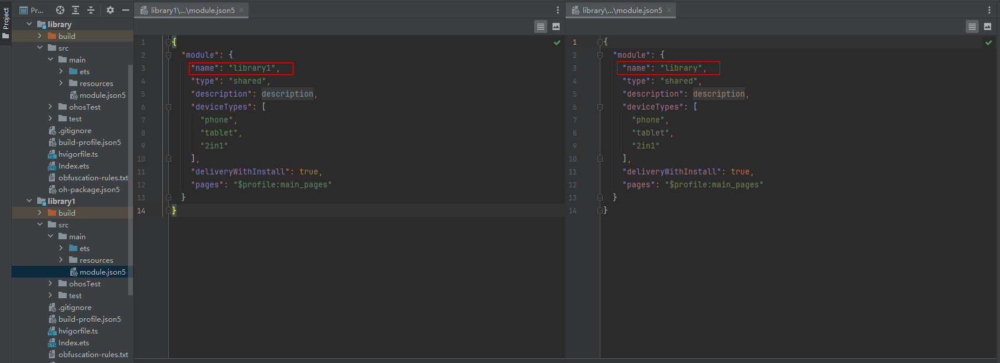

# Packing Tool
<!--Kit: Ability Kit-->
<!--Subsystem: BundleManager-->
<!--Owner: @jsjzju-->
<!--Designer: @jsjzju-->
<!--Tester: @lixueqing513-->
<!--Adviser: @Brilliantry_Rui-->

The packing tool packs compiled files for installation and release. You can use DevEco Studio or the JAR package of the packing tool to pack files. The JAR package is usually stored in the **toolchains** directory of the SDK.

The packing tool supports the generation of HAP (module package of the ability type), HSP (dynamically shared package), APP (application program package), HQF (quick fix module package), and APPQF (quick fix package) files.

You can obtain the files in the packing command from [DevEco Studio build products](https://developer.huawei.com/consumer/en/doc/harmonyos-guides/ide-compile-build) by performing the following operations:<br>
1. In the **/hvigor/hvigor-config.json5** file in the root directory of the DevEco Studio project, change the value of **level** under **logging** to **debug**.<br>
2. On the DevEco Studio menu bar, choose **Build** > **Clear projects**.<br>
3. On the DevEco Studio menu bar, choose **Build** > **Build App(s)**.<br>
4. In the **Build** window at the bottom of DevEco Studio, search for **app_packing_tool.jar** and check the file path in the packing parameters.<br>

The packaging tool verifies the validity of the attributes in the **module.json** file. The **module.json** file is a build product, whose attribute values are automatically generated during building. The mapping between the attribute values and configuration items in the configuration file is as follows.

**Table 1** Mapping between attributes of the module.json file and items of the configuration file

| Attributes of module.json         | Description         | Configuration Items of [module.json5](../quick-start/module-configuration-file.md#tags-in-the-configuration-file)        | Configuration Items of [app.json5](../quick-start/app-configuration-file.md#tags-in-the-configuration-file)           | Configuration items of [Project-level build-profile.json5 File](https://developer.huawei.com/consumer/en/doc/harmonyos-guides/ide-hvigor-build-profile-app) |
| ------------------------ | ------------------------ | ------------------------ | -------------------------- | --------------------------       |
| bundleName               | Bundle name.       | -                        | bundleName                 | -                                |
| bundleType               | Bundle type.       | -                        | bundleType                 | -                                |
| versionCode              | Application version number.           | -                        | versionCode                | -                                |
| debug                    | Whether the application can be debugged.         | -                        | debug                      | -                                |
| module/name              | Module name.       | module/name              | -                          | -                                |
| minCompatibleVersionCode | Earliest compatible version number.| -                        | minCompatibleVersionCode   | -                                |
| minAPIVersion            | Minimum API version for running the application.| -                        | minAPIVersion              | compatibleSdkVersion             |
| targetAPIVersion         | Target API version required for running the application.| -                        | targetAPIVersion           | targetSdkVersion/compileSdkVersion  <br>Note: If **targetSdkVersion** is available, it determines **targetAPIVersion**.<br>Otherwise, it is determined by **compileSdkVersion**.              |
| querySchemes             | URL schemes that allow the application to perform redirection query.| querySchemes              | -                          | -                                |

## Constraints

- The packing tool must run in Java 8 or later.
- Parameters and parameter values must be in pairs. For example, in the HAP packing command **--resources-path \<path>**, **--resources-path** is the command parameter and **path** is the parameter value. The two parameters must be used together.

## HAP Packing Command

You can use the JAR package of the packing tool to generate an HAP file for a module by passing in packing options and file paths.

**Validity Verification During HAP Packing**
- Since API version 21, if more than 50 URL schemes are configured for **querySchemes** in the **module.json** file when the HAP of the entry type is packaged, the value of **minAPIVersion** must be greater than or equal to 21.

**Compressing Rules During HAP Packing**
- If **compressNativeLibs** is set to **true**, files in the directory specified by **--lib-path** are compressed based on the compression level specified by **--compress-level**.
- To ensure running performance, files that are not in the directory specified by **--lib-path** are not compressed.

Packing command example:
- Packing command example in the [stage model](../../application-dev/application-models/application-models.md#application-model-overview):


    ```bash
    java -jar app_packing_tool.jar --mode hap --json-path <path> [--resources-path <path>] [--ets-path <path>] [--index-path <path>] [--pack-info-path <path>] [--lib-path <path>] --out-path <path> [--force true] [--compress-level 5] [--pkg-context-path <path>] [--hnp-path <path>]
    ```

- Packing command example in the [FA model](../../application-dev/application-models/application-models.md#application-model-overview):


    ```bash
    java -jar app_packing_tool.jar --mode hap --json-path <path> [--maple-so-path <path>] [--profile-path <path>] [--maple-so-dir <path>] [--dex-path <path>] [--lib-path <path>] [--resources-path <path>] [--index-path <path>] --out-path <path> [--force true] [--compress-level 5]
    ```

**Table 2** Parameters of the HAP packing command

| Name            | Mandatory| Option         | Description                                                        | Remarks           |
| ---------------- | ---------- | ------------- | ------------------------------------------------------------ | --------------- |
| --mode           | Yes        | hap           | Packing mode.                                                  | NA              |
| --json-path      | Yes        | NA            | Path of the JSON file. The file name must be **config.json** in the FA model and **module.json** in the stage model.| NA              |
| --profile-path   | No        | NA            | Path of the **CAPABILITY.profile** file.                                | NA              |
| --maple-so-path  | No        | NA            | Path of the Maple SO file. The file name extension must be .so. If there are multiple SO files, separate them with commas (,).| NA              |
| --maple-so-dir   | No        | NA            | Path of the maple SO directory (folder).                                      | NA              |
| --dex-path       | No        | NA            | Path of the DEX file. The file name extension must be .dex. If there are multiple DEX files, separate them with commas (,).<br>The value can also be the directory (folder) where the DEX file is stored.| NA              |
| --lib-path       | No        | NA            | Path of the library file. Since API version 22, when **--exist-src-path** is valid and **--lib-path-retain** is set to **true**, the **libs** directory is incrementally packed. That is, the **libs** directory in the source HAP file configured by **--exist-src-path** is directly copied, the **--lib-path** parameter is invalid and the **libs** directory configured by **--lib-path** is not packed.| NA              |
| --resources-path | No        | NA            | Path of the resources file.                                       | NA              |
| --index-path     | No        | NA            | Path of the INDEX file. The file name must be **resources.index**.               | NA              |
| --pack-info-path | No        | NA            | Path of the **pack.info** file. The file name must be **pack.info**.                  | NA              |
| --rpcid-path     | No        | NA            | Path of the **rpcid.sc** file. The file name must be **rpcid.sc**.                    | NA              |
| --js-path        | No        | NA            | Path of the JS file.                                        | This parameter is valid only in the stage model.|
| --ets-path       | No        | NA            | Path of the ETS file.                                       | This parameter is valid only in the stage model.|
| --out-path       | Yes        | NA            | Path of the target file. The file name extension must be .hap.                      | NA              |
| --force          | No        | boolean       | Whether to forcibly overwrite the target file if its path already exists. If the target file specified by **--out-path** already exists before packing and this parameter is set to **true**, the file is overwritten. If this parameter is set to **false**, the packing process is terminated and an error is reported. If the target file specified by **--out-path** does not exist before packing, the file is packed properly. This parameter is invalid. The default value is **false**.| NA              |
| --an-path        | No        | NA            | Path of the [.an file](https://developer.huawei.com/consumer/en/doc/harmonyos-faqs-V5/faqs-arkts-52-V5).| This parameter is valid only in the stage model.|
| --ap-path        | No        | NA            | Path of the [.ap file](https://developer.huawei.com/consumer/en/doc/harmonyos-faqs-V5/faqs-arkts-52-V5).| This parameter is valid only in the stage model.|
| --dir-list       | No        | NA            | List of directories (folders) to be packed into the HAP file.                     | NA              |
| --compress-level | No        | number        | Compression level of files in the **lib** library. The default value is **1**. The value ranges from 1 to 9. This parameter is valid only when **compressNativeLibs** is set to **true**. A larger value indicates a higher compression rate and a slower compression speed.| NA  |
| --pkg-context-path      | No        | NA            | Path of the **pkgContextInfo.json** file, which contains the context information. This parameter is mandatory when **bundleType** in the **app.json5** configuration file is not set to **appPlugin** and **requestPermissions** in the **module.json5** configuration file contains **"ohos.permission.kernel.SUPPORT_PLUGIN"**.| This parameter is valid only in the stage model.             |
| --hnp-path | No| NA | Path of the native software package to be packed into the HAP file.| NA |
| --exist-src-path | No| NA | Path of the source HAP file for incremental packing, which must point to an existing and valid .hap file. When **--lib-path-retain** is set to **true**, the packing tool directly copies the **libs** directory in the source HAP file, and does not pack the **libs** directory specified by **--lib-path**. This feature is called incremental packing. When **--lib-path-retain** is set to **false**, the **libs** directory specified by **--lib-path** is packed properly, and this parameter is invalid. You can use incremental packing to speed up the compression of .so files in the **libs** directory.<br>This parameter is supported since API version 22.| This parameter is valid only in the stage model.|
| --lib-path-retain | No| boolean | Whether to perform incremental packing on the **libs** directory. The value **true** means to perform incremental packing on the **libs** directory, that is, directly copy the **libs** directory in the source HAP to which **--exist-src-path** points, and do not pack the **libs** directory specified by **--lib-path**. The value **false** means the opposite. The default value is **false**. This parameter must be used together with **--exist-src-path**. Otherwise, it does not take effect.<br>This parameter is supported since API version 22.| This parameter is valid only in the stage model.|

## HSP Packing Command

HSP files enable file sharing among multiple HAPs. You can use the JAR package of the packing tool to generate an HSP file for an application by passing in packing options and file paths.

**Compressing Rules During HSP Packing**
- If **compressNativeLibs** is set to **true**, files in the directory specified by **--lib-path** are compressed based on the compression level specified by **--compress-level**.
- To ensure running performance, files that are not in the directory specified by **--lib-path** are not compressed.

Packing command example:
```bash
java -jar app_packing_tool.jar --mode hsp --json-path <path> [--resources-path <path>] [--ets-path <path>] [--index-path <path>] [--pack-info-path <path>] [--lib-path <path>] --out-path <path> [--force true] [--compress-level 5] [--pkg-context-path <path>]
```

**Table 3** Parameters of the HSP packing command

| Name            | Mandatory| Option         | Description                                                        |
| ---------------- | ---------- | ------------- | ------------------------------------------------------------ |
| --mode           | Yes        | hsp           | Packing mode.                                                  |
| --json-path      | Yes        | NA            | Path of the JSON file. The file name must be **module.json**.                    |
| --profile-path   | No        | NA            | Path of the **CAPABILITY.profile** file.                                |
| --dex-path       | No        | NA            | 1. Path of the DEX file. The file name extension must be .dex. If there are multiple DEX files, separate them with commas (,).<br>2. The value can also be the directory (folder) where the DEX file is stored.|
| --lib-path       | No        | NA            | Path of the library file. Since API version 22, when **--exist-src-path** is valid and **--lib-path-retain** is set to **true**, the **libs** directory is incrementally packed. That is, the **libs** directory in the source HAP file configured by **--exist-src-path** is directly copied, the **--lib-path** parameter is invalid and the **libs** directory configured by **--lib-path** is not packed.|
| --resources-path | No        | NA            | Path of the resources file.                                       |
| --index-path     | No        | NA            | Path of the INDEX file. The file name must be **resources.index**.               |
| --pack-info-path | No        | NA            | Path of the **pack.info** file. The file name must be **pack.info**.                  |
| --js-path        | No        | NA            | Path of the JS file.                                        |
| --ets-path       | No        | NA            | Path of the ETS file.                                       |
| --out-path       | Yes        | NA            | Path of the target file. The file name extension must be .hsp.                      |
| --force          | No        | boolean       | Whether to forcibly overwrite the target file if its path already exists. If the target file specified by **--out-path** already exists before packing and this parameter is set to **true**, the file is overwritten. If this parameter is set to **false**, the packing process is terminated and an error is reported. If the target file specified by **--out-path** does not exist before packing, the file is packed properly. This parameter is invalid. The default value is **false**.|
| --compress-level | No        | number        | Compress level of files in the **lib** library. The default value is **1**. The value ranges from 1 to 9. This parameter is valid only when **compressNativeLibs** is set to **true**. A larger value indicates a higher compression rate and a slower compression speed.|
| --pkg-context-path      | No        | NA            | Path of the **pkgContextInfo.json** file, which contains the context information. This parameter is mandatory when **bundleType** in the **app.json5** configuration file is not set to **appPlugin** and **requestPermissions** in the **module.json5** configuration file contains **"ohos.permission.kernel.SUPPORT_PLUGIN"**.|
| --exist-src-path | No| NA | Path of the source HSP file for incremental packing, which must point to an existing and valid .hsp file. When **--lib-path-retain** is set to **true**, the packing tool directly copies the **libs** directory in the source HSP file, and does not pack the **libs** directory specified by **--lib-path**. This feature is called incremental packing. When **--lib-path-retain** is set to **false**, the **libs** directory specified by **--lib-path** is packed properly, and this parameter is invalid. You can use incremental packing to speed up the compression of .so files in the **libs** directory.<br>This parameter is supported since API version 22.|
| --lib-path-retain | No| boolean | Whether to perform incremental packing on the **libs** directory. The value **true** means to perform incremental packing on the **libs** directory, that is, directly copy the **libs** directory in the source HSP to which **--exist-src-path** points, and do not pack the **libs** directory specified by **--lib-path**. The value **false** means the opposite. The default value is **false**. This parameter must be used together with **--exist-src-path**. Otherwise, it does not take effect.<br>This parameter is supported since API version 22.|

## APP Packing Command

You can use the JAR package of the packing tool to generate an APP file for an application by passing in packing options and file paths. The APP file is used to release the application to the application market.

**Table 4** Validity verification rules during APP packing

| Fields in module.json of HAP/HSP That Are Verified | Verification Rules                          |
| --------------------------------- | --------------------------------- |
| **name** field in module               | All HAP/HSP **name** fields must be different.     |
| bundleName                       | All HAP/HSP **bundleName** fields must be the same. |
| bundleType                       | All HAP/HSP **bundleType** fields must be the same. |
| versionCode                      | All HAP/HSP **versionCode** fields must be the same.|
| debug                            | Since API version 20, the **debug** field values of all HAPs must be the same. If the **debug** field value of HAP is **false**, the **debug** field value of HSP must also be **false**. If the **debug** field value of HAP is **true**, there is no requirement for the **debug** field of HSP.<br>For API version 19 and earlier versions, the **debug** field values of all HAPs/HSPs must be the same.   |
| minAPIVersion                    | Since API version 20, the **minAPIVersion** field values of all HAPs must be the same and be greater than or equal to the maximum value of the **minAPIVersion** field of all HSPs.<br>For API version 19 and earlier versions, the **minAPIVersion** field values of all HAPs/HSPs must be the same.   |
| minCompatibleVersionCode         | Since API version 16, the **minCompatibleVersionCode** field values of all HAPs must be the same and be greater than or equal to the maximum value of the **minCompatibleVersionCode** field of all HSPs.<br>For API version 15 and earlier versions, the **minCompatibleVersionCode** field values of all HAPs/HSPs must be the same.   |
| targetAPIVersion                 | Since API version 16, the **targetAPIVersion** field values of all HAPs must be the same and be greater than or equal to the maximum value of the **targetAPIVersion** field of all HSPs.<br>For API version 15 and earlier versions, the **targetAPIVersion** field values of all HAPs/HSPs must be the same.   |
| versionName                | Since API version 12, the **versionName** field is no longer verified.     |

> **NOTE**
>
> - The **module.json** file is the build product of DevEco Studio. For the mapping between the fields in the **module.json** file and the items in the configuration file, see [Table 1 Mapping between attributes of the module.json file and items of the configuration file](packing-tool.md).

**Compression rules**: During APP file packing, the HAP and HSP files in release mode are compressed, while those in debug mode are not.

> **NOTE**
> 
> If the .so file has been compressed in the HAP/HSP and is compressed again during APP packing, the size of the .so file will not be significantly reduced.

Packing command example:

```bash
java -jar app_packing_tool.jar --mode app [--hap-path <path>] [--hsp-path <path>] --out-path <path> [--signature-path <path>] [--certificate-path <path>] --pack-info-path <path> [--pack-res-path <path>] [--force true] [--encrypt-path <path>] [--pac-json-path <path>] [--atomic-service-entry-size-limit <size>] [--atomic-service-non-entry-size-limit <size>] [--replace-pack-info false]
```

**Table 5** Parameters of the APP packing command

| Name                | Mandatory| Option         | Description                                                          |
|--------------------|-------|-------------|--------------------------------------------------------------|
| --mode             | Yes    | app         | Packing mode. Each HAP file to pack into the APP file must pass the validity check.                                          |
| --hap-path         | No    | NA          | Path of the HAP files. The file name extension must be .hap. If there are multiple HAP files, separate them with commas (,).<br>The value can also be the directory (folder) where the HAP files are stored.|
| --hsp-path         | No    | NA          | Path of the HSP files. The file name extension must be .hsp. If there are multiple HSP files, separate them with commas (,).<br>The value can also be the directory (folder) where the HSP files are stored.|
| --pack-info-path   | Yes    | NA          | Path of the **pack.info** file. The file name must be **pack.info**.                                            |
| --out-path         | Yes    | NA          | Path of the target file. The file name extension must be .app.                                       |
| --signature-path   | No    | NA          | Path of the signature file.                                                       |
| --certificate-path | No    | NA          | Path of the certificate file.                                                       |
| --pack-res-path    | No    | NA          | Path of the **pack.res** file.                                |
| --force            | No    | boolean     | Whether to forcibly overwrite the target file if its path already exists. If the target file specified by **--out-path** already exists before packing and this parameter is set to **true**, the file is overwritten. If this parameter is set to **false**, the packing process is terminated and an error is reported. If the target file specified by **--out-path** does not exist before packing, the file is packed properly. This parameter is invalid. The default value is **false**.|
| --encrypt-path     | No    | NA          | The file name must be **encrypt.json**.                          |
| --pac-json-path     | No    | NA          | <!--RP1-->Path of the **pac.json**<!--RP1End--> file. The file name must be **pac.json**.<br>This parameter is supported since API version 20.|
| --atomic-service-entry-size-limit      | No        | NA            | Size limit of the entry package (including the size of the dependency package) of the atomic service. This parameter is valid only in the stage model and **bundleType** is set to **atomicService**. The value is an integer ranging from 0 to 4194304, in KB. The value **0** indicates that the size is not limited. If this parameter is not set, the default value **2048 KB** is used. If the entry package is in release mode (the **type** field in the **module.json5** file is set to **entry** and the **debug** field in the **app.json5** file is set to **false**), this limit applies to the compressed entry package size (including the size of the dependency package) during APP packing.                      |
| --atomic-service-non-entry-size-limit  | No        | NA            | Size limit of the non-entry package (including the size of the dependency package) of the atomic service. This parameter is valid only in the stage model and **bundleType** is set to **atomicService**. The value is an integer ranging from 0 to 4194304, in KB. The value **0** indicates that the size is not limited. If this parameter is not set, the default value **2048 KB** is used. If the non-entry package is in release mode (the **type** field in the **module.json5** file is not set to **entry** and the **debug** field in the **app.json5** file is set to **false**), this limit applies to the compressed non-entry package size (including the size of the dependency package) during APP packing.                    |
| --replace-pack-info    | No    | boolean          | Whether to use the **pack.info** file specified by the **--pack-info-path** parameter to replace the **pack.info** file in the HAP and HSP files during APP packing. The value **true** means to replace, and **false** means the opposite. The default value is **true**.<br>This parameter is supported since API version 22.|
| --stat-duplicate       | No    | boolean       | Whether to scan for duplicate .so files after the packing is complete. This parameter can be used to identify duplicate .so files to reduce the package size. If this parameter is set to **true**, the scanning is performed. After the scanning is complete, the **scan_report** directory is generated in the directory where the output file specified by **--out-path** is located. The **scan_report** directory contains the [duplicate .so file scanning report](#scanning-for-duplicate-so-files) whose file name is **scan_result**, and the **scan_report** directory path is printed in the warning message. If this parameter is set to **false**, the scanning is not performed. The default value is **false**.<br>This parameter is supported since API version 23.|


## Multi-project Packing Command

If multiple teams develop the same application but it is inconvenient to share code, you can use multi-project packing, which packs the packed HAP, HSP, and APP files into a final APP file and releases it to the application market.

**Table 6** Validity verification rules for multi-project packing

| Fields in module.json of HAP/HSP That Are Verified | Verification Rules                          |
| --------------------------------- | --------------------------------- |
| **name** field in module               | All HAP/HSP **name** fields must be different.     |
| bundleName                       | All HAP/HSP **bundleName** fields must be the same. |
| bundleType                       | All HAP/HSP **bundleType** fields must be the same. |
| versionCode                      | All HAP/HSP **versionCode** fields must be the same.|
| debug                            | Since API version 20, the **debug** field values of all HAPs must be the same. If the **debug** field value of HAP is **false**, the **debug** field value of HSP must also be **false**. If the **debug** field value of HAP is **true**, there is no requirement for the **debug** field of HSP.<br>For API version 19 and earlier versions, the **debug** field values of all HAPs/HSPs must be the same.   |
| minAPIVersion                    | Since API version 20, the **minAPIVersion** field values of all HAPs must be the same and be greater than or equal to the maximum value of the **minAPIVersion** field of all HSPs.<br>For API version 19 and earlier versions, the **minAPIVersion** field values of all HAPs/HSPs must be the same.   |
| minCompatibleVersionCode         | Since API version 16, the **minCompatibleVersionCode** field values of all HAPs must be the same and be greater than or equal to the maximum value of the **minCompatibleVersionCode** field of all HSPs.<br>For API version 15 and earlier versions, the **minCompatibleVersionCode** field values of all HAPs/HSPs must be the same.   |
| targetAPIVersion                 | Since API version 16, the **targetAPIVersion** field values of all HAPs must be the same and be greater than or equal to the maximum value of the **targetAPIVersion** field of all HSPs.<br>For API version 15 and earlier versions, the **targetAPIVersion** field values of all HAPs/HSPs must be the same.   |
| versionName                | Since API version 12, the **versionName** field is no longer verified.     |

> **NOTE**
>
> - The **module.json** file is the build product of DevEco Studio. For the mapping between the fields in the **module.json** file and the items in the configuration file, see [Table 1 Mapping between attributes of the module.json file and items of the configuration file](packing-tool.md).

Packing command example:

```bash
java -jar app_packing_tool.jar --mode multiApp [--hap-list <path>] [--hsp-list <path>] [--app-list <path>] --out-path <option> [--force true] [--encrypt-path <path>] [--pac-json-path <path>] [--atomic-service-entry-size-limit <size>] [--atomic-service-non-entry-size-limit <size>]
```

**Table 7** Parameters of the multi-project packing command

| Name        | Mandatory| Option       | Description                                                       |
|------------|-------|-----------|----------------------------------------------------------------|
| --mode     | Yes    | multiApp  | Packing mode. Each HAP file to pack into the APP file must pass the validity check.                                                           |
| --hap-list | No    | Path of the HAP files   | Path of the HAP files. The file name extension must be .hap. If there are multiple HAP files, separate them with commas (,).<br>The value can also be the directory (folder) where the HAP files are stored.                                         |
| --hsp-list | No    | Path of the HSP files   | Path of the HSP files. The file name extension must be .hsp. If there are multiple HSP files, separate them with commas (,).<br>The value can also be the directory (folder) where the HSP files are stored.                                         |
| --app-list | No    | Path of the APP files   | Path of the APP files. The file name extension must be .app. If there are multiple APP files, separate them with commas (,).<br>The value can also be the directory (folder) where the APP files are stored.<br>You must specify **--hap-list**, **--hsp-list**, or **--app-list**, or any of their combinations.|
| --out-path | Yes    | NA | Path of the target file. The file name extension must be .app.|
| --force    | No    | boolean | Whether to forcibly overwrite the target file if its path already exists. If the target file specified by **--out-path** already exists before packing and this parameter is set to **true**, the file is overwritten. If this parameter is set to **false**, the packing process is terminated and an error is reported. If the target file specified by **--out-path** does not exist before packing, the file is packed properly. This parameter is invalid. The default value is **false**. |
| --encrypt-path | No    | Path of **encrypt.json**| The file name must be **encrypt.json**.                                                                 |
| --pac-json-path | No    | NA          | <!--RP1-->Path of the **pac.json**<!--RP1End--> file. The file name must be **pac.json**.<br>If this parameter is not set, the app product does not contain the **pac.json** file.<br>The **pac.json** file in the APP file specified by **--app-list** is not packed into the final app.<br>This parameter is supported since API version 20.|
| --atomic-service-entry-size-limit      | No        | NA            | Size limit of the entry package (including the size of the dependency package) of the atomic service. This parameter is valid only in the stage model and **bundleType** is set to **atomicService**. The value is an integer ranging from 0 to 4194304, in KB. The value **0** indicates that the size is not limited. If this parameter is not set, the default value **2048 KB** is used. If the entry package is in release mode (the **type** field in the **module.json5** file is set to **entry** and the **debug** field in the **app.json5** file is set to **false**), this limit applies to the compressed entry package size (including the size of the dependency package) during APP packing.                      |
| --atomic-service-non-entry-size-limit  | No        | NA            | Size limit of the non-entry package (including the size of the dependency package) of the atomic service. This parameter is valid only in the stage model and **bundleType** is set to **atomicService**. The value is an integer ranging from 0 to 4194304, in KB. The value **0** indicates that the size is not limited. If this parameter is not set, the default value **2048 KB** is used. If the non-entry package is in release mode (the **type** field in the **module.json5** file is not set to **entry** and the **debug** field in the **app.json5** file is set to **false**), this limit applies to the compressed non-entry package size (including the size of the dependency package) during APP packing.                    |
| --stat-duplicate       | No    | boolean       | Whether to scan for duplicate .so files after the packing is complete. This parameter can be used to identify duplicate .so files to reduce the package size. If this parameter is set to **true**, the scanning is performed. After the scanning is complete, the **scan_report** directory is generated in the directory where the output file specified by **--out-path** is located. The **scan_report** directory contains the [duplicate .so file scanning report](#scanning-for-duplicate-so-files) whose file name is **scan_result**, and the **scan_report** directory path is printed in the warning message. If this parameter is set to **false**, the scanning is not performed. The default value is **false**.<br>This parameter is supported since API version 23.|


## HQF Packing Command

The HQF file is used for [incremental debugging](https://developer.huawei.com/consumer/en/doc/harmonyos-guides/ide-incremental-debugging). You can use the JAR package of the packing tool to generate an HQF file for an application by passing in packing options and file paths.

> **NOTE**
>
> - The HQF file cannot be released to the app market and is used only for incremental debugging.

Packing command example:

```bash
java -jar app_packing_tool.jar --mode hqf --json-path <path> [--lib-path <path>] [--ets-path <path>] [--resources-path <path>] --out-path <path> [--force true]
```

**Table 8** Parameters of the HQF packing command

| Name         | Mandatory| Option         | Description                                |
|-------------|-------|-------------|------------------------------------|
| --mode      | Yes    | hqf         | Packing mode.                             |
| --json-path | Yes    | NA          | Path of the .json file. The file name must be [patch.json](https://developer.huawei.com/consumer/en/doc/harmonyos-guides/ide-incremental-debugging#section28031446182019).       |
| --lib-path  | No    | NA          | Path of the library file.                        |
| --ets-path  | No    | NA          | Path of the ETS file.                      |
| --resources-path  | No    | NA          | Path of the resources file.                      |
| --out-path  | Yes    | NA          | Path of the target file. The file name extension must be .hqf.             |
| --force     | No    | boolean | Whether to forcibly overwrite the target file if its path already exists. If the target file specified by **--out-path** already exists before packing and this parameter is set to **true**, the file is overwritten. If this parameter is set to **false**, the packing process is terminated and an error is reported. If the target file specified by **--out-path** does not exist before packing, the file is packed properly. This parameter is invalid. The default value is **false**.|

## APPQF Packing Command

An APPQF file consists of one or more HQF files. These HQF files are split from an APPQF file in the application market and then distributed to specific devices. You can use the JAR package of the packing tool to generate an APPQF file for an application by passing in packing options and file paths.

**APPQF Packing Validity Verification**
- When packing an APPQF file, ensure that the values of **versionName**, **versionCode**, **patchVersionName**, and **patchVersionCode** in the [patch.json file](https://developer.huawei.com/consumer/en/doc/harmonyos-guides/ide-incremental-debugging#section28031446182019) of each HQF are the same.
- All HQFs must be unique. An HQF duplication occurs when both of the following conditions are met:
    1. The **name** fields under module in the **patch.json** files of the two HQFs are the same.
    2. The **deviceTypes** attributes under module in the **patch.json** files of the two HQFs intersect (at least one device type is the same).

Packing command example:

```bash
java -jar app_packing_tool.jar --mode appqf --hqf-list <path> --out-path <path> [--force true]
```

**Table 9** Parameters of the APPQF packing command

| Name        | Mandatory| Option         | Description                                |
|------------|-------|-------------|------------------------------------|
| --mode     | Yes    | appqf       | Packing mode.                             |
| --hqf-list | Yes    | NA          | Path of the [HQF file](packing-tool.md#hqf-packing-command). Use commas (,) to separate multiple HQF files.             |
| --out-path | Yes    | NA          | Path of the target file. The file name extension must be .appqf.           |
| --force    | No    | boolean | Whether to forcibly overwrite the target file if its path already exists. If the target file specified by **--out-path** already exists before packing and this parameter is set to **true**, the file is overwritten. If this parameter is set to **false**, the packing process is terminated and an error is reported. If the target file specified by **--out-path** does not exist before packing, the file is packed properly. This parameter is invalid. The default value is **false**.|

## versionNormalize Command

For the same APP, the values of **versionName** and **versionCode** of all the HAP and HSP files must be the same. When only one HAP or HSP needs to be updated, you can run the **versionNormalize** command to unify the versions of these HAP or HSP files. This command changes the version numbers and names of the HAP and HSP files passed in, and generates in the specified directory new HAP and HSP files with the same names and a **version_record.json** file to record their original version numbers and names.

Packing command example:
```bash
java -jar app_packing_tool.jar --mode versionNormalize --input-list 1.hap,2.hsp --version-code 1000001 --version-name 1.0.1 --out-path out
```

**Table 10** Parameters of the versionNormalize command

| Name            | Mandatory| Option              | Description                                                               |
|----------------|-------|------------------|-------------------------------------------------------------------|
| --mode         | Yes    | versionNormalize | Command type.                                                            |
| --input-list   | Yes    | Path of the HAP or HSP files      | 1. Path of the HAP or HSP files. The file name extension must be .hap or .hsp. If there are multiple HAP or HSP files, separate them with commas (,).<br>2. The value can also be the directory (folder) where the HAP and HSP files are stored. If this is the case, all HAP and HSP files in the directory (folder) are read.|
| --version-code | Yes    | Internal version number             | New internal version number of the HAP and HSP files. The value must be an integer and cannot be earlier than the version numbers of all the HAP and HSP files passed in.           |
| --version-name | Yes    | Version name            | New version name of the HAP and HSP files.                                   |
| --out-path     | Yes    | NA               | Target file path, which must be a directory (folder).                                                  |

## packageNormalize Command

The **packageNormalize** command is used to change the passed-in HSP bundle name and version number and generate an HSP with the same name in the specified directory.

Packing command example:
```bash
java -jar app_packing_tool.jar --mode packageNormalize --hsp-list 1.hsp,2.hsp --bundle-name com.example.myapplication --version-code 1000001 --out-path out
```

**Table 11** Parameters of the packageNormalize command

| Name            | Mandatory| Option           | Description                                                 |
|----------------|-------|---------------|-----------------------------------------------------|
| --mode         | Yes    | packageNormalize | Command type.                                              |
| --hsp-list     | Yes    | Path of the HSP files     | 1. Path of the HSP files. The file name extension must be .hsp. If there are multiple HSP files, separate them with commas (,).<br>2. Directory of the HSP files. Only .hsp files in the directory are processed.|
| --bundle-name  | Yes    | Bundle name           | New bundle name, to which the passed-in bundle name will be changed.                            |
| --version-code | Yes    | Internal version number          | New version number, to which the passed-in version number will be changed. The value must be an integer greater than 0.                |
| --out-path     | Yes    | NA            | Target file path, which must be a directory (folder).                                    |

## generalNormalize Command

This command is used to modify the following parameters of the HAP/HSP file: **deviceType**, **bundleName**, **versionName**, **versionCode**, **minCompatibleVersionCode**, **minAPIVersion**, **targetAPIVersion**,<br>
**apiReleaseType**, **bundleTypes**, **installationFree**, and **deliveryWithInstall**. It can also generate a modified HAP/HSP file with the same name and a **general_record.json** file in the specified directory to record the original parameter names and module names of all HAPs/HSPs. The parameters set above must comply with the correct packing specifications. Otherwise, the HAP/HSP file fails to be generated in the specified directory, and no file is generated in the specified directory.

> **NOTE**
>
> - Since API version 20, the **generalNormalize** command is supported.

Packing command example:

```bash
java -jar app_packing_tool.jar --mode generalNormalize --input-list 1.hsp,2.hsp --bundle-name com.example.myapplication --version-code 1000001 --version-name 1.0.1 --min-compatible-version-code 14 --min-api-version 14 --target-api-version 14 --api-release-type Release1 --bundle-type app --installation-free false --delivery-with-install true --device-types default,tablet --out-path out
```

**Table 12** Parameters of the generalNormalize command

| Name                         | Mandatory| Option                                              | Description                                                        |
| ----------------------------- | ---------- | -------------------------------------------------- | ------------------------------------------------------------ |
| --mode                        | Yes        | generalNormalize                                   | Command type.                              |
| --input-list                  | Yes        | Path of the HAP or HSP files                                    | 1. Path of the HAP or HSP files. The file name extension must be .hap or .hsp. Use commas (,) to separate the paths of multiple HAP or HSP files.<br>2. The value can also be the directory (folder) where the HAP and HSP files are stored. If this is the case, all HAP and HSP files in the directory (folder) are read.|
| --bundle-name                 | No        | Bundle name                                              | New bundle name, to which the passed-in bundle name will be changed. The value cannot be empty. For details about the definition and specifications of this field, see the **bundleName** field in [app.json5](../quick-start/app-configuration-file.md#tags-in-the-configuration-file).|
| --version-code                | No        | Internal version number                                            | New version number, to which the passed-in version number will be changed. The value is an integer ranging from 0 to 2147483647. The value cannot be empty. For details about the definition and specifications of this field, see the **versionCode** field in [app.json5](../quick-start/app-configuration-file.md#tags-in-the-configuration-file).|
| --version-name                | No        | Version name                                          | Version name. The version name of the input package will be changed to this version name. The value cannot be empty. For details about the definition and specifications of this field, see the **versionName** field in [app.json5](../quick-start/app-configuration-file.md#tags-in-the-configuration-file).|
| --min-compatible-version-code | No        | Earliest compatible version number                          | New earliest compatible version number, to which the passed-in earliest compatible version number will be changed. The value is an integer ranging from 0 to 2147483647 and cannot be empty. For details about the definition and specifications of this field, see the **minCompatibleVersionCode** field in [app.json5](../quick-start/app-configuration-file.md#tags-in-the-configuration-file).|
| --min-api-version             | No        | Minimum SDK API version                                  | New minimum SDK API version, to which the passed-in minimum SDK API version will be changed. The value is an integer ranging from 0 to 2147483647 and cannot be empty. For details about the definition and specifications of this field, see the **minAPIVersion** field in [app.json5](../quick-start/app-configuration-file.md#tags-in-the-configuration-file).|
| --target-api-version          | No        | Target API version                                       | New target API version, to which the passed-in target API version will be changed. The value is an integer ranging from 0 to 2147483647 and cannot be empty. For details about the definition and specifications of this field, see the **targetAPIVersion** field in [app.json5](../quick-start/app-configuration-file.md#tags-in-the-configuration-file).|
| --api-release-type            | No        | Target API version type                                 | New target API version type, to which the passed-in target API version type will be changed. The value cannot be empty. For details about the definition and specifications of this field, see the **apiReleaseType** field in [app.json5](../quick-start/app-configuration-file.md#tags-in-the-configuration-file).|
| --bundle-type                 | No        | Bundle type                                        | New bundle type, to which the passed-in bundle type will be changed. The value cannot be empty. For details about the definition and specifications of this field, see the **bundleType** field in [app.json5](../quick-start/app-configuration-file.md#tags-in-the-configuration-file).|
| --installation-free           | No        | Installation-free feature                                | New installation-free feature, to which the passed-in installation-free feature will be changed. The value cannot be empty. For details about the definition and specifications of this field, see the **installationFree** field in [module.json5](../quick-start/module-configuration-file.md#tags-in-the-configuration-file) of the stage model or [config.json](../quick-start/application-configuration-file-overview-fa.md) of the FA model.|
| --delivery-with-install       | No        | Whether the HAP file will be installed when the user installs the application| New value indicating whether the specified HAP file will be installed when the user installs the application, to which the passed-in **deliveryWithInstall** will be changed. The value cannot be empty. For details about the definition and specifications of this field, see the **deliveryWithInstall** field in [module.json5](../quick-start/module-configuration-file.md#tags-in-the-configuration-file) of the stage model or [config.json](../quick-start/application-configuration-file-overview-fa.md) of the FA model.|
| --device-types                | No        | Type of device on which the ability can run                         | New device type, to which the passed-in device type will be changed. The value cannot be empty. For details about the definition and specifications of this field, see the **deviceTypes** field in the [module.json5](../quick-start/module-configuration-file.md#tags-in-the-configuration-file) of the stage model or [config.json](../quick-start/application-configuration-file-overview-fa.md) of the FA model. The value is a string, and multiple device types are separated by commas (,).|
| --out-path                    | Yes        | NA                                                 | Target file path, which must be a directory (folder) with read and write permissions.                  |

## Packing Commands for RES Files

This command is used to generate an HAP file for the **pack.res** file.

Packing command example:

```bash
java -jar app_packing_tool.jar --mode res --entrycard-path <path> --pack-info-path <path> --out-path <path> [--force true]
```

**Table 13** Parameters of the packing commands for RES files

| Name              | Mandatory| Option           | Description                                |
|------------------|-------|---------------|------------------------------------|
| --mode           | Yes    | res           | Command type.                             |
| --entrycard-path | Yes    | NA            | Path of the **pack.res** file.                          |
| --pack-info-path | Yes    | NA            | Path of the **pack.info** file.             |
| --out-path       | Yes    | NA            | Path of the target file. The file name extension must be .res.             |
| --force          | No    | boolean   | Whether to forcibly overwrite the target file if its path already exists. If the target file specified by **--out-path** already exists before packing and this parameter is set to **true**, the file is overwritten. If this parameter is set to **false**, the packing process is terminated and an error is reported. If the target file specified by **--out-path** does not exist before packing, the file is packed properly. This parameter is invalid. The default value is **false**.|

## Packing Commands for FastApp Files

You can use the JAR package of the packing tool to generate an APP file for a fast application by passing in packing options and path of the HAP or HSP files. The APP file is used to release the application to the application market.

**Table 14** Validity verification rules for fastApp file packing

| Fields in module.json of HAP/HSP That Are Verified | Verification Rules                          |
| --------------------------------- | --------------------------------- |
| **name** field in module               | All HAP/HSP **name** fields must be different.     |
| bundleName                       | All HAP/HSP **bundleName** fields must be the same. |
| bundleType                       | All HAP/HSP **bundleType** fields must be the same. |
| versionCode                      | All HAP/HSP **versionCode** fields must be the same.|
| debug                            | Since API version 20, the **debug** field values of all HAPs must be the same. If the **debug** field value of HAP is **false**, the **debug** field value of HSP must also be **false**. If the **debug** field value of HAP is **true**, there is no requirement for the **debug** field of HSP.<br>For API version 19 and earlier versions, the **debug** field values of all HAPs/HSPs must be the same.   |
| minAPIVersion                    | Since API version 20, the **minAPIVersion** field values of all HAPs must be the same and be greater than or equal to the maximum value of the **minAPIVersion** field of all HSPs.<br>For API version 19 and earlier versions, the **minAPIVersion** field values of all HAPs/HSPs must be the same.   |
| minCompatibleVersionCode         | Since API version 16, the **minCompatibleVersionCode** field values of all HAPs must be the same and be greater than or equal to the maximum value of the **minCompatibleVersionCode** field of all HSPs.<br>For API version 15 and earlier versions, the **minCompatibleVersionCode** field values of all HAPs/HSPs must be the same.   |
| targetAPIVersion                 | Since API version 16, the **targetAPIVersion** field values of all HAPs must be the same and be greater than or equal to the maximum value of the **targetAPIVersion** field of all HSPs.<br>For API version 15 and earlier versions, the **targetAPIVersion** field values of all HAPs/HSPs must be the same.   |

> **NOTE**
>
> - The **module.json** file is the build product of DevEco Studio. For the mapping between the fields in the **module.json** file and the items in the configuration file, see [Table 1 Mapping between attributes of the module.json file and items of the configuration file](packing-tool.md).

**Compression rules**: During APP file packing, the HAP and HSP files in release mode are compressed, while those in debug mode are not.

> **NOTE**
> 
> If the .so file has been compressed in the HAP/HSP and is compressed again during APP packing, the size of the .so file will not be significantly reduced.

Packing command example:

```bash
java -jar app_packing_tool.jar --mode fastApp [--hap-path <path>] [--hsp-path <path>] --out-path <path> [--signature-path <path>] [--certificate-path <path>] --pack-info-path <path> [--pack-res-path <path>] [--force true] [--encrypt-path <path>] [--pac-json-path <path>] [--atomic-service-entry-size-limit <size>] [--atomic-service-non-entry-size-limit <size>]
```

**Table 15** Parameters of the fastApp packing command

| Name                | Mandatory| Option        | Description                                                    |
|--------------------|-------|------------|----------------------------------------------------|
| --mode             | Yes    | fastApp    | Packing mode. Each HAP file to pack into the APP file must pass the validity check.                                     |
| --hap-path         | No    | NA         | Path of the HAP file directory, which contains all files of the HAP. If there are multiple HAP file paths, separate them with commas (,).                                             |
| --hsp-path         | No    | NA         | 1. Path of the HSP files. The file name extension must be .hsp. If there are multiple HSP files, separate them with commas (,).<br>2. Path of the HSP file directory, which contains all files of the HSP. If there are multiple HAP file paths, separate them with commas (,).|
| --pack-info-path   | Yes    | NA         | Path of the **pack.info** file. The file name must be **pack.info**.                                              |
| --out-path         | Yes    | NA         | Path of the target file. The file name extension must be .app.                                            |
| --signature-path   | No    | NA         | Path of the signature file.                                                           |
| --certificate-path | No    | NA         | Path of the certificate file.                                               |
| --pack-res-path    | No    | NA         | Path of the **pack.res** file.                  |
| --force            | No    | boolean | Whether to forcibly overwrite the target file if its path already exists. If the target file specified by **--out-path** already exists before packing and this parameter is set to **true**, the file is overwritten. If this parameter is set to **false**, the packing process is terminated and an error is reported. If the target file specified by **--out-path** does not exist before packing, the file is packed properly. This parameter is invalid. The default value is **false**.|
| --encrypt-path     | No    | NA         | The file name must be **encrypt.json**.          |
| --pac-json-path     | No    | NA          | <!--RP1-->Path of the **pac.json**<!--RP1End--> file. The file name must be **pac.json**.<br>This parameter is supported since API version 20.|
| --atomic-service-entry-size-limit      | No        | NA            | Size limit of the entry package (including the size of the dependency package) of the atomic service. This parameter is valid only in the stage model and **bundleType** is set to **atomicService**. The value is an integer ranging from 0 to 4194304, in KB. The value **0** indicates that the size is not limited. If this parameter is not set, the default value **2048 KB** is used. If the entry package is in release mode (the **type** field in the **module.json5** file is set to **entry** and the **debug** field in the **app.json5** file is set to **false**), this limit applies to the compressed entry package size (including the size of the dependency package) during APP packing.                     |
| --atomic-service-non-entry-size-limit  | No        | NA            | Size limit of the non-entry package (including the size of the dependency package) of the atomic service. This parameter is valid only in the stage model and **bundleType** is set to **atomicService**. The value is an integer ranging from 0 to 4194304, in KB. The value **0** indicates that the size is not limited. If this parameter is not set, the default value **2048 KB** is used. If the non-entry package is in release mode (the **type** field in the **module.json5** file is not set to **entry** and the **debug** field in the **app.json5** file is set to **false**), this limit applies to the compressed non-entry package size (including the size of the dependency package) during APP packing.                    |
| --stat-duplicate       | No    | boolean       | Whether to scan for duplicate .so files after the packing is complete. This parameter can be used to identify duplicate .so files to reduce the package size. If this parameter is set to **true**, the scanning is performed. After the scanning is complete, the **scan_report** directory is generated in the directory where the output file specified by **--out-path** is located. The **scan_report** directory contains the [duplicate .so file scanning report](#scanning-for-duplicate-so-files) whose file name is **scan_result**, and the **scan_report** directory path is printed in the warning message. If this parameter is set to **false**, the scanning is not performed. The default value is **false**.<br>This parameter is supported since API version 23.|

## Scanning for Duplicate .so Files

When you use the [APP packing command](#app-packing-command), [packing commands for FastApp files](#packing-commands-for-fastapp-files), or [multi-project packing command](#multi-project-packing-command) to generate an APP file, set **--stat-duplicate** to **true** to enable the scanning for duplicate .so files. The system will generate a scanning report after the packing is successful. After duplicate .so files are identified, you can reduce the package size as required. The scanning report is stored in the **scan_report** directory in the directory where the generated APP file is stored. Table 16 describes the structure of the scanning report, and Table 17 describes the structure of the duplicate .so file feature information. The following is an example of the scanning report:

JSON statistics result:
```json
[{
    "result":[{
        "md5":"975c41f5727b416b1ffefa5bb0f073b2",
        "size":1108880,
        "files":[
            "/application-entry-default.hap/libs/armeabi-v7a/example.so",
            "/entry-default.hap/libs/armeabi-v7a/example.so"
        ]
    }],
    "startTime": "2025-11-13 16:02:48.381",
    "stopTime": "2025-11-13 16:02:48.381",
    "taskDesc": "find the duplicated so"
}]
```
**Table 16 Fields in the duplicate .so file scanning report**

| Field     | Type  | Description                       |
| --------- | ------ | --------------------------- |
| result    | Struct | Feature information of duplicate .so files, including the MD5 value, file size, and file path. For details, see Table 17.      |
| startTime | String | Start time of the task.             |
| stopTime  | String | End time of the task.             |
| taskDesc  | String | Task description, which is "find the duplicated so".           |

**Table 17 Feature fields of duplicate .so files**

| Field | Type           | Description                      |
| ----- | --------------- | -------------------------- |
| md5   | String          | MD5 value of the duplicate .so file.         |
| size  | int             | Size of the duplicate .so file, in bytes.|
| files | Vector\<String> | Path of the duplicate .so file.    |

## Error Codes

### 10010001 Failed to Run the Packing Tool
**Error Message**

Execute packing tool failed.

**Description**

Failed to run the packing tool.

**Possible Causes**

1. The validity verification of the package file failed.
2. The file to be packed is being used by another application, such as a compression application or the file manager.

**Solution**

1. Check the configuration items in the [app.json5](../quick-start/app-configuration-file.md) and [module.json5](../quick-start/module-configuration-file.md) file based on the error information. If multiple error messages are displayed, check the first error message first.
2. Check whether any application (such as the compression application or file manager) is occupying the package file. If yes, close the related process and try again.

### 10012001 Failed to Compress the Package
**Error Message**

Execute compress process failed.

**Description**

During packing a HAP or APP file, the file fails to be compressed. As a result, the packing is interrupted.

**Possible Causes**

1. The validity verification of the package file failed.
2. The file to be packed is being used by another application, such as a compression application or the file manager.

**Solution**

1. Check the configuration items in the [app.json5](../quick-start/app-configuration-file.md) and [module.json5](../quick-start/module-configuration-file.md) file based on the error information. If multiple error messages are displayed, check the first error message first.
2. Check whether any application (such as the compression application or file manager) is occupying the package file. If yes, close the related process and try again.

### 10012002 Failed to Compress the HAP
**Error Message**

Compress Stage Hap failed.

**Description**

The HAP file in the stage model fails to be compressed when the HAP is packed.

**Possible Causes**

1. The validity verification of packing the HAP file in the stage model failed.
2. The file to be packed is being used by another application, such as a compression application or the file manager.

**Solution**

1. Check the configuration items in the [app.json5](../quick-start/app-configuration-file.md) and [module.json5](../quick-start/module-configuration-file.md) file based on the error information. If multiple error messages are displayed, check the first error message first.
2. Check whether any application (such as the compression application or file manager) is occupying the package file. If yes, close the related process and try again.

### 10012003 Failed to Verify the HAP Information
**Error Message**

Verify stage hap info failed.

**Description**

The configuration information verification fails while packing the HAP file in the stage model.

**Possible Causes**

**atomicService** or **continueBundleName** in **module.json5** is incorrectly configured, or **asanEnabled** or **hwasanEnabled** in **app.json5** is incorrectly configured.

**Solution**

Modify the configuration items by referring to [10012004 Failed to Check the asanEnabled Parameter](#10012004-failed-to-check-the-asanenabled-parameter), [10012005 Failed to Check the hwasanEnabled Parameter](#10012005-failed-to-check-the-hwasanenabled-parameter), [10012006 Failed to Check atomicService](#10012006-failed-to-check-atomicservice), and [10012007 Invalid continueBundleName](#10012007-invalid-continuebundlename).

### 10012004 Failed to Check the asanEnabled Parameter
**Error Message**

Check asanEnabled failed.

**Description**

During HAP/HSP packing, **asanEnabled** in **app.json5** is incorrectly configured.

**Possible Causes**

Both **asanEnabled** and **tsanEnabled** are set to **true**.

**Solution**

Check [app.json5](../quick-start/app-configuration-file.md) and modify **asanEnabled** and **tsanEnabled** to ensure that they are not both set to **true**.

### 10012005 Failed to Check the hwasanEnabled Parameter
**Error Message**

Check hwasanEnabled failed.

**Description**

During HAP/HSP packing, **hwasanEnabled** in **app.json5** is incorrectly configured.

**Possible Causes**

1. Both **hwasanEnabled** and **asanEnabled** are set to **true**.
2. Both **hwasanEnabled** and **tsanEnabled** are set to **true**.
3. Both **hwasanEnabled** and **GWPAsanEnabled** are set to **true**.

**Solution**

Check the [app.json5](../quick-start/app-configuration-file.md) file and ensure that **asanEnabled**, **tsanEnabled**, and **GWPAsanEnabled** are not all set to **true** at the same time.

### 10012006 Failed to Check atomicService
**Error Message**

Check atomicService failed.

**Description**

Failed to check the **atomicService** configuration during HAP/HSP packing.

**Possible Causes**

1. Ability is not configured in the **entry** module of **module.json5**. As a result, the **atomicService** configuration check fails.
2. **bundleType** in **app.json5** is set to **atomicService**, but **installationFree** in **module.json5** is set to **false**.

**Solution**

1. Check the **module.json5** file. Ensure that the **abilities** tag is correctly configured and contains at least one ability. For details, see [abilities](../quick-start/module-configuration-file.md#abilities).
2. Check **module.json5** and [app.json5](../quick-start/app-configuration-file.md). If **bundleType** is set to **atomicService**, ensure that **installationFree** is set to **true**. Otherwise, set it to **false**.

### 10012007 Invalid continueBundleName
**Error Message**

Check continueBundleName invalid.

**Description**

Failed to check the **continueBundleName** configuration during HAP/HSP packing.

**Possible Causes**

The **continueBundleName** in **module.json5** is the same as the **bundleName** in **app.json5**.

**Solution**

Modify **continueBundleName** to ensure that it is different from **bundleName** in [app.json5](../quick-start/app-configuration-file.md).

### 10012008 Failed to Check the Overlay HSP
**Error Message**

Check whether is an overlay hsp failed.

**Description**

Failed to check whether the HSP has the overlay feature.

**Possible Causes**

1. Both **targetModuleName** and **requestPermissions** are configured in **module.json5**.

2. **targetModuleName** is the same as **name** in **module.json5**.

3. **targetModuleName** is not configured when **targetPriority** is configured in **module.json5**.

4. **targetModuleName** is not configured in **module.json5** when **targetBundleName** is configured in **app.json5**.

5. In **app.json5**, the value of **targetBundleName** is the same as that of **bundleName**.

**Solution**

1. Check **[module.json5](../quick-start/module-configuration-file.md)** to ensure that **targetModuleName** and **requestPermissions** are not both configured.
2. Check **module.json5** to ensure that **targetModuleName** and **name** are different.
3. Check **module.json5** and ensure that **targetModuleName** is configured when **targetPriority** is configured.
4. Check [app.json5](../quick-start/app-configuration-file.md) and **module.json5** and ensure that **targetModuleName** is configured when **targetBundleName** is configured.
5. Check **app.json5** and ensure that **targetBundleName** is different from **bundleName**.

### 10012009 Compression Exception
**Error Message**

Process compress exception.

**Description**

An exception occurs when the HAP, HSP, or APP file is compressed.

**Possible Causes**

1. The validity verification of the package file failed.
2. The file to be packed is being used by another application, such as a compression application or the file manager.

**Solution**

1. Check the configuration items in the [app.json5](../quick-start/app-configuration-file.md) and [module.json5](../quick-start/module-configuration-file.md) file based on the error information. If multiple error messages are displayed, check the first error message first.
2. Check whether any application (such as the compression application or file manager) is occupying the package file. If yes, close the related process and try again.

### 10012015 Failed to Build an APP File
**Error Message**

Compress app file failed.

**Description**

Failed to build the APP file.

**Possible Causes**

1. The validity verification of the APP file failed.
2. The file to be packed is being used by another application, such as a compression application or the file manager.

**Solution**

1. Check the configuration items in the [app.json5](../quick-start/app-configuration-file.md) and [module.json5](../quick-start/module-configuration-file.md) file based on the error information. If multiple error messages are displayed, check the first error message first.
2. Check whether any application (such as the compression application or file manager) is occupying the package file. If yes, close the related process and try again.

### 10012017 Invalid SharedAPP
**Error Message**

Check shared App mode invalid.

**Description**

When the [bundleType](../quick-start/app-configuration-file.md#tags-in-the-configuration-file) tag of the APP file is set to **shared**, the HSP file is invalid.

**Possible Causes**

1. There are more than two [HSP files](../quick-start/in-app-hsp.md). For example, as shown in the following figure, when DevEco Studio is used to build an app, the project contains two HSP files **library** and **library1**. In this case, the APP file fails to be packed.

    

2. **dependencies** is configured in **module.json5** of the HSP file.

**Solution**

1. Check the package file and ensure that the APP file whose **bundleType** is **shared** contains only one HSP file.
2. Check the package file and delete **dependencies** configured in [module.json5](../quick-start/module-configuration-file.md) of the HSP file.

### 10012022 Failed to Verify the Stage HSP
**Error Message**

Verify stage hsp info failed.

**Description**

Failed to verify the HSP file in the stage model during HSP packing.

**Possible Causes**

1. **atomicService** and **continueBundleName** in **module.json5** are incorrectly configured, or **asanEnabled** and **hwasanEnabled** in **app.json5** are incorrectly configured.
2. The overlay configuration is incorrect.

**Solution**

1. Modify the configuration items by referring to [10012004 Failed to Check the asanEnabled Parameter](#10012004-failed-to-check-the-asanenabled-parameter), [10012005 Failed to Check the hwasanEnabled Parameter](#10012005-failed-to-check-the-hwasanenabled-parameter), [10012006 Failed to Check atomicService](#10012006-failed-to-check-atomicservice), and [10012007 Invalid continueBundleName](#10012007-invalid-continuebundlename).
1. Modify the configuration item by referring to [10012008 Failed to Check the Overlay HSP](#10012008-failed-to-check-the-overlay-hsp).

### 10012024 Failed to Verify the Atomic Service Size
**Error Message**

Check atomicService size failed.

**Description**

The size of the atomic service package exceeds the upper limit.

**Possible Causes**

The size of the atomic service package and the dependent shared library or resource file exceeds the upper limit. For details, see the **--atomic-service-entry-size-limit** and **--atomic-service-non-entry-size-limit** parameters in [**Table 5** Parameters of the APP packing command](#app-packing-command).

**Solution**

Optimize and reduce the package size, for example, delete unnecessary resources, simplify code, or reduce dependencies.

### 10012054 Failed to Verify the HAR Deduplication Attribute
**Error Message**

Check deduplicateHar field failed.

**Description**

Failed to verify the [deduplicateHar](https://developer.huawei.com/consumer/en/doc/harmonyos-guides/ide-hvigor-build-profile-app#section03812484215) property during HSP/HAP packaging.

**Possible Causes**

The value of **minAPIVersion** in the **module.json** file of the HSP/HAP module is less than 21, and the value of **deduplicateHar** is **true**.

**Solution**

When the HSP/HAP file is packaged, if the value of **deduplicateHar** is **true**, the value of **minAPIVersion** must be greater than or equal to 21.

### 10013005 Failed to Check the Bundle Type of a Module
**Error Message**

Failed to parse module.json and bundleType.

**Description**

Failed to check the bundle type of a module.

**Possible Causes**

The configuration does not meet the requirements. For example:
1. In the [app.json5](../quick-start/app-configuration-file.md) configuration file of the module, the value of **bundleType** is **app**, but the value of **installationFree** in [module.json5](../quick-start/module-configuration-file.md) is **true**.
2. In the **app.json5** configuration file of the module, the value of **bundleType** is **atomicService**, but the value of **installationFree** is **false** in **module.json5**.
3. In the **app.json5** configuration file of the module, the value of **bundleType** is **shared**, but the value of **type** is not **shared** in **module.json5**.

**Solution**

1. Ensure that the value of **installationFree** in **module.json5** is **false** when the value of **bundleType** in **app.json5** is **app**.
2. Ensure that the value of **installationFree** in **module.json5** is **true** when the value of **bundleType** in **app.json5** is **atomicService**.
3. Ensure that the value of **type** in **module.json5** is **shared** when the value of **bundleType** in **app.json5** is **shared**.
4. If multiple error messages are displayed, check the first error message first.

### 10013006 Failed to Check Ability in the Entry Module
**Error Message**

check entry module at least one ability failed.

**Description**

The entry module does not contain any ability.

**Possible Causes**

**abilities** in **module. json5** is not configured or is empty.

**Solution**

Check [module.json5](../quick-start/module-configuration-file.md) and ensure that **abilities** is correctly configured for the entry module.

### 10013007 Invalid installationFree
**Error Message**

Check module atomicService installationFree invalid.

**Description**

During HAP/HSP packing, **atomicService** and **installationFree** are incorrectly configured.

**Possible Causes**

1. **bundleType** in **app.json5** is set to an invalid value.
2. When **bundleType** is set to **shared**, **installationFree** in **module.json5** is not set to **false**.
3. When **installationFree** is set to **true**, **bundleType** is not set to **atomicService**.

**Solution**

1. Check [app.json5](../quick-start/app-configuration-file.md) and ensure that **bundleType** is set to **app**, **atomicService**, **shared**<!--Del-->, or **appService**<!--DelEnd-->.
2. If **bundleType** is set to **shared**, ensure that **installationFree** in [module.json5](../quick-start/module-configuration-file.md) is set to **false**.
3. If **installationFree** is **true**, ensure that **bundleType** is set to **atomicService**.

### 10014001 No Available File
**Error Message**

File available not found exception.

**Description**

The file to be packed is unavailable.

**Possible Causes**

1. The specified file path is incorrect or the file does not exist.
2. The file is being used by another application, such as a compression application or the file manager.
3. The user does not have the permission to access the file.

**Solution**

1. Check whether the file path is correct and whether the file exists.
2. Check whether any application (such as the compression application or file manager) is occupying the file. If yes, close the related process and try again.
3. Check and adjust the file access permission. For example, grant the current user the permission to read, modify, and delete files.

### 10016001 Failed to Verify Application Fields
**Error Message**

App fields is invalid.

**Description**

Failed to verify the application fields during application packing.

**Possible Causes**

1. The values of **minCompatibleVersionCode** of two HAPs are different.
2. The values of **targetAPIVersion** of two HAPs are different.
3. The values of **minAPIVersion** of two HAPs are different.
4. The values of **debug** of two HAPs are different.
5. The **minCompatibleVersionCode**/**targetAPIVersion**/**minAPIVersion** value of the HAP is less than that of an HSP.
6. The **debug** value of the HAP is **false** while that of an HSP is **true**.

**Solution**

Check the error information and the name of the problematic HAP/HSP based on the **Error Message:** information in the log.
1. Ensure that the **minCompatibleVersionCode** values of the HAP files to be packed are the same.
2. Ensure that the **targetAPIVersion** values of the HAP files to be packed are the same.
3. Ensure that the **minAPIVersion** values of the HAP files to be packed are the same.
4. Ensure that the **debug** values of the HAP files to be packed are the same.
5. Ensure that the **minCompatibleVersionCode**, **targetAPIVersion** and **minAPIVersion** values of HAP is greater than or equal to those of all HSPs.
6. Ensure that the **debug** value of all HSPs is **false** when that of HAP is **false**.

### 10016002 Different HAP/HSP Variables
**Error Message**

Some app variable is different.

**Description**

The HAP/HSP variables are different during application packing.

**Possible Causes**

1. The **bundleName** of a module in the HAP/HSPs to be packed is different from that of other modules.
2. The **bundleType** of a module in the HAP/HSPs to be packed is different from that of other modules.
3. The **versionCode** of a module in the HAP/HSPs to be packed is different from that of other modules.
4. The **apiReleaseType** of a module in the HAP/HSPs to be packed is different from that of other modules. (**apiReleaseType** is an attribute in the [app.json5](../quick-start/app-configuration-file.md) file.)
5. The **targetBundleName** of a module in the HAP/HSPs to be packed is different from that of other modules. (**targetBundleName** is an attribute in the **app.json5** file.)
6. The **targetPriority** of a module in the HAP/HSPs to be packed is different from that of other modules. (**targetPriority** is an attribute in the **app.json5** file.)
7. The **multiAppMode** of a module in the HAP to be packed is different from that of other modules. (**multiAppMode** is an attribute in the **app.json5** file.)

**Solution**

1. Ensure that the **bundleName** values of the HAPs/HSPs to be packed are the same.
2. Ensure that the **bundleType** values of the HAPs/HSPs to be packed are the same.
3. Ensure that the **versionCode** values of the HAPs/HSPs to be packed are the same.
4. Ensure that the **apiReleaseType** values of the HAPs/HSPs to be packed are the same.
5. Ensure that the **targetBundleName** values of the HAPs/HSPs to be packed are the same.
6. Ensure that the **targetPriority** values of the HAPs/HSPs to be packed are the same.
7. Ensure that the **multiAppMode** values of the HAP to be packed are the same.

### 10016003 Failed to Verify Distribution Policy Intersection
**Error Message**

Check two distroFilter policy disjoint invalid.

**Description**

[The logic for checking HAP uniqueness](https://developer.huawei.com/consumer/en/doc/harmonyos-guides/ide-hvigor-verification-rule) checks whether the distribution policies intersect. However, the distribution policies are incorrectly configured. As a result, the system cannot determine whether the distribution policies intersect.

**Possible Causes**

The **policy** and **value** tags of the distribution policy are empty or invalid.

**Solution**

Check the distribution policy configuration and ensure that the value of **policy** is **include** or **exclude**. For details about the value of **value**, see [distributionFilter](../quick-start/module-configuration-file.md#distributionfilter).

### 10016006 Invalid HAP File
**Error Message**

Verify hap info is invalid.

**Description**

During the APP file building, the HAP or HSP file used for packing fails to be verified.

**Possible Causes**

The configurations of multiple HAP/HSP files conflict with each other.

**Solution**

Check the configuration items in the [app.json5](../quick-start/app-configuration-file.md) and [module.json5](../quick-start/module-configuration-file.md) file based on the error information. If multiple error messages are displayed, check the first error message first.

### 10016007 Invalid Entry Module
**Error Message**

Check entry module invalid.

**Description**

When a project contains multiple HAP files of the entry type during APP file building, the configuration information fails to be checked.

**Possible Causes**

The uniqueness check for the HAP file failed.

**Solution**

Adjust the HAP configuration of the entry type in the project by referring to [Understanding the Logic for Checking HAP Uniqueness](https://developer.huawei.com/consumer/en/doc/harmonyos-guides/ide-hvigor-verification-rule).

### 10016009 Check Dependency Error
**Error Message**

Check dependency list is invalid.

**Description**

During the APP file building, the module dependency check fails.

**Possible Causes**

1. Modules are dependent on each other cyclically. For example, if **dependencies** in **module.json5** of module **library1** is set to **library2** and **dependencies** in module **library2** is set to **library1**, the two modules are dependent on each other cyclically.
2. **type** in **module.json5** of the dependent module in the **module.json5** configuration is **entry** or **feature**.

**Solution**

1. Check **dependencies** in [module.json5](../quick-start/module-configuration-file.md) and delete all cyclic dependencies.
2. Check the **dependencies** configuration in **module.json5** and delete the dependencies on entry or feature modules.

### 10016010 Invalid Atomic Service
**Error Message**

Check atomicservice is invalid.

**Description**

The atomic service is invalid during APP file building.

**Possible Causes**

The **moduleName** configured in **preloads** of **module.json5** is incorrect.

**Solution**

Check the **moduleName** under [preloads](../quick-start/module-configuration-file.md#atomicservice) in [module.json5](../quick-start/module-configuration-file.md). The **moduleName** cannot be set to the **name** in the **module.json5** file of the module, and the module corresponding to the **moduleName** must exist.

### 10016011 Invalid Atomic Service Preloads
**Error Message**

Atomicservice preloads is invalid.

**Description**

During the building of an APP file whose **bundleType** is **atomicService**, the preloaded modules of the atomic service are invalid.

**Possible Causes**

1. Duplicate **moduleName**s are configured for **preloads** in **module.json5** of the atomic service package.
2. The **moduleName** configured for **preloads** in the atomic service package does not match the **name** in **module.json5** of other atomic service packages.
3. The **moduleName** configured for **preloads** is the same as the **name** in **module.json5** of the atomic service package.

**Solution**

Check the [preloads](../quick-start/module-configuration-file.md#atomicservice) attribute of the atomic service in [module.json5](../quick-start/module-configuration-file.md) to ensure that no duplicate modules are configured, all modules are configured, and the module name of the atomic service package is not configured.

### 10016012 Target Module Does Not Exist
**Error Message**

TargetModuleName is not exist.

**Description**

During the APP file building, the target module is configured in the module, but the module is not found.

**Possible Causes**

**targetModuleName** is configured in **module.json5**, but the value is different from **name** in **module.json5** of other modules.

**Solution**

Check the **targetModuleName** configuration item and ensure that it is correctly configured. For details, see [Tags in the module.json5 Configuration File](../quick-start/module-configuration-file.md#tags-in-the-configuration-file) and the **targetModuleName** attribute. If necessary, create a target module.

### 10016014 The Proxy Data Is Not Unique
**Error Message**

Proxy data uri is not unique.

**Description**

The URI of the data proxy is not unique.

**Possible Causes**

Duplicate URIs are configured for **proxyData** in **module.json5**.

**Solution**

Check [module.json5](../quick-start/module-configuration-file.md) and delete duplicate URIs from **proxyData** to ensure that each URI is unique. For details, see [proxyData](../quick-start/module-configuration-file.md#proxydata).

### 10016015 Invalid ContinueType Configuration
**Error Message**

Check continueType is invalid.

**Description**

The **continueType** configuration is incorrect during APP building.

**Possible Causes**

1. Duplicate **continueType**s are configured for different abilities in the **module.json5** file.
2. Duplicate **deviceType** and **continueType** items are configured for different abilities in the **module.json5** file.

**Solution**

Check [module.json5](../quick-start/module-configuration-file.md) and delete the duplicate configuration items of **continueType** or **deviceType**.

### 10016016 File Size Error
**Error Message**

Check file size failed.

**Description**

During the building of an atomic service app, the size of a single package exceeds the upper limit.

**Possible Causes**

The size of a single package exceeds the upper limit. For details, see the **--atomic-service-entry-size-limit** and **--atomic-service-non-entry-size-limit** parameters in [**Table 5** Parameters of the APP packing command](#app-packing-command).

**Solution**

Optimize and reduce the size of a single package file, for example, delete unnecessary resources, simplify code, or compress files.

### 10016018 Failed to Check the Atomic Service Module Size
**Error Message**

Check the atomicService module size failed.

**Description**

During the building of an atomic service app, the size of a single package and its dependent shared library exceeds the upper limit.

**Possible Causes**

The total size of the single package and its dependent shared library exceeds the upper limit. For details, see the **--atomic-service-entry-size-limit** and **--atomic-service-non-entry-size-limit** parameters in [**Table 5** Parameters of the APP packing command](#app-packing-command).

**Solution**

Optimize and reduce the package size, for example, delete unnecessary resources, simplify code, or reduce dependencies.

### 10016019 Invalid Distribution Policy
**Error Message**

Check the entry module distributionFilter is invalid.

**Description**

The distribution policy of the entry module is incorrect.

**Possible Causes**

The distribution policy of the entry module is incorrect.

**Solution**

Check whether the distribution policy of the entry module is correctly configured. For example, the value of **policy** should be **exclude** or **include**. For details, see [distributionFilter](../quick-start/module-configuration-file.md#distributionfilter).

### 10011021 Failed to Run the generalNormalize Command

**Error Message**

Parse and check args invalid in generalNormalize mode.

**Description**

Failed to run the generalNormalize command.

**Possible Causes**

1. The type of the passed-in parameter is incorrect.
2. The range of the passed-in parameter is incorrect.
3. The passed-in HAP/HSP file is incomplete, and the JSON file is missing. (For details about how to configure the JSON file, see [module.json5](../quick-start/module-configuration-file.md#tags-in-the-configuration-file) in the stage model or [config.json](../quick-start/application-configuration-file-overview-fa.md) in the FA model.)

**Solution**

Check and pass the correct command parameters and valid package file.
