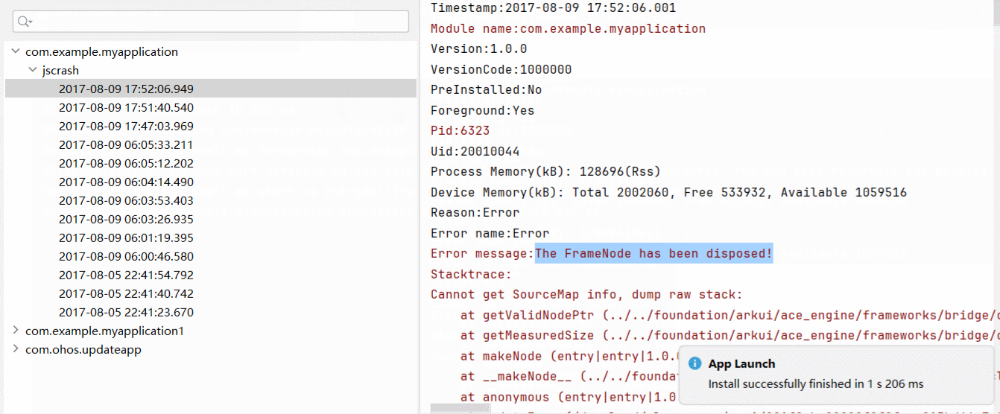
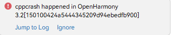

# FAQs About Imperative Nodes
<!--Kit: ArkUI-->
<!--Subsystem: ArkUI-->
<!--Owner: @wangjunman1-->
<!--Designer: @sunbees-->
<!--Tester: @liuli0427-->
<!--Adviser: @Brilliantry_Rui-->

This topic addresses common issues related to imperative nodes.

## JS Crash Occurs When FrameNode Is Running

**Problem**

A [JS crash](../dfx/jscrash-guidelines.md) occurs after [FrameNode](../reference/apis-arkui/js-apis-arkui-frameNode.md) is used in an improper way.

<!--RP1-->

<!--RP1End-->

**Solution**

Go to the error log as prompted, view the error cause, and rectify the fault. For details, see the code example below. 

**Sample Code**

This example shows how to throw a [dispose](../reference/apis-arkui/js-apis-arkui-frameNode.md#dispose12) exception in FrameNode. After the sample code is executed, a JS crash error is reported. Go to the error scenario as prompted. The error cause is that [getMeasuredSize](../reference/apis-arkui/js-apis-arkui-frameNode.md#getmeasuredsize12) cannot be called after **dispose** is called. In this example, deleting the code related to **dispose** will allow the application to run normally.

```ts
import { NodeController, FrameNode, typeNode } from '@kit.ArkUI';

// Implement a custom UI controller by extending NodeController.
class MyNodeController extends NodeController {
  makeNode(uiContext: UIContext): FrameNode | null {
    let node = new FrameNode(uiContext);
    node.dispose(); // Deleting this line will allow the application to run normally.
    node.getMeasuredSize();
    return node;
  }
}

@Entry
@Component
struct FrameNodeTypeTest {
  private myNodeController: MyNodeController = new MyNodeController();

  build() {
    Row() {
      Text('Hello')
      NodeContainer(this.myNodeController);
    }
  }
}
```


## cppcrash Occurs After ArkUI_NodeHandle Created on the Native Side Calls disposeNode

**Problem**

Before calling [disposeNode](./../reference/apis-arkui/capi-arkui-nativemodule-arkui-nativenodeapi-1.md#disposenode) on [ArkUI_NodeHandle](./../reference/apis-arkui/capi-arkui-nativemodule-arkui-node8h.md), the node-related resource objects (such as callbacks and captured references) are not cleared. As a result, there is a high probability that the program crashes after the node is detached from the tree. The crash cause is Use After Free.

<!--RP2-->

<!--RP2End-->

The following figure shows the typical fault log of this type of problem. The **Reason:Signal** field in the log is **SIGSEGV(SEGV_MAPERR)**, indicating that the crash address is not fixed and a wild pointer or null pointer dereference may occur. In this case, each stack frame in the crash stack is basically a system stack, such as the system functions **DetachFromMainTree** and **~FrameNode**. These system functions are mostly related to the **disposeNode** API and node destruction when the node is removed from the tree.


**Solution**

Adjust the resource release sequence. Release the derived resources (objects created based on the node, callbacks, and captured references) of the node first, and then release the node.

The following is a cppcrash example. In the specific implementation, **BindNode** is called when creating an [XComponent](./../reference/apis-arkui/arkui-ts/ts-basic-components-xcomponent.md), passing the TS-side **XComponent** to the native side and creating an [OH_ArkUI_SurfaceCallback](./../reference/apis-arkui/capi-oh-nativexcomponent-native-xcomponent-oh-arkui-surfacecallback.md). When the **XComponent** is removed from the tree, **UnbindNode** is called to reclaim related resources. **BindNode** creates an [OH_ArkUI_SurfaceHolder](./../reference/apis-arkui/capi-oh-nativexcomponent-native-xcomponent-oh-arkui-surfaceholder.md) object through the **XComponent** node and registers the [OH_ArkUI_SurfaceCallback_SetSurfaceDestroyedEvent](./../reference/apis-arkui/capi-native-interface-xcomponent-h.md#oh_arkui_surfacecallback_setsurfacedestroyedevent) event. In **UnbindNode**, because **dispose** of **XComponent** is executed before **dispose** of **OH_ArkUI_SurfaceHolder**, the already disposed **XComponent** node is used when the latter is released, thus triggering the cppcrash.

For the preceding example, in the **UnbindNode** function, move **disposeNode** to be executed before the end of the function to fix this issue.

<!-- @[dispose_in_wrong_sequence](https://gitcode.com/openharmony/applications_app_samples/blob/master/code/DocsSample/ArkUISample/DisposeNodeCrash/entry/src/main/cpp/BindCallback.cpp) -->

``` C++
void OnSurfaceDestroyedNative(OH_ArkUI_SurfaceHolder *holder)
{
    std::string *helloWorld = reinterpret_cast<std::string *>(OH_ArkUI_SurfaceHolder_GetUserData(holder));
    OH_LOG_Print(LOG_APP, LOG_INFO, 0xff00, "TestTag", "OnSurfaceDestroyed triggered, registered string is %{public}s",
                 helloWorld->c_str());
    delete helloWorld;
}

napi_value UnbindNode(napi_env env, napi_callback_info info)
{
    OH_LOG_Print(LOG_APP, LOG_INFO, 0xff00, "TestTag", "Remove XComponent and derived resources");
    size_t argc = 1;
    napi_value args[1] = {nullptr};
    napi_get_cb_info(env, info, &argc, args, nullptr, nullptr);
    if (!g_node1) {
        OH_LOG_Print(LOG_APP, LOG_ERROR, 0xff00, "TestTag", "NodeId does not exist error");
        return nullptr;
    }
    nodeAPI->disposeNode(g_node1); // Destroy the node before destroying SurfaceCallback and SurfaceHolder, which will cause a crash.
    g_node1 = nullptr;
    if (g_holder) {
        OH_LOG_Print(LOG_APP, LOG_INFO, 0xff00, "TestTag", "Start Dispose SurfaceCallback");
        OH_ArkUI_SurfaceHolder_RemoveSurfaceCallback(g_holder, g_callback); // Remove SurfaceCallback.
        OH_ArkUI_SurfaceCallback_Dispose(g_callback);                       // Destroy SurfaceCallback.
        g_callback = nullptr;
    }
    OH_ArkUI_SurfaceHolder_Dispose(g_holder); // Destroy SurfaceHolder.
    g_holder = nullptr;
    // Move nodeAPI->disposeNode(g_node1); to this position to fix the crash.
    
    return nullptr;
}

napi_value BindNode(napi_env env, napi_callback_info info)
{
    size_t argc = 2;
    napi_value args[2] = {nullptr};
    napi_get_cb_info(env, info, &argc, args, nullptr, nullptr);
    OH_ArkUI_GetNodeHandleFromNapiValue(env, args[1], &g_node1); // Obtain nodeHandle.
    g_holder = OH_ArkUI_SurfaceHolder_Create(g_node1);           // Obtain SurfaceHolder.
    g_callback = OH_ArkUI_SurfaceCallback_Create();              // Create SurfaceCallback.
    auto hello = new std::string("helloWorld");
    OH_ArkUI_SurfaceHolder_SetUserData(g_holder, hello); // Set std::string to SurfaceHolder.
    OH_ArkUI_SurfaceCallback_SetSurfaceDestroyedEvent(g_callback,
                                                      OnSurfaceDestroyedNative); // Register the OnSurfaceDestroyed callback.
    OH_ArkUI_SurfaceHolder_AddSurfaceCallback(g_holder, g_callback);             // Register SurfaceCallback.
    return nullptr;
}
```
