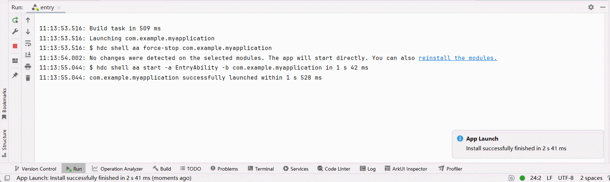

# FAQs About Imperative Nodes
<!--Kit: ArkUI-->
<!--Subsystem: ArkUI-->
<!--Owner: @wangjunman1-->
<!--Designer: @sunbees-->
<!--Tester: @liuli0427-->
<!--Adviser: @Brilliantry_Rui-->

This topic addresses common issues related to imperative nodes.

## JS Crash Occurs When FrameNode Is Running

**Symptom**

A [JS crash](../dfx/jscrash-guidelines.md) occurs after [FrameNode](../reference/apis-arkui/js-apis-arkui-frameNode.md) is used in an improper way.


**Solution**

Go to the error log as prompted, view the error cause, and rectify the fault. For details, see the code example below. 

**Code Example**

This example shows how to throw a [dispose](../reference/apis-arkui/js-apis-arkui-frameNode.md#dispose12) exception in FrameNode. After the sample code is executed, a JS crash error is reported. Go to the error scenario as prompted. The error cause is that [getMeasuredSize](../reference/apis-arkui/js-apis-arkui-frameNode.md#getmeasuredsize12) cannot be called after **dispose** is called. In this example, deleting the code related to **dispose** will allow the application to run normally.

```ts
import { NodeController, FrameNode, typeNode } from '@kit.ArkUI';

// Implement a custom UI controller by extending NodeController.
class MyNodeController extends NodeController {
  makeNode(uiContext: UIContext): FrameNode | null {
    let node = new FrameNode(uiContext);
    node.dispose(); // Deleting this line will allow the application to run normally.
    node.getMeasuredSize();
    return node;
  }
}

@Entry
@Component
struct FrameNodeTypeTest {
  private myNodeController: MyNodeController = new MyNodeController();

  build() {
    Row() {
      Text('Hello')
      NodeContainer(this.myNodeController);
    }
  }
}
```

