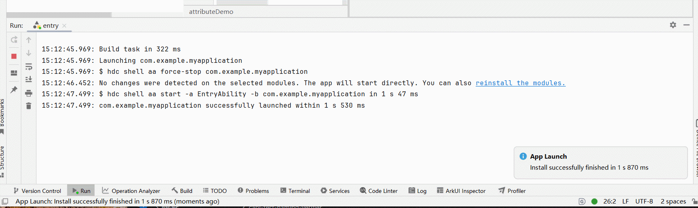

# FAQs About Dynamic Attribute Setting
<!--Kit: ArkUI-->
<!--Subsystem: ArkUI-->
<!--Owner: @wangjunman1-->
<!--Designer: @sunbees-->
<!--Tester: @liuli0427-->
<!--Adviser: @Brilliantry_Rui-->
<!-- md-trans-meta sourceCommit=7ad1c90a6f0725a10b9d0139373b5bca022b08ee translatedAt=2026-09-21T02:37:09.976Z pushedAt=2026-09-21T09:06:42.256Z -->

This topic addresses common issues related to dynamic attribute setting.

## Using AttributeModifier to Set Component Dynamic Attributes Causes JS Crash

**Symptom**

A [JS crash](../dfx/jscrash-guidelines.md) occurs after **AttributeModifier** is used to [set dynamic attributes](../reference/apis-arkui/arkui-ts/ts-universal-attributes-attribute-modifier.md) for a component.

<!--RP1-->

<!--RP1End-->

**Solution**

Go to the error log as prompted, view the error cause, and rectify the fault. For details, see the code example below.

**Code Example**

This example binds **AttributeModifier** to a **Button** to demonstrate a scenario where **AttributeModifier** throws an exception when setting an unsupported attribute. After running the sample code, a JS Crash error occurs. Refer to the animation below to jump to the specific error scenario. In this example, deleting the **reuseId**-related code allows it to run normally.

```ts
// xxx.ets
// Set the custom AttributeModifier for the Button component attributes.
class MyButtonModifier implements AttributeModifier<ButtonAttribute> {

  applyNormalAttribute(instance: ButtonAttribute): void {
    instance.reuseId('String') // Deleting this line will allow the application to run normally.
    instance.backgroundColor(Color.Red)
  }
}

@Entry
@Component
struct attributeDemo {
  @State modifier: MyButtonModifier = new MyButtonModifier();

  build() {
    Row() {
      Column() {
        Button('Button')
          .attributeModifier(this.modifier)
      }
      .width('100%')
    }
    .height('100%')
  }
}
```
