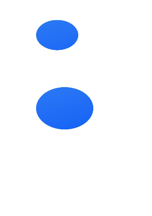
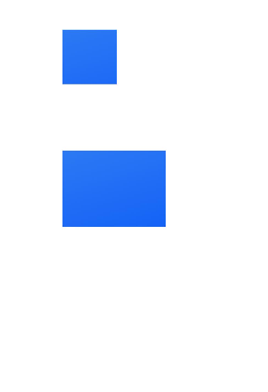

# Clipping Shapes (clipShape)
<!--Kit: ArkUI-->
<!--Subsystem: ArkUI-->
<!--Owner: @CCFFWW-->
<!--Designer: @CCFFWW-->
<!--Tester: @lxl007-->
<!--Adviser: @HelloCrease-->

You can use the [clipShape](../reference/apis-arkui/arkui-ts/ts-universal-attributes-sharp-clipping.md#clipshape12) API to clip components into desired shapes. After this API is called, only the portion of the component covered by the shape will remain, while the rest will be removed. The clipping shape itself is invisible.

> **NOTE** 
>
> Different shapes support different ranges of attributes. A path is one type of shape, along with others like ellipses and rectangles.
>
> Path shapes do not support width and height settings. For details about attributes supported by each shape, see [@ohos.arkui.shape (Shape)](../reference/apis-arkui/js-apis-arkui-shape.md).
>
> The [fill](../reference/apis-arkui/js-apis-arkui-shape.md#fill) attribute of shapes has no effect on the **clipShape** API.

## Clipping an Image into a Circle

Clip an image into a circle using **CircleShape**.

```ts
// xxx.ets
import { CircleShape } from '@kit.ArkUI';

@Entry
@Component
struct ClipShapeExample {
  build() {
    Column({ space: 15 }) {
      // Clip the image using a circle with a diameter of 280 px.
      Image($r('app.media.background'))
        .clipShape(new CircleShape({ width: '280px', height: '280px' }))
        .width('500px').height('280px')

      // Clip the image using a circle with a diameter of 350 px.
      Image($r('app.media.background'))
        .clipShape(new CircleShape({ width: '350px', height: '350px' }))
        .width('500px').height('370px')
    }
    .width('100%')
    .margin({ top: 15 })
  }
}
```


## Clipping an Image into an Ellipse

Clip an image into an ellipse using **EllipseShape**.

```ts
// xxx.ets
import { EllipseShape } from '@kit.ArkUI';

@Entry
@Component
struct ClipShapeExample {
  build() {
    Column({ space: 15 }) {
      Image($r('app.media.background'))
        .clipShape(new EllipseShape({ width: '280px', height: '200px' }))
        .width('500px').height('400px')

      Image($r('app.media.background'))
        .clipShape(new EllipseShape({ width: '380px', height: '280px' }))
        .width('500px').height('400px')
    }
    .width('100%')
    .margin({ top: 15 })
  }
}
```



## Clipping an Image into a Rectangle

Clip an image into a rectangle using **RectShape**.

```ts
// xxx.ets
import { RectShape } from '@kit.ArkUI';

@Entry
@Component
struct ClipShapeExample {
  build() {
    Column({ space: 15 }) {
      Image($r('app.media.background'))
        .clipShape(new RectShape({ width: '200px', height: '200px' }))
        .width('500px').height('400px')

      Image($r('app.media.background'))
        .clipShape(new RectShape({ width: '380px', height: '280px' }))
        .width('500px').height('400px')
    }
    .width('100%')
    .margin({ top: 15 })
  }
}
```



## Clipping an Image into Custom Shapes

Clip an image into custom shapes using **PathShape**.

```ts
// xxx.ets
import { PathShape } from '@kit.ArkUI';

@Entry
@Component
struct ClipShapeExample {
  build() {
    Column({ space: 15 }) {
      Row() {
        Image($r('app.media.background'))
          .clipShape(new PathShape({ commands: 'M0 0 H400 V200 H0 Z' }))
          .width('500px').height('300px')
      }
      .clip(true)
      .borderRadius(20)
    }
    .width('100%')
    .margin({ top: 15 })
  }
}
```


