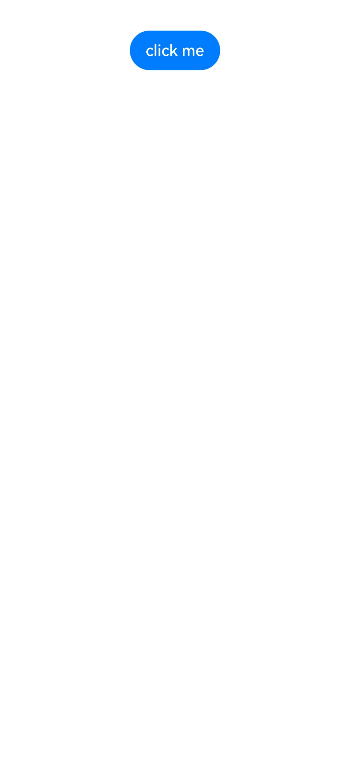
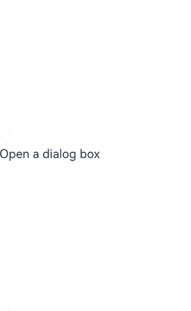
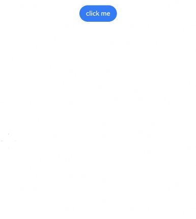

# Basic Custom Dialog Box (CustomDialog)
<!--Kit: ArkUI-->
<!--Subsystem: ArkUI-->
<!--Owner: @houguobiao-->
<!--Designer: @houguobiao-->
<!--Tester: @lxl007-->
<!--Adviser: @Brilliantry_Rui-->
A custom dialog box is a dialog box you customize by using APIs of the **CustomDialogController** class. It can be used for user interactions, showing ads, award announcements, alerts, software update notifications, and more. For details, see [Custom Dialog Box](../reference/apis-arkui/arkui-ts/ts-methods-custom-dialog-box.md).

> **NOTE**
> 
> In ArkUI, dialog boxes do not close automatically when you switch pages unless you manually call **close**. To enable a dialog box to be dismissed during page navigation, consider using the [navigation page displayed in dialog mode](./arkts-navigation-navdestination.md#page-display-mode) or [page-level dialog box](arkts-embedded-dialog.md).

By default, dialog boxes are modal and include a mask. Interactions with underlying components are blocked (click and gesture events are not transmitted). You can configure dialog box modality by setting the **isModal** property in [CustomDialogControllerOptions](../reference/apis-arkui/arkui-ts/ts-methods-custom-dialog-box.md#customdialogcontrolleroptions). For details, see [Types of Popup Windows](arkts-dialog-overview.md#types-of-popup-windows).

When **isModal** is **true**, the dialog box is modal, and the mask area does not transmit events. When **isModal** is **false**, the dialog box is non-modal, and the mask area allows event transmission. To enable simultaneous interaction with both the dialog box and the page outside the dialog box, set the dialog box to non-modal.

## Lifecycle

Since API version 19, the custom dialog box provides lifecycle callbacks to notify users of dialog box state changes. The order in which these lifecycle events are triggered is as follows: **onWillAppear**, **onDidAppear**, **onWillDisappear**, **onDidDisappear**.

| Name           |Type| Description                      |
| ----------------- | ------ | ---------------------------- |
| onWillAppear    | Callback&lt;void&gt; | Triggered before the dialog box display animation.|
| onDidAppear    | Callback&lt;void&gt;  | Triggered after the dialog box appears.   |
| onWillDisappear | Callback&lt;void&gt; | Triggered before the dialog box exit animation.|
| onDidDisappear | Callback&lt;void&gt;  | Triggered after the dialog box disappears.   |

## Creating a Custom Dialog Box

1. Use the \@CustomDialog decorator to create a custom dialog box. You can define the content of the dialog box within the decorator. Note that **CustomDialogController** must be defined in @Component.
   
   <!-- @[create_custom_dialog_new_customDialog_controller_default](https://gitcode.com/openharmony/applications_app_samples/blob/master/code/DocsSample/ArkUISample/DialogProject/entry/src/main/ets/pages/customdialog/CreateCustomDialogNew.ets) -->
   
   ``` TypeScript
   @CustomDialog
   struct CustomDialogExample {
     controller?: CustomDialogController;
   
     build() {
       Column() {
         // Replace $r('app.string.i_am_content') with the actual resource file. In this example, the value in the resource file is "I am content."
         Text($r('app.string.i_am_content'))
           .fontSize(20)
       }.height(60).justifyContent(FlexAlign.Center)
     }
   }
   ```
   


2. Create a constructor and associate it with the decorator.
   <!-- @[create_custom_dialog_new_customDialog_controller_constructor](https://gitcode.com/openharmony/applications_app_samples/blob/master/code/DocsSample/ArkUISample/DialogProject/entry/src/main/ets/pages/customdialog/CreateCustomDialogNew.ets) -->
   
   ``` TypeScript
   @Entry
   @Component
   export struct CreateCustomDialogNew {
     dialogController: CustomDialogController = new CustomDialogController({
       builder: CustomDialogExample(),
     })
   // ···
   }
   ```
   
3. Click the component bound to the **onClick** event to display the dialog box.
   
   <!-- @[create_custom_dialog_new_customDialog_controller_on_click](https://gitcode.com/openharmony/applications_app_samples/blob/master/code/DocsSample/ArkUISample/DialogProject/entry/src/main/ets/pages/customdialog/CreateCustomDialogNew.ets) -->
   
   ``` TypeScript
   @Entry
   @Component
   export struct CreateCustomDialogNew {
     dialogController: CustomDialogController = new CustomDialogController({
       builder: CustomDialogExample(),
     })
     build() {
       NavDestination() {
         Column() {
           Button('click me')
             .onClick(() => {
               this.dialogController.open();
             })
         }.width('100%').margin({ top: 5 })
       }
     }
   }
   ```
   
   
   

## Implementing Dialog Box Interaction

Custom dialog boxes support data interactions to complete various operations.

1. Add buttons and data functions to the \@CustomDialog decorator.
   <!-- @[dialog_interaction_use_constructor_example](https://gitcode.com/openharmony/applications_app_samples/blob/master/code/DocsSample/ArkUISample/DialogProject/entry/src/main/ets/pages/customdialog/DialogInteractionUseConstructor.ets) -->
   
   ``` TypeScript
   @CustomDialog
   struct CustomDialogExample {
     cancel: () => void = () => {
     }
     confirm: () => void = () => {
     }
     controller?: CustomDialogController;
   
     build() {
       Column() {
         // Replace $r('app.string.i_am_content') with the actual resource file. In this example, the value in the resource file is "I am content."
         Text($r('app.string.i_am_content')).fontSize(20).margin({ top: 10, bottom: 10 })
         Flex({ justifyContent: FlexAlign.SpaceAround }) {
           Button('cancel')
             .onClick(() => {
               this.controller?.close();
               if (this.cancel) {
                 this.cancel();
               }
             }).backgroundColor(0xffffff).fontColor(Color.Black)
           Button('confirm')
             .onClick(() => {
               this.controller?.close();
               if (this.confirm) {
                 this.confirm();
               }
             }).backgroundColor(0xffffff).fontColor(Color.Red)
         }.margin({ bottom: 10 })
       }
     }
   }
   ```
   
   
   
2. Receive the page in the builder and create corresponding function operations.
   <!-- @[dialog_interaction_use_constructor_user](https://gitcode.com/openharmony/applications_app_samples/blob/master/code/DocsSample/ArkUISample/DialogProject/entry/src/main/ets/pages/customdialog/DialogInteractionUseConstructor.ets) -->
   
   ``` TypeScript
   @Entry
   @Component
   export struct DialogInteractionUseConstructor {
     dialogController: CustomDialogController = new CustomDialogController({
       builder: CustomDialogExample({
         cancel: ()=> { this.onCancel() },
         confirm: ()=> { this.onAccept() },
       }),
     });
   
     onCancel() {
       hilog.info(DOMAIN, 'testTag', 'Callback when the first button is clicked');
     }
   
     onAccept() {
       hilog.info(DOMAIN, 'testTag', 'Callback when the second button is clicked');
     }
   
     build() {
       Column() {
         NavDestination() {
           Button('click me')
             .onClick(() => {
               this.dialogController.open();
             })
         }.width('100%').margin({ top: 5 })
       }
     }
   }
   ```

   


3. Use dialog box buttons to implement navigation and obtain parameters from the target page.
    <!-- @[dialog_interaction_use_button](https://gitcode.com/openharmony/applications_app_samples/blob/master/code/DocsSample/ArkUISample/DialogProject/entry/src/main/ets/pages/customdialog/DialogInteractionUseButton.ets) -->
    
    ``` TypeScript
    @CustomDialog
    struct CustomDialogExample {
      @Link textValue: string;
      controller?: CustomDialogController;
      cancel: () => void = () => {
      }
      confirm: () => void = () => {
      }
    
      build() {
        Column({ space: 20 }) {
          if (this.textValue !== '') {
            // Replace $r('app.string.the_second_page_is') with the actual resource file. In this example, the value in the resource file is "Content of the second page."
            Text($r('app.string.the_second_page_is')+`: ${this.textValue}`)
              .fontSize(20)
          } else {
            // Replace $r('app.string.whether_to_get_the_second_page') with the actual resource file. In this example, the value in the resource file is "Obtain the content of the second page?"
            Text($r('app.string.whether_to_get_the_second_page'))
              .fontSize(20)
          }
          Flex({ justifyContent: FlexAlign.SpaceAround }) {
            Button('cancel')
              .onClick(() => {
                if (this.controller !== undefined) {
                  this.controller.close();
                  this.cancel();
                }
              }).backgroundColor(0xffffff).fontColor(Color.Black)
            Button('confirm')
              .onClick(() => {
                if (this.controller !== undefined && this.textValue !== '') {
                  this.controller.close();
                } else if (this.controller !== undefined) {
                  this.getUIContext().getRouter().pushUrl({
                    url: 'pages/Index2'
                  });
                  this.controller.close();
                }
              }).backgroundColor(0xffffff).fontColor(Color.Red)
          }.margin({ bottom: 10 })
        }.borderRadius(10).padding({ top: 20 })
      }
    }
    
    @Entry
    @Component
    export struct DialogInteractionUseButton {
      @State textValue: string = '';
      dialogController: CustomDialogController | null = new CustomDialogController({
        builder: CustomDialogExample({
          cancel: () => {
            this.onCancel()
          },
          confirm: () => {
            this.onAccept()
          },
          textValue: this.textValue
        })
      });
    
      // Set dialogController to null when the custom component is about to be destroyed.
      aboutToDisappear() {
        this.dialogController = null; // Set dialogController to null.
      }
    
      onPageShow() {
        const params = this.getUIContext().getRouter().getParams() as Record<string, string>; // Obtain the passed parameter object.
        if (params) {
          this.dialogController?.open();
          this.textValue = params.info as string; // Obtain the value of the id attribute.
        }
      }
    
      onCancel() {
        hilog.info(DOMAIN, 'testTag', 'testTag', 'Callback when the first button is clicked');
      }
    
      onAccept() {
        hilog.info(DOMAIN, 'testTag', 'testTag', 'Callback when the second button is clicked');
      }
    
      exitApp() {
        hilog.info(DOMAIN, 'testTag', 'testTag', 'Click the callback in the blank area');
      }
    
      build() {
        Column() {
          NavDestination() {
            Button('click me')
              .onClick(() => {
                if (this.dialogController !== null) {
                  this.dialogController.open();
                }
              }).backgroundColor(0x317aff)
          }.width('100%').margin({ top: 5 })
        }
      }
    }
    ```
    

    <!-- @[index_new](https://gitcode.com/openharmony/applications_app_samples/blob/master/code/DocsSample/ArkUISample/DialogProject/entry/src/main/ets/pages/customdialog/IndexNew.ets) -->
    
    ``` TypeScript
    @Entry
    @Component
    struct IndexNew {
      // Replace $r('app.string.click_and_return') with the actual resource file. In this example, the value in the resource file is "Back."
      @State message: string = $r('app.string.click_and_return');
    
      build() {
        NavDestination() {
          Column() {
            Button(this.message)
              .type(ButtonType.Capsule)
              .onClick(() => {
                this.getUIContext().getRouter().back({
                  url: 'pages/Index',
                  params: {
                    info: 'Hello World'
                  }
                });
              })
          }.width('100%').height('100%').margin({ top: 20 })
        }
      }
    }
    ```
    
   
   

## Defining the Custom Dialog Box Animation

You can define the custom dialog box animation, including its duration and speed, through **openAnimation** of [CustomDialogControllerOptions](../reference/apis-arkui/arkui-ts/ts-methods-custom-dialog-box.md#customdialogcontrolleroptions).

<!-- @[dialog_animation_new](https://gitcode.com/openharmony/applications_app_samples/blob/master/code/DocsSample/ArkUISample/DialogProject/entry/src/main/ets/pages/customdialog/DialogAnimationNew.ets) -->

``` TypeScript
@CustomDialog
struct CustomDialogExample {
  controller?: CustomDialogController;

  build() {
    NavDestination() {
      Column() {
        Text('Whether to change a text?').fontSize(16).margin({ bottom: 10 })
      }
    }
  }
}

@Entry
@Component
export struct DialogAnimationNew {
  @State textValue: string = '';
  @State inputValue: string = 'click me';
  dialogController: CustomDialogController | null = new CustomDialogController({
    builder: CustomDialogExample(),
    openAnimation: {
      duration: 1200,
      curve: Curve.Friction,
      delay: 500,
      playMode: PlayMode.Alternate,
      onFinish: () => {
        hilog.info(DOMAIN, 'testTag', 'play end')
      }
    },
    autoCancel: true,
    alignment: DialogAlignment.Bottom,
    offset: { dx: 0, dy: -20 },
    gridCount: 4,
    customStyle: false,
    backgroundColor: 0xd9ffffff,
    cornerRadius: 10,
  });

  // Set dialogController to null when the custom component is about to be destroyed.
  aboutToDisappear() {
    this.dialogController = null; // Set dialogController to null.
  }

  build() {
    NavDestination() {
      Column() {
        Button(this.inputValue)
          .onClick(() => {
            if (this.dialogController !== null) {
              this.dialogController.open();
            }
          }).backgroundColor(0x317aff)
      }.width('100%').margin({ top: 5 })
    }
  }
}
```


## Customizing the Dialog Box Style

Control the dialog box appearance by defining width, height, background color, and shadow.
<!-- @[dialog_style_new](https://gitcode.com/openharmony/applications_app_samples/blob/master/code/DocsSample/ArkUISample/DialogProject/entry/src/main/ets/pages/customdialog/DialogStyleNew.ets) -->

``` TypeScript
@CustomDialog
struct CustomDialogExample {
  controller?: CustomDialogController;

  build() {
    Column() {
      // Replace $r('app.string.i_am_content') with the actual resource file. In this example, the value in the resource file is "I am content."
      Text($r('app.string.i_am_content')).fontSize(16).margin({ bottom: 10 })
    }
  }
}

@Entry
@Component
export struct DialogStyleNew {
  @State textValue: string = '';
  @State inputValue: string = 'click me';
  dialogController: CustomDialogController | null = new CustomDialogController({
    builder: CustomDialogExample(),
    autoCancel: true,
    alignment: DialogAlignment.Center,
    offset: { dx: 0, dy: -20 },
    gridCount: 4,
    customStyle: false,
    backgroundColor: 0xd9ffffff,
    cornerRadius: 20,
    width: '80%',
    height: '100px',
    borderWidth: 1,
    borderStyle: BorderStyle.Dashed, // borderStyle must be used with borderWidth in pairs.
    borderColor: Color.Blue, // borderColor must be used with borderWidth in pairs.
    shadow: ({
      radius: 20,
      color: Color.Grey,
      offsetX: 50,
      offsetY: 0
    }),
  });

  // Set dialogController to null when the custom component is about to be destroyed.
  aboutToDisappear() {
    this.dialogController = null; // Set dialogController to null.
  }

  build() {
    NavDestination() {
      Column() {
        Button(this.inputValue)
          .onClick(() => {
            if (this.dialogController !== null) {
              this.dialogController.open();
            }
          }).backgroundColor(0x317aff)
      }.width('100%').margin({ top: 5 })
    }
  }
}
```


## Nesting a Custom Dialog Box

To nest a dialog box (dialog 2) inside another dialog box (dialog 1), it is recommended that you define dialog 2 within the parent component of dialog 1 so that you can then open dialog 2 through the callback sent from the parent component to dialog 1.
<!-- @[nest_dialog_new](https://gitcode.com/openharmony/applications_app_samples/blob/master/code/DocsSample/ArkUISample/DialogProject/entry/src/main/ets/pages/customdialog/NestDialogNew.ets) -->

``` TypeScript
@CustomDialog
struct CustomDialogExampleTwo {
  controllerTwo?: CustomDialogController;
  @State message: string = 'I am the second dialog box.';
  @State showIf: boolean = false;

  build() {
    Column() {
      if (this.showIf) {
        Text('Text')
          .fontSize(30)
          .height(100)
      }
      Text(this.message)
        .fontSize(30)
        .height(100)
      Button('Create Text')
        .onClick(() => {
          this.showIf = true;
        })
      Button('Close Second Dialog Box')
        .onClick(() => {
          if (this.controllerTwo !== undefined) {
            this.controllerTwo.close();
          }
        })
        .margin(20)
    }
  }
}

@CustomDialog
struct CustomDialogExample {
  openSecondBox?: () => void;
  controller?: CustomDialogController;

  build() {
    Column() {
      Button('Open Second Dialog Box and close this box')
        .onClick(() => {
          this.controller!.close();
          this.openSecondBox!();
        })
        .margin(20)
    }.borderRadius(10)
  }
}

@Entry
@Component
export struct NestDialogNew {
  @State inputValue: string = 'Click Me';
  dialogController: CustomDialogController | null = new CustomDialogController({
    builder: CustomDialogExample({
      openSecondBox: () => {
        if (this.dialogControllerTwo !== null) {
          this.dialogControllerTwo.open()
        }
      }
    }),
    cancel: this.exitApp,
    autoCancel: true,
    alignment: DialogAlignment.Bottom,
    offset: { dx: 0, dy: -20 },
    gridCount: 4,
    customStyle: false
  });
  dialogControllerTwo: CustomDialogController | null = new CustomDialogController({
    builder: CustomDialogExampleTwo(),
    alignment: DialogAlignment.Bottom,
    offset: { dx: 0, dy: -25 }
  });

  aboutToDisappear() {
    this.dialogController = null;
    this.dialogControllerTwo = null;
  }

  onCancel() {
    hilog.info(DOMAIN, 'testTag', 'Callback when the first button is clicked');
  }

  onAccept() {
    hilog.info(DOMAIN, 'testTag', 'Callback when the second button is clicked');
  }

  exitApp() {
    hilog.info(DOMAIN, 'testTag', 'Click the callback in the blank area');
  }

  build() {
    NavDestination() {
      Column() {
        Button(this.inputValue)
          .onClick(() => {
            if (this.dialogController !== null) {
              this.dialogController.open();
            }
          }).backgroundColor(0x317aff)
      }.width('100%').margin({ top: 5 })
    }
  }
}
```


Note: Defining dialog 2 within dialog 1 is not recommended, as components cannot be created in dialog 2 after dialog 1 is destroyed (closed) due to state management dependencies.

## Implementing Physical Back Button Interception

When the **onWillDismiss** callback in [CustomDialogControllerOptions](../reference/apis-arkui/arkui-ts/ts-methods-custom-dialog-box.md#customdialogcontrolleroptions) is registered, the dialog box will not be dismissed immediately after the user touches the mask or the Back button, presses the Esc key, or swipes left or right on the screen. The callback provides the dismissal reason via **reason** in [DismissDialogAction](../reference/apis-arkui/arkui-ts/ts-methods-custom-dialog-box.md#dismissdialogaction12), allowing conditional dismissal.

<!-- @[dialog_with_physical_back](https://gitcode.com/openharmony/applications_app_samples/blob/master/code/DocsSample/ArkUISample/DialogProject/entry/src/main/ets/pages/customdialog/DialogWithPhysicalBack.ets) -->

``` TypeScript
@CustomDialog
struct CustomDialogExample {
  cancel: () => void = () => {
  }
  confirm: () => void = () => {
  }
  controller?: CustomDialogController;

  build() {
    Column() {
      Text('Are you sure?')
        .fontSize(20)
        .margin({
          top: 10,
          bottom: 10
        })
      Row() {
        Button('cancel')
          .onClick(() => {
            if (this.controller !== undefined) {
              this.controller.close();
            }
          })
          .backgroundColor(0xffffff)
          .fontColor(Color.Black)
        Button('confirm')
          .onClick(() => {
            if (this.controller !== undefined) {
              this.controller.close();
            }
          })
          .backgroundColor(0xffffff)
          .fontColor(Color.Red)
      }
      .width('100%')
      .justifyContent(FlexAlign.SpaceAround)
      .margin({ bottom: 10 })
    }
  }
}

@Entry
@Component
export struct DialogWithPhysicalBack {
  dialogController: CustomDialogController = new CustomDialogController({
    builder: CustomDialogExample({
      cancel: () => {
        this.onCancel();
      },
      confirm: () => {
        this.onAccept();
      }
    }),
    onWillDismiss: (dismissDialogAction: DismissDialogAction) => {
      hilog.info(DOMAIN, 'testTag', 'dialog onWillDismiss reason: ' + dismissDialogAction.reason);
      // 1. PRESS_BACK: touching the Back button, swiping left or right on the screen, or pressing the Esc key.
      // 2. TOUCH_OUTSIDE: touching the mask.
      // 3. CLOSE_BUTTON: touching the Close button.
      if (dismissDialogAction.reason === DismissReason.PRESS_BACK) {
        // Proactively close the dialog box after handling the service logic.
        dismissDialogAction.dismiss();
      }
      if (dismissDialogAction.reason === DismissReason.TOUCH_OUTSIDE) {
        dismissDialogAction.dismiss();
      }
    },
    alignment: DialogAlignment.Bottom,
    offset: { dx: 0, dy: -20 }
  })

  onCancel() {
    hilog.info(DOMAIN, 'testTag', 'Callback when the first button is clicked');
  }

  onAccept() {
    hilog.info(DOMAIN, 'testTag', 'Callback when the second button is clicked');
  }

  build() {
    NavDestination() {
      Column() {
        Button('click me')
          .onClick(() => {
            this.dialogController.open();
          })
      }
      .width('100%')
    }
  }
}
```




## Setting the Distance Between the Dialog Box and the Soft Keyboard

To maintain dialog box independence, dialog boxes automatically avoid surrounding elements like status bars, navigation bars, and keyboards. When the soft keyboard appears, dialog boxes maintain a default 16 vp distance. Since API version 15, use **keyboardAvoidMode** and **keyboardAvoidDistance** in [CustomDialogControllerOptions](../reference/apis-arkui/arkui-ts/ts-methods-custom-dialog-box.md#customdialogcontrolleroptions) to configure keyboard avoidance behavior.

Note that the value of **keyboardAvoidMode** should be set to **KeyboardAvoidMode.DEFAULT**.

<!-- @[dialog_avoid_soft_key_board](https://gitcode.com/openharmony/applications_app_samples/blob/master/code/DocsSample/ArkUISample/DialogProject/entry/src/main/ets/pages/customdialog/DialogAvoidSoftKeyboard.ets) -->

``` TypeScript
// xxx.ets
import { LengthMetrics } from '@kit.ArkUI';

@CustomDialog
struct CustomDialogExample {
  controller?: CustomDialogController;

  build() {
    Column() {
      Column() {
        Text('keyboardAvoidDistance: 0vp')
          .fontSize(20)
          .margin({ bottom: 36 })
        TextInput({ placeholder: '' })
      }.backgroundColor('#FFF0F0F0')
    }
  }
}

@Entry
@Component
export struct DialogAvoidSoftKeyboard {
  dialogController: CustomDialogController | null = new CustomDialogController({
    builder: CustomDialogExample({}),
    autoCancel: true,
    gridCount: 4,
    showInSubWindow: true,
    isModal: true,
    customStyle: false,
    cornerRadius: 30,
    alignment: DialogAlignment.Bottom,
    keyboardAvoidMode: KeyboardAvoidMode.DEFAULT, // The dialog box automatically avoids the soft keyboard.
    keyboardAvoidDistance: LengthMetrics.vp(0) // The distance between the soft keyboard and the dialog box is 0 vp.
  })

  build() {
    NavDestination() {
      Row() {
        Row({ space: 20 }) {
          // Replace $r('app.string.open_windows') with the actual resource file. In this example, the value in the resource file is "Open."
          Text($r('app.string.open_windows'))
            .fontSize(30)
            .onClick(() => {
              if (this.dialogController !== null) {
                this.dialogController.open();
              }
            })
        }
        .width('100%')
      }
      .height('100%')
    }
  }
}
```


 

## Obtaining the Dialog Box Status

In service modules, multiple dialog boxes may appear simultaneously. To prevent duplicate openings, check the dialog box status via the controller before display. If a dialog box is already displayed, do not open it again.

The **getState** API, available since API version 20, obtains the current dialog box status. For details about the dialog box status, see [CommonState](../reference/apis-arkui/js-apis-promptAction.md#commonstate20).

The following example uses [getDialogController](../reference/apis-arkui/arkui-ts/ts-custom-component-api.md#getdialogcontroller18) and [CustomDialogController](../reference/apis-arkui/arkui-ts/ts-methods-custom-dialog-box.md#customdialogcontroller) to obtain the dialog box status.

<!-- @[get_dialog_status](https://gitcode.com/openharmony/applications_app_samples/blob/master/code/DocsSample/ArkUISample/DialogProject/entry/src/main/ets/pages/customdialog/GetDialogStatus.ets) -->

``` TypeScript
// xxx.ets
@CustomDialog
struct CustomDialogExample {
  controller?: CustomDialogController;

  build() {
    Column() {
      // Replace $r('app.string.search_by_dialog') with the actual resource file. In this example, the value in the resource file is "Check Status: Custom Component Controller."
      Button($r('app.string.search_by_dialog'))
        .onClick(() => {
          if (this.getDialogController() !== undefined) {
            hilog.info(DOMAIN, 'testTag', 'state:' + this.getDialogController().getState());
          } else {
            hilog.info(DOMAIN, 'testTag', 'state: no exist');
          }
        }).margin(20)
      // Replace $r('app.string.search_by_dialog_controller') with the actual resource file. In this example, the value in the resource file is "Check Status: CustomDialogController."
      Button($r('app.string.search_by_dialog_controller'))
        .onClick(() => {
          hilog.info(DOMAIN, 'testTag', 'state:' + this.controller?.getState());
        }).margin(20)
      // Replace $r('app.string.close_widows') with the actual resource file. In this example, the value in the resource file is "Close Dialog Box."
      Button($r('app.string.close_widows'))
        .onClick(() => {
          if (this.getDialogController() !== undefined) {
            this.getDialogController().close()
          }
        }).margin(20)

    }
  }
}

@Entry
@Component
export struct GetDialogStatus {
  dialogController: CustomDialogController | null = new CustomDialogController({
    builder: CustomDialogExample({
    }),
    autoCancel: false
  })

  build() {
    NavDestination() {
      Column() {
        Button('click me')
          .onClick(() => {
            if (this.dialogController !== null) {
              this.dialogController.open()
            }
          })
      }.width('100%').margin({ top: 5 })
    }
  }
}
```


