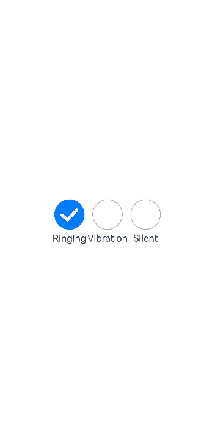
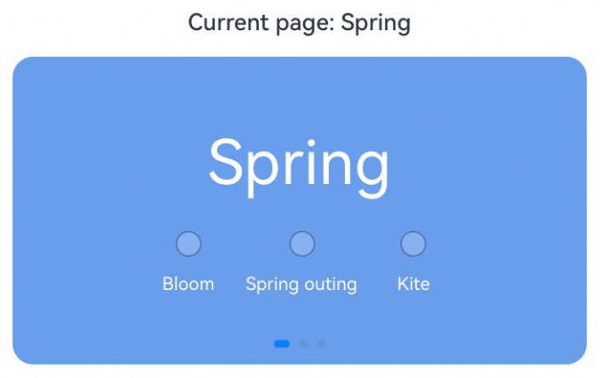

# Radio Button (Radio)
<!--Kit: ArkUI-->
<!--Subsystem: ArkUI-->
<!--Owner: @houguobiao-->
<!--Designer: @houguobiao-->
<!--Tester: @lxl007-->
<!--Adviser: @Brilliantry_Rui-->
<!-- md-trans-meta sourceCommit=b673026310640a6967ec0e867b1ea6e08abe03e7 translatedAt=2026-09-21T02:41:37.806Z pushedAt=2026-09-21T10:02:11.919Z -->


The **Radio** component allows users to select from a set of mutually exclusive options. Only one radio button in a given group can be selected at the same time. For details, see [Radio](../reference/apis-arkui/arkui-ts/ts-basic-components-radio.md).


## Creating a Radio Button

A radio button is created using the **Radio** component with [RadioOptions](../reference/apis-arkui/arkui-ts/ts-basic-components-radio.md#radiooptions). The following example demonstrates how to use the **value** and **group** properties in **RadioOptions**:

```ts
Radio(options: {value: string, group: string})
```

In this API, **value** indicates the name of the radio button, and **group** indicates the name of the group to which the radio button belongs. You can use the **checked** attribute to specify whether the radio button is selected. Setting it to **true** means that the radio button is selected. **false** means the opposite.

In addition, you can customize the style of the radio button for both the selected and unselected states.

<!-- @[click_radio_to_show_function](https://gitcode.com/openharmony/applications_app_samples/blob/master/code/DocsSample/ArkUISample/ChooseComponent/entry/src/main/ets/pages/radio/RadioButton.ets) -->

``` TypeScript
Radio({ value: 'Radio1', group: 'radioGroup' })
  .checked(false)
Radio({ value: 'Radio2', group: 'radioGroup' })
  .checked(true)
```


## Adding Events

The **Radio** component supports the [universal events](../reference/apis-arkui/arkui-ts/ts-component-general-events.md). In addition, it can be bound to the **onChange** event to execute custom logic when the selection changes.

<!-- @[click_radio_event_function](https://gitcode.com/openharmony/applications_app_samples/blob/master/code/DocsSample/ArkUISample/ChooseComponent/entry/src/main/ets/pages/radio/RadioButton.ets) -->

``` TypeScript
Radio({ value: 'Radio1', group: 'radioGroup' })
  .onChange((isChecked: boolean) => {
    if(isChecked) {
      // Action to perform.
      // ...
    }
  })
Radio({ value: 'Radio2', group: 'radioGroup' })
  .onChange((isChecked: boolean) => {
    if(isChecked) {
      // Action to perform.
      // ...
    }
  })
```


## Example Scenario

In this example, the **Radio** components are used to switch between sound modes.

<!-- @[click_radio_to_change_function](https://gitcode.com/openharmony/applications_app_samples/blob/master/code/DocsSample/ArkUISample/ChooseComponent/entry/src/main/ets/pages/radio/RadioSample.ets) --> 

``` TypeScript
// xxx.ets
import { promptAction } from '@kit.ArkUI';

@Entry
@Component
export struct RadioExample {
  @State rst: promptAction.ShowToastOptions = { 'message': 'Ringing mode.' };
  @State vst: promptAction.ShowToastOptions = { 'message': 'Vibration mode.' };
  @State sst: promptAction.ShowToastOptions = { 'message': 'Silent mode.' };

  build() {
    // ...
      Row() {
        Column() {
          Radio({ value: 'Ringing', group: 'radioGroup' }).checked(true)
            .height(50)
            .width(50)
            .onChange(async (isChecked: boolean) => {
              if (isChecked) {
                try {
                  // Switch to ringing mode.
                  await this.getUIContext().getPromptAction().openToast(this.rst);
                } catch (err) {
                  console.error(`Failed to show toast: ${err.code}`);
                }
              }
            })
          Text('Ringing')
        }

        Column() {
          Radio({ value: 'Vibration', group: 'radioGroup' })
            .height(50)
            .width(50)
            .onChange(async (isChecked: boolean) => {
              if (isChecked) {
                try {
                  // Switch to vibration mode.
                  await this.getUIContext().getPromptAction().openToast(this.vst);
                } catch (err) {
                  console.error(`Failed to show toast: ${err.code}`);
                }
              }
            })
          Text('Vibration')
        }

        Column() {
          Radio({ value: 'Silent', group: 'radioGroup' })
            .height(50)
            .width(50)
            .onChange(async (isChecked: boolean) => {
              if (isChecked) {
                try {
                  // Switch to silent mode.
                  await this.getUIContext().getPromptAction().openToast(this.sst);
                } catch (err) {
                  console.error(`Failed to show toast: ${err.code}`);
                }
              }
            })
          Text('Silent')
        }
      }.height('100%').width('100%').justifyContent(FlexAlign.Center)
      // ...
  }
}
```




Set independent group values for the Radio components on different Swiper pages to isolate and independently select the seasonal activity options.


<!-- @[radio_control_swiper_function](https://gitcode.com/openharmony/applications_app_samples/blob/master/code/DocsSample/ArkUISample/ChooseComponent/entry/src/main/ets/pages/radio/RadioSwiper.ets) -->

``` TypeScript
// xxx.ets
@Entry
@Component
export struct RadioSwiperSample {
  // Index of the currently displayed page.
  @State currentIndex: number = 0;
  // Theme color of each page.
  private colors: string[] = ['#699eec', '#699eec', '#699eec'];
  // Title text of each page.
  private titles: string[] = ['Spring', 'Summer', 'Autumn'];
  // Independent Radio group name corresponding to each page. Groups on different pages do not affect each other.
  private groups: string[] = ['springGroup', 'summerGroup', 'autumnGroup'];
  // Independent selectable options of each page.
  private options: string[][] = [
    ['Bloom', 'Spring outing', 'Kite'],
    ['Swim', 'Cool off', 'Watermelon'],
    ['Moon', 'Climb', 'Autumn outing']
  ];

  build() {
    // ...
      Column({ space: 16 }) {
        Text(`Current page: ${this.titles[this.currentIndex]}`)
          .fontSize(18)
          .fontWeight(FontWeight.Medium)

        // Each page in the Swiper contains an independent group of Radio buttons. After swiping to switch pages, the selected state of each page does not affect the others.
        Swiper() {
          ForEach(this.titles, (title: string, index: number) => {
            Column({ space: 16 }) {
              Text(title)
                .fontSize(48)
                .fontColor('#fff')
              // Radio group of the current page. The group name changes with the page and is independent of other pages.
              Row({ space: 24 }) {
                ForEach(this.options[index], (option: string) => {
                  Column() {
                    Radio({ value: option, group: this.groups[index] })
                    Text(option)
                      .fontSize(14)
                      .fontColor('#fff')
                      .margin({ top: 4 })
                  }
                })
              }
              .justifyContent(FlexAlign.Center)
            }
            .width('100%')
            .height(240)
            .justifyContent(FlexAlign.Center)
            .backgroundColor(this.colors[index])
            .borderRadius(16)
          })
        }
        .index(this.currentIndex)
        .indicator(true)
        .loop(false)
        .onChange((index: number) => {
          // Update the current page index when swiping to switch pages.
          this.currentIndex = index;
        })
      }
      .width('100%')
      .height('100%')
      .padding({ left: 16, right: 16 })
      .alignItems(HorizontalAlign.Center)
      // ...
  }
}
```



