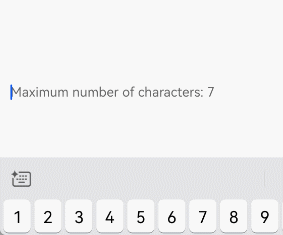
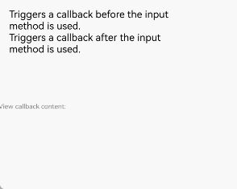
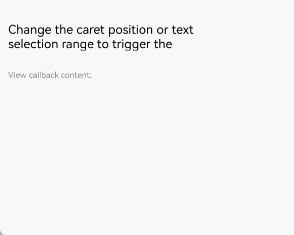
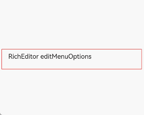
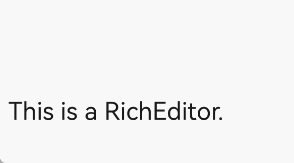
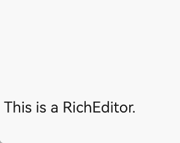
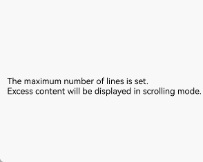
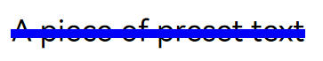
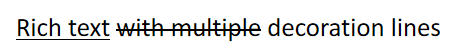
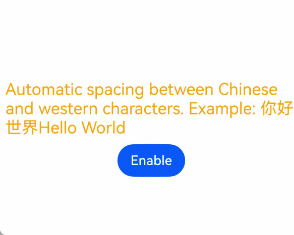

# Rich Text Editing (RichEditor)
<!--Kit: ArkUI-->
<!--Subsystem: ArkUI-->
<!--Owner: @carnivore233-->
<!--Designer: @xiangyuan6-->
<!--Tester: @mateng_Holtens-->
<!--Adviser: @Brilliantry_Rui-->

**RichEditor** is a component that supports interactive text editing and mixture of text and images. It is typically used in scenarios where mixed-content user input is expected, such as comment sections that accept both image and text submissions. For details, see [RichEditor](../reference/apis-arkui/arkui-ts/ts-basic-components-richeditor.md).

If you only need to display images and text, the [Text](../reference/apis-arkui/arkui-ts/ts-basic-components-text.md) component is recommended.

If you need to display a large amount of HTML content, the [RichText](../reference/apis-arkui/arkui-ts/ts-basic-components-richtext.md) component is recommended.

## Component Composition

The following figure illustrates the component's elements.


The component's elements are described as follows.

| Element | Description                             |
| --- | ------------------------------- |
| Content area| Area where content is displayed.                      |
| Cursor | Indicates the current insertion position.                    |
| Handles | Left and right handles that can be dragged separately to adjust the text selection range.|
| Menu | Appears after content is selected, containing operation buttons such as copy and paste.      |

## Creating a RichEditor Component

You can create a **RichEditor** component either from a styled string or from spans. For details, see [Creating a RichEditor Component from a Styled String](#creating-a-richeditor-component-from-a-styled-string) or [Creating a RichEditor Component from Spans](#creating-a-richeditor-component-from-spans).

### Creating a RichEditor Component from a Styled String

Use the RichEditor(options: [RichEditorStyledStringOptions](../reference/apis-arkui/arkui-ts/ts-basic-components-richeditor.md#richeditorstyledstringoptions12)) API to create a **RichEditor** component that manages content through styled strings ([StyledString/MutableStyledString](arkts-styled-string.md)). This approach allows you to manage data by holding styled string objects on the application side, modify the content and style of those objects, and then pass the updated objects to the component to refresh the rich text content.

Compared with using controller APIs for content style updates, this approach offers greater flexibility and convenience. In addition, styled string objects can be assigned to various text components that support styled strings, enabling quick content migration.

<!-- @[richEditor_create](https://gitcode.com/openharmony/applications_app_samples/blob/master/code/DocsSample/ArkUISample/TextComponent/entry/src/main/ets/pages/richEditor/CreateRichEditor.ets) -->

``` TypeScript
fontStyle: TextStyle = new TextStyle({
  fontColor: Color.Pink
})
// Define a text style object.

mutableStyledString: MutableStyledString =
  // Replace $r('app.string.CreateRichEditor_Text_1') with the actual resource file. In this example, the value in the resource file is "Create a RichEditor component using a styled string."
  new MutableStyledString(resource.resourceToString($r('app.string.CreateRichEditor_Text_1')),
  [{
    start: 0,
    length: 5,
    styledKey: StyledStringKey.FONT,
    styledValue: this.fontStyle
  }])
// Create a styled string.

controller: RichEditorStyledStringController = new RichEditorStyledStringController();
options: RichEditorStyledStringOptions = { controller: this.controller };
// ...
        RichEditor(this.options)
          .onReady(() => {
            this.controller.setStyledString(this.mutableStyledString);
          })
```


### Creating a RichEditor Component from Spans

Use the RichEditor(value: [RichEditorOptions](../reference/apis-arkui/arkui-ts/ts-basic-components-richeditor.md#richeditoroptions)) API to create a **RichEditor** component that manages content via spans. This component is typically used in complex content scenarios. You can use the APIs provided by **RichEditorController** to manage content and styles.

<!-- @[richEditor_create_span](https://gitcode.com/openharmony/applications_app_samples/blob/master/code/DocsSample/ArkUISample/TextComponent/entry/src/main/ets/pages/richEditor/CreateRichEditor.ets) -->

``` TypeScript
@Entry
@Component
export struct CreateRichEditor {
  controllerNoStyledString: RichEditorController = new RichEditorController();
  optionsNoStyledString: RichEditorOptions = { controller: this.controllerNoStyledString };
  // ...
  build() {
    NavDestination() {
      Column({ space: 12 }) {
        // ...
          RichEditor(this.optionsNoStyledString)
            .onReady(() => {
              this.controllerNoStyledString.addTextSpan(
                /* Replace $r('app.string.CreateRichEditor_Text_2') with the actual resource file.
                 In this example, the value in the resource file is "Create a RichEditor component without using a styled string." */
                resource.resourceToString($r('app.string.CreateRichEditor_Text_2')), {
                style: {
                  fontColor: Color.Black,
                  fontSize: 15
                }
              })
            })
        // ...
      }
      .width('100%')
      .height('100%')
      .padding({ left: 12, right: 12 })
    }
    .backgroundColor('#f1f2f3')
    // Replace $r('app.string.Create_RichEditor_Component_title') with the actual resource file. In this example, the value in the resource file is "Create a RichEditor component."
    .title($r('app.string.Create_RichEditor_Component_title'))
  }
}
```


## Adding Content

The **RichEditor** component supports adding content in different forms through various APIs.

### Adding a Text Span

In addition to directly entering content into the component, you can add a text span using the [addTextSpan](../reference/apis-arkui/arkui-ts/ts-basic-components-richeditor.md#addtextspan) API.

This API enables diverse text styling, such as creating mixed-style text.

If the component is focused and the cursor is blinking, adding text via **addTextSpan** updates the cursor position, and the cursor blinks to the right of the newly added text.

<!-- @[richEditor_addText](https://gitcode.com/openharmony/applications_app_samples/blob/master/code/DocsSample/ArkUISample/TextComponent/entry/src/main/ets/pages/richEditor/AddTextContent.ets) -->

``` TypeScript
@Entry
@Component
export struct AddTextContent {
  controller: RichEditorController = new RichEditorController();
  options: RichEditorOptions = { controller: this.controller };

  build() {
    // ...
            RichEditor(this.options)
              .onReady(() => {
                // Replace $r('app.string.AddTextContent_Text_1') with the actual resource file. In this example, the value in the resource file is "Click the button to add text here."
                this.controller.addTextSpan(resource.resourceToString($r('app.string.AddTextContent_Text_1')), {
                  style: {
                    fontColor: Color.Black,
                    fontSize: 15
                  }
                })
              })
              .border({ width: 1, color: Color.Gray })
              .constraintSize({
                maxHeight: 100
              })
              .width(300)
              .margin(10)
            // Replace $r('app.string.AddTextContent_Button_1') with the actual resource file. In this example, the value in the resource file is "addTextSpan."
            Button($r('app.string.AddTextContent_Button_1'), {
              buttonStyle: ButtonStyleMode.NORMAL
            })
              .height(30)
              .fontSize(13)
              .onClick(() => {
                // Replace $r('app.string.AddTextContent_Text_2') with the actual resource file. In this example, the value of the resource file is "Add text."
                this.controller.addTextSpan(resource.resourceToString($r('app.string.AddTextContent_Text_2')))
              })
            // ...
  }
}
```


### Adding an Image Span

Use the [addImageSpan](../reference/apis-arkui/arkui-ts/ts-basic-components-richeditor.md#addimagespan) API to add an image span.

This API is useful in enriching and visualizing content. For example, you can use it to add images to news or data visualization graphics to documents.

If the component is focused and the cursor is blinking, adding image content via **addImageSpan** updates the cursor position, and the cursor blinks to the right of the newly added image.

<!-- @[richEditor_addImage](https://gitcode.com/openharmony/applications_app_samples/blob/master/code/DocsSample/ArkUISample/TextComponent/entry/src/main/ets/pages/richEditor/AddImageContent.ets) -->

``` TypeScript
controller: RichEditorController = new RichEditorController();
options: RichEditorOptions = { controller: this.controller };
// ...
         RichEditor(this.options)
            .onReady(() => {
              // Replace $r('app.string.AddImageContent_Text_1') with the actual resource file. In this example, the value in the resource file is "Click the button to add an image here."
              this.controller.addTextSpan(resource.resourceToString($r('app.string.AddImageContent_Text_1')), {
                style: {
                  fontColor: Color.Black,
                  fontSize: 15
                }
              })
            })
            .width(300)
            .height(100)
          // Replace $r('app.string.AddImageContent_Button_1') with the actual resource file. In this example, the value in the resource file is "addImageSpan."
          Button($r('app.string.AddImageContent_Button_1'), {
            buttonStyle: ButtonStyleMode.NORMAL
          })
            .height(30)
            .fontSize(13)
            .onClick(() => {
              // Replace $r('app.media.xxx') with the actual resource file.
              this.controller.addImageSpan($r('app.media.startIcon'), {
                imageStyle: {
                  size: ['57px', '57px']
                }
              })
            })
```


### Adding @Builder Decorated Content

Use [addBuilderSpan](../reference/apis-arkui/arkui-ts/ts-basic-components-richeditor.md#addbuilderspan11) to add the content decorated by the @Builder decorator.

This approach applies when you need to integrate custom complex components, such as custom charts.

With this API, you can specify the addition position using [RichEditorBuilderSpanOptions](../reference/apis-arkui/arkui-ts/ts-basic-components-richeditor.md#richeditorbuilderspanoptions11). If no position is specified or an invalid value is provided, the builder content is appended to the end.

<!-- @[richEditor_addBuilder](https://gitcode.com/openharmony/applications_app_samples/blob/master/code/DocsSample/ArkUISample/TextComponent/entry/src/main/ets/pages/richEditor/AddBuilderDecoratorContent.ets) -->

``` TypeScript
controller: RichEditorController = new RichEditorController();
options: RichEditorOptions = { controller: this.controller };
private myBuilder: CustomBuilder = undefined;

@Builder
TextBuilder() {
  Row() {
    Image($r('app.media.startIcon')).width(50).height(50).margin(16)
    Column() {
      // Replace $r('app.string.AddBuilderDecoratorContent_Text_1') with the actual resource file. In this example, the value in the resource file is "Text.txt."       
      Text($r('app.string.AddBuilderDecoratorContent_Text_1')).fontWeight(FontWeight.Bold).fontSize(16)
      // Replace $r('app.string.AddBuilderDecoratorContent_Text_2') with the actual resource file. In this example, the value in the resource file is "123.45 KB."
      Text($r('app.string.AddBuilderDecoratorContent_Text_2')).fontColor('#8a8a8a').fontSize(12)
    }.alignItems(HorizontalAlign.Start)
  }.backgroundColor('#f4f4f4')
  .borderRadius('20')
  .width(220)
}
// ...
          // Replace $r('app.string.AddBuilderDecoratorContent_Button_1') with the actual resource file. In this example, the value in the resource file is "addBuilderSpan."
          Button($r('app.string.AddBuilderDecoratorContent_Button_1'), {
            buttonStyle: ButtonStyleMode.NORMAL
          })
            .height(30)
            .fontSize(13)
            .onClick(() => {
              this.myBuilder = () => {
                this.TextBuilder()
              }
              this.controller.addBuilderSpan(this.myBuilder)
            })
```


### Adding a Symbol Span

Use the [addSymbolSpan](../reference/apis-arkui/arkui-ts/ts-basic-components-richeditor.md#addsymbolspan11) API to add symbol content. This API enables addition of special characters, such as mathematical symbols in academic papers.

When a symbol is added while the component is focused and the cursor is blinking, the cursor moves to the right of the newly inserted symbol.

Currently, gestures, copying, and dragging are not supported for the symbol content.

<!-- @[richEditor_addSymbol](https://gitcode.com/openharmony/applications_app_samples/blob/master/code/DocsSample/ArkUISample/TextComponent/entry/src/main/ets/pages/richEditor/AddSymbolSpanContent.ets) -->

``` TypeScript
controller: RichEditorController = new RichEditorController();
options: RichEditorOptions = { controller: this.controller };
// ...
          RichEditor(this.options)
            .onReady(() => {
              // Replace $r('app.string.AddSymbolSpanContent_Text_1') with the actual resource file. In this example, the value in the resource file is "Click the button to add a symbol here."
              this.controller.addTextSpan(resource.resourceToString($r('app.string.AddSymbolSpanContent_Text_1')), {
                style: {
                  fontColor: Color.Black,
                  fontSize: 15
                }
              })
            })
            .width(300)
            .height(100)
          // Replace $r('app.string.AddSymbolSpanContent_Button_1') with the actual resource file. In this example, the value in the resource file is "addSymbolSpan."
          Button($r('app.string.AddSymbolSpanContent_Button_1'), {
            buttonStyle: ButtonStyleMode.NORMAL
          })
            .height(30)
            .fontSize(13)
            .onClick(() => {
              // Replace $r('sys.symbol.basketball_fill') with the resource file you use.
              this.controller.addSymbolSpan($r('sys.symbol.basketball_fill'), {
                style: {
                  fontSize: 30
                }
              })
            })
```


## Managing Content

The **RichEditor** component provides APIs for content management, for example, [obtaining image and text information within the component](#obtaining-the-image-and-text-information), [setting placeholder text when no input is present](#setting-placeholder-text), or [limiting the maximum character](#setting-the-maximum-length).

### Obtaining the Image and Text Information

Use the [getSpans](../reference/apis-arkui/arkui-ts/ts-basic-components-richeditor.md#getspans) API to obtain information about all images and text in the component, including content, ID, style, and position. After obtaining the position information, you can update the style of the content in the specified range.

This API is useful for obtaining and checking existing content styles, such as in template use cases, and for content parsing and processing, such as in text analysis applications.

<!-- @[richEditor_getSpans](https://gitcode.com/openharmony/applications_app_samples/blob/master/code/DocsSample/ArkUISample/TextComponent/entry/src/main/ets/pages/richEditor/GetGraphicInfoInComponent.ets) -->

``` TypeScript
controller: RichEditorController = new RichEditorController();
options: RichEditorOptions = { controller: this.controller };
infoShowController: RichEditorController = new RichEditorController();
infoShowOptions: RichEditorOptions = { controller: this.infoShowController };
// Create two RichEditor components.
// ...
          RichEditor(this.options)
            .onReady(() => {
              this.controller.addTextSpan(
                // Replace $r('app.string.GetGraphicInfoInComponent_Text_1') with the actual resource file. In this example, the value in the resource file is "Click the button to obtain the span information."
                resource.resourceToString($r('app.string.GetGraphicInfoInComponent_Text_1')), {
                style: {
                  fontColor: Color.Black,
                  fontSize: 15
                }
              })
            })
            .width(300)
            .height(50)
          // Replace $r('app.string.GetGraphicInfoInComponent_Text_1') with the actual resource file. In this example, the value in the resource file is "Click the button to obtain the span information."
          Text($r('app.string.GetGraphicInfoInComponent_Text_1')).fontSize(10).fontColor(Color.Gray).width(300);
          RichEditor(this.infoShowOptions)
            .width(300)
            .height(50)
          // Replace $r('app.string.GetGraphicInfoInComponent_Button_1') with the actual resource file. In this example, the value in the resource file is "getSpans."
          Button($r('app.string.GetGraphicInfoInComponent_Button_1'), {
            buttonStyle: ButtonStyleMode.NORMAL
            })
            .height(30)
            .fontSize(13)
            .onClick(() => {
              this.infoShowController.addTextSpan(JSON.stringify(this.controller.getSpans()), {
                style: {
                  fontColor: Color.Gray,
                  fontSize: 10
                }
              })
            })
```


### Setting Placeholder Text

You can set the placeholder text, which is displayed when there is no input, using the [placeholder](../reference/apis-arkui/arkui-ts/ts-basic-components-richeditor.md#placeholder12) API.

Placeholder text provides useful guidance, helping users navigate the application UI, especially in scenarios requiring specific input, such as login screens. For example, in a text editing box, placeholder text can specify input requirements, such as "Enter up to 100 characters."

<!-- @[richEditor_placeholder](https://gitcode.com/openharmony/applications_app_samples/blob/master/code/DocsSample/ArkUISample/TextComponent/entry/src/main/ets/pages/richEditor/SetAttributes.ets) -->

``` TypeScript
controller: RichEditorController = new RichEditorController();
options: RichEditorOptions = { controller: this.controller };
// ...
      RichEditor(this.options)
        // Replace $r('app.string.SetAttributes_Text_6') with the actual resource file. In this example, the value of the resource file is "This is the prompt text...".
        .placeholder(resource.resourceToString($r('app.string.SetAttributes_Text_6')), {
          fontColor: Color.Gray,
          font: {
            size: 15,
            weight: FontWeight.Normal,
            family: 'HarmonyOS Sans',
            style: FontStyle.Normal
          }
        })
        .width(300)
        .height(50)
```


### Setting the Maximum Length

You can set the maximum number of characters allowed in the **RichEditor** component using [maxLength](../reference/apis-arkui/arkui-ts/ts-basic-components-richeditor.md#maxlength18).

<!-- @[richEditor_maxLength](https://gitcode.com/openharmony/applications_app_samples/blob/master/code/DocsSample/ArkUISample/TextComponent/entry/src/main/ets/pages/richEditor/SetAttributes.ets) -->

``` TypeScript
controller: RichEditorController = new RichEditorController();
options: RichEditorOptions = { controller: this.controller };
// ...
      RichEditor(this.options)
        // Replace $r('app.string.SetAttributes_Text_8') with the actual resource file. In this example, the value in the resource file is "Maximum number of characters: 7."
        .placeholder(resource.resourceToString($r('app.string.SetAttributes_Text_8')))
        .maxLength(7)
```



## Adding Event Callbacks

You can register callbacks to listen for component events.

### Adding Callbacks for Before and After Text and Image Changes

Use the [onWillChange](../reference/apis-arkui/arkui-ts/ts-basic-components-richeditor.md#onwillchange12) API to add a callback invoked before text or image changes. This callback is applicable to real-time data verification and notification. For example, it can be used to enable features such as detecting sensitive words and displaying an alert dialog box immediately, as well as real-time character count statistics and limitation.

Use the [onDidChange](../reference/apis-arkui/arkui-ts/ts-basic-components-richeditor.md#ondidchange12) API to add a callback invoked after text or image changes. This callback applies to content saving and synchronization. For example, it can be used to automatically save the latest content to the local host or synchronizing it to the server. The callback can also be used to update and re-render content status. For example, in a to‑do list application, after a user edits a task description in rich‑text format, the callback can update the display style of that task in the list.

Note: The **RichEditor** component constructed with [RichEditorStyledStringOptions](../reference/apis-arkui/arkui-ts/ts-basic-components-richeditor.md#richeditorstyledstringoptions12) does not support these two types of callbacks.

<!-- @[richEditor_eventChange](https://gitcode.com/openharmony/applications_app_samples/blob/master/code/DocsSample/ArkUISample/TextComponent/entry/src/main/ets/pages/richEditor/AddEvent.ets) -->

``` TypeScript
controller: RichEditorController = new RichEditorController();
options: RichEditorOptions = { controller: this.controller };

infoShowController: RichEditorController = new RichEditorController();
infoShowOptions: RichEditorOptions = { controller: this.infoShowController };
// ...
        RichEditor(this.options)
          .onReady(() => {
            // Replace $r('app.string.AddEvent_Text_5') with the actual resource file. In this example, the value in the resource file is "Trigger a callback before the graphic and text changes within the component.\nAfter the graphic and text changes, trigger a callback."
            this.controller.addTextSpan(resource.resourceToString($r('app.string.AddEvent_Text_5')), {
              style: {
                fontColor: Color.Black,
                fontSize: 15
              }
            })
          })
          .onWillChange((value: RichEditorChangeValue) => {
            //Replace $r('app.string.AddEvent_Text_6') with the actual resource file. In this example, the value in the resource file is "Before the graphic and text changes within the component, trigger a callback:".
            this.infoShowController.addTextSpan(resource.resourceToString($r('app.string.AddEvent_Text_6')) +
            JSON.stringify(value), {
              style: {
                fontColor: Color.Gray,
                fontSize: 10
              }
            })
            return true;
          })
          .onDidChange((rangeBefore: TextRange, rangeAfter: TextRange) => {
            //Replace $r('app.string.AddEvent_Text_7') with the actual resource file. In this example, the value in the resource file is "\nAfter the graphic and text changes, trigger a callback:\n rangeBefore."
            this.infoShowController.addTextSpan(resource.resourceToString($r('app.string.AddEvent_Text_7')) +
            JSON.stringify(rangeBefore) + '\nrangeAfter: ' + JSON.stringify(rangeBefore), {
              style: {
                fontColor: Color.Gray,
                fontSize: 10
              }
            })
          })
          .width(300)
          .height(50);
        // Replace $r('app.string.AddEvent_Text_4') with the actual resource file. In this example, the value in the resource file is "View callback content:".
        Text(resource.resourceToString($r('app.string.AddEvent_Text_4'))).fontSize(10).fontColor(Color.Gray).width(300);
        RichEditor(this.infoShowOptions)
          .width(300)
          .height(70);
```


### Adding Callbacks Triggered Before and After Content Input in the Input Method

Callbacks can be triggered before and after input method content is added.

To facilitate intelligent input assistance, use [aboutToIMEInput](../reference/apis-arkui/arkui-ts/ts-basic-components-richeditor.md#abouttoimeinput) to trigger a callback before adding input content, and [onDidIMEInput](../reference/apis-arkui/arkui-ts/ts-basic-components-richeditor.md#ondidimeinput12) to trigger a callback after the input is complete.

These two callbacks are useful for handling service logic during text display, for example, providing word suggestions or predictive text before display and performing auto‑correction or format conversion after input completes. The callbacks are triggered in this order: **aboutToIMEInput** -> **onDidIMEInput**.

Components constructed with [RichEditorStyledStringOptions](../reference/apis-arkui/arkui-ts/ts-basic-components-richeditor.md#richeditorstyledstringoptions12) do not support these two callbacks.

<!-- @[richEditor_eventInput](https://gitcode.com/openharmony/applications_app_samples/blob/master/code/DocsSample/ArkUISample/TextComponent/entry/src/main/ets/pages/richEditor/AddEvent.ets) -->

``` TypeScript
controller: RichEditorController = new RichEditorController();
options: RichEditorOptions = { controller: this.controller };

infoShowController: RichEditorController = new RichEditorController();
infoShowOptions: RichEditorOptions = { controller: this.infoShowController };
// ...
        // Replace $r('app.string.xxx') with the resource file you use.
        RichEditor(this.options)
          .onReady(() => {
            this.controller.addTextSpan(resource.resourceToString($r('app.string.AddEvent_Text_8')), {
              style: {
                fontColor: Color.Black,
                fontSize: 15
              }
            })
          })
          .aboutToIMEInput((value: RichEditorInsertValue) => {
            this.infoShowController.addTextSpan(resource.resourceToString($r('app.string.AddEvent_Text_9')) +
            JSON.stringify(value), {
              style: {
                fontColor: Color.Gray,
                fontSize: 10
              }
            })
            return true;
          })
          .onDidIMEInput((value: TextRange) => {
            this.infoShowController.addTextSpan(resource.resourceToString($r('app.string.AddEvent_Text_10')) +
            JSON.stringify(value), {
              style: {
                fontColor: Color.Gray,
                fontSize: 10
              }
            })
          })
          .width(300)
          .height(50)
        Text(resource.resourceToString($r('app.string.AddEvent_Text_4'))).fontSize(10).fontColor(Color.Gray).width(300)
        RichEditor(this.infoShowOptions)
          .width(300)
          .height(70)
```



### Adding a Callback Triggered Before Paste Completion

The [onPaste](../reference/apis-arkui/arkui-ts/ts-basic-components-richeditor.md#onpaste11) callback is used to add custom processing before pasting completes.

This is useful for content format handling, such as converting HTML-tagged text to a format supported by the **RichEditor** component and removing unnecessary tags or retaining only plain text content.

You can use this API to override the default paste behavior, which is limited to plain text, so that both images and text can be pasted.

<!-- @[richEditor_eventPaste](https://gitcode.com/openharmony/applications_app_samples/blob/master/code/DocsSample/ArkUISample/TextComponent/entry/src/main/ets/pages/richEditor/AddEvent.ets) -->

``` TypeScript
import { pasteboard } from '@kit.BasicServicesKit';
// ...
@Component
struct on_cut_copy_paste {
  controller: RichEditorController = new RichEditorController();
  options: RichEditorOptions = { controller: this.controller };
  infoShowController: RichEditorController = new RichEditorController();
  infoShowOptions: RichEditorOptions = { controller: this.infoShowController };

  PopDataFromPasteboard() {
    let selection = this.controller.getSelection();
    let start = selection.selection[0];
    let end = selection.selection[1];
    if (start == end) {
      start = this.controller.getCaretOffset();
      end = this.controller.getCaretOffset();
    }
    let moveOffset = 0;
    let sysBoard = pasteboard.getSystemPasteboard();
    sysBoard.getData((err, data) => {
      if (err) {
        return;
      }
      if (start != end) {
        this.controller.deleteSpans({ start: start, end: end });
      }
      let count = data.getRecordCount();
      for (let i = 0; i < count; i++) {
        const element = data.getRecord(i);
        if (element && element.plainText && element.mimeType === pasteboard.MIMETYPE_TEXT_PLAIN) {
          this.controller.addTextSpan(element.plainText,
            {
              style: { fontSize: 26, fontColor: Color.Red },
              offset: start + moveOffset
            }
          )
          moveOffset += element.plainText.length;
        }
      }
      this.controller.setCaretOffset(start + moveOffset);
    });
  }

  build() {
    Column() {
      ComponentCard({
        // Replace $r('app.string.Add_Event_title_5') with the actual resource file. In this example, the value in the resource file is "Add a callback triggered before pasting completes."
        title: $r('app.string.Add_Event_title_5'),
        // Replace $r('app.string.Add_Event_title_5_desc') with the actual resource file. In this example, the value in the resource file is "Use the onPaste callback to add custom processing before pasting completes."
        description: $r('app.string.Add_Event_title_5_desc')
      }) {
        Column({ space: 3 }) {
          RichEditor(this.options)
            .onReady(() => {
              // Replace $r('app.string.AddEvent_Text_11') with the actual resource file. In this example, the value in the resource file is "Copying and pasting the text can trigger the callback."
              this.controller.addTextSpan(resource.resourceToString($r('app.string.AddEvent_Text_11')),
                { style: { fontColor: Color.Black, fontSize: 15 } })
            })
            .onPaste((event) => {
              //Replace $r('app.string.AddEvent_Text_12') with the actual resource file. In this example, the value in the resource file is "Trigger the onPaste callback\n."
              this.infoShowController.addTextSpan(resource.resourceToString($r('app.string.AddEvent_Text_12')),
                { style: { fontColor: Color.Gray, fontSize: 10 } })
              if (event != undefined && event.preventDefault) {
                event.preventDefault();
              }
              this.PopDataFromPasteboard()
            })
            .width(300)
            .height(50);
          // Replace $r('app.string.AddEvent_Text_4') with the actual resource file. In this example, the value in the resource file is "View callback content:".
          Text(resource.resourceToString($r('app.string.AddEvent_Text_4'))).fontSize(10).fontColor(Color.Gray).width(300);
          RichEditor(this.infoShowOptions)
            .width(300)
            .height(70);
        }.width('100%').alignItems(HorizontalAlign.Start);
      }
    }
  }
}
```

### Adding a Callback Triggered Before Cut Completion

The [onCut](../reference/apis-arkui/arkui-ts/ts-basic-components-richeditor.md#oncut12) callback is used to add custom processing before a cut operation completes.

This callback is useful for data processing and storage. For example, when a user cuts content from the **RichEditor** component, the callback can temporarily store the cut content to ensure it can be accurately restored during a subsequent paste.

You can use this API to override the default cut behavior, which is limited to plain text, so that both images and text can be cut.

<!-- @[richEditor_eventCut](https://gitcode.com/openharmony/applications_app_samples/blob/master/code/DocsSample/ArkUISample/TextComponent/entry/src/main/ets/pages/richEditor/AddEvent.ets) -->

``` TypeScript
controller: RichEditorController = new RichEditorController();
options: RichEditorOptions = { controller: this.controller };

infoShowController: RichEditorController = new RichEditorController();
infoShowOptions: RichEditorOptions = { controller: this.infoShowController };
// ...
        RichEditor(this.options)
          .onReady(() => {
            // Replace $r('app.string.AddEvent_Text_13') with the actual resource file. In this example, the value in the resource file is "Copying and pasting the text can trigger the callback."
            this.controller.addTextSpan(resource.resourceToString($r('app.string.AddEvent_Text_13')), {
              style: {
                fontColor: Color.Black,
                fontSize: 15
              }
            })
          })
          .onCut(() => {
            // Replace $r('app.string.AddEvent_Text_14') with the actual resource file. In this example, the value in the resource file is "Trigger the onCut callback\n."
            this.infoShowController.addTextSpan(resource.resourceToString($r('app.string.AddEvent_Text_14')), {
              style: {
                fontColor: Color.Gray,
                fontSize: 10
              }
            })
          })
          .width(300)
          .height(70)
        RichEditor(this.infoShowOptions)
          .width(300)
          .height(70)
```

### Adding a Callback Triggered Before Copy Completion

Use the [onCopy](../reference/apis-arkui/arkui-ts/ts-basic-components-richeditor.md#oncopy12) callback to add processing logic before copying. 

This callback applies to content backup and sharing. For example, the following operations can be performed in the callback: saving the copied content and its format information to a local backup folder, or automatically generating copywriting that includes the copied content and a product purchase link for users to paste and share.

The component's default copy behavior is limited to plain text and cannot handle images. You can use this callback to implement a custom copy feature that supports both images and text, replacing the component's default behavior.

<!-- @[richEditor_eventCopy](https://gitcode.com/openharmony/applications_app_samples/blob/master/code/DocsSample/ArkUISample/TextComponent/entry/src/main/ets/pages/richEditor/AddEvent.ets) -->

``` TypeScript
controller: RichEditorController = new RichEditorController();
options: RichEditorOptions = { controller: this.controller };

infoShowController: RichEditorController = new RichEditorController();
infoShowOptions: RichEditorOptions = { controller: this.infoShowController };
// ...
        RichEditor(this.options)
          .onReady(() => {
            // Replace $r('app.string.AddEvent_Text_15') with the actual resource file. In this example, the value in the resource file is "Copying and pasting the text can trigger the callback."
            this.controller.addTextSpan(resource.resourceToString($r('app.string.AddEvent_Text_15')), {
              style: {
                fontColor: Color.Black,
                fontSize: 15
              }
            })
          })
          .onCopy(() => {
            // Replace $r('app.string.AddEvent_Text_16') with the actual resource file. In this example, the value in the resource file is "Trigger the onCopy callback\n."
            this.infoShowController.addTextSpan(resource.resourceToString($r('app.string.AddEvent_Text_16')), {
              style: {
                fontColor: Color.Gray,
                fontSize: 10
              }
            })
          })
          .width(300)
          .height(50)
        RichEditor(this.infoShowOptions)
          .width(300)
          .height(70)
```


For details about all available events, see [RichEditor Events](../reference/apis-arkui/arkui-ts/ts-basic-components-richeditor.md#events).

## Implementing Component Interaction

You can configure interaction element properties through APIs to respond to changes in those elements.

### Setting the Caret and Selection Handle Colors

You can set the caret and selection handle colors in the text box using the [caretColor](../reference/apis-arkui/arkui-ts/ts-basic-components-richeditor.md#caretcolor12) API.

This feature allows for a more distinct visual representation of the caret and text selection, which can significantly aid users in navigating through complex UI that incorporate various input fields. It also improves user experience by allowing the caret color to match the overall style of the application page.

<!-- @[richEditor_color](https://gitcode.com/openharmony/applications_app_samples/blob/master/code/DocsSample/ArkUISample/TextComponent/entry/src/main/ets/pages/richEditor/SetAttributes.ets) -->

``` TypeScript
controller: RichEditorController = new RichEditorController();
options: RichEditorOptions = { controller: this.controller };
// ...
      RichEditor(this.options)
        .onReady(() => {
          // Replace $r('app.string.SetAttributes_Text_5') with the actual resource file. In this example, the value in the resource file is "The component has set the caret handle color."
          this.controller.addTextSpan(resource.resourceToString($r('app.string.SetAttributes_Text_5')), {
            style: {
              fontColor: Color.Black,
              fontSize: 15
            }
          })
        })
        .caretColor(Color.Orange)
        .width(300)
        .height(300)
```


### Adding a Callback for Caret Position and Selection Changes

The [onSelectionChange](../reference/apis-arkui/arkui-ts/ts-basic-components-richeditor.md#onselectionchange12) callback is triggered whenever the caret position or text selection range changes in the component's content area during editing.

This callback enables real‑time listening of selection changes. Typical use cases include: updating toolbar state dynamically (for example, reflecting the font and paragraph formatting of the currently selected text), measuring length of the selected content, and generating a summary of the selected content. By responding immediately to selection changes and dynamically linking interactive elements, this callback enhances the feedback experience and functional flexibility of rich text editing.

<!-- @[richEditor_eventSelectChange](https://gitcode.com/openharmony/applications_app_samples/blob/master/code/DocsSample/ArkUISample/TextComponent/entry/src/main/ets/pages/richEditor/AddEvent.ets) -->

``` TypeScript
controller: RichEditorController = new RichEditorController();
options: RichEditorOptions = { controller: this.controller };

infoShowController: RichEditorController = new RichEditorController();
infoShowOptions: RichEditorOptions = { controller: this.infoShowController };
// ...
        // Replace $r('app.string.xxx') with the actual resource file.
        RichEditor(this.options)
          .onReady(() => {
            this.controller.addTextSpan(resource.resourceToString($r('app.string.AddEvent_Text_2')), {
              style: {
                fontColor: Color.Black,
                fontSize: 15
              }
            })
          })
          .onSelectionChange((value: RichEditorRange) => {
            this.infoShowController.addTextSpan('\n' + resource.resourceToString($r('app.string.AddEvent_Text_3')) +
            value.start + ',' + value.end + ')', {
              style: {
                fontColor: Color.Gray,
                fontSize: 10
              }
            })
          })
          .width(300)
          .height(50)
        Text(resource.resourceToString($r('app.string.AddEvent_Text_4'))).fontSize(10).fontColor(Color.Gray).width(300)
        RichEditor(this.infoShowOptions)
          .width(300)
          .height(70)
```



### Setting the Text Selection Range

Use the [setSelection](../reference/apis-arkui/arkui-ts/ts-basic-components-richeditor.md#setselection11) API to configure the component to highlight the background of the selected portion.

This API is useful for implementing text focus effects. For example, when a user taps a paragraph title or summary, you can call this API to automatically select and highlight the corresponding text segment.

If this API is called when the text box is not focused, the selection effect is not displayed.

<!-- @[richEditor_selection](https://gitcode.com/openharmony/applications_app_samples/blob/master/code/DocsSample/ArkUISample/TextComponent/entry/src/main/ets/pages/richEditor/BackplaneHighlighting.ets) -->

``` TypeScript
controller: RichEditorController = new RichEditorController();
options: RichEditorOptions = { controller: this.controller };
// ...
          RichEditor(this.options)
            .onReady(() => {
              // Replace $r('app.string.BackplaneHighlighting_Text_1') with the actual resource file. In this example, the value in the resource file is "Click the button to select the text at position 0 to 2 here."
              this.controller.addTextSpan(resource.resourceToString($r('app.string.BackplaneHighlighting_Text_1')), {
                style: {
                  fontColor: Color.Black,
                  fontSize: 15
                }
              })
            })
            .width(300)
            .height(60)
          // Replace $r('app.string.BackplaneHighlighting_Button_1') with the actual resource file. In this example, the value in the resource file is "setSelection(0,2)."
          Button($r('app.string.BackplaneHighlighting_Button_1'), {
            buttonStyle: ButtonStyleMode.NORMAL
          })
            .height(30)
            .fontSize(13)
            .onClick(() => {
              this.controller.setSelection(0, 2)
            })
```


## Configuring the Menu

You can configure the text selection menu through APIs.

### Managing Selected Menu Items

When the rich text selection range changes, the [onPrepareMenu](../reference/apis-arkui/arkui-ts/ts-text-common.md#properties-1) callback is triggered before the menu is displayed. You can configure menu data within this callback.

<!-- @[richEditor_prepareMenu](https://gitcode.com/openharmony/applications_app_samples/blob/master/code/DocsSample/ArkUISample/TextComponent/entry/src/main/ets/pages/richEditor/SetAttributes.ets) -->

``` TypeScript
@Component
struct PrepareMenu {
  controller: RichEditorController = new RichEditorController();
  options: RichEditorOptions = { controller: this.controller };
  @State endIndex: number | undefined = 0;
  onCreateMenu = (menuItems: Array<TextMenuItem>) => {
    const idsToFilter = [
      TextMenuItemId.TRANSLATE,
      TextMenuItemId.SHARE,
      TextMenuItemId.SEARCH,
      TextMenuItemId.AI_WRITER
    ]
    const items = menuItems.filter(item => !idsToFilter.some(id => id.equals(item.id)));
    // Replace $r('app.media.xxx') with the actual resource file.
    let item1: TextMenuItem = {
      content: 'create1',
      icon: $r('app.media.startIcon'),
      id: TextMenuItemId.of('create1'),
    }
    let item2: TextMenuItem = {
      content: 'create2',
      id: TextMenuItemId.of('create2'),
      icon: $r('app.media.startIcon'),
    }
    items.push(item1);
    items.unshift(item2);
    return items;
  }

  onMenuItemClick = (menuItem: TextMenuItem, textRange: TextRange) => {
    if (menuItem.id.equals(TextMenuItemId.of('create2'))) {
      return true;
    }
    if (menuItem.id.equals(TextMenuItemId.of('prepare1'))) {
      return true;
    }
    if (menuItem.id.equals(TextMenuItemId.COPY)) {
      return true;
    }
    if (menuItem.id.equals(TextMenuItemId.SELECT_ALL)) {
      return false;
    }
    return false;
  }

  onPrepareMenu = (menuItems: Array<TextMenuItem>) => {
    // Replace $r('app.media.xxx') with the actual resource file.
    let item1: TextMenuItem = {
      content: 'prepare1_' + this.endIndex,
      icon: $r('app.media.startIcon'),
      id: TextMenuItemId.of('prepare1'),
    };
    menuItems.unshift(item1);
    return menuItems;
  }

  @State editMenuOptions: EditMenuOptions = {
    onCreateMenu: this.onCreateMenu,
    onMenuItemClick: this.onMenuItemClick,
    onPrepareMenu: this.onPrepareMenu
  };

  build() {
    Column() {
      ComponentCard({
        // Replace $r('app.string.Set_Attributes_title_13') with the actual resource file. In this example, the value in the resource file is "Manage selected menu items."
        title: $r('app.string.Set_Attributes_title_13'),
        /* Replace $r('app.string.Set_Attributes_title_13_desc') with the actual resource file. In this example,
         the value in the resource file is "When the rich text selection range changes, the onPrepareMenu callback is triggered before the menu is displayed. You can configure menu data within this callback."
        description: $r('app.string.Set_Attributes_title_13_desc')
      }) {
        RichEditor(this.options)
          .onReady(() => {
            this.controller.addTextSpan('RichEditor editMenuOptions');
          })
          .editMenuOptions(this.editMenuOptions)
          .onSelectionChange((range: RichEditorRange) => {
            this.endIndex = range.end;
          })
          .height(50)
          .margin({ top: 100 })
          .borderWidth(1)
          .borderColor(Color.Red)
      }
    }
  }
}
```



### Disabling System Service Menu Items

Use [disableSystemServiceMenuItems](../reference/apis-arkui/arkts-apis-uicontext-textmenucontroller.md#disablesystemservicemenuitems20) to hide all system-provided service menu items from the text selection menu.

This API protects content security and is suitable for scenarios with restricted text operations, for example, when displaying confidential content or copyrighted text that should not be copied. By disabling system menu items, you prevent users from copying or sharing text through the system menu, reducing content leakage risks.


<!-- @[richEditor_disableSystemMenu](https://gitcode.com/openharmony/applications_app_samples/blob/master/code/DocsSample/ArkUISample/TextComponent/entry/src/main/ets/pages/richEditor/DisableSystemServiceMenu.ets) -->

``` TypeScript
import { TextMenuController } from '@kit.ArkUI';

@Entry
@Component
export struct DisableSystemServiceMenu {
  controller: RichEditorController = new RichEditorController();
  options: RichEditorOptions = { controller: this.controller };

  aboutToAppear(): void {
    // Disable all system service menus.
    TextMenuController.disableSystemServiceMenuItems(true);
  }

  aboutToDisappear(): void {
    // Restore system service menu items when the page disappears.
    TextMenuController.disableSystemServiceMenuItems(false);
  }

  build() {
    // ...
          RichEditor(this.options).onReady(() => {
            // Replace $r('app.string.Demo_richEditor') with the actual resource file. In this example, the value in the resource file is "This is a RichEditor."
            this.controller.addTextSpan($r('app.string.Demo_richEditor'),
              {
                style:
                {
                  fontSize: 30
                }
              })
          })
            .height(60)
            .editMenuOptions({
              onCreateMenu: (menuItems: Array<TextMenuItem>) => {
                // menuItems no longer contains disabled system menu items.
                return menuItems;
              },
              onMenuItemClick: (menuItem: TextMenuItem, textRange: TextRange) => {
                return false;
              }
            })
          // ...
  }
}
```



Use [disableMenuItems](../reference/apis-arkui/arkts-apis-uicontext-textmenucontroller.md#disablemenuitems20) to hide specified system-provided service menu items from the text selection menu.

This API allows you to precisely disable only the system menu items you specify, while preserving other system menu functions needed by your application. This makes the menu better suited to your actual interaction design.

  
<!-- @[richEditor_disableMenu](https://gitcode.com/openharmony/applications_app_samples/blob/master/code/DocsSample/ArkUISample/TextComponent/entry/src/main/ets/pages/richEditor/DisableMenuItem.ets) -->

``` TypeScript
import { TextMenuController } from '@kit.ArkUI';


@Entry
@Component
export struct DisableMenuItem {
  controller: RichEditorController = new RichEditorController();
  options: RichEditorOptions = { controller: this.controller };

  aboutToAppear(): void {
    // Disable search and translate menu items.
    TextMenuController.disableMenuItems([TextMenuItemId.SEARCH, TextMenuItemId.TRANSLATE]);
  }

  aboutToDisappear(): void {
    // Restore system service menu items.
    TextMenuController.disableMenuItems([]);
  }

  build() {
    // ...
          RichEditor(this.options)
            .onReady(() => {
              // Replace $r('app.string.Demo_richEditor') with the actual resource file. In this example, the value in the resource file is "This is a RichEditor."
              this.controller.addTextSpan($r('app.string.Demo_richEditor'), {
                style: {
                  fontSize: 30
                }
              })
            })
            .height(60)
            .editMenuOptions({
              onCreateMenu: (menuItems: Array<TextMenuItem>) => {
                // menuItems no longer contains search and translate items.
                return menuItems;
              },
              onMenuItemClick: (menuItem: TextMenuItem, textRange: TextRange) => {
                return false;
              }
            })
          // ...
  }
}
```

  

### Setting the Custom Context Menu on Text Selection

You can set custom context menu on text selection using the [bindSelectionMenu](../reference/apis-arkui/arkui-ts/ts-basic-components-richeditor.md#bindselectionmenu) API.

By default, the context menu on text selection includes copy, cut, and select-all options. You can add custom items to provide enhanced interactions, for example, a Translate option for multilingual support, or a Bold option to emphasize the selected text.

If the custom menu is too long, consider embedding a **Scroll** component to prevent the keyboard from being blocked.

<!-- @[richEditor_bindSelectionMenu](https://gitcode.com/openharmony/applications_app_samples/blob/master/code/DocsSample/ArkUISample/TextComponent/entry/src/main/ets/pages/richEditor/SetAttributes.ets) -->

``` TypeScript
controller: RichEditorController = new RichEditorController();
options: RichEditorOptions = { controller: this.controller };
sliderShow: boolean = false;
private theme: SelectionMenuTheme = defaultTheme;

build() {
  Column() {
    ComponentCard({
      // Replace $r('app.string.Set_Attributes_title_1') with the actual resource file. In this example, the value in the resource file is "Set custom context menu on text selection."
      title: $r('app.string.Set_Attributes_title_1'),
      // Replace $r('app.string.Set_Attributes_title_1_desc') with the actual resource file. In this example, the value in the resource file is "Set custom context menu on text selection using bindSelectionMenu."
      description: $r('app.string.Set_Attributes_title_1_desc'),
    }) {
      RichEditor(this.options)
        .onReady(() => {
          // Replace $r('app.string.SetAttributes_Text_4') with the actual resource file. In this example, the value in the resource file is "The component has a custom menu that can be triggered by long pressing."
          this.controller.addTextSpan(resource.resourceToString($r('app.string.SetAttributes_Text_4')), {
            style: {
              fontColor: Color.Black,
              fontSize: 18
            }
          })
        })
        .bindSelectionMenu(RichEditorSpanType.TEXT, this.SystemMenu, ResponseType.LongPress, {
          onDisappear: () => {
            this.sliderShow = false
          }
        })
        // Bind a custom menu.
        .width(300)
        .height(300)
    }
  }
}

@Builder
SystemMenu() {
  Column() {
    Menu() {
      if (this.controller) {
        MenuItemGroup() {
          MenuItem({
            startIcon: this.theme.cutIcon,
            // Replace $r('app.string.SetAttributes_Text_1') with the actual resource file. In this example, the value in the resource file is "Cut."
            content: resource.resourceToString($r('app.string.SetAttributes_Text_1')),
            labelInfo: 'Ctrl+X'
          })
          MenuItem({
            startIcon: this.theme.copyIcon,
            // Replace $r('app.string.SetAttributes_Text_2') with the actual resource file. In this example, the value in the resource file is "Copy."
            content: resource.resourceToString($r('app.string.SetAttributes_Text_2')),
            labelInfo: 'Ctrl+C'
          })
          MenuItem({
            startIcon: this.theme.pasteIcon,
            // Replace $r('app.string.SetAttributes_Text_3') with the actual resource file. In this example, the value in the resource file is "Paste."
            content: resource.resourceToString($r('app.string.SetAttributes_Text_3')),
            labelInfo: 'Ctrl+V'
          })
        }
      }
    }
    .radius(this.theme.containerBorderRadius)
    .clip(true)
    .backgroundColor(Color.White)
    .width(this.theme.defaultMenuWidth)
  }
  .width(this.theme.defaultMenuWidth)
}
```


## Configuring Layout

You can configure layout rules for the component through APIs, customizing its behavior based on your application's requirements.

### Setting the Maximum Number of Lines

Use [maxLines](../reference/apis-arkui/arkui-ts/ts-basic-components-richeditor.md#maxlines18) to set the maximum number of lines that can be displayed in the **RichEditor** component.

This API controls the text display area to prevent overly long content from disrupting the page layout. It ensures a consistent text presentation across different devices and scenarios, improving UI compatibility and visual appeal.

<!-- @[richEditor_maxLines](https://gitcode.com/openharmony/applications_app_samples/blob/master/code/DocsSample/ArkUISample/TextComponent/entry/src/main/ets/pages/richEditor/SetAttributes.ets) -->

``` TypeScript
controller: RichEditorController = new RichEditorController();
options: RichEditorOptions = { controller: this.controller };
// ...
      /*Replace $r('app.string.SetAttributes_Text_7') with the actual resource file. In this example,
       the value in the resource file is "The maximum number of lines is set.\nExcess content will be displayed in scrolling mode.\nExceeds 1 line\nExceeds 2 lines\nExceeds 3 lines\nExceeds 4 lines." */
      RichEditor(this.options)
        .onReady(() => {
          this.controller.addTextSpan(resource.resourceToString($r('app.string.SetAttributes_Text_7')),
            {
              style: {
                fontColor: Color.Black,
                fontSize: 15
              }
            })
        })
        .maxLines(2)
```



## Setting the Style

You can apply complex styles to content in the component.

### Setting the Active Typing Style

Use the [setTypingStyle](../reference/apis-arkui/arkui-ts/ts-basic-components-richeditor.md#settypingstyle11) API to define the style that will be automatically applied to newly typed text.

This allows you to deliver a personalized writing experience. For example, you might want to use this API to automatically apply corresponding formats to different levels of headings (such as level-1 and level-2 headings) as users type.

<!-- @[richEditor_setTypingStyle](https://gitcode.com/openharmony/applications_app_samples/blob/master/code/DocsSample/ArkUISample/TextComponent/entry/src/main/ets/pages/richEditor/SetUserPresetTextStyles.ets) -->

``` TypeScript
controller: RichEditorController = new RichEditorController();
options: RichEditorOptions = { controller: this.controller };
// ...
          RichEditor(this.options)
            .onReady(() => {
              // Replace $r('app.string.SetUserPresetTextStyles_Text_1') with the actual resource file. In this example, the value in the resource file is "Click the button to change the preset typing style."
              this.controller.addTextSpan(resource.resourceToString($r('app.string.SetUserPresetTextStyles_Text_1')),
                {
                  style: {
                    fontColor: Color.Black,
                    fontSize: 15
                  }
                })
            })
            .width(300)
            .height(60)
          // Replace $r('app.string.SetUserPresetTextStyles_Button_1') with the actual resource file. In this example, the value in the resource file is "setTypingStyle."
          Button($r('app.string.SetUserPresetTextStyles_Button_1'), {
            buttonStyle: ButtonStyleMode.NORMAL
          })
            .height(30)
            .fontSize(13)
            .onClick(() => {
              this.controller.setTypingStyle({
                fontWeight: 'medium',
                fontColor: Color.Pink,
                fontSize: 15,
                fontStyle: FontStyle.Italic,
                decoration: {
                  type: TextDecorationType.Underline,
                  color: Color.Gray
                }
              })
            })
```


### Setting Text Decoration

Use [decoration](../reference/apis-arkui/arkui-ts/ts-basic-components-span.md#decoration) to set the style, color, and thickness of text decoration lines.

Applying text decoration can highlight key information, indicate text status, and improve visual hierarchy. For example, you can add a decoration line to important titles or keywords to help users quickly locate essential content.

<!-- @[richEditor_decoration](https://gitcode.com/openharmony/applications_app_samples/blob/master/code/DocsSample/ArkUISample/TextComponent/entry/src/main/ets/pages/richEditor/SetAttributes.ets) -->

``` TypeScript
controller: RichEditorController = new RichEditorController();
options: RichEditorOptions = { controller: this.controller };
// ...
      RichEditor(this.options)
        .onReady(() => {
          // Replace $r('app.string.Demo_oneText') with the actual resource file. In this example, the value in the resource file is "A piece of preset text."
          this.controller.addTextSpan($r('app.string.Demo_oneText'), {
            style: {
              fontSize: 25,
              decoration: {
                type: TextDecorationType.LineThrough,
                color: Color.Blue,
                // Set the thickness of the decoration line to 6 times the default.
                thicknessScale: 6
              }
            }
          })
        })
```



Use the **enableMultiType** property in [DecorationOptions](../reference/apis-arkui/arkui-ts/ts-universal-styled-string.md#decorationoptions20) to apply multiple decoration lines simultaneously, such as an underline and a strikethrough.

This API is useful in complex scenarios that require diverse text decoration. For example, in collaborative document editing, different combinations of decoration lines can be used to distinguish text states contributed by various users, improving collaboration efficiency.

<!-- @[richEditor_decorationOptions](https://gitcode.com/openharmony/applications_app_samples/blob/master/code/DocsSample/ArkUISample/TextComponent/entry/src/main/ets/pages/richEditor/SetAttributes.ets) -->

``` TypeScript
RichEditor({ controller: this.styledStringController });
// Replace $r('app.string.Demo_SetStyledStringButton') with the actual resource file. In this example, the value in the resource file is "Multiple decoration lines."
Button($r('app.string.Demo_SetStyledStringButton'))
  .fontSize(20)
  .onClick(() => {
    let mutString: MutableStyledString = new MutableStyledString(
      // Replace $r('app.string.Demo_styledString') with the actual resource file. In this example, the value in the resource file is "Rich text with multiple decoration lines."
      resource.resourceToString($r('app.string.Demo_styledString')), [
      {
        start: 0,
        length: 9,
        styledKey: StyledStringKey.FONT,
        styledValue: new TextStyle({ fontSize: LengthMetrics.vp(25) })
      },
      {
        start: 0,
        length: 5,
        styledKey: StyledStringKey.DECORATION,
        styledValue: new DecorationStyle(
          {
            type: TextDecorationType.Underline,
          },
          {
            // Enable multiple decoration lines.
            enableMultiType: true
          })
      },
      {
        start: 2,
        length: 4,
        styledKey: StyledStringKey.DECORATION,
        styledValue: new DecorationStyle(
          {
            type: TextDecorationType.LineThrough,
          },
          {
            // Enable multiple decoration lines.
            enableMultiType: true
          })
      }
    ])
    this.styledStringController.setStyledString(mutString);
  })
```



### Setting Vertical Alignment

Use [textVerticalAlign](../reference/apis-arkui/arkui-ts/ts-basic-components-text.md#textverticalalign20) to set the vertical alignment of text within a paragraph.

This API optimizes layouts containing multiple elements. When component content needs to be aligned vertically with images or icons, it ensures a more harmonious overall layout.

<!-- @[richEditor_textVerticalAlign](https://gitcode.com/openharmony/applications_app_samples/blob/master/code/DocsSample/ArkUISample/TextComponent/entry/src/main/ets/pages/richEditor/SetAttributes.ets) -->

``` TypeScript
controller: RichEditorController = new RichEditorController();
options: RichEditorOptions = { controller: this.controller };
// ...
      RichEditor(this.options)
        .onReady(() => {
          // Replace $r('app.media.startIcon') with the actual resource file.
          this.controller.addImageSpan($r('app.media.startIcon'), {
            imageStyle: {
              size: [100, 100]
            }
          })
          // Replace $r('app.string.Demo_verticalAlignString') with the actual resource file. In this example, the value in the resource file is "This is a rich text with the vertical alignment effect."
          this.controller.addTextSpan($r('app.string.Demo_verticalAlignString'), {
            style: {
              fontColor: Color.Pink,
              fontSize: '32'
            },
            paragraphStyle: {
              textAlign: TextAlign.Start,
              textVerticalAlign: TextVerticalAlign.CENTER,
              leadingMargin: 16
            }
          })
        })
```


### Enabling Automatic Spacing Between Chinese and Western Characters

Use [enableAutoSpacing](../reference/apis-arkui/arkui-ts/ts-basic-components-richeditor.md#enableautospacing20) to control whether automatic spacing is inserted between Chinese and Western characters.

This API optimizes text layout and improves readability within the component. When automatic spacing is enabled, an appropriate gap is automatically added between Chinese and Western characters, making it easier to distinguish between languages and reducing visual interference.

<!-- @[richEditor_enableAutoSpacing](https://gitcode.com/openharmony/applications_app_samples/blob/master/code/DocsSample/ArkUISample/TextComponent/entry/src/main/ets/pages/richEditor/SetAttributes.ets) -->

``` TypeScript
controller: RichEditorController = new RichEditorController();
options: RichEditorOptions = { controller: this.controller };
// ...
        RichEditor(this.options)
          .onReady(() => {
            // Replace $r('app.string.Demo_autoSpacingString') with the actual resource file. In this example, the value in the resource file is "Auto Spacing between Chinese and Western Characters."
            this.controller.addTextSpan($r('app.string.Demo_autoSpacingString'),
              {
                style:
                {
                  fontColor: Color.Orange,
                  fontSize: 20
                }
              })
          })
          .enableAutoSpacing(this.enableAutoSpace)
```



<!--RP1--><!--RP1End-->
