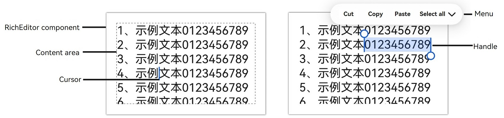

# Rich Text Editing (RichEditor)
<!--Kit: ArkUI-->
<!--Subsystem: ArkUI-->
<!--Owner: @carnivore233-->
<!--Designer: @xiangyuan6-->
<!--Tester: @mateng_Holtens-->
<!--Adviser: @Brilliantry_Rui-->

**RichEditor** is a component that supports interactive text editing and mixing of text and images. It's commonly used in scenarios requiring mixed-content user input, such as comment sections that accept both images and text. For details, see [RichEditor](../reference/apis-arkui/arkui-ts/ts-basic-components-richeditor.md).

For displaying only images and text, use the [Text](../reference/apis-arkui/arkui-ts/ts-basic-components-text.md) component.

For displaying large amounts of HTML content, use the [RichText](../reference/apis-arkui/arkui-ts/ts-basic-components-richtext.md) component.

## Component Structure

The following diagram shows the component's element structure.



| Element      | Description                                                  |
| ------------ | ------------------------------------------------------------ |
| Content area | Area where content is displayed.                             |
| Cursor       | Current input position.                        |
| Handle       | Left and right handles that can be dragged separately to adjust the text selection range. |
| Menu         | Displayed after content selection, containing operation buttons like copy and paste. |

## Creating a RichEditor Component

Create a RichEditor component using styled strings or spans. See [Creating a RichEditor Component with Styled Strings](#creating-a-richeditor-component-with-styled-strings) or [Creating a RichEditor Component with Spans](#creating-a-richeditor-component-with-spans).

### Creating a RichEditor Component with Styled Strings

Use the RichEditor(options: [RichEditorStyledStringOptions](../reference/apis-arkui/arkui-ts/ts-basic-components-richeditor.md#richeditorstyledstringoptions12)) API to create a RichEditor component that manages content using styled strings ([StyledString/MutableStyledString](arkts-styled-string.md)). This approach allows you to manage data by maintaining styled string objects on the application side, modifying their content and style, then passing the updated objects to the component to refresh the rich text content.

Compared to using controller APIs for content style updates, this method offers greater flexibility and convenience. Additionally, styled string objects can be applied to various text components that support styled strings for quick content migration.

```ts
fontStyle: TextStyle = new TextStyle({
  fontColor: Color.Pink
});
// Define a text style object.

mutableStyledString: MutableStyledString = new MutableStyledString("Create a RichEditor component using a styled string.",
  [{
    start: 0,
    length: 5,
    styledKey: StyledStringKey.FONT,
    styledValue: this.fontStyle
  }]);
// Create a styled string.

controller: RichEditorStyledStringController = new RichEditorStyledStringController();
options: RichEditorStyledStringOptions = { controller: this.controller };

RichEditor(this.options)
  .onReady(() => {
    this.controller.setStyledString(this.mutableStyledString);
  })
```


### Creating a RichEditor Component with Spans

Use the RichEditor(value: [RichEditorOptions](../reference/apis-arkui/arkui-ts/ts-basic-components-richeditor.md#richeditoroptions)) API to create a RichEditor component that manages content using spans. This component is typically used in complex content scenarios. Developers can use the APIs provided by RichEditorController to manage content and styles.

```ts
@Entry
@Component
struct create_rich_editor {
  controller: RichEditorController = new RichEditorController();
  options: RichEditorOptions = { controller: this.controller };

  build() {
    Column() {
      Column() {
        RichEditor(this.options)
          .onReady(() => {
            this.controller.addTextSpan('Create a RichEditor component without using a styled string.', {
              style: {
                fontColor: Color.Black,
                fontSize: 15
              }
            })
          })
      }.width('100%')
    }.height('100%')
  }
}
```


## Adding Content

The rich text component can add various types of content through different APIs.

### Adding Text Spans

In addition to direct input, you can add text spans using the [addTextSpan](../reference/apis-arkui/arkui-ts/ts-basic-components-richeditor.md#addtextspan) API.

This API enables diverse text styling, such as creating mixed-format text.

If the component is focused and the cursor is blinking, the cursor position updates after adding text via addTextSpan, and the cursor blinks to the right of the newly added text.

```ts
@Entry
@Component
struct add_text_span {
  controller: RichEditorController = new RichEditorController();
  options: RichEditorOptions = { controller: this.controller };

  build() {
    Column() {
      RichEditor(this.options)
        .onReady(() => {
          this.controller.addTextSpan('Click the button to add text here.', {
            style: {
              fontColor: Color.Black,
              fontSize: 15
            }
          })
        })
        .border({ width: 1, color: Color.Gray })
        .constraintSize({
          maxHeight: 100
        })
        .width(300)
        .margin(10)
      Button('addTextSpan', {
        buttonStyle: ButtonStyleMode.NORMAL
      })
        .height(30)
        .fontSize(13)
        .onClick(() => {
          this.controller.addTextSpan('Add text.')
        })
    }
  }
}
```


### Adding Image Spans

Use the [addImageSpan](../reference/apis-arkui/arkui-ts/ts-basic-components-richeditor.md#addimagespan) API to add image spans.

This API enriches and visualizes content. For example, you can add images to news articles or data visualization graphics in documents.

If the component is focused and the cursor is blinking, the cursor position updates after adding an image via addImageSpan, and the cursor blinks to the right of the newly added image.

```ts
controller: RichEditorController = new RichEditorController();
options: RichEditorOptions = { controller: this.controller };

RichEditor(this.options)
  .onReady(() => {
    this.controller.addTextSpan('Click the button to add an image here.', {
      style: {
        fontColor: Color.Black,
        fontSize: 15
      }
    })
  })
  .width(300)
  .height(100)
Button('addImageSpan', {
  buttonStyle: ButtonStyleMode.NORMAL
})
  .height(30)
  .fontSize(13)
  .onClick(() => {
    this.controller.addImageSpan($r("app.media.startIcon"), {
      imageStyle: {
        size: ["57px", "57px"]
      }
    })
  })
```


### Adding @Builder Content

Use [addBuilderSpan](../reference/apis-arkui/arkui-ts/ts-basic-components-richeditor.md#addbuilderspan11) to add content decorated with @Builder.

This approach is suitable for integrating custom complex components, such as custom charts.

Use [RichEditorBuilderSpanOptions](../reference/apis-arkui/arkui-ts/ts-basic-components-richeditor.md#richeditorbuilderspanoptions11) to specify the insertion position. If no position is specified or an invalid value is provided, the builder content is appended to the end.

```ts
private my_builder: CustomBuilder = undefined

@Builder
TextBuilder() {
  Row() {
    Image($r('app.media.startIcon')).width(50).height(50).margin(16)
    Column() {
      Text("Text.txt").fontWeight(FontWeight.Bold).fontSize(16)
      Text("123.45KB").fontColor('#8a8a8a').fontSize(12)
    }.alignItems(HorizontalAlign.Start)
  }.backgroundColor('#f4f4f4')
  .borderRadius("20")
  .width(220)
}

controller: RichEditorController = new RichEditorController();
options: RichEditorOptions = { controller: this.controller };

Button('addBuilderSpan', {
  buttonStyle: ButtonStyleMode.NORMAL
})
  .height(30)
  .fontSize(13)
  .onClick(() => {
    this.my_builder = () => {
      this.TextBuilder()
    }
    this.controller.addBuilderSpan(this.my_builder)
  })
```


### Adding Symbol Spans

Use the [addSymbolSpan](../reference/apis-arkui/arkui-ts/ts-basic-components-richeditor.md#addsymbolspan11) API to add symbol content. This API can add special symbols, such as mathematical symbols when editing academic papers.

When adding a symbol while the component is focused and the cursor is blinking, the cursor moves to the right of the newly inserted symbol.

Currently, gestures, copying, and dragging are not supported for symbol content.

```ts
controller: RichEditorController = new RichEditorController();
options: RichEditorOptions = { controller: this.controller };

RichEditor(this.options)
  .onReady(() => {
    this.controller.addTextSpan('Click the button to add a symbol here.', {
      style: {
        fontColor: Color.Black,
        fontSize: 15
      }
    })
  })
  .width(300)
  .height(100)
Button('addSymbolSpan', {
  buttonStyle: ButtonStyleMode.NORMAL
})
  .height(30)
  .fontSize(13)
  .onClick(() => {
    this.controller.addSymbolSpan($r("sys.symbol.basketball_fill"), {
      style: {
        fontSize: 30
      }
    })
  })
```


## Content Management

The rich text component provides APIs for content management, such as retrieving image and text information (see [Retrieving Image and Text Information](#retrieving-image-and-text-information)), setting placeholder text (see [Setting Placeholder Text](#setting-placeholder-text)), or limiting content length (see [Setting Maximum Length](#setting-maximum-length)).

### Retrieving Image and Text Information

Use the [getSpans](../reference/apis-arkui/arkui-ts/ts-basic-components-richeditor.md#getspans) API to retrieve information about all images and text in the component, including content, ID, style, and position. After obtaining position information, you can update the style of content within a specified range.

This API is useful for inspecting existing content styles, such as in template use cases, and for content parsing and processing, such as in text analysis applications.

```ts
controller: RichEditorController = new RichEditorController();
options: RichEditorOptions = { controller: this.controller }
infoShowController: RichEditorController = new RichEditorController();
infoShowOptions: RichEditorOptions = { controller: this.infoShowController }
// Create two RichEditor components.

RichEditor(this.options)
  .onReady(() => {
    this.controller.addTextSpan('Click the button to obtain the span information.', {
      style: {
        fontColor: Color.Black,
        fontSize: 15
      }
    })
  })
  .width(300)
  .height(50)
Text('View the return value of getSpans: ').fontSize(10).fontColor(Color.Gray).width(300)
RichEditor(this.infoShowOptions)
  .width(300)
  .height(50)
Button('getSpans', {
  buttonStyle: ButtonStyleMode.NORMAL
})
  .height(30)
  .fontSize(13)
  .onClick(() => {
    this.infoShowController.addTextSpan(JSON.stringify(this.controller.getSpans()), {
      style: {
        fontColor: Color.Gray,
        fontSize: 10
      }
    })
  })
```


### Setting Placeholder Text

Use the [placeholder](../reference/apis-arkui/arkui-ts/ts-basic-components-richeditor.md#placeholder12) API to set hint text displayed when there is no input.

Placeholder text provides useful guidance, helping users navigate the application UI, especially in scenarios requiring specific input, such as login screens. For example, in a text editor, placeholder text can specify input requirements like "Enter up to 100 characters" to guide user actions.

```ts
controller: RichEditorController = new RichEditorController();
options: RichEditorOptions = { controller: this.controller };

RichEditor(this.options)
  .placeholder("Enter your content here", {
    fontColor: Color.Gray,
    font: {
      size: 15,
      weight: FontWeight.Normal,
      family: "HarmonyOS Sans",
      style: FontStyle.Normal
    }
  })
  .width(300)
  .height(50)
```


### Setting Maximum Length

Use [maxLength](../reference/apis-arkui/arkui-ts/ts-basic-components-richeditor.md#maxlength18) to set the maximum number of characters allowed in the rich text component.

```ts
controller: RichEditorController = new RichEditorController();
options: RichEditorOptions = { controller: this.controller };

RichEditor(this.options)
  .placeholder('The maximum number of characters that can be entered is 7.')
  .onReady(() => {})
  .maxLength(7)
```


## Event Callbacks

Register event callbacks to monitor component events.

### Callbacks for Before and After Content Changes

Use the [onWillChange](../reference/apis-arkui/arkui-ts/ts-basic-components-richeditor.md#onwillchange12) API to add a callback invoked before text or image changes. This callback is suitable for real-time data validation and notifications. For example, it can enable features like sensitive word detection with immediate alert dialogs, or real-time character counting and limiting.

Use the [onDidChange](../reference/apis-arkui/arkui-ts/ts-basic-components-richeditor.md#ondidchange12) API to add a callback invoked after text or image changes. This callback is suitable for content saving and synchronization. For example, it can automatically save the latest content locally or sync it to a server, and update content status and rendering.

Note: The **RichEditor** component constructed with [RichEditorStyledStringOptions](../reference/apis-arkui/arkui-ts/ts-basic-components-richeditor.md#richeditorstyledstringoptions12) does not support these callbacks.

```ts
controller: RichEditorController = new RichEditorController();
options: RichEditorOptions = { controller: this.controller };

infoShowController: RichEditorController = new RichEditorController();
infoShowOptions: RichEditorOptions = { controller: this.infoShowController };

RichEditor(this.options)
  .onReady(() => {
    this.controller.addTextSpan('Callback invoked before text or image changes.\nCallback invoked after text or image changes.', {
      style: {
        fontColor: Color.Black,
        fontSize: 15
      }
    })
  })
  .onWillChange((value: RichEditorChangeValue) => {
    this.infoShowController.addTextSpan('Triggered before content change: \n' + JSON.stringify(value), {
      style: {
        fontColor: Color.Gray,
        fontSize: 10
      }
    })
    return true;
  })
  .onDidChange((rangeBefore: TextRange, rangeAfter: TextRange) => {
    this.infoShowController.addTextSpan('\nTriggered after content change: \nrangeBefore:' + JSON.stringify(rangeBefore) +
      '\nrangeAfter: ' + JSON.stringify(rangeAfter), {
      style: {
        fontColor: Color.Gray,
        fontSize: 10
      }
    })
  })
  .width(300)
  .height(50)
Text('View callback content:').fontSize(10).fontColor(Color.Gray).width(300)
RichEditor(this.infoShowOptions)
  .width(300)
  .height(70)
```


### Callbacks for Input Method Input

Callbacks can be triggered before and after input method content is added.

For intelligent input assistance, use [aboutToIMEInput](../reference/apis-arkui/arkui-ts/ts-basic-components-richeditor.md#abouttoimeinput) to trigger a callback before adding input content, and [onDidIMEInput](../reference/apis-arkui/arkui-ts/ts-basic-components-richeditor.md#ondidimeinput12) to trigger a callback after input method content is added.

These callbacks are suitable for business logic processing during text display. For example, before user-entered text appears on screen, the callback can provide word suggestions. After input completion, automatic error correction or format conversion can be performed. The callback sequence is aboutToIMEInput followed by onDidIMEInput.

Components constructed using [RichEditorStyledStringOptions](../reference/apis-arkui/arkui-ts/ts-basic-components-richeditor.md#richeditorstyledstringoptions12) do not support these callbacks.

```ts
controller: RichEditorController = new RichEditorController();
options: RichEditorOptions = { controller: this.controller };

infoShowController: RichEditorController = new RichEditorController();
infoShowOptions: RichEditorOptions = { controller: this.infoShowController };

RichEditor(this.options)
  .onReady(() => {
    this.controller.addTextSpan('Callback invoked before input method content is added.\nCallback invoked after input method content is added.', {
      style: {
        fontColor: Color.Black,
        fontSize: 15
      }
    })
  })
  .aboutToIMEInput((value: RichEditorInsertValue) => {
    this.infoShowController.addTextSpan(' Callback triggered before input method starts: \n' + JSON.stringify(value), {
      style: {
        fontColor: Color.Gray,
        fontSize: 10
      }
    })
    return true;
  })
  .onDidIMEInput((value: TextRange) => {
    this.infoShowController.addTextSpan(' Callback triggered after input method finishes: \n' + JSON.stringify(value), {
      style: {
        fontColor: Color.Gray,
        fontSize: 10
      }
    })
        })
  .width(300)
  .height(50)
Text('View callback content:').fontSize(10).fontColor(Color.Gray).width(300)
RichEditor(this.infoShowOptions)
  .width(300)
  .height(70)
```


### Callback Before Paste Completion

The [onPaste](../reference/apis-arkui/arkui-ts/ts-basic-components-richeditor.md#onpaste11) callback is used to add processing logic before pasting.

This is useful for content format processing, such as converting HTML-tagged text to a format supported by the **RichEditor** component, removing unnecessary tags, or retaining only plain text.

You can use this API to override the default paste behavior (limited to plain text) to support pasting both images and text.

```ts
import { BusinessError, pasteboard } from '@kit.BasicServicesKit';

@Entry
@Component
struct on_cut_copy_paste {
  controller: RichEditorController = new RichEditorController();
  options: RichEditorOptions = { controller: this.controller }
  infoShowController: RichEditorController = new RichEditorController();
  infoShowOptions: RichEditorOptions = { controller: this.infoShowController }

  popDataFromPasteboard() {
    let selection = this.controller.getSelection();
    let start = selection.selection[0];
    let end = selection.selection[1];
    if (start == end) {
      start = this.controller.getCaretOffset();
      end = start;
    }
    let moveOffset = 0;
    let sysBoard = pasteboard.getSystemPasteboard();
    sysBoard.getData((err, data) => {
      if (err) {
        return;
      }
      if (start != end) {
        this.controller.deleteSpans({ start: start, end: end })
      }
      let count = data.getRecordCount();
      for (let i = 0; i < count; i++) {
        const element = data.getRecord(i);
        if (element && element.plainText && element.mimeType === pasteboard.MIMETYPE_TEXT_PLAIN) {
          this.controller.addTextSpan(element.plainText,
            {
              style: { fontSize: 26, fontColor: Color.Red },
              offset: start + moveOffset
            }
          )
          moveOffset += element.plainText.length;
        }
      }
      this.controller.setCaretOffset(start + moveOffset)
    })
  }

  build() {
    Column() {
      Column({ space: 3 }) {
        RichEditor(this.options)
          .onReady(() => {
            this.controller.addTextSpan('Copy and paste text to trigger corresponding callbacks.',
              { style: { fontColor: Color.Black, fontSize: 15 } })
          })
          .onPaste((event) => {
            this.infoShowController.addTextSpan('Triggered onPaste callback\n', { style: { fontColor: Color.Gray, fontSize: 10 } })
            if (event != undefined && event.preventDefault) {
              event.preventDefault();
            }
            console.info('RichEditor onPaste')
            this.popDataFromPasteboard()
          })
          .width(300)
          .height(70)
        Text('View callback content:').fontSize(10).fontColor(Color.Gray).width(300)
          .width(300)
          .height(70)
        RichEditor(this.infoShowOptions)
          .width(300)
          .height(70) 
      }.width('100%').alignItems(HorizontalAlign.Start)
    }.height('100%')
  }
}
```

### Callback Before Cut Completion

Add a callback to process data before the [onCut](../reference/apis-arkui/arkui-ts/ts-basic-components-richeditor.md#oncut12) operation completes.

This callback is suitable for data processing and storage. For example, when a user cuts content from the rich text component, the callback can temporarily store the cut content to ensure accurate restoration during subsequent pasting.

You can use this API to override the default cut behavior (limited to plain text) to support cutting both images and text.

```ts
controller: RichEditorController = new RichEditorController();
options: RichEditorOptions = { controller: this.controller };

infoShowController: RichEditorController = new RichEditorController();
infoShowOptions: RichEditorOptions = { controller: this.infoShowController };

RichEditor(this.options)
  .onReady(() => {
    this.controller.addTextSpan('Cut and paste operations on this text trigger corresponding callbacks.', {
      style: {
        fontColor: Color.Black,
        fontSize: 15
      }
    })
  })
  .onCut(() => {
    this.infoShowController.addTextSpan('Triggered onCut callback.\n', {
      style: {
        fontColor: Color.Gray,
        fontSize: 10
      }
    })
  })
  .width(300)
  .height(70)
RichEditor(this.infoShowOptions)
  .width(300)
  .height(70) 
```

### Callback Before Copy Completion

Use the [onCopy](../reference/apis-arkui/arkui-ts/ts-basic-components-richeditor.md#oncopy12) callback to add processing logic before copying.

This callback is suitable for content backup and sharing. For example, the callback can save the copied content and its format information to a local backup folder, or automatically generate copy including the copied content and a product purchase link for users to paste and share.

The component's default copy behavior is limited to plain text and cannot process images. Use this method to implement copying both images and text, replacing the component's default behavior.

```ts
controller: RichEditorController = new RichEditorController();
options: RichEditorOptions = { controller: this.controller };

infoShowController: RichEditorController = new RichEditorController();
infoShowOptions: RichEditorOptions = { controller: this.infoShowController };

RichEditor(this.options)
  .onReady(() => {
    this.controller.addTextSpan('Copy and paste operations on this text trigger corresponding callbacks.', {
      style: {
        fontColor: Color.Black,
        fontSize: 15
      }
    })
  })
  .onCopy(() => {
    this.infoShowController.addTextSpan('Triggered onCopy callback.\n', {
      style: {
        fontColor: Color.Gray,
        fontSize: 10
      }
    })
  })
  .width(300)
  .height(70)
RichEditor(this.infoShowOptions)
  .width(300)
  .height(70) 
```


For all available events, see [RichEditor Events](../reference/apis-arkui/arkui-ts/ts-basic-components-richeditor.md#events).

## Component Interaction

Configure interactive element attributes through APIs to detect changes.

### Setting Cursor and Handle Color

Use [caretColor](../reference/apis-arkui/arkui-ts/ts-basic-components-richeditor.md#caretcolor12) to set the cursor and handle color.

Setting distinct cursor and handle colors enhances visual recognition, especially in interfaces with multiple input areas. Unique cursor colors help quickly locate the active input area. This feature also improves user experience by coordinating the cursor color with the application's overall style.

```ts
controller: RichEditorController = new RichEditorController();
options: RichEditorOptions = { controller: this.controller };

RichEditor(this.options)
  .onReady(() => {
    this.controller.addTextSpan('The component has custom caret and selection handle colors.', {
      style: {
        fontColor: Color.Black,
        fontSize: 15
      }
    })
  })
  .caretColor(Color.Orange)
  .width(300)
  .height(300)
```


### Callback for Cursor Position Changes

[onSelectionChange](../reference/apis-arkui/arkui-ts/ts-basic-components-richeditor.md#onselectionchange12) adds a callback triggered when the cursor position changes in the content selection area or during editing.

This callback monitors selection area changes in real time. For example, you can use it to update toolbar status (displaying font and paragraph formats), count selected content length, or generate summaries. Real-time response to selection status and dynamic association of interactive elements improve the rich text editing experience and functionality.

```ts
controller: RichEditorController = new RichEditorController();
options: RichEditorOptions = { controller: this.controller };

infoShowController: RichEditorController = new RichEditorController();
infoShowOptions: RichEditorOptions = { controller: this.infoShowController };

RichEditor(this.options)
  .onReady(() => {
    this.controller.addTextSpan('Change the cursor position in the selection area or during editing to trigger the onSelectionChange callback.', {
      style: {
        fontColor: Color.Black,
        fontSize: 15
      }
    })
  })
  .onSelectionChange((value: RichEditorRange) => {
    this.infoShowController.addTextSpan("\n" + "Triggered onSelectionChange callback, range: (" + value.start + "," +
    value.end + ")", {
      style: {
        fontColor: Color.Gray,
        fontSize: 10
      }
    })
  })
  .width(300)
  .height(50)
Text('View callback content:').fontSize(10).fontColor(Color.Gray).width(300)
RichEditor(this.infoShowOptions)
  .width(300)
  .height(70)
```


### Setting Selection Range

Use the [setSelection](../reference/apis-arkui/arkui-ts/ts-basic-components-richeditor.md#setselection11) API to highlight the selected portion of the content.

This API implements text focus effects. For example, when a user taps a text paragraph title or summary, this API can automatically select and highlight the corresponding text content.

If this API is called when the text box is not focused, the selection effect is not displayed.

```ts
controller: RichEditorController = new RichEditorController();
options: RichEditorOptions = { controller: this.controller };

RichEditor(this.options)
  .onReady(() => {
    this.controller.addTextSpan('Click the button to select text from positions 0 to 2.', {
      style: {
        fontColor: Color.Black,
        fontSize: 15
      }
    })
  })
  .width(300)
  .height(60)
Button('setSelection(0,2)', {
  buttonStyle: ButtonStyleMode.NORMAL
})
  .height(30)
  .fontSize(13)
  .onClick(() => {
    this.controller.setSelection(0, 2)
  })
```


## Menu Configuration

Configure the text selection menu through APIs.

### Managing Selected Menu Items

The [onPrepareMenu](../reference/apis-arkui/arkui-ts/ts-text-common.md#properties-1) callback is triggered before the menu is displayed after the rich text selection area changes. You can set menu data in this callback.

```ts
// xxx.ets
@Entry
@Component
struct RichEditorExample {
  controller: RichEditorController = new RichEditorController();
  options: RichEditorOptions = { controller: this.controller };
  @State endIndex: number | undefined = 0;
  onCreateMenu = (menuItems: Array<TextMenuItem>) => {
    const idsToFilter = [
      TextMenuItemId.TRANSLATE,
      TextMenuItemId.SHARE,
      TextMenuItemId.SEARCH,
      TextMenuItemId.AI_WRITER
    ]
    const items = menuItems.filter(item => !idsToFilter.some(id => id.equals(item.id)))
    let item1: TextMenuItem = {
      content: 'create1',
      icon: $r('app.media.startIcon'),
      id: TextMenuItemId.of('create1'),
    };
    let item2: TextMenuItem = {
      content: 'create2',
      id: TextMenuItemId.of('create2'),
      icon: $r('app.media.startIcon'),
    };
    items.push(item1);
    items.unshift(item2);
    return items;
  }
  onMenuItemClick = (menuItem: TextMenuItem, textRange: TextRange) => {
    if (menuItem.id.equals(TextMenuItemId.of("create2"))) {
      console.info("Intercept id: create2 start:" + textRange.start + "; end:" + textRange.end);
      return true;
    }
    if (menuItem.id.equals(TextMenuItemId.of("prepare1"))) {
      console.info("Intercept id: prepare1 start:" + textRange.start + "; end:" + textRange.end);
      return true;
    }
    if (menuItem.id.equals(TextMenuItemId.COPY)) {
      console.info("Intercept COPY start:" + textRange.start + "; end:" + textRange.end);
      return true;
    }
    if (menuItem.id.equals(TextMenuItemId.SELECT_ALL)) {
      console.info("Do not intercept SELECT_ALL start:" + textRange.start + "; end:" + textRange.end);
      return false;
    }
    return false;
  }
  onPrepareMenu = (menuItems: Array<TextMenuItem>) => {
    let item1: TextMenuItem = {
      content: 'prepare1_' + this.endIndex,
      icon: $r('app.media.startIcon'),
      id: TextMenuItemId.of('prepare1'),
    };
    menuItems.unshift(item1);
    return menuItems;
  }
  @State editMenuOptions: EditMenuOptions = {
    onCreateMenu: this.onCreateMenu,
    onMenuItemClick: this.onMenuItemClick,
    onPrepareMenu: this.onPrepareMenu
  };

  build() {
    Column() {
      RichEditor(this.options)
        .onReady(() => {
          this.controller.addTextSpan("RichEditor editMenuOptions");
        })
        .editMenuOptions(this.editMenuOptions)
        .onSelectionChange((range: RichEditorRange) => {
          console.info("onSelectionChange, (" + range.start + "," + range.end + ")");
          this.endIndex = range.end;
        })
        .height(50)
        .margin({ top: 100 })
        .borderWidth(1)
        .borderColor(Color.Red)
    }
    .width("90%")
    .margin("5%")
  }
}
```


### Disabling System Service Menu Items

Use [disableSystemServiceMenuItems](../reference/apis-arkui/arkts-apis-uicontext-textmenucontroller.md#disablesystemservicemenuitems20) to disable all system service menu items in the rich text selection menu.

This API protects content security and is suitable for scenarios with restricted text operations, such as displaying confidential content or copyrighted text that cannot be copied. Disabling system service menu items prevents users from copying and sharing text through these menus, reducing content leakage risks.


  ```ts
  import { TextMenuController } from '@kit.ArkUI';

  // xxx.ets
  @Entry
  @Component
  struct Index {
    controller: RichEditorController = new RichEditorController();
    options: RichEditorOptions = { controller: this.controller };

    aboutToAppear(): void {
    // Disable all system service menus.
      TextMenuController.disableSystemServiceMenuItems(true);
    }

    aboutToDisappear(): void {
    // Restore system service menu items when the page disappears.
      TextMenuController.disableSystemServiceMenuItems(false);
    }

    build() {
      Row() {
        Column() {
          RichEditor(this.options).onReady(() => {
            this.controller.addTextSpan("This is a RichEditor.",
              {
                style:
                {
                  fontSize: 30
                }
              })
          })
            .height(60)
            .editMenuOptions({
              onCreateMenu: (menuItems: Array<TextMenuItem>) => {
                // menuItems no longer contains disabled system menu items.
                return menuItems;
              },
              onMenuItemClick: (menuItem: TextMenuItem, textRange: TextRange) => {
                return false;
              }
            })
        }.width('100%')
      }
      .height('100%')
    }
  }
  ```


Use [disableMenuItems](../reference/apis-arkui/arkts-apis-uicontext-textmenucontroller.md#disablemenuitems20) to disable specific system service menu items in the rich text selection menu.

This interface precisely disables specified system service menu items while retaining required system menu functions, making the menus more suitable for actual interaction design.

  ```ts
  import { TextMenuController } from '@kit.ArkUI';

  // xxx.ets
  @Entry
  @Component
  struct Index {
    controller: RichEditorController = new RichEditorController();
    options: RichEditorOptions = { controller: this.controller };

    aboutToAppear(): void {
    // Disable search and translation menus.
      TextMenuController.disableMenuItems([TextMenuItemId.SEARCH, TextMenuItemId.TRANSLATE])
    }

    aboutToDisappear(): void {
    // Restore system service menu items.
      TextMenuController.disableMenuItems([])
    }

    build() {
      Row() {
        Column() {
          RichEditor(this.options).onReady(() => {
            this.controller.addTextSpan("This is a RichEditor.",
              {
                style:
                {
                  fontSize: 30
                }
              })
          })
            .height(60)
            .editMenuOptions({
              onCreateMenu: (menuItems: Array<TextMenuItem>) => {
                // menuItems no longer contains search and translation.
                return menuItems;
              },
              onMenuItemClick: (menuItem: TextMenuItem, textRange: TextRange) => {
                return false
              }
            })
        }.width('100%')
      }
      .height('100%')
    }
  }
  ```


### Setting Custom Context Menu on Text Selection

Use the [bindSelectionMenu](../reference/apis-arkui/arkui-ts/ts-basic-components-richeditor.md#bindselectionmenu) API to set a custom context menu on text selection.

By default, the context menu includes copy, cut, and select all options. You can add more options for enhanced interactions, such as translate for multilingual support or bold for emphasizing selected text.

If the custom menu is too long, consider embedding a **Scroll** component to prevent the keyboard from being blocked.

```ts
controller: RichEditorController = new RichEditorController();
options: RichEditorOptions = { controller: this.controller };

RichEditor(this.options)
  .onReady(() => {
    this.controller.addTextSpan('The component has a custom menu that can be triggered by a long press.', {
      style: {
        fontColor: Color.Black,
        fontSize: 18
      }
    })
  })
  .bindSelectionMenu(RichEditorSpanType.TEXT, this.SystemMenu, ResponseType.LongPress, {
    onDisappear: () => {
      this.sliderShow = false
    }
  })
// Bind a custom menu.
  .width(300)
  .height(300)

@Builder
SystemMenu() {
  Column() {
    Menu() {
      if (this.controller) {
        MenuItemGroup() {
          MenuItem({
            startIcon: $r("sys.media.ohos_ic_public_cut"),
            content: "Cut",
            labelInfo: "Ctrl+X"
          })
          MenuItem({
            startIcon: $r("sys.media.ohos_ic_public_copy"),
            content: "Copy",
            labelInfo: "Ctrl+C"
          })
          MenuItem({
            startIcon: $r("sys.media.ohos_ic_public_paste"),
            content: "Paste",
            labelInfo: "Ctrl+V"
          })
        }
      }
    }
    .radius(this.theme.containerBorderRadius)
    .clip(true)
    .backgroundColor(Color.White)
    .width(this.theme.defaultMenuWidth)
  }
  .width(this.theme.defaultMenuWidth)
}
```


## Layout Configuration

Configure component layout rules through APIs. Customize layout rules based on business scenarios.

### Setting Maximum Line Count

Use [maxLines](../reference/apis-arkui/arkui-ts/ts-basic-components-richeditor.md#maxlines18) to set the maximum number of lines displayed in the rich text component.

This API controls the text display range to prevent excessively long text from affecting page layout. It ensures consistent text display across different devices and scenarios, improving interface compatibility and aesthetics.

```ts
controller: RichEditorController = new RichEditorController();
options: RichEditorOptions = { controller: this.controller };

RichEditor(this.options)
  .onReady(() => {
    this.controller.addTextSpan('Maximum line count is set.\nContent exceeding the limit will scroll.\nExceeds 1 line.\nExceeds 2 lines.\nExceeds 3 lines.\nExceeds 4 lines.', {
      style: {
        fontColor: Color.Black,
        fontSize: 15
      }
    })
  })
  .maxLines(2)
```


## Style Settings

Set complex styles for content.

### Setting Preset Text Style

Use [setTypingStyle](../reference/apis-arkui/arkui-ts/ts-basic-components-richeditor.md#settypingstyle11) to set the preset text style.

This enables personalized writing experiences. For example, you can use this API to automatically apply corresponding formats to different heading levels (like level-1 and level-2 headings) as users type.

```ts
controller: RichEditorController = new RichEditorController();
options: RichEditorOptions = { controller: this.controller };

RichEditor(this.options)
  .onReady(() => {
    this.controller.addTextSpan('Click the button to change the preset text style.', {
      style: {
        fontColor: Color.Black,
        fontSize: 15
      }
    })
  })
  .width(300)
  .height(60)
Button('setTypingStyle', {
  buttonStyle: ButtonStyleMode.NORMAL
})
  .height(30)
  .fontSize(13)
  .onClick(() => {
    this.controller.setTypingStyle({
      fontWeight: 'medium',
      fontColor: Color.Pink,
      fontSize: 15,
      fontStyle: FontStyle.Italic,
      decoration: {
        type: TextDecorationType.Underline,
        color: Color.Gray
      }
    })
  })
```


### Setting Text Decoration

[decoration](../reference/apis-arkui/arkui-ts/ts-basic-components-span.md#decoration) sets the style, color, and thickness of text decoration lines.

Text decoration highlights key information, distinguishes text status, and enhances visual hierarchy. For example, add decoration to important titles or keywords to help users quickly identify information.

  ```ts
  private controller: RichEditorController = new RichEditorController();
  RichEditor({ controller: this.controller })
    .onReady(() => {
      this.controller.addTextSpan('Preset text', {
        style: {
          fontSize: 25,
          decoration: {
            type: TextDecorationType.LineThrough,
            color: Color.Blue,
            // Set decoration line thickness ratio to 6.
            thicknessScale: 6
          }
        }
      })
    })
  ```


Use enableMultiType in [DecorationOptions](../reference/apis-arkui/arkui-ts/ts-universal-styled-string.md#decorationoptions20) to set multiple decoration lines, such as underlines and strikethroughs.

This API suits complex business scenarios and meets diverse text decoration needs. During document collaboration, different decoration combinations can distinguish text status, improving collaboration efficiency.

  ```ts
  RichEditor({ controller: this.styledStringController })
  Button('Multi-decoration text')
    .fontSize(20)
    .onClick(() => {
      let mutString: MutableStyledString = new MutableStyledString('Set rich text multi-decoration', [
        {
          start: 0,
          length: 9,
          styledKey: StyledStringKey.FONT,
          styledValue: new TextStyle({ fontSize: LengthMetrics.vp(25) })
        },
        {
          start: 0,
          length: 5,
          styledKey: StyledStringKey.DECORATION,
          styledValue: new DecorationStyle(
            {
              type: TextDecorationType.Underline,
            },
            {
              // Enable multiple decoration lines.
              enableMultiType: true
            }
          )
        },
        {
          start: 2,
          length: 4,
          styledKey: StyledStringKey.DECORATION,
          styledValue: new DecorationStyle(
           {
              type: TextDecorationType.LineThrough,
            },
            {
              // Enable multiple decoration lines.
              enableMultiType: true
            }
          )
        },
      ])
      this.styledStringController.setStyledString(mutString);
    })
  ```


### Setting Vertical Alignment

Use [textVerticalAlign](../reference/apis-arkui/arkui-ts/ts-basic-components-text.md#textverticalalign20) to set the vertical alignment of text paragraphs.

This API optimizes multi-element layout, making the overall layout more coordinated when component content is vertically aligned with images and icons.

  ```ts
  controller: RichEditorController = new RichEditorController();
  options: RichEditorOptions = { controller: this.controller };

  Column({ space: 5 }) {
    RichEditor(this.options)
      .onReady(() => {
        this.controller.addImageSpan($r('app.media.startIcon'), {
          imageStyle: {
            size: [100, 100]
          }
        })
        this.controller.addTextSpan("This rich text demonstrates vertical text alignment.", {
          style: {
            fontColor: Color.Pink,
            fontSize: "32"
          },
          paragraphStyle: {
            textAlign: TextAlign.Start,
            textVerticalAlign: TextVerticalAlign.CENTER,
            leadingMargin: 16
          }
        })
      })
  }
  ```


### Setting Automatic Spacing Between Chinese and Western Characters

Use [enableAutoSpacing](../reference/apis-arkui/arkui-ts/ts-basic-components-richeditor.md#enableautospacing20) to enable automatic spacing between Chinese and Western characters.

This interface optimizes text layout and improves readability. When enabled, appropriate gaps are inserted between Chinese and Western characters, facilitating language differentiation and reducing visual interference.

```ts
Column() {
  RichEditor(this.options)
    .onReady(() => {
      this.controller.addTextSpan("Automatic Spacing Between Chinese and Western Characters",
        {
          style:
          {
            fontColor: Color.Orange,
            fontSize: 20
          }
        })
    })
    .enableAutoSpacing(this.enableAutoSpace)
}
```


<!--RP1--><!--RP1End-->
