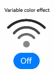
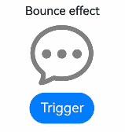
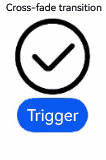
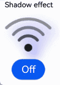
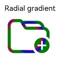

# Symbol Glyph (SymbolGlyph/SymbolSpan)
<!--Kit: ArkUI-->
<!--Subsystem: ArkUI-->
<!--Owner: @hddgzw-->
<!--Designer: @xiangyuan6-->
<!--Tester: @jiaoaozihao-->
<!--Adviser: @Brilliantry_Rui-->

**SymbolGlyph** is a component designed for icon glyphs, making it easy to use sophisticated icons, including multi-colored and animated icons. You can add symbol glyphs in text through the use of the **SymbolSpan** component, a child of the **Text** component. For details, see [SymbolGlyph](../reference/apis-arkui/arkui-ts/ts-basic-components-symbolGlyph.md) and [SymbolSpan](../reference/apis-arkui/arkui-ts/ts-basic-components-symbolSpan.md).


## Creating a Symbol Glyph

You create a symbol glyph by referencing a resource through $r. Currently, only the preset symbol resources are supported.<!--RP1--><!--RP1End-->

<!-- @[creat_symbol_glyph](https://gitcode.com/openharmony/applications_app_samples/blob/master/code/DocsSample/ArkUISample/TextComponent/entry/src/main/ets/pages/symbol/CreatSymbolGlyph.ets) -->

``` TypeScript
SymbolGlyph($r('sys.symbol.ohos_folder_badge_plus'))
  .fontSize(96)
  .renderingStrategy(SymbolRenderingStrategy.SINGLE)
  .fontColor([Color.Black, Color.Green, Color.White])
```

  

## Adding to Text

To embed a symbol glyph within a text string, use [SymbolSpan](../reference/apis-arkui/arkui-ts/ts-basic-components-symbolSpan.md) as a child of the [Text](../reference/apis-arkui/arkui-ts/ts-basic-components-text.md) component. You can nest multiple **SymbolSpan** components to display a series of symbol glyphs. 

- Create a **SymbolSpan** component.

  A **SymbolSpan** component is only visible when embedded within a **Text** component. Using a **SymbolSpan** independently displays no content.

  <!-- @[creat_symbol_span](https://gitcode.com/openharmony/applications_app_samples/blob/master/code/DocsSample/ArkUISample/TextComponent/entry/src/main/ets/pages/symbol/SymbolAddToText.ets) -->
  
  ``` TypeScript
  Text() {
    SymbolSpan($r('sys.symbol.ohos_trash'))
      .fontWeight(FontWeight.Normal)
      .fontSize(96)
  }
  ```

  

- Set the size of the **SymbolSpan** component through [fontSize](../reference/apis-arkui/arkui-ts/ts-basic-components-symbolSpan.md#fontsize).

  <!-- @[symbol_span_font_size](https://gitcode.com/openharmony/applications_app_samples/blob/master/code/DocsSample/ArkUISample/TextComponent/entry/src/main/ets/pages/symbol/SymbolAddToText.ets) -->
  
  ``` TypeScript
  Row() {
    Column() {
      Text('48')
      Text() {
        SymbolSpan($r('sys.symbol.ohos_folder_badge_plus'))
          .fontSize(48)
          .renderingStrategy(SymbolRenderingStrategy.SINGLE)
          .fontColor([Color.Black, Color.Green, Color.White])
      }
    }
  
    Column() {
      Text('72')
      Text() {
        SymbolSpan($r('sys.symbol.ohos_folder_badge_plus'))
          .fontSize(72)
          .renderingStrategy(SymbolRenderingStrategy.SINGLE)
          .fontColor([Color.Black, Color.Green, Color.White])
      }
    }
  
    Column() {
      Text('96')
      Text() {
        SymbolSpan($r('sys.symbol.ohos_folder_badge_plus'))
          .fontSize(96)
          .renderingStrategy(SymbolRenderingStrategy.SINGLE)
          .fontColor([Color.Black, Color.Green, Color.White])
      }
    }
  }
  ```

  

- Set the weight of the **SymbolSpan** component through [fontWeight](../reference/apis-arkui/arkui-ts/ts-basic-components-symbolSpan.md#fontweight).

  <!-- @[symbol_span_font_weight](https://gitcode.com/openharmony/applications_app_samples/blob/master/code/DocsSample/ArkUISample/TextComponent/entry/src/main/ets/pages/symbol/SymbolAddToText.ets) -->
  
  ``` TypeScript
  Row() {
    Column() {
      Text('Light')
      Text() {
        SymbolSpan($r('sys.symbol.ohos_trash'))
          .fontWeight(FontWeight.Lighter)
          .fontSize(96)
      }
    }
  
    Column() {
      Text('Normal')
      Text() {
        SymbolSpan($r('sys.symbol.ohos_trash'))
          .fontWeight(FontWeight.Normal)
          .fontSize(96)
      }
    }
  
    Column() {
      Text('Bold')
      Text() {
        SymbolSpan($r('sys.symbol.ohos_trash'))
          .fontWeight(FontWeight.Bold)
          .fontSize(96)
      }
    }
  }
  ```
  
  

- Set the color of the **SymbolSpan** component through [fontColor](../reference/apis-arkui/arkui-ts/ts-basic-components-symbolSpan.md#fontcolor).

  <!-- @[symbol_span_font_color](https://gitcode.com/openharmony/applications_app_samples/blob/master/code/DocsSample/ArkUISample/TextComponent/entry/src/main/ets/pages/symbol/SymbolAddToText.ets) -->
  
  ``` TypeScript
  Row() {
    Column() {
      Text('Black')
      Text() {
        SymbolSpan($r('sys.symbol.ohos_folder_badge_plus'))
          .fontSize(96)
          .fontColor([Color.Black])
      }
    }
  
    Column() {
      Text('Green')
      Text() {
        SymbolSpan($r('sys.symbol.ohos_folder_badge_plus'))
          .fontSize(96)
          .fontColor([Color.Green])
      }
    }
  
    Column() {
      Text('Pink')
      Text() {
        SymbolSpan($r('sys.symbol.ohos_folder_badge_plus'))
          .fontSize(96)
          .fontColor([Color.Pink])
      }
    }
  }
  ```

  

- Set the rendering strategy of the **SymbolSpan** component through [renderingStrategy](../reference/apis-arkui/arkui-ts/ts-basic-components-symbolSpan.md#renderingstrategy).

  <!-- @[symbol_span_rendering_strategy](https://gitcode.com/openharmony/applications_app_samples/blob/master/code/DocsSample/ArkUISample/TextComponent/entry/src/main/ets/pages/symbol/SymbolAddToText.ets) -->
  
  ``` TypeScript
  Row() {
    Column() {
      // The value in the 'app.string.single_color' resource file is "Single-color mode."
      Text($r('app.string.single_color'));
      Text() {
        SymbolSpan($r('sys.symbol.ohos_folder_badge_plus'))
          .fontSize(96)
          .renderingStrategy(SymbolRenderingStrategy.SINGLE)
          .fontColor([Color.Black, Color.Green, Color.White])
      }
    }
  
    Column() {
      // The value in the 'app.string.multi_color'' resource file is "Multi-color mode."
      Text($r('app.string.multi_color'));
      Text() {
        SymbolSpan($r('sys.symbol.ohos_folder_badge_plus'))
          .fontSize(96)
          .renderingStrategy(SymbolRenderingStrategy.MULTIPLE_COLOR)
          .fontColor([Color.Black, Color.Green, Color.White])
      }
    }
  
    Column() {
      // The value in the 'app.string.hierarchical' resource file is "Layered mode."
      Text($r('app.string.hierarchical'));
      Text() {
        SymbolSpan($r('sys.symbol.ohos_folder_badge_plus'))
          .fontSize(96)
          .renderingStrategy(SymbolRenderingStrategy.MULTIPLE_OPACITY)
          .fontColor([Color.Black, Color.Green, Color.White])
      }
    }
  }
  ```

  

- Set the effect strategy of the **SymbolSpan** component through [effectStrategy](../reference/apis-arkui/arkui-ts/ts-basic-components-symbolSpan.md#effectstrategy).

  <!-- @[symbol_span_effect_strategy](https://gitcode.com/openharmony/applications_app_samples/blob/master/code/DocsSample/ArkUISample/TextComponent/entry/src/main/ets/pages/symbol/SymbolAddToText.ets) -->
  
  ``` TypeScript
  Row() {
    Column() {
      // The value in the 'app.string.no_action' resource file is "No effect."
      Text($r('app.string.no_action'));
      Text() {
        SymbolSpan($r('sys.symbol.ohos_wifi'))
          .fontSize(96)
          .effectStrategy(SymbolEffectStrategy.NONE)
      }
    }
  
    Column() {
      // The value in the 'app.string.overall_scaling_animation_effect' resource file is "Overall scale effect."
      Text($r('app.string.overall_scaling_animation_effect'));
      Text() {
        SymbolSpan($r('sys.symbol.ohos_wifi'))
          .fontSize(96)
          .effectStrategy(SymbolEffectStrategy.SCALE)
      }
    }
  
    Column() {
      // The value in the 'app.string.hierarchical_animation' resource file is "Hierarchical effect."
      Text($r('app.string.hierarchical_animation'));
      Text() {
        SymbolSpan($r('sys.symbol.ohos_wifi'))
          .fontSize(96)
          .effectStrategy(SymbolEffectStrategy.HIERARCHICAL)
      }
    }
  }
  ```

  

- **SymbolSpan** does not support universal events.

## Customizing Symbol Glyph Animations

In addition to using the **effectStrategy** attribute, which triggers an animation once it is activated, you can control the animation playback and choose from a variety of effect strategies using the following two methods.

For details about how **effectStrategy** works with **symbolEffect**, see [SymbolGlyph.symbolEffect](../reference/apis-arkui/arkui-ts/ts-basic-components-symbolGlyph.md#symboleffect12-1). 

- Use the **symbolEffect** attribute to set both the effect strategy and playback state of **SymbolGlyph**.

  <!-- @[symbol_variable_color_new](https://gitcode.com/openharmony/applications_app_samples/blob/master/code/DocsSample/ArkUISample/TextComponent/entry/src/main/ets/pages/symbol/SymbolCustomIconAnimation.ets) -->
  
  ``` TypeScript
  @State isActive: boolean = true;
  ```

  <!-- @[symbol_variable_color](https://gitcode.com/openharmony/applications_app_samples/blob/master/code/DocsSample/ArkUISample/TextComponent/entry/src/main/ets/pages/symbol/SymbolCustomIconAnimation.ets) -->
  
  ``` TypeScript
  Column() {
    // The value in the 'app.string.variable_color_animation' resource file is "Variable color effect."
    Text($r('app.string.variable_color_animation'));
    SymbolGlyph($r('sys.symbol.ohos_wifi'))
      .fontSize(96)
      .symbolEffect(new HierarchicalSymbolEffect(EffectFillStyle.ITERATIVE), this.isActive)
    // The value in the 'app.string.off' resource file is "Off."
    // The value in the 'app.string.on' resource file is "Play."
    Button(this.isActive ? $r('app.string.off') : $r('app.string.on')).onClick(() => {
      this.isActive = !this.isActive;
    })
  }
  ```

  

- Use the **symbolEffect** attribute to set both the effect strategy and the trigger for playback of **SymbolGlyph**.

  <!-- @[symbol_bouncing_effect_new](https://gitcode.com/openharmony/applications_app_samples/blob/master/code/DocsSample/ArkUISample/TextComponent/entry/src/main/ets/pages/symbol/SymbolCustomIconAnimation.ets) -->
  
  ``` TypeScript
  @State triggerValueReplace: number = 0;
  ```

  <!-- @[symbol_bouncing_effect](https://gitcode.com/openharmony/applications_app_samples/blob/master/code/DocsSample/ArkUISample/TextComponent/entry/src/main/ets/pages/symbol/SymbolCustomIconAnimation.ets) -->
  
  ``` TypeScript
  Column() {
    // The value in the 'app.string.bounce_animation' resource file is "Bounce effect."
    Text($r('app.string.bounce_animation'));
    SymbolGlyph($r('sys.symbol.ellipsis_message_1'))
      .fontSize(96)
      .fontColor([Color.Gray])
      .symbolEffect(new BounceSymbolEffect(EffectScope.WHOLE, EffectDirection.UP),
                    this.triggerValueReplace)
    Button('Trigger').onClick(() => {
      this.triggerValueReplace = this.triggerValueReplace + 1;
    })
  }
  ```

  

- Since API version 20, you can configure the slash overlay effect of **SymbolGlyph** and its trigger conditions by setting **SymbolEffect** to [ReplaceSymbolEffect](../reference/apis-arkui/arkui-ts/ts-basic-components-symbolGlyph.md#replacesymboleffect12) and specifying [ReplaceEffectType](../reference/apis-arkui/arkui-ts/ts-basic-components-symbolGlyph.md#replaceeffecttype20) as **ReplaceEffectType.SLASH_OVERLAY**.

  <!-- @[symbol_disable_effect_new](https://gitcode.com/openharmony/applications_app_samples/blob/master/code/DocsSample/ArkUISample/TextComponent/entry/src/main/ets/pages/symbol/SymbolCustomIconAnimation.ets) -->
  
  ``` TypeScript
  @State triggerValueReplace: number = 0;
  replaceFlag: boolean = true;
  @State renderMode: number = 1;
  ```

  <!-- @[symbol_disable_effect](https://gitcode.com/openharmony/applications_app_samples/blob/master/code/DocsSample/ArkUISample/TextComponent/entry/src/main/ets/pages/symbol/SymbolCustomIconAnimation.ets) -->
  
  ``` TypeScript
  Column() {
    // The value in the 'app.string.disable_animation' resource file is "Slash overlay."
    Text($r('app.string.disable_animation'));
    SymbolGlyph(this.replaceFlag ? $r('sys.symbol.eye_slash') : $r('sys.symbol.eye'))
      .fontSize(96)
      .renderingStrategy(this.renderMode)
      .symbolEffect(new ReplaceSymbolEffect(EffectScope.LAYER, ReplaceEffectType.SLASH_OVERLAY),
                    this.triggerValueReplace)
    Button('Trigger').onClick(() => {
      this.replaceFlag = !this.replaceFlag;
      this.triggerValueReplace = this.triggerValueReplace + 1;
    })
  }
  ```

  

- Since API version 20, you can configure the cross-fade transition effect of **SymbolGlyph** and its trigger conditions by setting **SymbolEffect** to [ReplaceSymbolEffect](../reference/apis-arkui/arkui-ts/ts-basic-components-symbolGlyph.md#replacesymboleffect12) and specifying [ReplaceEffectType](../reference/apis-arkui/arkui-ts/ts-basic-components-symbolGlyph.md#replaceeffecttype20) as **ReplaceEffectType.CROSS_FADE**.

  <!-- @[symbol_quick_replacement_new](https://gitcode.com/openharmony/applications_app_samples/blob/master/code/DocsSample/ArkUISample/TextComponent/entry/src/main/ets/pages/symbol/SymbolCustomIconAnimation.ets) -->
  
  ``` TypeScript
  @State triggerValueReplace: number = 0;
  replaceFlag: boolean = true;
  ```

  <!-- @[symbol_quick_replacement](https://gitcode.com/openharmony/applications_app_samples/blob/master/code/DocsSample/ArkUISample/TextComponent/entry/src/main/ets/pages/symbol/SymbolCustomIconAnimation.ets) -->
  
  ``` TypeScript
  Column() {
    // The value in the 'app.string.quick_replacement_animation' resource file is "Cross-fade transition."
    Text($r('app.string.quick_replacement_animation'));
    SymbolGlyph(this.replaceFlag ? $r('sys.symbol.checkmark_circle') : $r('sys.symbol.repeat_1'))
      .fontSize(96)
      .symbolEffect(new ReplaceSymbolEffect(EffectScope.WHOLE, ReplaceEffectType.CROSS_FADE),
                    this.triggerValueReplace)
    Button('Trigger').onClick(() => {
      this.replaceFlag = !this.replaceFlag;
      this.triggerValueReplace = this.triggerValueReplace + 1;
    })
  }
  ```

  

## Setting Shadow and Gradient Color Effects

- Since API version 20, you can apply shadow effects to the **SymbolGlyph** component using the [symbolShadow](../reference/apis-arkui/arkui-ts/ts-basic-components-symbolGlyph.md#symbolshadow20) API.

  <!-- @[shadow_color_1_new](https://gitcode.com/openharmony/applications_app_samples/blob/master/code/DocsSample/ArkUISample/TextComponent/entry/src/main/ets/pages/symbol/SymbolShadowAndColor.ets) -->
  
  ``` TypeScript
  @State isActive: boolean = true;
  
  options: ShadowOptions = {
    radius: 10.0,
    color: Color.Blue,
    offsetX: 10,
    offsetY: 10,
  };
  ```

  <!-- @[shadow_color_1](https://gitcode.com/openharmony/applications_app_samples/blob/master/code/DocsSample/ArkUISample/TextComponent/entry/src/main/ets/pages/symbol/SymbolShadowAndColor.ets) -->
  
  ``` TypeScript
  Column() {
    // The value in the 'app.string.shadow_ability' resource file is "Shadow effect."
    Text($r('app.string.shadow_ability'));
    SymbolGlyph($r('sys.symbol.ohos_wifi'))
      .fontSize(96)
      .symbolEffect(new HierarchicalSymbolEffect(EffectFillStyle.ITERATIVE), !this.isActive)
      .symbolShadow(this.options)
    // The value in the 'app.string.off' resource file is "Off."
    // The value in the 'app.string.on' resource file is "Play."
    Button(!this.isActive ? $r('app.string.off') : $r('app.string.on')).onClick(() => {
      this.isActive = !this.isActive;
    })
  }
  ```

  

- Since API version 20, you can implement gradient color effects for the **SymbolGlyph** component using the [shaderStyle](../reference/apis-arkui/arkui-ts/ts-basic-components-symbolGlyph.md#shaderstyle20) API.

  <!-- @[shadow_color_2_new](https://gitcode.com/openharmony/applications_app_samples/blob/master/code/DocsSample/ArkUISample/TextComponent/entry/src/main/ets/pages/symbol/SymbolShadowAndColor.ets) -->
  
  ``` TypeScript
  radialGradientOptions: RadialGradientOptions = {
    center: ['50%', '50%'],
    radius: '20%',
    colors: [[Color.Red, 0.0], [Color.Blue, 0.3], [Color.Green, 0.5]],
    repeating: true,
  };
  ```

  <!-- @[shadow_color_2](https://gitcode.com/openharmony/applications_app_samples/blob/master/code/DocsSample/ArkUISample/TextComponent/entry/src/main/ets/pages/symbol/SymbolShadowAndColor.ets) -->
  
  ``` TypeScript
  Column() {
    // The value in the 'app.string.radial_gradient' resource file is "Radial gradient."
    Text($r('app.string.radial_gradient'))
      .fontSize(18)
      .fontColor(0xCCCCCC)
      .textAlign(TextAlign.Center)
    SymbolGlyph($r('sys.symbol.ohos_folder_badge_plus'))
      .fontSize(96)
      .shaderStyle([new RadialGradientStyle(this.radialGradientOptions)])
  }
  ```

  

## Adding Events

You can add universal events, such as [onClick](../reference/apis-arkui/arkui-ts/ts-universal-events-click.md#onclick) and [onTouch](../reference/apis-arkui/arkui-ts/ts-universal-events-touch.md#ontouch), to the **SymbolGlyph** component to handle user interactions.

<!-- @[symbol_glyph_span_add_event_up](https://gitcode.com/openharmony/applications_app_samples/blob/master/code/DocsSample/ArkUISample/TextComponent/entry/src/main/ets/pages/symbol/SymbolAddEvent.ets) -->

``` TypeScript
@State wifiColor: ResourceColor = Color.Black;
```

<!-- @[symbol_glyph_span_add_event](https://gitcode.com/openharmony/applications_app_samples/blob/master/code/DocsSample/ArkUISample/TextComponent/entry/src/main/ets/pages/symbol/SymbolAddEvent.ets) -->

``` TypeScript
SymbolGlyph($r('sys.symbol.ohos_wifi'))
  .fontSize(96)
  .fontColor([this.wifiColor])
  .onClick(() => {
    this.wifiColor = Color.Gray;
  })
```


## Example

This example shows how to implement a playlist with the use of **symbolEffect**, **fontSize**, and **fontColor**.

<!-- @[symbol_glyph_span_scene_example](https://gitcode.com/openharmony/applications_app_samples/blob/master/code/DocsSample/ArkUISample/TextComponent/entry/src/main/ets/pages/symbol/SymbolSceneExample.ets) -->

``` TypeScript
// resourceGetString is a utility function for retrieving string resources from the application's resource directory.
import resourceGetString from '../../common/resource';

@Entry
@Component
struct SymbolMusicDemo {
  @State triggerValueReplace: number = 0;
  @State symbolSources: Resource[] =
    [$r('sys.symbol.repeat'), $r('sys.symbol.repeat_1'), $r('sys.symbol.arrow_left_arrow_right')];
  @State symbolSourcesIndex: number = 0;
  @State symbolText: string[] = [
    // The value in the 'app.string.play_in_order' resource file is "Play in order."
    resourceGetString.resourceToString($r('app.string.play_in_order')),
    // The value in the 'app.string.play_in_single_repeat' resource file is "Loop song."
    resourceGetString.resourceToString($r('app.string.play_in_single_repeat')),
    // The value in the 'app.string.shuffle_play' resource file is "Shuffle."
    resourceGetString.resourceToString($r('app.string.shuffle_play')),
  ];
  @State symbolTextIndex: number = 0;
  @State fontColorValue: ResourceColor = Color.Grey;
  @State fontColorValue1: ResourceColor = '#E8E8E8';

  build() {
    Column({ space: 10 }) {
      Row() {
        Text() {
          // The value in the 'app.string.current_playlist' resource file is "Playlist."
          Span(resourceGetString.resourceToString($r('app.string.current_playlist')))
            .fontSize(20)
            .fontWeight(FontWeight.Bolder)
          Span('(101)')
        }
      }

      Row() {
        Row({ space: 5 }) {
          SymbolGlyph(this.symbolSources[this.symbolSourcesIndex])
            .symbolEffect(new ReplaceSymbolEffect(EffectScope.WHOLE), this.triggerValueReplace)
            .fontSize(20)
            .fontColor([this.fontColorValue])
          Text(this.symbolText[this.symbolTextIndex])
            .fontColor(this.fontColorValue)
        }
        .onClick(() => {
          this.symbolTextIndex++;
          this.symbolSourcesIndex++;
          this.triggerValueReplace++;
          if (this.symbolSourcesIndex > (this.symbolSources.length - 1)) {
            this.symbolSourcesIndex = 0;
            this.triggerValueReplace = 0;
          }
          if (this.symbolTextIndex > (this.symbolText.length - 1)) {
            this.symbolTextIndex = 0;
          }
        })
        .width('75%')

        Row({ space: 5 }) {
          Text() {
            SymbolSpan($r('sys.symbol.arrow_down_circle_badge_vip_circle_filled'))
              .fontColor([this.fontColorValue])
              .fontSize(20)
          }

          Text() {
            SymbolSpan($r('sys.symbol.heart_badge_plus'))
              .fontColor([this.fontColorValue])
              .fontSize(20)
          }

          Text() {
            SymbolSpan($r('sys.symbol.ohos_trash'))
              .fontColor([this.fontColorValue])
              .fontSize(20)
          }
        }
        .width('25%')
      }

      Divider().width(5).color(this.fontColorValue1).width('98%')
      Row() {
        Row() {
          // The value in the 'app.string.song' resource file is "Song 1."
          Text($r('app.string.song'))
        }.width('82%')

        Row({ space: 5 }) {
          SymbolGlyph($r('sys.symbol.play_arrow_triangle_2_circlepath'))
            .fontColor([this.fontColorValue])
            .fontSize(20)
          SymbolGlyph($r('sys.symbol.trash'))
            .fontColor([this.fontColorValue])
            .fontSize(20)
        }
      }

      Divider().width(5).color(this.fontColorValue1).width('98%')
      Row() {
        Row() {
          // The value in the 'app.string.song_again' resource file is "Song 2."
          Text($r('app.string.song_again'))
        }.width('82%')

        Row({ space: 5 }) {
          SymbolGlyph($r('sys.symbol.play_arrow_triangle_2_circlepath'))
            .fontColor([this.fontColorValue])
            .fontSize(20)
          SymbolGlyph($r('sys.symbol.trash'))
            .fontColor([this.fontColorValue])
            .fontSize(20)
        }
      }

      Divider().width(5).color(this.fontColorValue1).width('98%')
      Row() {
        Row() {
          The value in the // 'app.string.again_song' resource file is "Song 3."
          Text($r('app.string.again_song'))
        }.width('82%')

        Row({ space: 5 }) {
          SymbolGlyph($r('sys.symbol.play_arrow_triangle_2_circlepath'))
            .fontColor([this.fontColorValue])
            .fontSize(20)
          SymbolGlyph($r('sys.symbol.trash'))
            .fontColor([this.fontColorValue])
            .fontSize(20)
        }
      }

      Divider().width(5).color(this.fontColorValue1).width('98%')
      Row() {
        Row() {
          // The value in the // 'app.string.song_repeat' resource file is "Song 4."
          Text($r('app.string.song_repeat'))
        }.width('82%')

        Row({ space: 5 }) {
          SymbolGlyph($r('sys.symbol.play_arrow_triangle_2_circlepath'))
            .fontColor([this.fontColorValue])
            .fontSize(20)
          SymbolGlyph($r('sys.symbol.trash'))
            .fontColor([this.fontColorValue])
            .fontSize(20)
        }
      }

      Divider().width(5).color(this.fontColorValue1).width('98%')
      Row() {
        Row() {
          // The value in the 'app.string.repeat_song' resource file is "Song 5."
          Text($r('app.string.repeat_song'))
        }.width('82%')

        Row({ space: 5 }) {
          SymbolGlyph($r('sys.symbol.play_arrow_triangle_2_circlepath'))
            .fontColor([this.fontColorValue])
            .fontSize(20)
          SymbolGlyph($r('sys.symbol.trash'))
            .fontColor([this.fontColorValue])
            .fontSize(20)
        }
      }

      Divider().width(5).color(this.fontColorValue1).width('98%')
      Row() {
        Row() {
          // The value in the 'app.string.song_play' resource file is "Song 6."
          Text($r('app.string.song_play'))
        }.width('82%')

        Row({ space: 5 }) {
          SymbolGlyph($r('sys.symbol.play_arrow_triangle_2_circlepath'))
            .fontColor([this.fontColorValue])
            .fontSize(20)
          SymbolGlyph($r('sys.symbol.trash'))
            .fontColor([this.fontColorValue])
            .fontSize(20)
        }
      }

      Divider().width(5).color(this.fontColorValue1).width('98%')
      Row() {
        Row() {
          // The value in the 'app.string.play_song' resource file is "Song 7."
          Text($r('app.string.play_song'))
        }.width('82%')

        Row({ space: 5 }) {
          SymbolGlyph($r('sys.symbol.play_arrow_triangle_2_circlepath'))
            .fontColor([this.fontColorValue])
            .fontSize(20)
          SymbolGlyph($r('sys.symbol.trash'))
            .fontColor([this.fontColorValue])
            .fontSize(20)
        }
      }

      Divider().width(5).color(this.fontColorValue1).width('98%')
      Column() {
        // The value in the 'app.string.off' resource file is "Off."
        Text($r('app.string.off'))
      }
      .alignItems(HorizontalAlign.Center)
      .width('98%')
    }
    .alignItems(HorizontalAlign.Start)
    .width('100%')
    .height(400)
    .padding({
      left: 10,
      top: 10
    })
  }
}
```


