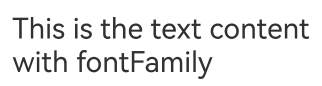
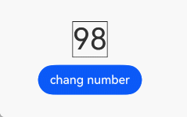
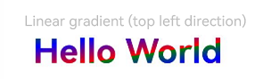

# Text Display (Text/Span)
<!--Kit: ArkUI-->
<!--Subsystem: ArkUI-->
<!--Owner: @xiangyuan6-->
<!--Designer: @xiangyuan6-->
<!--Tester: @jiaoaozihao-->
<!--Adviser: @Brilliantry_Rui-->


The **Text** component is used to display textual content. It can be bound to a custom text selection menu, allowing users to select features as needed. Additionally, you can extend this custom menu to add more options, further enhancing the user experience. The **Span** component is used to display inline text. 

For details, see [Text](../reference/apis-arkui/arkui-ts/ts-basic-components-text.md) and [Span](../reference/apis-arkui/arkui-ts/ts-basic-components-span.md).

For details, see [FAQs About Text Display (Text/Span)](./arkts-text-faq.md#faqs-about-text-display-textspan).

## Creating Text

You can create text in either of the following ways:


- Entering strings

  <!-- @[create_a_text_in_one_way](https://gitcode.com/openharmony/applications_app_samples/blob/master/code/DocsSample/ArkUISample/TextComponent/entry/src/main/ets/pages/text/CreateText.ets) -->
  
  ``` TypeScript
  // The value in the 'app.string.CreateText_Text_new' resource file is 'I am a piece of text'.
  Text($r('app.string.CreateText_Text_new'))
  ```


- Referencing Resource objects

  Resource reference types can be created using `$r`. The resource file is located at **/resources/base/element/string.json** with the following content:

  ```json
  {
    "string": [
      {
        "name": "module_desc",
        "value": "Module description"
      }
    ]
  }
  ```

  <!-- @[create_a_text_in_another_way](https://gitcode.com/openharmony/applications_app_samples/blob/master/code/DocsSample/ArkUISample/TextComponent/entry/src/main/ets/pages/text/CreateText.ets) -->
  
  ``` TypeScript
  // The value in the 'app.string.module_desc' resource file is 'Module description'.
  Text($r('app.string.module_desc'))
    .baselineOffset(0)
    .fontSize(30)
    .border({ width: 1 })
    .padding(10)
    .width(300)
  ```

  


## Adding Child Components

The [Span](../reference/apis-arkui/arkui-ts/ts-basic-components-span.md) component can only act as a child of the [Text](../reference/apis-arkui/arkui-ts/ts-basic-components-text.md) and [RichEditor](../reference/apis-arkui/arkui-ts/ts-basic-components-richeditor.md) components. You can add one or more **Span** child components to a **Text** component to display a piece of information, such as the product description and statement of commitment.

- Creating a **Span** component

  A **Span** component is only visible when embedded within a **Text** component. Using a **Span** independently displays no content. If both **Text** and **Span** content are configured, the **Span** content overrides the **Text** content.


  <!-- @[create_span](https://gitcode.com/openharmony/applications_app_samples/blob/master/code/DocsSample/ArkUISample/TextComponent/entry/src/main/ets/pages/text/TextSpan.ets) -->
  
  ``` TypeScript
  // The value in the 'app.string.TextSpan_textContent_text' resource file is 'I am Text'.
  Text($r('app.string.TextSpan_textContent_text')) {
    // The value in the 'app.string.TextSpan_textContent_span' resource file is 'I am Span'.
    Span($r('app.string.TextSpan_textContent_span'))
  }
  .padding(10)
  .borderWidth(1)
  ```

  

- Setting the text decoration

  Use the [decoration](../reference/apis-arkui/arkui-ts/ts-basic-components-span.md#decoration) attribute to set the style and color of the text decorative line.


  <!-- @[create_span_with_lines](https://gitcode.com/openharmony/applications_app_samples/blob/master/code/DocsSample/ArkUISample/TextComponent/entry/src/main/ets/pages/text/TextSpan.ets) -->
  
  ``` TypeScript
  Text() {
    // The value in the 'app.string.TextSpan_textContent_span_one' resource file is 'I am Span1'.
    Span($r('app.string.TextSpan_textContent_span_one'))
      .fontSize(16)
      .fontColor(Color.Grey)
      .decoration({ type: TextDecorationType.LineThrough, color: Color.Red })
    // The value in the 'app.string.TextSpan_textContent_span_two' resource file is 'I am Span2'.
    Span($r('app.string.TextSpan_textContent_span_two'))
      .fontColor(Color.Blue)
      .fontSize(16)
      .fontStyle(FontStyle.Italic)
      .decoration({ type: TextDecorationType.Underline, color: Color.Black })
    // The value in the 'app.string.TextSpan_textContent_span_three' resource file is 'I am Span3'.
    Span($r('app.string.TextSpan_textContent_span_three'))
      .fontSize(16)
      .fontColor(Color.Grey)
      .decoration({ type: TextDecorationType.Overline, color: Color.Green })
  }
  .borderWidth(1)
  .padding(10)
  ```

  

- Use the [textCase](../reference/apis-arkui/arkui-ts/ts-basic-components-span.md#textcase) attribute to set the text case.

  <!-- @[create_span_with_upper_case](https://gitcode.com/openharmony/applications_app_samples/blob/master/code/DocsSample/ArkUISample/TextComponent/entry/src/main/ets/pages/text/TextSpan.ets) -->
  
  ``` TypeScript
  Text() {
    Span('I am Upper-span').fontSize(12)
      .textCase(TextCase.UpperCase)
  }
  .borderWidth(1)
  .padding(10)
  ```

  

- Adding events

  Because **Span** components do not have independent size information, they only support the [onClick](../reference/apis-arkui/arkui-ts/ts-universal-events-click.md#onclick) and [onHover](../reference/apis-arkui/arkui-ts/ts-universal-events-hover.md#onhover) events.


  <!-- @[textspan_onhover](https://gitcode.com/openharmony/applications_app_samples/blob/master/code/DocsSample/ArkUISample/TextComponent/entry/src/main/ets/pages/text/TextSpanOnHover.ets) -->
  
  ``` TypeScript
  // xxx.ets
  import { hilog } from '@kit.PerformanceAnalysisKit';
  
  @Entry
  @Component
  export struct TextSpanOnHover {
    @State textStr1: string = '';
    @State textStr2: string = '';
  
    build() {
      NavDestination() {
        Row() {
          Column() {
            Text() {
              Span('I am Upper-span')
                .textCase(TextCase.UpperCase)
                .fontSize(30)
                .onClick(() => {
                  hilog.info(0x0000, 'Sample_TextComponent', 'Span onClick is triggering');
                  this.textStr1 = 'Span onClick is triggering';
                })
                .onHover(() => {
                  hilog.info(0x0000, 'Sample_TextComponent', 'Span onHover is triggering');
                  this.textStr2 = 'Span onHover is triggering';
                })
            }
  
            Text('onClick: ' + this.textStr1)
              .fontSize(20)
            Text('onHover: ' + this.textStr2)
              .fontSize(20)
          }.width('100%')
        }
        .height('100%')
      }
      // ···
    }
  }
  ```

  

## Creating a Custom Text Style

The **Text** component supports custom text style configuration. The following table lists the key attributes for text styling.

| Name| Description|
|---------|----------|
| baselineOffset | Offset of the text baseline.|
| contentTransition | Digital flip animation effect.|
| copyOption | Whether text can be copied and pasted.|
| decoration | Text decoration, such as the line style, color, and thickness.|
| enableAutoSpacing | Whether to enable automatic spacing between Chinese and Western characters.|
| enableDataDetector | Whether to enable recognition for special entities within the text.|
| font | Font-related properties.|
| fontColor | Text color.|
| fontFamily | Font family.|
| fontFeature | Typographic features, such as numeric width adjustment.|
| fontSize | Font size.|
| fontStyle | Font style.|
| fontWeight | Font weight.|
| halfLeading | Whether half leading is enabled.|
| heightAdaptivePolicy | Font size adjustment strategy for adaptive text layout.|
| letterSpacing | Letter spacing.|
| lineHeight | Line height.|
| lineSpacing | Spacing between lines.|
| marqueeOptions | Marquee behavior, including the enabled status, step, loop count, and direction.|
| maxFontSize | Maximum font size for adaptive scaling.|
| maxLines | Maximum number of visible lines.|
| minFontSize | Minimum font size for adaptive scaling.|
| optimizeTrailingSpace | Whether to optimize trailing spaces at line endings.|
| privacySensitive | Whether to enable privacy mode on widgets.|
| shaderStyle | Gradient color effect.|
| textCase | Text case conversion.|
| textAlign | Horizontal alignment mode of text paragraphs.|
| textIndent | Indent of the first line of text.|
| textOverflow | Handling of overflow text.|
| textSelectable | Whether text can be selected.|
| textVerticalAlign | Vertical alignment of text.|
| wordBreak | Word breaking rule.|

The following examples demonstrate usage of common APIs.

- Use the [textAlign](../reference/apis-arkui/arkui-ts/ts-basic-components-text.md#textalign) attribute to set the alignment mode of text.

  <!-- @[custom_text_align](https://gitcode.com/openharmony/applications_app_samples/blob/master/code/DocsSample/ArkUISample/TextComponent/entry/src/main/ets/pages/text/CustomTextStyle.ets) -->
  
  ``` TypeScript
  // The value in the 'app.string.TextAlign_Start' resource file is 'Left aligned'.
  Text($r('app.string.TextAlign_Start'))
    .width(300)
    .textAlign(TextAlign.Start)
    .border({ width: 1 })
    .padding(10)
  // The value in the 'app.string.TextAlign_Center' resource file is 'Center aligned'.
  Text($r('app.string.TextAlign_Center'))
    .width(300)
    .textAlign(TextAlign.Center)
    .border({ width: 1 })
    .padding(10)
  // The value in the 'app.string.TextAlign_End' resource file is 'Right aligned'.
  Text($r('app.string.TextAlign_End'))
    .width(300)
    .textAlign(TextAlign.End)
    .border({ width: 1 })
    .padding(10)
  ```

  

- Use the [textOverflow](../reference/apis-arkui/arkui-ts/ts-basic-components-text.md#textoverflow) attribute to set the display mode for when the text is too long. This attribute must be used together with [maxLines](../reference/apis-arkui/arkui-ts/ts-basic-components-text.md#maxlines). By default, the text is automatically wrapped. Since API version 18, when text overflow is set to marquee mode, you can configure marquee parameters such as enabled status, scroll step, loop count, and direction.

  <!-- @[custom_text_overflow](https://gitcode.com/openharmony/applications_app_samples/blob/master/code/DocsSample/ArkUISample/TextComponent/entry/src/main/ets/pages/text/CustomTextStyle.ets) -->
  
  ``` TypeScript
  Text('This is the setting of textOverflow to Clip text content This is the setting of textOverflow ' +
    'to None text content. This is the setting of textOverflow to Clip text content This is the setting ' +
    'of textOverflow to None text content.')
    .width(250)
    .textOverflow({ overflow: TextOverflow.None })
    .maxLines(1)
    .fontSize(12)
    .border({ width: 1 })
    .padding(10)
  // The value in the 'app.string.CustomTextStyle_textContent_epsis' resource file is
  // 'I am extra long text, with an ellipse displayed for any excess.'
  Text($r('app.string.CustomTextStyle_textContent_epsis'))
    .width(250)
    .textOverflow({ overflow: TextOverflow.Ellipsis })
    .maxLines(1)
    .fontSize(12)
    .border({ width: 1 })
    .padding(10)
  // The value in the 'app.string.CustomTextStyle_textContent_marq' resource file is
  // 'When the text overflows its size,
  // the text is displayed in scrolling mode.'
  Text($r('app.string.CustomTextStyle_textContent_marq'))
    .width(250)
    .textOverflow({ overflow: TextOverflow.MARQUEE })
    .maxLines(1)
    .fontSize(12)
    .border({ width: 1 })
    .padding(10)
  // The value in the 'app.string.CustomTextStyle_textContent_marq_def' resource file is
  // 'When text exceeds its container dimensions, it scrolls to display fully.
  // Custom marquee parameters can be configured.'
  Text($r('app.string.CustomTextStyle_textContent_marq_def'))
    .width(250)
    .textOverflow({ overflow: TextOverflow.MARQUEE })
    .maxLines(1)
    .fontSize(12)
    .border({ width: 1 })
    .padding(10)
    .marqueeOptions({
      start: true,
      fromStart: true,
      step: 6,
      loop: -1,
      delay: 0,
      fadeout: false,
      marqueeStartPolicy: MarqueeStartPolicy.DEFAULT
    })
  ```

  

- Use the [lineHeight](../reference/apis-arkui/arkui-ts/ts-basic-components-text.md#lineheight) attribute to set the text line height.

  <!-- @[custom_line_height](https://gitcode.com/openharmony/applications_app_samples/blob/master/code/DocsSample/ArkUISample/TextComponent/entry/src/main/ets/pages/text/CustomTextStyle.ets) -->
  
  ``` TypeScript
  Text('This is the text with the line height set. This is the text with the line height set.')
    .width(300).fontSize(12).border({ width: 1 }).padding(10)
  Text('This is the text with the line height set. This is the text with the line height set.')
    .width(300)
    .fontSize(12)
    .border({ width: 1 })
    .padding(10)
    .lineHeight(20)
  ```

  

- Use the [decoration](../reference/apis-arkui/arkui-ts/ts-basic-components-text.md#decoration) attribute to set the style, color, and thickness of the text decoration line.

  <!-- @[custom_text_line_and_color](https://gitcode.com/openharmony/applications_app_samples/blob/master/code/DocsSample/ArkUISample/TextComponent/entry/src/main/ets/pages/text/CustomTextStyle.ets) -->
  
  ``` TypeScript
  Text('This is the text')
    .decoration({
      type: TextDecorationType.LineThrough,
      color: Color.Red
    })
    .borderWidth(1).padding(15).margin(5)
  Text('This is the text')
    .decoration({
      type: TextDecorationType.Overline,
      color: Color.Red
    })
    .borderWidth(1).padding(15).margin(5)
  Text('This is the text')
    .decoration({
      type: TextDecorationType.Underline,
      color: Color.Red
    })
    .borderWidth(1).padding(15).margin(5)
  Text('This is the text')
    .decoration({
      type: TextDecorationType.Underline,
      color: Color.Blue,
      style: TextDecorationStyle.DASHED
    })
    .borderWidth(1).padding(15).margin(5)
  Text('This is the text')
    .decoration({
      type: TextDecorationType.Underline,
      color: Color.Blue,
      style: TextDecorationStyle.DOTTED
    })
    .borderWidth(1).padding(15).margin(5)
  Text('This is the text')
    .decoration({
      type: TextDecorationType.Underline,
      color: Color.Blue,
      style: TextDecorationStyle.DOUBLE
    })
    .borderWidth(1).padding(15).margin(5)
  Text('This is the text')
    .decoration({
      type: TextDecorationType.Underline,
      color: Color.Blue,
      style: TextDecorationStyle.WAVY,
      thicknessScale: 4
    })
    .borderWidth(1).padding(15).margin(5)
  ```

  

- Use the [baselineOffset](../reference/apis-arkui/arkui-ts/ts-basic-components-text.md#baselineoffset) attribute to set the baseline offset of the text.

  <!-- @[custom_text_baseline_offset](https://gitcode.com/openharmony/applications_app_samples/blob/master/code/DocsSample/ArkUISample/TextComponent/entry/src/main/ets/pages/text/CustomTextStyle.ets) -->
  
  ``` TypeScript
  Text('This is the text content with baselineOffset 0.')
    .baselineOffset(0)
    .fontSize(12)
    .border({ width: 1 })
    .padding(10)
    .width('100%')
    .margin(5)
  Text('This is the text content with baselineOffset 30.')
    .baselineOffset(30)
    .fontSize(12)
    .border({ width: 1 })
    .padding(10)
    .width('100%')
    .margin(5)
  Text('This is the text content with baselineOffset -20.')
    .baselineOffset(-20)
    .fontSize(12)
    .border({ width: 1 })
    .padding(10)
    .width('100%')
    .margin(5)
  ```

  

- Use the [letterSpacing](../reference/apis-arkui/arkui-ts/ts-basic-components-text.md#letterspacing) attribute to set the letter spacing.

  <!-- @[custom_text_letter_space](https://gitcode.com/openharmony/applications_app_samples/blob/master/code/DocsSample/ArkUISample/TextComponent/entry/src/main/ets/pages/text/CustomTextStyle.ets) -->
  
  ``` TypeScript
  Text('This is the text content with letterSpacing 0.')
    .letterSpacing(0)
    .fontSize(12)
    .border({ width: 1 })
    .padding(10)
    .width('100%')
    .margin(5)
  Text('This is the text content with letterSpacing 3.')
    .letterSpacing(3)
    .fontSize(12)
    .border({ width: 1 })
    .padding(10)
    .width('100%')
    .margin(5)
  Text('This is the text content with letterSpacing -1.')
    .letterSpacing(-1)
    .fontSize(12)
    .border({ width: 1 })
    .padding(10)
    .width('100%')
    .margin(5)
  ```

  

- Use the [minFontSize](../reference/apis-arkui/arkui-ts/ts-basic-components-text.md#minfontsize) and [maxFontSize](../reference/apis-arkui/arkui-ts/ts-basic-components-text.md#maxfontsize) attributes

  to set the minimum and maximum font size, respectively. For the settings to take effect, these attributes must be used together with [maxLines](../reference/apis-arkui/arkui-ts/ts-basic-components-text.md#maxlines) or layout constraint settings.

  <!-- @[custom_the_size_of_text](https://gitcode.com/openharmony/applications_app_samples/blob/master/code/DocsSample/ArkUISample/TextComponent/entry/src/main/ets/pages/text/CustomTextStyle.ets) -->
  
  ``` TypeScript
  // The value in the 'app.string.CustomTextStyle_textContent_one_style' resource file is 'My maximum font size is 30, minimum font size is 5, width is 250, and maximum number of lines is 1'.
  Text($r('app.string.CustomTextStyle_textContent_one_style'))
    .width(250)
    .maxLines(1)
    .maxFontSize(30)
    .minFontSize(5)
    .border({ width: 1 })
    .padding(10)
    .margin(5)
  // The value in the 'app.string.CustomTextStyle_textContent_two_style' resource file is 'My maximum font size is 30, minimum font size is 5, width is 250, and maximum number of lines is 2'.
  Text($r('app.string.CustomTextStyle_textContent_two_style'))
    .width(250)
    .maxLines(2)
    .maxFontSize(30)
    .minFontSize(5)
    .border({ width: 1 })
    .padding(10)
    .margin(5)
  // The value in the 'app.string.CustomTextStyle_textContent_no_max' resource file is 'My maximum font size is 30, minimum font size is 15, width is 250, and line height is 50'.
  Text($r('app.string.CustomTextStyle_textContent_no_max'))
    .width(250)
    .height(50)
    .maxFontSize(30)
    .minFontSize(15)
    .border({ width: 1 })
    .padding(10)
    .margin(5)
  // The value in the 'app.string.CustomTextStyle_textContent_high' resource file is 'My maximum font size is 30, minimum font size is 15, width is 250, and line height is 100'.
  Text($r('app.string.CustomTextStyle_textContent_high'))
    .width(250)
    .height(100)
    .maxFontSize(30)
    .minFontSize(15)
    .border({ width: 1 })
    .padding(10)
    .margin(5)
  ```

  

- Use the [textCase](../reference/apis-arkui/arkui-ts/ts-basic-components-text.md#textcase) attribute to set the text case.

  <!-- @[custom_the_text_by_text_case](https://gitcode.com/openharmony/applications_app_samples/blob/master/code/DocsSample/ArkUISample/TextComponent/entry/src/main/ets/pages/text/CustomTextStyle.ets) -->
  
  ``` TypeScript
  Text('This is the text content with textCase set to Normal.')
    .textCase(TextCase.Normal)
    .padding(10)
    .border({ width: 1 })
    .padding(10)
    .margin(5)
  
  // The text is displayed in lowercase.
  Text('This is the text content with textCase set to LowerCase.')
    .textCase(TextCase.LowerCase)
    .border({ width: 1 })
    .padding(10)
    .margin(5)
  
  // The text is displayed in uppercase.
  Text('This is the text content with textCase set to UpperCase.')
    .textCase(TextCase.UpperCase)
    .border({ width: 1 })
    .padding(10)
    .margin(5)
  ```
  
  

- Use the [copyOption](../reference/apis-arkui/arkui-ts/ts-basic-components-text.md#copyoption9) attribute to set whether copy and paste is allowed.

  <!-- @[custom_the_text_by_copy_option](https://gitcode.com/openharmony/applications_app_samples/blob/master/code/DocsSample/ArkUISample/TextComponent/entry/src/main/ets/pages/text/CustomTextStyle.ets) -->
  
  ``` TypeScript
  // The value in the 'app.string.CustomTextStyle_textContent_incopy' resource file is 'This text is copyable'.
  Text($r('app.string.CustomTextStyle_textContent_incopy'))
    .fontSize(30)
    .copyOption(CopyOptions.InApp)
  ```

  

- Use the [fontFamily](../reference/apis-arkui/arkui-ts/ts-basic-components-text.md#fontfamily) attribute to specify font families. The 'HarmonyOS Sans' font and [registered custom fonts](../reference/apis-arkui/js-apis-font.md) are supported for applications.

  <!-- @[custom_the_text_fontFamily](https://gitcode.com/openharmony/applications_app_samples/blob/master/code/DocsSample/ArkUISample/TextComponent/entry/src/main/ets/pages/text/CustomTextStyle.ets) -->
  
  ``` TypeScript
  Text('This is the text content with fontFamily')
    .fontSize(30)
    .fontFamily('HarmonyOS Sans')
  ```

  

- Since API version 20, you can use the [contentTransition](../reference/apis-arkui/arkui-ts/ts-basic-components-text.md#contenttransition20) attribute to configure digital flip animation effects.

  <!-- @[Content_Transition](https://gitcode.com/openharmony/applications_app_samples/blob/master/code/DocsSample/ArkUISample/TextComponent/entry/src/main/ets/pages/text/ContentTransition.ets) -->
  
  ``` TypeScript
  
  @Entry
  @Component
  export struct ContentTransition {
    private static readonly INITIAL_SCORE: number = 98;
    @State number: number = ContentTransition.INITIAL_SCORE;
    @State numberTransition: NumericTextTransition =
      new NumericTextTransition({ flipDirection: FlipDirection.DOWN, enableBlur: false });
    build() {
      NavDestination() {
        Column() {
          Text(this.number + '')
            .borderWidth(1)
            .fontSize(40)
            .contentTransition(this.numberTransition)
          Button('chang number')
            .onClick(() => {
              this.number++
            })
            .margin(10)
        }
        .width('100%')
        .height('100%')
      }
      // ···
    }
  }
  ```
  

- Since API version 20, you can use [optimizeTrailingSpace](../reference/apis-arkui/arkui-ts/ts-basic-components-text.md#optimizetrailingspace20) to control whether trailing spaces at the end of each line are optimized during text layout. This addresses alignment issues caused by trailing spaces.

  <!-- @[Last_space](https://gitcode.com/openharmony/applications_app_samples/blob/master/code/DocsSample/ArkUISample/TextComponent/entry/src/main/ets/pages/text/TextLayout.ets) -->
  
  ``` TypeScript
  Column() {
    // Trailing spaces at the end of each line are optimized.
    Text('Trimmed space enabled     ')
      .fontSize(30)
      .fontWeight(FontWeight.Bold)
      .margin({ top: 20 })
      .optimizeTrailingSpace(true)
      .textAlign(TextAlign.Center)
    // Trailing spaces at the end of each line are not optimized.
    Text('Trimmed space disabled     ')
      .fontSize(30)
      .fontWeight(FontWeight.Bold)
      .margin({ top: 20 })
      .optimizeTrailingSpace(false)
      .textAlign(TextAlign.Center)
  }
  ```

  

- Since API version 20, you can use [lineSpacing](../reference/apis-arkui/arkui-ts/ts-basic-components-text.md#linespacing20) to configure text line spacing. If [LineSpacingOptions](../reference/apis-arkui/arkui-ts/ts-text-common.md#linespacingoptions20) is not specified, line spacing is applied above the first line and below the last line by default. When **onlyBetweenLines** is set to **true**, line spacing is applied only between lines, with no extra spacing above the first line.

  <!-- @[Line_Spacing](https://gitcode.com/openharmony/applications_app_samples/blob/master/code/DocsSample/ArkUISample/TextComponent/entry/src/main/ets/pages/text/LineSpacing.ets) -->
  
  ``` TypeScript
  import { LengthMetrics } from '@kit.ArkUI';
  
  @Extend(Text)
  function style() {
    .width(250)
    .height(100)
    .maxFontSize(30)
    .minFontSize(15)
    .border({ width: 1 })
  }
  
  @Entry
  @Component
  export struct LineSpacing {
    build() {
      NavDestination() {
        Column() {
          Text('The line spacing of this context is set to 20_px, and the spacing is effective only between the lines.')
            .lineSpacing(LengthMetrics.px(20), { onlyBetweenLines: true })
            .style()
        }
      }
      // ···
    }
  }
  ```

  

- Since API version 20, use [enableAutoSpacing](../reference/apis-arkui/arkui-ts/ts-basic-components-text.md#enableautospacing20) to enable automatic spacing between Chinese and English characters.

  <!-- @[Enable_AutoSpacing](https://gitcode.com/openharmony/applications_app_samples/blob/master/code/DocsSample/ArkUISample/TextComponent/entry/src/main/ets/pages/text/EnableAutoSpacing.ets) -->
  
  ``` TypeScript
  @Entry
  @Component
  export struct EnableAutoSpacing {
    @State enableSpacing: boolean = false;
  
    build() {
      NavDestination() {
      Column() {
        Row({ space: 20 }) {
          // The value in the 'app.string.Enable_automatic_spacing' resource file is 'Enable automatic spacing'.
          Button($r('app.string.Enable_automatic_spacing'))
            .onClick(() => this.enableSpacing = true)
            .backgroundColor(this.enableSpacing ? '#4CAF50' : '#E0E0E0')
            .fontColor(this.enableSpacing ? Color.White : Color.Black)
  
          // The value in the 'app.string.off_automatic_spacing' resource file is 'Disable automatic spacing'.
          Button($r('app.string.off_automatic_spacing'))
            .onClick(() => this.enableSpacing = false)
            .backgroundColor(!this.enableSpacing ? '#F44336' : '#E0E0E0')
            .fontColor(!this.enableSpacing ? Color.White : Color.Black)
        }
        .width('100%')
        .justifyContent(FlexAlign.Center)
        .margin({ top: 30, bottom: 20 })
  
        // The value in the 'app.string.Automatic_spacing_has_been_enabled' resource file is 'Current status: Automatic spacing enabled.'
        // The value in the 'app.string.Automatic_spacing_has_been_turned_off' resource file is 'Current status: Automatic spacing disabled.'
        Text(this.enableSpacing ? $r('app.string.Automatic_spacing_has_been_enabled') : $r('app.string.Automatic_spacing_has_been_turned_off'))
          .fontSize(16)
          .fontColor(this.enableSpacing ? '#4CAF50' : '#F44336')
          .margin({ bottom: 20 })
  
        // Set whether to enable automatic spacing between Chinese and English characters.
        // The value in the 'app.string.Chinese_and_Western_Auto_Spacing_automatic_spacing' resource file is 'Automatic Spacing Between Chinese and Western Characters'.
        Text($r('app.string.Chinese_and_Western_Auto_Spacing_automatic_spacing'))
          .fontSize(24)
          .padding(15)
          .backgroundColor('#F5F5F5')
          .width('90%')
          .enableAutoSpacing(this.enableSpacing)
      }
      .width('100%')
      .height('100%')
      .padding(20)
      }
      // ···
    }
  }
  ```


- Since API version 20, you can use [shaderStyle](../reference/apis-arkui/arkui-ts/ts-basic-components-text.md#shaderstyle20) to apply gradient color effects to text.

  <!-- @[Shader_Style](https://gitcode.com/openharmony/applications_app_samples/blob/master/code/DocsSample/ArkUISample/TextComponent/entry/src/main/ets/pages/text/ShaderStyle.ets) -->
  
  ``` TypeScript
  @Entry
  @Component
  export struct ShaderStyle {
    @State message: string = 'Hello World';
    @State linearGradientOptions: LinearGradientOptions =
      {
        direction: GradientDirection.LeftTop,
        colors: [[Color.Red, 0.0], [Color.Blue, 0.3], [Color.Green, 0.5]],
        repeating: true,
      };
  
    build() {
      NavDestination() {
        Column({ space: 5 }) {
          // The value in the 'app.string.direction_LeftTop' resource file is 'Linear gradient (top left direction)'.
          Text($r('app.string.direction_LeftTop')).fontSize(18).width('90%').fontColor(0xCCCCCC)
            .margin({ top: 40, left: 40 })
          Text(this.message)
            .fontSize(50)
            .width('80%')
            .height(50)
            .shaderStyle(this.linearGradientOptions)
        }
        .height('100%')
        .width('100%')
      }
      // ···
    }
  }
  ```

  

## Adding Events

You can bind the **Text** component to the [onClick](../reference/apis-arkui/arkui-ts/ts-universal-events-click.md#onclick), [onTouch](../reference/apis-arkui/arkui-ts/ts-universal-events-touch.md#ontouch), or other universal events to respond to user operations.

  <!-- @[General_Events](https://gitcode.com/openharmony/applications_app_samples/blob/master/code/DocsSample/ArkUISample/TextComponent/entry/src/main/ets/pages/text/GeneralEvents.ets) -->
  
  ``` TypeScript
  // xxx.ets
  import { hilog } from '@kit.PerformanceAnalysisKit';
  @Entry
  @Component
  export struct GeneralEvents {
    @State textStr1: string = '';
    @State textStr2: string = '';
  
    build() {
      NavDestination() {
        Row() {
          Column() {
            Text('This is a text component.')
              .fontSize(30)
              .onClick(() => {
                hilog.info(0x0000, 'Sample_TextComponent', 'Text onClick is triggering');
                this.textStr1 = 'Text onClick is triggering';
              })
              .onTouch(() => {
                hilog.info(0x0000, 'Sample_TextComponent', 'Text onTouch is triggering');
                this.textStr2 = 'Text onTouch is triggering';
              })
            Text('onClick: ' + this.textStr1)
              .fontSize(20)
            Text('onTouch: ' + this.textStr2)
              .fontSize(20)
          }.width('100%')
        }
        .height('100%')
      }
      // ···
    }
  }
  ```


## Setting Vertical Alignment

Since API version 20, use the [textVerticalAlign](../reference/apis-arkui/arkui-ts/ts-basic-components-text.md#textverticalalign20) attribute to vertically align text paragraphs.

  - The following example demonstrates how to use the **textVerticalAlign** attribute to center text vertically:

    <!-- @[text_VerticalAlign](https://gitcode.com/openharmony/applications_app_samples/blob/master/code/DocsSample/ArkUISample/TextComponent/entry/src/main/ets/pages/text/TextLayout.ets) -->
    
    ``` TypeScript
    // Replace $r('app.media.startIcon') with the image resource file you use.
    Text() {
      Span('Hello')
        .fontSize(50)
      ImageSpan($r('app.media.startIcon'))
        .width(30).height(30)
        .verticalAlign(ImageSpanAlignment.FOLLOW_PARAGRAPH)
      Span('World')
    }
    .textVerticalAlign(TextVerticalAlign.CENTER)
    ```

    

## Configuring the Selection Menu

### Displaying the Selection Menu

  - When text is selected, a menu containing the copy, translate, and search options is displayed.

    The [copyOption](../reference/apis-arkui/arkui-ts/ts-basic-components-text.md#copyoption9) attribute must be set for text selection to be enabled.

    <!-- @[copy_Option](https://gitcode.com/openharmony/applications_app_samples/blob/master/code/DocsSample/ArkUISample/TextComponent/entry/src/main/ets/pages/text/TextLayout.ets) -->
    
    ``` TypeScript
    // The value in the 'app.string.selected_menu' resource file is 'This is text used to demonstrate the selection menu.'
    Text($r('app.string.selected_menu'))
      .fontSize(30)
      .copyOption(CopyOptions.InApp)
    ```


  - Use the [bindSelectionMenu](../reference/apis-arkui/arkui-ts/ts-basic-components-text.md#bindselectionmenu11) attribute to bind a custom selection menu to the **Text** component.

    <!-- @[set_selection_menu_with_bindselectionmenu](https://gitcode.com/openharmony/applications_app_samples/blob/master/code/DocsSample/ArkUISample/TextComponent/entry/src/main/ets/pages/text/SelectMenu.ets) -->
    
    ``` TypeScript
    controller: TextController = new TextController();
    options: TextOptions = { controller: this.controller };
    ```

    <!-- @[set_selection_menu_with_bindselectionmenu_sec](https://gitcode.com/openharmony/applications_app_samples/blob/master/code/DocsSample/ArkUISample/TextComponent/entry/src/main/ets/pages/text/SelectMenu.ets) -->
    
    ``` TypeScript
    // The value in the 'app.string.show_selected_menu' resource file is 'This is text used to demonstrate the selection menu.'
    Text($r('app.string.show_selected_menu'), this.options)
      .fontSize(30)
      .copyOption(CopyOptions.InApp)
      .bindSelectionMenu(TextSpanType.TEXT, this.RightClickTextCustomMenu, TextResponseType.RIGHT_CLICK, {
        onAppear: () => {
          // The value in the 'app.string.SelectMenu_Text_Ejected' resource file is 'This callback is triggered when the custom selection menu is displayed.'
          hilog.info(0x0000, 'Sample_TextComponent',
            resource.resourceToString($r('app.string.SelectMenu_Text_Ejected')));
        },
        onDisappear: () => {
          // The value in the 'SelectMenu_Text_Close' resource file is 'This callback is triggered when the custom selection menu is closed.'
          hilog.info(0x0000, 'Sample_TextComponent',
            resource.resourceToString($r('app.string.SelectMenu_Text_Close')));
        }
      })
    ```

    <!-- @[Right_Click_Text_CustomMenu](https://gitcode.com/openharmony/applications_app_samples/blob/master/code/DocsSample/ArkUISample/TextComponent/entry/src/main/ets/pages/text/SelectMenu.ets) -->
    
    ``` TypeScript
    // Define menu items.
    @Builder
    RightClickTextCustomMenu() {
      Column() {
        Menu() {
          MenuItemGroup() {
            // Replace $r('app.media.app_icon') with the image resource file you use.
            MenuItem({ startIcon: $r('app.media.app_icon'), content: 'CustomMenu One', labelInfo: '' })
              .onClick(() => {
                // Use the closeSelectionMenu API to close the menu.
                this.controller.closeSelectionMenu();
              })
            MenuItem({ startIcon: $r('app.media.app_icon'), content: 'CustomMenu Two', labelInfo: '' })
            MenuItem({ startIcon: $r('app.media.app_icon'), content: 'CustomMenu Three', labelInfo: '' })
          }
        }.backgroundColor('#F0F0F0')
      }
    }
    ```


  - Customize menu items by configuring the [editMenuOptions](../reference/apis-arkui/arkui-ts/ts-basic-components-text.md#editmenuoptions12) attribute of the **Text** component. You can set the text content, icons, and callbacks for extended menu items.

    <!-- @[set_selection_menu_with_editmenuoptions](https://gitcode.com/openharmony/applications_app_samples/blob/master/code/DocsSample/ArkUISample/TextComponent/entry/src/main/ets/pages/text/SelectMenu.ets) -->
    
    ``` TypeScript
    // The value in the 'app.string.show_selected_menu' resource file is 'This is text used to demonstrate the selection menu.'
    Text($r('app.string.show_selected_menu'))
      .fontSize(20)
      .copyOption(CopyOptions.LocalDevice)
      .editMenuOptions({
        onCreateMenu: this.onCreateMenu, onMenuItemClick: this.onMenuItemClick
      })
    ```

    <!-- @[onCreate_Menu](https://gitcode.com/openharmony/applications_app_samples/blob/master/code/DocsSample/ArkUISample/TextComponent/entry/src/main/ets/pages/text/SelectMenu.ets) -->
    
    ``` TypeScript
    // Define onCreateMenu and onMenuItemClick.
    // Replace $r('app.media.app_icon') with the image resource file you use.
    onCreateMenu = (menuItems: Array<TextMenuItem>) => {
      let item1: TextMenuItem = {
        content: 'customMenu1',
        icon: $r('app.media.app_icon'),
        id: TextMenuItemId.of('customMenu1'),
      };
      let item2: TextMenuItem = {
        content: 'customMenu2',
        id: TextMenuItemId.of('customMenu2'),
        icon: $r('app.media.app_icon'),
      };
      menuItems.push(item1);
      menuItems.unshift(item2);
      return menuItems;
    }
    onMenuItemClick = (menuItem: TextMenuItem, textRange: TextRange) => {
      if (menuItem.id.equals(TextMenuItemId.of('customMenu2'))) {
        // The value in the 'app.string.SelectMenu_Text_customMenu' resource file is 'Intercept id: customMenu2 start:'.
        hilog.info(0x0000, 'Sample_TextComponent',
          resource.resourceToString($r('app.string.SelectMenu_Text_customMenu')) + textRange.start + '; end:' +
          textRange.end);
        return true;
      }
      if (menuItem.id.equals(TextMenuItemId.COPY)) {
        // The value in the 'app.string.SelectMenu_Text_copy' resource file is 'Intercept COPY start:'.
        hilog.info(0x0000, 'Sample_TextComponent',
          resource.resourceToString($r('app.string.SelectMenu_Text_copy')) + textRange.start + '; end:' + textRange.end);
        return true;
      }
      if (menuItem.id.equals(TextMenuItemId.SELECT_ALL)) {
        // The value in the 'app.string.SelectMenu_Text_SelectionAll' resource file is 'Do not intercept SELECT_ALL start:'.
        hilog.info(0x0000, 'Sample_TextComponent',
          resource.resourceToString($r('app.string.SelectMenu_Text_SelectionAll')) + textRange.start + '; end:' +
          textRange.end);
        return false;
      }
      return false;
    };
    ```


### Closing the Selection Menu

  When using the **Text** component, you can close the selection state and menu by clicking blank areas in the following scenarios:

  - Clicking blank areas within the **Text** component's layout boundaries closes the selection state and menu.
  - Clicking blank areas outside the **Text** component requires the [selection](../reference/apis-arkui/arkui-ts/ts-basic-components-text.md#selection11) attribute to be set on the **Text** component. Example:

    <!-- @[Selection_Change](https://gitcode.com/openharmony/applications_app_samples/blob/master/code/DocsSample/ArkUISample/TextComponent/entry/src/main/ets/pages/text/SelectionChange.ets) -->
    
    ``` TypeScript
    // xxx.ets
    @Entry
    @Component
    export struct SelectionChange {
      @State text: string =
        'This is set selection to Selection text content This is set selection to Selection text content.';
      @State start: number = 0;
      @State end: number = 20;
    
      build() {
        NavDestination() {
          Flex({ direction: FlexDirection.Column, alignItems: ItemAlign.Start, justifyContent: FlexAlign.Start }) {
            Text(this.text)
              .fontSize(12)
              .border({ width: 1 })
              .lineHeight(20)
              .margin(30)
              .copyOption(CopyOptions.InApp)
              .selection(this.start, this.end)
              .onTextSelectionChange((selectionStart, selectionEnd) => {
                // Update the selection range position.
                this.start = selectionStart;
                this.end = selectionEnd;
              })
          }
          .height(600)
          .width(335)
          .borderWidth(1)
          .onClick(() => {
            // Listen for click events on the parent component and clear the selection by setting start and end positions to -1.
            this.start = -1;
            this.end = -1;
          })
        }
        // ···
      }
    }
    ```

### Disabling System Service Menu Items

- Since API version 20, use [disableSystemServiceMenuItems](../reference/apis-arkui/arkts-apis-uicontext-textmenucontroller.md#disablesystemservicemenuitems20) to disable all system service menu items in the text selection menu.

  <!-- @[Service_MenuItems](https://gitcode.com/openharmony/applications_app_samples/blob/master/code/DocsSample/ArkUISample/TextComponent/entry/src/main/ets/pages/text/ServiceMenuItems.ets) -->
  
  ``` TypeScript
  import { TextMenuController } from '@kit.ArkUI';
  // xxx.ets
  @Entry
  @Component
  export struct ServiceMenuItems {
    aboutToAppear(): void {
      // Disable all system service menus.
      TextMenuController.disableSystemServiceMenuItems(true);
    }
  
    aboutToDisappear(): void {
      // Restore system service menu items when the page disappears.
      TextMenuController.disableSystemServiceMenuItems(false);
    }
    build() {
      NavDestination() {
        Row() {
          Column() {
            // The value in the 'app.string.Service_MenuItems_Text' resource file is 'This is a piece of text. Long press to display the text selection menu.'
            Text($r('app.string.Service_MenuItems_Text'))
              .height(60)
              .fontStyle(FontStyle.Italic)
              .fontWeight(FontWeight.Bold)
              .textAlign(TextAlign.Center)
              .copyOption(CopyOptions.InApp)
              .editMenuOptions({
                onCreateMenu: (menuItems: Array<TextMenuItem>) => {
                  // menuItems does not contain the disabled system menu items.
                  return menuItems;
                },
                onMenuItemClick: (menuItem: TextMenuItem, textRange: TextRange) => {
                  return false;
                }
              })
          }.width('100%')
        }
        .height('100%')
      }
      // ···
    }
  }
  ```


- Since API version 20, use [disableMenuItems](../reference/apis-arkui/arkts-apis-uicontext-textmenucontroller.md#disablemenuitems20) to disable specified system service menu items in the text selection menu.

  <!-- @[Disable_MenuItems](https://gitcode.com/openharmony/applications_app_samples/blob/master/code/DocsSample/ArkUISample/TextComponent/entry/src/main/ets/pages/text/DisableMenuItems.ets) -->
  
  ``` TypeScript
  import { TextMenuController } from '@kit.ArkUI';
  
  // xxx.ets
  @Entry
  @Component
  export struct DisableMenuItems {
    aboutToAppear(): void {
      // Disable the search menu item.
      TextMenuController.disableMenuItems([TextMenuItemId.SEARCH])
    }
  
    aboutToDisappear(): void {
      // Restore system service menu items.
      TextMenuController.disableMenuItems([])
    }
  
    build() {
      NavDestination() {
        Row() {
          Column() {
            // The value in the 'app.string.Service_MenuItems_Text' resource file is 'This is a piece of text. Long press to display the text selection menu.'
            Text($r('app.string.Service_MenuItems_Text'))
              .height(60)
              .fontStyle(FontStyle.Italic)
              .fontWeight(FontWeight.Bold)
              .textAlign(TextAlign.Center)
              .copyOption(CopyOptions.InApp)
              .editMenuOptions({
                onCreateMenu: (menuItems: Array<TextMenuItem>) => {
                  // menuItems does not contain the search menu item.
                  return menuItems;
                },
                onMenuItemClick: (menuItem: TextMenuItem, textRange: TextRange) => {
                  return false
                }
              })
          }.width('100%')
        }
        .height('100%')
      }
      // ···
    }
  }
  ```
  


### Customizing the Default Menu Refresh Behavior

Since API version 20, the [onPrepareMenu](../reference/apis-arkui/arkui-ts/ts-text-common.md#properties-1) callback is triggered before the menu is displayed when the text selection range changes. You can configure menu data within this callback.

  <!-- @[Prepare_Menu](https://gitcode.com/openharmony/applications_app_samples/blob/master/code/DocsSample/ArkUISample/TextComponent/entry/src/main/ets/pages/text/PrepareMenu.ets) -->
  
  ``` TypeScript
  // Replace $r('app.media.xxx') with the image resource file you use.
  // xxx.ets
  import { hilog } from '@kit.PerformanceAnalysisKit';
  const DOMAIN = 0x0000;
  @Entry
  @Component
  
  export struct PrepareMenu {
    @State text: string = 'Text editMenuOptions';
    @State endIndex: number = 0;
    onCreateMenu = (menuItems: Array<TextMenuItem>) => {
      let item1: TextMenuItem = {
        content: 'create1',
        icon: $r('app.media.startIcon'),
        id: TextMenuItemId.of('create1'),
      };
      let item2: TextMenuItem = {
        content: 'create2',
        id: TextMenuItemId.of('create2'),
        icon: $r('app.media.startIcon'),
      };
      menuItems.push(item1);
      menuItems.unshift(item2);
      return menuItems;
    }
    onMenuItemClick = (menuItem: TextMenuItem, textRange: TextRange) => {
      if (menuItem.id.equals(TextMenuItemId.of('create2'))) {
        hilog.info(DOMAIN, 'testTag', '%{public}s', 'intercept id: create2 start:' + textRange.start + '; end:' + textRange.end);
        return true;
      }
      if (menuItem.id.equals(TextMenuItemId.of('prepare1'))) {
        hilog.info(DOMAIN, 'testTag', '%{public}s', 'intercept id: prepare1 start:' + textRange.start + '; end:' + textRange.end);
        return true;
      }
      if (menuItem.id.equals(TextMenuItemId.COPY)) {
        hilog.info(DOMAIN, 'testTag', '%{public}s', 'intercept COPY start:' + textRange.start + '; end:' + textRange.end);
        return true;
      }
      if (menuItem.id.equals(TextMenuItemId.SELECT_ALL)) {
        hilog.info(DOMAIN, 'testTag', '%{public}s', 'No interception SELECT_ALL start:' + textRange.start + '; end:' + textRange.end);
        return false;
      }
      return false;
    }
    onPrepareMenu = (menuItems: Array<TextMenuItem>) => {
      let item1: TextMenuItem = {
        content: 'prepare1_' + this.endIndex,
        icon: $r('app.media.startIcon'),
        id: TextMenuItemId.of('prepare1'),
      };
      menuItems.unshift(item1);
      return menuItems;
    }
    @State editMenuOptions: EditMenuOptions = {
      onCreateMenu: this.onCreateMenu,
      onMenuItemClick: this.onMenuItemClick,
      onPrepareMenu: this.onPrepareMenu
    };
  
    build() {
      NavDestination() {
      Column() {
        Text(this.text)
          .fontSize(20)
          .copyOption(CopyOptions.LocalDevice)
          .editMenuOptions(this.editMenuOptions)
          .margin({ top: 100 })
          .onTextSelectionChange((selectionStart: number, selectionEnd: number) => {
            this.endIndex = selectionEnd;
          })
      }
      .width('90%')
      .margin('5%')
      }
      // ···
    }
  }
  ```
  


## Configuring the AI Menu

The **Text** component enables AI menu display through the [enableDataDetector](../reference/apis-arkui/arkui-ts/ts-basic-components-text.md#enabledatadetector11) and [dataDetectorConfig](../reference/apis-arkui/arkui-ts/ts-basic-components-text.md#datadetectorconfig11) attributes. The AI menu appears in the following scenarios: (1) Clicking an AI entity (recognizable content such as addresses and email addresses) displays entity recognition options. (2) After text selection, entity recognition options appear in both the text selection menu and right-click context menu.

>  **NOTE**
>
>  Since API version 20, entity recognition options can be displayed in both text selection menus and right-click context menus. This feature takes effect when [enableDataDetector](../reference/apis-arkui/arkui-ts/ts-basic-components-text.md#enabledatadetector11) is set to **true** and [copyOption](../reference/apis-arkui/arkui-ts/ts-basic-components-text.md#copyoption9) is set to** CopyOptions.LocalDevice**. The menu options include **url** (opening a link), **email** (creating an email), **phoneNumber** (calling), **address** (navigating to the location), and **dateTime** (creating a calendar reminder) in [TextMenuItemId](../reference/apis-arkui/arkui-ts/ts-text-common.md#textmenuitemid12).
>
>  The selection range must encompass a complete AI entity for the corresponding options to appear.

- To display entity recognition options when AI entities are clicked, set [enableDataDetector](../reference/apis-arkui/arkui-ts/ts-basic-components-text.md#enabledatadetector11) to **true**.
- To display entity recognition options in both text selection menus and right-click context menus, set [enableDataDetector](../reference/apis-arkui/arkui-ts/ts-basic-components-text.md#enabledatadetector11) to **true** and [copyOption](../reference/apis-arkui/arkui-ts/ts-basic-components-text.md#copyoption9) to **CopyOptions.LocalDevice**. The following is an example:
  <!-- @[set_ai_menu](https://gitcode.com/openharmony/applications_app_samples/blob/master/code/DocsSample/ArkUISample/TextComponent/entry/src/main/ets/pages/text/AIMenu.ets) -->
  
  ``` TypeScript
  // The value in the 'app.string.AIMenu_Text_One' resource file is 'Phone number: (86) (755) ********'  ********  \n \n 'URL: ' 'www.********.com'
  // \n \n Email: ***@example.com\n \n Address: XX District, XX City, XX Province \n \n Time: XX'
  Text($r('app.string.AIMenu_Text_One'))
    .fontSize(16)
    .copyOption(CopyOptions.LocalDevice)
    .enableDataDetector(true) // Enable entity recognition.
    .dataDetectorConfig({
      // Configure recognition styles.
      // types can be PHONE_NUMBER (phone number), URL (link), EMAIL (email), ADDRESS (address), and DATE_TIME (time).
      // If types is set to null or [], all types of entities are recognized.
      types: [], onDetectResultUpdate: (result: string) => {
      }
    })
  ```
  

- Use [dataDetectorConfig](../reference/apis-arkui/arkui-ts/ts-basic-components-text.md#datadetectorconfig11) to customize entity recognition styles. For details, see [TextDataDetectorConfig](../reference/apis-arkui/arkui-ts/ts-text-common.md#textdatadetectorconfig11).
- Use [editMenuOptions](../reference/apis-arkui/arkui-ts/ts-basic-components-text.md#editmenuoptions12) to adjust the menu position. For implementation details, see [Example 12: Setting Custom Menu Extensions](../reference/apis-arkui/arkui-ts/ts-basic-components-text.md#example-12-setting-custom-menu-extensions).
<!--RP2--><!--RP2End-->

## Implementing Hot Search Rankings

This example demonstrates how to implement a hot search list using the **maxLines**, **textOverflow**, **textAlign**, and **constraintSize** attributes.

  <!-- @[the_text_fact_example](https://gitcode.com/openharmony/applications_app_samples/blob/master/code/DocsSample/ArkUISample/TextComponent/entry/src/main/ets/pages/text/TextHotSearch.ets) -->
  
  ``` TypeScript
  import { ComponentCard } from '../../common/Card';
  
  @Entry
  @Component
  export struct TextHotSearch {
    build() {
      NavDestination() {
        Column({ space: 12 }) {
          // ···
            Column() {
              Row() {
                Text('1').fontSize(14).fontColor(Color.Red).margin({ left: 10, right: 10 })
                // The value in the 'app.string.TextHotSearch_textContent_one' resource file is 'I am entry 1'.
                Text($r('app.string.TextHotSearch_textContent_one'))
                  .fontSize(12)
                  .fontColor(Color.Blue)
                  .maxLines(1)
                  .textOverflow({ overflow: TextOverflow.Ellipsis })
                  .fontWeight(300)
                // The value in the 'app.string.TextHotSearch_textContent_two' resource file is 'Top Hit'.
                Text($r('app.string.TextHotSearch_textContent_two'))
                  .margin({ left: 6 })
                  .textAlign(TextAlign.Center)
                  .fontSize(10)
                  .fontColor(Color.White)
                  .fontWeight(600)
                  .backgroundColor(0x770100)
                  .borderRadius(5)
                  .width(15)
                  .height(14)
              }.width('100%').margin(5)
  
              Row() {
                Text('2').fontSize(14).fontColor(Color.Red).margin({ left: 10, right: 10 })
                // The value in the 'app.string.TextHotSearch_textContent_three' resource file is 'I am entry 2'.
                Text($r('app.string.TextHotSearch_textContent_three'))
                  .fontSize(12)
                  .fontColor(Color.Blue)
                  .fontWeight(300)
                  .constraintSize({ maxWidth: 200 })
                  .maxLines(1)
                  .textOverflow({ overflow: TextOverflow.Ellipsis })
                // The value in the 'app.string.TextHotSearch_textContent_four' resource file is 'Hot'.
                Text($r('app.string.TextHotSearch_textContent_four'))
                  .margin({ left: 6 })
                  .textAlign(TextAlign.Center)
                  .fontSize(10)
                  .fontColor(Color.White)
                  .fontWeight(600)
                  .backgroundColor(0xCC5500)
                  .borderRadius(5)
                  .width(15)
                  .height(14)
              }.width('100%').margin(5)
  
              Row() {
                Text('3').fontSize(14).fontColor(Color.Orange).margin({ left: 10, right: 10 })
                // The value in the 'app.string.TextHotSearch_textContent_five' resource file is 'I am entry 3'.
                Text($r('app.string.TextHotSearch_textContent_five'))
                  .fontSize(12)
                  .fontColor(Color.Blue)
                  .fontWeight(300)
                  .maxLines(1)
                  .constraintSize({ maxWidth: 200 })
                  .textOverflow({ overflow: TextOverflow.Ellipsis })
                // The value in the 'app.string.TextHotSearch_textContent_four' resource file is 'Hot'.
                Text($r('app.string.TextHotSearch_textContent_four'))
                  .margin({ left: 6 })
                  .textAlign(TextAlign.Center)
                  .fontSize(10)
                  .fontColor(Color.White)
                  .fontWeight(600)
                  .backgroundColor(0xCC5500)
                  .borderRadius(5)
                  .width(15)
                  .height(14)
              }.width('100%').margin(5)
  
              Row() {
                Text('4').fontSize(14).fontColor(Color.Grey).margin({ left: 10, right: 10 })
                // The value in the 'app.string.TextHotSearch_textContent_six' resource file is 'I am entry 4'.
                Text($r('app.string.TextHotSearch_textContent_six'))
                  .fontSize(12)
                  .fontColor(Color.Blue)
                  .fontWeight(300)
                  .constraintSize({ maxWidth: 200 })
                  .maxLines(1)
                  .textOverflow({ overflow: TextOverflow.Ellipsis })
              }.width('100%').margin(5)
            }.width('100%')
          // ···
        }
        .width('100%')
        .height('100%')
        .padding({ left: 12, right: 12 })
      }
      // ···
    }
  }
  ```
  


<!--RP1--><!--RP1End-->
