# Text Display (Text/Span)

<!--Kit: ArkUI-->
<!--Subsystem: ArkUI-->
<!--Owner: @xiangyuan6-->
<!--Designer: @xiangyuan6-->
<!--Tester: @jiaoaozihao-->
<!--Adviser: @Brilliantry_Rui-->
<!-- md-trans-meta sourceCommit=58aa1a9b8318e579a2b513b7ba023ee57b8ecdda translatedAt=2026-07-29T12:48:31.832Z pushedAt=2026-07-31T01:54:21.493Z -->

Text is a component used to display content in the user view, such as the text of an article. This component supports binding custom text selection menus, allowing users to choose different functions as needed. In addition, you can extend custom menus to enrich available options and further improve the user experience. Span is used to display inline text.

For details, see the API documentation for [Text](../reference/apis-arkui/arkui-ts/ts-basic-components-text.md) and [Span](../reference/apis-arkui/arkui-ts/ts-basic-components-span.md).

For FAQs, see [Text Display (Text/Span) FAQs](./arkts-text-faq.md#faqs-about-text-display-textspan).

## Creating Text

Text can be created in the following two ways:

- A string.

  <!-- @[create_a_text_in_one_way](https://gitcode.com/openharmony/applications_app_samples/blob/master/code/DocsSample/ArkUISample/TextComponent/entry/src/main/ets/pages/text/CreateText.ets) -->

  ``` TypeScript
  Text('I am a text segment.')
  ```

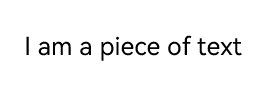

- Reference a Resource object.

  You can create a Resource type object via $r. The file is located at /resources/base/element/string.json, with the following content:

  ```json
  {
    "string": [
      {
        "name": "module_desc",
        "value": "Module description"
      }
    ]
  }
  ```

  <!-- @[create_a_text_in_another_way](https://gitcode.com/openharmony/applications_app_samples/blob/master/code/DocsSample/ArkUISample/TextComponent/entry/src/main/ets/pages/text/CreateText.ets) -->

  ``` TypeScript
  // Replace $r('app.string.module_desc') with the actual resource file. In this example, the value of the resource file is "Module description".
  Text($r('app.string.module_desc'))
    .baselineOffset(0)
    .fontSize(30)
    .border({ width: 1 })
    .padding(10)
    .width(300)
  ```

  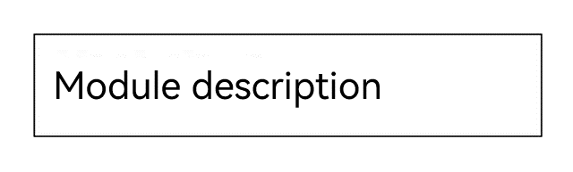

## Binding Text Events

The Text component supports universal events. You can bind events such as [onClick](../reference/apis-arkui/arkui-ts/ts-universal-events-click.md#onclick) and [onTouch](../reference/apis-arkui/arkui-ts/ts-universal-events-touch.md#ontouch) to respond to user operations.

The following example binds events to text, so that the content displayed below the text is refreshed when an event is triggered.

  <!-- @[General_Events](https://gitcode.com/openharmony/applications_app_samples/blob/master/code/DocsSample/ArkUISample/TextComponent/entry/src/main/ets/pages/text/GeneralEvents.ets) -->

  ``` TypeScript
  // xxx.ets
  import { hilog } from '@kit.PerformanceAnalysisKit';
  @Entry
  @Component
  struct GeneralEvents {
    @State textStr1: string = '';
    @State textStr2: string = '';
  
    build() {
      NavDestination() {
        Row() {
          Column() {
            Text('This is a text component.')
              .fontSize(30)
              .onClick(() => {
                hilog.info(0x0000, 'Sample_TextComponent', 'Text onClick is triggering');
                this.textStr1 = 'Text onClick is triggering';
              })
              .onTouch(() => {
                hilog.info(0x0000, 'Sample_TextComponent', 'Text onTouch is triggering');
                this.textStr2 = 'Text onTouch is triggering';
              })
            Text('onClick:' + this.textStr1)
              .fontSize(20)
            Text('onTouch:' + this.textStr2)
              .fontSize(20)
          }.width('100%')
        }
        .height('100%')
      }
      // ...
    }
  }
  ```


## Setting Text Styles

The Text component supports creating custom text styles. The following are the main attributes for modifying text styles.

| Attribute Name | Description |
|---------|----------|
| baselineOffset | Sets the offset of the text baseline. |
| contentTransition | Sets the number flip effect. |
| copyOption | Sets whether the text can be copied and pasted. |
| decoration | Sets the text decoration line style, such as type, color, and thickness. |
| enableAutoSpacing | Sets whether to enable automatic spacing between Chinese and Western text. |
| enableDataDetector | Sets whether to enable special entity recognition for text. |
| font | Sets text font-related attributes. |
| fontColor | Sets the text font color. |
| fontFamily | Sets the text font family. |
| fontFeature | Sets text feature effects, such as monospaced digits. |
| fontSize | Sets the text font size. |
| fontStyle | Sets the text font style. |
| fontWeight | Sets the text font weight. |
| halfLeading | Sets whether to evenly distribute the line spacing to the top and bottom of the line. |
| heightAdaptivePolicy | Sets how the text adaptively adjusts the font size during layout. |
| letterSpacing | Sets the text character spacing. |
| lineHeight | Sets the text line height. |
| lineSpacing | Sets the text line spacing. |
| marqueeOptions | Sets the marquee configuration, such as switch, step, loop count, and direction. |
| maxFontSize | Sets the maximum font size for adaptive scaling. |
| maxLines | Sets the maximum number of lines for text display. |
| minFontSize | Sets the minimum font size for adaptive scaling. |
| optimizeTrailingSpace | Controls the optimization of trailing spaces at the end of each line. |
| privacySensitive | Sets whether to support sensitive privacy information on cards. |
| shaderStyle | Sets the text gradient style. |
| textCase | Sets the text case conversion. |
| textAlign | Sets the horizontal alignment of the text paragraph. |
| textIndent | Sets the first-line text indent. |
| textOverflow | Controls how text overflow is handled. |
| textSelectable | Sets whether the text is selectable. |
| textVerticalAlign | Sets the vertical alignment of the text paragraph. |
| wordBreak | Sets the line break rule. |

The following examples illustrate the commonly used APIs.

- Set the text alignment style via [textAlign](../reference/apis-arkui/arkui-ts/ts-basic-components-text.md#textalign).

  <!-- @[custom_text_align](https://gitcode.com/openharmony/applications_app_samples/blob/master/code/DocsSample/ArkUISample/TextComponent/entry/src/main/ets/pages/text/CustomTextStyle.ets) -->

  ``` TypeScript
  // Replace $r('app.string.TextAlign_Start') with the actual resource file. In this example, the value of the resource file is "left-aligned".
  Text($r('app.string.TextAlign_Start'))
    .width(300)
    .textAlign(TextAlign.Start)
    .border({ width: 1 })
    .padding(10)
  // Replace $r('app.string.TextAlign_Center') with the actual resource file. In this example, the value of the resource file is "center-aligned".
  Text($r('app.string.TextAlign_Center'))
    .width(300)
    .textAlign(TextAlign.Center)
    .border({ width: 1 })
    .padding(10)
  // Replace $r('app.string.TextAlign_End') with the actual resource file. In this example, the value of the resource file is "right-aligned".
  Text($r('app.string.TextAlign_End'))
    .width(300)
    .textAlign(TextAlign.End)
    .border({ width: 1 })
    .padding(10)
  ```

  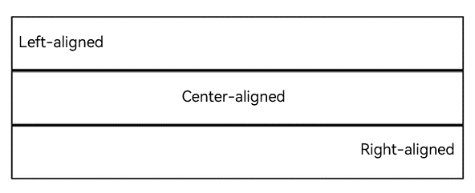

- Use the [textOverflow](../reference/apis-arkui/arkui-ts/ts-basic-components-text.md#textoverflow) attribute to control text overflow handling. textOverflow must be used together with [maxLines](../reference/apis-arkui/arkui-ts/ts-basic-components-text.md#maxlines) (by default, text wraps automatically). Starting from API version 18, when text overflow is displayed in marquee mode, you can set marquee configuration items, such as the switch, step length, number of cycles, and direction.

  <!-- @[custom_text_overflow](https://gitcode.com/openharmony/applications_app_samples/blob/master/code/DocsSample/ArkUISample/TextComponent/entry/src/main/ets/pages/text/CustomTextStyle.ets) -->

  ``` TypeScript
  Text('This is the setting of textOverflow to Clip text content This is the setting of textOverflow ' +
    'to None text content. This is the setting of textOverflow to Clip text content This is the setting ' +
    'of textOverflow to None text content.')
    .width(250)
    .textOverflow({ overflow: TextOverflow.None })
    .maxLines(1)
    .fontSize(12)
    .border({ width: 1 })
    .padding(10)
  // The value in the 'app.string.CustomTextStyle_textContent_epsis' resource file is
  // 'I am an extra long text, with ellipses displayed for any excess I am an extra long text, with ellipses displayed for any excess.'
  Text($r('app.string.CustomTextStyle_textContent_epsis'))
    .width(250)
    .textOverflow({ overflow: TextOverflow.Ellipsis })
    .maxLines(1)
    .fontSize(12)
    .border({ width: 1 })
    .padding(10)
  // The value in the 'app.string.CustomTextStyle_textContent_marq' resource file is
  // 'When the text overflows its dimensions, the text will scroll for displaying
  // When the text overflows its dimensions,the text will scroll for displaying.'
  Text($r('app.string.CustomTextStyle_textContent_marq'))
    .width(250)
    .textOverflow({ overflow: TextOverflow.MARQUEE })
    .maxLines(1)
    .fontSize(12)
    .border({ width: 1 })
    .padding(10)
  // The value in the 'app.string.CustomTextStyle_textContent_marq_def' resource file is
  // When the text overflows its dimensions, the text will scroll for displaying, and marquee configuration items are supported.
  // When the text overflows its dimensions, the text will scroll for displaying.'
  Text($r('app.string.CustomTextStyle_textContent_marq_def'))
    .width(250)
    .textOverflow({ overflow: TextOverflow.MARQUEE })
    .maxLines(1)
    .fontSize(12)
    .border({ width: 1 })
    .padding(10)
    .marqueeOptions({
      start: true,
      fromStart: true,
      step: 6,
      loop: -1,
      delay: 0,
      fadeout: false,
      marqueeStartPolicy: MarqueeStartPolicy.DEFAULT
    })
  ```

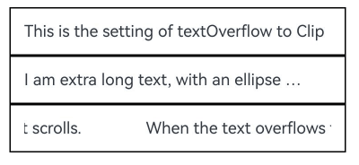

- Set the text line height via the [lineHeight](../reference/apis-arkui/arkui-ts/ts-basic-components-text.md#lineheight) attribute.

  <!-- @[custom_line_height](https://gitcode.com/openharmony/applications_app_samples/blob/master/code/DocsSample/ArkUISample/TextComponent/entry/src/main/ets/pages/text/CustomTextStyle.ets) -->

  ``` TypeScript
  Text('This is the text with the line height set. This is the text with the line height set.')
    .width(300).fontSize(12).border({ width: 1 }).padding(10)
  Text('This is the text with the line height set. This is the text with the line height set.')
    .width(300)
    .fontSize(12)
    .border({ width: 1 })
    .padding(10)
    .lineHeight(20)
  ```

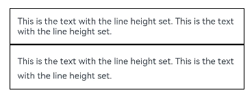

- Set the text decoration line style, color, and thickness via the [decoration](../reference/apis-arkui/arkui-ts/ts-basic-components-text.md#decoration) attribute.

  <!-- @[custom_text_line_and_color](https://gitcode.com/openharmony/applications_app_samples/blob/master/code/DocsSample/ArkUISample/TextComponent/entry/src/main/ets/pages/text/CustomTextStyle.ets) -->

  ``` TypeScript
  Text('This is the text')
    .decoration({
      type: TextDecorationType.LineThrough,
      color: Color.Red
    })
    .borderWidth(1).padding(15).margin(5)
  Text('This is the text')
    .decoration({
      type: TextDecorationType.Overline,
      color: Color.Red
    })
    .borderWidth(1).padding(15).margin(5)
  Text('This is the text')
    .decoration({
      type: TextDecorationType.Underline,
      color: Color.Red
    })
    .borderWidth(1).padding(15).margin(5)
  Text('This is the text')
    .decoration({
      type: TextDecorationType.Underline,
      color: Color.Blue,
      style: TextDecorationStyle.DASHED
    })
    .borderWidth(1).padding(15).margin(5)
  Text('This is the text')
    .decoration({
      type: TextDecorationType.Underline,
      color: Color.Blue,
      style: TextDecorationStyle.DOTTED
    })
    .borderWidth(1).padding(15).margin(5)
  Text('This is the text')
    .decoration({
      type: TextDecorationType.Underline,
      color: Color.Blue,
      style: TextDecorationStyle.DOUBLE
    })
    .borderWidth(1).padding(15).margin(5)
  Text('This is the text')
    .decoration({
      type: TextDecorationType.Underline,
      color: Color.Blue,
      style: TextDecorationStyle.WAVY,
      thicknessScale: 4
    })
    .borderWidth(1).padding(15).margin(5)
  ```

  

- Set the offset of the text baseline via the [baselineOffset](../reference/apis-arkui/arkui-ts/ts-basic-components-text.md#baselineoffset) attribute.

  <!-- @[custom_text_baseline_offset](https://gitcode.com/openharmony/applications_app_samples/blob/master/code/DocsSample/ArkUISample/TextComponent/entry/src/main/ets/pages/text/CustomTextStyle.ets) -->

  ``` TypeScript
  Text('This is the text content with baselineOffset 0.')
    .baselineOffset(0)
    .fontSize(12)
    .border({ width: 1 })
    .padding(10)
    .width('100%')
    .margin(5)
  Text('This is the text content with baselineOffset 30.')
    .baselineOffset(30)
    .fontSize(12)
    .border({ width: 1 })
    .padding(10)
    .width('100%')
    .margin(5)
  Text('This is the text content with baselineOffset -20.')
    .baselineOffset(-20)
    .fontSize(12)
    .border({ width: 1 })
    .padding(10)
    .width('100%')
    .margin(5)
  ```

  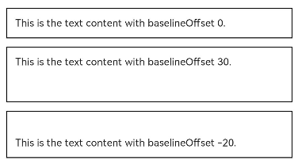

- Set the text character spacing via the [letterSpacing](../reference/apis-arkui/arkui-ts/ts-basic-components-text.md#letterspacing) attribute.

  <!-- @[custom_text_letter_space](https://gitcode.com/openharmony/applications_app_samples/blob/master/code/DocsSample/ArkUISample/TextComponent/entry/src/main/ets/pages/text/CustomTextStyle.ets) -->

  ``` TypeScript
  Text('This is the text content with letterSpacing 0.')
    .letterSpacing(0)
    .fontSize(12)
    .border({ width: 1 })
    .padding(10)
    .width('100%')
    .margin(5)
  Text('This is the text content with letterSpacing 3.')
    .letterSpacing(3)
    .fontSize(12)
    .border({ width: 1 })
    .padding(10)
    .width('100%')
    .margin(5)
  Text('This is the text content with letterSpacing -1.')
    .letterSpacing(-1)
    .fontSize(12)
    .border({ width: 1 })
    .padding(10)
    .width('100%')
    .margin(5)
  ```

  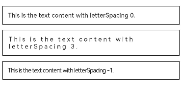

- Adaptive font size via [minFontSize](../reference/apis-arkui/arkui-ts/ts-basic-components-text.md#minfontsize) and [maxFontSize](../reference/apis-arkui/arkui-ts/ts-basic-components-text.md#maxfontsize).

  minFontSize is used to set the minimum display font size of the text, and maxFontSize is used to set the maximum display font size of the text. These two attributes must be set together to take effect, and must be used in conjunction with the [maxLines](../reference/apis-arkui/arkui-ts/ts-basic-components-text.md#maxlines) attribute or layout size constraints. Setting either attribute alone will not produce any effect.

  <!-- @[custom_the_size_of_text](https://gitcode.com/openharmony/applications_app_samples/blob/master/code/DocsSample/ArkUISample/TextComponent/entry/src/main/ets/pages/text/CustomTextStyle.ets) -->

  ``` TypeScript
  /*  Replace $r('app.string.CustomTextStyle_textContent_one_style') with the actual resource file.
   * In this example, the value of this resource file is "My maximum font size is 30, minimum font size is 5, width is 250, and maxLines is 1".
   */
  Text($r('app.string.CustomTextStyle_textContent_one_style'))
    .width(250)
    .maxLines(1)
    .maxFontSize(30)
    .minFontSize(5)
    .border({ width: 1 })
    .padding(10)
    .margin(5)
  /*  Replace $r('app.string.CustomTextStyle_textContent_two_style') with the actual resource file.
   * In this example, the value of this resource file is "My maximum font size is 30, minimum font size is 5, width is 250, and maxLines is 2".
   */
  Text($r('app.string.CustomTextStyle_textContent_two_style'))
    .width(250)
    .maxLines(2)
    .maxFontSize(30)
    .minFontSize(5)
    .border({ width: 1 })
    .padding(10)
    .margin(5)
  /*  Replace $r('app.string.CustomTextStyle_textContent_no_max') with the actual resource file.
   * In this example, the value of this resource file is "My maximum font size is 30, minimum font size is 15, width is 250, and height is 50".
   */
  Text($r('app.string.CustomTextStyle_textContent_no_max'))
    .width(250)
    .height(50)
    .maxFontSize(30)
    .minFontSize(15)
    .border({ width: 1 })
    .padding(10)
    .margin(5)
  /*Replace $r('app.string.CustomTextStyle_textContent_high') with the actual resource file.
   * In this example, the value of this resource file is "My maximum font size is 30, minimum font size is 15, width is 250, and height is 100".*/
  Text($r('app.string.CustomTextStyle_textContent_high'))
    .width(250)
    .height(100)
    .maxFontSize(30)
    .minFontSize(15)
    .border({ width: 1 })
    .padding(10)
    .margin(5)
  ```

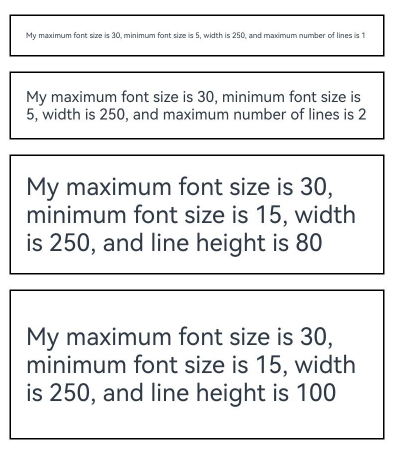

- Set the text case via the [textCase](../reference/apis-arkui/arkui-ts/ts-basic-components-text.md#textcase) attribute.

  <!-- @[custom_the_text_by_text_case](https://gitcode.com/openharmony/applications_app_samples/blob/master/code/DocsSample/ArkUISample/TextComponent/entry/src/main/ets/pages/text/CustomTextStyle.ets) -->

  ``` TypeScript
  Text('This is the text content with textCase set to Normal.')
    .textCase(TextCase.Normal)
    .border({ width: 1 })
    .padding(10)
    .margin(5)
  
  // Display the text in all lowercase.
  Text('This is the text content with textCase set to LowerCase.')
    .textCase(TextCase.LowerCase)
    .border({ width: 1 })
    .padding(10)
    .margin(5)
  
  // Display the text in all uppercase.
  Text('This is the text content with textCase set to UpperCase.')
    .textCase(TextCase.UpperCase)
    .border({ width: 1 })
    .padding(10)
    .margin(5)
  ```

  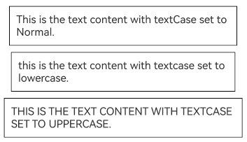

- Via the [copyOption](../reference/apis-arkui/arkui-ts/ts-basic-components-text.md#copyoption9) attribute, set whether the text can be copied and pasted.

  <!-- @[custom_the_text_by_copy_option](https://gitcode.com/openharmony/applications_app_samples/blob/master/code/DocsSample/ArkUISample/TextComponent/entry/src/main/ets/pages/text/CustomTextStyle.ets) -->

  ``` TypeScript
  // Replace $r('app.string.CustomTextStyle_textContent_incopy') with the actual resource file. In this example, the value of the resource file is "This is a piece of copyable text."
  Text($r('app.string.CustomTextStyle_textContent_incopy'))
    .fontSize(30)
    .copyOption(CopyOptions.InApp)
  ```

  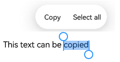

- Via the [fontFamily](../reference/apis-arkui/arkui-ts/ts-basic-components-text.md#fontfamily) attribute, set the text font family. The app currently supports the 'HarmonyOS Sans' font and [custom font registration](../reference/apis-arkui/js-apis-font.md).

  <!-- @[custom_the_text_fontFamily](https://gitcode.com/openharmony/applications_app_samples/blob/master/code/DocsSample/ArkUISample/TextComponent/entry/src/main/ets/pages/text/CustomTextStyle.ets) -->

  ``` TypeScript
  Text('This is the text content with fontFamily')
    .fontSize(30)
    .fontFamily('HarmonyOS Sans')
  ```

  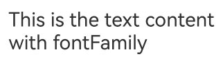

- Starting from API version 20, you can set a number flip effect via the [contentTransition](../reference/apis-arkui/arkui-ts/ts-basic-components-text.md#contenttransition20) attribute.

  <!-- @[Content_Transition](https://gitcode.com/openharmony/applications_app_samples/blob/master/code/DocsSample/ArkUISample/TextComponent/entry/src/main/ets/pages/text/ContentTransition.ets) -->

  ``` TypeScript
  
  @Entry
  @Component
  struct ContentTransitionDemo {
    private static readonly INITIAL_SCORE: number = 98;
    @State number: number = ContentTransitionDemo.INITIAL_SCORE;
    @State numberTransition: NumericTextTransition =
      new NumericTextTransition({ flipDirection: FlipDirection.DOWN, enableBlur: false });
    build() {
      NavDestination() {
        Column() {
          Text(this.number + '')
            .borderWidth(1)
            .fontSize(40)
            .contentTransition(this.numberTransition)
          Button('chang number')
            .onClick(() => {
              this.number++
            })
            .margin(10)
        }
        .width('100%')
        .height('100%')
      }
      // ···
    }
  }
  ```

  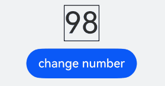

- Starting from API version 20, you can set whether to optimize trailing spaces during text layout via the [optimizeTrailingSpace](../reference/apis-arkui/arkui-ts/ts-basic-components-text.md#optimizetrailingspace20) attribute, which resolves the issue of trailing spaces affecting alignment display.

  <!-- @[Last_space](https://gitcode.com/openharmony/applications_app_samples/blob/master/code/DocsSample/ArkUISample/TextComponent/entry/src/main/ets/pages/text/TextLayout.ets) -->

  ``` TypeScript
  Column() {
    // Enable the trailing space optimization feature.
    Text('Trimmed space enabled     ')
      .fontSize(30)
      .fontWeight(FontWeight.Bold)
      .margin({ top: 20 })
      .optimizeTrailingSpace(true)
      .textAlign(TextAlign.Center)
    // Disable the trailing space optimization feature.
    Text('Trimmed space disabled     ')
      .fontSize(30)
      .fontWeight(FontWeight.Bold)
      .margin({ top: 20 })
      .optimizeTrailingSpace(false)
      .textAlign(TextAlign.Center)
  }
  ```

  

- Starting from API version 20, you can set the text line spacing via [lineSpacing](../reference/apis-arkui/arkui-ts/ts-basic-components-text.md#linespacing20). When [LineSpacingOptions](../reference/apis-arkui/arkui-ts/ts-text-common.md#linespacingoptions20) is not configured, line spacing is applied by default above the first line and below the last line. When onlyBetweenLines is set to true, line spacing applies only between lines, with no extra spacing above the first line.

  <!-- @[Line_Spacing](https://gitcode.com/openharmony/applications_app_samples/blob/master/code/DocsSample/ArkUISample/TextComponent/entry/src/main/ets/pages/text/LineSpacing.ets) -->

  ``` TypeScript
  import { LengthMetrics } from '@kit.ArkUI';
  
  @Extend(Text)
  function style() {
    .width(250)
    .height(100)
    .maxFontSize(30)
    .minFontSize(15)
    .border({ width: 1 })
  }
  
  @Entry
  @Component
  struct LineSpacing {
    build() {
      NavDestination() {
        Column() {
          Text('The line spacing of this context is set to 20_px, and the spacing is effective only between the lines.')
            .lineSpacing(LengthMetrics.px(20), { onlyBetweenLines: true })
            .style()
        }
      }
      // ···
    }
  }
  ```

  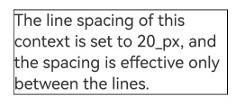

- Starting from API version 20, you can set whether to enable automatic spacing between Chinese and Western characters via [enableAutoSpacing](../reference/apis-arkui/arkui-ts/ts-basic-components-text.md#enableautospacing20).

  <!-- @[Enable_AutoSpacing](https://gitcode.com/openharmony/applications_app_samples/blob/master/code/DocsSample/ArkUISample/TextComponent/entry/src/main/ets/pages/text/EnableAutoSpacing.ets) -->

  ``` TypeScript
  @Entry
  @Component
  struct EnableAutoSpacing {
    @State enableSpacing: boolean = false;
  
    build() {
      NavDestination() {
      Column() {
        Row({ space: 20 }) {
          // Replace $r('app.string.Enable_automatic_spacing') with the actual resource file. In this example, the value of the resource file is "Enable automatic spacing".
          Button($r('app.string.Enable_automatic_spacing'))
            .onClick(() => this.enableSpacing = true)
            .backgroundColor(this.enableSpacing ? '#4CAF50' : '#E0E0E0')
            .fontColor(this.enableSpacing ? Color.White : Color.Black)
          // Replace $r('app.string.off_automatic_spacing') with the actual resource file. In this example, the value of the resource file is "Turn off automatic spacing".
          Button($r('app.string.off_automatic_spacing'))
            .onClick(() => this.enableSpacing = false)
            .backgroundColor(!this.enableSpacing ? '#F44336' : '#E0E0E0')
            .fontColor(!this.enableSpacing ? Color.White : Color.Black)
        }
        .width('100%')
        .justifyContent(FlexAlign.Center)
        .margin({ top: 30, bottom: 20 })
        // Replace $r('app.string.Automatic_spacing_has_been_enabled') with the actual resource file. In this example, the value of the resource file is "Current status: Automatic spacing enabled".
        // Replace $r('app.string.Automatic_spacing_has_been_turned_off') with the actual resource file. In this example, the value of the resource file is "Current status: Automatic spacing turned off".
        Text(this.enableSpacing ? $r('app.string.Automatic_spacing_has_been_enabled') : $r('app.string.Automatic_spacing_has_been_turned_off'))
          .fontSize(16)
          .fontColor(this.enableSpacing ? '#4CAF50' : '#F44336')
          .margin({ bottom: 20 })
  
        // Set whether to apply automatic spacing between Chinese and Western text.
        /*Replace $r('app.string.Chinese_and_Western_Auto_Spacing_automatic_spacing') with the actual resource file. In this example, the value of the resource file is "中西文Auto Spacing自动间距".*/
        Text($r('app.string.Chinese_and_Western_Auto_Spacing_automatic_spacing'))
          .fontSize(24)
          .padding(15)
          .backgroundColor('#F5F5F5')
          .width('90%')
          .enableAutoSpacing(this.enableSpacing)
      }
      .width('100%')
      .height('100%')
      .padding(20)
      }
      // ...
    }
  }
  ```

  

- Starting from API version 20, you can set gradient colors via [shaderStyle](../reference/apis-arkui/arkui-ts/ts-basic-components-text.md#shaderstyle20).

  <!-- @[Shader_Style](https://gitcode.com/openharmony/applications_app_samples/blob/master/code/DocsSample/ArkUISample/TextComponent/entry/src/main/ets/pages/text/ShaderStyle.ets) -->

  ``` TypeScript
  @Entry
  @Component
  struct ShaderStyleDemo {
    @State message: string = 'Hello World';
    @State linearGradientOptions: LinearGradientOptions =
      {
        direction: GradientDirection.LeftTop,
        colors: [[Color.Red, 0.0], [Color.Blue, 0.3], [Color.Green, 0.5]],
        repeating: true,
      };
  
    build() {
      NavDestination() {
        Column({ space: 5 }) {
          // Replace $r('app.string.direction_LeftTop') with the actual resource file. In this example, the value of the resource file is "linear gradient with direction LeftTop".
          Text($r('app.string.direction_LeftTop')).fontSize(18).width('90%').fontColor(0xCCCCCC)
            .margin({ top: 40, left: 40 })
          Text(this.message)
            .fontSize(50)
            .width('80%')
            .height(50)
            .shaderStyle(this.linearGradientOptions)
        }
        .height('100%')
        .width('100%')
      }
      // ...
    }
  }
  ```

  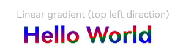

- Starting from API version 20, the Text component supports vertical alignment of text paragraphs via the [textVerticalAlign](../reference/apis-arkui/arkui-ts/ts-basic-components-text.md#textverticalalign20) attribute. The following example shows how to set the text vertical center alignment effect via the textVerticalAlign attribute.

    <!-- @[text_VerticalAlign](https://gitcode.com/openharmony/applications_app_samples/blob/master/code/DocsSample/ArkUISample/TextComponent/entry/src/main/ets/pages/text/TextLayout.ets) -->

    ``` TypeScript
    // Replace $r('app.media.startIcon') with the actual resource file.
    Text() {
      Span('Hello')
        .fontSize(50)
      ImageSpan($r('app.media.startIcon'))
        .width(30).height(30)
        .verticalAlign(ImageSpanAlignment.FOLLOW_PARAGRAPH)
      Span('World')
    }
    .textVerticalAlign(TextVerticalAlign.CENTER)
    ```

    

## Adding a Text Span Subcomponent

[Span](../reference/apis-arkui/arkui-ts/ts-basic-components-span.md) can only be used as a child component of [Text](../reference/apis-arkui/arkui-ts/ts-basic-components-text.md) and [RichEditor](../reference/apis-arkui/arkui-ts/ts-basic-components-richeditor.md) to display text content. You can add multiple Span components within a Text to display a piece of information, such as product manuals or commitment letters.

### Creating a Span

A Span component must be embedded in a Text component to be displayed. When used alone, it does not display any content. If both Text and Span have text content configured, the Span content overrides the Text content.

<!-- @[create_span](https://gitcode.com/openharmony/applications_app_samples/blob/master/code/DocsSample/ArkUISample/TextComponent/entry/src/main/ets/pages/text/TextSpan.ets) -->

``` TypeScript
// Replace $r('app.string.TextSpan_textContent_text') with the actual resource file. In this example, the value of the resource file is "I am Text".
Text($r('app.string.TextSpan_textContent_text')) {
  // Replace $r('app.string.TextSpan_textContent_span') with the actual resource file. In this example, the value of the resource file is "I am Span".
  Span($r('app.string.TextSpan_textContent_span'))
}
.padding(10)
.borderWidth(1)
```

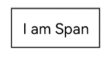

### Setting Span Text Decoration Lines and Colors

Set text decoration lines and colors via [decoration](../reference/apis-arkui/arkui-ts/ts-basic-components-span.md#decoration).

<!-- @[create_span_with_lines](https://gitcode.com/openharmony/applications_app_samples/blob/master/code/DocsSample/ArkUISample/TextComponent/entry/src/main/ets/pages/text/TextSpan.ets) -->

``` TypeScript
Text() {
  // Replace $r('app.string.TextSpan_textContent_span_one') with the actual resource file. In this example, the value of the resource file is "I am Span1,".
  Span($r('app.string.TextSpan_textContent_span_one'))
    .fontSize(16)
    .fontColor(Color.Grey)
    .decoration({ type: TextDecorationType.LineThrough, color: Color.Red })
  // Replace $r('app.string.TextSpan_textContent_span_two') with the actual resource file. In this example, the value of the resource file is "I am Span2".
  Span($r('app.string.TextSpan_textContent_span_two'))
    .fontColor(Color.Blue)
    .fontSize(16)
    .fontStyle(FontStyle.Italic)
    .decoration({ type: TextDecorationType.Underline, color: Color.Black })
  // Replace $r('app.string.TextSpan_textContent_span_three') with the actual resource file. In this example, the value of the resource file is ", I am Span3".
  Span($r('app.string.TextSpan_textContent_span_three'))
    .fontSize(16)
    .fontColor(Color.Grey)
    .decoration({ type: TextDecorationType.Overline, color: Color.Green })
}
.borderWidth(1)
.padding(10)
```

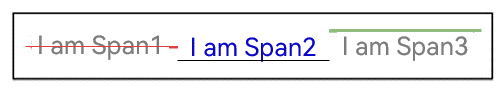

### Set Span Text Case

Via [textCase](../reference/apis-arkui/arkui-ts/ts-basic-components-span.md#textcase), set the text to always remain in uppercase or lowercase.

  <!-- @[create_span_with_upper_case](https://gitcode.com/openharmony/applications_app_samples/blob/master/code/DocsSample/ArkUISample/TextComponent/entry/src/main/ets/pages/text/TextSpan.ets) -->

  ``` TypeScript
  Text() {
    Span('I am Upper-span').fontSize(12)
      .textCase(TextCase.UpperCase)
  }
  .borderWidth(1)
  .padding(10)
  ```

  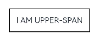

### Binding Span Text Events

Since the Span component has no size information, it only supports adding the tap event [onClick](../reference/apis-arkui/arkui-ts/ts-universal-events-click.md#onclick) and the hover event [onHover](../reference/apis-arkui/arkui-ts/ts-universal-events-hover.md#onhover).

  <!-- @[textspan_onhover](https://gitcode.com/openharmony/applications_app_samples/blob/master/code/DocsSample/ArkUISample/TextComponent/entry/src/main/ets/pages/text/TextSpanOnHover.ets) -->

  ``` TypeScript
  // xxx.ets
  import { hilog } from '@kit.PerformanceAnalysisKit';
  
  @Entry
  @Component
  struct TextSpanOnHover {
    @State textStr1: string = '';
    @State textStr2: string = '';
  
    build() {
      NavDestination() {
        Row() {
          Column() {
            Text() {
              Span('I am Upper-span')
                .textCase(TextCase.UpperCase)
                .fontSize(30)
                .onClick(() => {
                  hilog.info(0x0000, 'Sample_TextComponent', 'Span onClick is triggering');
                  this.textStr1 = 'Span onClick is triggering';
                })
                .onHover(() => {
                  hilog.info(0x0000, 'Sample_TextComponent', 'Span onHover is triggering');
                  this.textStr2 = 'Span onHover is triggering';
                })
            }
  
            Text('onClick:' + this.textStr1)
              .fontSize(20)
            Text('onHover:' + this.textStr2)
              .fontSize(20)
          }.width('100%')
        }
        .height('100%')
      }
      // ...
    }
  }
  ```

  

## Setting the Text Menu

The text menu includes the system menu, AI menu, and custom menu.

The system menu consists of preset menu items that appear automatically without configuration. It includes options such as cut, copy, paste, select all, translate, search, and share, and is suitable for most standard text interactions.

The AI menu is an intelligent operation menu that appears after entities are dynamically recognized through AI-based text analysis. Its menu items include phone numbers, URLs, email addresses, and more (displayed only when the AI recognizes the corresponding entity; not displayed if no entity is detected). The key difference from the system menu is that the AI menu content is determined by AI detection results rather than being fixed, making it suitable for text content that contains entity information.

The custom menu allows you to fully customize the menu content. It requires active API configuration and is suitable for text interactions with specific business requirements.

### Using the System Menu

When Text is selected, a menu containing **Copy**, **Translate**, and **Search** options appears.

The Text component must have the [copyOption](../reference/apis-arkui/arkui-ts/ts-basic-components-text.md#copyoption9) attribute set to be selectable.

  <!-- @[copy_Option](https://gitcode.com/openharmony/applications_app_samples/blob/master/code/DocsSample/ArkUISample/TextComponent/entry/src/main/ets/pages/text/TextLayout.ets) -->

  ``` TypeScript
  // Replace $r('app.string.selected_menu') with the actual resource file. In this example, the value of the resource file is "This is a text used to demonstrate the selection menu."
  Text($r('app.string.selected_menu'))
    .fontSize(30)
    .copyOption(CopyOptions.InApp)
  ```

  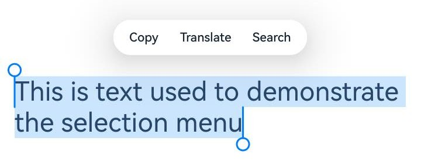

You can tap an empty area within the Text component area to close the selection state and menu normally. To close the selection menu by tapping an empty area outside the Text component area, you need to set the [selection](../reference/apis-arkui/arkui-ts/ts-basic-components-text.md#selection11) attribute. The following example shows how to do this.

  <!-- @[Selection_Change](https://gitcode.com/openharmony/applications_app_samples/blob/master/code/DocsSample/ArkUISample/TextComponent/entry/src/main/ets/pages/text/SelectionChange.ets) -->

  ``` TypeScript
  // xxx.ets
  @Entry
  @Component
  struct SelectionChange {
    @State text: string =
      'This is set selection to Selection text content This is set selection to Selection text content.';
    @State start: number = 0;
    @State end: number = 20;
  
    build() {
      NavDestination() {
        Flex({ direction: FlexDirection.Column, alignItems: ItemAlign.Start, justifyContent: FlexAlign.Start }) {
          Text(this.text)
            .fontSize(12)
            .border({ width: 1 })
            .lineHeight(20)
            .margin(30)
            .copyOption(CopyOptions.InApp)
            .selection(this.start, this.end)
            .onTextSelectionChange((selectionStart, selectionEnd) => {
              // Update the selection position.
              this.start = selectionStart;
              this.end = selectionEnd;
            })
        }
        .height(600)
        .width(335)
        .borderWidth(1)
        .onClick(() => {
          // Listen for the click event of the parent component, and set both the selection start and end positions to -1 to clear the selection.
          this.start = -1;
          this.end = -1;
        })
      }
      // ...
    }
  }
  ```

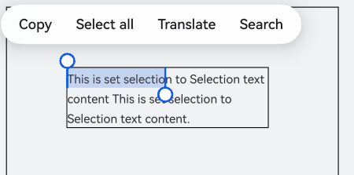

### Custom Menu Items in System Menu

The Text component extends the custom selection menu via the [editMenuOptions](../reference/apis-arkui/arkui-ts/ts-basic-components-text.md#editmenuoptions12) attribute settings. You can set the text content, icon, and callback method for the extension items.

  <!-- @[set_selection_menu_with_editmenuoptions](https://gitcode.com/openharmony/applications_app_samples/blob/master/code/DocsSample/ArkUISample/TextComponent/entry/src/main/ets/pages/text/SelectMenu.ets) -->

  ``` TypeScript
  // Replace $r('app.string.show_selected_menu') with the actual resource file. In this example, the value of this resource file is "This is a piece of text used to demonstrate the selection menu."
  Text($r('app.string.show_selected_menu'))
    .fontSize(20)
    .copyOption(CopyOptions.LocalDevice)
    .editMenuOptions({
      onCreateMenu: this.onCreateMenu, onMenuItemClick: this.onMenuItemClick
    })
  ```

    <!-- @[onCreate_Menu](https://gitcode.com/openharmony/applications_app_samples/blob/master/code/DocsSample/ArkUISample/TextComponent/entry/src/main/ets/pages/text/SelectMenu.ets) -->

    ``` TypeScript
    // Define onCreateMenu and onMenuItemClick.
    // Replace $r('app.media.app_icon') with the actual resource file.
    onCreateMenu = (menuItems: Array<TextMenuItem>) => {
      let item1: TextMenuItem = {
        content: 'customMenu1',
        icon: $r('app.media.app_icon'),
        id: TextMenuItemId.of('customMenu1'),
      };
      let item2: TextMenuItem = {
        content: 'customMenu2',
        id: TextMenuItemId.of('customMenu2'),
        icon: $r('app.media.app_icon'),
      };
      menuItems.push(item1);
      menuItems.unshift(item2);
      return menuItems;
    }
    onMenuItemClick = (menuItem: TextMenuItem, textRange: TextRange) => {
      if (menuItem.id.equals(TextMenuItemId.of('customMenu2'))) {
        // Replace $r('app.string.SelectMenu_Text_customMenu') with the actual resource file. In this example, the value of the resource file is "Intercept id: customMenu2 start:"
        hilog.info(0x0000, 'Sample_TextComponent',
          this.getUIContext().getHostContext()!.resourceManager.getStringSync($r('app.string.SelectMenu_Text_customMenu')
            .id) + textRange.start + '; end:' +
          textRange.end);
        return true;
      }
      if (menuItem.id.equals(TextMenuItemId.COPY)) {
        // Replace $r('app.string.SelectMenu_Text_copy') with the actual resource file. In this example, the value of the resource file is "Intercept COPY start:"
        hilog.info(0x0000, 'Sample_TextComponent',
          this.getUIContext().getHostContext()!.resourceManager.getStringSync($r('app.string.SelectMenu_Text_copy').id) +
          textRange.start + '; end:' + textRange.end);
        return true;
      }
      if (menuItem.id.equals(TextMenuItemId.SELECT_ALL)) {
        // Replace $r('app.string.SelectMenu_Text_SelectionAll') with the actual resource file. In this example, the value of the resource file is "Do not intercept SELECT_ALL start:"
        hilog.info(0x0000, 'Sample_TextComponent',
          this.getUIContext()
            .getHostContext()!.resourceManager.getStringSync($r('app.string.SelectMenu_Text_SelectionAll').id) +
          textRange.start + '; end:' +
          textRange.end);
        return false;
      }
      return false;
    };
    ```

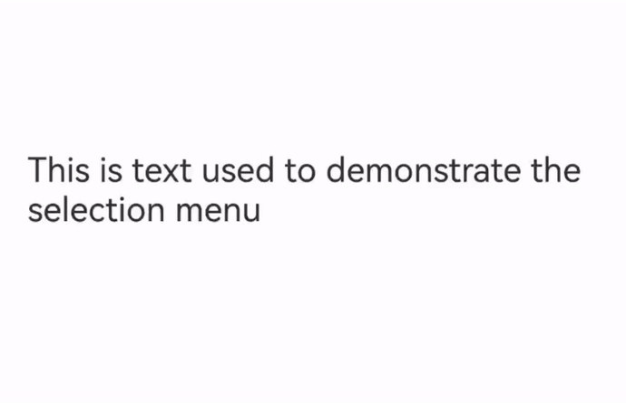

- Starting from API version 20, the [onPrepareMenu](../reference/apis-arkui/arkui-ts/ts-text-common.md#properties-1) callback is triggered when the text selection area changes, before the menu is displayed. You can configure menu data in this callback, providing the ability to customize and refresh the system menu.

  <!-- @[Prepare_Menu](https://gitcode.com/openharmony/applications_app_samples/blob/master/code/DocsSample/ArkUISample/TextComponent/entry/src/main/ets/pages/text/PrepareMenu.ets) -->  

  ``` TypeScript
  // Replace $r('app.media.xxx') with the actual resource file.
  // xxx.ets
  import { hilog } from '@kit.PerformanceAnalysisKit';
  const DOMAIN = 0x0000;
  @Entry
  @Component
  struct PrepareMenu {
    @State text: string = 'Text editMenuOptions';
    @State endIndex: number = 0;
    onCreateMenu = (menuItems: Array<TextMenuItem>) => {
      let item1: TextMenuItem = {
        content: 'create1',
        icon: $r('app.media.startIcon'),
        id: TextMenuItemId.of('create1'),
      };
      let item2: TextMenuItem = {
        content: 'create2',
        id: TextMenuItemId.of('create2'),
        icon: $r('app.media.startIcon'),
      };
      menuItems.push(item1);
      menuItems.unshift(item2);
      return menuItems;
    }
    onMenuItemClick = (menuItem: TextMenuItem, textRange: TextRange) => {
      if (menuItem.id.equals(TextMenuItemId.of('create2'))) {
        hilog.info(DOMAIN, 'testTag', '%{public}s', 'intercept id: create2 start:' + textRange.start + '; end:' + textRange.end);
        return true;
      }
      if (menuItem.id.equals(TextMenuItemId.of('prepare1'))) {
        hilog.info(DOMAIN, 'testTag', '%{public}s', 'intercept id: prepare1 start:' + textRange.start + '; end:' + textRange.end);
        return true;
      }
      if (menuItem.id.equals(TextMenuItemId.COPY)) {
        hilog.info(DOMAIN, 'testTag', '%{public}s', 'intercept COPY start:' + textRange.start + '; end:' + textRange.end);
        return true;
      }
      if (menuItem.id.equals(TextMenuItemId.SELECT_ALL)) {
        hilog.info(DOMAIN, 'testTag', '%{public}s', 'No interception SELECT_ALL start:' + textRange.start + '; end:' + textRange.end);
        return false;
      }
      return false;
    }
    onPrepareMenu = (menuItems: Array<TextMenuItem>) => {
      let item1: TextMenuItem = {
        content: 'prepare1_' + this.endIndex,
        icon: $r('app.media.startIcon'),
        id: TextMenuItemId.of('prepare1'),
      };
      menuItems.unshift(item1);
      return menuItems;
    }
    @State editMenuOptions: EditMenuOptions = {
      onCreateMenu: this.onCreateMenu,
      onMenuItemClick: this.onMenuItemClick,
      onPrepareMenu: this.onPrepareMenu
    };
  
    build() {
      NavDestination() {
      Column() {
        Text(this.text)
          .fontSize(20)
          .copyOption(CopyOptions.LocalDevice)
          .editMenuOptions(this.editMenuOptions)
          .margin({ top: 100 })
          .onTextSelectionChange((selectionStart: number, selectionEnd: number) => {
            this.endIndex = selectionEnd;
          })
      }
      .width('90%')
      .margin('5%')
      }
      // ...
    }
  }
  ```

    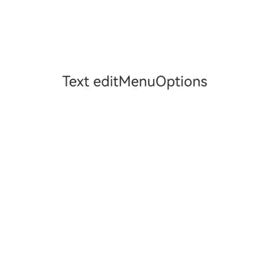

### Hiding System Service Menu Items in the System Menu

Starting from API version 20, you can use [disableSystemServiceMenuItems](../reference/apis-arkui/arkts-apis-uicontext-textmenucontroller.md#disablesystemservicemenuitems20) to hide all system service menu items in the text selection menu. For details, see the API documentation for [disableSystemServiceMenuItems](../reference/apis-arkui/arkts-apis-uicontext-textmenucontroller.md#disablesystemservicemenuitems20). The following example is only one example from a complete sample project. To avoid affecting other page examples in the project, system service menus are disabled and restored only in the page's appear and disappear lifecycle callbacks. In actual scenarios, you can choose other timing, such as [onCreate](../reference/apis-ability-kit/js-apis-app-ability-uiAbility.md#oncreate) and [onDestroy](../reference/apis-ability-kit/js-apis-app-ability-uiAbility.md#ondestroy) of [UIAbility](../reference/apis-ability-kit/js-apis-app-ability-uiAbility.md).

  <!-- @[Service_MenuItems](https://gitcode.com/openharmony/applications_app_samples/blob/master/code/DocsSample/ArkUISample/TextComponent/entry/src/main/ets/pages/text/ServiceMenuItems.ets) -->

  ``` TypeScript
  import { TextMenuController } from '@kit.ArkUI';
  // xxx.ets
  @Entry
  @Component
  struct ServiceMenuItems {
    aboutToAppear(): void {
      // Disable all system service menus.
      TextMenuController.disableSystemServiceMenuItems(true);
    }
  
    aboutToDisappear(): void {
      // Restore system service menus when the page disappears.
      TextMenuController.disableSystemServiceMenuItems(false);
    }
    build() {
      NavDestination() {
        Row() {
          Column() {
            // Replace $r('app.string.Service_MenuItems_Text') with the actual resource file. In this example, the value of the resource file is "This is a piece of text. Long press to bring up the text selection menu."
            Text($r('app.string.Service_MenuItems_Text'))
              .height(60)
              .fontStyle(FontStyle.Italic)
              .fontWeight(FontWeight.Bold)
              .textAlign(TextAlign.Center)
              .copyOption(CopyOptions.InApp)
              .editMenuOptions({
                onCreateMenu: (menuItems: Array<TextMenuItem>) => {
                  // menuItems does not include blocked system menu items.
                  return menuItems;
                },
                onMenuItemClick: (menuItem: TextMenuItem, textRange: TextRange) => {
                  return false;
                }
              })
          }.width('100%')
        }
        .height('100%')
      }
      // ...
    }
  }
  ```

    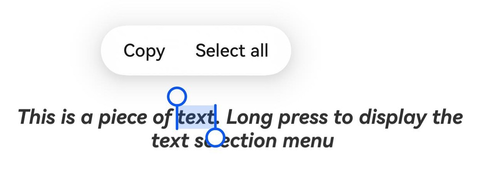

- Starting from API version 20, you can use [disableMenuItems](../reference/apis-arkui/arkts-apis-uicontext-textmenucontroller.md#disablemenuitems20) to disable specified system service menu items in the text selection menu. For details, see the API documentation for [disableMenuItems](../reference/apis-arkui/arkts-apis-uicontext-textmenucontroller.md#disablemenuitems20). The following example is only one example in the complete sample project. To avoid affecting other page examples in the project, system service menus are disabled and restored only in the page's appearing and disappearing lifecycle. In actual scenarios, you can choose other timings, such as [onCreate](../reference/apis-ability-kit/js-apis-app-ability-uiAbility.md#oncreate) and [onDestroy](../reference/apis-ability-kit/js-apis-app-ability-uiAbility.md#ondestroy) of [UIAbility](../reference/apis-ability-kit/js-apis-app-ability-uiAbility.md).

  <!-- @[Disable_MenuItems](https://gitcode.com/openharmony/applications_app_samples/blob/master/code/DocsSample/ArkUISample/TextComponent/entry/src/main/ets/pages/text/DisableMenuItems.ets) -->

  ``` TypeScript
  import { TextMenuController } from '@kit.ArkUI';
  
  // xxx.ets
  @Entry
  @Component
  struct DisableMenuItems {
    aboutToAppear(): void {
      // Disable the search menu.
      TextMenuController.disableMenuItems([TextMenuItemId.SEARCH])
    }
  
    aboutToDisappear(): void {
      // Restore the system service menu.
      TextMenuController.disableMenuItems([])
    }
  
    build() {
      NavDestination() {
        Row() {
          Column() {
            // Replace $r('app.string.Service_MenuItems_Text') with the actual resource file. In this example, the value of the resource file is "This is a piece of text. Long press to display the text selection menu."
            Text($r('app.string.Service_MenuItems_Text'))
              .height(60)
              .fontStyle(FontStyle.Italic)
              .fontWeight(FontWeight.Bold)
              .textAlign(TextAlign.Center)
              .copyOption(CopyOptions.InApp)
              .editMenuOptions({
                onCreateMenu: (menuItems: Array<TextMenuItem>) => {
                  // menuItems does not include search
                  return menuItems;
                },
                onMenuItemClick: (menuItem: TextMenuItem, textRange: TextRange) => {
                  return false
                }
              })
          }.width('100%')
        }
        .height('100%')
      }
      // ...
    }
  }
  ```

    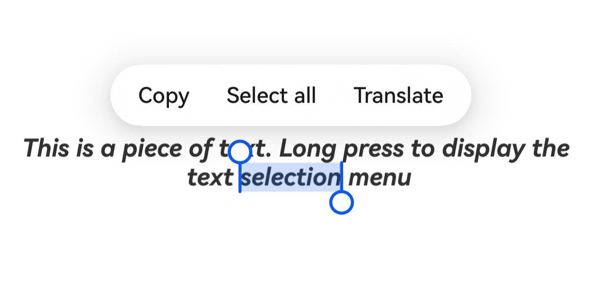

- Starting from API version 12, you can use [editMenuOptions](../reference/apis-arkui/arkui-ts/ts-basic-components-text.md#editmenuoptions12) to disable system menu callbacks and customize extended menu items. 

  <!-- @[Custom_Block_Menus](https://gitcode.com/openharmony/applications_app_samples/blob/master/code/DocsSample/ArkUISample/TextComponent/entry/src/main/ets/pages/text/CustomAndBlockMenus.ets) -->

  ``` TypeScript
  // xxx.ets
  @Entry
  @Component
  struct CustomAndBlockMenus {
    private static readonly CREATE_MENU_ITEM_ID_1: string = 'create1';
    private static readonly CREATE_MENU_ITEM_ID_2: string = 'create2';
    private static readonly PREPARE_MENU_ITEM_ID: string = 'prepare1';
    private controller: TextController = new TextController();
    @State private text: string = 'Text editMenuOptions';
    @State private endIndex: number = 0;
    @State blockCallbackText: string = '';
  
    // Create a helper method for menu items.
    private createMenuItem(id: string, content: string): TextMenuItem {
      // $r('app.media.startIcon') must be replaced with the image resource file required by the developer.
      return {
        content: content,
        icon: $r('app.media.startIcon'),
        id: TextMenuItemId.of(id)
      };
    }
  
    // Find the menu item index.
    private findMenuItemIndex(menuItems: Array<TextMenuItem>, menuItemId: TextMenuItemId): number {
      return menuItems.findIndex((item: TextMenuItem) => item.id.equals(menuItemId));
    }
  
    // Create the menu callback.
    private onCreateMenu = (menuItems: Array<TextMenuItem>): Array<TextMenuItem> => {
      const createItem1: TextMenuItem = this.createMenuItem(
        CustomAndBlockMenus.CREATE_MENU_ITEM_ID_1,
        'create1'
      );
  
      const createItem2: TextMenuItem = this.createMenuItem(
        CustomAndBlockMenus.CREATE_MENU_ITEM_ID_2,
        'create2'
      );
  
      // Add a custom menu item.
      menuItems.push(createItem1);
      menuItems.unshift(createItem2);
  
      // Remove unnecessary system menu items.
      this.removeMenuItemById(menuItems, TextMenuItemId.AI_WRITER);
      this.removeMenuItemById(menuItems, TextMenuItemId.TRANSLATE);
  
      return menuItems;
    }
  
    // Remove the specified menu item.
    private removeMenuItemById(menuItems: Array<TextMenuItem>, menuItemId: TextMenuItemId): void {
      const targetIndex: number = this.findMenuItemIndex(menuItems, menuItemId);
      if (targetIndex !== -1) {
        menuItems.splice(targetIndex, 1);
      }
    }
  
    // Menu item click callback.
    private onMenuItemClick = (menuItem: TextMenuItem, textRange: TextRange): boolean => {
      const menuItemId: TextMenuItemId = menuItem.id;
  
      // Handle the custom menu item. Return false to close the menu after clicking the custom menu item.
      if (menuItemId.equals(TextMenuItemId.of(CustomAndBlockMenus.CREATE_MENU_ITEM_ID_2))) {
        let msg = 'Intercept id: create2 start:' + textRange.start + '; end:' + textRange.end;
        this.blockCallbackText = msg;
        return false;
      }
      // Handle the custom menu item. Return true to keep the menu open after clicking the custom menu item.
      if (menuItemId.equals(TextMenuItemId.of(CustomAndBlockMenus.PREPARE_MENU_ITEM_ID))) {
        let msg = 'Intercept id: prepare1 start:' + textRange.start + '; end:+' + textRange.end;
        this.blockCallbackText = msg;
        return true;
      }
  
      // Handle the system menu item. Return true to intercept the system default logic. The copy menu will not close when tapped.
      if (menuItemId.equals(TextMenuItemId.COPY)) {
        let msg = 'Intercept COPY start:' + textRange.start + '; end:' + textRange.end;
        this.blockCallbackText = msg;
        // You can close the menu via the text controller. The handles will also disappear, leaving only the selected area, which can be dismissed by tapping.
        this.controller.closeSelectionMenu();
        return true;
      }
      // Handle the system menu item. Return false to not intercept the system default logic. The custom logic will also be executed.
      if (menuItemId.equals(TextMenuItemId.SELECT_ALL)) {
        let msg = 'Do not intercept SELECT_ALL start:' + textRange.start + '; end:' + textRange.end;
        this.blockCallbackText = msg;
        return false;
      }
  
      return false;
    }
    // Prepare the menu callback.
    private onPrepareMenu = (menuItems: Array<TextMenuItem>): Array<TextMenuItem> => {
      const prepareItem: TextMenuItem = this.createMenuItem(
        CustomAndBlockMenus.PREPARE_MENU_ITEM_ID,
        `prepare1_${this.endIndex}`
      );
  
      menuItems.unshift(prepareItem);
      return menuItems;
    }
    // Edit the menu options.
    @State private editMenuOptions: EditMenuOptions = {
      onCreateMenu: this.onCreateMenu,
      onMenuItemClick: this.onMenuItemClick,
      onPrepareMenu: this.onPrepareMenu
    };
    // Callback for text selection changes.
    private onTextSelectionChange = (selectionStart: number, selectionEnd: number): void => {
      this.endIndex = selectionEnd;
    }
  
    build() {
      NavDestination() {
        Column() {
          Text(this.text, { controller: this.controller })
            .fontSize(20)
            .copyOption(CopyOptions.LocalDevice)
            .editMenuOptions(this.editMenuOptions)
            .margin({ top: 100 })
            .onTextSelectionChange(this.onTextSelectionChange)
          Text(this.blockCallbackText).borderWidth(1)
        }
        .width('90%')
        .margin('5%')
      }
    }
  }
  ```

    

### Setting the AI Menu

The Text component implements AI menu display via the [enableDataDetector](../reference/apis-arkui/arkui-ts/ts-basic-components-text.md#enabledatadetector11) and [dataDetectorConfig](../reference/apis-arkui/arkui-ts/ts-basic-components-text.md#datadetectorconfig11) attributes. The AI menu appears in the following forms: tapping an AI entity (referring to recognizable content such as addresses and email addresses) pops up a menu with entity recognition options; after selecting text, entity recognition options are displayed in the text selection menu and the right-click context menu.

> **NOTE**
>
> Starting from API version 20, entity recognition options are supported in the text selection menu and the right-click context menu. This feature takes effect when [enableDataDetector](../reference/apis-arkui/arkui-ts/ts-basic-components-text.md#enabledatadetector11) is set to `true` and [copyOption](../reference/apis-arkui/arkui-ts/ts-basic-components-text.md#copyoption9) is set to `CopyOptions.LocalDevice`. The menu options include the following items from [TextMenuItemId](../reference/apis-arkui/arkui-ts/ts-text-common.md#textmenuitemid12): `url` (open link), `email` (compose new email), `phoneNumber` (call), `address` (navigate to this location), and `dateTime` (create calendar reminder).
>
> When this feature is in effect, the selected range must contain a complete AI entity for the corresponding options to appear.

- To enable the entity recognition options that pop up when tapping an AI entity, set [enableDataDetector](../reference/apis-arkui/arkui-ts/ts-basic-components-text.md#enabledatadetector11) to `true`. The following example shows this:

  <!-- @[set_ai_menu](https://gitcode.com/openharmony/applications_app_samples/blob/master/code/DocsSample/ArkUISample/TextComponent/entry/src/main/ets/pages/text/AIMenu.ets) --> 

  ``` TypeScript
  // The value of the 'app.string.AIMenu_Text_One' resource is 'Phone number: (86) (755) ********  \n \n Link: www.********.com
  // \n \n Email: ***@example.com\n \n Address: XX District, XX City, XX Province, XXXX \n \n Time: XX/XX/XXXX XXXX'
  Text($r('app.string.AIMenu_Text_One'))
    .fontSize(16)
    .copyOption(CopyOptions.LocalDevice)
    .enableDataDetector(true)// Enable entity recognition.
    .dataDetectorConfig({
      // Configure the recognition style.
      // types supports PHONE_NUMBER (phone number), URL (link), EMAIL (email), ADDRESS (address), and DATE_TIME (date/time).
      // When types is set to null or [], all entity types are recognized.
      types: [], onDetectResultUpdate: (result: string) => {
      }
    })
  ```

- If needed, to adjust the recognized styles, you can use [dataDetectorConfig](../reference/apis-arkui/arkui-ts/ts-basic-components-text.md#datadetectorconfig11). For details, see the [TextDataDetectorConfig](../reference/apis-arkui/arkui-ts/ts-text-common.md#textdatadetectorconfig11) configuration item.

- If needed, to adjust the menu position, you can use [editMenuOptions](../reference/apis-arkui/arkui-ts/ts-basic-components-text.md#editmenuoptions12). For details, see [Setting Custom Menu Extensions](../reference/apis-arkui/arkui-ts/ts-basic-components-text.md#example-12-setting-custom-menu-extensions).

<!--RP2--><!--RP2End-->

### Setting a Custom Menu

The Text component binds a custom selection menu via the [bindSelectionMenu](../reference/apis-arkui/arkui-ts/ts-basic-components-text.md#bindselectionmenu11) attribute.

  <!-- @[set_selection_menu_with_bindselectionmenu](https://gitcode.com/openharmony/applications_app_samples/blob/master/code/DocsSample/ArkUISample/TextComponent/entry/src/main/ets/pages/text/SelectMenu.ets) -->

  ``` TypeScript
  controller: TextController = new TextController();
  options: TextOptions = { controller: this.controller };
  ```

  <!-- @[set_selection_menu_with_bindselectionmenu_sec](https://gitcode.com/openharmony/applications_app_samples/blob/master/code/DocsSample/ArkUISample/TextComponent/entry/src/main/ets/pages/text/SelectMenu.ets) -->

  ``` TypeScript
  // Replace $r('app.string.show_selected_menu') with the actual resource file. In this example, the value of this resource file is "This is a text used to demonstrate the selection menu."
  Text($r('app.string.show_selected_menu'), this.options)
    .fontSize(30)
    .copyOption(CopyOptions.InApp)
    .bindSelectionMenu(TextSpanType.TEXT, this.RightClickTextCustomMenu, TextResponseType.RIGHT_CLICK, {
      onAppear: () => {
        // Replace $r('app.string.SelectMenu_Text_Ejected') with the actual resource file. In this example, the value of this resource file is "This callback is triggered when the custom selection menu is displayed."
        hilog.info(0x0000, 'Sample_TextComponent',
          this.getUIContext()
            .getHostContext()!.resourceManager.getStringSync($r('app.string.SelectMenu_Text_Ejected').id));
      },
      onDisappear: () => {
        // The value of the 'SelectMenu_Text_Close' resource file is 'This callback is triggered when the custom selection menu is closed.'
        hilog.info(0x0000, 'Sample_TextComponent',
          this.getUIContext()
            .getHostContext()!.resourceManager.getStringSync($r('app.string.SelectMenu_Text_Close').id));
      }
    })
  ```

  <!-- @[Right_Click_Text_CustomMenu](https://gitcode.com/openharmony/applications_app_samples/blob/master/code/DocsSample/ArkUISample/TextComponent/entry/src/main/ets/pages/text/SelectMenu.ets) -->

  ``` TypeScript
  // Define menu items.
  @Builder
  RightClickTextCustomMenu() {
    Column() {
      Menu() {
        MenuItemGroup() {
          // Replace $r('app.media.app_icon') with the actual resource file.
          MenuItem({ startIcon: $r('app.media.app_icon'), content: 'CustomMenu One', labelInfo: '' })
            .onClick(() => {
              // Use the closeSelectionMenu API to close the menu.
              this.controller.closeSelectionMenu();
            })
          MenuItem({ startIcon: $r('app.media.app_icon'), content: 'CustomMenu Two', labelInfo: '' })
          MenuItem({ startIcon: $r('app.media.app_icon'), content: 'CustomMenu Three', labelInfo: '' })
        }
      }.backgroundColor('#F0F0F0')
    }
  }
  ```

  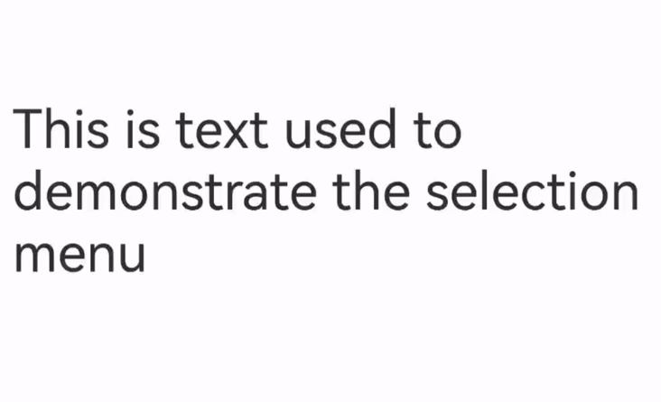

### Displaying the Text Menu in a Subwindow

The Text component controls the window in which the text menu is rendered via [TextMenuShowMode](../reference/apis-arkui/arkui-ts/ts-text-common.md#textmenushowmode16). In main window mode, the menu node is mounted to the root node of the main window, and the menu may be obscured by page content or affected by page scrolling. In subwindow mode, the menu node is mounted to the root node of an independent subwindow, and the menu floats above the main window, unaffected by the page layout.

  <!-- @[set_menu_options_with_textmenushowmode](https://gitcode.com/openharmony/applications_app_samples/blob/master/code/DocsSample/ArkUISample/TextComponent/entry/src/main/ets/pages/text/TextMenuShowSubWindow.ets) -->

  ``` TypeScript
  this.getUIContext()
    .getTextMenuController()
    .setMenuOptions(
      {
        showMode: TextMenuShowMode.PREFER_WINDOW
      }
    );
  ```

  <!-- @[textmenushowmode_create_text](https://gitcode.com/openharmony/applications_app_samples/blob/master/code/DocsSample/ArkUISample/TextComponent/entry/src/main/ets/pages/text/TextMenuShowSubWindow.ets) -->

  ``` TypeScript
  // Replace $r('app.string.Service_MenuItems_Text') with the actual resource file. In this example, the value of the resource file is "This is a piece of text. Long press to bring up the text selection menu."
  Text($r('app.string.Service_MenuItems_Text'))
    .fontSize(15)
    .margin({ top: 100 })
    .copyOption(CopyOptions.InApp)
  ```

  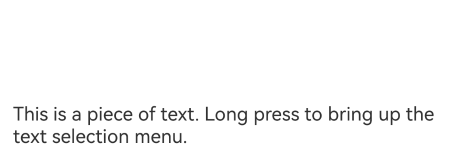

## Implementing a Trending Searches List

This example demonstrates the trending searches list effect using the [maxLines](../reference/apis-arkui/arkui-ts/ts-basic-components-text.md#maxlines), [textOverflow](../reference/apis-arkui/arkui-ts/ts-basic-components-text.md#textoverflow), [textAlign](../reference/apis-arkui/arkui-ts/ts-basic-components-text.md#textalign), and [constraintSize](../reference/apis-arkui/arkui-ts/ts-universal-attributes-size.md#constraintsize) attributes.

  <!-- @[the_text_fact_example](https://gitcode.com/openharmony/applications_app_samples/blob/master/code/DocsSample/ArkUISample/TextComponent/entry/src/main/ets/pages/text/TextHotSearch.ets) -->

  ``` TypeScript
  @Entry
  @Component
  struct TextHotSearch {
    build() {
      NavDestination() {
        Column({ space: 12 }) {
          // ...
            Column() {
              Row() {
                Text('1').fontSize(14).fontColor(Color.Red).margin({ left: 10, right: 10 })
                // Replace $r('app.string.TextHotSearch_textContent_one') with the actual resource file. In this example, the value of the resource file is "I am trending search term 1"
                Text($r('app.string.TextHotSearch_textContent_one'))
                  .fontSize(12)
                  .fontColor(Color.Blue)
                  .maxLines(1)
                  .textOverflow({ overflow: TextOverflow.Ellipsis })
                  .fontWeight(300)
                // Replace $r('app.string.TextHotSearch_textContent_two') with the actual resource file. In this example, the value of this resource file is "Explosive".
                Text($r('app.string.TextHotSearch_textContent_two'))
                  .margin({ left: 6 })
                  .textAlign(TextAlign.Center)
                  .fontSize(10)
                  .fontColor(Color.White)
                  .fontWeight(600)
                  .backgroundColor(0x770100)
                  .borderRadius(5)
                  .width(15)
                  .height(14)
              }.width('100%').margin(5)
  
              Row() {
                Text('2').fontSize(14).fontColor(Color.Red).margin({ left: 10, right: 10 })
                /*Replace $r('app.string.TextHotSearch_textContent_three') with the actual resource file.
                 * In this example, the value of the resource file is "I am trending search term 2 I am trending search term 2 I am trending search term 2 I am trending search term 2 I am trending search term 2"
                 */
                Text($r('app.string.TextHotSearch_textContent_three'))
                  .fontSize(12)
                  .fontColor(Color.Blue)
                  .fontWeight(300)
                  .constraintSize({ maxWidth: 200 })
                  .maxLines(1)
                  .textOverflow({ overflow: TextOverflow.Ellipsis })
                // Replace $r('app.string.TextHotSearch_textContent_four') with the actual resource file. In this example, the value of this resource file is "Hot".
                Text($r('app.string.TextHotSearch_textContent_four'))
                  .margin({ left: 6 })
                  .textAlign(TextAlign.Center)
                  .fontSize(10)
                  .fontColor(Color.White)
                  .fontWeight(600)
                  .backgroundColor(0xCC5500)
                  .borderRadius(5)
                  .width(15)
                  .height(14)
              }.width('100%').margin(5)
  
              Row() {
                Text('3').fontSize(14).fontColor(Color.Orange).margin({ left: 10, right: 10 })
                // Replace $r('app.string.TextHotSearch_textContent_five') with the actual resource file. In this example, the value of this resource file is "I am hot search term 3".
                Text($r('app.string.TextHotSearch_textContent_five'))
                  .fontSize(12)
                  .fontColor(Color.Blue)
                  .fontWeight(300)
                  .maxLines(1)
                  .constraintSize({ maxWidth: 200 })
                  .textOverflow({ overflow: TextOverflow.Ellipsis })
                // Replace $r('app.string.TextHotSearch_textContent_four') with the actual resource file. In this example, the value of this resource file is "Hot".
                Text($r('app.string.TextHotSearch_textContent_four'))
                  .margin({ left: 6 })
                  .textAlign(TextAlign.Center)
                  .fontSize(10)
                  .fontColor(Color.White)
                  .fontWeight(600)
                  .backgroundColor(0xCC5500)
                  .borderRadius(5)
                  .width(15)
                  .height(14)
              }.width('100%').margin(5)
  
              Row() {
                Text('4').fontSize(14).fontColor(Color.Grey).margin({ left: 10, right: 10 })
                /*Replace $r('app.string.TextHotSearch_textContent_six') with the actual resource file.
                 * In this example, the value of the resource file is "I am trending search term 4 I am trending search term 4 I am trending search term 4 I am trending search term 4 I am trending search term 4"
                 */
                Text($r('app.string.TextHotSearch_textContent_six'))
                  .fontSize(12)
                  .fontColor(Color.Blue)
                  .fontWeight(300)
                  .constraintSize({ maxWidth: 200 })
                  .maxLines(1)
                  .textOverflow({ overflow: TextOverflow.Ellipsis })
              }.width('100%').margin(5)
            }.width('100%')
          // ...
        }
        .width('100%')
        .height('100%')
        .padding({ left: 12, right: 12 })
      }
      // ...
    }
  }
  ```

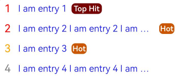

<!--RP1--><!--RP1End-->

<!--no_check-->