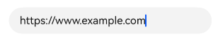
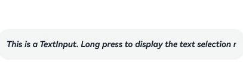
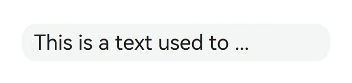
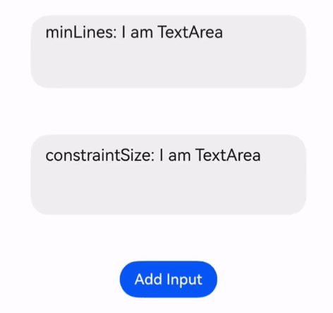

# Text Input (TextInput/TextArea/Search)
<!--Kit: ArkUI-->
<!--Subsystem: ArkUI-->
<!--Owner: @kangshihui-->
<!--Designer: @xiangyuan6-->
<!--Tester: @jiaoaozihao-->
<!--Adviser: @Brilliantry_Rui-->


The **TextInput** and **TextArea** components are input components used to accept input from the user, such as comments, chat messages, and table content. They can be used in combination with other components to meet more diversified purposes, for example, login and registration. For details, see [TextInput](../reference/apis-arkui/arkui-ts/ts-basic-components-textinput.md) and [TextArea](../reference/apis-arkui/arkui-ts/ts-basic-components-textarea.md). The **Search** component is a specialized input box (referred to as a "search box") with a default search icon in its style. For details, see [Search](../reference/apis-arkui/arkui-ts/ts-basic-components-search.md).


>  **NOTE**
>
>  Only plain text style is supported. For rich text requirements, use the [RichEditor](../reference/apis-arkui/arkui-ts/ts-basic-components-richeditor.md) component instead.

## Creating a Text Box

**TextInput** is a single-line input box, **TextArea** a multi-line input box, and **Search** a search box. Use the following APIs to create these components:

```ts
TextInput(value?:{placeholder?: ResourceStr, text?: ResourceStr, controller?: TextInputController})
```

```ts
TextArea(value?:{placeholder?: ResourceStr, text?: ResourceStr, controller?: TextAreaController})
```

```ts
Search(options?:{placeholder?: ResourceStr, value?: ResourceStr, controller?: SearchController, icon?: string})
```

- Single-line input box

  <!-- @[create_text_input](https://gitcode.com/openharmony/applications_app_samples/blob/master/code/DocsSample/ArkUISample/TextComponent/entry/src/main/ets/pages/textInput/CreatTextInput.ets) -->
  
  ``` TypeScript
  TextInput()
  ```

  


- Multi-line input box

  <!-- @[create_text_area](https://gitcode.com/openharmony/applications_app_samples/blob/master/code/DocsSample/ArkUISample/TextComponent/entry/src/main/ets/pages/textInput/CreatTextInput.ets) -->
  
  ``` TypeScript
  TextArea()
  ```

  

- The **TextArea** component automatically wraps text so that each line does not have more than the width of the component.

  <!-- @[create_text_area_example](https://gitcode.com/openharmony/applications_app_samples/blob/master/code/DocsSample/ArkUISample/TextComponent/entry/src/main/ets/pages/textInput/CreatTextInput.ets) -->
  
  ``` TypeScript
  /* Replace $r('app.string.CreatTextInput_textContent') with the actual resource file. In this example, the value in the resource file is
   "I am TextArea I am TextArea I am TextArea I am TextArea." */
  TextArea({ text: $r('app.string.CreatTextInput_textContent') })
    .width(300)
  ```

  

- Search box

  <!-- @[create_text_search](https://gitcode.com/openharmony/applications_app_samples/blob/master/code/DocsSample/ArkUISample/TextComponent/entry/src/main/ets/pages/textInput/CreatTextInput.ets) -->
  
  ``` TypeScript
  Search()
    // Replace $r('app.string.Creat_TextInput_Content') with the actual resource file. In this example, the value in the resource file is "Search."
    .searchButton($r('app.string.Creat_TextInput_Content'))
  ```

  

## Setting the Input Box Type

The **type** attribute configures the input box type for **TextInput**, **TextArea**, and **Search**. The supported values vary slightly across components. The following examples use a single-line input box (**TextInput**).

The following types are available for **TextInput**: **Normal**, **Password**, **Email**, **Number**, **PhoneNumber**, **USER_NAME**, **NEW_PASSWORD**, **NUMBER_PASSWORD**, **<!--Del-->SCREEN_LOCK_PASSWORD**, **<!--DelEnd-->NUMBER_DECIMAL**, and URL input mode. You can set the [type](../reference/apis-arkui/arkui-ts/ts-basic-components-textinput.md#type) attribute as follows:

### Normal Input Mode (Default Type)

<!-- @[set_password_input_type_1](https://gitcode.com/openharmony/applications_app_samples/blob/master/code/DocsSample/ArkUISample/TextComponent/entry/src/main/ets/pages/textInput/SetTextInputType.ets) -->

``` TypeScript
TextInput()
  .type(InputType.Normal)
```


### Password Mode

The password mode supports **Password**, **NUMBER_PASSWORD**, and **NEW_PASSWORD** input.

The following example is a password input box.
<!-- @[set_password_input_type_2](https://gitcode.com/openharmony/applications_app_samples/blob/master/code/DocsSample/ArkUISample/TextComponent/entry/src/main/ets/pages/textInput/SetTextInputType.ets) -->

``` TypeScript
TextInput()
  .type(InputType.Password)
```


### Email Address Input Mode

The email address input mode allows only one at sign (@) in the input.

<!-- @[set_email_input_type_3](https://gitcode.com/openharmony/applications_app_samples/blob/master/code/DocsSample/ArkUISample/TextComponent/entry/src/main/ets/pages/textInput/SetTextInputType.ets) -->

``` TypeScript
TextInput()
  .type(InputType.Email)
```


### Numeric Input Mode
The numeric input mode allows only digits (0-9).

<!-- @[set_number_input_type_4](https://gitcode.com/openharmony/applications_app_samples/blob/master/code/DocsSample/ArkUISample/TextComponent/entry/src/main/ets/pages/textInput/SetTextInputType.ets) -->

``` TypeScript
TextInput()
  .type(InputType.Number)
```


### Phone Number Input Mode

The phone number input mode can contain digits, spaces, plus signs (+), minus signs (-), asterisks (*), number signs (#), and parentheses (()). No length limit applies.

<!-- @[set_phonenumber_input_type_5](https://gitcode.com/openharmony/applications_app_samples/blob/master/code/DocsSample/ArkUISample/TextComponent/entry/src/main/ets/pages/textInput/SetTextInputType.ets) -->

``` TypeScript
TextInput()
  .type(InputType.PhoneNumber)
```


### Numeric Input Mode with Decimal Points

The numeric input mode with decimal points allows only digits (0-9) and a single decimal point (.).
<!-- @[set_number_decimal_input_type_6](https://gitcode.com/openharmony/applications_app_samples/blob/master/code/DocsSample/ArkUISample/TextComponent/entry/src/main/ets/pages/textInput/SetTextInputType.ets) -->

``` TypeScript
TextInput()
  .type(InputType.NUMBER_DECIMAL)
```


### URL Input Mode

The URL input mode has no special restrictions on input.
<!-- @[set_url_input_type_7](https://gitcode.com/openharmony/applications_app_samples/blob/master/code/DocsSample/ArkUISample/TextComponent/entry/src/main/ets/pages/textInput/SetTextInputType.ets) -->

``` TypeScript
TextInput()
  .type(InputType.URL)
```



## Setting the Input Box Style

Both the **TextInput** and **TextArea** components support polymorphic styles, configured through the [style](../reference/apis-arkui/arkui-ts/ts-basic-components-textarea.md#style10) attribute. The following examples use **TextArea**.

**TextArea** supports two styles: default style (**TextContentStyle.DEFAULT**) and inline style (**TextContentStyle.INLINE**).

### Default Style

In the default style, the appearance of the input box remains consistent whether it is being edited or not.
<!-- @[textArea_style_default](https://gitcode.com/openharmony/applications_app_samples/blob/master/code/DocsSample/ArkUISample/TextComponent/entry/src/main/ets/pages/textInput/SetInputMultiTypeStyle.ets) -->

``` TypeScript
TextArea()
  .style(TextContentStyle.DEFAULT)
```


### Inline Style

Inline style is also called inline input style. The input box in inline style has clearly distinguishable styles between its editing state and non-editing state.
<!-- @[textArea_style_inline](https://gitcode.com/openharmony/applications_app_samples/blob/master/code/DocsSample/ArkUISample/TextComponent/entry/src/main/ets/pages/textInput/SetInputMultiTypeStyle.ets) -->

``` TypeScript
TextArea()
  .style(TextContentStyle.INLINE)
```


## Setting Styles

- Set the placeholder text displayed when there is no input.

  <!-- @[custom_text_input_with_place_holder](https://gitcode.com/openharmony/applications_app_samples/blob/master/code/DocsSample/ArkUISample/TextComponent/entry/src/main/ets/pages/textInput/CustomTextInputStyle.ets) -->
  
  ``` TypeScript
  // Replace $r('app.string.i_am_placeholder') with the actual resource file. In this example, the value in the resource file is "I am placeholder text."
  TextInput({ placeholder: $r('app.string.i_am_placeholder') })
  ```

  


- Set the current text input.

  <!-- @[custom_text_input_with_place_holder_and_text](https://gitcode.com/openharmony/applications_app_samples/blob/master/code/DocsSample/ArkUISample/TextComponent/entry/src/main/ets/pages/textInput/CustomTextInputStyle.ets) -->
  
  ``` TypeScript
  TextInput({
    // Replace $r('app.string.i_am_placeholder') with the actual resource file. In this example, the value in the resource file is "I am placeholder text."
    placeholder: $r('app.string.i_am_placeholder'),
    // Replace $r('app.string.i_am_current_text_content') with the actual resource file. In this example, the value in the resource file is "I am current text input."
    text: $r('app.string.i_am_current_text_content')
  })
  ```

  

- Use **backgroundColor** to set the background color of the text box.

  <!-- @[custom_text_input_background_color](https://gitcode.com/openharmony/applications_app_samples/blob/master/code/DocsSample/ArkUISample/TextComponent/entry/src/main/ets/pages/textInput/CustomTextInputStyle.ets) -->
  
  ``` TypeScript
  TextInput({
    // Replace $r('app.string.i_am_placeholder') with the actual resource file. In this example, the value in the resource file is "I am placeholder text."
    placeholder: $r('app.string.i_am_placeholder'),
    // Replace $r('app.string.i_am_current_text_content') with the actual resource file. In this example, the value in the resource file is "I am current text input."
    text: $r('app.string.i_am_current_text_content')
  })
    .backgroundColor(Color.Pink)
  ```

  

  More styles can be implemented by leveraging the [universal attributes](../reference/apis-arkui/arkui-ts/ts-component-general-attributes.md).


## Adding Events

Input boxes capture user input and upload data. You can bind the following events: **onChange** for retrieving updated text content when the input value changes, **onSubmit** for retrieving text submitted by the user when the **Enter** key is pressed, **onTextSelectionChange** for retrieving handle positions during text selection or cursor position during text editing. You can also bind universal events for basic interactive operations.

>  **NOTE**
>
>  In password mode, when the **showPassword** attribute is configured, add status synchronization logic in the **onSecurityStateChange** callback. For details, see the following example.
>
> The **onWillInsert**, **onDidInsert**, **onWillDelete**, and **onDidDelete** callbacks are only supported with the system input method.
>
> [onWillChange](../reference/apis-arkui/arkui-ts/ts-basic-components-textinput.md#onwillchange15) is triggered after **onWillInsert** and **onWillDelete**, and before **onDidInsert** and **onDidDelete**.

<!-- @[TextInputAddEvent](https://gitcode.com/openharmony/applications_app_samples/blob/master/code/DocsSample/ArkUISample/TextComponent/entry/src/main/ets/pages/textInput/TextInputAddEvent.ets) -->

``` TypeScript
import { hilog } from '@kit.PerformanceAnalysisKit';

const TAG = '[Sample_Textcomponent]';
const DOMAIN = 0xF811;
const BUNDLE = 'Textcomponent_';

@Entry
@Component
struct TextInputEventAdd {
  @State text: string = '';
  @State textStr1: string = '';
  @State textStr2: string = '';
  @State textStr3: string = '';
  @State textStr4: string = '';
  @State textStr5: string = '';
  @State textStr6: string = '';
  @State textStr7: string = '';
  @State textStr8: string = '';
  @State textStr9: string = '';
  @State passwordState: boolean = false;
  controller: TextInputController = new TextInputController();

  build() {
    Row() {
      Column() {
        Text(`${this.textStr1}\n${this.textStr2}\n${this.textStr3}
          \n${this.textStr4}\n${this.textStr5}\n${this.textStr6}
          \n${this.textStr7}\n${this.textStr8}\n${this.textStr9}`)
          .fontSize(20)
        TextInput({ text: this.text, placeholder: 'input your word...', controller: this.controller })
          .type(InputType.Password)
          .showPassword(this.passwordState)
          .onChange((value: string) => {
            // Triggered when the text content changes.
            hilog.info(DOMAIN, TAG, BUNDLE + 'onChange is triggering: ' + value);
            this.textStr1 = `onChange is triggering: ${value}`;
          })
          .onSubmit((enterKey: EnterKeyType, event: SubmitEvent) => {
            // Triggered when the Enter key is pressed.
            hilog.info(DOMAIN, TAG, BUNDLE + 'onSubmit is triggering: ' + enterKey + event.text);
            this.textStr2 = `onSubmit is triggering: ${enterKey} ${event.text}`;
          })
          .onTextSelectionChange((selectionStart: number, selectionEnd: number) => {
            // Triggered when the text selection position changes or the cursor position changes in the editing state.
            hilog.info(DOMAIN, TAG, BUNDLE + 'onTextSelectionChange is triggering: ' + selectionStart + selectionEnd);
            this.textStr3 = `onTextSelectionChange is triggering: ${selectionStart} ${selectionEnd}`;
          })
          .onSecurityStateChange((isShowPassword: boolean) => {
            // Triggered when the password visibility changes.
            hilog.info(DOMAIN, TAG, BUNDLE + 'onSecurityStateChange is triggering: ' + isShowPassword);
            this.passwordState = isShowPassword;
            this.textStr4 = `onSecurityStateChange is triggering: ${isShowPassword}`;
          })
          .onWillInsert((info: InsertValue) => {
            // Triggered when text is about to be inserted.
            hilog.info(DOMAIN, TAG, BUNDLE + 'onWillInsert is triggering: ' + info.insertValue + info.insertOffset);
            this.textStr5 = `onWillInsert is triggering: ${info.insertValue} ${info.insertOffset}`;
            return true;
          })
          .onDidInsert((info: InsertValue) => {
            // Triggered when the input is complete.
            hilog.info(DOMAIN, TAG, BUNDLE + 'onDidInsert is triggering: ' + info.insertValue + info.insertOffset);
            this.textStr6 = `onDidInsert is triggering: ${info.insertValue} ${info.insertOffset}`;
          })
          .onWillDelete((info: DeleteValue) => {
            // Triggered when text is about to be deleted.
            hilog.info(DOMAIN, TAG, BUNDLE + 'onWillDelete is triggering: ' + info.deleteValue + info.deleteOffset);
            this.textStr7 = `onWillDelete is triggering: ${info.deleteValue} ${info.deleteOffset}`;
            return true;
          })
          .onDidDelete((info: DeleteValue) => {
            // Triggered when the deletion is complete.
            hilog.info(DOMAIN, TAG, BUNDLE + 'onDidDelete is triggering: ' + info.deleteValue + info.deleteOffset);
            this.textStr8 = `onDidDelete is triggering: ${info.deleteValue} ${info.deleteOffset}`;
          })
          .onFocus(() => {
            // Bind a universal event. This callback is triggered when the text box gains focus.
            hilog.info(DOMAIN, TAG, BUNDLE + 'onFocus is triggering');
            this.textStr9 = `onFocus is triggering`;
          })
      }.width('100%')
    }
    .height('100%')
  }
}
```


## Text Selection Menu

When text is selected within a text box, a context menu appears with options such as **Cut**, **Copy**, **Translate**, and **Share**.

**TextInput**:

<!-- @[select_textinput](https://gitcode.com/openharmony/applications_app_samples/blob/master/code/DocsSample/ArkUISample/TextComponent/entry/src/main/ets/pages/textInput/SelectMenu.ets) -->

``` TypeScript
// Replace $r('app.string.show_selected_menu') with the actual resource file. In this example, the value in the resource file is "This is text used to show the selection menu."
TextInput({ text: $r('app.string.show_selected_menu') })
```


**TextArea**:

<!-- @[select_textarea](https://gitcode.com/openharmony/applications_app_samples/blob/master/code/DocsSample/ArkUISample/TextComponent/entry/src/main/ets/pages/textInput/SelectMenu.ets) -->

``` TypeScript
// Replace $r('app.string.show_selected_menu') with the actual resource file. In this example, the value in the resource file is "This is text used to show the selection menu."
TextArea({ text: $r('app.string.show_selected_menu') })
```


## Disabling System Service Menu Items

Since API version 20, use [disableSystemServiceMenuItems](../reference/apis-arkui/arkts-apis-uicontext-textmenucontroller.md#disablesystemservicemenuitems20) to disable all system service menu items in the text selection menu.

<!-- @[DisableSystemServiceMenuItems](https://gitcode.com/openharmony/applications_app_samples/blob/master/code/DocsSample/ArkUISample/TextComponent/entry/src/main/ets/pages/textInput/disablemenu/DisableSystemServiceMenuItems.ets) -->

``` TypeScript
import { TextMenuController } from '@kit.ArkUI';

@Entry
@Component
struct DisableSystemServiceMenuItem {
  aboutToAppear(): void {
    // Disable all system service menu items.
    TextMenuController.disableSystemServiceMenuItems(true)
  }

  aboutToDisappear(): void {
    // Restore system service menu items when the page disappears.
    TextMenuController.disableSystemServiceMenuItems(false)
  }

  build() {
    Row() {
      Column() {
        // Replace $r('app.string.ProhibitSelectMenu_content') with the actual resource file. In this example, the value in the resource file is "This is a TextInput. Long press to display the text selection menu."
        TextInput({ text: $r('app.string.ProhibitSelectMenu_content') })
          .height(60)
          .fontStyle(FontStyle.Italic)
          .fontWeight(FontWeight.Bold)
          .textAlign(TextAlign.Center)
          .caretStyle({ width: '4vp' })
          .editMenuOptions({
            onCreateMenu: (menuItems: Array<TextMenuItem>) => {
              // menuItems no longer contains disabled system menu items.
              return menuItems
            },
            onMenuItemClick: (menuItem: TextMenuItem, textRange: TextRange) => {
              return false
            }
          })
      }.width('100%')
    }
    .height('100%')
  }
}
```



Since API version 20, use [disableMenuItems](../reference/apis-arkui/arkts-apis-uicontext-textmenucontroller.md#disablemenuitems20) to disable specified system service menu items in the text selection menu.

<!-- @[DisableMenuItems](https://gitcode.com/openharmony/applications_app_samples/blob/master/code/DocsSample/ArkUISample/TextComponent/entry/src/main/ets/pages/textInput/disablemenu/DisableMenuItems.ets) -->

``` TypeScript
import { TextMenuController } from '@kit.ArkUI';

@Entry
@Component
struct DisableMenuItem {
  aboutToAppear(): void {
    // Disable search and translate menu items.
    TextMenuController.disableMenuItems([TextMenuItemId.SEARCH, TextMenuItemId.TRANSLATE])
  }

  aboutToDisappear(): void {
    // Restore system service menu items when the page disappears.
    TextMenuController.disableMenuItems([])
  }

  build() {
    Row() {
      Column() {
        // Replace $r('app.string.ProhibitSelectMenu_content') with the actual resource file. In this example, the value in the resource file is "This is a TextInput. Long press to display the text selection menu."
        TextInput({ text: $r('app.string.ProhibitSelectMenu_content') })
          .height(60)
          .fontStyle(FontStyle.Italic)
          .fontWeight(FontWeight.Bold)
          .textAlign(TextAlign.Center)
          .caretStyle({ width: '4vp' })
          .editMenuOptions({
            onCreateMenu: (menuItems: Array<TextMenuItem>) => {
              // menuItems no longer contains search and translate items.
              return menuItems;
            },
            onMenuItemClick: (menuItem: TextMenuItem, textRange: TextRange) => {
              return false
            }
          })
      }.width('100%')
    }
    .height('100%')
  }
}
```


## Autofill

You can specify the expected content type of a text box using the [contentType](../reference/apis-arkui/arkui-ts/ts-basic-components-textinput.md#contenttype12) attribute.

For details about the supported types, see [ContentType](../reference/apis-arkui/arkui-ts/ts-basic-components-textinput.md#contenttype12).
<!-- @[auto_fill](https://gitcode.com/openharmony/applications_app_samples/blob/master/code/DocsSample/ArkUISample/TextComponent/entry/src/main/ets/pages/textInput/AutoFill.ets) -->

``` TypeScript
// Replace $r('app.string.Auto_Fill_PlaceHolder') with the actual resource file. In this example, the value in the resource file is "Enter your email address..."
TextInput({ placeholder: $r('app.string.Auto_Fill_PlaceHolder') })
  .width('95%')
  .height(40)
  .margin(20)
  .contentType(ContentType.EMAIL_ADDRESS)
```

## Setting Attributes

- Setting the ellipsis position

  You can control where the ellipsis appears when text overflows using the [ellipsisMode](../reference/apis-arkui/arkui-ts/ts-basic-components-textinput.md#ellipsismode18) attribute.

  For the settings to work, **overflow** must be set to **TextOverflow.Ellipsis**. Setting **ellipsisMode** alone does not take effect.

  <!-- @[set_omission_property](https://gitcode.com/openharmony/applications_app_samples/blob/master/code/DocsSample/ArkUISample/TextComponent/entry/src/main/ets/pages/textInput/SetProperty.ets) -->
  
  ``` TypeScript
  // Replace $r('app.string.Set_Omission_Property_textContent') with the actual resource file. In this example, the value in the resource file is "This is a text used to display the ellipsis mode."
  TextInput({ text: $r('app.string.Set_Omission_Property_textContent') })
    .textOverflow(TextOverflow.Ellipsis)
    .ellipsisMode(EllipsisMode.END)
    .style(TextInputStyle.Inline)
    .fontSize(30)
    .margin(30)
  ```
  

- Setting the text stroke

  Starting from API version 20, you can add an outline (stroke) to the text in a text box using the [strokeWidth](../reference/apis-arkui/arkui-ts/ts-basic-components-textinput.md#strokewidth20) and [strokeColor](../reference/apis-arkui/arkui-ts/ts-basic-components-textinput.md#strokecolor20) attributes.

  <!-- @[set_stroke_property](https://gitcode.com/openharmony/applications_app_samples/blob/master/code/DocsSample/ArkUISample/TextComponent/entry/src/main/ets/pages/textInput/SetProperty.ets) -->
  
  ``` TypeScript
  TextInput({ text: 'Text with stroke' })
    .width('100%')
    .height(60)
    .borderWidth(1)
    .fontSize(40)
    .strokeWidth(LengthMetrics.px(3.0))
    .strokeColor(Color.Red)
  ```
  

## Setting Text Line Spacing

Starting from API version 20, you can adjust the spacing between lines of text using the [lineSpacing](../reference/apis-arkui/arkui-ts/ts-basic-components-text.md#linespacing20) attribute. When [LineSpacingOptions](../reference/apis-arkui/arkui-ts/ts-text-common.md#linespacingoptions20) is not configured, line spacing is applied both above the first line and below the last line. To restrict spacing to only between lines (that is, no extra space above the first or below the last line), set the **onlyBetweenLines** property to **true**.

<!-- @[SetTextMargin](https://gitcode.com/openharmony/applications_app_samples/blob/master/code/DocsSample/ArkUISample/TextComponent/entry/src/main/ets/pages/textInput/SetTextMargin.ets) -->

``` TypeScript
TextArea({
  text: 'The line spacing of this TextArea is set to 20_px, and the spacing is effective only between the lines.'
})
  .fontSize(22)
  .lineSpacing(LengthMetrics.px(20), { onlyBetweenLines: true })
```


## Implementing Keyboard Avoidance

After the keyboard is displayed, scrollable container components activate keyboard avoidance only when switching between landscape and portrait modes. To enable keyboard avoidance for non-scrollable container components, nest them within a scrollable container component, such as [Scroll](../reference/apis-arkui/arkui-ts/ts-container-scroll.md), [List](../reference/apis-arkui/arkui-ts/ts-container-list.md), or [Grid](../reference/apis-arkui/arkui-ts/ts-container-grid.md).

<!-- @[keyboard_avoid](https://gitcode.com/openharmony/applications_app_samples/blob/master/code/DocsSample/ArkUISample/TextComponent/entry/src/main/ets/pages/textInput/KeyboardAvoidance.ets) -->

``` TypeScript
@Entry
@Component
struct KeyboardAvoid {
  placeHolderArr: string[] = ['1', '2', '3', '4', '5', '6', '7'];

  build() {
    Scroll() {
      Column() {
        ForEach(this.placeHolderArr, (placeholder: string) => {
          TextInput({ placeholder: 'TextInput ' + placeholder })
            .margin(30)
            // ···
        })
      }
    }
    .height('100%')
    .width('100%')
  }
}
```


## Implementing Caret Avoidance

The **OFFSET** and **RESIZE** modes of [keyBoardAvoidMode](../reference/apis-arkui/arkts-apis-uicontext-e.md#keyboardavoidmode11) do not allow for secondary avoidance actions after the keyboard has been lifted. To support additional caret avoidance actions, you can use the **OFFSET_WITH_CARET** and **RESIZE_CARET** options.<br>

**RESIZE_WITH_CARET** is recommended for scrollable containers, and **OFFSET_WITH_CARET** is recommended for non-scrollable containers.

<!-- @[cursor_avoid_part1](https://gitcode.com/openharmony/applications_app_samples/blob/master/code/DocsSample/ArkUISample/TextComponent/entry/src/main/ets/entryability/EntryAbility.ets) -->

``` TypeScript
import { hilog } from '@kit.PerformanceAnalysisKit';
import { window } from '@kit.ArkUI';
import { KeyboardAvoidMode } from '@kit.ArkUI';
```

<!-- @[cursor_avoid_part2](https://gitcode.com/openharmony/applications_app_samples/blob/master/code/DocsSample/ArkUISample/TextComponent/entry/src/main/ets/entryability/EntryAbility.ets) -->

``` TypeScript
// Used in UIAbility
onWindowStageCreate(windowStage: window.WindowStage): void {
  // The main window is created. Set a main page for this ability.
  hilog.info(0x0000, 'testTag', '%{public}s', 'Ability onWindowStageCreate');

  windowStage.loadContent('pages/Index', (err, data) => {
    let keyboardAvoidMode = windowStage.getMainWindowSync().getUIContext().getKeyboardAvoidMode();
    windowStage.getMainWindowSync().getUIContext().setKeyboardAvoidMode(KeyboardAvoidMode.OFFSET_WITH_CARET);
    if (err.code) {
      hilog.error(0x0000, 'testTag', 'Failed to load the content. Cause: %{public}s', JSON.stringify(err) ?? '');
      return;
    }
    hilog.info(0x0000, 'testTag', 'Succeeded in loading the content. Data: %{public}s', JSON.stringify(data) ?? '');
  });
}
```

<!-- @[cursor_avoid](https://gitcode.com/openharmony/applications_app_samples/blob/master/code/DocsSample/ArkUISample/TextComponent/entry/src/main/ets/pages/textInput/CursorAvoidance.ets) -->

``` TypeScript
@Entry
@Component
struct CursorAvoid {
  @State caretPosition: number = 600;
  areaController: TextAreaController = new TextAreaController();
  text = 'Most of us compare ourselves with anyone we think is happier — a relative, someone we know a lot,' +
    ' or someone we hardly know. As a result, what we do remember is anything that makes others happy, ' +
    'anything that makes ourselves unhappy,' +
    ' totally forgetting that there is something happy in our own life.\
    So the best way to destroy happiness is to look at something and focus on even the smallest flaw. ' +
    'It is the smallest flaw that would make us complain. And it is the complaint that leads to us becoming unhappy.\
    If one chooses to be happy, he will be blessed; if he chooses to be unhappy, he will be cursed. ' +
    'Happiness is just what you think will make you happy.' +
    'Most of us compare ourselves with anyone we think is happier — a relative, someone we know a lot, ' +
    'or someone we hardly know. As a result, what we do remember is anything that makes others happy, ' +
    'anything that makes ourselves unhappy, totally forgetting that there is something happy in our own life.\
  ';

  build() {
    Scroll() {
      Column() {
        Row() {
          Button('CaretPosition++: ' + this.caretPosition).onClick(() => {
            this.caretPosition += 1;
          }).fontSize(10)
          Button('CaretPosition--: ' + this.caretPosition).onClick(() => {
            this.caretPosition -= 1;
          }).fontSize(10)
          Button('SetCaretPosition: ').onClick(() => {
            this.areaController.caretPosition(this.caretPosition);
          }).fontSize(10)
        }

        TextArea({ text: this.text, controller: this.areaController })
          .width('100%')
          .fontSize('20fp')
      }
    }.width('100%').height('100%')
  }
}
```


## FAQs

### How Do I Set a Minimum Number of Lines for TextArea and Make It Expand Automatically?

**Symptom**

You want to set an initial height for a **TextArea** component that displays a minimum number of lines, and have the component expand vertically when the input text exceeds that height.

**Solution**

Set [minLines](../reference/apis-arkui/arkui-ts/ts-basic-components-textarea.md#minlines20) (available since API version 20), or set **height** to **"auto"** and use [constraintSize](../reference/apis-arkui/arkui-ts/ts-universal-attributes-size.md#constraintsize) to calculate the height.

<!-- @[normal_question_text_example](https://gitcode.com/openharmony/applications_app_samples/blob/master/code/DocsSample/ArkUISample/TextComponent/entry/src/main/ets/pages/textInput/NormalQuestion.ets) -->

``` TypeScript
import { MeasureUtils } from '@kit.ArkUI';

@Entry
@Component
struct TextExample {
  private textAreaPadding = 12;
  private setMaxLines = 3;
  private resourceManager = this.getUIContext().getHostContext()?.resourceManager;
  // Configure a resource whose name is NormalQuestion_change and value is a non-null character string in the resources\base\element\string.json file.
  private changeText = this.resourceManager?.getStringByNameSync('NormalQuestion_change') as string;
  @State fullText: string = this.changeText;
  @State originText: string = this.changeText;
  @State uiContext: UIContext = this.getUIContext();
  @State uiContextMeasure: MeasureUtils = this.uiContext.getMeasureUtils();
  textSize: SizeOptions = this.uiContextMeasure.measureTextSize({
    textContent: this.originText,
    fontSize: 18
  });

  build() {
    Column() {
      TextArea({ text: 'minLines: ' + this.fullText })
        .fontSize(18)
        .width(300)
        .minLines(3)

      Blank(50)

      TextArea({ text: 'constraintSize: ' + this.fullText })
        .fontSize(18)
        .padding({ top: this.textAreaPadding, bottom: this.textAreaPadding })
        .width(300)
        .height('auto')
        .constraintSize({
          // Calculate the minimum height required to display the specified number of lines, including padding.
          // If dynamic font scaling is involved (for example, for aging-friendly design), listen for font size changes and update the calculated height accordingly.
          minHeight: this.textAreaPadding * 2 +
            this.setMaxLines * this.getUIContext().px2vp(Number(this.textSize.height))
        })

      Blank(50)
      // Replace $r('app.string.NormalQuestion_AddInput') with the actual resource file. In this example, the value in the resource file is "Add Input."
      Button($r('app.string.NormalQuestion_AddInput'))
        .onClick(() => {
          this.fullText += this.changeText;
        })
    }
    .justifyContent(FlexAlign.Center)
    .width('100%')
    .padding({ top: 30 })
  }
}
```


