# Text Input (TextInput/TextArea/Search)

<!--Kit: ArkUI-->
<!--Subsystem: ArkUI-->
<!--Owner: @jiaxiaguang-->
<!--Designer: @xiangyuan6-->
<!--Tester: @jiaoaozihao-->
<!--Adviser: @Brilliantry_Rui-->
<!-- md-trans-meta sourceCommit=16d5012cdda87180d94e0c1ee3584d2af7b86146 translatedAt=2026-07-29T12:47:34.065Z pushedAt=2026-07-31T01:56:14.396Z -->

TextInput and TextArea are input box components used to respond to user input, such as input in comment sections, chat boxes, and forms. They can also be combined with other components to build functional pages, for example, login and registration pages. For details, see the API documentation for [TextInput](../reference/apis-arkui/arkui-ts/ts-basic-components-textinput.md) and [TextArea](../reference/apis-arkui/arkui-ts/ts-basic-components-textarea.md). Search is a special input box component called a search box, which includes a search icon in its default style. For details, see the API documentation for [Search](../reference/apis-arkui/arkui-ts/ts-basic-components-search.md).

> **NOTE**
>
> Only plain text styles are supported. To implement rich text styles, use the [RichEditor](../reference/apis-arkui/arkui-ts/ts-basic-components-richeditor.md) component.

## Creating an Input Box

TextInput is a single-line input box, TextArea is a multiline input box, and Search is a search box. You can create these components using the following APIs.

- A single-line input box.

  <!-- @[create_text_input](https://gitcode.com/openharmony/applications_app_samples/blob/master/code/DocsSample/ArkUISample/TextComponent/entry/src/main/ets/pages/textInput/CreatTextInput.ets) -->

  ``` TypeScript
  TextInput()
  ```

  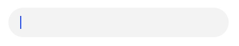

- A multiline input box. Text automatically wraps when it exceeds one line.

  <!-- @[create_text_area_example](https://gitcode.com/openharmony/applications_app_samples/blob/master/code/DocsSample/ArkUISample/TextComponent/entry/src/main/ets/pages/textInput/CreatTextInput.ets) -->

  ``` TypeScript
  /*Replace $r('app.string.CreatTextInput_textContent') with the actual resource file. In this example, the value of the resource file is
   * "I am TextArea I am TextArea I am TextArea I am TextArea"
   */
  TextArea({ text: $r('app.string.CreatTextInput_textContent') })
    .width(300)
  ```

  

- Search box.

  <!-- @[create_text_search](https://gitcode.com/openharmony/applications_app_samples/blob/master/code/DocsSample/ArkUISample/TextComponent/entry/src/main/ets/pages/textInput/CreatTextInput.ets) -->

  ``` TypeScript
  Search()
    // Replace $r('app.string.Creat_TextInput_Content') with the actual resource file. In this example, the value of the resource file is "Search"
    .searchButton($r('app.string.Creat_TextInput_Content'))
  ```

  

## Setting the Input Box Type

TextInput, TextArea, and Search all support setting the input box type through the `type` attribute, but the enum values vary slightly across components. The following uses the single-line input box as an example.

TextInput offers the following types: Normal for basic input, Password for password input, and Email for email address input mode. Set the type through the [type](../reference/apis-arkui/arkui-ts/ts-basic-components-textinput.md#type) attribute:

### Normal Input Mode

<!-- @[set_password_input_type_1](https://gitcode.com/openharmony/applications_app_samples/blob/master/code/DocsSample/ArkUISample/TextComponent/entry/src/main/ets/pages/textInput/SetTextInputType.ets) -->

``` TypeScript
TextInput()
  .type(InputType.Normal)
```

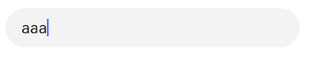

### Password Mode

This includes the `Password` password input mode, `NUMBER_PASSWORD` numeric password mode, and `NEW_PASSWORD` new password input mode.

The following example shows an input box in `Password` password input mode.

<!-- @[set_password_input_type_2](https://gitcode.com/openharmony/applications_app_samples/blob/master/code/DocsSample/ArkUISample/TextComponent/entry/src/main/ets/pages/textInput/SetTextInputType.ets) -->

``` TypeScript
TextInput()
  .type(InputType.Password)
```

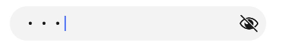

### Email Address Input Mode

In email address input mode, the input box can contain only one @ symbol.

<!-- @[set_email_input_type_3](https://gitcode.com/openharmony/applications_app_samples/blob/master/code/DocsSample/ArkUISample/TextComponent/entry/src/main/ets/pages/textInput/SetTextInputType.ets) -->

``` TypeScript
TextInput()
  .type(InputType.Email)
```

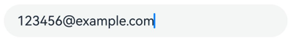

## Setting the Input Box Style

You can set the input box style through attributes such as style, placeholder, backgroundColor, and contentType. For richer styling, you can combine them with [universal attributes](../reference/apis-arkui/arkui-ts/ts-component-general-attributes.md).

### Setting Multi-State Styles for Input Boxes

TextInput and TextArea support multi-state styles for input boxes, which can be configured through the [style](../reference/apis-arkui/arkui-ts/ts-basic-components-textarea.md#style10) attribute. The following uses the multiline input box TextArea as an example.

TextArea offers the following two types: the default style, with the parameter value `TextContentStyle.DEFAULT`; and inline mode, also known as inline input style, with the parameter value `TextContentStyle.INLINE`.

- For an input box with the default style, there is no visual difference between the editing state and the non-editing state.

  <!-- @[textArea_style_default](https://gitcode.com/openharmony/applications_app_samples/blob/master/code/DocsSample/ArkUISample/TextComponent/entry/src/main/ets/pages/textInput/SetInputMultiTypeStyle.ets) -->

  ``` TypeScript
  TextArea()
    .style(TextContentStyle.DEFAULT)
  ```

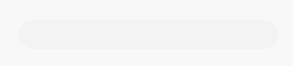

- Inline mode, also known as inline input style. In inline mode, the input box has clearly distinct styles between the editing state and the non-editing state.

  <!-- @[textArea_style_inline](https://gitcode.com/openharmony/applications_app_samples/blob/master/code/DocsSample/ArkUISample/TextComponent/entry/src/main/ets/pages/textInput/SetInputMultiTypeStyle.ets) -->

  ``` TypeScript
  TextArea()
    .style(TextContentStyle.INLINE)
  ```

  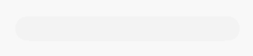

### Setting the Placeholder Text

The following example shows the effect of the placeholder text when no input is provided.

<!-- @[custom_text_input_with_place_holder](https://gitcode.com/openharmony/applications_app_samples/blob/master/code/DocsSample/ArkUISample/TextComponent/entry/src/main/ets/pages/textInput/CustomTextInputStyle.ets) -->

``` TypeScript
// Replace $r('app.string.i_am_placeholder') with the actual resource file. In this example, the value of the resource file is "I am placeholder text".
TextInput({ placeholder: $r('app.string.i_am_placeholder') })
```

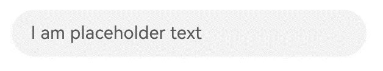

### Setting the Current Text Content of the Input Box

The following example shows the effect of the current text content in the input box.

<!-- @[custom_text_input_with_place_holder_and_text](https://gitcode.com/openharmony/applications_app_samples/blob/master/code/DocsSample/ArkUISample/TextComponent/entry/src/main/ets/pages/textInput/CustomTextInputStyle.ets) --> 

``` TypeScript
TextInput({
  // Replace $r('app.string.i_am_placeholder') with the actual resource file. In this example, the value of this resource file is "I am the placeholder text".
  placeholder: $r('app.string.i_am_placeholder'),
  // Replace $r('app.string.i_am_current_text_content') with the actual resource file. In this example, the value of this resource file is "I am the current text content".
  text: $r('app.string.i_am_current_text_content')
})
```

 

### Setting the Input Box Background Color

The following example shows the effect of setting the input box background color.

<!-- @[custom_text_input_background_color](https://gitcode.com/openharmony/applications_app_samples/blob/master/code/DocsSample/ArkUISample/TextComponent/entry/src/main/ets/pages/textInput/CustomTextInputStyle.ets) --> 

``` TypeScript
TextInput({
  // Replace $r('app.string.i_am_placeholder') with the actual resource file. In this example, the value of the resource file is "I am placeholder text".
  placeholder: $r('app.string.i_am_placeholder'),
  // Replace $r('app.string.i_am_current_text_content') with the actual resource file. In this example, the value of the resource file is "I am the current text content".
  text: $r('app.string.i_am_current_text_content')
})
  .backgroundColor(Color.Pink)
```

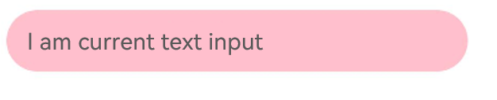

### Setting the Auto-Fill Type of the Input Box

The input box allows you to set the auto-fill type through the [contentType](../reference/apis-arkui/arkui-ts/ts-basic-components-textinput.md#contenttype12) attribute. For supported types, see [ContentType](../reference/apis-arkui/arkui-ts/ts-basic-components-textinput.md#contenttype12).

<!-- @[auto_fill](https://gitcode.com/openharmony/applications_app_samples/blob/master/code/DocsSample/ArkUISample/TextComponent/entry/src/main/ets/pages/textInput/AutoFill.ets) -->

``` TypeScript
// Replace $r('app.string.Auto_Fill_PlaceHolder') with the actual resource file. In this example, the value of the resource file is "Enter your email..."
TextInput({ placeholder: $r('app.string.Auto_Fill_PlaceHolder') })
  .width('95%')
  .height(40)
  .margin(20)
  .contentType(ContentType.EMAIL_ADDRESS)
```

## Binding Text Input Box Events

Text boxes are primarily used to obtain user input and process the information into data for uploading. Binding the [onChange](../reference/apis-arkui/arkui-ts/ts-basic-components-textinput.md#onchange) event allows you to obtain the changed text content in the input box. Binding the [onSubmit](../reference/apis-arkui/arkui-ts/ts-basic-components-textinput.md#onsubmit) event allows you to obtain the text submitted via the Enter key. Binding the [onTextSelectionChange](../reference/apis-arkui/arkui-ts/ts-basic-components-textinput.md#ontextselectionchange10) event allows you to obtain the position of the selection handles or the cursor position during editing. You can also use general events for corresponding interactive operations.

> **NOTE**
>
> In password mode, when setting the [showPassword](../reference/apis-arkui/arkui-ts/ts-basic-components-textinput.md#showpassword12) attribute, you are advised to add state synchronization in the [onSecurityStateChange](../reference/apis-arkui/arkui-ts/ts-basic-components-textinput.md#onsecuritystatechange12) callback. For details, see the following example.
>
> The [onWillInsert](../reference/apis-arkui/arkui-ts/ts-basic-components-textinput.md#onwillinsert12), [onDidInsert](../reference/apis-arkui/arkui-ts/ts-basic-components-textinput.md#ondidinsert12), [onWillDelete](../reference/apis-arkui/arkui-ts/ts-basic-components-textinput.md#onwilldelete12), and [onDidDelete](../reference/apis-arkui/arkui-ts/ts-basic-components-textinput.md#ondiddelete12) callbacks are supported only in system input method scenarios.
>
> The callback timing of [onWillChange](../reference/apis-arkui/arkui-ts/ts-basic-components-textinput.md#onwillchange15) is later than [onWillInsert](../reference/apis-arkui/arkui-ts/ts-basic-components-textinput.md#onwillinsert12) and [onWillDelete](../reference/apis-arkui/arkui-ts/ts-basic-components-textinput.md#onwilldelete12), and earlier than [onDidInsert](../reference/apis-arkui/arkui-ts/ts-basic-components-textinput.md#ondidinsert12) and [onDidDelete](../reference/apis-arkui/arkui-ts/ts-basic-components-textinput.md#ondiddelete12).

<!-- @[TextInputAddEvent](https://gitcode.com/openharmony/applications_app_samples/blob/master/code/DocsSample/ArkUISample/TextComponent/entry/src/main/ets/pages/textInput/TextInputAddEvent.ets) -->

``` TypeScript
import { hilog } from '@kit.PerformanceAnalysisKit';

const TAG = '[Sample_Textcomponent]';
const DOMAIN = 0xF811;
const BUNDLE = 'Textcomponent_';

@Entry
@Component
struct TextInputEventAdd {
  @State text: string = '';
  @State textStr1: string = '';
  @State textStr2: string = '';
  @State textStr3: string = '';
  @State textStr4: string = '';
  @State textStr5: string = '';
  @State textStr6: string = '';
  @State textStr7: string = '';
  @State textStr8: string = '';
  @State textStr9: string = '';
  @State passwordState: boolean = false;
  controller: TextInputController = new TextInputController();

  build() {
    Row() {
      Column() {
        Text(`${this.textStr1}\n${this.textStr2}\n${this.textStr3}
          \n${this.textStr4}\n${this.textStr5}\n${this.textStr6}
          \n${this.textStr7}\n${this.textStr8}\n${this.textStr9}`)
          .fontSize(20)
        TextInput({ text: this.text, placeholder: 'input your word...', controller: this.controller })
          .type(InputType.Password)
          .showPassword(this.passwordState)
          .onChange((value: string) => {
            // Triggered when the text content changes.
            hilog.info(DOMAIN, TAG, BUNDLE + 'onChange is triggering: ' + value);
            this.textStr1 = `onChange is triggering: ${value}`;
          })
          .onSubmit((enterKey: EnterKeyType, event: SubmitEvent) => {
            // Triggered when the Enter key of the input method is pressed.
            hilog.info(DOMAIN, TAG, BUNDLE + 'onSubmit is triggering: ' + enterKey + event.text);
            this.textStr2 = `onSubmit is triggering: ${enterKey} ${event.text}`;
          })
          .onTextSelectionChange((selectionStart: number, selectionEnd: number) => {
            // Triggered when the text selection position changes or the cursor position changes in editing state.
            hilog.info(DOMAIN, TAG, BUNDLE + 'onTextSelectionChange is triggering: ' + selectionStart + selectionEnd);
            this.textStr3 = `onTextSelectionChange is triggering: ${selectionStart} ${selectionEnd}`;
          })
          .onSecurityStateChange((isShowPassword: boolean) => {
            // Triggered when the password visibility state toggles.
            hilog.info(DOMAIN, TAG, BUNDLE + 'onSecurityStateChange is triggering: ' + isShowPassword);
            this.passwordState = isShowPassword;
            this.textStr4 = `onSecurityStateChange is triggering: ${isShowPassword}`;
          })
          .onWillInsert((info: InsertValue) => {
            // Triggered before text is inserted.
            hilog.info(DOMAIN, TAG, BUNDLE + 'onWillInsert is triggering: ' + info.insertValue + info.insertOffset);
            this.textStr5 = `onWillInsert is triggering: ${info.insertValue} ${info.insertOffset}`;
            return true;
          })
          .onDidInsert((info: InsertValue) => {
            // Triggered after text insertion is complete.
            hilog.info(DOMAIN, TAG, BUNDLE + 'onDidInsert is triggering: ' + info.insertValue + info.insertOffset);
            this.textStr6 = `onDidInsert is triggering: ${info.insertValue} ${info.insertOffset}`;
          })
          .onWillDelete((info: DeleteValue) => {
            // Triggered before text is deleted.
            hilog.info(DOMAIN, TAG, BUNDLE + 'onWillDelete is triggering: ' + info.deleteValue + info.deleteOffset);
            this.textStr7 = `onWillDelete is triggering: ${info.deleteValue} ${info.deleteOffset}`;
            return true;
          })
          .onDidDelete((info: DeleteValue) => {
            // Triggered when the deletion is complete.
            hilog.info(DOMAIN, TAG, BUNDLE + 'onDidDelete is triggering: ' + info.deleteValue + info.deleteOffset);
            this.textStr8 = `onDidDelete is triggering: ${info.deleteValue} ${info.deleteOffset}`;
          })
          .onFocus(() => {
            // Triggered when the input box gains focus.
            hilog.info(DOMAIN, TAG, BUNDLE + 'onFocus is triggering');
            this.textStr9 = `onFocus is triggering`;
          })
      }.width('100%')
    }
    .height('100%')
  }
}
```

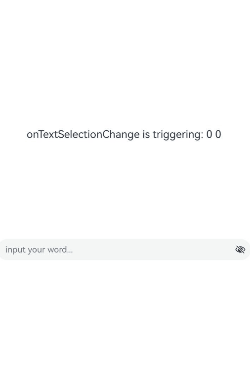

## Text Menu Management

The content carried by TextInput and TextArea components is plain text, without scenarios involving multiple span types such as images or mixed content. Therefore, only the system text menu is provided. You can customize system menu items through the [editMenuOptions](../reference/apis-arkui/arkui-ts/ts-basic-components-textinput.md#editmenuoptions12) API, including appending custom menu items, removing system menu items, modifying menu item content, and intercepting menu item tap events, thereby enabling customization of menu options within the system menu framework.

### System Menu

When text in the input box is selected, a menu containing cut, copy, translate, and share options appears.

TextInput:

<!-- @[select_textinput](https://gitcode.com/openharmony/applications_app_samples/blob/master/code/DocsSample/ArkUISample/TextComponent/entry/src/main/ets/pages/textInput/SelectMenu.ets) -->

``` TypeScript
// Replace $r('app.string.show_selected_menu') with the actual resource file. In this example, the value of the resource file is "This is a piece of text used to demonstrate the selection menu."
TextInput({ text: $r('app.string.show_selected_menu') })
```

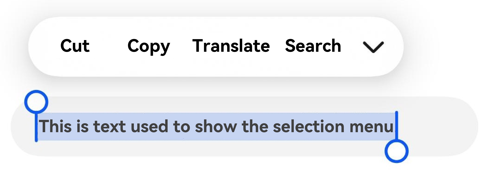

TextArea:

<!-- @[select_textarea](https://gitcode.com/openharmony/applications_app_samples/blob/master/code/DocsSample/ArkUISample/TextComponent/entry/src/main/ets/pages/textInput/SelectMenu.ets) -->

``` TypeScript
// Replace $r('app.string.show_selected_menu') with the actual resource file. In this example, the resource file has the value "This is a piece of text used to demonstrate the selected menu."
TextArea({ text: $r('app.string.show_selected_menu') })
```


### Custom Menu Items in the System Menu

Starting from API version 12, this example uses the [editMenuOptions](../reference/apis-arkui/arkui-ts/ts-basic-components-textinput.md#editmenuoptions12) API to implement the functionality of setting the text content, icon, and callback for custom menu extension items. Starting from API version 20, you can configure menu data in the [onPrepareMenu](../reference/apis-arkui/arkui-ts/ts-text-common.md#properties-1) callback.

<!-- @[editMenu_create](https://gitcode.com/openharmony/applications_app_samples/blob/master/code/DocsSample/ArkUISample/TextComponent/entry/src/main/ets/pages/textInput/SelectMenu.ets) -->

``` TypeScript
onCreateMenu = (menuItems: Array<TextMenuItem>) => {
  // Replace $r('app.media.startIcon') with the required image resource file.
  // TextMenuItemId.autoFill is supported since API version 23.
  const idsToFilter: TextMenuItemId[] = [
    TextMenuItemId.autoFill
  ]
  const items = menuItems.filter(item => !idsToFilter.some(id => id.equals(item.id)))
  let item1: TextMenuItem = {
    content: 'create1',
    icon: $r('app.media.startIcon'),
    id: TextMenuItemId.of('create1'),
  };
  let item2: TextMenuItem = {
    content: 'create2',
    id: TextMenuItemId.of('create2'),
    icon: $r('app.media.startIcon'),
  };
  items.push(item1);
  items.unshift(item2);
  return items;
}
onMenuItemClick = (menuItem: TextMenuItem, textRange: TextRange) => {
  if (menuItem.id.equals(TextMenuItemId.of('create2'))) {
    hilog.info(0x0000, 'testTag', '%{public}s', 'intercept id: create2 start:' + textRange.start + '; end:' + textRange.end);
    return true;
  }
  if (menuItem.id.equals(TextMenuItemId.of('prepare1'))) {
    hilog.info(0x0000, 'testTag', '%{public}s', 'intercept id: prepare1 start:' + textRange.start + '; end:' + textRange.end);
    return true;
  }
  if (menuItem.id.equals(TextMenuItemId.COPY)) {
    hilog.info(0x0000, 'testTag', '%{public}s', 'intercept COPY start:' + textRange.start + '; end:' + textRange.end);
    return true;
  }
  if (menuItem.id.equals(TextMenuItemId.SELECT_ALL)) {
    hilog.info(0x0000, 'testTag', '%{public}s', 'No interception SELECT_ALL start:' + textRange.start + '; end:' + textRange.end);
    return false;
  }
  return false;
}
// Replace $r('app.media.startIcon') with the required image resource file.
onPrepareMenu = (menuItems: Array<TextMenuItem>) => {
  let item1: TextMenuItem = {
    content: 'prepare1_' + this.endIndex,
    icon: $r('app.media.startIcon'),
    id: TextMenuItemId.of('prepare1'),
  };
  menuItems.unshift(item1);
  return menuItems;
}
@State editMenuOptions: EditMenuOptions = {
  onCreateMenu: this.onCreateMenu,
  onMenuItemClick: this.onMenuItemClick,
  onPrepareMenu: this.onPrepareMenu
};
```

<!-- @[editMenu_textinput](https://gitcode.com/openharmony/applications_app_samples/blob/master/code/DocsSample/ArkUISample/TextComponent/entry/src/main/ets/pages/textInput/SelectMenu.ets) -->

``` TypeScript
// Replace $r('app.string.show_selected_menu') with an actual resource file. In this example, the value of the resource file is "This is a piece of text used to demonstrate the selected menu."
TextInput({ text: $r('app.string.show_selected_menu') })
  .editMenuOptions(this.editMenuOptions)
  .onTextSelectionChange((selectionStart: number, selectionEnd: number) => {
    this.endIndex = selectionEnd;
  })
```

<!--Del--><!--DelEnd-->

### Hiding System Menu Items in the System Menu

Starting from API version 20, you can use the [disableSystemServiceMenuItems](../reference/apis-arkui/arkts-apis-uicontext-textmenucontroller.md#disablesystemservicemenuitems20) method to hide all system service menu items in the text selection menu. For details, see the API reference for [disableSystemServiceMenuItems](../reference/apis-arkui/arkts-apis-uicontext-textmenucontroller.md#disablesystemservicemenuitems20). The following example is only one part of a complete sample project. To avoid affecting other page examples in the project, system service menus are disabled and restored only in the page's appear and disappear lifecycle callbacks. In actual scenarios, you can choose other timing, such as [onCreate](../reference/apis-ability-kit/js-apis-app-ability-uiAbility.md#oncreate) and [onDestroy](../reference/apis-ability-kit/js-apis-app-ability-uiAbility.md#ondestroy) of [UIAbility](../reference/apis-ability-kit/js-apis-app-ability-uiAbility.md).

<!-- @[DisableSystemServiceMenuItems](https://gitcode.com/openharmony/applications_app_samples/blob/master/code/DocsSample/ArkUISample/TextComponent/entry/src/main/ets/pages/textInput/disablemenu/DisableSystemServiceMenuItems.ets) -->

``` TypeScript
import { TextMenuController } from '@kit.ArkUI';

@Entry
@Component
struct DisableSystemServiceMenuItem {
  aboutToAppear(): void {
    // Disable all system service menu items.
    TextMenuController.disableSystemServiceMenuItems(true)
  }

  aboutToDisappear(): void {
    // Restore system service menu items when the page disappears.
    TextMenuController.disableSystemServiceMenuItems(false)
  }

  build() {
    Row() {
      Column() {
        // Replace $r('app.string.ProhibitSelectMenu_content') with the actual resource file. In this example, the value of the resource file is "This is a TextInput. Long press to display the text selection menu."
        TextInput({ text: $r('app.string.ProhibitSelectMenu_content') })
          .height(60)
          .fontStyle(FontStyle.Italic)
          .fontWeight(FontWeight.Bold)
          .textAlign(TextAlign.Center)
          .caretStyle({ width: '4vp' })
          .editMenuOptions({
            onCreateMenu: (menuItems: Array<TextMenuItem>) => {
              // menuItems does not include disabled system menu items.
              return menuItems
            },
            onMenuItemClick: (menuItem: TextMenuItem, textRange: TextRange) => {
              return false
            }
          })
      }.width('100%')
    }
    .height('100%')
  }
}
```

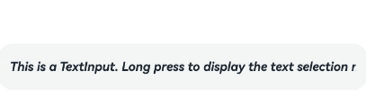

Since API version 20, you can use the [disableMenuItems](../reference/apis-arkui/arkts-apis-uicontext-textmenucontroller.md#disablemenuitems20) method to disable specified system service menu items in the text selection menu. For details, see the API description of [disableMenuItems](../reference/apis-arkui/arkts-apis-uicontext-textmenucontroller.md#disablemenuitems20). The following example is only one part of a complete sample project. To avoid affecting other page samples in the project, system service menu items are disabled and restored only in the page's **aboutToAppear** and **aboutToDisappear** lifecycle callbacks. In actual scenarios, you can choose other timing, such as [onCreate](../reference/apis-ability-kit/js-apis-app-ability-uiAbility.md#oncreate) and [onDestroy](../reference/apis-ability-kit/js-apis-app-ability-uiAbility.md#ondestroy) of [UIAbility](../reference/apis-ability-kit/js-apis-app-ability-uiAbility.md).

<!-- @[DisableMenuItems](https://gitcode.com/openharmony/applications_app_samples/blob/master/code/DocsSample/ArkUISample/TextComponent/entry/src/main/ets/pages/textInput/disablemenu/DisableMenuItems.ets) -->

``` TypeScript
import { TextMenuController } from '@kit.ArkUI';

@Entry
@Component
struct DisableMenuItem {
  aboutToAppear(): void {
    // Disable search, translation, and AI writer.
    TextMenuController.disableMenuItems([TextMenuItemId.SEARCH, TextMenuItemId.TRANSLATE, TextMenuItemId.AI_WRITER])
  }

  aboutToDisappear(): void {
    // Restore system service menu items when the page disappears.
    TextMenuController.disableMenuItems([])
  }

  build() {
    Row() {
      Column() {
        // Replace $r('app.string.ProhibitSelectMenu_content') with the actual resource file. In this example, the value of the resource file is "This is a TextInput. Long press to display the text selection menu."
        TextInput({ text: $r('app.string.ProhibitSelectMenu_content') })
          .height(60)
          .fontStyle(FontStyle.Italic)
          .fontWeight(FontWeight.Bold)
          .textAlign(TextAlign.Center)
          .caretStyle({ width: '4vp' })
          .editMenuOptions({
            onCreateMenu: (menuItems: Array<TextMenuItem>) => {
              // menuItems does not include search, translation, and AI writing assistance.
              return menuItems;
            },
            onMenuItemClick: (menuItem: TextMenuItem, textRange: TextRange) => {
              return false
            }
          })
      }.width('100%')
    }
    .height('100%')
  }
}
```

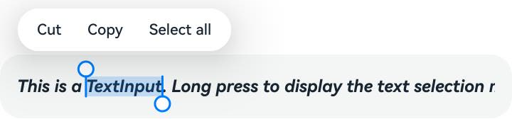

### Displaying the Text Menu in a Subwindow

The TextInput component controls the window in which the text menu is rendered by setting [TextMenuShowMode](../reference/apis-arkui/arkui-ts/ts-text-common.md#textmenushowmode16). In main window mode, the menu node is mounted to the root node of the main window, and the menu may be obscured by page content or affected by page scrolling. In subwindow mode, the menu node is mounted to the root node of an independent subwindow, and the menu floats above the main window, unaffected by the page layout.

<!-- @[set_menu_options_with_textmenushowmode](https://gitcode.com/openharmony/applications_app_samples/blob/master/code/DocsSample/ArkUISample/TextComponent/entry/src/main/ets/pages/textInput/TextMenuShowSubWindow.ets) -->

``` TypeScript
this.getUIContext()
  .getTextMenuController()
  .setMenuOptions(
    {
      showMode: TextMenuShowMode.PREFER_WINDOW
    }
  );
```

<!-- @[textmenushowmode_create_textinput](https://gitcode.com/openharmony/applications_app_samples/blob/master/code/DocsSample/ArkUISample/TextComponent/entry/src/main/ets/pages/textInput/TextMenuShowSubWindow.ets) -->

``` TypeScript
// Replace $r('app.string.Service_MenuItems_Text') with the actual resource file. In this example, the value of the resource file is "This is a piece of text. Long press to bring up the text selection menu."
TextInput({ text: $r('app.string.Service_MenuItems_Text') })
  .fontSize(15)
  .margin({ top: 100 })
  .copyOption(CopyOptions.InApp)
```

<!--Del--><!--DelEnd-->

## Setting Input Box Avoidance

Examples of two scenarios are provided: keyboard avoidance and cursor avoidance.

### Keyboard Avoidance

After the keyboard is raised, keyboard avoidance takes effect for scrollable container components only when switching between landscape and portrait modes. If you want keyboard avoidance to also take effect for non-scrollable container components, nest them inside a scrollable container component, such as [Scroll](../reference/apis-arkui/arkui-ts/ts-container-scroll.md), [List](../reference/apis-arkui/arkui-ts/ts-container-list.md), or [Grid](../reference/apis-arkui/arkui-ts/ts-container-grid.md).

<!-- @[keyboard_avoid](https://gitcode.com/openharmony/applications_app_samples/blob/master/code/DocsSample/ArkUISample/TextComponent/entry/src/main/ets/pages/textInput/KeyboardAvoidance.ets) -->

``` TypeScript
@Entry
@Component
struct KeyboardAvoid {
  placeHolderArr: string[] = ['1', '2', '3', '4', '5', '6', '7'];

  build() {
    Scroll() {
      Column() {
        ForEach(this.placeHolderArr, (placeholder: string) => {
          TextInput({ placeholder: 'TextInput ' + placeholder })
            .margin(30)
            // ···
        })
      }
    }
    .height('100%')
    .width('100%')
  }
}
```


### Cursor Avoidance

The OFFSET and RESIZE modes in the [keyBoardAvoidMode](../reference/apis-arkui/arkts-apis-uicontext-e.md#keyboardavoidmode11) enumeration do not support secondary avoidance after the keyboard is raised. If you want the cursor position to trigger secondary avoidance after being changed by a tap or through an API, consider using OFFSET_WITH_CARET and RESIZE_CARET to replace the original OFFSET and RESIZE modes.<br>

For scrollable containers, RESIZE_WITH_CARET is recommended; for non-scrollable containers, OFFSET_WITH_CARET should be used.

<!-- @[cursor_avoid_part1](https://gitcode.com/openharmony/applications_app_samples/blob/master/code/DocsSample/ArkUISample/TextComponent/entry/src/main/ets/entryability/EntryAbility.ets) -->

``` TypeScript
import { hilog } from '@kit.PerformanceAnalysisKit';
import { window } from '@kit.ArkUI';
import { KeyboardAvoidMode } from '@kit.ArkUI';
```

<!-- @[cursor_avoid_part2](https://gitcode.com/openharmony/applications_app_samples/blob/master/code/DocsSample/ArkUISample/TextComponent/entry/src/main/ets/entryability/EntryAbility.ets) -->

``` TypeScript
// Used in UIAbility
onWindowStageCreate(windowStage: window.WindowStage): void {
  // Main window is created, set main page for this ability
  hilog.info(0x0000, 'testTag', '%{public}s', 'Ability onWindowStageCreate');

  windowStage.loadContent('pages/Index', (err, data) => {
    windowStage.getMainWindowSync().getUIContext().getKeyboardAvoidMode();
    windowStage.getMainWindowSync().getUIContext().setKeyboardAvoidMode(KeyboardAvoidMode.OFFSET_WITH_CARET);
    if (err.code) {
      hilog.error(0x0000, 'testTag', 'Failed to load the content. Cause: %{public}s', JSON.stringify(err) ?? '');
      return;
    }
    hilog.info(0x0000, 'testTag', 'Succeeded in loading the content. Data: %{public}s', JSON.stringify(data) ?? '');
  });
}
```

<!-- @[cursor_avoid](https://gitcode.com/openharmony/applications_app_samples/blob/master/code/DocsSample/ArkUISample/TextComponent/entry/src/main/ets/pages/textInput/CursorAvoidance.ets) -->

``` TypeScript
@Entry
@Component
struct CursorAvoid {
  @State caretPosition: number = 600;
  areaController: TextAreaController = new TextAreaController();
  text = 'Most of us compare ourselves with anyone we think is happier — a relative, someone we know a lot,' +
    ' or someone we hardly know. As a result, what we do remember is anything that makes others happy, ' +
    'anything that makes ourselves unhappy,' +
    ' totally forgetting that there is something happy in our own life.\
    So the best way to destroy happiness is to look at something and focus on even the smallest flaw. ' +
    'It is the smallest flaw that would make us complain. And it is the complaint that leads to us becoming unhappy.\
    If one chooses to be happy, he will be blessed; if he chooses to be unhappy, he will be cursed. ' +
    'Happiness is just what you think will make you happy.' +
    'Most of us compare ourselves with anyone we think is happier — a relative, someone we know a lot, ' +
    'or someone we hardly know. As a result, what we do remember is anything that makes others happy, ' +
    'anything that makes ourselves unhappy, totally forgetting that there is something happy in our own life.\
  ';

  build() {
    Scroll() {
      Column() {
        Row() {
          Button('CaretPosition++: ' + this.caretPosition).onClick(() => {
            this.caretPosition += 1;
          }).fontSize(10)
          Button('CaretPosition--: ' + this.caretPosition).onClick(() => {
            this.caretPosition -= 1;
          }).fontSize(10)
          Button('SetCaretPosition: ').onClick(() => {
            this.areaController.caretPosition(this.caretPosition);
          }).fontSize(10)
        }

        TextArea({ text: this.text, controller: this.areaController })
          .width('100%')
          .fontSize('20fp')
      }
    }.width('100%').height('100%')
  }
}
```


<!--RP1--><!--RP1End-->

<!--no_check-->