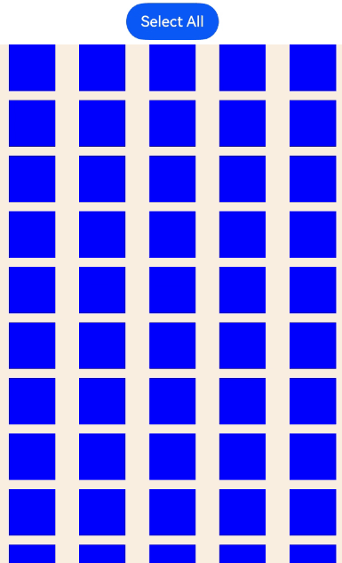
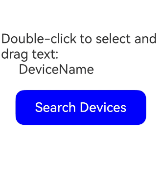

# Implementing Unified Drag and Drop
<!--Kit: ArkUI-->
<!--Subsystem: ArkUI-->
<!--Owner: @yihao-lin-->
<!--Designer: @piggyguy-->
<!--Tester: @songyanhong-->
<!--Adviser: @Brilliantry_Rui-->

Unified drag and drop refers to a data transfer interaction triggered by a mouse device or gesture. Users can drag data from one component (the drag source) and drop it into another (the drop target) to initiate a response. In this interaction, the drag source provides the data, while the drop target receives and processes it, thereby enabling users to easily move, copy, or delete data.

## Basic Concepts

* Drag operation: an operation that begins when a user selects a draggable component, continues when the user drags the component on the screen, and ends when the user releases the component on a droppable component.
* Drag preview (background): a visual representation of the data being dragged. You can customize it using [CustomBuilder](../reference/apis-arkui/arkui-ts/ts-types.md#custombuilder8) or [DragItemInfo](../reference/apis-arkui/arkui-ts/ts-universal-events-drag-drop.md#dragiteminfo) of [onDragStart](../reference/apis-arkui/arkui-ts/ts-universal-events-drag-drop.md#ondragstart), or by using the universal attribute [dragPreview](../reference/apis-arkui/arkui-ts/ts-universal-attributes-drag-drop.md#dragpreview11).
* Drag data: data being transferred, encapsulated using the UDMF API [UnifiedData](../reference/apis-arkdata/js-apis-data-unifiedDataChannel.md#unifieddata) to ensure data consistency and security.
* Drag source: component that initiates the drag operation and provides data, typically with characteristics for responding to dragging.
* Drop target: component that can receive and process drag data, and is able to perform corresponding actions based on the data being dropped.
* Drag point: point of contact between the mouse device or finger and the screen. It is used to determine whether data enters a drop target. The determination is based on whether the contact point is within the bounds of the component.

## Drag Modes

Drag operations support both gesture-based and mouse-based interactions, which affect when callback events are triggered.

### ​Gesture-based Drag

When dragging is initiated by a gesture, ArkUI first verifies that the component supports dragging. For components that are draggable by default ([Search](../reference/apis-arkui/arkui-ts/ts-basic-components-search.md), [TextInput](../reference/apis-arkui/arkui-ts/ts-basic-components-textinput.md), [TextArea](../reference/apis-arkui/arkui-ts/ts-basic-components-textarea.md), [RichEditor](../reference/apis-arkui/arkui-ts/ts-basic-components-richeditor.md), [Text](../reference/apis-arkui/arkui-ts/ts-basic-components-text.md), [Image](../reference/apis-arkui/arkui-ts/ts-basic-components-image.md), [Hyperlink](../reference/apis-arkui/arkui-ts/ts-container-hyperlink.md)), ArkUI checks whether the [draggable](../reference/apis-arkui/arkui-ts/ts-universal-attributes-drag-drop.md#draggable) attribute is set to **true**<!--Del--> (the initial value of this attribute can be configured for these components through [system resources](../quick-start/resource-categories-and-access.md#system-resources))<!--DelEnd-->. For other components, ArkUI checks whether the [onDragStart](../reference/apis-arkui/arkui-ts/ts-universal-events-drag-drop.md#ondragstart) callback is configured. If the requirement is satisfied, dragging starts after the user has long pressed the component for 500 ms, and a drag preview is displayed after the user has long pressed the component for 800 ms. When combining drag operations with menus controlled by the **isShow** property in [bindMenu](../reference/apis-arkui/arkui-ts/ts-universal-attributes-menu.md#bindmenu11), avoid adding an 800 ms delay before showing the menu after a user action, as this may lead to unexpected behavior.

Below you can see the drag process initiated by a gesture (finger or stylus).


### ​Mouse-based Drag

When a mouse device is used as the pointer, dragging starts as soon as the pointer moves more than 1 vp while the left mouse button is pressed on a draggable component. All other behaviors are identical to gesture-based drag. For details, see [Gesture-Based Drag](#gesture-based-drag).

## Drag Event Callbacks

Drag and drop can occur within a single application or span multiple applications. The following callback events allow you to detect drag status and intervene in the system's default drag behavior.

| Callback Event| Description|
| ---------------- | ------------------------|
| [onDragStart](../reference/apis-arkui/arkui-ts/ts-universal-events-drag-drop.md#ondragstart) | Triggered when a draggable component starts being dragged.<br>You can use this callback to set drag data and preview. To avoid extra performance overhead, provide the preview as a pixel map, instead of using **customBuilder**.|
| [onDragEnter](../reference/apis-arkui/arkui-ts/ts-universal-events-drag-drop.md#ondragenter) | Triggered when the drag point enters the bounds of the component. This callback fires only if the component also listens for the [onDrop](../reference/apis-arkui/arkui-ts/ts-universal-events-drag-drop.md#ondrop) event.|
| [onDragMove](../reference/apis-arkui/arkui-ts/ts-universal-events-drag-drop.md#ondragmove) | Triggered when the drag point moves within the bounds of the component. This callback fires only if the component also listens for the **onDrop** event.<br>During movement, you can use the **setResult** API in [DragEvent](../reference/apis-arkui/arkui-ts/ts-universal-events-drag-drop.md#dragevent7) to affect the system's visual feedback.<br>1. Set **DragResult.DROP\_ENABLED** to signal that the component can accept a drop.<br>2. Set **DragResult.DROP\_DISABLED** to signal that the component cannot accept a drop.|
| [onDragLeave](../reference/apis-arkui/arkui-ts/ts-universal-events-drag-drop.md#ondragleave) | Triggered when the drag point leaves the bounds of the component. This callback fires only if the component also listens for the **onDrop** event.<br>By default, the **onDragLeave** callback is not triggered in the following cases:<br>1. An item in a parent component is dragged to one of its child components.<br>2. The layout of the drop target component overlaps that of the drag source component.<br>Since API version 12, the [setDragEventStrictReportingEnabled](../reference/apis-arkui/arkts-apis-uicontext-dragcontroller.md#setdrageventstrictreportingenabled12) API in [UIContext](../reference/apis-arkui/arkts-apis-uicontext-uicontext.md) can be used to trigger the **onDragLeave** event in a strict fashion.|
| [onDrop](../reference/apis-arkui/arkui-ts/ts-universal-events-drag-drop.md#ondrop) | Triggered when the dragged item is dropped on the component. The drag result must be set in this callback through the **setResult** API in **DragEvent**. Otherwise, the **getResult** API in the **onDragEnd** method of the drag source only returns the default result **DragResult.DRAG\_FAILED**.<br>This callback is where you can intervene in the default drop processing behavior. The system preferentially executes the **onDrop** callback and processes the drag data based on the **setResult** API in the callback.<br>1. If **DragResult.DRAG\_SUCCESSFUL** is set, you need to process the data on your own; the system does not process the data.<br>2. If **DragResult.DRAG\_FAILED** is set, the system does not process the data.<br>3. If **DragResult.DRAG\_CANCELED** is set, the system does not process the data.<br>4. Setting **DragResult.DROP\_ENABLED** or **DragResult.DROP\_DISABLED** will be ignored, producing the same effect as **DragResult.DRAG\_SUCCESSFUL**.|
| [onDragEnd](../reference/apis-arkui/arkui-ts/ts-universal-events-drag-drop.md#ondragend10) | Triggered when dragging of the component ends.|
| [onPreDrag](../reference/apis-arkui/arkui-ts/ts-universal-events-drag-drop.md#onpredrag12) | Triggered when the component enters a state prior to a drop and drop operation.<br>You can use this callback to listen for the value of [PreDragStatus](../reference/apis-arkui/arkui-ts/ts-universal-events-drag-drop.md#predragstatus12) to prepare corresponding data.<br>1. **ACTION\_DETECTING\_STATUS**: A drag gesture is being detected. Triggered when the component is long pressed for 50 ms.<br>2. **READY\_TO\_TRIGGER\_DRAG\_ACTION**: The component is ready to be dragged. Triggered when the component is long pressed for 500 ms.<br>3. **PREVIEW\_LIFT\_STARTED**: A lift animation is started. Triggered when the component is long pressed for 800 ms.<br>4. **PREVIEW\_LIFT\_FINISHED**: A lift animation is finished. Triggered at the completion of the lift animation.<br>5. **PREVIEW\_LANDING\_STARTED**: A drop animation is started. Triggered when the drop animation starts.<br>6. **PREVIEW\_LANDING\_FINISHED**: A drop animation is finished. Triggered when the drop animation ends.<br>7. **ACTION\_CANCELED\_BEFORE\_DRAG**: A drop animation is terminated. Triggered when the finger is lifted off the screen after the component enters the **READY_TO_TRIGGER_DRAG_ACTION** state.<br>8. PREPARING\_FOR_DRAG\_DETECTION<sup>18+</sup>: Drag preparation is complete, and the drag phase can start. Triggered when the component is long pressed for 350 ms.|
| [onDragSpringLoading](../reference/apis-arkui/arkui-ts/ts-universal-events-drag-drop.md#ondragspringloading20) | Triggered when a dragged object hovers over the component. Only one target can become the responder at any time, and child components always have higher response priority.<br>You can use [SpringLoadingContext](../reference/apis-arkui/js-apis-arkui-dragController.md#springloadingcontext20) to configure the current state of hover detection, notification count, drag information, and other parameters<br>This API is supported since API version 20.|

## DragEvent Object

The drag callback receives a [DragEvent](../reference/apis-arkui/arkui-ts/ts-universal-events-drag-drop.md#dragevent7) object. This object carries detailed information of the drag operation and the data provided by the dragged component.

You can use the getter methods supported by [DragEvent](../reference/apis-arkui/arkui-ts/ts-universal-events-drag-drop.md#dragevent7) to obtain detailed information of the drag operation. The table below indicates which **DragEvent** getter methods return valid data in each drag callback.
| Callback Event| onDragStart | onDragEnter | onDragMove | onDragLeave | onDrop | onDragEnd |
| - | - | - | - | - | - | - |
| getData         |—|—|—|—| Supported|—|
| getSummary      |—| Supported| Supported| Supported| Supported|—|
| getResult       |—|—|—|—|—| Supported|
| getPreviewRect  |—|—|—|—| Supported|—|
| getVelocity/X/Y |—| Supported| Supported| Supported| Supported|—|
| getWindowX/Y    | Supported| Supported| Supported| Supported| Supported|—|
| getDisplayX/Y   | Supported| Supported| Supported| Supported| Supported|—|
| getX/Y          | Supported| Supported| Supported| Supported| Supported|—|
| getModifierKeyState | Supported| Supported| Supported| Supported| Supported| Supported|
| startDataLoading    | — | — | — | — | Supported|—|
| getDisplayId        | Supported| Supported| Supported| Supported| Supported|—|
| getDragSource       | Supported| Supported| Supported| Supported| Supported| Supported|
| isRemote            | Supported| Supported| Supported| Supported| Supported| Supported|
| getGlobalDisplayX/Y | Supported| Supported| Supported| Supported| Supported|—|
| behavior        |—|—|—|—|—| Supported|

[DragEvent](../reference/apis-arkui/arkui-ts/ts-universal-events-drag-drop.md#dragevent7) also provides setters to transfer information to the system, which may affect how the system handles UI or data. The table below lists the stages in the callbacks where the setters should be executed for the information to be accepted and processed by the system.
| Callback Event| onDragStart | onDragEnter | onDragMove | onDragLeave | onDrop |
| - | - | - | - | - | - |
| useCustomDropAnimation |—|—|—|—| Supported|
| setData                | Supported|—|—|—|—|
| setResult              | Supported; can be used to prevent dragging initiation by setting failed or cancel| Supported; not passed as the final result to **onDragEnd**| Supported; not passed as the final result to **onDragEnd**| Supported; not passed as the final result to **onDragEnd** | Supported; passed as the final result to **onDragEnd**|
| setDataLoadParams      | Supported|—|—|—|—|
| behavior               |—| Supported| Supported| Supported| Supported|

## Drag Preview

The drag preview is an image displayed during the drag and drop operation. It is a visual representation of the drag data, not the component itself. You can set it to any supported image that you want to display to users. The **customBuilder** or **pixelMap** object returned by the **onDragStart** callback can be used to set the drag preview displayed during dragging and moving, with a snapshot of the component being used as the default drag preview during a lift animation. The **customBuilder** or **pixelMap** object set by the **dragPreview** attribute can be used to set the drag preview during a lift animation and dragging. If no custom drag preview is set, the system uses a snapshot of the component by default.

You can configure opacity, rounded corners, shadow, and blur effects for the drag preview. For details, see [Drag and Drop Control](../reference/apis-arkui/arkui-ts/ts-universal-attributes-drag-drop.md).


**Constraints**:

* For a container component, if the internal content exceeds the bounds of the component due to **position**, **offset**, or other settings, the component snapshot does not capture the excess content. To show the excess content, you can expand the container scope or use a custom container.
* Regardless of whether you use a custom builder or rely on the default snapshot mechanism, the snapshot process does not support transformation APIs, including [scale](../reference/apis-arkui/arkui-ts/ts-universal-attributes-transformation.md#scale) and [rotate](../reference/apis-arkui/arkui-ts/ts-universal-attributes-transformation.md#rotate).

## Drag and Drop Implementation

### General Drag and Drop Adaptation

The following example uses the [Image](../reference/apis-arkui/arkui-ts/ts-basic-components-image.md) component to illustrate basic drag and drop development procedures and key considerations.

1. Make the component draggable.

   Set the **draggable** attribute to **true** and set the **onDragStart** callback function. In the callback function, you can use UDMF to set the drag data and return the custom drag preview.

   <!-- @[module_draggable_head](https://gitcode.com/openharmony/applications_app_samples/blob/master/code/DocsSample/ArkUISample/EventProject/entry/src/main/ets/pages/drag/DefaultDrag.ets) -->
   
   ``` TypeScript
   import { unifiedDataChannel, uniformTypeDescriptor } from '@kit.ArkData';
   ```

   <!-- @[module_draggable](https://gitcode.com/openharmony/applications_app_samples/blob/master/code/DocsSample/ArkUISample/EventProject/entry/src/main/ets/pages/drag/DefaultDrag.ets) -->
   
   ``` TypeScript
   // Replace $r('app.media.app_icon') with the actual resource file.
   Image($r('app.media.app_icon'))
     .width(100)
     .height(100)
     .draggable(true)
     // ...
     .onDragStart((event) => {
       let data: unifiedDataChannel.Image = new unifiedDataChannel.Image();
       // Replace 'resources/base/media/app_icon.png' with the image resource file you use.
       data.imageUri = 'resources/base/media/app_icon.png';
       let unifiedData = new unifiedDataChannel.UnifiedData(data);
       event.setData(unifiedData);
   
       let dragItemInfo: DragItemInfo = {
         pixelMap: this.pixmap,
         extraInfo: 'this is extraInfo',
       };
       // The custom drag preview is returned in onDragStart.
       return dragItemInfo;
     })
   ```

   The gesture-based drag operation is initiated by a long press gesture bound at the underlying layer. If a long press gesture is also bound to the dragged component, gesture conflict will occur, resulting in dragging to fail. To address this issue, you can use parallel gestures.

   <!-- @[bind_parallel_gesture](https://gitcode.com/openharmony/applications_app_samples/blob/master/code/DocsSample/ArkUISample/EventProject/entry/src/main/ets/pages/drag/DefaultDrag.ets) -->
   
   ``` TypeScript
   .parallelGesture(LongPressGesture().onAction(() => {
     this.getUIContext()
       .getPromptAction()
       .showToast({ duration: 100, message: 'Long press gesture trigger' });
   }))
   ```

2. Customize the drag preview.
   
   Prepare a pixel map for the custom drag preview within the callback triggered by [onPreDrag](../reference/apis-arkui/arkui-ts/ts-universal-events-drag-drop.md#onpredrag12) after a long press of 50 ms.
   
   <!-- @[set_custom_drag_status](https://gitcode.com/openharmony/applications_app_samples/blob/master/code/DocsSample/ArkUISample/EventProject/entry/src/main/ets/pages/drag/DefaultDrag.ets) -->
   
   ``` TypeScript
   .onPreDrag((preDragStatus: PreDragStatus) => {
     if (preDragStatus == PreDragStatus.ACTION_DETECTING_STATUS) {
       this.getComponentSnapshot();
     }
   })
   ```

   Generate the specific pixel map by calling [this.getUIContext().getComponentSnapshot().createFromBuilder()](../reference/apis-arkui/arkts-apis-uicontext-componentsnapshot.md#createfrombuilder12).

   <!-- @[drag_hilog_const](https://gitcode.com/openharmony/applications_app_samples/blob/master/code/DocsSample/ArkUISample/EventProject/entry/src/main/ets/pages/drag/DefaultDrag.ets) -->
   
   ``` TypeScript
   import { hilog } from '@kit.PerformanceAnalysisKit';
   const DOMAIN = 0x0000;
   const TAG = 'DefaultDragError: '
   ```

   <!-- @[generate_pix_map](https://gitcode.com/openharmony/applications_app_samples/blob/master/code/DocsSample/ArkUISample/EventProject/entry/src/main/ets/pages/drag/DefaultDrag.ets) -->
   
   ``` TypeScript
   @Builder
   pixelMapBuilder() {
     Column() {
       // Replace $r('app.media.startIcon') with the actual resource file.
       Image($r('app.media.startIcon'))
         .width(120)
         .height(120)
         // ...
     }
   }
   
   // ...
   
   // Use the createFromBuilder API of componentSnapshot to capture a snapshot of a custom builder.
   private getComponentSnapshot(): void {
     this.getUIContext().getComponentSnapshot().createFromBuilder(() => {
       this.pixelMapBuilder();
     },
       (error: Error, pixmap: image.PixelMap) => {
         if (error) {
           hilog.error(DOMAIN, TAG, '%{public}s', JSON.stringify(error));
           return;
         }
         this.pixmap = pixmap;
       });
   }
   ```

3. To make sure the [onDragLeave](../reference/apis-arkui/arkui-ts/ts-universal-events-drag-drop.md#ondragleave) event is triggered as expected, use the [setDragEventStrictReportingEnabled](../reference/apis-arkui/arkts-apis-uicontext-dragcontroller.md#setdrageventstrictreportingenabled12) API.

   <!-- @[entryAbility_start](https://gitcode.com/openharmony/applications_app_samples/blob/master/code/DocsSample/ArkUISample/EventProject/entry/src/main/ets/entryability/EntryAbility.ets) -->
   
   ``` TypeScript
   import { UIAbility } from '@kit.AbilityKit';
   import { window, UIContext } from '@kit.ArkUI';
   
   export default class EntryAbility extends UIAbility {
     // ···
     onWindowStageCreate(windowStage: window.WindowStage): void {
       windowStage.loadContent('pages/Index', (err, data) => {
         if (err.code) {
           return;
         }
         windowStage.getMainWindow((err, data) => {
           if (err.code) {
             return;
           }
           let windowClass: window.Window = data;
           let uiContext: UIContext = windowClass.getUIContext();
           uiContext.getDragController().setDragEventStrictReportingEnabled(true);
         });
       });
     }
     // ···
   }
   ```

4. Set the badge displayed during dragging.

   You can set [allowDrop](../reference/apis-arkui/arkui-ts/ts-universal-attributes-drag-drop.md#allowdrop) to define the allowed data types for dropping. This setting affects the badge display during dragging. A plus sign badge (+) appears when the drag data matches the allowed types, A drop-disallowed badge appears when the drag data does not match the allowed types. If **allowDrop** is not configured, no plus sign badge (+) is displayed. The following example allows only data of HYPERLINK and PLAIN\_TEXT types defined in UnifiedData.

   <!-- @[drag_allow_drop](https://gitcode.com/openharmony/applications_app_samples/blob/master/code/DocsSample/ArkUISample/EventProject/entry/src/main/ets/pages/drag/DefaultDrag.ets) -->
   
   ``` TypeScript
   .allowDrop([uniformTypeDescriptor.UniformDataType.HYPERLINK,
     uniformTypeDescriptor.UniformDataType.PLAIN_TEXT])
   ```

   If the **onDrop** callback is implemented, you can control the display of the plus‑sign badge (+) by setting [DragResult](../reference/apis-arkui/arkui-ts/ts-universal-events-drag-drop.md#dragresult10) to **DROP_ENABLED** in **onDragMove** and setting [DragBehavior](../reference/apis-arkui/arkui-ts/ts-universal-events-drag-drop.md#dragbehavior10) to **COPY** or **MOVE**. **COPY** shows a plus sign badge (+), while **MOVE** does not.

   <!-- @[set_drag_behavior_move](https://gitcode.com/openharmony/applications_app_samples/blob/master/code/DocsSample/ArkUISample/EventProject/entry/src/main/ets/pages/drag/DefaultDrag.ets) -->
   
   ``` TypeScript
   .onDragMove((event) => {
     event.setResult(DragResult.DROP_ENABLED)
     event.dragBehavior = DragBehavior.COPY
   })
   ```

5. Receive drag data.

   Set the **onDrop** callback to handle the drag data and determine the drag result.

   <!-- @[set_on_drop_call](https://gitcode.com/openharmony/applications_app_samples/blob/master/code/DocsSample/ArkUISample/EventProject/entry/src/main/ets/pages/drag/DefaultDrag.ets) -->
   
   ``` TypeScript
   .onDrop((dragEvent?: DragEvent) => {
     // Obtain the drag data.
     this.getDataFromUdmf((dragEvent as DragEvent), (event: DragEvent) => {
       let records: unifiedDataChannel.UnifiedRecord[] = event.getData().getRecords();
       let rect: Rectangle = event.getPreviewRect();
       this.imageWidth = Number(rect.width);
       this.imageHeight = Number(rect.height);
       this.targetImage = (records[0] as unifiedDataChannel.Image).imageUri;
       this.imgState = Visibility.None;
       // Explicitly set the result to successful, and then pass this value to onDragEnd of the drag source.
       event.setResult(DragResult.DRAG_SUCCESSFUL);
     })
   })
   ```

   Data transfer is managed by UDMF, which may experience latency when dealing with large data volumes. Implement a retry mechanism with a 1500 ms delay if initial data acquisition fails.

   <!-- @[data_delayed_retry](https://gitcode.com/openharmony/applications_app_samples/blob/master/code/DocsSample/ArkUISample/EventProject/entry/src/main/ets/pages/drag/DefaultDrag.ets) -->
   
   ``` TypeScript
   getDataFromUdmfRetry(event: DragEvent, callback: (data: DragEvent) => void) {
     try {
       let data: UnifiedData = event.getData();
       if (!data) {
         return false;
       }
       let records: unifiedDataChannel.UnifiedRecord[] = data.getRecords();
       if (!records || records.length <= 0) {
         return false;
       }
       callback(event);
       return true;
     } catch (e) {
       hilog.error(DOMAIN, TAG, '%{public}s', (e as BusinessError).code + ', message: ' +
       (e as BusinessError).message);
       return false;
     }
   }
   
   getDataFromUdmf(event: DragEvent, callback: (data: DragEvent) => void) {
     if (this.getDataFromUdmfRetry(event, callback)) {
       return;
     }
     setTimeout(() => {
       this.getDataFromUdmfRetry(event, callback);
     }, 1500);
   }
   ```

6. The drag initiator can detect the result of the drag operation by setting the **onDragEnd** callback.

   <!-- @[set_on_drag_end](https://gitcode.com/openharmony/applications_app_samples/blob/master/code/DocsSample/ArkUISample/EventProject/entry/src/main/ets/pages/drag/DefaultDrag.ets) -->
   
   ``` TypeScript
   .onDragEnd((event) => {
     // The result value obtained from onDragEnd is set in onDrop of the drop target.
     if (event.getResult() === DragResult.DRAG_SUCCESSFUL) {
       this.getUIContext().getPromptAction().showToast({ duration: 100, message: 'Drag Success' });
     } else if (event.getResult() === DragResult.DRAG_FAILED) {
       this.getUIContext().getPromptAction().showToast({ duration: 100, message: 'Drag failed' });
     }
   })
   ```

**Sample Code**

<!-- @[default_drag](https://gitcode.com/openharmony/applications_app_samples/blob/master/code/DocsSample/ArkUISample/EventProject/entry/src/main/ets/pages/drag/DefaultDrag.ets) -->

``` TypeScript
import { unifiedDataChannel, uniformTypeDescriptor } from '@kit.ArkData';
import { BusinessError } from '@kit.BasicServicesKit';
import { image } from '@kit.ImageKit';
import { hilog } from '@kit.PerformanceAnalysisKit';
const DOMAIN = 0x0000;
const TAG = 'DefaultDragError: ';

@Entry
@Component
export struct DefaultDrag {
  @State targetImage: string = '';
  @State imageWidth: number = 100;
  @State imageHeight: number = 100;
  @State imgState: Visibility = Visibility.Visible;
  @State pixmap: image.PixelMap | undefined = undefined;

  @Builder
  pixelMapBuilder() {
    Column() {
      // Replace $r('app.media.startIcon') with the actual resource file.
      Image($r('app.media.startIcon'))
        .width(120)
        .height(120)
        // ...
    }
  }

  getDataFromUdmfRetry(event: DragEvent, callback: (data: DragEvent) => void) {
    try {
      let data: UnifiedData = event.getData();
      if (!data) {
        return false;
      }
      let records: unifiedDataChannel.UnifiedRecord[] = data.getRecords();
      if (!records || records.length <= 0) {
        return false;
      }
      callback(event);
      return true;
    } catch (e) {
      hilog.error(DOMAIN, TAG, '%{public}s', (e as BusinessError).code + ', message: ' +
      (e as BusinessError).message);
      return false;
    }
  }

  getDataFromUdmf(event: DragEvent, callback: (data: DragEvent) => void) {
    if (this.getDataFromUdmfRetry(event, callback)) {
      return;
    }
    setTimeout(() => {
      this.getDataFromUdmfRetry(event, callback);
    }, 1500);
  }


  // Use the createFromBuilder API of componentSnapshot to capture a snapshot of a custom builder.
  private getComponentSnapshot(): void {
    this.getUIContext().getComponentSnapshot().createFromBuilder(() => {
      this.pixelMapBuilder();
    },
      (error: Error, pixmap: image.PixelMap) => {
        if (error) {
          hilog.error(DOMAIN, TAG, '%{public}s', JSON.stringify(error));
          return;
        }
        this.pixmap = pixmap;
      });
  }


  build() {
    // ...
        Row() {
          Column() {
            Text('start Drag')
              .fontSize(18)
              .width('100%')
              .height(40)
              .margin(10)
              .backgroundColor('#008888')
            Row() {
              // Replace $r('app.media.app_icon') with the actual resource file.
              Image($r('app.media.app_icon'))
                .width(100)
                .height(100)
                .draggable(true)
                .margin({ left: 15 })
                .visibility(this.imgState)
                // Bind a parallel gesture to trigger a custom long press gesture.
                .parallelGesture(LongPressGesture().onAction(() => {
                  this.getUIContext()
                    .getPromptAction()
                    .showToast({ duration: 100, message: 'Long press gesture trigger' });
                }))
                .onDragStart((event) => {
                  let data: unifiedDataChannel.Image = new unifiedDataChannel.Image();
                  // Replace 'resources/base/media/app_icon.png' with the image resource file you use.
                  data.imageUri = 'resources/base/media/app_icon.png';
                  let unifiedData = new unifiedDataChannel.UnifiedData(data);
                  event.setData(unifiedData);

                  let dragItemInfo: DragItemInfo = {
                    pixelMap: this.pixmap,
                    extraInfo: 'this is extraInfo',
                  };
                  // The custom drag preview is returned in onDragStart.
                  return dragItemInfo;
                })
                // Prepare a custom drag preview in advance.
                .onPreDrag((preDragStatus: PreDragStatus) => {
                  if (preDragStatus == PreDragStatus.ACTION_DETECTING_STATUS) {
                    this.getComponentSnapshot();
                  }
                })
                .onDragEnd((event) => {
                  // The result value obtained from onDragEnd is set in onDrop of the drop target.
                  if (event.getResult() === DragResult.DRAG_SUCCESSFUL) {
                    this.getUIContext().getPromptAction().showToast({ duration: 100, message: 'Drag Success' });
                  } else if (event.getResult() === DragResult.DRAG_FAILED) {
                    this.getUIContext().getPromptAction().showToast({ duration: 100, message: 'Drag failed' });
                  }
                })
            }

            Text('Drag Target Area')
              .fontSize(20)
              .width('100%')
              .height(40)
              .margin(10)
              .backgroundColor('#008888')
            Row() {
              Image(this.targetImage)
                .width(this.imageWidth)
                .height(this.imageHeight)
                .draggable(true)
                .margin({ left: 15 })
                .border({ color: Color.Black, width: 1 })// Set the drag badge display type to MOVE (no badge shown).
                .onDragMove((event) => {
                  event.setResult(DragResult.DROP_ENABLED);
                  event.dragBehavior = DragBehavior.COPY;
                })
                .allowDrop([uniformTypeDescriptor.UniformDataType.HYPERLINK,
                  uniformTypeDescriptor.UniformDataType.PLAIN_TEXT])
                .allowDrop([uniformTypeDescriptor.UniformDataType.IMAGE])
                .onDrop((dragEvent?: DragEvent) => {
                  // Obtain the drag data.
                  this.getDataFromUdmf((dragEvent as DragEvent), (event: DragEvent) => {
                    let records: unifiedDataChannel.UnifiedRecord[] = event.getData().getRecords();
                    let rect: Rectangle = event.getPreviewRect();
                    this.imageWidth = Number(rect.width);
                    this.imageHeight = Number(rect.height);
                    this.targetImage = (records[0] as unifiedDataChannel.Image).imageUri;
                    this.imgState = Visibility.None;
                    // Explicitly set the result to successful, and then pass this value to onDragEnd of the drag source.
                    event.setResult(DragResult.DRAG_SUCCESSFUL);
                  });
                })
            }
          }
          .width('100%')
          .height('100%')
        }
        .height('100%')
      }
      // ...
}
```


### Multi-Select Drag and Drop Adaptation

Since API version 12, the **GridItem** and **ListItem** components, which are child components of [Grid](../reference/apis-arkui/arkui-ts/ts-container-grid.md) and [List](../reference/apis-arkui/arkui-ts/ts-container-list.md), respectively, support multi-select drag and drop, which can be initiated through the **onDragStart** API.

The following uses **Grid** as an example to describe the basic procedure for multi-select drag and drop development and key considerations during development.

1. Enable multi-select drag and drop.

   Create **GridItem** child components and bind the **onDragStart** callback to them. In addition, set the **GridItem** components to be selectable.

   <!-- @[grid_start](https://gitcode.com/openharmony/applications_app_samples/blob/master/code/DocsSample/ArkUISample/EventProject/entry/src/main/ets/pages/grid/GridEts.ets) -->
   
   ``` TypeScript
   Grid() {
     ForEach(this.numbers, (idx: number) => {
       GridItem() {
         Column()
           .backgroundColor(Color.Blue)
           .width(50)
           .height(50)
           .opacity(1.0)
           .id('grid' + idx)
       }
       // ···
       .onDragStart(() => {
       })
       .selectable(true)
       // ···
     }, (idx: string) => idx)
   }
   ```

   Multi-select drag and drop is disabled by default. To enable it, set **isMultiSelectionEnabled** to **true** in the **DragInteractionOptions** parameter of the [dragPreviewOptions](../reference/apis-arkui/arkui-ts/ts-universal-attributes-drag-drop.md#dragpreviewoptions11) API. **DragInteractionOptions** also has the **defaultAnimationBeforeLifting** parameter, which, when set to **true**, applies a default scaling down animation as the lift animation for the component.

   <!-- @[dragPreviewOptions_start](https://gitcode.com/openharmony/applications_app_samples/blob/master/code/DocsSample/ArkUISample/EventProject/entry/src/main/ets/pages/grid/GridEts.ets) -->
   
   ``` TypeScript
   .dragPreviewOptions({ numberBadge: this.numberBadge },
     { isMultiSelectionEnabled: true, defaultAnimationBeforeLifting: true })
   ```

   To maintain the selected state, set the **selected** attribute of the **GridItem** components to **true**. For example, you can use [onClick](../reference/apis-arkui/arkui-ts/ts-universal-events-click.md#onclick) to set a specific component to the selected state.

   <!-- @[grid_isSelected_start](https://gitcode.com/openharmony/applications_app_samples/blob/master/code/DocsSample/ArkUISample/EventProject/entry/src/main/ets/pages/grid/GridEts.ets) -->
   
   ``` TypeScript
   .selected(this.isSelectedGrid[idx])
   // ···
   .onClick(() => {
     this.isSelectedGrid[idx] = !this.isSelectedGrid[idx];
     // ···
   })
   ```

2. Optimize the multi-select drag and drop performance.

   In multi-select drag and drop scenarios, there is a clustering animation effect when multiple items are selected. This effect captures a snapshot of the selected components currently displayed on the screen, which can incur high performance costs if there are too many selected components. To save on performance, multi-select drag and drop allows for the use of a snapshot from **dragPreview** as the basis for the clustering animation.

   <!-- @[dragPreview_Start](https://gitcode.com/openharmony/applications_app_samples/blob/master/code/DocsSample/ArkUISample/EventProject/entry/src/main/ets/pages/grid/GridEts.ets) -->
   
   ``` TypeScript
   .dragPreview({
     pixelMap: this.pixmap
   })
   ```

   To obtain a snapshot of a component, you can call the [this.getUIContext().getComponentSnapshot().get()](../reference/apis-arkui/arkts-apis-uicontext-componentsnapshot.md#get12) API when the component is selected. The following shows how to use the component ID to obtain the snapshot.

   <!-- @[grid_previewData_start](https://gitcode.com/openharmony/applications_app_samples/blob/master/code/DocsSample/ArkUISample/EventProject/entry/src/main/ets/pages/grid/GridEts.ets) -->
   
   ``` TypeScript
   @State previewData: DragItemInfo[] = [];
   @State isSelectedGrid: boolean[] = [];
   // ...
             .onClick(() => {
               this.isSelectedGrid[idx] = !this.isSelectedGrid[idx];
               if (this.isSelectedGrid[idx]) {
                 // ...
                 let gridItemName = 'grid' + idx;
                 // Call the get API in componentSnapshot to obtain the component snapshot pixel map on selection.
                 this.getUIContext().getComponentSnapshot().get(gridItemName, (error: Error, pixmap: image.PixelMap) => {
                   this.pixmap = pixmap;
                   this.previewData[idx] = {
                     pixelMap: this.pixmap
                   };
                 });
               } else {
                 // ...
               }
             })
   ```

3. Set the multi-select display effects.

    Use [stateStyles](../reference/apis-arkui/arkui-ts/ts-universal-attributes-polymorphic-style.md#statestyles) to set display effects for selected and unselected states for easy distinction.

    <!-- @[grid_styles_start](https://gitcode.com/openharmony/applications_app_samples/blob/master/code/DocsSample/ArkUISample/EventProject/entry/src/main/ets/pages/grid/GridEts.ets) -->
    
    ``` TypeScript
    @Styles
    normalStyles(): void {
      .opacity(1.0);
    }
    
    @Styles
    selectStyles(): void {
      .opacity(0.4);
    }
    
    // ...
              .stateStyles({
                normal: this.normalStyles,
                selected: this.selectStyles
              })
    ```

4. Adapt the number badge.

    Configure the number badge for multi-select drag and drop using the **numberBadge** parameter in **dragPreviewOptions**, adjusting it based on the number of selected items.

    <!-- @[grid_numberBadge_start](https://gitcode.com/openharmony/applications_app_samples/blob/master/code/DocsSample/ArkUISample/EventProject/entry/src/main/ets/pages/grid/GridEts.ets) -->
    
    ``` TypeScript
    @State numberBadge: number = 0;
    // ...
              .onClick(() => {
                this.isSelectedGrid[idx] = !this.isSelectedGrid[idx];
                if (this.isSelectedGrid[idx]) {
                  // ...
                  this.numberBadge++;
                  // ...
                } else {
                  this.numberBadge--;
                  // ...
                }
              })
              // Set the numberBadge parameter in dragPreviewOptions for the number badge in multi-select scenarios.
              .dragPreviewOptions({ numberBadge: this.numberBadge })
    ```

**Sample Code**

<!-- @[gridExample_start](https://gitcode.com/openharmony/applications_app_samples/blob/master/code/DocsSample/ArkUISample/EventProject/entry/src/main/ets/pages/grid/GridExample.ets) -->

``` TypeScript
import { image } from '@kit.ImageKit';

@Entry
@Component
struct GridEts {
  @State pixmap: image.PixelMap | undefined = undefined;
  @State numbers: number[] = [];
  @State isSelectedGrid: boolean[] = [];
  @State previewData: DragItemInfo[] = [];
  @State numberBadge: number = 0;

  @Styles
  normalStyles(): void {
    .opacity(1.0)
  }

  @Styles
  selectStyles(): void {
    .opacity(0.4)
  }

  onPageShow(): void {
    let i: number = 0;
    for(i = 0; i < 100; i++) {
    this.numbers.push(i);
    this.isSelectedGrid.push(false);
    this.previewData.push({});
  }
}

@Builder
RandomBuilder(idx: number) {
  Column()
    .backgroundColor(Color.Blue)
    .width(50)
    .height(50)
    .opacity(1.0)
}

build() {
  Column({ space: 5 }) {
    Grid() {
      ForEach(this.numbers, (idx: number) => {
        GridItem() {
          Column()
            .backgroundColor(Color.Blue)
            .width(50)
            .height(50)
            .opacity(1.0)
            .id('grid' + idx)
        }
          .dragPreview(this.previewData[idx])
          .selectable(true)
          .selected(this.isSelectedGrid[idx])
          // Set the multi-select display effects.
          .stateStyles({
            normal: this.normalStyles,
            selected: this.selectStyles
          })
          .onClick(() => {
            this.isSelectedGrid[idx] = !this.isSelectedGrid[idx]
            if (this.isSelectedGrid[idx]) {
              this.numberBadge++;
              let gridItemName = 'grid' + idx;
              // Call the get API in componentSnapshot to obtain the component snapshot pixel map on selection.
              this.getUIContext().getComponentSnapshot().get(gridItemName, (error: Error, pixmap: image.PixelMap) => {
                this.pixmap = pixmap;
                this.previewData[idx] = {
                  pixelMap: this.pixmap
                }
              })
            } else {
              this.numberBadge--;
            }
          })
          // Enable multiselect and set the number badge.
          .dragPreviewOptions({ numberBadge: this.numberBadge },
            { isMultiSelectionEnabled: true, defaultAnimationBeforeLifting: true })
          .onDragStart(() => {
          })
      }, (idx: string) => idx)
    }
      .columnsTemplate('1fr 1fr 1fr 1fr 1fr')
      .columnsGap(5)
      .rowsGap(10)
      .backgroundColor(0xFAEEE0)
  }.width('100%').margin({ top: 5 })
}
}
```


### Custom Drop Animation Adaptation

When you need to create custom drop animations, you can disable the default system animations. Since API version 18, ArkUI provides the [executeDropAnimation](../reference/apis-arkui/arkui-ts/ts-universal-events-drag-drop.md#executedropanimation18) API, which allows you to define your own drop animations. The following provides step-by-step instructions using the **Image** component as an example, along with key points to keep in mind during development.

1. Configure drag and drop settings for the component.

   Set **draggable** to **true** and configure callbacks such as **onDragStart** and **onDragEnd**.
   <!-- @[drop_image_start](https://gitcode.com/openharmony/applications_app_samples/blob/master/code/DocsSample/ArkUISample/EventProject/entry/src/main/ets/pages/drop/DropAnimationExample.ets) -->
   
   ``` TypeScript
   // Replace $r('app.media.app_icon') with the actual resource file.
   Image($r('app.media.app_icon'))
     .width(100)
     .height(100)
     .draggable(true)
     .margin({ left: 15, top: 40 })
     .visibility(this.imgState)
     .onDragStart((event) => {
     })
     .onDragEnd((event) => {
       // ...
     })
   ```

2. Define your custom animation.

   Use the [animateTo](../reference/apis-arkui/arkts-apis-uicontext-uicontext.md#animateto) API to create a custom animation. For example, you can change the size of the component.

   <!-- @[drop_customDropAnimation_start](https://gitcode.com/openharmony/applications_app_samples/blob/master/code/DocsSample/ArkUISample/EventProject/entry/src/main/ets/pages/drop/DropAnimationExample.ets) -->
   
   ``` TypeScript
   customDropAnimation =
     () => {
       this.getUIContext().animateTo({ duration: 1000, curve: Curve.EaseOut, playMode: PlayMode.Normal }, () => {
         this.imageWidth = 200;
         this.imageHeight = 200;
         this.imgState = Visibility.None;
       })
     }
   ```
    

3. Trigger the custom drop animation.

   Configure the **onDrop** callback to receive the drag data. Execute your custom drop animation using the [executeDropAnimation](../reference/apis-arkui/arkui-ts/ts-universal-events-drag-drop.md#executedropanimation18) API. Set [useCustomDropAnimation](../reference/apis-arkui/arkui-ts/ts-universal-events-drag-drop.md#dragevent7) to **true** to disable the default system animation.

   <!-- @[drop_column_start](https://gitcode.com/openharmony/applications_app_samples/blob/master/code/DocsSample/ArkUISample/EventProject/entry/src/main/ets/pages/drop/DropAnimationExample.ets) -->
   
   ``` TypeScript
   Column() {
     Image(this.targetImage)
       .width(this.imageWidth)
       .height(this.imageHeight)
   }
   .draggable(true)
   .margin({ left: 15 })
   .border({ color: Color.Black, width: 1 })
   .allowDrop([uniformTypeDescriptor.UniformDataType.IMAGE])
   .onDrop((dragEvent: DragEvent) => {
     let records: Array<unifiedDataChannel.UnifiedRecord> = dragEvent.getData().getRecords();
     let rect: Rectangle = dragEvent.getPreviewRect();
     this.imageWidth = Number(rect.width);
     this.imageHeight = Number(rect.height);
     this.targetImage = (records[0] as unifiedDataChannel.Image).imageUri;
     dragEvent.useCustomDropAnimation = true;
     dragEvent.executeDropAnimation(this.customDropAnimation)
   })
   ```
    

**Sample Code**

<!-- @[dropAnimationExample_start](https://gitcode.com/openharmony/applications_app_samples/blob/master/code/DocsSample/ArkUISample/EventProject/entry/src/main/ets/pages/drop/DropAnimationExample.ets) -->

``` TypeScript
import { unifiedDataChannel, uniformTypeDescriptor } from '@kit.ArkData';
import { hilog } from '@kit.PerformanceAnalysisKit';

// ...
const DOMAIN = 0x0000;
const TAG = 'DropAnimationExampleTag';

@Entry
@Component
export struct DropAnimationExample {
  // ...
  @State targetImage: string = '';
  @State imageWidth: number = 100;
  @State imageHeight: number = 100;
  @State imgState: Visibility = Visibility.Visible;
  customDropAnimation =
    () => {
      this.getUIContext().animateTo({ duration: 1000, curve: Curve.EaseOut, playMode: PlayMode.Normal }, () => {
        this.imageWidth = 200;
        this.imageHeight = 200;
        this.imgState = Visibility.None;
      });
    };

  build() {
    // ...
      Row() {
        Column() {
          // Replace $r('app.media.app_icon') with the actual resource file.
          Image($r('app.media.app_icon'))
            .width(100)
            .height(100)
            .draggable(true)
            .margin({ left: 15, top: 40 })
            .visibility(this.imgState)
            .onDragStart((event) => {
            })
            .onDragEnd((event) => {
              if (event.getResult() === DragResult.DRAG_SUCCESSFUL) {
                hilog.info(DOMAIN, TAG, '%{public}s', 'Drag Success');
              } else if (event.getResult() === DragResult.DRAG_FAILED) {
                hilog.info(DOMAIN, TAG, '%{public}s', 'Drag failed');
              }
            })

        }.width('45%')
        .height('100%')

        Column() {
          Text('Drag Target Area')
            .fontSize(20)
            .width(180)
            .height(40)
            .textAlign(TextAlign.Center)
            .margin(10)
            .backgroundColor('rgb(240,250,255)')
          Column() {
            Image(this.targetImage)
              .width(this.imageWidth)
              .height(this.imageHeight)
          }
          .draggable(true)
          .margin({ left: 15 })
          .border({ color: Color.Black, width: 1 })
          .allowDrop([uniformTypeDescriptor.UniformDataType.IMAGE])
          .onDrop((dragEvent: DragEvent) => {
            let records: Array<unifiedDataChannel.UnifiedRecord> = dragEvent.getData().getRecords();
            let rect: Rectangle = dragEvent.getPreviewRect();
            this.imageWidth = Number(rect.width);
            this.imageHeight = Number(rect.height);
            this.targetImage = (records[0] as unifiedDataChannel.Image).imageUri;
            dragEvent.useCustomDropAnimation = true;
            dragEvent.executeDropAnimation(this.customDropAnimation);
          })
          .width(this.imageWidth)
          .height(this.imageHeight)
        }.width('45%')
        .height('100%')
        .margin({ left: '5%' })
      }
      .height('100%')
      // ...
  }
}
```


### Handling Large Data Volumes

When dealing with a large number of items or large data volumes during drag and drop operations, processing all the data at once can degrade the user experience. This example uses the **Grid** component to demonstrate recommended practices and key development considerations for handling large data volumes during drag and drop operations. Note that proactive drag blocking is supported since API version 18.

1. Configure multi-select drag and drop.

   Create **GridItem** child components and set their state to be selectable. Enable multi-select drag and drop by setting **isMultiSelectionEnabled** to **true**. Use the selected state to distinguish whether an item is selected.

   <!-- @[gridExample_start](https://gitcode.com/openharmony/applications_app_samples/blob/master/code/DocsSample/ArkUISample/EventProject/entry/src/main/ets/pages/grid/GridEts.ets) -->
   
   ``` TypeScript
   Grid() {
     ForEach(this.numbers, (idx: number) => {
       GridItem() {
         Column()
           .backgroundColor(Color.Blue)
           .width(50)
           .height(50)
           .opacity(1.0)
           .id('grid' + idx)
       }
       .dragPreview(this.previewData[idx])
       .dragPreviewOptions({ numberBadge: this.numberBadge },
         { isMultiSelectionEnabled: true, defaultAnimationBeforeLifting: true })
       .selectable(true)
       .selected(this.isSelectedGrid[idx])
       .stateStyles({
         normal: this.normalStyles,
         selected: this.selectStyles
       })
       .onClick(() => {
         this.isSelectedGrid[idx] = !this.isSelectedGrid[idx];
       })
     }, (idx: string) => idx)
   }
   ```

   To maintain performance, limit the maximum number of items for multi-select drag and drop to 500.

   <!-- @[gridExample_onPageShow](https://gitcode.com/openharmony/applications_app_samples/blob/master/code/DocsSample/ArkUISample/EventProject/entry/src/main/ets/pages/grid/GridExamples.ets) -->
   
   ``` TypeScript
   onPageShow(): void {
     let i: number = 0;
     for (i = 0; i < 500; i++) {
       this.numbers.push(i);
       this.isSelectedGrid.push(false);
       this.previewData.push({});
     }
   }
   ```
    
2. Add data incrementally when items are selected.

   When dealing with large data volumes, you are advised to add data records incrementally using [addRecord](../reference/apis-arkdata/js-apis-data-unifiedDataChannel.md#addrecord) as items are selected. This avoids significant performance overhead from processing all data at once during the drag operation.

   <!-- @[gridExample_onclick](https://gitcode.com/openharmony/applications_app_samples/blob/master/code/DocsSample/ArkUISample/EventProject/entry/src/main/ets/pages/grid/GridExamples.ets) -->
   
   ``` TypeScript
   .onClick(() => {
     this.isSelectedGrid[idx] = !this.isSelectedGrid[idx];
     if (this.isSelectedGrid[idx]) {
       let data: UDC.Image = new UDC.Image();
       // Replace '/resource/image.jpeg' with the image resource file you use.
       data.uri = '/resource/image.jpeg';
       if (!this.unifiedData) {
         this.unifiedData = new UDC.UnifiedData(data);
       }
       this.unifiedData.addRecord(data);
       this.numberBadge++;
       let gridItemName = 'grid' + idx;
       // Call the get API in componentSnapshot to obtain the component snapshot pixel map on selection.
       this.getUIContext().getComponentSnapshot().get(gridItemName, (error: Error, pixmap: image.PixelMap) => {
         this.pixmap = pixmap;
         this.previewData[idx] = {
           pixelMap: this.pixmap
         }
       })
     } else {
       this.numberBadge--;
       for (let i = 0; i < this.isSelectedGrid.length; i++) {
         if (this.isSelectedGrid[i] === true) {
           let data: UDC.Image = new UDC.Image();
           // Replace '/resource/image.jpeg' with the image resource file you use.
           data.uri = '/resource/image.jpeg';
           if (!this.unifiedData) {
             this.unifiedData = new UDC.UnifiedData(data);
           }
           this.unifiedData.addRecord(data);
         }
       }
     }
   })
   ```

3. Prepare data in advance.

   Use the **onPreDrag** callback to receive a signal that a drag operation is about to start. If the data volume is large, prepare the data in advance.

   <!-- @[gridExample_onPreDrag](https://gitcode.com/openharmony/applications_app_samples/blob/master/code/DocsSample/ArkUISample/EventProject/entry/src/main/ets/pages/grid/GridExamples.ets) -->
   
   ``` TypeScript
   .onPreDrag((status: PreDragStatus) => {
     if (status == PreDragStatus.PREPARING_FOR_DRAG_DETECTION) {
       this.loadData();
     }
   })
   ```

4. Block the drag operation if data preparation is not complete.

   When initiating a drag operation, check whether the data is ready. If the data is not yet ready, send a [WAITING](../reference/apis-arkui/js-apis-arkui-dragController.md#dragstartrequeststatus18) signal to the system to block the drag operation. In this case, if the user performs a drag gesture, the drag preview will remain stationary until the application sends a READY signal or the maximum blocking time limit (5 seconds) is exceeded. If the data is ready, you can directly set it to [dragEvent](../reference/apis-arkui/arkui-ts/ts-universal-events-drag-drop.md#dragevent7). Note that when using the blocking feature, you need to save the current **dragEvent** and set the data when preparation is complete. In non-blocking scenarios, saving the current **dragEvent** is not recommended.

   <!-- @[gridExample_onDragStart](https://gitcode.com/openharmony/applications_app_samples/blob/master/code/DocsSample/ArkUISample/EventProject/entry/src/main/ets/pages/grid/GridExamples.ets) -->
   
   ``` TypeScript
   .onDragStart((event: DragEvent) => {
     this.dragEvent = event;
     if (this.finished == false) {
       this.getUIContext()
         .getDragController()
         .notifyDragStartRequest(dragController.DragStartRequestStatus.WAITING);
     } else {
       event.setData(this.unifiedData);
     }
   })
   ```

**Sample Code**

<!-- @[gridExample_start](https://gitcode.com/openharmony/applications_app_samples/blob/master/code/DocsSample/ArkUISample/EventProject/entry/src/main/ets/pages/grid/GridExamples.ets) -->

``` TypeScript
import { image } from '@kit.ImageKit';
import { unifiedDataChannel as UDC } from '@kit.ArkData';
import { dragController } from '@kit.ArkUI';

@Entry
@Component
struct GridEts {
  @State pixmap: image.PixelMap | undefined = undefined;
  @State numbers: number[] = [];
  @State isSelectedGrid: boolean[] = [];
  @State previewData: DragItemInfo[] = [];
  @State numberBadge: number = 0;
  unifiedData: UnifiedData | undefined = undefined;
  timeout: number = 1;
  finished: boolean = false;
  dragEvent: DragEvent | undefined;

  @Styles
  normalStyles(): void{
    .opacity(1.0);
  }

  @Styles
  selectStyles(): void{
    .opacity(0.4);
  }

  onPageShow(): void {
    let i: number = 0;
    for (i = 0; i < 500; i++) {
      this.numbers.push(i);
      this.isSelectedGrid.push(false);
      this.previewData.push({});
    }
  }

  loadData() {
    this.timeout = setTimeout(() => {
      // State after data preparation is complete.
      if (this.dragEvent) {
        this.dragEvent.setData(this.unifiedData);
      }
      this.getUIContext().getDragController().notifyDragStartRequest(dragController.DragStartRequestStatus.READY);
      this.finished = true;
    }, 4000);
  }

  @Builder
  RandomBuilder(idx: number) {
    Column()
      .backgroundColor(Color.Blue)
      .width(50)
      .height(50)
      .opacity(1.0)
  }

  build() {
    Column({ space: 5 }) {
      // Replace $r('app.string.Select_All') with the actual resource file. In this example, the value in the resource file is "Select All."
      Button($r('app.string.Select_All'))
        .onClick(() => {
          for (let i = 0; i < this.isSelectedGrid.length; i++) {
            if (this.isSelectedGrid[i] === false) {
              this.numberBadge++;
              this.isSelectedGrid[i] = true;
              let data: UDC.Image = new UDC.Image();
              // Replace '/resource/image.jpeg' with the image resource file you use.
              data.uri = '/resource/image.jpeg';
              if (!this.unifiedData) {
                this.unifiedData = new UDC.UnifiedData(data);
              }
              this.unifiedData.addRecord(data);
              let gridItemName = 'grid' + i;
              // Call the get API in componentSnapshot to obtain the component snapshot pixel map on selection.
              this.getUIContext().getComponentSnapshot().get(gridItemName, (error: Error, pixmap: image.PixelMap) => {
                this.pixmap = pixmap;
                this.previewData[i] = {
                  pixelMap: this.pixmap
                };
              });
            }
          }
        })
      Grid() {
        ForEach(this.numbers, (idx: number) => {
          GridItem() {
            Column()
              .backgroundColor(Color.Blue)
              .width(50)
              .height(50)
              .opacity(1.0)
              .id('grid' + idx)
          }
          .dragPreview(this.previewData[idx])
          .dragPreviewOptions({ numberBadge: this.numberBadge },
            { isMultiSelectionEnabled: true, defaultAnimationBeforeLifting: true })
          .selectable(true)
          .selected(this.isSelectedGrid[idx])
          // Set the multi-select display effects.
          .stateStyles({
            normal: this.normalStyles,
            selected: this.selectStyles
          })
          .onClick(() => {
            this.isSelectedGrid[idx] = !this.isSelectedGrid[idx];
            if (this.isSelectedGrid[idx]) {
              let data: UDC.Image = new UDC.Image();
              // Replace '/resource/image.jpeg' with the image resource file you use.
              data.uri = '/resource/image.jpeg';
              if (!this.unifiedData) {
                this.unifiedData = new UDC.UnifiedData(data);
              }
              this.unifiedData.addRecord(data);
              this.numberBadge++;
              let gridItemName = 'grid' + idx;
              // Call the get API in componentSnapshot to obtain the component snapshot pixel map on selection.
              this.getUIContext().getComponentSnapshot().get(gridItemName, (error: Error, pixmap: image.PixelMap) => {
                this.pixmap = pixmap;
                this.previewData[idx] = {
                  pixelMap: this.pixmap
                };
              });
            } else {
              this.numberBadge--;
              for (let i = 0; i < this.isSelectedGrid.length; i++) {
                if (this.isSelectedGrid[i] === true) {
                  let data: UDC.Image = new UDC.Image();
                  // Replace '/resource/image.jpeg' with the image resource file you use.
                  data.uri = '/resource/image.jpeg';
                  if (!this.unifiedData) {
                    this.unifiedData = new UDC.UnifiedData(data);
                  }
                  this.unifiedData.addRecord(data);
                }
              }
            }
          })
          // ...
          .onPreDrag((status: PreDragStatus) => {
            // 1. Long press trigger: Callback triggered after 350 ms of long press.
            if (status == PreDragStatus.PREPARING_FOR_DRAG_DETECTION) {
              // 2. The user long presses the component without releasing – drag may be initiated: Prepare data at this time.
              this.loadData();
            } else if (status == PreDragStatus.ACTION_CANCELED_BEFORE_DRAG) {
              // 3. The user stops the drag operation: Cancel data preparation (simulation method: cancel the timer).
              clearTimeout(this.timeout);
            }
          })
          // Triggered when the component is long pressed for 500 ms or longer and moved more than 10 vp.
          .onDragStart((event: DragEvent) => {
            this.dragEvent = event;
            if (this.finished == false) {
              this.getUIContext()
                .getDragController()
                .notifyDragStartRequest(dragController.DragStartRequestStatus.WAITING);
            } else {
              event.setData(this.unifiedData);
            }
          })
          .onDragEnd(() => {
            this.finished = false;
          })
          .dragPreviewOptions({ numberBadge: this.numberBadge },
            { isMultiSelectionEnabled: true, defaultAnimationBeforeLifting: true })
        }, (idx: string) => idx)
      }
      .columnsTemplate('1fr 1fr 1fr 1fr 1fr')
      .columnsGap(5)
      .rowsGap(10)
      .backgroundColor(0xFAEEE0)
    }.width('100%').margin({ top: 5 })
  }
}
```




## Spring Loading (Hover Detection) Support
Spring loading, also known as drag hover detection or spring-loaded navigation, is an enhanced drag and drop capability that allows users to automatically trigger view transitions by hovering over targets during drag operations. This feature significantly improves operational efficiency and is recommended for implementation in all page transition scenarios.

> This feature is supported since API version 20.

This feature is particularly useful in the following scenarios:

- File management: Dragging a file over a folder automatically expands it.
- Home screen launcher: Hovering a file over an application icon automatically launches the application.

Beyond view transitions, spring loading can also activate specific UI elements. For example, when a user drags text and hovers it over a button, a text box can be activated. The user can then move the dragged text into this text box and release it to display search results, enabling efficient one-handed operation.


### Implementation Principle

To implement this feature, register the **onDragSpringLoading** API on a component and pass a callback to handle hover trigger notifications. Once registered, the component acts as a drop target (similar to components using the **onDrop** API) and follows the same hit detection rules: Only the topmost component under the hover position receives the drag event response.

The spring loading process follows three distinct phases: hover detection -> callback notification -> completion. If the user continues dragging before completion, spring loading is automatically canceled, triggering a cancellation notification to the application. However, if dragging is resumed during the hover detection phase before the spring loading state is entered, no cancellation notification is sent.


Applications receive state updates through callbacks, enabling dynamic UI adjustments.

| State  | Description                                                                                             | Recommended Action                                                                              |
| :----- | :------------------------------------------------------------------------------------------------ | :----------------------------------------------------------------------------------------- |
| BEGIN  | The user has hovered over the component long enough to start entering the spring loading state.                         | Change the background color or adjust the component size to provide visual feedback.                                  |
| UPDATE | The user holds the pointer device stationary, and the system sends periodic refresh notifications (default: 3 times).                                                | Use the notification sequence parity to determine whether to reset UI display, creating pulsating visual effects.|
| END    | The user has hovered long enough to complete the entire spring loading process.                             | Execute page transitions or view changes.                                                                  |
| CANCEL | The user continues dragging or hover detection is interrupted in BEGIN state, preventing completion of hover detection.| Reset the UI state and cancel view transition-related states and logic.                                          |

>**NOTE**
>
>1. Keeping the pointer device stationary within the same component triggers only one complete spring loading cycle. The cycle will not repeat until the pointer device leaves and re-enters the component.
>2. A component can support both spring loading and other drag events (for example, **onDrop** and **onDragEnter**).


### Triggering Customization

You can customize spring loading detection parameters to dynamically determine whether to continue triggering.

1. Trigger parameter customization

  The [onDragSpringLoading](../reference/apis-arkui/arkui-ts/ts-universal-events-drag-drop.md#ondragspringloading20) API includes an optional **configuration** parameter, which allows you to customize settings such as detection duration, trigger intervals, and number of triggers. This enables personalized definition of spring loading trigger conditions. In most cases, however, the system's default configuration is sufficient, and no modifications are required.
  
  The **configuration** parameter must be set before detection begins. Once the system initiates the spring loading detection process, it will no longer read updates from this parameter. Yet, you can still dynamically adjust configurations during detection using the **updateConfiguration** API in the **context** object provided using the callback. These dynamic updates apply only to the current trigger and do not affect the base configurations set through the **configuration** parameter.
  
  It is recommended that you use either the default configuration or fixed parameters through the **configuration** parameter in **onDragSpringLoading**. In most cases, dynamically modifying detection parameters during spring loading is unnecessary. However, this functionality can be useful if you need to provide different user feedback based on the type of dragged data.

  >**NOTE**
  >
  >Avoid setting excessively long time intervals or overly frequent trigger counts, as these typically fail to provide meaningful user feedback.

2. Dynamic termination

  When the system detects sufficient hover duration and invokes the **onDragSpringLoading** callback, you can decide whether to allow the pending spring loading notification to proceed. This is particularly useful when you need to check the type of dragged data and align it with your service logic.

  The following pseudocode demonstrates this dynamic termination functionality:
  ```typescript
    .onDragSpringLoading((context: DragSpringLoadingContext)=>{
      // Check the current state.
      if (context.state == DragSpringLoadingState.BEGIN) {
        // Verify whether the dragged data type can be processed.
        boolean isICanHandle = false;
        let dataSummary = context?.dragInfos?.dataSummary;
        if (dataSummary != undefined) {
          for (const [type, size] of dataSummary) {
            if (type === "general.plain-text") { // Only plain text can be processed.
              isICanHandle = true;
              break;
            }
          }
        }
        // Terminate spring loading if data cannot be processed.
        if (!isICanHandle) {
          context.abort();
          return;
        }
      }
    })
  ```

3. Disabling spring loading

  If you no longer need a component to respond to spring loading, you can explicitly disable the feature by passing **null** to **onDragSpringLoading**:

  <!-- @[springLoading_onDragSpringLoading_null](https://gitcode.com/openharmony/applications_app_samples/blob/master/code/DocsSample/ArkUISample/EventProject/entry/src/main/ets/pages/springloading/SpringLoading.ets) -->
  
  ``` TypeScript
  .onDragSpringLoading(null)
  ```
  

### Example

The following example demonstrates how to implement the device search functionality using **onDragSpringLoading**, including visual feedback and view switching triggered by drag hover interactions.

1. Prepare components.

  For simplicity, create two core components: a draggable text component and a button component. The button responds to spring loading to activate a view implemented using **bindSheet**, containing a text box for receiving dragged text and a text component for displaying search results.

  <!-- @[springLoading_example](https://gitcode.com/openharmony/applications_app_samples/blob/master/code/DocsSample/ArkUISample/EventProject/entry/src/main/ets/pages/springloading/SpringLoading.ets) -->
  
  ``` TypeScript
  build() {
    Column() {
      // ...
        Column() {
          // Replace $r('app.string.DoubleClick_Text') with the actual resource file. In this example, the value in the resource file is "Double-click to select and drag text: \n     DeviceName."
          Text($r('app.string.DoubleClick_Text'))
            .fontSize(30)
            .copyOption(CopyOptions.InApp) // Enable text selection and dragging when copyOption is enabled.
        }.padding({ bottom: 30 })
  
        // Replace $r('app.string.Search_Device') with the actual resource file. In this example, the value in the resource file is "Search Devices."
        Button($r('app.string.Search_Device'))
          .width('80%')
          .height('80vp')
          .fontSize(30)
          .bindSheet($$this.isShowSheet, this.SheetBuilder(), {
            detents: [SheetSize.MEDIUM, SheetSize.LARGE, 600],
            preferType: SheetType.BOTTOM,
            // Replace $r('app.string.Search_Device') with the actual resource file. In this example, the value in the resource file is "Search Devices."
            title: { title: $r('app.string.Search_Device') },
          })
          // ...
    }.width('100%').height('100%')
    .justifyContent(FlexAlign.Center)
  }
  ```

2. Implement **SheetBuilder**.

  Implement the UI for the sheet.

  <!-- @[springLoading_builder](https://gitcode.com/openharmony/applications_app_samples/blob/master/code/DocsSample/ArkUISample/EventProject/entry/src/main/ets/pages/springloading/SpringLoading.ets) -->
  
  ``` TypeScript
  @Builder
  SheetBuilder() {
    Column() {
      // Text box
      // Replace $r('app.string.Push_Here') with the actual resource file. In this example, the value in the resource file is "Drag text here."
      TextInput({ placeholder: $r('app.string.Push_Here') })
        .width('80%')
        .borderWidth(1)
        .borderColor(Color.Black)
        // ...
        .onChange((value: string) => {
          if (value.length == 0) {
            this.isSearchDone = false;
            return;
          }
          // Simplified handling: display fixed search results.
          this.isSearchDone = true;
        })
      if (this.isSearchDone) {
        Text(this.searchResult).fontSize(20)
        // ...
      }
    }.width('100%').height('100%')
  }
  ```
  

3. Add the enter and leave response to the button.

  To provide visual feedback, add **onDragEnter** and **onDragLeave** handlers to the target component. When text is dragged over the component, the background color changes to prompt the user.

  <!-- @[springLoading_onDragEnter](https://gitcode.com/openharmony/applications_app_samples/blob/master/code/DocsSample/ArkUISample/EventProject/entry/src/main/ets/pages/springloading/SpringLoading.ets) -->
  
  ``` TypeScript
  .onDragEnter(() => {
    // Change the button color when dragged text enters the area.
    this.buttonBackgroundColor = this.reminderColor
  })
  .onDragLeave(() => {
    // Restore the original color when text leaves the area.
    this.buttonBackgroundColor = this.normalColor
  })
  ```
  

4. Implement spring loading response.

  Implement a spring loading handler to process all states.

  <!-- @[springLoading_handleSpringLoading](https://gitcode.com/openharmony/applications_app_samples/blob/master/code/DocsSample/ArkUISample/EventProject/entry/src/main/ets/pages/springloading/SpringLoading.ets) -->
  
  ``` TypeScript
  handleSpringLoading(context: SpringLoadingContext) {
    // Check the drag data type during the BEGIN state.
    if (context.state == dragController.DragSpringLoadingState.BEGIN) {
      // ···
      // Add necessary checks to decide whether to terminate the process.
      return;
    }
    if (context.state == dragController.DragSpringLoadingState.UPDATE) {
      // ···
      // Provide periodic visual reminders during hovering.
      return;
    }
    // Handle completion: Trigger view transition.
    if (context.state == dragController.DragSpringLoadingState.END) {
      // ···
      // Activate or switch views.
      return;
    }
    // Handle cancellation: Restore the UI.
    if (context.state == dragController.DragSpringLoadingState.CANCEL) {
      // ···
      // Restore the state and UI.
      return;
    }
  }
  ```

**Sample Code**

<!-- @[SpringLoading_start](https://gitcode.com/openharmony/applications_app_samples/blob/master/code/DocsSample/ArkUISample/EventProject/entry/src/main/ets/pages/springloading/SpringLoading.ets) -->

``` TypeScript
import { dragController } from '@kit.ArkUI';
import { unifiedDataChannel, uniformTypeDescriptor } from '@kit.ArkData';

// ...

@Entry
@ComponentV2
export struct SpringLoadingPage {
  context1 = this.getUIContext().getHostContext();
  @Local isShowSheet: boolean = false;
  // Replace $r('app.string.Select_Result') with the actual resource file. In this example, the value of the resource file is "Search results:\n  Device 1\n  Device 2\n  Device 3\n ...".
  private searchResult: string = this.context1?.resourceManager.getStringSync($r('app.string.Select_Result').id)!;
  @Local isSearchDone: boolean = false;
  private reminderColor: Color = Color.Green;
  private normalColor: Color = Color.Blue;
  @Local buttonBackgroundColor: Color = this.normalColor;

  @Builder
  SheetBuilder() {
    Column() {
      // Text box
      // Replace $r('app.string.Push_Here') with the actual resource file. In this example, the value in the resource file is "Drag text here."
      TextInput({ placeholder: $r('app.string.Push_Here') })
        .width('80%')
        .borderWidth(1)
        .borderColor(Color.Black)
        .padding({ bottom: 5 })
        .onChange((value: string) => {
          if (value.length == 0) {
            this.isSearchDone = false;
            return;
          }
          // Simplified handling: display fixed search results.
          this.isSearchDone = true;
        })
      if (this.isSearchDone) {
        Text(this.searchResult).fontSize(20)
          .textAlign(TextAlign.Start)
          .width('80%')
      }
    }.width('100%').height('100%')
  }

  // Check whether the dragged data contains plain text.
  checkDataType(dataSummary: unifiedDataChannel.Summary | undefined): boolean {
    let summary = dataSummary?.summary;
    if (summary == undefined) {
      return false;
    }

    let dataSummaryObjStr: string = JSON.stringify(summary);
    let dataSummaryArray: Array<Array<string>> = JSON.parse(dataSummaryObjStr);
    let isDataTypeMatched: boolean = false;
    dataSummaryArray.forEach((record: Array<string>) => {
      if (record[0] == 'general.plain-text') {
        isDataTypeMatched = true;
      }
    });
    return isDataTypeMatched;
  }

  // Handle the BEGIN state.
  handleBeginState(context: SpringLoadingContext): boolean {
    // Verify whether the dragged data type can be processed.
    if (this.checkDataType(context?.dragInfos?.dataSummary)) {
      return true;
    }
    // Terminate spring loading if data cannot be processed.
    context.abort();
    return false;
  }

  // Spring Loading handler.
  handleSpringLoading(context: SpringLoadingContext) {
    // Check the drag data type during the BEGIN state.
    if (context.state == dragController.DragSpringLoadingState.BEGIN) {
      if (this.handleBeginState(context)) {
        // The visual feedback is already provided in onDragEnter. When the spring loading state is entered, restore the UI to prompt the user to remain stationary.
        this.buttonBackgroundColor = this.normalColor;
      }
      // ...
      return;
    }
    if (context.state == dragController.DragSpringLoadingState.UPDATE) {
      // Alternate the UI reminder color based on the notification sequence parity.
      if (context.currentNotifySequence % 2 != 0) {
        this.buttonBackgroundColor = this.reminderColor;
      } else {
        this.buttonBackgroundColor = this.normalColor;
      }
      // ...
      return;
    }
    // Handle completion: Trigger view transition.
    if (context.state == dragController.DragSpringLoadingState.END) {
      this.isShowSheet = true;
      // ...
      return;
    }
    // Handle cancellation: Restore the UI.
    if (context.state == dragController.DragSpringLoadingState.CANCEL) {
      this.buttonBackgroundColor = this.normalColor;
      // ...
      return;
    }
  }

  build() {
    Column() {
      // ...
        Column() {
          // Replace $r('app.string.DoubleClick_Text') with the actual resource file. In this example, the value in the resource file is "Double-click to select and drag text: \n     DeviceName."
          Text($r('app.string.DoubleClick_Text'))
            .fontSize(30)
            .copyOption(CopyOptions.InApp) // Enable text selection and dragging when copyOption is enabled.
        }.padding({ bottom: 30 })

        // Replace $r('app.string.Search_Device') with the actual resource file. In this example, the value in the resource file is "Search Devices."
        Button($r('app.string.Search_Device'))
          .width('80%')
          .height('80vp')
          .fontSize(30)
          .bindSheet($$this.isShowSheet, this.SheetBuilder(), {
            detents: [SheetSize.MEDIUM, SheetSize.LARGE, 600],
            preferType: SheetType.BOTTOM,
            // Replace $r('app.string.Search_Device') with the actual resource file. In this example, the value in the resource file is "Search Devices."
            title: { title: $r('app.string.Search_Device') },
          })
          .allowDrop([uniformTypeDescriptor.UniformDataType.PLAIN_TEXT])
          .backgroundColor(this.buttonBackgroundColor)
          .onDragEnter(() => {
            // Change the button color when dragged text enters the area.
            this.buttonBackgroundColor = this.reminderColor;
          })
          .onDragLeave(() => {
            // Restore the original color when text leaves the area.
            this.buttonBackgroundColor = this.normalColor;
          })
          .onDragSpringLoading(null)
          .onDragSpringLoading((context: SpringLoadingContext) => {
            this.handleSpringLoading(context);
          })
        // ...
    }.width('100%').height('100%')
    .justifyContent(FlexAlign.Center)
  }

}
```




<!--RP1--><!--RP1End-->
