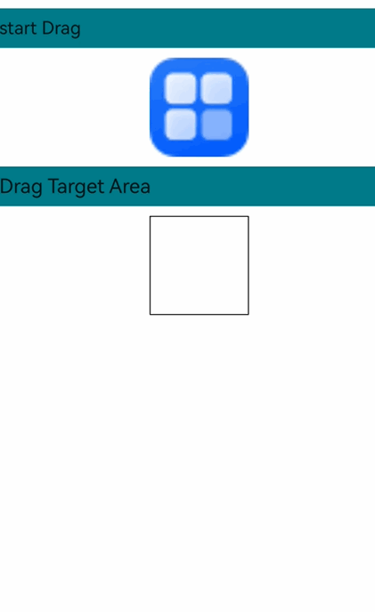
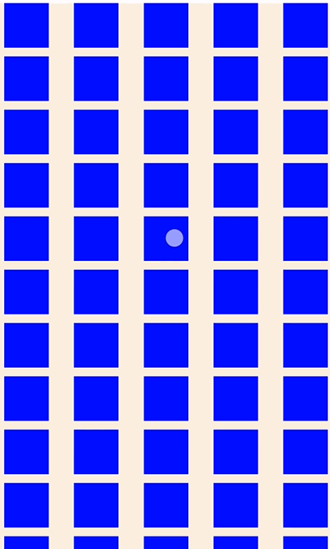
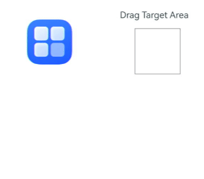
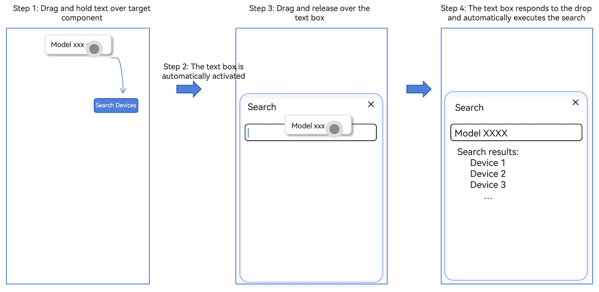
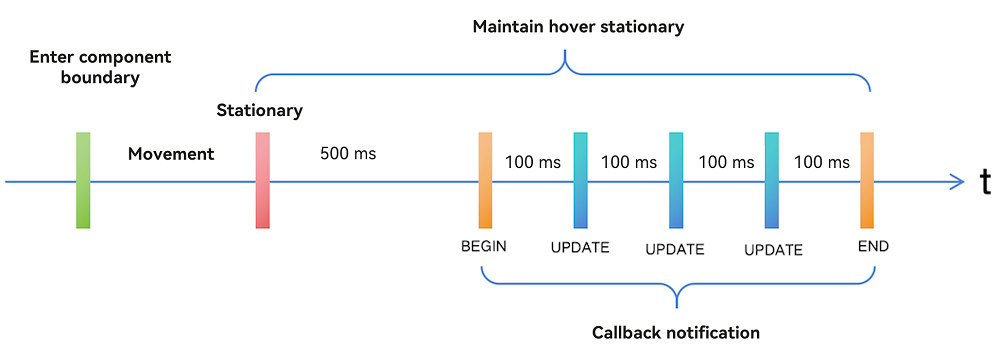

# Implementing Unified Drag and Drop
<!--Kit: ArkUI-->
<!--Subsystem: ArkUI-->
<!--Owner: @yihao-lin-->
<!--Designer: @piggyguy-->
<!--Tester: @songyanhong-->
<!--Adviser: @Brilliantry_Rui-->

Unified drag and drop enables data transfer interactions triggered by mouse devices or gestures. Users can drag data from one component (the drag source) and drop it onto another (the drop target) to trigger responses. In this interaction, the drag source provides the data, while the drop target receives and processes it, enabling users to easily move, copy, or share data.

## Basic Concepts

* **Drag operation**: An interaction that begins when a user selects a draggable component, continues as the user drags it across the screen, and ends when the user releases it over a droppable component.
* **Drag preview**: A visual representation of the data being dragged. You can customize it using [CustomBuilder](../reference/apis-arkui/arkui-ts/ts-types.md#custombuilder8), [DragItemInfo](../reference/apis-arkui/arkui-ts/ts-universal-events-drag-drop.md#dragiteminfo) in [onDragStart](../reference/apis-arkui/arkui-ts/ts-universal-events-drag-drop.md#ondragstart), or the universal attribute [dragPreview](../reference/apis-arkui/arkui-ts/ts-universal-attributes-drag-drop.md#dragpreview11).
* **Drag data**: The data being transferred, encapsulated using the UDMF API [UnifiedData](../reference/apis-arkdata/js-apis-data-unifiedDataChannel.md#unifieddata) to ensure consistency and security.
* **Drag source**: The component that initiates the drag operation and provides data, typically with characteristics that respond to dragging.
* **Drop target**: The component that can receive and process drag data, performing corresponding actions based on the dropped content.
* **Drag point**: The contact point between the mouse device/finger and the screen, used to determine whether data enters a drop target based on whether the point is within the component's bounds.

## Drag Modes

Drag operations support both gesture-based and mouse-based interactions, which affect when callback events are triggered.

### Gesture-Based Drag

When dragging is triggered by gestures, ArkUI verifies whether the current component supports dragging before initiating the operation. For components that support drag-out by default ([Search](../reference/apis-arkui/arkui-ts/ts-basic-components-search.md), [TextInput](../reference/apis-arkui/arkui-ts/ts-basic-components-textinput.md), [TextArea](../reference/apis-arkui/arkui-ts/ts-basic-components-textarea.md), [RichEditor](../reference/apis-arkui/arkui-ts/ts-basic-components-richeditor.md), [Text](../reference/apis-arkui/arkui-ts/ts-basic-components-text.md), [Image](../reference/apis-arkui/arkui-ts/ts-basic-components-image.md), or [Hyperlink](../reference/apis-arkui/arkui-ts/ts-container-hyperlink.md)), ArkUI checks if [draggable](../reference/apis-arkui/arkui-ts/ts-universal-attributes-drag-drop.md#draggable) is set to true. For other components, ArkUI checks if the **onDragStart** callback is set. If the required attribute or callback is configured, ArkUI initiates dragging after the user long-presses the component for 500 ms and displays a drag preview after 800 ms. When combining drag operations with menus controlled by the **isShow** attribute, avoid delaying menu display by 800 ms after user action to prevent unexpected behavior.

The following diagram illustrates the gesture-based drag process (using finger or stylus):


### Mouse-Based Drag

When using a mouse as the pointer, ArkUI initiates dragging once the draggable component is moved with the left mouse button pressed by more than 1 vp. Other aspects of mouse drag are similar to gesture drag. For details, see [Gesture-Based Drag](#gesture-based-drag).

## Drag Event Callbacks

Drag and drop can occur within a single application or span multiple applications. The following callback events allow you to monitor drag status and intervene in the system's default drag behavior.

| Callback Event | Description |
| -------------- | ----------- |
| [onDragStart](../reference/apis-arkui/arkui-ts/ts-universal-events-drag-drop.md#ondragstart) | Triggered when a draggable component starts being dragged.<br>Use this callback to detect drag initiation and set drag data and preview. For better performance, return the drag preview as a pixel map rather than using **customBuilder**. |
| [onDragEnter](../reference/apis-arkui/arkui-ts/ts-universal-events-drag-drop.md#ondragenter) | Triggered when the drag point enters the component's bounds. Only called if the component listens for the [onDrop](../reference/apis-arkui/arkui-ts/ts-universal-events-drag-drop.md#ondrop) event. |
| [onDragMove](../reference/apis-arkui/arkui-ts/ts-universal-events-drag-drop.md#ondragmove) | Triggered when the drag point moves within the component's bounds. Only called if the component listens for the **onDrop** event.<br>During movement, use the **setResult** API in [DragEvent](../reference/apis-arkui/arkui-ts/ts-universal-events-drag-drop.md#dragevent7) to affect system appearance:<br>1. Set **DragResult.DROP_ENABLED** to indicate the component can accept drops.<br>2. Set **DragResult.DROP_DISABLED** to indicate the component cannot accept drops. |
| [onDragLeave](../reference/apis-arkui/arkui-ts/ts-universal-events-drag-drop.md#ondragleave) | Triggered when the drag point leaves the component's bounds. Only called if the component listens for the **onDrop** event.<br>By default, **onDragLeave** is not called in these cases:<br>1. Dragging from a parent component to its child component.<br>2. When drop target layout overlaps the drag source component.<br>Since API version 12, use [setDragEventStrictReportingEnabled](../reference/apis-arkui/arkts-apis-uicontext-dragcontroller.md#setdrageventstrictreportingenabled12) in [UIContext](../reference/apis-arkui/arkts-apis-uicontext-uicontext.md) to enable strict **onDragLeave** event triggering. |
| [onDrop](../reference/apis-arkui/arkui-ts/ts-universal-events-drag-drop.md#ondrop) | Triggered when a dragged item is dropped on the component. You must set the drag result in this callback using the **setResult** API in **DragEvent**. Otherwise, the **getResult** API in the drag source's **onDragEnd** method will only return the default result **DragResult.DRAG_FAILED**.<br>This callback allows you to intervene in default drop processing. The system prioritizes executing the **onDrop** callback and processes drag data based on the **setResult** API:<br>1. If **DragResult.DRAG_SUCCESSFUL** is set, you must process the data yourself; the system won't process it.<br>2. If **DragResult.DRAG_FAILED** is set, the system won't process the data.<br>3. If **DragResult.DRAG_CANCELED** is set, the system won't process the data.<br>4. Setting **DragResult.DROP_ENABLED** or **DragResult.DROP_DISABLED** is ignored and has the same effect as **DragResult.DRAG_SUCCESSFUL**. |
| [onDragEnd](../reference/apis-arkui/arkui-ts/ts-universal-events-drag-drop.md#ondragend10) | Triggered when the component's dragging ends. |
| [onPreDrag](../reference/apis-arkui/arkui-ts/ts-universal-events-drag-drop.md#onpredrag12) | Triggered when the component enters a state prior to drag and drop operations.<br>Use this callback to monitor [PreDragStatus](../reference/apis-arkui/arkui-ts/ts-universal-events-drag-drop.md#predragstatus12) values and prepare corresponding data:<br>1. **ACTION_DETECTING_STATUS**: Drag gesture detection in progress. Triggered at 50 ms of long press.<br>2. **READY_TO_TRIGGER_DRAG_ACTION**: Component ready to be dragged. Triggered at 500 ms of long press.<br>3. **PREVIEW_LIFT_STARTED**: Lift animation started. Triggered at 800 ms of long press.<br>4. **PREVIEW_LIFT_FINISHED**: Lift animation completed. Triggered when lift animation finishes.<br>5. **PREVIEW_LANDING_STARTED**: Drop animation started. Triggered when drop animation begins.<br>6. **PREVIEW_LANDING_FINISHED**: Drop animation completed. Triggered when drop animation ends.<br>7. **ACTION_CANCELED_BEFORE_DRAG**: Drag operation terminated. Triggered when the finger is lifted after entering **READY_TO_TRIGGER_DRAG_ACTION** state.<br>8. **PREPARING_FOR_DRAG_DETECTION**<sup>18+</sup>: Drag preparation complete, drag phase can be initiated. Triggered at 350 ms of button press. |
| [onDragSpringLoading](../reference/apis-arkui/arkui-ts/ts-universal-events-drag-drop.md#ondragspringloading20) | Triggered when a dragged object hovers over the component bound to this event. Only one target can become the responder, with child components having higher priority.<br>Use [SpringLoadingContext](../reference/apis-arkui/js-apis-arkui-dragController.md#springloadingcontext20) to configure callback context, including hover detection status, notification count, drag information, and configuration.<br>Supported since API version 20. |

## DragEvent Object

The drag callback function receives the [DragEvent](../reference/apis-arkui/arkui-ts/ts-universal-events-drag-drop.md#dragevent7) object, which contains detailed information about the drag behavior and data provided by the component when dragged out.

The following table shows which get methods return valid data in each drag callback.
| Callback Event| onDragStart | onDragEnter | onDragMove | onDragLeave | onDrop | onDragEnd |
| - | - | - | - | - | - | - |
| getData         |—|—|—|—| Supported|—|
| getSummary      |—| Supported| Supported| Supported| Supported|—|
| getResult       |—|—|—|—|—| Supported|
| getPreviewRect  |—|—|—|—| Supported|—|
| getVelocity/X/Y |—| Supported| Supported| Supported| Supported|—|
| getWindowX/Y    | Supported| Supported| Supported| Supported| Supported|—|
| getDisplayX/Y   | Supported| Supported| Supported| Supported| Supported|—|
| getX/Y          | Supported| Supported| Supported| Supported| Supported|—|
| getModifierKeyState | Supported| Supported| Supported| Supported| Supported| Supported|
| startDataLoading    | — | — | — | — | Supported|—|
| getDisplayId        | Supported| Supported| Supported| Supported| Supported|—|
| getDragSource       | Supported| Supported| Supported| Supported| Supported| Supported|
| isRemote            | Supported| Supported| Supported| Supported| Supported| Supported|
| getGlobalDisplayX/Y | Supported| Supported| Supported| Supported| Supported|—|
| behavior        |—|—|—|—|—| Supported|

[DragEvent](../reference/apis-arkui/arkui-ts/ts-universal-events-drag-drop.md#dragevent7) also provides setters to transfer information to the system, which can affect how the system handles UI or data. The following table shows when set methods are received and processed by the system:
| Callback Event| onDragStart | onDragEnter | onDragMove | onDragLeave | onDrop |
| - | - | - | - | - | - |
| useCustomDropAnimation |—|—|—|—| Supported|
| setData                | Supported|—|—|—|—|
| setResult              | Supported; can be used to prevent dragging initiation by setting failed or cancel| Supported; not passed as the final result to **onDragEnd**| Supported; not passed as the final result to **onDragEnd**| Supported; not passed as the final result to **onDragEnd** | Supported; passed as the final result to **onDragEnd**|
| setDataLoadParams      | Supported|—|—|—|—|
| behavior               |—| Supported| Supported| Supported| Supported|

## Drag Preview

The drag preview is an image displayed during drag and drop operations, serving as a visual representation of the drag data rather than the component itself. You can set it to any supported image you want to display to users. The **customBuilder** or **pixelMap** object returned by the **onDragStart** callback sets the preview displayed during dragging, while a component snapshot is used as the default preview during lift animation. The **customBuilder** or **pixelMap** object set by the **dragPreview** attribute sets the preview during both lift animation and dragging. If no custom preview is set, the system uses a component snapshot by default.

You can configure opacity, rounded corners, shadow, and blur effects for the drag preview. For details, see [Drag and Drop Control](../reference/apis-arkui/arkui-ts/ts-universal-attributes-drag-drop.md).


**Constraints**:

* For container components, if internal content exceeds component bounds due to **position**, **offset**, or other settings, the component snapshot won't capture the excess content. To show it, expand the container scope or use a custom container.
* Regardless of whether you use a custom builder or rely on the default snapshot mechanism, the snapshot process does not support transformation APIs, including [scale](../reference/apis-arkui/arkui-ts/ts-universal-attributes-transformation.md#scale) and [rotate](../reference/apis-arkui/arkui-ts/ts-universal-attributes-transformation.md#rotate).

## Drag and Drop Implementation

### General Drag and Drop Adaptation

The following example uses the [Image](../reference/apis-arkui/arkui-ts/ts-basic-components-image.md) component to illustrate basic drag and drop development procedures and key considerations.

1. Make the component draggable.

   Set the **draggable** attribute to **true** and configure the **onDragStart** callback function. In the callback, use UDMF to set drag data and return a custom drag preview.

    ```ts
    import { unifiedDataChannel, uniformTypeDescriptor } from '@kit.ArkData';

    // Replace $r('app.media.app_icon') with the image resource file you use.
    Image($r('app.media.app_icon'))
        .width(100)
        .height(100)
        .draggable(true)
        .onDragStart((event) => {
            let data: unifiedDataChannel.Image = new unifiedDataChannel.Image();
            // Replace 'resources/base/media/app_icon.png' with the image resource file you use.
            data.imageUri = 'resources/base/media/app_icon.png';
            let unifiedData = new unifiedDataChannel.UnifiedData(data);
            event.setData(unifiedData);

            let dragItemInfo: DragItemInfo = {
            pixelMap: this.pixmap,
            extraInfo: "this is extraInfo",
            };
            // Return custom drag preview in onDragStart
            return dragItemInfo;
        })
    ```

   The gesture-based drag operation is initiated by a long press gesture bound at the underlying layer. If a long press gesture is also bound to the dragged component, gesture conflict will occur, resulting in dragging to fail. To address this issue, you can use parallel gestures.

    ```ts
    .parallelGesture(LongPressGesture().onAction(() => {
       this.getUIContext().getPromptAction().showToast({ duration: 100, message: 'Long press gesture trigger' });
    }))
    ```

2. Customize the drag preview.
   
   Prepare a pixel map for the custom drag preview within the callback triggered by [onPreDrag](../reference/apis-arkui/arkui-ts/ts-universal-events-drag-drop.md#onpredrag12) after a long press of 50 ms.
   
    ```ts
    .onPreDrag((status: PreDragStatus) => {
        if (preDragStatus == PreDragStatus.ACTION_DETECTING_STATUS) {
            this.getComponentSnapshot();
        }
    })
    ```
   
   Generate the specific pixel map by calling [this.getUIContext().getComponentSnapshot().createFromBuilder()](../reference/apis-arkui/arkts-apis-uicontext-componentsnapshot.md#createfrombuilder12).

      ```ts
      @Builder
      pixelMapBuilder() {
          Column() {
            Image($r('app.media.startIcon'))
              .width(100)
              .height(100)
          }
        }
        private getComponentSnapshot(): void {
        this.getUIContext().getComponentSnapshot().createFromBuilder(()=>{this.pixelMapBuilder()},
        (error: Error, pixmap: image.PixelMap) => {
            if(error){
              console.error("error: " + JSON.stringify(error))
              return;
            }
            this.pixmap = pixmap;
        })
      }
      ```

3. To make sure the [onDragLeave](../reference/apis-arkui/arkui-ts/ts-universal-events-drag-drop.md#ondragleave) event is triggered as expected, use the [setDragEventStrictReportingEnabled](../reference/apis-arkui/arkts-apis-uicontext-dragcontroller.md#setdrageventstrictreportingenabled12) API.

    ```ts
    import { UIAbility } from '@kit.AbilityKit';
    import { window, UIContext } from '@kit.ArkUI';

    export default class EntryAbility extends UIAbility {
      onWindowStageCreate(windowStage: window.WindowStage): void {
        windowStage.loadContent('pages/Index', (err, data) => {
          if (err.code) {
            return;
          }
          windowStage.getMainWindow((err, data) => {
            if (err.code) {
              return;
            }
            let windowClass: window.Window = data;
            let uiContext: UIContext = windowClass.getUIContext();
            uiContext.getDragController().setDragEventStrictReportingEnabled(true);
          });
        });
      }
    }
    ```

4. Set the badge displayed during dragging.

   Use [allowDrop](../reference/apis-arkui/arkui-ts/ts-universal-attributes-drag-drop.md#allowdrop) to define allowed data types for dropping, which affects badge display. When dragged data matches the defined types, a plus sign (+) badge appears. If the data type isn't allowed, you can forcibly disable the badge. If **allowDrop** isn't set, no plus sign appears. This example allows only HYPERLINK and PLAIN_TEXT data types from UnifiedData.

    ```ts
    .allowDrop([uniformTypeDescriptor.UniformDataType.HYPERLINK, uniformTypeDescriptor.UniformDataType.PLAIN_TEXT])
    ```

   If implementing the onDrop callback, you can also set [DragResult](../reference/apis-arkui/arkui-ts/ts-universal-events-drag-drop.md#dragresult10) to DROP_ENABLED in onDragMove and set [DragBehavior](../reference/apis-arkui/arkui-ts/ts-universal-events-drag-drop.md#dragbehavior10) to COPY or MOVE to control badge display. COPY shows a plus sign (+), while MOVE doesn't.

    ```ts
    .onDragMove((event) => {
        event.setResult(DragResult.DROP_ENABLED);
        event.dragBehavior = DragBehavior.COPY;
    })
    ```

5. Receive drag data.

   Set the **onDrop** callback to handle drag data and determine the drag result.

    ```ts
    .onDrop((dragEvent?: DragEvent) => {
        // Obtain the drag data.
        this.getDataFromUdmf((dragEvent as DragEvent), (event: DragEvent) => {
        let records: Array<unifiedDataChannel.UnifiedRecord> = event.getData().getRecords();
        let rect: Rectangle = event.getPreviewRect();
        this.imageWidth = Number(rect.width);
        this.imageHeight = Number(rect.height);
        this.targetImage = (records[0] as unifiedDataChannel.Image).imageUri;
        this.imgState = Visibility.None;
        // Explicitly set the result to successful, and then pass this value to onDragEnd of the drag source.
        event.setResult(DragResult.DRAG_SUCCESSFUL);
    })
    ```

   Data transfer is managed by UDMF, which may experience latency when dealing with large data volumes. Implement a retry mechanism with a 1500 ms delay if initial data acquisition fails.

    ```ts
    getDataFromUdmfRetry(event: DragEvent, callback: (data: DragEvent) => void) {
       try {
         let data: UnifiedData = event.getData();
         if (!data) {
           return false;
         }
         let records: Array<unifiedDataChannel.UnifiedRecord> = data.getRecords();
         if (!records || records.length <= 0) {
           return false;
         }
         callback(event);
         return true;
       } catch (e) {
         console.error("getData failed, code: " + (e as BusinessError).code + ", message: " + (e as BusinessError).message);
         return false;
       }
    }

    getDataFromUdmf(event: DragEvent, callback: (data: DragEvent) => void) {
      if (this.getDataFromUdmfRetry(event, callback)) {
        return;
      }
      setTimeout(() => {
        this.getDataFromUdmfRetry(event, callback);
      }, 1500);
    }
    ```

6. The drag source can detect the drag operation result via the **onDragEnd** callback.

    ```ts
    import { promptAction } from '@kit.ArkUI';

    .onDragEnd((event) => {
        // The result value obtained from onDragEnd is set in onDrop of the drop target.
      if (event.getResult() === DragResult.DRAG_SUCCESSFUL) {
        this.getUIContext().getPromptAction().showToast({ duration: 100, message: 'Drag Success' });
      } else if (event.getResult() === DragResult.DRAG_FAILED) {
        this.getUIContext().getPromptAction().showToast({ duration: 100, message: 'Drag failed' });
      }
    })
    ```

**Sample Code**

```ts
import { unifiedDataChannel, uniformTypeDescriptor } from '@kit.ArkData';
import { BusinessError } from '@kit.BasicServicesKit';
import { image } from '@kit.ImageKit';

@Entry
@Component
struct Index {
  @State targetImage: string = '';
  @State imageWidth: number = 100;
  @State imageHeight: number = 100;
  @State imgState: Visibility = Visibility.Visible;
  @State pixmap: image.PixelMap|undefined = undefined

  @Builder
  pixelMapBuilder() {
    Column() {
      // Replace $r('app.media.app_icon') with the image resource file you use.
      Image($r('app.media.app_icon'))
        .width(100)
        .height(100)
    }
  }

  getDataFromUdmfRetry(event: DragEvent, callback: (data: DragEvent) => void) {
    try {
      let data: UnifiedData = event.getData();
      if (!data) {
        return false;
      }
      let records: Array<unifiedDataChannel.UnifiedRecord> = data.getRecords();
      if (!records || records.length <= 0) {
        return false;
      }
      callback(event);
      return true;
    } catch (e) {
      console.error("getData failed, code: " + (e as BusinessError).code + ", message: " + (e as BusinessError).message);
      return false;
    }
  }
  // Obtain UDMF data with a retry mechanism of 1500 ms if the initial attempt fails.
  getDataFromUdmf(event: DragEvent, callback: (data: DragEvent) => void) {
    if (this.getDataFromUdmfRetry(event, callback)) {
      return;
    }
    setTimeout(() => {
      this.getDataFromUdmfRetry(event, callback);
    }, 1500);
  }
  // Use the createFromBuilder API of componentSnapshot to capture a snapshot of a custom builder.
  private getComponentSnapshot(): void {
    this.getUIContext().getComponentSnapshot().createFromBuilder(()=>{this.pixelMapBuilder()},
      (error: Error, pixmap: image.PixelMap) => {
        if(error){
          console.error("error: " + JSON.stringify(error))
          return;
        }
        this.pixmap = pixmap;
      })
  }
  // Prepare a custom screenshot pixel map after a 50 ms long press is detected.
  private PreDragChange(preDragStatus: PreDragStatus): void {
    if (preDragStatus == PreDragStatus.ACTION_DETECTING_STATUS) {
      this.getComponentSnapshot();
    }
  }

  build() {
    Row() {
      Column() {
        Text('start Drag')
          .fontSize(18)
          .width('100%')
          .height(40)
          .margin(10)
          .backgroundColor('#008888')
        Row() {
          // Replace $r('app.media.app_icon') with the image resource file you use.
          Image($r('app.media.app_icon'))
            .width(100)
            .height(100)
            .draggable(true)
            .margin({ left: 15 })
            .visibility(this.imgState)
            // Bind a parallel gesture to trigger a custom long press gesture.
            .parallelGesture(LongPressGesture().onAction(() => {
              this.getUIContext().getPromptAction().showToast({ duration: 100, message: 'Long press gesture trigger' });
            }))
            .onDragStart((event) => {
              let data: unifiedDataChannel.Image = new unifiedDataChannel.Image();
              // Replace 'resources/base/media/app_icon.png' with the image resource file you use.
              data.imageUri = 'resources/base/media/app_icon.png';
              let unifiedData = new unifiedDataChannel.UnifiedData(data);
              event.setData(unifiedData);

              let dragItemInfo: DragItemInfo = {
                pixelMap: this.pixmap,
                extraInfo: "this is extraInfo",
              };
              return dragItemInfo;
            })
              // Prepare a custom drag preview in advance.
            .onPreDrag((status: PreDragStatus) => {
              this.PreDragChange(status);
            })
            .onDragEnd((event) => {
              // The result value obtained from onDragEnd is set in onDrop of the drop target.
              if (event.getResult() === DragResult.DRAG_SUCCESSFUL) {
                this.getUIContext().getPromptAction().showToast({ duration: 100, message: 'Drag Success' });
              } else if (event.getResult() === DragResult.DRAG_FAILED) {
                this.getUIContext().getPromptAction().showToast({ duration: 100, message: 'Drag failed' });
              }
            })
        }

        Text('Drag Target Area')
          .fontSize(20)
          .width('100%')
          .height(40)
          .margin(10)
          .backgroundColor('#008888')
        Row() {
          Image(this.targetImage)
            .width(this.imageWidth)
            .height(this.imageHeight)
            .draggable(true)
            .margin({ left: 15 })
            .border({ color: Color.Black, width: 1 })
            // Set the badge display type to COPY.
            .onDragMove((event) => {
              event.setResult(DragResult.DROP_ENABLED)
              event.dragBehavior = DragBehavior.COPY
            })
            .allowDrop([uniformTypeDescriptor.UniformDataType.IMAGE])
            .onDrop((dragEvent?: DragEvent) => {
              // Obtain the drag data.
              this.getDataFromUdmf((dragEvent as DragEvent), (event: DragEvent) => {
                let records: Array<unifiedDataChannel.UnifiedRecord> = event.getData().getRecords();
                let rect: Rectangle = event.getPreviewRect();
                this.imageWidth = Number(rect.width);
                this.imageHeight = Number(rect.height);
                this.targetImage = (records[0] as unifiedDataChannel.Image).imageUri;
                this.imgState = Visibility.None;
                // Explicitly set the result to successful, and then pass this value to onDragEnd of the drag source.
                event.setResult(DragResult.DRAG_SUCCESSFUL);
              })
            })
        }
      }
      .width('100%')
      .height('100%')
    }
    .height('100%')
  }
}

```


### Multi-Select Drag and Drop Adaptation

Since API version 12, the **GridItem** and **ListItem** components, which are child components of [Grid](../reference/apis-arkui/arkui-ts/ts-container-grid.md) and [List](../reference/apis-arkui/arkui-ts/ts-container-list.md), respectively, support multi-select drag and drop, which can be initiated through the **onDragStart** API.

The following uses **Grid** as an example to describe the basic procedure for multi-select drag and drop development and key considerations during development.

1. Enable multi-select drag and drop.

   Create **GridItem** child components and bind the **onDragStart** callback to them. In addition, set the **GridItem** components as selectable.

    ```ts
    Grid() {
      ForEach(this.numbers, (idx: number) => {
        GridItem() {
          Column()
            .backgroundColor(Color.Blue)
            .width(50)
            .height(50)
            .opacity(1.0)
            .id('grid'+idx)
        }
        .onDragStart(()=>{})
        .selectable(true)
      }, (idx: string) => idx)
    }
    ```

   Multi-select drag and drop is disabled by default. To enable it, set **isMultiSelectionEnabled** to **true** in the **DragInteractionOptions** parameter of the [dragPreviewOptions](../reference/apis-arkui/arkui-ts/ts-universal-attributes-drag-drop.md#dragpreviewoptions11) API. **DragInteractionOptions** also has the **defaultAnimationBeforeLifting** parameter, which, when set to **true**, applies a default scaling down animation as the lift animation for the component.

    ```ts
    .dragPreviewOptions({isMultiSelectionEnabled:true,defaultAnimationBeforeLifting:true})
    ```

   To maintain the selected state, set the **selected** attribute of the **GridItem** components to **true**. For example, you can use [onClick](../reference/apis-arkui/arkui-ts/ts-universal-events-click.md#onclick) to set a specific component to the selected state.

    ```ts
    .selected(this.isSelectedGrid[idx])
    .onClick(()=>{
        this.isSelectedGrid[idx] = !this.isSelectedGrid[idx]
    })
    ```

2. Optimize the multi-select drag and drop performance.

   In multi-select drag and drop scenarios, there is a clustering animation effect when multiple items are selected. This effect captures a snapshot of the selected components currently displayed on the screen, which can incur high performance costs if there are too many selected components. To save on performance, multi-select drag and drop allows for the use of a snapshot from **dragPreview** as the basis for the clustering animation.

    ```ts
    .dragPreview({
        pixelMap:this.pixmap
    })
    ```

   To obtain a snapshot of a component, you can call the [this.getUIContext().getComponentSnapshot().get()](../reference/apis-arkui/arkts-apis-uicontext-componentsnapshot.md#get12) API when the component is selected. The following shows how to use the component ID to obtain the snapshot.

    ```ts
    @State previewData: DragItemInfo[] = []
    @State isSelectedGrid: boolean[] = []
    .onClick(()=>{
        this.isSelectedGrid[idx] = !this.isSelectedGrid[idx]
        if (this.isSelectedGrid[idx]) {
            let gridItemName = 'grid' + idx
            this.getUIContext().getComponentSnapshot().get(gridItemName, (error: Error, pixmap: image.PixelMap)=>{
                this.pixmap = pixmap
                this.previewData[idx] = {
                    pixelMap:this.pixmap
                }
            })
        }
    })
    ```

3. Set the multi-select display effects.

    Use [stateStyles](../reference/apis-arkui/arkui-ts/ts-universal-attributes-polymorphic-style.md#statestyles) to set display effects for selected and unselected states for easy distinction.

    ```ts
    @Styles
    normalStyles(): void{
      .opacity(1.0)
    }

    @Styles
    selectStyles(): void{
      .opacity(0.4)
    }

    .stateStyles({
      normal : this.normalStyles,
      selected: this.selectStyles
    })
    ```

4. Adapt the number badge.

    Configure the number badge for multi-select drag and drop using the **numberBadge** parameter in **dragPreviewOptions**, adjusting it based on the number of selected items.

    ```ts
    @State numberBadge: number = 0;

    .onClick(()=>{
        this.isSelectedGrid[idx] = !this.isSelectedGrid[idx]
        if (this.isSelectedGrid[idx]) {
          this.numberBadge++;
        } else {
          this.numberBadge--;
      }
    })
    // Set the numberBadge parameter in dragPreviewOptions for the number badge in multi-select scenarios.
    .dragPreviewOptions({numberBadge: this.numberBadge})
    ```

**Sample Code**

```ts
import { image } from '@kit.ImageKit';

@Entry
@Component
struct GridEts {
  @State pixmap: image.PixelMap|undefined = undefined
  @State numbers: number[] = []
  @State isSelectedGrid: boolean[] = []
  @State previewData: DragItemInfo[] = []
  @State numberBadge: number = 0;

  @Styles
  normalStyles(): void{
    .opacity(1.0)
  }

  @Styles
  selectStyles(): void{
    .opacity(0.4)
  }

  onPageShow(): void {
    let i: number = 0
    for(i=0;i<100;i++){
      this.numbers.push(i)
      this.isSelectedGrid.push(false)
      this.previewData.push({})
    }
  }

  @Builder
  RandomBuilder(idx: number) {
    Column()
      .backgroundColor(Color.Blue)
      .width(50)
      .height(50)
      .opacity(1.0)
  }

  build() {
    Column({ space: 5 }) {
      Grid() {
        ForEach(this.numbers, (idx: number) => {
          GridItem() {
            Column()
              .backgroundColor(Color.Blue)
              .width(50)
              .height(50)
              .opacity(1.0)
              .id('grid'+idx)
          }
          .dragPreview(this.previewData[idx])
          .selectable(true)
          .selected(this.isSelectedGrid[idx])
          // Set the multi-select display effects.
          .stateStyles({
            normal : this.normalStyles,
            selected: this.selectStyles
          })
          .onClick(()=>{
            this.isSelectedGrid[idx] = !this.isSelectedGrid[idx]
            if (this.isSelectedGrid[idx]) {
              this.numberBadge++;
              let gridItemName = 'grid' + idx
              // Call the get API in componentSnapshot to obtain the component snapshot pixel map on selection.
              this.getUIContext().getComponentSnapshot().get(gridItemName, (error: Error, pixmap: image.PixelMap)=>{
                this.pixmap = pixmap
                this.previewData[idx] = {
                  pixelMap:this.pixmap
                }
              })
            } else {
              this.numberBadge--;
            }
          })
          // Enable multiselect and set the number badge.
          .dragPreviewOptions({numberBadge: this.numberBadge},{isMultiSelectionEnabled:true,defaultAnimationBeforeLifting:true})
          .onDragStart(()=>{
          })
        }, (idx: string) => idx)
      }
      .columnsTemplate('1fr 1fr 1fr 1fr 1fr')
      .columnsGap(5)
      .rowsGap(10)
      .backgroundColor(0xFAEEE0)
    }.width('100%').margin({ top: 5 })
  }
}
```


### Custom Drop Animation Adaptation

When you need to create custom drop animations, you can disable the default system animations. Since API version 18, ArkUI provides the [executeDropAnimation](../reference/apis-arkui/arkui-ts/ts-universal-events-drag-drop.md#executedropanimation18) API, which allows you to define your own drop animations. The following provides step-by-step instructions using the **Image** component as an example, along with key points to keep in mind during development.

1. Configure drag and drop settings for the component.
   Set **draggable** to **true** and configure callbacks like **onDragStart** and **onDragEnd**.
    ```ts
    // Replace $r('app.media.app_icon') with the image resource file you use.
    Image($r('app.media.app_icon'))
      .width(100)
      .height(100)
      .draggable(true)
      .margin({ left: 15 ,top: 40})
      .visibility(this.imgState)
      .onDragStart((event) => {})
      .onDragEnd((event) => {})
    ```
2. Define your custom animation.

   Use the [animateTo](../reference/apis-arkui/arkts-apis-uicontext-uicontext.md#animateto) API to create custom animations, such as changing component size.

    ```ts
      customDropAnimation = () => {
        this.getUIContext().animateTo({ duration: 1000, curve: Curve.EaseOut, playMode: PlayMode.Normal }, () => {
          this.imageWidth = 200;
          this.imageHeight = 200;
          this.imgState = Visibility.None;
        })
      }
    ```

3. Trigger the custom drop animation.

   Configure the **onDrop** callback to receive drag data. Execute your custom drop animation using [executeDropAnimation](../reference/apis-arkui/arkui-ts/ts-universal-events-drag-drop.md#executedropanimation18). Set [useCustomDropAnimation](../reference/apis-arkui/arkui-ts/ts-universal-events-drag-drop.md#dragevent7) to **true** to disable the default system animation.

    ```ts
      Column() {
        Image(this.targetImage)
          .width(this.imageWidth)
          .height(this.imageHeight)
      }
      .draggable(true)
      .margin({ left: 15 })
      .border({ color: Color.Black, width: 1 })
      .allowDrop([udmfType.UniformDataType.IMAGE])
      .onDrop((dragEvent: DragEvent) => {
        let records: Array<unifiedDataChannel.UnifiedRecord> = dragEvent.getData().getRecords();
        let rect: Rectangle = dragEvent.getPreviewRect();
        this.imageWidth = Number(rect.width);
        this.imageHeight = Number(rect.height);
        this.targetImage = (records[0] as udmf.Image).imageUri;
        dragEvent.useCustomDropAnimation = true;
        dragEvent.executeDropAnimation(this.customDropAnimation)
      })
    ```

**Sample Code**

```ts
import { unifiedDataChannel, uniformTypeDescriptor } from '@kit.ArkData';

@Entry
@Component
struct DropAnimationExample {
  @State targetImage: string = '';
  @State imageWidth: number = 100;
  @State imageHeight: number = 100;
  @State imgState: Visibility = Visibility.Visible;

  customDropAnimation =
    () => {
      this.getUIContext().animateTo({ duration: 1000, curve: Curve.EaseOut, playMode: PlayMode.Normal }, () => {
        this.imageWidth = 200;
        this.imageHeight = 200;
        this.imgState = Visibility.None;
      })
    }

  build() {
    Row() {
      Column() {
        // Replace $r('app.media.app_icon') with the image resource file you use.
        Image($r('app.media.app_icon'))
          .width(100)
          .height(100)
          .draggable(true)
          .margin({ left: 15 ,top: 40})
          .visibility(this.imgState)
          .onDragStart((event) => {
          })
          .onDragEnd((event) => {
            if (event.getResult() === DragResult.DRAG_SUCCESSFUL) {
              console.info('Drag Success');
            } else if (event.getResult() === DragResult.DRAG_FAILED) {
              console.info('Drag failed');
            }
          })
      }.width('45%')
      .height('100%')
      Column() {
        Text('Drag Target Area')
          .fontSize(20)
          .width(180)
          .height(40)
          .textAlign(TextAlign.Center)
          .margin(10)
          .backgroundColor('rgb(240,250,255)')
        Column() {
          Image(this.targetImage)
            .width(this.imageWidth)
            .height(this.imageHeight)
        }
        .draggable(true)
        .margin({ left: 15 })
        .border({ color: Color.Black, width: 1 })
        .allowDrop([uniformTypeDescriptor.UniformDataType.IMAGE])
        .onDrop((dragEvent: DragEvent) => {
          let records: Array<unifiedDataChannel.UnifiedRecord> = dragEvent.getData().getRecords();
          let rect: Rectangle = dragEvent.getPreviewRect();
          this.imageWidth = Number(rect.width);
          this.imageHeight = Number(rect.height);
          this.targetImage = (records[0] as unifiedDataChannel.Image).imageUri;
          dragEvent.useCustomDropAnimation = true;
          dragEvent.executeDropAnimation(this.customDropAnimation)
        })
        .width(this.imageWidth)
        .height(this.imageHeight)
      }.width('45%')
      .height('100%')
      .margin({ left: '5%' })
    }
    .height('100%')
  }
}
```


### Handling Large Data Volumes

When dealing with numerous items or large data volumes during drag and drop, processing all data at once can degrade user experience. The following example uses the **Grid** component to demonstrate recommended practices for handling large data volumes, including proactive drag blocking support since API version 18.

1. Enable multi-select drag and drop.

   Create **GridItem** child components and set them as selectable. Enable multi-select by setting **isMultiSelectionEnabled** to **true**. Use the selected state to distinguish selected items.

    ```ts
    Grid() {
      ForEach(this.numbers, (idx: number) => {
        GridItem() {
          Column()
            .backgroundColor(Color.Blue)
            .width(50)
            .height(50)
            .opacity(1.0)
            .id('grid'+idx)
        }
        .dragPreview(this.previewData[idx])
        .dragPreviewOptions({numberBadge: this.numberBadge},{isMultiSelectionEnabled:true,defaultAnimationBeforeLifting:true})
        .selectable(true)
        .selected(this.isSelectedGrid[idx])
        .stateStyles({
          normal : this.normalStyles,
          selected: this.selectStyles
        })
        .onClick(() => {
          this.isSelectedGrid[idx] = !this.isSelectedGrid[idx];
        })
      }, (idx: string) => idx)
    }
    ```

   For performance, limit multi-select drag and drop to a maximum of 500 items.

    ```ts
    onPageShow(): void {
      let i: number = 0
      for(i=0;i<500;i++){
        this.numbers.push(i)
        this.isSelectedGrid.push(false)
        this.previewData.push({})
      }
    }
    ```
2. Add data incrementally when items are selected.

   For large data volumes, incrementally add data records using [addRecord](../reference/apis-arkdata/js-apis-data-unifiedDataChannel.md#addrecord) as items are selected. This avoids performance overhead from processing all data during drag operations.

    ```ts
    .onClick(()=>{
      this.isSelectedGrid[idx] = !this.isSelectedGrid[idx];
      if (this.isSelectedGrid[idx]) {
        let data: UDC.Image = new UDC.Image();
        // Replace '/resource/image.jpeg' with the image resource file you use.
        data.uri = '/resource/image.jpeg';
        if (!this.unifiedData) {
          this.unifiedData = new UDC.UnifiedData(data);
        }
        this.unifiedData.addRecord(data);
        this.numberBadge++;
        let gridItemName = 'grid' + idx;
        // Call the get API in componentSnapshot to obtain the component snapshot pixel map on selection.
        this.getUIContext().getComponentSnapshot().get(gridItemName, (error: Error, pixmap: image.PixelMap)=>{
          this.pixmap = pixmap;
          this.previewData[idx] = {
            pixelMap:this.pixmap
          }
        })
      } else {
        this.numberBadge--;
        for (let i=0; i<this.isSelectedGrid.length; i++) {
          if (this.isSelectedGrid[i] === true) {
            let data: UDC.Image = new UDC.Image();
            // Replace '/resource/image.jpeg' with the image resource file you use.
            data.uri = '/resource/image.jpeg';
            if (!this.unifiedData) {
              this.unifiedData = new UDC.UnifiedData(data);
            }
            this.unifiedData.addRecord(data);
          }
        }
      }
    })
    ```

3. Prepare data in advance.

   Use the **onPreDrag** callback to receive signals about impending drag operations. For large data volumes, prepare data in advance.

    ```ts
    .onPreDrag((status: PreDragStatus) => {
      if (status == PreDragStatus.PREPARING_FOR_DRAG_DETECTION) {
        this.loadData()
      }
    })
    ```

4. Block drag operations if data preparation is incomplete.

   When initiating a drag operation, check whether the data is ready. If the data is not prepared, send the [WAITING](../reference/apis-arkui/js-apis-arkui-dragController.md#dragstartrequeststatus18) signal to the system. In this case, if the user performs a drag gesture, the drag preview will remain stationary until the application sends a READY signal or the maximum blocking time limit (5 seconds) is exceeded. If the data is ready, you can directly set it to [dragEvent](../reference/apis-arkui/arkui-ts/ts-universal-events-drag-drop.md#dragevent7). Note that when using the blocking feature, you need to save the current **dragEvent** and set the data when preparation is complete. In non-blocking scenarios, saving the current **dragEvent** is not recommended.

    ```ts
    .onDragStart((event: DragEvent) => {
      this.dragEvent = event;
      if (this.finished == false) {
        this.getUIContext().getDragController().notifyDragStartRequest(dragController.DragStartRequestStatus.WAITING);
      } else {
        event.setData(this.unifiedData);
      }
    })
    ```

**Sample Code**

```ts
import { image } from '@kit.ImageKit';
import { unifiedDataChannel as UDC } from '@kit.ArkData';
import { dragController } from '@kit.ArkUI';

@Entry
@Component
struct GridEts {
  @State pixmap: image.PixelMap|undefined = undefined
  @State numbers: number[] = []
  @State isSelectedGrid: boolean[] = []
  @State previewData: DragItemInfo[] = []
  @State numberBadge: number = 0;
  unifiedData: UnifiedData|undefined = undefined;
  timeout: number = 1
  finished: boolean = false;
  dragEvent: DragEvent|undefined;

  @Styles
  normalStyles(): void{
    .opacity(1.0)
  }

  @Styles
  selectStyles(): void{
    .opacity(0.4)
  }

  onPageShow(): void {
    let i: number = 0
    for(i=0;i<500;i++){
      this.numbers.push(i)
      this.isSelectedGrid.push(false)
      this.previewData.push({})
    }
  }

  loadData() {
    this.timeout = setTimeout(() => {
      // State after data preparation is complete.
      if (this.dragEvent) {
        this.dragEvent.setData(this.unifiedData);
      }
      this.getUIContext().getDragController().notifyDragStartRequest(dragController.DragStartRequestStatus.READY);
      this.finished = true;
    }, 4000);
  }

  @Builder
  RandomBuilder(idx: number) {
    Column()
      .backgroundColor(Color.Blue)
      .width(50)
      .height(50)
      .opacity(1.0)
  }

  build() {
    Column({ space: 5 }) {
      Button('Select All')
        .onClick(() => {
          for (let i=0;i<this.isSelectedGrid.length;i++) {
            if (this.isSelectedGrid[i] === false) {
              this.numberBadge++;
              this.isSelectedGrid[i] = true;
              let data: UDC.Image = new UDC.Image();
              // Replace '/resource/image.jpeg' with the image resource file you use.
              data.uri = '/resource/image.jpeg';
              if (!this.unifiedData) {
                this.unifiedData = new UDC.UnifiedData(data);
              }
              this.unifiedData.addRecord(data);
              let gridItemName = 'grid' + i;
              // Call the get API in componentSnapshot to obtain the component snapshot pixel map on selection.
              this.getUIContext().getComponentSnapshot().get(gridItemName, (error: Error, pixmap: image.PixelMap)=>{
                this.pixmap = pixmap
                this.previewData[i] = {
                  pixelMap:this.pixmap
                }
              })
            }
          }
        })
      Grid() {
        ForEach(this.numbers, (idx: number) => {
          GridItem() {
            Column()
              .backgroundColor(Color.Blue)
              .width(50)
              .height(50)
              .opacity(1.0)
              .id('grid'+idx)
          }
          .dragPreview(this.previewData[idx])
          .selectable(true)
          .selected(this.isSelectedGrid[idx])
          // Set the multi-select display effects.
          .stateStyles({
            normal : this.normalStyles,
            selected: this.selectStyles
          })
          .onClick(()=>{
            this.isSelectedGrid[idx] = !this.isSelectedGrid[idx];
            if (this.isSelectedGrid[idx]) {
              let data: UDC.Image = new UDC.Image();
              // Replace '/resource/image.jpeg' with the image resource file you use.
              data.uri = '/resource/image.jpeg';
              if (!this.unifiedData) {
                this.unifiedData = new UDC.UnifiedData(data);
              }
              this.unifiedData.addRecord(data);
              this.numberBadge++;
              let gridItemName = 'grid' + idx;
              // Call the get API in componentSnapshot to obtain the component snapshot pixel map on selection.
              this.getUIContext().getComponentSnapshot().get(gridItemName, (error: Error, pixmap: image.PixelMap)=>{
                this.pixmap = pixmap;
                this.previewData[idx] = {
                  pixelMap:this.pixmap
                }
              })
            } else {
              this.numberBadge--;
              for (let i=0; i<this.isSelectedGrid.length; i++) {
                if (this.isSelectedGrid[i] === true) {
                  let data: UDC.Image = new UDC.Image();
                  // Replace '/resource/image.jpeg' with the image resource file you use.
                  data.uri = '/resource/image.jpeg';
                  if (!this.unifiedData) {
                    this.unifiedData = new UDC.UnifiedData(data);
                  }
                  this.unifiedData.addRecord(data);
                }
              }
            }
          })
          .onPreDrag((status: PreDragStatus) => {
            // 1. Long press notification. Callback upon 350 ms.
            if (status == PreDragStatus.PREPARING_FOR_DRAG_DETECTION) {
              // 2. The user presses and holds for a period of time without releasing, which may lead to dragging: Prepare data at this time.
              this.loadData()
            } else if (status == PreDragStatus.ACTION_CANCELED_BEFORE_DRAG) {
              // 3. The user stops the drag operation: Cancel data preparation (simulation method: cancel the timer).
              clearTimeout(this.timeout);
            }
          })
          // Triggered when the component is pressed for 500 ms or longer and moved more than 10 vp.
          .onDragStart((event: DragEvent) => {
            this.dragEvent = event;
            if (this.finished == false) {
              this.getUIContext().getDragController().notifyDragStartRequest(dragController.DragStartRequestStatus.WAITING);
            } else {
              event.setData(this.unifiedData);
            }
          })
          .onDragEnd(() => {
            this.finished = false;
          })
          .dragPreviewOptions({numberBadge: this.numberBadge},{isMultiSelectionEnabled:true,defaultAnimationBeforeLifting:true})
        }, (idx: string) => idx)
      }
      .columnsTemplate('1fr 1fr 1fr 1fr 1fr')
      .columnsGap(5)
      .rowsGap(10)
      .backgroundColor(0xFAEEE0)
    }.width('100%').margin({ top: 5 })
  }
}
```


## Spring Loading (Hover Detection) Support
Spring loading, also known as drag hover detection or spring-loaded navigation, is an enhanced drag and drop capability that automatically triggers view transitions when users hover over targets during drag operations. This feature significantly improves operational efficiency and is recommended for all page transition scenarios.

> This feature is supported since API version 20.

This feature is particularly useful in the following scenarios:

- File management: Dragging a file over a folder automatically expands it.
- Home screen launcher: Hovering a file over an application icon automatically launches the application.

Beyond view transitions, spring loading can also activate specific UI elements. For example, when a user drags text over a button, a text boxcan be activated. The user can then move the dragged text into this box and release it to display search results, enabling efficient one-handed operation.



### Implementation Principle

To implement this feature, register the **onDragSpringLoading** API on a component and pass a callback to handle hover trigger notifications. Once registered, the component acts as a drop target (similar to components using the **onDrop** API) and follows the same hit detection rules: Only the topmost component under the hover position receives the drag event response.

The spring loading process has three distinct phases: hover detection -> callback notification -> completion. If the user continues dragging before completion, spring loading is automatically canceled, triggering a cancellation notification to the application. However, if dragging is resumed during the hover detection phase before the spring loading state is entered, no cancellation notification is sent.



Applications receive state updates through callbacks, enabling dynamic UI adjustments.

| State  | Description                                                                                             | Recommended Action                                                                              |
| :----- | :------------------------------------------------------------------------------------------------ | :----------------------------------------------------------------------------------------- |
| BEGIN  | The user has hovered over the component long enough to start entering the spring loading state.                         | Change the background color or adjust the component size to provide visual feedback.                                  |
| UPDATE | The user holds the pointer device stationary, and the system sends periodic refresh notifications (default: 3 times).                                                | Use the notification sequence parity to determine whether to reset UI display, creating pulsating visual effects.|
| END    | The user has hovered long enough to complete the entire spring loading process.                             | Execute page transitions or view changes.                                                                  |
| CANCEL | The user continues dragging or hover detection is interrupted in BEGIN state, preventing completion of hover detection.| Reset the UI state and cancel view transition-related states and logic.                                          |

>**NOTE**
>
>1. Keeping the pointer device stationary within the same component triggers only one complete spring loading cycle. The cycle will not repeat until the pointer device leaves and re-enters the component.
>2. A component can support both spring loading and other drag events (for example, **onDrop** and **onDragEnter**).


### Trigger Customization

You can customize spring loading detection parameters to dynamically determine whether to continue triggering.

1. Trigger parameter customization

  The **onDragSpringLoading** API includes an optional **configuration** parameter, which allows you to customize settings such as detection duration, trigger intervals, and number of triggers. This enables personalized definition of spring loading trigger conditions. In most cases, however, the system's default configuration is sufficient, and no modifications are required.
  
  The **configuration** parameter must be set before detection begins. Once the system initiates the spring loading detection process, it will no longer read updates from this parameter. Yet, you can still dynamically adjust configurations during detection using the **updateConfiguration** API in the **context** object provided using the callback. These dynamic updates apply only to the current trigger and do not affect the base configurations set through the **configuration** parameter.
  
  It is recommended that you use either the default configuration or fixed parameters through the **configuration** parameter in **onDragSpringLoading**. In most cases, dynamically modifying detection parameters during spring loading is unnecessary. However, this functionality can be useful if you need to provide different user feedback based on the type of dragged data.

  >**NOTE**
  >
  >Avoid excessively long time intervals or overly frequent trigger counts, as these typically fail to provide meaningful user feedback.

2. Dynamic termination

  When the system detects sufficient hover duration and invokes the **onDragSpringLoading** callback, you can decide whether to allow the pending spring loading notification to proceed. This is particularly useful for checking dragged data types against your service logic.

  The following pseudocode demonstrates this dynamic termination functionality:
  ```typescript
    .onDragSpringLoading((context: DragSpringLoadingContext)=>{
      // Check the current state.
      if (context.state == DragSpringLoadingState.BEGIN) {
        // Verify whether the dragged data type can be processed.
        boolean isICanHandle = false;
        let dataSummary = context?.dragInfos?.dataSummary;
        if (dataSummary != undefined) {
          for (const [type, size] of dataSummary) {
            if (type === "general.plain-text") { // Only plain text can be processed.
              isICanHandle = true;
              break;
            }
          }
        }
        // Terminate spring loading if data cannot be processed.
        if (!isICanHandle) {
          context.abort();
          return;
        }
      }
    })
  ```

3. Disabling spring loading

  If a component no longer needs to respond to spring loading, explicitly disable the feature by passing **null** to **onDragSpringLoading**:

  ```typescript
    .onDragSpringLoading(null)
  ```

### Example

The following example demonstrates device search functionality using **onDragSpringLoading**, including visual feedback and view switching triggered by drag hover interactions.

1. Prepare components.

  For simplicity, create two core components: a draggable text component and a button control. The button responds to spring loading to activate a view implemented using **bindSheet**, containing a text box for receiving dragged text and a text component for displaying search results.

  ```typescript
    build() {
      Column() {
        Column() {
          Text('Double-click to select and drag text: \n     DeviceName')
            .fontSize(30)
            .copyOption(CopyOptions.InApp) // Enable text selection and dragging when copyOption is enabled.
        }.padding({bottom:30})
  
        Button('Search Devices').width('80%').height('80vp').fontSize(30)
          .bindSheet($$this.isShowSheet, this.SheetBuilder(), {
            detents: [SheetSize.MEDIUM, SheetSize.LARGE, 600],
            preferType: SheetType.BOTTOM,
            title: { title: 'Search Devices' },
          })
      }.width('100%').height('100%')
      .justifyContent(FlexAlign.Center)
    }
  ```
2. Implement **SheetBuilder**.

  Implements the UI for the sheet.

  ```typescript
    @Builder
    SheetBuilder() {
      Column() {
        // Text box
        TextInput({placeholder: 'Drag text here'})
          .width('80%').borderWidth(1).borderColor(Color.Black)
          .onChange((value: string)=>{
            if (value.length == 0) {
              this.isSearchDone = false;
              return;
            }
            // Simplified handling: display fixed search results.
            this.isSearchDone = true;
        })
        if (this.isSearchDone) {
          Text(this.searchResult).fontSize(30)
        }
      }.width('100%').height('100%')
    }
  ```

3. Add enter and leave responses to the button.

  For visual feedback, add **onDragEnter** and **onDragLeave** handlers to the target component. When text is dragged over, the background color changes to prompt the user.

  ```typescript
    .onDragEnter(()=>{
      // Change the button color when dragged text enters the area.
      this.buttonBackgroundColor = this.reminderColor
    })
    .onDragLeave(()=>{
      // Restore the original color when text leaves the area.
      this.buttonBackgroundColor = this.normalColor
    })
  ```

4. Implement spring loading response.

  Implement a spring loading handler to process all states.

  ```typescript
  handleSpringLoading(context: dragController.SpringLoadingContext) {
      // Check the drag data type during the BEGIN state.
      if (context.state == dragController.DragSpringLoadingState.BEGIN) {
        // Add necessary checks to decide whether to terminate the process.
        return;
      }
      if (context.state == dragController.DragSpringLoadingState.UPDATE) {
        // Provide periodic visual reminders during hovering.
        return;
      }
      // Handle completion: Trigger view transition.
      if (context.state == dragController.DragSpringLoadingState.END) {
        // Activate or switch views.
        return;
      }
      // Handle cancellation: Restore the UI.
      if (context.state == dragController.DragSpringLoadingState.CANCEL) {
        // Restore the state and UI.
        return;
      }
    }
  ```

**Sample Code**

  ```typescript
  import { dragController } from '@kit.ArkUI';
  import { unifiedDataChannel, uniformTypeDescriptor } from '@kit.ArkData';
  
  @Entry
  @ComponentV2
  struct Index {
    @Local isShowSheet: boolean = false;
    private searchResult: string = 'Search results:\n  Device 1\n  Device 2\n  Device 3\n  ... ...';
    @Local isSearchDone: boolean = false;
    private  reminderColor: Color = Color.Green;
    private normalColor: Color = Color.Blue;
    @Local buttonBackgroundColor: Color = this.normalColor;
  
    @Builder
    SheetBuilder() {
      Column() {
        // Text box
        TextInput({placeholder: 'Drag text here'})
          .width('80%').borderWidth(1).borderColor(Color.Black).padding({bottom: 5})
          .onChange((value: string)=>{
            if (value.length == 0) {
              this.isSearchDone = false;
              return;
            }
            // Simplified handling: display fixed search results.
            this.isSearchDone = true;
          })
        if (this.isSearchDone) {
          Text(this.searchResult).fontSize(20).textAlign(TextAlign.Start).width('80%')
        }
      }.width('100%').height('100%')
    }
  
    // Check whether the dragged data contains plain text.
    checkDataType(dataSummary: unifiedDataChannel.Summary | undefined): boolean {
      let summary = dataSummary?.summary;
      if (summary == undefined) {
        return false;
      }
  
      let dataSummaryObjStr: string = JSON.stringify(summary);
      let dataSummaryArray: Array<Array<string>> = JSON.parse(dataSummaryObjStr);
      let isDataTypeMatched: boolean = false;
      dataSummaryArray.forEach((record: Array<string>) => {
        if (record[0] == 'general.plain-text') {
          isDataTypeMatched = true;
        }
      });
      return isDataTypeMatched;
    }
  
    // Handle the BEGIN state.
    handleBeginState(context: SpringLoadingContext): boolean {
      // Verify whether the dragged data type can be processed.
      if (this.checkDataType(context?.dragInfos?.dataSummary)) {
        return true;
      }
      // Terminate spring loading if data cannot be processed.
      context.abort();
      return false;
    }
  
    // Spring Loading handler.
    handleSpringLoading(context: SpringLoadingContext) {
      // Check the drag data type during the BEGIN state.
      if (context.state == dragController.DragSpringLoadingState.BEGIN) {
        if (this.handleBeginState(context)) {
          // The visual feedback is already provided in onDragEnter. When the spring loading state is entered, restore the UI to prompt the user to remain stationary.
          this.buttonBackgroundColor = this.normalColor;
        }
        return;
      }
      if (context.state == dragController.DragSpringLoadingState.UPDATE) {
        // Alternate the UI reminder color based on the notification sequence parity.
        if (context.currentNotifySequence % 2 != 0) {
          this.buttonBackgroundColor = this.reminderColor;
        } else {
          this.buttonBackgroundColor = this.normalColor;
        }
        return;
      }
      // Handle completion: Trigger view transition.
      if (context.state == dragController.DragSpringLoadingState.END) {
        this.isShowSheet = true;
        return;
      }
      // Handle cancellation: Restore the UI.
      if (context.state == dragController.DragSpringLoadingState.CANCEL) {
        this.buttonBackgroundColor = this.normalColor;
        return;
      }
    }
  
    build() {
      Column() {
        Column() {
          Text('Double-click to select and drag text: \n     DeviceName')
            .fontSize(30)
            .copyOption(CopyOptions.InApp) // Enable text selection and dragging when copyOption is enabled.
        }.padding({bottom:30})
  
        Button('Search Devices').width('80%').height('80vp').fontSize(30)
          .bindSheet($$this.isShowSheet, this.SheetBuilder(), {
            detents: [SheetSize.MEDIUM, SheetSize.LARGE, 600],
            preferType: SheetType.BOTTOM,
            title: { title: 'Search Devices' },
          })
          .allowDrop([uniformTypeDescriptor.UniformDataType.PLAIN_TEXT])
          .backgroundColor(this.buttonBackgroundColor)
          .onDragEnter(()=>{
            // Change the button color when dragged text enters the area.
            this.buttonBackgroundColor = this.reminderColor
          })
          .onDragLeave(()=>{
            // Restore the original color when text leaves the area.
            this.buttonBackgroundColor = this.normalColor
          })
          .onDragSpringLoading((context: SpringLoadingContext)=>{
            this.handleSpringLoading(context);
          })
      }.width('100%').height('100%')
      .justifyContent(FlexAlign.Center)
    }
  }
```


<!--RP1--><!--RP1End-->
