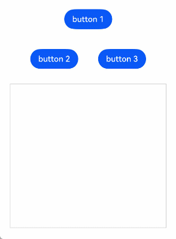
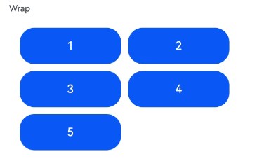
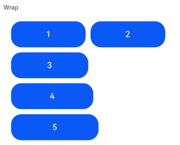
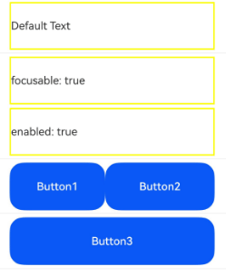
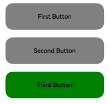
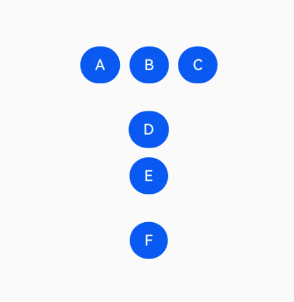
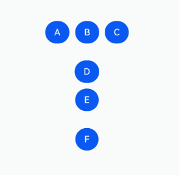

# Implementing Focus Support
<!--Kit: ArkUI-->
<!--Subsystem: ArkUI-->
<!--Owner: @yihao-lin-->
<!--Designer: @piggyguy-->
<!--Tester: @songyanhong-->
<!--Adviser: @Brilliantry_Rui-->

## Basic Concepts and Specifications

### Basic Concepts

**Focus, Focus Chain, and Focus Traversal**

- Focus: refers to the single interactive element on the current application screen. When users interact indirectly with the application using non-pointing input devices such as keyboards, TV remote controls, or in-car joysticks/knobs, navigation and interaction based on focus are crucial means of input.
- Focus chain: refers to the sequence of nodes from the root to a focused component in the application's component tree, where all nodes are focused.
- Focus traversal: refers to the behavior of focus shifting between components in an application. This process is transparent to the user but can be monitored through **onFocus** and **onBlur** events. For details on how focus traversal is managed, see [Focus Traversal Guidelines](#focus-traversal-guidelines).


**Focus Activation State**

The focus activation state determines the visual style (focus indicator) of the component that currently holds focus.

- Presentation rules

  - Default state: The focus activation state is hidden by default.
  - Activation condition: The activation style is displayed only when the application is in the activated state.
  - Key relationships:
    - A component that obtains focus may not show its activation style (if the application is not in the activated state).
    - A component that displays the activation style must be the component that currently holds focus.
  - Style customization: Components usually have built-in activation styles. You can override these default styles using style-related APIs.
  - Display priority: When multiple components are focused simultaneously, the system preferentially shows the activation style of the deepest child component, and only one activation style is visible at a time.

- Methods to enter the activated state

  - Press the **Tab** key on an external keyboard. (Note: The **Tab** key is used only for the initial activation of the application and does not move focus at that moment.)
  - Call the **activate(true)** method of [FocusController](../reference/apis-arkui/arkts-apis-uicontext-focuscontroller.md).

- Methods to exit the activated state

  - Call the **activate(false)** method of **FocusController**.
  - A click event occurs (including a touchscreen tap or a left-mouse-button click).

<!-- @[dynamic_focus_active](https://gitcode.com/openharmony/applications_app_samples/blob/master/code/DocsSample/ArkUISample/EventProject/entry/src/main/ets/pages/focus/FocusActive.ets) -->

``` TypeScript
@Entry
@Component
export struct FocusActiveExample {
  build() {
    NavDestination() {
      Column() {
        Button('Set Active').width(140).height(45).margin(5).onClick(() => {
          this.getUIContext().getFocusController().activate(true, true);
        })
        Button('Set Not Active').width(140).height(45).margin(5).onClick(() => {
          this.getUIContext().getFocusController().activate(false, true);
        })
      }.width('100%')
    }
    // ···
  }
}
```


Focus activation is triggered when the **Tab** key is pressed. Clicking the mouse button exits the focus activation state.


You can call the [activate](../reference/apis-arkui/arkts-apis-uicontext-focuscontroller.md#activate14) API to programmatically enter and exit the focus activation state.


Example flow:
1. Click the **Set Active** button, which calls [activate](../reference/apis-arkui/arkts-apis-uicontext-focuscontroller.md#activate14) to enter the focus activation state.
2. Press **Tab** to move focus to the **Set Not Active** button, and then press **Enter** to trigger a key event. This calls [activate](../reference/apis-arkui/arkts-apis-uicontext-focuscontroller.md#activate14) to exit the focus activation state.

**Hierarchical Pages**

Hierarchical pages are specialized container components, such as **Page**, **Dialog**, **SheetPage**, **ModalPage**, **Menu**, **Popup**, **NavBar**, and **NavDestination**, within a focus framework. These components typically have the following key features:

- Visual layering: They appear on top of other content, creating a distinct visual hierarchy.
- Focus capture: They automatically take focus when first displayed.
- Focus limitation: When focus is within these components, users cannot use keyboard keys to move focus outside to other elements. In other words, focus movement is confined within the component.

An application always has at least one hierarchical page in focus. When this hierarchical page is closed or no longer visible, the focus shifts to another, ensuring smooth user interaction.

> **NOTE**
>
> The **Popup** component does not capture focus if it has **focusable** set to **false**.
>
> The **NavBar** and **NavDestination** components share the focus scope of their immediate parent hierarchical page and do not restrict focus movement.

**Root Container**

The root container is a concept in [hierarchical pages](#basic-concepts). When a [hierarchical page](#basic-concepts) is created and displayed for the first time, it immediately captures focus due to the inherent characteristics of hierarchical pages. In this case, the end node of the focus chain where the hierarchical page resides becomes the default focus, which is typically the page's root container.

You can change the default focus using the **defaultFocus** attribute.

When focus resides on the root container, pressing the **Tab** key for the first time not only activates focus but also transfers focus according to the [focus transfer rules](#focus-transfer-rules).

### Focus Transfer Rules

Focus transfer refers to the process where focus is transferred level by level from the root node to a specific component when a user activates the application's focus system for the first time.

Components in the focus chain are in a focusable state. When a component gains focus, the focus state is recursively propagated down to its first child component until a leaf node is reached.

<!-- @[dynamic_focus_transfer](https://gitcode.com/openharmony/applications_app_samples/blob/master/code/DocsSample/ArkUISample/EventProject/entry/src/main/ets/pages/focus/FocusTransfer.ets) -->

``` TypeScript
@Entry
export struct FocusTransferExample {
  @State logText: string = '\n';
  context = this.getUIContext().getHostContext();

  addText(message: string) {
    this.logText += `${message}\n`;
  };

  build() {
    NavDestination() {
      Column() {
        Row() {
          Column() {
            Button('Button 1')
              .margin(20)
              .onClick(() => {
                // The value in the app.string.Focus_Event resource file is 'Focus information.'
                this.logText = this.context!.resourceManager.getStringSync($r('app.string.Focus_Event').id) + ': \n';
                this.getUIContext().getFocusController().requestFocus('Row 2');
              })
          }
        }

        Column() {
          Row() {
            Button('Button 2')
              .margin(20)
              .onFocus(() => {
                // The value in the app.string.Get_Focus resource file is 'Focused.'
                this.addText('Button 2' + this.context!.resourceManager.getStringSync($r('app.string.Get_Focus').id));
              })
            Button('button 3')
              .margin(20)
              .onFocus(() => {
                this.addText('Button 3' + this.context!.resourceManager.getStringSync($r('app.string.Get_Focus').id));
              })
          }
          .id('Row 2')
          .onFocus(() => {
            this.addText('Row 2' + this.context!.resourceManager.getStringSync($r('app.string.Get_Focus').id));
          })
        }
        .onFocus(() => {
          this.addText('Column 2' + this.context!.resourceManager.getStringSync($r('app.string.Get_Focus').id));
        })

        Scroll() {
          Text(this.logText)
            .fontSize(14)
            .textAlign(TextAlign.Start)
            .padding(10)
        }
        .height('40%')
        .width('100%')
        .border({ width: 1, color: '#ccc' })
        .margin(10)
      }
      .height('100%')
      .padding(20)
    }
    // ···
  }
}
```

After the application runs, click **Button 1** to request focus for the **Row** component. The **Row** component's first focusable child node, **Button 2**, will gain focus.



### Focus Traversal Guidelines

Focus traversal can be divided into active and passive based on how it is triggered.

**Active Focus Traversal**


Active focus traversal refers to focus movement initiated by deliberate actions, such as keyboard shortcuts (**Tab**, **Shift+Tab**, arrow keys) and programmatic focus control through **requestFocus**, **clearFocus**, and **focusOnTouch**.


- Keyboard traversal
1. Prerequisite: The application is in the focus activation state.
2. Scope: limited to the currently focused hierarchical page, as detailed in the "Focus limitation" section under "Hierarchical Pages."
3. Key types:
**Tab** key: follows a Z-shaped logic to traverse all leaf nodes within the scope, looping back to the first after the last.
**Shift+Tab**: reverses the direction of the **Tab** key.
Arrow keys (up, down, left, and right): moves focus in a cross-shaped pattern, with container-specific algorithms determining the next focus in a single-layer container. If the algorithm determines the next focus should be on a container component, the system uses a center-point distance priority algorithm to further identify the target child node within the container.
4. Traversal algorithm: Each focusable container has a unique algorithm defining how focus moves.
5. Priority: Child components take precedence in handling keyboard events over parents.

- requestFocus
Moves focus to a specific component, which is allowed across hierarchical pages but not across windows or different ArkUI instances.
For details, see [Active Focus Acquisition/Loss](#active-focus-acquisitionloss).

- clearFocus
Clears focus within the current hierarchical page, with focus reverting to the root container. For details, see [clearFocus](../reference/apis-arkui/arkts-apis-uicontext-focuscontroller.md#clearfocus12).

- focusOnTouch
Enables a component to gain focus on touch. For details, see [focusOnTouch](../reference/apis-arkui/arkui-ts/ts-universal-attributes-focus.md#focusontouch9). This API is ineffective on non-focusable components. For container components, focus goes to the last focused child or the first focusable child upon touch.


**Passive Focus Traversal**

Passive focus traversal occurs when focus automatically shifts due to system actions or other operations without developer intervention, reflecting the default behavior of the focus system.


Mechanisms that trigger passive focus traversal include:

- Component removal: If a focused component is removed, the system tries to shift focus to the next available sibling, following a back-to-front order. If no siblings are focusable, focus is released to the parent component.
- Attribute change: Changing a component's **focusable** or **enabled** to **false**, or **visibility** to invisible causes the system to automatically move focus to another focusable component, using the same method as for component removal.
- [Hierarchical page](#basic-concepts) switching: During switching between hierarchical pages (for example, from one hierarchical page to another), the focus of the current hierarchical page is automatically released, and the new hierarchical page may automatically gain focus based on preset logic.
- **Web** component initialization: The **Web** component may immediately gain focus upon creation if designed to do so (for example, certain dialog boxes or text boxes), which is part of the component's behavior and not governed by the focus framework specifications.

### Focus Traversal Algorithms

In the focus management system, every focusable container is assigned a specific algorithm that dictates how focus moves from the current to the next focusable child component when **Tab**, **Shift+Tab**, or arrow keys are used.

The algorithm used by a container is based on its UX design and is implemented by the component itself. The focus framework supports three focus traversal algorithms: linear, projection, and custom.

**Linear Focus Traversal Algorithm**


The linear focus traversal algorithm is the default algorithm, focusing on the order of child nodes in the node tree, commonly used in single-direction layouts such as **Row**, **Column**, and **Flex** containers. Its operation rules are as follows:


- Order dependency: The focus order is based solely on the mounting sequence of child nodes in the node tree, independent of their visual layout.
- **Tab** key focus traversal: The **Tab** key moves focus through focusable elements in the order they are mounted in the component tree.
- Arrow key focus traversal: Arrow keys perpendicular to the container's layout direction are ignored. For example, a horizontal **Row** container does not accept focus requests from up and down keys.
- Boundary handling: The container rejects focus requests in the opposite direction from the current focus edge. For example, if the focus is on the first child of a horizontal **Row** container, it won't process leftward focus requests.

<!-- @[dynamic_focus_liner](https://gitcode.com/openharmony/applications_app_samples/blob/master/code/DocsSample/ArkUISample/EventProject/entry/src/main/ets/pages/focus/FocusTraversalGuidelines.ets) -->

``` TypeScript
@Entry
@Component
export struct FocusLinerExample {
  build() {
    NavDestination() {
      Column() {
        Column() {
          Button('Column Button1')
            .width(150)
            .height(45)
            .fontColor(Color.White)
            .margin(10)
          Button('Column Button2')
            .width(150)
            .height(45)
            .fontColor(Color.White)
            .margin(10)
        }
        .margin(10)
        Row() {
          Button('Row Button1')
            .width(150)
            .height(45)
            .fontColor(Color.White)
            .margin(10)
          Button('Row Button2')
            .width(150)
            .height(45)
            .fontColor(Color.White)
            .margin(10)
        }
      }
    }
    // ···
  }
}
```

Pressing the **Tab** key moves focus through focusable elements in the order they are mounted in the component tree.


In a vertical **Column** container, you can use the up and down arrow keys to navigate between focusable elements. The left and right arrow keys are not applicable.


In a horizontal **Row** container, use the left and right arrow keys to navigate between focusable elements. The up and down arrow keys are not applicable.


**Projection-based Focus Traversal Algorithm**

The projection-based focus traversal algorithm determines the next focus based on the overlap area and center-point distance of the projection of the current focused component in the direction of focus movement. This algorithm is designed for containers whose children vary in size. Currently, it is supported only by the **Flex** component when its **wrap** attribute is set. Its operation rules are as follows:


- **Arrow key navigation**: When an arrow key is pressed, the algorithm first checks for any overlap between the projection and the areas of child components. Among all child components whose overlapping area is greater than zero, the straight‑line distance from each child's center to the center of the currently focused component is calculated. The child with the shortest distance is selected. If multiple candidates have the same minimal distance, the child that appears earlier in the node tree is chosen. If no child overlaps with the projection, the container cannot process the arrow key focus movement request.
- **Tab key navigation**: For **Tab** key presses, the algorithm first applies the preceding arrow key navigation rule. If a valid focus target is found, the process ends. If not, the algorithm simulates shifting the position of the currently focused child component downward by its own height, then calculates the projection as if the left arrow key were pressed. The child component that overlaps with this projection and has the shortest center-to-center distance is selected. If no child overlaps, the container cannot process the **Tab** key focus movement request.
- **Shift+Tab key navigation**: For **Shift+Tab** key presses, the algorithm mimics a leftward shift to locate the next focus. If no target is found, it simulates moving the currently focused child component upward by its own height, then calculates the projection as if the right arrow key were pressed. The child component that overlaps with this projection and has the shortest center-to-center distance is selected. If no child overlaps, the container cannot process the **Shift+Tab **key focus movement request.

 <!-- @[dynamic_focus_project_area](https://gitcode.com/openharmony/applications_app_samples/blob/master/code/DocsSample/ArkUISample/EventProject/entry/src/main/ets/pages/focus/ProjectionBasedFocus.ets) -->
 
 ``` TypeScript
 @Entry
 @Component
 export struct ProjectAreaFocusExample {
   build() {
     NavDestination() {
       Column() {
         Column({ space: 5 }) {
           Text('Wrap').fontSize(12).width('90%')
           // Multi-line layout for child components
           Flex({ wrap: FlexWrap.Wrap }) {
             Button('1').width(140).height(50).margin(5)
             Button('2').width(140).height(50).margin(5)
             Button('3').width(140).height(50).margin(5)
             Button('4').width(140).height(50).margin(5)
             Button('5').width(140).height(50).margin(5)
           }
           .width('90%')
           .padding(10)
         }.width('100%').margin({ top: 5 })
       }.width('100%')
     }
     // ···
   }
 }
 ```

> **NOTE**
>
> - The focus order calculated by the projection-based focusing algorithm is closely related to the component layout and size. It is recommended for use in scenarios where components are arranged in a regular and uniform manner. If components have varying sizes and overlap horizontally or vertically, the resulting focus order may deviate from the expected sequence.
> - If a clear focus order is required, it is recommended that you use containers that support sequential focusing, such as **Column** or **Row**.

When components in a **Flex** multi-line layout have uniform sizes, focus traversal works as expected.



<!-- @[dynamic_focus_project_area_flex](https://gitcode.com/openharmony/applications_app_samples/blob/master/code/DocsSample/ArkUISample/EventProject/entry/src/main/ets/pages/focus/FrojectAreaFocusFlex.ets) -->

``` TypeScript
@Entry
@Component
export struct ProjectAreaFocusFlexExample {
  build() {
    NavDestination() {
    Column() {
      Column({ space: 5 }) {
        Text('Wrap').fontSize(12).width('90%')
        // Multi-line layout for child components
        Flex({ wrap: FlexWrap.Wrap }) {
          Button('1').width(145).height(50).margin(5)
          Button('2').width(145).height(50).margin(5)
          Button('3').width(150).height(50).margin(5)
          Button('4').width(160).height(50).margin(5)
          Button('5').width(170).height(50).margin(5)
        }
        .width('90%')
        .padding(10)
      }.width('100%').margin({ top: 5 })
    }.width('100%')
    }
    // ···
  }
}
```

When components in a **Flex** multi-line layout have varying sizes and overlap vertically, the **Tab** key focus traversal fails to reach the buttons labeled **4** and **5** in the lower row.




**Custom Focus Traversal Algorithm**

The custom focus traversal algorithm is defined by the component itself, allowing for specific focus traversal behaviors as determined by the component's design specifications.

## onFocus/onBlur Events

```ts
onFocus(event: () => void)
```


Triggered when the bound component obtains focus.

```ts
onBlur(event:() => void)
```

Triggered when the bound component loses focus.

The **onFocus** and **onBlur** APIs are usually used in pairs to listen for focus changes of the component.

<!-- @[focus_dynamic_reflect](https://gitcode.com/openharmony/applications_app_samples/blob/master/code/DocsSample/ArkUISample/EventProject/entry/src/main/ets/pages/focus/onFocusBlur.ets) -->

``` TypeScript
@Entry
@Component
export struct OnFocusBlur {
  @State oneButtonColor: Color = Color.Gray;
  @State twoButtonColor: Color = Color.Gray;
  @State threeButtonColor: Color = Color.Gray;

  build() {
    NavDestination() {
      Column({ space: 20 }) {
        // You can use the up and down arrow keys on an external keyboard to move the focus between the three buttons. When a button gains focus, its color changes. When it loses focus, its color changes back.
        Button('First Button')
          .width(260)
          .height(70)
          .backgroundColor(this.oneButtonColor)
          .fontColor(Color.Black)
          // Listen for the focus obtaining event of the first component and change its color when it obtains focus.
          .onFocus(() => {
            this.oneButtonColor = Color.Green;
          })
          // Listen for the focus loss event of the first component and change its color when it loses focus.
          .onBlur(() => {
            this.oneButtonColor = Color.Gray;
          })

        Button('Second Button')
          .width(260)
          .height(70)
          .backgroundColor(this.twoButtonColor)
          .fontColor(Color.Black)
          // Listen for the focus obtaining event of the second component and change its color when it obtains focus.
          .onFocus(() => {
            this.twoButtonColor = Color.Green;
          })
          // Listen for the focus loss event of the second component and change its color when it loses focus.
          .onBlur(() => {
            this.twoButtonColor = Color.Gray;
          })

        Button('Third Button')
          .width(260)
          .height(70)
          .backgroundColor(this.threeButtonColor)
          .fontColor(Color.Black)
          // Listen for the focus obtaining event of the third component and change its color when it obtains focus.
          .onFocus(() => {
            this.threeButtonColor = Color.Green;
          })
          // Listen for the focus loss event of the third component and change its color when it loses focus.
          .onBlur(() => {
            this.threeButtonColor = Color.Gray;
          })
      }.width('100%').margin({ top: 20 })
    }
    // ···
  }
}
```


The preceding example includes three steps:

- When the application opens, pressing the **Tab** key activates focus traversal, **First Button** displays a focus activation state style – a blue bounding box around the component – and its **onFocus** callback is triggered, changing the background color to green.
- When the **Tab** key is pressed again, **Second Button** gains focus, triggering its **onFocus** callback, and its background color turns green, while **First Button** loses focus, triggering its **onBlur** callback, and its background color reverts to gray.
- A subsequent **Tab** key press causes **Third Button** to gain focus, triggering its **onFocus** callback, and its background color turns green. Concurrently, **Second Button** loses focus, triggering its **onBlur** callback, and its background color reverts to gray.

When both parent and child nodes have focus acquisition and loss events simultaneously, the order of event responses is as follows:

Parent node **Row1** loses focus -> Child node **Button1** loses focus -> Child node **Button2** gains focus -> Parent node **Row2** gains focus

<!-- @[dynamic_focus_blur](https://gitcode.com/openharmony/applications_app_samples/blob/master/code/DocsSample/ArkUISample/EventProject/entry/src/main/ets/pages/focus/OnFocusOnBlurEvents.ets) -->

``` TypeScript
import { hilog } from '@kit.PerformanceAnalysisKit';

const TAG = '[Sample_FocusAndBlurExample]';
const DOMAIN = 0xF811;
const BUNDLE = 'MyApp_FocusAndBlurExample';

@Entry
@Component
export struct FocusAndBlurExample {
  build() {
    NavDestination() {
      Column() {
        Column({ space: 5 }) {
          Row() { // Parent node Row1
            Button('Button1') // Child node Button1
              .width(140)
              .height(45)
              .margin(5)
              .onFocus(() => {
                hilog.info(DOMAIN, TAG, BUNDLE + 'Button1 onFocus');
              })
              .onBlur(() => {
                hilog.info(DOMAIN, TAG, BUNDLE + 'Button1 onBlur');
              })
          }
          .onFocus(() => {
            hilog.info(DOMAIN, TAG, BUNDLE + 'Row1 onFocus');
          })
          .onBlur(() => {
            hilog.info(DOMAIN, TAG, BUNDLE + 'Row1 onBlur');
          })

          Row() { // Parent node Row2
            Button('Button2') // Child node Button2
              .width(140)
              .height(45)
              .margin(5)
              .onFocus(() => {
                hilog.info(DOMAIN, TAG, BUNDLE + 'Button2 onFocus');
              })
              .onBlur(() => {
                hilog.info(DOMAIN, TAG, BUNDLE + 'Button2 onBlur');
              })
          }
          .onFocus(() => {
            hilog.info(DOMAIN, TAG, BUNDLE + 'Row2 onFocus');
          })
          .onBlur(() => {
            hilog.info(DOMAIN, TAG, BUNDLE + 'Row2 onBlur');
          })
        }.width('100%').margin({ top: 5 })
      }.width('100%')
    }
    // ···
  }
}
```

When focus moves from **Button1** to **Button2**, the log printing order is as follows:
```ts
Row1 onBlur
Button1 onBlur
Button2 onFocus
Row2 onFocus
```

## Setting Whether a Component Is Focusable

```ts
focusable(value: boolean)
```

Sets whether the component is focusable.

Components can be classified into the following types based on their focus capability:

- **Inherently focusable components**: These components are usually interactive components, such as **Button**, **Checkbox**, and **TextInput**. They can receive focus without any explicit configuration.

- **Conditionally focusable components**: Typical examples are **Text** and **Image**, which are not focusable by default. To make them focusable, you must explicitly set **focusable(true)**. Container components that contain no focusable children are also non-focusable by default. However, if you bind an **onClick** event or a single-tap gesture to such a container, it implicitly gains focusability. Note that if the container's **focusable** attribute is explicitly set to **false**, it remains non-focusable even if an event or gesture is attached.

- **Non-focusable components**: Components that do not allow for interactions, such as **Blank** and **Circle**, cannot be made focusable, regardless of whether the **focusable** attribute is applied.

Setting a container component as focusable:

The primary purpose of gaining focus is to enable interaction. If a component inherently lacks interactive capabilities, it cannot be made focusable. Container components (such as **Stack** and **Column**) are typically not interactive by themselves. Therefore, even if a container component is a leaf node in the view tree, it cannot be made focusable simply by calling **.focusable(true)**. Note that this same rule applies to [FrameNode](../reference/apis-arkui/js-apis-arkui-frameNode.md) objects created dynamically.
To make a leaf node container focusable, you can use one of these approaches:

- Place a component that natively supports focus, such as a **Button** component, inside the container.

- Bind a gesture (such as **onClick** or a tap gesture) to the container.

```ts
enabled(value: boolean)
```

Sets the component's interactivity. If [enabled](../reference/apis-arkui/arkui-ts/ts-universal-attributes-enable.md#enabled) is set to **false**, the component becomes non-interactive and cannot gain focus.

```ts
visibility(value: Visibility)
```

Sets the component's visibility. If [visibility](../reference/apis-arkui/arkui-ts/ts-universal-attributes-visibility.md#visibility) set to **Visibility.None** or **Visibility.Hidden**, the component becomes invisible and cannot gain focus.

```ts
focusOnTouch(value: boolean)
```

Sets whether the component is focusable on touch.

> **NOTE**
>
>When a component that is currently focused has its **focusable** or **enabled** attribute set to **false**, it automatically loses focus. The focus then shifts to another component according to the [Focus Traversal Guidelines](#focus-traversal-guidelines).


 <!-- @[dynamic_focus_control_manage](https://gitcode.com/openharmony/applications_app_samples/blob/master/code/DocsSample/ArkUISample/EventProject/entry/src/main/ets/pages/focus/Focusable.ets) -->
 
 ``` TypeScript
 @Entry
 @Component
 export struct FocusableExample {
   @State textFocusable: boolean = true;
   @State textEnabled: boolean = true;
   @State color1: Color = Color.Yellow;
   @State color2: Color = Color.Yellow;
   @State color3: Color = Color.Yellow;
 
   build() {
     NavDestination() {
       Column({ space: 12 }) {
         // The value in the app.string.Focus_Focusable_text resource file is 'When a component is focused.'
         Text($r('app.string.Focus_Focusable_text'))
           .fontSize(14)
           .fontColor('#666')
         Column({ space: 5 }) {
           Text('Default Text')    // The first Text component does not have the focusable attribute set, and is not focusable by default.
             .borderColor(this.color1)
             .borderWidth(2)
             .width(300)
             .height(70)
             .onFocus(() => {
               this.color1 = Color.Blue;
             })
             .onBlur(() => {
               this.color1 = Color.Yellow;
             })
           Divider()
 
           Text('focusable: ' + this.textFocusable)    // The second Text component initially has focusable set to true and focusableOnTouch true.
             .borderColor(this.color2)
             .borderWidth(2)
             .width(300)
             .height(70)
             .focusable(this.textFocusable)
             .focusOnTouch(true)
             .onFocus(() => {
               this.color2 = Color.Blue;
             })
             .onBlur(() => {
               this.color2 = Color.Yellow;
             })
 
           Text('enabled: ' + this.textEnabled)    // The third Text component has focusable set to true, enabled initially true.
             .borderColor(this.color3)
             .borderWidth(2)
             .width(300)
             .height(70)
             .focusable(true)
             .enabled(this.textEnabled)
             .focusOnTouch(true)
             .onFocus(() => {
               this.color3 = Color.Blue;
             })
             .onBlur(() => {
               this.color3 = Color.Yellow;
             })
 
           Divider()
 
           Row() {
             Button('Button1')
               .width(140).height(70)
             Button('Button2')
               .width(160).height(70)
           }
 
           Divider()
           Button('Button3')
             .width(300).height(70)
 
           Divider()
         }.width('100%').justifyContent(FlexAlign.Center)
         .onKeyEvent((e) => {
           // Bind onKeyEvent. When this Column component has focus, pressing F will toggle the focusable state of the second Text component.
           if (e.keyCode === 2022 && e.type === KeyType.Down) {
             this.textFocusable = !this.textFocusable;
           }
           // Bind onKeyEvent. When this Column component has focus, pressing G will toggle the enabled state of the third Text component.
           if (e.keyCode === 2023 && e.type === KeyType.Down) {
             this.textEnabled = !this.textEnabled;
           }
         })
       }
       .width('100%')
       .height('100%')
       .padding({ left: 12, right: 12 })
     }
     // ···
   }
 }
 ```


Operation result:




The preceding example includes three steps:

- As the first **Text** component does not have **focusable(true)** set, it is not focusable.
- The second **Text** component is set with **focusOnTouch(true)**, allowing it to gain focus on touch. Pressing the **Tab** key triggers focus traversal, but the focus remains on the second component. When the **F** key is pressed, the **onKeyEvent** callback toggles **focusable** to **false**, making the second **Text** component not focusable, and the focus shifts to the next available focusable component, which is the third **Text** component.
- Pressing the **G** key triggers the **onKeyEvent** callback, which sets **enabled** to **false**, making the third **Text** component not focusable. The focus then automatically moves to the **Row** container, where the default configuration causes the focus to shift to **Button1**.

## Setting the Focus Box for a Container

Although container components can gain focus, they are unable to draw a focus box by themselves. To enable focus box drawing for a container, you can configure an **onClick** event or a single-finger tap gesture on the container.

> **NOTE**
>
> Prerequisites for drawing a focus box on a container:
> - The container has no focusable child nodes.
> - The container has an **onClick** event or a single-finger tap gesture configured.
> - The container itself does not have the **focusable** attribute set, or the **focusable** attribute is set after the **onClick** event or single-finger tap gesture is configured.

<!-- @[dynamic_focus_scope](https://gitcode.com/openharmony/applications_app_samples/blob/master/code/DocsSample/ArkUISample/EventProject/entry/src/main/ets/pages/focus/ScopeFocus.ets) -->

``` TypeScript

import { hilog } from '@kit.PerformanceAnalysisKit';

const TAG = '[Sample_FocusAndBlurExample]';
const DOMAIN = 0xF811;
const BUNDLE = 'MyApp_FocusAndBlurExample';

@Entry
@Component
export struct ScopeFocusExample {
  @State scopeFocusState: boolean = true;

  build() {
    NavDestination() {
      Column() {
        Column({ space: 5 }) {
          // The value in the app.string.Container_Coking resource file is 'Container focus'.
          Text($r('app.string.Container_Coking')).textAlign(TextAlign.Center)
        }
        .justifyContent(FlexAlign.Center)
        .width('80%')
        .height(50)
        .margin({ top: 5, bottom: 5 })
        .onClick(() => {
        })
        .focusable(this.scopeFocusState)

        Button('Button1')
          .width(140)
          .height(45)
          .margin(5)
          .onClick(() => {
            this.scopeFocusState = !this.scopeFocusState;
            hilog.info(DOMAIN, TAG, BUNDLE + 'Button1 onFocus');
          })
        Button('Button2')
          .width(140)
          .height(45)
          .margin(5)
      }.width('100%')
    }
    // ...
  }
}
```


The preceding example includes two steps:

- After the **onClick** event and **focusable** is set to **true** for the **Column** container, the container can draw a focus box when the **Tab** key is used for focus traversal.
- When **Button1** is clicked, the **focusable** attribute of the **Column** container is set to **false**, preventing the container from gaining focus and drawing a focus box.

## Setting Focus to Stop on a Container

```ts
tabStop(isTabStop: boolean) 
```
Use the [tabStop](../reference/apis-arkui/arkui-ts/ts-universal-attributes-focus.md#tabstop14) API to control whether the focus will stop on the container during focus traversal.

<!-- @[dynamic_focus_tab_stop](https://gitcode.com/openharmony/applications_app_samples/blob/master/code/DocsSample/ArkUISample/EventProject/entry/src/main/ets/pages/focus/TabStop.ets) -->

``` TypeScript
@Entry
@Component
export struct TabStopExample {
  build() {
    NavDestination() {
      Column({ space: 20 }) {
        Button('Button1')
          .width(140)
          .height(45)
          .margin(5)
        Column() {
          Button('Button2')
            .width(140)
            .height(45)
            .margin(5)
          Button('Button3')
            .width(140)
            .height(45)
            .margin(5)
        }.tabStop(true)
      }.width('100%')
    }
    // ···
  }
}
```


The preceding example includes two steps:

- When **tabStop** is set to **true** on the **Column** component, pressing the **Tab** key will cycle focus between **Button1** and the **Column** container. The **Column** container shows a focus box when it gains focus.
- Once the **Column** container gains focus, pressing **Enter** moves the focus to the first focusable element inside the container. Further **Tab** key presses will move focus through other focusable elements within the container.

## Default Focus

### Default Focus on a Hierarchical Page

```ts
defaultFocus(value: boolean)
```

Set whether the current component is the default focus on the current [hierarchical page](#basic-concepts).

<!-- @[focus_visualization_manage](https://gitcode.com/openharmony/applications_app_samples/blob/master/code/DocsSample/ArkUISample/EventProject/entry/src/main/ets/pages/focus/DefaultFocus.ets) -->

``` TypeScript
@Entry
@Component
export struct DefaultFocus {
  @State oneButtonColor: Color = Color.Gray;
  @State twoButtonColor: Color = Color.Gray;
  @State threeButtonColor: Color = Color.Gray;

  build() {
    NavDestination() {
      Column({ space: 20 }) {
        // You can use the up and down arrow keys on an external keyboard to move the focus between the three buttons. When a button gains focus, its color changes. When it loses focus, its color changes back.
        Button('First Button')
          .width(260)
          .height(70)
          .backgroundColor(this.oneButtonColor)
          .fontColor(Color.Black)
          // Listen for the focus obtaining event of the first component and change its color when it obtains focus.
          .onFocus(() => {
            this.oneButtonColor = Color.Green;
          })
          // Listen for the focus loss event of the first component and change its color when it loses focus.
          .onBlur(() => {
            this.oneButtonColor = Color.Gray;
          })

        Button('Second Button')
          .width(260)
          .height(70)
          .backgroundColor(this.twoButtonColor)
          .fontColor(Color.Black)
          // Listen for the focus obtaining event of the second component and change its color when it obtains focus.
          .onFocus(() => {
            this.twoButtonColor = Color.Green;
          })
          // Listen for the focus loss event of the second component and change its color when it loses focus.
          .onBlur(() => {
            this.twoButtonColor = Color.Gray;
          })

        Button('Third Button')
          .width(260)
          .height(70)
          .backgroundColor(this.threeButtonColor)
          .fontColor(Color.Black)
          // Set the default focus.
          .defaultFocus(true)
          // Listen for the focus obtaining event of the third component and change its color when it obtains focus.
          .onFocus(() => {
            this.threeButtonColor = Color.Green;
          })
          // Listen for the focus loss event of the third component and change its color when it loses focus.
          .onBlur(() => {
            this.threeButtonColor = Color.Gray;
          })
      }.width('100%').margin({ top: 20 })
    }
    // ···
  }
}
```



The preceding example includes two steps:

- **defaultFocus(true)** is set on the third button. When the hierarchical page is displayed, the third button automatically receives focus and turns green.
- Pressing the **Tab** key triggers focus traversal, and since the third **Button** component is in focus, a focus indicator appears around it.

### Default Focus for Containers

The default focus within a container is affected by [focus priority](#focus-group-and-focus-priority).

**Differences Between defaultFocus and FocusPriority**

[defaultFocus](../reference/apis-arkui/arkui-ts/ts-universal-attributes-focus.md#defaultfocus9) specifies the initial focus when the [hierarchical page](#basic-concepts) loads. [FocusPriority](../reference/apis-arkui/arkui-ts/ts-universal-attributes-focus.md#focuspriority12) defines the order in which child components gain focus within a container. Behavior is undefined when both attributes are set in some scenarios. For example, a [hierarchical page](#basic-concepts)'s initial display cannot simultaneously meet the focus requirements of a component with **defaultFocus** and a high-priority component.

Example

<!-- @[dynamic_focus_scope_priority_previous](https://gitcode.com/openharmony/applications_app_samples/blob/master/code/DocsSample/ArkUISample/EventProject/entry/src/main/ets/pages/focus/FocusScopePriorityPrevious.ets) -->

``` TypeScript
@Entry
@Component
export struct FocusScopePriorityPrevious {
  build() {
    NavDestination() {
      Row() {
        Button('Button1')
          .defaultFocus(true)
        Button('Button2')
          .focusScopePriority('RowScope', FocusPriority.PREVIOUS)
      }.focusScopeId('RowScope')
    }
    // ···
  }
}
```

### Focus Chain for Hierarchical Pages/Containers

**Overall Focus and Non-Overall Focus**

- Overall focus: The entire [hierarchical page](#basic-concepts) or container gains focus first, and then the focus shifts to its child components. Examples include [hierarchical page](#basic-concepts) transitions, route switches within **Navigation** components, focus group traversal, and when a container component proactively calls **requestFocusById**.

- Non-overall focus: A specific component gains focus, pulling its parent components into focus. Examples include a **TextInput** component proactively obtaining focus or using the **Tab** key for traversal in non-focus group.

**Formation of the Focus Chain in Overall Focus**

1. When a hierarchical page first receives focus:

- The leaf node of the focus chain is the node with **defaultFocus** set.

- If **defaultFocus** is not configured on any node, focus remains on the root container of the hierarchical page.

2. When a hierarchical page is not focused for the first time, the node that was focused the last time the page was active regains focus.

3. Focus chain with priority configuration:

- If a container has a component with a focus priority higher than **PREVIOUS**, the component with the highest priority gains focus.

- If no component with a priority higher than **PREVIOUS** exists, the last focused node regains focus, such as when a window refocuses after being out of focus.


## Focus Style

> **NOTE**
>
> When a component is in the focus activation state, its [zIndex](../reference/apis-arkui/arkui-ts/ts-universal-attributes-z-order.md#zindex) value is automatically elevated to **INT_MAX** to ensure that it is rendered above other components. If the component already has a specified **zIndex** value, this value will not be adjusted. When the component exits the focus activation state (for example, loses focus or leaves the focus chain), its **zIndex** value will revert to its original settings.
>

```ts
focusBox(style: FocusBoxStyle)
```

Sets the system focus box style for the component.

<!-- @[dynamic_focus_request](https://gitcode.com/openharmony/applications_app_samples/blob/master/code/DocsSample/ArkUISample/EventProject/entry/src/main/ets/pages/focus/RequestFocus.ets) -->

``` TypeScript
import { ColorMetrics, LengthMetrics } from '@kit.ArkUI';

@Entry
@Component
export struct RequestFocusExample {
  build() {
    NavDestination() {
      Column({ space: 30 }) {
        Button('small black focus box')
          .focusBox({
            margin: new LengthMetrics(0),
            strokeColor: ColorMetrics.rgba(0, 0, 0),
          })
        Button('large red focus box')
          .focusBox({
            margin: LengthMetrics.px(20),
            strokeColor: ColorMetrics.rgba(255, 0, 0),
            strokeWidth: LengthMetrics.px(10)
          })
      }
      .alignItems(HorizontalAlign.Center)
      .width('100%')
    }
    // ···
  }
}
```


The preceding example includes two steps:

- After the [hierarchical page](#basic-concepts) opens, pressing the **Tab** key initiates focus traversal. The first **Button** gains focus, displaying a small, black focus box that is closely fitted to the edge.
- Pressing the Tab key again shifts focus to the second **Button**, which features a large, red focus box with a thicker stroke and a more significant margin from the edge.

## Active Focus Acquisition/Loss

- Using **FocusController** APIs

  You are advised to use **requestFocus** from **FocusController** for actively acquiring focus. It provides the following benefits:
  - Takes effect in the current frame, preventing interference from subsequent component tree changes.
  - Provides exception handling, aiding in troubleshooting focus acquisition issues.
  - Prevents errors in multi-instance scenarios by avoiding incorrect instance retrieval.

  You must first obtain an instance using the [getFocusController()](../reference/apis-arkui/arkts-apis-uicontext-uicontext.md#getfocuscontroller12) API in **UIContext** and then use this instance to call the corresponding methods.

  ```ts
  requestFocus(key: string): void
  ```
  Transfers focus to a component node by the component ID, which is effective immediately.

  ```ts
  clearFocus(): void
  ```
  Clears the focus and forcibly moves the focus to the root container node of the current [hierarchical page](#basic-concepts). Other nodes on the focus chain all lose focus.

- Using **focusControl** APIs
  ```ts
  requestFocus(value: string): boolean
  ```

  Moves focus to a specified component, with the change taking effect in the next frame.

  <!-- @[dynamic_focus_control_demo](https://gitcode.com/openharmony/applications_app_samples/blob/master/code/DocsSample/ArkUISample/EventProject/entry/src/main/ets/pages/focus/FocusController.ets) -->
  
  ``` TypeScript
  @Entry
  @Component
  export struct FocusControl {
    @State btColor: string = '#ff2787d9';
    @State btColor2: string = '#ff2787d9';
  
    build() {
      NavDestination() {
          Column({ space: 20 }) {
            Column({ space: 5 }) {
              Button('Button')
                .width(200)
                .height(70)
                .fontColor(Color.White)
                .focusOnTouch(true)
                .backgroundColor(this.btColor)
                .onFocus(() => {
                  this.btColor = '#ffd5d5d5';
                })
                .onBlur(() => {
                  this.btColor = '#ff2787d9';
                })
                .id('testButton')
  
              Button('Button')
                .width(200)
                .height(70)
                .fontColor(Color.White)
                .focusOnTouch(true)
                .backgroundColor(this.btColor2)
                .onFocus(() => {
                  this.btColor2 = '#ffd5d5d5';
                })
                .onBlur(() => {
                  this.btColor2 = '#ff2787d9';
                })
                .id('testButton2')
  
              Divider()
                .vertical(false)
                .width('80%')
                .backgroundColor('#ff707070')
                .height(10)
  
              Button('FocusController.requestFocus')
                .width(200).height(70).fontColor(Color.White)
                .onClick(() => {
                  this.getUIContext().getFocusController().requestFocus('testButton');
                })
                .backgroundColor('#ff2787d9')
  
              Button('focusControl.requestFocus')
                .width(200).height(70).fontColor(Color.White)
                .onClick(() => {
                  focusControl.requestFocus('testButton2');
                })
                .backgroundColor('#ff2787d9')
  
              Button('clearFocus')
                .width(200).height(70).fontColor(Color.White)
                .onClick(() => {
                  this.getUIContext().getFocusController().clearFocus();
                })
                .backgroundColor('#ff2787d9')
            }
          }
          .width('100%')
          .height('100%')
      }
      // ···
    }
  }
  ```


The preceding example includes three steps:

- When the **FocusController.requestFocus** button is clicked, the first button gains focus.
- When the **focusControl.requestFocus** button is clicked, the second button gains focus.
- When the **clearFocus** button is clicked, the second button loses focus.

## Customizing the Focus Navigation Order

### Setting the Focus Navigation Order with nextFocus

```ts
nextFocus(nextStep: Optional<FocusMovement>): T
```

When a component is configured with **nextFocus**, focus movement strictly follows the sequence defined by **nextFocus**. If no component or container has **nextFocus** configured, the default focus sequence applies.

>  **NOTE**
>
>  - This capability is supported since API version 18.

  <!-- @[dynamic_focus_next](https://gitcode.com/openharmony/applications_app_samples/blob/master/code/DocsSample/ArkUISample/EventProject/entry/src/main/ets/pages/focus/NextFocus.ets) -->
  
  ``` TypeScript
  @Entry
  @Component
  export struct NextFocusExample {
    build() {
      NavDestination() {
        Column({ space: 30 }) {
          Row().height('30%')
          Row({ space: 10 }) {
            Button('A')
              .id('A')
              .nextFocus({ forward: 'F', backward: 'C', down: 'B' })
            Button('B')
              .id('B')
              .nextFocus({ down: 'C' })
            Button('C')
              .id('C')
          }
  
          Column({ space: 10 }) {
            Button('D')
              .id('D')
            Button('E')
              .id('E')
              .nextFocus({
                forward: 'A',
                backward: 'M',
                up: 'E',
                right: 'F'
              })
          }
  
          Row({ space: 10 }) {
            Button('F')
              .id('F')
              .nextFocus({ forward: 'B', down: 'A' })
          }
        }.width('100%')
      }
      // ···
    }
  }
  ```

Focus navigation order for the **Tab** key: Without **nextFocus** configured: The focus navigation order is A -> B -> C -> D -> E -> F. With **nextFocus** configured: The focus navigation order is A ->F -> B ->C -> D ->E -> A.



Focus navigation order for the down arrow key (example): Without **nextFocus** configured: After the focus activation state is triggered with the **Tab** key, the focus navigation order is A ->D -> E -> F. With **nextFocus** configured: After the focus activation state is triggered with the **Tab** key, the focus navigation order is A -> B -> C->D -> E->F -> A.



### Setting the Focus Navigation Order with tabIndex

```ts
tabIndex(index: number)
```

The **tabIndex** attribute customizes the focus navigation order for the **Tab** key.

When components with positive **tabIndex** values are present, only these components are reachable through sequential focus navigation, and they are navigated cyclically in ascending order based on the **tabIndex** value. When components with positive **tabIndex** values are not present, those components with a **tabIndex** value of **0** are navigated based on the preset focus navigation rule.

> **NOTE**
>
> **tabIndex** and **focusScopeId** cannot be both set on the same component.
> 
> Avoid setting a component's **tabIndex** to a negative number on a hierarchical page to control its focusability. Use the **focusable** attribute for that purpose instead.
> 
> **tabIndex** only customizes **Tab** key navigation. For arrow key navigation customization, use [nextfocus](#setting-the-focus-navigation-order-with-nextfocus).

  <!-- @[dynamic_focus_tab_index](https://gitcode.com/openharmony/applications_app_samples/blob/master/code/DocsSample/ArkUISample/EventProject/entry/src/main/ets/pages/focus/TabIndex.ets) -->
  
  ``` TypeScript
  @Entry
  @Component
  export struct TabIndexExample {
    build() {
      NavDestination() {
        Column() {
          Button('Button1')
            .width(140)
            .height(45)
            .margin(5)
          Button('Focus Button1')
            .width(140)
            .height(45)
            .margin(5).tabIndex(1)
          Button('Button2')
            .width(140)
            .height(45)
            .margin(5)
          Button('Focus Button2')
            .width(140)
            .height(45)
            .margin(5).tabIndex(2)
        }.width('100%')
      }
      // ···
    }
  }
  ```

Pressing the **Tab** key moves focus only between components with **tabIndex** values.


When **tabIndex** is set on a container: If no child component has ever gained focus, focus goes to the first focusable child component; otherwise, focus goes to the last child that previously had focus.

<!-- @[dynamic_focus_tab_index_focus](https://gitcode.com/openharmony/applications_app_samples/blob/master/code/DocsSample/ArkUISample/EventProject/entry/src/main/ets/pages/focus/TabIndexFocus.ets) -->

``` TypeScript
@Entry
@Component
export struct TabIndexFocusExample {
  build() {
    NavDestination() {
      Column() {
        Button('Button1')
          .width(140)
          .height(45)
          .margin(5).tabIndex(1)
        Column() {
          Button('Button2')
            .width(140)
            .height(45)
            .margin(5)
          Button('Button3')
            .width(140)
            .height(45)
            .margin(5)
        }.tabIndex(2)
      }.width('100%')
    }
    // ···
  }
}
```

Tab focus traversal with **tabIndex** on a container


The preceding example includes three steps:

- When the **Tab** key is pressed, focus moves between **Button1** and **Button2** (as the parent container of **Button2** and **Button3** has **tabIndex** set).
- When focus is on **Button2**, using the down arrow key moves focus to **Button3**.
- When the **Tab** key is used for focus traversal, focus moves between **Button1** and **Button3**.

## Focus Group and Focus Priority

```ts
focusScopePriority(scopeId: string, priority?: FocusPriority)
```

Sets the focus priority of this component in a specified container. It must be used together with **focusScopeId**.


```ts
focusScopeId(id: string, isGroup?: boolean)
```

Assigns an ID to this container component and specifies whether the container is a focus group. Focus groups should not be mixed with **tabIndex** usage.

<!-- @[focus_scope_navigation](https://gitcode.com/openharmony/applications_app_samples/blob/master/code/DocsSample/ArkUISample/EventProject/entry/src/main/ets/pages/focus/FocusScopePriority.ets) -->

``` TypeScript
@Entry
@Component
export struct FocusScopePriority {
  @State inputValue: string = '';

  build() {
    NavDestination() {
      Column({ space: 12 }) {

        Scroll() {
          Row({ space: 20 }) {
            Column({ space: 20 }) {  // Labeled as Column1.
              Column({ space: 5 }) {
                Button('Group1')
                  .width(165)
                  .height(40)
                  .fontColor(Color.White)
                Row({ space: 5 }) {
                  Button()
                    .width(80)
                    .height(40)
                    .fontColor(Color.White)
                  Button()
                    .width(80)
                    .height(40)
                    .fontColor(Color.White)
                }
                Row({ space: 5 }) {
                  Button()
                    .width(80)
                    .height(40)
                    .fontColor(Color.White)
                  Button()
                    .width(80)
                    .height(40)
                    .fontColor(Color.White)
                }
              }.borderWidth(2).borderColor(Color.Red).borderStyle(BorderStyle.Dashed)
              Column({ space: 5 }) {
                Button('Group2')
                  .width(165)
                  .height(40)
                  .fontColor(Color.White)
                Row({ space: 5 }) {
                  Button()
                    .width(80)
                    .height(40)
                    .fontColor(Color.White)
                  Button()
                    .width(80)
                    .height(40)
                    .fontColor(Color.White)
                    .focusScopePriority('ColumnScope1', FocusPriority.PRIOR) // Focuses when Column1 first gains focus.
                }
                Row({ space: 5 }) {
                  Button()
                    .width(80)
                    .height(40)
                    .fontColor(Color.White)
                  Button()
                    .width(80)
                    .height(40)
                    .fontColor(Color.White)
                }
              }.borderWidth(2).borderColor(Color.Green).borderStyle(BorderStyle.Dashed)
            }
            .focusScopeId('ColumnScope1')
            Column({ space: 5 }) {  // Labeled as Column2.
              TextInput({placeholder: 'input', text: this.inputValue})
                .onChange((value: string) => {
                  this.inputValue = value;
                })
                .width(156)
              Button('Group3')
                .width(165)
                .height(40)
                .fontColor(Color.White)
              Row({ space: 5 }) {
                Button()
                  .width(80)
                  .height(40)
                  .fontColor(Color.White)
                Button()
                  .width(80)
                  .height(40)
                  .fontColor(Color.White)
              }
              Button()
                .width(165)
                .height(40)
                .fontColor(Color.White)
                .focusScopePriority('ColumnScope2', FocusPriority.PREVIOUS)  // Focuses when Column2 first gains focus.
              Row({ space: 5 }) {
                Button()
                  .width(80)
                  .height(40)
                  .fontColor(Color.White)
                Button()
                  .width(80)
                  .height(40)
                  .fontColor(Color.White)
              }
              Button()
                .width(165)
                .height(40)
                .fontColor(Color.White)
              Row({ space: 5 }) {
                Button()
                  .width(80)
                  .height(40)
                  .fontColor(Color.White)
                Button()
                  .width(80)
                  .height(40)
                  .fontColor(Color.White)
              }
            }.borderWidth(2).borderColor(Color.Orange).borderStyle(BorderStyle.Dashed)
            .focusScopeId('ColumnScope2', true) // Column2 is a focus group.
          }.alignItems(VerticalAlign.Top)
        }

      }
      .width('100%')
      .height('100%')
      .padding({ left: 12, right: 12 })
    }
    // ···
  }
}
```


The preceding example includes two steps:

- The **TextInput** component is part of a focus group. When the **Tab** key is pressed, focus quickly moves out of the **TextInput** component to the next focusable element outside the group. Arrow keys can be used to move focus within the **TextInput** component.
- The two **Column** components on the left do not have a focus group set. Therefore, focus can only be traversed one by one with the **Tab** key.


In API version 14, you can use the **arrowStepOut** parameter on a focus group to specify whether focus can move out of the group using arrow keys.
```ts
focusScopeId(id: string, isGroup?: boolean, arrowStepOut?: boolean)
```

<!-- @[dynamic_focus_scope_id](https://gitcode.com/openharmony/applications_app_samples/blob/master/code/DocsSample/ArkUISample/EventProject/entry/src/main/ets/pages/focus/FocusScopeId.ets) -->

``` TypeScript
@Entry
@Component
export struct FocusScopeIdExample {
  build() {
    NavDestination() {
      Column({ space: 20 }) {
        Column() {
          Button('Group1')
            .width(165)
            .height(40)
            .margin(5)
            .fontColor(Color.White)
          Row({ space: 5 }) {
            Button('Button1')
              .width(80)
              .height(40)
              .margin(5)
              .fontColor(Color.White)
            Button('Button2')
              .width(80)
              .height(40)
              .margin(5)
              .fontColor(Color.White)
          }
        }.focusScopeId('1', true, true)
        .borderWidth(2).borderColor(Color.Red).borderStyle(BorderStyle.Dashed)

        TextInput()
        Column() {
          Button('Group2')
            .width(165)
            .height(40)
            .margin(5)
            .fontColor(Color.White)
          Row({ space: 5 }) {
            Button('Button3')
              .width(80)
              .height(40)
              .margin(5)
              .fontColor(Color.White)
            Button('Button4')
              .width(80)
              .height(40)
              .margin(5)
              .fontColor(Color.White)
          }
        }.focusScopeId('2', true, false)
        .borderWidth(2).borderColor(Color.Green).borderStyle(BorderStyle.Dashed)

        TextInput()
      }.width('100%')
    }
    // ···
  }
}
```


The preceding example includes three steps:
- **Group1** and **Group2** are defined as focus groups using **focusScopeId**. When the **Tab** key is pressed, focus quickly moves between these groups, skipping over individual buttons within the groups.
- **Group1** is configured with **arrowStepOut** set to **true**, allowing focus to move out of the group using arrow keys. When focus is within **Group1**, arrow keys can be used to move focus to the **TextInput** component outside the group.
- **Group2** is configured with **arrowStepOut** set to **false**, preventing focus from moving out of the group using arrow keys. When focus is within **Group2**, arrow keys cannot be used to move focus to the **TextInput** component outside the group.

>  **NOTE**
>
> The **TextInput** component has its own handling for arrow keys, so you cannot directly move focus out of it using arrow keys.

## Focus and Key Events

When a component is in focus and has either an **onClick** or **TapGesture** event defined, pressing the **Enter** key or spacebar triggers the associated event callback.

>  **NOTE**
>
>  1. If the **onClick** or **TapGesture** event is triggered by pressing the **Enter** key or spacebar, the event does not bubble up by default. This means that the parent component's corresponding [key event](../reference/apis-arkui/arkui-ts/ts-universal-events-key.md) is not triggered synchronously.
>  2. The key event (**onKeyEvent**) bubbles up by default, which means that it will also trigger the parent component's key event callback.
>  3. If the component has both an **onClick** event and an **onKeyEvent**, pressing the **Enter** key or spacebar trigger both events.
>  4. The component's response to the **onClick** event is independent of whether the focus is activated or not.

   <!-- @[dynamic_focus_on_click](https://gitcode.com/openharmony/applications_app_samples/blob/master/code/DocsSample/ArkUISample/EventProject/entry/src/main/ets/pages/focus/FocusOnClick.ets) -->
   
   ``` TypeScript
   @Entry
   @Component
   export struct FocusOnclickExample {
     @State count: number = 0;
     @State name: string = 'Button';
   
     build() {
       NavDestination() {
         Column() {
           Button(this.name)
             .fontSize(30)
             .onClick(() => {
               this.count++
               if (this.count % 2 === 0) {
                 this.name = 'count is even number';
               } else {
                 this.name = 'count is odd number';
               }
             }).height(60)
         }.height('100%').width('100%').justifyContent(FlexAlign.Center)
       }
       // ···
     }
   }
   ```


## Component Focusability


  **Table 1** Focusability of basic components

| Basic Component                                    | Focusable| Default Value of focusable|
| ---------------------------------------- | ------- | ------------ |
| [AlphabetIndexer](../reference/apis-arkui/arkui-ts/ts-container-alphabet-indexer.md) | Yes      | true         |
| [Blank](../reference/apis-arkui/arkui-ts/ts-basic-components-blank.md) | No      | false        |
| [Button](../reference/apis-arkui/arkui-ts/ts-basic-components-button.md) | Yes      | true         |
| [CalendarPicker](../reference/apis-arkui/arkui-ts/ts-basic-components-calendarpicker.md) | Yes      | true         |
| [Checkbox](../reference/apis-arkui/arkui-ts/ts-basic-components-checkbox.md) | Yes      | true         |
| [CheckboxGroup](../reference/apis-arkui/arkui-ts/ts-basic-components-checkboxgroup.md) | Yes      | true         |
| [ContainerSpan](../reference/apis-arkui/arkui-ts/ts-basic-components-containerspan.md) | No      | false         |
| [DataPanel](../reference/apis-arkui/arkui-ts/ts-basic-components-datapanel.md) | Yes      | false        |
| [DatePicker](../reference/apis-arkui/arkui-ts/ts-basic-components-datepicker.md) | Yes      | true         |
| [Divider](../reference/apis-arkui/arkui-ts/ts-basic-components-divider.md) | Yes      | false        |
| [Gauge](../reference/apis-arkui/arkui-ts/ts-basic-components-gauge.md) | Yes      | false        |
| [Image](../reference/apis-arkui/arkui-ts/ts-basic-components-image.md) | Yes      | false        |
| [ImageAnimator](../reference/apis-arkui/arkui-ts/ts-basic-components-imageanimator.md) | No      | false        |
| [ImageSpan](../reference/apis-arkui/arkui-ts/ts-basic-components-imagespan.md)                 | No      | false        |
| [LoadingProgress](../reference/apis-arkui/arkui-ts/ts-basic-components-loadingprogress.md) | Yes      | true        |
| [Marquee](../reference/apis-arkui/arkui-ts/ts-basic-components-marquee.md) | No      | false        |
| [Menu](../reference/apis-arkui/arkui-ts/ts-basic-components-menu.md) | Yes      | true         |
| [MenuItem](../reference/apis-arkui/arkui-ts/ts-basic-components-menuitem.md) | Yes      | true         |
| [MenuItemGroup](../reference/apis-arkui/arkui-ts/ts-basic-components-menuitemgroup.md) | No      | false         |
| [Navigation](../reference/apis-arkui/arkui-ts/ts-basic-components-navigation.md) | Yes      | true       |
| [NavRouter](../reference/apis-arkui/arkui-ts/ts-basic-components-navrouter.md) | No      | false        |
| [NavDestination](../reference/apis-arkui/arkui-ts/ts-basic-components-navdestination.md) | Yes      | true        |
| [PatternLock](../reference/apis-arkui/arkui-ts/ts-basic-components-patternlock.md) | Yes      | true        |
| [Progress](../reference/apis-arkui/arkui-ts/ts-basic-components-progress.md) | Yes      | true        |
| [QRCode](../reference/apis-arkui/arkui-ts/ts-basic-components-qrcode.md) | Yes      | true        |
| [Radio](../reference/apis-arkui/arkui-ts/ts-basic-components-radio.md) | Yes      | true         |
| [Rating](../reference/apis-arkui/arkui-ts/ts-basic-components-rating.md) | Yes      | true         |
| [RichEditor](../reference/apis-arkui/arkui-ts/ts-basic-components-richeditor.md) | Yes      | true         |
| [RichText](../reference/apis-arkui/arkui-ts/ts-basic-components-richtext.md) | No      | false        |
| [ScrollBar](../reference/apis-arkui/arkui-ts/ts-basic-components-scrollbar.md) | No      | false        |
| [Search](../reference/apis-arkui/arkui-ts/ts-basic-components-search.md) | Yes      | true         |
| [Select](../reference/apis-arkui/arkui-ts/ts-basic-components-select.md) | Yes      | true         |
| [Slider](../reference/apis-arkui/arkui-ts/ts-basic-components-slider.md) | Yes      | true         |
| [Span](../reference/apis-arkui/arkui-ts/ts-basic-components-span.md) | No      | false        |
| [Stepper](../reference/apis-arkui/arkui-ts/ts-basic-components-stepper.md) | Yes      | true         |
| [StepperItem](../reference/apis-arkui/arkui-ts/ts-basic-components-stepperitem.md) | Yes      | true         |
| [SymbolSpan](../reference/apis-arkui/arkui-ts/ts-basic-components-symbolSpan.md) | No      | false         |
| [SymbolGlyph](../reference/apis-arkui/arkui-ts/ts-basic-components-symbolGlyph.md) | No      | false         |
| [Text](../reference/apis-arkui/arkui-ts/ts-basic-components-text.md) | Yes      | false        |
| [TextArea](../reference/apis-arkui/arkui-ts/ts-basic-components-textarea.md) | Yes      | true         |
| [TextClock](../reference/apis-arkui/arkui-ts/ts-basic-components-textclock.md) | No      | false        |
| [TextInput](../reference/apis-arkui/arkui-ts/ts-basic-components-textinput.md) | Yes      | true         |
| [TextPicker](../reference/apis-arkui/arkui-ts/ts-basic-components-textpicker.md) | Yes      | true         |
| [TextTimer](../reference/apis-arkui/arkui-ts/ts-basic-components-texttimer.md) | No      | false        |
| [TimePicker](../reference/apis-arkui/arkui-ts/ts-basic-components-timepicker.md) | No      | false         |
| [Toggle](../reference/apis-arkui/arkui-ts/ts-basic-components-toggle.md) | Yes      | true         |
| [XComponent](../reference/apis-arkui/arkui-ts/ts-basic-components-xcomponent.md) | Yes      | false        |

  **Table 2** Focusability of container components

| Container Component                                    | Focusable| Default Value of focusable|
| ---------------------------------------- | ----- | ------------ |
| [Badge](../reference/apis-arkui/arkui-ts/ts-container-badge.md) | No    | false        |
| [Column](../reference/apis-arkui/arkui-ts/ts-container-column.md) | Yes    | true         |
| [ColumnSplit](../reference/apis-arkui/arkui-ts/ts-container-columnsplit.md) | Yes    | true         |
| [Counter](../reference/apis-arkui/arkui-ts/ts-container-counter.md) | Yes    | false         |
| [EmbeddedComponent](../reference/apis-arkui/arkui-ts/ts-container-embedded-component.md)    | No    | false         |
| [Flex](../reference/apis-arkui/arkui-ts/ts-container-flex.md) | Yes    | true         |
| [FlowItem](../reference/apis-arkui/arkui-ts/ts-container-flowitem.md)             | Yes    | true         |
| [FolderStack](../reference/apis-arkui/arkui-ts/ts-container-folderstack.md)             | Yes    | true         |
| [FormLink](../reference/apis-arkui/arkui-ts/ts-container-formlink.md)               | No    | false         |
| [GridCol](../reference/apis-arkui/arkui-ts/ts-container-gridcol.md) | Yes    | true         |
| [GridRow](../reference/apis-arkui/arkui-ts/ts-container-gridrow.md) | Yes    | true         |
| [Grid](../reference/apis-arkui/arkui-ts/ts-container-grid.md) | Yes    | true         |
| [GridItem](../reference/apis-arkui/arkui-ts/ts-container-griditem.md) | Yes    | true         |
| [Hyperlink](../reference/apis-arkui/arkui-ts/ts-container-hyperlink.md)         | Yes    | true         |
| [List](../reference/apis-arkui/arkui-ts/ts-container-list.md) | Yes    | true         |
| [ListItem](../reference/apis-arkui/arkui-ts/ts-container-listitem.md) | Yes    | true         |
| [ListItemGroup](../reference/apis-arkui/arkui-ts/ts-container-listitemgroup.md) | Yes    | true         |
| [Navigator](../reference/apis-arkui/arkui-ts/ts-container-navigator.md) | Yes    | true         |
| [Refresh](../reference/apis-arkui/arkui-ts/ts-container-refresh.md) | Yes    | true        |
| [RelativeContainer](../reference/apis-arkui/arkui-ts/ts-container-relativecontainer.md) | No    | false         |
| [Row](../reference/apis-arkui/arkui-ts/ts-container-row.md) | Yes   | true         |
| [RowSplit](../reference/apis-arkui/arkui-ts/ts-container-rowsplit.md) | Yes    | true         |
| [Scroll](../reference/apis-arkui/arkui-ts/ts-container-scroll.md) | Yes    | true         |
| [SideBarContainer](../reference/apis-arkui/arkui-ts/ts-container-sidebarcontainer.md) | Yes    | true         |
| [Stack](../reference/apis-arkui/arkui-ts/ts-container-stack.md) | Yes    | true         |
| [Swiper](../reference/apis-arkui/arkui-ts/ts-container-swiper.md) | Yes    | true         |
| [Tabs](../reference/apis-arkui/arkui-ts/ts-container-tabs.md) | Yes    | true         |
| [TabContent](../reference/apis-arkui/arkui-ts/ts-container-tabcontent.md) | Yes    | true         |
| [WaterFlow](../reference/apis-arkui/arkui-ts/ts-container-waterflow.md)         | No    | false         |
| [WithTheme](../reference/apis-arkui/arkui-ts/ts-container-with-theme.md)         | Yes    | true         |

  **Table 3** Focusability of media components

| Media Component                                    | Focusable| Default Value of focusable|
| ---------------------------------------- | ----- | ------------ |
| [Video](../reference/apis-arkui/arkui-ts/ts-media-components-video.md) | Yes    | true         |
