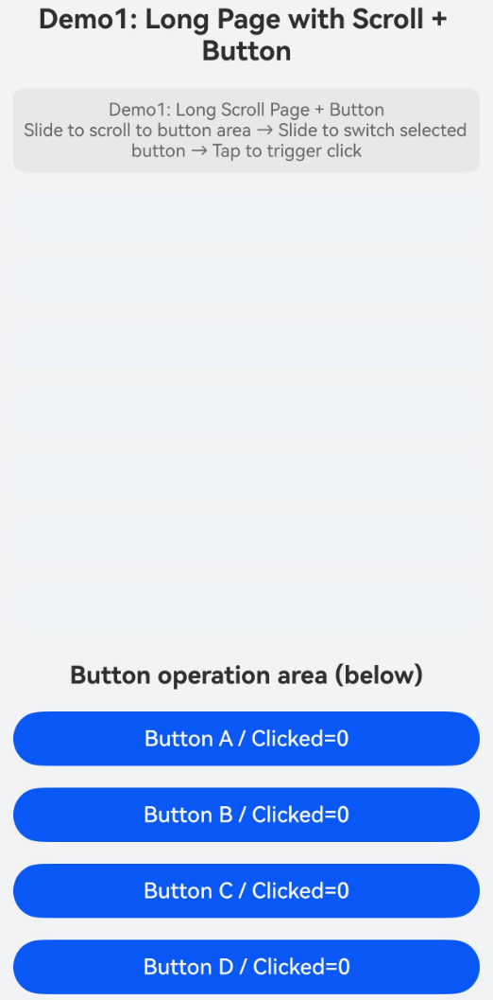
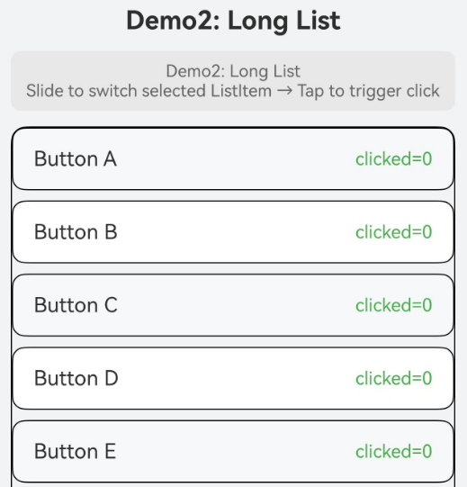
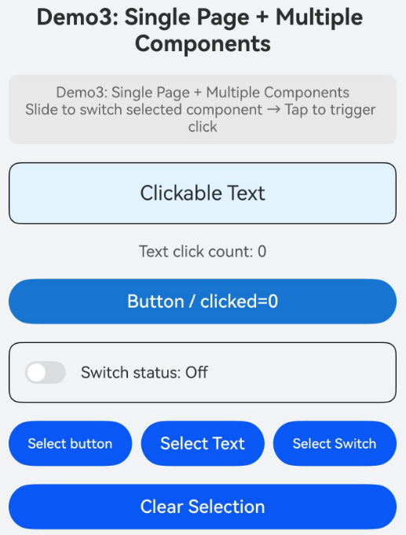
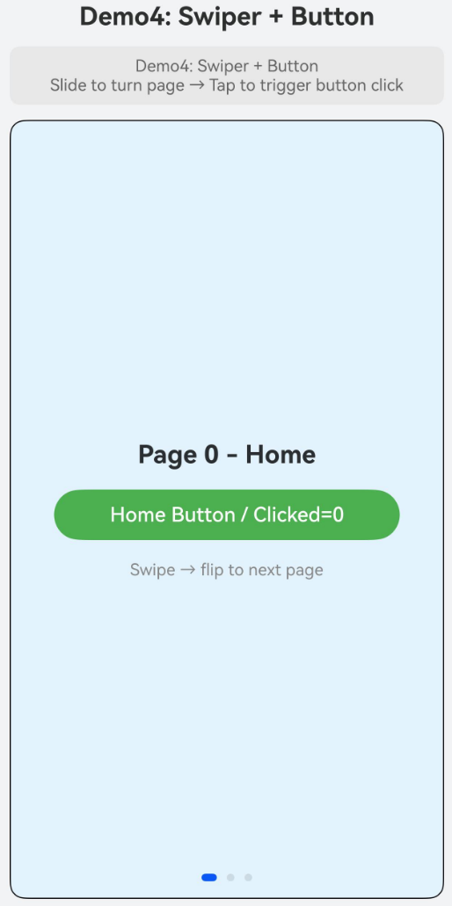

# Supporting Smart Gesture Input Events

<!--Kit: ArkUI-->
<!--Subsystem: ArkUI-->
<!--Owner: @yihao-lin-->
<!--Designer: @piggyguy-->
<!--Tester: @songyanhong-->
<!--Adviser: @Brilliantry_Rui-->
<!-- md-trans-meta sourceCommit=3674363ed3360f810dd5d530a025dd3006fb0270 translatedAt=2026-07-03T06:28:27.964Z pushedAt=2026-07-03T09:20:57.274Z -->

Starting from API version 26.0.0, smart gestures are supported. Smart gestures enable users to perform interactions such as selecting, clicking, scrolling, page turning, and returning on UI components via air gestures including "tap," "slide," and "wrist flip." The system automatically determines the target component and the execution action based on the user's operation intention. You can also receive the default action handling for the current gesture and customize it as needed.

Smart gesture interaction relies on the component's [id](../reference/apis-arkui/arkui-ts/ts-universal-attributes-component-id.md#id) and [smartGestureShortcut](../reference/apis-arkui/arkui-ts/ts-universal-attributes-smart-gesture-shortcut.md#smartgestureshortcut) attributes, based on which the system identifies components that can respond to gestures. You obtain a controller instance through [SmartGestureController](../reference/apis-arkui/arkts-apis-uicontext-smartgesturecontroller.md) to enable gestures, register a Monitor callback, and dynamically decide the final action to execute based on the gesture intent inferred by the system.

> **NOTE**
>
> - The tap and slide operations must be explicitly enabled via the [enableSmartTapAndSlideGestures](../reference/apis-arkui/arkts-apis-uicontext-smartgesturecontroller.md#enablesmarttapandslidegestures) API. After being disabled, the **smartGestureShortcut** configuration on the component side is retained, but it will not respond to tap and slide gestures.
> - The wrist flip gesture is enabled by default and is not affected by the **enableSmartTapAndSlideGestures** API.
> - Smart gestures can only be used in the stage model.

## Basic Concepts

* Smart gestures: The capability for users to interact with UI components through air gestures such as "tap," "slide," and "wrist flip," enabling actions like selection, click, scroll, page turn, and back. The wrist flip gesture is enabled by default, while tap and slide gestures need to be explicitly enabled via the [enableSmartTapAndSlideGestures](../reference/apis-arkui/arkts-apis-uicontext-smartgesturecontroller.md#enablesmarttapandslidegestures) API.

* Operation intent (OperateIntention): The semantic classification of the user's underlying operation, that is, what action the user performed. The value range includes **TAP**, **SLIDE_FORWARD**, and **BACK_PRESS**. For details, see [OperateIntention](../reference/apis-arkui/arkui-ts/ts-appendix-enums.md#operateintention). The operation intent serves as the input basis for the system to infer the execution action.

* Execution action (SmartGestureAction): The final execution action inferred by the system based on the operation intent, that is, what the system intends to do. The value range includes **CLICK**, **SELECT**, **SCROLL_FORWARD**, **PAGE_FORWARD**, **BACK_PRESS**, and **NONE**. For details, see [SmartGestureAction](../reference/apis-arkui/arkui-ts/ts-appendix-enums.md#smartgestureaction). The same operation intent can correspond to different execution actions. For example, **TAP** only corresponds to **CLICK**, while **SLIDE_FORWARD** can correspond to **SELECT**, **SCROLL_FORWARD**, or **PAGE_FORWARD**. The system automatically infers the most appropriate execution action based on the current page structure and the target component.

* Action proposal (ActionProposal): Specific operation scheme returned via a callback, used to override the system's default action. Each execution action corresponds to an action proposal class, as follows:

  - [ClickActionProposal](../reference/apis-arkui/arkts-apis-uicontext-smartgesturecontroller.md#clickactionproposal): Handles the click action, triggering the **onClick** event of the target component. It follows the "select first, then click" semantics. If the target component is not yet selected, a tap gesture first puts it into the selected state, and the next tap triggers the click.

  - [SelectActionProposal](../reference/apis-arkui/arkts-apis-uicontext-smartgesturecontroller.md#selectactionproposal): Handles the select action, putting the target component into the selected state. This applies to selectable components such as buttons, text, and list items.

  - [ScrollActionProposal](../reference/apis-arkui/arkts-apis-uicontext-smartgesturecontroller.md#scrollactionproposal): Handles the scroll action, scrolling a scrollable container (such as **Scroll**, **List**, or **Grid**) forward by a specified distance. The default scroll directions include downward and rightward. The **distance** parameter in the constructor accepts values in the range [0, +∞). Values less than 0 are treated as 0. The unit is vp.

  - [PageSwitchActionProposal](../reference/apis-arkui/arkts-apis-uicontext-smartgesturecontroller.md#pageswitchactionproposal): Handles the page switch action, turning a **Swiper** container forward by a specified number of pages. The default directions include rightward and downward. The **pageCount** parameter in the constructor accepts values in the range [0, +∞). Values less than 0 are treated as 0. The unit is pages.

  - [BackPressActionProposal](../reference/apis-arkui/arkts-apis-uicontext-smartgesturecontroller.md#backpressactionproposal): Handles the back action, simulating the Back key to trigger page return.

  - [NoneActionProposal](../reference/apis-arkui/arkts-apis-uicontext-smartgesturecontroller.md#noneactionproposal): Handles the null action, triggering no operation. This can be used to reject the current gesture.

* Gesture handling result ([GestureHandlingResolution](../reference/apis-arkui/arkts-apis-uicontext-smartgesturecontroller.md#gesturehandlingresolution)): Return value of the Monitor callback, which declares whether to consume the current gesture and which action proposal to select. When **isConsumed** is **true**, the gesture is consumed. If **selectedProposal** is also set, the custom action proposal overrides the system default action. When **isConsumed** is **false**, the gesture is not consumed and the system treats it as unhandled; in this case, the **selectedProposal** setting does not take effect.

* Selected state: After a component successfully enters the selected state, a selection indicator box is displayed. The style of the selection box varies by device. You can use [requestSelected](../reference/apis-arkui/arkts-apis-uicontext-smartgesturecontroller.md#requestselected) to proactively request a component to enter the selected state, and [clearSelected](../reference/apis-arkui/arkts-apis-uicontext-smartgesturecontroller.md#clearselected) to clear the selected state. **requestSelected** takes effect only when the target component meets all of the following conditions. The component can respond to smart gestures (**enabled** is **true** in **smartGestureShortcut**), the component is visible on screen, and the component is bound to **onClick** or a [TapGesture](../reference/apis-arkui/arkui-ts/ts-basic-gestures-tapgesture.md).

## Interaction Flow

The complete interaction flow of smart gestures is as follows.

1. Enable gestures: Call [enableSmartTapAndSlideGestures](../reference/apis-arkui/arkts-apis-uicontext-smartgesturecontroller.md#enablesmarttapandslidegestures) to enable the tap and slide gestures when the page appears.

2. Mark components: Set the [id](../reference/apis-arkui/arkui-ts/ts-universal-attributes-component-id.md#id) and [smartGestureShortcut](../reference/apis-arkui/arkui-ts/ts-universal-attributes-smart-gesture-shortcut.md#smartgestureshortcut) attributes for components that need to respond to smart gestures, declaring their response priority and selectability.

3. Register listeners: Call [registerMonitor](../reference/apis-arkui/arkts-apis-uicontext-smartgesturecontroller.md#registermonitor) to register a Monitor callback, which receives the gesture intention and makes custom decisions before the system processes the gesture. To cancel a single registered callback, call [unregisterMonitor](../reference/apis-arkui/arkts-apis-uicontext-smartgesturecontroller.md#unregistermonitor) to unregister the specified callback.

4. Dynamic decision‑making: In the Monitor callback, based on the specific action type (ActionProposal) returned by the callback and the user's actual operation intention, construct an appropriate **ActionProposal** and return the handling result via **GestureHandlingResolution**.

5. Disable gestures: When the page disappears, call [clearMonitors](../reference/apis-arkui/arkts-apis-uicontext-smartgesturecontroller.md#clearmonitors) to clear all Monitor callbacks (you can also unregister specific callbacks one by one via [unregisterMonitor](../reference/apis-arkui/arkts-apis-uicontext-smartgesturecontroller.md#unregistermonitor)), and call [enableSmartTapAndSlideGestures](../reference/apis-arkui/arkts-apis-uicontext-smartgesturecontroller.md#enablesmarttapandslidegestures) to disable the gestures.

## Smart Gesture Development Guide

The following describes how to enable and listen for smart gestures, and how to dynamically decide the response behavior of smart gestures.

### Enabling and Listening for Smart Gestures

The following steps demonstrate the most basic integration process for smart gestures: enabling gestures, marking target components, registering Monitor callbacks, and making dynamic decisions in the callback based on the action type inferred by the system.

1. Obtain the controller and enable gestures.

   In the component's [aboutToAppear](../reference/apis-arkui/arkui-ts/ts-custom-component-lifecycle.md#abouttoappear) lifecycle, obtain the [SmartGestureController](../reference/apis-arkui/arkts-apis-uicontext-smartgesturecontroller.md) instance and enable the tap and slide gestures. In [aboutToDisappear](../reference/apis-arkui/arkui-ts/ts-custom-component-lifecycle.md#abouttodisappear), clear the Monitor callbacks and disable the gestures.

   > **NOTE**
   >
   > [clearMonitors](../reference/apis-arkui/arkts-apis-uicontext-smartgesturecontroller.md#clearmonitors) clears all registered Monitor callbacks. If you only need to cancel a specific callback while keeping others active, use [unregisterMonitor](../reference/apis-arkui/arkts-apis-uicontext-smartgesturecontroller.md#unregistermonitor) to unregister the specified callback. The parameter passed to **unregisterMonitor** must reference the same callback instance that was registered with [registerMonitor](../reference/apis-arkui/arkts-apis-uicontext-smartgesturecontroller.md#registermonitor).

   <!-- @[smartgesture_case1_controller](https://gitcode.com/openharmony/applications_app_samples/blob/master/code/DocsSample/ArkUISample/SmartGesture/entry/src/main/ets/pages/Case1.ets) -->

   ``` TypeScript
   // Get the Smart Gesture controller instance, used to start/stop gestures, register listeners, and control the selected state
   private controller = this.getUIContext().getSmartGestureController();
   // ...
   aboutToAppear(): void {
     // Enable tap and slide gesture recognition
     this.controller.enableSmartTapAndSlideGestures(true);
     // Register a Monitor callback. Callbacks are triggered in last-registered-first-executed order
     this.controller.registerMonitor(this.callback);
   }
   
   aboutToDisappear(): void {
     // Clear all registered Monitor callbacks
     this.controller.clearMonitors();
     // Disable smart gesture recognition. The smartGestureShortcut configuration on the component side is retained but does not respond.
     this.controller.enableSmartTapAndSlideGestures(false);
   }
   ```

2. Mark components that can respond to gestures.

For each interactive component that needs to respond to smart gestures, set the **id** and **smartGestureShortcut** attributes. Set **action** to **GestureShortcut.PRIMARY** to designate the component as the preferred response target, and set **selectable** to **true** to indicate that the component can be selected.

   <!-- @[smartgesture_case1_button](https://gitcode.com/openharmony/applications_app_samples/blob/master/code/DocsSample/ArkUISample/SmartGesture/entry/src/main/ets/pages/Case1.ets) -->

   ``` TypeScript
   Button(`Button A / Clicked=${this.btn0Count}`)
     .id('btn_a')
     .width('100%')
     // Mark the component as a smart gesture target: action specifies the gesture action type, enabled controls whether it responds, and selectable controls whether it can be selected.
     .smartGestureShortcut({ action: GestureShortcut.PRIMARY, enabled: true, selectable: true })
     .onClick(() => {
       this.btn0Count += 1;
       this.hint = 'Button A onClick triggered';
     })
   ```

3. Register a Monitor callback and make dynamic decisions.

In the Monitor callback, convert [BaseGestureHandlingProposal](../reference/apis-arkui/arkts-apis-uicontext-smartgesturecontroller.md#basegesturehandlingproposal) to [TargetedGestureProposal](../reference/apis-arkui/arkts-apis-uicontext-smartgesturecontroller.md#targetedgestureproposal) to obtain the target node inferred by the system, construct the corresponding **ActionProposal** based on the **action** type, and return **GestureHandlingResolution**.

> **NOTE**
>
> Multiple Monitor callbacks are triggered in the order of last registered, first executed. Once a callback consumes the gesture, subsequent callbacks are not executed.
> The callback return value must be a valid **GestureHandlingResolution** instance; otherwise, the override will not take effect.

   <!-- @[smartgesture_case1_proposal](https://gitcode.com/openharmony/applications_app_samples/blob/master/code/DocsSample/ArkUISample/SmartGesture/entry/src/main/ets/pages/Case1.ets) -->

   ``` TypeScript
   import {
     BaseGestureHandlingProposal,
     ClickActionProposal,
     GestureHandlingResolution,
     ScrollActionProposal,
     SelectActionProposal,
     TargetedGestureProposal,
   } from '@kit.ArkUI';
   // ...
     // The Monitor callback receives the BaseGestureHandlingProposal parameter and dynamically decides the handling plan based on the gesture action type
     // BaseGestureHandlingProposal is the base class, containing action (action type) and operateIntention (operation intent)
     // TargetedGestureProposal is a subclass, additionally carrying a node attribute pointing to the target component node, which is required when constructing an ActionProposal
     private callback = (proposal: BaseGestureHandlingProposal): GestureHandlingResolution => {
       // Cast BaseGestureHandlingProposal to TargetedGestureProposal to obtain target component node information
       let targetProposal = proposal as TargetedGestureProposal;
       // Get the id identifier of the target component for subsequent FrameNode lookup by id
       let nodeId = targetProposal.node ? targetProposal.node.getId() : '';
       this.hint = `Intent=${proposal.operateIntention}, Action=${proposal.action}, Target=${nodeId}`;
       // Construct the gesture handling result. The parameter true indicates that this gesture is consumed, and subsequent callbacks will not be executed.
       const resolution = new GestureHandlingResolution(true);
   
       // Tap gesture intent: needs to perform a click operation.
       if (proposal.action === SmartGestureAction.CLICK) {
         if (nodeId) {
           // Obtain the corresponding FrameNode by the component ID, used to construct a click action proposal.
           const node = this.getUIContext().getFrameNodeById(nodeId);
           if (node) {
             // Construct a click action proposal, specifying the target node to perform the click.
             resolution.selectedProposal = new ClickActionProposal(node);
           }
         }
       // Slide gesture intent: needs to switch the selected component.
       } else if (proposal.action === SmartGestureAction.SELECT) {
         if (nodeId) {
           const node = this.getUIContext().getFrameNodeById(nodeId);
           if (node) {
             // Construct a select action proposal, specifying the target node to toggle the selected state
             resolution.selectedProposal = new SelectActionProposal(node);
           }
         }
       // Slide gesture intent: needs to scroll the container content by 200px.
       } else if (proposal.action === SmartGestureAction.SCROLL_FORWARD) {
         // The target node of ScrollActionProposal is the scroll container, not the button. Here, the Scroll's FrameNode is obtained via the container id
         const node = this.getUIContext().getFrameNodeById('long_scroll');
         if (node) {
           // Construct a scroll action proposal, specifying the target container node and scroll distance (200px).
           resolution.selectedProposal = new ScrollActionProposal(node, 200);
         }
       }
   
       return resolution;
     };
   ```

**Complete example:**

This example includes the following three steps.

- Enable smart gestures and register a Monitor callback in **aboutToAppear**, and clear the Monitor callbacks and disable gestures in **aboutToDisappear**.

- Set the **id** for the **Scroll** container, and set the **id** and **smartGestureShortcut** attributes for the four buttons at the bottom.

- In the Monitor callback, when the action is **CLICK**, perform a click; when it is **SELECT**, perform a selection; and when it is **SCROLL_FORWARD**, scroll the current page downward by 200 vp.

> **NOTE**
>
> **ClickActionProposal** follows the "select first, then click" semantics. When the target node has not yet been selected, the click will not be triggered immediately.

<!-- @[smartgesture_case1](https://gitcode.com/openharmony/applications_app_samples/blob/master/code/DocsSample/ArkUISample/SmartGesture/entry/src/main/ets/pages/Case1.ets) -->

``` TypeScript
import {
  BaseGestureHandlingProposal,
  ClickActionProposal,
  GestureHandlingResolution,
  ScrollActionProposal,
  SelectActionProposal,
  TargetedGestureProposal,
} from '@kit.ArkUI';

@Entry
@Component
struct Demo1 {
  // Obtain the smart gesture controller instance for enabling/disabling gestures,
  // registering listeners, and controlling the selected state.
  private controller = this.getUIContext().getSmartGestureController();
  @State hint: string = 'Demo1: Long Scroll Page + Button\nSlide to scroll to button area → Slide to switch selected button → Tap to trigger click';
  @State btn0Count: number = 0; // Button A click count
  @State btn1Count: number = 0; // Button B click count
  @State btn2Count: number = 0; // Button C click count
  @State btn3Count: number = 0; // Button D click count

  // The Monitor callback receives the BaseGestureHandlingProposal parameter
  // and dynamically determines the handling strategy based on the gesture action type.
  // BaseGestureHandlingProposal is the base class, containing action (action type)
  // and operateIntention (operation intent).
  // TargetedGestureProposal is a subclass, additionally carrying a node property
  // pointing to the target component node, which is required when constructing an ActionProposal.
  private callback = (proposal: BaseGestureHandlingProposal): GestureHandlingResolution => {
    // Cast BaseGestureHandlingProposal to TargetedGestureProposal to obtain
    // the target component node information.
    let targetProposal = proposal as TargetedGestureProposal;
    // Get the ID of the target component for subsequent FrameNode lookup by ID.
    let nodeId = targetProposal.node ? targetProposal.node.getId() : '';
    this.hint = `Intent=${proposal.operateIntention}, Action=${proposal.action}, Target=${nodeId}`;
    // Construct the gesture handling result. The parameter 'true' indicates
    // that this gesture is consumed, and subsequent callbacks will not be executed.
    const resolution = new GestureHandlingResolution(true);

    // Tap gesture intent: needs to perform a click operation.
    if (proposal.action === SmartGestureAction.CLICK) {
      if (nodeId) {
        // Obtain the corresponding FrameNode by component ID to construct a click action proposal.
        const node = this.getUIContext().getFrameNodeById(nodeId);
        if (node) {
          // Construct a click action proposal, specifying the target node to perform the click.
          resolution.selectedProposal = new ClickActionProposal(node);
        }
      }
    // Slide gesture intent: needs to switch the selected component.
    } else if (proposal.action === SmartGestureAction.SELECT) {
      if (nodeId) {
        const node = this.getUIContext().getFrameNodeById(nodeId);
        if (node) {
          // Construct a select action proposal, specifying the target node to toggle the selected state.
          resolution.selectedProposal = new SelectActionProposal(node);
        }
      }
    // Slide gesture intent: needs to scroll the container content by 200px.
    } else if (proposal.action === SmartGestureAction.SCROLL_FORWARD) {
      // The target node for ScrollActionProposal is the scroll container, not the button.
      // Here, the Scroll's FrameNode is obtained via the container ID.
      const node = this.getUIContext().getFrameNodeById('long_scroll');
      if (node) {
        // Construct a scroll action proposal, specifying the target container node
        // and the scroll distance (200px).
        resolution.selectedProposal = new ScrollActionProposal(node, 200);
      }
    }

    return resolution;
  };

  aboutToAppear(): void {
    // Enable tap and slide recognition.
    this.controller.enableSmartTapAndSlideGestures(true);
    // Register a Monitor callback. Callbacks are triggered in last-registered-first-executed order.
    this.controller.registerMonitor(this.callback);
  }

  aboutToDisappear(): void {
    // Clear all registered Monitor callbacks.
    this.controller.clearMonitors();
    // Disable smart gesture recognition. The smartGestureShortcut configuration on the component is retained but does not respond.
    this.controller.enableSmartTapAndSlideGestures(false);
  }

  build() {
    Scroll() {
      Column({ space: 16 }) {
        Text('Demo1: Long Page with Scroll + Button')
          .fontSize(20)
          .fontWeight(FontWeight.Bold)
          .width('100%')
          .textAlign(TextAlign.Center)

        Text(this.hint)
          .fontSize(13)
          .fontColor('#666')
          .width('100%')
          .textAlign(TextAlign.Center)
          .padding(8)
          .borderRadius(8)
          .backgroundColor('#e8e8e8')

        ForEach([0, 1, 2, 3, 4, 5, 6], (item: number) => {
          Column() {
            Text()
              .fontSize(15)
              .width('100%')
              .padding(16)
              .borderRadius(8)
              .backgroundColor('#f0f4f8')
          }
        })

        Text('Button operation area (below)')
          .fontSize(18)
          .fontWeight(FontWeight.Bold)
          .width('100%')
          .textAlign(TextAlign.Center)
          .margin({ top: 8 })

        Button(`Button A / Clicked=${this.btn0Count}`)
          .id('btn_a')
          .width('100%')
          // Mark the component as a smart gesture target: action specifies the gesture action type, enabled controls whether to respond, selectable controls whether it can be selected.
          .smartGestureShortcut({ action: GestureShortcut.PRIMARY, enabled: true, selectable: true })
          .onClick(() => {
            this.btn0Count += 1;
            this.hint = 'Button A onClick triggered';
          })

        Button(`Button B / Clicked=${this.btn1Count}`)
          .id('btn_b')
          .width('100%')
          .smartGestureShortcut({ action: GestureShortcut.PRIMARY, enabled: true, selectable: true })
          .onClick(() => {
            this.btn1Count += 1;
            this.hint = 'Button B onClick triggered';
          })

        Button(`Button C / Clicked=${this.btn2Count}`)
          .id('btn_c')
          .width('100%')
          .smartGestureShortcut({ action: GestureShortcut.PRIMARY, enabled: true, selectable: true })
          .onClick(() => {
            this.btn2Count += 1;
            this.hint = 'Button C onClick triggered';
          })

        Button(`Button D / Clicked=${this.btn3Count}`)
          .id('btn_d')
          .width('100%')
          .smartGestureShortcut({ action: GestureShortcut.PRIMARY, enabled: true, selectable: true })
          .onClick(() => {
            this.btn3Count += 1;
            this.hint = 'Button D onClick triggered';
          })
      }
      .width('100%')
      .padding(16)
    }
    .id('long_scroll')
    .width('100%')
    .height('100%')
    .backgroundColor('#f1f3f5')
  }
}
```



### Long List Scenario

When a page uses the [List](../reference/apis-arkui/arkui-ts/ts-container-list.md) component to display a large number of selectable list items, the slide gesture can select a list item, and the tap gesture can trigger a click on the list item. The scroll action requires specifying the **List** component as the scroll target.

> **NOTE**
>
> In long list scenarios, the distance parameter of **ScrollActionProposal** should be set reasonably based on the height of list items. Typically, it is set to the height of a single list item (for example, 100 vp) to prevent scrolling too far and causing users to miss content.

<!-- @[smartgesture_case2](https://gitcode.com/openharmony/applications_app_samples/blob/master/code/DocsSample/ArkUISample/SmartGesture/entry/src/main/ets/pages/Case2.ets) -->

``` TypeScript
import {
  BaseGestureHandlingProposal,
  ClickActionProposal,
  GestureHandlingResolution,
  ScrollActionProposal,
  SelectActionProposal,
  TargetedGestureProposal,
} from '@kit.ArkUI';

@Entry
@Component
struct Demo2 {
  // Obtain the smart gesture controller instance for enabling/disabling gestures,
  // registering listeners, and controlling the selected state.
  private controller = this.getUIContext().getSmartGestureController();
  @State hint: string = 'Demo2: Long List\nSlide to switch selected ListItem → Tap to trigger click';
  @State clickCounts: number[] = [0, 0, 0, 0, 0, 0, 0, 0, 0, 0, 0, 0]; // Click count for each ListItem
  private items: string[] = ['Button A', 'Button B', 'Button C', 'Button D', 'Button E', 'Button F',
    'Button G', 'Button H', 'Button I', 'Button J', 'Button K', 'Button L'];

  // The Monitor callback receives the BaseGestureHandlingProposal parameter
  // and dynamically determines the handling strategy based on the gesture action type.
  // BaseGestureHandlingProposal is the base class, containing action (action type)
  // and operateIntention (operation intent).
  // TargetedGestureProposal is a subclass, additionally carrying a node property
  // pointing to the target component node, which is required when constructing an ActionProposal.
  private callback = (proposal: BaseGestureHandlingProposal): GestureHandlingResolution => {
    // Cast BaseGestureHandlingProposal to TargetedGestureProposal to obtain
    // the target component node information.
    let targetProposal = proposal as TargetedGestureProposal;
    // Get the ID of the target component for subsequent FrameNode lookup by ID.
    let nodeId = targetProposal.node ? targetProposal.node.getId() : '';
    this.hint = `Intent=${proposal.operateIntention}, Action=${proposal.action}, Target=${nodeId}`;
    // Construct the gesture handling result. The parameter 'true' indicates
    // that this gesture is consumed, and subsequent callbacks will not be executed.
    const resolution = new GestureHandlingResolution(true);

    // Tap gesture intent: needs to perform a click operation.
    if (proposal.action === SmartGestureAction.CLICK) {
      if (nodeId) {
        // Obtain the corresponding FrameNode by component ID to construct a click action proposal.
        const node = this.getUIContext().getFrameNodeById(nodeId);
        if (node) {
          // Construct a click action proposal, specifying the target node to perform the click.
          resolution.selectedProposal = new ClickActionProposal(node);
        }
      }
    // Slide gesture intent: needs to switch the selected component.
    } else if (proposal.action === SmartGestureAction.SELECT) {
      if (nodeId) {
        const node = this.getUIContext().getFrameNodeById(nodeId);
        if (node) {
          // Construct a select action proposal, specifying the target node to toggle the selected state.
          resolution.selectedProposal = new SelectActionProposal(node);
        }
      }
    // Slide gesture intent: needs to scroll the container content by 100px.
    } else if (proposal.action === SmartGestureAction.SCROLL_FORWARD) {
      // The target node for ScrollActionProposal is the scroll container, not the list item.
      // Here, the List's FrameNode is obtained via the container ID.
      const node = this.getUIContext().getFrameNodeById('long_list');
      if (node) {
        // Construct a scroll action proposal, specifying the target container node
        // and the scroll distance (100px).
        resolution.selectedProposal = new ScrollActionProposal(node, 100);
      }
    }

    return resolution;
  };

  aboutToAppear(): void {
    // Enable tap and slide smart gesture recognition.
    this.controller.enableSmartTapAndSlideGestures(true);
    // Register a Monitor listener callback. Callbacks are triggered in the order of last registered, first executed.
    this.controller.registerMonitor(this.callback);
  }

  aboutToDisappear(): void {
    // Clear all registered Monitor callbacks.
    this.controller.clearMonitors();
    // Disable smart gesture recognition. The smartGestureShortcut configuration
    // on components is retained but will not respond.
    this.controller.enableSmartTapAndSlideGestures(false);
  }

  build() {
    Column({ space: 12 }) {
      Text('Demo2: Long List')
        .fontSize(20)
        .fontWeight(FontWeight.Bold)
        .width('100%')
        .textAlign(TextAlign.Center)

      Text(this.hint)
        .fontSize(13)
        .fontColor('#666')
        .width('100%')
        .textAlign(TextAlign.Center)
        .padding(8)
        .borderRadius(8)
        .backgroundColor('#e8e8e8')

      List({ space: 8 }) {
        ForEach(this.items, (item: string, index?: number) => {
          ListItem() {
            Row() {
              Text(item)
                .fontSize(16)
                .layoutWeight(1)
              Text(`clicked=${this.clickCounts[index ?? 0]}`)
                .fontSize(14)
                .fontColor('#4caf50')
            }
            .width('100%')
            .padding({ left: 16, right: 16, top: 14, bottom: 14 })
            .borderRadius(10)
            .borderWidth(1)
            .backgroundColor(index! % 2 === 0 ? '#f6f8fa' : '#ffffff')
            .id(`list_item_${index}`)
            // // Mark the component as a smart gesture target: action specifies the gesture action type, enabled controls whether to respond, selectable controls whether it can be selected.
            .smartGestureShortcut({ action: GestureShortcut.PRIMARY, enabled: true, selectable: true })
            .onClick(() => {
              const idx = index ?? 0;
              this.clickCounts[idx] += 1;
              this.hint = `${item} onClick triggered, click count=${this.clickCounts[idx]}`;
            })
          }
        })
      }
      .id('long_list')
      .width('100%')
      .layoutWeight(1)
      .borderRadius(12)
      .borderWidth(1)
    }
    .width('100%')
    .height('100%')
    .padding(16)
    .backgroundColor('#f1f3f5')
  }
}
```



### Multi-Component Type Scenario: Manual Control of Selected State

In a non-scrollable single page, there may be multiple types of interactive components such as [Text](../reference/apis-arkui/arkui-ts/ts-basic-components-text.md), [Button](../reference/apis-arkui/arkui-ts/ts-basic-components-button.md), and [Toggle](../reference/apis-arkui/arkui-ts/ts-basic-components-toggle.md). In this case, there is no need to handle scroll and page flip actions; only CLICK and SELECT need to be processed. You can use [requestSelected](../reference/apis-arkui/arkts-apis-uicontext-smartgesturecontroller.md#requestselected) to actively request a component to enter the selected state, and use [clearSelected](../reference/apis-arkui/arkts-apis-uicontext-smartgesturecontroller.md#clearselected) to clear the selected State.

This example includes the following operations.

- The slide gesture selects a **Text**, **Button**, or **Toggle** component, and the tap gesture triggers the [onClick](../reference/apis-arkui/arkui-ts/ts-universal-events-click.md#onclick) event of the selected component.

- Use the "Select Button", "Select Text", and "Select Toggle" buttons to call **requestSelected** to manually request a component to enter the selected State.

- Use the "Clear Selection" button to call **clearSelected** to clear the current selected state.

> **NOTE**
>
> **requestSelected** takes effect only when the target component meets all of the following conditions: the component can respond to smart gestures (**enabled** is **true** in **smartGestureShortcut**), the component is visible on the screen, and the component is bound to **onClick** or a [TapGesture](../reference/apis-arkui/arkui-ts/ts-basic-gestures-tapgesture.md).

<!-- @[smartgesture_case3](https://gitcode.com/openharmony/applications_app_samples/blob/master/code/DocsSample/ArkUISample/SmartGesture/entry/src/main/ets/pages/Case3.ets) -->

``` TypeScript
import {
  BaseGestureHandlingProposal,
  ClickActionProposal,
  GestureHandlingResolution,
  SelectActionProposal,
  TargetedGestureProposal,
} from '@kit.ArkUI';

@Entry
@Component
struct Demo3 {
  // Obtain the smart gesture controller instance for enabling/disabling gestures,
  // registering listeners, and controlling the selected state.
  private controller = this.getUIContext().getSmartGestureController();
  @State hint: string = 'Demo3: Single Page + Multiple Components\nSlide to switch selected component → Tap to trigger click';
  @State btnCount: number = 0; // Button click count
  @State textClickCount: number = 0; // Text click count
  @State toggleOn: boolean = false; // Toggle state
  @State sliderVal: number = 30; // Slider value

  // The Monitor callback receives the BaseGestureHandlingProposal parameter
  // and dynamically determines the handling strategy based on the gesture action type.
  // BaseGestureHandlingProposal is the base class, containing action (action type)
  // and operateIntention (operation intent).
  // TargetedGestureProposal is a subclass, additionally carrying a node property
  // pointing to the target component node, which is required when constructing an ActionProposal.
  private callback = (proposal: BaseGestureHandlingProposal): GestureHandlingResolution => {
    // Cast BaseGestureHandlingProposal to TargetedGestureProposal to obtain
    // the target component node information.
    let targetProposal = proposal as TargetedGestureProposal;
    // Get the ID of the target component for subsequent FrameNode lookup by ID.
    let nodeId = targetProposal.node ? targetProposal.node.getId() : '';
    this.hint = `Intent=${proposal.operateIntention}, Action=${proposal.action}, Target=${nodeId}`;
    // Construct the gesture handling result. The parameter 'true' indicates
    // that this gesture is consumed, and subsequent callbacks will not be executed.
    const resolution = new GestureHandlingResolution(true);

    // Tap gesture intent: needs to perform a click operation.
    if (proposal.action === SmartGestureAction.CLICK) {
      if (nodeId) {
        // Obtain the corresponding FrameNode by component ID to construct a click action proposal.
        const node = this.getUIContext().getFrameNodeById(nodeId);
        if (node) {
          // Construct a click action proposal, specifying the target node to perform the click.
          resolution.selectedProposal = new ClickActionProposal(node);
        }
      }
    // Slide gesture intent: needs to switch the selected component.
    } else if (proposal.action === SmartGestureAction.SELECT) {
      if (nodeId) {
        const node = this.getUIContext().getFrameNodeById(nodeId);
        if (node) {
          // Construct a select action proposal, specifying the target node to toggle the selected state.
          resolution.selectedProposal = new SelectActionProposal(node);
        }
      }
    }

    return resolution;
  };

  aboutToAppear(): void {
    // Enable tap and slide smart gesture recognition.
    this.controller.enableSmartTapAndSlideGestures(true);
    // Register a Monitor listener callback. Callbacks are triggered in the order of last registered, first executed.
    this.controller.registerMonitor(this.callback);
  }

  aboutToDisappear(): void {
    // Clear all registered Monitor callbacks.
    this.controller.clearMonitors();
    // Disable smart gesture recognition. The smartGestureShortcut configuration on components is retained but will not respond.
    this.controller.enableSmartTapAndSlideGestures(false);
  }

  build() {
    Scroll() {
      Column({ space: 16 }) {
        Text('Demo3: Single Page + Multiple Components')
          .fontSize(20)
          .fontWeight(FontWeight.Bold)
          .width('100%')
          .textAlign(TextAlign.Center)

        Text(this.hint)
          .fontSize(13)
          .fontColor('#666')
          .width('100%')
          .textAlign(TextAlign.Center)
          .padding(8)
          .borderRadius(8)
          .backgroundColor('#e8e8e8')

        Text('Clickable Text')
          .id('comp_text')
          .fontSize(18)
          .width('100%')
          .padding(16)
          .borderRadius(10)
          .borderWidth(1)
          .textAlign(TextAlign.Center)
          .backgroundColor('#e3f2fd')
          // Mark the component as a smart gesture target: action specifies the gesture action type, enabled controls whether to respond, selectable controls whether it can be selected
          .smartGestureShortcut({ action: GestureShortcut.PRIMARY, enabled: true, selectable: true })
          .onClick(() => {
            this.textClickCount += 1;
            this.hint = `Text onClick triggered, clicked=${this.textClickCount}`;
          })

        Row() {
          Text(`Text click count: ${this.textClickCount}`)
            .fontSize(14)
            .fontColor('#555')
        }.width('100%').justifyContent(FlexAlign.Center)

        Button(`Button / clicked=${this.btnCount}`)
          .id('comp_button')
          .width('100%')
          .backgroundColor('#1976d2')
          // Mark the component as a smart gesture target
          .smartGestureShortcut({ action: GestureShortcut.PRIMARY, enabled: true, selectable: true })
          .onClick(() => {
            this.btnCount += 1;
            this.hint = `Button onClick triggered, clicked=${this.btnCount}`;
          })

        Row() {
          Toggle({ type: ToggleType.Switch, isOn: this.toggleOn })
            .id('comp_toggle')
            .selectedColor('#4caf50')
            // Mark Toggle as a smart gesture target; tapping toggles the switch via onChange.
            .smartGestureShortcut({ action: GestureShortcut.PRIMARY, enabled: true, selectable: true })
            .onChange((isOn: boolean) => {
              this.toggleOn = isOn;
              this.hint = `Toggle onChange → ${isOn ? 'On' : 'Off'}`;
            })
          Text(`Switch status: ${this.toggleOn ? 'On' : 'Off'}`)
            .fontSize(14)
            .margin({ left: 12 })
        }
        .width('100%')
        .padding(12)
        .borderRadius(10)
        .borderWidth(1)
        .justifyContent(FlexAlign.Start)

        // Manually request selection of a specified component via requestSelected. The component must meet three conditions: visible, responsive to smart gestures, and bound with onClick.
        Row({ space: 8 }) {
          Button('Select button').layoutWeight(1)
            .onClick(() => this.controller.requestSelected('comp_button'))
          Button('Select Text').layoutWeight(1)
            .onClick(() => this.controller.requestSelected('comp_text'))
          Button('Select Switch').layoutWeight(1)
            .onClick(() => this.controller.requestSelected('comp_toggle'))
        }.width('100%')

        // Clear the current selected state via clearSelected
        Button('Clear Selection')
          .width('100%')
          .onClick(() => {
            this.controller.clearSelected();
            this.hint = 'Selection cleared';
          })
      }
      .width('100%')
      .padding(16)
    }
    .width('100%')
    .height('100%')
    .backgroundColor('#f1f3f5')
  }
}
```



### Swiper Component Page‑Turning Scenario

When a page uses the [Swiper](../reference/apis-arkui/arkui-ts/ts-container-swiper.md) component to display multi-page content, the slide gesture can flip pages to switch **Swiper** pages. In this case, you need to use [PageSwitchActionProposal](../reference/apis-arkui/arkts-apis-uicontext-smartgesturecontroller.md#pageswitchactionproposal) to specify the page switching target container and the number of pages to flip.

This example includes the following operations.

- The slide gesture turns pages to switch between **Swiper** pages, using **PageSwitchActionProposal** to specify a page‑turn count of 1.

- The tap gesture clicks the button on the current page.

- **loop** must be set to **false** for **Swiper** to avoid confusion in gesture intention caused by cyclic page turning.

> **NOTE**
>
> The **pageCount** parameter of **PageSwitchActionProposal** accepts values in the range [0, +∞), with the unit being pages. Values less than 0 are treated as 0. The default direction is forward (including rightward and downward).

<!-- @[smartgesture_case4](https://gitcode.com/openharmony/applications_app_samples/blob/master/code/DocsSample/ArkUISample/SmartGesture/entry/src/main/ets/pages/Case4.ets) -->

``` TypeScript
import {
  BaseGestureHandlingProposal,
  ClickActionProposal,
  GestureHandlingResolution,
  PageSwitchActionProposal,
  SelectActionProposal,
  TargetedGestureProposal,
} from '@kit.ArkUI';

@Entry
@Component
struct Demo4 {
  // Obtain the smart gesture controller instance for enabling/disabling gestures,
  // registering listeners, and controlling the selected state.
  private controller = this.getUIContext().getSmartGestureController();
  @State hint: string = 'Demo4: Swiper + Button\nSlide to turn page → Tap to trigger button click';
  @State page0Btn: number = 0; // Click count for the first page button
  @State page1Btn: number = 0; // Click count for the settings page button
  @State page2Btn: number = 0; // Click count for the about page button
  @State swiperIndex: number = 0; // Current Swiper page index

  // The Monitor callback receives the BaseGestureHandlingProposal parameter
  // and dynamically determines the handling strategy based on the gesture action type.
  // BaseGestureHandlingProposal is the base class, containing action (action type)
  // and operateIntention (operation intent).
  // TargetedGestureProposal is a subclass, additionally carrying a node property
  // pointing to the target component node, which is required when constructing an ActionProposal.
  private callback = (proposal: BaseGestureHandlingProposal): GestureHandlingResolution => {
    // Cast BaseGestureHandlingProposal to TargetedGestureProposal to obtain
    // the target component node information.
    let targetProposal = proposal as TargetedGestureProposal;
    // Get the ID of the target component for subsequent FrameNode lookup by ID.
    let nodeId = targetProposal.node ? targetProposal.node.getId() : '';
    this.hint = `Intent=${proposal.operateIntention}, Action=${proposal.action}, Target=${nodeId}`;
    // Construct the gesture handling result. The parameter 'true' indicates
    // that this gesture is consumed, and subsequent callbacks will not be executed.
    const resolution = new GestureHandlingResolution(true);

    // Tap gesture intent: needs to perform a click operation.
    if (proposal.action === SmartGestureAction.CLICK) {
      if (nodeId) {
        // Obtain the corresponding FrameNode by component ID to construct a click action proposal.
        const node = this.getUIContext().getFrameNodeById(nodeId);
        if (node) {
          // Construct a click action proposal, specifying the target node to perform the click.
          resolution.selectedProposal = new ClickActionProposal(node);
        }
      }
    // Slide gesture intent: needs to switch the selected component.
    } else if (proposal.action === SmartGestureAction.SELECT) {
      if (nodeId) {
        const node = this.getUIContext().getFrameNodeById(nodeId);
        if (node) {
          // Construct a select action proposal, specifying the target node to toggle the selected state.
          resolution.selectedProposal = new SelectActionProposal(node);
        }
      }
    // Slide gesture intent: needs to turn pages to switch the Swiper page, with a step of 1.
    } else if (proposal.action === SmartGestureAction.PAGE_FORWARD) {
      // The target node for PageSwitchActionProposal is the Swiper container, not the button.
      // Here, the Swiper's FrameNode is obtained via the container ID.
      const node = this.getUIContext().getFrameNodeById('demo_swiper');
      if (node) {
        // Construct a page switch action proposal, specifying the Swiper node and the page step
        // (1 means turn forward by one page).
        resolution.selectedProposal = new PageSwitchActionProposal(node, 1);
      }
    }

    return resolution;
  };

  aboutToAppear(): void {
    // Enable tap and slide smart gesture recognition.
    this.controller.enableSmartTapAndSlideGestures(true);
    // Register a Monitor listener callback. Callbacks are triggered in the order of last registered, first executed.
    this.controller.registerMonitor(this.callback);
  }

  aboutToDisappear(): void {
    // Clear all registered Monitor callbacks.
    this.controller.clearMonitors();
    // Disable smart gesture recognition. The smartGestureShortcut configuration on components is retained but will not respond.
    this.controller.enableSmartTapAndSlideGestures(false);
  }

  build() {
    Column({ space: 12 }) {
      Text('Demo4: Swiper + Button')
        .fontSize(20)
        .fontWeight(FontWeight.Bold)
        .width('100%')
        .textAlign(TextAlign.Center)

      Text(this.hint)
        .fontSize(13)
        .fontColor('#666')
        .width('100%')
        .textAlign(TextAlign.Center)
        .padding(8)
        .borderRadius(8)
        .backgroundColor('#e8e8e8')

      Swiper() {
        Column({ space: 16 }) {
          Text('Page 0 - Home')
            .fontSize(20)
            .fontWeight(FontWeight.Bold)
          Button(`Home Button / Clicked=${this.page0Btn}`)
            .id('page0_btn')
            .width('80%')
            .backgroundColor('#4caf50')
            // Mark the component as a smart gesture target: action specifies the gesture action type,
            // enabled controls whether it responds, and selectable controls whether it can be selected.
            .smartGestureShortcut({ action: GestureShortcut.PRIMARY, enabled: true, selectable: true })
            .onClick(() => {
              this.page0Btn += 1;
              this.hint = `Page 0 button onClick → clicked=${this.page0Btn}`;
            })
          Text('Swipe → flip to next page')
            .fontSize(13)
            .fontColor('#888')
        }
        .width('100%')
        .height('100%')
        .justifyContent(FlexAlign.Center)
        .backgroundColor('#e3f2fd')

        Column({ space: 16 }) {
          Text('Page 1 - Settings')
            .fontSize(20)
            .fontWeight(FontWeight.Bold)
          Button(`Settings Button / clicked=${this.page1Btn}`)
            .id('page1_btn')
            .width('80%')
            .backgroundColor('#ff9800')
            // Mark the component as a Smart Gesture target
            .smartGestureShortcut({ action: GestureShortcut.PRIMARY, enabled: true, selectable: true })
            .onClick(() => {
              this.page1Btn += 1;
              this.hint = `Page 1 button onClick → clicked=${this.page1Btn}`;
            })
          Text('Slide → flip to next page')
            .fontSize(13)
            .fontColor('#888')
        }
        .width('100%')
        .height('100%')
        .justifyContent(FlexAlign.Center)
        .backgroundColor('#fce4ec')

        Column({ space: 16 }) {
          Text('Page 2 - About')
            .fontSize(20)
            .fontWeight(FontWeight.Bold)
          Button(`About Button / clicked=${this.page2Btn}`)
            .id('page2_btn')
            .width('80%')
            .backgroundColor('#2196f3')
            // Mark the component as a Smart Gesture target
            .smartGestureShortcut({ action: GestureShortcut.PRIMARY, enabled: true, selectable: true })
            .onClick(() => {
              this.page2Btn += 1;
              this.hint = `Page 2 Button onClick → clicked=${this.page2Btn}`;
            })
          Text('Swipe → flip to next page')
            .fontSize(13)
            .fontColor('#888')
        }
        .width('100%')
        .height('100%')
        .justifyContent(FlexAlign.Center)
        .backgroundColor('#e8f5e9')
      }
      .id('demo_swiper')
      .width('100%')
      .layoutWeight(1)
      .loop(false)
      .index(0)
      .onChange((index: number) => {
        this.swiperIndex = index;
        this.hint = `Swiper onChange → page ${index}`;
      })
      .borderRadius(12)
      .borderWidth(1)
    }
    .width('100%')
    .height('100%')
    .padding(16)
    .backgroundColor('#f1f3f5')
  }
}
```



<!--no_check-->