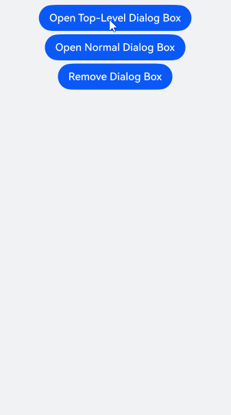

# Managing Overlays (OverlayManager)
<!--Kit: ArkUI-->
<!--Subsystem: ArkUI-->
<!--Owner: @liyi0309-->
<!--Designer: @liyi0309-->
<!--Tester: @lxl007-->
<!--Adviser: @Brilliantry_Rui-->

Overlays, implemented using **OverlayManager**, are used to display custom UI content on top of a page, but below such components as created through **Dialog**, **Popup**, **Menu**, **BindSheet**, **BindContentCover**, and **Toast**. These overlays are confined to the safe area of the current window. They are applicable to scenarios such as persistent floating elements.


You can use the [getOverlayManager](../reference/apis-arkui/arkts-apis-uicontext-uicontext.md#getoverlaymanager12) API in [UIContext](../reference/apis-arkui/arkts-apis-uicontext-uicontext.md) to obtain the [OverlayManager](../reference/apis-arkui/arkts-apis-uicontext-overlaymanager.md) object associated with the current UI context, and then call the corresponding APIs using this object.

## Specifications Constraints

* The nodes on **OverlayManager** are above the page level, but below such components as created through **Dialog**, **Popup**, **Menu**, **BindSheet**, **BindContentCover**, and **Toast**.
* There is no default animation when nodes on **OverlayManager** appear or disappear.
* The drawing method inside and outside the safe area of nodes on **OverlayManager** is consistent with that of the page, and the keyboard avoidance method is also the same as that of the page.
* You are advised to use AppStorage to store attributes related to **OverlayManager** to prevent service errors caused by attribute value changes during page switching.
* For API versions earlier than 19, **OverlayManager** does not support swipe-to-close gestures (left or right). You must implement the logic to close the OverlayManager in [onBackPress](../reference/apis-arkui/arkui-ts/ts-custom-component-lifecycle.md#onbackpress). In API version 19 or later, you can set the **enableBackPressedEvent** property in [OverlayManagerOptions](../reference/apis-arkui/arkts-apis-uicontext-i.md#overlaymanageroptions15) to control whether the OverlayManager responds to the swipe-to-close gesture.
* The event mechanism in **OverlayManager** gives priority to the component decorated with [WrappedBuilder](state-management/arkts-wrapBuilder.md). To allow events to pass through to the underlying layer, set [hitTestBehavior](../reference/apis-arkui/arkui-ts/ts-universal-attributes-hit-test-behavior.md#hittestbehavior) to **HitTestMode.Transparent**.

## Managing Overlays

With **OverlayManager**, you can add a specified node ([addComponentContent](../reference/apis-arkui/arkts-apis-uicontext-overlaymanager.md#addcomponentcontent12)), remove a specified node ([removeComponentContent](../reference/apis-arkui/arkts-apis-uicontext-overlaymanager.md#removecomponentcontent12)), show all nodes ([showAllComponentContents](../reference/apis-arkui/arkts-apis-uicontext-overlaymanager.md#showallcomponentcontents12)), and hide all nodes ([hideAllComponentContents](../reference/apis-arkui/arkts-apis-uicontext-overlaymanager.md#hideallcomponentcontents12)).

<!-- @[OverlayManager_Demo](https://gitcode.com/openharmony/applications_app_samples/blob/master/code/DocsSample/ArkUISample/DialogProject/entry/src/main/ets/pages/OverlayManager/OverlayManagerComponent.ets) -->

``` TypeScript
import { ComponentContent, OverlayManager } from '@kit.ArkUI';
import { hilog } from '@kit.PerformanceAnalysisKit';

const TAG: string = '[Sample_dialogproject]';
const DOMAIN: number = 0xFF00;

class Params {
  public text: string = '';
  public offset: Position;

  constructor(text: string, offset: Position) {
    this.text = text;
    this.offset = offset;
  }
}

@Builder
function builderText(params: Params) {
  Column() {
    Text(params.text)
      .fontSize(30)
      .fontWeight(FontWeight.Bold)
  }.offset(params.offset)
}

@Entry
@Component
export struct OverlayManagerComponent {
  @State message: string = 'ComponentContent';
  private uiContext: UIContext = this.getUIContext();
  private overlayNode: OverlayManager = this.uiContext.getOverlayManager();
  @StorageLink('contentArray') contentArray: ComponentContent<Params>[] = [];
  @StorageLink('componentContentIndex') componentContentIndex: number = 0;
  @StorageLink('arrayIndex') arrayIndex: number = 0;
  @StorageLink('componentOffset') componentOffset: Position = { x: 0, y: 30 };

  build() {
    // ...
      Column({ space: 10 }) {
        Button('Increment componentContentIndex:' + this.componentContentIndex)
          .onClick(() => {
            ++this.componentContentIndex;
          })
        Button('Decrement componentContentIndex:' + this.componentContentIndex)
          .onClick(() => {
            --this.componentContentIndex;
          })
        Button('Add ComponentContent:' + this.contentArray.length)
          .onClick(() => {
            let componentContent = new ComponentContent(
              this.uiContext, wrapBuilder<[Params]>(builderText),
              new Params(this.message + (this.contentArray.length), this.componentOffset)
            )
            this.contentArray.push(componentContent);
            this.overlayNode.addComponentContent(componentContent, this.componentContentIndex);
          })
        Button('Increment arrayIndex:' + this.arrayIndex)
          .onClick(() => {
            ++this.arrayIndex;
          })
        Button('Decrement arrayIndex:' + this.arrayIndex)
          .onClick(() => {
            --this.arrayIndex;
          })
        Button('Delete ComponentContent:' + this.arrayIndex)
          .onClick(() => {
            if (this.arrayIndex >= 0 && this.arrayIndex < this.contentArray.length) {
              let componentContent = this.contentArray.splice(this.arrayIndex, 1);
              this.overlayNode.removeComponentContent(componentContent.pop());
            } else {
              hilog.info(DOMAIN, TAG, '%{public}s', 'arrayIndex error');
            }
          })
        Button('Show ComponentContent:' + this.arrayIndex)
          .onClick(() => {
            if (this.arrayIndex >= 0 && this.arrayIndex < this.contentArray.length) {
              let componentContent = this.contentArray[this.arrayIndex];
              this.overlayNode.showComponentContent(componentContent);
            } else {
              hilog.info(DOMAIN, TAG, '%{public}s', 'arrayIndex error');
            }
          })
        Button('Hide ComponentContent:' + this.arrayIndex)
          .onClick(() => {
            if (this.arrayIndex >= 0 && this.arrayIndex < this.contentArray.length) {
              let componentContent = this.contentArray[this.arrayIndex];
              this.overlayNode.hideComponentContent(componentContent);
            } else {
              hilog.info(DOMAIN, TAG, '%{public}s', 'arrayIndex error');
            }
          })
        Button('Show All ComponentContent')
          .onClick(() => {
            this.overlayNode.showAllComponentContents();
          })
        Button('Hide All ComponentContent')
          .onClick(() => {
            this.overlayNode.hideAllComponentContents();
          })

        Button('Go')
          .onClick(() => {
            this.getUIContext().getRouter().pushUrl({
              url: 'pages/Second'
            })
          })
      }
      .width('100%')
      .height('100%')
      // ...
  }
}
```


The following example shows how to display a floating bubble that always stays on the left side of the screen, and clicking it displays an alert dialog box.

<!-- @[OverlayManager_Demo2](https://gitcode.com/openharmony/applications_app_samples/blob/master/code/DocsSample/ArkUISample/DialogProject/entry/src/main/ets/pages/OverlayManager/OverlayManagerAlertDialog.ets) -->

``` TypeScript
import { ComponentContent, OverlayManager } from '@kit.ArkUI';

class Params {
  public context: UIContext;
  public offset: Position;
  constructor(context: UIContext, offset: Position) {
    this.context = context;
    this.offset = offset;
  }
}
@Builder
function builderOverlay(params: Params) {
  Column() {
    Stack(){
    }.width(50).height(50).backgroundColor(Color.Yellow).position(params.offset).borderRadius(50)
    .onClick(() => {
      params.context.showAlertDialog(
        {
          title: 'title',
          message: 'Text',
          autoCancel: true,
          alignment: DialogAlignment.Center,
          gridCount: 3,
          confirm: {
            value: 'Button',
            action: () => {}
          },
          cancel: () => {}
        }
      )
    })
  }.focusable(false).width('100%').height('100%').hitTestBehavior(HitTestMode.Transparent)
}

@Entry
@Component
export struct OverlayManagerAlertDialog {
  private uiContext: UIContext = this.getUIContext();
  private overlayNode: OverlayManager = this.uiContext.getOverlayManager();
  private overlayContent:ComponentContent<Params>[] = [];
  controller: TextInputController = new TextInputController();

  aboutToAppear(): void {
    let uiContext = this.getUIContext();
    let componentContent = new ComponentContent(
      this.uiContext, wrapBuilder<[Params]>(builderOverlay),
      new Params(uiContext, {x:0, y: 100})
    );
    this.overlayNode.addComponentContent(componentContent, 0);
    this.overlayContent.push(componentContent);
  }

  aboutToDisappear(): void {
    let componentContent = this.overlayContent.pop();
    this.overlayNode.removeComponentContent(componentContent);
  }

  build() {
    // ...
      Column() {

      }
      .width('100%')
      .height('100%')
    // ...
  }
}
```


Since API version 18, you can use the **getOverlayManager** API in **UIContext** to obtain an **OverlayManager** object. Using this object you can then call [addComponentContentWithOrder](../reference/apis-arkui/arkts-apis-uicontext-overlaymanager.md#addcomponentcontentwithorder18) to add components to specific layers, with overlays on higher layers covering those on lower ones.

<!-- @[OverlayManager_Demo3](https://gitcode.com/openharmony/applications_app_samples/blob/master/code/DocsSample/ArkUISample/DialogProject/entry/src/main/ets/pages/OverlayManager/OverlayManagerWithOrder.ets) -->

``` TypeScript
import { ComponentContent, LevelOrder, OverlayManager } from '@kit.ArkUI';
import { hilog } from '@kit.PerformanceAnalysisKit';

const TAG: string = '[Sample_dialogproject]';
const DOMAIN: number = 0xFF00;

class Params {
  public text: string = '';
  public offset: Position;

  constructor(text: string, offset: Position) {
    this.text = text;
    this.offset = offset;
  }
}

@Builder
function builderTopText(params: Params) {
  Column() {
    Stack() {
      Text(params.text)
        .fontSize(30)
        .fontWeight(FontWeight.Bold)
    }
    .width(300)
    .height(200)
    .padding(5)
    .backgroundColor('#F7F7F7')
    .alignContent(Alignment.Top)
  }.offset(params.offset)
}

@Builder
function builderNormalText(params: Params) {
  Column() {
    Stack() {
      Text(params.text)
        .fontSize(30)
        .fontWeight(FontWeight.Bold)
    }
    .width(300)
    .height(400)
    .padding(5)
    .backgroundColor('#D5D5D5')
    .alignContent(Alignment.Top)
  }.offset(params.offset)
}

@Entry
@Component
export struct OverlayManagerWithOrder {
  private ctx: UIContext = this.getUIContext();
  private overlayManager: OverlayManager = this.ctx.getOverlayManager();
  @StorageLink('contentArray') contentArray: ComponentContent<Params>[] = [];
  @StorageLink('componentContentIndex') componentContentIndex: number = 0;
  @StorageLink('arrayIndex') arrayIndex: number = 0;
  @StorageLink('componentOffset') componentOffset: Position = { x: 0, y: 80 };

  build() {
    // ...
      Row() {
        Column({ space: 5 }) {
          Button('Open Top-Level Dialog Box')
            .onClick(() => {
              let componentContent = new ComponentContent(
                this.ctx, wrapBuilder<[Params]>(builderTopText),
                new Params('I am a top-level dialog box', this.componentOffset)
              );
              this.contentArray.push(componentContent);
              this.overlayManager.addComponentContentWithOrder(componentContent, LevelOrder.clamp(100000));
            })
          Button('Open Normal Dialog Box')
            .onClick(() => {
              let componentContent = new ComponentContent(
                this.ctx, wrapBuilder<[Params]>(builderNormalText),
                new Params('I am a normal dialog box', this.componentOffset)
              );
              this.contentArray.push(componentContent);
              this.overlayManager.addComponentContentWithOrder(componentContent, LevelOrder.clamp(0));
            })
          Button('Remove Dialog Box').onClick(() => {
            if (this.arrayIndex >= 0 && this.arrayIndex < this.contentArray.length) {
              let componentContent = this.contentArray.splice(this.arrayIndex, 1);
              this.overlayManager.removeComponentContent(componentContent.pop());
            } else {
              hilog.info(DOMAIN, TAG, '%{public}s', 'arrayIndex error');
            }
          })
        }.width('100%')
      }
      // ...
  }
}
```

