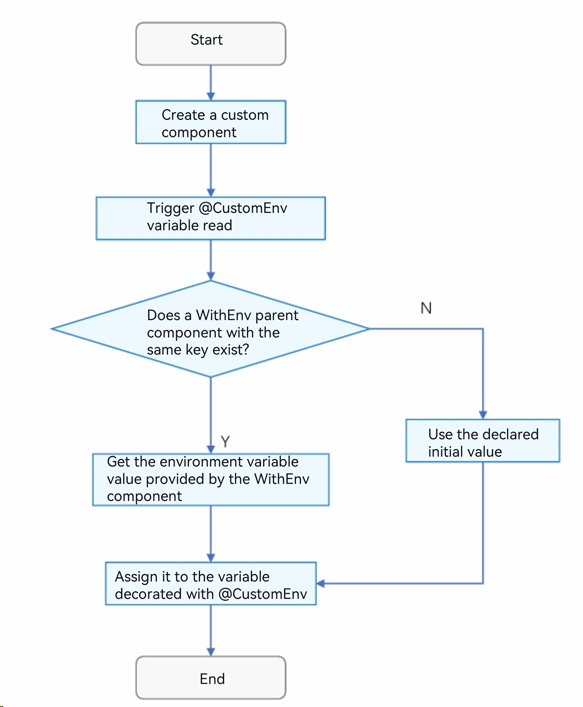
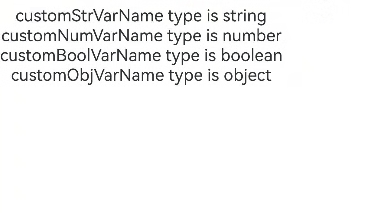
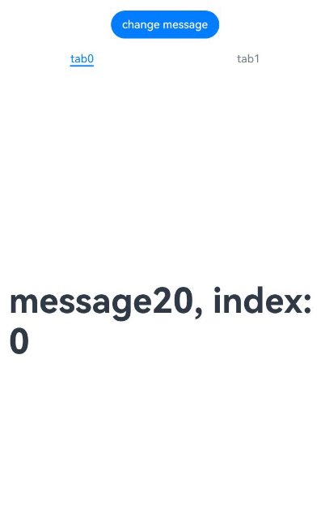
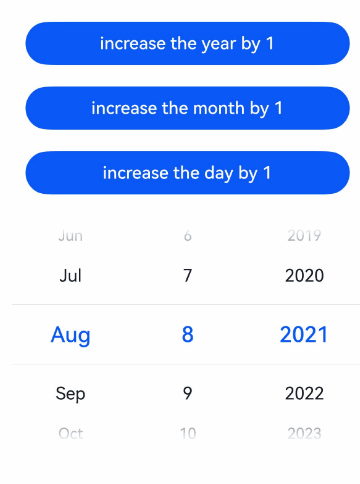
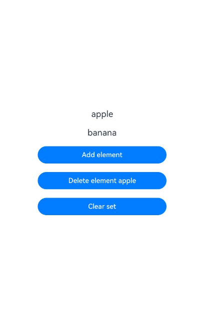
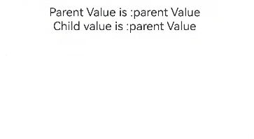

# \@CustomEnv: Custom Environment Variable

<!--Kit: ArkUI-->
<!--Subsystem: ArkUI-->
<!--Owner: @liwenzhen3-->
<!--Designer: @s10021109-->
<!--Tester: @songyanhong-->
<!--Adviser: @zhang_yixin13-->
<!-- md-trans-meta sourceCommit=3674363ed3360f810dd5d530a025dd3006fb0270 translatedAt=2026-07-03T06:28:25.560Z pushedAt=2026-07-06T09:01:41.616Z -->

[\@CustomEnv](../reference/apis-arkui/arkui-ts/ts-custom-env-property.md#customenv) can be used to obtain custom environment variables. Developers can set custom environment variables via the [.customEnv](../reference/apis-arkui/arkui-ts/ts-container-with-env.md#customenv) API of the [WithEnv](../reference/apis-arkui/arkui-ts/ts-container-with-env.md) component, and read the variable value corresponding to the same [CustomEnvKey\<S\>](../reference/apis-arkui/arkui-ts/ts-custom-env-property.md#customenvkeys) in child components through the [\@CustomEnv](../reference/apis-arkui/arkui-ts/ts-custom-env-property.md#customenv) decorator. This mechanism implements data transparent transmission within the component tree, enabling parent-child components to interact based on environment variables while keeping the code decoupled.

>**NOTE**
>
> Starting from API version 26.0.0, [\@CustomEnv](../reference/apis-arkui/arkui-ts/ts-custom-env-property.md#customenv) supports use in [\@Component](./state-management/arkts-create-custom-components.md#component) and [\@ComponentV2](./state-management/arkts-create-custom-components.md#componentv2).
>
> Starting from API version 26.0.0, this decorator supports use in atomic services.

## Overview

[\@CustomEnv](../reference/apis-arkui/arkui-ts/ts-custom-env-property.md#customenv) is a reactive custom environment variable decorator. Its capabilities include:

- Reads the corresponding custom environment variable information based on the input parameter. For details, see [\@CustomEnv Usage Method](#customenv-usage-method).

- When the custom environment variable changes, it notifies the \@CustomEnv decorated variable to update and triggers the refresh of the associated component of \@CustomEnv to update the UI content.

- Variables decorated with \@CustomEnv are read-only. Developers are not allowed to perform overall assignment to \@CustomEnv decorated variables after initialization. To update the value of the variable, it must be updated via the parent component's WithEnv component in conjunction with the `.customEnv()` method. Attempting to assign a value to a \@CustomEnv variable will result in a compilation error.

Developers can use the \@CustomEnv decorator and pass in a custom key to declare a responsive environment variable. The example is as follows:

```ts
import { WithEnv, WithEnvAttribute } from '@kit.ArkUI';

const custom = CustomEnvKey.create<string>();

@Entry
@ComponentV2
struct Index {
  @CustomEnv(custom) varName: string = 'default value';

  build() {
    Column() {
    }
  }
}
```

Where:

- `custom`: A developer-defined environment variable key, of type [CustomEnvKey\<S\>](../reference/apis-arkui/arkui-ts/ts-custom-env-property.md#customenvkeys); otherwise, a compilation error will occur.

- `varName`: The name of the decorated variable.

- `'default value'`: The default value of the variable, used when no corresponding value provided by a WithEnv component is found.

## \@CustomEnv Usage Method

### Decorator Description

| \@CustomEnv decorator | Description |
| ------------------- | ------------------------------------------------------------ |
| Decorator parameter | The input parameter of the [\@CustomEnv](../reference/apis-arkui/arkui-ts/ts-custom-env-property.md#customenv) decorator must be of the [CustomEnvKey\<S\>](../reference/apis-arkui/arkui-ts/ts-custom-env-property.md#customenvkeys) type. |
| Decoratable variable types | Basic types such as Object, class, string, number, boolean, enum, as well as built-in types such as Array, Date, Map, and Set. Supports null, undefined, and union types. |
| Initial value of decorated variable | Must be initialized locally; external initialization is not allowed. |

### Variable Passing

| Passing rule       | Description                                                         |
| -------------- | ------------------------------------------------------------ |
| Initialization from parent component | Variables decorated by \@CustomEnv only allow local initialization and cannot be initialized from outside.    |
| Initialization of \@CustomEnv decorated variable | When initializing a variable decorated by \@CustomEnv, it will first recursively search upwards for a value with the same key injected via WithEnv.customEnv in the parent component; if found, that injected value is used, otherwise the local initial value is used.|

### Observing Changes

When the value of a variable decorated by \@Local changes due to a tap on the update button, the value set via the .customEnv() method in the WithEnv component will also notify \@CustomEnv. At this point, the variable decorated by \@CustomEnv in the child component will update to the latest value and trigger a UI re-render, implementing a complete reactive update chain.

```ts
import { WithEnv, WithEnvAttribute } from '@kit.ArkUI';

const custom = CustomEnvKey.create<string>();

@Entry
@ComponentV2
struct Index {
  @Local customMsg: string = 'Hello';

  build() {
    Column() {
      Button('update')
        .onClick(() => {
          this.customMsg = 'Hello World';
        })

      WithEnv() {
        // With the WithEnv component, Child's customMessage displays the value 'Hello' provided by WithEnv. After clicking the Button, the value is updated to 'Hello World'.
        Child()
      }.customEnv(custom, this.customMsg)

    }
  }
}

@ComponentV2
struct Child {
  @CustomEnv(custom) customMessage: string = 'default content';

  build() {
    Column() {
      Text(`Child: ${this.customMessage}`);
    }
  }
}
```

## \@CustomEnv and \@Env Capability Comparison

Both \@CustomEnv and [\@Env](./arkts-env-system-property.md) are related to environment variables. See the table below for a specific capability comparison.

| Capability | \@CustomEnv | \@Env|
| ------------------ | ------------------ | ------------------ |
|Starting API version|Supported from API version 26.0.0.|Supported from API version 22.|
|Support parameter|Customized CustomEnvKey type object.|[Enumeration values of SystemProperties](./arkts-env-system-property.md#supported-parameters).<br/>After API version 26.0.0, supports [SystemProperties](./arkts-env-system-property.md#supported-parameters)\|[SystemEnvKey\<T\>](./arkts-env-system-property.md#supported-parameters) type parameters.|
|Usage form|\@CustomEnv is a decorator that can be declared in \@Component or \@ComponentV2. The environment variable is set by the developer via the customEnv API of WithEnv.|\@Env is a decorator that can be declared in \@Component or \@ComponentV2 to directly read system environment variables.<br/>After API version 26.0.0, developers can set system environment variables of the [SystemEnvKey\<T\>](./arkts-env-system-property.md#supported-parameters) type via the env API of WithEnv.|
|Source of value|An initial default value is given or set via the .customEnv() method of the WithEnv component.|System environment variables set via the env API of WithEnv.|
|Whether it has reactive capability|Yes. When the value set by WithEnv changes, it notifies the \@CustomEnv decorated variable to update and notifies the associated component to refresh.|Yes. When the system environment variable changes, it notifies the \@Env decorated variable to update and notifies the associated component to refresh.|

## Constraints

- \@CustomEnv can only be used in \@Component and \@ComponentV2; otherwise, a compile-time error will occur.

```ts

const custom = CustomEnvKey.create<string>();
// Incorrect usage, compile-time error
class CustomEnvKey {
  @CustomEnv(custom) customVarName: string = 'hello world'; 
}
// Correct usage
@Entry
@Component
struct Index {
  @CustomEnv(custom) customVarName: string = 'hello world'; 

  build() {
    Column() {
      Text(`this is @CustomEnv page`)
    }
  }
}
```

- The input parameter of \@CustomEnv must be a global constant created via the [create\<T\>](../reference/apis-arkui/arkui-ts/ts-custom-env-property.md#createt) method of [CustomEnvKey\<S\>](../reference/apis-arkui/arkui-ts/ts-custom-env-property.md#customenvkeys), and its type must be a developer-defined CustomEnvKey\<S\>; otherwise, a compilation error will occur. If the developer bypasses the compilation check, a runtime error will occur.

```ts
const custom = CustomEnvKey.create<string>();
@Entry
@Component
struct Index {
  @CustomEnv(custom) customVarName: string = 'hello world'; // Correct usage
  // cus: CustomEnvKey<string> = CustomEnvKey.create<string>()
  // @CustomEnv(this.cus) customVarName: string = 'hello world';  // Incorrect usage, will cause a compilation error

  build() {
    Column() {
      Text(`this is @CustomEnv page`)
    }
  }
}
```

- Variables decorated by \@CustomEnv are read-only attributes. Developers are not allowed to perform assignment operations on them; otherwise, a compilation error will occur.

```ts
import { WithEnv, WithEnvAttribute } from '@kit.ArkUI';

const custom = CustomEnvKey.create<string>();

@Entry
@ComponentV2
struct Index {
  @CustomEnv(custom) customVarName: string = 'hello world';
  @Local newVarName: string = 'customMessage';

  build() {
    Column() {
      Button('update')
        .onClick(() => {
          this.customVarName = 'Change Message'; // Incorrect usage, compilation error
        })

      WithEnv() {
        Child()
      }.customEnv(custom, this.newVarName)

    }
  }
}
```

- Variables decorated by \@CustomEnv cannot be initialized by passing parameters from the parent component. If a value is assigned in the form of a parameter during component instantiation, it will be intercepted and an error will be reported during the compilation phase.

```ts

const custom = CustomEnvKey.create<string>();

@Entry
@ComponentV2
struct PageOne {
  @CustomEnv(custom) defaultMessage: string = 'Hello';

  build() {
    Column() {
      Child({ firstValue: this.defaultMessage }) // Incorrect usage, compilation error
    }
  }
}

@ComponentV2
struct Child {
  @CustomEnv(custom) firstValue: string = 'world';

  build() {
    Column() {
      Text(this.firstValue)
    }
  }
}
```

- \@CustomEnv does not look up the value set by \@CustomEnv with the same key in \@Component/\@ComponentV2.

```ts

const custom = CustomEnvKey.create<string>();

@Entry
@ComponentV2
struct Index {
  @CustomEnv(custom) customMessage: string = 'parent';

  build() {
    Column() {
      Child()
    }
  }
}

@ComponentV2
struct Child {
  @CustomEnv(custom) customMessage: string = 'child';

  build() {
    Column() {
      Text(`Child: ${this.customMessage}`);
    }
  }
}
```

## \@CustomEnv Initialization Process

The \@CustomEnv variable initialization follows the process below:

1. Find whether the corresponding key exists in the WithEnv component:

   - Determine whether the current parent component is a WithEnv component.

   - If not, continue searching upward until the root node.

   - If a WithEnv component with the corresponding key is found, obtain the environment variable value provided by the component and assign it to the variable decorated by \@CustomEnv.

2. Initial value of the variable declared with \@CustomEnv:

   - If no WithEnv component with the corresponding key is found, the local initial value of the \@CustomEnv decorated variable is used.

The flowchart is shown in the figure below.



## Use Cases

### Supporting Custom Keys and Values

The newly added state management decorator \@CustomEnv supports custom key configuration and allows specifying the initial value of the variable. The syntax format is: `@CustomEnv(custom) customVarName: string = 'hello world'`. Here, 'custom' is the developer-defined environment variable key, and 'hello world' is the initial value of the variable.

```ts

const custom = CustomEnvKey.create<string>();

@Entry
@ComponentV2
struct Index {
  // 1. Implements the defined key and value
  @CustomEnv(custom) customVarName: string = 'hello world';

  build() {
    Column() {
      Text(`Parent: ${this.customVarName}`)
    }
  }
}
```

The running effect is shown in the figure below.


### \@CustomEnv Supports Multiple Data Types

\@CustomEnv supports variable declarations of both simple and complex types. Simple types include string, number, boolean, enum, etc.; complex types include object types such as class and Object.

```ts

@ObservedV2
class CustomEnvValue {
  @Trace id: number = 123;
  @Trace userName: string = 'admin';
}

const customStr = CustomEnvKey.create<string>();
const customNum = CustomEnvKey.create<number>();
const customBool = CustomEnvKey.create<boolean>();
const customObj = CustomEnvKey.create<CustomEnvValue>();

@Entry
@ComponentV2
struct Index {
  @CustomEnv(customStr) customStrVarName: string = 'hello world';
  @CustomEnv(customNum) customNumVarName: number = 1;
  @CustomEnv(customBool) customBoolVarName: boolean = true;
  @CustomEnv(customObj) customObjVarName: CustomEnvValue = new CustomEnvValue();

  build() {
    Column() {
      Text(`customStrVarName type is ${typeof this.customStrVarName}`)
      Text(`customNumVarName type is ${typeof this.customNumVarName}`)
      Text(`customBoolVarName type is ${typeof this.customBoolVarName}`)
      Text(`customObjVarName type is ${typeof this.customObjVarName}`)
    }
  }
}
```

The running effect is shown in the figure below.



### \@CustomEnv Supports Default Initial Values

When a variable decorated with \@CustomEnv in a child component searches upward for an environment variable value but does not find a matching WithEnv component, the variable will use the initial value specified at declaration as the default value.

```ts

const custom = CustomEnvKey.create<string>();

@Entry
@ComponentV2
struct Index {
  build() {
    Column() {
      Child()
    }
  }
}

@ComponentV2
struct Child {
  @CustomEnv(custom) customMessage: string = 'default content';

  build() {
    Column() {
     // At this point, the content displayed in Text is: Child: default content
      Text(`Child: ${this.customMessage}`);
    }
  }
}
```

The running effect is shown in the figure below.


### Environment Variable Lookup Follows the Nearest-First Principle

When a child component uses a variable decorated with @CustomEnv to obtain an environment variable value, it traverses up the component tree to find the corresponding **WithEnv** components and prioritizes the value provided by the **WithEnv** component closest to the current child component. If the nearest **WithEnv** component does not define that key, the search continues to outer layers until a matching value is found. If no match is found, the local default value is used.

In the following example, the \@CustomEnv(custom) declared in the Child component will be assigned by the innermost WithEnv closest to it, resulting in the final value 'the nearest WithEnv'.

```ts
import { WithEnv, WithEnvAttribute } from '@kit.ArkUI';

const custom = CustomEnvKey.create<string>();

@Entry
@ComponentV2
struct Index {
  build() {
    Column() {
      // Nearest principle demonstration
      WithEnv() {
        // Prioritize searching for WithEnv at this level
        WithEnv() {
          // Proximity principle, display 'the nearest WithEnv'
          Child()
        }.customEnv(custom, 'the nearest WithEnv')
      }.customEnv(custom, 'outer WithEnv')
    }
  }
}

@ComponentV2
struct Child {
  // @CustomEnv searches upward for parent components, prioritizing WithEnv
  @CustomEnv(custom) customMessage: string = 'default content';

  build() {
    Column() {
      Text(`Child: ${this.customMessage}`);
    }
  }
}
```

The running effect figure is shown below.


### Reactive Update Capability

When clicking the update button causes the value of a variable decorated with @Local to change, the value set via the **.customEnv()** method in the **WithEnv** component will also notify @CustomEnv. At this point, the variable decorated with @CustomEnv in the child component will be updated with the latest value and trigger a UI re-render, thus implementing a complete reactive update chain.

```ts
import { WithEnv, WithEnvAttribute } from '@kit.ArkUI';

const custom = CustomEnvKey.create<string>();

@Entry
@ComponentV2
struct Index {
  @Local customMsg: string = 'Hello';

  build() {
    Column() {
      Button('update')
        .onClick(() => {
          this.customMsg = 'Hello World';
        })

      WithEnv() {
        // With the WithEnv component, Child's customMessage displays the value 'Hello' provided by WithEnv. After tapping the Button, the value updates to 'Hello World'.
        Child()
      }.customEnv(custom, this.customMsg)

    }
  }
}

@ComponentV2
struct Child {
  @CustomEnv(custom) customMessage: string = 'default content';

  build() {
    Column() {
      Text(`Child: ${this.customMessage}`);
    }
  }
}
```

The running effect is shown in the figure below.


### \@Watch and \@Monitor Listening to \@CustomEnv Decorated Variables

In \@Component, [\@Watch](state-management/arkts-watch.md) can be used to listen for changes to \@CustomEnv decorated variables. Note that the \@Watch listening callback is triggered only when the \@CustomEnv decorated variable is assigned as a whole; changes to its internal properties will not trigger the callback.

```ts
import { WithEnv, WithEnvAttribute } from '@kit.ArkUI';
import { hilog } from '@kit.PerformanceAnalysisKit';

const custom: CustomEnvKey<number> = CustomEnvKey.create<number>();

@Entry
@Component
struct Index {
  @State message: number = 1;

  build() {
    Column() {
      Button('update').onClick(() => {
        this.message++;
      })

      WithEnv() {
        Child()
      }.customEnv(custom, this.message)
    }
    .height('100%')
    .width('100%')
    .justifyContent(FlexAlign.Center)
  }
}

@Component
struct Child {
  @CustomEnv(custom) @Watch('onParentValChanged') parentVal: number = 100;

  // Watch callback
  onParentValChanged() {
    hilog.info(0x0000, 'testTag','@Watch message update');
  }

  build() {
    Column() {
      Text('parentVal is: ' + this.parentVal)
        .fontSize(22);
    }
    .height('100%')
    .width('100%')
    .justifyContent(FlexAlign.Center)
  }
}
```

In the above example:

Tap 'update' to change the value of message, which will trigger the callback of the \@Watch decorator and output the corresponding log.

The running effect is shown in the figure below.


In \@ComponentV2, \@Monitor can be used to listen for changes to \@CustomEnv decorated variables. Note that the \@Monitor listening callback is triggered only when the \@CustomEnv decorated variable is assigned as a whole; changes to its internal properties will not trigger the callback.

```ts
import { WithEnv, WithEnvAttribute } from '@kit.ArkUI';
import { hilog } from '@kit.PerformanceAnalysisKit';

const custom = CustomEnvKey.create<number>();

@Entry
@ComponentV2
struct MonitorTest {
  @Local message: number = 20;

  build() {
    Row() {
      Column() {
        Button('change message').onClick(() => {
          this.message++;
        })
        WithEnv() {
          Child()
        }.customEnv(custom, this.message)
      }
      .width('100%')
    }
    .height('100%')
  }
}

@ComponentV2
struct Child {
  @CustomEnv(custom) message: number = 0;

  @Monitor('message')
  onStrChange(monitor: IMonitor) {
    monitor.dirty.forEach((path: string) => {
      hilog.info(0x0000, 'testTag',
        `${path} changed from ${monitor.value(path)?.before} to ${monitor.value(path)?.now}`);
    });
  }

  build() {
    Column() {
      Text('message' + `${this.message}`)
        .fontSize(50)
        .fontWeight(FontWeight.Bold)
    }
  }
}
```

In the example above:

Click 'change message' to change the value of message, which will trigger the \@Monitor decorator's callback and output the corresponding log.

The running effect is shown in the figure below.


### \@CustomEnv Supports Component Freezing

When the component where \@CustomEnv is located is in an inactive state and the key corresponding to WithEnv changes, the callback of the \@Monitor decorator in the inactive state will not be notified. When the inactive \@CustomEnv returns to the active state, the callback of the \@Monitor decorator will be notified.

Note: During the first render, the Tab only creates the currently displayed TabContent. All TabContent components are created only after switching through all of them.

```ts
import { WithEnv, WithEnvAttribute } from '@kit.ArkUI';
import { hilog } from '@kit.PerformanceAnalysisKit';

const custom = CustomEnvKey.create<number>();

@Entry
@ComponentV2
struct TabContentTest {
  @Local message: number = 20;
  @Local data: number[] = [0, 1];

  build() {
    Row() {
      Column() {
        Button('change message').onClick(() => {
          this.message++;
        })
        WithEnv() {
          Tabs() {
            ForEach(this.data, (item: number) => {
              TabContent() {
                FreezeChild()
              }.tabBar(`tab${item}`)
            }, (item: number) => item.toString())
          }
        }.customEnv(custom, this.message)
      }
      .width('100%')
    }
    .height('100%')
  }
}

@ComponentV2({ freezeWhenInactive: true })
struct FreezeChild {
  @CustomEnv(custom) message: number = 0;
  @Param index: number = 0;

  @Monitor('message')
  onStrChange(monitor: IMonitor) {
    monitor.dirty.forEach((path: string) => {
      hilog.info(0x0000, 'testTag',
        `${path} changed from ${monitor.value(path)?.before} to ${monitor.value(path)?.now}`);
    });
  }

  build() {
    Column() {
      Text('message' + `${this.message}, index: ${this.index}`)
        .fontSize(50)
        .fontWeight(FontWeight.Bold)
    }
  }
}
```

In the above example:

1. Tap 'change message' to change the value of message. The method onStrChange registered in \@Monitor in the currently displayed TabContent component is triggered.

2. Tap 'tab1' in the TabBar to switch to another TabContent. The TabContent state changes from inactive to active, and the corresponding method onStrChange registered in \@Monitor is triggered.

3. Tap 'change message' again to change the value of message. Only the method onStrChange registered in \@Monitor in the currently displayed TabContent child component is triggered. Other inactive TabContent components do not trigger \@Monitor.

The running effect is shown in the figure below.



### Decorating Array type variables

When the decorated object is an Array, the data in the Array can be updated by calling the Array interfaces `push`, `pop`, `shift`, `unshift`, `splice`, `copyWithin`, `fill`, `reverse`, `sort`.

```ts

class Fruit {
  public name: string;

  constructor(name: string) {
    this.name = name;
  }
}

const custom = CustomEnvKey.create<Fruit[]>();

@Entry
@ComponentV2
struct Index {
  @CustomEnv(custom) fruits: Fruit[] = [new Fruit('apple'), new Fruit('banana')]; // Use @CustomEnv to decorate Array type variables

  build() {
    Row() {
      Column() {
        ForEach(this.fruits, (item: Fruit) => {
          Text(`${item.name}`)
            .fontSize(20)
            .margin(10)
        })
        // Add array elements to trigger UI refresh
        Button('Push element')
          .onClick(() => {
            this.fruits.push(new Fruit('cherry'));
          })
          .width(300)
          .margin(10)
        // Reverse array elements, triggering UI refresh
        Button('Reverse array')
          .onClick(() => {
            this.fruits.reverse();
          })
          .width(300)
          .margin(10)
        // Fill array with the same element, triggering UI refresh
        Button('Fill array')
          .onClick(() => {
            this.fruits.fill(new Fruit('apple'));
          })
          .width(300)
          .margin(10)
      }
      .width('100%')
    }
    .height('100%')
  }
}
```

The running effect figure is shown below.


### Decorating Date Type Variables

When the decorated object is a Date, the properties of the Date can be updated by calling the Date interfaces `setFullYear`, `setMonth`, `setDate`, `setHours`, `setMinutes`, `setSeconds`, `setMilliseconds`, `setTime`, `setUTCFullYear`, `setUTCMonth`, `setUTCDate`, `setUTCHours`, `setUTCMinutes`, `setUTCSeconds`, `setUTCMilliseconds`.

```ts

const custom = CustomEnvKey.create<Date>();

@Entry
@ComponentV2
struct DatePickerExample {
  @CustomEnv(custom) selectedDate: Date = new Date('2021-08-08'); // Use @CustomEnv to decorate a Date type variable

  build() {
    Row() {
      Column() {
        // Call the setFullYear API of Date to modify the year, triggering a UI refresh
        Button('increase the year by 1')
          .onClick(() => {
            this.selectedDate.setFullYear(this.selectedDate.getFullYear() + 1);
          })
          .margin(10)
          .width(300)
        // Call the setMonth API of Date to modify the month, triggering a UI refresh
        Button('increase the month by 1')
          .onClick(() => {
            this.selectedDate.setMonth(this.selectedDate.getMonth() + 1);
          })
          .margin(10)
          .width(300)
        // Call the setDate API of Date to modify the day, triggering a UI refresh
        Button('increase the day by 1')
          .onClick(() => {
            this.selectedDate.setDate(this.selectedDate.getDate() + 1);
          })
          .margin(10)
          .width(300)
        DatePicker({
          start: new Date('1970-1-1'),
          end: new Date('2100-1-1'),
          selected: this.selectedDate
        }).margin(20)
      }
      .width('100%')
    }
    .height('100%')
  }
}
```

The running effect is shown in the figure below.



### Decorating Map Type Variables

When the decorated object is a Map, the data in the Map can be updated by calling the Map's interfaces `set`, `clear`, and `delete`.

```ts

const custom = CustomEnvKey.create<Map<string, number>>();

@Entry
@ComponentV2
struct MapSample {
  @CustomEnv(custom) fruits: Map<string, number> = new Map([['apple', 1], ['banana', 2]]); // Use @CustomEnv to decorate Map type variables

  build() {
    Row() {
      Column() {
        ForEach(Array.from(this.fruits.entries()), (item: [string, number]) => {
          Text(`key: ${item[0]}, value: ${item[1]}`)
            .fontSize(20)
            .margin(10)
        })
        // Add a key-value pair, triggering UI refresh
        Button('Set entry cherry')
          .onClick(() => {
            this.fruits.set('cherry', 3);
          })
          .width(300)
          .margin(10)
        // Update a key-value pair, triggering UI refresh
        Button('Update entry apple')
          .onClick(() => {
            this.fruits.set('apple', 4);
          })
          .width(300)
          .margin(10)
        // Delete a key-value pair, triggering UI refresh
        Button('Delete entry apple')
          .onClick(() => {
            this.fruits.delete('apple');
          })
          .width(300)
          .margin(10)
        // Clear the map, triggering UI refresh
        Button('Clear map')
          .onClick(() => {
            this.fruits.clear();
          })
          .width(300)
          .margin(10)
      }
      .width('100%')
    }
    .height('100%')
  }
}
```

The running effect is shown in the figure below.


### Decorating Set Type Variables

When the decorated object is a **Set**, the data in the **Set** can be updated by calling the **Set** APIs `add`, `clear`, and `delete`.

```ts

const custom = CustomEnvKey.create<Set<string>>();

@Entry
@ComponentV2
struct SetSample {
  @CustomEnv(custom) fruits: Set<string> = new Set(['apple', 'banana']); // Use @CustomEnv to decorate Set type variables

  build() {
    Row() {
      Column() {
        ForEach(Array.from(this.fruits.entries()), (item: [string, string]) => {
          Text(`${item[0]}`)
            .fontSize(20)
            .margin(10)
        })
        // Add element, triggering UI refresh
        Button('Add element')
          .onClick(() => {
            this.fruits.add('cherry');
          })
          .width(300)
          .margin(10)
        // Delete element, trigger UI refresh
        Button('Delete element apple')
          .onClick(() => {
            this.fruits.delete('apple');
          })
          .width(300)
          .margin(10)
        // Clear Set, trigger UI refresh
        Button('Clear set')
          .onClick(() => {
            this.fruits.clear();
          })
          .width(300)
          .margin(10)
      }
      .width('100%')
    }
    .height('100%')
  }
}
```

The running effect figure is as follows.



### V1/V2 Mixed Use of \@CustomEnv

\@CustomEnv can be used in \@Component and \@ComponentV2, and it follows the [basic rules for V1/V2 mixing](./state-management/arkts-v1-v2-mixusage.md). When a variable decorated by \@CustomEnv is passed to V1, it follows the rule that V1 state variable decorators cannot be used with classes decorated by [\@ObservedV2](./state-management/arkts-new-observedV2-and-trace.md). When a variable decorated by \@CustomEnv is passed to V2, it follows the rule that only [\@Param](./state-management/arkts-new-param.md) in V2 can receive external variables.

- When a variable decorated by \@CustomEnv is passed to V1, it follows the rule that V1 state variable decorators cannot receive classes decorated by \@ObservedV2.

```ts
@ObservedV2
class CustomValue {
  @Trace defaultVal: string = 'hello';
} 

const custom = CustomEnvKey.create<string>();
const custom1 = CustomEnvKey.create<CustomValue>();

@Entry
@ComponentV2
struct PageOne {
  @CustomEnv(custom) defaultMessage: string = 'parent Value';
  @CustomEnv(custom1) defaultMessage1: CustomValue = new CustomValue();

  build() {
    Column() {
      Text(`Parent Value is :${this.defaultMessage}`)
      Child({ message: this.defaultMessage }) // Correct usage
      // Child({ customMessage: this.defaultMessage1 }) // Incorrect usage, compilation error.
    }
    .height('100%')
    .width('100%')
  }
}

@Component
struct Child {
  @Require @Prop message: string;
  // @Prop customMessage: CustomValue; //  Incorrect usage, the type decorated by a V1 state variable decorator cannot be a class decorated by ObservedV2.

  build() {
    Column() {
      Text(`Child value is :${this.message}`)
    }
    .height('100%')
    .width('100%')
  }
}
```

The running effect is shown in the figure below.



- When a variable decorated by \@CustomEnv is passed to V2, it follows the rule that only \@Param can receive external variables in V2.

```ts
@ObservedV2
class CustomValue {
  @Trace defaultVal: string = 'hello';
}

const custom = CustomEnvKey.create<CustomValue>();

@Entry
@Component
struct PageOne {
  @CustomEnv(custom) defaultMessage: CustomValue = new CustomValue();

  build() {
    Column() {
      Text(this.defaultMessage.defaultVal)
      Button('update')
        .onClick(() => {
          this.defaultMessage.defaultVal = 'hello world';
        })
      Child({ message: this.defaultMessage })
    }
    .height('100%')
    .width('100%')
  }
}

@ComponentV2
struct Child {
  @Require @Param message: CustomValue;

  build() {
    Column() {
      Text(`Child Value is : ${this.message.defaultVal}`)
    }
    .height('100%')
    .width('100%')
  }
}
```

The running effect is shown in the figure below.


- \@CustomEnv provides the observation capability of state management V2. When the type of a variable decorated by \@CustomEnv is decorated by \@Observed, you need to call [enableV2Compatibility](../reference/apis-arkui/js-apis-stateManagement.md#enablev2compatibility19) to enable it to observe class properties. Otherwise, changes to class properties cannot be observed.

```ts
import { UIUtils } from '@kit.ArkUI';

@Observed
class CustomValue {
  @Track defaultVal: string = 'hello';
}

const custom = CustomEnvKey.create<CustomValue>();

@Entry
@ComponentV2
struct PageOne {
  @CustomEnv(custom) defaultMessage: CustomValue = UIUtils.enableV2Compatibility(new CustomValue());

  build() {
    Column() {
      Text(this.defaultMessage.defaultVal)
      Button('update')
        .onClick(() => {
          this.defaultMessage.defaultVal = 'hello world';
        })
      Child({ message: this.defaultMessage })
    }
    .height('100%')
    .width('100%')
  }
}

@Component
struct Child {
  @ObjectLink message: CustomValue;

  build() {
    Column() {
      Text(`Child value is : ${this.message.defaultVal}`)
    }
    .height('100%')
    .width('100%')
  }
}
```

The running effect is shown in the figure below.


<!--no_check-->